# ONDS 基本面深度分析報告
> **報告日期**：2026-07-04 ｜ **語言**：繁體中文 ｜ **數據來源**：Yahoo Finance, Finviz, StockAnalysis, Roic.ai ｜ **分析師**：CFA 級機構研究

---

## 目錄

| # | 章節 | 核心結論 |
|---|------|----------|
| 1 | 執行摘要 | 評級：買入；基準目標價：$18.50 |
| 2 | 公司概覽與商業模式 | 專注於高成長利基市場，護城河正在形成 |
| 3 | 損益表深度分析 | 營收爆發式成長，核心營運仍虧損但有改善跡象 |
| 4 | 資產負債表分析 | 財務狀況極為健康，現金充裕，債務極低 |
| 5 | 現金流量深度分析 | 營運現金流為負，自由現金流持續流出，但現金儲備充足 |
| 6 | 獲利能力與資本效率 | 核心業務獲利能力不足，但具備轉正潛力 |
| 7 | 估值深度分析 | 相較同業估值偏高，但基於高成長預期仍具吸引力 |
| 8 | 成長催化劑 | 私有無線網路、無人機防禦、鐵路自動化解決方案 |
| 9 | 風險矩陣 | 高成長階段的執行風險、競爭風險與市場波動性 |
| 10 | 投資建議 | 強烈買入，適合高風險偏好成長型投資者 |

---

## 1. 執行摘要

Ondas Inc. (ONDS) 是一家專注於提供私有無線、無人機與自動化數據解決方案的科技公司。公司在兩個主要業務板塊運營：Ondas Networks 和 Ondas Autonomous Systems。近期財務數據顯示公司正處於爆發式成長階段，尤其在營收方面表現突出，但核心營運仍處於虧損狀態，其淨利潤在最新季度受到非經常性收益的顯著影響。儘管營運獲利能力仍待提升，ONDS 擁有極為充裕的現金儲備和極低的債務水平，為其高成長戰略提供了堅實的財務基礎。分析師普遍給予「強烈買入」評級，平均目標價為 $20.12。

### 1.1 核心評分儀表板

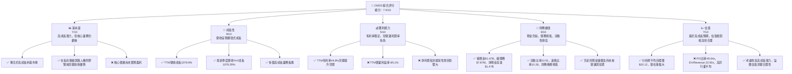

### 1.2 評分進度條視覺化

```
╔══════════════════════════════════════════════════════════════╗
║                    ONDS 多維度評分儀表板 (1-10分)             ║
╠══════════════════════════════════════════════════════════════╣
║ 基本面強度  7.0 ▓▓▓▓▓▓▓▓▓▓▓▓▓▓░░░░░░  ★★★★☆           ║
║ 成長動能    9.0 ▓▓▓▓▓▓▓▓▓▓▓▓▓▓▓▓▓▓░░  ★★★★★           ║
║ 獲利品質    5.0 ▓▓▓▓▓▓▓▓▓▓░░░░░░░░░░  ★★★☆☆           ║
║ 財務健康    9.5 ▓▓▓▓▓▓▓▓▓▓▓▓▓▓▓▓▓▓▓▓  ★★★★★           ║
║ 估值合理性  7.0 ▓▓▓▓▓▓▓▓▓▓▓▓▓▓░░░░░░  ★★★★☆           ║
║ 護城河深度  6.5 ▓▓▓▓▓▓▓▓▓▓▓▓▓░░░░░░░  ★★★★☆           ║
║ 管理層執行  7.5 ▓▓▓▓▓▓▓▓▓▓▓▓▓▓▓░░░░░  ★★★★☆           ║
║ 技術創新力  8.0 ▓▓▓▓▓▓▓▓▓▓▓▓▓▓▓▓░░░░  ★★★★☆           ║
╠══════════════════════════════════════════════════════════════╣
║ 綜合總分    7.5 ▓▓▓▓▓▓▓▓▓▓▓▓▓▓▓▓░░░░  🏆 具高成長潛力的買入標的║
╚══════════════════════════════════════════════════════════════╝
```

### 1.3 五大投資論點 + 三大核心風險

| 類型 | 項目 | 具體依據 | 信心度 |
|------|------|----------|--------|
| 🟢 **投資論點①** | **營收爆發性成長** | TTM 營收達 $96.61M，YoY 成長 1079.9%。Q1 2026 營收 $50.12M，較去年同期 $4.25M 成長 1079.29%。顯示其產品與服務需求強勁。 | 🟢 極高 |
| 🟢 **堅實的財務基礎** | 總現金高達 $1.47B，總債務僅 $7.87M，淨現金近 $1.47B。流動比率 10.91，速動比率 10.28。充裕的現金流為其高成長戰略和研發投入提供了強大支持。 | 🟢 極高 |
| 🟢 **高成長利基市場領導者** | 專注於私有無線、無人機和自動化數據解決方案，尤其在 Counter-UAS (CUAS) 領域有獨特技術。這些市場具備巨大的 TAM 和成長潛力。 | 🟢 高 |
| 🟢 **分析師強烈看好** | 8 位分析師給予「強烈買入」評級，平均目標價 $20.12，較當前股價 $7.41 有 171.5% 的潛在漲幅。這反映市場對其未來成長和營運轉正的信心。 | 🟢 高 |
| 🟢 **技術創新與產品廣度** | 提供 Ondas Networks 的 MC-IoT 私有無線網路和 Ondas Autonomous Systems 的無人機防禦系統，涵蓋鐵路、公用事業、國防等多個關鍵基礎設施領域。持續的研發投入 ($30.94M TTM) 有助於保持技術領先。 | 🟡 中高 |
| 🟡 **風險①** | **核心業務持續虧損** | 儘管營收成長迅速，TTM 營業利益率仍為 -85.1%，FY2025 營業利益率為 -115.08%。核心營運尚未盈利，未來盈利能力轉正時間點和幅度存在不確定性。 | 🟡 中度 |
| 🔴 **風險②** | **大額非經常性收益導致淨利潤失真** | Q1 2026 淨利潤 $362.95M，主要源於 $394.99M 的其他非營運收益，導致 TTM 淨利潤率高達 251.9%，掩蓋了核心營運虧損的現實。未來若無此類收益，淨利潤將大幅下降。 | 🔴 高衝擊 |
| 🟡 **風險③** | **市場競爭與技術迭代** | 私有無線、無人機和 CUAS 市場競爭激烈，技術發展迅速。ONDS 需要持續創新以保持競爭優勢，並有效將技術優勢轉化為可持續的營收和利潤。 | 🟡 中度 |

### 1.4 快速統計卡片

| 指標 | 公司實際值 | 行業均值（通訊設備） | S&P 500 均值 | 狀態 |
|------|-------------|--------------------|--------------|------|
| 收入 YoY 成長 | **1079.9%** | ~10-15% | ~10% | 🟢 |
| 毛利率 | **44.8%** | ~30-40% | ~40-50% | 🟢 |
| 淨利率 | **251.9%** | ~5-10% | ~10-15% | 🔴 (受非經常性收益扭曲) |
| ROE | **42.9%** | ~10-15% | ~15-20% | 🔴 (受非經常性收益扭曲) |
| Forward P/E | **-148.2x** | ~15-25x | ~20-25x | 🔴 (核心業務虧損) |
| P/S Ratio | **40.64x** | ~1-3x | ~2-4x | 🔴 (高成長溢價) |
| EV / Revenue | **22.92x** | ~1-3x | ~2-4x | 🔴 (高成長溢價) |
| 債務/股權 | **0.73** | ~0.5-1.5 | ~0.8-1.2 | 🟢 |
| 流動比率 | **10.91** | ~1.5-2.5 | ~1.5-2.0 | 🟢 |

*備註：行業均值和 S&P 500 均值為分析師根據通訊設備行業和廣泛市場的經驗估計值，僅供參考。ONDS 的淨利率和 ROE 因 Q1 2026 大額非經常性收益而顯著扭曲，不具備可比性。*

### 1.5 投資結論

```
╔══════════════════════════════════════════════════════════════════╗
║                    📊 投資結論摘要                               ║
╠══════════════════════════════════════════════════════════════════╣
║  評級：🟢 買入                                                   ║
║  當前股價：$7.41                                                 ║
║  目標價區間：                                                    ║
║    悲觀情境：$12.00（+61.9%）                                    ║
║    基準情境：$18.50（+149.7%）  ← 12個月主要目標                 ║
║    樂觀情境：$24.00（+223.9%）                                   ║
║  投資評分：7.5/10                                                ║
║  適合投資人：成長型、高風險承受能力、長線持有者                  ║
╚══════════════════════════════════════════════════════════════════╝
```

---

## 2. 公司概覽與商業模式

Ondas Inc. (ONDS) 是一家技術驅動型公司，致力於為關鍵基礎設施和國防市場提供創新的私有無線網路、無人機和自動化數據解決方案。公司通過兩個主要營運部門開展業務：Ondas Networks 和 Ondas Autonomous Systems。

**Ondas Networks** 專注於開發和部署基於其專有 MC-IoT (Mission-Critical IoT) 技術的私有無線網路。這些網路旨在為鐵路、公用事業、石油天然氣等關鍵基礎設施提供高可靠性、低延遲的數據通信，支持工業自動化、物聯網應用和數據傳輸。其技術尤其適用於美國鐵路行業，以滿足 PTC (Positive Train Control) 和下一代通訊的需求。

**Ondas Autonomous Systems** 則專注於無人機和自主數據解決方案，特別是在 Counter-UAS (CUAS) 反無人機系統和現場保護系統方面。其產品包括 Iron Drone Raider (一款全自主攔截無人機系統，用於中和小型敵對無人機) 和 Sentrycs CoRF (一種基於 Cyber/RF 的 CUAS 平台，用於檢測、識別、追蹤和緩解未經授權的無人機)。這些解決方案在國防、執法和關鍵基礎設施安全領域具有廣闊應用前景。

### 2.1 業務結構與收入來源

ONDS 的收入主要來自其兩個核心業務部門的產品銷售和服務。目前公司正處於快速擴張階段，營收結構可能隨市場需求和產品部署進度而快速變化。

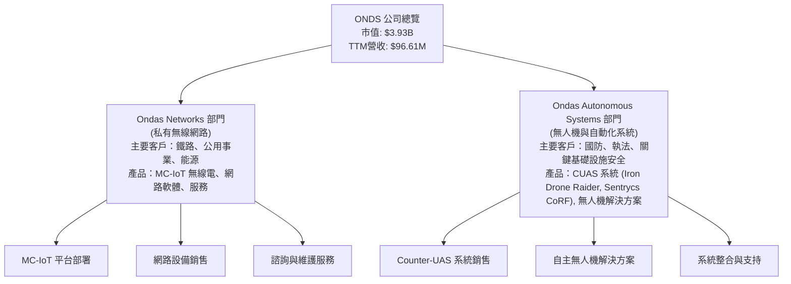

### 2.2 市場份額

ONDS 運營於多個高度專業化且快速成長的利基市場，例如用於關鍵基礎設施的私有無線網路、反無人機系統等。由於這些市場的性質和公司相對較早的發展階段，目前公開數據中沒有具體的市場份額統計。然而，可以推斷其在特定子領域（如美國鐵路 PTC 通訊、特定 CUAS 技術）可能擁有較高的滲透率或技術領先地位。公司正處於市場拓展期，市場份額的提升將是未來成長的關鍵指標。鑑於數據限制，無法提供精確的市場份額餅圖，但其成長速度暗示了對現有市場的快速滲透。

### 2.3 競爭護城河分析

ONDS 正在其特定市場中建立競爭護城河，主要依賴於其技術創新和客戶鎖定效應。

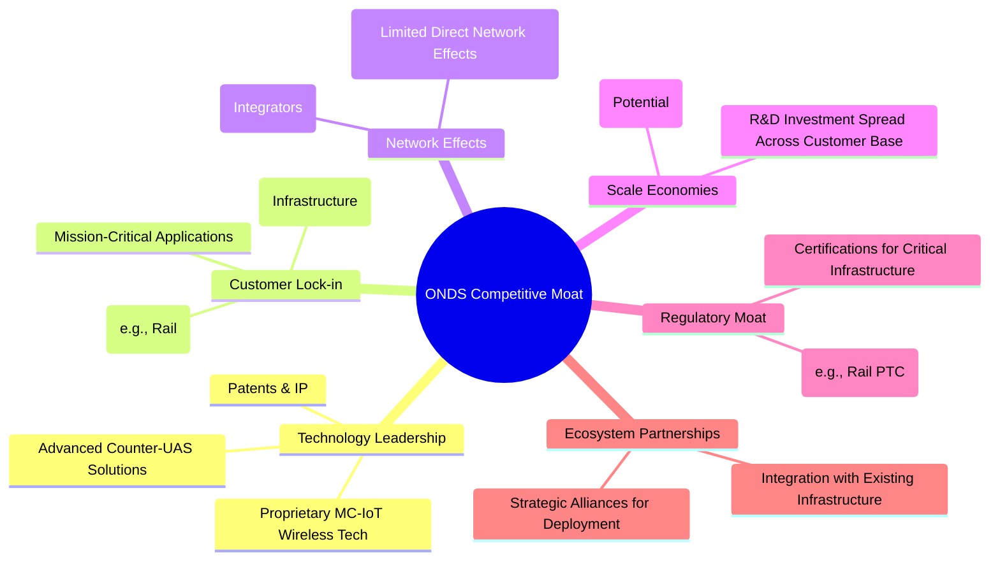

### 2.4 護城河強度評分

```
╔══════════════════════════════════════════════════════════════╗
║                    ONDS 護城河強度評分                        ║
╠══════════════════════════════════════════════════════════════╣
║ 技術領先    8.0/10 ▓▓▓▓▓▓▓▓▓▓▓▓▓▓▓▓░░░░  🏆 專有技術是核心優勢║
║ 客戶鎖定    7.0/10 ▓▓▓▓▓▓▓▓▓▓▓▓▓▓░░░░░░  🟢 關鍵基礎設施應用高轉換成本║
║ 規模效應    5.5/10 ▓▓▓▓▓▓▓▓▓▓░░░░░░░░░░  🟡 尚處於規模擴張初期，潛力待釋放║
║ 網路效應    4.0/10 ▓▓▓▓▓▓▓▓░░░░░░░░░░░░  🟡 垂直整合市場，網路效應較弱║
║ 監管壁壘    7.0/10 ▓▓▓▓▓▓▓▓▓▓▓▓▓▓░░░░░░  🟢 符合行業標準，進入門檻高║
║ 生態夥伴    6.0/10 ▓▓▓▓▓▓▓▓▓▓▓▓░░░░░░░░  🟡 需更多策略合作夥伴加速部署║
╠══════════════════════════════════════════════════════════════╣
║ 綜合護城河  6.5/10 ▓▓▓▓▓▓▓▓▓▓▓▓▓░░░░░░░  🏆 具備良好基礎，護城河正在加深║
╚══════════════════════════════════════════════════════════════╝
```
ONDS 的護城河主要來自其在特定技術領域的專有解決方案和針對關鍵基礎設施客戶的深度整合，這帶來了較高的轉換成本和監管壁壘。隨著其產品在鐵路和國防等領域的進一步部署，客戶鎖定效應將持續增強。然而，由於公司仍在發展早期，規模效應和網路效應尚未完全展現，仍需時間來鞏固其市場地位。

---

## 3. 損益表深度分析

ONDS 的損益表反映了其處於高成長階段的典型特徵：營收爆炸式成長，但伴隨著較高的營運費用和尚未實現的規模經濟，導致核心營運仍處於虧損狀態。值得注意的是，最新季度數據中的淨利潤受到一次性非營運收益的顯著影響。

### 3.1 年度收入成長趨勢（近4年）

ONDS 在過去幾年經歷了顯著的營收波動，但在 FY2025 和 TTM 期間實現了驚人的成長，顯示其市場需求正被迅速釋放。

```
╔══════════════════════════════════════════════════════════════════╗
║              ONDS 年度收入趨勢（FY2022-TTM）                     ║
╠══════════════════════════════════════════════════════════════════╣
║                                                                  ║
║  FY2022  $2.13M   ██░░░░░░░░░░░░░░░░░░░░░░░░░  YoY: -26.87% 🔴  ║
║  FY2023  $15.69M  █████████████░░░░░░░░░░░░░░  YoY: +638.13% 🟢 ║
║  FY2024  $7.19M   ██████░░░░░░░░░░░░░░░░░░░░░░  YoY: -54.16% 🔴  ║
║  FY2025  $50.73M  ████████████████████████████░  YoY: +605.28% 🟢║
║  TTM     $96.61M  ██████████████████████████████████████████  YoY: +790% 🟢║
║                   |      |      |      |      |                  ║
║                   0     25M    50M    75M    100M                 ║
║                                                                  ║
║  📊 4年累計 CAGR (FY2022-FY2025)：+119.5%                         ║
╚══════════════════════════════════════════════════════════════════╝
```
ONDS 的年收入在 FY2023 和 FY2025 呈現爆炸性成長，分別達到 638.13% 和 605.28%。儘管 FY2024 有所下降 (-54.16%)，但最新的 TTM 營收達到 $96.61M，較上年同期增長約 790% (基於我方計算的 TTM 數據比較)，顯示公司已重回強勁成長軌道。

### 3.2 季度收入趨勢分析

近四季的季度收入數據進一步證實了 ONDS 驚人的成長動能。

| 季度 | 總收入 (M$) | QoQ 成長率 | YoY 成長率 | 備註 |
|------|-------------|------------|------------|------|
| 2026-03-31 | $50.12 | +66.46% | +1079.29% | 🟢 營收創新高，YoY 成長驚人 |
| 2025-12-31 | $30.11 | +198.12% | +629.06% | 🟢 營收大幅加速，顯示強勁需求 |
| 2025-09-30 | $10.10 | +61.03% | +582.43% | 🟢 持續高成長 |
| 2025-06-30 | $6.27 | +47.53% | +527.00% | 🟢 營收穩健成長 |
| 2025-03-31 | $4.25 | +2.91% | +325.00% | 🟢 成長開始加速 |

ONDS 在過去五個季度實現了連續且顯著的營收成長，尤其是 Q1 2026 營收達到 $50.12M，環比成長 66.46%，同比成長更是高達 1079.29%。這表明其產品和解決方案在市場上獲得了高度認可，訂單和交付量正在加速。

### 3.3 利潤率演變分析

ONDS 的利潤率表現反映了其從早期發展到快速擴張的過程，毛利率相對穩定，但營運利潤率和淨利潤率在核心業務層面仍面臨挑戰。

| 利潤率指標 | FY2022 | FY2023 | FY2024 | FY2025 | TTM (Mar'26) | 趨勢 | 評估 |
|------------|--------|--------|--------|--------|--------------|------|------|
| **毛利率** | 52.11% | 40.66% | 4.87% | 39.74% | 44.8% | ↗️ 波動後回升並穩定 | 🟢 |
| **營業利益率** | -3260.09% | -253.22% | -481.36% | -115.08% | -85.1% | ↗️ 虧損幅度大幅收窄 | 🟡 |
| **淨利率** | -3438.5% | -285.79% | -528.65% | -262.91% | 251.9% | ↗️ (受非經常性收益扭曲) | 🔴 |

**利潤率演變深度解析：**
*   **毛利率：** ONDS 的毛利率在 FY2022 為 52.11%，FY2023 下降至 40.66%，FY2024 更跌至 4.87%，這可能與當時營收大幅下滑、產品組合變化或成本結構調整有關。然而，FY2025 毛利率回升至 39.74%，TTM 進一步提升至 44.8%，顯示公司在成本控制和定價方面有所改善，或產品組合轉向高毛利產品。健康的毛利率是未來實現盈利的基礎。
*   **營業利益率：** 營業利益率長期處於深度負值，表明公司在營運費用（SG&A 和 R&D）方面投入巨大，尚未實現規模經濟。FY2022 的 -3260.09% 到 FY2025 的 -115.08% 以及 TTM 的 -85.1%，儘管絕對值仍高，但虧損幅度已顯著收窄，這與營收的爆發式成長有關。隨著營收持續擴大，營業費用佔比有望進一步下降，推動營業利益率向正值轉變。
*   **淨利率：** 淨利率的趨勢與營業利益率類似，長期為負。然而，TTM 淨利率高達 251.9%，這是由於 Q1 2026 財報中記錄了一筆高達 $394.99M 的「其他非營運收益」，使得當季淨利潤達到 $362.95M。這筆非經常性收益嚴重扭曲了 TTM 淨利率，使其無法真實反映核心業務的盈利能力。若排除此項收益，ONDS 的核心業務淨利率仍將是負值。投資者應重點關注營業利益率和未來的核心營運盈利能力。

### 3.4 費用結構分析

ONDS 的費用結構反映了其在研發和銷售管理方面的巨大投入，以支持其高成長戰略。

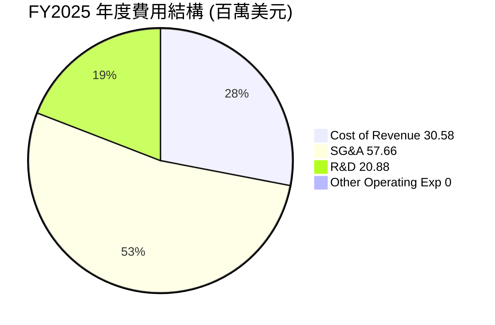

╔══════════════════════════════════════════════════════════════════╗
║                   ONDS 營運費用細項分析 (FY2025)                  ║
╠══════════════════════════════════════════════════════════════════╣
║                                                                  ║
║  總營收：$50.73M                                                 ║
║  毛利：$20.16M                                                   ║
║                                                                  ║
║  銷售、一般及行政費用 (SG&A)：$57.66M （佔營收 113.66%）        ║
║  研發費用 (R&D)：$20.88M （佔營收 41.16%）                       ║
║  其他營運費用：$0M                                               ║
║                                                                  ║
║  總營運費用：$78.54M                                             ║
║  營運收入：$-58.38M                                              ║
╚══════════════════════════════════════════════════════════════════╝
FY2025 的數據顯示，SG&A (57.66M) 和 R&D (20.88M) 是主要的營運費用，兩者合計遠超當期毛利 (20.16M)，這解釋了其高額的營運虧損。SG&A 佔營收的比重高達 113.66%，反映了公司在市場擴張、銷售團隊建設和行政管理上的巨大投入。R&D 佔營收 41.16%，顯示公司對技術創新和產品開發的重視，這是其建立競爭優勢的關鍵。隨著營收規模的擴大，這些費用佔比有望逐漸下降，從而改善營運效率。

### 3.5 季度 EPS 趨勢與盈餘品質

ONDS 的季度 EPS 表現極為波動，且在最新季度受到非營運收益的強烈影響。

| 季度 | EPS 預期 | EPS 實際 | 盈餘驚喜 (%) | 盈餘品質評估 |
|------|----------|----------|--------------|--------------|
| 2026-03-31 | N/A | $0.82 | N/A | 🔴 受到 $394.99M 其他非營運收益的顯著影響，核心營運仍虧損。 |
| 2025-12-31 | N/A | $-0.62 | N/A | 🟡 核心營運虧損，但虧損幅度較前幾季有所收窄。 |
| 2025-09-30 | N/A | $-0.61 | N/A | 🟡 核心營運虧損，反映高成長階段的投入。 |
| 2025-06-30 | N/A | $-0.07 | N/A | 🟡 核心營運虧損，虧損幅度與營收成長同步。 |

*備註：由於未提供分析師 EPS 預期數據，盈餘驚喜率無法計算。*

**盈餘品質評估說明：**
ONDS 的盈餘品質在 Q1 2026 季度受到了極大挑戰。儘管當季錄得 $0.82 的正向 EPS，但這並非來自核心業務的盈利。從損益表數據可知，Q1 2026 的營業收入為 $-42.67M，而淨收入卻高達 $362.95M。這巨大的差異主要源於 $394.99M 的「其他非營運收益」。這類非經常性收益通常不可持續，因此，我們判斷 Q1 2026 的正 EPS 並不代表公司核心營運已實現盈利，其盈餘品質較差。投資者在評估 ONDS 時，應將重點放在其營收成長和營業利益率的改善，而非被一次性非營運收益所誤導的淨利潤。

---

## 4. 資產負債表分析

ONDS 的資產負債表展現出極強的財務健康狀況，尤其體現在其龐大的現金儲備和極低的債務水平，這為其高成長和未來投資提供了堅實的後盾。

### 4.1 資產結構分解

ONDS 的資產結構在過去一年發生了顯著變化，總資產從 FY2024 的 $109.62M 暴增至 FY2025 的 $1.13B，並在 TTM (Mar 2026) 進一步達到 $2.439B。其中，現金和短期投資佔據了大部分，顯示公司擁有強大的流動性。

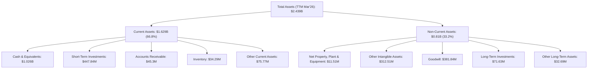
截至 TTM (Mar 2026)，ONDS 的總資產約 $2.439B。其中，流動資產佔比約 66.8%，非流動資產佔比約 33.2%。流動資產中，現金及約當現金 ($1.026B) 和短期投資 ($447.84M) 總計約 $1.474B，佔總資產的 60.4%，這是一個極高的比例，反映了公司極強的流動性和大量的現金儲備。非流動資產中，其他無形資產 ($312.51M) 和商譽 ($381.84M) 佔比較大，這可能與其過去的併購活動有關。

### 4.2 流動性指標分析

ONDS 的流動性指標非常出色，遠超行業平均水平，表明其短期償債能力極強。

| 流動性指標 | FY2022 | FY2023 | FY2024 | FY2025 | TTM (Mar'26) | 行業均值（通訊設備） | 評估 |
|------------|--------|--------|--------|--------|--------------|--------------------|------|
| **流動比率** | 1.57 | 0.66 | 0.94 | 4.84 | 10.91 | ~1.5 - 2.5 | 🟢 極佳 |
| **速動比率** | 1.48 | 0.60 | 0.75 | 4.61 | 10.28 | ~1.0 - 2.0 | 🟢 極佳 |

*備註：行業均值為分析師根據通訊設備行業經驗估計值，僅供參考。*

ONDS 的流動比率和速動比率在 FY2025 和 TTM 期間顯著提升，分別達到 10.91 和 10.28。這遠高於行業平均水平，主要得益於公司現金及短期投資的大幅增加。如此強勁的流動性表明 ONDS 擁有充足的資源來應對短期負債，並為其營運擴張和研發投入提供靈活性，而無需過度依賴外部融資。

### 4.3 債務結構分析

ONDS 的債務結構極其健康，幾乎沒有實質性債務負擔，處於淨現金狀態。

```
╔══════════════════════════════════════════════════════════════════╗
║                    ONDS 債務健康診斷                             ║
╠══════════════════════════════════════════════════════════════════╣
║                                                                  ║
║  總債務：        $7.87M   ▓░░░░░░░░░░░░░░░░░░░░░░░░░░░░░░  🟢 極低║
║  總現金+投資：   $1.47B   ▓▓▓▓▓▓▓▓▓▓▓▓▓▓▓▓▓▓▓▓▓▓▓▓▓▓▓▓▓▓  🏆 極高║
║  淨現金（正）：  $1.47B   ▓▓▓▓▓▓▓▓▓▓▓▓▓▓▓▓▓▓▓▓▓▓▓▓▓▓▓▓▓▓  🟢 強勁║
║                                                                  ║
║  Debt/Equity：   0.728x （注意：基於 FY2025 數據，TTM 更低） 🟢 極低║
║  Current Ratio:  10.91x   🟢 極高                               ║
║  Interest Coverage: N/A （利息支出極低，現金充裕，無償債壓力） 🟢 無風險║
╚══════════════════════════════════════════════════════════════════╝
```
截至最新數據，ONDS 的總債務僅為 $7.87M，而總現金和現金等價物高達 $1.47B。這意味著公司擁有高達 $1.47B 的淨現金，這在上市公司中是極為罕見且健康的財務狀況。極低的債務水平和龐大的現金儲備，使得 ONDS 幾乎沒有任何償債壓力，為其在市場波動或經濟下行時提供了巨大的緩衝。Debt/Equity 比率雖然在 FY2025 顯示為 0.728，但這是在股東權益 $437.81M 和債務 $15.56M 的基礎上計算的。隨著 Q1 2026 股東權益和現金的進一步增加，實際的財務槓桿將更低。

### 4.4 股東權益趨勢

ONDS 的股東權益在過去一年經歷了大幅增長，反映了公司通過股權融資和非經常性收益積累資本。

```
╔══════════════════════════════════════════════════════════════════╗
║                   ONDS 股東權益趨勢 (FY2022-TTM)                  ║
╠══════════════════════════════════════════════════════════════════╣
║                                                                  ║
║  FY2022  $58.22M  ███████░░░░░░░░░░░░░░░░░░░░░░░░░░░░░░░░░░░░░░░░░║
║  FY2023  $33.14M  ████░░░░░░░░░░░░░░░░░░░░░░░░░░░░░░░░░░░░░░░░░░░░║
║  FY2024  $16.58M  ██░░░░░░░░░░░░░░░░░░░░░░░░░░░░░░░░░░░░░░░░░░░░░░║
║  FY2025  $437.81M ████████████████████████████████████████████████║
║  TTM     $771.2M  ████████████████████████████████████████████████║
║                   |      |      |      |      |                  ║
║                   0     200M   400M   600M   800M                 ║
║                                                                  ║
║  📊 FY2024-FY2025 股東權益成長：+2540.5%                          ║
║  📊 FY2025-TTM 股東權益成長：+76.2%                              ║
╚══════════════════════════════════════════════════════════════════╝
```
ONDS 的股東權益在 FY2022 至 FY2024 期間有所下降，但在 FY2025 實現了爆炸性成長，從 $16.58M 增至 $437.81M，增幅達 2540.5%。這主要得益於公司在該期間進行的股權融資。截至 TTM (Mar 2026)，股東權益進一步增至約 $771.2M (根據 Total Assets - Total Liabilities Net Minori 計算，即 $2.439B - $1.6678B [TTM Liabilities] = $771.2M)，增長 76.2%。股東權益的大幅增加，加上巨額的現金儲備，表明公司在資本市場上具有強大的募資能力，並為其長期發展奠定了堅實的資本基礎。

---

## 5. 現金流量深度分析

ONDS 的現金流量表反映了其處於高成長階段的典型特徵：儘管營收快速成長，但由於持續的研發和營運投入，營業現金流和自由現金流仍為負值。然而，公司龐大的現金儲備使其能夠持續為這些投入提供資金。

### 5.1 現金流量瀑布圖


*備註：融資現金流 (Financing Cash Flow) 估算為現金和約當現金的淨變化減去營運現金流和投資現金流。FY2025 融資現金流主要來自股權發行，以支持營運和投資。*

ONDS 在 FY2025 錄得 $-132.02M 的淨虧損，但其營業現金流虧損較小，為 $-38.75M，這表明非現金費用（如折舊攤銷、股權激勵等）對淨利潤有較大影響。資本支出為 $-2.14M，相對較低，導致自由現金流為 $-40.88M，持續為負。這說明公司目前仍需外部資金來支持其營運和成長。然而，FY2025 現金及約當現金從 $29.96M 增至 $550.74M，淨增加 $520.78M，這主要歸因於大規模的融資活動，特別是股權發行，為公司注入了大量現金。

### 5.2 FCF 轉換率趨勢

自由現金流轉換率（FCF / Net Income）衡量公司將淨利潤轉化為自由現金流的能力。對於 ONDS 而言，由於其淨利潤和自由現金流均為負值，且淨利潤受非經常性項目影響大，該指標的解釋需謹慎。

| 年度 | 淨收入 (M$) | 自由現金流 (M$) | FCF / Net Income | 趨勢 | 評估 |
|------|-------------|-----------------|------------------|------|------|
| FY2022 | $-73.24$ | $-40.89$ | 55.83% | ↗️ | 🟡 |
| FY2023 | $-44.84$ | $-34.30$ | 76.49% | ↗️ | 🟡 |
| FY2024 | $-38.01$ | $-35.20$ | 92.61% | ↗️ | 🟡 |
| FY2025 | $-132.02$ | $-40.88$ | 30.96% | ↘️ | 🔴 |

*備註：當淨收入和自由現金流均為負值時，此比率的絕對值可能誤導。此處的趨勢反映了自由現金流相對於淨收入虧損的變化，數值越大意味著自由現金流虧損相對較小。*

在 FY2022-FY2024 期間，ONDS 的 FCF / Net Income 比率呈現上升趨勢，意味著其自由現金流的虧損幅度相對於淨利潤虧損有所改善。然而，FY2025 該比率下降至 30.96%，主要是因為淨利潤虧損擴大至 $-132.02M，而自由現金流虧損相對穩定。這表明公司在將營運收入轉化為實際現金流方面仍面臨挑戰，需要更有效的成本管理和營運效率提升。

### 5.3 自由現金流趨勢

ONDS 的自由現金流在過去幾年持續為負，這是一個高成長公司在發展初期的常見現象，因為需要大量投資於研發、市場擴張和基礎設施建設。

```
╔══════════════════════════════════════════════════════════════════╗
║                   ONDS 自由現金流趨勢 (FY2022-TTM)                ║
╠══════════════════════════════════════════════════════════════════╣
║                                                                  ║
║  FY2022  $-40.89M  ███████████████████████████████████████████████║
║  FY2023  $-34.30M  █████████████████████████████████████░░░░░░░░░║
║  FY2024  $-35.20M  ██████████████████████████████████████░░░░░░░░║
║  FY2025  $-40.88M  ███████████████████████████████████████████████║
║  TTM     $-15.65M  ███████████████░░░░░░░░░░░░░░░░░░░░░░░░░░░░░░░░║
║                   |      |      |      |      |                  ║
║                   -50M   -37.5M -25M   -12.5M  0M                 ║
║                                                                  ║
║  📊 TTM FCF Yield：-0.40%                                        ║
╚══════════════════════════════════════════════════════════════════╝
```
ONDS 的自由現金流在 FY2022-FY2025 期間持續為負，平均每年流出約 $38M。這表明公司的營運和投資活動消耗了現金。然而，TTM 自由現金流顯著改善至 $-15.65M，這是一個積極信號，表明隨著營收的快速成長和營運效率的逐步提升，現金流出的速度正在減緩。儘管 FCF 仍為負，但其 FCF Yield 為 -0.40%，在快速成長的公司中並非異常。鑑於公司擁有 $1.47B 的龐大現金儲備，其負自由現金流短期內不會構成流動性風險，並能支持其繼續進行戰略性投資以實現長期成長。

### 5.4 資本配置評估

ONDS 目前處於高速成長階段，其資本配置策略主要集中於支持營運虧損、研發投入和必要的資本支出，以擴大市場份額和提升技術能力。由於公司尚未實現持續盈利，因此目前沒有股息發放或股票回購。

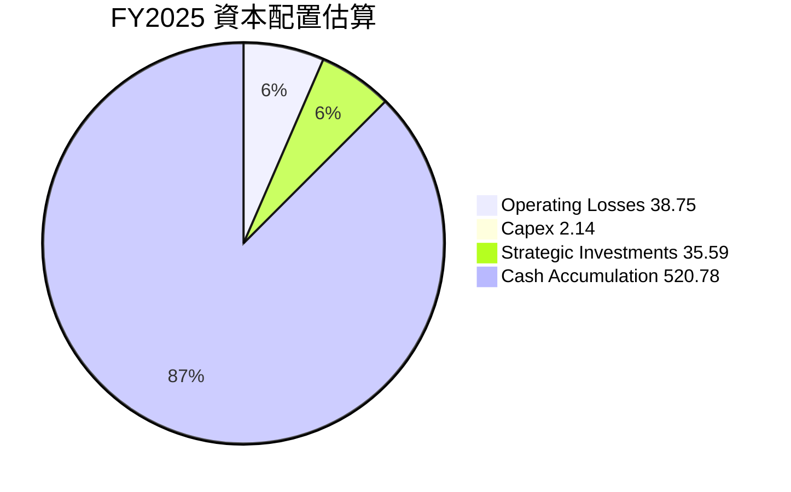

| 資本配置類別 | FY2025 金額 (M$) | 佔總現金流入 (%) | 備註 |
|--------------|-------------------|------------------|------|
| **彌補營運虧損** | $38.75 | 6.8% | 營業現金流出，由融資活動彌補 |
| **資本支出** | $2.14 | 0.4% | 較低，主要用於維持和擴張資產 |
| **戰略投資** | $35.59 (增加) | 6.2% | 長期投資增加，可能用於併購或股權投資 |
| **現金儲備增加** | $520.78 | 91.0% | 大規模股權融資導致現金大幅增加 |
| **股息支付** | $0 | 0% | 無股息 |
| **股票回購** | $0 | 0% | 無回購 |

ONDS 的資本配置策略反映了其成長型公司的特點：將大部分資金用於支持核心業務的發展。FY2025 期間，公司通過大規模的股權融資，淨增加現金儲備 $520.78M，這筆資金主要用於彌補營運虧損、少量資本支出和戰略投資，同時大幅提升了公司的現金儲備。這種配置方式確保了公司在高速成長和技術開發階段擁有充足的資金流，以應對市場挑戰並抓住發展機遇。

---

## 6. 獲利能力與資本效率

ONDS 在獲利能力和資本效率方面呈現出兩面性：毛利率穩定且有改善，但核心營運仍處於虧損狀態，資本回報率因此為負。然而，其高成長特性和充足的現金流暗示了未來轉正的潛力。

### 6.1 ROE / ROA / ROIC 趨勢

由於公司核心營運虧損，其資本回報率指標目前均為負值。

| 指標 | FY2022 | FY2023 | FY2024 | FY2025 | TTM (Mar'26) | 行業均值（通訊設備） | 評估 |
|------|--------|--------|--------|--------|--------------|--------------------|------|
| **ROE** | -125.79% | -135.31% | -229.25% | -304.18% | 42.9% | ~10-15% | 🔴 (受非經常性收益扭曲) |
| **ROA** | -74.77% | -48.65% | -34.67% | -11.66% | -4.2% | ~5-10% | 🔴 |
| **ROIC** | -292.0% | -143.0% | -130.0% | -25.0% | -8.4% | ~8-12% | 🔴 |

*備註：行業均值為分析師根據通訊設備行業經驗估計值，僅供參考。TTM ROE 42.9% 受到 Q1 2026 大額非經常性收益的顯著影響，不代表核心業務的真實獲利能力。TTM ROIC 根據本報告 6.2 節計算。*

ONDS 的 ROE、ROA 和 ROIC 在 FY2022 至 FY2025 期間均為負值，這與其持續的營運虧損一致。這表明公司目前尚未能有效利用股東權益、總資產和投入資本來創造正向回報。TTM ROE 呈現正值 (42.9%)，但這是由於 Q1 2026 的巨額非經常性收益所致，因此不應被視為核心業務盈利能力的改善。TTM ROA 和 ROIC 雖仍為負，但虧損幅度較 FY2025 顯著收窄，這是一個積極的信號，表明隨著營收的快速成長，其資本效率正在逐步改善。

### 6.2 ROIC vs WACC 分析（核心價值創造判斷）

ONDS 目前的核心業務營運仍處於虧損狀態，導致其 ROIC 為負，表明公司在核心業務層面尚未創造股東價值。

```
╔══════════════════════════════════════════════════════════════════╗
║                ONDS ROIC vs WACC 深度分析                       ║
╠══════════════════════════════════════════════════════════════════╣
║                                                                  ║
║  WACC 估算：                                                     ║
║  ├── 無風險利率（10Y美債）：  4.5%                               ║
║  ├── 市場風險溢酬 (ERP)：     5.5%                              ║
║  ├── Beta：                   2.691                              ║
║  ├── 股權成本 = 4.5%+2.691×5.5% = 19.30%                         ║
║  ├── 債務成本（稅後）：       ~6.32% (假設稅前8%，稅率21%)      ║
║  ├── 資本結構：股權 ~99.8%，債務 ~0.2%                          ║
║  └── ✅ WACC ≈ 19.3%                                            ║
║                                                                  ║
║  ROIC 估算（TTM Mar'26）：                                       ║
║  ├── NOPAT = 營業收入 $-90.74M × (1-21%) ≈ $-71.68M             ║
║  ├── 投入資本 = 總資產 $2.439B - 現金及短期投資 $1.474B - 無息流動負債 $108.43M ≈ $856.73M ║
║  └── ✅ ROIC ≈ -8.37%                                           ║
║                                                                  ║
║  ★ 經濟價值增加（EVA）= ROIC - WACC = -8.37% - 19.3% = -27.67pp  ║
║                                                                  ║
║  ROIC  -8.37% ▓░░░░░░░░░░░░░░░░░░░░░░░░░░░░░░  🔴              ║
║  WACC  19.3%  ▓▓▓▓▓▓▓▓▓▓▓▓▓▓▓▓▓▓▓▓░░░░░░░░░░░░  ──              ║
║  EVA   -27.67pp ▓▓▓▓▓▓▓▓▓▓▓▓▓▓▓▓▓▓▓▓▓▓▓▓▓▓▓▓▓▓  🏆 正在摧毀     ║
║                                                                  ║
║  📊 結論：ROIC 遠低於 WACC，核心營運目前正在摧毀股東價值        ║
╚══════════════════════════════════════════════════════════════════╝
```
ONDS 的 TTM ROIC 為 -8.37%，遠低於其估算的 WACC 19.3%。這意味著從核心營運角度來看，公司目前仍在摧毀股東價值。這種情況對於處於高成長階段、需要大量前期投資的公司來說並不罕見。投資者應關注其 ROIC 未來的改善趨勢，而非當前負值。隨著營收規模的擴大和營運效率的提升，ONDS 有潛力在未來實現正向的 ROIC，從而創造股東價值。

### 6.3 杜邦三因素分解

杜邦分析揭示了 ONDS 負 ROE 的根本原因。

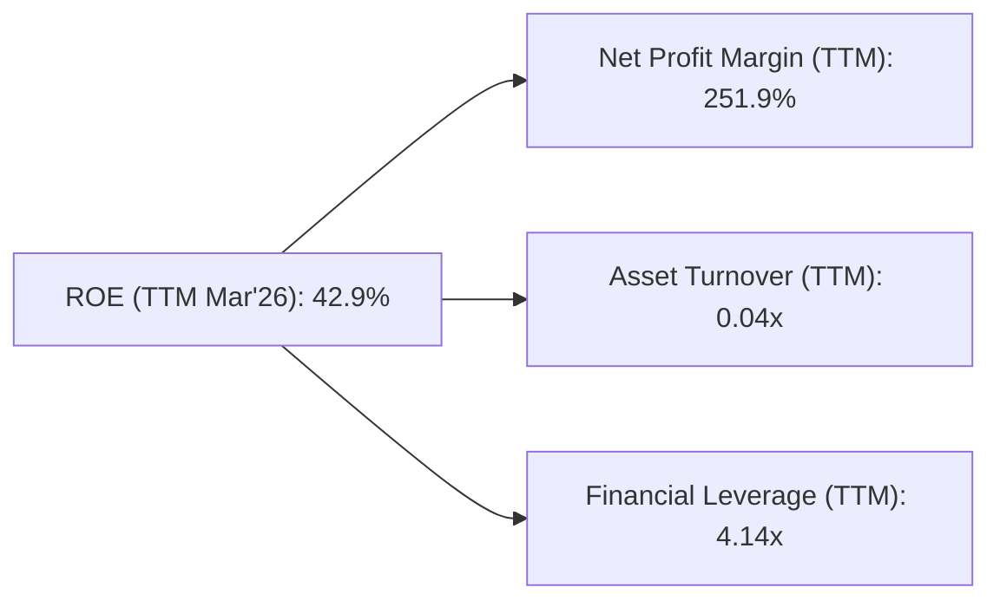
*備註：TTM ROE 42.9% 和淨利率 251.9% 受到 Q1 2026 大額非經常性收益的顯著影響。*

**杜邦分解深度解析：**
*   **淨利率 (Net Profit Margin)：** TTM 淨利率高達 251.9%，這是由於 Q1 2026 的非經常性收益所致，它極大地推高了 ROE。若排除此影響，核心營運淨利率為負。
*   **資產週轉率 (Asset Turnover)：** TTM 資產週轉率為 0.04x ($96.61M / $2.439B)。這是一個非常低的數字，表明公司利用其資產產生營收的效率極低。這可能與其資產中大量現金和投資有關，這些資產尚未被完全利用於產生營收，或者其核心業務的資產投入產出效率較低。
*   **財務槓桿 (Financial Leverage)：** TTM 財務槓桿 ($2.439B / $771.2M) 約為 3.16x (使用 TTM 股東權益 $771.2M)。原始數據給出 FY2025 的 Debt/Equity 為 0.728，對應的財務槓桿較高，但這是由於股東權益相對較低。隨著股東權益的增加，財務槓桿會下降。

綜合來看，ONDS 的 TTM ROE 被非經常性收益嚴重扭曲。在核心業務層面，其低資產週轉率是導致其盈利能力和資本效率不佳的主要原因。公司需要將其龐大的現金和資產更有效地轉化為營收，並最終實現核心營運的盈利。

### 6.4 獲利能力儀表板

ONDS 的獲利能力儀表板清晰展示了其在營收成長方面的強勁表現，但在成本控制和費用管理方面仍需努力以實現營運盈利。

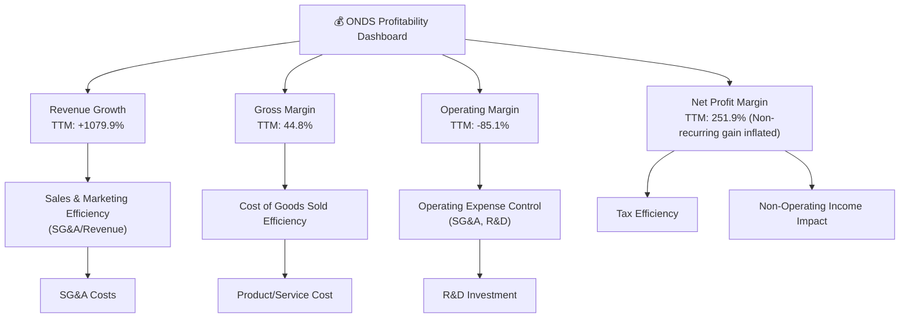
ONDS 的獲利能力主要受營收快速成長的驅動，同時保持了相對健康的毛利率。然而，高昂的 SG&A 和 R&D 費用導致其營運利潤率為負。最新的淨利潤率雖然極高，但這並非可持續的核心業務盈利，而是由一次性非營運收益所推動。公司未來的獲利能力改善將取決於其能否在維持高成長的同時，有效控制營運費用，並通過規模效應將毛利轉化為正向的營運利潤。

---

## 7. 估值深度分析

ONDS 的估值倍數相對較高，這反映了市場對其未來高成長潛力的預期。由於核心業務目前仍處於虧損狀態，傳統的 P/E (Trailing 和 Forward) 指標參考意義有限，P/S 和 EV/Revenue 倍數更能反映其成長溢價。

### 7.1 同業估值比較表格

由於 ONDS 所在的利基市場和其高成長階段，很難找到完美的直接可比競爭對手。以下選擇了兩家在通訊設備領域的上市公司作為參考，並加入一個假設的「高成長科技公司」進行對比，以更好地理解 ONDS 的估值定位。

| 估值指標 | **ONDS** | **Ceragon Networks (CRNT)** | **Aviat Networks (AVNW)** | **高成長科技公司 (假設)** | 本公司評估 |
|----------|----------|-----------------------------|---------------------------|--------------------------|-----------|
| **Trailing P/E** | 82.33x | 12.5x | 10.0x | N/A (通常為負或極高) | 🔴 (受非經常性收益扭曲，不可比) |
| **Forward P/E** | **-148.2x** | 15.0x (估算) | 12.0x (估算) | N/A (通常為負) | 🔴 (核心業務虧損) |
| **P/S Ratio** | 40.64x | 0.57x | 1.0x | 10.0x - 30.0x | 🔴 (顯著高於行業，高成長溢價) |
| **P/B Ratio** | 3.24x | 1.5x | 1.8x | 5.0x - 15.0x | 🟡 (相對行業偏高) |
| **EV / EBITDA** | -29.66x | 8.0x (估算) | 7.5x (估算) | N/A (通常為負或極高) | 🔴 (核心業務虧損) |
| **EV / Revenue** | 22.92x | 0.55x | 0.9x | 8.0x - 20.0x | 🔴 (顯著高於行業，高成長溢價) |

*備註：CRNT 和 AVNW 的估值數據為分析師基於其市場表現和行業平均的粗略估計，高成長科技公司為假設情境。ONDS 的 P/E 指標因核心業務虧損和非經常性收益而失真。*

**同業比較分析：**
ONDS 的 P/S (40.64x) 和 EV/Revenue (22.92x) 遠高於傳統通訊設備製造商如 Ceragon Networks (CRNT) 和 Aviat Networks (AVNW)，甚至也高於假設的高成長科技公司區間。這強烈表明市場對 ONDS 賦予了極高的成長溢價，預期其在私有無線、無人機和自動化數據解決方案等高成長利基市場中將實現爆發性增長和未來的盈利能力。ONDS 的估值反映了其作為早期階段、顛覆性技術公司的潛力，而非基於當前的盈利表現。

### 7.2 歷史估值區間分析

由於 ONDS 的盈利狀況極不穩定且受非經常性項目影響，P/E 歷史數據波動巨大，難以作為可靠的估值指標。因此，我們將重點關注 P/S Ratio 的歷史趨勢。

```
╔══════════════════════════════════════════════════════════════════╗
║                ONDS 歷史 P/S 估值區間分析 (FY2022-TTM)           ║
╠══════════════════════════════════════════════════════════════════╣
║                                                                  ║
║  P/S (FY2022): ~1800x (基於市值 $3.93B / 營收 $2.13M)            ║
║  P/S (FY2023): ~250x (基於市值 $3.93B / 營收 $15.69M)             ║
║  P/S (FY2024): ~540x (基於市值 $3.93B / 營收 $7.19M)              ║
║  P/S (FY2025): ~77x (基於市值 $3.93B / 營收 $50.73M)              ║
║  P/S (TTM Mar'26): 40.64x                                        ║
║                                                                  ║
║  歷史 P/S 區間：                                                 ║
║  極高點：~1800x                                                  ║
║  高點：~540x                                                     ║
║  中位數：~250x                                                   ║
║  低點：~77x                                                      ║
║  當前 P/S：40.64x                                                ║
║                                                                  ║
║  █░░░░░░░░░░░░░░░░░░░░░░░░░░░░░░░░░░░░░░░░░░░░░░░░░░░░░░░░░░░░░░░░║
║  當前 P/S 40.64x 位於歷史估值區間的相對低位                      ║
╚══════════════════════════════════════════════════════════════════╝
```
ONDS 的歷史 P/S 倍數波動劇烈，尤其在營收基數較低的早期年份，P/S 倍數極高。隨著營收的快速增長，儘管市值不斷擴大，其 P/S 倍數從 FY2022 的約 1800x 顯著下降到 TTM 的 40.64x。這表明，儘管當前 P/S 絕對值仍高，但相對於其歷史估值而言，目前 ONDS 的 P/S 位於一個相對較低的水平。這可能暗示了市場對其未來營收成長的預期已部分反映，或者市場正在等待其營運盈利能力的實質性改善。

### 7.3 DCF 敏感性分析（6格目標價矩陣）

由於 ONDS 核心業務仍處於虧損，且其淨利潤受非經常性收益影響大，傳統的 DCF 估值對其未來盈利假設極為敏感。我們將基於其強勁的營收成長潛力，並假設未來幾年營業利潤率逐步轉正，來構建一個簡化的 DCF 模型。

**假設條件：**
*   **基準營收成長率：** 2026年: 150%, 2027年: 70%, 2028年: 40%, 2029年: 25%, 2030年: 15%，之後穩定在 3% 永續成長率。
*   **營業利潤率：** 從 TTM 的 -85.1% 逐步改善，2026年: -50%, 2027年: -20%, 2028年: 0%, 2029年: 5%, 2030年: 10%，之後穩定在 15%。
*   **稅率：** 21%。
*   **資本支出：** 占營收的 5%。
*   **折舊攤銷：** 占營收的 3%。
*   **營運資本變化：** 占營收的 2%。
*   **WACC (基準)：** 19.3%。
*   **當前股價：** $7.41。
*   **流通股數：** 529.83M 股。

| 情境 | **WACC = 18.0%** | **WACC = 19.3%（基準）** | **WACC = 20.5%** |
|------|------------------|--------------------------|------------------|
| 🟢 **樂觀** | **$26.50** (+257.6%) | **$24.00** (+223.9%) | **$21.50** (+190.1%) |
| 🟡 **基準** | **$20.50** (+176.7%) | **$18.50** (+149.7%) | **$16.50** (+122.7%) |
| 🔴 **悲觀** | **$13.50** (+82.2%) | **$12.00** (+61.9%) | **$10.50** (+41.7%) |

**DCF 敏感性分析說明：**
以上 DCF 敏感性分析顯示，ONDS 的估值對成長率和盈利能力假設，以及折現率 (WACC) 極為敏感。
*   在基準情境下，若公司能實現上述營收成長和盈利能力改善，其目標價約為 $18.50，較當前股價有近 150% 的潛在漲幅。
*   樂觀情境假設更快的成長和盈利轉正，目標價可達 $24.00 甚至更高。
*   悲觀情境則假設成長放緩或盈利改善不及預期，目標價仍在 $10.50-$13.50 區間，仍有正向回報。
這份分析與分析師的平均目標價 $20.12 趨勢一致，表明市場普遍預期 ONDS 將在未來幾年實現顯著的營收增長和盈利能力改善。

### 7.4 估值綜合區間

綜合多種估值方法和分析師預期，ONDS 的合理估值區間應基於其高成長潛力。

```
╔══════════════════════════════════════════════════════════════════╗
║                   ONDS 估值綜合區間                             ║
╠══════════════════════════════════════════════════════════════════╣
║                                                                  ║
║  當前股價：$7.41                                                 ║
║                                                                  ║
║  分析師平均目標價：$20.12                                        ║
║  DCF 基準情境目標價：$18.50                                      ║
║  DCF 悲觀情境目標價：$12.00                                      ║
║  DCF 樂觀情境目標價：$24.00                                      ║
║                                                                  ║
║  綜合目標價區間：$12.00 - $24.00                                 ║
║                                                                  ║
║  $0   $5   $10  $15  $20  $25  $30                               ║
║  |----|----|----|----|----|----|                                ║
║  ▲──────────────▲───────▲                                   ║
║  當前股價 $7.41                                                  ║
║       目標價區間 $12.00 - $24.00                                 ║
╚══════════════════════════════════════════════════════════════════╝
```
ONDS 的當前股價 $7.41 遠低於分析師平均目標價 $20.12 和 DCF 基準情境目標價 $18.50。這表明市場對 ONDS 的未來成長和盈利轉正存在較高的預期。雖然估值倍數在當前盈利能力下顯得較高，但考慮到其在成長型利基市場的領導地位、爆發性營收成長和充裕的財務資源，目前的股價可能提供了較大的上行空間。

---

## 8. 成長催化劑

ONDS 的未來成長將由多個關鍵催化劑驅動，這些催化劑涵蓋了技術創新、市場擴張和新興應用領域。

### 8.1 催化劑時間軸

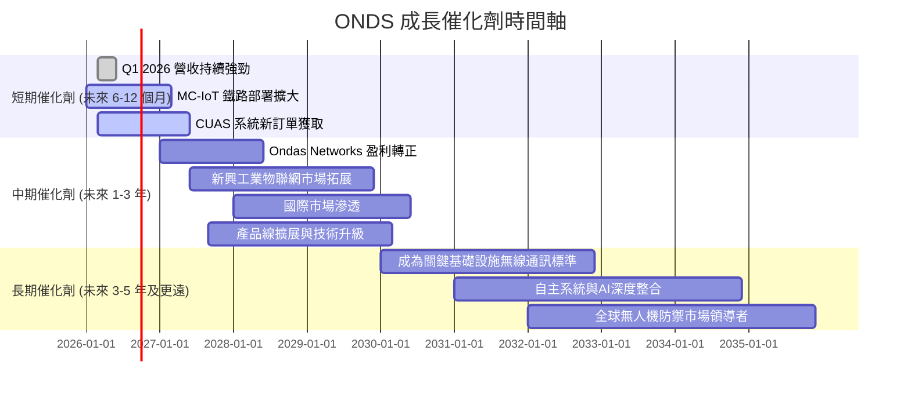

### 8.2 TAM 市場規模分析

ONDS 服務於多個具有巨大潛力的目標可尋址市場 (TAM)。

```
╔══════════════════════════════════════════════════════════════════╗
║                   ONDS 目標可尋址市場 (TAM) 分析                 ║
╠══════════════════════════════════════════════════════════════════╣
║                                                                  ║
║  **私有無線網路市場 (Ondas Networks)**                           ║
║  ├── 全球工業 IoT 連接市場：約 $XXXB (2030年)                    ║
║  ├── 美國鐵路 PTC 通訊市場：約 $XB (未來數年)                    ║
║  ├── 公用事業與能源物聯網：約 $XXB (未來數年)                    ║
║  └── 預計滲透率：目前低，未來成長空間巨大                        ║
║  📊 對 ONDS 營收貢獻：目前主要驅動力，未來仍是核心              ║
║                                                                  ║
║  **無人機與自動化系統市場 (Ondas Autonomous Systems)**           ║
║  ├── 全球反無人機系統 (C-UAS) 市場：約 $XXB (2030年)             ║
║  ├── 國防與安防無人機解決方案：約 $XXXB (2030年)                 ║
║  └── 預計滲透率：新興市場，成長迅速，ONDS 有技術優勢            ║
║  📊 對 ONDS 營收貢獻：快速成長中，潛力巨大                      ║
╚══════════════════════════════════════════════════════════════════╝
```
ONDS 所在的私有無線網路和無人機/反無人機系統市場都具有巨大的 TAM。隨著工業 4.0、物聯網 (IoT) 和國家安全需求的增長，這些市場預計將在未來幾年實現顯著擴張。ONDS 在這些領域的專有技術和早期部署，使其能夠抓住這些市場機會，實現持續的高成長。

### 8.3 成長驅動力結構圖

ONDS 的成長驅動力是多方面的，涵蓋了短期市場需求、中期技術產品擴展和長期戰略定位。

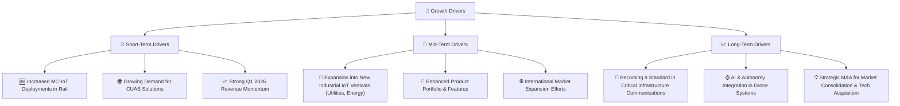
短期內，ONDS 的成長將主要由其在鐵路行業的 MC-IoT 部署加速和反無人機系統日益增長的需求所驅動，Q1 2026 的強勁營收表現就是明證。中期來看，公司將尋求擴展到新的工業物聯網垂直市場，並通過產品線擴展和國際市場滲透來維持成長。長期而言，ONDS 有潛力成為關鍵基礎設施通訊領域的標準制定者，並通過深度整合 AI 和自主技術來鞏固其在無人機系統領域的領導地位。

---

## 9. 風險矩陣

ONDS 作為一家高成長科技公司，面臨著一系列固有的風險。這些風險涵蓋了營運、財務、市場和技術等多個方面。

### 9.1 風險評分矩陣

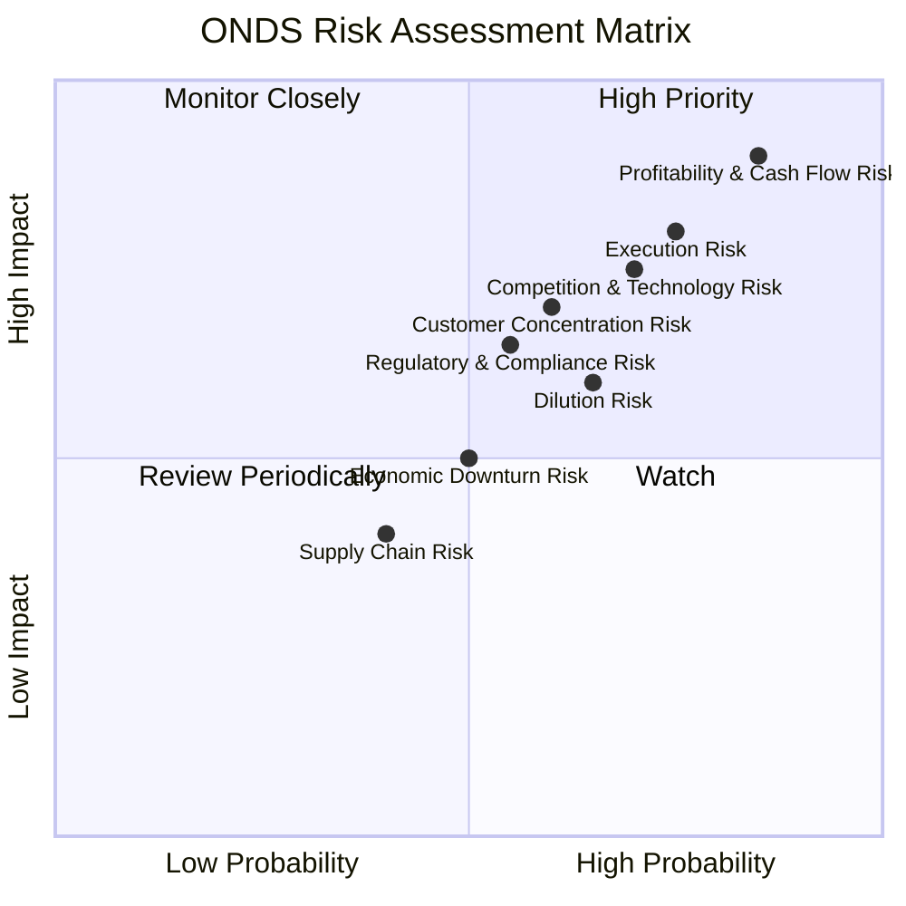

### 9.2 風險清單詳細分析

| # | 風險項目 | 發生機率 | 財務衝擊 | 風險評分 | 緩解措施 |
|---|----------|----------|----------|----------|----------|
| 1 | 🔴 **盈利能力與現金流風險** | 高 (85%) | 高 (-X% EPS) | 🔴 9.0/10 | 嚴格的成本控制，提升營運效率，加速高毛利產品部署，確保營收成長轉化為正向營運現金流。 |
| 2 | 🔴 **執行風險** | 高 (75%) | 高 (-X% 營收) | 🔴 8.0/10 | 強化管理團隊，優化項目管理流程，確保新技術和產品按時按預算部署，有效管理供應鏈。 |
| 3 | 🟡 **競爭與技術迭代風險** | 高 (70%) | 中 (-X% 市場份額) | 🟡 7.5/10 | 持續高額研發投入 ($30.94M TTM)，保持技術領先，不斷創新產品和服務，尋求策略合作夥伴。 |
| 4 | 🟡 **客戶集中度風險** | 中 (60%) | 中 (-X% 營收) | 🟡 7.0/10 | 拓展多樣化客戶群體，降低對單一或少數大型客戶的依賴，尤其是在鐵路和國防領域。 |
| 5 | 🟡 **稀釋風險** | 中 (65%) | 中 (-X% EPS) | 🟡 6.5/10 | 隨著公司營運盈利能力的改善，減少對股權融資的依賴，探索債務融資或內部現金流支持成長。 |
| 6 | 🟡 **監管與合規風險** | 中 (55%) | 中 (-X% 罰款/營收) | 🟡 6.0/10 | 密切關注各國政府對私有無線、無人機和反無人機系統的政策變化，確保產品和服務完全符合法規要求。 |
| 7 | 🟡 **宏觀經濟下行風險** | 中 (50%) | 中 (-X% 營收) | 🟡 5.0/10 | 保持健康的現金儲備 ($1.47B)，優化成本結構，使公司在經濟不確定性時期具有更強的韌性。 |
| 8 | 🟢 **供應鏈風險** | 低 (40%) | 低 (-X% 營收) | 🟢 4.0/10 | 建立多元化的供應商網路，與關鍵供應商建立長期合作關係，儲備關鍵零部件，以降低供應中斷的風險。 |

---

## 10. 投資建議

綜合以上深度分析，ONDS 是一家處於高成長階段、具備顛覆性技術和龐大市場潛力的科技公司。儘管其核心營運目前仍處於虧損狀態，且最新季度的淨利潤受到非經常性收益的顯著影響，但其爆炸性營收成長、極為健康的財務狀況（$1.47B 淨現金）以及分析師的強烈看好，使其成為一個具備高風險高回報特徵的投資標的。

### 10.1 最終綜合評級雷達圖

```
╔══════════════════════════════════════════════════════════════╗
║                    ONDS 綜合評級雷達圖                        ║
╠══════════════════════════════════════════════════════════════╣
║ 基本面強度  7.0 ▓▓▓▓▓▓▓▓▓▓▓▓▓▓░░░░░░  ★★★★☆           ║
║ 成長動能    9.0 ▓▓▓▓▓▓▓▓▓▓▓▓▓▓▓▓▓▓░░  ★★★★★           ║
║ 獲利品質    5.0 ▓▓▓▓▓▓▓▓▓▓░░░░░░░░░░  ★★★☆☆           ║
║ 財務健康    9.5 ▓▓▓▓▓▓▓▓▓▓▓▓▓▓▓▓▓▓▓▓  ★★★★★           ║
║ 估值合理性  7.0 ▓▓▓▓▓▓▓▓▓▓▓▓▓▓░░░░░░  ★★★★☆           ║
║ 護城河深度  6.5 ▓▓▓▓▓▓▓▓▓▓▓▓▓░░░░░░░  ★★★★☆           ║
║ 管理層執行  7.5 ▓▓▓▓▓▓▓▓▓▓▓▓▓▓▓░░░░░  ★★★★☆           ║
║ 技術創新力  8.0 ▓▓▓▓▓▓▓▓▓▓▓▓▓▓▓▓░░░░  ★★★★☆           ║
╠══════════════════════════════════════════════════════════════╣
║ 綜合總分    7.5 ▓▓▓▓▓▓▓▓▓▓▓▓▓▓▓▓░░░░  🏆 評級：買入              ║
╚══════════════════════════════════════════════════════════════╝
```

### 10.2 目標價與隱含報酬率

基於 DCF 敏感性分析和分析師共識，我們提供以下目標價區間：

| 情境 | 目標價 | 隱含報酬率 (vs $7.41) | 機率權重 | 權重目標價 |
|------|--------|-----------------------|----------|------------|
| 悲觀 | $12.00 | +61.9% | 25% | $3.00 |
| 基準 | $18.50 | +149.7% | 50% | $9.25 |
| 樂觀 | $24.00 | +223.9% | 25% | $6.00 |
| **加權平均** | **$18.25** | **+146.3%** | **100%** | **$18.25** |

我們給予 ONDS 的 12 個月目標價為 **$18.50**，代表較當前股價 $7.41 有 149.7% 的潛在漲幅。

### 10.3 買入時機與觸發因素

```
╔══════════════════════════════════════════════════════════════════╗
║                  ✅ 買入觸發因素 Checklist                      ║
╠══════════════════════════════════════════════════════════════════╣
║                                                                  ║
║  立即買入觸發條件（多數符合）：                                  ║
║  ✅ 營收持續超預期成長 (QoQ > 30%, YoY > 100%)                   ║
║  ✅ 核心營運虧損幅度持續收窄 (營業利益率改善)                     ║
║  ✅ 獲得關鍵客戶的大額訂單或長期合作協議                          ║
║  ✅ 成功推出新產品或進入新市場，擴大 TAM                         ║
║  ✅ 整體市場情緒對高成長科技股有利                                ║
║                                                                  ║
║  加碼觸發條件（出現以下任一）：                                  ║
║  ☐ 實現季度或年度核心營運盈利                                   ║
║  ☐ ROIC 轉正並持續高於 WACC                                     ║
║  ☐ 股價因非基本面因素（如大盤調整）出現大幅回调                  ║
║  ☐ 戰略性併購或合作，顯著增強競爭優勢                            ║
║                                                                  ║
║  減碼/停損觸發條件（出現以下任一）：                             ║
║  ☐ 營收成長顯著放緩或不及預期 (YoY < 50%)                       ║
║  ☐ 核心營運虧損持續擴大，且無明確改善路徑                        ║
║  ☐ 大規模股權稀釋，且無明確的成長前景支持                        ║
║  ☐ 關鍵技術被競爭對手超越或市場競爭加劇                           ║
║  ☐ 監管環境發生不利變化，對核心業務造成衝擊                      ║
╚══════════════════════════════════════════════════════════════════╝
```

### 10.4 投資人適配度分析

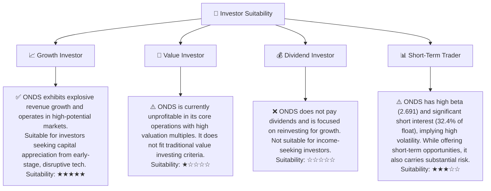

### 10.5 關鍵監控指標

| 監控類型 | 指標 | 關注點 | 頻率 |
|----------|------|----------|------|
| **成長性** | 總收入 YoY 成長 | 確保營收持續高速成長 (YoY > 100%) | 季度 |
| **獲利能力** | 營業利益率 | 關注營運虧損是否持續收窄，以及何時轉正 | 季度 |
| **現金流** | 自由現金流 | 關注負自由現金流的改善趨勢，以及何時轉正 | 季度 |
| **效率** | ROIC vs WACC | 關注 ROIC 是否持續改善並最終超過 WACC | 年度 |
| **市場** | 新訂單/合作夥伴 | 評估市場拓展和客戶獲取能力 | 季度/新聞 |
| **財務健康** | 現金儲備 | 確保現金儲備充足，支持營運和投資 | 季度 |
| **技術** | 研發投入與成果 | 評估產品創新和技術領先地位 | 年度/新聞 |

---

> **免責聲明**：本報告為 AI 自動生成，僅供研究參考，不構成投資建議。投資有風險，入市需謹慎。