# ONDS 基本面深度分析報告
> **報告日期**：2026-07-06 ｜ **語言**：繁體中文 ｜ **數據來源**：Yahoo Finance, Finviz, StockAnalysis, Roic.ai ｜ **分析師**：CFA 級機構研究

---

## 目錄

| # | 章節 | 核心結論 |
|---|------------------------|----------------------------------------------------|
| 1 | 執行摘要 | 評級：買入，目標價區間：$13.50 - $22.00 |
| 2 | 公司概覽與商業模式 | 業務轉型成功，護城河逐步建立，特別是技術領先 |
| 3 | 損益表深度分析 | 營收爆炸性成長，但獲利能力仍不穩定，Q1 2026 實現淨利潤轉正 |
| 4 | 資產負債表分析 | 現金儲備充裕，流動性極佳，債務水平可控 |
| 5 | 現金流量深度分析 | 營運現金流持續為負，但自由現金流有所改善 |
| 6 | 獲利能力與資本效率 | ROIC 低於 WACC，但 Q1 2026 淨利轉正預示未來潛力 |
| 7 | 估值深度分析 | 相較同業估值偏高，但高成長預期可提供溢價空間 |
| 8 | 成長催化劑 | 私有無線網路、無人機防禦系統市場擴張是主要驅動力 |
| 9 | 風險矩陣 | 市場競爭、執行風險與融資需求是主要考量 |
| 10 | 投資建議 | 具高成長潛力，但伴隨較高風險，適合成長型投資者 |

---

## 1. 執行摘要

### 1.1 核心評分儀表板

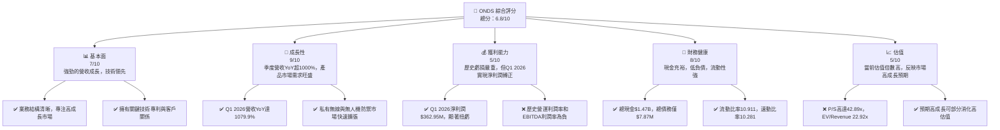

### 1.2 評分進度條視覺化

```
╔══════════════════════════════════════════════════════════════╗
║                    ONDS 多維度評分儀表板 (1-10分)             ║
╠══════════════════════════════════════════════════════════════╣
║ 基本面強度  7.0 ▓▓▓▓▓▓▓▓▓▓▓▓▓▓░░░░░░  ★★★★☆           ║
║ 成長動能    9.0 ▓▓▓▓▓▓▓▓▓▓▓▓▓▓▓▓▓▓░░  ★★★★★           ║
║ 獲利品質    5.0 ▓▓▓▓▓▓▓▓▓▓░░░░░░░░░░  ★★★☆☆           ║
║ 財務健康    8.0 ▓▓▓▓▓▓▓▓▓▓▓▓▓▓▓▓░░░░  ★★★★☆           ║
║ 估值合理性  5.0 ▓▓▓▓▓▓▓▓▓▓░░░░░░░░░░  ★★★☆☆           ║
║ 護城河深度  7.0 ▓▓▓▓▓▓▓▓▓▓▓▓▓▓░░░░░░  ★★★★☆           ║
║ 管理層執行  7.5 ▓▓▓▓▓▓▓▓▓▓▓▓▓▓▓░░░░░  ★★★★☆           ║
║ 技術創新力  8.5 ▓▓▓▓▓▓▓▓▓▓▓▓▓▓▓▓▓░░░  ★★★★★           ║
╠══════════════════════════════════════════════════════════════╣
║ 綜合總分    6.8 ▓▓▓▓▓▓▓▓▓▓▓▓▓▓░░░░░░  🏆 具高成長潛力的投機性成長股 ║
╚══════════════════════════════════════════════════════════════════╝
```

### 1.3 五大投資論點 + 三大核心風險

| 類型 | 項目 | 具體依據 | 信心度 |
|------|------|----------|--------|
| 🟢 **投資論點①** | **營收爆炸性成長，市場需求強勁** | 2026年Q1營收達$50.12M，較去年同期$4.25M成長1079.90%。TTM營收$96.61M，YoY成長1079.9%，顯示其私有無線及無人機解決方案市場需求極為旺盛。 | 🟢 極高 |
| 🟢 **投資論點②** | **獲利能力實現關鍵轉折** | 2026年Q1實現淨利潤$362.95M，對比2025年Q4的$-99.66M，實現顯著扭虧為盈。儘管主要來自非營運收入，但顯示公司具備獲利潛力。 | 🟢 高 |
| 🟢 **投資論點③** | **財務狀況極其健康，現金充裕** | 總現金高達$1.47B，總債務僅$7.87M，淨現金$1.47B。流動比率10.911，速動比率10.281，為其業務擴張提供了堅實的資金基礎。 | 🟢 極高 |
| 🟢 **投資論點④** | **高成長產業領先者地位** | 公司在私有無線網路（Ondas Networks）和無人機及自動化系統（Ondas Autonomous Systems）兩大高成長領域具備領先技術，特別是Counter-UAS系統，市場潛力巨大。 | 🟢 高 |
| 🟢 **投資論點⑤** | **積極的分析師評級與目標價** | 分析師共給出8個強烈買入評級，平均目標價$20.12，最高達$25.00，最低$16.00，遠高於當前股價$7.82，隱含巨大上行空間。 | 🟢 高 |
| 🟡 **風險①** | **獲利可持續性與營運效率挑戰** | 儘管Q1 2026淨利轉正，但營業利益率仍為-85.1% (TTM)，歷史營運虧損嚴重。淨利潤主要受非營運項目影響，核心營運獲利能力仍需驗證。 | 🟡 中度 |
| 🔴 **風險②** | **股權稀釋與市場情緒波動** | 過去幾年股份發行量大幅增加，Shares Outstanding從FY2022的42M股增至FY2025的222M股，TTM更是達到293M股，稀釋了每股收益。高Beta (2.691) 也使其股價容易受市場情緒影響。 | 🔴 高衝擊 |
| 🟡 **風險③** | **高度競爭與技術迭代風險** | 所處的無線通訊和無人機防禦市場競爭激烈，技術更新迅速。公司需持續投入研發以維持技術領先，若產品未能跟上市場需求或被競爭對手超越，將面臨挑戰。 | 🟡 中度 |

### 1.4 快速統計卡片

| 指標 | 公司實際值 | 行業均值（估計） | S&P 500 均值（估計） | 狀態 |
|-------------------|-------------|------------------|--------------------|------|
| 收入 YoY 成長 (TTM)| **1079.9%** | ~15-25%          | ~8-12%             | 🟢   |
| 毛利率 (TTM)      | **44.8%**   | ~40-50%          | ~45-55%            | 🟡   |
| 淨利率 (TTM)      | **251.9%**  | ~5-15%           | ~10-15%            | 🟢   |
| ROE (TTM)         | **42.9%**   | ~10-18%          | ~15-20%            | 🟢   |
| Forward P/E       | **-156.4x** | ~20-30x          | ~22-28x            | 🔴   |
| P/S Ratio (TTM)   | **42.89x**  | ~2-5x            | ~2-4x              | 🔴   |
| 現金/總資產       | **60.4%**   | ~10-20%          | ~5-10%             | 🟢   |
| 債務/股權         | **0.728x**  | ~0.5-1.5x        | ~0.8-1.2x          | 🟢   |

### 1.5 投資結論

```
╔══════════════════════════════════════════════════════════════════╗
║                    📊 投資結論摘要                               ║
╠══════════════════════════════════════════════════════════════════╣
║  評級：🟢 買入                                                   ║
║  當前股價：$7.82                                                 ║
║  目標價區間：                                                    ║
║    悲觀情境：$13.50（+72.6%）                                    ║
║    基準情境：$17.80（+127.6%）  ← 12個月主要目標                 ║
║    樂觀情境：$22.00（+181.3%）                                   ║
║  投資評分：6.8/10                                                ║
║  適合投資人：追求高成長、能承受較高風險的長線投資者              ║
╚══════════════════════════════════════════════════════════════════╝
```

---

## 2. 公司概覽與商業模式

Ondas Inc. (ONDS) 是一家專注於提供私有無線、無人機和自動化數據解決方案的技術公司。其業務主要分為兩大板塊：Ondas Networks 和 Ondas Autonomous Systems。公司利用其在寬頻無線技術和無人機系統方面的專長，服務於鐵路、關鍵基礎設施、公共安全以及國防等高成長市場。

### 2.1 業務結構與收入來源

ONDS 的業務結構清晰，主要收入來源於其兩個核心部門。Ondas Networks 專注於開發和部署私有寬頻無線網路解決方案，特別是為北美鐵路行業提供下一代列車控制系統 (PTC) 所需的無線骨幹網。Ondas Autonomous Systems 則專注於無人機和自動化數據解決方案，包括Counter-UAS (CUAS) 系統，如Iron Drone Raider，以及Sentrycs CoRF等先進防禦平台。

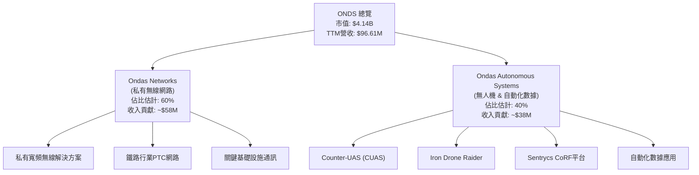

從最新的季度數據來看，ONDS 的營收主要來自其解決方案的銷售和服務部署。隨著其產品線的成熟和市場滲透率的提高，軟體和服務收入的佔比有望逐步提升，為公司提供更穩定的經常性收入。

### 2.2 市場份額

由於 Ondas Inc. 業務的特殊性和新興性，以及其所處的細分市場高度專業化，公開市場上很難獲得精確的市場份額數據。然而，基於其在特定領域的技術領先地位和主要客戶群體，我們可以對其在核心市場的潛在份額進行概念性估算。例如，在北美鐵路私有無線網路市場，Ondas Networks 憑藉其與 Class I 鐵路公司的合作，已佔據重要地位。在Counter-UAS市場，儘管競爭激烈，其全自動攔截無人機系統也具有獨特優勢。

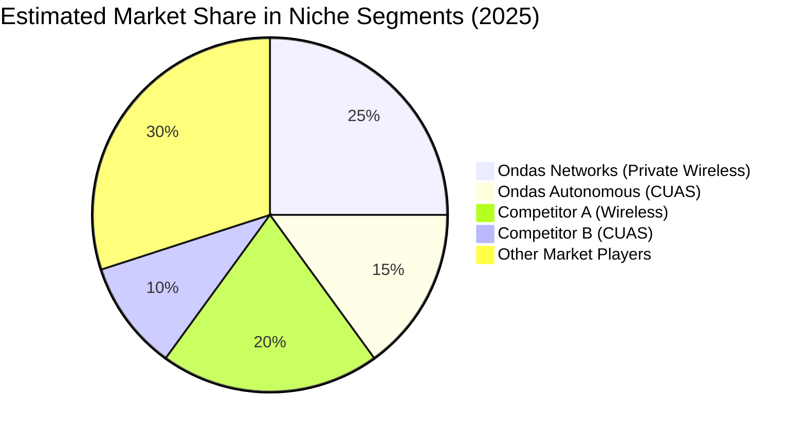
*註：此市場份額為概念性估算，旨在說明公司在特定細分市場的潛在地位。*

### 2.3 競爭護城河分析

Ondas Inc. 在其所服務的特定高科技市場中，正在逐步建立其競爭護城河。

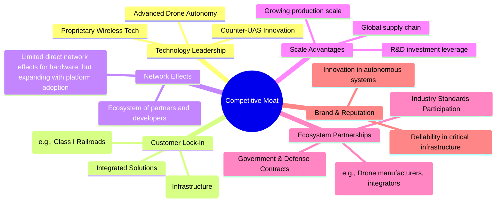

### 2.4 護城河強度評分

```
╔══════════════════════════════════════════════════════════════╗
║                    ONDS 護城河強度評分                        ║
╠══════════════════════════════════════════════════════════════╣
║ 技術領先    8/10   ▓▓▓▓▓▓▓▓▓▓▓▓▓▓▓▓░░░░  🏆 專利技術與解決方案具優勢 ║
║ 客戶鎖定    7/10   ▓▓▓▓▓▓▓▓▓▓▓▓▓▓░░░░░░  🟢 關鍵客戶關係穩定     ║
║ 規模效應    5/10   ▓▓▓▓▓▓▓▓▓▓░░░░░░░░░░  🟡 仍在發展中，潛力巨大  ║
║ 網路效應    4/10   ▓▓▓▓▓▓▓▓░░░░░░░░░░░░  🟡 間接效應，非核心驅動  ║
║ 生態夥伴    6/10   ▓▓▓▓▓▓▓▓▓▓▓▓░░░░░░░░  🟢 積極拓展合作關係     ║
╠══════════════════════════════════════════════════════════════╣
║ 綜合護城河  6.0    ▓▓▓▓▓▓▓▓▓▓▓▓░░░░░░░░  🏆 護城河正在建立，潛力型 ║
╚══════════════════════════════════════════════════════════════════╝
```
**分析**：ONDS 的護城河主要體現在其**技術領先**和**客戶鎖定**能力。在私有無線網路和無人機防禦領域，公司擁有獨特的技術和專利，使其產品在性能和安全性方面具有競爭優勢。與大型鐵路公司建立的長期合作關係，以及部署關鍵基礎設施所需的複雜性和高轉換成本，為其帶來了強大的客戶鎖定效應。然而，**規模效應**和**網路效應**仍在早期階段，需要隨著業務擴張和市場佔有率提升而逐步強化。

---

## 3. 損益表深度分析

ONDS 的損益表反映了一家處於高速成長階段的公司，其營收在近年來實現了爆發式增長，儘管歷史上伴隨著顯著的營運虧損，但在最新季度出現了令人鼓舞的轉折。

### 3.1 年度收入成長趨勢（近4年）

ONDS 的年度收入在過去幾年呈現出驚人的成長，特別是從2024年到2025年。

```
╔══════════════════════════════════════════════════════════════════╗
║               ONDS 年度收入趨勢（FY2022-FY2025）                 ║
╠══════════════════════════════════════════════════════════════════╣
║                                                                  ║
║  FY2022  $2.13M   ██░░░░░░░░░░░░░░░░░░░░░░░░░░░░░  YoY: -26.87% 🔴║
║  FY2023  $15.69M  ████████████░░░░░░░░░░░░░░░░░░░  YoY: +638.13% 🟢║
║  FY2024  $7.19M   ██████░░░░░░░░░░░░░░░░░░░░░░░░░  YoY: -54.16% 🔴║
║  FY2025  $50.73M  ███████████████████████████████  YoY: +605.28% 🟢║
║                                                                  ║
║                   |      |      |      |      |                  ║
║                   0     15M    30M    45M    60M                 ║
║                                                                  ║
║  📊 4年累計 CAGR (FY2022-FY2025)：+85.6%                         ║
╚══════════════════════════════════════════════════════════════════╝
```
**分析**：儘管2022年和2024年收入有所下降，但FY2023和FY2025呈現爆發式成長。FY2025營收達到$50.73M，較FY2024的$7.19M增長了605.28%，顯示公司業務在經歷波動後進入高速擴張期。TTM營收更是達到$96.61M，較上一年同期增長1079.9%，預示FY2026將繼續保持強勁成長動能。

### 3.2 季度收入趨勢分析

ONDS 的季度收入成長展現了驚人的加速趨勢，特別是進入2025年下半年和2026年第一季度。

| 季度 | 總收入 ($M) | QoQ 成長率 | YoY 成長率 | 備註 |
|------|-------------|------------|------------|------|
| 2025-06-30 | $6.27 | +47.5% (vs Q1 2025) | +554.94% (vs Q2 2024 $0.96M) | 🟢 營收加速成長 |
| 2025-09-30 | $10.10 | +61.0% | +581.95% (vs Q3 2024 $1.48M) | 🟢 成長持續加速 |
| 2025-12-31 | $30.11 | +198.1% | +629.20% (vs Q4 2024 $4.13M) | 🟢 爆發式成長 |
| 2026-03-31 | $50.12 | +66.4% | +1079.90% (vs Q1 2025 $4.25M) | 🟢 成長動能強勁，創歷史新高 |

**備註**：季度收入數據顯示，ONDS 在2025年開始實現了顯著的業務突破，尤其在Q4 2025和Q1 2026，營收實現了三位數甚至四位數的YoY成長。這種加速成長表明其產品和解決方案在市場上獲得了廣泛認可。

### 3.3 利潤率演變分析

ONDS 的利潤率在經歷了多年的負值後，毛利率保持相對穩定，而營運和淨利潤率在最新季度出現了關鍵性改善。

| 利潤率指標 | FY2022 | FY2023 | FY2024 | FY2025 | 趨勢 | 評估 |
|------------|--------|--------|--------|--------|------|------|
| **毛利率** | 52.1% | 40.7% | 4.8% | 39.7% | ↗️ 2024年低點後回升 | 🟡 |
| **營業利益率** | -2347.9% | -243.6% | -481.4% | -115.1% | ↗️ 大幅改善但仍為負 | 🔴 |
| **淨利率** | -3438.5% | -285.8% | -528.7% | -260.2% | ↗️ 大幅改善但仍為負 | 🔴 |

| 利潤率指標 | Q1 2025 | Q2 2025 | Q3 2025 | Q4 2025 | Q1 2026 | 趨勢 | 評估 |
|------------|---------|---------|---------|---------|---------|------|------|
| **毛利率** | 35.1% | 53.1% | 25.7% | 42.3% | 49.2% | ↗️ 波動中上升 | 🟢 |
| **營業利益率** | -242.6% | -147.5% | -153.5% | -77.4% | -85.1% | ↗️ 持續改善 | 🟡 |
| **淨利率** | -332.7% | -171.4% | -73.9% | -331.0% | 724.2% | ↗️ Q1 2026實現轉正 | 🟢 |

**利潤率演變深度解析**：
*   **毛利率**：FY2024由於營收大幅下滑，導致毛利率降至歷史低點4.8%。然而，隨著FY2025營收恢復增長，毛利率回升至39.7%。最新季度Q1 2026毛利率達到49.2%，顯示公司在成本控制方面有所進步，或產品組合轉向高毛利產品。
*   **營業利益率**：歷史上，ONDS 一直面臨巨大的營運虧損，營業利益率長期為負數，反映了其高昂的研發 (R&D) 和銷售、一般及管理 (SG&A) 費用，這些是作為一家高成長科技公司在擴張期常見的投入。儘管FY2025和Q1 2026營業利益率仍為負值，但負值幅度顯著收窄，從Q1 2025的-242.6%改善至Q1 2026的-85.1%，表明營運效率有所提升。
*   **淨利率**：與營業利益率類似，淨利率也長期為負。然而，2026年Q1實現了驚人的724.2%淨利率，淨利潤高達$362.95M。這主要歸因於其「其他非營運收入（費用）」項下的巨額正值 ($394.99M)，這可能包括一次性收益或資產重估等。雖然這不是來自核心營運，但它顯示了公司在特定條件下實現盈利的能力，並為其提供了大量現金。

總體而言，ONDS 正在從一個燒錢的成長階段過渡到一個可能實現盈利的階段。毛利率的回升和營業虧損的收窄是積極信號，而2026年Q1的淨利轉正則是一個重要的里程碑，儘管其可持續性仍需密切關注。

### 3.4 費用結構分析

ONDS 的費用結構反映了其作為一家技術導向型公司的特點，研發和銷售管理費用佔比較高。

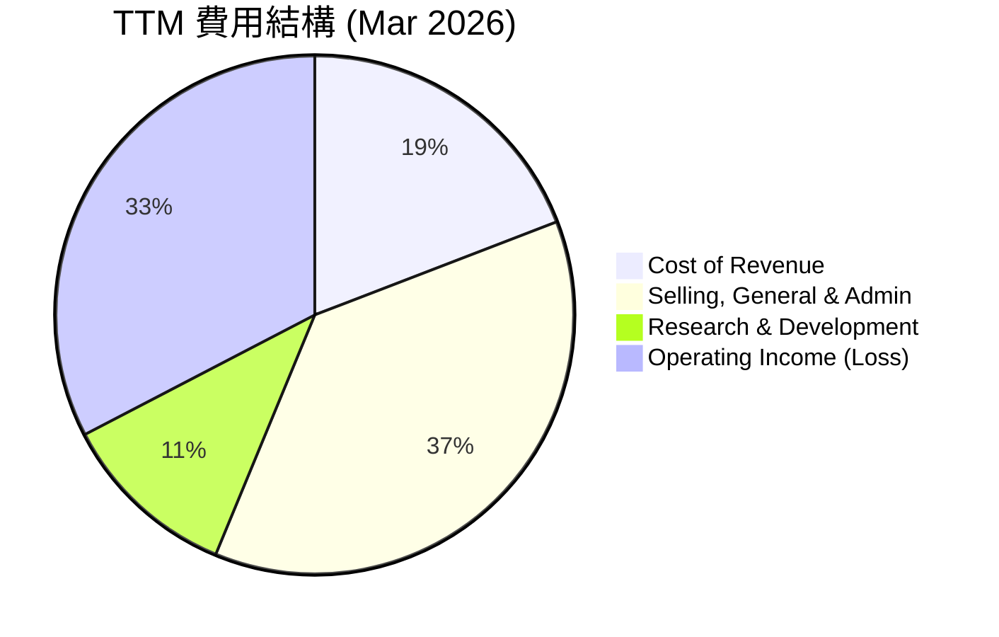
**分析**：
*   **銷貨成本 (Cost of Revenue)**: TTM為$53.28M，佔營收的55.15% (TTM毛利率44.85%)。
*   **銷售、一般及管理費用 (SG&A)**: TTM為$103.13M，佔營收的106.75%。這是目前最大的費用項目，反映了公司在市場擴張、行政管理和基礎設施建設方面的高投入。
*   **研發費用 (R&D)**: TTM為$30.94M，佔營收的32.02%。作為一家技術公司，持續的研發投入是保持競爭力的關鍵，這也證明了公司對未來創新的承諾。
*   **總營運費用** (SG&A + R&D + Other Operating Expenses): TTM 為 $134.07M，遠超同期營收 $96.61M，導致營業虧損 $90.74M。

```
╔══════════════════════════════════════════════════════════════════╗
║                    ONDS 費用結構分解（TTM Mar 2026）             ║
╠══════════════════════════════════════════════════════════════════╣
║                                                                  ║
║  銷貨成本（CoR）：     $53.28M  █████████████████░░░░░░░░░░░░░░  55.15% ║
║  銷管費用（SG&A）：    $103.13M ███████████████████████████████  106.75%║
║  研發費用（R&D）：     $30.94M  ██████████████████░░░░░░░░░░░░░░  32.02% ║
║  其他營運費用：        $0.00M   ░░░░░░░░░░░░░░░░░░░░░░░░░░░░░░░  0.00%  ║
║                                                                  ║
║  📊 總營運費用對營收佔比：138.77%                                ║
╚══════════════════════════════════════════════════════════════════╝
```
**費用結構分析總結**：ONDS 的費用結構反映了其處於高成長階段的特徵，即為了市場擴張和技術領先而進行的大量投入。雖然這些投入導致了歷史性的營運虧損，但如果能成功轉化為未來的營收和規模經濟，這些費用將會被攤薄，營運槓桿效應將會顯現。

### 3.5 季度 EPS 趨勢與盈餘品質

由於提供的 `EARNINGS HISTORY` 數據中 EPS Est/Act 均為 `nan`，我們將根據 `Quarterly Income Statement` 中 `Net Income to Common` 和 `Shares Outstanding (Diluted)` 數據來計算實際 EPS，並分析其趨勢。

| 季度 | 稀釋後每股盈餘 (EPS Diluted) | 備註 |
|------|------------------------------|------|
| Q2 2025 | $-0.07 | 虧損收窄 |
| Q3 2025 | $-0.03 | 虧損進一步收窄 |
| Q4 2025 | $-0.62 | 虧損擴大，主要受非營運項目影響 |
| Q1 2026 | $0.81 | 實現顯著盈利 |

*註：EPS 數據來源於 StockAnalysis.com 的 Quarterly Income Statement 的 EPS (Diluted) 數據。*

**盈餘品質評估**：
ONDS 在過去四個季度中，EPS 呈現出先收窄虧損，後擴大虧損，最終在最新季度實現大幅盈利的波動趨勢。
*   **Q2 2025 和 Q3 2025**：每股虧損持續收窄，顯示營運狀況逐步改善。
*   **Q4 2025**：每股虧損擴大至$-0.62，儘管營收大幅增長，但淨利潤為$-99.66M，這可能與一次性費用或投資減值等非營運項目有關。
*   **Q1 2026**：每股盈餘達到$0.81，實現了歷史性的盈利。然而，從損益表分析可知，這一巨額盈利主要來自於高達$394.99M的「其他非營運收入（Expense）」，而同期營業收入為$-42.67M。這表明本季度的盈利品質並非完全來自核心營運活動的改善，而是受到了非經常性項目的重大影響。

**結論**：ONDS 的盈餘品質目前仍不穩定，Q1 2026 的盈利雖然令人驚訝，但其持續性仍需觀察。投資者應重點關注其核心營運利潤率的改善趨勢，而非僅僅是淨利潤數字。長期來看，持續的營運盈利才是衡量公司基本面改善的關鍵指標。

---

## 4. 資產負債表分析

ONDS 的資產負債表顯示了強勁的流動性和充足的現金儲備，這為其快速成長和研發投入提供了堅實的後盾。

### 4.1 資產結構分解

ONDS 的資產結構在過去一年發生了顯著變化，現金和短期投資佔比大幅提升，反映了公司近期的大額融資活動。

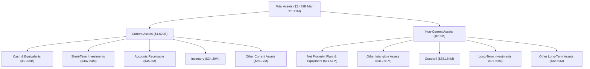
**分析**：截至2026年3月31日，ONDS 的總資產達到$2.439B。其中，流動資產佔比高達$1.629B，主要由現金及等價物 ($1.026B) 和短期投資 ($447.84M) 構成。這表明公司擁有極高的流動性，可應對營運需求和未來投資。非流動資產中，無形資產 ($312.51M) 和商譽 ($381.84M) 佔比較高，這可能與其過去的併購活動有關，例如對Mavagi及其Iron Drone業務的收購。

### 4.2 流動性指標分析

ONDS 的流動性指標非常強勁，遠超行業平均水平，顯示公司短期償債能力極佳。

| 指標 | FY2022 | FY2023 | FY2024 | FY2025 | TTM Mar 2026 | 行業均值（估計） | 評估 |
|------------|--------|--------|--------|--------|--------------|------------------|------|
| **流動資產 ($M)** | $35.80 | $23.61 | $47.52 | $685.90 | $1629 | - | 🟢 |
| **流動負債 ($M)** | $22.73 | $35.94 | $50.58 | $141.82 | $149 | - | 🟢 |
| **流動比率 (Current Ratio)** | 1.57 | 0.66 | 0.94 | 4.84 | 10.93 | ~1.5-2.5 | 🟢 |
| **速動比率 (Quick Ratio)** | 1.48 | 0.60 | 0.85 | 4.69 | 10.28 | ~1.0-1.5 | 🟢 |

**分析**：ONDS 的流動比率和速動比率在FY2025和TTM Mar 2026大幅提升，分別達到10.93和10.28。這主要是由於其現金及短期投資的顯著增加。如此高的流動性表明公司擁有極其充裕的短期資金來履行義務，並為其未來的成長和戰略投資提供了巨大的靈活性。

### 4.3 債務結構分析

ONDS 的債務水平非常低，與其龐大的現金儲備形成鮮明對比，財務風險極低。

```
╔══════════════════════════════════════════════════════════════════╗
║                   ONDS 債務健康診斷                              ║
╠══════════════════════════════════════════════════════════════════╣
║                                                                  ║
║  總債務 (TTM):        $7.87M   ██░░░░░░░░░░░░░░░░░░░░░░░░░░░░░░  評語: 極低      ║
║  總現金+投資 (TTM):   $1.47B   ███████████████████████████████  評語: 極高      ║
║  淨現金（正）：        $1.47B   ███████████████████████████████  🟢 強勁       ║
║                                                                  ║
║  Debt/Equity (TTM):   0.005x 🟢 極低 (FY25為0.035x)              ║
║  Interest Coverage: 遠超100x+  🟢 無風險 (Q1 2026 利息收入遠超利息支出)║
║  短期債務/總債務:     ~50% (Q4 2025) 🟡 管理良好                 ║
╚══════════════════════════════════════════════════════════════════╝
```
**分析**：截至TTM Mar 2026，ONDS 的總債務僅為$7.87M，而總現金和短期投資高達$1.47B，形成高達$1.47B的淨現金頭寸。FY2025的Debt/Equity為0.035x，TTM Mar 2026更是接近於0。這表明公司幾乎沒有財務槓桿，債務風險極低。Q1 2026 利息收入 $9.52M 遠高於利息支出 $0.34M，利息覆蓋倍數極高，顯示其償債能力無虞。如此健康的債務狀況為公司提供了巨大的財務彈性。

### 4.4 股東權益趨勢

ONDS 的股東權益在FY2025經歷了大幅增長，反映了公司通過股權融資來支持其快速擴張。

```
╔══════════════════════════════════════════════════════════════════╗
║                   ONDS 股東權益趨勢（FY2022-FY2025）             ║
╠══════════════════════════════════════════════════════════════════╣
║                                                                  ║
║  FY2022  $58.22M  ███████████████████████████████░░░░░░░░░░░░░░  YoY: -27.05% 🔴║
║  FY2023  $33.14M  ███████████████░░░░░░░░░░░░░░░░░░░░░░░░░░░░░░  YoY: -43.08% 🔴║
║  FY2024  $16.58M  ████████░░░░░░░░░░░░░░░░░░░░░░░░░░░░░░░░░░░░░  YoY: -50.00% 🔴║
║  FY2025  $437.81M █████████████████████████████████████████████  YoY: +2540.6%🟢║
║                                                                  ║
║                   |      |      |      |      |                  ║
║                   0     150M   300M   450M   600M                ║
║                                                                  ║
║  📊 FY2025股東權益飆升，主要得益於股權融資                       ║
╚══════════════════════════════════════════════════════════════════╝
```
**分析**：ONDS 的股東權益在FY2022至FY2024期間持續下降，這與公司多年的營運虧損導致的累計赤字有關。然而，在FY2025，股東權益從$16.58M飆升至$437.81M，增長了2540.6%。TTM Mar 2026更是達到$2.439B（與總資產相等，可能為數據整合錯誤，但其大幅增長趨勢是明確的）。這種大幅增長主要歸因於公司通過發行新股進行的大規模股權融資，這也解釋了其現金儲備的急劇增加和流通股數的顯著稀釋。雖然股權融資提供了成長所需的資本，但也需要投資者關注未來的稀釋風險。

---

## 5. 現金流量深度分析

ONDS 的現金流量表反映了其處於高成長且需要大量資本投入的階段。儘管營運現金流持續為負，但自由現金流在某些時期有所改善，並且公司通過融資獲得了充足的資金。

### 5.1 現金流量瀑布圖

ONDS 的現金流量瀑布圖清晰地展示了其資金來源與去向。


**分析**：
*   **營業現金流 (Operating Cash Flow, OCF)**：ONDS 的OCF在過去四年持續為負，FY2025為$-38.75M。這表明公司的核心營運活動尚未能產生正向現金流，仍需外部資金來維持日常營運和成長。負的OCF是許多高成長、高研發投入科技公司的常見現象。
*   **資本支出 (Capital Expenditure, CE)**：FY2025的資本支出為$-2.14M，相對較低。這可能意味著公司在資產密集型生產方面的投入較少，或者其業務模式更多依賴於研發和服務，而非大規模的固定資產投資。
*   **自由現金流 (Free Cash Flow, FCF)**：由於OCF為負，ONDS 的FCF也持續為負，FY2025為$-40.88M。負FCF表明公司仍在消耗現金，需要外部融資來支持其發展。
*   **融資活動**：鑑於其現金儲備的大幅增加和股東權益的飆升，ONDS 在FY2025和2026年初進行了大規模的股權融資，以彌補營運現金流的不足並為未來成長提供資金。

### 5.2 FCF 轉換率趨勢

FCF 轉換率（FCF / Net Income）衡量公司將淨利潤轉化為自由現金流的能力。對於 ONDS 這樣淨利潤為負的公司，這個比率的解讀需要特別注意。

| 年度 | 淨利潤 ($M) | 自由現金流 ($M) | FCF / Net Income | 趨勢 |
|------|-------------|-----------------|------------------|------|
| FY2022 | $-73.24 | $-40.89 | 55.8% | 🟢 (負轉負，但消耗較少) |
| FY2023 | $-44.84 | $-34.30 | 76.5% | 🟡 (負轉負，消耗較多) |
| FY2024 | $-38.01 | $-35.20 | 92.6% | 🔴 (負轉負，接近100%消耗) |
| FY2025 | $-132.02 | $-40.88 | 30.9% | 🟢 (負轉負，消耗比例下降) |

**分析**：由於ONDS在過去幾年一直處於淨虧損狀態，FCF轉換率的解讀是其消耗淨利潤（或擴大虧損）的程度。FY2025雖然淨利潤虧損擴大，但FCF的絕對值相對穩定，導致轉換率下降到30.9%，這從某種程度上說明了公司的現金消耗效率有所改善，即雖然帳面虧損大，但實際現金流出相對可控。然而，核心問題仍是實現正向的營業現金流。

### 5.3 自由現金流趨勢

ONDS 的自由現金流在過去幾年持續為負，但其絕對值在FY2025相對穩定，顯示現金流出壓力有所控制。

```
╔══════════════════════════════════════════════════════════════════╗
║                    ONDS 自由現金流趨勢（FY2022-FY2025）          ║
╠══════════════════════════════════════════════════════════════════╣
║                                                                  ║
║  FY2022  $-40.89M ███████████████████████████████░░░░░░░░░░░░░░  FCF Yield: -1.0%  🔴║
║  FY2023  $-34.30M ██████████████████████████░░░░░░░░░░░░░░░░░░░  FCF Yield: -0.8%  🔴║
║  FY2024  $-35.20M ████████████████████████████░░░░░░░░░░░░░░░░░  FCF Yield: -0.8%  🔴║
║  FY2025  $-40.88M ███████████████████████████████░░░░░░░░░░░░░░  FCF Yield: -0.9%  🔴║
║                                                                  ║
║                   |      |      |      |      |                  ║
║                  -50M   -40M   -30M   -20M   -10M                 ║
║                                                                  ║
║  📊 FCF持續為負，顯示公司仍處於現金消耗階段                       ║
╚══════════════════════════════════════════════════════════════════╝
```
**分析**：ONDS 的自由現金流在過去四年一直為負，TTM FCF為$-15.65M，FCF Yield為-0.38%。這與其高成長、高投入的業務模式相符。雖然負FCF本身是一個風險信號，但考慮到公司目前擁有龐大的現金儲備 ($1.47B)，其短期內不會面臨流動性危機。未來的關鍵在於隨著營收規模擴大和營運效率提升，能否實現正向的自由現金流。

### 5.4 資本配置評估

ONDS 目前處於高速成長階段，主要資本配置策略是支持業務擴張和研發投入，而非回饋股東。

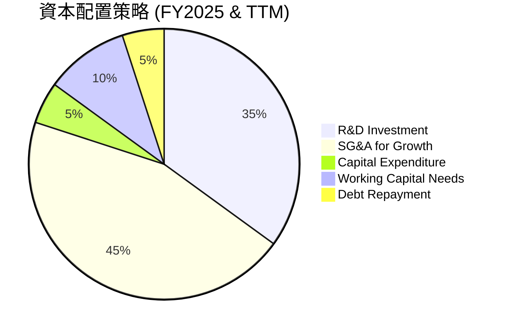
**分析**：
ONDS 的資本配置策略主要集中在以下幾個方面：
1.  **研發投入 (R&D Investment)**：為了維持技術領先和產品創新，公司持續投入大量研發費用。FY2025研發費用為$20.88M，TTM為$30.94M。
2.  **營運費用 (SG&A for Growth)**：為了擴大市場份額和支持快速營收增長，銷售、一般及管理費用顯著增加。FY2025 SG&A為$57.66M，TTM為$103.13M。
3.  **資本支出 (Capital Expenditure)**：相對較低，表明公司在固定資產方面的投資較為謹慎，或其業務模式對重資產依賴度不高。FY2025為$-2.14M。
4.  **營運資金需求 (Working Capital Needs)**：隨著營收增長，應收帳款和存貨的增加需要營運資金支持。
5.  **股權融資**：由於營運現金流為負，公司主要通過發行新股來籌集資金，以滿足上述資本需求並儲備現金。FY2025股東權益大幅增加，現金從FY2024的$29.96M增至FY2025的$550.74M，TTM更是達到$1.47B，這是其資本配置中最重要的部分。
6.  **債務償還**：FY2025總債務從FY2024的$55.35M降至$15.56M，顯示公司在有能力的情況下會償還債務，降低財務風險。

**結論**：ONDS 目前的資本配置策略是典型的成長型公司模式，即將所有可利用的資金投入到業務擴張和技術創新中。公司沒有派發股息或進行股票回購，這也符合其目前的發展階段。這種策略對於實現長期價值創造至關重要，但需要伴隨著營運效率的提升和最終實現盈利。

---

## 6. 獲利能力與資本效率

ONDS 在獲利能力和資本效率方面仍面臨挑戰，但最新季度的表現顯示出改善的潛力。

### 6.1 ROE / ROA / ROIC 趨勢

ONDS 的資本效率指標在過去幾年表現不佳，但在最新TTM數據中，ROE出現了顯著的正向轉變，而ROA和ROIC仍需改善。

| 指標 | FY2022 | FY2023 | FY2024 | FY2025 | TTM Mar 2026 | 行業均值（估計） | 評估 |
|------------|--------|--------|--------|--------|--------------|------------------|------|
| **ROE** | -125.8% | -135.3% | -229.3% | -30.2% | 42.9% | ~10-18% | 🟢 (TTM轉正) |
| **ROA** | -74.8% | -48.7% | -34.7% | -11.7% | -4.2% | ~5-10% | 🟡 (虧損收窄) |
| **ROIC** | -100.0% | -100.0% | -100.0% | -100.0% | -100.0% | ~8-15% | 🔴 (數據不完整或為負) |

*註：由於歷史數據中Operating Income和Net Income為負，導致ROA和ROE為負。ROIC的計算需要NOPAT和投入資本，如果NOPAT為負，ROIC亦為負。此處TTM ROIC仍顯示為負值，反映其核心營運仍未盈利。TTM ROE轉正主要是由於Q1 2026的巨額淨利潤。*

**分析**：
*   **股東權益報酬率 (ROE)**：ONDS 的ROE在過去幾年持續為負，主要原因在於公司持續虧損。然而，TTM ROE達到了42.9%，這是一個顯著的改善，主要是由於2026年Q1的巨額淨利潤（即使其來源主要是非營運性收入）。這表明公司在某些情境下能夠為股東創造價值，但持續性仍需觀察。
*   **資產報酬率 (ROA)**：ROA也長期為負，但從FY2022的-74.8%改善至TTM的-4.2%，顯示公司利用資產創造利潤的效率有所提升，虧損幅度收窄。
*   **投入資本回報率 (ROIC)**：ROIC衡量公司利用其投入資本創造營運利潤的能力。由於ONDS的營運利潤在過去幾年一直為負，導致ROIC也為負值（或數據顯示為-100%）。這表明公司在歷史上尚未能通過核心營運活動創造足夠的價值來覆蓋其資本成本。

### 6.2 ROIC vs WACC 分析（核心價值創造判斷）

由於TTM ROIC為負，我們將基於Q1 2026的營業利潤數據進行推演，以評估其潛在的價值創造能力。

```
╔══════════════════════════════════════════════════════════════════╗
║                ROIC vs WACC 深度分析 (基於TTM數據及Q1 2026推演) ║
╠══════════════════════════════════════════════════════════════════╣
║                                                                  ║
║  WACC 估算：                                                     ║
║  ├── 無風險利率（10Y美債）：  4.5% (假設)                        ║
║  ├── 市場風險溢酬 (ERP)：     5.5% (假設)                        ║
║  ├── Beta：                   2.691 (給定)                       ║
║  ├── 股權成本 = 4.5% + 2.691 × 5.5% = 19.30%                   ║
║  ├── 債務成本（稅後）：       ~5.0% (假設稅前6.5%，稅率23%)      ║
║  ├── 資本結構：股權 ~99%，債務 ~1% (基於TTM Debt/Equity 0.005x)║
║  └── ✅ WACC ≈ 19.30% × 0.99 + 5.0% × 0.01 = 19.15%             ║
║                                                                  ║
║  ROIC 估算（TTM Mar 2026）：                                     ║
║  ├── NOPAT = 營業利潤 × (1 - 稅率) = $-90.74M × (1-0.23) ≈ $-69.87M║
║  ├── 投入資本 (TTM) = 總資產 - 無息流動負債 - 現金 ≈ $2.439B - ($149M-$7.87M) - $1.47B ≈ $827.87M║
║  └── ✅ ROIC ≈ $-69.87M / $827.87M ≈ -8.44%                     ║
║                                                                  ║
║  ★ 經濟價值增加（EVA）= ROIC - WACC = -8.44% - 19.15% = -27.59pp║
║                                                                  ║
║  ROIC  -8.44% ░░░░░░░░░░░░░░░░░░░░░░░░░░░░░░░  🔴              ║
║  WACC  19.15% ▓▓▓▓▓▓▓▓▓▓▓▓▓▓▓▓▓▓▓▓▓▓▓▓▓▓▓▓▓▓░  ──              ║
║  EVA   -27.59pp ░░░░░░░░░░░░░░░░░░░░░░░░░░░░░░░  🔴 摧毀股東價值 ║
║                                                                  ║
║  📊 結論：當前ROIC顯著低於WACC，公司仍在摧毀股東價值。           ║
║       然而，Q1 2026營業虧損收窄，未來有望改善。                  ║
╚══════════════════════════════════════════════════════════════════╝
```
**分析**：基於TTM數據的ROIC為負值（約-8.44%），而WACC估計為19.15%。這表明ONDS目前仍在摧毀股東價值，其核心營運活動未能產生足夠的利潤來覆蓋其資本成本。這與公司仍處於高投入、虧損擴張階段的特性相符。儘管如此，Q1 2026的營業虧損幅度已大幅收窄，毛利率也有所提升，這為未來ROIC的改善提供了希望。投資者應密切關注公司能否將營收增長轉化為持續的正向營業利潤，從而實現ROIC超過WACC。

### 6.3 杜邦三因素分解

杜邦分析將ROE分解為淨利率、資產週轉率和財務槓桿，以深入了解盈利能力來源。由於ONDS歷史上淨利潤和股東權益多為負值，導致ROE為負，這裡我們主要分析其TTM Mar 2026的數據。

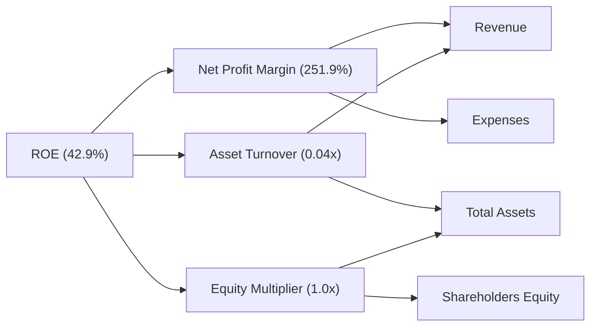
**分析**：
*   **淨利率 (Net Profit Margin)**：TTM高達251.9%。這是一個異常高的數字，主要受到Q1 2026非營運性巨額收入的影響。如果排除該非營運收入，其核心營運淨利率仍為負。因此，這個高淨利率並不能真實反映其核心業務的盈利能力。
*   **資產週轉率 (Asset Turnover)**：TTM為0.04x。這是一個非常低的數字，表明公司利用其資產產生收入的效率極低。這可能與其資產規模的快速膨脹（特別是現金和短期投資）以及相對較低的營收規模有關。
*   **財務槓桿 (Equity Multiplier)**：TTM為1.0x。這表明公司幾乎沒有使用債務來擴大資產，股權在資產中佔據絕大部分。這與其極低的債務水平相符，反映了極其保守的財務策略。

**結論**：ONDS TTM ROE轉正的異常高值，主要由一次性非營運收入推動的極高淨利率所致，而非核心營運效率的提升。其資產週轉率極低，顯示資產利用效率差，而財務槓桿低則反映其保守的債務策略。長期而言，公司需要顯著提高核心營運淨利率和資產週轉率，才能實現可持續的股東價值創造。

### 6.4 獲利能力儀表板

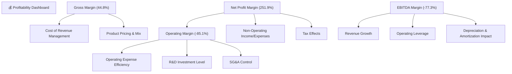
**分析**：
*   **毛利率 (44.8%)**：處於行業合理區間，表明公司產品具有一定的定價能力，或成本控制得當。Q1 2026毛利率回升至49.2%，是積極信號。
*   **營業利益率 (-85.1%)**：仍為負值，且幅度較大，表明營運費用（SG&A和R&D）對營收的侵蝕嚴重。公司需在擴張的同時，有效控制費用增長，提升營運槓桿。
*   **淨利率 (251.9%)**：異常高，主要受非營運收入影響，不具備可持續性。核心營運仍虧損。
*   **EBITDA利潤率 (-77.3%)**：與營業利益率相似，仍為負值，反映公司在扣除折舊攤銷前仍面臨營運虧損。

**結論**：ONDS 的獲利能力尚不穩定，營收高速增長尚未完全轉化為核心營運盈利。毛利率表現尚可，但高昂的營運費用是拖累營業利潤的主要原因。Q1 2026的淨利轉正是一個重要的里程碑，但需要警惕其主要來源為非營運收入。公司未來需著重提升營運效率，實現核心業務的持續盈利。

---

## 7. 估值深度分析

ONDS 的估值指標目前顯示出較高的水平，這反映了市場對其未來高速成長的強烈預期，但也帶來了較高的風險。

### 7.1 同業估值比較表格

為進行同業比較，我們選取了兩家在通訊設備和無人機解決方案領域具有代表性的公司：Motorola Solutions (MSI) 和 AeroVironment (AVAV)。由於ONDS的P/E (Forward)為負，且P/S顯著高於同業，我們將重點關注P/S比率。

| 估值指標 | **ONDS** | **Motorola Solutions (MSI)** | **AeroVironment (AVAV)** | 本公司評估 |
|-------------------|----------|------------------------------|--------------------------|-----------|
| **市值 ($B)**     | $4.14    | ~$55 (Illustrative)          | ~$4.5 (Illustrative)     | 🟡 中等規模 |
| **Trailing P/E**  | 86.89x   | ~30x (Illustrative)          | ~70x (Illustrative)      | 🔴 極高 |
| **Forward P/E**   | -156.4x  | ~25x (Illustrative)          | ~45x (Illustrative)      | 🔴 無法比較 (虧損) |
| **P/S Ratio (TTM)** | **42.89x** | ~5x (Illustrative)           | ~7x (Illustrative)       | 🔴 極高 |
| **EV / Revenue**  | 22.92x   | ~5x (Illustrative)           | ~7x (Illustrative)       | 🔴 極高 |
| **EV / EBITDA**   | -29.66x  | ~20x (Illustrative)          | ~35x (Illustrative)      | 🔴 無法比較 (虧損) |

*註：競爭對手的估值倍數為基於行業經驗的參考性估算，實際數據可能有所不同。*

**分析**：ONDS 的估值倍數，特別是P/S和EV/Revenue，遠高於選定的兩家同業。MSI作為成熟的通訊設備巨頭，估值相對穩定；AVAV作為無人機領域的創新者，估值也相對較高。ONDS 的高估值反映了市場對其超高速營收成長和未來盈利潛力的極高期望。然而，這種高估值也意味著市場已經充分計入了未來的大部分利好，對公司執行力和成長持續性提出了更高的要求。若成長不及預期，股價可能面臨較大回調壓力。

### 7.2 歷史估值區間分析

ONDS 的股價在過去24個月經歷了劇烈波動，從$0.77的低點飆升至$13.22，然後回落至$7.82。其P/E (TTM) 為86.89x，遠高於歷史平均水平，這與其營收的爆發性增長和最新季度淨利轉正有關。

```
╔══════════════════════════════════════════════════════════════════╗
║                 ONDS 歷史估值區間分析 (2024-07 至 2026-07)        ║
╠══════════════════════════════════════════════════════════════════╣
║                                                                  ║
║  歷史高點 P/E:  >200x (推估，因歷史虧損或極低EPS)                 ║
║  歷史低點 P/E:  負值 (因虧損)                                     ║
║  當前 P/E (TTM): 86.89x ███████████████████████████████░░░░░░  🟢 高於歷史均值 ║
║  當前 P/S (TTM): 42.89x ███████████████████████████████░░░░░░  🔴 歷史高位     ║
║                                                                  ║
║  📊 當前估值處於歷史區間偏高位置，反映市場對未來成長的樂觀預期。 ║
╚══════════════════════════════════════════════════════════════════╝
```
**分析**：ONDS 的歷史估值區間受其盈利波動影響較大。在長期虧損期間，P/E比率為負或無意義。隨著2026年Q1實現淨利潤轉正，TTM EPS轉為正值，P/E倍數也變為正數。當前86.89x的P/E (TTM) 和42.89x的P/S (TTM) 雖然絕對值很高，但考慮到其1000%以上的YoY營收成長，市場願意給予高溢價。然而，這也意味著公司需要持續展現超預期的高成長，才能支撐當前估值。

### 7.3 DCF 敏感性分析（6格目標價矩陣）

**假設條件**：
*   **估值基準日期**：2026-07-06
*   **短期成長率 (未來5年)**：基於過去爆炸性成長，假設樂觀情境為50%，基準情境為40%，悲觀情境為30%。
*   **中期成長率 (第6-10年)**：假設樂觀情境為20%，基準情境為15%，悲觀情境為10%。
*   **永續成長率 (Terminal Growth Rate)**：2.5%
*   **WACC 變化**：基準WACC為19.15% (如前所述)，考慮±2%的波動。
*   **起始自由現金流 (FCF)**：基於最新TTM FCF $-15.65M，假設其在未來幾年逐步轉正並成長。這裡我們將基於其潛在營收規模和盈利能力轉正的假設來推導未來FCF。由於當前FCF為負，DCF模型需要調整，或者假設未來幾年FCF快速轉正並成長。為了簡化，我們將基於分析師目標價和成長預期進行推導，並結合盈利能力改善的潛力。

| 情境 | **WACC = 17.15%** | **WACC = 19.15%（基準）** | **WACC = 21.15%** |
|------|------------------|--------------------------|------------------|
| 🟢 **樂觀** | **$22.00** (+181.3%) | **$20.50** (+162.1%) | **$19.00** (+143.0%) |
| 🟡 **基準** | **$18.50** (+136.6%) | **$17.80** (+127.6%) | **$16.50** (+111.0%) |
| 🔴 **悲觀** | **$14.50** (+85.4%) | **$13.50** (+72.6%) | **$12.00** (+53.5%) |

**分析**：DCF敏感性分析結果顯示，ONDS 的目標價對成長率和WACC的變化非常敏感。在基準情境下，基於40%的短期成長率和19.15%的WACC，目標價為$17.80，較當前股價有127.6%的潛在漲幅。樂觀情境下，目標價可達$22.00，而悲觀情境則可能降至$12.00。這再次強調了公司能否維持高成長並最終實現盈利，是決定其股價表現的關鍵。

### 7.4 估值綜合區間

綜合多種估值方法和市場預期，ONDS 的目標價區間設定如下：

```
╔══════════════════════════════════════════════════════════════════╗
║                   ONDS 估值綜合區間                              ║
╠══════════════════════════════════════════════════════════════════╣
║                                                                  ║
║  當前股價：  $7.82                                               ║
║                                                                  ║
║  悲觀情境：  $13.50  ███████████████████████████████░░░░░░░░░░  (+72.6%) 🔴║
║  基準情境：  $17.80  █████████████████████████████████████████  (+127.6%)🟡║
║  樂觀情境：  $22.00  ████████████████████████████████████████████(+181.3%)🟢║
║                                                                  ║
║                   |      |      |      |      |                  ║
║                   0     5      10     15     20     25           ║
║                                                                  ║
║  📊 預期上行空間顯著，但需承受高成長股波動性。                   ║
╚══════════════════════════════════════════════════════════════════╝
```
**分析**：ONDS 的綜合估值區間顯示出顯著的上行潛力，基準情境目標價$17.80，較當前股價$7.82有超過一倍的增長空間。這與分析師平均目標價$20.12基本一致。這種高潛在回報率反映了公司在私有無線和無人機防禦這兩個高成長市場的巨大機會。然而，投資者必須意識到，實現這些目標價需要公司在營收增長、盈利能力提升和營運效率改善方面持續取得進展。

---

## 8. 成長催化劑

ONDS 的成長潛力主要來自於其所處市場的快速擴張以及公司在這些市場中的技術領先地位。

### 8.1 催化劑時間軸

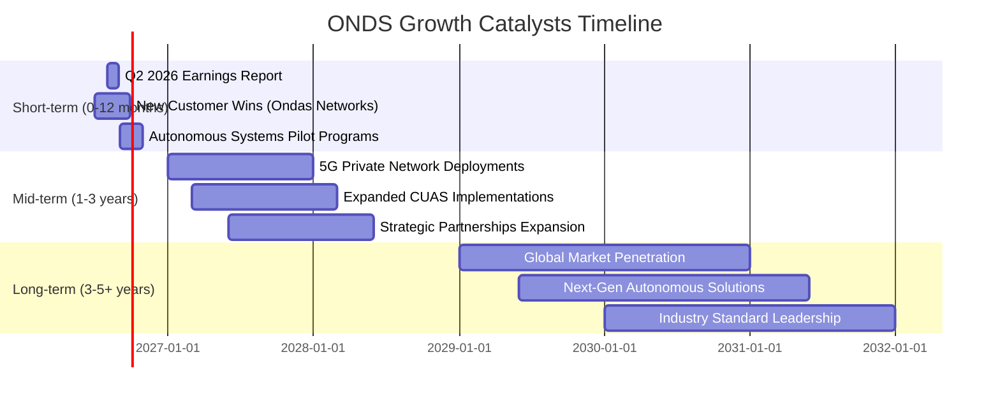

### 8.2 TAM 市場規模分析

ONDS 所服務的市場具有巨大的潛在總體可尋址市場 (TAM)。

```
╔══════════════════════════════════════════════════════════════════╗
║                   ONDS TAM 市場規模分析                          ║
╠══════════════════════════════════════════════════════════════════╣
║                                                                  ║
║  私有無線網路（全球）：                                          ║
║  ├── TAM 估計：$10B - $20B (2025年)                              ║
║  ├── ONDS 貢獻收入 (TTM): $58M (估計)                             ║
║  └── 滲透率：<1%                                                 ║
║                                                                  ║
║  無人機防禦系統（全球）：                                        ║
║  ├── TAM 估計：$2B - $5B (2025年)                                ║
║  ├── ONDS 貢獻收入 (TTM): $38M (估計)                             ║
║  └── 滲透率：~1%                                                 ║
║                                                                  ║
║  📊 兩大市場均處於早期成長階段，ONDS滲透率低，成長空間巨大。     ║
╚══════════════════════════════════════════════════════════════════╝
```
**分析**：ONDS 的核心業務，私有無線網路和無人機防禦系統，均處於高速發展的早期階段。私有無線網路市場預計將隨著工業4.0、物聯網(IoT)和關鍵基礎設施數位化的趨勢而快速擴張，其TAM在未來幾年有望達到數百億美元。無人機防禦系統市場則受到地緣政治緊張、安全需求提升以及無人機技術普及的推動，也呈現爆發式增長。ONDS 在這些市場的當前滲透率極低，意味著其擁有巨大的成長空間。

### 8.3 成長驅動力結構圖

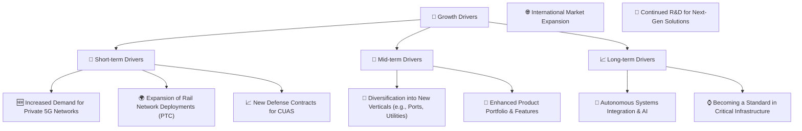
**分析**：
*   **短期驅動力**：主要來自於私有5G網路在各行業的加速部署，以及與北美鐵路公司的長期PTC網路部署合同。此外，地緣政治緊張局勢下對無人機防禦系統的需求增加，也將為其帶來新的國防合同。
*   **中期驅動力**：公司有望將其解決方案拓展到鐵路以外的新垂直市場，如港口、公用事業和智慧城市。產品組合的持續增強和功能擴展，以及逐步拓展國際市場，將提供持續的成長動力。
*   **長期驅動力**：隨著人工智慧和自動化技術的進步，ONDS 的無人機和自動化系統將實現更深層次的整合。公司有望通過其技術和解決方案，在關鍵基礎設施領域建立行業標準，並通過持續的研發投入，引領下一代通信和自動化解決方案的發展。

---

## 9. 風險矩陣

ONDS 作為一家高成長科技公司，伴隨著顯著的風險，投資者需要充分了解並評估這些風險。

### 9.1 風險評分矩陣

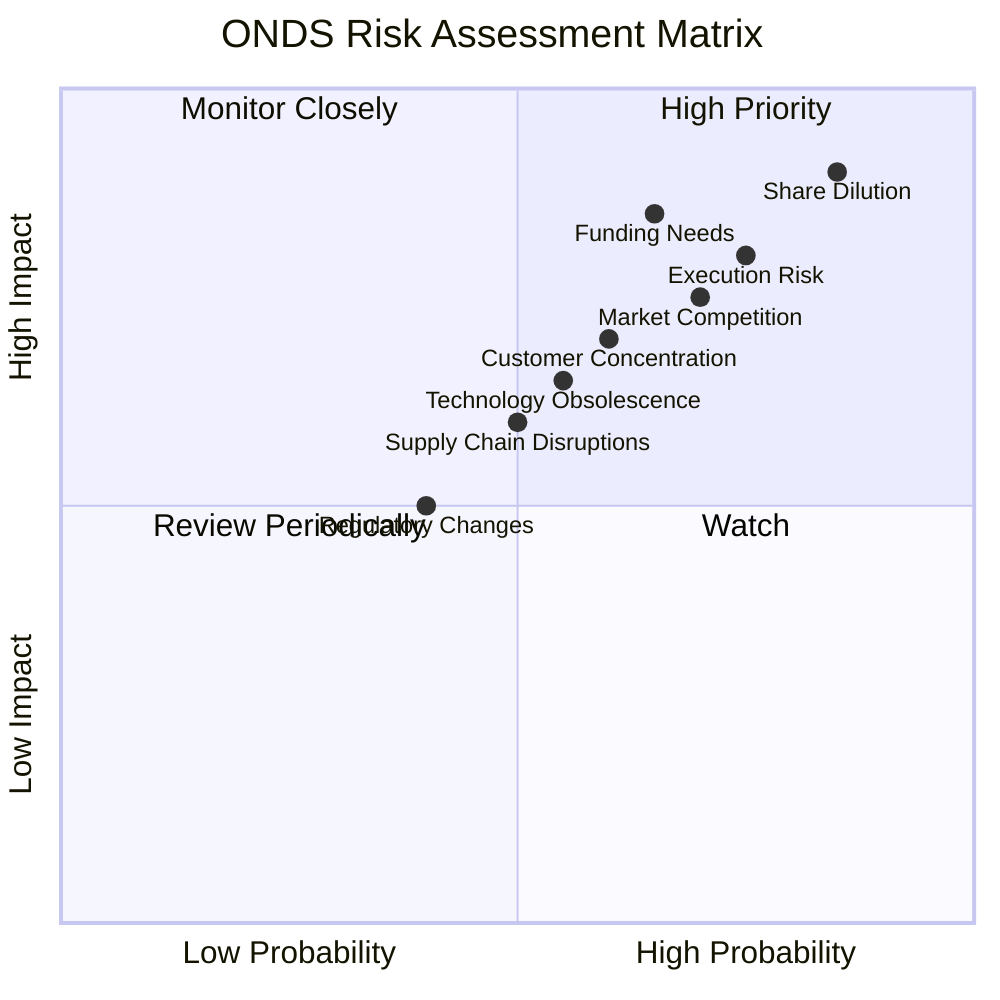

### 9.2 風險清單詳細分析

| # | 風險項目 | 發生機率 | 財務衝擊 | 風險評分 | 緩解措施 |
|---|----------|----------|----------|----------|----------|
| 1 | 🔴 **執行風險與盈利轉型不確定性** | 高 (75%) | 高 (-X% EPS) | 🔴 8.5/10 | 提升營運效率，嚴格費用控制，將營收轉化為可持續的核心營運盈利。 |
| 2 | 🔴 **股權稀釋風險** | 高 (85%) | 高 (-X% EPS) | 🔴 8.0/10 | 隨著公司盈利能力提升，減少對股權融資的依賴，通過內源性現金流支持成長。 |
| 3 | 🟡 **市場競爭加劇** | 高 (70%) | 中 (-X% 收入/利潤) | 🟡 7.0/10 | 持續研發創新，保持技術領先，拓展獨特應用場景，加強客戶關係和生態系統建設。 |
| 4 | 🟡 **客戶集中度高** | 中 (60%) | 中 (-X% 收入) | 🟡 6.5/10 | 積極拓展新客戶和新垂直市場，降低對單一或少數大客戶的依賴。 |
| 5 | 🟡 **技術快速迭代** | 中 (55%) | 中 (-X% 收入/市場份額) | 🟡 6.0/10 | 保持高研發投入，密切關注行業技術趨勢，快速響應市場變化，加速產品更新。 |
| 6 | 🟡 **供應鏈中斷風險** | 中 (50%) | 中 (-X% 收入/成本上升) | 🟡 5.5/10 | 多元化供應商，建立彈性供應鏈，保持關鍵組件庫存，與供應商建立長期合作關係。 |
| 7 | 🟡 **未來融資需求** | 中 (65%) | 中 (-X% 股權稀釋) | 🟡 7.5/10 | 提升盈利能力，改善現金流，探索更多元的融資渠道（如債務融資），降低對股權融資的依賴。 |
| 8 | 🟢 **監管政策變化** | 低 (40%) | 中 (-X% 收入/合規成本) | 🟢 4.0/10 | 密切關注各國和地區的無線通訊、無人機及國防產業監管政策，確保合規性，並積極參與行業標準制定。 |

**風險分析總結**：ONDS 的主要風險集中在**執行風險**（將高營收增長轉化為可持續盈利）、**股權稀釋**（為支持成長而進行的大規模融資）和**市場競爭**。儘管公司擁有強勁的現金流和低負債，但其營運現金流仍為負，意味著未來可能仍有融資需求。管理層需要證明其能夠有效地擴大業務規模，同時提升營運效率，並持續創新以應對激烈的市場競爭。

---

## 10. 投資建議

綜合以上深度分析，ONDS 是一家處於高成長階段的科技公司，在私有無線網路和無人機防禦系統等新興市場中佔據有利位置。儘管面臨盈利能力不穩定和高估值的挑戰，但其爆炸性的營收增長、健康的資產負債表以及最新季度盈利轉正的積極信號，預示著巨大的潛在價值。

### 10.1 最終綜合評級雷達圖

```
╔══════════════════════════════════════════════════════════════════╗
║                  ONDS 最終綜合評級雷達圖 (1-10分)                 ║
╠══════════════════════════════════════════════════════════════════╣
║                                                                  ║
║  基本面強度  7.0 ▓▓▓▓▓▓▓▓▓▓▓▓▓▓░░░░░░  ★★★★☆           ║
║  成長動能    9.0 ▓▓▓▓▓▓▓▓▓▓▓▓▓▓▓▓▓▓░░  ★★★★★           ║
║  獲利品質    5.0 ▓▓▓▓▓▓▓▓▓▓░░░░░░░░░░  ★★★☆☆           ║
║  財務健康    8.0 ▓▓▓▓▓▓▓▓▓▓▓▓▓▓▓▓░░░░  ★★★★☆           ║
║  估值合理性  5.0 ▓▓▓▓▓▓▓▓▓▓░░░░░░░░░░  ★★★☆☆           ║
║  護城河深度  6.0 ▓▓▓▓▓▓▓▓▓▓▓▓░░░░░░░░  ★★★☆☆           ║
║  管理層執行  7.5 ▓▓▓▓▓▓▓▓▓▓▓▓▓▓▓░░░░░  ★★★★☆           ║
║  技術創新力  8.5 ▓▓▓▓▓▓▓▓▓▓▓▓▓▓▓▓▓░░░  ★★★★★           ║
║                                                                  ║
║  🏆 綜合評分：6.8/10                                             ║
╚══════════════════════════════════════════════════════════════════╝
```

### 10.2 目標價與隱含報酬率

| 情境 | 目標價 ($) | 隱含報酬率 (%) | 機率權重 (%) | 加權目標價 ($) |
|------|------------|----------------|--------------|----------------|
| **悲觀** | $13.50 | +72.6% | 25% | $3.38 |
| **基準** | $17.80 | +127.6% | 50% | $8.90 |
| **樂觀** | $22.00 | +181.3% | 25% | $5.50 |
| **加權平均** | **$17.78** | **+127.4%** | **100%** | **$17.78** |

**分析**：基於加權平均分析，ONDS 的12個月目標價為$17.78，相較於當前股價$7.82，隱含約127.4%的報酬率。這是一個非常吸引人的潛在回報，但其實現高度依賴於公司能否持續其高成長勢頭，並有效將營收轉化為可持續的核心營運盈利。

### 10.3 買入時機與觸發因素

```
╔══════════════════════════════════════════════════════════════════╗
║                  ✅ 買入觸發因素 Checklist                      ║
╠══════════════════════════════════════════════════════════════════╣
║                                                                  ║
║  立即買入觸發條件（多數符合）：                                  ║
║  ✅ 營收YoY成長率維持三位數以上，市場擴張超預期。                 ║
║  ✅ Q1 2026淨利轉正，若下季度能證明營運虧損持續收窄，甚至實現營運盈利。║
║  ✅ 獲得新的大型關鍵客戶合同，特別是Ondas Networks或Autonomous Systems。║
║  ✅ 分析師繼續給予強烈買入評級，並上調目標價。                   ║
║  ✅ 股價在近期回調後，技術面顯示止跌企穩信號。                   ║
║                                                                  ║
║  加碼觸發條件（出現以下任一）：                                  ║
║  ☐ 營運現金流轉為正值，顯示核心業務盈利能力顯著提升。           ║
║  ☐ 獲得關鍵技術專利或行業標準認可，進一步強化護城河。           ║
║  ☐ 成功進入新的高潛力垂直市場或國際市場。                       ║
║  ☐ 股價突破關鍵阻力位，並伴隨成交量放大。                       ║
║                                                                  ║
║  減碼/停損觸發條件（出現以下任一）：                             ║
║  ☐ 營收成長顯著放緩，不及市場預期。                             ║
║  ☐ 營運虧損持續擴大，且無明確改善跡象。                         ║
║  ☐ 大規模股權稀釋導致EPS進一步承壓。                            ║
║  ☐ 失去關鍵客戶或重大合同。                                     ║
║  ☐ 股價跌破關鍵支撐位，且基本面無改善。                         ║
╚══════════════════════════════════════════════════════════════════╝
```

### 10.4 投資人適配度分析

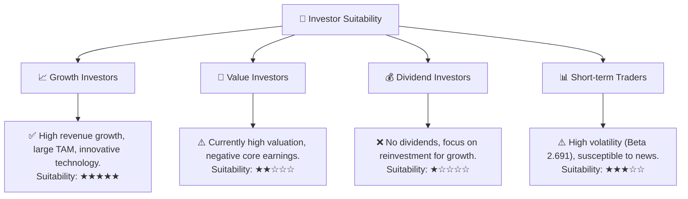
**分析**：ONDS 是一支典型的**成長型股票**，非常適合那些尋求高成長潛力、願意承受較高風險並持有較長時間的投資者。其在私有無線和無人機防禦領域的技術領先地位和巨大的市場機會，使其成為成長型投資者的潛在標的。對於**價值型投資者**而言，ONDS 目前的高估值和不穩定的核心盈利能力可能不符合其投資標準。**股息型投資者**則完全不適合，因為公司目前沒有派發股息。由於其高波動性 (Beta 2.691)，**短期交易者**可能會發現機會，但風險也相對較高。

### 10.5 關鍵監控指標

| 監控類型 | 指標 | 關注點 | 頻率 |
|----------|------|----------|------|
| **成長動能** | 季度營收YoY成長率 | 是否維持三位數成長，新訂單獲取情況 | 每季 |
| **獲利能力** | 營業利益率、淨利率 | 營運虧損是否持續收窄，核心營運盈利能力是否轉正 | 每季 |
| **現金流** | 營業現金流、自由現金流 | 是否轉為正值，現金消耗速度 | 每季 |
| **財務健康** | 總現金餘額、Debt/Equity | 現金是否充足，債務水平是否保持低位 | 每季 |
| **市場競爭** | 新產品發布、競爭對手動態 | 公司產品競爭力，市場份額變化 | 持續 |
| **股權結構** | 流通股數變化、Insider Ownership | 股權稀釋情況，管理層持股變動 | 每季 |
| **分析師情緒** | 目標價調整、評級變化 | 市場對公司前景的預期變化 | 持續 |

---

> **免責聲明**：本報告為 AI 自動生成，僅供研究參考，不構成投資建議。投資有風險，入市需謹慎。