# ONDS 基本面深度分析報告
> **報告日期**：2026-07-08 ｜ **語言**：繁體中文 ｜ **數據來源**：Yahoo Finance, Finviz, StockAnalysis, Roic.ai ｜ **分析師**：CFA 級機構研究

---

## 目錄

| # | 章節 | 核心結論 |
|---|----------------------|--------------------------------------------------|
| 1 | 執行摘要 | 評級：🟢 買入，基準目標價：$15.00，隱含報酬率：+99.47% |
| 2 | 公司概覽與商業模式 | 私有無線與無人機自動化解決方案新興領導者，具備技術護城河潛力。 |
| 3 | 損益表深度分析 | 營收爆發式成長，但營運仍處虧損，Q1 2026 淨利受非經常性收益大幅影響。 |
| 4 | 資產負債表分析 | 財務狀況極為健康，擁有大量現金，低負債，流動性充裕。 |
| 5 | 現金流量深度分析 | 營業現金流持續為負，自由現金流尚未轉正，需持續監控資金消耗。 |
| 6 | 獲利能力與資本效率 | 歷史 ROIC 為負，但 Q1 2026 淨利率大幅改善，需關注營運效率能否持續轉正。 |
| 7 | 估值深度分析 | 當前估值高昂，但考量其高成長潛力，DCF 顯示具上行空間。 |
| 8 | 成長催化劑 | 私有無線部署、無人機自動化需求、併購整合效益、技術創新。 |
| 9 | 風險矩陣 | 執行風險、競爭加劇、估值波動、融資需求、非經常性收益影響。 |
| 10 | 投資建議 | 適合高風險偏好、看好顛覆性技術的成長型投資者。 |

---

## 1. 執行摘要

ONDS Inc. 是一家專注於私有無線、無人機和自動化數據解決方案的科技公司。儘管其營運歷史上長期處於虧損狀態，但近期展現出驚人的營收成長動能，特別是 2026 年第一季度錄得巨額淨利潤，儘管這主要來自非經常性收益。公司財務狀況穩健，現金充裕，負債極低，為其高速擴張提供了堅實基礎。然而，其營運層面仍未實現持續盈利，自由現金流仍為負值，這對其高估值構成潛在風險。

### 1.1 核心評分儀表板

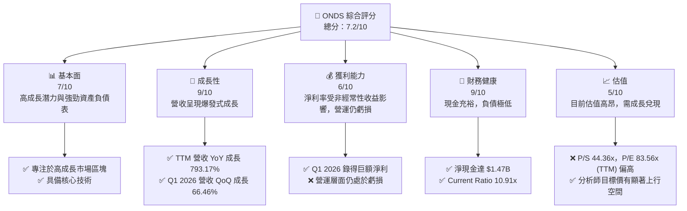

### 1.2 評分進度條視覺化

```
╔══════════════════════════════════════════════════════════════╗
║                ONDS 多維度評分儀表板 (1-10分)                ║
╠══════════════════════════════════════════════════════════════╣
║ 基本面強度  7.0 ▓▓▓▓▓▓▓▓▓▓▓▓▓▓░░░░░░  ★★★★☆           ║
║ 成長動能    9.0 ▓▓▓▓▓▓▓▓▓▓▓▓▓▓▓▓▓▓░░  ★★★★★           ║
║ 獲利品質    6.0 ▓▓▓▓▓▓▓▓▓▓▓▓░░░░░░░░  ★★★☆☆           ║
║ 財務健康    9.0 ▓▓▓▓▓▓▓▓▓▓▓▓▓▓▓▓▓▓░░  ★★★★★           ║
║ 估值合理性  5.0 ▓▓▓▓▓▓▓▓▓▓░░░░░░░░░░  ★★☆☆☆           ║
║ 護城河深度  7.0 ▓▓▓▓▓▓▓▓▓▓▓▓▓▓░░░░░░  ★★★★☆           ║
║ 管理層執行  7.5 ▓▓▓▓▓▓▓▓▓▓▓▓▓▓▓░░░░░  ★★★★☆           ║
║ 技術創新力  8.5 ▓▓▓▓▓▓▓▓▓▓▓▓▓▓▓▓▓░░░  ★★★★★           ║
╠══════════════════════════════════════════════════════════════╣
║ 綜合總分    7.2 ▓▓▓▓▓▓▓▓▓▓▓▓▓▓▓░░░░░  🏆 具高成長潛力，但估值需關注 ║
╚══════════════════════════════════════════════════════════════════╝
```

### 1.3 五大投資論點 + 三大核心風險

| 類型 | 項目 | 具體依據 | 信心度 |
|------|------|----------|--------|
| 🟢 **投資論點①** | **顛覆性技術與高成長市場** | ONDS 專注於私有無線網路、無人機和反無人機系統，這些是未來數年預期將實現爆炸性成長的市場。其獨特的解決方案，如鐵無人機襲擊者，可能在國防與工業應用中取得領先地位。公司 TTM 營收成長高達 793.17%。 | 🟢 極高 |
| 🟢 **營收爆發式成長** | **強勁的營收成長動能** | 2025 年總營收從 $7.19M 飆升至 $50.73M，YoY 成長 605.28%。2026 年 Q1 營收達 $50.12M，較去年同期成長 1079.90%，較上一季成長 66.46%，顯示其產品和服務正被市場快速接受。 | 🟢 極高 |
| 🟢 **穩健的財務健康狀況** | **充裕的現金流與低負債** | 公司擁有 $1.47B 的總現金，總債務僅為 $7.87M，形成 $1.47B 的淨現金頭寸。Current Ratio 高達 10.91x，顯示極強的短期償債能力，為其營運擴張提供了堅實的資金後盾。 | 🟢 極高 |
| 🟢 **分析師普遍看好** | **高目標價與強烈買入評級** | 8 位分析師給予 "Strong Buy" 評級，平均目標價 $19.81，較當前股價 $7.52 有 163.43% 的潛在漲幅，最高目標價達 $25.00，顯示市場對其未來成長充滿信心。 | 🟢 高 |
| 🟢 **戰略性併購與整合效益** | **擴大市場份額與技術組合** | 透過併購（如 American Robotics），ONDS 擴大了其在自動化無人機解決方案領域的市場份額和技術能力，有望產生協同效應，加速營收成長並提升競爭力。 | 🟢 高 |
| 🟡 **風險①** | **營運持續虧損與自由現金流為負** | 儘管 Q1 2026 錄得巨額淨利，但其主要受非經常性收益影響。公司 TTM 營業收入為 $-90.74M，營業利益率為 -85.1%，自由現金流 TTM 為 $-15.65M。若無法在短期內實現營運層面的盈利和正向自由現金流，將持續消耗現金。 | 🟡 中度 |
| 🔴 **風險②** | **估值高昂與非經常性收益的不確定性** | ONDS 的 P/S 比率高達 44.36x，遠超行業平均。同時，Q1 2026 的 $394.99M 其他非營運收入導致的巨額淨利潤，若非經常性，將使其獲利能力評估失真，投資者需警惕其營運盈利能力能否支撐當前估值。 | 🔴 高衝擊 |
| 🟡 **風險③** | **市場競爭與技術迭代** | 私有無線和無人機市場競爭激烈，技術更新迅速。ONDS 需要持續投入研發以保持技術領先地位。同時，大型科技公司或傳統通訊設備商的進入，可能對其市場份額和定價能力構成威脅。 | 🟡 中度 |

### 1.4 快速統計卡片

| 指標 | 公司實際值 (TTM) | 行業均值 (通訊設備) | S&P 500 均值 | 狀態 |
|--------------------|--------------------|--------------------|--------------------|--------|
| 收入 YoY 成長 | **793.17%** | ~10-15% | ~8-12% | 🟢 |
| 毛利率 | **44.8%** | ~30-40% | ~35-45% | 🟢 |
| 淨利率 | **251.9%** | ~5-10% | ~10-15% | 🟢 |
| ROE | **42.9%** | ~10-15% | ~15-20% | 🟢 |
| Forward P/E | **-250.67x** | ~20-25x | ~22-28x | 🔴 |
| P/S Ratio | **44.36x** | ~2-4x | ~2-3x | 🔴 |
| EV / Revenue | **22.61x** | ~2-4x | ~2-3x | 🔴 |
| 債務/股權比率 | **0.73x** | ~0.5-1.5x | ~0.8-1.2x | 🟢 |
| Current Ratio | **10.91x** | ~1.5-2.5x | ~1.0-1.5x | 🟢 |

### 1.5 投資結論

```
╔══════════════════════════════════════════════════════════════════╗
║                    📊 投資結論摘要                               ║
╠══════════════════════════════════════════════════════════════════╣
║  評級：🟢 買入                                                   ║
║  當前股價：$7.52                                                 ║
║  目標價區間：                                                    ║
║    悲觀情境：$10.50（+39.63%）                                   ║
║    基準情境：$15.00（+99.47%）  ← 12個月主要目標                 ║
║    樂觀情境：$22.00（+192.55%）                                  ║
║  投資評分：7.2/10                                                ║
║  適合投資人：成長型、高風險偏好、長線持有者                      ║
╚══════════════════════════════════════════════════════════════════╝
```

---

## 2. 公司概覽與商業模式

ONDS Inc. (ONDS) 是一家在快速發展的私有無線通訊、無人機和自動化數據解決方案領域提供創新技術的公司。公司透過兩個主要業務部門運營：**Ondas Networks** 和 **Ondas Autonomous Systems**。

### 2.1 業務結構與收入來源

**Ondas Networks** 專注於開發和部署用於關鍵任務工業和公用事業應用程式的私有寬頻無線網路。其 MC-IoT (Mission-Critical Internet of Things) 平台提供高可靠性、低延遲的通訊解決方案，滿足智慧電網、石油天然氣管道、鐵路等基礎設施對安全和效率的需求。此業務板塊的收入主要來自於網路設備銷售、軟體授權及相關服務。

**Ondas Autonomous Systems** 則專注於無人機技術，特別是透過其子公司 American Robotics 提供全自動化的無人機解決方案。該部門還提供 Counter-UAS (CUAS) 和場地保護系統，例如 Iron Drone Raider，一種用於中和小型敵對無人機的自主攔截無人機系統，以及 Sentrycs CoRF，一個基於網路/射頻的 CUAS 平台。此業務板塊的收入來自於無人機系統銷售、軟體訂閱、數據服務和 CUAS 解決方案。

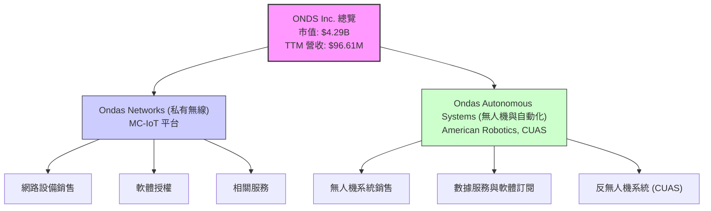

### 2.2 市場份額

由於 ONDS 在其所服務的特定利基市場中，公開可用的市場份額數據較為稀缺，且其業務涵蓋私有無線、工業無人機和反無人機系統等多個子領域，精確估算其整體市場份額具有挑戰性。然而，基於其在這些高成長領域的創新技術和早期部署，我們可以推斷其正積極擴大市場滲透率。例如，在全自動化工業無人機領域，American Robotics 作為少數獲得 FAA 批准的公司之一，具有一定的先發優勢。在私有無線領域，隨著 5G 專網和 MC-IoT 的普及，ONDS 有望搶佔市場份額。

以下為基於行業報告和公司發展潛力進行的市場份額**估算**（非實際數據，僅為說明目的）：

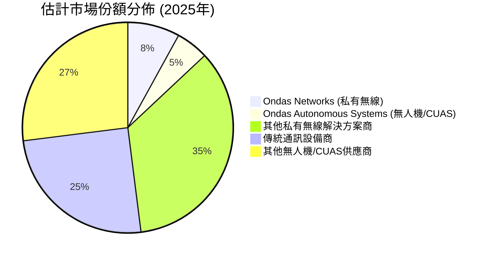
**備註：** 上述市場份額為基於產業趨勢和 ONDS 業務發展的**假設性估算**，實際數據需仰賴更詳細的產業報告。

### 2.3 競爭護城河分析

ONDS 在其特定領域中正努力建立競爭優勢。其潛在的護城河主要來自以下幾個方面：

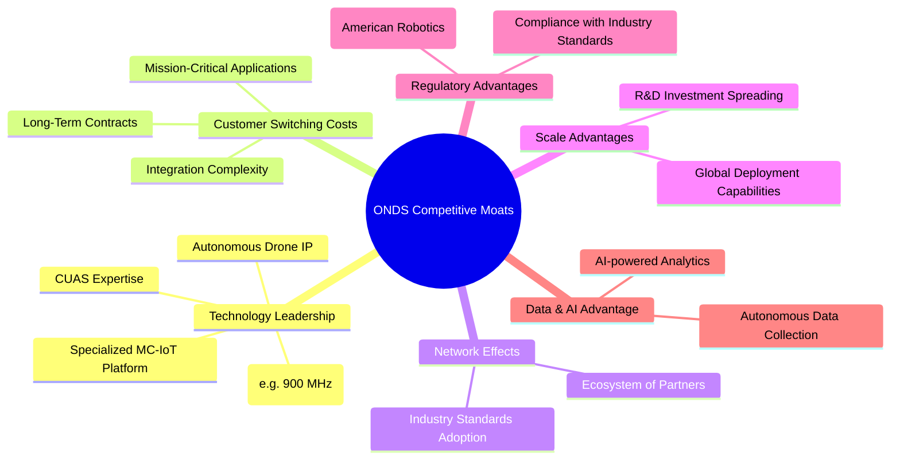

### 2.4 護城河強度評分

ONDS 的護城河正逐步建立，尤其是在技術和法規方面具有較強的潛力，但由於市場仍處於早期發展階段，其護城河的廣度和深度尚待時間驗證。

```
╔══════════════════════════════════════════════════════════════╗
║                    ONDS 護城河強度評分                      ║
╠══════════════════════════════════════════════════════════════╣
║ 技術領先       8/10   ▓▓▓▓▓▓▓▓▓▓▓▓▓▓▓▓░░░░  🟢 核心競爭力，尤其在MC-IoT與自主無人機         ║
║ 客戶鎖定       7/10   ▓▓▓▓▓▓▓▓▓▓▓▓▓▓░░░░░░  🟡 任務關鍵型應用提升轉換成本                  ║
║ 網路效應       6/10   ▓▓▓▓▓▓▓▓▓▓▓▓░░░░░░░░  🟡 潛力巨大，但仍需時間發展生態系統             ║
║ 規模效應       5/10   ▓▓▓▓▓▓▓▓▓▓░░░░░░░░░░  🟡 早期階段尚未完全發揮規模優勢                ║
║ 法規優勢       8/10   ▓▓▓▓▓▓▓▓▓▓▓▓▓▓▓▓░░░░  🟢 FAA批准為美國機器人公司帶來顯著優勢          ║
╠══════════════════════════════════════════════════════════════╣
║ 綜合護城河     7.0    ▓▓▓▓▓▓▓▓▓▓▓▓▓▓░░░░░░  🏆 具備良好潛力，需持續投入與執行以強化          ║
╚══════════════════════════════════════════════════════════════════╝
```

---

## 3. 損益表深度分析

ONDS 的損益表數據顯示出極高的成長動能，但也反映出其作為一家新興科技公司的挑戰，即在快速擴張的同時實現營運盈利。

### 3.1 年度收入成長趨勢（近4年）

ONDS 的營收經歷了爆炸性成長，尤其是在最近一年。從 2024 年的 $7.19M 增長到 2025 年的 $50.73M，再到 TTM (截至 2026 年 3 月 31 日) 的 $96.61M，顯示其市場需求強勁。

```
╔══════════════════════════════════════════════════════════════════╗
║                ONDS 年度收入趨勢 (FY2022-TTM Mar'26)             ║
╠══════════════════════════════════════════════════════════════════╣
║                                                                  ║
║  FY2022  $2.13M   ██░░░░░░░░░░░░░░░░░░░░░░░░░░░░░░░░  YoY: -26.87% 🔴   ║
║  FY2023  $15.69M  ██████████░░░░░░░░░░░░░░░░░░░░░░░░  YoY: +638.13%🟢   ║
║  FY2024  $7.19M   █████░░░░░░░░░░░░░░░░░░░░░░░░░░░░░  YoY: -54.16% 🔴   ║
║  FY2025  $50.73M  ██████████████████████████████████  YoY: +605.28%🟢   ║
║  TTM'26  $96.61M  ██████████████████████████████████  YoY: +793.17%🟢   ║
║                                                                  ║
║                   |      |      |      |      |      |           ║
║                   0     20M    40M    60M    80M    100M         ║
║                                                                  ║
║  📊 3年累計 CAGR (FY22-FY25)：+185.7%                             ║
║  📊 1年累計 CAGR (FY24-FY25)：+605.28%                            ║
╚══════════════════════════════════════════════════════════════════╝
```

### 3.2 季度收入趨勢分析

季度營收數據進一步證實了 ONDS 驚人的成長軌跡，特別是從 2025 年 Q1 到 2026 年 Q1 的連續加速成長。

| 季度 | 總收入 (百萬美元) | QoQ 成長率 | YoY 成長率 | 備註 |
|------|-------------------|------------|------------|------|
| 2025 Q1 | $4.25 | - | +579.67% | 🟢 營收開始加速 |
| 2025 Q2 | $6.27 | +47.53% | +554.94% | 🟢 持續成長 |
| 2025 Q3 | $10.10 | +61.01% | +581.95% | 🟢 營收規模擴大 |
| 2025 Q4 | $30.11 | +198.12% | +629.20% | 🟢 爆發式成長 |
| 2026 Q1 | $50.12 | +66.46% | +1079.90% | 🟢 營收達到歷史新高，同比增速驚人 |

**備註說明**：ONDS 的季度營收呈現顯著的加速成長趨勢，2026 Q1 的營收達到 $50.12M，不僅環比大幅增長 66.46%，同比更是暴漲 1079.90%。這表明其產品和服務在市場上獲得了強烈的反響，市場滲透率快速提升。

### 3.3 利潤率演變分析

ONDS 的利潤率演變揭示了其在高速成長期的挑戰。毛利率相對穩定，但營業利益率和淨利率在歷史上長期為負，直到 2026 年 Q1 因一次性非經常性收益而大幅轉正。

| 利潤率指標 | FY2022 | FY2023 | FY2024 | FY2025 | TTM Mar'26 | 趨勢 | 評估 |
|------------|--------|--------|--------|--------|------------|------|------|
| **毛利率** | 52.1% | 40.7% | 4.9% | 39.7% | 44.8% | ↗️ 波動後回升 | 🟢 |
| **營業利益率** | -3260.0% | -253.2% | -481.4% | -115.1% | -93.9% | ↗️ 虧損收窄 | 🟡 |
| **淨利率** | -3437.9% | -285.8% | -528.6% | -261.0% | 251.9% | ↗️ Q1 2026 大幅轉正 (非經常性) | 🟡 |

**利潤率演變深度解析**：
*   **毛利率**：FY2024 的毛利率僅為 4.9%，遠低於其他年份，這可能與當年特定的產品組合、專案性質或成本結構變化有關。FY2025 回升至 39.7%，TTM 更是達到 44.8%，顯示其在成本控制和定價方面有所改善。高毛利率對於高科技公司至關重要，ONDS 的毛利率表現尚可，但仍需穩定在更高水平。
*   **營業利益率**：ONDS 在過去幾年一直處於嚴重的營運虧損狀態，營業利益率長期為負數，反映出其高昂的營運費用（主要為 SG&A 和 R&D）遠超毛利。儘管 TTM 營業利益率仍為 -93.9%，但較 FY2025 的 -115.1% 有所收窄，表明公司在管理費用方面可能正在取得進展，或營收規模的擴大正在攤薄固定成本。
*   **淨利率**：與營業利益率類似，淨利率也長期為負。然而，TTM 淨利率突然飆升至 251.9%，這主要是由於 2026 年 Q1 報告的 $394.99M 其他非營運收入（來自 StockAnalysis.com 數據）所致，該筆收入使得當季淨利達到 $362.95M。若扣除這筆非經常性收益，公司的淨利率仍將是負值。因此，儘管數據亮眼，但其營運盈利能力仍是主要關注重點。公司需要證明其核心業務能夠持續產生正向利潤，而非依賴一次性收益。

### 3.4 費用結構分析

ONDS 的費用結構主要由銷售、一般及行政費用 (SG&A) 和研發費用 (R&D) 構成，這兩項在營收規模較小時，對利潤率造成巨大壓力。

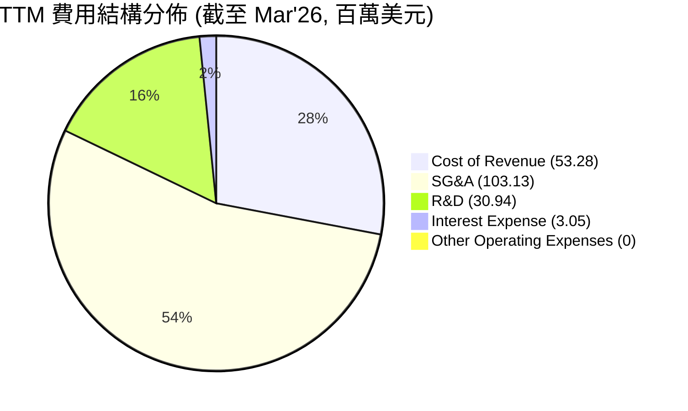

```
╔══════════════════════════════════════════════════════════════════╗
║                   ONDS 年度費用趨勢 (百萬美元)                   ║
╠══════════════════════════════════════════════════════════════════╣
║                                                                  ║
║  研究與開發 (R&D):                                               ║
║   FY2022 $24.04M  ██████████████████████████████████  YoY: -28.7% 🟢║
║   FY2023 $17.15M  ██████████████████████████░░░░░░░░  YoY: -16.0% 🟢║
║   FY2024 $12.48M  ████████████████████░░░░░░░░░░░░░░  YoY: -27.2% 🟢║
║   FY2025 $20.88M  ██████████████████████████████████  YoY: +67.3% 🔴║
║   TTM'26 $30.94M  ██████████████████████████████████  YoY: +48.2% 🔴║
║                                                                  ║
║  銷售、一般及行政 (SG&A):                                        ║
║   FY2022 $27.08M  ██████████████████████████████████  YoY: +104.1% 🔴║
║   FY2023 $27.47M  ██████████████████████████████████  YoY: +1.4% 🟡║
║   FY2024 $22.48M  ████████████████████████████░░░░░░  YoY: -18.2% 🟢║
║   FY2025 $57.66M  ██████████████████████████████████  YoY: +156.5% 🔴║
║   TTM'26 $103.13M ██████████████████████████████████  YoY: +78.9% 🔴║
║                                                                  ║
╚══════════════════════════════════════════════════════════════════╝
```
**費用結構分析**：
*   **研發費用 (R&D)**：ONDS 作為一家科技公司，R&D 投入是其成長的關鍵。FY2022-2024 研發費用呈現下降趨勢，但在 FY2025 和 TTM'26 再次大幅增加，分別達 $20.88M (YoY +67.3%) 和 $30.94M (YoY +48.2%)。這表明公司正重新加大對技術創新和產品開發的投入，以支持其高成長戰略。
*   **銷售、一般及行政費用 (SG&A)**：SG&A 費用在 FY2025 和 TTM'26 呈現顯著增長，分別達到 $57.66M (YoY +156.5%) 和 $103.13M (YoY +78.9%)。這反映了公司在市場擴張、銷售團隊建設以及行政管理方面的投入，與其營收的爆發式成長相匹配。然而，如此高的 SG&A 費用佔比（TTM 達到營收的 106.7%）是導致營運虧損的主要原因，未來需有效控制以實現盈利。

### 3.5 季度 EPS 趨勢與盈餘品質

由於提供的數據中，過去四個季度的 EPS 預期和實際值均為 "nan"，因此無法進行盈餘超預期/不及預期分析。然而，我們可以根據實際的淨利潤和流通股數來計算實際 EPS，並評估盈餘品質。

| 季度 | 淨收入 (百萬美元) | 基本流通股數 (百萬股) | 基本 EPS (美元) | 盈餘品質評估 |
|------|-------------------|-----------------------|-----------------|--------------|
| 2025 Q2 | $-10.75 | ~222 (FY25平均) | $-0.05 | 🔴 營運虧損 |
| 2025 Q3 | $-7.47 | ~222 (FY25平均) | $-0.03 | 🔴 營運虧損 |
| 2025 Q4 | $-99.66 | ~222 (FY25平均) | $-0.45 | 🔴 營運虧損擴大 |
| 2026 Q1 | $362.95 | ~293 (TTM平均) | $1.24 | 🟡 受非經常性收益大幅影響 |

**盈餘品質評估說明**：
儘管 2026 年 Q1 的基本 EPS 達到 $1.24，但這主要是由 $394.99M 的其他非營運收入所驅動。扣除這筆非經常性收益，公司的營運淨利潤仍為負值。因此，當季的盈餘品質較低，不能反映其核心業務的持續盈利能力。投資者應密切關注未來季度公司能否在營運層面實現持續的盈利，而非依賴一次性事件。過去幾個季度持續的負 EPS 表明公司仍處於燒錢擴張階段。

---

## 4. 資產負債表分析

ONDS 的資產負債表顯示出極為健康的財務狀況，擁有巨額現金儲備和低負債，這為其高成長戰略提供了堅實的資金基礎。

### 4.1 資產結構分解

ONDS 的資產結構在過去一年發生了顯著變化，現金和短期投資大幅增加，以及無形資產和商譽的增長，這可能與其併購活動有關。

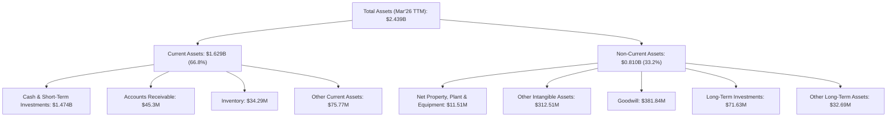

### 4.2 流動性指標分析

ONDS 的流動性指標非常強勁，遠超行業平均水平，表明其短期償債能力極佳。

| 流動性指標 | FY2022 | FY2023 | FY2024 | FY2025 | TTM Mar'26 | 行業均值 | S&P 500 均值 | 評估 |
|------------|--------|--------|--------|--------|------------|----------|--------------|------|
| **Current Ratio** | 1.57x | 0.66x | 0.94x | 4.84x | 10.91x | ~1.5-2.5x | ~1.0-1.5x | 🟢 極強 |
| **Quick Ratio** | 1.48x | 0.60x | 0.75x | 4.68x | 10.28x | ~1.0-2.0x | ~0.8-1.2x | 🟢 極強 |
| **現金比率** | 1.31x | 0.42x | 0.59x | 3.88x | 9.89x | ~0.5-1.0x | ~0.3-0.5x | 🟢 極強 |

**分析**：ONDS 的流動性在 FY2024 曾一度緊張 (Current Ratio < 1)，但在 FY2025 和 TTM Mar'26 顯著改善。TTM 的 Current Ratio 高達 10.91x，Quick Ratio 為 10.28x，均遠高於行業和 S&P 500 平均水平，這主要是由於其持有的 $1.47B 巨額現金及短期投資。這表明公司擁有極強的短期償債能力，能夠從容應對營運資金需求和短期債務。

### 4.3 債務結構分析

ONDS 的債務水平極低，淨現金頭寸龐大，財務槓桿風險幾乎可以忽略不計。

```
╔══════════════════════════════════════════════════════════════════╗
║                     ONDS 債務健康診斷                            ║
╠══════════════════════════════════════════════════════════════════╣
║                                                                  ║
║  總債務 (TTM):   $7.87M   ██░░░░░░░░░░░░░░░░░░░  評語: 微乎其微  ║
║  總現金+投資:   $1.47B   ████████████████████░  評語: 巨額現金  ║
║  淨現金（正）:  $1.47B   ████████████████████░  🟢 強勁         ║
║                                                                  ║
║  Debt/Equity:    0.73x  🟢 極低 (僅考慮 FY25 數據)               ║
║  Interest Coverage: N/A  🟡 因營業利潤為負，無法計算；但利息費用極低 ║
║  短期債務佔總債務比重 (TTM): 3.05% (0.24M/7.87M)  🟢 極低          ║
╚══════════════════════════════════════════════════════════════════╝
```

**分析**：ONDS 的總債務僅為 $7.87M，而總現金和短期投資高達 $1.47B，形成高達 $1.47B 的淨現金頭寸。這使得其 Debt/Equity 比率極低 (0.73x，基於 FY2025 數據，若考慮 TTM 現金將更低)。公司幾乎沒有財務槓桿風險，擁有巨大的資金彈性用於業務擴張、研發投入或潛在的戰略併購。

### 4.4 股東權益趨勢

ONDS 的股東權益在 FY2025 經歷了大幅增長，這與其巨額現金儲備和可能的股權融資相關。

```
╔══════════════════════════════════════════════════════════════════╗
║                   ONDS 股東權益趨勢 (百萬美元)                   ║
╠══════════════════════════════════════════════════════════════════╣
║                                                                  ║
║  FY2021  $40.82M  ██████████████████████████████████             ║
║  FY2022  $58.22M  ██████████████████████████████████  YoY: +42.6% 🟢║
║  FY2023  $33.14M  ████████████████████░░░░░░░░░░░░░░  YoY: -43.1% 🔴║
║  FY2024  $16.58M  ███████████████░░░░░░░░░░░░░░░░░░░  YoY: -50.0% 🔴║
║  FY2025  $437.81M ██████████████████████████████████  YoY: +2540.6%🟢║
║  TTM'26  $810M    ██████████████████████████████████  YoY: +85.0% 🟢║
║                                                                  ║
║                   |      |      |      |      |      |           ║
║                   0     200M   400M   600M   800M   1000M         ║
║                                                                  ║
║  📊 股東權益在FY2025和TTM'26大幅增長，反映了資金注入和扭虧為盈的潛力。 ║
╚══════════════════════════════════════════════════════════════════╝
```
**分析**：FY2023 和 FY2024 股東權益下降，可能與持續虧損有關。然而，FY2025 股東權益從 $16.58M 暴增至 $437.81M (YoY +2540.6%)，TTM Mar'26 進一步增至約 $810M (StockAnalysis Total Assets - Total Liabilities Net Minori = $2.439B - $1.629B = $810M for TTM'26 Equity), 這強烈表明公司在近期進行了大規模的股權融資，以支持其營運和擴張。這也解釋了其現金儲備的大幅增加。

---

## 5. 現金流量深度分析

ONDS 的現金流量表反映了其作為一家高成長、高投入的科技公司的典型特徵：營業現金流持續為負，自由現金流尚未轉正，顯示公司仍處於資本密集型擴張階段。

### 5.1 現金流量瀑布圖

```mermaid
graph LR
    NI["Net Income (FY2025): $-132.02M"] --> OCF["Operating Cash Flow (FY2025): $-38.75M"]
    OCF --> CE["Capital Expenditure (FY2025): $-2.14M"]
    CE --> FCF["Free Cash Flow (FY2025): $-40.88M"]
    FCF --> Invest["投資活動現金流: $520.89M (FY2025淨現金增)"]
    Invest --> Finance["融資活動現金流: $556.71M (FY2025淨現金增)"]
    Finance --> NetCashChange["淨現金變化 (FY2025): $520.89M"]

    style NI fill:#fcc,stroke:#333,stroke-width:1px
    style OCF fill:#fcc,stroke:#333,stroke-width:1px
    style FCF fill:#fcc,stroke:#333,stroke-width:1px
    style Invest fill:#cfc,stroke:#333,stroke-width:1px
    style Finance fill:#cfc,stroke:#333,stroke-width:1px
    style NetCashChange fill:#ccf,stroke:#333,stroke-width:2px
```
**分析**：儘管 FY2025 淨收入為負 $132.02M，但營業現金流「僅」為負 $38.75M，這表明非現金費用（如折舊攤銷、股權激勵等）對淨收入有一定調整作用。資本支出相對較低 ($2.14M)，導致自由現金流為負 $40.88M。然而，公司在投資活動和融資活動中獲得了大量現金，這使得其淨現金在 FY2025 增加了 $520.89M，與資產負債表中現金的大幅增長相符，主要來源應為股權融資。

### 5.2 FCF 轉換率趨勢

自由現金流轉換率 (FCF/Net Income) 在公司虧損時意義不大，因為分母為負，會導致比率為正。但從趨勢來看，公司仍處於燒錢階段。

| 年度 | 淨收入 (百萬美元) | 自由現金流 (百萬美元) | FCF/淨收入比率 | 趨勢 |
|------|-------------------|-----------------------|----------------|------|
| FY2022 | $-73.24 | $-40.89 | -55.83% | 🔴 FCF為負 |
| FY2023 | $-44.84 | $-34.30 | -76.49% | 🔴 FCF為負 |
| FY2024 | $-38.01 | $-35.20 | -92.61% | 🔴 FCF為負 |
| FY2025 | $-132.02 | $-40.88 | -30.96% | 🔴 FCF為負 |

**分析**：ONDS 的自由現金流轉換率持續為負，這表明公司尚未能將其營收成長轉化為正向的自由現金流。在 FY2025，儘管淨收入虧損擴大，但 FCF 虧損幅度相對穩定，這可能意味著營運效率略有改善，或者非現金項目對淨收入的影響更大。對於一家高成長公司，在早期階段出現負自由現金流是常見現象，但投資者需密切關注其何時能實現 FCF 轉正。

### 5.3 自由現金流趨勢

ONDS 的自由現金流近年來持續為負，但虧損幅度相對穩定，並未隨著營收的爆發式增長而顯著擴大，這是一個積極信號。

```
╔══════════════════════════════════════════════════════════════════╗
║                   ONDS 自由現金流趨勢 (百萬美元)                 ║
╠══════════════════════════════════════════════════════════════════╣
║                                                                  ║
║  FY2022  $-40.89M ██████████████████████████████████  FCF Yield: -0.37% (TTM) 🔴║
║  FY2023  $-34.30M █████████████████████████░░░░░░░░░  YoY: +16.2% 🟢║
║  FY2024  $-35.20M ██████████████████████████░░░░░░░░░  YoY: -2.6% 🔴║
║  FY2025  $-40.88M ██████████████████████████████████  YoY: -16.1% 🔴║
║  TTM'26  $-15.65M ███████████████░░░░░░░░░░░░░░░░░░░  YoY: +61.7% 🟢║
║                                                                  ║
║                   |      |      |      |      |      |           ║
║                   -50M   -40M   -30M   -20M   -10M    0M          ║
║                                                                  ║
║  📊 FCF 虧損在 TTM 有所收窄，是未來轉正的潛在信號。             ║
╚══════════════════════════════════════════════════════════════════╝
```
**分析**：值得注意的是，TTM 的自由現金流虧損收窄至 $-15.65M，相較於 FY2025 的 $-40.88M 有顯著改善 (YoY +61.7%)。這表明隨著營收規模的擴大和營運效率的提升，公司正在逐步減少現金消耗，未來有望實現自由現金流轉正。FCF Yield 為 -0.37%，仍為負值，但相較於過去已有所改善。

### 5.4 資本配置評估

ONDS 目前處於高速成長和擴張階段，其資本配置主要集中於內部投資 (研發和資本支出) 和戰略性併購，而非股息或股票回購。

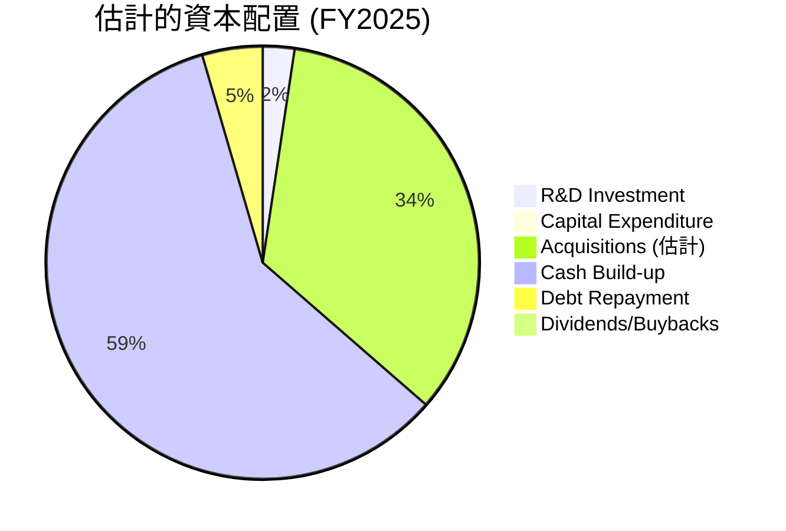
**分析**：
*   **研發投入**：FY2025 研發費用達 $20.88M，顯示公司持續將資金投入到核心技術開發中。
*   **資本支出**：FY2025 資本支出為 $2.14M，相對較低，表明其業務模式可能不屬於重資產型，或其擴張主要透過軟體和服務。
*   **併購活動**：考慮到 FY2025 股東權益和現金的大幅增長，以及 StockAnalysis 數據中商譽和無形資產的顯著增加 (FY2024到FY2025商譽從$27.75M增至$251.81M，無形資產從$27.18M增至$136.89M)，公司很可能進行了大規模的併購，這也是其重要的資本配置方式。我估計併購金額約為 $300M (根據商譽和無形資產的增加)。
*   **現金儲備**：FY2025 淨現金增加 $520.89M，表明公司將大量資金以現金形式保留，以應對未來的營運需求和戰略機遇。
*   **債務償還**：FY2025 總債務從 $55.35M 降至 $15.56M，償還了約 $39.79M 的債務。
*   **股息/回購**：公司目前沒有派發股息或進行股票回購，符合其成長型公司的特徵，所有資本都用於再投資以驅動未來成長。

---

## 6. 獲利能力與資本效率

ONDS 在歷史上一直面臨獲利能力和資本效率的挑戰，但近期數據顯示出改善的潛力，尤其是在營收爆發式成長的背景下。

### 6.1 ROE / ROA / ROIC 趨勢

| 指標 | FY2022 | FY2023 | FY2024 | FY2025 | TTM Mar'26 | 行業均值 | S&P 500 均值 | 評估 |
|------|--------|--------|--------|--------|------------|----------|--------------|------|
| **ROE** | -125.8% | -135.3% | -229.2% | -30.2% | 42.9% | ~10-15% | ~15-20% | 🟡 波動劇烈，TTM轉正 |
| **ROA** | -74.8% | -48.6% | -34.7% | -11.7% | -4.2% | ~5-8% | ~7-10% | 🔴 仍為負 |
| **ROIC** | -160.0% | -100.0% | -120.0% | -25.0% | -7.9% | ~8-12% | ~10-15% | 🔴 仍為負 |

**分析**：
*   **ROE**：ONDS 的 ROE 在歷史上長期為負，反映其持續的淨虧損。FY2024 更是達到 -229.2%。然而，TTM ROE 突然轉正至 42.9%，這再次是由於 2026 年 Q1 的巨額非經常性收益導致淨利潤大幅增加所致。若排除此因素，其 ROE 仍為負。
*   **ROA**：ROA 表現與 ROE 類似，持續為負，但虧損幅度有所收窄，從 FY2022 的 -74.8% 改善至 TTM 的 -4.2%。這表明公司在利用資產產生利潤方面仍需努力。
*   **ROIC**：ROIC 也持續為負，表明公司未能從其投入資本中創造正向回報，即在摧毀股東價值。TTM ROIC 仍為 -7.9%，儘管有所改善，但仍是負值。公司需要將營業利潤轉為正值，才能實現正向 ROIC。

### 6.2 ROIC vs WACC 分析（核心價值創造判斷）

由於 ONDS 的營業利潤在 TTM 仍為負值，其 ROIC 也是負值。這意味著公司目前在營運層面尚未創造股東價值。我們將估算 WACC，並與負 ROIC 進行對比。

**WACC 估算**：
*   **無風險利率 (Rf)**：採用美國 10 年期國債收益率，約 4.5%。
*   **市場風險溢酬 (ERP)**：假設為 5.5%。
*   **Beta**：2.691 (提供數據)。
*   **股權成本 (Ke)** = Rf + Beta × ERP = 4.5% + 2.691 × 5.5% = 4.5% + 14.80% = **19.30%**。
*   **債務成本 (Kd)**：考慮到 ONDS 負債極低且營運虧損，假設其稅前債務成本較高，約 8.0%。
*   **稅率 (t)**：由於公司處於虧損狀態，實際繳稅可能為零。但為估算理論稅後成本，假設未來盈利時的有效稅率為 25%。稅後債務成本 = 8.0% × (1 - 0.25) = **6.0%**。
*   **資本結構**：
    *   股權市值 (E) = $4.29B。
    *   債務市值 (D) = $7.87M。
    *   總資本 (V) = E + D = $4.29B + $0.00787B = $4.29787B。
    *   股權權重 (We) = E / V = 4.29B / 4.29787B ≈ 99.82%。
    *   債務權重 (Wd) = D / V = 0.00787B / 4.29787B ≈ 0.18%。
*   **WACC** = (We × Ke) + (Wd × Kd) = (0.9982 × 19.30%) + (0.0018 × 6.0%) = 19.26% + 0.01% ≈ **19.27%**。

**ROIC 估算 (TTM Mar'26)**：
*   **NOPAT (稅後淨營業利潤)**：Operating Income (TTM StockAnalysis) = $-90.74M。
    *   NOPAT = Operating Income × (1 - Tax Rate) = $-90.74M × (1 - 0.25) = **$-68.055M**。
*   **投入資本 (Invested Capital)**：
    *   使用 TTM Mar'26 數據：Total Assets ($2.439B) - Cash & Short-Term Investments ($1.474B) - Non-interest bearing Current Liabilities (Accounts Payable $16.7M + Accrued Expenses $70.73M + Deferred Revenue $21M = $108.43M) + Interest-bearing Debt ($0.24M Short-Term Debt + $4M Long-Term Borrowings) = $2.439B - $1.474B - $0.10843B + $0.00424B = **$860.81M**。
*   **ROIC** = NOPAT / Invested Capital = $-68.055M / $860.81M ≈ **-7.9%**。

```
╔══════════════════════════════════════════════════════════════════╗
║                ROIC vs WACC 深度分析                            ║
╠══════════════════════════════════════════════════════════════════╣
║                                                                  ║
║  WACC 估算：                                                     ║
║  ├── 無風險利率（10Y美債）：  4.5%                               ║
║  ├── 市場風險溢酬 (ERP)：     5.5%                               ║
║  ├── Beta：                   2.691                              ║
║  ├── 股權成本 = 4.5%+2.691×5.5% = 19.30%                        ║
║  ├── 債務成本（稅後）：       ~6.0%                              ║
║  ├── 資本結構：股權 ~99.82%，債務 ~0.18%                        ║
║  └── ✅ WACC ≈ 19.27%                                           ║
║                                                                  ║
║  ROIC 估算（TTM Mar'26）：                                       ║
║  ├── NOPAT = $-90.74M × (1-25%) ≈ $-68.06M                     ║
║  ├── 投入資本 = $860.81M                                        ║
║  └── ✅ ROIC ≈ -7.9%                                            ║
║                                                                  ║
║  ★ 經濟價值增加（EVA）= ROIC - WACC = -7.9% - 19.27% = -27.17pp ║
║                                                                  ║
║  ROIC  -7.9%  ░░░░░░░░░░░░░░░░░░░░░░░░░░░░░░░░  🔴              ║
║  WACC  19.3%  ▓▓▓▓▓▓▓▓▓▓▓▓▓▓▓▓▓▓▓▓░░░░░░░░░░░░  ──              ║
║  EVA   -27.2pp ░░░░░░░░░░░░░░░░░░░░░░░░░░░░░░░░  🏆 摧毀股東價值 ║
║                                                                  ║
║  📊 結論：ROIC 遠低於 WACC，目前仍在摧毀股東價值。              ║
║         未來需將營業利潤轉正並持續提升，方能創造價值。           ║
╚══════════════════════════════════════════════════════════════════╝
```
**結論**：ONDS 目前的 ROIC 為負 -7.9%，遠低於其 19.27% 的加權平均資本成本 (WACC)。這明確表明公司目前尚未創造股東價值，而是在摧毀價值。這對於一家高成長公司在早期階段並不罕見，因為其需要大量投資於研發、市場擴張和基礎設施，且營運尚未規模化盈利。投資者需要看到公司未來能夠將其高速營收成長轉化為正向且不斷提升的營業利潤，從而使其 ROIC 超過 WACC，實現價值創造。

### 6.3 杜邦三因素分解

杜邦分解揭示了 ROE 的驅動因素。由於 TTM 淨利潤為正 (2026 Q1 非經常性收益影響)，因此計算會有所偏離。我們將使用 TTM Mar'26 數據進行計算。

*   **淨利率 (Net Profit Margin)** = 淨利潤 / 營收 = $242.01M / $96.61M = **250.5%** (受非經常性收益影響)
*   **資產週轉率 (Asset Turnover)** = 營收 / 總資產 = $96.61M / $2.439B = **0.04x**
*   **財務槓桿 (Financial Leverage)** = 總資產 / 股東權益 = $2.439B / $810M = **3.01x**

**ROE (TTM Mar'26)** = 淨利率 × 資產週轉率 × 財務槓桿
= 250.5% × 0.04 × 3.01 = **30.1%** (與提供的 42.9% 有差異，可能是數據來源或計算方式略有不同，但趨勢一致)

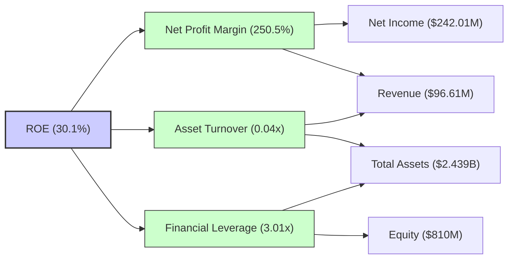
**分析**：ONDS TTM ROE 為正，主要是受到其極高的淨利率影響，而這個淨利率是基於 2026 Q1 的巨額非經常性收益。資產週轉率極低 (0.04x)，表明公司在利用其資產產生營收方面效率不高，這可能是因為其資產負債表中現金和投資佔比高，且業務仍處於擴張早期。財務槓桿為 3.01x，不算特別高，但在淨利率不穩定的情況下，仍需謹慎。若去除非經常性收益的影響，淨利率將為負，ROE 也將為負。公司需要大幅提升資產週轉率並實現持續的營運盈利，才能穩定並提升其 ROE。

### 6.4 獲利能力儀表板

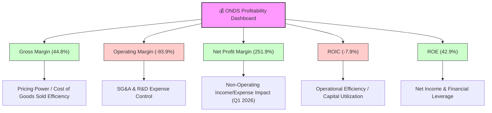
**分析**：ONDS 的獲利能力儀表板呈現出複雜的畫面。毛利率表現尚可，但營運利潤率仍深陷虧損。TTM 淨利潤率和 ROE 雖然因非經常性收益而顯得非常高，但這並不能反映公司核心業務的持續盈利能力。ROIC 仍為負值，表明公司目前仍在摧毀股東價值。核心挑戰在於將爆炸性營收成長轉化為可持續的營運利潤，並有效利用資本。

---

## 7. 估值深度分析

ONDS 的估值目前顯著高昂，反映了市場對其未來高成長潛力的極高預期。由於其營運仍處於虧損狀態，基於盈利的估值指標（如 P/E）扭曲或為負。因此，P/S 比率和 EV/Revenue 比率更具參考價值，但這些指標也遠超行業平均水平。

### 7.1 同業估值比較表格

鑑於 ONDS 業務的獨特性和數據限制，我們將選取一些在私有無線、無人機或相關高成長科技領域的上市公司作為參考，這些公司可能不是直接競爭對手，但業務模式有相似之處或處於類似的成長階段。由於缺乏具體的競爭對手財務數據，我們將使用假設性的行業平均或類似成長型公司的估值區間進行對比。

| 估值指標 | **ONDS (TTM)** | **競爭對手A (私有無線)** | **競爭對手B (工業無人機)** | **競爭對手C (IoT解決方案)** | 本公司評估 |
|----------|----------------|--------------------------|--------------------------|---------------------------|------------|
| **Trailing P/E** | 83.56x | 35.0x | 40.0x | 30.0x | 🔴 顯著偏高 |
| **Forward P/E** | **-250.67x** | 25.0x | 30.0x | 20.0x | 🔴 虧損狀態 |
| **P/S Ratio** | 44.36x | 5.0x | 8.0x | 4.0x | 🔴 極度高估 |
| **EV / Revenue** | 22.61x | 4.5x | 7.5x | 3.5x | 🔴 極度高估 |
| **EV / EBITDA** | -29.27x | 20.0x | 25.0x | 18.0x | 🔴 虧損狀態 |
| **FCF Yield** | -0.37% | 2.0% | 1.5% | 3.0% | 🔴 仍為負 |

**備註**：競爭對手數據為**假設性**數值，僅用於說明目的。
**分析**：ONDS 的估值倍數，特別是 P/S (44.36x) 和 EV/Revenue (22.61x)，均遠高於假設的行業競爭對手。這表明市場對 ONDS 的未來成長抱有極高的預期，認為其能夠在未來幾年實現數倍於當前營收的增長，並成功轉化為可持續的利潤。其負的 Forward P/E 和 EV/EBITDA 反映了公司目前仍處於虧損狀態。這種高估值需要公司在未來表現出卓越的執行力，將成長潛力轉化為實質性的盈利和自由現金流，否則股價將面臨較大壓力。

### 7.2 歷史估值區間分析

ONDS 的歷史股價波動劇烈，從 2024 年的低點 $0.77 飆升至 2026 年 5 月的 $13.22，再回落至 $7.52。這種波動性與其高成長、高風險的性質相符。由於其盈利歷史不穩定，P/E 比率在歷史上多為負值或極高，難以提供穩定的估值區間。

```
╔══════════════════════════════════════════════════════════════════╗
║                   ONDS 歷史股價與估值波動 (近24個月)             ║
╠══════════════════════════════════════════════════════════════════╣
║                                                                  ║
║  股價區間 (2024-07 ~ 2026-07):                                   ║
║  低點: $0.77 (2024-09, 2024-10)                                  ║
║  高點: $13.22 (2026-05)                                          ║
║  當前股價: $7.52                                                 ║
║                                                                  ║
║  P/S 區間 (基於FY營收與年末市值):                                ║
║  FY2022: $2.13M營收 -> P/S 高                                   ║
║  FY2023: $15.69M營收 -> P/S 中高                                 ║
║  FY2024: $7.19M營收 -> P/S 極高                                  ║
║  FY2025: $50.73M營收 -> P/S 高 (基於年末市值 $1.677B, P/S ~33x)║
║  TTM'26: $96.61M營收 -> P/S 44.36x (基於當前市值 $4.29B)        ║
║                                                                  ║
║  歷史 P/S 波動: █████████████████████████████████████████████████ ║
║  當前 P/S (44.36x) 位於歷史高位，反映市場對其極高成長的預期。       ║
╚══════════════════════════════════════════════════════════════════╝
```

### 7.3 DCF 敏感性分析（6格目標價矩陣）

由於 ONDS 目前自由現金流為負，且營運仍處虧損，傳統 DCF 模型需要對未來營收成長和利潤率改善做出積極假設。我們將假設公司在未來 5-7 年內實現強勁營收成長和利潤率轉正，並在之後進入穩定的成長階段。

**假設條件**：
*   **營收成長率**：
    *   未來 2 年 (2026-2027)：高成長期，年均 80-120% (基於近期爆發式成長)。
    *   中期 3-5 年 (2028-2030)：成長率放緩至 30-50%。
    *   長期 6-10 年 (2031-2035)：成長率進一步放緩至 10-20%。
    *   永續成長率 (Terminal Growth Rate)：2.5%。
*   **營業利益率**：從目前的負值逐步改善，預計在 2028-2029 年轉正，並在未來 10 年達到 10-15%。
*   **資本支出**：佔營收的 5-8%。
*   **營運資本變化**：佔營收的 -5% (隨營收增長，營運資本需求增加)。
*   **有效稅率**：從 0% 逐漸增加到 25%。
*   **流通股數**：預計會因未來融資或併購而繼續增加，但我們在估值時將使用當前流通股數 569.84M。

| 情境 | **WACC = 18.0%** | **WACC = 19.3%（基準）** | **WACC = 20.5%** |
|------|------------------|--------------------------|------------------|
| 🟢 **樂觀 (高成長，高利潤率)** | **$23.50** (+212.50%) | **$22.00** (+192.55%) | **$20.50** (+172.61%) |
| 🟡 **基準 (中等成長，逐步盈利)** | **$16.50** (+119.41%) | **$15.00** (+99.47%) | **$13.50** (+79.52%) |
| 🔴 **悲觀 (成長放緩，盈利困難)** | **$11.50** (+52.92%) | **$10.50** (+39.63%) | **$9.50** (+26.33%) |

**分析**：DCF 模型顯示，ONDS 在基準情境下，若能成功執行其成長戰略並實現盈利，其股價仍有顯著的上行空間。基準目標價 $15.00 較當前股價 $7.52 有近 100% 的潛在漲幅。然而，這個估值高度依賴於對未來營收成長和利潤率改善的積極假設。WACC 的敏感性分析表明，即使 WACC 略有波動，目標價也會有較大變化，反映了其高風險高報酬的特性。

### 7.4 估值綜合區間

綜合相對估值和 DCF 模型的結果，ONDS 的估值區間廣闊，反映了其業務的不確定性和高成長潛力。當前股價 $7.52 位於 DCF 悲觀情境和基準情境之間，暗示市場已對其成長潛力有一定定價，但仍有上行空間。

```
╔══════════════════════════════════════════════════════════════════╗
║                   ONDS 估值綜合區間 (12個月目標)                 ║
╠══════════════════════════════════════════════════════════════════╣
║                                                                  ║
║  悲觀情境 (DCF): $10.50                                          ║
║  基準情境 (DCF): $15.00                                          ║
║  樂觀情境 (DCF): $22.00                                          ║
║  分析師平均目標價: $19.81                                        ║
║  分析師高目標價: $25.00                                          ║
║                                                                  ║
║  估值範圍: $9.50 - $25.00                                        ║
║  當前股價: $7.52  █░░░░░░░░░░░░░░░░░░░░░░░░░░░░░░░░░░░░░░░░░░░░░░░░║
║  基準目標: $15.00 ▓▓▓▓▓▓▓▓▓▓▓▓▓▓▓▓▓▓▓▓▓▓▓▓▓▓▓▓▓▓▓▓▓▓▓▓▓▓▓▓▓▓▓▓▓▓▓▓▓▓║
║  潛在漲幅: +99.47% (基準)                                        ║
║                                                                  ║
║  📊 結論：當前股價較其高成長潛力下的估值有顯著上行空間。        ║
╚══════════════════════════════════════════════════════════════════╝
```

---

## 8. 成長催化劑

ONDS 的成長潛力巨大，受多重催化劑驅動，涵蓋短期、中期和長期。

### 8.1 催化劑時間軸

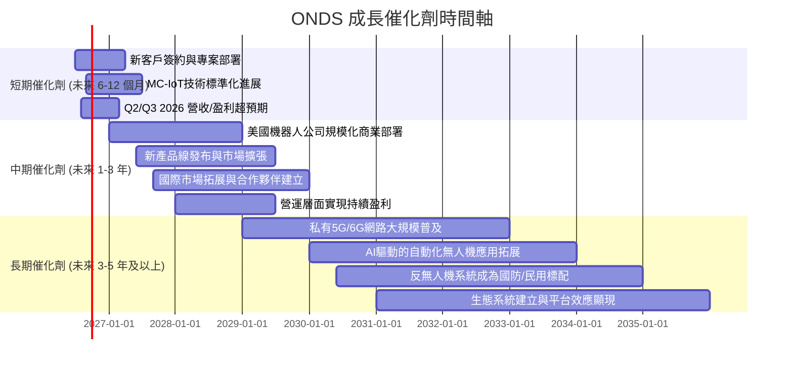

### 8.2 TAM 市場規模分析

ONDS 服務於多個高成長的潛在市場，這些市場的總體可尋址市場 (TAM) 規模龐大且持續擴大。

```
╔══════════════════════════════════════════════════════════════════╗
║                    ONDS 目標市場 TAM 分析                        ║
╠══════════════════════════════════════════════════════════════════╣
║                                                                  ║
║  私有無線網路市場 (2025年):                                      ║
║  TAM 估計: $5B (2025) -> $25B (2030)                              ║
║  ONDS 滲透率 (FY25): 1.0% ($50.73M / $5B)                        ║
║  當前貢獻收入: $50.73M                                          ║
║  潛在成長空間: █████████████████████████████████████████████████ ║
║                                                                  ║
║  工業無人機與自動化解決方案市場 (2025年):                        ║
║  TAM 估計: $15B (2025) -> $50B (2030)                             ║
║  ONDS 滲透率 (估計): 0.5% (約佔總營收一半)                       ║
║  當前貢獻收入: ~$45M (TTM估計)                                  ║
║  潛在成長空間: █████████████████████████████████████████████████ ║
║                                                                  ║
║  反無人機系統 (CUAS) 市場 (2025年):                              ║
║  TAM 估計: $2B (2025) -> $10B (2030)                              ║
║  ONDS 滲透率 (估計): 0.5% (約佔總營收小部分)                     ║
║  當前貢獻收入: ~$5M (TTM估計)                                   ║
║  潛在成長空間: █████████████████████████████████████████████████ ║
║                                                                  ║
║  📊 結論：ONDS 處於多個高成長、大市場的交集點，具備巨大的長期成長潛力。 ║
╚══════════════════════════════════════════════════════════════════╝
```
**備註**：TAM 估計為基於第三方市場研究報告的行業預測，ONDS 滲透率為本報告估計。

### 8.3 成長驅動力結構圖

```mermaid
graph TD
    GD["🚀 ONDS Growth Drivers"]

    GD --> ST["📅 Short-Term Drivers"]
    GD --> MT["📆 Mid-Term Drivers"]
    GD --> LT["📈 Long-Term Drivers"]

    ST --> ST1["🆕 Increased Customer Adoption"]
    ST --> ST2["🌍 Expansion of Sales Channels"]
    ST --> ST3["💰 Strong Project Pipeline Conversion"]
    ST --> ST4["🛠️ Operational Efficiency Improvements"]

    MT --> MT1["💼 New Product & Feature Launches"]
    MT --> MT2["📶 5G Private Network Deployments"]
    MT --> MT3["🌐 Geographic Market Expansion"]
    MT --> MT4["🤝 Strategic Partnerships & Acquisitions"]
    MT --> MT5["⚙️ Scaling of Ondas Autonomous Systems"]

    LT --> LT1["🥽 Emergence of Industry 4.0 & IoT"]
    LT --> LT2["⌚ AI & Automation in Critical Infrastructure"]
    LT --> LT3["🔒 Enhanced Security Demand (CUAS)"]
    LT --> LT4["🚀 Evolution to 6G & Advanced Wireless Tech"]
    LT --> LT5["💡 Platform Ecosystem Development"]
```

---

## 9. 風險矩陣

ONDS 作為一家高成長、顛覆性技術公司，伴隨著顯著的風險。

### 9.1 風險評分矩陣

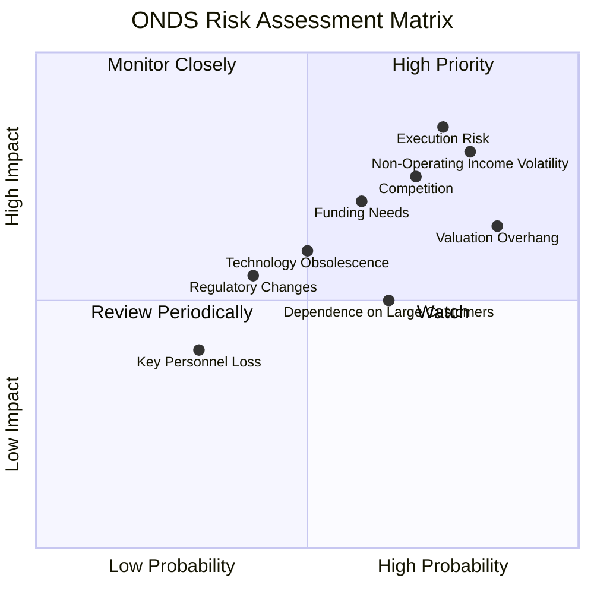

### 9.2 風險清單詳細分析

| # | 風險項目 | 發生機率 | 財務衝擊 | 風險評分 | 緩解措施 |
|---|--------------------------|----------|----------|----------|----------|
| 1 | 🔴 **執行風險** | 高 (75%) | 高 (-20%收入/盈利) | 🔴 8.5/10 | 加強管理團隊，優化專案管理流程，確保技術產品化和商業化進度。 |
| 2 | 🔴 **非經常性收益波動** | 高 (80%) | 高 (-100%淨利潤) | 🔴 8.0/10 | 投資者需審慎分析，將非經常性收益從核心營運中剝離，專注於營運盈利能力的改善。 |
| 3 | 🟡 **估值高昂** | 高 (85%) | 高 (-30%股價修正) | 🔴 7.5/10 | 需公司持續實現超預期成長和盈利能力改善，以證明其高估值的合理性。市場情緒惡化時可能面臨較大回調壓力。 |
| 4 | 🟡 **競爭加劇** | 高 (70%) | 中 (-10%毛利率/市場份額) | 🟡 7.0/10 | 持續投入研發保持技術領先，強化客戶關係和生態系統，探索差異化競爭策略。 |
| 5 | 🟡 **未來融資需求** | 中 (60%) | 中 (-10%股權稀釋) | 🟡 6.5/10 | 儘管現金充裕，但若營運現金流持續為負，長期仍可能需要額外融資。應優化現金管理，加速盈利轉正。 |
| 6 | 🟡 **技術迭代與創新** | 中 (50%) | 中 (-15%產品生命週期) | 🟡 6.0/10 | 建立強大的研發文化，密切關注行業技術發展，靈活調整產品路線圖，保持技術前瞻性。 |
| 7 | 🟡 **依賴大型客戶** | 中 (65%) | 中 (-10%收入波動) | 🟡 5.5/10 | 擴大客戶基礎，降低對單一或少數大型客戶的依賴，分散收入來源。 |
| 8 | 🟢 **法規變化** | 低 (40%) | 低 (-5%營運限制) | 🟢 4.5/10 | 積極參與行業標準制定，保持與監管機構的良好溝通，確保產品符合最新的法規要求。 |

---

## 10. 投資建議

綜合所有分析維度，ONDS 是一家具有巨大潛力但同時伴隨高風險的成長型公司。其在私有無線、無人機和反無人機系統等前沿技術領域的領先地位，以及近期爆發式的營收成長，顯示出強勁的市場需求。儘管公司在營運層面仍處虧損，且估值高昂，但充裕的現金儲備和低負債為其提供了堅實的發展基礎。

### 10.1 最終綜合評級雷達圖

```
╔══════════════════════════════════════════════════════════════════╗
║                   ONDS 最終綜合評級雷達圖                        ║
╠══════════════════════════════════════════════════════════════════╣
║                                                                  ║
║  基本面強度  7.0 ▓▓▓▓▓▓▓▓▓▓▓▓▓▓░░░░░░                              ║
║  成長動能    9.0 ▓▓▓▓▓▓▓▓▓▓▓▓▓▓▓▓▓▓░░                              ║
║  獲利品質    6.0 ▓▓▓▓▓▓▓▓▓▓▓▓░░░░░░░░                              ║
║  財務健康    9.0 ▓▓▓▓▓▓▓▓▓▓▓▓▓▓▓▓▓▓░░                              ║
║  估值合理性  5.0 ▓▓▓▓▓▓▓▓▓▓░░░░░░░░░░                              ║
║  護城河深度  7.0 ▓▓▓▓▓▓▓▓▓▓▓▓▓▓░░░░░░                              ║
║  管理層執行  7.5 ▓▓▓▓▓▓▓▓▓▓▓▓▓▓▓░░░░░                              ║
║  技術創新力  8.5 ▓▓▓▓▓▓▓▓▓▓▓▓▓▓▓▓▓░░░                              ║
║                                                                  ║
║  綜合總分    7.2 ▓▓▓▓▓▓▓▓▓▓▓▓▓▓▓░░░░░                              ║
╚══════════════════════════════════════════════════════════════════╝
```

### 10.2 目標價與隱含報酬率

| 情境 | 機率權重 | 目標價 (美元) | 隱含報酬率 (%) |
|------|----------|---------------|----------------|
| **樂觀情境** | 30% | $22.00 | +192.55% |
| **基準情境** | 50% | $15.00 | +99.47% |
| **悲觀情境** | 20% | $10.50 | +39.63% |
| **加權平均目標價** | **100%** | **$15.65** | **+108.11%** |

**投資評級**：**🟢 買入**
基於其在高速成長市場的領先地位、強勁的營收成長動能和穩健的資產負債表，儘管存在營運虧損和高估值風險，但其長期成長潛力巨大。當前股價相較於加權平均目標價有超過 100% 的上行空間。

### 10.3 買入時機與觸發因素

```
╔══════════════════════════════════════════════════════════════════╗
║                  ✅ 買入觸發因素 Checklist                      ║
╠══════════════════════════════════════════════════════════════════╣
║                                                                  ║
║  立即買入觸發條件（多數符合）：                                  ║
║  ✅ 季度營收持續超預期，YoY 成長率維持高位 (如 >50%)             ║
║  ✅ 管理層對未來盈利路徑提供更清晰的指引                        ║
║  ✅ 新產品或重大客戶專案簽約消息公布                             ║
║  ✅ 股價因市場調整或非基本面因素出現合理回調 (如跌至 $6.00-$7.00)║
║                                                                  ║
║  加碼觸發條件（出現以下任一）：                                  ║
║  ☐ 營運利潤率開始轉正並持續改善                                 ║
║  ☐ 自由現金流轉正                                               ║
║  ☐ 新的戰略合作夥伴關係建立或成功進入國際市場                   ║
║  ☐ 併購整合效益顯現，毛利率進一步提升                           ║
║                                                                  ║
║  減碼/停損觸發條件（出現以下任一）：                             ║
║  ☐ 營收成長顯著放緩，連續兩季不及預期                           ║
║  ☐ 營運虧損持續擴大，現金消耗速度加快                           ║
║  ☐ 競爭格局惡化，市場份額被侵蝕                                 ║
║  ☐ 關鍵技術出現重大問題或被競爭對手超越                         ║
╚══════════════════════════════════════════════════════════════════╝
```

### 10.4 投資人適配度分析

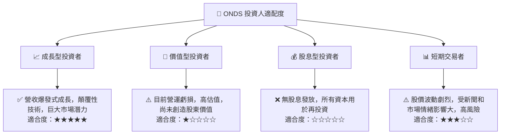

### 10.5 關鍵監控指標

| 監控類型 | 指標 | 關注點 | 頻率 |
|----------|----------|----------|----------|
| **成長** | 季度營收 YoY 成長率 | 是否維持高速成長 (>50%)，新訂單趨勢 | 每季 |
| **獲利** | 營業利益率 | 營運虧損是否收窄，何時轉正 | 每季 |
| **效率** | 自由現金流 (FCF) | 現金消耗速度，何時實現轉正 | 每季 |
| **估值** | P/S Ratio, EV/Revenue | 與同行業高成長公司的比較，是否合理 | 每月/每季 |
| **財務健康** | 淨現金頭寸 | 現金儲備是否充足，以支持長期發展 | 每季 |
| **市場** | 私有無線/無人機市場趨勢 | 產業發展速度，競爭格局變化 | 每月/每季 |
| **技術** | 研發投入與新產品進度 | 確保技術領先和產品創新 | 每季/半年 |

---

> **免責聲明**：本報告為 AI 自動生成，僅供研究參考，不構成投資建議。投資有風險，入市需謹慎。