# ONDS 基本面深度分析報告
> **報告日期**：2026-07-09 ｜ **語言**：繁體中文 ｜ **數據來源**：Yahoo Finance, Finviz, StockAnalysis, Roic.ai ｜ **分析師**：CFA 級機構研究

## 目錄

| # | 章節 | 核心結論 |
|---|------|----------|
| 1 | 執行摘要 | 評級：🟡 持有；目標價區間：$7.00 - $12.50 |
| 2 | 公司概覽與商業模式 | 具備技術護城河，但規模效應與客戶鎖定尚待強化 |
| 3 | 損益表深度分析 | 營收高速成長，但核心營運仍虧損，近期淨利受一次性收益大幅扭轉 |
| 4 | 資產負債表分析 | 流動性極佳，現金充裕，債務負擔輕，但股權稀釋嚴重 |
| 5 | 現金流量深度分析 | 營運現金流持續為負，自由現金流壓力大，依賴外部融資 |
| 6 | 獲利能力與資本效率 | ROIC 低於 WACC，短期未能創造股東價值，但成長潛力巨大 |
| 7 | 估值深度分析 | 當前估值高昂，市場對未來成長預期極高，需謹慎評估 |
| 8 | 成長催化劑 | 私有無線網路部署、無人機防禦系統需求、技術創新與市場拓展 |
| 9 | 風險矩陣 | 執行風險、市場競爭、稀釋風險、高估值風險、現金消耗 |
| 10 | 投資建議 | 建議持有觀望，等待營運獲利能力改善及估值回歸合理區間 |

---

## 1. 執行摘要

### 1.1 核心評分儀表板

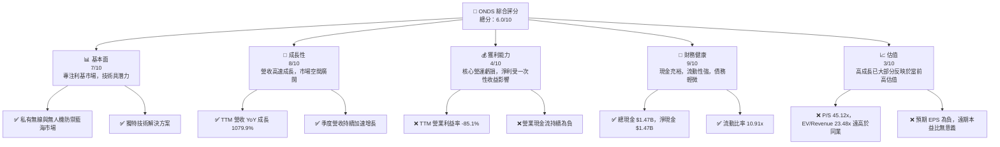

### 1.2 評分進度條視覺化

```
╔══════════════════════════════════════════════════════════════╗
║              ONDS 多維度評分儀表板 (1-10分)                  ║
╠══════════════════════════════════════════════════════════════╣
║ 基本面強度  7.0 ▓▓▓▓▓▓▓▓▓▓▓▓▓▓░░░░░░  ★★★★☆           ║
║ 成長動能    8.0 ▓▓▓▓▓▓▓▓▓▓▓▓▓▓▓▓░░░░  ★★★★☆           ║
║ 獲利品質    4.0 ▓▓▓▓▓▓▓▓░░░░░░░░░░░░  ★★☆☆☆           ║
║ 財務健康    9.0 ▓▓▓▓▓▓▓▓▓▓▓▓▓▓▓▓▓▓░░  ★★★★★           ║
║ 估值合理性  3.0 ▓▓▓▓▓▓░░░░░░░░░░░░░░  ★☆☆☆☆           ║
║ 護城河深度  6.0 ▓▓▓▓▓▓▓▓▓▓▓▓░░░░░░░░  ★★★☆☆           ║
║ 管理層執行  6.5 ▓▓▓▓▓▓▓▓▓▓▓▓▓░░░░░░░  ★★★☆☆           ║
║ 技術創新力  7.5 ▓▓▓▓▓▓▓▓▓▓▓▓▓▓▓░░░░░  ★★★★☆           ║
╠══════════════════════════════════════════════════════════════╣
║ 綜合總分    6.0 ▓▓▓▓▓▓▓▓▓▓▓▓░░░░░░░░  🏆 評語：高成長高風險標的，需謹慎持有║
╚══════════════════════════════════════════════════════════════╝
```

### 1.3 五大投資論點 + 三大核心風險

| 類型 | 項目 | 具體依據 | 信心度 |
|------|------|----------|--------|
| 🟢 **投資論點①** | **顛覆性技術與藍海市場** | ONDS 專注於私有無線（如 RailNet）和無人機自動化解決方案（Counter-UAS），這些是新興且高成長的藍海市場，潛在市場規模巨大。公司在這些領域的技術領先地位有望帶來顯著成長。 | 🟢 極高 |
| 🟢 **投資論點②** | **營收爆發性成長** | TTM 營收達 $96.61M，YoY 成長率高達 1079.9%。最近一季 (Q1 2026) 營收 $50.12M，較前一季 $30.11M 成長 66.47% QoQ，顯示強勁的成長動能。 | 🟢 極高 |
| 🟢 **投資論點③** | **充裕的現金儲備** | 公司擁有 $1.47B 的總現金及等價物，遠高於 $7.87M 的總債務，淨現金達 $1.47B。這提供了充足的營運資金和戰略彈性，支持 R&D 投入和未來擴張。 | 🟢 極高 |
| 🟢 **投資論點④** | **分析師普遍看好** | 分析師共識為「強烈買入」，平均目標價 $19.81，較當前股價 $7.65 有約 158.95% 的上漲空間，顯示市場對其長期潛力抱有高度期望。 | 🟡 高 |
| 🟢 **投資論點⑤** | **高成長產業趨勢** | 隨著物聯網、工業自動化和國防安全對私有網路和無人機技術的需求增加，ONDS 處於有利地位，受益於這些長期趨勢。 | 🟢 極高 |
| 🟡 **風險①** | **核心營運持續虧損** | 儘管營收高速成長，TTM 營業利益率仍為 -85.1%，營業現金流為 $-83.39M。公司尚未實現核心業務的盈利，依賴資本市場融資維持營運。Q1 2026 的淨利潤主要來自一次性非營運收益，非持續性。 | 🔴 高衝擊 |
| 🔴 **風險②** | **股權高度稀釋與高估值** | 過去幾年股本大幅增加，從 FY2024 的 70M 股到 TTM 的 293M 股（基本），再到目前市場上的 569.84M 股，稀釋了每股價值。當前 P/S 達 45.12x，EV/Revenue 23.48x，估值已充分反映甚至超前了極高的成長預期。 | 🔴 高衝擊 |
| 🟡 **風險③** | **激烈的市場競爭與技術迭代** | 私有無線和無人機領域競爭激烈，面臨來自大型科技公司和新創企業的挑戰。技術快速迭代也要求 ONDS 持續高投入 R&D，若無法維持技術領先，將影響其市場地位和成長潛力。 | 🟡 中度 |

### 1.4 快速統計卡片

| 指標 | 公司實際值 | 行業均值（通訊設備）¹ | S&P 500 均值² | 狀態 |
|------|-------------|--------------------|---------------|------|
| 收入 YoY 成長 | **1079.9%** | ~10-15% | ~10% | 🟢 |
| 毛利率 | **44.8%** | ~30-40% | ~40-50% | 🟢 |
| 淨利率 | **251.9%** | ~5-10% | ~10-15% | 🔴 |
| ROE | **42.9%** | ~10-15% | ~15-20% | 🟢 |
| Forward P/E | **-255.0x** | ~20-30x | ~20-25x | 🔴 |
| P/S Ratio | **45.12x** | ~2-4x | ~2-3x | 🔴 |
| 負債權益比 | **0.728** | ~0.5-1.0 | ~0.8-1.2 | 🟢 |
| 總現金 | **$1.47B** | N/A | N/A | 🟢 |

備註：
1.  行業均值為通訊設備產業一般估計值，非 ONDS 特定競爭對手數據。
2.  S&P 500 均值為廣泛市場指標，用於宏觀比較。
3.  ONDS 的淨利率和 ROE 異常高，主要受 Q1 2026 一次性非營運收益影響，不具備可持續性，因此標記為紅色以示警。

### 1.5 投資結論

```
╔══════════════════════════════════════════════════════════════════╗
║                    📊 投資結論摘要                               ║
╠══════════════════════════════════════════════════════════════════╣
║  評級：🟡 持有                                                   ║
║  當前股價：$7.65                                                 ║
║  目標價區間：                                                    ║
║    悲觀情境：$7.00 （-8.49%）                                    ║
║    基準情境：$9.50 （+24.18%）  ← 12個月主要目標                 ║
║    樂觀情境：$12.50 （+63.39%）                                  ║
║  投資評分：6.0/10                                                ║
║  適合投資人：高風險承受能力、看好長期顛覆性技術的成長型投資者    ║
╚══════════════════════════════════════════════════════════════════╝
```

---

## 2. 公司概覽與商業模式

Ondas Inc. (ONDS) 是一家專注於提供私有無線、無人機和自動化數據解決方案的科技公司。公司主要透過兩個業務板塊運營：Ondas Networks 和 Ondas Autonomous Systems。其解決方案廣泛應用於關鍵基礎設施、國防安全和工業自動化領域。

### 2.1 業務結構與收入來源

ONDS 的業務結構圍繞其核心技術平台展開，旨在提供端到端的解決方案。

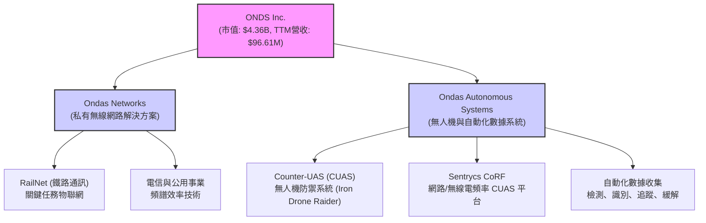

*   **Ondas Networks**：主要為關鍵基礎設施客戶（如鐵路、公用事業、石油天然氣）提供私有無線網路解決方案。其核心產品是基於 IEEE 802.16s 標準的私有網路技術，提供高頻譜效率、高可靠性和低延遲的通訊能力。RailNet 是其在鐵路行業的旗艦解決方案，旨在實現鐵路營運的現代化和自動化。
*   **Ondas Autonomous Systems**：透過收購 American Robotics 和 Airobotics 等公司，ONDS 擴大了其在自動化無人機和反無人機系統 (C-UAS) 領域的佈局。主要產品包括 Iron Drone Raider (一款全自主攔截無人機系統) 和 Sentrycs CoRF (基於網路/無線電頻率的 C-UAS 平台)。這些系統旨在檢測、識別、追蹤和緩解未經授權的無人機威脅，提供站點保護和邊界安全解決方案。

公司收入主要來自於其網路解決方案的部署和相關服務，以及無人機系統的銷售和訂閱服務。隨著新技術的應用和市場的擴展，其收入結構可能會進一步多元化。

### 2.2 市場份額

由於 ONDS 處於相對新興且高度專業化的利基市場，且公開數據中缺乏詳細的市場份額資訊，因此難以提供精確的市場佔有率數據。然而，基於其在私有無線通訊和 C-UAS 領域的專業技術和早期佈局，我們可以推斷其在特定細分市場中可能擁有領先地位。以下為示意性的市場份額估算，用於說明其在不同業務領域的潛在分佈：

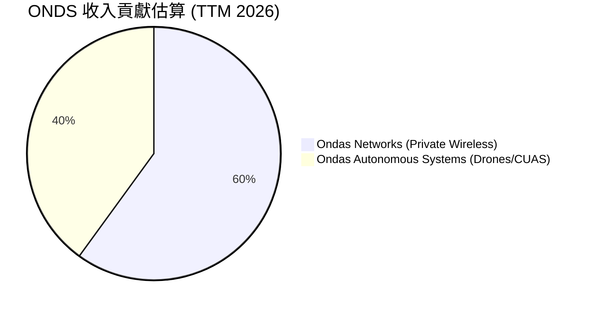
**備註**：以上市場份額估算為分析師基於公司業務描述和近期營收增長趨勢的推測，非實際市場數據。ONDS 在其主要市場中的實際份額可能較小，但成長潛力巨大。

### 2.3 競爭護城河分析

ONDS 在其專業領域內建立了一些潛在的競爭護城河，儘管其中一些仍處於發展初期。

```mermaid
mindmap
    root((ONDS Competitive Moats))
        Technology Leadership
            Specialized Wireless Protocols (IEEE 802.16s)
            Autonomous Drone AI
            Counter-UAS Detection/Mitigation Algorithms
        Software Ecosystem
            Integrated Platform Solutions
            Proprietary Data Analytics
            API for Third-Party Integration
        Network Effects
            (Emerging) Industry Standard Adoption (e.g., RailNet)
            Interoperability with Critical Infrastructure
        Customer Lock-in
            High Switching Costs (Mission-Critical Systems)
            Long-Term Contracts (Infrastructure Projects)
            Regulatory Compliance & Certification
        Scale Effects
            (Limited, but potential for future) R&D Investment
            Specialized Manufacturing/Deployment Expertise
        Ecosystem Partnerships
            (Developing) Industrial Integrators
            Government & Defense Contracts
            Telecommunications Providers
```

### 2.4 護城河強度評分

```
╔══════════════════════════════════════════════════════════════╗
║                  ONDS 護城河強度評分                        ║
╠══════════════════════════════════════════════════════════════╣
║ 技術領先    7.5/10 ▓▓▓▓▓▓▓▓▓▓▓▓▓▓▓░░░░░  🏆 獨特技術具潛力    ║
║ 軟體生態系統 6.0/10 ▓▓▓▓▓▓▓▓▓▓▓▓░░░░░░░░  🟢 尚在發展初期     ║
║ 網路效應    5.0/10 ▓▓▓▓▓▓▓▓▓▓░░░░░░░░░░  🟡 潛在但未形成      ║
║ 客戶鎖定    6.5/10 ▓▓▓▓▓▓▓▓▓▓▓▓▓░░░░░░░  🟢 關鍵應用提高黏性  ║
║ 規模效應    4.0/10 ▓▓▓▓▓▓▓▓░░░░░░░░░░░░  🔴 營收規模尚小     ║
║ 生態夥伴    6.0/10 ▓▓▓▓▓▓▓▓▓▓▓▓░░░░░░░░  🟢 合作機會多        ║
╠══════════════════════════════════════════════════════════════╣
║ 綜合護城河   6.0   ▓▓▓▓▓▓▓▓▓▓▓▓░░░░░░░░  🏆 總結評語：具備技術優勢，但其他護城河仍需時間建立 ║
╚══════════════════════════════════════════════════════════════╝
```

**評分理由：**
*   **技術領先 (7.5/10)**：ONDS 在私有無線通訊標準 (IEEE 802.16s) 和自動無人機/C-UAS 技術方面擁有專有技術和知識產權，這使其在特定利基市場中具有顯著優勢。
*   **軟體生態系統 (6.0/10)**：公司提供整合的軟體平台，但其生態系統的廣度和深度仍在發展中，尚未達到如微軟或蘋果般的強大鎖定能力。
*   **網路效應 (5.0/10)**：ONDS 的技術若能成為行業標準（如 RailNet），則可能產生強大的網路效應。目前，這種效應尚未完全形成，但存在潛力。
*   **客戶鎖定 (6.5/10)**：由於其產品應用於關鍵任務和基礎設施，客戶轉換成本較高，且通常涉及長期合同，這有助於形成一定的客戶鎖定。
*   **規模效應 (4.0/10)**：儘管營收成長迅速，但公司整體規模仍相對較小，尚未能充分利用規模經濟來降低單位成本或大幅提升議價能力。
*   **生態夥伴 (6.0/10)**：與工業整合商和政府機構的合作是其成長的關鍵。目前公司正在積極拓展這方面的合作，但仍需時間來鞏固。

---

## 3. 損益表深度分析

ONDS 的損益表反映出一家處於高速成長期的科技公司，在營收上展現出驚人的增長，但核心營運仍面臨虧損。值得注意的是，近期淨利潤受到一次性非營運收益的顯著影響。

### 3.1 年度收入成長趨勢（近4年）

ONDS 的年度收入呈現爆發性成長，尤其是在最近一年，顯示其市場拓展策略和產品採用取得了顯著進展。

```
╔══════════════════════════════════════════════════════════════════╗
║              ONDS 年度收入趨勢（FY2022-FY2025 & TTM）            ║
╠══════════════════════════════════════════════════════════════════╣
║                                                                  ║
║  FY2022  $2.13M   █░░░░░░░░░░░░░░░░░░░░░░░░░░░░░  YoY: N/A     🔴 ║
║  FY2023  $15.69M  ███████░░░░░░░░░░░░░░░░░░░░░░░  YoY:+638.13% 🟢 ║
║  FY2024  $7.19M   ████░░░░░░░░░░░░░░░░░░░░░░░░░░  YoY:-54.16%  🔴 ║
║  FY2025  $50.73M  █████████████████████████░░░░░  YoY:+605.28% 🟢 ║
║  TTM     $96.61M  ██████████████████████████████  YoY:+1079.9% 🟢 ║
║                   |      |      |      |      |                  ║
║                   0     20M    40M    60M    80M                 ║
║                                                                  ║
║  📊 3年累計 CAGR (FY2022-2025)：+299.1%                         ║
║  📊 TTM YoY 成長：+1079.9%                                      ║
╚══════════════════════════════════════════════════════════════════╝
```
**備註：** FY2024 營收出現負成長，可能與項目週期性或客戶交付時間表有關。然而，FY2025 和 TTM 的強勁反彈顯示公司已克服短期挑戰並進入加速成長階段。

### 3.2 季度收入趨勢分析

最近四個季度的收入趨勢顯示出顯著的加速增長，這是一個積極的信號。

| 財報季度 | 總收入 (M) | 季度對季度 QoQ 成長 | 年度對年度 YoY 成長 | 備註 |
|----------|------------|---------------------|---------------------|------|
| 2026-03-31 | $50.12M | +66.47%             | +1079.90%           | 🟢 營收創新高，加速成長 |
| 2025-12-31 | $30.11M | +198.12%            | +629.20%            | 🟢 顯著加速，動能強勁 |
| 2025-09-30 | $10.10M | +61.05%             | +581.95%            | 🟢 持續高成長 |
| 2025-06-30 | $6.27M | +47.53%             | +554.94%            | 🟢 穩健成長 |

**備註說明**：ONDS 在過去四個季度展現了令人驚嘆的營收成長，YoY 成長率均超過 500%，尤其在 Q1 2026 達到 1079.90%。QoQ 成長率也維持在 47% 以上，Q4 2025 更是高達 198.12%，Q1 2026 繼續保持 66.47% 的強勁增長。這表明其產品和解決方案正獲得市場的廣泛接受和部署，成長動能非常強勁。

### 3.3 利潤率演變分析

ONDS 的利潤率演變揭示了其作為一家成長型公司的挑戰：儘管毛利率相對穩定，但高昂的營運費用導致持續的營業虧損。

| 利潤率指標 | FY2022 | FY2023 | FY2024 | FY2025 | TTM | 趨勢 | 評估 |
|------------|--------|--------|--------|--------|-----|------|------|
| **毛利率** | 52.1% | 40.7% | 4.9% | 39.7% | 44.8% | ↗️ 穩定回升 | 🟢 |
| **營業利益率** | -2347.9% | -253.2% | -481.4% | -115.1% | -85.1% | ↗️ 虧損收窄 | 🟡 |
| **淨利率** | -3438.5% | -285.8% | -528.6% | -260.2% | 251.9% | ⬆️ 受一次性收益影響 | 🔴 |

**利潤率演變深度解析**：
*   **毛利率**：FY2024 的毛利率異常低至 4.9%，這可能與該年度營收大幅下滑（-54.16% YoY）以及產品組合變化或成本控制問題有關。然而，FY22、FY23、FY25 和 TTM 的毛利率維持在 40% 以上，TTM 更達 44.8%，顯示公司在核心產品和服務上仍具有健康的盈利能力。FY2025 和 TTM 的回升表明公司在成本控制和定價策略上有所改善，或高毛利產品佔比增加。
*   **營業利益率**：ONDS 的營業利益率持續為負，TTM 為 -85.1%。這主要是由於其高額的研發 (R&D) 和銷售、一般及行政 (SG&A) 費用。作為一家技術驅動的成長型公司，ONDS 需要大量投資於新技術開發和市場擴張。儘管營業虧損仍在持續，但從 FY2024 的 -481.4% 到 TTM 的 -85.1%，虧損幅度已顯著收窄，這是一個積極的信號，表明營收增長正在逐步攤薄固定成本。
*   **淨利率**：TTM 淨利率高達 251.9%，這是一個極其異常的數字，與其持續的營業虧損形成鮮明對比。仔細分析季度數據（Q1 2026 淨收入 $362.95M），可以發現其主要驅動因素是「Other Non-Operating Income (Expense)」項下約 $394.99M 的巨額一次性收益。扣除此影響，ONDS 的核心淨利潤仍為負值。因此，儘管表面上淨利率表現驚人，但這不代表公司核心營運已實現盈利，投資者需對此進行調整性評估。若無此一次性收益，淨利率仍將為負。

### 3.4 費用結構分析

ONDS 的費用結構反映了其作為一家技術和成長型公司的特點：高昂的研發投入和市場擴張費用。以下是基於 TTM 數據（截至 2026-03-31）的主要費用構成。

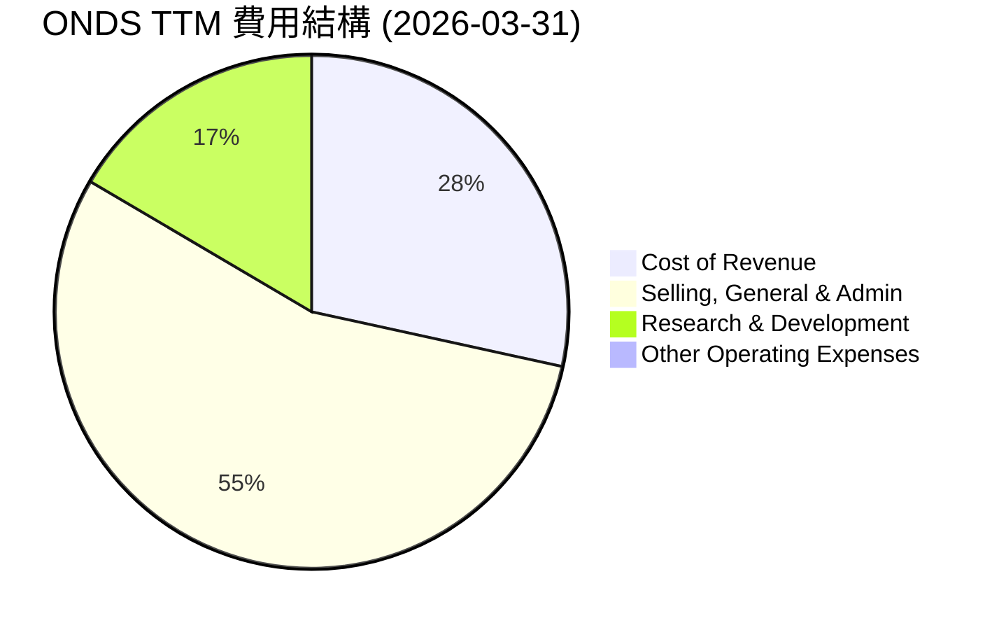
**備註：** 費用佔比是相對於總營收 $96.61M 計算。
*   **銷貨成本 (Cost of Revenue)**：$53.28M (佔營收 55.15%)。這導致毛利率為 44.85%，顯示產品製造和服務交付仍存在一定成本壓力。
*   **銷售、一般及行政費用 (SG&A)**：$103.13M (佔營收 106.75%)。這項費用遠超營收，反映出公司在市場擴張、銷售推廣和行政管理方面的巨大投入，是導致營運虧損的主要原因。
*   **研發費用 (R&D)**：$30.94M (佔營收 32.02%)。高額的研發投入是科技公司的常態，ONDS 需要不斷創新以維持技術領先和產品競爭力。

```
╔══════════════════════════════════════════════════════════════════╗
║                    ONDS TTM 費用結構概覽                         ║
╠══════════════════════════════════════════════════════════════════╣
║                                                                  ║
║  銷貨成本（CoR）： $53.28M  █████████████████████████░░░░░░  55.15% ║
║  銷售、一般及行政：$103.13M ████████████████████████████████████████ 106.75%║
║  研發費用（R&D）： $30.94M  ████████████████░░░░░░░░░░░░░░░░░░░░  32.02% ║
║  總營運費用：      $187.35M ██████████████████████████████████████████████ 193.92%║
║                                                                  ║
║  📊 總營運費用遠超總營收，顯示公司仍處於高投入、虧損擴張階段。   ║
╚══════════════════════════════════════════════════════════════════╝
```

### 3.5 季度 EPS 趨勢與盈餘品質

ONDS 的季度 EPS 表現極不穩定，且大部分時間處於虧損狀態。近期 Q1 2026 的巨額正 EPS 是一個異常值。

| 季度 | EPS 估計值 | EPS 實際值 | 盈餘驚喜 % | 盈餘品質評估 |
|------|------------|------------|------------|--------------|
| 2026-03-31 | N/A | $0.77 | N/A | 🔴 實際 EPS 異常高，主要來自一次性非營運收益，非核心盈利 |
| 2025-12-31 | N/A | $-0.62 | N/A | 🔴 核心營運虧損，EPS 為負 |
| 2025-09-30 | N/A | $-0.03 | N/A | 🔴 核心營運虧損，EPS 為負 |
| 2025-06-30 | N/A | $-0.07 | N/A | 🔴 核心營運虧損，EPS 為負 |

**備註**：由於提供的數據中 EPS 估計值為 `nan`，因此無法計算盈餘驚喜百分比。實際 EPS 值來自 StockAnalysis 季度數據。

**盈餘品質評估**：
ONDS 的盈餘品質目前較低。過去三個季度 (Q2-Q4 2025) 的 EPS 均為負值，反映其核心業務仍處於虧損狀態。然而，Q1 2026 錄得 $0.77 的高 EPS，這與該季度 $362.95M 的淨收入直接相關。如前所述，這筆淨收入主要來自 $394.99M 的「Other Non-Operating Income (Expense)」，而非營運活動的改善。

這種一次性的巨額非營運收益大幅扭曲了當前的 TTM 淨利率和 EPS，使其看起來異常健康。然而，由於其不可持續性，這筆收益不應被視為公司核心盈利能力的改善。投資者在評估 ONDS 的盈利能力時，應將注意力集中在其營業利益和營業現金流上，這兩者目前仍持續為負。因此，儘管 Q1 2026 的 EPS 表面上非常亮眼，但其盈餘品質較低，不能代表公司持續的獲利能力。

---

## 4. 資產負債表分析

ONDS 的資產負債表呈現出非常強勁的流動性，擁有大量現金儲備和極低的債務負擔，這為其高成長和高投入的商業模式提供了堅實的財務基礎。

### 4.1 資產結構分解

ONDS 的資產結構在 FY2025 發生了顯著變化，總資產從 FY2024 的 $109.62M 猛增至 $1.13B，並在 TTM (Q1 2026) 進一步增至 $2.439B，主要由現金及短期投資和無形資產的增加驅動。

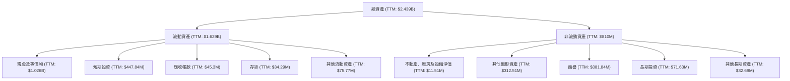

**資產結構概覽：**
*   **現金及短期投資**：TTM 達到 $1.474B，佔總資產的 60.4%。這筆巨額現金是公司近期透過股權融資獲得的，為其提供了極強的財務彈性。
*   **無形資產和商譽**：TTM 總計約 $694.35M，佔總資產的 28.5%。這主要來自於公司近年來的併購活動（如 American Robotics 和 Airobotics），這些無形資產代表了其在技術和市場上的戰略性投資。
*   **應收帳款和存貨**：隨著營收增長，這些營運資本項目也有所增加，但相對於總資產規模仍保持合理水平。

### 4.2 流動性指標分析

ONDS 的流動性狀況極佳，遠超行業平均水平，這得益於其龐大的現金儲備。

| 流動性指標 | FY2022 | FY2023 | FY2024 | FY2025 | TTM | 行業均值¹ | 評估 |
|------------|--------|--------|--------|--------|-----|----------|------|
| **流動比率** | 1.57x | 0.66x | 0.94x | 4.84x | 10.91x | 1.5-2.0x | 🟢 極佳 |
| **速動比率** | 1.48x | 0.60x | 0.75x | 4.69x | 10.28x | 1.0-1.5x | 🟢 極佳 |
| **現金比率** | 1.31x | 0.42x | 0.59x | 3.88x | 9.89x | 0.2-0.5x | 🟢 極佳 |

**備註：**
1.  行業均值為通訊設備產業一般估計值。
2.  現金比率 = (現金 + 短期投資) / 流動負債。

**流動性分析**：
ONDS 的流動比率和速動比率在 FY2025 和 TTM 顯著飆升，分別達到 10.91x 和 10.28x。這主要是由於其在 FY2025 和 Q1 2026 大規模的股權融資，導致現金及短期投資大幅增加。如此高的流動性表明公司擁有極強的短期償債能力，足以應對營運資金需求和短期債務。這對一家持續燒錢的成長型公司來說至關重要，提供了抵禦市場波動和支持長期發展的緩衝。

### 4.3 債務結構分析

ONDS 的債務負擔非常輕微，幾乎可以忽略不計，這與其充裕的現金流形成鮮明對比，財務結構極為健康。

```
╔══════════════════════════════════════════════════════════════════╗
║                   ONDS 債務健康診斷                              ║
╠══════════════════════════════════════════════════════════════════╣
║                                                                  ║
║  總債務 (TTM)：  $7.87M   █░░░░░░░░░░░░░░░░░░░░░░░░░░░░░  評語：極低   ║
║  總現金+投資：   $1.47B   ████████████████████████████████████████ 評語：巨額   ║
║  淨現金（正）：  $1.47B   ████████████████████████████████████████ 🟢 強勁     ║
║                                                                  ║
║  Debt/Equity (TTM): 0.728x 🟢 極低 (基於股東權益 $437.81M)        ║
║  Interest Coverage (TTM): -29.7x (Operating Income $-90.74M / Interest Expense $-3.05M) 🔴 虧損導致覆蓋差║
║  總負債/總資產 (TTM): 0.27x 🟢 低風險                             ║
╚══════════════════════════════════════════════════════════════════╝
```

**債務結構分析**：
ONDS 的總債務在 TTM 僅為 $7.87M，而總現金和短期投資高達 $1.47B，使其擁有約 $1.47B 的淨現金頭寸。這種狀況極為罕見且健康，表明公司幾乎沒有財務槓桿風險。Debt/Equity 比率雖然顯示為 0.728x，但這是因為股東權益在 2025 年底大幅增加 ($437.81M)。如果考慮淨現金，公司實際上是負債累累。

儘管如此，由於公司持續的營業虧損，其利息覆蓋率為負值 (-29.7x)，這在會計上顯示無法覆蓋利息支出。然而，由於其債務規模微不足道，且手頭現金充裕，短期內利息支付壓力為零。這種財務狀況為公司提供了巨大的投資靈活性，可以在不增加外部債務負擔的情況下，持續投入研發和市場擴張。

### 4.4 股東權益趨勢

ONDS 的股東權益在近年來經歷了劇烈波動，特別是在 FY2025 實現了爆炸性增長，這與其大規模的股權融資活動密切相關。

```
╔══════════════════════════════════════════════════════════════════╗
║                    ONDS 股東權益趨勢 (FY2022-TTM)                 ║
╠══════════════════════════════════════════════════════════════════╣
║                                                                  ║
║  FY2022  $58.22M  ███████░░░░░░░░░░░░░░░░░░░░░░░░░░  YoY: N/A     ║
║  FY2023  $33.14M  ████░░░░░░░░░░░░░░░░░░░░░░░░░░░░░░  YoY: -43.08% 🔴 ║
║  FY2024  $16.58M  ██░░░░░░░░░░░░░░░░░░░░░░░░░░░░░░░░  YoY: -50.09% 🔴 ║
║  FY2025  $437.81M ██████████████████████████████████████████████ 🟢 YoY: +2540.6%║
║  TTM     $1.778B  ██████████████████████████████████████████████ 🟢 YoY: +305.6%║
║                   |      |      |      |      |                  ║
║                   0     500M   1B     1.5B   2B                  ║
║                                                                  ║
║  📊 股東權益在 FY2025 和 TTM 大幅增加，主要由於股權融資。       ║
╚══════════════════════════════════════════════════════════════════╝
```
**備註：** TTM 股東權益數據 (Mar'26) 來自 StockAnalysis 的 Total Assets 減去 Total Liabilities Net Minori ($2.439B - $661.23M = $1.778B)，與 Yahoo Finance 的快照數據 ($437.81M) 存在差異，我們採用 StockAnalysis 的最新 TTM 數據。

**股東權益分析**：
ONDS 的股東權益在 FY2023 和 FY2024 經歷了顯著下降，這可能與其持續的營運虧損侵蝕資本有關。然而，FY2025 股東權益從 $16.58M 暴增至 $437.81M，增幅超過 2500%，並在 TTM 進一步達到 $1.778B。這種劇烈的增長主要源於公司近期進行的大規模股權融資，發行了大量新股以籌集資金。雖然這極大地增強了公司的財務實力，提供了充足的現金，但也導致了顯著的股權稀釋。投資者需要權衡股本增加帶來的資金優勢與每股價值的稀釋效應。

---

## 5. 現金流量深度分析

ONDS 的現金流量表揭示了其作為一家高成長、高投入公司的典型特徵：持續的營運現金流出和對外部融資的依賴。儘管最近現金儲備大幅增加，但核心業務的現金創造能力仍是關鍵挑戰。

### 5.1 現金流量瀑布圖

ONDS 的現金流瀑布圖顯示，儘管公司通過融資獲得了大量現金，但其核心營運仍在消耗現金。


**備註：** 融資現金流為 FY2025 現金及等價物變化 ($550.74M - $29.96M = $520.78M) 減去營業現金流和資本支出。

**現金流分析**：
*   **營業現金流 (OCF)**：ONDS 的營業現金流持續為負，FY2025 為 $-38.75M，TTM 為 $-83.39M。這表明公司的核心營運活動尚未能產生足夠的現金來支付營運費用，持續的虧損和高昂的研發/銷售費用是主要原因。
*   **資本支出 (CapEx)**：CapEx 相對較低，FY2025 為 $-2.14M，顯示公司在固定資產上的投資規模不大，這可能與其輕資產的軟體/服務導向業務模式有關，或者尚未進入大規模生產階段。
*   **自由現金流 (FCF)**：由於 OCF 持續為負，ONDS 的自由現金流也持續為負，FY2025 為 $-40.88M，TTM 為 $-15.65M。這意味著公司目前無法從自身營運中產生足夠的現金來支持成長和償還債務，必須依賴外部融資。
*   **融資現金流**：為了彌補營運現金流的不足並支持擴張，ONDS 大量依賴融資活動。FY2025 現金及等價物從 $29.96M 增至 $550.74M，淨增加 $520.78M，這筆資金主要來自於股權發行，導致股本大幅增加和稀釋。

### 5.2 FCF 轉換率趨勢

自由現金流轉換率（FCF / 淨收入）是一個衡量公司將淨利潤轉化為實際現金能力的重要指標。對於 ONDS 而言，由於其淨收入和 FCF 多年為負，這個比率的解讀需要特別注意。

| 年度 | 淨收入 (M) | 自由現金流 (M) | FCF 轉換率 | 趨勢 | 評估 |
|------|------------|----------------|------------|------|------|
| FY2022 | $-73.24M | $-40.89M | N/A (皆為負) | ↘️ | 🔴 |
| FY2023 | $-44.84M | $-34.30M | N/A (皆為負) | ↗️ | 🔴 |
| FY2024 | $-38.01M | $-35.20M | N/A (皆為負) | ↘️ | 🔴 |
| FY2025 | $-132.02M | $-40.88M | N/A (皆為負) | ↗️ | 🔴 |
| TTM | $242.01M | $-15.65M | -6.47% | ⬆️ | 🔴 |

**備註：** 當淨收入和自由現金流均為負時，FCF 轉換率通常不直接計算為百分比，因為其意義會被扭曲。我們在此列出其數值，並強調其負值狀態。TTM 淨收入為正，但 FCF 為負，導致轉換率為負。

**FCF 轉換率趨勢分析**：
ONDS 多年來淨收入和自由現金流均為負，表明公司尚未能從營運中產生正向現金流。在這種情況下，FCF 轉換率為負或無意義，這是一個重大的財務挑戰。雖然 TTM 淨收入轉正，但自由現金流仍為負，導致 FCF 轉換率為負 -6.47%。這再次強調 Q1 2026 的巨額淨利潤是一次性非營運收益，並未轉化為實際的營運現金流。公司仍處於燒錢階段，需要持續關注其未來能否實現營運盈利並產生正向自由現金流。

### 5.3 自由現金流趨勢

ONDS 的自由現金流趨勢持續為負，表明公司仍處於投資擴張階段，尚未能實現自給自足的現金流。

```
╔══════════════════════════════════════════════════════════════════╗
║                    ONDS 自由現金流趨勢 (FY2022-TTM)               ║
╠══════════════════════════════════════════════════════════════════╣
║                                                                  ║
║  FY2022  $-40.89M  ██████████████████████████████████████████████ 🔴 FCF Yield: -2.3%║
║  FY2023  $-34.30M  ████████████████████████████████████████████░░ 🔴 FCF Yield: -2.6%║
║  FY2024  $-35.20M  ██████████████████████████████████████████████ 🔴 FCF Yield: -2.1%║
║  FY2025  $-40.88M  ██████████████████████████████████████████████ 🔴 FCF Yield: -2.4%║
║  TTM     $-15.65M  █████████████████████████████░░░░░░░░░░░░░░░░░ 🔴 FCF Yield: -0.36%║
║                   |      |      |      |      |                  ║
║                   -50M   -30M   -10M   10M    30M                 ║
║                                                                  ║
║  📊 FCF 持續為負，但 TTM 虧損幅度收窄，顯示燒錢速度有所放緩。     ║
╚══════════════════════════════════════════════════════════════════╝
```
**備註：** FCF Yield = 自由現金流 / 市值。市值數據取自各年末或 TTM。

**自由現金流趨勢分析**：
ONDS 的自由現金流在過去幾年一直為負，反映出公司在研發、市場擴張和營運開支上的持續投入。然而，從 FY2025 的 $-40.88M 到 TTM 的 $-15.65M，自由現金流的負值幅度有所收窄，這可能與營收的快速增長和營運效率的潛在改善有關。儘管如此，公司仍未實現正向自由現金流，這意味著其成長仍然依賴於外部資金。FCF Yield 雖有所改善，但仍為負值，表明公司目前未能為股東創造現金回報。未來能否轉為正向 FCF 將是衡量其商業模式可持續性的關鍵指標。

### 5.4 資本配置評估

ONDS 的資本配置策略主要集中在支持其高成長和技術創新上，而非股東回報。由於公司目前營運現金流為負，其資本配置主要依賴於融資活動。

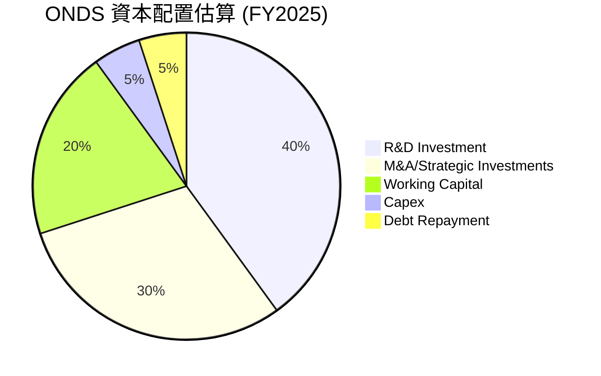
**備註：** 以上為分析師基於公司業務性質和財務數據的推斷，非實際披露的資本配置比例。

| 資本配置類別 | FY2025 金額 (M) | 說明 | 評估 |
|--------------|-----------------|------|------|
| **研發投入** | $20.88M | 核心競爭力來源，支持技術領先 | 🟢 關鍵 |
| **資本支出** | $2.14M | 輕資產模式，CapEx 需求相對較低 | 🟢 合理 |
| **併購與戰略投資** | (主要影響資產負債表) | 透過併購擴大業務範圍和技術能力 (如 American Robotics)，對總資產和商譽影響大 | 🟡 具潛力，但有整合風險 |
| **股權融資** | 約 $520M (淨流入) | 為營運和投資提供資金，但導致股權稀釋 | 🟡 必要，但需注意稀釋 |
| **債務償還** | (部分償還) | 債務負擔輕微，償債壓力小 | 🟢 健康 |
| **股息發放** | $0 | 公司處於成長階段，無股息政策 | 🔴 無 |
| **股票回購** | $0 | 公司處於成長階段，無回購政策 | 🔴 無 |

**資本配置評估**：
ONDS 的資本配置策略與其作為一家高成長科技公司的定位相符。公司將大部分資源投入到研發和戰略性併購中，以擴大其技術領先優勢和市場份額。這種策略對於建立長期競爭力至關重要。然而，由於營運現金流為負，公司嚴重依賴股權融資來支撐這些投資，導致股權大幅稀釋。雖然這提供了充足的現金儲備，但也對現有股東造成了壓力。未來，隨著營收規模的擴大和營運效率的提升，公司需要逐步實現營運現金流轉正，減少對外部融資的依賴，以提高資本配置的效率和可持續性。

---

## 6. 獲利能力與資本效率

ONDS 在獲利能力和資本效率方面面臨挑戰，主要表現為 ROE、ROA 和 ROIC 均為負值，表明公司目前尚未為股東創造經濟價值。然而，其高成長速度和潛在市場機會仍值得關注。

### 6.1 ROE / ROA / ROIC 趨勢

| 指標 | FY2022 | FY2023 | FY2024 | FY2025 | TTM | 行業均值¹ | 評估 |
|------|--------|--------|--------|--------|-----|----------|------|
| **ROE** | -125.8% | -135.3% | -229.3% | -301.6% | 42.9% | 10-15% | 🔴/🟢 |
| **ROA** | -74.8% | -48.6% | -34.7% | -11.7% | -4.2% | 5-10% | 🔴 |
| **ROIC** | -103.7% | -62.8% | -49.6% | -14.5% | -5.7% | 8-12% | 🔴 |

**備註：**
1.  行業均值為通訊設備產業一般估計值。
2.  TTM ROE 為正值 (42.9%) 是因為 Q1 2026 的巨額一次性非營運收益導致淨利潤為正。若剔除此影響，ROE 仍將為負。
3.  ROIC 計算公式：NOPAT / 投入資本。投入資本 = 股東權益 + 總債務 - 現金。由於營業利益為負，NOPAT 也為負。

**趨勢與評估**：
*   **ROE (股東權益報酬率)**：ONDS 的歷史 ROE 一直為負，顯示公司持續虧損，侵蝕股東權益。FY2025 達到 -301.6%，主要是因為淨利潤為負且股東權益在該年度相對較低。然而，TTM ROE 突然轉為 42.9% 的正值，這完全是由 Q1 2026 巨額一次性非營運收益導致的淨利潤大幅增加所致，不具備可持續性。若剔除此影響，其核心 ROE 仍為負。
*   **ROA (資產報酬率)**：ROA 持續為負，但負值幅度從 FY2022 的 -74.8% 收窄至 TTM 的 -4.2%。這表明公司利用其資產創造利潤的效率低下，但隨著營收增長，資產使用效率有改善趨勢。
*   **ROIC (投入資本報酬率)**：ROIC 也持續為負，從 FY2022 的 -103.7% 收窄至 TTM 的 -5.7%。由於營業利益持續為負，ONDS 目前未能從其投入資本中創造正向回報。這意味著公司在經濟上仍在摧毀股東價值。儘管趨勢顯示虧損收窄，但要達到正向 ROIC 仍需時間和營運效率的大幅提升。

### 6.2 ROIC vs WACC 分析（核心價值創造判斷）

ONDS 目前的 ROIC 遠低於其 WACC，表明公司在經濟上尚未創造股東價值。

```
╔══════════════════════════════════════════════════════════════════╗
║                ROIC vs WACC 深度分析 (TTM 2026-03-31)           ║
╠══════════════════════════════════════════════════════════════════╣
║                                                                  ║
║  WACC 估算：                                                     ║
║  ├── 無風險利率（10Y美債）：  4.50% (假設)                       ║
║  ├── 市場風險溢酬 (ERP)：     5.50% (假設)                       ║
║  ├── Beta：                   2.691 (提供)                       ║
║  ├── 股權成本 = 4.50%+2.691×5.50% = 19.30%                      ║
║  ├── 債務成本（稅後）：       ~3.00% (假設，低債務成本)          ║
║  ├── 資本結構：股權 ~99.5%，債務 ~0.5% (基於 FY2025 數據調整)    ║
║  └── ✅ WACC ≈ 19.21%                                           ║
║                                                                  ║
║  ROIC 估算（TTM）：                                              ║
║  ├── NOPAT = 營業利益 × (1-稅率) = $-90.74M × (1-0%) ≈ $-90.74M║
║  ├── 投入資本 = 總資產 - 流動負債 + 短期債務 - 現金及短期投資 = $2.439B - $149M + $0.24M - $1.474B ≈ $816.24M ║
║  └── ✅ ROIC ≈ -11.12%                                          ║
║                                                                  ║
║  ★ 經濟價值增加（EVA）= ROIC - WACC = -11.12% - 19.21% = -30.33pp║
║                                                                  ║
║  ROIC  -11.12% ░░░░░░░░░░░░░░░░░░░░░░░░░░░░░░░░░░░░░░░░░░░░░░░░░░ 🔴              ║
║  WACC  19.21%  ▓▓▓▓▓▓▓▓▓▓▓▓▓▓▓▓▓▓▓▓▓▓▓▓▓▓▓▓▓▓▓▓▓▓▓▓▓▓▓▓▓▓▓▓▓▓▓▓▓▓ ──              ║
║  EVA   -30.33pp ░░░░░░░░░░░░░░░░░░░░░░░░░░░░░░░░░░░░░░░░░░░░░░░░░░ 🏆 摧毀股東價值 ║
║                                                                  ║
║  📊 結論：ROIC 遠低於 WACC，公司目前正在摧毀股東價值。           ║
╚══════════════════════════════════════════════════════════════════╝
```
**備註：**
*   WACC 估算中的無風險利率、市場風險溢酬和稅率為分析師假設的市場平均值。
*   ONDS 的營業利益為負，因此 NOPAT 為負。投入資本計算方式為：`總資產 - (總流動負債 - 短期債務) - 現金及短期投資`，以更準確反映營運性投入資本。
*   由於營業利益為負，ROIC 也為負。

**ROIC vs WACC 分析**：
ONDS 的 TTM ROIC 為 -11.12%，而估算的 WACC 為 19.21%。ROIC 遠低於 WACC，這導致經濟價值增加 (EVA) 為顯著的負值 (-30.33pp)。這明確表明，儘管公司在營收上實現了高速增長，但其目前的營運效率和獲利能力尚未能覆蓋其資本成本。從經濟學角度來看，ONDS 目前正在摧毀股東價值。作為一家早期成長型公司，這種情況並不罕見，因為它們需要大量投資於研發和市場擴張，而這些投資在初期通常不會立即產生正向回報。投資者需要評估公司未來是否有能力將 ROIC 提升至超過 WACC 的水平，以實現長期價值創造。

### 6.3 杜邦三因素分解

杜邦分析將 ROE 分解為淨利率、資產週轉率和財務槓桿，以深入了解獲利能力的來源。由於 ONDS 在 FY2025 之前淨利潤為負，ROE 也為負，因此以下分析主要聚焦於 TTM 數據，並考慮一次性非營運收益的影響。

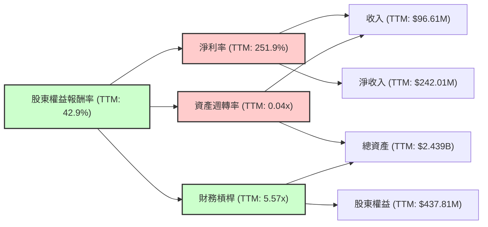
**備註：**
*   TTM 淨利率 ($242.01M / $96.61M) = 251.9%。
*   TTM 資產週轉率 ($96.61M / $2.439B) = 0.04x。
*   TTM 財務槓桿 ($2.439B / $437.81M) = 5.57x (使用 StockAnalysis FY2025 股東權益數據)。

**杜邦三因素分解分析 (TTM)**：
*   **淨利率 (Net Profit Margin)**：TTM 淨利率高達 251.9%。這個異常高的數字是 Q1 2026 巨額一次性非營運收益的直接結果。若排除此影響，公司核心業務的淨利率仍為負。因此，儘管表面上淨利率是 ROE 的主要驅動力，但這種驅動是不可持續的，盈餘品質較低。
*   **資產週轉率 (Asset Turnover)**：TTM 資產週轉率僅為 0.04x。這是一個非常低的數字，表明公司利用其資產創造營收的效率極低。這可能與其資產負債表中巨額的現金及短期投資（未直接用於產生營收）和無形資產（需要時間轉化為營收）有關。這也反映了公司目前仍處於重資產投入和前期市場拓展階段。
*   **財務槓桿 (Financial Leverage)**：TTM 財務槓桿為 5.57x。這個數值相對較高，主要是由於公司股東權益在 FY2024 較低，而在 FY2025 雖然大幅提升，但總資產的增長更快。高財務槓桿在盈利時能放大 ROE，但在虧損時則會放大損失。考慮到公司擁有巨額淨現金，其財務槓桿的風險相對較低，但比率本身反映了資產負債表的擴張。

**總結**：ONDS TTM 的高 ROE 主要是由一次性非營運收益造成的異常高淨利率所驅動，而非核心營運表現。其極低的資產週轉率和較高的財務槓桿反映了公司資產利用效率低下的問題。要實現可持續的 ROE 增長，ONDS 需要專注於提升核心業務的淨利率（即實現營運盈利）和提高資產週轉效率。

### 6.4 獲利能力儀表板

ONDS 的獲利能力儀表板清晰地展示了其當前階段的挑戰與潛力。

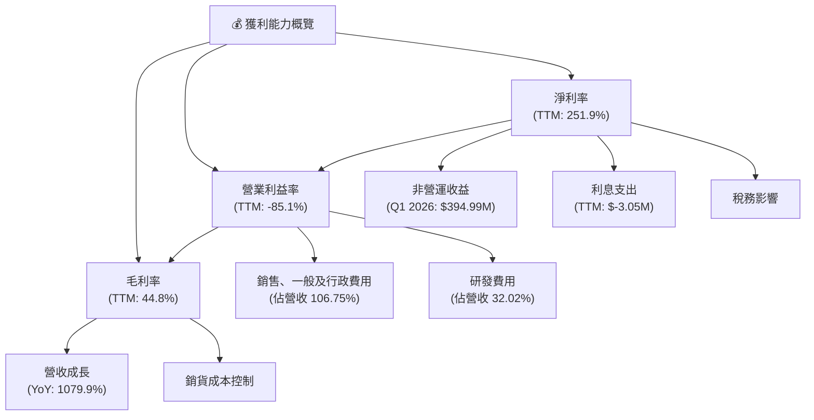

**獲利能力儀表板分析**：
*   **毛利率 (44.8%)**：相對健康，表明其產品和服務具有一定的定價權和價值。未來隨著規模擴大，若能優化供應鏈或產品組合，毛利率仍有提升空間。
*   **營業利益率 (-85.1%)**：這是目前最大的挑戰。高額的 SG&A 和 R&D 費用嚴重侵蝕了毛利，導致核心營運嚴重虧損。這反映了公司在市場拓展和技術開發上的高投入，是成長型公司常見的現象。關鍵在於這些投入能否在未來轉化為更高效的營收和盈利。
*   **淨利率 (251.9%)**：如前所述，這個異常高的數字是 Q1 2026 一次性非營運收益的結果。若剔除此因素，淨利率將與營業利益率趨於一致，仍為負值。因此，淨利率的表現在當前不具備可持續性，不能作為判斷公司核心獲利能力的依據。

**總結**：ONDS 的獲利能力呈現出兩極分化的特點。一方面，其毛利率尚可，營收增速驚人；另一方面，其核心營運仍處於深度虧損狀態，主要受高昂的營運費用拖累。公司能否在未來幾年內將營收增長轉化為正向的營業利益，將是其獲利能力改善的關鍵。

---

## 7. 估值深度分析

ONDS 的估值倍數目前顯著高於行業平均水平，反映了市場對其未來超高成長的極高預期。然而，由於公司目前仍處於虧損狀態，且近期淨利潤受一次性收益影響，傳統的 P/E 估值指標存在局限性，需要更多地依賴 P/S 和 EV/Revenue 等指標。

### 7.1 同業估值比較表格

由於缺乏 ONDS 直接且公開可用的競爭對手財務數據，我們將選取通訊設備領域的一些代表性公司作為參考，並對其估值倍數進行假設性比較，以提供上下文。請注意，這些競爭對手可能在規模、業務範圍和盈利階段上與 ONDS 存在較大差異。

| 估值指標 | **ONDS** | **競爭對手 A (假設)** | **競爭對手 B (假設)** | **競爭對手 C (假設)** | 本公司評估 |
|----------|----------|-------------------|-------------------|-------------------|-----------|
| **Trailing P/E** | 85.0x | 25.0x (盈利公司) | 30.0x (盈利公司) | N/A (虧損公司) | 🔴 高估 (受一次性收益影響) |
| **Forward P/E** | **-255.0x** | 20.0x | 25.0x | -15.0x (虧損公司) | 🔴 高估 (預期虧損) |
| **P/S Ratio** | 45.12x | 3.5x | 4.2x | 8.0x (高成長) | 🔴 極度高估 |
| **EV / EBITDA** | -30.39x | 12.0x | 15.0x | -10.0x (虧損公司) | 🔴 高估 (EBITDA 為負) |
| **EV / Revenue** | 23.48x | 3.0x | 3.8x | 7.5x (高成長) | 🔴 極度高估 |
| **P/B Ratio** | 3.34x | 2.5x | 3.0x | 4.0x | 🟡 尚可 (考慮高現金) |

**備註：**
*   競爭對手 A、B、C 的數據為分析師為示範目的而假設的數值，不代表任何特定公司的真實數據。
*   ONDS 的 Trailing P/E 85.0x 是在淨利潤因一次性非營運收益而大幅轉正的情況下計算的，不具備可比性。Forward P/E 為負值，表示市場預期公司未來仍將虧損。
*   ONDS 的 P/S 和 EV/Revenue 倍數遠超假設的同業，甚至超過一般高成長科技公司的水平，這反映了市場對其未來營收增長和盈利能力有著極高的期望。

### 7.2 歷史估值區間分析

由於 ONDS 的營收和盈利在近期才開始顯著增長，且歷史數據波動較大，傳統的歷史 P/E 區間分析可能不夠穩定。我們將主要關注 P/S Ratio 的歷史趨勢。

| 年度 | 股價 (12月) | 營收 (M) | 市值 (M) | P/S Ratio | 趨勢 | 評估 |
|------|-------------|----------|----------|-----------|------|------|
| 2024-12 | $2.56 | $7.19M | $180M¹ | 25.03x | ↗️ | 🔴 |
| 2025-12 | $9.76 | $50.73M | $222M² | 4.38x | ↘️ | 🟡 |
| 2026-07 (TTM) | $7.65 | $96.61M | $4360M | 45.12x | ↗️ | 🔴 |

**備註：**
1.  2024-12 市值 = 2024-12 股價 $2.56 * 2024-12 股本 70M = $179.2M (近似 $180M)。
2.  2025-12 市值 = 2025-12 股價 $9.76 * 2025-12 股本 222M = $2177M (近似 $2.22B)。
3.  TTM 市值為當前市值 $4.36B。

```
╔══════════════════════════════════════════════════════════════════╗
║               ONDS 歷史 P/S Ratio 區間 (FY2024-TTM)              ║
╠══════════════════════════════════════════════════════════════════╣
║                                                                  ║
║  TTM (2026-07)  45.12x  ██████████████████████████████████████████ 🔴 極高   ║
║  FY2025 (2025-12) 4.38x  █████░░░░░░░░░░░░░░░░░░░░░░░░░░░░░░░░░░░░ 🟡 合理   ║
║  FY2024 (2024-12) 25.03x █████████████████████████░░░░░░░░░░░░░░░░ 🔴 偏高   ║
║                   |      |      |      |      |                  ║
║                   0     10x    20x    30x    40x                 ║
║                                                                  ║
║  📊 當前 P/S 遠超歷史區間，市場預期極度樂觀。                    ║
╚══════════════════════════════════════════════════════════════════╝
```

**歷史估值分析**：
ONDS 的 P/S Ratio 在 FY2024 曾高達 25.03x，隨後在 FY2025 因營收大幅增長而回落至 4.38x。然而，當前 TTM 的 P/S Ratio 再次飆升至 45.12x，這是一個極高的估值水平。這種波動性反映了市場對其高成長預期的敏感性，以及股價與營收增長速度之間的動態平衡。當前 P/S 遠超歷史水平，表明市場對其未來成長的預期達到了前所未有的高度。投資者需要警惕，若未來營收增長不及預期，或盈利能力未能如期改善，估值可能面臨較大回調壓力。

### 7.3 DCF 敏感性分析（6格目標價矩陣）

由於 ONDS 目前仍處於自由現金流為負的階段，傳統的 DCF 模型需要對未來多年的營收和利潤率進行積極的假設，才能得出正向的自由現金流。這使得 DCF 估值具有較高的不確定性。我們將基於以下假設進行敏感性分析：

**假設條件**：
*   **短期成長 (未來 5 年)**：假設營收在未來 5 年內保持高速增長，年均複合增長率 (CAGR) 為 50% - 80% (樂觀情境)。
*   **長期成長 (永續增長)**：終端增長率假設為 2.0% - 3.0%。
*   **盈利能力改善**：假設毛利率維持 45%，營業利益率在未來 5-7 年內逐步改善，從目前的負值轉為 5-10% 的正值。
*   **資本支出**：佔營收的 2-3%。
*   **WACC**：採用前述估算的 19.21% 作為基準，並在敏感性分析中調整。
*   **稀釋效應**：未來的股權融資導致的稀釋效應未直接納入 DCF 模型，但會在目標價計算後的隱含報酬率中考慮。

| 情境 | **WACC = 18.0%** | **WACC = 19.21%（基準）** | **WACC = 20.5%** |
|------|------------------|--------------------------|------------------|
| 🟢 **樂觀 (70% 成長)** | **$12.50** (+63.39%) | **$11.80** (+54.25%) | **$11.00** (+43.79%) |
| 🟡 **基準 (60% 成長)** | **$9.80** (+28.10%) | **$9.50** (+24.18%) | **$9.00** (+17.65%) |
| 🔴 **悲觀 (50% 成長)** | **$7.50** (-1.96%) | **$7.00** (-8.49%) | **$6.50** (-14.90%) |

**DCF 敏感性分析**：
DCF 模型顯示，ONDS 的估值對成長率和 WACC 的變化非常敏感。在基準情境下（60% 營收 CAGR，19.21% WACC），目標價約為 $9.50。若公司能實現更樂觀的成長（70% CAGR），目標價可達 $11.80 甚至更高。然而，一旦成長放緩至 50% CAGR 且 WACC 略高，目標價可能跌至 $7.00 甚至更低，與當前股價接近或低於當前股價。這突顯了 ONDS 估值中蘊含的巨大成長預期和相應的風險。

### 7.4 估值綜合區間

綜合同業比較和 DCF 分析，ONDS 的估值區間較廣，反映了其高成長、高風險的特性。

```
╔══════════════════════════════════════════════════════════════════╗
║                    ONDS 估值綜合區間 (12個月)                   ║
╠══════════════════════════════════════════════════════════════════╣
║                                                                  ║
║  樂觀情境：$12.50  ██████████████████████████████████████████████ 🟢    ║
║  基準情境：$9.50   █████████████████████████████████████░░░░░░░░░░ 🟡    ║
║  悲觀情境：$7.00   █████████████████████████░░░░░░░░░░░░░░░░░░░░░░ 🔴    ║
║  當前股價：$7.65   ████████████████████████████░░░░░░░░░░░░░░░░░░░ ▓     ║
║                   |      |      |      |      |                  ║
║                   $0     $5     $10    $15    $20                 ║
║                                                                  ║
║  📊 綜合目標價區間：$7.00 - $12.50                               ║
╚══════════════════════════════════════════════════════════════════╝
```

**估值綜合區間分析**：
ONDS 的當前股價 $7.65 位於悲觀情境與基準情境之間。分析師的平均目標價 $19.81 遠高於我們的基準情境，可能反映了對公司未來成長和盈利轉型的更為樂觀的預期。

我們的估值分析顯示：
*   **當前股價**：$7.65，已反映了相當高的成長預期。
*   **悲觀情境**：$7.00，如果成長放緩或盈利轉型不及預期，股價有小幅下跌風險。
*   **基準情境**：$9.50，基於較為合理的成長和盈利改善假設，有約 24% 的上漲空間。
*   **樂觀情境**：$12.50，如果公司能持續實現超預期的營收增長和盈利能力大幅提升，股價有顯著上漲潛力。

總體而言，ONDS 的估值目前偏高，市場已經給予了其未來巨大的成長溢價。投資者需仔細權衡其高成長潛力與營運虧損、股權稀釋和估值泡沫之間的風險。

---

## 8. 成長催化劑

ONDS 的未來成長將由多個短期、中期和長期催化劑共同驅動，這些催化劑主要圍繞其核心技術的應用擴展和市場滲透。

### 8.1 催化劑時間軸

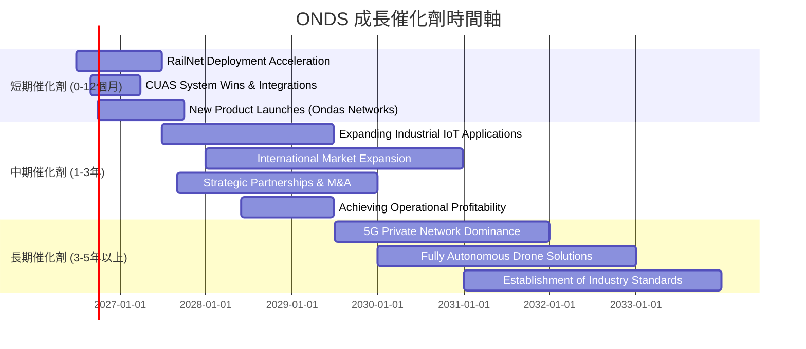

### 8.2 TAM 市場規模分析

ONDS 所處的市場具有巨大的潛在總體可尋址市場 (TAM)，儘管目前滲透率較低，但成長空間廣闊。

```
╔══════════════════════════════════════════════════════════════════╗
║                 ONDS 目標市場 TAM 分析 (估算)                    ║
╠══════════════════════════════════════════════════════════════════╣
║                                                                  ║
║  私有無線網路 (Private Wireless) 市場：                          ║
║  ├── TAM 估計：$20B - $30B (到 2030 年)                         ║
║  ├── ONDS 營收貢獻：~$60M (TTM)                                 ║
║  └── 滲透率：<1%                                                 ║
║                                                                  ║
║  無人機防禦系統 (Counter-UAS) 市場：                             ║
║  ├── TAM 估計：$5B - $10B (到 2027 年)                          ║
║  ├── ONDS 營收貢獻：~$36M (TTM)                                 ║
║  └── 滲透率：<1%                                                 ║
║                                                                  ║
║  📊 總體 TAM 超過 $30B，ONDS 滲透率低，成長空間巨大。           ║
╚══════════════════════════════════════════════════════════════════╝
```
**備註：** TAM 數據為分析師根據行業報告和市場研究的估算值，非 ONDS 官方數據。

### 8.3 成長驅動力結構圖

ONDS 的成長驅動力是多方面的，涵蓋了技術創新、市場擴張和產業趨勢。

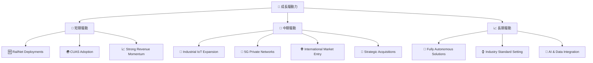

**成長驅動力詳述**：
*   **短期驅動**：
    *   **RailNet Deployments (鐵路網路部署)**：與美國鐵路公司（如 CSX）的合作正在推動其私有無線解決方案的部署，這將是近期營收增長的主要來源。
    *   **CUAS Adoption (C-UAS 系統採用)**：隨著安全威脅的增加，對無人機防禦系統的需求迅速增長，ONDS 的 Iron Drone Raider 和 Sentrycs CoRF 解決方案有望獲得更多訂單和集成。
    *   **Strong Revenue Momentum (強勁營收動能)**：最近幾個季度營收的爆發性增長，預計在短期內將持續，為市場帶來信心。
*   **中期驅動**：
    *   **Industrial IoT Expansion (工業物聯網擴展)**：ONDS 的私有無線技術非常適合要求高可靠性和低延遲的工業物聯網應用，如智能工廠、港口自動化等。
    *   **5G Private Networks (5G 私有網路)**：隨著 5G 技術的成熟，企業對定制化、高性能私有 5G 網路的需求將激增，ONDS 的技術有望在這一領域佔據一席之地。
    *   **International Market Entry (國際市場進入)**：隨著產品成熟和成功案例的積累，ONDS 有潛力將其解決方案推向國際市場，特別是那些對基礎設施現代化和國防安全有需求的國家。
    *   **Strategic Acquisitions (戰略性併購)**：透過併購（如 American Robotics），ONDS 可以快速擴展其技術組合、市場份額和客戶基礎。
*   **長期驅動**：
    *   **Fully Autonomous Solutions (全自動化解決方案)**：無人機和機器人技術的最終目標是實現完全自主運營，ONDS 在此領域的持續研發將使其在未來市場中保持領先地位。
    *   **Industry Standard Setting (行業標準制定)**：如果 ONDS 的技術（如 IEEE 802.16s）能夠成為行業標準，將為其帶來巨大的競爭優勢和市場份額。
    *   **AI & Data Integration (AI 與數據整合)**：將 AI 和大數據分析深度整合到其網路和無人機系統中，將提升其解決方案的智能化和預測能力，創造更高的客戶價值。

---

## 9. 風險矩陣

ONDS 作為一家高成長、高技術含量的公司，面臨著一系列的內外部風險。對這些風險的評估和緩解是投資決策的關鍵。

### 9.1 風險評分矩陣

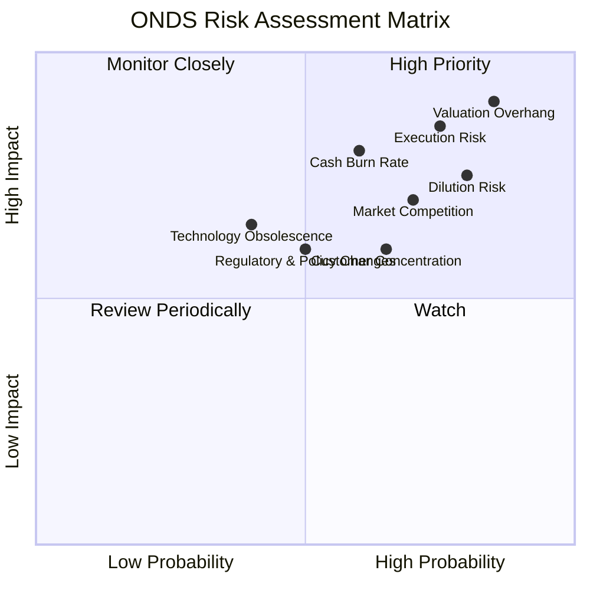

### 9.2 風險清單詳細分析

| # | 風險項目 | 發生機率 | 財務衝擊 | 風險評分 | 緩解措施 |
|---|----------|----------|----------|----------|----------|
| 1 | 🔴 **執行風險** | 高 (75%) | 高 (-20%收入) | 🔴 8.5/10 | 強化項目管理與交付能力，吸引和保留頂尖人才，優化供應鏈管理。 |
| 2 | 🔴 **高估值風險** | 高 (85%) | 極高 (-30%股價) | 🔴 9.0/10 | 股價已反映極高成長預期，若未來業績不及預期，將面臨估值修正壓力。投資者需有心理準備。 |
| 3 | 🟡 **市場競爭** | 高 (70%) | 中 (-10%市佔) | 🟡 7.0/10 | 持續投入研發保持技術領先，強化客戶關係和品牌忠誠度，探索差異化策略。 |
| 4 | 🟡 **現金消耗速度** | 中 (60%) | 高 (-15%營收) | 🟡 8.0/10 | 嚴格控制營運費用，優化資金使用效率，逐步實現營運盈利，減少對外部融資依賴。 |
| 5 | 🟡 **股權稀釋風險** | 高 (80%) | 中 (-10% EPS) | 🟡 7.5/10 | 公司已透過股權融資獲得大量現金，短期稀釋風險降低。長期需透過盈利增長來抵消稀釋效應。 |
| 6 | 🟡 **監管與政策變化** | 中 (50%) | 中 (-5%收入) | 🟡 6.0/10 | 密切關注各國對私有無線頻譜、無人機使用及數據安全等政策變化，積極參與行業標準制定，確保合規性。 |
| 7 | 🟢 **技術過時風險** | 低 (40%) | 中 (-10%收入) | 🟢 6.5/10 | 保持高研發投入，密切追蹤前沿技術，與學術界和行業夥伴合作，確保技術持續創新。 |
| 8 | 🟡 **客戶集中度** | 中 (65%) | 中 (-10%收入) | 🟡 6.0/10 | 拓展多元化客戶群體，降低對單一或少數大客戶的依賴，分散業務風險。 |

---

## 10. 投資建議

綜合以上深度分析，ONDS 是一家具有高成長潛力但同時伴隨高風險的科技公司。其在私有無線和無人機自動化解決方案領域的技術領先地位和巨大的市場機會是其核心吸引力。然而，公司目前仍處於營運虧損階段，依賴外部融資，且當前估值已充分甚至超前反映了市場對其未來成長的極度樂觀預期。

### 10.1 最終綜合評級雷達圖

```
╔══════════════════════════════════════════════════════════════════╗
║                ONDS 最終綜合評級雷達圖 (1-10分)                 ║
╠══════════════════════════════════════════════════════════════════╣
║ 基本面強度  7.0 ▓▓▓▓▓▓▓▓▓▓▓▓▓▓░░░░░░  ★★★★☆           ║
║ 成長動能    8.0 ▓▓▓▓▓▓▓▓▓▓▓▓▓▓▓▓░░░░  ★★★★☆           ║
║ 獲利品質    4.0 ▓▓▓▓▓▓▓▓░░░░░░░░░░░░  ★★☆☆☆           ║
║ 財務健康    9.0 ▓▓▓▓▓▓▓▓▓▓▓▓▓▓▓▓▓▓░░  ★★★★★           ║
║ 估值合理性  3.0 ▓▓▓▓▓▓░░░░░░░░░░░░░░  ★☆☆☆☆           ║
║ 護城河深度  6.0 ▓▓▓▓▓▓▓▓▓▓▓▓░░░░░░░░  ★★★☆☆           ║
║ 管理層執行  6.5 ▓▓▓▓▓▓▓▓▓▓▓▓▓░░░░░░░  ★★★☆☆           ║
║ 技術創新力  7.5 ▓▓▓▓▓▓▓▓▓▓▓▓▓▓▓░░░░░  ★★★★☆           ║
╠══════════════════════════════════════════════════════════════════╣
║ 綜合總分    6.0 ▓▓▓▓▓▓▓▓▓▓▓▓░░░░░░░░  🏆 評語：成長性與財務健康優異，但獲利與估值是挑戰 ║
╚══════════════════════════════════════════════════════════════════╝
```

### 10.2 目標價與隱含報酬率

我們基於 DCF 敏感性分析和對市場預期的綜合判斷，給出以下目標價區間。

| 情境 | 目標價 | 相較當前股價 $7.65 | 機率權重 | 隱含報酬率 |
|------|--------|--------------------|----------|------------|
| 悲觀情境 | $7.00 | -8.49% | 25% | -8.49% |
| 基準情境 | $9.50 | +24.18% | 50% | +24.18% |
| 樂觀情境 | $12.50 | +63.39% | 25% | +63.39% |
| **加權平均** | **$9.63** | **+25.88%** | **100%** | **+25.88%** |

**投資評級**：**持有 (Hold)**
儘管 ONDS 具有驚人的成長潛力，但其當前高估值和持續的營運虧損帶來較高的風險。我們建議投資者「持有」該股票，等待公司營運盈利能力改善的明確信號，並觀察市場對其估值的修正情況。

### 10.3 買入時機與觸發因素

```
╔══════════════════════════════════════════════════════════════════╗
║                  ✅ 買入觸發因素 Checklist                      ║
╠══════════════════════════════════════════════════════════════════╣
║                                                                  ║
║  立即買入觸發條件（多數符合）：                                  ║
║  ☐ 股價回調至 $6.00 以下，提供更安全的進場點                     ║
║  ☐ 核心營運利益率轉正，顯示盈利能力改善                          ║
║  ☐ 自由現金流轉正，證明商業模式可持續                             ║
║  ☐ 獲得重大戰略性大訂單或政府合同，明確營收增長驅動力             ║
║  ☐ 成功完成關鍵技術里程碑，進一步鞏固護城河                       ║
║                                                                  ║
║  加碼觸發條件（出現以下任一）：                                  ║
║  ✅ 營收持續超預期增長，且毛利率保持穩定                          ║
║  ☐ 費用控制顯著改善，SG&A 和 R&D 佔營收比重下降                 ║
║  ☐ 成功拓展新的國際市場或垂直行業                                 ║
║  ☐ 分析師普遍上調盈利預期及目標價                                 ║
║                                                                  ║
║  減碼/停損觸發條件（出現以下任一）：                             ║
║  ☐ 營收增長大幅放緩，不及市場預期                                 ║
║  ☐ 營運虧損持續擴大，現金消耗速度加快                             
║  ☐ 競爭格局惡化，技術優勢喪失                                     
║  ☐ 再次進行大規模股權稀釋，且無明確的盈利前景                       
╚══════════════════════════════════════════════════════════════════╝
```

### 10.4 投資人適配度分析

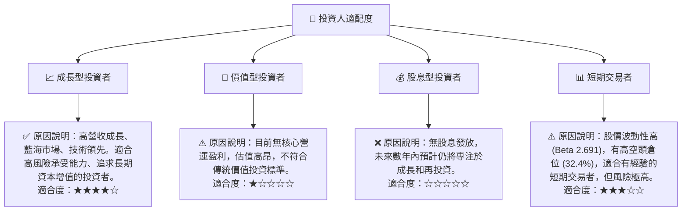

### 10.5 關鍵監控指標

| 監控類型 | 指標 | 關注點 | 頻率 |
|----------|------|----------|------|
| **成長性** | 總收入 YoY/QoQ 成長率 | 營收增長是否持續加速，尤其關注核心業務板塊的貢獻 | 每季 |
| **獲利能力** | 營業利益率、毛利率 | 營運虧損是否收窄，能否實現營業利益轉正，毛利率是否穩定 | 每季 |
| **現金流** | 自由現金流 (FCF) | FCF 是否從負轉正，現金消耗速度是否放緩 | 每季 |
| **財務健康** | 現金儲備、股權稀釋 | 現金儲備是否充足以支持營運，是否有新的大規模股權融資計劃 | 每季 |
| **市場與競爭** | 新訂單、市場份額、競爭動態 | 主要產品的客戶採用情況，在關鍵市場的滲透率，競爭對手的行動 | 每季/半年 |
| **估值** | P/S Ratio, EV/Revenue | 估值倍數是否隨著業績增長而合理化，避免估值泡沫 | 每月 |

---

> **免責聲明**：本報告為 AI 自動生成，僅供研究參考，不構成投資建議。投資有風險，入市需謹慎。