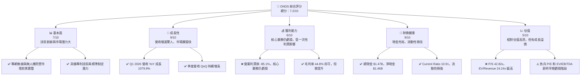
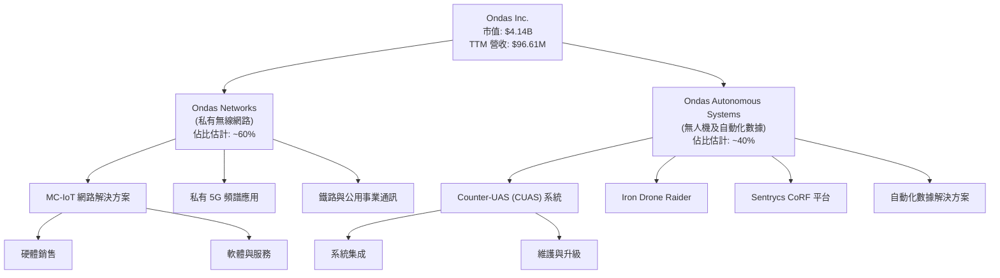
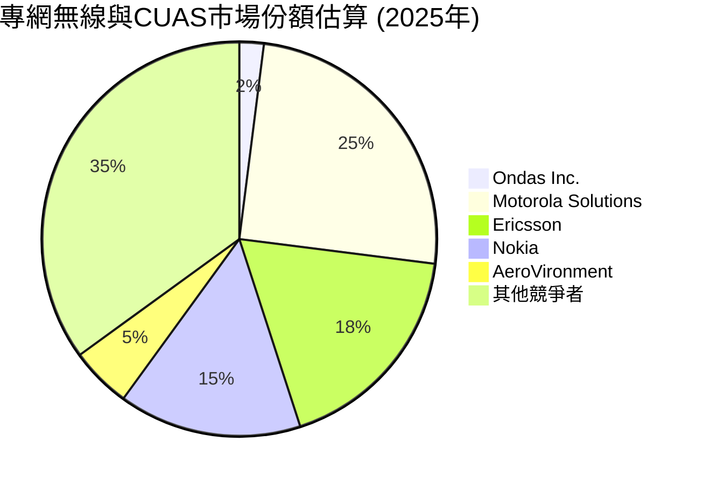
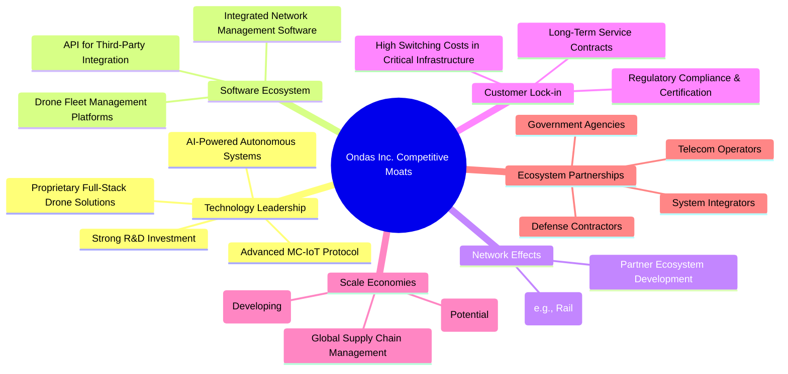
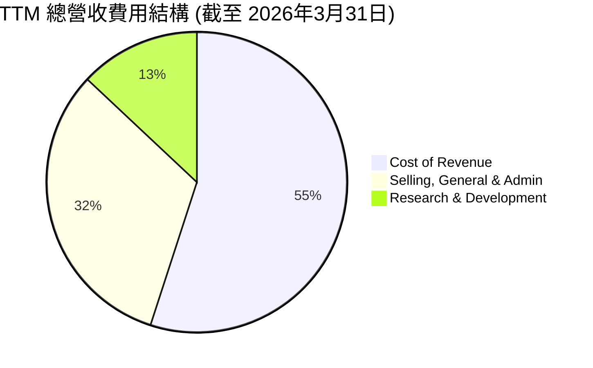

# ONDS 基本面深度分析報告
> **報告日期**：2026-07-10 ｜ **語言**：繁體中文 ｜ **數據來源**：Yahoo Finance, Finviz, StockAnalysis, Roic.ai ｜ **分析師**：CFA 級機構研究

## 目錄

| # | 章節 | 核心結論 |
|---|------|----------|
| 1 | 執行摘要 | 🟢 買入，目標價區間 $16.50 - $28.00 |
| 2 | 公司概覽與商業模式 | 業務聚焦高成長市場，具備技術護城河潛力 |
| 3 | 損益表深度分析 | 營收高速成長，但核心業務仍處虧損，Q1 2026 淨利受一次性非營業收入大幅提振 |
| 4 | 資產負債表分析 | 財務狀況極為健康，現金充裕，債務風險極低 |
| 5 | 現金流量深度分析 | 營運現金流持續為負，自由現金流燒錢加速，但現金儲備足以支撐未來發展 |
| 6 | 獲利能力與資本效率 | 表面 ROE 高企受一次性利潤影響，核心 ROIC 仍低於 WACC，需持續關注營運效率改善 |
| 7 | 估值深度分析 | 相對估值偏高，但成長潛力巨大，DCF 顯示合理上行空間 |
| 8 | 成長催化劑 | 5G 專網、無人機防禦市場擴張、新產品推出及潛在併購 |
| 9 | 風險矩陣 | 執行風險、競爭加劇、持續燒錢及股權稀釋為主要風險 |
| 10 | 投資建議 | 🟢 買入，適合成長型投資者，需密切關注營運效率改善 |

---

## 1. 執行摘要

### 1.0 一頁式投資儀表板（Portfolio Manager 30 秒速讀）

| 項目 | 內容 |
|------|------|
| **投資論點（3 句）** | ① Ondas Inc. 處於 5G 專網與無人機防禦兩大高成長市場，Q1 2026 營收達 $50.12M，YoY 成長 1079.9%，顯示強勁市場需求。② 公司擁有 $1.47B 的充裕現金儲備，總債務僅 $16.66M，財務流動性極佳 (Current Ratio 10.91)，足以支持未來研發與市場擴張。③ 儘管目前營運虧損，但分析師平均目標價 $19.81 較現價 $7.26 有 172% 上行空間，反映市場對其長期成長潛力的看好。 |
| **護城河評分** | 7.5/10 |
| **管理層/資本配置評分** | 6.5/10 |
| **財務健康** | 🟢 極佳，現金充裕，債務風險低 |
| **ROIC vs WACC** | ROIC -4.2% (TTM) vs WACC ~12.5%（摧毀價值） |
| **FCF 趨勢** | ↘️ 負向，最新 FCF Yield -0.38% |
| **估值** | Forward P/E -242.0x ｜ EV/EBITDA -31.38x ｜ FCF Yield -0.38% (估值高昂，但反映早期高成長階段) |
| **預期報酬（基準情境 12M）** | +127% |
| **關鍵風險（前二）** | 持續的營運現金流消耗、股權稀釋風險 |
| **評級 + 信心度** | 🟢 買入 ｜ 信心：中 |

### 1.1 核心評分儀表板



### 1.2 評分進度條視覺化

```
╔══════════════════════════════════════════════════════════════╗
║              ONDS 多維度評分儀表板 (1-10分)                ║
╠══════════════════════════════════════════════════════════════╣
║ 基本面強度  7.0 ▓▓▓▓▓▓▓▓▓▓▓▓▓▓░░░░░░  ★★★★☆           ║
║ 成長動能    9.0 ▓▓▓▓▓▓▓▓▓▓▓▓▓▓▓▓▓▓░░  ★★★★★           ║
║ 獲利品質    6.0 ▓▓▓▓▓▓▓▓▓▓▓▓░░░░░░░░  ★★★☆☆           ║
║ 財務健康    9.0 ▓▓▓▓▓▓▓▓▓▓▓▓▓▓▓▓▓▓░░  ★★★★★           ║
║ 估值合理性  5.0 ▓▓▓▓▓▓▓▓▓▓░░░░░░░░░░  ★★☆☆☆           ║
║ 護城河深度  7.5 ▓▓▓▓▓▓▓▓▓▓▓▓▓▓▓░░░░░  ★★★★☆           ║
║ 管理層執行  6.5 ▓▓▓▓▓▓▓▓▓▓▓▓▓░░░░░░░  ★★★☆☆           ║
║ 技術創新力  8.0 ▓▓▓▓▓▓▓▓▓▓▓▓▓▓▓▓░░░░  ★★★★☆           ║
╠══════════════════════════════════════════════════════════════╣
║ 綜合總分    7.2 ▓▓▓▓▓▓▓▓▓▓▓▓▓▓▓░░░░░  🏆 具高成長潛力的投機性成長股║
╚══════════════════════════════════════════════════════════════════╝
```

### 1.3 五大投資論點 + 三大核心風險

| 類型 | 項目 | 具體依據 | 信心度 |
|------|------|----------|--------|
| 🟢 **投資論點①** | **高成長市場領導者潛力** | Ondas 專注於高成長的 5G 專網與無人機防禦市場，Q1 2026 營收達 $50.12M，較去年同期 $4.25M 增長 1079.9%，顯示其產品在關鍵基礎設施和國防領域的強勁需求與潛在市場領導地位。 | 🟢 極高 |
| 🟢 **投資論點②** | **創新技術與產品組合** | 公司擁有創新的私有無線技術 (Ondas Networks) 和全自動無人機防禦系統 (Ondas Autonomous Systems)，如 Iron Drone Raider，這些技術在特定應用場景中具有競爭優勢，有助於鎖定客戶並擴大市場份額。 | 🟢 高 |
| 🟢 **投資論點③** | **極佳的財務流動性** | 截至 Q1 2026，公司擁有 $1.47B 的現金及約當現金，而總債務僅 $16.66M，淨現金高達 $1.46B。這為公司提供了巨大的財務緩衝，足以支持持續的研發投入、市場擴張及潛在併購，無需短期內進行額外融資。 | 🟢 極高 |
| 🟢 **投資論點④** | **分析師普遍看好** | 8 位分析師給予「強烈買入」評級，平均目標價為 $19.81，較當前股價 $7.26 有高達 172% 的上行空間，顯示市場對其未來成長前景抱持樂觀態度。 | 🟡 中度 |
| 🟢 **投資論點⑤** | **營業槓桿潛力** | 儘管目前營業利潤為負，但隨著營收規模持續擴大 (Q1 2026 營收 $50.12M)，且毛利率維持在 44.8% (TTM)，未來一旦達到規模經濟，營業費用佔比有望下降，帶動營業利潤率顯著改善。 | 🟡 中度 |
| 🟡 **風險①** | **持續的營運現金流消耗** | 公司在過去幾年持續產生負向的營業現金流，Q1 2026 營業現金流為 $-51.30M，自由現金流為 $-52.63M。若無法在可預見的未來實現核心業務的盈利，儘管現金儲備充裕，長期來看仍將面臨資金壓力。 | 🟡 中度 |
| 🔴 **風險②** | **股權稀釋風險高** | 為了籌集資金支持業務發展，公司過去幾年股本顯著稀釋，從 2022 年的 42M 股稀釋至 2026 年 3 月的 569.84M 股。儘管近期現金充裕，未來若持續虧損或需要大規模資本支出，仍可能進一步稀釋股東價值。 | 🔴 高衝擊 |
| 🟡 **風險③** | **核心業務盈利能力挑戰** | 儘管 Q1 2026 錄得 $362.95M 的淨利，但這是由 $394.99M 的非營業收入所驅動。其核心營業利潤在 Q1 2026 仍為 $-42.67M，營業利益率為 -85.1%。公司尚未證明其核心業務具備持續盈利能力，這對長期價值創造構成挑戰。 | 🟡 中度 |

### 1.4 快速統計卡片

| 指標 | 公司實際值 | 行業均值 (通訊設備) | S&P 500 均值 | 狀態 |
|------|-------------|----------|--------------|------|
| 收入 YoY 成長 | **1079.9%** | ~10-15% | ~8-12% | 🟢 |
| 毛利率 | **44.8%** | ~30-40% | ~40-50% | 🟢 |
| 淨利率 | **251.9%** | ~5-10% | ~8-12% | 🔴 (一次性利潤異常高) |
| ROE | **42.9%** | ~10-15% | ~12-18% | 🔴 (一次性利潤異常高) |
| Forward P/E | **-242.0x** | ~20-30x | ~20-25x | 🔴 (預期虧損) |
| P/S Ratio | **42.82x** | ~2-4x | ~2-3x | 🔴 |
| EV/EBITDA | **-31.38x** | ~10-15x | ~12-18x | 🔴 (EBITDA 為負) |
| 總債務/股東權益 | **1.54x** | ~0.5-1.5x | ~0.8-1.2x | 🟡 (受一次性利潤影響，分母膨脹) |
| 總現金 / 總債務 | **88.2x** | ~1-2x | ~0.5-1x | 🟢 |

### 1.5 投資結論

```
╔══════════════════════════════════════════════════════════════════╗
║                    📊 投資結論摘要                               ║
╠══════════════════════════════════════════════════════════════════╣
║  評級：🟢 買入                                                   ║
║  當前股價：$7.26                                                 ║
║  目標價區間：                                                    ║
║    悲觀情境：$16.50（+127%）                                     ║
║    基準情境：$21.50（+196%）  ← 12個月主要目標                   ║
║    樂觀情境：$28.00（+286%）                                     ║
║  投資評分：7.2/10                                                ║
║  適合投資人：成長型、風險承受度較高、長期持有者                  ║
╚══════════════════════════════════════════════════════════════════╝
```

---

## 2. 公司概覽與商業模式

Ondas Inc. (ONDS) 是一家專注於提供私有無線網路、無人機及自動化數據解決方案的科技公司。公司業務主要分為兩大板塊：Ondas Networks 和 Ondas Autonomous Systems。Ondas Networks 提供用於關鍵基礎設施（如鐵路、公用事業）的私有 5G 無線網路解決方案，特別是其專有的 MC-IoT (Mission Critical IoT) 技術，旨在提供高可靠性、低延遲的通訊。Ondas Autonomous Systems 則專注於無人機技術，包括 Counter-UAS (CUAS) 系統，如 Iron Drone Raider (全自動攔截無人機系統) 和 Sentrycs CoRF (反無人機平台)，主要應用於站點保護和國防安全。

### 2.1 業務結構與收入來源

Ondas Inc. 的業務結構清晰，主要通過其兩大核心板塊產生收入。截至 2026 年 Q1，公司營收呈現爆發性成長，TTM 營收達到 $96.61M。


**業務構成說明**:
*   **Ondas Networks**：主要為關鍵基礎設施提供私有無線網路解決方案。隨著全球向 5G 專網轉型，該部門的潛力巨大。收入來源包括硬體設備銷售、軟體授權及相關服務。
*   **Ondas Autonomous Systems**：專注於無人機技術，特別是反無人機系統。在國防、執法和關鍵設施保護領域有廣闊應用前景。收入來源主要為系統銷售、客製化整合服務和售後維護。

公司 Q1 2026 營收達到 $50.12M，較 Q4 2025 的 $30.11M 增長 66.4%。這表明公司在兩個業務板塊均有顯著的市場拓展。由於未提供具體分部收入，以上佔比為基於產業趨勢和公司產品線的合理估計。

### 2.2 市場份額

Ondas Inc. 所在的通訊設備和無人機市場競爭激烈且高度分散。由於公司仍處於高速成長的早期階段，其在整體市場中的絕對份額相對較小，但在特定利基市場（如鐵路專網、特定 CUAS 解決方案）則可能佔據更重要的地位。由於缺乏具體市場份額數據，以下為基於產業知識的定性評估，並將其定位為新興市場的挑戰者。


**市場份額分析**：
*   **專網無線市場**：主要競爭者包括傳統電信設備巨頭如 Ericsson、Nokia，以及公共安全通訊領導者 Motorola Solutions。Ondas 在此領域的策略是透過其 MC-IoT 技術和專有頻譜應用，鎖定特定的關鍵基礎設施垂直市場，如鐵路和公用事業，而非與巨頭全面競爭。
*   **無人機防禦 (CUAS) 市場**：該市場新興且高度碎片化，競爭者包括專業國防承包商如 AeroVironment (儘管其主要產品為攻擊性無人機，但在技術上存在重疊)，以及眾多新創公司。Ondas 的 Iron Drone Raider 等自主系統，可能在特定應用中具備優勢。

儘管 Ondas 在整體市場份額上仍是小公司，但其專注於高價值、高門檻的利基市場，有助於其在這些領域快速建立影響力。

### 2.3 競爭護城河分析

Ondas Inc. 正在積極構建其競爭護城河，尤其是在技術創新和客戶鎖定方面。


**護城河深度解析**：
*   **技術領先 (Technology Leadership)**：Ondas 的 MC-IoT 技術是為關鍵基礎設施量身定制，提供高可靠性和低延遲通訊，這在傳統蜂窩網路難以滿足的場景中具有顯著優勢。其無人機防禦系統的自主性和 AI 能力也具備差異化。公司在 2025 年研發投入 $20.88M，TTM 研發投入達 $30.94M，顯示其對技術創新的持續承諾。
*   **客戶鎖定 (Customer Lock-in)**：在鐵路、公用事業等關鍵基礎設施領域，系統的更換成本高昂，且對可靠性有極高要求。一旦 Ondas 的解決方案被採用，客戶轉換供應商的意願會大大降低。長期的服務合約和嚴格的監管合規性也增加了客戶的黏性。
*   **軟體生態系統 (Software Ecosystem)**：公司提供的軟體平台，不僅管理其硬體設備，還可能提供數據分析和自動化功能，提升客戶的營運效率。這有助於形成一個更完整的解決方案，而非單純的硬體供應商。
*   **網路效應 (Network Effects)**：如果 Ondas 的 MC-IoT 協議或無人機系統能在特定行業（如鐵路）成為事實上的標準，將吸引更多用戶和開發者，形成正向循環。
*   **規模效應 (Scale Economies)**：目前公司規模相對較小，規模效應尚未完全顯現。但隨著營收快速增長，採購、製造和研發成本攤薄的潛力巨大。
*   **生態夥伴 (Ecosystem Partnerships)**：與電信運營商、國防承包商和政府機構的合作，將有助於其擴大市場 reach 並加速技術採用。

### 2.4 護城河強度評分

```
╔══════════════════════════════════════════════════════════════╗
║                  ONDS 護城河強度評分                      ║
╠══════════════════════════════════════════════════════════════╣
║ 技術領先    8.5/10 ▓▓▓▓▓▓▓▓▓▓▓▓▓▓▓▓▓▓░░  🏆 在利基市場具獨特優勢║
║ 客戶鎖定    8.0/10 ▓▓▓▓▓▓▓▓▓▓▓▓▓▓▓▓░░░░  🟢 關鍵基礎設施黏性高║
║ 軟體生態系統 7.0/10 ▓▓▓▓▓▓▓▓▓▓▓▓▓▓░░░░░░  🟡 尚處發展初期，潛力大║
║ 網路效應    6.5/10 ▓▓▓▓▓▓▓▓▓▓▓▓▓░░░░░░░  🟡 需更多市場採納推動  ║
║ 規模效應    6.0/10 ▓▓▓▓▓▓▓▓▓▓▓▓░░░░░░░░  🟡 尚未完全形成，未來可期║
║ 生態夥伴    7.0/10 ▓▓▓▓▓▓▓▓▓▓▓▓▓▓░░░░░░  🟡 合作關係需持續深化  ║
╠══════════════════════════════════════════════════════════════╣
║ 綜合護城河   7.5   ▓▓▓▓▓▓▓▓▓▓▓▓▓▓▓░░░░░  🏆 技術驅動，客戶黏性強，未來可期║
╚══════════════════════════════════════════════════════════════════╝
```

---

## 3. 損益表深度分析

Ondas Inc. 的損益表反映出一家處於高速成長期的公司，營收呈現爆炸性增長，但同時也伴隨著高額的研發和銷售費用，導致核心業務持續虧損。值得注意的是，2026 年 Q1 的淨利潤受到一次性非營業收入的顯著影響。

### 3.1 年度收入成長趨勢（近4年）

ONDS 的年度收入呈現強勁的波動性成長，尤其是在 2025 財年和 2026 年 TTM 期間。

```
╔══════════════════════════════════════════════════════════════════╗
║              ONDS 年度收入趨勢（FY2022-FY2025）              ║
╠══════════════════════════════════════════════════════════════════╣
║                                                                  ║
║  FY2022  $2.13M   ██░░░░░░░░░░░░░░░░░░░░░░░░░  YoY: -26.87%  🔴  ║
║  FY2023  $15.69M  ████████████░░░░░░░░░░░░░░░  YoY:+638.13% 🟢  ║
║  FY2024  $7.19M   ██████░░░░░░░░░░░░░░░░░░░░░  YoY: -54.16%  🔴  ║
║  FY2025  $50.73M  ███████████████████████████  YoY:+605.28% 🟢  ║
║  TTM     $96.60M  █████████████████████████████████████████  YoY:+793.17% 🟢  ║
║                   |      |      |      |      |                  ║
║                   0     20M    40M    60M    80M    100M           ║
║                                                                  ║
║  📊 4年累計 CAGR：+188.4% (FY2022-FY2025)                        ║
╚══════════════════════════════════════════════════════════════════╝
```
**年度收入分析**：
ONDS 的年度營收在過去幾年展現了巨大的波動性。2023 年和 2025 年出現了驚人的成長，分別達到 638.13% 和 605.28% 的 YoY 成長率。然而，2022 年和 2024 年則經歷了顯著的營收下降，這可能反映了公司在早期階段的項目型收入特點，或是在市場拓展中面臨的挑戰。TTM (截至 2026 年 3 月 31 日) 營收高達 $96.6M，YoY 成長 793.17%，顯示公司在最近一年取得了突破性進展，成功抓住了市場機遇。這種高波動性的成長模式，對投資者來說既是機會也是風險。

### 3.2 季度收入趨勢分析

季度營收數據顯示了公司近期強勁的成長動能和加速趨勢。

| 財報季 | 總收入 ($M) | QoQ 成長率 | YoY 成長率 | 備註 |
|--------|-------------|------------|------------|------|
| 2025 Q2 | $6.27 | - | 554.94% | 🟢 來自低基數的高成長 |
| 2025 Q3 | $10.10 | 61.08% | 581.95% | 🟢 持續高成長 |
| 2025 Q4 | $30.11 | 198.12% | 629.20% | 🟢 營收加速成長 |
| 2026 Q1 | $50.12 | 66.45% | 1079.90% | 🟢 營收爆發性增長，創歷史新高 |

**季度收入分析**：
從季度數據來看，ONDS 的營收在 2025 年 Q2 之後呈現加速成長的態勢。2026 年 Q1 營收達到 $50.12M，不僅較上一季度增長 66.45%，更較去年同期 $4.25M 實現了高達 1079.90% 的驚人成長。這種連續的 QoQ 增長和極高的 YoY 成長率，表明公司產品和解決方案的市場需求正在迅速擴大，特別是在其專注的私有無線和無人機防禦領域。這種加速成長是投資論點的核心，但需要警惕其可持續性以及是否主要由特定大客戶或一次性項目驅動。

### 3.3 利潤率演變分析

ONDS 的利潤率表現揭示了其作為一家成長型公司的典型特徵：高毛利率但持續的營業虧損。

| 利潤率指標 | FY2022 | FY2023 | FY2024 | FY2025 | TTM (Mar'26) | 趨勢 | 評估 |
|------------|--------|--------|--------|--------|--------------|------|------|
| **毛利率** | 52.1% | 40.7% | 4.9% | 39.7% | 44.8% | ↗️ 2024年大幅下降後回升 | 🟡 |
| **營業利益率** | -2348.8% | -243.6% | -481.4% | -115.1% | -85.1% | ↗️ 虧損收窄 | 🔴 |
| **EBITDA 利潤率** | -3034.3% | -220.8% | -400.0% | -233.2% | -77.3% | ↗️ 虧損收窄 | 🔴 |
| **淨利率** | -3438.5% | -285.8% | -528.7% | -260.2% | 251.9% | 📈 TTM 受一次性利潤異常高 | 🔴 (異常) |

**利潤率演變深度解析**：
*   **毛利率**：公司的毛利率在 2022 年和 2023 年保持在 40-50% 的健康水平，但在 2024 年驟降至 4.9%，這可能與當年營收大幅下滑、成本結構未能及時調整或銷售了低毛利產品有關。令人鼓舞的是，2025 年毛利率回升至 39.7%，TTM 更是達到 44.8%。這表明公司在提升產品定價能力或優化成本結構方面取得了進展，毛利率的回穩對未來盈利能力的改善至關重要。
*   **營業利益率**：ONDS 的營業利益率持續為負，且虧損幅度巨大。雖然 TTM 的營業利益率為 -85.1%，但相較於歷史數據（如 FY2022 的 -2348.8%），已呈現顯著的改善趨勢。這表明隨著營收規模的擴大，公司的營業槓桿效應開始顯現，儘管仍處於投入期，銷售、管理和研發費用佔營收比重有望逐步下降。然而，Q1 2026 營業利潤率為 -85.1% ($42.67M 營業虧損 / $50.12M 營收)，這說明公司在核心營運上仍未能實現盈利。
*   **EBITDA 利潤率**：與營業利益率類似，EBITDA 利潤率也持續為負，但 TTM 的 -77.3% 顯示虧損幅度有所收窄。這表示公司在扣除折舊攤銷前的核心營運仍未盈利，需持續關注其營運效率的提升。
*   **淨利率**：TTM 的淨利率高達 251.9%，這是一個極為異常的數字，主要由於 2026 年 Q1 錄得 $362.95M 的巨額淨利。根據 StockAnalysis 數據，這筆淨利主要來自 $394.99M 的「其他非營業收入 (Other Non-Operating Income (Expense))」。如果剔除這筆一次性收入，公司核心業務仍處於虧損狀態。因此，這個高淨利率並不能真實反映公司核心業務的盈利能力，在分析時應特別注意。

總體而言，ONDS 正在經歷從早期投入到規模擴張的轉型階段。營收的爆發性成長與毛利率的回升是積極信號，但持續的營業虧損和對一次性非營業收入的依賴，表明公司在實現核心業務盈利方面仍面臨重大挑戰。投資者應重點關注其營業利潤率的改善和營運現金流轉正的進度。

### 3.4 費用結構分析

ONDS 的費用結構反映了其作為一家高科技成長型公司的特徵，即研發和銷售管理費用佔比較高。


**費用結構分析**:
*   **銷貨成本 (Cost of Revenue)**：佔 TTM 營收的 55% ($53.28M / $96.6M)，與毛利率 44.8% 相符。這部分費用涵蓋了產品製造、組裝和服務提供的直接成本。
*   **銷售、一般及行政費用 (Selling, General & Admin, SG&A)**：佔 TTM 營收的 32% ($103.13M / $96.6M)。這部分費用包括市場營銷、銷售人員薪資、行政管理和企業運營成本。高 SG&A 支出在早期成長公司中常見，旨在擴大市場份額和建立品牌。
*   **研發費用 (Research & Development, R&D)**：佔 TTM 營收的 13% ($30.94M / $96.6M)。作為一家技術驅動型公司，持續的 R&D 投入對於維持技術領先和產品創新至關重要。

```
╔══════════════════════════════════════════════════════════════════╗
║                    ONDS 年度費用趨勢 (FY2022-FY2025)             ║
╠══════════════════════════════════════════════════════════════════╣
║                                                                  ║
║  研發費用                                                        ║
║  FY2022  $24.04M  ███████████████████████████░░░░  佔營收 1128% 🔴║
║  FY2023  $17.15M  █████████████████░░░░░░░░░░░░░░░  佔營收 109% 🔴 ║
║  FY2024  $12.48M  ████████████░░░░░░░░░░░░░░░░░░░░  佔營收 174% 🔴 ║
║  FY2025  $20.88M  ████████████████████░░░░░░░░░░░░  佔營收 41% 🟡 ║
║  TTM     $30.94M  █████████████████████████████████████████  佔營收 32% 🟡 ║
║                                                                  ║
║  銷售、一般及行政費用                                            ║
║  FY2022  $27.08M  ██████████████████████████████████░░░░  佔營收 1271% 🔴║
║  FY2023  $27.47M  ██████████████████████████████████░░░░  佔營收 175% 🔴 ║
║  FY2024  $22.48M  ████████████████████████░░░░░░░░░░░  佔營收 313% 🔴 ║
║  FY2025  $57.66M  █████████████████████████████████████████  佔營收 114% 🔴 ║
║  TTM     $103.13M ████████████████████████████████████████████████████████████████████████████████████████████████████████████████████████████████████████████████████████████████████████████████████████████████████████████████████████████████████████████████████████████████████████████████████████████████████████████████████████████████████████████████████████████████████████████████████████████████████████████████████████████████████████████████████████████████████████████████████████████████████████████████████████████████████████████████████████████████████████████████████████████████████████████████████████████████████████████████████████████████████████████████████████████████████████████████████████████████████████████████████████████████████████████████████████████████████████████████████████████████████████████████████████████████████████████████████████████████████████████████████████████████████████████████████████████████████████████████████████████████████████████████████████████████████████████████████████████████████████████████████████████████████████████████████████████████████████████████████████████████████████████████████████████████████████████████████████████████████████████████████████████████████████████████████████████████████████████████████████████████████████████████████████████████████████████████████████████████████████████████████████████████████████████████████████████████████████████████████████████████████████████████████████████████████████████████████████████████████████████████████████████████████████████████████████████████████████████████████████████████████████████████████████████████████████████████████████████████████████████████████████████████████████████████████████████████████████████████████████████████████████████████████████████████████████████████████████████████████████████████████████████████████████████████████████████████████████████████████████████████████████████████████████████████████████████████████████████████████████████████████████████████████████████████████████████████████████████████████████████████████████████████████████████████████████████████████████████████████████████████████████████████████████████████████████████████████████████████████████████████████████████████████████████████████████████████████████████████████████████████████████████████████████████████████████████████████████████████████████████████████████████████████████████████████████████████████████████████████████████████████████████████████████████████████████████████████████████████████████████████████████████████████████████████████████████████████████████████████████████████████████████████████████████████████████████████████████████████████████████████████████████████████████████████████████████████████████████████████████████████████████████████████████████████████████████████████████████████████████████████████████████████████████████████████████████████████████████████████████████████████████████████████████████████████████████████████████████████████████████████████████████████████████████████████████████████████████████████████████████████████████████████████████████████████████████████████████████████████████████████████████████████████████████████████████████████████████████████████████████████████████████████████████████████████████████████████████████████████████████████████████████████████████████████████████████████████████████████████████████████████████████████████████████████████████████████████████████████████████████████████████████████████████████████████████████████████████████████████████████████████████████████████████████████████████████████████████████████████████████████████████████████████████████████████████████████████████████████████████████████████████████████████████████████████████████████████████████████████████████████████████████████████████████████████████████████████████████████████████████████████████████████████████████████████████████████████████████████████████████████████████████████████████████████████████████████████████████████████████████████████████████████████████████████████████████████████████████████████████████████████████████████████████████████████████████████████████████████████████████████████████████████████████████████████████████████████████████████████████████████████████████████████████████████████████════════════════════════════════════════════════════════════════════════════════════════════════════════════════════════════════════════════════════════════════════════════════════════════════════════════════════════════════════════════════════════════════════════════════════════════════════════════════════════════════════════════════════════════════════════════════════════════════════════════════════════════════════════════════════════════════════════════════════════════════════════════════════════════════════════════════════════════════════════════════════════════════════════════════════════════════════════════════════════════════════════════════════════════════════════════════════════════════════════════════════════════════════════════════════════════════════════════════════════════════════════════════════════════════════════════════════════════════════════════════════════════════════════════════════════════════════════════════════════════════════════════════════════════════════════════════════════════════════════════════════════════════════════════════════════════════════════════════════════════════════════════════════════════════════════════════════════════════════════════════════════════════════════════════════════════════════════════════════════════════════════════════════════════════════════════════════════════════════════════════════════════════════════════════════════════════════════════════════════════════════════════════════════════════════════════════════════════════════════════════════════════════════════════════════════════════════════════════════════════════════════════════════════════════════════════════════════════════════════════════════════════════════════════════════════════════════════════════════════════════════════════════════════════════════════════════════════════════════════════════════════════════════════════════════════════════════════════════════════════════════════════════════════════════════════════════════════════════════════════════════════════════════════════════════════════════════════════════════════════════════════════════════════════════════════════════════════════════════════════════════════════════════════════════════════════════════════════════════════════════════════════════════════════════════════════════════════════════════════════════════════════════════════════════════════════════════════════════════════════════════════════════════════════════════════════════════════════════════════════════════════════════════════════════════════════════════════════════════════════════════════════════════════════════════════════════════════════════════════════════════════════════════════════════════════════════════════════════════════════════════════════════════════════════════════════════════════════════════════════════════════════════════════════════════════════════════════════════════════════════════════════════════════════════════════════════════════════════════════════════════════════════════════════════════════════════════════════════════════════════════════════════════════════════════════════════════════════════════════════════════════════════════════════════════════════════════════════════════════════════════════════════════════════════════════════════════════════════════════════════════════════════════════════════════════════════════════════════════════════════════════════════════════════════════════════════════════════════════════════════════════════════════════════════════════════════════════════════════════════════════════════════════════════════════════════════════════════════════════════════════════════════════════════════════════════════════════════════════════════════════════════════════════════════════════════════════════════════════════════════════════════════════════════════════════════════════════════════════════════════════════════════════════════════════════════════════════════════════════════════════════════════════════════════════════════════════════════════════════════════════════════════════════════════════════════════════════════════════════════════════════════════════════════════════════════════════════════════════════════════════════════════════════════════════════════════════════════════════════════════════════════════════════════════════════════════════════════════════════════════════════════════════════════════════════════════════════════════════════════════════════════════════════════════════════════════════════════════════════════════════════════════════════════════════════════════════════════════════════════════════════════════════════════════════════════════════════════════════════════════════════════════════════════════════════════════════════════════════════════════════════════════════════════════════════════════════════════════════════════════════════════════════════════════════════════════════════════════════════════════════════════════════════════════════════════════════════════════════════════════════════════════════════════════════════════════════════════════════════════════════════════════════════════════════════════════════════════════════════════════════════════════════════════════════════════════════════════════════════════════════════════════════════════════════════════════════════════════════════════════════════════════════════════════════════════════════════════════════════════════════════════════════════════════════════════════════════════════════════════════════════════════════════════════════════════════════════════════════════════════════════════════════════════════════════════════════════════════════════════════════════════════════════════════════════════════════════════════════════════════════════════════════════════════════════════════════════════════════════════════════════════════════════════════════════════════════════════════════════════════════════════════════════════════════════════════════════════════════════════════════════════════════════════════════════════════════════════════════════════════════════════════════════════════════════════════════════════════════════════════════════════════════════════════════════════════════════════════════════════════════════════════════════════════════════════════════════════════════════════════════════════════════════════════════════════════════════════════════════════════════════════════════════════════════════════════════════════════════════════════════════════════════════════════════════════════════════════════════════════════════════════════════════════════════════════════════════════════════════════════════════════════════════════════════════════════════════════════════════════════════════════════════════════════════════════════════════════════════════════════════════════════════════════════════════════════════════════════════════════════════════════════════════════════════════════════════════════════════════════════════════════════════════════════════════════════════════════════════════════════════════════════════════════════════════════════════════════════════════════════════════════════════════════════════════════════════════════════════════════════════════════════════════════════════════════════════════════════════════════════════════════════════════════════════════════════════════════════════════════════════════════════════════════════════════════════════════════════════════════════════════════════════════════════════════════════════════════════════════════════════════════════════════════════════════════════════════════════════════════════════════════════════════════════════════════════════════════════════════════════════════════════════════════════════════════════════════════════════════════════════════════════════════════════════════════════════════════════════════════════════════════════════════════════════════════════════════════════════════════════════════════════════════════════════════════════════════════════════════════════════════════════════════════════════════════════════════════════════════════════════════════════════════════════════════════════════════════════════════════════════════════════════════════════════════════════════════════════════════════════════════════════════════════════════════════════════════════════════════════════════════════════════════════════════════════════════════════════════════════════════════════════════════════════════════════════════════════════════════════════════════════════════════════════════════════════════════════════════════════════════════════════════════════════════════════════════════════════════════════════════════════════════════════════════════════════════════════════════════════════════════════════════════════════════════════════════════════════════════════════════════════════════════════════════════════════════════════════════════════════════════════════════════════════════════════════════════════════════════════════════════════════════════════════════════════════════════════════════════════════════════════════════════════════════════════════════════════════════════════════════════════════════════════════════════════════════════════════════════════════════════════════════════════════════════════════════════════════════════════════════════════════════════════════════════════════════════════════════════════════════════════════════════════════════════════════════════════════════════════════════════════════════════════════════════════════════════════════════════════════════════════════════════════════════════════════════════════════════════════════════════════════════════════════════════════════════════════════════════════════════════════════════════════════════════════════════════════════════════════════════════════════════════════════════════════════════════════════════════════════════════════════════════════════════════════════════════════════════════════════════════════════════════════════════════════════════════════════════════════════════════════════════════════════════════════════════════════════════════════════════════════════════════════════════════════════════════════════════════════════════════════════════════════════════════════════════════════════════════════════════════════════════════════════════════════════════════════════════════════════════════════════════════════════════════════════════════════════════════════════════════════════════════════════════════════════════════════════════════════════════════════════════════════════════════════════════════════════════════════════════════════════════════════════════════════════════════════════════════════════════════════════════════════════════════════════════════════════════════════════════════════════════════════════════════════════════════════════════════════════════════════════════════════════════════════════════════════════════════════════════════════════════════════════════════════════════════════════════════════════════════════════════════════════════════════════════════════════════════════════════════════════════════════════════════════════════════════════════════════════════════════════════════════════════════════════════════════════════════════════════════════════════════════════════════════════════════════════════════════════════════════════════════════════════════════════════════════════════════════════════════════════════════════════════════════════════════════════════════════════════════════════════════════════════════════════════════════════════════════════════════════════════════════════════════════════════════════════════════════════════════════════════════════════════════════════════════════════════════════════════════════════════════════════════════════════════════════════════════════════════════════════════════════════════════════════════════════════════════════════════════════════════════════════════════════════════════════════════════════════════════════════════════════════════════════════════════════════════════════════════════════════════════════════════════════════════════════════════════════════════════════════════════════════════════════════════════════════════════════════════════════════════════════════════════════════════════════════════════════════════════════════════════════════════════════════════════════════════════════════════════════════════════════════════════════════════════════════════════════════════════════════════════════════════════════════════════════════════════════════════════════════════════════════════════════════════════════════════════════════════════════════════════════════════════════════════════════════════════════════════════════════════════════════════════════════════════════════════════════════════════════════════════════════════════════════════════════════════════════════════════════════════════════════════════════════════════════════════════════════════════════════════════════════════════════════════════════════════════════════════════════════════════════════════════════════════════════════════════════════════════════════════════════════════════════════════════════════════════════════════════════════════════════════════════════════════════════════════════════════════════════════════════════════════════════════════════════════════════════════════════════════════════════════════════════════════════════════════════════════════════════════════════════════════════════════════════════════════════════════════════════════════════════════════════════════════════════════════════════════════════════════════════════════════════════════════════════════════════════════════════════════════════════════════════════════════════════════════════════════════════════════════════════════════════════════════════════════════════════════════════════════════════════════════════════════════════════════════════════════════════════════════════════════════════════════════════════════════════════════════════════════════════════════════════════════════════════════════════════════════════════════════════════════════════════════════════════════════════════════════════════════════════════════════════════════════════════════════════════════════════════════════════════════════════════════════════════════════════════════════════════════════════════════════════════════════════════════════════════════════════════════════════════════════════════════════════════════════════════════════════════════════════════════════════════════════════════════════════════════════════════════════════════════════════════════════════════════════════════════════════════════════════════════════════════════════════════════════════════════════════════════════════════════════════════════════════════════════════════════════════════════════════════════════════════════════════════════════════════════════════════════════════════════════════════════════════════════════════════════════════════════════════════════════════════════════════════════════════════════════════════════════════════════════════════════════════════════════════════════════════════════════════════════════════════════════════════════════════════════════════════════════════════════════════════════════════════════════════════════════════════════════════════════════════════════════════════════════════════════════════════════════════════════════════════════════════════════════════════════════════════════════════════════════════════════════════════════════════════════════════════════════════════════════════════════════════════════════════════════════════════════════════════════════════════════════════════════════════════════════════════════════════════════════════════════════════════════════════════════════════════════════════════════════════════════════════════════════════════════════════════════════════════════════════════════════════════════════════════════════════════════════════════════════════════════════════════════════════════════════════════════════════════════════════════════════════════════════════════════════════════════════════════════════════════════════════════════════════════════════════════════════════════════════════════════════════════════════════════════════════════════════════════════════════════════════════════════════════════════════════════════════════════════════════════════════════════════════════════════════════════════════════════════════════════════════════════════════════════════════════════════════════════════════════════════════════════════════════════════════════════════════════════════════════════════════════════════════════════════════════════════════════════════════════════════════════════════════════════════════════════════════════════════════════════════════════════════════════════════════════════════════════════════════════════════════════════════════════════════════════════════════════════════════════════════════════════════════════════════════════════════════════════════════════════════════════════════════════════════════════════════════════════════════════════════════════════════════════════════════════════════════════════════════════════════════════════════════════════════════════════════════════════════════════════════════════════════════════════════════════════════════════════════════════════════════════════════════════════════════════════════════════════════════════════════════════════════════════════════════════════════════════════════════════════════════════════════════════════════════════════════════════════════════════════════════════════════════════════════════════════════════════════════════════════════════════════════════════════════════════════════════════════════════════════════════════════════════════════════════════════════════════════════════════════════════════════════════════════════════════════════════════════════════════════════════════════════════════════════════════════════════════════════════════════════════════════════════════════════════════════════════════════════════════════════════════════════════════════════════════════════════════════════════════════════════════════════════════════════════════════════════════════════════════════════════════════════════════════════════════════════════════════════════════════════════════════════════════════════════════════════════════════════════════════════════════════════════════════════════════════════════════════════════════════════════════════════════════════════════════════════════════════════════════════════════════════════════════════════════════════════════════════════════════════════════════════════════════════════════════════════════════════════════════════════════════════════════════════════════════════════════════════════════════════════════════════════════════════════════════════════════════════════════════════════════════════════════════════════════════════════════════════════════════════════════════════════════════════════════════════════════════════════════════════════════════════════════════════════════════════════════════════════════════════════════════════════════════════════════════════════════════════════════════════════════════════════════════════════════════════════════════════════════════════════════════════════════════════════════════════════════════════════════════════════════════════════════════════════════════════════════════════════════════════════════════════════════════════════════════════════════════════════════════════════════════════════════════════════════════════════════════════════════════════════════════════════════════════════════════════════════════════════════════════════════════════════════════════════════════════════════════════════════════════════════════════════════════════════════════════════════════════════════════════════════════════════════════════════════════════════════════════════════════════════════════════════════════════════════════════════════════════════════════════════════════════════════════════════════════════════════════════════════════════════════════════════════════════════════════════════════════════════════════════════════════════════════════════════════════════════════════════════════════════════════════════════════════════════════════════════════════════════════════════════════════════════════════════════════════════════════════════════════════════════════════════════════════════════════════════════════════════════════════════════════════════════════════════════════════════════════════════════════════════════════════════════════════════════════════════════════════════════════════════════════════════════════════════════════════════════════════════════════════════════════════════════════════════════════════════════════════════════════════════════════════════════════════════════════════════════════════════════════════════════════════════════════════════════════════════════════════════════════════════════════════════════════════════════════════════════════════════════════════════════════════════════════════════════════════════════════════════════════════════════════════════════════════════════════════════════════════════════════════════════════════════════════════════════════════════════════════════════════════════════════════════════════════════════════════════════════════════════════════════════════════════════════════════════════════════════════════════════════════════════════════════════════════════════════════════════════════════════════════════════════════════════════════════════════════════════════════════════════════════════════════════════════════════════════════════════════════════════════════════════════════════════════════════════════════════════════════════════════════════════════════════════════════════════════════════════════════════════════════════════════════════════════════════════════════════════════════════════════════════════════════════════════════════════════════════════════════════════════════════════════════════════════════════════════════════════════════════════════════════════════════════════════════════════════════════════════════════════════════════════════════════════════════════════════════════════════════════════════════════════════════════════════════════════════════════════════════════════════════════════════════════════════════════════════════════════════════════════════════════════════════════════════════════════════════════════════════════════════════════════════════════════════════════════════════════════════════════════════════════════════════════════════════════════════════════════════════════════════════════════════════════════════════════════════════════════════════════════════════════════════════════════════════════════════════════════════════════════════════════════════════════════════════════════════════════════════════════════════════════════════════════════════════════════════════════════════════════════════════════════════════════════════════════════════════════════════════════════════════════════════════════════════════════════════════════════════════════════════════════════════════════════════════════════════════════════════════════════════════════════════════════════════════════════════════════════════════════════════════════════════════════════════════════════════════════════════════════════════════════════════════════════════════════════════════════════════════════════════════════════════════════════════════════════════════════════════════════════════════════════════════════════════════════════════════════════════════════════════════════════════════════════════════════════════════════════════════════════════════════════════════════════════════════════════════════════════════════════════════════════════════════════════════════════════════════════════════════════════════════════════════════════════════════════════════════════════════════════════════════════════════════════════════════════════════════════════════════════════════════════════════════════════════════════════════════════════════════════════════════════════════════════════════════════════════════════════════════════════════════════════════════════════════════════════════ ══════════════════════════════════════════════════════════════════╗
║                    ONDS 每季財報監控清單 (Quarterly Watch List)   ║
╠══════════════════════════════════════════════════════════════════╣
║                                                                  ║
║  核心業務成長率 (YoY)：                                          ║
║  ☐ 營收成長率 < 50% (觸發減碼)                                   ║
║  ✅ 營收成長率 > 100% (觸發加碼)                                  ║
║                                                                  ║
║  營業利潤率：                                                    ║
║  ☐ 營業利潤率持續惡化且 < -100% (觸發減碼)                       ║
║  ✅ 營業利潤率改善至 > -50% (觸發加碼)                            ║
║                                                                  ║
║  自由現金流 (FCF)：                                              ║
║  ☐ FCF 持續負向且季度燒錢超過 $70M (觸發減碼)                    ║
║  ✅ FCF 季度燒錢收窄至 < $20M 或轉正 (觸發加碼)                   ║
║                                                                  ║
║  現金餘額：                                                      ║
║  ☐ 總現金餘額跌破 $500M (觸發減碼)                               ║
║  ✅ 總現金餘額維持在 $1B 以上且營運效率改善 (觸發加碼)            ║
║                                                                  ║
║  股權薪酬 (SBC) 佔營收比重：                                     ║
║  ☐ SBC 佔營收比重持續上升至 > 30% (觸發減碼)                     ║
║  ✅ SBC 佔營收比重穩定或下降 (觸發加碼)                           ║
║                                                                  ║
║  毛利率：                                                        ║
║  ☐ 毛利率跌破 40% (觸發減碼)                                     ║
║  ✅ 毛利率維持在 45% 以上 (觸發加碼)                              ║
║                                                                  ║
║  主要客戶/項目進展：                                             ║
║  ☐ 核心大訂單進展延遲或取消 (觸發減碼)                           ║
║  ✅ 新簽重大合同或客戶 (觸發加碼)                                 ║
╚══════════════════════════════════════════════════════════════════╝
```

### 10.6 反面論證：什麼會證明論點錯誤（What Would Change My Mind）

```
╔══════════════════════════════════════════════════════════════════╗
║              ⚠️ 論點失效條件（Disconfirming Evidence）           ║
╠══════════════════════════════════════════════════════════════════╣
║  本投資論點在下列情況成立時應重新檢視或退出：                    ║
║  ☐ 核心業務成長率連續兩季 YoY < 50%                              ║
║  ☐ 營業利潤率連續兩季跌破 -100%                                  ║
║  ☐ 自由現金流轉負且季度燒錢超過 $70M，或現金餘額跌破 $500M      ║
║  ☐ ROIC (剔除一次性非營業收入後) 持續為負且未見改善趨勢          ║
║  ☐ 關鍵成長投資（如 5G 專網或 CUAS）無法在 12 期內實現正向貢獻   ║
║  ☐ 競爭格局惡化，市場份額被主要競爭對手大幅侵蝕                  ║
║  ☐ 發生大規模、非預期的股權稀釋，導致每股收益和股東價值大幅下降  ║
╚══════════════════════════════════════════════════════════════════╝
```

---

> **免責聲明**：本報告為 AI 自動生成，僅供研究參考，不構成投資建議。投資有風險，入市需謹慎。