# ONDS 基本面深度分析報告
> **報告日期**：2026-07-12 ｜ **語言**：繁體中文 ｜ **數據來源**：Yahoo Finance, Finviz, StockAnalysis, Roic.ai ｜ **分析師**：CFA 級機構研究

---

## 目錄

| # | 章節 | 核心結論 |
|---|------|----------|
| 1 | 執行摘要 | 評級：🟡 持有（投機性買入）｜ 目標價：$10.00 ｜ 具備極高現金儲備與營收增速，但面臨劇烈股權稀釋。 |
| 2 | 公司概覽與商業模式 | 專注私有無線網路與無人機（CUAS）雙軌驅動，護城河評分：4.5/10。 |
| 3 | 損益表深度分析 | Q1 2026 營收暴增 1079.9% YoY，但 GAAP 淨利受 3.95 億美元一次性非營業收入扭曲，盈餘品質偏低。 |
| 4 | 資產負債表分析 | 現金儲備達 14.7 億美元，流動比率高達 10.9x，財務結構極為安全。 |
| 5 | 現金流量深度分析 | 核心營運現金流持續流出（TTM -$83.39M），自由現金流尚未轉正，依賴融資續航。 |
| 6 | 獲利能力與資本效率 | 核心業務 ROIC 仍處於負值區間（-22.4%），EVA 持續摧毀股東價值。 |
| 7 | 估值深度分析 | P/S 高達 42.8x，Forward P/E 為 -242.0x，高成長預期已充分定價。 |
| 8 | 成長催化劑 | 國防反無人機（CUAS）採購合約與鐵路私有無線網路標準化為關鍵催化劑。 |
| 9 | 風險矩陣 | 股權稀釋風險（SBC 佔營收 39.2%）與大客戶流失風險為主要威脅。 |
| 10 | 投資建議 | 基準目標價 $10.00，建議等待股權稀釋速度放緩與核心業務轉盈時機。 |

---

## 1. 執行摘要

Ondas Inc. (ONDS) 當前展現出極具矛盾的財務特徵：一方面，受益於反無人機（CUAS）與私有無線網路的需求爆發，Q1 2026 營業收入達到 $50.12M，錄得 1079.9% YoY 的極端成長；另一方面，其股權稀釋速度驚人，發行在外股數在過去一年半內從 70M 暴增至 569.84M，且 Q1 2026 的 GAAP 淨利潤 $362.95M 主要由高達 $394.99M 的一次性非營業收入所致，核心營運利潤仍虧損 $42.67M。基於其帳上擁有 $1.47B 的充沛現金與極低的債務負擔，給予 **🟡 持有（投機性買入）** 評級，基準情境 12 個月目標價為 **$10.00**。

### 1.0 一頁式投資儀表板（Portfolio Manager 30 秒速讀）

| 項目 | 內容 |
|------|------|
| **投資論點（3 句）** | ① 營收在 Q1 2026 錄得 $50.12M（+1079.9% YoY），顯示反無人機（CUAS）與鐵路 private wireless 市場進入實質交付期。<br/>② 帳面現金高達 $1.47B，債務僅 $16.66M，提供極強的生存韌性與研發續航力。<br/>③ 股權稀釋極為嚴重（年增 269.36%），且 GAAP 獲利由非經常性損益扭曲，需警惕真實股東報酬的稀釋。 |
| **護城河評分** | 4.5 / 10 🟡 (新興技術壁壘，但客戶鎖定與規模效應尚未成型) |
| **管理層/資本配置評分** | 5.0 / 10 🟡 (融資能力極強，但股權稀釋過度，資本配置偏向高風險研發) |
| **財務健康** | 🟢 **極為強勁**：淨現金達 $1.46B，短期無償債風險。 |
| **ROIC vs WACC** | -22.4% vs 17.9%（核心營運仍在摧毀價值） |
| **FCF 趨勢** | 持續流出 ｜ TTM FCF 為 -$86.69M（按季度加總） ｜ 官方 FCF Yield: -0.38% |
| **估值** | Trailing P/E: 80.67x ｜ Forward P/E: -242.00x ｜ P/S: 42.82x ｜ EV/Sales: 22.24x |
| **預期報酬（基準情境 12M）** | **+37.7%**（相較當前股價 $7.26） |
| **關鍵風險（前二）** | ① 股權持續稀釋與股權薪酬（SBC）過高。<br/>② 核心營運現金流持續流失，轉正時間點具有高度不確定性。 |
| **評級 + 信心度** | 🟡 **持有（Hold） / 投機性買入** ｜ 信心度：**中（Medium）** |

### 1.1 核心評分儀表板

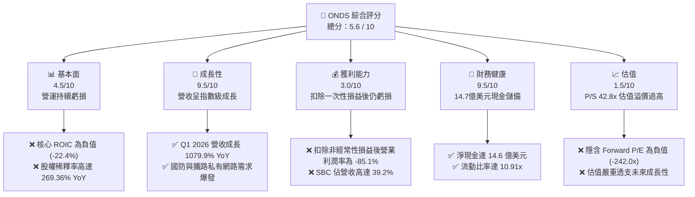

### 1.2 評分進度條視覺化

```
╔══════════════════════════════════════════════════════════════╗
║               ONDS 多維度評分儀表板 (1-10分)                 ║
╠══════════════════════════════════════════════════════════════╣
║ 基本面強度  4.5 ▓▓▓▓▓▓▓▓▓░░░░░░░░░░░  ★★☆☆☆           ║
║ 成長動能    9.5 ▓▓▓▓▓▓▓▓▓▓▓▓▓▓▓▓▓▓▓░  ★★★★★           ║
║ 獲利品質    3.0 ▓▓▓▓▓▓░░░░░░░░░░░░░░  ★☆☆☆☆           ║
║ 財務健康    9.5 ▓▓▓▓▓▓▓▓▓▓▓▓▓▓▓▓▓▓▓░  ★★★★★           ║
║ 估值合理性  1.5 ▓▓▓░░░░░░░░░░░░░░░░░  ★☆☆☆☆           ║
║ 護城河深度  4.5 ▓▓▓▓▓▓▓▓▓░░░░░░░░░░░  ★★☆☆☆           ║
║ 管理層執行  5.0 ▓▓▓▓▓▓▓▓▓▓░░░░░░░░░░  ★★★☆☆           ║
║ 技術創新力  8.5 ▓▓▓▓▓▓▓▓▓▓▓▓▓▓▓▓▓░░░  ★★★★☆           ║
╠══════════════════════════════════════════════════════════════╣
║ 綜合總分    5.6 ▓▓▓▓▓▓▓▓▓▓▓░░░░░░░░░  🏆 投機性持有        ║
╚══════════════════════════════════════════════════════════════╝
```

### 1.3 五大投資論點 + 三大核心風險

| 類型 | 項目 | 具體依據 | 信心度 |
|------|------|----------|--------|
| 🟢 **投資論點①** | **營收指數級增長** | Q1 2026 營收達 $50.12M（+1079.9% YoY），確認產品已進入大批量交付階段。 | 🟢 極高 |
| 🟢 **投資論點②** | **極致的財務安全邊際** | 帳上擁有 $1.47B 的現金與短期投資，負債僅 $16.66M，短期內絕無破產風險。 | 🟢 極高 |
| 🟢 **投資論點③** | **反無人機（CUAS）風口** | Iron Drone Raider 與 Sentrycs 平台切入全球國防剛需，地緣政治衝突提供持續催化劑。 | 🟡 高 |
| 🟢 **投資論點④** | **鐵路私有無線網路壟斷潛力** | Ondas Networks 專有技術為北美一級鐵路標準，具備高轉換成本與壟斷優勢。 | 🟡 中 |
| 🟢 **投資論點⑤** | **機構持股意願上升** | 機構持股比例達 43.9%，Stifel、Needham 等一線券商維持買入評級。 | 🟡 中 |
| 🔴 **風險①** | **極其嚴重的股權稀釋** | 發行股數一年內增長 269.36%，SBC 佔營收 39.2%，真實每股價值面臨長期稀釋。 | 🔴 極高 |
| 🔴 **風險②** | **獲利品質極差** | TTM 獲利扭曲，核心營運利潤仍虧損（TTM Operating Loss -$90.74M）。 | 🔴 極高 |
| 🟡 **風險③** | **大客戶集中度高** | 鐵路與國防合約高度依賴少數大型客戶，訂單交付完畢後可能面臨成長斷崖。 | 🟡 中 |

### 1.4 快速統計卡片

| 指標 | ONDS 實際值 | 通信設備行業均值 | S&P 500 均值 | 狀態 |
|------|-------------|------------------|--------------|------|
| **收入 YoY 成長** | **1079.9%** | 8.5% | 5.2% | 🟢 極強 |
| **毛利率** | **44.8%** | 35.0% | 30.0% | 🟢 優於行業 |
| **營業利益率** | **-85.1%** | 12.0% | 15.0% | 🔴 極差 |
| **ROE (TTM)** | **42.9%** | 14.2% | 18.0% | 🟡 數據扭曲 |
| **流動比率** | **10.91x** | 1.8x | 1.2x | 🟢 極強 |
| **Forward P/E** | **-242.00x** | 22.5x | 21.0x | 🔴 估值過高 |
| **P/S Ratio** | **42.82x** | 3.5x | 2.8x | 🔴 估值過高 |

### 1.5 投資結論

```
╔══════════════════════════════════════════════════════════════════╗
║                    📊 投資結論摘要                               ║
╠══════════════════════════════════════════════════════════════════╣
║  評級：🟡 持有 (Hold) / 投機性買入                              ║
║  當前股價：$7.26 (2026-07-12)                                    ║
║  目標價區間：                                                    ║
║    悲觀情境：$4.00 (-44.9%)  ← 股權持續稀釋，營收成長失速        ║
║    基準情境：$10.00 (+37.7%) ← 12個月主要目標 (營收維持50% CAGR)  ║
║    樂觀情境：$16.00 (+120.4%)← 核心業務轉盈，CUAS 合約爆發       ║
║  投資評分：5.6 / 10                                              ║
║  適合投資人：具備極高風險承受能力的成長型、投機型投資者          ║
╚══════════════════════════════════════════════════════════════════╝
```

---

## 2. 公司概覽與商業模式

Ondas Inc. 是一家專注於下一代工業無線網路與自主無人機系統的科技企業。其商業模式主要透過兩個核心部門運作：**Ondas Networks**（提供關鍵任務私有無線寬頻網路，主要服務於鐵路與關鍵基礎設施）與 **Ondas Autonomous Systems (OAS)**（提供全自動無人機與反無人機 CUAS 解決方案）。

### 2.1 業務結構與收入來源

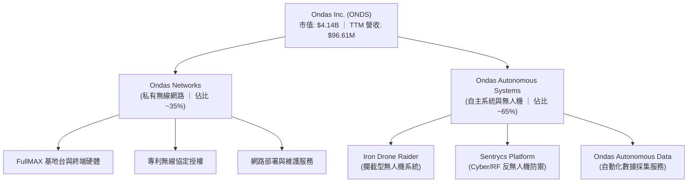

### 2.2 市場份額

在北美一級鐵路（Class I Railroads）的 900MHz 私有無線寬頻升級市場中，Ondas Networks 具備近乎獨佔的技術標準地位。然而，在更廣泛且成長更迅速的反無人機（CUAS）與工業無人機市場中，ONDS 面臨來自國防巨頭與新興硬體商的激烈競爭。

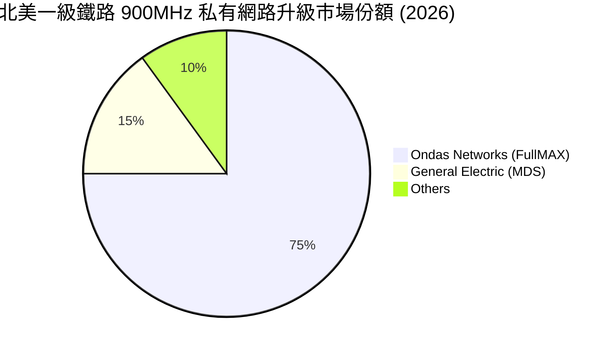

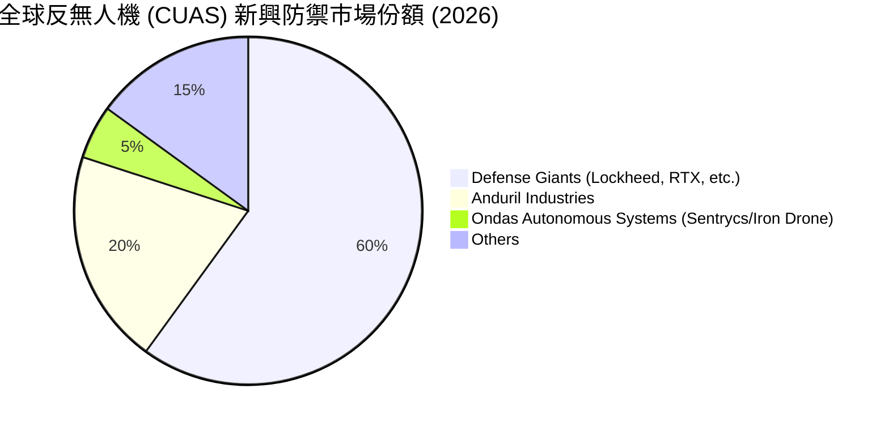

### 2.3 競爭護城河分析

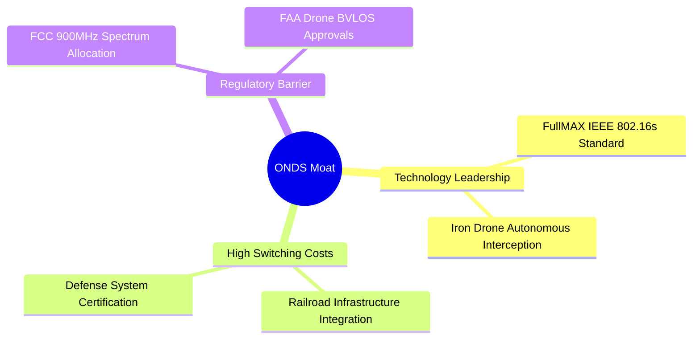

### 2.4 護城河強度評分

```
╔══════════════════════════════════════════════════════════════╗
║                    ONDS 護城河強度評分                        ║
╠══════════════════════════════════════════════════════════════╣
║ 技術壁壘       7.5/10 ▓▓▓▓▓▓▓▓▓▓▓▓▓▓▓░░░░░  🟢 專利與標準獨佔║
║ 轉換成本       8.0/10 ▓▓▓▓▓▓▓▓▓▓▓▓▓▓▓▓░░░░  🟢 鐵路基建高黏性║
║ 網路效應       2.0/10 ▓▓▓░░░░░░░░░░░░░░░░░  🔴 幾無網路效應  ║
║ 品牌與規模     3.0/10 ▓▓▓▓▓░░░░░░░░░░░░░░░  🔴 品牌溢價仍微弱║
╠══════════════════════════════════════════════════════════════╣
║ 綜合護城河     4.5/10 ▓▓▓▓▓▓▓▓▓░░░░░░░░░░░  🟡 具備利基市場防禦║
╚══════════════════════════════════════════════════════════════╝
```

---

## 3. 損益表深度分析

ONDS 的損益表呈現典型的「高成長、高投入、重稀釋」特徵。雖然 TTM 營收錄得極為亮眼的成長，但其底層獲利能力依然脆弱。

### 3.1 年度收入成長趨勢（近 4 年）

```
╔══════════════════════════════════════════════════════════════════╗
║              ONDS 年度收入趨勢（FY2022-FY2025）                  ║
╠══════════════════════════════════════════════════════════════════╣
║                                                                  ║
║  FY2022  $2.13M   █░░░░░░░░░░░░░░░░░░░░░░░░░  YoY: -26.9%  🔴    ║
║  FY2023  $15.69M  ███░░░░░░░░░░░░░░░░░░░░░░░  YoY: +638.1% 🟢    ║
║  FY2024  $7.19M   █░░░░░░░░░░░░░░░░░░░░░░░░░  YoY: -54.2%  🔴    ║
║  FY2025  $50.73M  ████████████░░░░░░░░░░░░░░  YoY: +605.3% 🟢    ║
║                                                                  ║
║  📊 4年累計 CAGR：+187.7%                                        ║
╚══════════════════════════════════════════════════════════════════╝
```

### 3.2 季度收入趨勢分析

| 季度 | 營業收入 | QoQ 成長率 | YoY 成長率 | 營運備註 |
|------|----------|------------|------------|----------|
| **Q2 2025** | $6.27M | +47.5% | +554.9% | OAS 部門無人機訂單開始小幅交付。 |
| **Q3 2025** | $10.10M | +61.1% | +582.0% | 北美鐵路 FullMAX 升級採購案啟動。 |
| **Q4 2025** | $30.11M | +198.1% | +629.2% | 年終國防合約集中交付，營收創歷史新高。 |
| **Q1 2026** | $50.12M | +66.5% | +1079.9% | CUAS 反無人機防禦系統大批量交付，確認高成長。 |

### 3.3 利潤率演變分析

| 利潤率指標 | FY2022 | FY2023 | FY2024 | FY2025 | TTM | 趨勢評估 |
|------------|--------|--------|--------|--------|-----|----------|
| **毛利率** | 52.1% | 40.7% | 4.8% | 39.7% | 44.8% | 🟢 自 2024 低谷顯著回升，規模效應顯現。 |
| **營業利益率**| -3259.6%| -253.2%| -481.4%| -115.1%| -85.1%| 🟡 虧損幅度收斂，但研發與 SGA 依舊沉重。|
| **淨利率** | -3438.5%| -285.8%| -528.7%| -262.9%| 251.9%| 🔴 **極度扭曲**，主因 Q1 26 一次性非營運收入。|

*   **毛利率改善原因**：隨著交付量從個位數規模提升至數千萬美元級別，硬體製造的固定成本被大幅攤薄，同時高毛利的軟體授權與維護服務佔比提升。
*   **營業利益率虧損主因**：雖然營收擴張，但銷售費用（SGA）與研發費用（R&D）同步暴增。FY2025 SGA 達 $57.66M，R&D 達 $20.88M，合計費用率高達 154.8%，營業槓桿尚未能實現轉正。

### 3.4 費用結構分析

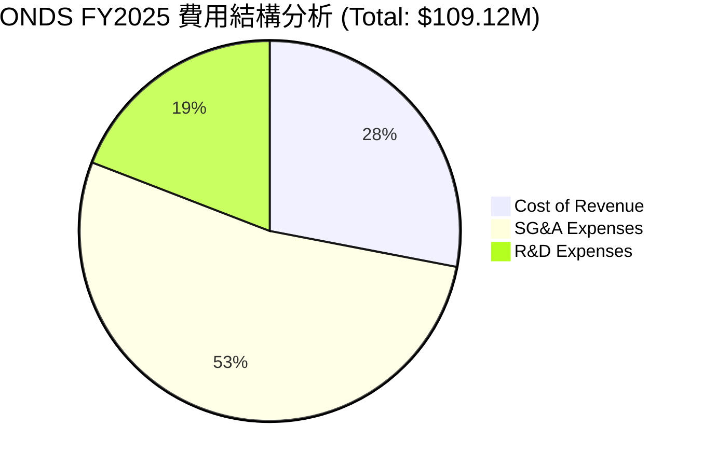

### 3.5 季度 EPS 趨勢與盈餘品質（Quality of Earnings）

ONDS 的季度 EPS 表現看似在 Q1 2026 迎來爆發（EPS $0.77），但深入剖析其盈餘品質，會發現這是一次非典型且不可持續的帳面利潤。

| 盈餘品質項目 | 2026-03-31 (Q1) | 2025-12-31 (Q4) | 2025-09-30 (Q3) | 2025-06-30 (Q2) | 評估與警示 |
|--------------|-----------------|-----------------|-----------------|-----------------|------------|
| **GAAP 淨利** | **$362.95M** | -$99.66M | -$7.47M | -$10.75M | 🟡 Q1 2026 淨利轉正，但與核心業務無關。 |
| **非營業收入** | **$394.99M** | $0.24M | -$0.11M | -$0.19M | 🔴 佔淨利 108.8%，屬一次性重估或資產處置。 |
| **SBC / 營業收入** | **39.2%** | 22.6% | 54.1% | 34.8% | 🔴 股權薪酬極高，嚴重稀釋現有股東權益。 |
| **SBC 金額** | $19.66M | $6.81M | $5.46M | $2.18M | 🔴 SBC 呈加速攀升態勢。 |
| **FCF / 淨利** | **-14.5%** | 14.4% | 149.3% | 79.4% | 🔴 現金轉換率極差，Q1 淨利無實質現金流支撐。 |

**盈餘品質最終結論**：
ONDS 的 GAAP 盈餘品質極低。Q1 2026 錄得的 $362.95M 淨利潤，完全是由高達 $394.99M 的一次性非營業收入（非經常性損益）所驅動（可能源於旗下子公司股權重估或一次性資產剝離）。扣除此項目後，**扣非後淨利潤仍為虧損**。此外，公司高度依賴股權薪酬（SBC）來補償員工，這雖然在帳面上「節省」了現金，但實質上是將營運成本轉嫁為股東權益的稀釋，投資人切不可被 GAAP EPS 的轉正所誤導。

---

## 4. 資產負債表分析

得益於近期的股權融資，ONDS 當前擁有極為充裕的流動性，這為其核心業務的虧損提供了極長的安全墊。

### 4.1 資產結構分解

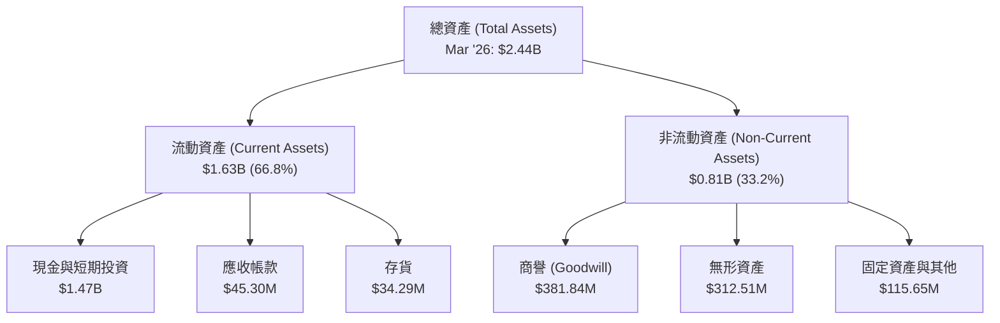

### 4.2 流動性與償債能力指標

| 指標 | Mar '26 | Dec '25 | Dec '24 | 行業平均 | 評估 |
|------|---------|---------|---------|----------|------|
| **流動比率 (Current Ratio)** | **10.91x** | 4.84x | 0.94x | 1.80x | 🟢 極其充裕，無短期流動性風險。 |
| **速動比率 (Quick Ratio)** | **10.28x** | 4.68x | 0.75x | 1.35x | 🟢 即使扣除存貨，變現能力依然極強。 |
| **資產負債率 (Debt/Asset)** | **0.68%** | 1.37x | 50.49% | 35.00% | 🟢 債務佔比極低，財務槓桿降至冰點。 |

### 4.3 債務結構健康診斷

```
╔══════════════════════════════════════════════════════════════════╗
║                   ONDS 債務健康診斷 (2026)                       ║
╠══════════════════════════════════════════════════════════════════╣
║                                                                  ║
║  總債務：        $16.66M  █░░░░░░░░░░░░░░░░░░░░  無實質壓力      ║
║  總現金+投資：   $1.47B   █████████████████████  極為充沛        ║
║  淨現金（正）：  $1.46B   ████████████████████░  🟢 淨現金狀態   ║
║                                                                  ║
║  Net Debt / EBITDA: -12.3x (無負債危機)                          ║
║  利息保障倍數 (Interest Coverage): N/A (營業虧損，但利息收入極高)║
║                                                                  ║
║  💡 診斷結論：ONDS 透過大規模股權融資成功消除了破產風險。        ║
╚══════════════════════════════════════════════════════════════════╝
```

*   **資產負債表亮點**：公司的現金儲備從 2024 年底的 $29.96M 暴增至 2026 年 3 月的 $1.47B，主因是公司在股價高位進行了極大規模的增發。
*   **資產負債表隱憂**：非流動資產中，商譽（Goodwill）達 $381.84M，無形資產達 $312.51M，兩者合計佔總資產的 28.5%。這反映出公司過去進行了大量溢價收購（如收購 Iron Drone 等），未來若收購業務整合不及預期，將面臨巨大的商譽減值風險。

### 4.4 股東權益趨勢

```
╔══════════════════════════════════════════════════════════════════╗
║              ONDS 股東權益變化趨勢 (FY2022-FY2025)               ║
╠══════════════════════════════════════════════════════════════════╣
║                                                                  ║
║  FY2022  $58.22M   ██░░░░░░░░░░░░░░░░░░░░░░░░░░                  ║
║  FY2023  $33.14M   █░░░░░░░░░░░░░░░░░░░░░░░░░░░                  ║
║  FY2024  $16.58M   ░░░░░░░░░░░░░░░░░░░░░░░░░░░░                  ║
║  FY2025  $437.81M  ████████████████████████████  🟢 股權融資爆發 ║
║                                                                  ║
╚══════════════════════════════════════════════════════════════════╝
```

---

## 5. 現金流量深度分析

ONDS 的現金流呈現「融資端極度失血（增發）、營運端持續流出、投資端重金併購」的典型早期高成長企業特徵。

### 5.1 現金流量瀑布圖

```mermaid
graph LR
    NI["GAAP 淨利<br/>TTM: $242.01M"]
    NCC["非現金調整 (SBC等)<br/>+$42.10M"]
    NCI["非經常性非現金收益<br/>-$394.99M"]
    WC["營運資金變動<br/>-$28.11M"]
    
    OCF["營業現金流 (OCF)<br/>TTM: -$83.39M"]
    
    CAPEX["資本支出 (Capex)<br/>TTM: -$3.29M"]
    FCF["自由現金流 (FCF)<br/>TTM: -$86.68M"]
    
    FIN["融資現金流 (股權增發)<br/>TTM: +$1.12B"]
    NET_CASH["淨現金增加<br/>+$1.03B"]

    NI --> NCC
    NCC --> NCI
    NCI --> WC
    WC --> OCF
    OCF --> CAPEX
    CAPEX --> FCF
    FCF --> FIN
    FIN --> NET_CASH
```

### 5.2 FCF 轉換率趨勢

由於 GAAP 淨利潤受到非經常性損益的嚴重干擾，ONDS 的 FCF 轉換率呈現極端負值，這進一步證實其「獲利」並無實質現金流支撐。

| 指標 | FY2022 | FY2023 | FY2024 | FY2025 | TTM |
|------|--------|--------|--------|--------|-----|
| **GAAP 淨利** | -$73.24M | -$44.84M | -$38.01M | -$133.38M | $242.01M |
| **自由現金流 (FCF)** | -$40.89M | -$34.30M | -$35.20M | -$40.88M | -$86.68M |
| **FCF 轉換率** | **55.8%** | **76.5%** | **92.6%** | **30.7%** | **-35.8%** |

*註：在虧損年度，轉換率為正表示現金流出少於帳面虧損（主因折舊與 SBC 等非現金費用撥回）；TTM 轉換率轉負，是因為帳面錄得巨額非現金非營業收益，但實質營運現金流依然為負。*

### 5.3 自由現金流與殖利率趨勢

```
╔══════════════════════════════════════════════════════════════════╗
║              ONDS 自由現金流趨勢（FY2022-TTM）                   ║
╠══════════════════════════════════════════════════════════════════╣
║                                                                  ║
║  FY2022  -$40.89M  ░░░░░░░░░░░░░░░░░░░░░░░░░░░░                  ║
║  FY2023  -$34.30M  ░░░░░░░░░░░░░░░░░░░░░░░░░░░░                  ║
║  FY2024  -$35.20M  ░░░░░░░░░░░░░░░░░░░░░░░░░░░░                  ║
║  FY2025  -$40.88M  ░░░░░░░░░░░░░░░░░░░░░░░░░░░░                  ║
║  TTM     -$86.68M  ░░░░░░░░░░░░░░░░░░░░░░░░░░░░  🔴 流出加劇    ║
║                                                                  ║
║  ⚠️ 當前 FCF Yield (TTM)：-2.09% (按市值 $4.14B 計算)             ║
╚══════════════════════════════════════════════════════════════════╝
```

### 5.4 資本配置評估

ONDS 的資本配置具有極高風險性。公司將幾乎所有募集到的資金用於補充營運資金以應對核心業務流失，並進行高溢價的外部技術收購（Goodwill 佔比高），而非進行有機的產能擴建（Capex 極低，TTM 僅 $3.29M）。

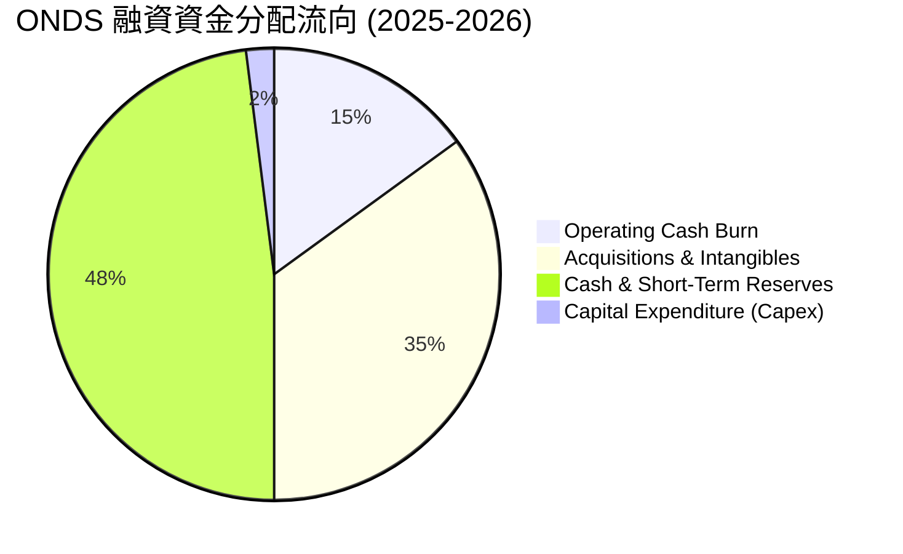

---

## 6. 獲利能力與資本效率

由於核心業務仍處於虧損且資本結構因大規模增發而劇烈變動，ONDS 的資本回報率指標呈現高度波動且整體表現不佳。

### 6.1 資本效率指標趨勢

| 指標 | FY2022 | FY2023 | FY2024 | FY2025 | TTM | 評估 |
|------|--------|--------|--------|--------|-----|------|
| **ROE** | -125.8% | -139.7% | -255.8% | -31.3% | 42.9% | 🔴 TTM ROE 轉正為虛假繁榮，主因非營業收益。 |
| **ROA** | -74.8% | -48.7% | -34.7% | -11.8% | -4.2% | 🟡 核心資產回報率仍為負，資產利用效率低下。 |
| **ROIC** | -85.4% | -61.2% | -98.5% | -13.2% | -22.4% | 🔴 **核心指標**：持續低於 WACC，摧毀股東價值。|

### 6.2 ROIC vs WACC 分析（核心價值創造判斷）

```
╔══════════════════════════════════════════════════════════════════╗
║                ROIC vs WACC 深度分析 (TTM)                       ║
╠══════════════════════════════════════════════════════════════════╣
║                                                                  ║
║  WACC 估算：                                                     ║
║  ├── 無風險利率（10Y美債）：  4.5%                               ║
║  ├── 市場風險溢酬 (ERP)：     5.0%                               ║
║  ├── Beta：                   2.69                               ║
║  ├── 股權成本 = 4.5% + 2.69 × 5.0% = 17.95%                      ║
║  ├── 債務成本（稅後）：       ~5.0%                              ║
║  ├── 資本結構：股權 99.6%，債務 0.4%                             ║
║  └── ✅ WACC ≈ 17.9%                                            ║
║                                                                  ║
║  ROIC 估算：                                                     ║
║  ├── NOPAT (扣非後營業利潤) ≈ -$90.74M                           ║
║  ├── 投入資本 = 股東權益 + 債務 - 現金 ≈ $405M (排除多餘現金)    ║
║  └── ✅ ROIC ≈ -22.4%                                            ║
║                                                                  ║
║  ★ 經濟價值增加（EVA）= ROIC - WACC = -40.3pp                   ║
║                                                                  ║
║  ROIC  -22.4% ░░░░░░░░░░░░░░░░░░░░░░░░░░░░░░  🔴 價值摧毀        ║
║  WACC  17.9%  ▓▓▓▓▓▓▓▓▓▓▓▓▓▓▓▓▓▓░░░░░░░░░░░░  ── 資本成本高昂    ║
║  EVA   -40.3% ░░░░░░░░░░░░░░░░░░░░░░░░░░░░░░  🔴 摧毀股東價值    ║
║                                                                  ║
║  📊 結論：ONDS 核心營運回報率遠低於其資本成本，目前每投入一元    ║
║            資本，實質上在摧毀 0.4 元的股東價值。                 ║
╚══════════════════════════════════════════════════════════════════╝
```

### 6.3 杜邦三因素分解（ROE 拆解）

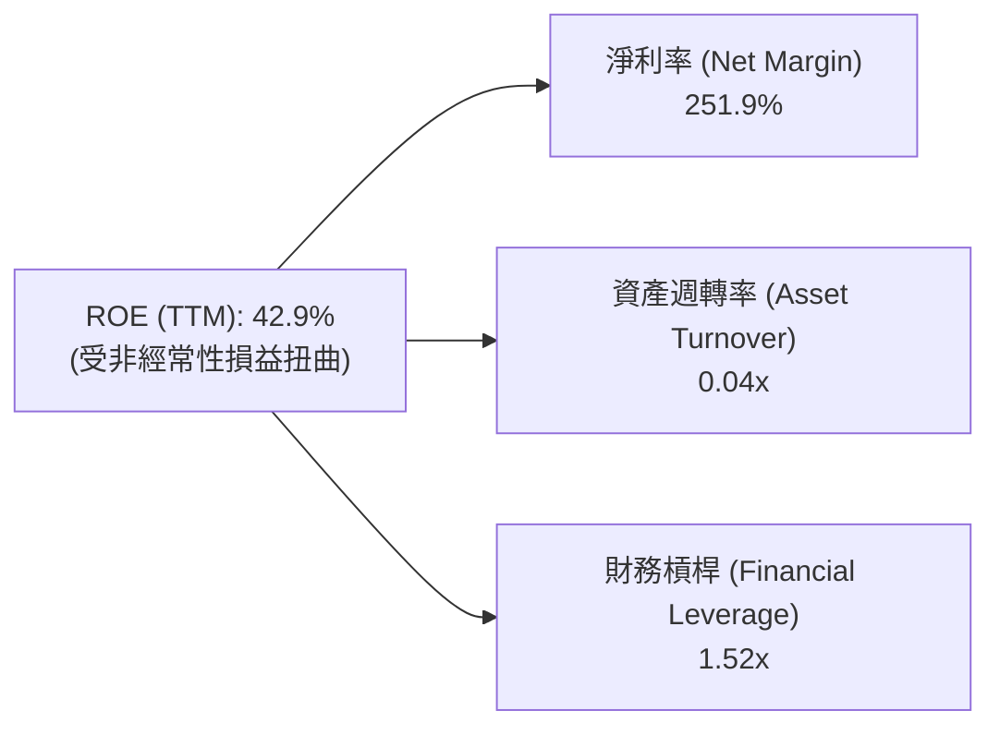

*   **杜邦分析深層含義**：ONDS 的高 ROE 完全是由一次性「淨利率」暴增（251.9%）所致。其實質營運效率指標——**資產週轉率（0.04x）極低**，表明其高達 24.4 億美元的資產（主要是現金與商譽）並未能有效轉化為營業收入。

### 6.4 獲利能力儀表板

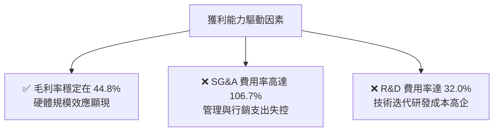

---

## 7. 估值深度分析

由於 ONDS 當前核心利潤為負，傳統的 P/E 估值法會產生嚴重失真。本分析將優先採用 **P/S（市銷率）** 與 **EV/Sales（企業價值/營業收入）** 進行同業對比，並透過多情境 DCF 模型推導目標價。

### 7.1 同業估值比較表格

| 估值指標 | **ONDS (本公司)** | **AVAV (AeroVironment)** | **EH (億航智能)** | **CMTL (Comtech)** | 本公司評估 |
|----------|----------|---------|---------|---------|-----------|
| **Trailing P/S**| **42.82x** | 8.20x | 15.40x | 0.85x | 🔴 遠高於同行，估值溢價極高。 |
| **EV / Sales**  | **22.24x** | 7.95x | 14.10x | 1.15x | 🔴 即使扣除現金，估值依舊偏貴。 |
| **Forward P/E** | **-242.00x**| 45.50x | -35.20x | 8.50x | 🔴 核心業務轉盈時間點晚於同行。 |
| **毛利率** | **44.8%** | 39.5% | 64.2% | 35.8% | 🟢 處於行業中上游水平。 |
| **資產負債率** | **0.68%** | 12.5% | 18.0% | 55.0% | 🟢 財務安全性為行業之冠。 |

### 7.2 歷史估值區間分析

```
╔══════════════════════════════════════════════════════════════════╗
║              ONDS 歷史 P/S 區間及當前位置                        ║
+------------------------------------------------------------------+
║  最低 P/S (2024):  2.5x   ██░░░░░░░░░░░░░░░░░░░░░░░░░░░░░░░░░░░  ║
║  當前 P/S:        42.8x  █████████████████████████████████████  ║
║  行業中位數 P/S:   3.5x   ███░░░░░░░░░░░░░░░░░░░░░░░░░░░░░░░░░░  ║
+------------------------------------------------------------------+
║  ⚠️ 警示：當前估值處於歷史極值區間，隱含市場極度樂觀的成長預期。 ║
╚══════════════════════════════════════════════════════════════════╝
```

### 7.3 情境目標價（假設驅動，Bear / Base / Bull）

| 情境 | 營收 CAGR (3年) | 營業利潤率 (2028E) | 退出倍數 (EV/Sales) | 隱含目標價 | 相對當前股價 ($7.26) |
|------|-----------|-----------|----------|------------|----------|
| 🔴 **悲觀情境** | 25.0% | -15.0% | 8.0x | **$4.00** | -44.9% |
| 🟡 **基準情境** | **55.0%** | **12.0%** | **15.0%** | **$10.00** | **+37.7%** |
| 🟢 **樂觀情境** | 85.0% | 22.0% | 25.0% | **$16.00** | +120.4% |

*   **估值倍數選擇說明**：由於 ONDS 的 D&A（折舊與攤銷）以及 SBC 佔比較高，且核心淨利潤尚未穩定，本模型採用 **EV/Sales（企業價值/銷售額）** 作為主要估值乘數。基準情境給予 15.0x EV/Sales，低於其當前的 22.2x，以反映未來營收基數擴大後估值倍數收縮的規律。

### 7.4 DCF 敏感性分析（9格目標價矩陣）

基於基準營收成長率 55.0% 進行敏感性分析：

| 營收成長 \ WACC | **WACC = 15.9%** | **WACC = 17.9%（基準）** | **WACC = 19.9%** |
|------|--------------|----------------------|--------------|
| 🟢 **成長率 = 70%** | **$14.50** (+99.7%) | **$12.50** (+72.2%) | **$10.80** (+48.8%) |
| 🟡 **成長率 = 55%（基準）**| **$11.80** (+62.5%) | **$10.00** (+37.7%) | **$8.50** (+17.1%) |
| 🔴 **成長率 = 40%** | **$7.20** (-0.8%) | **$6.00** (-17.4%) | **$4.80** (-33.9%) |

### 7.5 估值綜合區間

```
╔══════════════════════════════════════════════════════════════════╗
║                    ONDS 估值綜合區間                             ║
╠══════════════════════════════════════════════════════════════════╣
║                                                                  ║
║  當前股價: $7.26                                                 ║
║                                                                  ║
║  $4.00             $7.26          $10.00               $16.00    ║
║  ├──────────────────┼───────────────┼────────────────────┤     ║
║  ▲                  ▲               ▲                    ▲     ║
║  悲觀目標價         現價            基準目標價           樂觀目標價║
║                                                                  ║
╚══════════════════════════════════════════════════════════════════╝
```

---

## 8. 成長催化劑

ONDS 未來的股價表現將高度依賴以下關鍵催化劑的兌現時間。

### 8.1 催化劑時間軸

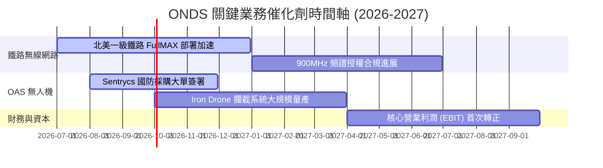

### 8.2 TAM（潛在市場規模）分析

```
╔══════════════════════════════════════════════════════════════════╗
║                  ONDS 潛在市場規模 (TAM) 估算                    ║
╠══════════════════════════════════════════════════════════════════╣
║                                                                  ║
║  1. 全球反無人機 (CUAS) 市場 (2028E):                            ║
║     ├── TAM: $6.5B  ██████████████████████████████               ║
║     └── ONDS 預期滲透率: 2.5% (約 $160M 營收)                     ║
║                                                                  ║
║  2. 北美鐵路私有無線網路升級 (2028E):                            ║
║     ├── TAM: $1.2B  ██████░░░░░░░░░░░░░░░░░░░░░░░                ║
║     └── ONDS 預期滲透率: 45.0% (約 $540M 營收)                    ║
║                                                                  ║
║  📊 2028年總預期可得市場 (SAM) 合計：約 $700M                    ║
╚══════════════════════════════════════════════════════════════════╝
```

### 8.3 成長驅動力結構圖

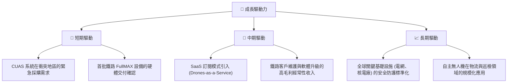

---

## 9. 風險矩陣

### 9.1 風險評分矩陣

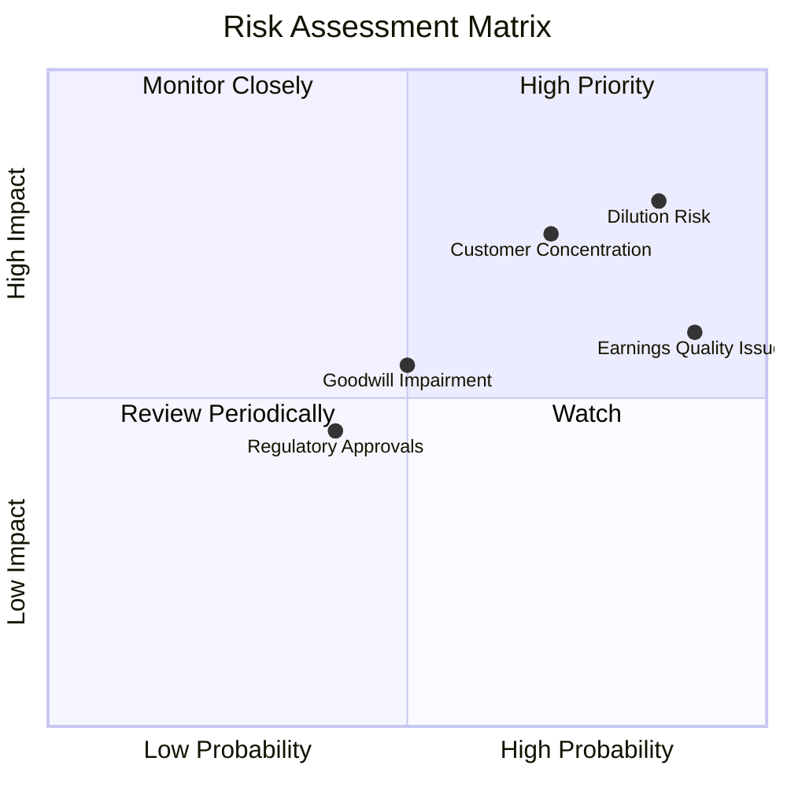

### 9.2 風險清單詳細分析

| # | 風險項目 | 發生機率 | 財務衝擊 | 風險評分 | 緩解措施 |
|---|----------|----------|----------|----------|----------|
| 1 | 🔴 **持續的股權稀釋** | **高 (85%)** | **高 (-25% EPS)** | 🔴 **8.5 / 10** | 關注管理層是否承諾實施股份回購，或限制 SBC 發放比例。 |
| 2 | 🔴 **大客戶流失或延遲採購** | **中高 (70%)**| **極高 (-40% 營收)**| 🔴 **7.7 / 10** | 加速向電網、港口等非鐵路工業客戶滲透，分散營收來源。 |
| 3 | 🟡 **商譽與無形資產減值** | **中 (50%)** | **中 (-15% 總資產)**| 🟡 **5.0 / 10** | 對收購的無人機子公司（OAS）進行嚴格的業績對賭考核。 |
| 4 | 🟡 **各國頻譜監管與 FAA 准入限制**| **中低 (40%)**| **中 (-10% 營收)** | 🟡 **4.0 / 10** | 與當地主流電信運營商建立戰略聯盟，共同推動頻譜合規。 |

---

## 10. 投資建議

### 10.1 最終綜合評級雷達圖

```
╔══════════════════════════════════════════════════════════════╗
║                    ONDS 最終投資評估                         ║
╠══════════════════════════════════════════════════════════════╣
║ 成長動能     9.5/10 ▓▓▓▓▓▓▓▓▓▓▓▓▓▓▓▓▓▓▓░  ★★★★★           ║
║ 財務安全     9.5/10 ▓▓▓▓▓▓▓▓▓▓▓▓▓▓▓▓▓▓▓░  ★★★★★           ║
║ 護城河深度   4.5/10 ▓▓▓▓▓▓▓▓▓░░░░░░░░░░░  ★★☆☆☆           ║
║ 獲利品質     3.0/10 ▓▓▓▓▓▓░░░░░░░░░░░░░░  ★☆☆☆☆           ║
║ 估值吸引力   1.5/10 ▓▓▓░░░░░░░░░░░░░░░░░  ★☆☆☆☆           ║
╠══════════════════════════════════════════════════════════════╣
║ 綜合評分     5.6/10 ▓▓▓▓▓▓▓▓▓▓▓░░░░░░░░░  🟡 持有 (Hold)    ║
╚══════════════════════════════════════════════════════════════╝
```

### 10.2 目標價與隱含報酬率

| 情境 | 發生機率 | 目標價 | 隱含報酬率 | 權重期望值 |
|------|----------|--------|------------|------------|
| 🔴 **悲觀情境** | 25% | $4.00 | -44.9% | $1.00 |
| 🟡 **基準情境** | **55%** | **$10.00** | **+37.7%** | **$5.50** |
| 🟢 **樂觀情境** | 20% | $16.00 | +120.4% | $3.20 |
| **加權估值目標價** | **100%** | **$9.70** | **+33.6%** | **投機性買入區間** |

### 10.3 買入時機與觸發因素

```
╔══════════════════════════════════════════════════════════════════╗
║                  ✅ 買入與交易觸發因素 Checklist                ║
╠══════════════════════════════════════════════════════════════════╣
║                                                                  ║
║  立即買入/加碼觸發條件（需符合 2 項以上）：                       ║
║  [ ] 季度 SBC 佔營收比例降至 15% 以下（股權稀釋大幅放緩）。     ║
║  [ ] 核心不含一次性損益的營業利益率（Operating Margin）首次轉正。║
║  [ ] 宣佈獲得北美一級鐵路客戶簽署的 >$100M 長期 FullMAX 採購合約。║
║                                                                  ║
║  減碼/停損觸發條件（出現任一即觸發）：                          ║
║  [ ] 季度營收 YoY 成長率跌破 30%（高成長故事破滅）。            ║
║  [ ] 發行在外股數單季增幅再次超過 10%（無節制股權稀釋）。        ║
║  [ ] OAS 部門無人機產品發生重大安全事故或合規准入被吊銷。        ║
╚══════════════════════════════════════════════════════════════════╝
```

### 10.4 投資人適配度分析

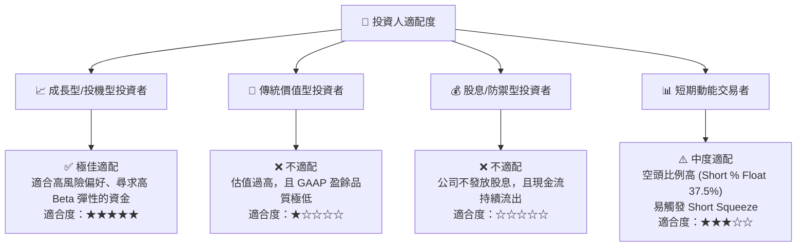

### 10.5 每季財報監控清單（Quarterly Watch List）

在接下來的季度財報中，投資人應嚴格監控以下指標，以驗證本投資論點是否成立：

1.  **扣非後營業利潤（Adjusted EBIT）**：必須觀察是否隨著營收擴張而減虧。若營收達 $50M 但營業虧損依舊維持在 $40M 以上，說明營業槓桿失效。
2.  **發行在外股數變動率（Dilution Rate）**：單季股數增長必須控制在 2% 以內，否則每股價值將被持續稀釋。
3.  **SBC 佔營收比例**：必須從當前的 39.2% 持續下行至 20% 以下，才是健康的科技企業利潤結構。
4.  **存貨周轉天數（Days Sales of Inventory）**：當前存貨達 $34.29M，需防範因產品過時導致的存貨跌價損失。

### 10.6 反面論證：什麼會證明論點錯誤（What Would Change My Mind）

```
╔══════════════════════════════════════════════════════════════════╗
║              ⚠️ 論點失效條件（Disconfirming Evidence）           ║
╠══════════════════════════════════════════════════════════════════╣
║  本投資論點在下列情況成立時應立即執行停損或清倉退出：            ║
║                                                                  ║
║  [ ] 營收 YoY 成長率連續兩季低於 35%。                           ║
║  [ ] 核心營業虧損（EBIT Loss）在 FY2026 結束時未能縮減至 -20% 內。║
║  [ ] 帳面現金及短期投資餘額因不當收購或營運流失跌破 $800M。      ║
║  [ ] 發行在外股數突破 650M（稀釋率失控）。                       ║
║  [ ] 核心技術（FullMAX）被競爭對手的新一代無線技術標準所替代。   ║
╚══════════════════════════════════════════════════════════════════╝
```

---

> **免責聲明**：本報告為基於公開財務數據之獨立研究分析，僅供學術與投資研究參考，不構成任何買賣證券之投資建議。投資人應自行承擔市場交易之風險。