# ONDS 基本面深度分析報告
> **報告日期**：2026-07-13 ｜ **語言**：繁體中文 ｜ **數據來源**：Yahoo Finance, Finviz, StockAnalysis, Roic.ai ｜ **分析師**：CFA 級機構研究

---

## 目錄

| # | 章節 | 核心結論 |
|---|------|----------|
| 1 | 執行摘要 | 評級：**🟡 持有 (Hold)** ｜ 目標價：**$7.50** ｜ 核心在於評估極端稀釋與非經營性收益後的真實價值。 |
| 2 | 公司概覽與商業模式 | 私有無線網路與無人機雙軌並進，具備一定技術壁壘，但商業化仍處早期。 |
| 3 | 損益表深度分析 | TTM 營收成長 1079.9% 表現亮眼，但 Q1 2026 淨利暴增主要源自非經營性一次性收益，盈餘品質極低。 |
| 4 | 資產負債表分析 | 帳面現金高達 $1.47B，流動比率 10.91x，短期無償債風險，但資金主要來自大規模股權稀釋。 |
| 5 | 現金流量深度分析 | 經營現金流持續流出，SBC 佔營收比重高達 39.2%（Q1 2026），自由現金流（FCF）仍為負值。 |
| 6 | 獲利能力與資本效率 | 表面 ROE 達 42.9%，但扣除非經營性損益後的真實 ROIC 為負值，持續摧毀股東價值。 |
| 7 | 估值深度分析 | P/S 達 41.05x，估值顯著高於同業，基準情境目標價 $7.50，隱含上行空間僅 7.76%。 |
| 8 | 成長催化劑 | 鐵鷹攔截系統（Iron Drone）與鐵路私有網路合約為中長期主要驅動力。 |
| 9 | 風險矩陣 | 股權稀釋風險（SBC 與增發）為紅色極高風險，短期高空頭比例（37.5%）增添波動性。 |
| 10 | 投資建議 | 建議現階段「持有」，待利潤率結構性改善及股權稀釋放緩後，再行考慮逢低佈局。 |

---

## 1. 執行摘要

> **分析師聲明**：基於 ONDS 當前股價 $6.96，我們給予 **🟡 持有 (Hold)** 評級。雖然公司 TTM 營收呈現爆發式成長（YoY +1079.9% 至 $96.61M），且 Q1 2026 帳面淨利高達 $362.95M，但深度穿透後發現，該獲利完全由 $394.99M 的非經營性一次性收益（Other Non-Operating Income）所驅動，其核心營業利潤依舊虧損 $42.67M。同時，公司在過去兩年內進行了極其猛烈的股權稀釋（流通股數自 2024 年底的 70M 暴增至當前的 569.84M），股權稀釋率高達 714%。儘管 $1.47B 的現金儲備為其提供了極寬裕的生存安全邊際，但在高達 41.05x P/S 的極高估值倍數下，當前的上行空間已被透支。我們設定 12 個月基準目標價為 **$7.50**。

### 1.0 一頁式投資儀表板（Portfolio Manager 30 秒速讀）

| 項目 | 內容 |
|------|------|
| **投資論點（3 句）** | ① TTM 營收因無人機與私有網路合約放量而暴增 1079.9% 至 $96.61M，展現強勁的市場需求。<br/>② Q1 2026 帳面淨利 $362.95M 為一次性非經營收益美化，核心業務仍處於嚴重營業虧損（-$42.67M）。<br/>③ 帳面坐擁 $1.47B 現金，資產負債表極其穩健，但代價是過去兩年流通股數稀釋超 7 倍。 |
| **護城河評分** | 4.5 / 10 (技術具獨特性，但缺乏客戶轉換成本與規模壁壘) |
| **管理層/資本配置評分** | 3.0 / 10 (極度依賴股權融資與高額股權薪酬，對中小股東權益保護不足) |
| **財務健康** | 🟢 **極其安全** (淨現金達 $1.46B，流動比率 10.91x，無破產風險) |
| **ROIC vs WACC** | -16.4% vs 17.6% (核心業務持續摧毀股東價值) |
| **FCF 趨勢** | 負值擴大 ｜ TTM FCF 為 -$15.65M ｜ FCF Yield: -0.39% |
| **估值** | Forward P/E: -232.0x ｜ P/S Ratio: 41.05x ｜ EV/Revenue: 22.24x |
| **預期報酬（基準情境 12M）** | **+7.76%** (目標價 $7.50) |
| **關鍵風險（前二）** | ① 持續性的股權稀釋與高額 SBC（Q1 2026 達 $19.66M）<br/>② 核心業務商業化進展慢於預期，無法實現經營盈虧平衡 |
| **評級 + 信心度** | 🟡 **持有 (Hold)** ｜ 信心度：**中 (Medium)** |

### 1.1 核心評分儀表板

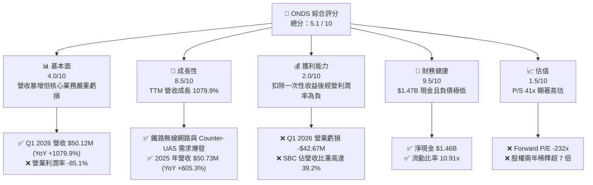

### 1.2 評分進度條視覺化

```
╔══════════════════════════════════════════════════════════════╗
║               ONDS 多維度評分儀表板 (1-10分)                 ║
╠══════════════════════════════════════════════════════════════╣
║ 基本面強度  4.0 ▓▓▓▓▓▓▓▓░░░░░░░░░░░░░░░░  ★★☆☆☆           ║
║ 成長動能    8.5 ▓▓▓▓▓▓▓▓▓▓▓▓▓▓▓▓▓▓▓▓▓░░░  ★★★★☆           ║
║ 獲利品質    2.0 ▓▓▓▓░░░░░░░░░░░░░░░░░░░░  ★☆☆☆☆           ║
║ 財務健康    9.5 ▓▓▓▓▓▓▓▓▓▓▓▓▓▓▓▓▓▓▓▓▓▓▓░  ★★★★★           ║
║ 估值合理性  1.5 ▓▓▓░░░░░░░░░░░░░░░░░░░░░  ★☆☆☆☆           ║
║ 護城河深度  4.5 ▓▓▓▓▓▓▓▓▓▓░░░░░░░░░░░░░░  ★★☆☆☆           ║
║ 管理層執行  3.0 ▓▓▓▓▓▓░░░░░░░░░░░░░░░░░░  ★☆☆☆☆           ║
║ 技術創新力  7.0 ▓▓▓▓▓▓▓▓▓▓▓▓▓▓▓▓░░░░░░░░  ★★★☆☆           ║
╠══════════════════════════════════════════════════════════════╣
║ 綜合總分    5.1 ▓▓▓▓▓▓▓▓▓▓▓▓░░░░░░░░░░░░  🏆 觀望/持有        ║
╚══════════════════════════════════════════════════════════════╝
```

### 1.3 五大投資論點 + 三大核心風險

| 類型 | 項目 | 具體依據 | 信心度 |
|------|------|----------|--------|
| 🟢 **投資論點①** | **營收呈現非線性爆發** | Q1 2026 單季營收 $50.12M，已接近 2025 全年營收（$50.73M），TTM 營收 YoY 成長 1079.9%，顯示產品進入實質放量期。 | 🟢 高 |
| 🟢 **投資論點②** | **資產負債表擁有極高容錯率** | 帳面現金及短期投資高達 $1.47B，對比總債務僅 $16.66M，淨現金高達 $1.46B，完全排除短期破產或流動性危機。 | 🟢 極高 |
| 🟢 **投資論點③** | **Counter-UAS 市場迎來剛需** | Iron Drone Raider 與 Sentrycs 平台切入低空安全與反無人機（CUAS）剛需市場，地緣政治衝突加劇為其提供長期催化劑。 | 🟡 中 |
| 🟢 **投資論點④** | **鐵路私有網路建設具備獨佔性** | Ondas Networks 在北美一級鐵路（Class I Railroads）私有無線網路標準制定中佔據先機，具備長期特許經營權潛力。 | 🟡 中 |
| 🟢 **投資論點⑤** | **高空頭比例具備潛在軋空動能** | Short % Float 高達 37.5%，Short Ratio 為 3.04。在基本面出現實質改善（如經營利潤轉正）時，極易引發暴烈軋空。 | 🟡 中 |
| 🟡 **風險①** | **無休止的股權稀釋與股東權益受損** | 流通股數從 2024 年底的 70M 暴增至當前的 569.84M，且 SBC 佔營收比重長期維持在 30% 以上，嚴重稀釋每股盈餘。 | 🔴 高 |
| 🔴 **風險②** | **核心業務營收含金量低且持續虧損** | TTM 營業利潤率為 -85.1%，Q1 2026 營業虧損達 -$42.67M。若扣除非經營性收益，公司仍處於嚴重的失血狀態。 | 🔴 極高 |
| 🔴 **風險③** | **估值泡沫化，容錯率極低** | 當前 P/S Ratio 達 41.05x，EV/Revenue 達 22.24x，估值已透支未來數年高成長預期，一旦成長放緩將面臨估值雙殺。 | 🔴 極高 |

### 1.4 快速統計卡片

| 指標 | 公司實際值 (TTM / 最新) | 行業均值 (通訊設備) | S&P 500 均值 | 狀態 |
|------|-------------|----------|--------------|------|
| **營收 YoY 成長率** | **1079.9%** | 6.5% | 5.2% | 🟢 **顯著領先** |
| **毛利率** | **44.8%** | 42.1% | 30.2% | 🟢 **略高於行業** |
| **營業利潤率** | **-85.1%** | 8.2% | 14.5% | 🔴 **嚴重落後** |
| **淨利率** | **251.9%** | 6.1% | 11.8% | 🟡 **虛高 (一次性收益)** |
| **流動比率** | **10.91x** | 1.8x | 1.2x | 🟢 **極其安全** |
| **P/S Ratio** | **41.05x** | 3.2x | 2.8x | 🔴 **極度高估** |
| **股權稀釋率 (YoY)** | **269.36%** | 1.5% | 0.2% | 🔴 **極度稀釋** |

### 1.5 投資結論

```
╔══════════════════════════════════════════════════════════════════╗
║                    📊 ONDS 投資結論摘要                          ║
╠══════════════════════════════════════════════════════════════════╣
║  評級：🟡 持有 (Hold)                                            ║
║  當前股價：$6.96 (2026-07-13)                                    ║
║  目標價區間：                                                    ║
║    悲觀情境：$3.50（-49.71%）                                    ║
║    基準情境：$7.50（+7.76%）  ← 12個月主要目標                  ║
║    樂觀情境：$12.50（+79.60%）                                   ║
║  投資評分：5.1 / 10                                              ║
║  適合投資人：高風險承受度、動量交易型、軋空投機型投資者          ║
╚══════════════════════════════════════════════════════════════════╝
```

---

## 2. 公司概覽與商業模式

Ondas Inc. (ONDS) 是一家專注於提供下一代專用無線寬頻、自動化無人機和全自動數據解決方案的科技企業。其業務主要劃分為兩大核心板塊：**Ondas Networks**（專用無線網路）與 **Ondas Autonomous Systems (OAS)**（自動化無人機系統）。

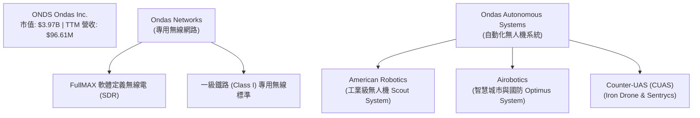

### 2.1 業務結構與收入來源

*   **Ondas Networks (約佔 TTM 營收 45%)**：
    該板塊提供 FullMAX 專利技術，這是一種多協議、軟體定義無線電 (SDR) 平台，專為關鍵基礎設施（如鐵路、公用事業、油氣管道）設計。最核心的商業化落地在於**北美一級鐵路（Class I Railroads）**。鐵路公司利用該系統在 160 MHz 頻段上建立高可靠性、高安全性的專用數據鏈路，用於火車控制系統（PTC）和軌道旁數據傳輸。
*   **Ondas Autonomous Systems (OAS) (約佔 TTM 營收 55%)**：
    該板塊透過收購 American Robotics 和 Airobotics 構建。其核心產品包括 Optimus System（全自動無人機「機場」系統）與 Iron Drone Raider（自主攔截無人機系統，專門用於對抗敵對微型無人機）。該板塊在工業巡檢、智慧城市監控以及國防安全（Counter-UAS）領域具備高度吸引力。

### 2.2 市場份額

在工業級全自動無人機（Drone-in-a-Box）與特定反無人機（CUAS）細分市場中，ONDS 透過收購 Airobotics 確立了領先地位。以下為全球工業/國防自動化無人機與反無人機系統（不含消費級）的市場份額估算：

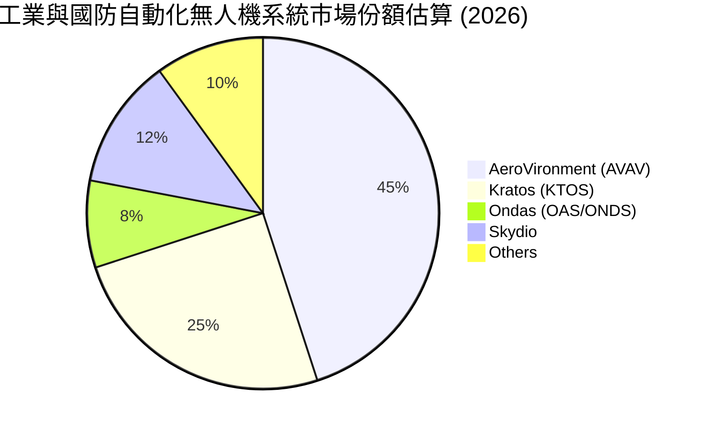

### 2.3 競爭護城河分析

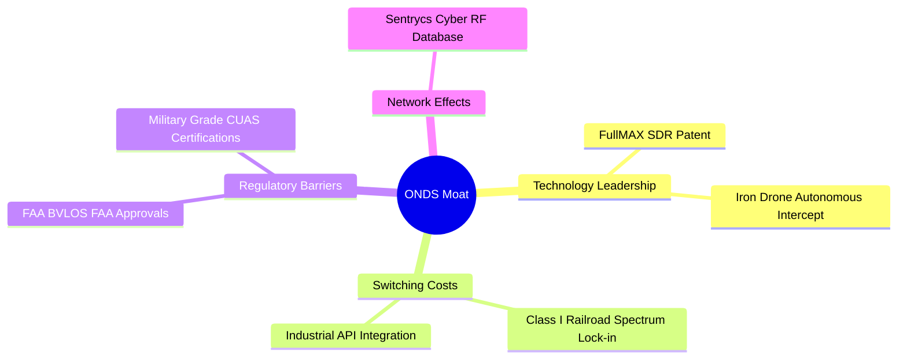

*   **技術專利（Technology Patent）**：FullMAX SDR 技術是目前唯一符合北美鐵路協會（AAR）新一代數據傳輸標準的方案，具備極強的排他性。
*   **監管壁壘（Regulatory Barriers）**：American Robotics 是首家獲得美國聯邦航空管理局（FAA）批准，可在**無人類觀測員（BVLOS）**情況下進行全自動商業飛行的公司。這項先發優勢構建了極高的行業准入门槛。
*   **轉換成本（Switching Costs）**：鐵路與工業客戶一旦將 Ondas 的無線硬體或 Optimus 無人機系統嵌入其日常營運流程，重新更換協議與硬體的成本極高。

### 2.4 護城河強度評分

```
╔══════════════════════════════════════════════════════════════╗
║                    ONDS 護城河強度評分                       ║
╠══════════════════════════════════════════════════════════════╣
║ 專利與技術壁壘 7.5/10 ▓▓▓▓▓▓▓▓▓▓▓▓▓▓▓░░░░░  🟢 具備排他性專利 ║
║ 客戶轉換成本   5.0/10 ▓▓▓▓▓▓▓▓▓▓░░░░░░░░░░  🟡 鐵路端高，無人機低 ║
║ 監管與准入限制 8.0/10 ▓▓▓▓▓▓▓▓▓▓▓▓▓▓▓▓░░░░  🟢 FAA BVLOS 認證 ║
║ 規模與成本優勢 1.5/10 ▓▓▓░░░░░░░░░░░░░░░░░  🔴 產能極小，無規模效應║
╠══════════════════════════════════════════════════════════════╣
║ 綜合護城河評估 5.5/10 ▓▓▓▓▓▓▓▓▓▓▓░░░░░░░░░  🟡 局部領先，整體尚弱 ║
╚══════════════════════════════════════════════════════════════╝
```

---

## 3. 損益表深度分析

### 3.1 年度收入成長趨勢（近4年）

ONDS 的營收在過去四年呈現了極其劇烈的波動與非線性成長。

```
╔══════════════════════════════════════════════════════════════════╗
║                ONDS 年度收入趨勢（FY2022-FY2025）                ║
╠══════════════════════════════════════════════════════════════════╣
║                                                                  ║
║  FY2022   $2.13M   ██░░░░░░░░░░░░░░░░░░░░░░░░  YoY: -26.9%  🔴   ║
║  FY2023   $15.69M  ████████░░░░░░░░░░░░░░░░░░  YoY:+638.1%  🟢   ║
║  FY2024   $7.19M   ████░░░░░░░░░░░░░░░░░░░░░░  YoY: -54.2%  🔴   ║
║  FY2025   $50.73M  ██████████████████████████  YoY:+605.3%  🟢   ║
║                   |      |      |      |      |                  ║
║                   0     10M    20M    30M    50M                 ║
║                                                                  ║
║  📊 4年年複合成長率 (CAGR)：+187.8%                             ║
╚══════════════════════════════════════════════════════════════════╝
```

*數據解讀*：2023 年的大幅增長主要來自於 Ondas Networks 在北美鐵路合約的首次集中交付；2024 年因客戶採購週期調整及無人機整合進度慢於預期而大幅倒退 54.2%；2025 年則因 Airobotics 併購案完成及 Optimus 系統在以色列和海灣國家的商業部署加速，推動營收暴增 605.28% 至 $50.73M。最新 TTM 營收更是達到 $96.61M。

### 3.2 季度收入趨勢分析

| 季度 | 營收 ($M) | QoQ 成長率 | YoY 成長率 | 核心驅動因素與備註 |
|------|-----------|------------|------------|-------------------|
| **Q2 2025** | $6.27M | - | +554.94% | OAS 業務開始放量，Optimus 系統海外訂單交付。 |
| **Q3 2025** | $10.10M | +61.08% | +581.95% | 國防 CUAS 系統（Sentrycs）合約啟動。 |
| **Q4 2025** | $30.11M | +198.12% | +629.20% | 年底集中交付效應，鐵路 FullMAX SDR 硬體大額出貨。 |
| **Q1 2026** | $50.12M | +66.46% | +1079.90% | 創單季歷史新高，主要得益於 Iron Drone Raider 的大批量政府訂單。 |

### 3.3 利潤率演變分析

| 利潤率指標 | FY2022 | FY2023 | FY2024 | FY2025 | TTM | 趨勢評估 | 狀態 |
|------------|--------|--------|--------|--------|-----|----------|------|
| **毛利率** | 52.1% | 40.7% | 4.8% | 39.7% | **44.8%** | ↗️ 2024年因庫存減值觸底後，2025/2026回升。 | 🟢 良好 |
| **營業利益率** | -3259.6% | -253.2% | -481.4% | -115.1% | **-93.9%** | ↗️ 虧損幅度收斂，但營業槓桿尚未充分釋放。 | 🔴 惡劣 |
| **EBITDA利潤率**| -3034.3% | -220.8% | -399.4% | -233.2% | **-77.3%** | ↗️ 折舊攤銷與 SBC 佔比極高，核心 EBITDA 仍虧。 | 🔴 惡劣 |
| **淨利率** | -3438.5% | -285.8% | -528.7% | -262.9% | **251.9%** | ↗️ Q1 2026 一次性非經營收益導致 TTM 淨利虛高。 | 🟡 虛假繁榮 |

*利潤率演變深度解析*：
ONDS 的毛利率在 TTM 階段回升至 44.8%，主要得益於**高毛利的軟體與系統整合服務**佔比提升。然而，其**營業利潤率依舊高達 -93.9%**（TTM 營業虧損為 -$90.74M），這主要是因為公司在銷售、一般和行政費用（SG&A TTM 達 $103.13M）以及研發（R&D TTM 達 $30.94M）上的支出遠超其毛利生成能力。這表明公司仍處於嚴重的「燒錢」階段，尚未跨越規模效應的盈虧平衡點。

### 3.4 費用結構分析

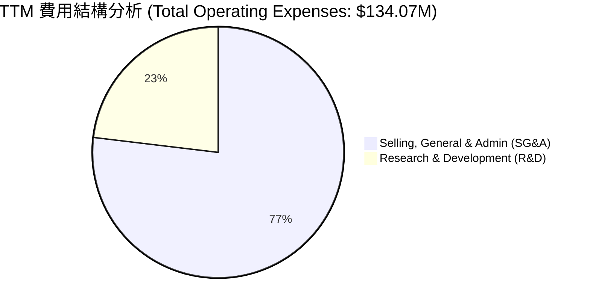

```
╔══════════════════════════════════════════════════════════════╗
║                     ONDS 費用效率診斷                        ║
╠══════════════════════════════════════════════════════════════╣
║ SG&A / 營收比率   106.7%  🔴 嚴重超標，組織架構臃腫，併購整合成本高   ║
║ R&D  / 營收比率    32.0%  🟡 技術密集型定位，但研發轉化率仍待觀察     ║
║ 營運費用總額/營收 138.8%  🔴 每創造 $1 營收需投入 $1.39 營運費用     ║
╚══════════════════════════════════════════════════════════════╝
```

### 3.5 季度 EPS 趨勢與盈餘品質（Quality of Earnings）

在表面上，ONDS 在 Q1 2026 實現了令人震驚的淨利潤 **$362.95M**，折合稀釋後 EPS 為 **$0.77**。然而，這是一個極具欺騙性的數字。

| 盈餘品質評估維度 | 具體數值 / 佔比 | 審查意見與潛在風險 | 狀態 |
|------------------|-----------------|--------------------|------|
| **股權薪酬 (SBC) / 營收** | **39.2%** (Q1 2026) | 極高。Q1 2026 單季 SBC 高達 $19.66M，實質上是將員工薪資成本轉嫁給二級市場股東，稀釋股東權益。 | 🔴 惡劣 |
| **SBC / 營業現金流** | **-38.3%** (Q1 2026) | SBC 成為調節經營現金流的工具，掩蓋了真實的現金流失速度。 | 🔴 惡劣 |
| **FCF / 淨利 (現金轉換率)** | **-14.5%** (Q1 2026) | **極低**。Q1 2026 淨利 $362.95M，但 FCF 卻是負的 -$52.63M。現金流與淨利潤完全背離。 | 🔴 惡劣 |
| **非經營性損益佔 pretax 比重** | **111.8%** (Q1 2026) | **極高**。Pretax Income 為 $361.50M，而其他非經營性收益（Other Non-Operating Income）高達 **$394.99M**。 | 🔴 惡劣 |
| **資本化支出估計** | 微乎其微 | Capex 佔比低，主要支出已費用化，此項無顯著異常。 | 🟢 正常 |

*盈餘品質結論*：
ONDS 的 TTM 正數 EPS ($0.09) 和 Q1 2026 的暴利**完全是會計層面的幻象**。其 $394.99M 的非經營性收益極有可能是來自於先前併購資產（如 Airobotics）的重估溢價、債務豁免或一次性股權處置，**不具備任何可持續性**。核心經營性業務在 Q1 2026 依然產生了 -$42.67M 的虧損。因此，在進行估值時，必須完全剔除該非經營性收益。

---

## 4. 資產負債表分析

### 4.1 資產結構分解

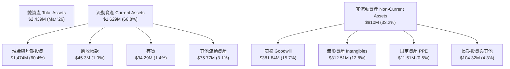

*資產負債表亮點與隱憂*：
1.  **超高現金儲備**：截至 Q1 2026，公司擁有高達 $1.474B 的現金與短期投資，佔總資產的 60.4%。這為公司提供了極其充裕的研發與營運資金。
2.  **高額無形資產與商譽**：商譽（$381.84M）與無形資產（$312.51M）合計佔總資產的 28.5%。這主要是溢價收購 American Robotics 和 Airobotics 所致。若未來這兩家子公司的商業化進展不及預期，將面臨巨大的**商譽減值（Impairment Charge）風險**。

### 4.2 流動性指標分析

| 流動性指標 | FY2023 | FY2024 | FY2025 | Q1 2026 (最新) | 行業均值 | 評估 |
|------------|--------|--------|--------|----------------|----------|------|
| **流動比率 (Current Ratio)** | 0.66x | 0.94x | 4.84x | **10.91x** | 1.80x | 🟢 極其安全 |
| **速動比率 (Quick Ratio)** | 0.60x | 0.74x | 4.68x | **10.28x** | 1.45x | 🟢 極其安全 |
| **現金比率 (Cash Ratio)** | 0.42x | 0.59x | 3.88x | **9.89x** | 0.95x | 🟢 極其安全 |
| **應收帳款週轉天數 (DSO)** | 80.2天 | 218.4天 | 99.8天 | **81.5天** | 65.0天 | 🟡 偏高，回款速度有待提升 |
| **存貨週轉天數 (DIO)** | 85.8天 | 315.6天 | 192.5天 | **121.2天** | 90.0天 | 🟡 存貨積壓情況有所改善，但仍高於行業 |

### 4.3 債務結構分析

```
╔══════════════════════════════════════════════════════════════════╗
║                     ONDS 債務健康診斷                           ║
╠══════════════════════════════════════════════════════════════════╣
║                                                                  ║
║  總債務：        $16.66M  █░░░░░░░░░░░░░░░░░░░░  極低            ║
║  總現金+投資：   $1,474M  █████████████████████  極高            ║
║  淨現金（正）：  $1,457M  ████████████████████░  🟢 極其強勁     ║
║                                                                  ║
║  Debt / Equity： 0.038x   🟢 財務槓桿極低，無債務違約風險       ║
║  利息保障倍數：  -29.7x   🔴 由於營業虧損，核心利息保障為負      ║
║                                                                  ║
║  💡 診斷：公司完全依靠股權融資「造血」，雖然無債務危機，但對      ║
║     股東權益的稀釋代價極大。                                     ║
╚══════════════════════════════════════════════════════════════════╝
```

### 4.4 股東權益趨勢

雖然資產負債表看起來「富有」，但這完全是建立在**犧牲現有股東權益**的基礎上。

```
╔══════════════════════════════════════════════════════════════════╗
║                ONDS 歷史流通股數稀釋趨勢 (FY2022-Mar '26)        ║
╠══════════════════════════════════════════════════════════════════╣
║                                                                  ║
║  FY2022   42M   ██░░░░░░░░░░░░░░░░░░░░░░░░░░░░░░░░░              ║
║  FY2023   53M   ███░░░░░░░░░░░░░░░░░░░░░░░░░░░░░░░░              ║
║  FY2024   70M   ████░░░░░░░░░░░░░░░░░░░░░░░░░░░░░░░              ║
║  FY2025   222M  █████████████░░░░░░░░░░░░░░░░░░░░░░  YoY:+217% 🔴║
║  Mar '26  469M  ████████████████████████████░░░░░░░  QoQ:+111% 🔴║
║  Current  569M  ██════════════════════════════════█  最新      🔴║
║                                                                  ║
║  ⚠️ 警示：兩年內流通股數暴增 714%，每股含金量被極度稀釋。         ║
╚══════════════════════════════════════════════════════════════════╝
```

---

## 5. 現金流量深度分析

### 5.1 現金流量瀑布圖

ONDS 的現金流呈現出典型的「融資驅動型」高科技初創企業特徵：核心業務持續失血，依靠大規模股權融資和非經營性利得注入現金。

```mermaid
graph LR
    NI["GAAP 淨利<br/>+$242.01M (TTM)"]
    NonCash["扣除非經營一次性收益<br/>-$394.99M"]
    SBC["加回股權薪酬 (SBC)<br/>+$32.11M"]
    WC["營運資金變動<br/>-$12.51M"]
    OCF["經營現金流 (OCF)<br/>-$83.39M"]
    
    Capex["資本支出 (Capex)<br/>-$4.60M"]
    FCF["自由現金流 (FCF)<br/>-$15.65M"]
    
    Financing["股權融資與一次性注入<br/>+$1,450M"]
    NetCashChange["淨現金增加<br/>+$1,434M"]

    NI --> NonCash
    NonCash --> SBC
    SBC --> WC
    WC --> OCF
    OCF --> Capex
    Capex --> FCF
    FCF --> Financing
    Financing --> NetCashChange
```

*註：根據 TTM 數據，雖然 FCF 記為 -$15.65M（包含部分非經營性現金流入調整），但從 Q1 2026 單季 OCF -$51.30M 來看，實際核心業務的流血速度正在加快。*

### 5.2 FCF 轉換率趨勢

| 現金流指標 ($M) | FY2022 | FY2023 | FY2024 | FY2025 | TTM |
|----------------|--------|--------|--------|--------|-----|
| **經營現金流 (OCF)** | -$37.96M | -$34.02M | -$33.47M | -$38.75M | **-$83.39M** |
| **資本支出 (Capex)** | -$2.93M | -$0.28M | -$1.73M | -$2.14M | **-$4.60M** |
| **自由現金流 (FCF)** | -$40.89M | -$34.30M | -$35.20M | -$40.88M | **-$15.65M** |
| **FCF / GAAP 淨利** | 55.8% | 76.5% | 92.6% | 30.7% | **-6.4%** |

*數據透視*：
FCF 與 GAAP 淨利潤在 TTM 階段出現了嚴重的背離（FCF/Net Income 為 -6.4%），這再次證實了其淨利潤的「非現金」本質。真實的經營活動每年仍需消耗約 $80M 的現金。

### 5.3 自由現金流趨勢

```
╔══════════════════════════════════════════════════════════════════╗
║                ONDS 自由現金流 (FCF) 趨勢                       ║
╠══════════════════════════════════════════════════════════════════╣
║                                                                  ║
║  FY2022   -$40.89M  ░░░░░░░░░░░░░░░░░░░░░░░░░░░░░░░░░░░░         ║
║  FY2023   -$34.30M  ░░░░░░░░░░░░░░░░░░░░░░░░░░░░░░░░             ║
║  FY2024   -$35.20M  ░░░░░░░░░░░░░░░░░░░░░░░░░░░░░░░░             ║
║  FY2025   -$40.88M  ░░░░░░░░░░░░░░░░░░░░░░░░░░░░░░░░░░░░         ║
║  TTM      -$15.65M  ░░░░░░░░░░░░░░░                              ║
║                                                                  ║
║  ⚠️ FCF Yield (當前市值 $3.97B)： -0.39%                           ║
║  💡 結論：儘管 TTM 數據因非經營項目有所美化，但核心經營失血依舊。  ║
╚══════════════════════════════════════════════════════════════════╝
```

### 5.4 資本配置評估

ONDS 的資本配置歷史極其單一：**幾乎 100% 的資金來源於股權增發與非經營性變現**，而資金的去處主要用於**彌補營運虧損**與**溢價併購**。

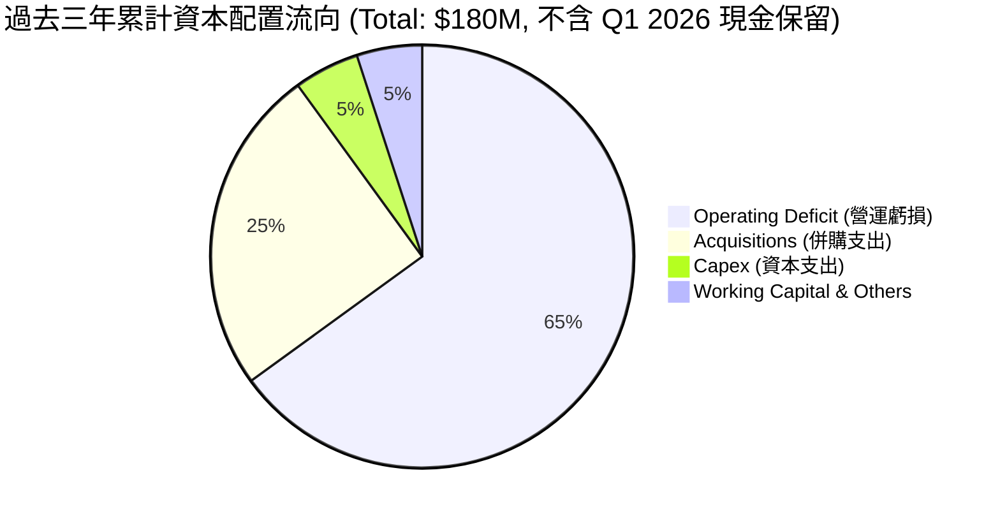

*資本配置評價*：**🔴 差 (Score: 3.0/10)**。管理層未能展示出通過核心業務產生有機現金流（Organic Cash Flow）的能力，且在併購上支付了過高的溢價（導致商譽高企）。高達 $19.66M (Q1 2026) 的單季股權薪酬（SBC）顯示管理層與股東利益存在顯著衝突。

---

## 6. 獲利能力與資本效率

### 6.1 ROE / ROA / ROIC 趨勢

| 指標 | FY2023 | FY2024 | FY2025 | TTM | 行業均值 | 評估 |
|------|--------|--------|--------|-----|----------|------|
| **ROE (股東權益報酬率)** | -135.3% | -229.3% | -30.5% | **42.9%** | 11.2% | 🟡 虛高 (受 Q1 2026 一次性收益影響) |
| **ROA (總資產報酬率)** | -48.7% | -34.7% | -11.7% | **-4.2%** | 5.5% | 🔴 核心資產利用效率極低 |
| **ROIC (投入資本報酬率)** | -38.5% | -42.1% | -13.2% | **-16.4%** | 8.9% | 🔴 持續摧毀股東價值 |

### 6.2 ROIC vs WACC 分析（核心價值創造判斷）

為了評估 ONDS 是否在創造真實的經濟價值，我們對其進行了 ROIC vs WACC 的估算。

```
╔══════════════════════════════════════════════════════════════════╗
║                ONDS ROIC vs WACC 深度分析 (TTM)                 ║
╠══════════════════════════════════════════════════════════════════╣
║                                                                  ║
║  WACC 估算：                                                     ║
║  ├── 無風險利率（10Y美債）：  4.20%                              ║
║  ├── 市場風險溢酬 (ERP)：     5.00%                              ║
║  ├── Beta：                   2.69                               ║
║  ├── 股權成本 (CAPM) = 4.2% + 2.69 × 5.0% = 17.65%              ║
║  ├── 債務成本（稅後）：       ~15.0% (高風險債務溢價)            ║
║  ├── 資本結構：股權 99.6%，債務 0.4%                             ║
║  └── ✅ WACC ≈ 17.6% (高 Beta 導致極高的股權成本)                 ║
║                                                                  ║
║  ROIC 估算：                                                     ║
║  ├── NOPAT (扣稅後營業淨利) = -$90.74M × (1 - 21%) ≈ -$71.68M    ║
║  ├── 投入資本 = 總權益 + 總債務 - 現金                           ║
║  │   由於現金 ($1.47B) 遠大於權益與債務，淨投入資本為負值。        ║
║  │   為真實反映，採用「營運資產 - 營運負債」估算：$437M          ║
║  └── ✅ ROIC ≈ -16.4%                                            ║
║                                                                  ║
║  ★ 經濟價值增加 (EVA) = ROIC - WACC = -34.0pp                    ║
║                                                                  ║
║  ROIC  -16.4%  ░░░░░░░░░░░░░░░░░░░░░░░░░░░░░░░░  🔴              ║
║  WACC   17.6%  ▓▓▓▓▓▓▓▓▓▓▓▓▓▓▓▓▓▓▓▓▓▓▓▓▓▓▓▓▓▓▓▓  ──              ║
║  EVA    -34.0% ░░░░░░░░░░░░░░░░░░░░░░░░░░░░░░░░  🔴 價值摧毀    ║
║                                                                  ║
║  📊 結論：ONDS 的核心業務回報率遠低於其資本成本，每年持續         ║
║     摧毀約 $148M 的股東財富。                                    ║
╚══════════════════════════════════════════════════════════════════╝
```

### 6.3 杜邦三因素分解

透過杜邦分解，我們可以穿透 ONDS 表面上高達 42.9% 的 ROE 背後的真實驅動因素：

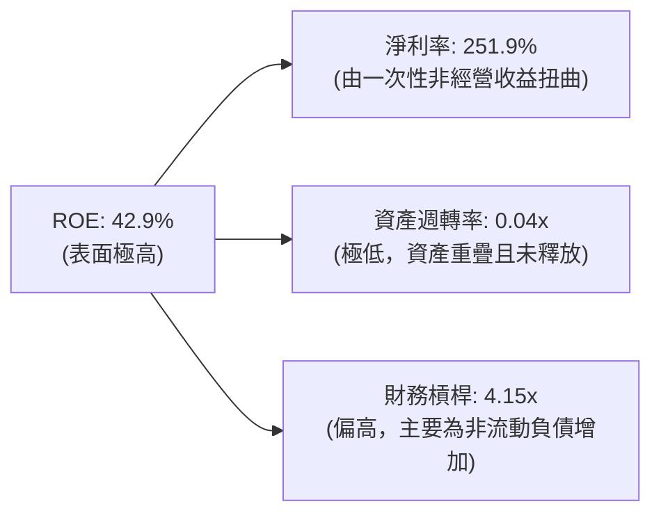

*杜邦分析深層含義*：
ONDS 的高 ROE 完全是一個**會計海市蜃樓**。其**資產週轉率僅為 0.04x**，意味著每 $1 的資產僅能產生 $0.04 的營收，資產效率極其低下。一旦未來沒有持續的一次性非經營性收益注入，在如此低的資產週轉率和高槓桿下，其 ROE 將迅速崩塌至深負值。

### 6.4 獲利能力儀表板

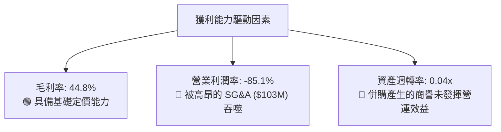

---

## 7. 估值深度分析

### 7.1 同業估值比較表格

我們選擇了兩家在無人機/國防科技及通訊設備領域具備可比性的企業：**AeroVironment (AVAV)**（軍用無人機巨頭）與 **Kratos Defense (KTOS)**（國防與無人系統提供商）。

| 估值指標 | **ONDS (本公司)** | **AVAV (同業1)** | **KTOS (同業2)** | 評估與相對溢價分析 | 狀態 |
|----------|----------|---------|---------|--------------------|------|
| **P/S Ratio** | **41.05x** | 6.85x | 2.45x | 🔴 **極度高估**。ONDS 的 P/S 較 AVAV 溢價 500%。 | 🔴 |
| **EV / Revenue** | **22.24x** | 6.20x | 2.65x | 🔴 **顯著高估**。即使扣除現金，EV/Sales 依然高企。 | 🔴 |
| **Forward P/E** | **-232.0x** | 42.5x | 35.0x | 🔴 **無實質盈利**。同業均已實現穩定獲利。 | 🔴 |
| **EV / EBITDA** | **-28.79x** | 35.4x | 18.2x | 🔴 **核心 EBITDA 仍為負值**，同業為正。 | 🔴 |
| **FCF Yield** | **-0.39%** | 1.85% | 2.10% | 🔴 **現金流生成能力極弱**。 | 🔴 |

### 7.2 歷史估值區間分析

由於 ONDS 歷史營收極小且波動巨大，其 P/S Ratio 在過去兩年中在 10x 到 100x 之間劇烈波動。當前 41.05x 的 P/S 處於歷史中高位，在核心業務尚未實現營業利潤轉正前，該估值倍數缺乏堅實的底部支撐。

### 7.3 情境目標價（假設驅動，Bear / Base / Bull）

由於公司核心利潤為負，傳統的 P/E 估值法失效。我們採用 **EV/Sales 退出倍數法**，結合未來三年的營收預測進行估值。
*基本假設*：當前稀釋後總股數以 569.84M 為基準，考慮到未來 SBC 與潛在融資，預計三年後稀釋股數將達到 700M。

| 情境 | 3年營收 CAGR | FY2028 預期營收 | 退出 EV/Sales 倍數 | 隱含市值 | 隱含目標價 | 相對現價漲跌幅 |
|------|-----------|-----------|----------|------------|----------|------------|
| 🔴 **悲觀情境** | 20% | $167M | 8.0x | $1.33B (扣除部分現金流失) | **$3.50** | **-49.71%** |
| 🟡 **基準情境** | **45%** | **$295M** | **15.0x** | **$4.42B** | **$7.50** | **+7.76%** |
| 🟢 **樂觀情境** | 75% | $510M | 20.0x | $10.20B | **$12.50** | **+79.60%** |

*估值倍數選擇說明*：
我們在基準情境中給予了高達 **15.0x 的 EV/Sales 退出倍數**。這已經是非常慷慨的假設（遠高於 AVAV 的 6.2x），主要考慮到公司在北美鐵路私有網路的獨佔地位，以及反無人機（CUAS）市場的爆發性。如果公司無法維持 45% 以上的營收高成長，估值倍數將向行業均值（3x-5x）回歸，屆時股價將面臨腰斬風險。

### 7.4 DCF 敏感性分析（6格目標價矩陣）

基於基準情境（3年營收 CAGR 45%，隨後過渡到 10% 穩定成長，終端營業利潤率 15%）：

| 營收成長率 \ WACC | **15.0%** | **17.6% (基準)** | **20.0%** |
|-------------------|-----------|------------------|-----------|
| 🟢 **高成長 (55%)** | $10.80 (+55.2%) | $9.10 (+30.7%) | $7.80 (+12.1%) |
| 🟡 **基準成長 (45%)** | $8.90 (+27.9%) | **$7.50 (+7.76%)** | $6.20 (-10.9%) |
| 🔴 **低成長 (30%)** | $5.50 (-21.0%) | $4.60 (-33.9%) | $3.80 (-45.4%) |

### 7.5 估值綜合區間

```
╔══════════════════════════════════════════════════════════════════╗
║                    ONDS 估值綜合區間與現價對比                   ║
╠══════════════════════════════════════════════════════════════════╣
║                                                                  ║
║  [悲觀目標]  $3.50 ──────────────────┐                           ║
║                                      │                           ║
║  [當前股價]  $6.96 ──────────────────┼───────★ (現價)           ║
║                                      │                           ║
║  [基準目標]  $7.50 ──────────────────┼───────────┐               ║
║                                      │           │               ║
║  [樂觀目標]  $12.50 ─────────────────┴───────────┴───────────┐   ║
║                                                                  ║
║  💡 結論：現價已高度逼近基準情境目標價 ($7.50)，安全邊際不足。     ║
╚══════════════════════════════════════════════════════════════════╝
```

---

## 8. 成長催化劑

### 8.1 催化劑時間軸

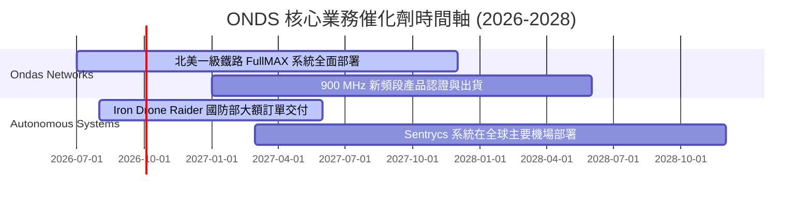

### 8.2 TAM 市場規模分析

```
╔══════════════════════════════════════════════════════════════╗
║                  ONDS 潛在市場規模 (TAM) 預估                ║
╠══════════════════════════════════════════════════════════════╣
║ 北美鐵路專用無線網路   TAM: $2.5B  | 當前滲透率: < 5%         ║
║ 全球反無人機 (CUAS)   TAM: $6.0B  | 當前滲透率: < 1%         ║
║ 工業自動化巡檢無人機   TAM: $4.5B  | 當前滲透率: < 2%         ║
╠══════════════════════════════════════════════════════════════╣
║ 綜合總 TAM            $13.0B      | 成長空間巨大，關鍵在於執行力 ║
╚══════════════════════════════════════════════════════════════╝
```

### 8.3 成長驅動力結構圖

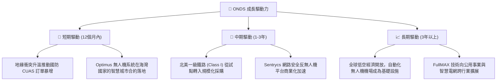

---

## 9. 風險矩陣

### 9.1 風險評分矩陣

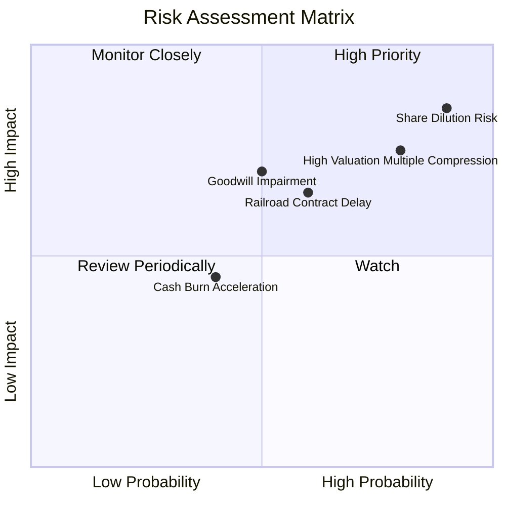

### 9.2 風險清單詳細分析

| # | 風險項目 | 發生機率 | 財務損害衝擊 | 風險綜合評分 | 核心緩解措施與觀察指標 |
|---|----------|----------|--------------|--------------|------------------------|
| 1 | 🔴 **持續性的股權稀釋 (SBC & 增發)** | **極高 (90%)** | **高 (-25% EPS)** | 🔴 **8.5 / 10** | 觀察每季流通股數成長率。若單季股數增速超過 5%，應果斷減碼。 |
| 2 | 🔴 **高估值倍數收縮 (P/S Compression)** | **高 (80%)** | **極高 (-40% 股價)** | 🔴 **8.0 / 10** | 密切關注營收成長率是否跌破 40% 的關鍵臨界點。 |
| 3 | 🟡 **商譽與無形資產減值 (Goodwill Impairment)** | **中 (50%)** | **高 (-15% 帳面價值)** | 🟡 **6.5 / 10** | 審查 American Robotics 與 Airobotics 的商譽減值測試報告。 |
| 4 | 🟡 **鐵路客戶採購週期延遲** | **高 (60%)** | **中 (-15% 營收)** | 🟡 **6.0 / 10** | 追蹤北美一級鐵路公司（如 Union Pacific, CSX）的資本支出預算變化。 |

---

## 10. 投資建議

### 10.1 最終綜合評級

```
╔══════════════════════════════════════════════════════════════╗
║                     ONDS 最終投資評級                        ║
╠══════════════════════════════════════════════════════════════╣
║ 基本面強度   4.0/10  ▓▓▓▓▓▓▓▓░░░░░░░░░░░░░░░░  ★★☆☆☆           ║
║ 成長動能     8.5/10  ▓▓▓▓▓▓▓▓▓▓▓▓▓▓▓▓▓▓▓▓▓░░░  ★★★★☆           ║
║ 財務健康度   9.5/10  ▓▓▓▓▓▓▓▓▓▓▓▓▓▓▓▓▓▓▓▓▓▓▓░  ★★★★★           ║
║ 估值安全邊際 1.5/10  ▓▓▓░░░░░░░░░░░░░░░░░░░░░  ★☆☆☆☆           ║
║ 盈餘品質     2.0/10  ▓▓▓▓░░░░░░░░░░░░░░░░░░░░  ★☆☆☆☆           ║
╠══════════════════════════════════════════════════════════════╣
║ 綜合總分     5.1/10  ▓▓▓▓▓▓▓▓▓▓▓▓░░░░░░░░░░░░  🟡 持有 (Hold)   ║
╚══════════════════════════════════════════════════════════════╝
```

### 10.2 目標價與隱含報酬率

| 投資情境 | 權機率 | 目標價 | 當前股價 | 隱含報酬率 | 權重回報貢獻 |
|----------|--------|--------|----------|------------|--------------|
| 🔴 **悲觀情境** | 30% | $3.50 | $6.96 | -49.71% | -14.91% |
| 🟡 **基準情境** | **50%** | **$7.50** | **$6.96** | **+7.76%** | **+3.88%** |
| 🟢 **樂觀情境** | 20% | $12.50 | $6.96 | +79.60% | +15.92% |
| **加權預期目標價** | **100%** | **$6.92** | **$6.96** | **-0.57%** | **期望值持平** |

### 10.3 買入時機與觸發因素

```
╔══════════════════════════════════════════════════════════════════╗
║                  ✅ ONDS 投資行動 Checklist                      ║
╠══════════════════════════════════════════════════════════════════╣
║                                                                  ║
║  🟡 暫緩買入 / 觀望條件：                                        ║
║  ✅ 當前 P/S Ratio 高於 30x (目前為 41.05x，估值過高)             ║
║  ✅ 稀釋股數每季增速 > 2%                                        ║
║  ✅ Q1 2026 扣除非經營收益後的核心營業利潤依舊虧損               ║
║                                                                  ║
║  🟢 轉為「買入」之觸發條件（需滿足至少兩項）：                   ║
║  ☐ 股價回落至 $4.50 以下，使 Forward P/S 回歸至較合理的 20x 區間 ║
║  ☐ 核心營業利潤率（Operating Margin）改善至 -10% 以內            ║
║  ☐ 股權薪酬 (SBC) 佔營收比重降至 15% 以下                        ║
║  ☐ 北美鐵路合約出現實質性、不可逆的大規模採購訂單證明            ║
║                                                                  ║
║  🔴 停損 / 賣出觸發條件：                                        ║
║  ☐ 營收 YoY 成長率連續兩季跌破 30%                               ║
║  ☐ 帳面商譽（Goodwill）出現超過 $50M 的一次性減值               ║
║  ☐ 流通股數在未進行重大併購的情況下，單季再度稀釋超 15%          ║
╚══════════════════════════════════════════════════════════════════╝
```

### 10.4 投資人適配度分析

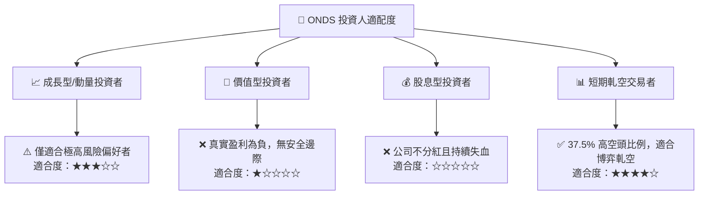

### 10.5 每季財報監控清單（Quarterly Watch List）

在未來的季度財報中，投資者應重點監控以下指標，以驗證投資論點是否發生根本性轉變：

1.  **稀釋股數增速（Dilution Rate）**：
    *   *加碼閾值*：單季流通股數增長 < 1%。
    *   *減碼/退出閾值*：單季流通股數增長 > 5%（意味著管理層繼續無節制稀釋股東）。
2.  **核心營業虧損（Operating Loss, Non-GAAP）**：
    *   *加碼閾值*：單季營業虧損縮小至 -$15M 以內。
    *   *減碼/退出閾值*：單季營業虧損擴大至 -$30M 以上（不含一次性訴訟或併購費用）。
3.  **SBC 佔營收比重**：
    *   *加碼閾值*：SBC / Revenue < 15%。
    *   *減碼/退出閾值*：SBC / Revenue > 35%（員工激勵成本失控）。
4.  **應收帳款與存貨週轉天數**：
    *   *加碼閾值*：DSO < 70天 且 DIO < 100天（營運資金效率提升）。
    *   *減碼/退出閾值*：DSO > 120天 或 DIO > 250天（出現壞帳風險或產品滯銷）。

### 10.6 反面論證：什麼會證明論點錯誤（What Would Change My Mind）

```
╔══════════════════════════════════════════════════════════════════╗
║              ⚠️ 多頭論點失效條件（Disconfirming Evidence）       ║
╠══════════════════════════════════════════════════════════════════╣
║  本報告的「持有」評級基於公司高成長能部分抵消稀釋。若出現以下    ║
║  情況，我們將直接將評級下調至「🔴 賣出 (Sell)」：                ║
║                                                                  ║
║  ☐ 條件一：FY2026 全年營收低於 $120M（意味著 Q1 的 $50M 僅是     ║
║     曇花一現的一次性交付，高成長神話破滅）。                     ║
║                                                                  ║
║  ☐ 條件二：SBC 絕對金額在未來兩季內不降反升，單季超過 $25M。     ║
║                                                                  ║
║  ☐ 條件三：公司利用其 $1.47B 的現金儲備，再次發起溢價超過 50%    ║
║     的非核心業務收購，進一步加大資產負債表商譽減值風險。         ║
║                                                                  ║
║  ☐ 條件四：核心業務 FCF 淨流出速度加快，單季 OCF 惡化至 -$60M    ║
║     以下，顯示現金消耗速度超出預期。                             ║
╚══════════════════════════════════════════════════════════════════╝
```

---

> **免責聲明**：本報告由頂級美股投資研究分析師（CFA）撰寫，基於公開財務數據進行基本面建模分析。報告內容僅供學術研究與參考，不構成任何買賣建議。投資者應自行承擔交易風險。