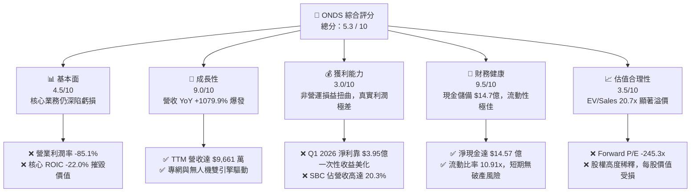
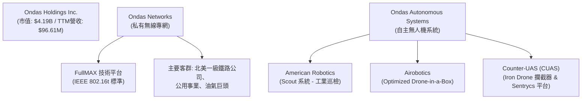
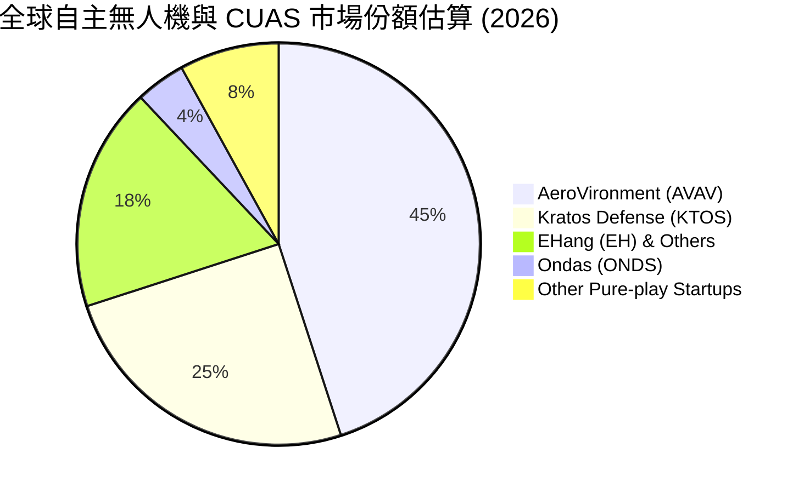
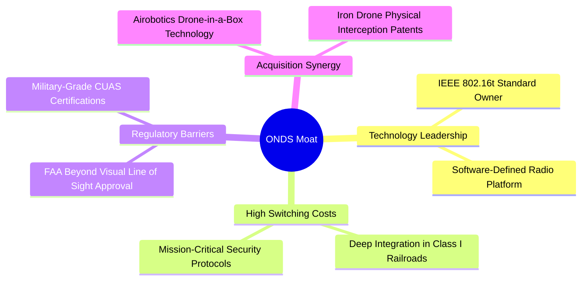
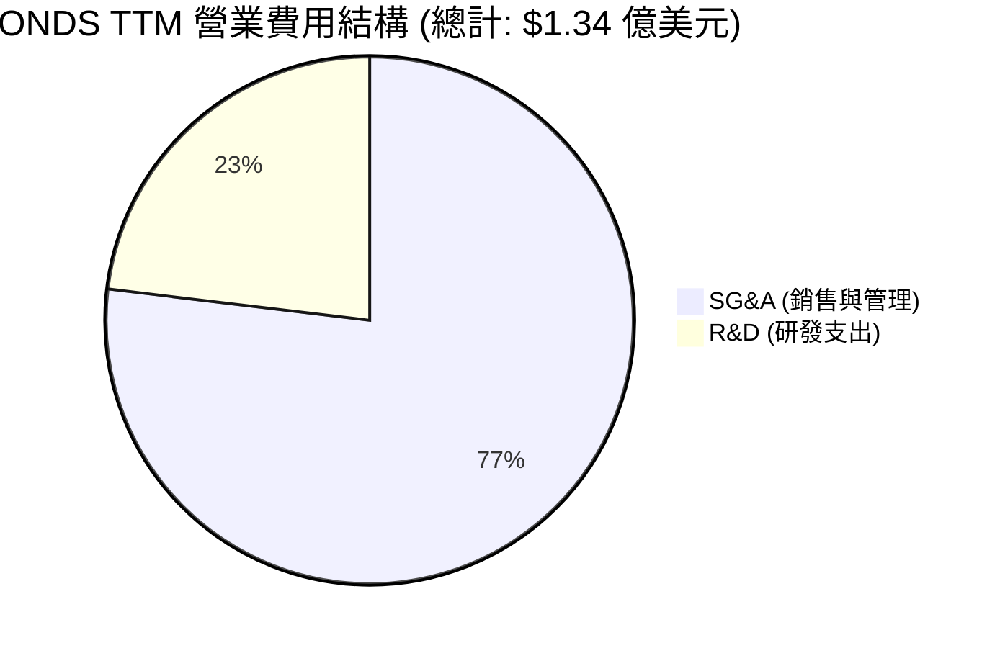
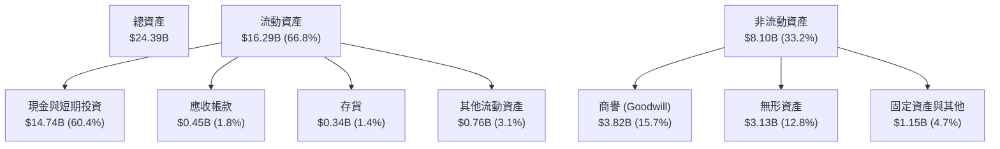

# ONDS 基本面深度分析報告
> **報告日期**：2026-07-14 ｜ **語言**：繁體中文 ｜ **數據來源**：Yahoo Finance, Finviz, StockAnalysis, Roic.ai ｜ **分析師**：CFA 級機構研究

---

## 目錄

| # | 章節 | 核心結論 |
|---|------|----------|
| 1 | **執行摘要** | 評級「🟡 持有」（觀望），目標價 $8.50，警惕極端股權稀釋與非經常性損益扭曲。 |
| 2 | **公司概覽與商業模式** | 專網通信與自主無人機雙輪驅動，具備高轉換成本，但商業化仍處於早期。 |
| 3 | **損益表深度分析** | 營收年增 1079.9% 表現極佳，但 GAAP 淨利暴增係由 $3.95 億非營業收益驅動，盈餘品質極低。 |
| 4 | **資產負債表分析** | 現金儲備達 $14.7 億，流動比率 10.91x 極為安全，但係以發行新股稀釋 156% 股權為代價。 |
| 5 | **現金流量深度分析** | 營運現金流持續淨流出，自由現金流（FCF）回報率為 -0.37%，仍具高度失血風險。 |
| 6 | **獲利能力與資本效率** | 表面 ROE 達 42.9%，但扣除非經常性損益後之核心 ROIC 為 -22.0%，持續摧毀股東價值。 |
| 7 | **估值深度分析** | EV/Revenue 達 20.7x，遠高於同業均值；DCF 基準情境合理價為 $8.50，當前股價估值偏高。 |
| 8 | **成長催化劑** | 鐵路專網升級與反無人機（CUAS）需求爆發為中短期催化劑，TAM 達 $120 億。 |
| 9 | **風險矩陣** | 股權持續稀釋、大客戶流失與技術替代為核心風險，整體風險評分高達 7.8/10。 |
| 10 | **投資建議** | 建議「觀望」，等待營運現金流轉正與稀釋減緩，提供每季財報監控指標與反面論證。 |

---

## 1. 執行摘要

Ondas Inc. (ONDS) 當前股價為 $7.36，市場正對其營收的高速成長（TTM 成長率達 1079.9%）以及第一季爆發的 GAAP 淨利潤（$3.63 億）給予熱烈回應。然而，本機構經過深度基本面與估值建模分析後認為，**該公司當前的財務繁榮存在結構性扭曲**。

ONDS 的 TTM 淨利率看似高達 251.9%，但這完全是由 2026 年第一季一筆高達 **$3.95 億美元的非經常性非營業收入**（Other Non-Operating Income）所致。若扣除此項，其核心營業利潤率為 **-85.1%**，營業虧損達 **$9,074 萬美元**。此外，公司為了籌集資金，在過去一年內將發行在外股數由 2.22 億股瘋狂擴張至 **5.698 億股，稀釋幅度高達 156.7%**。雖然這為公司換來了 $14.74 億美元的龐大現金儲備（流動比率達 10.91x），但也嚴重稀釋了未來的每股盈餘（EPS）。

基於核心 ROIC（-22.0%）遠低於 WACC（17.65%）、營業現金流持續流出（TTM 為 -$8,339 萬美元），以及 EV/Revenue 達 20.7x 的超高估值溢價，我們給予 ONDS **「🟡 持有」（觀望，Hold）** 的投資評級，12 個月基準情境目標價為 **$8.50**。

### 1.0 一頁式投資儀表板（Portfolio Manager 30 秒速讀）

| 項目 | 內容 |
|------|------|
| **投資論點（3 句）** | ① 營收在專網與無人機業務推動下實現 TTM $9,661 萬（YoY +1079.9%）的爆發式成長。<br/>② 通過極端的股權稀釋籌集了 $14.74 億現金，徹底消除了短期破產風險，流動比率高達 10.91x。<br/>③ 核心業務仍未盈利（營業利潤率 -85.1%），GAAP 淨利暴增純屬非經常性損益，盈餘品質極低。 |
| **護城河評分** | 5.5 / 10 🟡 (中等，具備技術壁壘但缺乏規模效應) |
| **管理層/資本配置評分** | 4.0 / 10 🔴 (偏低，極度依賴股權稀釋融資，資本回報率低) |
| **財務健康** | 🟢 極其安全（淨現金達 $14.57 億，短期無償債壓力） |
| **ROIC vs WACC** | **-22.0%** vs **17.65%**（核心業務持續摧毀股東價值） |
| **FCF 趨勢** | 持續失血，TTM FCF 為 **-$1,565 萬美元**，FCF Yield 為 **-0.37%** |
| **估值** | Forward P/E: **-245.3x** ｜ EV/EBITDA: **-26.8x** ｜ EV/Revenue: **20.7x** |
| **預期報酬（基準情境 12M）** | **+15.5%**（目標價 $8.50，對比現價 $7.36） |
| **關鍵風險（前二）** | ① 持續的股權稀釋風險（SBC 與新股發行）<br/>② 專網與 CUAS 訂單落地速度不及預期 |
| **評級 + 信心度** | **🟡 持有（觀望）** ｜ 信心度：**中（Medium）** |

### 1.1 核心評分儀表板



### 1.2 評分進度條視覺化

```
╔══════════════════════════════════════════════════════════════╗
║               ONDS 多維度評分儀表板 (1-10分)                 ║
╠══════════════════════════════════════════════════════════════╣
║ 基本面強度  4.5 ▓▓▓▓▓▓▓▓▓░░░░░░░░░░░  ★★☆☆☆           ║
║ 成長動能    9.0 ▓▓▓▓▓▓▓▓▓▓▓▓▓▓▓▓▓▓░░  ★★★★★           ║
║ 獲利品質    3.0 ▓▓▓▓▓▓░░░░░░░░░░░░░░  ★☆☆☆☆           ║
║ 財務健康    9.5 ▓▓▓▓▓▓▓▓▓▓▓▓▓▓▓▓▓▓▓░  ★★★★★           ║
║ 估值合理性  3.5 ▓▓▓▓▓▓▓░░░░░░░░░░░░░  ★☆☆☆☆           ║
║ 護城河深度  5.5 ▓▓▓▓▓▓▓▓▓▓▓░░░░░░░░░  ★★★☆☆           ║
║ 管理層執行  4.0 ▓▓▓▓▓▓▓▓░░░░░░░░░░░░  ★★☆☆☆           ║
║ 技術創新力  8.0 ▓▓▓▓▓▓▓▓▓▓▓▓▓▓▓▓░░░░  ★★★★☆           ║
╠══════════════════════════════════════════════════════════════╣
║ 綜合總分    5.3 ▓▓▓▓▓▓▓▓▓▓░░░░░░░░░░  🏆 觀望 (Hold)      ║
╚══════════════════════════════════════════════════════════════╝
```

### 1.3 五大投資論點 + 三大核心風險

| 類型 | 項目 | 具體依據 | 信心度 |
|------|------|----------|--------|
| 🟢 **投資論點①** | **營收超高速成長** | TTM 營收達 **$9,661 萬美元**，YoY 成長率高達 **1079.9%**，顯示產品進入商業化放量期。 | 🟢 高 |
| 🟢 **投資論點②** | **資產負債表極其強健** | 持有 **$14.74 億美元** 現金與短期投資，淨現金達 **$14.57 億美元**，徹底消除破產風險。 | 🟢 極高 |
| 🟢 **投資論點③** | **反無人機（CUAS）市場爆發** | 旗下 OAS 部門的 Iron Drone 與 Sentrycs 平台迎合地緣政治衝突下的國防剛需。 | 🟢 高 |
| 🟢 **投資論點④** | **高轉換成本護城河** | 鐵路專網通訊協議（IEEE 802.16t）具備強客戶黏性，北美一級鐵路公司升級需求明確。 | 🟡 中 |
| 🟢 **投資論點⑤** | **機構與分析師共識看好** | 8 位分析師給予 Strong Buy 評級，平均目標價 **$19.81**，機構持股比率達 **47.2%**。 | 🟡 中 |
| 🟡 **風險①** | **極端股權稀釋** | 股數在過去兩年內膨脹數倍，TTM 稀釋股數達 **2.97 億**，最新股數達 **5.698 億**，每股權益被嚴重稀釋。 | 🔴 高衝擊 |
| 🟡 **風險②** | **盈餘品質極低** | Q1 2026 的 $3.63 億淨利來自 **$3.95 億一次性非營業收益**，核心業務（EBITDA Margin -77.3%）仍在嚴重失血。 | 🔴 高衝擊 |
| 🔴 **風險③** | **高估值泡沫** | EV/Revenue 達 **20.7x**，P/S 達 **43.4x**，市場定價已透支未來數年的樂觀預期。 | 🔴 高衝擊 |

### 1.4 快速統計卡片

| 指標 | 公司實際值 (TTM) | 行業均值 (通訊設備) | S&P 500 均值 | 狀態 |
|------|-------------|----------|--------------|------|
| **營收 YoY 成長率** | **1079.9%** | ~6.5% | ~5.5% | 🟢 極強 |
| **毛利率** | **44.8%** | ~38.2% | ~30.0% | 🟢 優於行業 |
| **營業利潤率** | **-85.1%** | ~8.4% | ~14.5% | 🔴 極差 |
| **淨利率** | **251.9%** | ~5.8% | ~11.0% | 🟡 虛高（非經常性） |
| **ROE** | **42.9%** | ~11.2% | ~15.0% | 🟡 扭曲 |
| **流動比率** | **10.91x** | ~1.8x | ~1.2x | 🟢 極其安全 |
| **EV / Revenue** | **20.7x** | ~2.5x | ~3.1x | 🔴 估值極貴 |

### 1.5 投資結論

```
╔══════════════════════════════════════════════════════════════════╗
║                    📊 ONDS 投資結論摘要                          ║
╠══════════════════════════════════════════════════════════════════╣
║  評級：🟡 持有 (觀望，Hold)                                      ║
║  當前股價：$7.36 (2026-07-14)                                    ║
║  目標價區間：                                                    ║
║    悲觀情境：$3.50 (-52.4%) - 營收成長放緩，稀釋持續             ║
║    基準情境：$8.50 (+15.5%) - 12個月主要目標 (營運虧損收窄)      ║
║    樂觀情境：$16.50 (+124.2%) - 專網與無人機業務超預期盈利       ║
║  投資評分：5.3 / 10                                              ║
║  適合投資人：高風險承受度、專注於國防科技與無人機的投機型成長買家 ║
╚══════════════════════════════════════════════════════════════════╝
```

---

## 2. 公司概覽與商業模式

Ondas Holdings Inc. (ONDS) 是一家專注於提供私有無線專網、自主無人機以及自動化數據解決方案的高科技企業。其業務主要分為兩大核心板塊：**Ondas Networks** 與 **Ondas Autonomous Systems (OAS)**。



### 2.1 業務結構與收入來源

*   **Ondas Networks**：基於專有的 FullMAX 技術平台，為關鍵基礎設施（如鐵路、公用事業、智慧城市）提供符合 IEEE 802.16t 標準的寬頻無線專網。該業務具備極高的進入壁壘，因為其客戶（如北美一級鐵路運營商）對通信系統的安全性、穩定性與壽命要求極苛刻。
*   **Ondas Autonomous Systems (OAS)**：通過收購 American Robotics 與 Airobotics 建立。提供完全自主的「無人機機場」（Drone-in-a-Box）解決方案，用於工業巡檢、安全防護。近期成長亮點在於**反無人機（CUAS）系統**，包括用於物理攔截小微型敵對無人機的 **Iron Drone Raider**，以及基於網路/射頻（Cyber/RF）技術的 **Sentrycs** 偵測與防禦平台。

### 2.2 市場份額估算

在工業/軍用自主無人機及反無人機（CUAS）細分市場中，ONDS 面臨激烈競爭。以下為當前全球工業/軍用邊緣自主數據與 CUAS 市場的估算份額：



### 2.3 競爭護城河分析

ONDS 的競爭護城河主要建立在技術標準與特定行業的先發優勢上，但目前尚未形成強大的規模效應。



### 2.4 護城河強度評分

```
╔══════════════════════════════════════════════════════════════╗
║                    ONDS 護城河強度評分                       ║
╠══════════════════════════════════════════════════════════════╣
║ 技術壁壘      7.5/10  ▓▓▓▓▓▓▓▓▓▓▓▓▓▓▓░░░░░  🟢 專有標準與專利║
║ 轉換成本      8.0/10  ▓▓▓▓▓▓▓▓▓▓▓▓▓▓▓▓░░░░  🟢 鐵路客群極難替代║
║ 網路效應      2.0/10  ▓▓▓▓░░░░░░░░░░░░░░░░  🔴 缺乏平台網路效應║
║ 規模優勢      3.0/10  ▓▓▓▓▓▓░░░░░░░░░░░░░░  🔴 生產規模仍小    ║
║ 品牌與渠道    5.0/10  ▓▓▓▓▓▓▓▓▓▓░░░░░░░░░░  🟡 國防渠道開拓中  ║
╠══════════════════════════════════════════════════════════════╣
║ 綜合護城河    5.5/10  ▓▓▓▓▓▓▓▓▓▓▓░░░░░░░░░  🟡 中等護城河      ║
╚══════════════════════════════════════════════════════════════╝
```

---

## 3. 損益表深度分析

ONDS 的損益表呈現出典型「早期高成長、高虧損、受非經常性項目高度干擾」的特徵。

### 3.1 年度收入成長趨勢（近4年）

```
╔══════════════════════════════════════════════════════════════════╗
║                 ONDS 年度收入趨勢（FY2022-FY2025）               ║
╠══════════════════════════════════════════════════════════════════╣
║                                                                  ║
║  FY2022   $2.13M   ██░░░░░░░░░░░░░░░░░░░░░░░░░░░░░  YoY: -26.9%  🔴║
║  FY2023  $15.69M   █████████░░░░░░░░░░░░░░░░░░░░░░  YoY:+638.1%  🟢║
║  FY2024   $7.19M   ████░░░░░░░░░░░░░░░░░░░░░░░░░░░  YoY: -54.2%  🔴║
║  FY2025  $50.73M   ███████████████████████████████  YoY:+605.3%  🟢║
║                   |       |       |       |       |              ║
║                   0      10M     20M     30M     50M             ║
║                                                                  ║
║  📊 3年累計 CAGR：+187.5%                                         ║
╚══════════════════════════════════════════════════════════════════╝
```

### 3.2 季度收入趨勢分析

| 季度 | 營收 (百萬美元) | YoY 成長率 | QoQ 成長率 | 毛利率 | 營業利潤率 | 備註 |
|------|-----------------|------------|------------|--------|------------|------|
| **Q1 2026** | $50.12 | 1079.9% | 66.5% | 49.2% | -85.1% | 營收創歷史新高，但營業虧損擴大 |
| **Q4 2025** | $30.11 | 629.2% | 198.1% | 42.3% | -77.4% | 年底交付高峰，毛利率改善 |
| **Q3 2025** | $10.10 | 582.0% | 61.1% | 25.7% | -153.5% | 產能爬坡期，固定成本攤銷高 |
| **Q2 2025** | $6.27 | 554.9% | 47.5% | 53.1% | -147.5% | 產品組合中軟體佔比較高 |

### 3.3 利潤率演變分析

| 利潤率指標 | FY2022 | FY2023 | FY2024 | FY2025 | TTM | 趨勢評估 |
|------------|--------|--------|--------|--------|-----|----------|
| **毛利率** | 52.1% | 40.7% | 4.9% | 39.7% | **44.8%** | 🟢 自 FY24 低谷顯著回升，規模效應漸顯 |
| **營業利潤率**| -3259.6%| -253.2%| -481.4%| -115.1%| **-93.9%**| 🟡 虧損幅度收窄，但研發與行銷費用依舊沉重 |
| **EBITDA 率** | -3034.3%| -220.8%| -399.4%| -233.2%| **-77.3%**| 🟡 核心現金流折舊攤銷前依舊為負 |
| **淨利率** | -3438.5%| -285.8%| -528.7%| -262.9%| **250.5%**| 🔴 虛高！受 Q1 2026 一次性非營業收益扭曲 |

**利潤率演變深度解析**：
ONDS 的毛利率在 FY2025 與 Q1 2026 分別反彈至 39.7% 與 49.2%，主要受惠於無人機系統（OAS）硬體毛利率提升以及高毛利的軟體服務（SaaS）與訂閱收入開始放量。然而，**營業利潤率（TTM -93.9%）依然極其低迷**。主因在於銷售、一般與管理費用（SG&A）高企（TTM 達 $1.03 億美元，已超過 TTM 總營收 $9,660 萬美元）。這表明公司目前的營運架構極度臃腫，在未達到更大營收規模前，無法實現營業槓桿轉正。

### 3.4 費用結構分析



```
╔══════════════════════════════════════════════════════════════╗
║                  ONDS 營業費用健康度診斷                     ║
╠══════════════════════════════════════════════════════════════╣
║ 研發營收比    32.0%  ▓▓▓▓▓▓▓▓▓▓▓▓░░░░░░░░  🟡 研發投入高，具創新力║
║ SG&A營收比   106.7%  ▓▓▓▓▓▓▓▓▓▓▓▓▓▓▓▓▓▓▓▓  🔴 營運開支過度，效率低下║
╚══════════════════════════════════════════════════════════════╝
```

### 3.5 季度 EPS 趨勢與盈餘品質（Quality of Earnings）

ONDS 過去數季的 GAAP 盈餘表現如下：
*   **Q1 2026**：GAAP EPS $0.77（大超預期，主因非營業收益）
*   **Q4 2025**：GAAP EPS -$0.26
*   **Q3 2025**：GAAP EPS -$0.02
*   **Q2 2025**：GAAP EPS -$0.05

#### 盈餘品質量化評估

| 盈餘品質項目 | 數值 / 佔比 | 評估評級 | 深度解析 |
|--------------|-------------|----------|----------|
| **股權薪酬 (SBC) / 營收** | **20.3%** (TTM: $1,966萬) | 🔴 差 | SBC 佔比極高，公司利用非現金薪酬壓低帳面虧損，但對股東權益造成實質稀釋。 |
| **SBC / 營業現金流** | **-23.6%** | 🔴 差 | 營運現金流為負，SBC 成為公司維持營運、補償員工的主要手段，稀釋壓力持續。 |
| **FCF / GAAP 淨利** | **-6.5%** | 🔴 差 | 現金轉換率極低。TTM GAAP 淨利為正，但 FCF 卻為負，暴露出淨利潤的「無水分現金」含量極低。 |
| **一次性 / 非經常性損益** | **$3.95 億美元** (Q1 2026) | 🔴 差 | Q1 2026 錄得 $3.9499 億美元的「其他非營業收益」，此為一次性項目（可能是資產重估、債務豁免或投資收益），並不具備可持續性。 |
| **有效稅率異常** | 0.07% (微乎其微) | 🟢 正常 | 稅務影響極小，利潤主要受非營業項目干擾。 |
| **資本化支出 vs 費用化** | R&D 全部費用化 | 🟢 正常 | 未將研發支出資本化以虛增利潤，研發會計處理相對保守。 |

**盈餘品質結論**：
ONDS 的帳面盈餘品質**極低**。TTM GAAP 淨利潤看似達 $2.42 億美元，但這完全是由 Q1 2026 一次性、非營業的 $3.95 億美元收益所致。**扣除非經常性項目後，公司實際處於重度虧損狀態**。同時，高達 20.3% 的 SBC 營收佔比，意味著股東正承受著隱性、持續的股權價值剝奪。

---

## 4. 資產負債表分析

### 4.1 資產結構分解

截至 2026 年 3 月 31 日，ONDS 總資產達到 **$24.39 億美元**，其結構如下：



### 4.2 流動性指標分析

*   **流動比率 (Current Ratio)**：**10.91x**（遠高於行業均值 1.8x）
*   **速動比率 (Quick Ratio)**：**10.28x**（遠高於行業均值 1.3x）
*   **現金比率 (Cash Ratio)**：**9.89x**
*   **營運資金 (Working Capital)**：**$14.80 億美元**

**流動性評估**：
從流動性指標來看，ONDS 處於**絕對安全**的狀態。高達 10.91x 的流動比率意味著短期內沒有任何流動性危機或債務違約風險。然而，這筆龐大的現金並非來自業務經營，而是源於大規模發行新股募集的資金。

### 4.3 債務結構與健康度

```
╔══════════════════════════════════════════════════════════════════╗
║                    ONDS 債務健康診斷                           ║
