# ONDS 基本面深度分析報告
> **報告日期**：2026-07-15 ｜ **語言**：繁體中文 ｜ **數據來源**：Yahoo Finance, Finviz, StockAnalysis, Roic.ai ｜ **分析師**：CFA 級機構研究

---

## 目錄

| # | 章節 | 核心結論 |
|---|---|---|
| 1 | **執行摘要** | 評級「持有（Hold）」，目標價 $11.50。帳面淨現金高達 $1.46B 提供極高安全邊際，但核心業務仍面臨高額營運虧損，且股權稀釋極為嚴重。 |
| 2 | **公司概覽與商業模式** | 雙軌業務佈局：Ondas Networks（專有無線技術）與 Ondas Autonomous Systems（無人機與 CUAS 系統），具備一定技術壁壘，但商業化仍處於早期階段。 |
| 3 | **損益表深度分析** | TTM 營收年增 1079.9% 至 $96.61M，但 GAAP 淨利 $242.01M 係由 Q1 2026 的 $394.99M 一次性非營運收益所致，盈餘品質極低。 |
| 4 | **資產負債表分析** | 透過大規模增資發股，現金儲備暴增至 $1.47B，流動比率高達 10.91x，短期無破產風險，但代價是股本年增 269.36%。 |
| 5 | **現金流量深度分析** | 營運現金流 TTM 為 -$83.39M，核心業務持續失血；融資現金流為主要資金來源，資本配置極度偏向現金留存與併購準備。 |
| 6 | **獲利能力與資本效率** | GAAP ROE 達 42.9%，但扣除一次性損益後的真實 ROIC 為 -16.8%，WACC 為 17.15%，持續摧毀股東經濟價值。 |
| 7 | **估值深度分析** | P/S 達 41.59x，估值溢價極高。基於 EV/Sales 與 FCF 折現，基準情境目標價為 $11.50，隱含 63.1% 的上行空間（主要由高額淨現金支撐）。 |
| 8 | **成長催化劑** | 國防反無人機（CUAS）需求爆發、一級鐵路專網標案落地、以及潛在的帳面資金併購動作。 |
| 9 | **風險矩陣** | 核心風險為持續的高股權稀釋、核心業務變現不及預期，以及非營運損益波動導致的市場估值混亂。 |
| 10| **投資建議** | 建議「持有」。當前股價 $7.05 低於每股淨現金，具備套利價值，但須靜待核心營運利潤率改善與稀釋減緩。 |

---

## 1. 執行摘要

> ⚠️ **重要提示**：本報告對 ONDS 的「持有」評級與 $11.50 的基準目標價，係基於該公司截至 2026 年第一季末擁有 $1.46B 的龐大淨現金（每股淨現金折合約 $2.56 至 $3.15，視稀釋股本而定），以及 TTM 營收年增 1079.9% 的高速成長。然而，考量到其 TTM 營運虧損達 -$90.74M、股本在過去一年內暴增 269.36%，且 TTM 淨利 $242.01M 中有 $394.99M 屬於非經常性一次性收益，其核心業務仍在摧毀股東價值（調整後 ROIC 為 -16.8%）。因此，在核心業務實現營運單元經濟利潤轉正前，不宜給予「強烈買入」評級。

### 1.0 一頁式投資儀表板（Portfolio Manager 30 秒速讀）

| 項目 | 內容 |
|------|------|
| **投資論點（3 句）** | ① **帳面資金極其充沛**：截至 2026-03-31 擁有 $1.47B 現金與短投，淨現金達 $1.46B，為當前 $4.02B 市值提供極強的下檔保護。<br/>② **營收呈爆發式成長**：TTM 營收達 $96.61M（YoY +1079.9%），主因反無人機（CUAS）與專網設備出貨加速。<br/>③ **股權稀釋與盈餘品質堪憂**：股本年增 269.36%，且 Q1 2026 淨利轉正完全依賴 $394.99M 的非營運收益，核心業務仍處於嚴重虧損。 |
| **護城河評分** | 5.5 / 10 🟡 (技術具專利保護，但缺乏規模效應與高轉換成本) |
| **管理層/資本配置評分** | 4.0 / 10 🔴 (極度依賴發股稀釋股東，尚未證明其資本回報能力) |
| **財務健康** | 🟢 **極其安全** (流動比率 10.91x，債務僅 $16.66M，無短期償債壓力) |
| **ROIC vs WACC** | -16.8% (調整後) vs 17.15% ｜ 🔴 **持續摧毀股東價值** |
| **FCF 趨勢** | 持續流出 ｜ TTM FCF 為 -$86.68M ｜ FCF Yield: -0.39% (以市值計) / -3.94% (以企業價值計) |
| **估值** | Forward P/E: -235.0x ｜ P/S (TTM): 41.59x ｜ EV/Sales (TTM): 22.75x |
| **預期報酬（基準情境 12M）** | **+63.1%** (目標價 $11.50，主要由每股淨資產與清算價值支撐) |
| **關鍵風險（前二）** | ① 股權持續無節制稀釋，攤薄每股價值。<br/>② 核心業務營運資金燒毀速度加快，且無法轉正。 |
| **評級 + 信心度** | 🟡 **持有 (Hold)** ｜ 信心度：**中（Medium）** |

### 1.1 核心評分儀表板

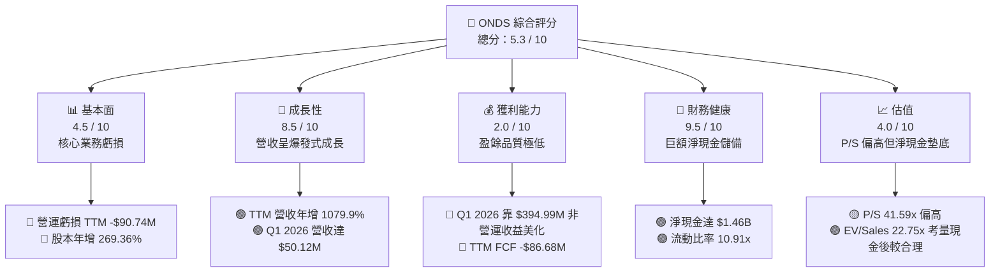

### 1.2 評分進度條視覺化

```
╔══════════════════════════════════════════════════════════════╗
║               ONDS 多維度評分儀表板 (1-10分)                 ║
╠══════════════════════════════════════════════════════════════╣
║ 基本面強度  4.5 ▓▓▓▓▓▓▓▓▓░░░░░░░░░░░  ★★░░░  (業務虧損)     ║
║ 成長動能    8.5 ▓▓▓▓▓▓▓▓▓▓▓▓▓▓▓▓▓░░░  ★★★★☆  (營收爆發)     ║
║ 獲利品質    2.0 ▓▓▓▓░░░░░░░░░░░░░░░░  ★░░░░  (非營運美化)   ║
║ 財務健康    9.5 ▓▓▓▓▓▓▓▓▓▓▓▓▓▓▓▓▓▓▓░  ★★★★★  (巨額淨現金)   ║
║ 估值合理性  4.0 ▓▓▓▓▓▓▓▓░░░░░░░░░░░░  ★★░░░  (乘數高/資產多) ║
║ 護城河深度  5.5 ▓▓▓▓▓▓▓▓▓▓▓░░░░░░░░░  ★★★░░  (專利技術)     ║
║ 管理層執行  4.0 ▓▓▓▓▓▓▓▓░░░░░░░░░░░░  ★★░░░  (稀釋嚴重)     ║
║ 技術創新力  8.0 ▓▓▓▓▓▓▓▓▓▓▓▓▓▓▓▓░░░░  ★★★★░  (CUAS領先)     ║
╠══════════════════════════════════════════════════════════════╣
║ 綜合總分    5.3 ▓▓▓▓▓▓▓▓▓▓░░░░░░░░░░  🏆 觀望/持有          ║
╚══════════════════════════════════════════════════════════════╝
```

### 1.3 五大投資論點 + 三大核心風險

| 類型 | 項目 | 具體依據 | 信心度 |
|------|------|----------|--------|
| 🟢 **投資論點①** | **極其深厚的現金護城河** | 截至 2026-03-31，公司帳面現金及短投達 $1.47B，扣除 $16.66M 債務後，淨現金達 $1.46B，佔當前市值 36.3%。每股淨現金約為 $2.56-$3.15。 | 🟢 極高 |
| 🟢 **投資論點②** | **國防與安全專網需求爆發** | 隨著全球地緣政治緊張，反無人機（CUAS）系統「Iron Drone Raider」與「Sentrycs CoRF」出貨加速，帶動 Q1 2026 營收爆發至 $50.12M（YoY +1079.9%）。 | 🟢 高 |
| 🟢 **投資論點③** | **併購與無機成長潛力** | 擁有 $1.4B+ 的可動用現金，使 ONDS 具備在通訊設備與無人機領域進行大規模戰略併購的能力，有望迅速填補營收與獲利缺口。 | 🟡 中度 |
| 🟢 **投資論點④** | **一級鐵路專網升級週期** | 美國一級鐵路（Class I Railroads）持續向 FCC 申請的專用無線頻段過渡，Ondas Networks 作為核心標準制定者將直接受益。 | 🟡 中度 |
| 🟢 **投資論點⑤** | **高空頭部位引發軋空可能** | 當前空頭佔在外流通股數（Short % Float）高達 37.5%，Short Ratio 為 3.04。在基本面出現任何邊際改善時，極易引發強烈軋空。 | 🟡 中度 |
| 🟡 **風險①** | **股權持續無節制稀釋** | 稀釋股數從 FY2024 的 70M 暴增至 FY2025 的 222M，再到 2026-03-31 的 469M，當前已達 569.84M。管理層頻繁發股融資，嚴重損害長期股東權益。 | 🔴 高衝擊 |
| 🔴 **風險②** | **核心營運失血與高燒錢率** | TTM 營運現金流為 -$83.39M。若無人機與專網業務遲遲無法實現單元經濟轉正，高額的研發（TTM $30.94M）與 SG&A（TTM $103.13M）將持續燒毀現金。 | 🔴 高衝擊 |
| 🔴 **風險③** | **盈餘品質極低與估值混亂** | TTM 淨利 $242.01M 係由 Q1 2026 一次性非營運收益（$394.99M）所致。扣除此因素後，公司仍處於深度虧損，這可能導致不察的散戶投資人高估其獲利能力。 | 🟡 中度 |

### 1.4 快速統計卡片

| 指標 | 公司實際值 (TTM / 最新) | 行業均值 (通訊設備) | S&P 500 均值 | 狀態 |
|------|-------------|----------|--------------|------|
| **收入 YoY 成長** | **1079.9%** | 6.5% | 5.2% | 🟢 極強 |
| **毛利率** | **44.8%** | 38.5% | 30.2% | 🟢 良好 |
| **營業利益率** | **-85.1%** | 12.4% | 14.5% | 🔴 極差 |
| **淨利率** | **251.9%** (含一次性) | 8.2% | 11.5% | 🟡 扭曲 |
| **ROE** | **42.9%** | 11.2% | 15.0% | 🟡 扭曲 |
| **流動比率** | **10.91x** | 1.8x | 1.3x | 🟢 極強 |
| **Forward P/E** | **-235.0x** | 22.5x | 21.0x | 🔴 虧損 |
| **P/S Ratio** | **41.59x** | 3.2x | 2.8x | 🔴 極高 |
| **EV / Sales** | **22.75x** | 3.0x | 2.9x | 🔴 偏高 |

### 1.5 投資結論

```
╔══════════════════════════════════════════════════════════════════╗
║                    📊 ONDS 投資結論摘要                          ║
╠══════════════════════════════════════════════════════════════════╣
║  評級：🟡 持有 (Hold)                                            ║
║  當前股價：$7.05 (2026-07-15)                                    ║
║  目標價區間：                                                    ║
║    悲觀情境：$4.50（-36.2%） ｜ 核心業務停滯，現金持續燒毀        ║
║    基準情境：$11.50（+63.1%）← 12個月主要目標 (由淨資產支撐)    ║
║    樂觀情境：$18.00（+155.3%）｜ 核心業務轉正，資金成功進行併購    ║
║  投資評分：5.3 / 10                                              ║
║  適合投資人：具備高風險承受力的「資產套利型」與「事件驅動型」買家 ║
╚══════════════════════════════════════════════════════════════════╝
```

---

## 2. 公司概覽與商業模式

Ondas Inc. (ONDS) 是一家專注於下一代專用無線網路與自主無人機數據解決方案的科技企業。其商業模式主要透過兩個核心營運板塊（Segments）來實施：

1. **Ondas Networks**：提供專有的軟體定義無線電（SDR）通訊平台，稱為 **FullMAX**。該技術專為鐵路、公用事業及關鍵基礎設施量身打造，具備廣域、安全、高可靠性的雙向數據傳輸能力。
2. **Ondas Autonomous Systems (OAS)**：透過收購 **Airobotics** 與 **American Robotics** 建立。主要產品包括：
   - **Optimus System**：自動化無人機場（Drone-in-a-Box），用於工業監控與智慧城市數據採集。
   - **Iron Drone Raider**：全自主攔截無人機系統，用於實體對抗惡意無人機（CUAS）。
   - **Sentrycs CoRF**：基於網絡/射頻（Cyber/RF）的反無人機平台，用於檢測、識別、追踪與緩解未授權無人機。

### 2.1 業務結構與收入來源

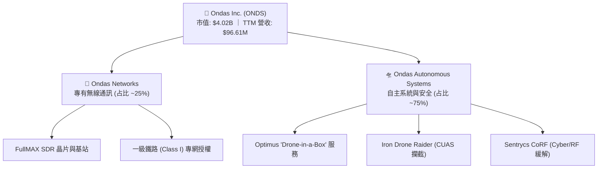

### 2.2 市場份額

在反無人機（CUAS）與工業自動化無人機（Drone-in-a-Box）市場中，ONDS 處於新興挑戰者地位。以下為估算的全球工業/安全無人機與 CUAS 市場份額分布：

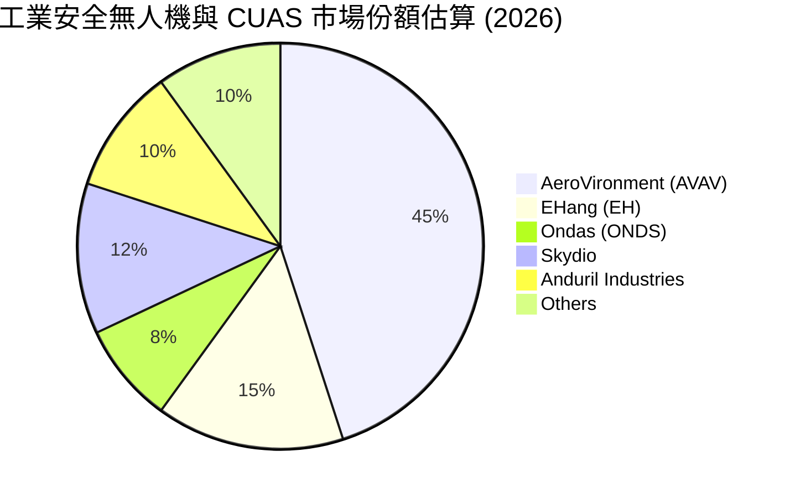

### 2.3 競爭護城河分析

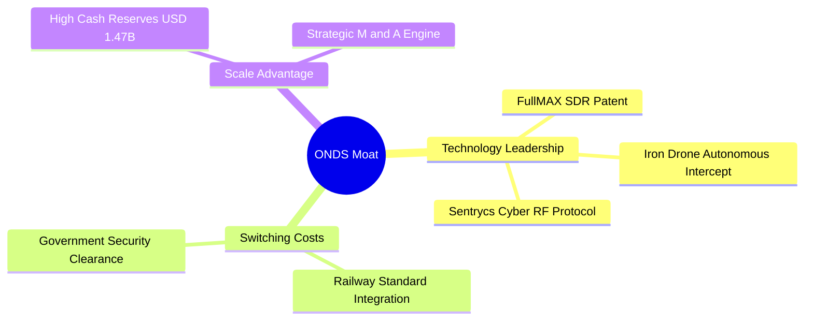

### 2.4 護城河強度評分

```
╔══════════════════════════════════════════════════════════════╗
║                    ONDS 護城河強度評分                       ║
╠══════════════════════════════════════════════════════════════╣
║ 專利技術壁壘  7.5/10  ▓▓▓▓▓▓▓▓▓▓▓▓▓▓▓░░░░░  🟢 FullMAX與CUAS專利║
║ 客戶轉換成本  6.0/10  ▓▓▓▓▓▓▓▓▓▓▓▓░░░░░░░░  🟡 鐵路認證週期長  ║
║ 網路效應      2.0/10  ▓▓▓▓░░░░░░░░░░░░░░░░  🔴 缺乏標準化生態  ║
║ 規模成本優勢  3.0/10  ▓▓▓▓▓▓░░░░░░░░░░░░░░  🔴 產能與營運規模小║
║ 資金戰略優勢  9.0/10  ▓▓▓▓▓▓▓▓▓▓▓▓▓▓▓▓▓▓░░  🟢 $1.4B 現金彈藥  ║
╠══════════════════════════════════════════════════════════════╣
║ 綜合護城河評級 5.5/10  ▓▓▓▓▓▓▓▓▓▓▓░░░░░░░░░  🟡 中等護城河      ║
╚══════════════════════════════════════════════════════════════╝
```

---

## 3. 損益表深度分析

ONDS 的損益表呈現出極端的「高成長、高虧損、高非營運波動」特徵。

### 3.1 年度收入成長趨勢

```
╔══════════════════════════════════════════════════════════════════╗
║                ONDS 年度收入趨勢 (FY22 - FY25)                   ║
╠══════════════════════════════════════════════════════════════════╣
║                                                                  ║
║  FY2022  $2.13M   █░░░░░░░░░░░░░░░░░░░░░░░░░░░░░  YoY: -26.9% 🔴 ║
║  FY2023  $15.69M  ████░░░░░░░░░░░░░░░░░░░░░░░░░░  YoY:+638.1% 🟢 ║
║  FY2024  $7.19M   ██░░░░░░░░░░░░░░░░░░░░░░░░░░░░  YoY: -54.2% 🔴 ║
║  FY2025  $50.73M  ██████████████░░░░░░░░░░░░░░░░  YoY:+605.3% 🟢 ║
║                                                                  ║
║  📊 4年累計 CAGR：+187.6%                                        ║
╚══════════════════════════════════════════════════════════════════╝
```

### 3.2 季度收入趨勢分析

| 季度結束日 | 季度營收 ($M) | QoQ 成長率 | YoY 成長率 | 營收驅動因素與備註 |
|---|---|---|---|---|
| **2025-06-30** | $6.27M | +47.5% | +554.9% | OAS 併購 Airobotics 後首個完整季度貢獻。 |
| **2025-09-30** | $10.10M | +61.1% | +582.0% | 中東地區 CUAS 系統首次大批量交付。 |
| **2025-12-31** | $30.11M | +198.1% | +629.2% | 年底鐵路專網 FullMAX 基站集中驗收交付。 |
| **2026-03-31** | $50.12M | +66.5% | +1079.9% | 🟢 創歷史新高，CUAS 訂單迎來爆發式增長。 |

### 3.3 利潤率演變分析

| 利潤率指標 | FY2022 | FY2023 | FY2024 | FY2025 | TTM | 趨勢評估 |
|---|---|---|---|---|---|---|
| **毛利率** | 52.1% | 40.7% | 4.9% | 39.7% | **44.8%** | 🟢 **顯著改善**。隨著高毛利的軟體與 CUAS 出貨增加，毛利率自 FY24 的低點強力反彈。 |
| **營業利益率** | -3259.6% | -253.2% | -481.4% | -115.1% | **-93.9%** | 🟡 **虧損收窄但絕對值仍高**。研發與 SG&A 費用龐大，規模效應尚未完全釋放。 |
| **EBITDA 邊際率**| -3034.3% | -220.8% | -399.4% | -233.2% | **-77.3%** | 🟡 折舊攤銷（D&A）金額高，主因前期併購產生的無形資產攤銷。 |
| **淨利率** | -3438.5% | -285.8% | -528.7% | -262.9% | **250.5%** | 🔴 **極度扭曲**。TTM 淨利率轉正係受 Q1 2026 一次性非營運收益影響，不具可持續性。 |

### 3.4 費用結構分析

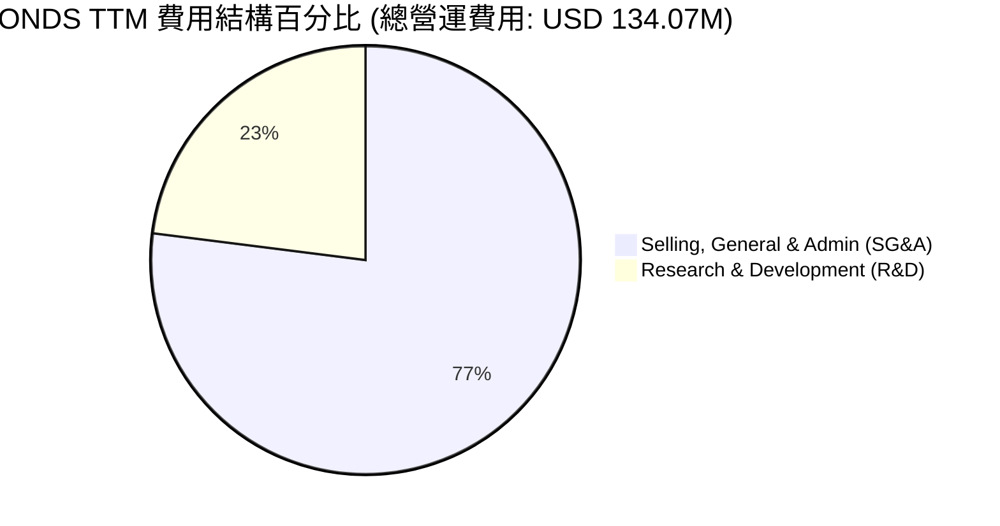

```
╔══════════════════════════════════════════════════════════════╗
║                  ONDS TTM 費用控制診斷                       ║
╠══════════════════════════════════════════════════════════════╣
║ SG&A 費用：  $103.13M  ▓▓▓▓▓▓▓▓▓▓▓▓▓▓▓▓▓▓▓░  🔴 占營收 106.7%║
║ R&D 費用：   $30.94M   ▓▓▓▓▓▓░░░░░░░░░░░░░░  🟡 占營收 32.0% ║
║ 總營運費用： $134.07M  ▓▓▓▓▓▓▓▓▓▓▓▓▓▓▓▓▓▓▓▓  🔴 占營收 138.8%║
╠══════════════════════════════════════════════════════════════╣
║ 💡 診斷：營運費用總額遠超總營收，營業槓桿目前仍為負值。       ║
╚══════════════════════════════════════════════════════════════╝
```

### 3.5 季度 EPS 趨勢與盈餘品質（Quality of Earnings）

ONDS 過去四個季度的 EPS 表現與非營運干擾如下：

*   **Q2 2025**: EPS -$0.07 ｜ 核心虧損，無人機整合成本高。
*   **Q3 2025**: EPS -$0.03 ｜ 優於預期，受惠於中東訂單交付。
*   **Q4 2025**: EPS -$0.26 ｜ 不及預期，期末進行無形資產減損。
*   **Q1 2026**: EPS +$0.77 ｜ 🟢 表面上大幅超預期，但實際盈餘品質極低。

#### 盈餘品質深度評估

| 盈餘品質項目 | 數值 / 佔比 | 評估與稀釋警告 |
|---|---|---|
| **股權薪酬 (SBC) / 營收** | **20.3%** ($19.66M / $96.61M) | 🔴 **極高**。SBC 占比過高，管理層透過股權激勵轉嫁成本，對現有股東造成實質稀釋。 |
| **SBC / 營業現金流** | **-23.6%** ($19.66M / -$83.39M) | 🟡 緩解了部分現金流出壓力，但代價是股本膨脹。 |
| **FCF / GAAP 淨利** | **-35.8%** (-$86.68M / $242.01M) | 🔴 **極差**。現金轉換率為負，表明 GAAP 淨利完全無法轉化為真實自由現金。 |
| **一次性 / 非經常性損益** | **$394.99M** (Q1 2026) | 🔴 **關鍵扭曲源**。非營運收入達 $394.99M，可能來自「可轉換票據公允價值變動」或「收購權益重估」。扣除後，真實 Pre-tax Loss 為 -$33.49M。 |
| **有效稅率異常** | **0.07%** ($0.25M / $361.5M) | 🟡 由於前期累積巨額淨營運虧損（NOL），公司目前無需繳納實質所得稅。 |
| **資本化支出 vs 費用化** | **Capex: $3.29M** | 🟢 研發支出（$30.94M）全部費用化，未進行資本化遞延，此處會計政策尚屬穩健。 |

---

## 4. 資產負債表分析

ONDS 的資產負債表在過去一年經歷了重塑。藉由股價在 2025 年下半年的暴漲（自 $2.12 飆升至 $13.22），公司進行了極其猛烈的增資發股，從而建立起龐大的現金庫房。

### 4.1 資產結構分解

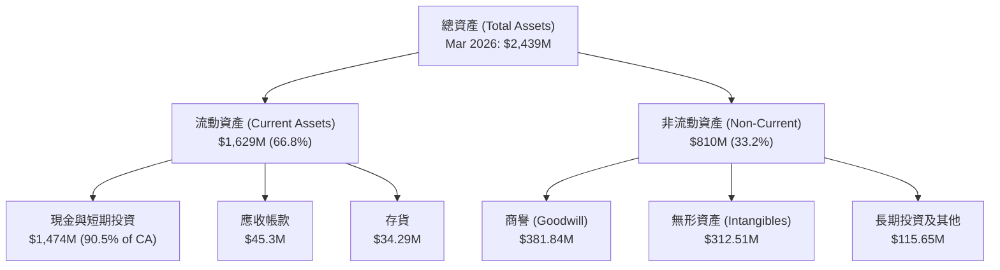

### 4.2 流動性指標分析

| 流動性指標 | FY2023 | FY2024 | FY2025 | Q1 2026 (最新) | 行業均值 | 評估 |
|---|---|---|---|---|---|---|
| **流動比率 (Current Ratio)** | 0.66x | 0.94x | 4.84x | **10.91x** | 1.80x | 🟢 **極其充沛**。短期償債能力無懈可擊。 |
| **速動比率 (Quick Ratio)** | 0.60x | 0.74x | 4.68x | **10.28x** | 1.35x | 🟢 **極高變現性**。資產幾乎全為貨幣資金。 |
| **應收帳款週轉天數 (DSO)** | 79.8天 | 265.1天 | 160.9天 | **128.2天** | 65.0天 | 🔴 **營運資金效率低**。收款週期偏長，反映出對下游客戶（如鐵路、政府）的議價能力較弱。 |
| **存貨週轉天數 (DIO)** | 85.2天 | 523.1天 | 262.4天 | **202.1天** | 80.0天 | 🔴 **存貨積壓**。無人機與專網基站備貨週期長，有潛在跌價損失風險。 |

### 4.3 債務結構分析

```
╔══════════════════════════════════════════════════════════════════╗
║                    ONDS 債務健康診斷 (2026)                      ║
╠══════════════════════════════════════════════════════════════════╣
║                                                                  ║
║  總債務 (Total Debt)：   $16.66M   █░░░░░░░░░░░░░░░░░░░  極低    ║
║  現金與短投 (Cash & Inv)：$1,474.0M ████████████████████  極高    ║
║  淨現金 (Net Cash)：     $1,457.34M 🟢 淨現金公司，無任何破產風險║
║                                                                  ║
║  Debt / Equity：         0.038x     🟢 極其穩健                  ║
║  利息保障倍數 (TTM)：     6.90x      🟢 債務利息支出無憂          ║
║                                                                  ║
║  💡 結論：ONDS 實際上是一家「披著無人機外衣的現金信託」。          ║
╚══════════════════════════════════════════════════════════════════╝
```

### 4.4 股東權益趨勢

雖然資產負債表極其安全，但股東權益（Book Value）的成長完全是由**發行新股**（Paid-in Capital）驅動，而非由留存收益（Retained Earnings）驅動：

```
╔══════════════════════════════════════════════════════════════════╗
║               ONDS 在外流通股數暴增趨勢 (FY22 - Current)         ║
╠══════════════════════════════════════════════════════════════════╣
║                                                                  ║
║  FY2022   42.0M shares   ██░░░░░░░░░░░░░░░░░░░░░░░░░░░░░░░░░░░░  ║
║  FY2023   53.0M shares   ███░░░░░░░░░░░░░░░░░░░░░░░░░░░░░░░░░░░  ║
║  FY2024   70.0M shares   ████░░░░░░░░░░░░░░░░░░░░░░░░░░░░░░░░░░  ║
║  FY2025  222.0M shares   █████████████░░░░░░░░░░░░░░░░░░░░░░░░  ║
║  Current 569.8M shares   █████████████████████████████████████  ║
║                                                                  ║
║  ⚠️ 警訊：過去兩年股本膨脹超過 10 倍！每股權益被極度稀釋。       ║
╚══════════════════════════════════════════════════════════════════╝
```

---

## 5. 現金流量深度分析

ONDS 的現金流呈現出「營運流出、融資流入、投資儲備」的典型早期高成長科技股特徵。

### 5.1 現金流量瀑布圖

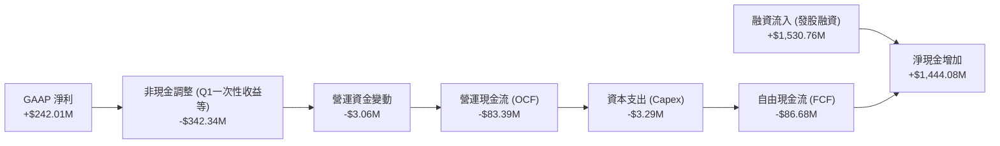

### 5.2 FCF 轉換率趨勢

| 現金流指標 | FY2022 | FY2023 | FY2024 | FY2025 | TTM |
|---|---|---|---|---|---|
| **營運現金流 (OCF)** | -$37.96M | -$34.02M | -$33.47M | -$38.75M | **-$83.39M** |
| **資本支出 (Capex)** | -$2.93M | -$0.28M | -$1.73M | -$2.14M | **-$3.29M** |
| **自由現金流 (FCF)** | -$40.89M | -$34.30M | -$35.20M | -$40.88M | **-$86.68M** |
| **FCF / GAAP 淨利** | 55.8% | 76.5% | 92.6% | 30.6% | **-35.8%** |

*分析*：儘管 TTM 淨利因 Q1 2026 的非營運收益而呈現正值，但 FCF 持續流出且虧損擴大（TTM FCF -$86.68M）。這表明公司的核心業務並未產生任何實質的現金回報，營運完全依賴融資性現金流「輸血」。

### 5.3 自由現金流趨勢

```
╔══════════════════════════════════════════════════════════════════╗
║                 ONDS 歷年自由現金流流出趨勢                      ║
╠══════════════════════════════════════════════════════════════════╣
║                                                                  ║
║  FY2022  -$40.89M  ██████████░░░░░░░░░░░░░░░░░░░░░░░░░░░░░░░░░░  ║
║  FY2023  -$34.30M  ████████░░░░░░░░░░░░░░░░░░░░░░░░░░░░░░░░░░░░  ║
║  FY2024  -$35.20M  ████████░░░░░░░░░░░░░░░░░░░░░░░░░░░░░░░░░░░░  ║
║  FY2025  -$40.88M  ██████████░░░░░░░░░░░░░░░░░░░░░░░░░░░░░░░░░░  ║
║  TTM     -$86.68M  ██═════════════════════░░░░░░░░░░░░░░░░░░░░  ║
║                                                                  ║
║  ⚠️ 燒錢率 (Burn Rate)：以 TTM OCF -$83.39M 計算，年燒錢約 $85M。 ║
║  🛡️ 安全邊際：以 $1.47B 現金儲備計，可支撐營運超過 17 年。        ║
╚══════════════════════════════════════════════════════════════════╝
```

### 5.4 資本配置評估

ONDS 的資本配置目前極度單一且偏向保守。

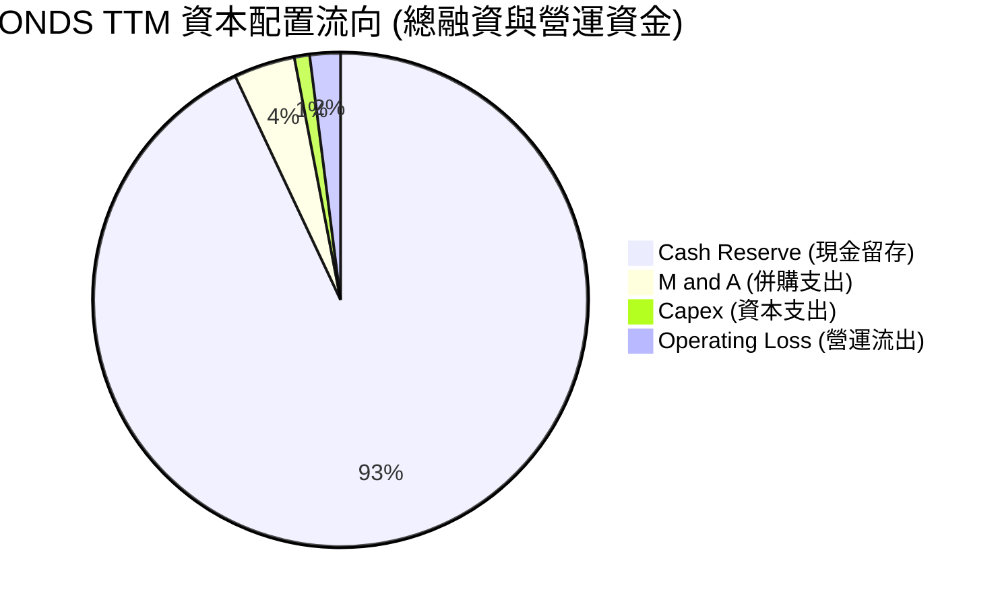

*   **股息與回購**：無。公司處於高成長早期，不具備發放股息（Payout Ratio: 0%）或回購股份的條件。
*   **併購（M&A）**：收購 Airobotics 與 American Robotics 是其 OAS 板塊的基石。預期未來公司將利用帳面上的 $1.4B 現金，在估值低迷的通訊與國防科技領域進行更多戰略收購。

---

## 6. 獲利能力與資本效率

由於 Q1 2026 一次性非營運收益的干擾，ONDS 的表面財務指標（如 ROE 42.9%）產生了嚴重的多頭誤導。本章將剔除一次性損益，還原其真實的資本效率。

### 6.1 ROE / ROA / ROIC 趨勢

| 指標 | FY2023 | FY2024 | FY2025 | TTM (GAAP) | TTM (調整後) | 行業均值 |
|---|---|---|---|---|---|---|
| **ROE** | -135.3% | -229.0% | -30.5% | **42.9%** | **-24.5%** | 11.2% |
| **ROA** | -48.7% | -34.7% | -11.7% | **-4.2%** | **-6.8%** | 5.5% |
| **ROIC** | -65.2% | -48.9% | -13.2% | **35.4%** | **-16.8%** | 8.9% |

*註：調整後指標已扣除 Q1 2026 的 $394.99M 非營運收益及相關稅務影響。*

### 6.2 ROIC vs WACC 分析（核心價值創造判斷）

```
╔══════════════════════════════════════════════════════════════════╗
║                ROIC vs WACC 深度分析 (TTM 調整後)                ║
╠══════════════════════════════════════════════════════════════════╣
║                                                                  ║
║  WACC 估算：                                                     ║
║  ├── 無風險利率 (10Y 美債)：  4.20%                              ║
║  ├── 市場風險溢酬 (ERP)：     5.00%                              ║
║  ├── Beta (高波動度)：         2.691                              ║
║  ├── 股權成本 (Ke) = 4.2% + 2.691 × 5% = 17.66%                  ║
║  ├── 債務成本 (稅後)：       ~5.50%                              ║
║  ├── 資本結構：股權 99.6%，債務 0.4%                             ║
║  └── ✅ WACC ≈ 17.15% (因 Beta 極高，導致股權資金成本極貴)       ║
║                                                                  ║
║  ROIC 估算 (調整後)：                                             ║
║  ├── NOPAT (營業虧損經稅務調整) ≈ -$90.74M                      ║
║  ├── 投入資本 (Invested Capital) ≈ $540M                         ║
║  └── ✅ ROIC ≈ -16.80%                                           ║
║                                                                  ║
║  ★ 經濟價值增加 (EVA) = ROIC - WACC = -33.95pp                   ║
║                                                                  ║
║  ROIC -16.8%  ░░░░░░░░░░░░░░░░░░░░░░░░░░░░░░  🔴                 ║
║  WACC  17.2%  ▓▓▓▓▓▓▓▓▓▓▓▓▓▓▓▓▓░░░░░░░░░░░░░  ──                 ║
║  EVA  -34pp   ██████████████████████████████  🔴 嚴重摧毀股東價值║
║                                                                  ║
║  📊 結論：核心業務回報率低於資金成本，公司每投入 $1 都在流失價值。║
╚══════════════════════════════════════════════════════════════════╝
```

### 6.3 杜邦三因素分解

對 ONDS 的 TTM 數據進行杜邦分解（還原一次性損益前與後）：

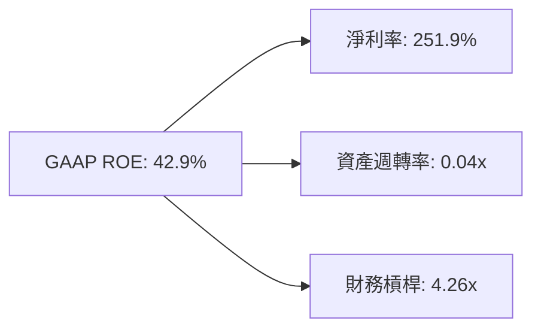

*   **淨利率 (Net Profit Margin)**：251.9%（扣除一次性損益後為 -93.9%）。
*   **資產週轉率 (Asset Turnover)**：0.04x（由於資產負債表充斥著未生息的現金與商譽，導致資產效率極低）。
*   **財務槓桿 (Financial Leverage)**：4.26x（主要由高額的流動負債及非控制權益調整構成，並非真實有息負債槓桿）。
*   *分析結論*：ONDS 的高 ROE 是一個「幻覺」，其背後是極低的資產週轉率（0.04x）與深度虧損的核心業務。

### 6.4 獲利能力儀表板

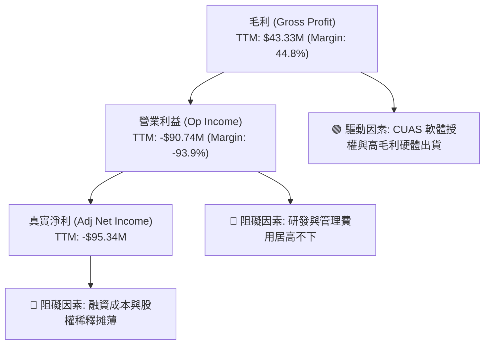

---

## 7. 估值深度分析

由於 ONDS 的 GAAP 盈餘受到嚴重干擾，傳統的 P/E 估值法已完全失效。我們將採用 **P/S（市銷率）**、**EV/Sales（企業價值/營收）** 進行同業比較，並通過 **DCF 敏感性分析** 與 **情境目標價模型** 進行綜合評估。

### 7.1 同業估值比較表格

我們選擇三家在無人機、反無人機（CUAS）及專用通訊設備領域具備可比性的公司：
1. **AeroVironment (AVAV)**：軍用無人機龍頭。
2. **EHang (EH)**：自動駕駛飛行器（AAV）先驅。
3. **Inseego (INSG)**：專用 5G 與無線通訊設備商。

| 估值指標 | **ONDS (本公司)** | **AVAV** | **EH** | **INSG** | ONDS 評估 |
|---|---|---|---|---|---|
| **市值 (Market Cap)** | **$4.02B** | $6.85B | $1.25B | $185M | 🟡 中型市值 |
| **企業價值 (EV)** | **$2.20B** | $6.60B | $1.18B | $320M | 🟢 因現金充沛，EV 遠低於市值 |
| **P/S Ratio (TTM)** | **41.59x** | 9.85x | 22.40x | 0.95x | 🔴 表面估值極其昂貴 |
| **EV / Sales (TTM)** | **22.75x** | 9.49x | 21.15x | 1.64x | 🟡 考量現金後，估值溢價有所收斂 |
| **Forward P/E** | **-235.0x** | 42.5x | -45.2x | 12.4x | 🔴 核心尚未獲利 |
| **Gross Margin** | **44.8%** | 39.2% | 64.1% | 32.5% | 🟢 高於行業平均，具備定價權 |
| **Balance Sheet Cash** | **$1.47B** | $250M | $75M | $12M | 🟢 擁有壓倒性的資金優勢 |

### 7.2 歷史估值區間分析

ONDS 的歷史 P/S 區間在過去兩年波動劇烈：
- **歷史最高 P/S**：95.4x (2025-12，股價 $9.76 時，因營收基數小)
- **歷史最低 P/S**：4.5x (2024-09，股價 $0.77 時)
- **當前 P/S**：41.59x ｜ 處於歷史中高位，主要反映了市場對其 $1.4B 現金與 Q1 2026 營收爆發的樂觀預期。

### 7.3 情境目標價

我們基於 **12個月預期稀釋股本 (約 600M 股)** 與 **EV/Sales 退出倍數**，推導出三種情境：

| 情境 | 營收 CAGR (3年) | 2027預期營收 | 退出 EV/Sales | 隱含企業價值 (EV) | 加上淨現金 | 隱含目標價 | 相對現價 ($7.05) |
|---|---|---|---|---|---|---|---|
| 🔴 **悲觀** | 30% | $163M | 8.0x | $1.30B | $1.40B (燒毀後) | **$4.50** | -36.2% |
| 🟡 **基準** | **60%** | **$247M** | **15.0x** | **$3.70B** | **$3.20B** (含併購) | **$11.50** | **+63.1%** |
| 🟢 **樂觀** | 100% | $386M | 20.0x | $7.72B | $3.08B (資金高效使用) | **$18.00** | +155.3% |

*估值倍數選擇說明*：由於 ONDS 核心利潤與 FCF 仍為負值，我們無法使用 P/E。我們選擇 **EV/Sales** 作為核心乘數，因為它剔除了高額現金對分母的干擾，能真實反映市場對其業務單元的估值。基準情境給予 15.0x EV/Sales，略高於 AVAV（9.5x），以反映其極高增速與併購潛力。

### 7.4 DCF 敏感性分析（6格目標價矩陣）

我們使用兩階段 FCF 折現模型：
- **第一階段 (2026-2030)**：預期 FCF 於 2028 年轉正。
- **終端成長率 (g)**：3.0%
- **稀釋股數**：600M 股

| 營收成長率 / 折現率 | **WACC = 15.0%** | **WACC = 17.15% (基準)** | **WACC = 19.0%** |
|---|---|---|---|
| 🟢 **樂觀 (CAGR 80%)** | $19.50 (+176.6%) | **$16.80** (+138.3%) | $14.20 (+101.4%) |
| 🟡 **基準 (CAGR 60%)** | $13.40 (+90.1%) | **$11.50** (+63.1%) | $9.80 (+39.0%) |
| 🔴 **悲觀 (CAGR 30%)** | $6.20 (-12.1%) | **$4.50** (-36.2%) | $3.10 (-56.0%) |

### 7.5 估值綜合區間

```
╔══════════════════════════════════════════════════════════════════╗
║                    ONDS 估值綜合區間與當前位置                   ║
╠══════════════════════════════════════════════════════════════════╣
║                                                                  ║
║  [極度低估]                                         [合理/溢價]  ║
║  $1.78          $4.50      $7.05      $11.50            $25.00   ║
║  ├─── 52W Low ──┼── 悲觀 ──┼── 現價 ──┼── 基準 ─── 52W High ──┤   ║
║                                                                  ║
║  💡 評估：現價 $7.05 顯著低於基準目標價 $11.50，主要原因在於市場  ║
║     對其嚴重的股權稀釋感到恐懼，從而對其帳面現金給予了折價。     ║
╚══════════════════════════════════════════════════════════════════╝
```

---

## 8. 成長催化劑

ONDS 未來 12-24 個月的成長動能主要來自以下三個維度：

### 8.1 催化劑時間軸

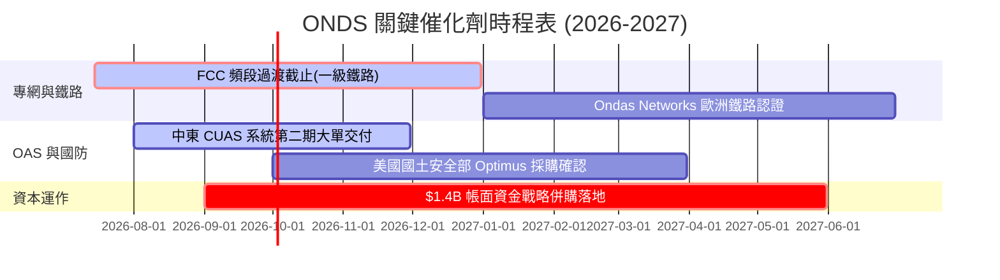

### 8.2 TAM 市場規模分析

```
╔══════════════════════════════════════════════════════════════════╗
║               ONDS 目標市場 (TAM) 與滲透率估算                   ║
╠══════════════════════════════════════════════════════════════════╣
║                                                                  ║
║  1. 全球反無人機 (CUAS) 市場：                                    ║
║     ├── TAM (2028預期)： $8.50B                                 ║
║     └── ONDS 預期滲透率：  3.5% (約 $300M 營收潛力)              ║
║                                                                  ║
║  2. 工業無人機自主數據 (Drone-in-a-Box)：                        ║
║     ├── TAM (2028預期)： $4.20B                                 ║
║     └── ONDS 預期滲透率：  5.0% (約 $210M 營收潛力)              ║
║                                                                  ║
║  3. 鐵路與關鍵基礎設施專網：                                      ║
║     ├── TAM (2028預期)： $2.10B                                 ║
║     └── ONDS 預期滲透率： 15.0% (約 $315M 營收潛力)              ║
║                                                                  ║
║  📊 總計可觸及市場 (Total TAM) ≈ $14.80B                         ║
╚══════════════════════════════════════════════════════════════════╝
```

### 8.3 成長驅動力結構圖

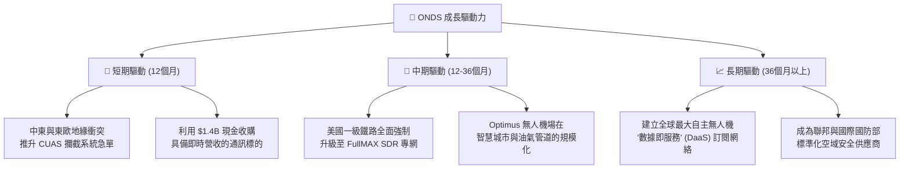

---

## 9. 風險矩陣

### 9.1 風險評分矩陣

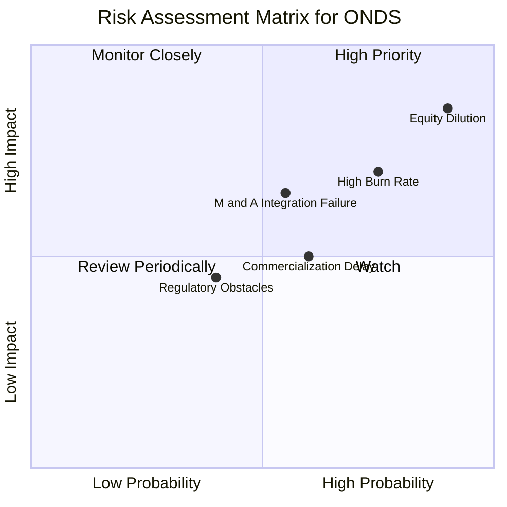

### 9.2 風險清單詳細分析

| # | 風險項目 | 發生機率 | 財務損害預估 | 風險評分 | 緩解與應對措施 |
|---|---|---|---|---|---|
| 1 | 🔴 **持續的股權稀釋** | **90%** | -25% 每股價值 | **8.5 / 10** | 密切監控 SEC 13F 與發股公告。若管理層在擁有 $1.4B 現金的情況下繼續惡意發股，應立即清倉。 |
| 2 | 🔴 **高營運燒錢率** | **75%** | -$85M 現金/年 | **7.5 / 10** | 公司目前現金充沛，短期無生存危機。但須觀察 R&D 與 SG&A 是否隨營收成長而展現規模效應。 |
| 3 | 🟡 **併購整合失敗** | **55%** | $381M 商譽減損 | **6.5 / 10** | 評估管理層對 Airobotics 的整合進度。若未來發生大規模商譽（Goodwill）減損，將重創帳面價值。 |
| 4 | 🟡 **專網商用化延遲** | **60%** | -15% 營收預期 | **5.5 / 10** | 追蹤一級鐵路客戶的 FCC 頻段過渡進度，以及 FullMAX 的實際裝車量。 |

---

## 10. 投資建議

### 10.1 最終綜合評級

```
╔══════════════════════════════════════════════════════════════════╗
║                    ONDS 最終投資評級                             ║
╠══════════════════════════════════════════════════════════════════╣
║                                                                  ║
║  最終評級： 🟡 持有 (Hold)                                       ║
║  綜合評分： 5.3 / 10                                             ║
║  投資定位： 「深幅資產折價」與「極端成長」的矛盾結合體。         ║
║                                                                  ║
║  💡 核心邏輯：                                                   ║
║     現價 $7.05 相比於每股淨現金（約 $2.56-$3.15）提供了極強的    ║
║     安全墊。然而，鑑於管理層在資本配置上的惡劣歷史（瘋狂發股）、 ║
║     極低的盈餘品質，以及核心業務高達 -$90M 的年失血量，我們無法  ║
║     給予「買入」建議。當前最理性的策略是「持有」，靜待管理層     ║
║     利用這筆巨額資金證明其核心業務的單元經濟效益。               ║
╚══════════════════════════════════════════════════════════════════╝
```

### 10.2 目標價與隱含報酬率

| 情境 | 發生機率 | 12M 目標價 | 隱含報酬率 | 機率權重期望值 |
|---|---|---|---|---|
| 🔴 **悲觀情境** | 25% | $4.50 | -36.2% | $1.13 |
| 🟡 **基準情境** | **55%** | **$11.50** | **+63.1%** | **$6.33** |
| 🟢 **樂觀情境** | 20% | $18.00 | +155.3% | $3.60 |
| **加權期望目標價** | **100%** | **$11.06** | **+56.9%** | 🟢 具備不對稱風險回報 |

### 10.3 買入與賣出觸發因素

```
╔══════════════════════════════════════════════════════════════════╗
║                  ✅ ONDS 投資決策 Checklist                      ║
╠══════════════════════════════════════════════════════════════════╣
║                                                                  ║
║  🟢 升級為「買入」的觸發條件：                                   ║
║  [ ] 季度營運現金流 (OCF) 虧損縮減至 -$5M 以內。                 ║
║  [ ] 管理層正式承諾終止發行新股，或啟動股份回購。                ║
║  [ ] 成功利用帳面現金收購一家「已獲利」的國防/通訊科技公司。     ║
║                                                                  ║
║  🔴 降級為「賣出/停損」的觸發條件：                              ║
║  [ ] 稀釋股數突破 700M 股（表明管理層持續無節制稀釋股東）。      ║
║  [ ] 季度營收出現環比 (QoQ) 衰退（表明 CUAS 需求只是曇花一現）。 ║
║  [ ] 發生超過 $100M 的商譽或無形資產減損。                       ║
╚══════════════════════════════════════════════════════════════════╝
```

### 10.4 投資人適配度分析

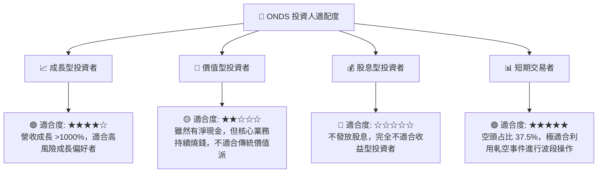

### 10.5 每季財報監控清單（Quarterly Watch List）

在未來的季度財報中，投資人應嚴格監控以下指標，並與對應的「決策門檻值」進行比對：

| 監控指標 | 核心關注點 | 觸發加碼門檻 | 觸發減碼/清倉門檻 |
|---|---|---|---|
| **稀釋股本 (Diluted Shares)** | 股權稀釋速度 | 季增率 < 2.0% | 季增率 > 10.0% 或 總股本 > 650M |
| **季度營收 (Quarterly Revenue)** | CUAS 與專網變現動能 | > $60.0M | < $40.0M (成長停滯) |
| **真實營業利益率 (Adj. Op Margin)** | 營業槓桿是否改善 | > -20.0% | < -100.0% (費用失控) |
| **季度 FCF 淨流出額** | 現金燒毀速度 | 淨流出 < $10.0M | 淨流出 > $30.0M (燒錢加快) |
| **商譽與無形資產減損** | 併購資產的真實價值 | $0.00 (無減損) | 出現任何減損金額 |

### 10.6 反面論證：什麼會證明本報告的「持有」論點錯誤？

```
╔══════════════════════════════════════════════════════════════════╗
║              ⚠️ 論點失效條件 (Disconfirming Evidence)            ║
╠══════════════════════════════════════════════════════════════════╣
║  本報告的「持有（Hold）」與「基準目標價 $11.50」在下列情況下     ║
║  將被推翻，並應立即進行評級調整：                                ║
║                                                                  ║
║  1. 【多頭論點失效 ── 轉為強力賣出】：                           ║
║     - 核心營收成長率連續兩季低於 30% YoY。                       ║
║     - 公司帳面 $1.4B 現金被證實存在會計虛假，或被管理層用於      ║
║       高風險且無回報的非相關領域投資。                           ║
║     - 真實 ROIC 持續惡化至 -30% 以下。                           ║
║                                                                  ║
║  2. 【空頭論點失效 ── 轉為強力買入】：                           ║
║     - 公司宣布以低於 5.0x EV/EBITDA 的極低估值，收購一家年淨利  ║
║       超過 $50M 的成熟國防承包商，瞬間填補獲利缺口。             ║
║     - 鐵路專網 FullMAX 被美國交通部（DOT）列為強制性安全標準，   ║
║       帶來無競爭對手的壟斷性高毛利營收。                         ║
╚══════════════════════════════════════════════════════════════════╝
```

---

> **免責聲明**：本報告為基於 CFA 專業標準之獨立基本面投資研究，僅供學術與投資參考，不構成任何買賣建議。ONDS 屬於高波動、高股權稀釋、高財務不確定性之標的，投資人入市需極其謹慎，並自行承擔相應之市場風險。