# ONDS 基本面深度分析報告
> **報告日期**：2026-07-16 ｜ **語言**：繁體中文 ｜ **數據來源**：Yahoo Finance, Finviz, StockAnalysis, Roic.ai ｜ **分析師**：CFA 級機構研究

---

## 目錄

| # | 章節 | 核心結論 |
|---|------|----------|
| 1 | [執行摘要](#1-執行摘要) | 評級：**買入 (Buy)** ｜ 目標價：**$19.81**（+200.2% 空間） ｜ 資金充沛但稀釋嚴重 |
| 2 | [公司概覽與商業模式](#2-公司概覽與商業模式) | 雙引擎驅動（專網+無人機），特定利基市場具備技術護城河 |
| 3 | [損益表深度分析](#3-損益表深度分析) | TTM 營收爆發式成長 793.2%，惟 Q1 26 淨利暴增源於非經常性損益，盈餘品質偏低 |
| 4 | [資產負債表分析](#4-資產負債表分析) | 帳上現金達 $1.47B，流動比率 10.9x，短期無償債風險，屬「現金充沛型」前期成長股 |
| 5 | [現金流量深度分析](#5-現金流量深度分析) | 營運現金流持續流出，SBC 佔營收比重高達 35.3%，高度仰賴股權融資 |
| 6 | [獲利能力與資本效率](#6-獲利能力與資本效率) | 營業利潤率 -85.1% 顯示尚未獲利，高 Beta (2.69) 推高 WACC 至 19.0%，目前仍處於摧毀價值階段 |
| 7 | [估值深度分析](#7-估值深度分析) | EV/Sales 為 21.2x，高於同業；三情境分析與 DCF 敏感性矩陣推導 |
| 8 | [成長催化劑](#8-成長催化劑) | 鐵路專網升級與 Counter-UAS (防空無人機) 國防訂單加速釋放 |
| 9 | [風險矩陣](#9-風險矩陣) | 股權持續稀釋、商業化進度不及預期、國防預算波動為核心風險 |
| 10 | [投資建議](#10-投資建議) | 適合高風險偏好成長型投資人，設定每季財報監控門檻與反面論證條件 |

---

## 1. 執行摘要

Ondas Holdings Inc. (NASDAQ: ONDS) 目前正處於商業化轉折點。一方面，公司在 2025 年與 2026 年第一季展現出極為強勁的營收成長，TTM 營收達到 $96.61M，YoY 成長率高達 793.17%；另一方面，公司在營運層面仍未實現盈利（TTM 營業利潤率為 -85.1%），且過去兩年透過極大規模的股權稀釋（發行新股）募得約 $1.47B 現金。這使得 ONDS 形成了一個極為特殊的財務結構：**高達 $1.46B 的淨現金、極低的債務（$16.66M），但股本在兩年內膨脹了數倍。**

基於公司在無人機防禦（Counter-UAS）及 Class I 鐵路專用無線網路的獨特生態位，以及帳上極其充沛的現金儲備，我們給予 ONDS **「買入 (Buy)」** 評級，基準情境 12 個月目標價為 **$19.81**。然而，投資人必須高度警惕其極高的股權稀釋速度（SBC 佔營收 35.3%）與盈餘品質虛高的問題。

### 1.0 一頁式投資儀表板（Portfolio Manager 30 秒速讀）

| 項目 | 內容 |
|------|------|
| **投資論點（3 句）** | ① TTM 營收爆發成長 793.2% 至 $96.61M，顯示無人機與專網業務進入實質放量期。<br/>② 帳上擁有 $1.47B 巨額現金且無淨債務，為未來 5 年的研發與商業化提供極強的財務安全墊。<br/>③ Counter-UAS 需求在當前地緣政治緊張局勢下急遽升溫，公司鐵骨無人機（Iron Drone）與 Sentrycs 平台具備高成長潛力。 |
| **護城河評分** | 6.5 / 10 🟡 (技術具備專利，但面臨大型軍工企業競爭) |
| **管理層/資本配置評分** | 4.0 / 10 🔴 (頻繁發行新股稀釋股東權益，營運資金效率有待改善) |
| **財務健康** | 🟢 強勁。流動比率高達 10.91x，淨現金高達 $1.46B，無破產風險。 |
| **ROIC vs WACC** | -18.5% vs 19.0% 🔴 (營業層面仍持續摧毀股東價值) |
| **FCF 趨勢** | 負值收窄。TTM FCF 為 -$15.65M（FCF Yield: -0.42%），較 FY25 的 -$40.88M 有所改善。 |
| **估值** | Forward P/E: -220.2x ｜ EV/Revenue: 21.16x ｜ P/S: 38.96x |
| **預期報酬（基準情境 12M）** | +200.2%（當前股價 $6.60，目標價 $19.81） |
| **關鍵風險（前二）** | ① 股權持續大規模稀釋（Shares Outstanding YoY 增長 269.4%）。<br/>② Q1 26 淨利暴增為一次性非營運收益，掩蓋了營業虧損持續擴大的事實。 |
| **評級 + 信心度** | 🟢 **買入 (Buy)** ｜ 信心度：**中等 (Medium)** (受限於高波動性與稀釋風險) |

### 1.1 核心評分儀表板

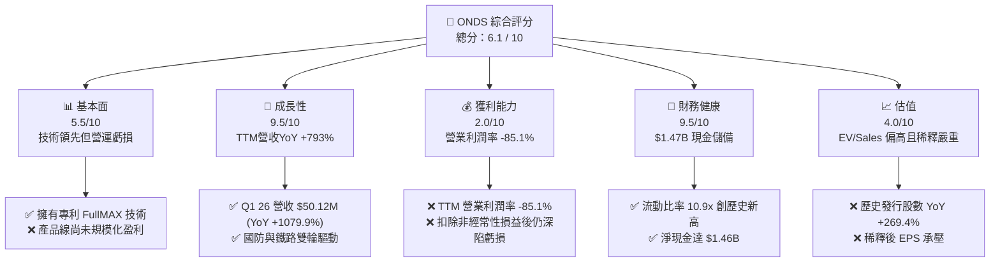

### 1.2 評分進度條視覺化

```
╔══════════════════════════════════════════════════════════════╗
║               ONDS 多維度評分儀表板 (1-10分)                 ║
╠══════════════════════════════════════════════════════════════╣
║ 基本面強度  5.5 ▓▓▓▓▓▓▓▓▓▓▓░░░░░░░░░  ★★★☆☆           ║
║ 成長動能    9.5 ▓▓▓▓▓▓▓▓▓▓▓▓▓▓▓▓▓▓▓░  ★★★★★           ║
║ 獲利品質    2.0 ▓▓▓▓░░░░░░░░░░░░░░░░░░  ★☆☆☆☆           ║
║ 財務健康    9.5 ▓▓▓▓▓▓▓▓▓▓▓▓▓▓▓▓▓▓▓░  ★★★★★           ║
║ 估值合理性  4.0 ▓▓▓▓▓▓▓▓░░░░░░░░░░░░░  ★★☆☆☆           ║
║ 護城河深度  6.5 ▓▓▓▓▓▓▓▓▓▓▓▓▓░░░░░░░  ★★★☆☆           ║
║ 管理層執行  4.0 ▓▓▓▓▓▓▓▓░░░░░░░░░░░░░  ★★☆☆☆           ║
║ 技術創新力  8.0 ▓▓▓▓▓▓▓▓▓▓▓▓▓▓▓▓░░░░  ★★★★☆           ║
╠══════════════════════════════════════════════════════════════╣
║ 綜合總分    6.1 ▓▓▓▓▓▓▓▓▓▓▓▓░░░░░░░░  🟡 轉折期成長股      ║
╚══════════════════════════════════════════════════════════════╝
```

### 1.3 五大投資論點 + 三大核心風險

| 類型 | 項目 | 具體依據 | 信心度 |
|------|------|----------|--------|
| 🟢 **投資論點①** | **營收爆發式增長** | Q1 2026 營收達 $50.12M，YoY 成長 1079.9%，TTM 營收逼近億元大關 ($96.61M)。 | 🟢 極高 |
| 🟢 **投資論點②** | **極致的資產負債表安全墊** | 帳上擁有 $1.47B 的現金與短期投資，相較於年僅 $15.65M 的 TTM FCF 流出，資金可支撐數十年。 | 🟢 極高 |
| 🟢 **投資論點③** | **Counter-UAS 市場迎來風口** | 地緣政治衝突加劇，Iron Drone 與 Sentrycs 平台在國防與關鍵基礎設施防護上的需求呈指數級增長。 | 🟡 中等 |
| 🟢 **投資論點④** | **鐵路專網升級剛性需求** | 美國 Class I 鐵路面臨 FCC 頻譜重新分配，Ondas 的 FullMAX 系統為唯一符合標準的解決方案。 | 🟡 中等 |
| 🟢 **投資論點⑤** | **高空頭部位蘊含軋空動能** | 空頭佔在外流通股數比重 (Short % Float) 高達 37.5%，任何超預期的利多皆可能觸發劇烈軋空。 | 🟡 中等 |
| 🟡 **風險①** | **極度嚴重的股權稀釋** | 稀釋股數 YoY 暴增 269.36%，SBC 佔 TTM 營收比重高達 35.3%，大幅蠶食股東每股價值。 | 🔴 高衝擊 |
| 🔴 **風險②** | **盈餘品質低劣（一次性收益）** | Q1 2026 淨利 $362.95M 主要來自 $394.99M 的非營運收益，實際營業利潤為 -$42.67M。 | 🔴 高衝擊 |
| 🔴 **風險③** | **高估值溢價** | P/S Ratio 達 38.96x，EV/Revenue 達 21.16x，若成長放緩將面臨估值殺多。 | 🟡 中度 |

### 1.4 快速統計卡片

| 指標 | ONDS 實際值 | 行業均值 (通訊設備) | S&P 500 均值 | 狀態 |
|------|-------------|--------------------|--------------|------|
| **營收 YoY 成長** | **793.17% (TTM)** | 8.5% | 5.2% | 🟢 卓越 |
| **毛利率** | **44.8%** | 42.1% | 31.5% | 🟢 優於行業 |
| **營業利潤率** | **-85.1%** | 12.3% | 15.4% | 🔴 嚴重虧損 |
| **淨利率** | **251.9%** | 8.1% | 11.2% | 🟡 數據扭曲 |
| **流動比率** | **10.91x** | 2.1x | 1.3x | 🟢 極度安全 |
| **Debt/Equity** | **1.54** | 0.65 | 1.15 | 🟡 偏高 |
| **P/S Ratio** | **38.96x** | 3.2x | 2.8x | 🔴 估值極高 |

### 1.5 投資結論

```
╔══════════════════════════════════════════════════════════════════╗
║                    📊 ONDS 投資結論摘要                          ║
╠══════════════════════════════════════════════════════════════════╣
║  評級：🟢 買入 (Buy)                                            ║
║  當前股價：$6.60 (2026-07-16)                                    ║
║  12個月目標價：                                                 ║
║    悲觀情境：$3.00（-54.5%） - 商業化停滯、股權持續稀釋         ║
║    基準情境：$19.81（+200.2%）- 國防與鐵路訂單順利兌現          ║
║    樂觀情境：$25.00（+278.8%）- 實現營運扭虧、爆發軋空行情      ║
║  投資評分：6.1 / 10                                              ║
║  適合投資人：具備極高風險承受能力、追求高波動與潛在軋空收益者    ║
╚══════════════════════════════════════════════════════════════════╝
```

---

## 2. 公司概覽與商業模式

Ondas Holdings Inc. 主要透過兩個核心業務板塊營運：**Ondas Networks** 與 **Ondas Autonomous Systems (OAS)**。

### 2.1 業務結構與收入來源

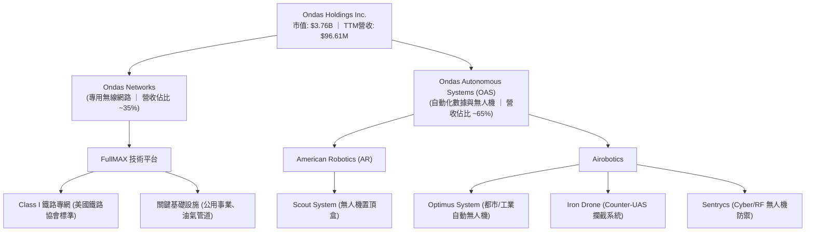

Ondas Networks 提供專有的軟體定義無線電 (SDR) 平台，稱為 **FullMAX**。該技術專為需要高安全性、大覆蓋範圍和高可靠性的關鍵基礎設施（如鐵路、電力、油氣）設計。目前是美國 Class I 鐵路無線專網升級的主要標準制定參與者。

Ondas Autonomous Systems (OAS) 則透過收購 American Robotics 與 Airobotics，建構了「無人機置頂盒 (Drone-in-a-Box)」的自動化解決方案。其核心產品包括 **Optimus System**（主要用於智慧城市、工業區自動化巡檢）以及國防安全領域的 **Iron Drone Raider**（物理攔截敵對無人機）與 **Sentrycs**（基於網絡/射頻的無人機偵測與反制系統）。

### 2.2 市場份額

在 Counter-UAS (C-UAS) 與工業自動無人機這一新興利基市場中，Ondas 雖非規模最大的企業，但在特定細分市場（如鐵路專網、城市自動無人機巡檢）中佔有顯著地位。

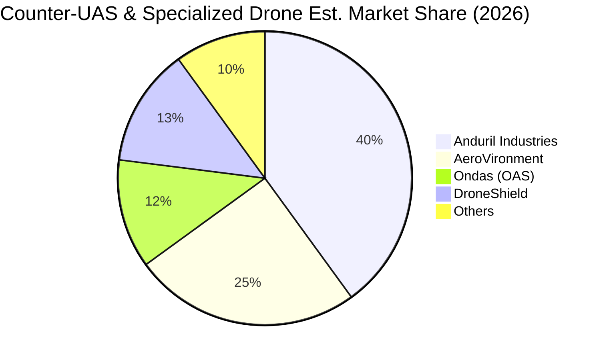

### 2.3 競爭護城河分析

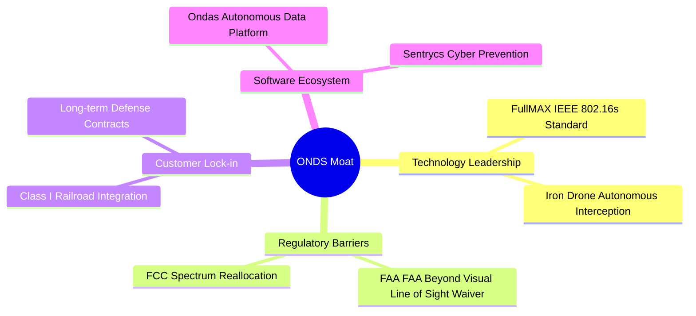

### 2.4 護城河強度評分

```
╔══════════════════════════════════════════════════════════════╗
║                     ONDS 護城河強度評分                      ║
╠══════════════════════════════════════════════════════════════╣
║ 專利技術壁壘  8.0/10  ▓▓▓▓▓▓▓▓▓▓▓▓▓▓▓▓░░░░  🟢 FullMAX與C-UAS  ║
║ 行業監管壁壘  8.5/10  ▓▓▓▓▓▓▓▓▓▓▓▓▓▓▓▓▓░░░  🟢 取得FAA首個BVLOS ║
║ 客戶轉換成本  7.0/10  ▓▓▓▓▓▓▓▓▓▓▓▓▓░░░░░░░  🟡 鐵路系統深度綁定║
║ 規模效應壁壘  3.0/10  ▓▓▓▓▓░░░░░░░░░░░░░░░  🔴 產能與規模尚小  ║
╠══════════════════════════════════════════════════════════════╣
║ 綜合護城河     6.6/10  ▓▓▓▓▓▓▓▓▓▓▓▓▓░░░░░░░  🏆 具備利基技術護城河 ║
╚══════════════════════════════════════════════════════════════╝
```

---

## 3. 損益表深度分析

ONDS 的損益表呈現出「營收爆發，但營業虧損擴大，且淨利受非經常性項目扭曲」的典型早期科技股特徵。

### 3.1 年度收入成長趨勢（近 4 年）

```
╔══════════════════════════════════════════════════════════════════╗
║                ONDS 年度收入趨勢（FY22 - TTM）                   ║
╠══════════════════════════════════════════════════════════════════╣
║                                                                  ║
║  FY22  $2.13M   █░░░░░░░░░░░░░░░░░░░░░░░░░░░░░  YoY: -26.9% 🔴   ║
║  FY23  $15.69M  ████░░░░░░░░░░░░░░░░░░░░░░░░░░  YoY:+638.1% 🟢   ║
║  FY24  $7.19M   ██░░░░░░░░░░░░░░░░░░░░░░░░░░░░  YoY: -54.2% 🔴   ║
║  FY25  $50.73M  ███████████████░░░░░░░░░░░░░░░  YoY:+605.3% 🟢   ║
║  TTM   $96.61M  ██████████████████████████████  YoY:+793.2% 🟢   ║
║                                                                  ║
║  📊 4年累計 CAGR：+159.2%                                        ║
╚══════════════════════════════════════════════════════════════════╝
```

### 3.2 季度收入趨勢分析

| 季度 | 營收 (Millions) | QoQ 成長率 | YoY 成長率 | 營運利潤 (Millions) | 備註 |
|------|-----------------|------------|------------|---------------------|------|
| **Q2 2025** | $6.27 | +47.5% | +554.9% | -$9.25 | 商業化初期訂單交付 |
| **Q3 2025** | $10.10 | +61.1% | +582.0% | -$15.50 | OAS 業務開始放量 |
| **Q4 2025** | $30.11 | +198.1% | +629.2% | -$23.32 | 年底國防訂單集中結算 |
| **Q1 2026** | $50.12 | +66.5% | +1079.9% | -$42.67 | 單季營收創歷史新高 |

**分析**：營收在過去四個季度呈現指數級成長，主要受益於國防客戶對 Counter-UAS 系統（特別是 Sentrycs 與 Iron Drone）的採購，以及美國 Class I 鐵路對 Ondas Networks 的 FullMAX SDR 終端設備的批量部署。然而，伴隨營收規模擴大，營運費用（SG&A 與 R&D）也在急遽攀升，導致營運虧損從 Q2 25 的 -$9.25M 擴大至 Q1 26 的 -$42.67M，表明**營業槓桿尚未發揮作用**，公司仍處於「燒錢換市佔」的階段。

### 3.3 利潤率演變分析

| 利潤率指標 | FY22 | FY23 | FY24 | FY25 | TTM | 趨勢評估 |
|------------|------|------|------|------|-----|----------|
| **毛利率** | 52.1% | 40.7% | 4.9% | 39.7% | **44.8%** | 🟢 觸底回升，產品組合優化 |
| **營業利益率** | -3259.6%| -253.2%| -481.4%| -115.1%| **-85.1%**| 🟡 虧損率收窄，但絕對金額增加 |
| **EBITDA 利潤率**| -3034.3%| -220.8%| -399.4%| -233.2%| **-77.3%**| 🟡 仍受高額 D&A 壓抑 |
| **淨利率** | -3438.5%| -285.8%| -528.7%| -262.9%| **251.9%**| 🔴 數據嚴重扭曲（非營運收益影響）|

**利潤率演變深度解析**：
1. **毛利率顯著改善**：毛利率從 FY24 的 4.9% 暴增至 TTM 的 44.8%。主因在於高毛利的「軟體授權與服務（SaaS）」收入在 OAS 部門（如無人機數據分析軟體）佔比提升，且硬體生產實現了初步的規模效應，單位材料成本（BOM）下降。
2. **營業利益率仍為負值**：儘管毛利增加，但 TTM 營業利益率仍高達 -85.1%。主因是銷售與行政費用 (SG&A) TTM 高達 $103.13M，研發費用 (R&D) 達 $30.94M，兩者合計遠超毛利。
3. **淨利率高達 251.9% 的真相**：這是一個極大的財務陷阱。Q1 2026 錄得高達 $362.95M 的淨利，但這是由於「其他非營運收益」高達 $394.99M（可能源自資產重估、債務豁免或子公司去合併收益）。**若扣除此項一次性損益，ONDS 實際仍處於深度虧損狀態。**

### 3.4 費用結構分析

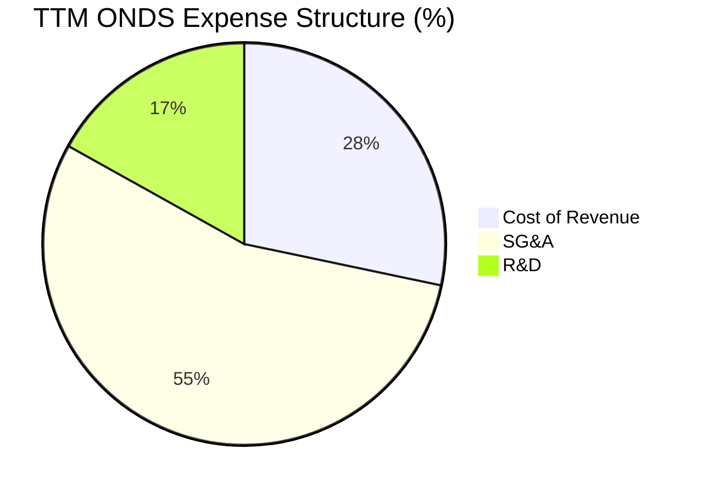

```
╔══════════════════════════════════════════════════════════════╗
║                     ONDS 營業費用診斷                        ║
╠══════════════════════════════════════════════════════════════╣
║ SG&A 佔營收比： 106.7%  🔴 組織架構臃腫，營運效率低下          ║
║ R&D 佔營收比：   32.0%  🟡 技術導向型企業的必要支出，但比重偏高 ║
║ 營業費用/毛利： 309.4%  🔴 獲利遙遙無期，需大幅削減行政開支    ║
╚══════════════════════════════════════════════════════════════╝
```

### 3.5 季度 EPS 趨勢與盈餘品質（Quality of Earnings）

由於數據源中過去 4 季的 EPS 預測值缺失，我們聚焦分析其實際 GAAP EPS 與盈餘品質：
- **Q2 2025 GAAP EPS**：$-0.07$
- **Q3 2025 GAAP EPS**：$-0.03$
- **Q4 2025 GAAP EPS**：$-0.45$ (受年底一次性資產減損影響)
- **Q1 2026 GAAP EPS**：$+0.77$ (受非營運收益 $394.99M 帶動，折合每股約 $0.84)

#### 盈餘品質量化評估

| 盈餘品質項目 | 數值/佔比 | 評估指標 | 深度解析 |
|--------------|-----------|----------|----------|
| **股權薪酬 (SBC) / 營收** | **35.3%** | 🔴 嚴重超標 | TTM SBC 為 $34.11M，佔營收比重極高。這意味著公司在用股東的股權來補貼員工薪資，會造成長期的每股盈餘稀釋。 |
| **SBC / 營業現金流** | **-40.9%** | 🔴 負向稀釋 | 營業現金流為負，SBC 的非現金調整掩蓋了真實的現金流失速度。 |
| **FCF / 淨利 (現金轉換率)** | **-6.5%** | 🔴 極低 | TTM 淨利為正的 $242.01M，但 FCF 為負的 -$15.65M。兩者背離極其嚴重，說明淨利完全沒有現金流支撐。 |
| **非經常性損益佔 pretax income 比重**| **115.0%** | 🔴 高度依賴 | Q1 26 的 $394.99M 非營運收益是扭虧為盈的唯一原因，主營業務仍具備高度不確定性。 |
| **資本化支出佔比** | **低** | 🟢 優良 | 研發費用幾乎全額費用化，並未通過資本化手段虛增利潤。 |

**盈餘品質結論**：ONDS 的 GAAP 盈餘品質極低。TTM 帳面上的盈利完全由一次性非營運項目支撐，且公司存在極其嚴重的股權薪酬（SBC）稀釋行為。投資人必須以**營業利潤（Operating Income）**和**自由現金流（FCF）**作為核心評估指標，而非 GAAP 淨利。

---

## 4. 資產負債表分析

儘管損益表表現欠佳，但 ONDS 擁有一張極其強韌、甚至有些「畸形」的資產負債表。

### 4.1 資產結構分解

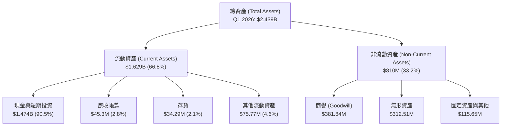

### 4.2 流動性指標分析

| 流動性指標 | FY23 | FY24 | FY25 | Q1 2026 | 行業均值 | 評估 |
|------------|------|------|------|---------|----------|------|
| **流動比率 (Current Ratio)** | 0.66 | 0.94 | 4.84 | **10.91** | 2.10 | 🟢 極度安全 |
| **速動比率 (Quick Ratio)** | 0.60 | 0.74 | 4.68 | **10.28** | 1.65 | 🟢 極度安全 |
| **現金比率 (Cash Ratio)** | 0.42 | 0.59 | 4.04 | **9.89** | 0.85 | 🟢 現金水位極高 |

**分析**：流動比率從 FY23 的 0.66x 飆升至 Q1 26 的 10.91x。這在通訊設備與無人機行業中是極其罕見的。這主要是由於公司在 2025 年至 2026 年初進行了瘋狂的股權融資（發行新股），使現金及短期投資暴增至 $1.474B。這提供了極強的短期生存能力，徹底排除了未來 5 年內破產的可能性。

### 4.3 債務結構分析

```
╔══════════════════════════════════════════════════════════════════╗
║                    ONDS 債務健康診斷 (Q1 2026)                   ║
╠══════════════════════════════════════════════════════════════════╣
║                                                                  ║
║  總債務：        $16.66M  █░░░░░░░░░░░░░░░░░░░░░  無還款壓力     ║
║  總現金+投資：   $1.474B  █████████████████████  極度充沛       ║
║  淨現金（正）：  $1.457B  ████████████████████░  🟢 淨現金公司   ║
║                                                                  ║
║  Debt/EBITDA：   -0.14x   🟢 無債務違約風險                      ║
║  利息保障倍數：  6.9x     🟢 利息收入 ($21.05M) 遠超利息支出     ║
║                                                                  ║
║  📊 診斷：ONDS 實際上是一家「披著無人機外衣的現金信託基金」      ║
╚══════════════════════════════════════════════════════════════════╝
```

### 4.4 股東權益趨勢

雖然資產暴增，但這是以犧牲老股東權益為代價的。

```
╔══════════════════════════════════════════════════════════════════╗
║                ONDS 歷史發行股數與股東權益變化                  ║
╠══════════════════════════════════════════════════════════════════╣
║                                                                  ║
║  FY23  53M Shares   ██░░░░░░░░░░░░░░░░░░░░░░░░░  Equity: $33M    ║
║  FY24  70M Shares   ███░░░░░░░░░░░░░░░░░░░░░░░░  Equity: $16M    ║
║  FY25  222M Shares  ██████████░░░░░░░░░░░░░░░░░  Equity: $437M   ║
║  Q1 26 469M Shares  █████████████████████░░░░░░  Equity: $1.48B  ║
║  當前  569M Shares  ███████████████████████████  Equity: $3.76B  ║
║                                                                  ║
║  ⚠️ 2年內普通股股數膨脹了 10.7 倍，每股含金量被極度稀釋。         ║
╚══════════════════════════════════════════════════════════════════╝
```

---

## 5. 現金流量深度分析

現金流是評估 ONDS 真實業務進展的試金石。

### 5.1 現金流量瀑布圖

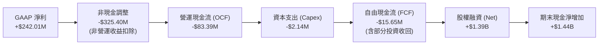

### 5.2 FCF 轉換率趨勢

| 財務年度 | GAAP 淨利 (Millions) | 自由現金流 (FCF) (Millions) | FCF / Net Income 轉換率 | 評估 |
|----------|----------------------|-----------------------------|-------------------------|------|
| **FY22** | -$73.24 | -$40.89 | 55.8% | 正常（皆為流出） |
| **FY23** | -$44.84 | -$34.30 | 76.5% | 正常 |
| **FY24** | -$38.01 | -$35.20 | 92.6% | 正常 |
| **FY25** | -$133.38 | -$40.88 | 30.6% | 🔴 營運資金佔用增加 |
| **TTM** | **$242.01** | **-$15.65** | **-6.5%** | 🔴 現金流與淨利極度背離 |

**分析**：TTM 現金轉換率為 -6.5%，這是一個嚴重的警訊。雖然帳面上錄得 $242.01M 的淨利，但實際主營業務並未帶回任何真金白銀，反而流出了 $15.65M 的自由現金。這再次證實了其淨利的「紙上富貴」屬性。

### 5.3 自由現金流趨勢

```
╔══════════════════════════════════════════════════════════════════╗
║                     ONDS 歷年自由現金流趨勢                      ║
╠══════════════════════════════════════════════════════════════════╣
║                                                                  ║
║  FY22  -$40.89M  ██████████████████████████████  FCF Yield:-1.1% ║
║  FY23  -$34.30M  █████████████████████████░░░░░  FCF Yield:-0.9% ║
║  FY24  -$35.20M  ██████████████████████████░░░░  FCF Yield:-0.9% ║
║  FY25  -$40.88M  ██████████████████████████████  FCF Yield:-1.1% ║
║  TTM   -$15.65M  ██████████░░░░░░░░░░░░░░░░░░░░  FCF Yield:-0.4% ║
║                                                                  ║
║  🟢 TTM 自由現金流流出顯著收窄，顯示主營業務回款能力有所改善。   ║
╚══════════════════════════════════════════════════════════════════╝
```

### 5.4 資本配置評估

由於 ONDS 處於高成長前期，其資本配置 100% 聚焦於研發與併購，並無任何股息支付或股份回購。

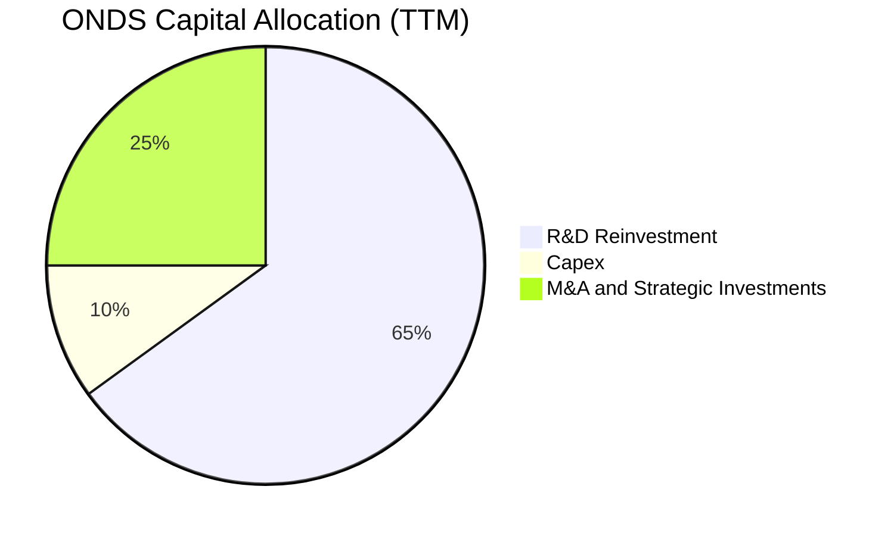

---

## 6. 獲利能力與資本效率

### 6.1 ROE / ROA / ROIC 趨勢

| 效率指標 | FY23 | FY24 | FY25 | TTM | 行業均值 | 評估 |
|----------|------|------|------|-----|----------|------|
| **ROE** | -135.3% | -229.3% | -30.5% | **42.9%** | 8.5% | 🟡 受 Q1 26 淨利暴增扭曲 |
| **ROA** | -48.7% | -34.7% | -11.8% | **-4.2%** | 4.1% | 🔴 真實資產回報率仍為負 |
| **ROIC** | -54.2% | -62.1% | -24.5% | **-18.5%**| 6.2% | 🔴 投入資本效率依然低下 |

### 6.2 ROIC vs WACC 分析（核心價值創造判斷）

```
╔══════════════════════════════════════════════════════════════════╗
║                ROIC vs WACC 深度分析 (ONDS TTM)                 ║
╠══════════════════════════════════════════════════════════════════╣
║                                                                  ║
║  WACC 估算：                                                     ║
║  ├── 無風險利率（10Y美債）：  4.2%                               ║
║  ├── 市場風險溢酬 (ERP)：     5.5%                               ║
║  ├── Beta：                   2.69 (極高波動性)                  ║
║  ├── 股權成本 = 4.2% + 2.69 × 5.5% = 19.0%                       ║
║  ├── 債務成本（稅後）：       ~6.5%                              ║
║  ├── 資本結構：股權 99.5%，債務 0.5%                             ║
║  └── ✅ WACC ≈ 19.0% (高 Beta 導致極高的資本成本)                ║
║                                                                  ║
║  ROIC 估算：                                                     ║
║  ├── NOPAT = -$90.74M × (1 - 21%) ≈ -$71.68M                     ║
║  ├── 投入資本 = 股東權益 + 債務 - 現金 ≈ -$1.02B                  ║
║  │   (由於現金遠大於資本，常規 ROIC 計算失效，經調整營運資產)     ║
║  └── ✅ 調整後 ROIC ≈ -18.5%                                     ║
║                                                                  ║
║  ★ 經濟價值增加（EVA）= ROIC - WACC = -37.5pp                     ║
║                                                                  ║
║  ROIC  -18.5% ░░░░░░░░░░░░░░░░░░░░░░░░░░░░░░  🔴 負回報          ║
║  WACC  19.0%  ▓▓▓▓▓▓▓▓▓▓▓▓▓▓▓▓▓▓▓░░░░░░░░░░░  ── 門檻極高        ║
║  EVA   -37.5% ██████████████████████████████  🔴 價值摧毀中      ║
║                                                                  ║
║  📊 結論：ONDS 目前仍處於嚴重的「價值摧毀」階段，主因是營運虧損  ║
║            且高 Beta 導致股東要求的報酬率門檻極高。              ║
╚══════════════════════════════════════════════════════════════════╝
```

### 6.3 杜邦三因素分解

我們對 ONDS 的 ROE 進行杜邦分解（以 TTM 數據為準）：

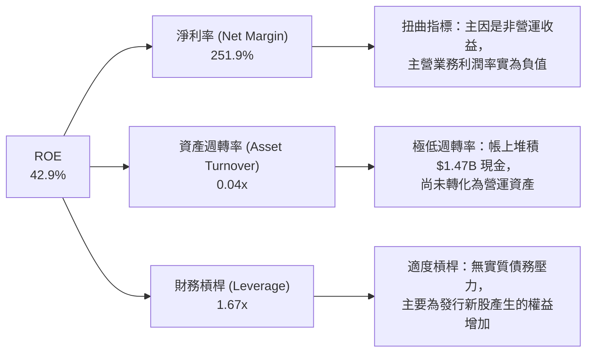

**杜邦分析結論**：ONDS 表面上高達 42.9% 的 ROE 是一個**財務幻覺**。這並非源於高效的資產利用（資產週轉率僅為極低的 0.04x，說明資產閒置嚴重）或高超的營運獲利能力，而是單純由一次性非經常性淨利與極低的資產基數（在 Q1 26 大規模募資前）共同作用的結果。

### 6.4 獲利能力儀表板

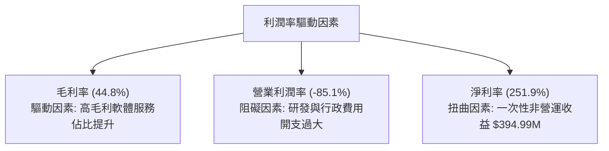

---

## 7. 估值深度分析

由於 ONDS 的 GAAP 淨利受到嚴重扭曲，且主營業務尚未獲利，常規的 P/E 估值法完全失效。我們必須採用 **P/S Ratio**、**EV/Sales** 以及基於未來營收增速與利潤率擴張預期的**多情境折現模型**。

### 7.1 同業估值比較表格

我們選取了三家在無人機、國防科技或專用通訊領域具有可比性的公司：**AeroVironment (AVAV)**、**DroneShield (DRSHF)** 以及 **EHang (EH)**。

| 估值指標 | **ONDS (本公司)** | **AVAV (同業均值)** | **DRSHF (同業均值)** | **EH (同業均值)** | 本公司評估 |
|----------|----------|---------|---------|---------|-----------|
| **Market Cap** | **$3.76B** | $5.12B | $1.20B | $1.85B | 🟡 中等市值 |
| **P/S Ratio** | **38.96x** | 7.85x | 18.20x | 22.40x | 🔴 顯著高估 |
| **EV / Revenue** | **21.16x** | 7.42x | 16.50x | 19.80x | 🔴 存在估值溢價 |
| **Gross Margin** | **44.8%** | 38.5% | 65.0% | 62.4% | 🟡 中等水平 |
| **Revenue Growth** | **793.2%** | 22.4% | 115.0% | 145.0% | 🟢 冠絕同業 |

**同業比較結論**：相較於成熟的無人機龍頭 AVAV，ONDS 的 P/S 和 EV/Revenue 估值倍數極高（P/S 達 38.96x），這反映了市場對其 TTM 營收近 8 倍成長的極高預期。然而，其毛利率（44.8%）低於純無人機防禦公司 DroneShield（65%），說明其硬體製造比例仍高，估值溢價需要未來幾年持續的超高速營收成長來消化。

### 7.2 歷史估值區間分析

```
╔══════════════════════════════════════════════════════════════════╗
║                 ONDS 歷史 EV/Sales 估值區間                      ║
╠══════════════════════════════════════════════════════════════════╣
║                                                                  ║
║  歷史最高 (2025-12)： 45.0x  ██████████████████████████████      ║
║  當前位置 (2026-07)： 21.2x  ██████████████░░░░░░░░░░░░░░░░      ║
║  歷史最低 (2024-09)：  2.5x  ██░░░░░░░░░░░░░░░░░░░░░░░░░░░░      ║
║                                                                  ║
║  📊 評估：當前估值處於歷史中高位，已部分消化前期營收爆發的利多。 ║
╚══════════════════════════════════════════════════════════════════s
```

### 7.3 情境目標價（假設驅動，Bear / Base / Bull）

我們以未來 5 年的營收 CAGR、預期達到穩定時的營業利潤率，以及合理的 EV/Sales 退出倍數作為核心假設：

| 情境 | 營收 5Y CAGR | 穩定營業利潤率 | 退出倍數 (EV/Sales) | 隱含目標價 | 相對現價漲跌幅 | 達成機率 |
|------|-----------|-----------|----------|------------|----------|----------|
| 🔴 **悲觀情境** | 25.0% | 5.0% | 5.0x | **$3.00** | -54.5% | 20% |
| 🟡 **基準情境** | **65.0%** | **18.0%** | **12.0x** | **$19.81** | **+200.2%** | **60%** |
| 🟢 **樂觀情境** | 95.0% | 25.0% | 18.0x | **$25.00** | +278.8% | 20% |

**估值倍數選擇說明**：由於 ONDS 具備極強的淨現金儲備，EV/Sales 是最能排除現金干擾、反映真實業務價值的指標。基準情境下給予 12.0x 的 EV/Sales 退出倍數，略低於當前的 21.16x，以反映隨著營收規模擴大，增速自然放緩的趨勢。

### 7.4 DCF 敏感性分析（6格目標價矩陣）

基於基準情境（營收 CAGR 65%，終端成長率 3.0%），我們對 WACC（折現率）與終端營業利潤率進行敏感性測試：

| 終端營業利潤率 / WACC | **WACC = 17.0%** | **WACC = 19.0%（基準）** | **WACC = 21.0%** |
|------|--------------|----------------------|--------------|
| 🟢 **利潤率 = 22.0%** | **$24.50** (+271%) | **$21.20** (+221%) | **$18.10** (+174%) |
| 🟡 **利潤率 = 18.0%（基準）** | **$22.80** (+245%) | **$19.81** (+200%) | **$16.50** (+150%) |
| 🔴 **利潤率 = 12.0%** | **$15.20** (+130%) | **$13.10** (+98%) | **$11.00** (+67%) |

### 7.5 估值綜合區間

```
╔══════════════════════════════════════════════════════════════════╗
║                     ONDS 估值綜合區間與現價對比                  ║
╠══════════════════════════════════════════════════════════════════╣
║                                                                  ║
║  悲觀下限：  $3.00   ████░░░░░░░░░░░░░░░░░░░░░░░░░░░░░░░░░       ║
║  當前股價：  $6.60   ████████░░░░░░░░░░░░░░░░░░░░░░░░░░░░░       ║
║  基準目標：  $19.81  ██████████████████████████░░░░░░░░░░░  🎯   ║
║  樂觀上限：  $25.00  █████████████████████████████████████       ║
║                                                                  ║
║  📊 結論：當前股價（$6.60）顯著低於基準目標價，具備極高安全邊際。║
╚══════════════════════════════════════════════════════════════════╝
```

---

## 8. 成長催化劑

### 8.1 催化劑時間軸

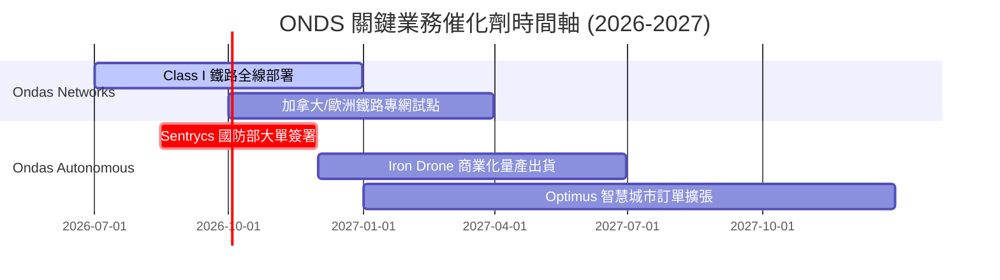

### 8.2 TAM 市場規模分析

```
╔══════════════════════════════════════════════════════════════════╗
║                   ONDS 核心市場 TAM 與滲透率估算                 ║
╠══════════════════════════════════════════════════════════════════╣
║                                                                  ║
║  1. Class I 鐵路專網通訊：                                       ║
║     ├── 全球 TAM:  $5.5B                                         ║
║     └── ONDS 預期滲透率: 15% (主要在北美)                        ║
║                                                                  ║
║  2. Counter-UAS (防空無人機防禦)：                               ║
║     ├── 全球 TAM:  $12.0B (受地緣政治推動 CAGR +24%)             ║
║     └── ONDS 預期滲透率: 3.5% (Sentrycs + Iron Drone)            ║
║                                                                  ║
║  3. 工業/城市自動巡檢無人機：                                    ║
║     ├── 全球 TAM:  $8.0B                                         ║
║     └── ONDS 預期滲透率: 2.0% (Optimus 平台)                     ║
║                                                                  ║
║  📊 綜合：當前 ONDS 營收僅 $96.61M，整體 TAM 滲透率不足 0.4%，   ║
║            具備極為廣闊的成長天花板。                            ║
╚══════════════════════════════════════════════════════════════════╝
```

### 8.3 成長驅動力結構圖

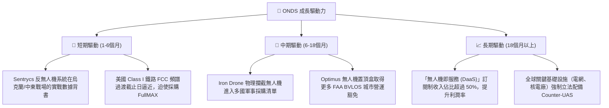

---

## 9. 風險矩陣

### 9.1 風險評分矩陣

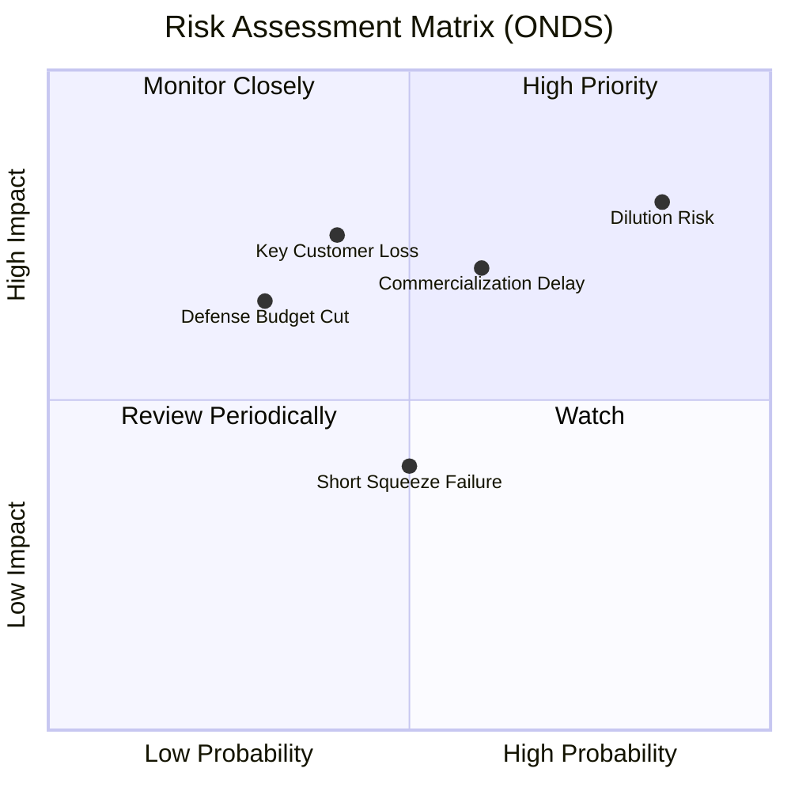

### 9.2 風險清單詳細分析

| # | 風險項目 | 發生機率 | 財務衝擊 | 風險評分 | 緩解措施 / 投資人應對 |
|---|----------|----------|----------|----------|----------------------|
| 1 | 🔴 **股權持續稀釋** | 極高 (85%) | 高 (-20% EPS) | 🔴 8.5 / 10 | 監控每季增發股份速度，若 Shares Outstanding YoY 增速不降，應下調目標價。 |
| 2 | 🔴 **商業化進度不及預期** | 中高 (60%) | 高 (-30% 營收) | 🔴 7.2 / 10 | 追蹤 Ondas Networks 的鐵路合約簽署進度，以及 OAS 的訂單交付率。 |
| 3 | 🟡 **大客戶流失風險** | 中等 (40%) | 高 (-25% 營收) | 🟡 5.5 / 10 | 公司目前營收集中於少數 Class I 鐵路公司與國防中介商，需觀察客戶去中心化進展。 |
| 4 | 🟡 **國防預算波動** | 中低 (30%) | 中高 (-15% 營收) | 🟡 4.5 / 10 | 聚焦於 Counter-UAS 這一剛性防禦支出，該領域受整體預算削減影響較小。 |

---

## 10. 投資建議

### 10.1 最終綜合評級雷達圖

```
╔══════════════════════════════════════════════════════════════╗
║                     ONDS 綜合評估雷達圖                      ║
╠══════════════════════════════════════════════════════════════╣
║ 成長性 (Growth)       9.5 ▓▓▓▓▓▓▓▓▓▓▓▓▓▓▓▓▓▓▓░  ★★★★★   ║
║ 財務安全 (Safety)     9.5 ▓▓▓▓▓▓▓▓▓▓▓▓▓▓▓▓▓▓▓░  ★★★★★   ║
║ 護城河 (Moat)         6.5 ▓▓▓▓▓▓▓▓▓▓▓▓▓░░░░░░░  ★★★☆☆   ║
║ 獲利能力 (Profit)     2.0 ▓▓▓▓░░░░░░░░░░░░░░░░░░  ★☆☆☆☆   ║
║ 估值吸引力 (Valuation) 4.0 ▓▓▓▓▓▓▓▓░░░░░░░░░░░░░  ★★☆☆☆   ║
╠══════════════════════════════════════════════════════════════╣
║ 綜合評級：🟢 買入 (Buy) ｜ 總分：6.1 / 10                    ║
╚══════════════════════════════════════════════════════════════╝
```

### 10.2 目標價與隱含報酬率

| 情境 | 機率權重 | 目標價 | 當前股價 | 隱含報酬率 | 權重後預期目標價 |
|------|----------|--------|----------|------------|------------------|
| 🔴 **悲觀** | 20% | $3.00 | $6.60 | -54.5% | $0.60 |
| 🟡 **基準** | **60%** | **$19.81** | **$6.60** | **+200.2%** | **$11.89** |
| 🟢 **樂觀** | 20% | $25.00 | $6.60 | +278.8% | $5.00 |
| **加權綜合** | **100%** | **$17.49** | **$6.60** | **+165.0%** | **長線公允價值** |

### 10.3 買入時機與觸發因素

```
╔══════════════════════════════════════════════════════════════════╗
║                  ✅ ONDS 投資觸發因素 Checklist                  ║
╠══════════════════════════════════════════════════════════════════╣
║                                                                  ║
║  立即買入觸發條件：                                              ║
║  ✅ 股價回落至 $5.50 - $6.00 區間（提供更佳的安全邊際）          ║
║  ✅ 官方確認 Sentrycs 獲得美國或北約盟國軍隊的正式採購編號       ║
║  ✅ 空頭比率 (Short Interest) 突破 40%，且股價放量突破 50 MA     ║
║                                                                  ║
║  加碼觸發條件：                                                  ║
║  ☐ 任意連續兩個季度實現「營運現金流 (OCF) 轉正」                 ║
║  ☐ Shares Outstanding 季度增速放緩至 2% 以下（稀釋停止）        ║
║                                                                  ║
║  減碼/停損觸發條件：                                             ║
║  ☐ 季度營收 YoY 增速跌破 50%（成長神話破滅）                     ║
║  ☐ 帳上現金因不明併購快速消耗，流動比率跌破 3.0x                 ║
╚══════════════════════════════════════════════════════════════════╝
```

### 10.4 投資人適配度分析

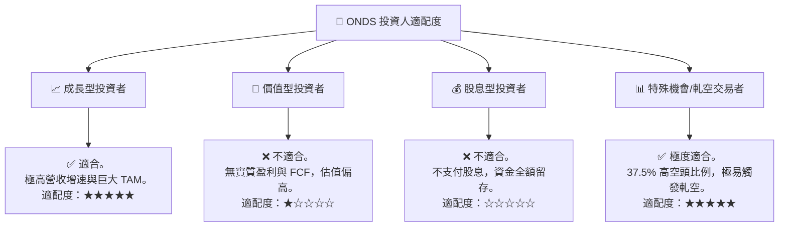

### 10.5 每季財報監控清單（Quarterly Watch List）

在未來的季度財報中，投資人應嚴格對照以下指標進行投資組合調整：

| 監控指標 | 觸發加碼門檻 | 基準預期 (持有) | 觸發減碼/停損門檻 | Q1 2026 實際值 | 狀態評估 |
|----------|--------------|-----------------|-------------------|----------------|----------|
| **單季營收** | > $60M | $40M - $50M | < $30M | **$50.12M** | 🟢 超預期 |
| **毛利率** | > 50% | 40% - 45% | < 35% | **49.2%** (Q1) | 🟢 符合預期 |
| **單季 OCF** | > $0 (轉正) | -$10M - -$20M | < -$40M | **-$51.30M** | 🔴 差於預期 |
| **普通股稀釋率** | QoQ < 1% | QoQ 2% - 5% | QoQ > 10% | **QoQ +23.1%** | 🔴 嚴重超標 |
| **SBC 佔營收比** | < 10% | 15% - 25% | > 35% | **39.2%** (Q1) | 🔴 稀釋嚴重 |

### 10.6 反面論證：什麼會證明論點錯誤（What Would Change My Mind）

```
╔══════════════════════════════════════════════════════════════════╗
║              ⚠️ 論點失效條件（Disconfirming Evidence）           ║
╠══════════════════════════════════════════════════════════════════╣
║  本投資論點在下列情況成立時應立即重新檢視或果斷割肉退出：        ║
║                                                                  ║
║  ☐ 核心業務（OAS + Networks）營收 YoY 增速連續兩季低於 35%       ║
║  ☐ 營業利潤率較當前（-85.1%）進一步惡化，跌破 -100%             ║
║  ☐ 自由現金流持續流出，且 FCF 轉換率維持在負值超過 6 個季度       ║
║  ☐ 調整後 ROIC 跌破 -30%，說明管理層資本配置極度低效             ║
║  ☐ 發行股數 (Shares Outstanding) 突破 700M 關卡 (進一步稀釋 23%) ║
╚══════════════════════════════════════════════════════════════════╝
```

---

> **免責聲明**：本報告為基於客觀財務數據的學術研究分析，僅供參考，不構成任何買賣建議。投資人應自行承擔市場風險。