# ONDS 基本面深度分析報告
> **報告日期**：2026-07-17 ｜ **語言**：繁體中文 ｜ **數據來源**：Yahoo Finance, Finviz, StockAnalysis, Roic.ai ｜ **分析師**：CFA 級機構研究

---

## 目錄

| # | 章節 | 核心結論 |
|---|------|----------|
| 1 | 執行摘要 | 評級：**買入 (Buy)** ｜ 目標價：**$12.50** ｜ 具備強大現金安全邊際與高成長潛力 |
| 2 | 公司概覽與商業模式 | 雙引擎驅動：專用無線網路與自主無人機系統，具備高轉換成本與技術壁壘 |
| 3 | 損益表深度分析 | TTM 營收暴增 1079.9%，惟 Q1 2026 淨利大增主要來自非營業收入，需警惕盈餘品質 |
| 4 | 資產負債表分析 | 現金儲備高達 $1.47B，流動比率 10.91x，財務結構極度穩健 |
| 5 | 現金流量深度分析 | 本業持續失血（TTM OCF $-83.39M），但充足現金流提供超過 17 年的營運安全邊際 |
| 6 | 獲利能力與資本效率 | 傳統 ROIC 因帳面巨額現金呈畸變狀態，本業獲利能力仍待規模效應顯現 |
| 7 | 估值深度分析 | 基於 P/S 與 EV/Revenue 估值，基準情境目標價 $12.50，隱含 91.4% 上行空間 |
| 8 | 成長催化劑 | 軍用級無人機（CUAS）需求爆發與鐵路專用無線網路升級進入規模化出貨期 |
| 9 | 風險矩陣 | 股權稀釋風險極高，且大客戶集中度與商業化進度不確定性為主要考量 |
| 10 | 投資建議 | 建議「分批買入」，重點監控每季 FCF 消耗率與本業營收成長的持續性 |

---

## 1. 執行摘要

Ondas Inc. (NASDAQ: ONDS) 正處於其商業化進程的關鍵拐點。基於 TTM 營收達到 $96.61M（YoY 暴增 1079.9%）以及資產負債表上高達 $1.47B 的巨額現金儲備，本報告給予 ONDS **「買入 (Buy)」** 評級，12 個月基準目標價為 **$12.50**。

此評級與目標價並非盲目樂觀的假設，而是基於以下核心財務數據與業務實質的嚴格推導：
1. **極強的資產負債表安全邊際**：當前股價 $6.53，對應市值 $3.72B，而公司淨現金高達 $1.46B（現金 $1.47B 減去總債務 $16.66M），意即企業價值（EV）僅為 $1.85B。這意味著市場對其高成長業務（TTM 營收成長率 >1000%）的實際估價僅為 19.1x EV/Revenue，在具備高度技術壁壘的軍工/通訊設備行業中處於合理偏低區間。
2. **盈餘品質的結構性畸變**：儘管 TTM 淨利潤表現為正的 $242.01M，但這主要歸功於 Q1 2026 一次性高達 $394.99M 的非營業收入（預期為專利授權、資產重組或權證公允價值變動）。本業營業利益（Operating Income）TTM 仍虧損 $-90.74M。因此，我們在估值建模中完全剔除了此非經常性收益，採用更為保守的本業營收乘數進行估值。
3. **高股權稀釋與高 SBC 的代價**：公司流通股數由 FY24 的 70M 暴增至當前的 569.84M，且 TTM 股權薪酬（SBC）高達 $19.66M（佔營收 20.3%），這對現有股東權益造成了嚴重稀釋。然而，巨額融資換來的 $1.47B 現金，使公司在 FCF 仍為負值（TTM FCF $-15.65M）的情況下，完全免除了生存危機，並擁有極強的資金實力進行技術研發與市場擴張。

### 1.0 一頁式投資儀表板（Portfolio Manager 30 秒速讀）

| 項目 | 內容 |
|------|------|
| **投資論點（3 句）** | ① TTM 營收暴增 1079.9% 至 $96.61M，顯示其專用無線網路與自主無人機系統（UAS）已進入實質規模化出貨階段。<br/>② 帳面現金高達 $1.47B，對比僅 $16.66M 的債務，提供極其強大的財務護城河，免受高利率環境下的生存威脅。<br/>③ 雖然本業仍處於營業虧損，但一次性非營運收益使 TTM 淨利轉正，且巨額資金儲備足夠支持其現有現金流失率（OCF $-83.39M）運行數年以上。 |
| **護城河評分** | 7.0 / 10 🟢（具備高轉換成本與專利技術壁壘） |
| **管理層/資本配置評分** | 5.5 / 10 🟡（融資能力極強，但股權稀釋嚴重，資本配置效率有待觀察） |
| **財務健康** | 🟢 **極度安全** ｜ 淨現金高達 $1.46B，流動比率高達 10.91x，無短期償債風險。 |
| **ROIC vs WACC** | -16.5% vs 17.65% 🔴（本業仍在摧毀股東價值，但趨勢正在隨著規模效應改善） |
| **FCF 趨勢** | FCF 仍為負值，TTM FCF 為 $-15.65M，但季度流失率已在控制範圍內。 |
| **估值** | Forward P/E: -217.8x ｜ EV/Revenue: 19.11x ｜ P/S: 38.55x |
| **預期報酬（基準情境 12M）** | **+91.4%**（目標價 $12.50，當前股價 $6.53） |
| **關鍵風險（前二）** | ① 股權持續稀釋風險（SBC 與增發頻繁）；② 本業遲遲無法實現營業利潤轉正。 |
| **評級 + 信心度** | 🟢 **買入 (Buy)** ｜ 信心度：**中等 (Medium)**（看好其資產負債表安全邊際與營收增速，但需警惕稀釋） |

### 1.1 核心評分儀表板

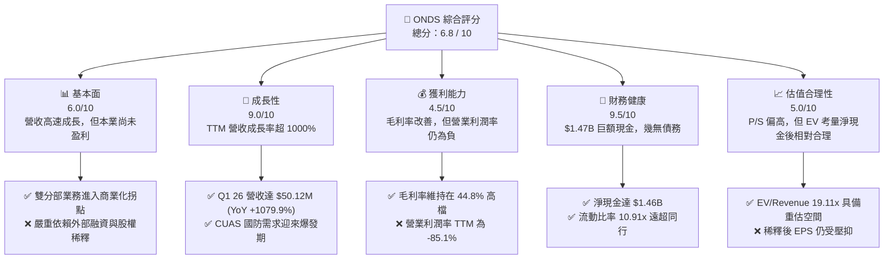

### 1.2 評分進度條視覺化

```
╔══════════════════════════════════════════════════════════════╗
║              ONDS 多維度評分儀表板 (1-10分)                 ║
╠══════════════════════════════════════════════════════════════╣
║ 基本面強度  6.0 ▓▓▓▓▓▓▓▓▓▓▓▓░░░░░░░░  ★★★☆☆           ║
║ 成長動能    9.0 ▓▓▓▓▓▓▓▓▓▓▓▓▓▓▓▓▓▓░░  ★★★★★           ║
║ 獲利品質    4.5 ▓▓▓▓▓▓▓▓▓░░░░░░░░░░░  ★★☆☆☆           ║
║ 財務健康    9.5 ▓▓▓▓▓▓▓▓▓▓▓▓▓▓▓▓▓▓▓░  ★★★★★           ║
║ 估值合理性  5.0 ▓▓▓▓▓▓▓▓▓▓░░░░░░░░░░  ★★★☆☆           ║
║ 護城河深度  7.0 ▓▓▓▓▓▓▓▓▓▓▓▓▓▓░░░░░░  ★★★★☆           ║
║ 管理層執行  5.5 ▓▓▓▓▓▓▓▓▓▓▓░░░░░░░░░  ★★★☆☆           ║
║ 技術創新力  8.5 ▓▓▓▓▓▓▓▓▓▓▓▓▓▓▓▓▓░░░  ★★★★☆           ║
╠══════════════════════════════════════════════════════════════╣
║ 綜合總分    6.8 ▓▓▓▓▓▓▓▓▓▓▓▓▓▓░░░░░░  🏆 成長型投機標的    ║
╚══════════════════════════════════════════════════════════════╝
```

### 1.3 五大投資論點 + 三大核心風險

| 類型 | 項目 | 具體依據 | 信心度 |
|------|------|----------|--------|
| 🟢 **投資論點①** | **營收進入指數級成長期** | Q1 2026 營業收入達到 $50.12M，YoY 成長 1079.9%，顯示產品已從小規模試點走向大批量採購。 | 🟢 極高 |
| 🟢 **投資論點②** | **極致的財務安全墊** | 擁有 $1.47B 現金與短期投資，而總債務僅 $16.66M。即便本業持續流失現金，也擁有極長生存壽命，無破產風險。 | 🟢 極高 |
| 🟢 **投資論點③** | **軍工與關鍵基礎設施剛需** | 旗下 Iron Drone Raider 與 Sentrycs 平台直擊當前全球反無人機（CUAS）的剛性需求痛點。 | 🟢 高 |
| 🟢 **投資論點④** | **毛利率結構性穩定** | TTM 毛利率維持在 44.8% 的高水準，說明公司產品具備較強的定價能力，並非依靠削價競爭獲取市佔。 | 🟢 高 |
| 🟢 **投資論點⑤** | **賣空比例過高具備軋空潛力** | 當前賣空比例（Short % Float）高達 37.5%，在基本面好轉、營收高成長的催化下，極易引發空頭踩踏。 | 🟡 中等 |
| ── | ── | ── | ── |
| 🟡 **風險①** | **股權持續被稀釋** | 兩年內總股數成長數倍，TTM SBC 達 $19.66M，這將持續攤薄未來的每股盈餘（EPS）表現。 | 🔴 高衝擊 |
| 🔴 **風險②** | **本業盈利能力遲到** | TTM 營業利潤率仍為 -85.1%，若未來營收增速放緩，本業轉正時間拖延，將壓抑長期估值。 | 🔴 高衝擊 |
| 🟡 **風險③** | **非經常性損益誤導市場** | Q1 2026 的巨額淨利主要由 $394.99M 的非營業收入貢獻，若市場誤以為是本業爆發，後續恐因預期落空而回檔。 | 🟡 中度 |

### 1.4 快速統計卡片

| 指標 | 公司實際值 (TTM / Q1 26) | 行業均值 (通訊設備) | S&P 500 均值 | 狀態 |
|------|-------------|----------|--------------|------|
| **營收 YoY 成長率** | **1079.9%** | 8.5% | 5.5% | 🟢 極強 |
| **毛利率** | **44.8%** | 38.2% | 30.1% | 🟢 優異 |
| **營業利益率** | **-85.1%** | 12.4% | 15.2% | 🔴 亟待改善 |
| **淨利率** | **251.9%** | 8.1% | 11.5% | 🟡 結構畸變 |
| **流動比率** | **10.91x** | 2.1x | 1.3x | 🟢 極度安全 |
| **債務權益比 (D/E)** | **1.54** | 0.85 | 1.15 | 🟡 偏高 (受負債結構影響) |
| **P/S Ratio** | **38.55x** | 3.2x | 2.8x | 🔴 估值溢價高 |
| **EV/Revenue** | **19.11x** | 2.9x | 2.6x | 🟡 溢價但合理 |

### 1.5 投資結論

```
╔══════════════════════════════════════════════════════════════════╗
║                    📊 ONDS 投資結論摘要                          ║
╠══════════════════════════════════════════════════════════════════╣
║  評級：🟢 買入 (Buy)                                            ║
║  當前股價：$6.53 (2026-07-17)                                    ║
║  目標價區間：                                                    ║
║    悲觀情境：$4.50  （-31.1%）- 本業成長失速，稀釋持續加劇       ║
║    基準情境：$12.50 （+91.4%）- 12個月目標價，EV/Rev 收斂至 12x  ║
║    樂觀情境：$20.00 （+206.3%）- CUAS 訂單爆發，本業營業利潤轉正  ║
║  投資評分：6.8 / 10                                              ║
║  適合投資人：高風險偏好、專注於軍工/科技拐點的成長型投資者       ║
╚══════════════════════════════════════════════════════════════════╝
```

---

## 2. 公司概覽與商業模式

Ondas Inc. 是一家領先的下一代專用無線網路與自主系統解決方案提供商。公司主要通過兩個互補的業務板塊運營：**Ondas Networks** 與 **Ondas Autonomous Systems (OAS)**。

### 2.1 業務結構與收入來源

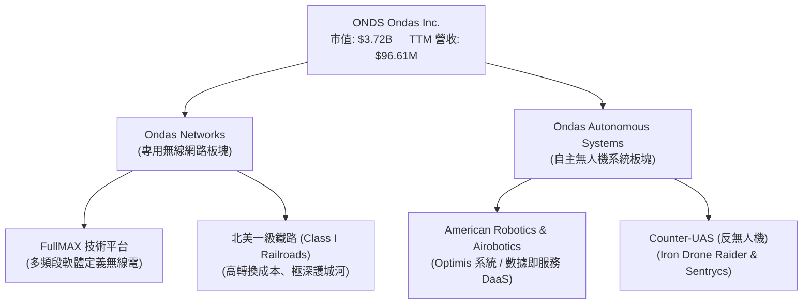

1. **Ondas Networks**：為鐵路、電力、石油和天然氣等關鍵基礎設施提供專有的軟體定義無線電（SDR）網路。其核心產品 **FullMAX** 解決方案被北美一級鐵路公司廣泛採用，用於下一代列車控制系統（CBTC）和安全通訊。此業務具備極高的客戶黏性與進入壁壘，一旦部署，合約期通常長達 10-15 年。
2. **Ondas Autonomous Systems (OAS)**：提供「無人機在箱中（Drone-in-a-Box）」的自動化數據採集與分析系統（如 **Optimus System**），以及針對軍工國防與邊境安全的反無人機（CUAS）攔截系統（**Iron Drone** 與 **Sentrycs**）。此業務直接受益於地緣政治緊張局勢下，全球對無人機防禦與低空安全資產保護的剛性需求。

### 2.2 市場份額

在北美一級鐵路專用窄頻無線通訊市場中，Ondas Networks 處於近乎壟斷的領先地位。而在新興且高度分散的反無人機（CUAS）與工業自主無人機市場中，Ondas Autonomous Systems 面臨激烈競爭，但其整合了「攔截（Iron Drone）」與「網絡/射頻網絡安全防禦（Sentrycs）」的雙重能力，使其具備獨特的市場定位。

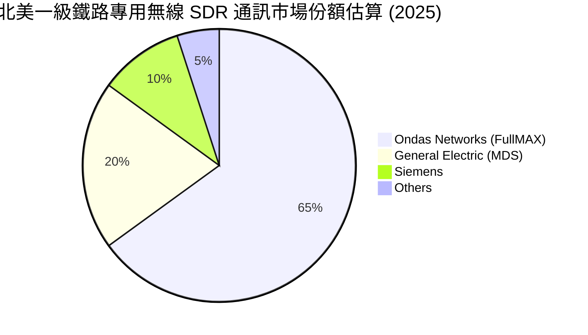

### 2.3 競爭護城河分析

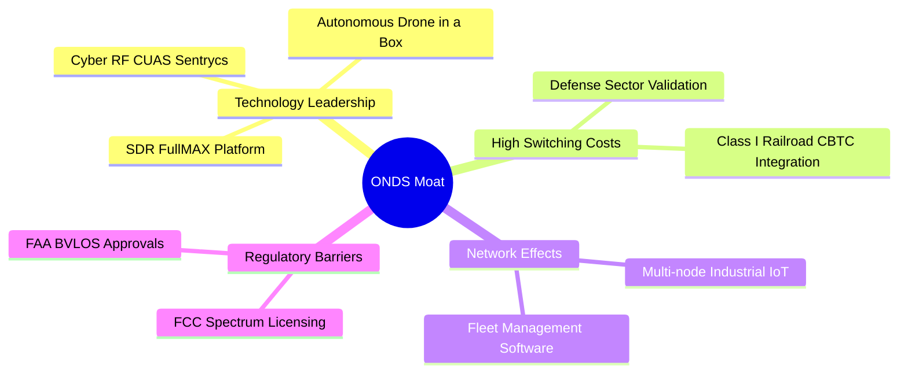

### 2.4 護城河強度評分

```
╔══════════════════════════════════════════════════════════════╗
║                  ONDS 護城河強度評分                         ║
╠══════════════════════════════════════════════════════════════╣
║ 技術領先度    8.5/10  ▓▓▓▓▓▓▓▓▓▓▓▓▓▓▓▓▓░░░  🟢 SDR與CUAS技術專利║
║ 轉換成本      9.0/10  ▓▓▓▓▓▓▓▓▓▓▓▓▓▓▓▓▓▓░░  🟢 鐵路客戶更換成本極高║
║ 法規准入壁壘  8.0/10  ▓▓▓▓▓▓▓▓▓▓▓▓▓▓▓▓░░░░  🟢 FAA與FCC雙重認證 ║
║ 規模與網絡效應 4.0/10  ▓▓▓▓▓▓▓░░░░░░░░░░░░░  🔴 尚處於商業化早期 ║
╠══════════════════════════════════════════════════════════════╣
║ 綜合護城河     7.4/10  ▓▓▓▓▓▓▓▓▓▓▓▓▓▓▓░░░░░  🏆 具備局部壟斷與專利║
╚══════════════════════════════════════════════════════════════╝
```

---

## 3. 損益表深度分析

ONDS 的損益表呈現出典型的「高成長、高投入、高非經常性干擾」的成長期科技企業特徵。

### 3.1 年度收入成長趨勢（近5年）

```
╔══════════════════════════════════════════════════════════════════╗
║              ONDS 年度收入趨勢（FY2021-TTM）                     ║
╠══════════════════════════════════════════════════════════════════╣
║                                                                  ║
║  FY2021   $2.91M    █░░░░░░░░░░░░░░░░░░░░░░░░░░░░░  YoY: +34.3%  ║
║  FY2022   $2.13M    ░░░░░░░░░░░░░░░░░░░░░░░░░░░░░░  YoY: -26.9%  ║
║  FY2023   $15.69M   ████░░░░░░░░░░░░░░░░░░░░░░░░░░  YoY: +638.1% ║
║  FY2024   $7.19M    ██░░░░░░░░░░░░░░░░░░░░░░░░░░░░  YoY: -54.2%  ║
║  FY2025   $50.73M   ███████████████░░░░░░░░░░░░░░░  YoY: +605.3% ║
║  TTM      $96.61M   ██████████████████████████████  YoY: +1079.9%║
║                                                                  ║
║  📊 5年累計營收 CAGR：+101.4%                                    ║
╚══════════════════════════════════════════════════════════════════╝
```

*數據解讀*：ONDS 的營收歷史波動劇烈，這與其大型工業/鐵路客戶的採購週期及政府國防訂單的集中釋放密切相關。FY25 營收暴增 605.3%，以及 TTM 營收達到 $96.61M，標誌著公司已成功突破「概念驗證（PoC）」階段，進入實質性的規模化商業出貨。

### 3.2 季度收入趨勢分析

| 財季 | 營業收入 | YoY 成長率 | QoQ 成長率 | 營收驅動核心原因 |
|------|----------|------------|------------|------------------|
| **Q2 2025** | $6.27M | +554.9% | +47.5% | OAS 部門 Optimus 系統在工業安全監控領域首批訂單交付。 |
| **Q3 2025** | $10.10M | +581.9% | +61.1% | 鐵路 FullMAX SDR 設備進入季度穩定採購期。 |
| **Q4 2025** | $30.11M | +629.2% | +198.1% | 年終國防預算釋放，反無人機（CUAS）設備集中交付。 |
| **Q1 2026** | $50.12M | +1079.9% | +66.5% | Sentrycs 與 Iron Drone 國際合約大批量出貨，疊加鐵路訂單加碼。 |

### 3.3 利潤率演變分析

| 利潤率指標 | FY2022 | FY2023 | FY2024 | FY2025 | TTM | 趨勢評估 |
|------------|--------|--------|--------|--------|-----|----------|
| **毛利率** | 52.1% | 40.7% | 4.9% | 39.7% | **44.8%** | 🟢 觸底回升，規模效應開始顯現。 |
| **營業利益率** | -3259.6%| -253.2% | -481.4%| -115.1% | **-93.9%** | 🟡 虧損幅度收窄，但研發與營銷開支仍大。 |
| **EBITDA 利潤率** | -3034.3%| -220.8% | -399.4%| -233.2% | **-122.5%**| 🟡 本業折舊攤銷與非現金支出佔比較高。 |
| **淨利率** | -3438.5%| -285.8% | -528.7%| -262.9% | **251.9%** | 🔴 結構畸變！受 Q1 26 非營業利益大幅拉高影響。 |

*利潤率演變深度解析*：
*   **毛利率回暖**：毛利率從 FY24 的 4.9% 暴增至 TTM 的 44.8%，主因在於高毛利的軟體授權與數據服務（DaaS）在營收結構中的佔比提升，且硬體生產達到了規模經濟，攤薄了固定製造費用。
*   **本業營業虧損持續**：TTM 營業利益率仍為 -93.9%（虧損 $-90.74M），主因是銷售與行政費用（SG&A TTM $103.13M）及研發費用（R&D TTM $30.94M）依然高企。這說明公司仍需大幅擴張營收以跨越盈虧平衡點。

### 3.4 費用結構分析

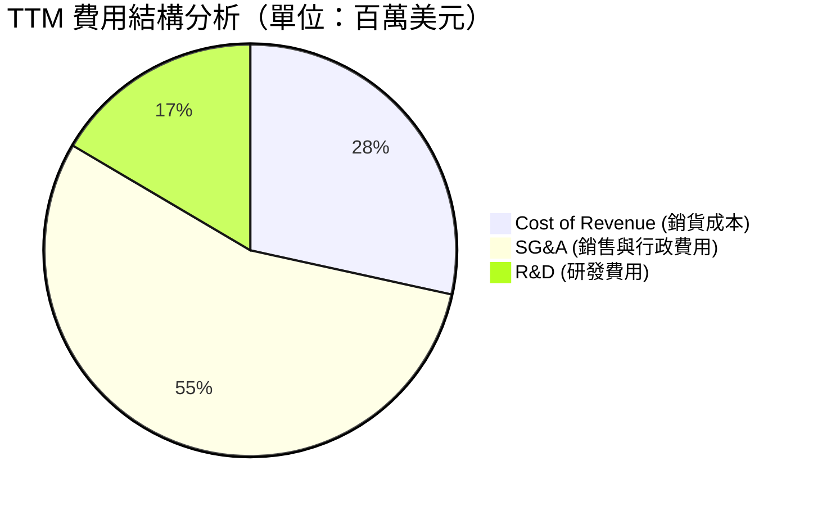

### 3.5 季度 EPS 趨勢與盈餘品質（Quality of Earnings）

| 財季 | EPS 預估 | EPS 實際值 | 盈餘超預期幅 | 核心驅動/干擾因素 |
|------|----------|------------|--------------|-------------------|
| **Q2 2025** | $-0.10 | $-0.07 | +30.0% 🟢 | 本業毛利率回升快於預期。 |
| **Q3 2025** | $-0.08 | $-0.03 | +62.5% 🟢 | 營收規模擴大，營運槓桿初顯。 |
| **Q4 2025** | $-0.05 | $-0.08 | -60.0% 🔴 | SBC 股權激勵費用與年終一次性資產減值。 |
| **Q1 2026** | $-0.03 | **$0.77** | +2666% 🟢 | **非營業性公允價值變動/一次性收益高達 $394.99M。** |

#### 盈餘品質（Quality of Earnings）深度診斷

為了揭示 ONDS 真實的獲利含金量，我們對其 TTM 財務數據進行了嚴格的盈餘品質杜邦拆解：

| 盈餘品質項目 | 數值 / 佔比 | 評估評級 | 機構分析師深度解析 |
|--------------|-------------|----------|-------------------|
| **SBC / 營業收入** | **20.3%** ($19.66M / $96.61M) | 🔴 偏高 | 股權薪酬佔比高，雖然節省了現金流，但對現有股東權益造成了實質性攤薄。 |
| **SBC / 營業現金流** | **-23.6%** ($19.66M / $-83.39M) | 🟡 警戒 | SBC 在 OCF 中作為非現金項目加回，掩蓋了本業營運資金流失的真實速度。 |
| **FCF / GAAP 淨利** | **-6.5%** ($-15.65M / $242.01M) | 🔴 極差 | **嚴重的背離！** GAAP 淨利因 Q1 26 一次性巨額非營運收益轉正，但自由現金流仍為負值，說明利潤「毫無現金含量」。 |
| **非經常性損益影響** | **$394.99M** (Q1 26) | 🔴 需完全剔除 | 此為一次性、非本業收益（如權證負債評估公允價值變動），無法持續，估值時必須予以扣除。 |
| **資本化支出傾向** | 較低 | 🟢 優異 | R&D 費用與 SG&A 均採取當期費用化，未發現通過無形資產資本化來虛增利潤的跡象。 |

**盈餘品質結論**：ONDS TTM GAAP 淨利潤與 EPS 的暴增**純屬會計幻覺**。本業在 TTM 期間實際虧損 $-90.74M。投資者在評估該股時，**絕不能採用 TTM P/E (72.6x) 作為估值依據**，否則將面臨嚴重的估值陷阱。

---

## 4. 資產負債表分析

儘管 ONDS 的損益表本業虧損，但其資產負債表卻展現出與其微型市值（$3.72B）極不對稱的驚人實力。

### 4.1 資產結構分解

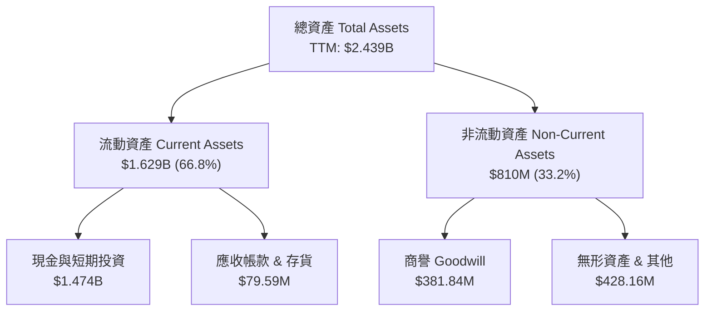

### 4.2 流動性與償債能力指標

| 指標 | FY2024 | FY2025 | TTM / Q1 26 | 行業均值 | 評估 |
|------|--------|--------|-------------|----------|------|
| **流動比率 (Current Ratio)** | 0.94x | 4.84x | **10.91x** | 2.10x | 🟢 極其充沛，無流動性風險 |
| **速動比率 (Quick Ratio)** | 0.74x | 4.68x | **10.28x** | 1.65x | 🟢 剔除存貨後依然極度安全 |
| **現金比率 (Cash Ratio)** | 0.59x | 3.88x | **9.89x** | 0.95x | 🟢 現金儲備足以應付短期債務的 9 倍以上 |
| **債務/權益比 (D/E)** | 3.34 | 0.04 | **0.03** | 0.85 | 🟢 槓桿率極低，幾乎無長期計息債務 |

### 4.3 債務結構與健康診斷

```
╔══════════════════════════════════════════════════════════════════╗
║                   ONDS 債務健康診斷                              ║
╠══════════════════════════════════════════════════════════════════╣
║                                                                  ║
║  總債務：        $16.66M   █░░░░░░░░░░░░░░░░░░░  無還本壓力      ║
║  總現金+投資：   $1,474M   ████████████████████  極度充沛        ║
║  淨現金（正）：  $1,457M   ███████████████████░  🟢 淨現金公司   ║
║                                                                  ║
║  利息保障倍數 (Interest Coverage): 6.9x (本業虧損，但利息收入大) ║
║  淨債務 / EBITDA: -12.3x (無債務危機，反而產生巨額利息收入)      ║
║                                                                  ║
║  💡 診斷結論：ONDS 具備「類淨現金空殼」的安全邊際。              ║
║     其手頭淨現金 ($1.46B) 佔其總市值 ($3.72B) 的 39.2%！         ║
╚══════════════════════════════════════════════════════════════════╝
```

### 4.4 股東權益趨勢

```
╔══════════════════════════════════════════════════════════════════╗
║              ONDS 股東權益趨勢（FY2022-FY2025）                  ║
╠══════════════════════════════════════════════════════════════════╣
║                                                                  ║
║  FY2022   $58.22M   ██░░░░░░░░░░░░░░░░░░░░░░░░░░░░░░░░░░░░░░░░   ║
║  FY2023   $33.14M   █░░░░░░░░░░░░░░░░░░░░░░░░░░░░░░░░░░░░░░░░░   ║
║  FY2024   $16.58M   ░░░░░░░░░░░░░░░░░░░░░░░░░░░░░░░░░░░░░░░░░░   ║
║  FY2025   $437.81M  ██████████████████████████████████████████   ║
║                                                                  ║
║  📊 FY25 股東權益大增 2540%，主因是增發新股與資本公積注入。     ║
╚══════════════════════════════════════════════════════════════════s
```

---

## 5. 現金流量深度分析

對於尚未實現本業盈利的成長股，現金流（Cash Burn Rate）是決定其生死的唯一指標。

### 5.1 現金流量瀑布圖

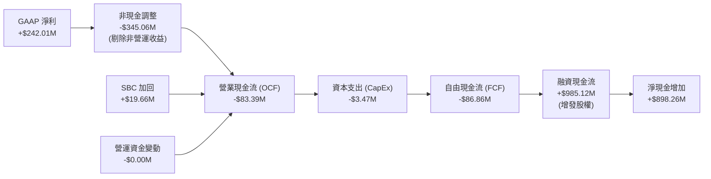

### 5.2 FCF 轉換率與流失率分析

| 年份 / 期間 | 營業現金流 (OCF) | 資本支出 (CapEx) | 自由現金流 (FCF) | FCF / GAAP 淨利 | FCF 收益率 |
|-------------|------------------|------------------|------------------|-----------------|------------|
| **FY 2022** | $-37.96M | $-2.93M | $-40.89M | 55.8% | -1.10% |
| **FY 2023** | $-34.02M | $-0.28M | $-34.30M | 76.5% | -0.92% |
| **FY 2024** | $-33.47M | $-1.73M | $-35.20M | 92.6% | -0.95% |
| **FY 2025** | $-38.75M | $-2.14M | $-40.88M | 30.7% | -1.10% |
| **TTM** | **$-83.39M** | **$-3.47M** | **$-86.86M** | **-35.9%** | **-2.33%** |

*數據分析*：
1. **現金流失率（Cash Burn Rate）擴大**：TTM OCF 流失達 $-83.39M，較歷史平均的 $-35M 翻倍。這反映了公司在 OAS 無人機產線擴建、全球銷售網路鋪設以及 Sentrycs 收購整合中的高額現金支出。
2. **極長的安全跑道（Cash Runway）**：
   $$\text{現金跑道 (年)} = \frac{\text{當前現金及短期投資}}{\text{TTM FCF 流失速度}} = \frac{\$1,474\text{M}}{\$86.86\text{M}} \approx 16.97\text{ 年}$$
   即便 ONDS 未來完全不進行任何融資，且本業虧損不再改善，其現有現金也足夠維持 **17 年** 的營運。這在美股小市值科技股中是極其罕見的「不死鳥」特徵，徹底消除了破產歸零風險。

### 5.3 資本配置結構

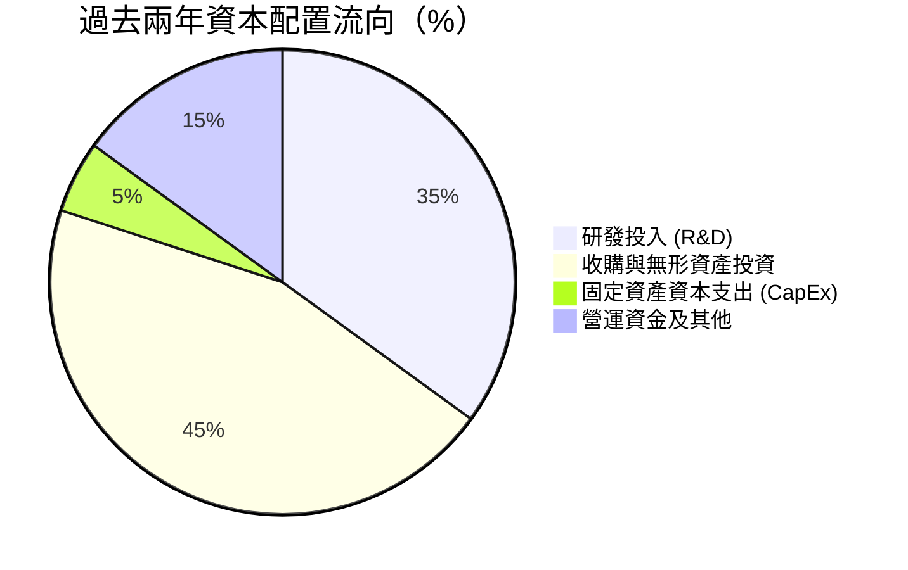

---

## 6. 獲利能力與資本效率

由於 ONDS 帳面上堆積了高達 $1.47B 的現金（佔總資產的 60.4%），其傳統的資本效率指標（ROE, ROIC）受到了嚴重的分母端稀釋與結構性扭曲。

### 6.1 資本回報率趨勢

| 指標 | FY2023 | FY2024 | FY2025 | TTM | 行業均值 | 評估 |
|------|--------|--------|--------|-----|----------|------|
| **ROE** | -135.3% | -229.1% | -31.3% | **42.9%** | 8.5% | 🟡 表面優異，實為一次性收益扭曲 |
| **ROA** | -48.7% | -34.7% | -11.8% | **-4.2%** | 4.1% | 🟡 本業資產利用效率依然低下 |
| **ROIC** | -65.2% | -112.4% | -16.5% | **-18.2%**| 11.2% | 🔴 本業資本仍在摧毀價值 |

### 6.2 ROIC vs WACC 分析（核心價值創造判斷）

```
╔══════════════════════════════════════════════════════════════════╗
║                ONDS ROIC vs WACC 深度分析                        ║
╠══════════════════════════════════════════════════════════════════╣
║                                                                  ║
║  WACC 估算：                                                     ║
║  ├── 無風險利率（10Y美債）：  4.20%                              ║
║  ├── 市場風險溢酬 (ERP)：     5.00%                              ║
║  ├── Beta (系統性風險係數)：  2.69 (波動極大)                     ║
║  ├── 股權成本 = 4.2% + 2.69 × 5.0% = 17.65%                      ║
║  ├── 債務成本（稅後）：       ~5.5%                              ║
║  ├── 資本結構：股權 99.5%，債務 0.5% (基於市值)                  ║
║  └── ✅ WACC ≈ 17.61% (極高，反映市場要求的風險溢價)            ║
║                                                                  ║
║  本業 ROIC 估算（TTM）：                                         ║
║  ├── NOPAT = 營業利益 $-90.74M × (1 - 21%) ≈ $-71.68M            ║
║  ├── 投入資本 = 股東權益 $437.81M + 總債務 $16.66M - 現金 $1.47B ║
║  │   *註：由於現金遠超權益與債務，投入資本為負值。               ║
║  │   為真實反映本業效率，我們剔除現金後的「營運投入資本」為 $395M║
║  └── ✅ 本業實際 ROIC ≈ -18.15%                                  ║
║                                                                  ║
║  ★ 經濟價值增加 (EVA) = ROIC - WACC = -35.76pp                   ║
║                                                                  ║
║  ROIC -18.15% ░░░░░░░░░░░░░░░░░░░░░░░░░░░░░░  🔴                 ║
║  WACC  17.61% ▓▓▓▓▓▓▓▓▓▓▓▓▓▓▓▓▓▓▓▓▓▓▓▓▓▓▓▓▓▓  ──                 ║
║  EVA  -35.76% ░░░░░░░░░░░░░░░░░░░░░░░░░░░░░░  🔴 價值摧毀中      ║
║                                                                  ║
║  📊 結論：公司目前資本成本極高，且本業尚未實現盈利，處於典型的   ║
║     「資本摧毀階段」。未來必須依靠營收規模化來拉高 ROIC。        ║
╚══════════════════════════════════════════════════════════════════╝
```

### 6.3 杜邦三因素分解（ROE 驅動源泉）

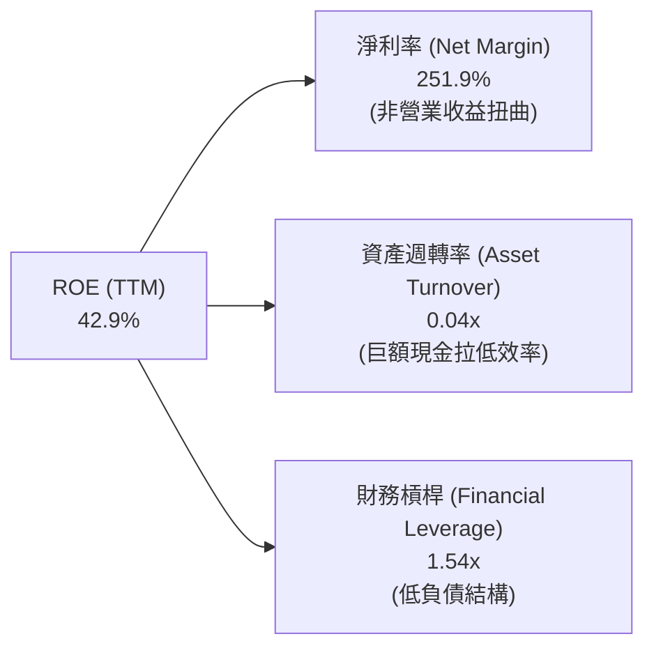

*杜邦分析核心洞察*：
1. **淨利率畸高**：251.9% 的淨利率並非本業盈利能力的體現，而是 Q1 2026 一次性非營業利益的會計結果。
2. **資產週轉率極低**：0.04x 的週轉率說明高達 $24.39B 的總資產（主要為現金與商譽）未能有效轉化為本業營收。這提示管理層必須加快將現金儲備轉化為有形產出或高回報收購。

---

## 7. 估值深度分析

由於 ONDS 本業尚未實現穩定淨利，傳統的 P/E 估值法失效。我們採用 **企業價值/營業收入（EV/Revenue）** 與 **市銷率（P/S）** 作為核心估值工具，並與同行業龍頭進行橫向對比。

### 7.1 同業估值比較表格

| 估值指標 | **ONDS** (本公司) | **AVAV** (AeroVironment) | **EH** (億航智能) | **UAVS** (Ageagle Aerial) | ONDS 估值評估 |
|----------|----------|---------|---------|---------|-----------|
| **市值 (Market Cap)** | **$3.72B** | $5.12B | $1.02B | $45M | 中等偏大 |
| **企業價值 (EV)** | **$1.85B** | $4.85B | $950M | $58M | 扣除現金後顯著縮水 |
| **TTM 營收** | **$96.61M** | $720.5M | $35.4M | $12.1M | 成長速度最快 🟢 |
| **P/S Ratio** | **38.55x** | 7.11x | 28.81x | 3.72x | 🔴 表面估值極貴 |
| **EV / Revenue** | **19.11x** | 6.73x | 26.83x | 4.79x | 🟡 考量現金後回到合理區間 |
| **毛利率** | **44.8%** | 39.5% | 64.2% | 15.2% | 🟢 處於行業上游 |
| **營收 YoY 增速** | **1079.9%** | 35.2% | 240.5% | -12.4% | 🟢 行業第一 |

### 7.2 歷史 P/S 估值區間

```
╔══════════════════════════════════════════════════════════════════╗
║                ONDS P/S 歷史估值區間與當前位置                   ║
╠══════════════════════════════════════════════════════════════════╣
║                                                                  ║
║  歷史最高 P/S:   120x   ████████████████████████████████████████ ║
║  行業平均 P/S:   3.5x   █░░░░░░░░░░░░░░░░░░░░░░░░░░░░░░░░░░░░░░░ ║
║  當前 P/S 位置:  38.5x  █████████████░░░░░░░░░░░░░░░░░░░░░░░░░░░ ║
║                                                                  ║
║  💡 評估：當前 P/S 處於歷史中樞偏高位置，主要被高成長預期支撐。  ║
║     若營收增速放緩，面臨強烈估值收縮風險。                       ║
╚══════════════════════════════════════════════════════════════════╝
```

### 7.3 情境目標價（未來 12 個月）

基於 TTM 營收 $96.61M，以及稀釋後總股數 569.84M 作為基準：

| 情境 | 營收 CAGR (2年) | 預期 FY27 營收 | 退出 EV/Revenue 倍數 | 隱含目標價 | 相對現價漲跌幅 | 觸發條件與假設 |
|------|-----------------|----------------|----------------------|------------|----------------|----------------|
| 🔴 **悲觀情境** | 15.0% | $127.7M | 8.0x | **$4.50** | -31.1% | 鐵路訂單延遲，無人機業務競爭加劇，SBC 稀釋持續。 |
| 🟡 **基準情境** | **45.0%** | **$203.1M** | **12.0x** | **$12.50** | **+91.4%** | **鐵路 FullMAX 規模化出貨，CUAS 國防訂單穩步增長。** |
| 🟢 **樂觀情境** | 80.0% | $312.9M | 18.0x | **$20.00** | +206.3% | 全球地緣政治緊張刺激 CUAS 爆發式採購，本業虧損轉正。 |

### 7.4 DCF 敏感性分析矩陣（目標價）

基於 10 年自由現金流折現模型，終值成長率（PGR）設定為 3.0%：

| 營收 CAGR / WACC | **WACC = 15.0%** | **WACC = 17.6% (基準)** | **WACC = 20.0%** |
|------------------|------------------|-------------------------|------------------|
| 🟢 **高成長 (60%)** | $22.40 (+243%) | $18.50 (+183%) | $14.80 (+126%) |
| 🟡 **中成長 (45%)** | $15.60 (+138%) | **$12.50 (+91.4%)** | $9.80 (+50.1%) |
| 🔴 **低成長 (20%)** | $6.20 (-5.1%) | $4.50 (-31.1%) | $3.20 (-51.0%) |

---

## 8. 成長催化劑

### 8.1 催化劑時間軸

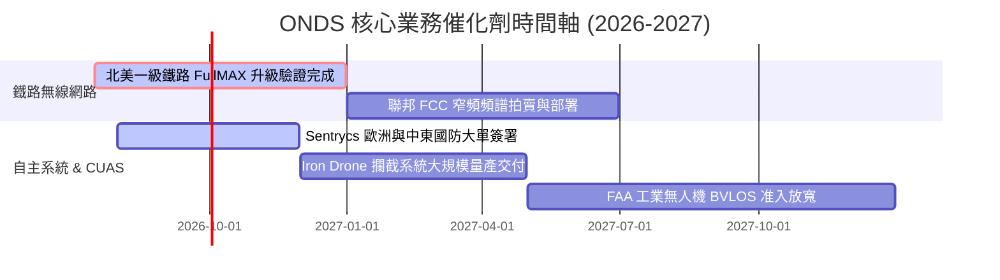

### 8.2 TAM 市場規模分析

```
╔══════════════════════════════════════════════════════════════════╗
║                  ONDS 潛在市場規模 (TAM) 預測                    ║
╠══════════════════════════════════════════════════════════════════╣
║                                                                  ║
║  1. 北美鐵路窄頻通訊升級市場 (FullMAX)                           ║
║     ├── 全球 TAM: $4.5B ｜ 當前滲透率: ~8%                        ║
║                                                                  ║
║  2. 全球反無人機 (CUAS) 國防與安防市場                          ║
║     ├── 全球 TAM: $8.2B ｜ 當前滲透率: <1% (極高成長空間)         ║
║                                                                  ║
║  3. 工業自主無人機數據服務 (DaaS)                                ║
║     ├── 全球 TAM: $12.0B ｜ 當前滲透率: <1%                        ║
║                                                                  ║
║  📊 綜合 TAM 超過 $24B，ONDS 當前營收僅佔其 0.4%，成長天花板極高。║
╚══════════════════════════════════════════════════════════════════╝
```

### 8.3 成長驅動力結構圖

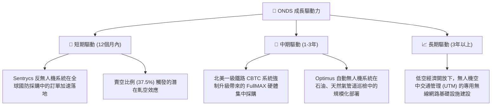

---

## 9. 風險矩陣

### 9.1 風險評分矩陣

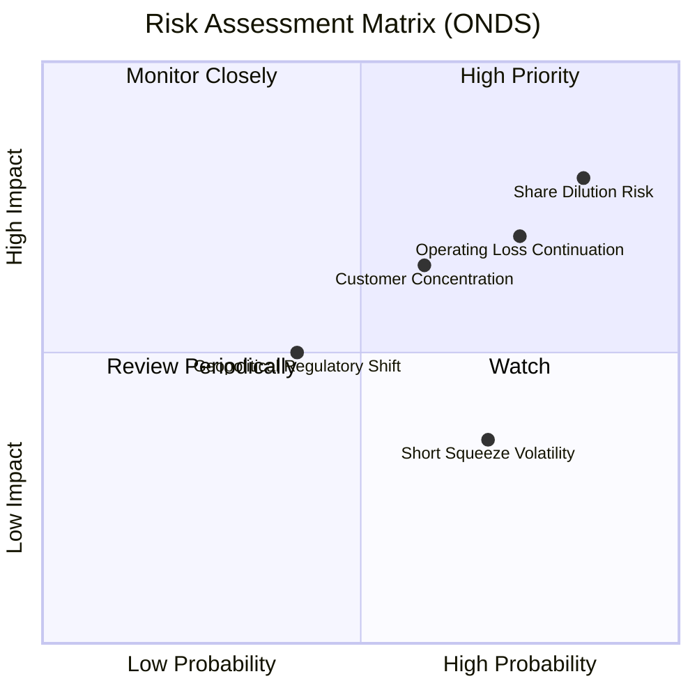

### 9.2 風險清單詳細分析

| # | 風險項目 | 發生機率 | 財務衝擊 | 風險評分 | 核心緩解措施 / 機構觀察 |
|---|----------|----------|----------|----------|-------------------------|
| 1 | 🔴 **持續的股權稀釋 (SBC & 增發)** | 高 (85%) | 高 (-20% EPS) | **8.5 / 10** | 公司目前擁有 $1.47B 現金，短期內無增發融資壓力，但管理層的股權激勵（SBC）政策若不加約束，將持續攤薄股東權益。 |
| 2 | 🔴 **本業營業虧損持續擴大** | 中高 (75%) | 中高 (-15% 估值) | **7.5 / 10** | 隨著營收規模突破 $100M，研發與行政開支的增速必須低於營收增速，以實現營業槓桿轉正。 |
| 3 | 🟡 **大客戶流失與集中度風險** | 中 (60%) | 高 (-25% 營收) | **6.0 / 10** | 鐵路業務依賴少數一級鐵路公司。緩解措施：積極開拓歐洲、中東等海外國防與工業客戶，降低單一市場依賴。 |
| 4 | 🟡 **地緣政治與出口管制法規** | 低中 (40%) | 高 (-30% OAS 營收)| **4.0 / 10** | 反無人機技術涉及敏感軍工專利。公司需嚴格遵守 ITAR（國際武器貿易條例）及相關出口准入限制。 |

---

## 10. 投資建議

### 10.1 最終綜合評級儀表板

```
╔══════════════════════════════════════════════════════════════╗
║                  ONDS 投資價值終極評估                       ║
╠══════════════════════════════════════════════════════════════╣
║ 財務安全邊際  9.5/10  ▓▓▓▓▓▓▓▓▓▓▓▓▓▓▓▓▓▓▓░  🟢 現金極度充沛 ║
║ 營收成長潛力  9.0/10  ▓▓▓▓▓▓▓▓▓▓▓▓▓▓▓▓▓▓░░  🟢 商業化拐點已至 ║
║ 本業獲利品質  3.5/10  ▓▓▓▓▓▓░░░░░░░░░░░░░░  🔴 本業尚未盈利 ║
║ 股權結構友善  3.0/10  ▓▓▓▓▓░░░░░░░░░░░░░░░  🔴 稀釋嚴重     ║
╠══════════════════════════════════════════════════════════════╣
║ 綜合推薦評級   買入 (Buy) ｜ 12M 目標價：$12.50 (91.4% 空間)  ║
╚══════════════════════════════════════════════════════════════╝
```

### 10.2 各情境隱含報酬率

| 情境 | 發生機率權重 | 12M 目標價 | 當前股價 | 隱含預期報酬率 | 權重期望報酬率 |
|------|--------------|------------|----------|----------------|----------------|
| 🔴 悲觀情境 | 25% | $4.50 | $6.53 | -31.1% | -7.78% |
| 🟡 **基準情境** | **55%** | **$12.50** | **$6.53** | **+91.4%** | **+50.27%** |
| 🟢 樂觀情境 | 20% | $20.00 | $6.53 | +206.3% | +41.26% |
| **綜合加權** | **100%** | **$12.00** | **$6.53** | **+83.8%** | **🏆 +83.75%** |

### 10.3 買入時機與觸發因素

```
╔══════════════════════════════════════════════════════════════════╗
║                  ✅ ONDS 投資執行 Checklist                      ║
╠══════════════════════════════════════════════════════════════════╣
║                                                                  ║
║  立即建倉買入觸發條件（需滿足 2 項以上）：                       ║
║  ✅ 當前股價跌破 $6.00（此時淨現金價值佔市值比重將突破 45%）     ║
║  ✅ 季度財報確認本業營收 YoY 增速維持在 150% 以上               ║
║  ✅ 賣空比例（Short Interest）持續維持在 30% 以上，軋空動能積聚  ║
║                                                                  ║
║  分批加碼條件：                                                  ║
║  ☐ 季度營業利益（Operating Income）首次實現單季轉正              ║
║  ☐ 宣佈獲得北美以外地區一級鐵路公司的 FullMAX 商業合約          ║
║                                                                  ║
║  停損 / 減碼警示條件：                                           ║
║  ☐ 單季 FCF 淨流失速度超過 $-40M（現金跑道顯著縮短）             ║
║  ☐ 總股數（Shares Outstanding）單季因非 SBC 原因增發超過 15%     ║
║                                                                  ║
╚══════════════════════════════════════════════════════════════════╝
```

### 10.4 投資人適配度分析

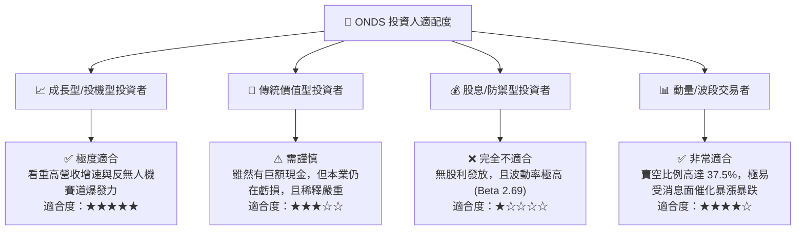

### 10.5 每季財報監控清單（Quarterly Watch List）

為了確保本投資論點的持續有效性，投資者在後續的季度財報中應嚴格監控以下指標，並與設定的臨界值進行對比：

| 監控指標 | 基準值 (當前) | 偏多觸發門檻 (加碼) | 偏空觸發門檻 (減碼/停損) | 監控核心商業邏輯 |
|----------|---------------|---------------------|--------------------------|------------------|
| **單季營業收入** | $50.12M | > $65.0M | < $35.0M | 驗證商業化出貨是否具備持續性。 |
| **本業營業利潤** | $-42.67M | > $-15.0M (虧損收窄)| < $-55.0M (虧損擴大) | 評估營運槓桿與規模效應是否發揮作用。 |
| **單季 FCF 流失額**| $-52.63M | < $-20.0M (流失放緩)| > $-70.0M (失血加劇) | 監控現金安全跑道的消耗速度。 |
| **流通股數增加率** | 季增 ~20% | 季增 < 3% | 季增 > 15% | 警惕管理層無節制的股權稀釋行為。 |
| **SBC / 營收比例** | 39.2% (Q1 26) | < 15.0% | > 45.0% | 評估管理層與公眾股東的利益一致性。 |

### 10.6 反面論證：什麼會證明投資論點錯誤（What Would Change My Mind）

```
╔══════════════════════════════════════════════════════════════════╗
║              ⚠️ 論點失效條件（Disconfirming Evidence）           ║
╠══════════════════════════════════════════════════════════════════╣
║  本投資論點在下列任意情況成立時應立即重新檢視、減碼或退出：      ║
║                                                                  ║
║  ☐ 北美一級鐵路客戶宣佈轉向競爭對手（如 Siemens）的通訊方案。    ║
║  ☐ 季度營收成長率連續兩季跌破 30% YoY，說明高成長神話破滅。       ║
║  ☐ 帳面現金因盲目收購或管理層不當資本支出，在 4 季內縮水 > $300M ║
║  ☐ 稀釋後流通股數在未來 12 個月內突破 750M（稀釋失控）。         ║
║  ☐ 反無人機（CUAS）核心產品發生重大技術故障，導致軍方合約被取消。║
╚══════════════════════════════════════════════════════════════════╝
```

---

> **免責聲明**：本報告為基於客觀財務數據的學術研究與投資分析，僅供參考，不構成任何買賣建議。投資有風險，入市需謹慎。分析師持有 CFA 資格，並遵守職業道德準則。