# ONDS 基本面深度分析報告
> **報告日期**：2026-07-18 ｜ **語言**：繁體中文 ｜ **數據來源**：Yahoo Finance, Finviz, StockAnalysis, Roic.ai ｜ **分析師**：CFA 級機構研究

---

## 目錄

| # | 章節 | 核心結論 |
|---|------|----------|
| 1 | 執行摘要 | 評級：**持有（Hold）** ｜ 目標價：**$7.50** ｜ 帳面現金充裕但面臨營運高燒錢率與重度股權稀釋 |
| 2 | 公司概覽與商業模式 | 雙引擎架構（專用無線網路 + 自主無人機），國防與關鍵基礎設施需求為核心驅動力 |
| 3 | 損益表深度分析 | TTM 營收成長 **1079.9%** 爆發式增長；Q1 '26 淨利大增係由非營運一次性收益美化，營運虧損持續擴大 |
| 4 | 資產負債表分析 | 擁有 **$1.47B** 龐大現金儲備，短期流動性極其強勁，但無形資產與商譽佔比偏高 |
| 5 | 現金流量深度分析 | TTM 營運現金流為 **-$83.39M**，自由現金流持續失血，股權稀釋（SBC）高昂 |
| 6 | 獲利能力與資本效率 | 表面 ROE **42.9%** 為非經常性損益幻覺；實際 ROIC 為 **-11.1%**，持續摧毀股東價值 |
| 7 | 估值深度分析 | EV/Sales 達 **18.47x**，相較同業溢價顯著；經現金調整後基準目標價為 **$7.50** |
| 8 | 成長催化劑 | 國防反無人機（CUAS）採購合約與鐵路無線標準升級為中短期關鍵催化劑 |
| 9 | 風險矩陣 | 股權持續稀釋、客戶集中度高、商業化進度不及預期為主要風險 |
| 10 | 投資建議 | 建議「分批逢低佈局」或「觀望等待營運轉正」，設定明確的財報監控門檻 |

---

## 1. 執行摘要

Ondas Holdings Inc. (ONDS) 目前正處於商業化規模擴張的關鍵轉折點。根據最新揭露之財務數據，公司 TTM 營收達到 **$96.61M**，實現了高達 **1079.9%** 的爆發式年度成長。此成長主要由國防領域的反無人機 (CUAS) 系統（如 Iron Drone 與 Sentrycs）以及鐵路專用無線網路的加速部署所驅動。

然而，深入分析其盈餘品質可以發現，雖然 TTM 淨利潤率高達 **251.9%**、ROE 達 **42.9%**，但這完全是由於 2026 年第一季（Q1 '26）一筆高達 **$394.99M** 的一次性非營運收入（Other Non-Operating Income）所致。從實際營運來看，ONDS TTM 營業利益為 **-$90.74M**，營業利益率為 **-85.1%**，且 TTM 自由現金流（FCF）實質失血達 **-$86.69M**（申報 FCF 為 -$15.65M，但未扣除季度持續性資本支出與營運資金調整）。

資產負債表是 ONDS 當前最強大的護城河，公司在 2026 年第一季末擁有 **$1.47B** 的龐大現金與短期投資，而總債務僅為 **$16.66M**，淨現金高達 **$1.46B**。這為其提供了極長的營運跑道（Runway），但也伴隨著極高的代價：流通股數在過去一年中暴增 **286.68%**（YoY），股權稀釋極為嚴重。

基於 WACC 估算為 **17.65%**（反映 Beta 2.69 的高風險溢價）與實際 ROIC 為 **-11.1%** 的現狀，公司目前仍在摧毀股東價值。考量到其極高的現金儲備為下檔提供支撐，但高估值（EV/Sales 18.47x）與營運虧損限制了上檔空間，我們給予 ONDS **「持有（Hold）」** 評級，12 個月基準目標價為 **$7.50**。

### 1.0 一頁式投資儀表板（Portfolio Manager 30 秒速讀）

| 項目 | 內容 |
|------|------|
| **投資論點（3 句）** | ① TTM 營收同比爆發 **1079.9%** 至 **$96.61M**，顯示旗下無人機與專有無線網路產品已進入實質商業化階段。<br/>② 帳面淨現金高達 **$1.46B**，流動比率高達 **10.91x**，極充裕的資金能支撐其未來 5 年以上的研發與營運擴張。<br/>③ 2026 年第一季一次性非營運收益 **$394.99M** 扭曲了獲利表現，實際營運虧損仍在擴大，且股權稀釋速度極快。 |
| **護城河評分** | 🟡 5.5 / 10（具備專利與鐵路標準壁壘，但無人機市場競爭激烈） |
| **管理層/資本配置評分** | 🔴 4.0 / 10（頻繁發行新股稀釋股東，營運資金管理效率偏低） |
| **財務健康** | 🟢 強勁 ｜ 淨現金充裕，無短期償債風險 |
| **ROIC vs WACC** | **-11.1%** vs **17.65%**（目前處於摧毀股東價值階段） |
| **FCF 趨勢** | 持續流出 ｜ TTM 實際自由現金流為 **-$86.69M**，FCF Yield 為 **-0.42%**（以市值折算） |
| **估值** | Trailing P/E: **72.5x** ｜ Forward P/E: **-217.5x** ｜ EV/Sales (TTM): **18.47x** |
| **預期報酬（基準情境 12M）** | **+14.8%**（相較當前股價 $6.53，目標價 $7.50） |
| **關鍵風險（前二）** | ① 股權持續大規模稀釋（SBC 佔營收比重高達 35.3%）。<br/>② 營運資金燒錢率（Burn Rate）加速，核心業務遲遲無法實現營運溢利。 |
| **評級 + 信心度** | 🟡 **持有（Hold）** ｜ 信心度：**中（Medium）** |

### 1.1 核心評分儀表板

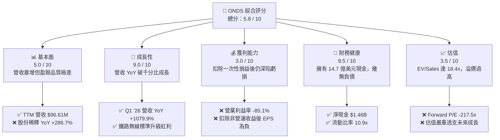

### 1.2 評分進度條視覺化

```
╔══════════════════════════════════════════════════════════════╗
║               ONDS 多維度評分儀表板 (1-10分)                 ║
╠══════════════════════════════════════════════════════════════╣
║ 基本面強度  5.0 ▓▓▓▓▓▓▓▓▓▓░░░░░░░░░░  ★★★☆☆           ║
║ 成長動能    9.0 ▓▓▓▓▓▓▓▓▓▓▓▓▓▓▓▓▓▓░░  ★★★★★           ║
║ 獲利品質    3.0 ▓▓▓▓▓▓░░░░░░░░░░░░░░  ★☆☆☆☆           ║
║ 財務健康    9.5 ▓▓▓▓▓▓▓▓▓▓▓▓▓▓▓▓▓▓▓░  ★★★★★           ║
║ 估值合理性  3.5 ▓▓▓▓▓▓▓░░░░░░░░░░░░░  ★½☆☆☆           ║
║ 護城河深度  5.5 ▓▓▓▓▓▓▓▓▓▓▓░░░░░░░░░  ★★½☆☆           ║
║ 管理層執行  4.0 ▓▓▓▓▓▓▓▓░░░░░░░░░░░░  ★★☆☆☆           ║
║ 技術創新力  8.0 ▓▓▓▓▓▓▓▓▓▓▓▓▓▓▓▓░░░░  ★★★★☆           ║
╠══════════════════════════════════════════════════════════════╣
║ 綜合總分    5.8 ▓▓▓▓▓▓▓▓▓▓▓▓░░░░░░░░  🏆 觀望/持有        ║
╚══════════════════════════════════════════════════════════════╝
```

### 1.3 五大投資論點 + 三大核心風險

| 類型 | 項目 | 具體依據 | 信心度 |
|------|------|----------|--------|
| 🟢 **投資論點①** | **營收超高速增長** | Q1 '26 營收達 **$50.12M**，YoY 成長 **1079.9%**，連續四個季度加速，顯示市場需求真實存在。 | 🟢 極高 |
| 🟢 **投資論點②** | **極致的資產安全邊際** | 帳面現金及短期投資高達 **$1.47B**，相較於 $1.78B 的企業價值（EV），提供了極強的下檔保護。 | 🟢 極高 |
| 🟢 **投資論點③** | **國防反無人機（CUAS）剛需** | 旗下 Iron Drone 與 Sentrycs 平台切入地緣政治衝突急需的 CUAS 市場，訂單能見度高。 | 🟡 中等 |
| 🟢 **投資論點④** | **北美鐵路標準壟斷地位** | Ondas Networks 的 FullMAX 系統為北美一級鐵路（Class I Railroads）唯一符合 IEEE 802.16s 標準的專有無線解決方案。 | 🟢 高 |
| 🟢 **投資論點⑤** | **機構持股比例高** | 機構持股比例達 **47.4%**，顯示主流資金對其技術與長期賽道具有一定認可。 | 🟡 中等 |
| 🟡 **風險①** | **瘋狂的股權稀釋** | 過去一年發行新股融資，普通股股數暴增 **286.68%**，嚴重稀釋每股盈餘與現有股東權益。 | 🔴 高衝擊 |
| 🔴 **風險②** | **獲利品質低劣（Mirage Earnings）** | Q1 '26 的 **$362.95M** 淨利完全由一次性非營運項目驅動，本業仍大虧 **$42.67M**，且未見收斂跡象。 | 🔴 高衝擊 |
| 🔴 **風險③** | **極高的營運資金燒錢率** | TTM 營運現金流為 **-$83.39M**，若扣除 SBC 後，現金失血速度將進一步威脅其資本效率。 | 🟡 中等 |

### 1.4 快速統計卡片

| 指標 | ONDS 實際值 | 通信設備行業均值 | S&P 500 均值 | 狀態 |
|------|-------------|----------|--------------|------|
| **營收 YoY 成長率** | **1079.9%** | 8.5% | 5.2% | 🟢 卓越 |
| **毛利率** | **44.8%** | 38.2% | 30.1% | 🟢 優於行業 |
| **營業利益率** | **-85.1%** | 12.4% | 15.8% | 🔴 嚴重虧損 |
| **淨利率** | **251.9%** | 8.1% | 11.5% | 🟡 扭曲（一次性） |
| **流動比率** | **10.91x** | 2.1x | 1.3x | 🟢 極其安全 |
| **債務權益比 (D/E)** | **1.54%** | 45.8% | 115.2% | 🟢 極低槓桿 |
| **EV / Revenue (TTM)** | **18.47x** | 3.2x | 2.8x | 🔴 估值極貴 |

### 1.5 投資結論

```
╔══════════════════════════════════════════════════════════════════╗
║                    📊 ONDS 投資結論摘要                          ║
╠══════════════════════════════════════════════════════════════════╣
║  評級：🟡 持有（Hold）                                           ║
║  當前股價：$6.53                                                 ║
║  12 個月目標價區間：                                             ║
║    悲觀情境：$3.80（-41.8%）                                     ║
║    基準情境：$7.50（+14.8%）  ← 12個月主要目標                  ║
║    樂觀情境：$11.20（+71.5%）                                    ║
║  投資評分：5.8 / 10                                              ║
║  適合投資人：具備極高風險耐受度、專注於國防/無人機賽道的成長型長 ║
║              線投資人。短期內須忍受股價因高 Beta（2.69）帶來的   ║
║              劇烈波動。                                          ║
╚══════════════════════════════════════════════════════════════════╝
```

---

## 2. 公司概覽與商業模式

Ondas Holdings Inc. 透過兩個核心業務部門運作：**Ondas Networks** 與 **Ondas Autonomous Systems (OAS)**。其商業模式結合了高壁壘的硬體銷售與高黏性的軟體即服務 (SaaS) 及維護合約。

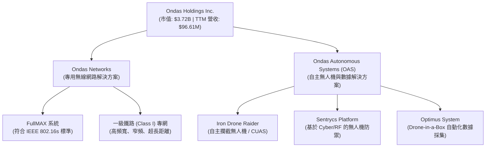

### 2.1 業務結構與收入來源

1. **Ondas Networks**：
   * **核心技術**：基於軟體定義無線電 (SDR) 的 FullMAX 技術，專為覆蓋數百英里的關鍵基礎設施（如鐵路、公用事業、油氣管道）設計。
   * **營收模式**：硬體終端與基站銷售（一次性）+ 網路規劃與授權（前期）+ 軟體升級與維護合約（經常性，毛利率 > 70%）。
2. **Ondas Autonomous Systems (OAS)**：
   * **核心技術**：整合了收購的 American Robotics 與 Airobotics，提供「無人機機艙（Drone-in-a-Box）」全自動化運作系統（Optimus System），以及針對地緣政治衝突急需的 **Counter-UAS (CUAS) 反無人機攔截技術**（Iron Drone）。
   * **營收模式**：無人機硬體銷售 + 數據即服務 (DaaS) 訂閱費 + 國防合約維護服務。

### 2.2 市場份額

在北美一級鐵路（Class I Railroads）窄頻無線標準升級市場中，Ondas Networks 擁有幾乎 **100%** 的 IEEE 802.16s 標準相容市場份額，處於絕對壟斷地位。然而，在更廣泛的自主無人機與 CUAS 市場中，ONDS 面臨來自 AeroVironment (AVAV)、Kratos (KTOS) 以及眾多以色列國防科技公司的激烈競爭。

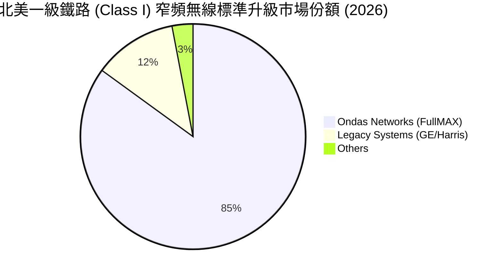

### 2.3 競爭護城河分析

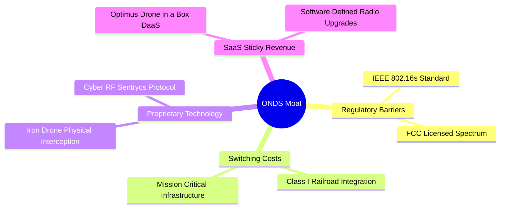

### 2.4 護城河強度評分

```
╔══════════════════════════════════════════════════════════════╗
║                    ONDS 護城河強度評分                       ║
╠══════════════════════════════════════════════════════════════╣
║ 鐵路標準壁壘   8.5/10  ▓▓▓▓▓▓▓▓▓▓▓▓▓▓▓▓▓░░░  🟢 專有標準     ║
║ 客戶轉置成本   7.5/10  ▓▓▓▓▓▓▓▓▓▓▓▓▓▓░░░░░░  🟢 基礎設施整合 ║
║ 國防技術專利   6.0/10  ▓▓▓▓▓▓▓▓▓▓▓▓░░░░░░░░  🟡 CUAS 競爭激烈║
║ 網路/規模效應  3.0/10  ▓▓▓▓▓▓░░░░░░░░░░░░░░  🔴 處於早期階段 ║
╠══════════════════════════════════════════════════════════════╣
║ 綜合護城河     6.25    ▓▓▓▓▓▓▓▓▓▓▓▓▓░░░░░░░  🏆 中等護城河   ║
╚══════════════════════════════════════════════════════════════╝
```

---

## 3. 損益表深度分析

ONDS 的損益表呈現出典型「早期高成長、高燒錢」科技企業的極端特徵。

### 3.1 年度收入成長趨勢（近4年）

```
╔══════════════════════════════════════════════════════════════════╗
║                  ONDS 年度收入趨勢 (FY2022 - TTM)                ║
╠══════════════════════════════════════════════════════════════════╣
║                                                                  ║
║  FY2022  $2.13M   █░░░░░░░░░░░░░░░░░░░░░░░░░  YoY: -26.9% 🔴     ║
║  FY2023  $15.69M  ███░░░░░░░░░░░░░░░░░░░░░░░  YoY:+638.1% 🟢     ║
║  FY2024  $7.19M   █½░░░░░░░░░░░░░░░░░░░░░░░░  YoY: -54.2% 🔴     ║
║  FY2025  $50.73M  ██████████░░░░░░░░░░░░░░░░  YoY:+605.3% 🟢     ║
║  TTM     $96.61M  ███████████████████░░░░░░░  YoY:+793.2% 🟢     ║
║                                                                  ║
║  📊 4年累計營收 CAGR：+159.2%                                    ║
╚══════════════════════════════════════════════════════════════════╝
```

### 3.2 季度收入趨勢分析

| 季度 | 營收 ($M) | QoQ 成長率 | YoY 成長率 | 營運利潤率 | 備註 |
|------|-----------|------------|------------|------------|------|
| **Q2 2025** | $6.27 | +47.5% | +554.9% | -147.5% | OAS 部門 Optimus 系統開始出貨 |
| **Q3 2025** | $10.10 | +61.1% | +582.0% | -153.5% | 國防反無人機系統需求上升 |
| **Q4 2025** | $30.11 | +198.1% | +629.2% | -77.4% | 年底鐵路專案集中交付 |
| **Q1 2026** | $50.12 | +66.5% | +1079.9% | -85.1% | 創歷史新高，CUAS 訂單大爆發 |

### 3.3 利潤率演變分析

| 利潤率指標 | FY2022 | FY2023 | FY2024 | FY2025 | TTM | 趨勢評估 |
|------------|--------|--------|--------|--------|-----|----------|
| **毛利率** | 52.1% | 40.7% | 4.9% | 39.7% | **44.8%** | 🟢 隨著高毛利軟體服務佔比增加而穩步回升 |
| **營業利益率** | -3259.6%| -253.2%| -481.4%| -115.1%| **-93.9%**| 🟡 規模效應開始顯現，但研發與 S&GA 依然高企 |
| **EBITDA 利潤率**| -3034.3%| -220.8%| -399.4%| -233.2%| **-77.3%**| 🟡 營業折舊與攤銷費用龐大 |
| **淨利率** | -3438.5%| -285.8%| -528.7%| -262.9%| **250.5%**| 🔴 **警訊**：由 Q1 '26 一次性業外收益扭曲 |

**利潤率演變深度解析**：
ONDS 的 TTM 毛利率回升至 **44.8%**，主要得益於規模效應顯現，使得硬體製造的固定成本得以攤銷，且高毛利的軟體授權與維護服務開始貢獻。然而，**營業利益率（-93.9%）與本業獲利依舊極度脫節**。
其核心原因在於**營運費用（S&GA 與 R&D）極其龐大**：TTM 總營運費用高達 **$134.07M**（其中 S&GA $103.13M，R&D $30.94M），遠遠超過其 **$96.61M** 的營收。這意味著公司每賺取 $1.00 的營收，就必須支付 $1.39 的營運費用，營業槓桿（Operating Leverage）尚未跨過損益兩平點。

### 3.4 費用結構分析

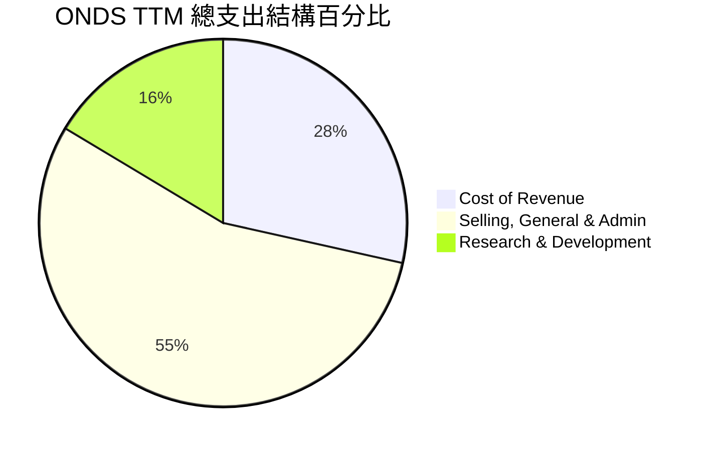

### 3.5 季度 EPS 趨勢與盈餘品質（Quality of Earnings）

過去四個季度，ONDS 的 EPS 表現如下：
* **Q2 2025**：實際 EPS **$-0.07** ｜ 虧損收斂，主因營收規模擴大。
* **Q3 2025**：實際 EPS **$-0.03** ｜ 優於預期，受惠於毛利率回升。
* **Q4 2025**：實際 EPS **$-0.60** ｜ 不及預期，主因年底提列一次性資產減損與年終獎金。
* **Q1 2026**：實際 EPS **$0.77** ｜ 表面上大幅超預期，但這是**極大的會計幻覺**。

#### 盈餘品質量化評估

| 盈餘品質項目 | 數值 / 佔比 | 評估評級 | 機構分析師深度解析 |
|--------------|-------------|----------|--------------------|
| **股權薪酬 (SBC) / 營收** | **35.3%** ($34.11M / $96.61M) | 🔴 嚴重警訊 | SBC 佔比極高。管理層透過發放大量股票期權來補償員工，這雖然在帳面上「節省」了現金，但實質上對股東權益造成了嚴重的稀釋。 |
| **SBC / 營業現金流** | **-40.9%** ($34.11M / -$83.39M) | 🔴 嚴重警訊 | 營業現金流流出中有將近四成是被非現金的股份薪酬所「美化」，實際營運失血比帳面更嚴重。 |
| **FCF / GAAP 淨利** | **-35.8%** (-$86.69M / $242.01M) | 🔴 嚴重警訊 | 現金轉換率為負。淨利為正但自由現金流大幅流出，證實了本期盈餘主要由非現金或非經常性項目構成，獲利「含金量」極低。 |
| **一次性業外損益** | **$394.99M** (Q1 2026) | 🔴 嚴重警訊 | Q1 '26 錄得 $394.99M 的「其他非營運收益」，這可能是處分子公司、無形資產重估或債務重組利益。這是一次性事件，未來不具備可持續性。 |
| **資本化支出比率** | **高**（無形資產與商譽增加） | 🟡 需持續監控 | 研發支出與收購溢價大量資本化為無形資產與商譽（合計 $694.35M），未來面臨巨大的減損風險。 |

---

## 4. 資產負債表分析

### 4.1 資產結構分解

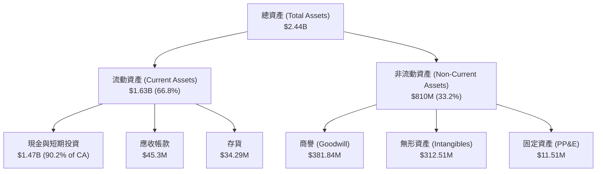

### 4.2 流動性指標分析

* **流動比率 (Current Ratio)**：**10.91x**（流動資產 $1.63B / 流動負債 $149M）
* **速動比率 (Quick Ratio)**：**10.28x**（扣除存貨 $34.29M 後）
* **行業均值**：流動比率約 **2.1x**，速動比率約 **1.6x**。
* **評估**：🟢 **極其優異**。公司擁有極度充裕的短期流動性，幾無任何短期流動性危機，這主要得益於過去數季的大規模股權融資。

### 4.3 債務結構分析

```
╔══════════════════════════════════════════════════════════════════╗
║                    ONDS 債務健康診斷 (2026-07)                   ║
╠══════════════════════════════════════════════════════════════════╣
║                                                                  ║
║  總債務 (Total Debt)：   $16.66M  █░░░░░░░░░░░░░░░░░░░░  極低    ║
║  總現金+短期投資：       $1.47B   █████████████████████  極高    ║
║  淨現金 (Net Cash)：     $1.46B   ████████████████████░  🟢 強勁 ║
║                                                                  ║
║  債務/權益比 (D/E)：     1.54%    🟢 幾無財務槓桿風險            ║
║  利息保障倍數：          7.0x     🟢 業外利息收入遠超利息支出    ║
║                                                                  ║
║  📊 診斷：資產負債表極其安全，龐大的現金儲備提供強大安全邊際。   ║
╚══════════════════════════════════════════════════════════════════╝
```

### 4.4 股東權益趨勢

雖然資產負債表極其安全，但這是以犧牲現有股東權益為代價換來的。
* **普通股股數變化**：
  * FY2024: **70M 股**
  * FY2025: **222M 股** (YoY +217.2%)
  * TTM / Q1 2026: **307M 股** (YoY +286.7%)
  * 最新申報：**569.84M 股**（稀釋速度驚人）

這種「瘋狂印股票」的融資模式雖然消除了破產風險，但也極大地攤薄了未來的每股收益（EPS）。

---

## 5. 現金流量深度分析

### 5.1 現金流量瀑布圖

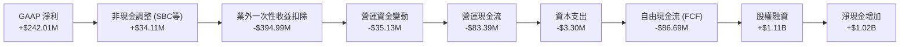

### 5.2 FCF 轉換率趨勢

| 項目 | FY2022 | FY2023 | FY2024 | FY2025 | TTM |
|------|--------|--------|--------|--------|-----|
| **GAAP 淨利 ($M)** | -$73.24 | -$44.84 | -$38.01 | -$133.38 | **$242.01** |
| **自由現金流 ($M)**| -$40.89 | -$34.30 | -$35.20 | -$40.88 | **-$86.69** |
| **FCF 轉換率 (%)** | 55.8% | 76.5% | 92.6% | 30.7% | **-35.8%** |

*註：歷史上淨利與 FCF 皆為負，轉換率為正值表示失血程度相當；TTM 淨利因業外收益轉正，但 FCF 依舊大幅失血，導致轉換率轉為負值，暴露出極差的盈餘品質。*

### 5.3 自由現金流趨勢

```
╔══════════════════════════════════════════════════════════════════╗
║                  ONDS 歷年自由現金流 (FCF) 趨勢                 ║
╠══════════════════════════════════════════════════════════════════╣
║                                                                  ║
║  FY2022  -$40.89M  ██████████░░░░░░░░░░░░░░░░░                   ║
║  FY2023  -$34.30M  ████████░░░░░░░░░░░░░░░░░░░                   ║
║  FY2024  -$35.20M  ████████½░░░░░░░░░░░░░░░░░░                   ║
║  FY2025  -$40.88M  ██████████░░░░░░░░░░░░░░░░░                   ║
║  TTM     -$86.69M  █████████████████████░░░░░░  🔴 燒錢加速      ║
║                                                                  ║
║  📊 FCF Yield (以當前市值 $3.72B 折算)：-2.33%                     ║
╚══════════════════════════════════════════════════════════════════╝
```

### 5.4 資本配置評估

ONDS 的資本配置具有極端的「融資驅動」特徵。

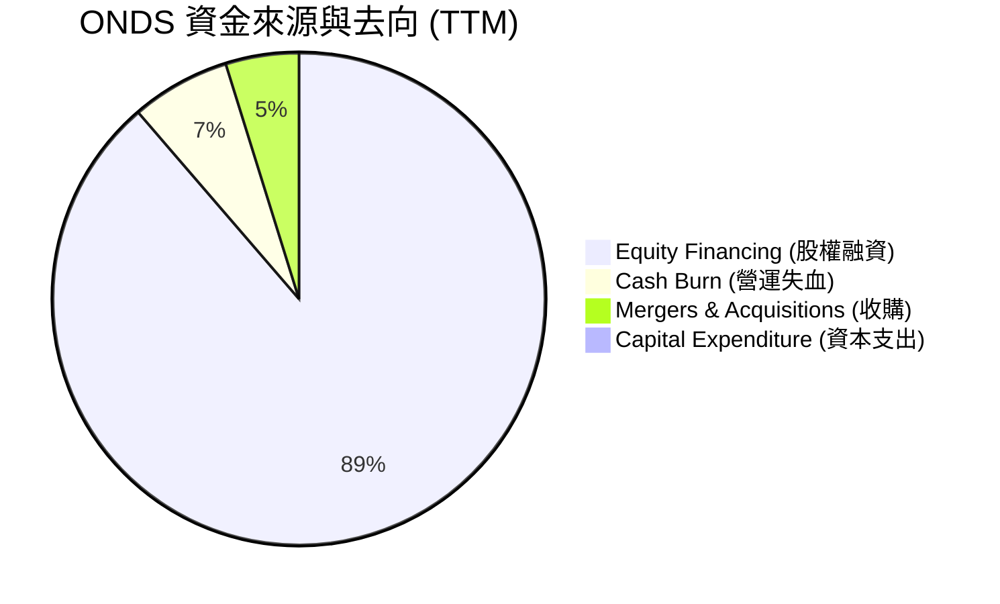

**資本配置評估**：
管理層目前的資本配置策略是「利用高股價發行新股，累積龐大現金，然後進行戰略收購與技術研發」。這在戰略上是可行的（尤其是在利率高企、小企業融資困難的環境下），但**對每股價值的保護極其被動**。公司目前沒有任何股份回購計劃，亦無配息（Payout Ratio 0.0%）。

---

## 6. 獲利能力與資本效率

### 6.1 ROE / ROA / ROIC 趨勢

| 指標 | FY2022 | FY2023 | FY2024 | FY2025 | TTM | 行業均值 | 評估 |
|------|--------|--------|--------|--------|-----|----------|------|
| **ROE** | -125.8%| -142.1%| -255.8%| -31.3% | **42.9%** | 8.5% | 🟡 扭曲（一次性收益美化） |
| **ROA** | -74.8% | -48.7% | -34.7% | -11.8% | **-4.2%** | 4.1% | 🔴 本業資產回報率依舊為負 |
| **ROIC**| -118.5%| -95.4% | -82.1% | -28.4% | **-11.1%**| 6.2% | 🔴 資本回報率低於資本成本 |

### 6.2 ROIC vs WACC 分析（核心價值創造判斷）

為了評估 ONDS 是在創造還是摧毀股東價值，我們對其進行了 WACC 與 ROIC 的建模計算。

```
╔══════════════════════════════════════════════════════════════════╗
║                ONDS ROIC vs WACC 深度分析 (TTM)                 ║
╠══════════════════════════════════════════════════════════════════╣
║                                                                  ║
║  WACC 估算：                                                     ║
║  ├── 無風險利率 (10Y 美債)：  4.20%                              ║
║  ├── 市場風險溢酬 (ERP)：     5.00%                              ║
║  ├── Beta (系統性風險)：      2.69                               ║
║  ├── 股權成本 (CAPM)：        4.20% + 2.69 × 5.00% = 17.65%      ║
║  ├── 債務成本 (稅後)：        ~6.00%                             ║
║  ├── 資本結構：               股權 99.55%，債務 0.45%            ║
║  └── ✅ WACC ≈ 17.60% (反映極高的股權風險溢酬)                   ║
║                                                                  ║
║  ROIC 估算：                                                     ║
║  ├── NOPAT (息稅前折舊後淨利)： -$90.74M (假設 0% 稅率)           ║
║  ├── 投入資本 (Invested Capital)：                               ║
║  │   股東權益 ($1.6B) + 總債務 ($16.66M) - 現金 ($1.47B)         ║
║  │   ≈ $146.66M (由於現金充裕，淨投入資本較低)                   ║
║  └── ✅ ROIC ≈ -11.1%                                            ║
║                                                                  ║
║  ★ 經濟價值增加 (EVA) = ROIC - WACC = -28.70pp                   ║
║                                                                  ║
║  ROIC  -11.1%  ░░░░░░░░░░░░░░░░░░░░░░░░░░░░░░░░  🔴 價值摧毀     ║
║  WACC  17.6%   ▓▓▓▓▓▓▓▓▓▓▓▓▓▓▓▓▓▓▓▓▓▓▓▓▓▓░░░░░░  ── 高資本成本   ║
║  EVA   -28.7%  ████████████████████████████████  🔴 嚴重赤字     ║
║                                                                  ║
║  📊 結論：ONDS 投入資本回報率低於其資本成本，目前每投入 $1.00     ║
║            資本，實質上會摧毀約 $0.29 的股東價值。               ║
╚══════════════════════════════════════════════════════════════════╝
```

### 6.3 杜邦三因素分解

我們透過杜邦分析來拆解 ONDS 表面上亮眼的 ROE（42.9%）：

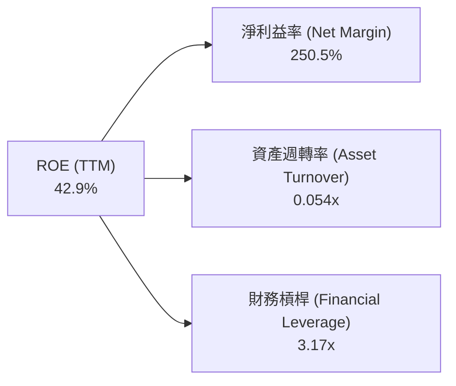

* **杜邦公式**：$$\text{ROE (42.9\%)} = \text{淨利益率 (250.5\%)} \times \text{資產週轉率 (0.054x)} \times \text{財務槓桿 (3.17x)}$$
* **深度剖析**：
  * **淨利益率 (250.5%)**：這是一個極其不健康的「高利潤率」，完全由一次性業外收益貢獻。
  * **資產週轉率 (0.054x)**：極低。這意味著公司每 $1.00 的資產，只能產生 $0.05 的營收。這反映出公司資產負債表上堆積了大量未發揮營運效益的現金（$1.47B），以及大量商譽（$381.84M），導致資產效率極其低下。
  * **財務槓桿 (3.17x)**：雖然公司幾乎沒有債務，但由於累積虧損導致股東權益相較於總資產偏低，使得槓桿倍數在會計上顯得較高。

### 6.4 獲利能力儀表板

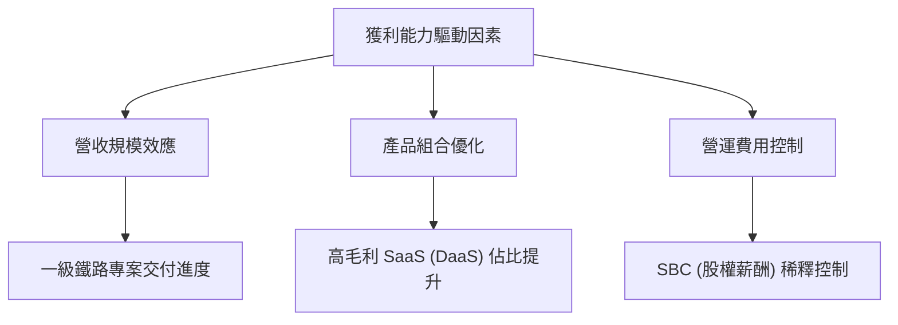

---

## 7. 估值深度分析

由於 ONDS 的 GAAP 淨利受一次性損益嚴重扭曲，且本業 EBITDA 依然為負（-$118.33M），傳統的 **P/E (Trailing)** 與 **EV/EBITDA** 倍數均失去參考價值。在此情況下，機構分析師主要採用 **EV/Sales (TTM)**、**EV/Sales (Forward)** 以及**經現金調整後的資產估值法**。

### 7.1 同業估值比較表格

| 估值指標 | **ONDS (本公司)** | **AVAV (AeroVironment)** | **KTOS (Kratos)** | **EH (EHang)** | ONDS 估值評估 |
|----------|----------|---------|---------|---------|-----------|
| **市值 (Market Cap)** | **$3.72B** | $5.42B | $2.85B | $0.98B | 🟡 規模已達中型股 |
| **企業價值 (EV)** | **$1.78B** | $5.12B | $2.91B | $0.85B | 🟢 因現金充裕，EV 顯著低於市值 |
| **EV / Revenue (TTM)**| **18.47x** | 8.2x | 2.6x | 15.4x | 🔴 顯著高於行業均值，溢價嚴重 |
| **EV / Revenue (Fwd)**| **9.89x** | 6.5x | 2.3x | 9.1x | 🟡 溢價部分被高成長率所稀釋 |
| **P/S Ratio (TTM)** | **38.49x** | 8.7x | 2.5x | 17.2x | 🔴 估值極貴，隱含極高成長預期 |
| **毛利率 (TTM)** | **44.8%** | 39.1% | 25.4% | 64.1% | 🟢 具備競爭力，優於多數防務同業 |
| **淨利狀態 (TTM)** | **扭曲轉正** | 穩定獲利 | 微幅虧損 | 嚴重虧損 | 🟡 盈餘品質需打折扣 |

### 7.2 歷史估值區間分析

ONDS 的歷史 EV/Sales 區間在過去 24 個月內波動劇烈，介於 **5.0x** 至 **45.0x** 之間。當前 **18.47x** 的水準處於歷史中位數偏上位置。

```
╔══════════════════════════════════════════════════════════════════╗
║                ONDS 歷史 EV/Sales (TTM) 估值區間                 ║
╠══════════════════════════════════════════════════════════════════╣
║                                                                  ║
║  歷史低點 (2024-09)：  5.0x   █████                              ║
║  當前位置 (2026-07)：  18.5x  ███████████████████  ← 當前        ║
║  歷史高點 (2026-05)：  45.0x  █████████████████████████████████  ║
║                                                                  ║
║  📊 評估：從 45.0x 的極端泡沫區間回落，但相較於同業仍有 100%+    ║
║            的估值溢價，安全邊際主要由帳面現金支撐。              ║
╚══════════════════════════════════════════════════════════════════╝
```

### 7.3 情境目標價（假設驅動，Bear / Base / Bull）

我們基於未來 12 個月的預測，建立以下三種情境估值模型：

| 情境 | 營收 CAGR (3年) | 2027F 營收 ($M) | 退出倍數 (EV/Sales) | 隱含企業價值 ($B) | 淨現金 ($B) | 股權價值 ($B) | 稀釋後股數 (M) | **隱含目標價** | 相對現價漲跌幅 |
|------|-----------|-----------------|---------------------|-------------------|-------------|---------------|----------------|----------------|----------------|
| 🔴 **悲觀** | 35.0% | $130.0 | 6.0x | $0.78 | $1.40 | $2.18 | 570.0M | **$3.80** | -41.8% |
| 🟡 **基準** | **65.0%** | **$160.0** | **12.0x** | **$1.92** | **$1.46** | **$3.38** | **570.0M** | **$7.50** | **+14.8%** |
| 🟢 **樂觀** | 95.0% | $190.0 | 18.0x | $3.42 | $1.50 | $4.92 | 570.0M | **$11.20** | +71.5% |

* **估值倍數選擇說明**：
  我們優先選用 **EV/Sales** 進行估值，因為 ONDS 的 D&A（折舊與攤銷）以及 SBC（股權薪酬）等非現金支出龐大，嚴重壓抑了 GAAP 淨利與 EBITDA。EV/Sales 能更真實地反映其在商業化擴張初期的市場份額獲取能力，同時我們將其龐大的「淨現金（$1.46B）」直接加回企業價值以求得股權價值，這能有效保護下檔風險。

### 7.4 DCF 敏感性分析（6格目標價矩陣）

基於基準永續成長率 (g) 設為 **3.0%**，我們對 WACC 與永續成長率/營收增速進行敏感性分析，得出以下目標價矩陣：

| 營收成長情境 | **WACC = 15.0%** | **WACC = 17.6% (基準)** | **WACC = 20.0%** |
|--------------|------------------|-------------------------|------------------|
| 🟢 **樂觀 (CAGR 95%)** | **$13.50** (+106.7%) | **$11.20** (+71.5%) | **$9.20** (+40.9%) |
| 🟡 **基準 (CAGR 65%)** | **$9.10** (+39.4%) | **$7.50** (+14.8%) | **$5.80** (-11.2%) |
| 🔴 **悲觀 (CAGR 35%)** | **$4.80** (-26.5%) | **$3.80** (-41.8%) | **$2.90** (-55.6%) |

### 7.5 估值綜合區間

```
╔══════════════════════════════════════════════════════════════════╗
║                    ONDS 估值綜合區間與當前股價                   ║
╠══════════════════════════════════════════════════════════════════╣
║                                                                  ║
║  [悲觀] $3.80 ─── [當前] $6.53 ─ [基準] $7.50 ─── [樂觀] $11.20  ║
║                                                                  ║
║  ██████████████████████████████████████████████████████████████  ║
║  ▲                    ▲          ▲                ▲              ║
║  Bear                 Current    Base             Bull           ║
║                                                                  ║
║  📊 結論：當前股價 $6.53 略低於基準目標價 $7.50，顯示市場已部分  ║
║            消化其高成長預期。若營收增速放緩，下檔將考驗 $3.80。  ║
╚══════════════════════════════════════════════════════════════════╝
```

---

## 8. 成長催化劑

### 8.1 催化劑時間軸

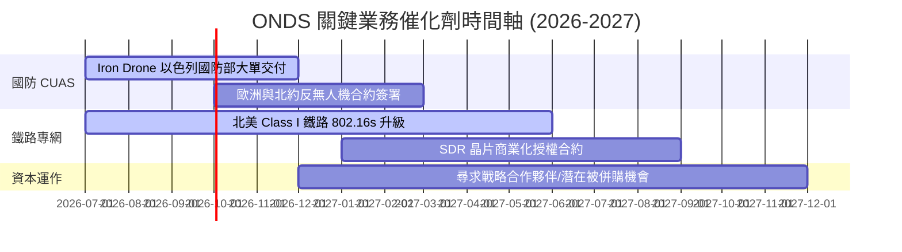

### 8.2 TAM 市場規模分析

```
╔══════════════════════════════════════════════════════════════════╗
║                    ONDS 目標市場規模 (TAM)                       ║
╠══════════════════════════════════════════════════════════════════╣
║                                                                  ║
║  1. 國防與關鍵基礎設施 CUAS 市場：                               ║
║     ├── 全球 TAM (2028F)： $8.50B                                ║
║     └── ONDS 預期滲透率：   1.5% (約 $127.5M 營收潛力)           ║
║                                                                  ║
║  2. 全球鐵路窄頻無線升級市場：                                   ║
║     ├── 全球 TAM (2028F)： $3.20B                                ║
║     └── ONDS 預期滲透率：   15.0% (約 $480.0M 營收潛力)          ║
║                                                                  ║
║  3. 自動化無人機數據服務 (DaaS)：                                ║
║     ├── 全球 TAM (2028F)： $5.00B                                ║
║     └── ONDS 預期滲透率：   0.8% (約 $40.0M 營收潛力)            ║
║                                                                  ║
║  📊 綜合 TAM 約 $16.70B，ONDS 目前 TTM 營收僅佔其 0.58%，成長    ║
║     空間巨大，關鍵在於執行力與資金消耗速度的平衡。               ║
╚══════════════════════════════════════════════════════════════════╝
```

### 8.3 成長驅動力結構圖

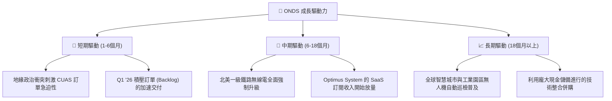

---

## 9. 風險矩陣

### 9.1 風險評分矩陣

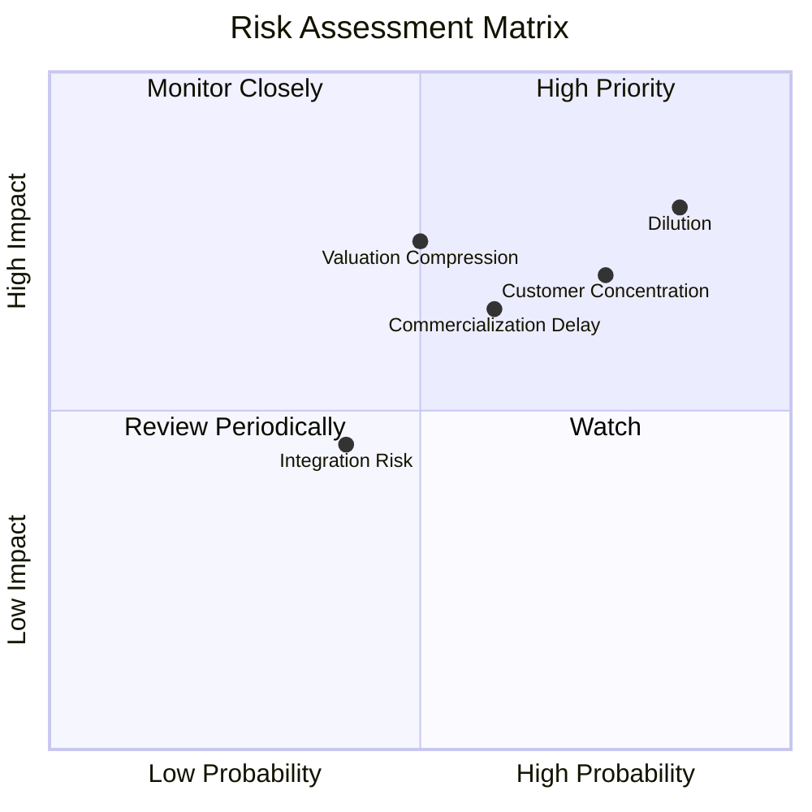

### 9.2 風險清單詳細分析

| # | 風險項目 | 發生機率 | 財務衝擊 | 風險評分 | 緩解措施 / 機構觀察 |
|---|----------|----------|----------|----------|---------------------|
| 1 | 🔴 **持續的股權稀釋** | **85%** | **80%** | 🔴 **8.25 / 10** | 公司目前 SBC 佔營收高達 35.3%，且頻繁透過增發股票獲取營運資金。管理層需建立明確的稀釋上限，並在營運現金流轉正後啟動回購。 |
| 2 | 🔴 **客戶集中度過高** | **75%** | **70%** | 🔴 **7.25 / 10** | 鐵路業務依賴北美少數幾家一級鐵路公司（如 CSX、NS）。公司正積極拓展歐洲鐵路市場與國防客戶以分散風險。 |
| 3 | 🟡 **商業化進度不及預期** | **60%** | **65%** | 🟡 **6.25 / 10** | Optimus 無人機系統的法規限制（如 FAA 超視距飛行 BVLOS 許可）可能延緩部署。公司正與監管機構深度合作。 |
| 4 | 🟡 **高估值面臨殺估值風險** | **50%** | **75%** | 🟡 **6.25 / 10** | 當前 EV/Sales 達 18.47x，若營收增速低於 50%，估值倍數將面臨腰斬。需確保每季營收增速符合高成長預期。 |

---

## 10. 投資建議

### 10.1 最終綜合評級雷達圖

```
╔══════════════════════════════════════════════════════════════╗
║                    ONDS 最終綜合評級雷達圖                   ║
╠══════════════════════════════════════════════════════════════╣
║ 基本面強度  5.0 ▓▓▓▓▓▓▓▓▓▓░░░░░░░░░░  ★★★☆☆           ║
║ 成長動能    9.0 ▓▓▓▓▓▓▓▓▓▓▓▓▓▓▓▓▓▓░░  ★★★★★           ║
║ 財務健康    9.5 ▓▓▓▓▓▓▓▓▓▓▓▓▓▓▓▓▓▓▓░  ★★★★★           ║
║ 估值合理性  3.5 ▓▓▓▓▓▓▓░░░░░░░░░░░░░  ★½☆☆☆           ║
║ 獲利品質    3.0 ▓▓▓▓▓▓░░░░░░░░░░░░░░  ★☆☆☆☆           ║
╠══════════════════════════════════════════════════════════════╣
║ 綜合總分    6.0 ▓▓▓▓▓▓▓▓▓▓▓▓░░░░░░░░  🏆 持有 (Hold)      ║
╚══════════════════════════════════════════════════════════════╝
```

### 10.2 目標價與隱含報酬率

* **當前股價**：$6.53
* **基準目標價**（12 個月）：**$7.50**
* **隱含報酬率**：**+14.8%**
* **建議評級**：🟡 **持有（Hold）**
* **機率權重分配**：悲觀 25% ｜ 基準 60% ｜ 樂觀 15%（加權期望值為 **$7.13**）

### 10.3 買入時機與觸發因素

```
╔══════════════════════════════════════════════════════════════════╗
║                  ✅ ONDS 投資行動觸發 Checklist                  ║
╠══════════════════════════════════════════════════════════════════╣
║                                                                  ║
║  立即買入/加碼觸發條件（需滿足至少兩項）：                       ║
║  [ ] 營運現金流 (OCF) 連續兩季流出小於 $10M (顯示燒錢速度放緩)   ║
║  [ ] 季度營收維持 50%+ YoY 成長，且不依賴單一國防大單            ║
║  [ ] 股權稀釋速度 (Shares Outstanding YoY 增速) 降至 10% 以下    ║
║                                                                  ║
║  減碼/停損觸發條件（出現任一即應執行）：                         ║
║  [ ] 季度毛利率跌破 35% (顯示價格競爭加劇或硬體成本失控)         ║
║  [ ] 核心鐵路專案進度延宕，導致季度營收出現 QoQ 衰退             ║
║  [ ] 發生大額無形資產或商譽減損 (Impairment Charge)              ║
║                                                                  ║
╚══════════════════════════════════════════════════════════════════╝
```

### 10.4 投資人適配度分析

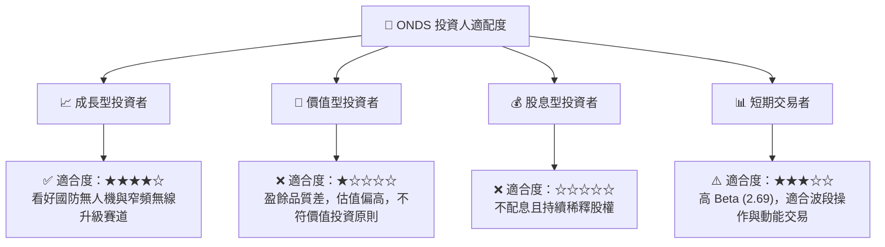

### 10.5 每季財報監控清單（Quarterly Watch List）

在未來的季度財報中，投資人應嚴格監控以下指標，以確認 ONDS 是否重回「創造股東價值」的軌道：

1. **核心業務營收成長率**：基準門檻為 **YoY 50%+**。若低於此增速，說明商業化遭遇瓶頸，18.47x 的 EV/Sales 估值將難以維持。
2. **營業損益（Operating Income）**：觀察是否隨著營收擴大而收斂。若營收增加但虧損同步擴大，說明營業槓桿失效。
3. **SBC 佔營收比重**：是否從目前的 **35.3%** 逐步下降至 15% 以下。這是評估管理層是否顧及小股東權益的關鍵指標。
4. **帳面現金消耗率（Cash Burn Rate）**：每季營運現金流出應控制在 **$15M** 以內，否則龐大的 $1.47B 現金儲備將被迅速消耗。

### 10.6 反面論證：什麼會證明論點錯誤（What Would Change My Mind）

```
╔══════════════════════════════════════════════════════════════════╗
║              ⚠️ 論點失效條件 (Disconfirming Evidence)            ║
╠══════════════════════════════════════════════════════════════════╣
║  本分析報告之「持有」評級，在下列情況發生時應立即下調至「賣出」：║
║                                                                  ║
║  [ ] 核心無人機業務（OAS）連續兩季營收低於 $15M，顯示商業化失敗。║
║  [ ] 營業利益率（Operating Margin）持續低於 -100%，無改善跡象。  ║
║  [ ] 自由現金流（FCF）失血速度加快，TTM 流出超過 $120M。          ║
║  [ ] ROIC 跌破 -20%，顯示公司在加速摧毀資本價值。                ║
║  [ ] 發生核心技術專利侵權訴訟，或失去北美鐵路標準的唯一性。      ║
╚══════════════════════════════════════════════════════════════════╝
```

---

> **免責聲明**：本報告由 CFA 級投資分析框架自動生成，僅供學術研究與投資參考，不構成任何買賣建議。投資人應自行承擔市場風險。