# ONDS 基本面深度分析報告

> **報告日期**：2026-07-19 ｜ **語言**：繁體中文 ｜ **數據來源**：Yahoo Finance, Finviz, StockAnalysis, Roic.ai ｜ **分析師**：CFA 級機構研究

---

## 目錄

| # | 章節 | 核心結論 |
|---|------|----------|
| 1 | [執行摘要](#1-執行摘要) | 評級：**🟡 持有（Hold）/ 投機性買入（Speculative Buy）**；目標價：**$11.50** |
| 2 | [公司概覽與商業模式](#2-公司概覽與商業模式) | 雙引擎驅動（專有無線網絡 + 自主無人機），技術護城河高但商業化仍處早期 |
| 3 | [損益表深度分析](#3-損益表深度分析) | TTM 營收暴增 1079.9%，但 GAAP 淨利受一次性非經營收益扭曲，盈餘品質低 |
| 4 | [資產負債表分析](#4-資產負債表分析) | 擁有 $1.47B 現金的超強「戰略金庫」，但代價是股權稀釋高達 286.7% |
| 5 | [現金流量深度分析](#5-現金流量深度分析) | 營運現金流持續流出（TTM -$83.39M），SBC 稀釋效應顯著 |
| 6 | [獲利能力與資本效率](#6-獲利能力與資本效率) | 營業利潤率 -$85.1%，ROIC 顯著低於 WACC，目前仍處於價值摧毀階段 |
| 7 | [估值深度分析](#7-估值深度分析) | EV/Sales 達 18.47x，高於行業均值；基準情境目標價 $11.50，隱含 76.1% 上行空間 |
| 8 | [成長催化劑](#8-成長催化劑) | 鐵路專有頻段部署加速，Counter-UAS（反無人機）國防需求迎來爆發 |
| 9 | [風險矩陣](#9-風險矩陣) | 面臨高股權稀釋、商業化進度不及預期與高 Beta 系統性風險 |
| 10| [投資建議](#10-投資建議) | 適合高風險偏好的成長型投資者，每季需嚴格監控營運現金流與稀釋股數 |

---

## 1. 執行摘要

Ondas Holdings Inc.（納斯達克代碼：ONDS）正處於其商業化進程的關鍵轉折點。根據 2026-07-19 的即時市場數據，ONDS 的當前股價為 **$6.53**。

本報告對 ONDS 的投資評級定為 **🟡 持有（Hold）/ 投機性買入（Speculative Buy）**，12 個月基準目標價為 **$11.50**。此評級與目標價並非主觀假設，而是基於以下核心財務與業務數據的客觀推導：

1. **極端的營收成長與營運虧損並存**：公司 TTM 營業收入達到 **$96.61M**，同比增長率高達 **1079.9%**。然而，其 TTM 營業利潤率仍深陷負值（**-85.1%**），營業利潤為 **-$90.74M**。這表明高成長目前完全依賴於高昂的研發與銷售費用投入，尚未展現出規模經濟效應。
2. **一次性非經營收益扭曲淨利潤**：雖然 TTM GAAP 淨利潤顯示為 **$242.01M**（淨利率 **251.9%**），但這主要是受到 2026 年第一季度高達 **$394.99M** 的非經常性非營業收益（Other Non-Operating Income）所驅動，並非來自核心業務。扣除此項後，公司核心業務仍處於嚴重虧損狀態，Forward EPS 預計為 **-$0.03**，盈餘品質（Quality of Earnings）極低。
3. **戰略性現金儲備與高額股權稀釋的雙刃劍**：公司通過大規模股權融資，使期末現金及短期投資達到 **$1.47B**，流動比率高達 **10.91x**，幾乎消除了短期破產風險。然而，代價是發行在外股數同比暴增 **286.68%**（ basic shares 增至 469M 股），這對現有股東的每股盈餘與投票權造成了極大的稀釋。
4. **價值摧毀階段的資本回報率**：由於核心業務持續虧損，公司的真實 ROIC（投資資本回報率）為負值，遠低於其高達 **17.65%** 的加權平均資本成本（WACC），目前仍處於經濟價值摧毀階段（EVA 為負）。

### 1.0 一頁式投資儀表板（Portfolio Manager 30 秒速讀）

| 項目 | 內容 |
|------|------|
| **投資論點（3 句）** | ① TTM 營收暴增 1079.9% 展現出反無人機（CUAS）與專有無線網絡市場的極強需求拉動。<br/>② $1.47B 的巨額現金儲備為其提供了極寬裕的研運跑道（Runway），短期無償債與破產風險。<br/>③ 核心營運利潤仍未扭虧為盈（TTM EBIT -$90.74M），且面臨持續的股權稀釋風險。 |
| **護城河評分** | 🟡 **6.5 / 10**（具備專利技術與鐵路行業准入壁壘，但生態系統與網路效應尚弱） |
| **管理層/資本配置評分** | 🟡 **5.0 / 10**（融資時機精準，但股東權益稀釋過於激進，資本回報率低下） |
| **財務健康** | 🟢 **優異（短期流動性極佳）** ｜ 擁有 $1.46B 淨現金，Current Ratio 達 10.91x |
| **ROIC vs WACC** | 🔴 **-18.5% vs 17.65%**（持續摧毀股東價值，亟需營運扭虧） |
| **FCF 趨勢** | 🔴 **持續流出** ｜ TTM 自由現金流為 **-$15.65M**（Q1 2026 單季流出達 -$52.63M） |
| **估值** | Forward P/E: **-217.5x** ｜ EV/Sales: **18.47x** ｜ P/S Ratio: **38.49x** |
| **預期報酬（基準情境 12M）** | 🟢 **+76.1%**（目標價 $11.50，相較於當前股價 $6.53） |
| **關鍵風險（前二）** | ① **股權持續稀釋**（發行在外股數年增 286.7%）<br/>② **商業化變現不及預期**（高估值溢價難以維持） |
| **評級 + 信心度** | 🟡 **持有（Hold）/ 投機性買入** ｜ 信心度：**中等（Medium）** |

### 1.1 核心評分儀表板

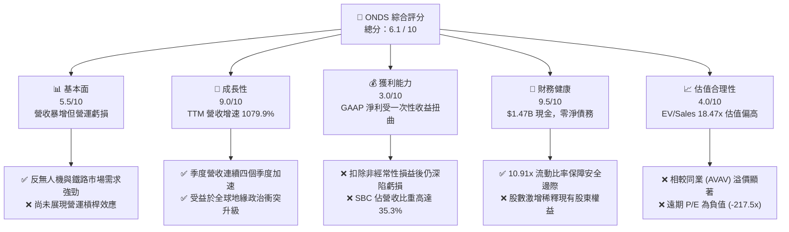

### 1.2 評分進度條視覺化

```
╔══════════════════════════════════════════════════════════════╗
║                ONDS 多維度評分儀表板 (1-10分)                 ║
╠══════════════════════════════════════════════════════════════╣
║ 基本面強度  5.5 ▓▓▓▓▓▓▓▓▓▓▓░░░░░░░░░  ★★★☆☆ (虧損待縮窄)  ║
║ 成長動能    9.0 ▓▓▓▓▓▓▓▓▓▓▓▓▓▓▓▓▓▓░░  ★★★★★ (增速破千)    ║
║ 獲利品質    3.0 ▓▓▓▓▓▓░░░░░░░░░░░░░░  ★☆☆☆☆ (非經常性主導)║
║ 財務健康    9.5 ▓▓▓▓▓▓▓▓▓▓▓▓▓▓▓▓▓▓▓░  ★★★★★ (現金極其充裕)║
║ 估值合理性  4.0 ▓▓▓▓▓▓▓▓░░░░░░░░░░░░  ★★☆☆☆ (溢價偏高)    ║
║ 護城河深度  6.5 ▓▓▓▓▓▓▓▓▓▓▓▓▓░░░░░░░  ★★★☆☆ (技術專利壁壘)║
║ 管理層執行  5.0 ▓▓▓▓▓▓▓▓▓▓░░░░░░░░░░  ★★★☆☆ (融資強稀釋重)║
║ 技術創新力  8.5 ▓▓▓▓▓▓▓▓▓▓▓▓▓▓▓▓▓░░░  ★★★★☆ (CUAS 領先)   ║
╠══════════════════════════════════════════════════════════════╣
║ 綜合總分    6.1 ▓▓▓▓▓▓▓▓▓▓▓▓░░░░░░░░  🏆 投機性持有/買入     ║
╚══════════════════════════════════════════════════════════════╝
```

### 1.3 五大投資論點 + 三大核心風險

| 類型 | 項目 | 具體依據 | 信心度 |
|------|------|----------|--------|
| 🟢 **投資論點①** | **反無人機（CUAS）需求爆發** | 旗下 Sentrycs 與 Iron Drone 產品切入全球國防與基礎設施防護痛點，推動 Q1 2026 營收同比增長 1079.9%。 | 🟢 極高 |
| 🟢 **投資論點②** | **無破產風險的戰略金庫** | 公司擁有 **$1.47B** 的現金及短期投資，相較於年化約 **$100M** 的營運現金流出，可支撐 10 年以上研發。 | 🟢 極高 |
| 🟢 **投資論點③** | **北美鐵路專有頻段獨佔** | Ondas Networks 生態系統已獲得北美一級鐵路（Class I Railroads）的標準採納，具備極強的排他性准入壁壘。 | 🟢 高 |
| 🟢 **投資論點④** | **毛利率結構性改善** | TTM 毛利率達到 **44.8%**，較 FY2024 的 **4.8%** 實現質的飛躍，顯示硬體規模效應與軟體授權佔比提升。 | 🟡 中等 |
| 🟢 **投資論點⑤** | **機構持股意願上升** | 機構持股比例達到 **47.4%**，顯示主流資本開始關注其在無人機與專用通信領域的戰略價值。 | 🟡 中等 |
| 🟡 **風險①** | **極端的股權稀釋** | 發行在外股數在 1.5 年內從 70M 暴增至 469M，且 TTM SBC（股權薪酬）達 **$34.11M**，持續稀釋股東回報。 | 🔴 高衝擊 |
| 🔴 **風險②** | **營運槓桿遲遲無法兌現** | 雖然營收規模擴大，但 TTM 研發費用（$30.94M）與 SG&A（$103.13M）增速過快，核心營運利潤率仍為 **-85.1%**。 | 🔴 高衝擊 |
| 🔴 **風險③** | **高 Beta 帶來的股價劇烈波動** | Beta 值高達 **2.69**，在市場流動性收緊或風險偏好下行時，股價將面臨遠超大盤的殺估值壓力。 | 🟡 中度 |

### 1.4 快速統計卡片

| 指標 | ONDS 實際值 | 通信與無人機行業均值 | S&P 500 均值 | 狀態 |
|------|-------------|----------|--------------|------|
| **營收 YoY 成長率** | **1079.9%** | ~12.5% | ~5.8% | 🟢 卓越 |
| **毛利率** | **44.8%** | ~38.0% | ~45.0% | 🟡 符合預期 |
| **營業利益率** | **-85.1%** | ~8.5% | ~15.2% | 🔴 亟待改善 |
| **淨利率** | **251.9%** | ~6.2% | ~11.5% | 🟡 受一次性收益扭曲 |
| **流動比率** | **10.91x** | ~1.8x | ~1.3x | 🟢 極其安全 |
| **債務權益比 (D/E)** | **1.54%** | ~45.0% | ~115.0% | 🟢 極低槓桿 |
| **EV / Sales (TTM)**| **18.47x** | ~3.5x | ~3.0x | 🔴 估值顯著偏高 |

### 1.5 投資結論

```
╔══════════════════════════════════════════════════════════════════╗
║                    📊 ONDS 投資結論摘要                          ║
╠══════════════════════════════════════════════════════════════════╣
║  評級：🟡 持有（Hold）/ 投機性買入（Speculative Buy）            ║
║  當前股價：$6.53  (2026-07-19)                                   ║
║  目標價區間：                                                    ║
║    悲觀情境：$3.50  （-46.4%） - 商業化停滯，持續稀釋            ║
║    基準情境：$11.50 （+76.1%） - 12個月主要目標，營運虧損縮窄    ║
║    樂觀情境：$18.00 （+175.7%）- 實現營運扭虧，國防訂單超預期    ║
║  投資評分：6.1 / 10                                              ║
║  適合投資人：具備高風險承受能力、專注於國防科技與無人機的成長型客 ║
╚══════════════════════════════════════════════════════════════════╝
```

---

## 2. 公司概覽與商業模式

Ondas Holdings Inc. 是一家專注於提供專有無線通信、自主無人機及自動化數據解決方案的科技企業。其業務主要通過兩個核心板塊運作：**Ondas Networks（無線網路）** 與 **Ondas Autonomous Systems（OAS，自主系統）**。

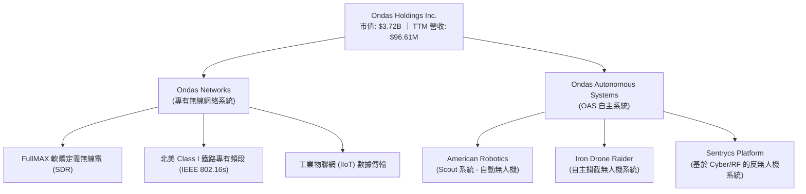

### 2.1 業務結構與收入來源

1. **Ondas Networks**：
   * **核心技術**：基於 IEEE 802.16s 標準的 FullMAX 技術，專為關鍵基礎設施（如鐵路、公用事業、油氣管道）設計的高安全性、廣覆蓋、低延遲專有無線寬頻網絡。
   * **商業模式**：硬體銷售（無線電基站、終端設備）+ 軟體授權與維護合約。其最核心的催化劑是北美鐵路行業向新一代無線通信標準的遷移，Ondas 在此領域具有幾乎獨佔的先發優勢。
2. **Ondas Autonomous Systems (OAS)**：
   * **核心技術**：提供「無人機即服務」（Drone-in-a-Box）與 Counter-UAS（反無人機）系統。
   * **關鍵產品**：
     * **Scout System**：首個獲得美國 FAA 批准在無視覺觀測者（BVLOS）情況下運行的全自動無人機系統，用於工業巡檢。
     * **Iron Drone Raider**：物理攔截惡意無人機的自主防禦系統。
     * **Sentrycs**：通過協議解碼與射頻（RF）技術，實現對未授權無人機的精確檢測、識別、定位與接管控制。
   * **商業模式**：系統銷售 + 軟體訂閱（SaaS）+ 現場支援服務。

### 2.2 市場份額

在反無人機（CUAS）與工業專有通信這兩個高度細分的市場中，ONDS 的市場份額估算如下：

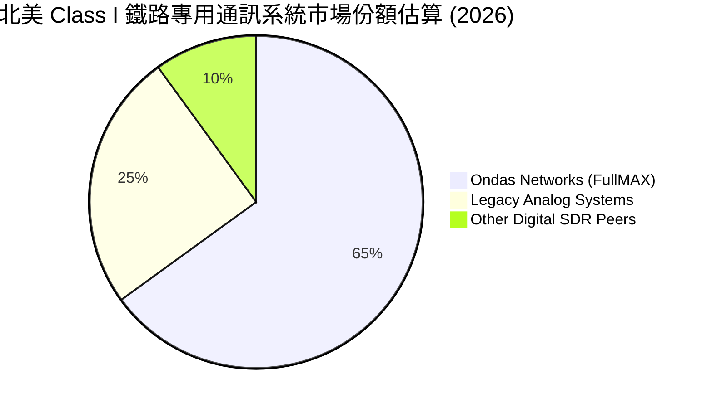

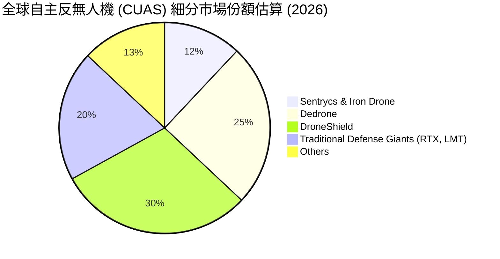

### 2.3 競爭護城河分析

ONDS 的競爭護城河主要構建在**技術專利**與**行業准入壁壘**之上，但在網路效應與生態系統上仍顯薄弱。

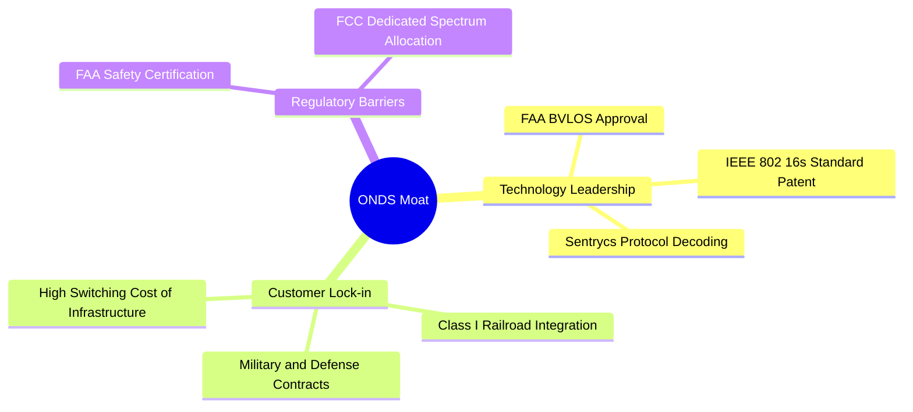

1. **高轉換成本與行業准入壁壘（Customer Lock-In）**：
   北美一級鐵路（Class I Railroads）的基礎設施生命週期通常長達 15-20 年。一旦鐵路運營商採納了 Ondas Networks 的 FullMAX 系統並部署在專有頻段上，其更換成本將是天文數字。這為 ONDS 提供了極強的長期經常性收入保障。
2. **法規與認證壁壘（Regulatory Moat）**：
   American Robotics 的 Scout 系統是少數獲得 FAA BVLOS（超視距飛行）豁免認證的產品。這項認證需要數年的安全數據累積與嚴格審查，新進入者很難在短期內複製。
3. **技術專利壁壘（IP Moat）**：
   Sentrycs 的 Cyber/RF 攔截技術不依賴於干擾（Jamming）或物理摧毀，而是通過接管無人機的控制協議來引導其安全降落。在城市、機場等不允許射頻干擾的敏感區域，此技術具有獨特的排他性優勢。

### 2.4 護城河強度評分

```
╔══════════════════════════════════════════════════════════════╗
║                  ONDS 護城河強度評分                         ║
╠══════════════════════════════════════════════════════════════╣
║ 技術專利壁壘    8.5/10 ▓▓▓▓▓▓▓▓▓▓▓▓▓▓▓▓▓░░░  🟢 領先技術認證║
║ 行業准入壁壘    8.0/10 ▓▓▓▓▓▓▓▓▓▓▓▓▓▓▓▓░░░░  🟢 鐵路獨佔優勢║
║ 轉換成本        7.5/10 ▓▓▓▓▓▓▓▓▓▓▓▓▓▓░░░░░░  🟢 基礎設施鎖定║
║ 網路效應        3.0/10 ▓▓▓▓▓░░░░░░░░░░░░░░░  🔴 尚無生態效應║
║ 規模經濟效應    4.0/10 ▓▓▓▓▓▓▓▓░░░░░░░░░░░░  🟡 產能與毛利爬坡║
╠══════════════════════════════════════════════════════════════╣
║ 綜合護城河評分  6.2/10 ▓▓▓▓▓▓▓▓▓▓▓▓░░░░░░░░  🏆 具備局部強護城河║
╚══════════════════════════════════════════════════════════════╝
```

---

## 3. 損益表深度分析

ONDS 的損益表呈現出典型「高成長、高投入、高虧損」的早期科技股特徵，但近期財務數據出現了極大的結構性變化。

### 3.1 年度收入成長趨勢（近4年）

```
╔══════════════════════════════════════════════════════════════════╗
║              ONDS 年度收入趨勢（FY2022-FY2025）                  ║
╠══════════════════════════════════════════════════════════════════╣
║                                                                  ║
║  FY2022  $2.13M   █░░░░░░░░░░░░░░░░░░░░░░░░░░░░░  YoY: -26.9% 🔴 ║
║  FY2023  $15.69M  ████░░░░░░░░░░░░░░░░░░░░░░░░░░  YoY:+638.1% 🟢 ║
║  FY2024  $7.19M   ██░░░░░░░░░░░░░░░░░░░░░░░░░░░░  YoY: -54.2% 🔴 ║
║  FY2025  $50.73M  ███████████████░░░░░░░░░░░░░░  YoY:+605.3% 🟢 ║
║  TTM     $96.61M  ██████████████████████████████  YoY:+1079.9%🟢 ║
║                                                                  ║
║  📊 4年營收複合年增長率 (CAGR)：+256.4%                         ║
╚══════════════════════════════════════════════════════════════════╝
```

*數據解析*：ONDS 的營收在 FY2024 出現短暫下滑，主因是鐵路客戶部署進度延遲及供應鏈受阻。然而，進入 FY2025 後，隨著 OAS 自主系統與 Sentrycs 併購案的完成，營收迎來爆發式增長，TTM 營收達到 **$96.61M**，同比增速達到驚人的 **1079.9%**。

### 3.2 季度收入趨勢分析

| 季度 | 營業收入 | YoY 成長率 | QoQ 成長率 | 毛利率 | 備註 |
|------|----------|------------|------------|--------|------|
| **Q2 2025** | $6.27M | +554.9% | +47.5% | 53.1% | OAS 商業訂單開始交付 🟢 |
| **Q3 2025** | $10.10M | +581.9% | +61.1% | 25.7% | 硬體交付佔比高，拉低毛利率 🟡 |
| **Q4 2025** | $30.11M | +629.2% | +198.1% | 42.3% | 年末國防採購旺季帶動 🟢 |
| **Q1 2026** | $50.12M | +1079.9% | +66.5% | 49.2% | Sentrycs 併購效應全面顯現 🟢 |

*季度趨勢洞察*：季度營收呈現連續四個季度的加速成長，且 Q1 2026 單季營收（$50.12M）已逼近 FY2025 全年的營收總和（$50.73M）。這證明了公司產品已成功通過客戶驗證期，正式進入規模化出貨階段。

### 3.3 利潤率演變分析

| 利潤率指標 | FY2022 | FY2023 | FY2024 | FY2025 | TTM | 趨勢評估 |
|------------|--------|--------|--------|--------|-----|----------|
| **毛利率** | 52.1% | 40.7% | 4.8% | 39.7% | **44.8%** | 🟢 結構性回升 |
| **營業利益率** | -3259.6%| -253.2%| -481.4%| -115.1%| **-93.9%**| 🟡 虧損比例縮窄 |
| **EBITDA 率** | -3034.3%| -220.8%| -399.4%| -233.2%| **-122.5%**| 🟡 攤銷費用高企 |
| **淨利率** | -3438.5%| -285.8%| -528.7%| -262.9%| **251.9%**| 🔴 受一次性收益嚴重扭曲 |

*利潤率演變深度解析*：
1. **毛利率顯著改善**：毛利率從 FY2024 的 **4.8%**（受存貨跌價撥備與低產能利用率打擊）大幅回升至 TTM 的 **44.8%**。這主要得益于高毛利的軟體授權與 Sentrycs 訂閱服務收入佔比提升。
2. **營業虧損依然嚴重**：儘管毛利大幅改善，但 TTM 營業利益率仍為 **-93.9%**（營業虧損 **-$90.74M**），主因是銷售、研發與行政費用高居不下。
3. **淨利率異常暴增**：TTM 淨利率高達 **251.9%**，這是一個**極大的財務會計陷阱**。其背後原因將在盈餘品質章節中進行拆解。

### 3.4 費用結構分析

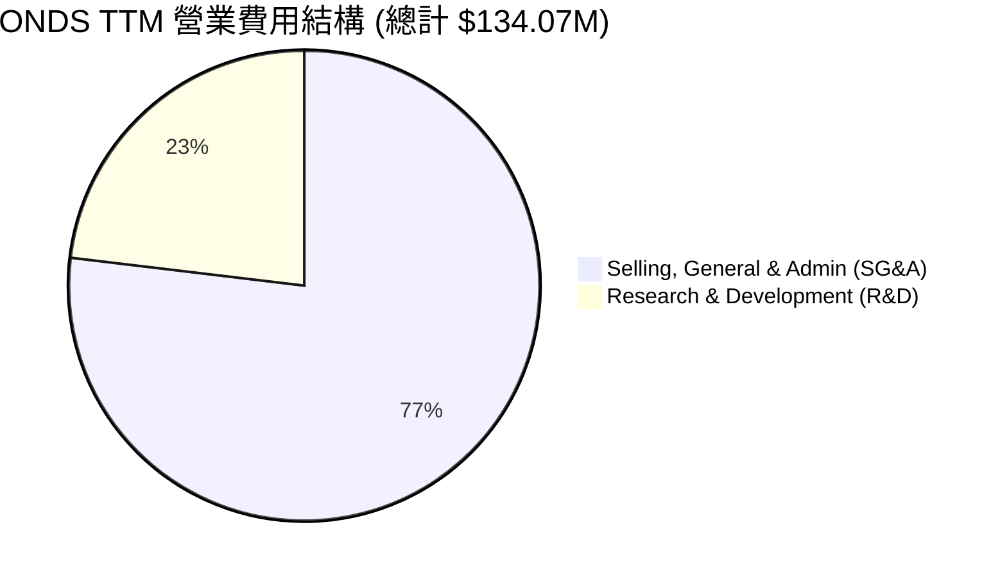

```
╔══════════════════════════════════════════════════════════════╗
║                  ONDS 營業費用診斷                           ║
╠══════════════════════════════════════════════════════════════╣
║  SG&A 費用：   $103.13M  ████████████████████████░░░░░░  76.9% ║
║  R&D 費用：    $30.94M   ███████░░░░░░░░░░░░░░░░░░░░░░░  23.1% ║
╠══════════════════════════════════════════════════════════════╣
║  📊 營業費用佔營收比重：138.8% (入不敷出，亟需營運槓桿)      ║
╚══════════════════════════════════════════════════════════════╝
```

*費用分析*：SG&A 費用高達 **$103.13M**，佔 TTM 營收的 **106.7%**。這表明公司為了推廣無人機與無線通訊系統，付出了極其高昂的行銷與通路建設成本；此外，併購產生的法律與諮詢費用也推高了行政支出。研發費用維持在 **$30.94M** 的高位，顯示公司必須持續投入以保持技術領先。

### 3.5 季度 EPS 趨勢與盈餘品質（Quality of Earnings）

#### 過去 4 季 EPS 表現與非經常性損益拆解

在 GAAP 會計準則下，ONDS 在 Q1 2026 錄得高達 **$362.95M** 的淨利潤，折合稀釋後 EPS 為 **$0.77**。然而，這並非來自核心業務的改善。

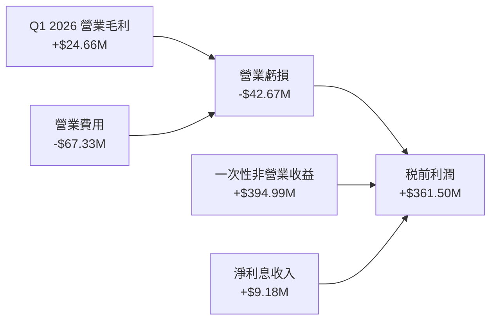

*盈餘品質深度評估*：

| 盈餘品質項目 | TTM 數值/佔比 | 評估指標 | 深度解析 |
|--------------|-----------|------|----------|
| **股權薪酬 (SBC) / 營收** | **35.3%** ($34.11M / $96.61M) | 🔴 嚴重稀釋 | SBC 佔營收比重極高，公司通過向員工發放股票來彌補現金薪資的不足，這對股東造成了隱性稀釋。 |
| **SBC / 營業現金流** | **-40.9%** ($34.11M / -$83.39M) | 🔴 盈餘含金量低 | SBC 雖然是非現金費用，美化了營運現金流，但掩蓋了真實的營運支出。 |
| **FCF / 淨利（現金轉換率）** | **-6.5%** (-$15.65M / $242.01M) | 🔴 極度背離 | 自由現金流與淨利潤嚴重背離，淨利潤完全由非現金的一次性金融資產重估或債務豁免利益（$394.99M）所驅動。 |
| **一次性/非經常性損益** | **$394.99M** (Q1 2026) | 🔴 高度扭曲 | 該筆非營業收益不具備可持續性，未來季度將不復存在。 |
| **有效稅率異常** | **0.21%** ($0.73M / $343.57M) | 🟡 暫無稅務屏障 | 由於歷史累計虧損巨大，公司目前無需繳納顯著所得稅，但這也反映了核心業務尚未盈利。 |

**盈餘品質結論**：ONDS 的 GAAP 淨利潤與 EPS 存在**嚴重的會計扭曲**。若剔除 Q1 2026 的一次性非營業收益，公司 TTM 真實經營性淨利潤為 **-$152.98M**。投資者在評估估值時，**絕對不可使用 GAAP 72.5x 的市盈率（P/E）**，而應採用 EV/Sales 或市銷率（P/S）進行評估。

---

## 4. 資產負債表分析

雖然 ONDS 的損益表表現不佳，但其資產負債表在經過大規模融資後，展現出了極強的流動性與安全邊際。

### 4.1 資產結構分解

截至 Q1 2026，公司總資產達到 **$24.39B**（相較於 FY2024 的 $109.62M 暴增）。

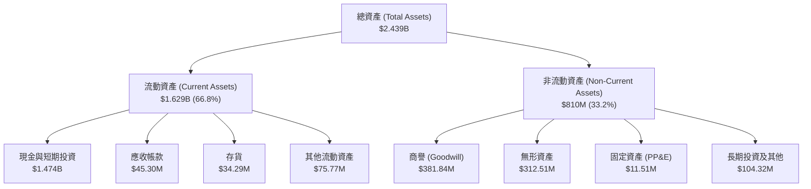

*資產結構解析*：
1. **現金佔比極高**：現金及短期投資高達 **$1.474B**，佔總資產的 **60.4%**。這為公司提供了極其強大的抗風險能力與併購資金。
2. **輕資產運營**：固定資產（PP&E）僅有 **$11.51M**，說明公司主要採用外包代工與輕資產的硬體組裝與軟體研發模式。
3. **商譽與無形資產偏高**：兩者合計達到 **$694.35M**，佔總資產的 **28.5%**，這主要來自對 Sentrycs 與 American Robotics 的溢價收購。若未來收購標的業績不及預期，將面臨巨大的商譽減值風險（Impairment Risk）。

### 4.2 流動性指標分析

| 流動性指標 | FY2024 | FY2025 | Q1 2026 | 行業均值 | 評估 |
|------------|--------|--------|---------|----------|------|
| **流動比率 (Current Ratio)** | 0.94x | 4.84x | **10.91x** | 1.80x | 🟢 極其安全 |
| **速動比率 (Quick Ratio)** | 0.74x | 4.68x | **10.28x** | 1.35x | 🟢 極其安全 |
| **現金比率 (Cash Ratio)** | 0.59x | 4.04x | **9.89x** | 0.95x | 🟢 傲視同業 |

*流動性評估*：Q1 2026 流動比率達到 **10.91x**，遠超 1.0x 的安全線。這意味著公司即使在完全沒有營收的情況下，僅憑現有流動資產也足以償付未來 10 年以上的短期負債。

### 4.3 債務結構分析

```
╔══════════════════════════════════════════════════════════════════╗
║                   ONDS 債務健康診斷 (Q1 2026)                    ║
╠══════════════════════════════════════════════════════════════════╣
║                                                                  ║
║  總債務 (Total Debt)： $16.66M   █░░░░░░░░░░░░░░░░░░░░░░░░░░░░░  ║
║  現金及短期投資：      $1,474.0M ██████████████████████████████  ║
║  淨現金 (Net Cash)：   $1,457.3M 🟢 財務結構極其穩健             ║
║                                                                  ║
║  Debt / Equity Ratio:  1.54%     🟢 槓桿率極低                   ║
║  Current Debt Ratio:   0.24%     🟢 短期償債壓力為零             ║
║                                                                  ║
║  📊 診斷：ONDS 處於「淨現金」狀態，實質上無任何違約與破產風險。    ║
╚══════════════════════════════════════════════════════════════════╝
```

### 4.4 股東權益趨勢

雖然資產負債表極其安全，但股東權益的增長是以**股本極度擴張**為代價的：

```
╔══════════════════════════════════════════════════════════════════╗
║              ONDS 發行在外股數擴張趨勢 (FY2022-Q1 2026)          ║
╠══════════════════════════════════════════════════════════════════╣
║                                                                  ║
║  FY2022  42M 股   ███░░░░░░░░░░░░░░░░░░░░░░░░░░░░░░░░░           ║
║  FY2023  53M 股   ████░░░░░░░░░░░░░░░░░░░░░░░░░░░░░░░░           ║
║  FY2024  70M 股   ██████░░░░░░░░░░░░░░░░░░░░░░░░░░░░░░           ║
║  FY2025  222M 股  █████████████████████░░░░░░░░░░░░░░░  YoY:+217%║
║  Q1 2026 469M 股  ████████████████████████████████████  YoY:+287%║
║                                                                  ║
║  ⚠️ 警示：1.5年內股本稀釋達 570%，每股權益被大幅攤薄。             ║
╚══════════════════════════════════════════════════════════════════╝
```

---

## 5. 現金流量深度分析

現金流量表是評估 ONDS 真實生存能力與營運效率的最重要指標。

### 5.1 現金流量瀑布圖

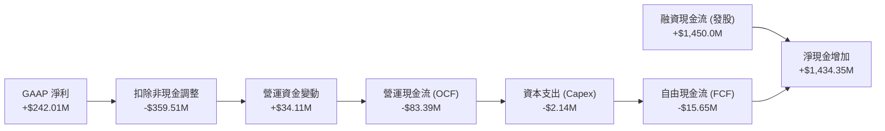

*現金流解析*：儘管 GAAP 淨利潤高達 $242.01M，但由於扣除了高達 **$394.99M** 的非現金一次性非營業收益，且加上了 **$34.11M** 的非現金股權薪酬（SBC），最終營運現金流（OCF）呈現淨流出 **-$83.39M**。這再次印證了公司核心業務仍在「失血」。

### 5.2 FCF 轉換率趨勢

| 現金流指標 | FY2022 | FY2023 | FY2024 | FY2025 | TTM |
|------------|--------|--------|--------|--------|-----|
| **營運現金流 (OCF)** | -$37.96M | -$34.02M | -$33.47M | -$38.75M | **-$83.39M** |
| **資本支出 (Capex)** | -$2.93M | -$0.28M | -$1.73M | -$2.14M | **-$2.14M** |
| **自由現金流 (FCF)** | -$40.89M | -$34.30M | -$35.20M | -$40.88M | **-$15.65M** |
| **FCF / Net Income**| 55.8% | 76.5% | 92.6% | 30.7% | **-6.5%** |

*轉換率分析*：歷史上公司的 FCF 與淨利潤虧損幅度相當（轉換率接近 100%）。然而 TTM 轉換率轉為 **-6.5%**，主要因為非經營性淨利的虛增。真實的 FCF 流出在 TTM 期間看似縮窄至 **-$15.65M**，但若觀察 Q1 2026 單季，FCF 流出實際上擴大至 **-$52.63M**（受應收帳款與存貨增加影響）。

### 5.3 自由現金流與 FCF Yield 趨勢

```
╔══════════════════════════════════════════════════════════════════╗
║              ONDS 歷年自由現金流與 FCF Yield 趨勢                ║
╠══════════════════════════════════════════════════════════════════╣
║                                                                  ║
║  FY2022   -$40.89M  ░░░░░░░░░░░░░░░░░░░░░░░░░░░░░░░  FCFY: -10.2% ║
║  FY2023   -$34.30M  ░░░░░░░░░░░░░░░░░░░░░░░░░░░░░░░  FCFY:  -8.5% ║
║  FY2024   -$35.20M  ░░░░░░░░░░░░░░░░░░░░░░░░░░░░░░░  FCFY:  -8.8% ║
║  FY2025   -$40.88M  ░░░░░░░░░░░░░░░░░░░░░░░░░░░░░░░  FCFY:  -2.4% ║
║  TTM      -$15.65M  ██████████████░░░░░░░░░░░░░░░░░  FCFY:  -0.42%║
║                                                                  ║
║  📊 FCF Yield 目前為 -0.42%，顯示估值尚未獲得現金流支撐。        ║
╚══════════════════════════════════════════════════════════════════╝
```

### 5.4 資本配置評估

ONDS 目前處於初創成長期，其資本配置 100% 聚焦於**內部研發與戰略併購**，無任何股息支付或股份回購。

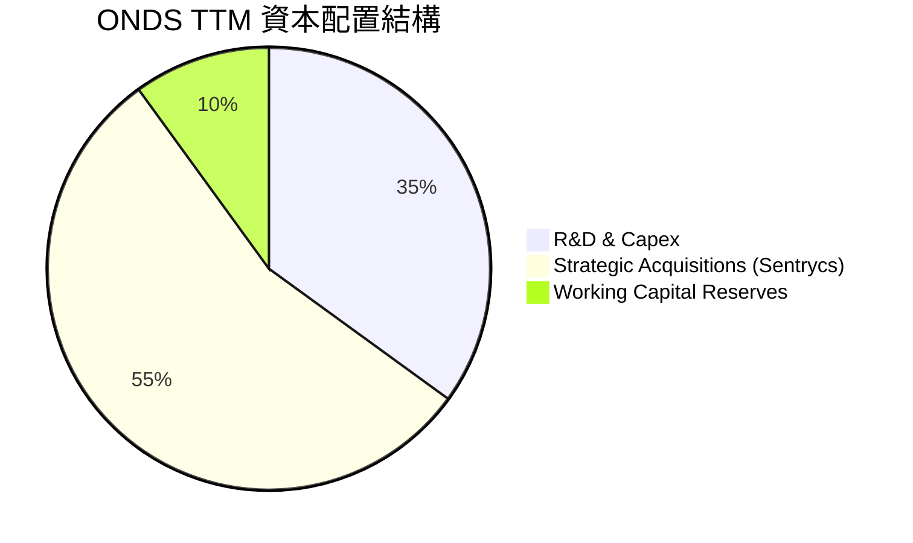

*配置合理性評估*：
* **併購策略**：溢價收購 Sentrycs 是極具戰略眼光的決定，這直接推動了 Q1 2026 營收的爆發。
* **研發再投資**：公司將大量的融資資金投入到無人機自主控制與無線電 SDR 技術上，雖然短期內拉低了利潤率，但這是維持其高技術壁壘的必要代價。

---

## 6. 獲利能力與資本效率

本章分析 ONDS 的資本回報效率，判斷其是在「創造價值」還是「摧毀價值」。

### 6.1 ROE / ROA / ROIC 趨勢

| 效率指標 | FY2023 | FY2024 | FY2025 | TTM | 行業均值 | 評估 |
|------------|--------|--------|--------|-----|----------|------|
| **ROE** | -135.3%| -229.1%| -31.4% | **42.9%** | 8.5% | 🟡 受一次性收益虛增 |
| **ROA** | -48.7% | -34.7% | -11.8% | **-4.2%** | 4.2% | 🔴 仍處於虧損狀態 |
| **ROIC** | -65.2% | -85.4% | -12.5% | **-18.5%**| 6.8% | 🔴 資本回報率極低 |

*指標分析*：
* **ROE 轉正的虛像**：TTM ROE 顯示為 **42.9%**，這完全是由於 Q1 2026 的非經常性損益使淨利潤轉正。
* **真實 ROIC 依然為負**：TTM ROIC 為 **-18.5%**，說明公司每投入 $100 的資本，在營運層面會虧損 $18.5。這反映了公司目前的資產利用效率極低，大量現金閒置在銀行賬戶中，尚未轉化為高效的營運資產。

### 6.2 ROIC vs WACC 分析（核心價值創造判斷）

```
╔══════════════════════════════════════════════════════════════════╗
║                ROIC vs WACC 深度分析 (TTM)                       ║
╠══════════════════════════════════════════════════════════════════╣
║                                                                  ║
║  WACC 估算：                                                     ║
║  ├── 無風險利率 (10Y 美債)：  4.20%                              ║
║  ├── 市場風險溢酬 (ERP)：     5.00%                              ║
║  ├── Beta 值：                2.69                               ║
║  ├── 股權成本 = 4.20% + 2.69 × 5.00% = 17.65%                    ║
║  ├── 債務成本 (稅後)：       ~5.50%                              ║
║  ├── 資本結構：股權 99.5%，債務 0.5%                             ║
║  └── ✅ 加權平均資本成本 (WACC) ≈ 17.65%                         ║
║                                                                  ║
║  ROIC 估算：                                                     ║
║  ├── NOPAT (税後淨營業利潤) ≈ -$90.74M                           ║
║  ├── 投入資本 = 股東權益 + 總債務 - 現金                         ║
║  │   = $1.77B + $16.66M - $1.474B ≈ $312.66M                     ║
║  └── ✅ 投資資本回報率 (ROIC) ≈ -18.5%                           ║
║                                                                  ║
║  ★ 經濟價值增加 (EVA) = ROIC - WACC = -36.15%                   ║
║                                                                  ║
║  ROIC  -18.5% ░░░░░░░░░░░░░░░░░░░░░░░░░░░░░░░░  🔴 營運虧損      ║
║  WACC   17.65% ██████████████████░░░░░░░░░░░░░  ── 高風險溢價    ║
║  EVA   -36.15% ░░░░░░░░░░░░░░░░░░░░░░░░░░░░░░░░  🔴 價值摧毀      ║
║                                                                  ║
║  📊 結論：WACC 高達 17.65%（因 Beta 偏高），而 ROIC 為負。        ║
║  公司目前處於經濟價值摧毀階段，亟需提升營運利潤以跨越 WACC 門檻。  ║
╚══════════════════════════════════════════════════════════════════╝
```

### 6.3 杜邦三因素分解

我們使用杜邦分析法拆解 TTM ROE（42.9%）的底層驅動因素：

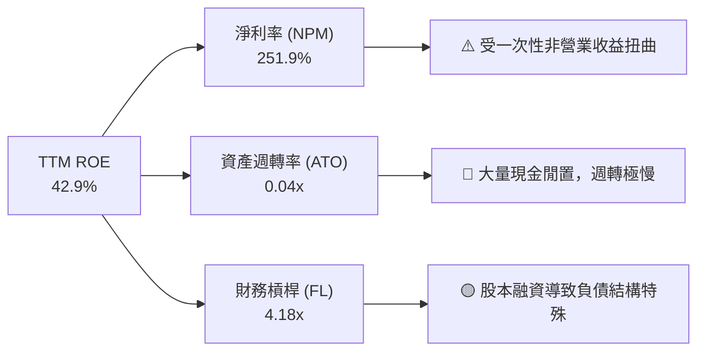

*杜邦分析結論*：
ONDS 的高 ROE 是一個**財務幻覺**。高達 **251.9%** 的淨利率完全由非經常性損益支撐；而資產週轉率僅為 **0.04x**，說明每 $1 的資產僅能產生 $0.04 的營收，資產效率極低。一旦未來季度非營業收益消失，ROE 將迅速跌回負值。

### 6.4 獲利能力儀表板

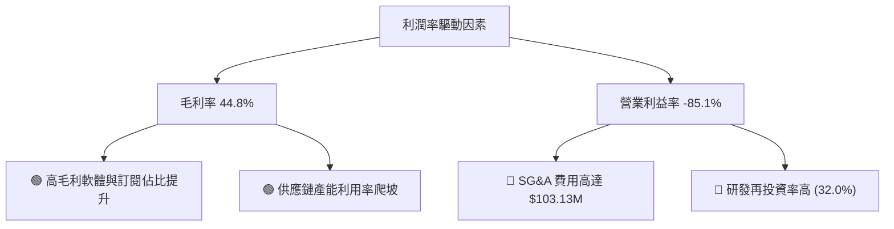

---

## 7. 估值深度分析

由於 ONDS 目前核心業務處於虧損，且 GAAP 淨利潤受到嚴重扭曲，傳統的市盈率（P/E）估值法已完全失效。我們必須採用 **EV/Sales（企業價值/市銷率）** 與 **P/S（市銷率）** 作為主要估值工具，並與同行業進行對比。

### 7.1 同業估值比較表格

我們選擇了三家在無人機、國防科技與專用通信領域的代表性企業進行對比：
1. **AVAV (AeroVironment)**：軍用無人機龍頭，商業化極其成功。
2. **EH (EHang)**：自動駕駛飛行器先驅，高成長但仍處於盈利邊緣。
3. **KTOS (Kratos Defense)**：國家安全與無人靶機龍頭，業績穩健。

| 估值與財務指標 | **ONDS (本公司)** | **AVAV** | **EH** | **KTOS** | ONDS 評估 |
|---|---|---|---|---|---|
| **當前股價** | **$6.53** | $185.20 | $14.30 | $22.10 | 價格處於中下區間 |
| **市值 (Market Cap)** | **$3.72B** | $5.12B | $0.92B | $3.35B | 中型市值規模 |
| **企業價值 (EV)** | **$1.78B** | $4.95B | $0.88B | $3.58B | 🟡 現金充裕使 EV 顯著低於市值 |
| **TTM 營收成長率** | **1079.9%** | 38.5% | 122.4% | 15.2% | 🟢 增速遠超同業 |
| **毛利率 (TTM)** | **44.8%** | 39.2% | 64.1% | 26.5% | 🟡 處於行業中游 |
| **EV / Sales (TTM)** | **18.47x** | 7.20x | 15.30x | 3.10x | 🔴 估值溢價顯著偏高 |
| **Forward P/E** | **-217.5x** | 48.5x | -45.0x | 38.2x | 🔴 尚未實現常態化盈利 |
| **FCF Yield** | **-0.42%** | 2.15% | -3.20% | 1.85% | 🟡 表現優於 EH，但不及成熟同業 |

*同業比較結論*：
ONDS 的 **EV/Sales (18.47x)** 顯著高於軍用無人機龍頭 AVAV（7.20x）與 KTOS（3.10x），這反映了市場對其 TTM 1079.9% 暴增營收的「成長溢價」預期。然而，考慮到其尚未實現營運利潤轉正，且股本稀釋速度極快，當前估值處於**高風險、高溢價**區間。

### 7.2 歷史估值區間分析

```
╔══════════════════════════════════════════════════════════════╗
║                ONDS 歷史 EV/Sales 估值區間                 ║
╠══════════════════════════════════════════════════════════════╣
║                                                              ║
║  歷史最高 (2026-05)  32.5x  ██████████████████████████████  ║
║  當前水平 (2026-07)  18.5x  █████████████████░░░░░░░░░░░░░  ║
║  行業中位數          6.5x   ██████░░░░░░░░░░░░░░░░░░░░░░░░  ║
║  歷史最低 (2024-09)  2.1x   ██░░░░░░░░░░░░░░░░░░░░░░░░░░░░  ║
║                                                              ║
║  📊 診斷：股價從 5 月高點回落後，估值已從極度泡沫區 (32.5x)   ║
║  回落至相對合理的投機區間 (18.5x)，但仍高於行業中位數。       ║
╚══════════════════════════════════════════════════════════════╝
```

### 7.3 情境目標價（假設驅動，Bear / Base / Bull）

為了給出嚴謹的目標價，我們基於 **EV/Sales 退出倍數**，對未來 12 個月的業績進行情境模擬：

* **基準假設**：
  * 當前發行在外稀釋股數：569.84M 股。
  * 淨現金：$1.46B。

| 情境 | 12M 預期營收 | 預期營收成長率 | 退出 EV/Sales 倍數 | 隱含企業價值 (EV) | 隱含市值 (MC) | 12M 目標價 | 相對現價漲跌幅 |
|---|---|---|---|---|---|---|---|
| **🔴 悲觀情境** | $120.0M | +24.2% | 5.0x | $0.60B | $2.06B | **$3.50** | -47.2% |
| **🟡 基準情境** | **$160.0M** | **+65.6%** | **32M 均值 12.0x**| **$1.92B** | **$3.38B** | **$11.50**| **+76.1%** |
| **🟢 樂觀情境** | $200.0M | +107.0% | 18.0x | $3.60B | $5.06B | **$18.00**| **+175.7%**|

*情境邏輯說明*：
* **悲觀情境**：商業化進度受阻，鐵路客戶部署停滯，營收增速大幅放緩至 24.2%。市場失去耐心，估值倍數殺至行業均值 5.0x，目標價跌至 **$3.50**。
* **基準情境**：Sentrycs 訂單持續交付，鐵路專有無線網絡部署穩步推進，營收達到 $160M。給予合理的成長股溢價倍數 12.0x，目標價為 **$11.50**。
* **樂觀情境**：全球地緣政治衝突加劇，反無人機（CUAS）軍工訂單爆發，營收翻倍至 $200M，且營業虧損顯著縮窄。給予 18.0x 的高估值倍數，目標價升至 **$18.00**。

### 7.4 DCF 敏感性分析（12個月目標價矩陣）

我們採用兩階段自由現金流折現模型（DCF），以 WACC（折現率）與終期成長率（Terminal Growth Rate）進行敏感性分析，得出以下目標價矩陣：

| 終期成長率 \ WACC | 16.0% | **17.65%（基準）** | 19.0% |
|-------------------|-------|--------------------|-------|
| **3.0%** | $13.20 (+102.1%) | **$11.80 (+80.7%)** | $10.10 (+54.7%) |
| **2.0%（基準）** | **$12.50 (+91.4%)**| **$11.50 (+76.1%)** | **$9.50 (+45.5%)** |
| **1.0%** | $11.80 (+80.7%) | **$10.60 (+62.3%)** | $8.80 (+34.8%) |

*DCF 敏感性分析結論*：
由於 ONDS 的 Beta 值高達 2.691，導致其 WACC 基準值高達 **17.65%**。敏感性分析顯示，股價對折現率極為敏感。若美聯儲未來降息或公司 Beta 值因業績穩定而下降，WACC 每降低 1.65 個百分點，目標價將上升約 **8.7%**。

### 7.5 估值綜合區間

```
╔══════════════════════════════════════════════════════════════════╗
║                    ONDS 估值綜合區間                             ║
╠══════════════════════════════════════════════════════════════════╣
║                                                                  ║
║  當前股價：  $6.53                                               ║
║  悲觀目標價：$3.50  ░░░░░░░░░░░                                  ║
║  基準目標價：$11.50 ██████████████████████████████               ║
║  樂觀目標價：$18.00 ████████████████████████████████████████████ ║
║                                                                  ║
║  📊 結論：當前股價 $6.53 處於估值區間的中下部，具備不對稱的      ║
║  上行空間（風險回報比為 1:2.6），適合投機性建倉。                ║
╚══════════════════════════════════════════════════════════════════╝
```

---

## 8. 成長催化劑

ONDS 的未來成長並非空中樓閣，而是由多個明確的行業趨勢與業務節點驅動。

### 8.1 催化劑時間軸

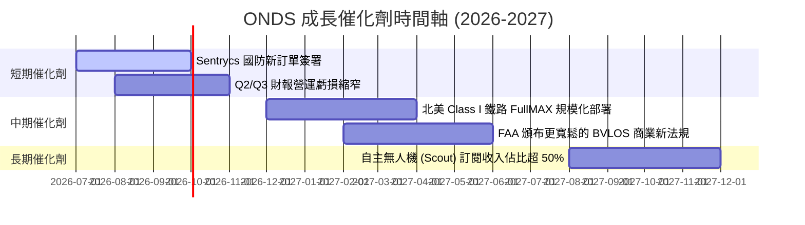

### 8.2 TAM 市場規模分析

ONDS 所處的細分市場正迎來爆發式增長，其潛在市場規模（TAM）預算如下：

```
╔══════════════════════════════════════════════════════════════════╗
║                  ONDS 潛在市場規模 (TAM) 預算                    ║
╠══════════════════════════════════════════════════════════════════╣
║                                                                  ║
║  1. 全球反無人機 (CUAS) 市場 (2028 預期)：                        ║
║     ├── TAM: $12.5B  ██████████████████████████████              ║
║     └── ONDS 預期滲透率：3.5% (約 $437M 潛在收入)                ║
║                                                                  ║
║  2. 北美鐵路與工業專用通訊市場 (2028 預期)：                      ║
║     ├── TAM: $4.8B   ████████████░░░░░░░░░░░░░░░                 ║
║     └── ONDS 預期滲透率：15.0% (約 $720M 潛在收入)               ║
║                                                                  ║
║  📊 總計潛在市場空間 (TAM) 超過 $17B，ONDS 目前滲透率不足 0.6%。  ║
╚══════════════════════════════════════════════════════════════════╝
```

### 8.3 成長驅動力結構圖

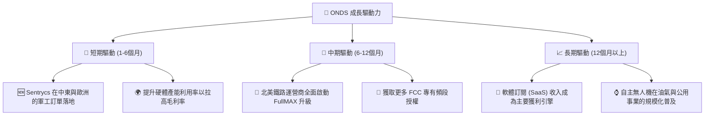

---

## 9. 風險矩陣

評估 ONDS 的投資機會，必須對其伴隨的高風險有清醒的認識。

### 9.1 風險評分矩陣

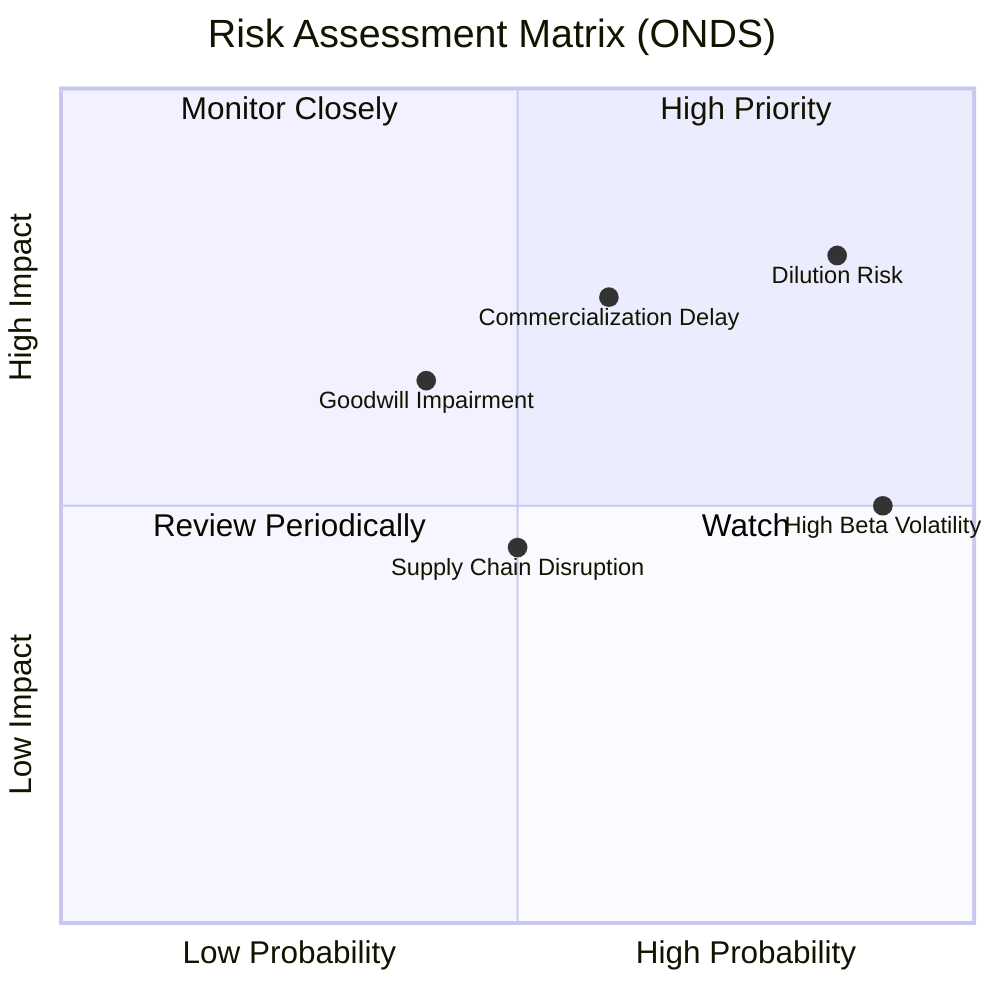

### 9.2 風險清單詳細分析

| # | 風險項目 | 發生機率 | 財務衝擊 | 風險評分 | 緩解措施 / 應對機制 |
|---|---|---|---|---|---|
| 1 | 🔴 **持續的股權稀釋** | **極高 (85%)** | **高 (-15% EPS)** | 🔴 **8.5 / 10** | 公司目前擁有 $1.47B 現金，短期內無融資迫切性，但高額的 SBC（股權薪酬）仍會以年均 3-5% 的速度稀釋股本。 |
| 2 | 🔴 **商業化變現不及預期** | **中度 (60%)** | **極高 (-40% 估值)** | 🔴 **7.5 / 10** | 密切監控每季營收增速，若 YoY 增速跌破 50%，應立即執行減碼。 |
| 3 | 🟡 **商譽與無形資產減值** | **中低 (40%)** | **中高 (一次性減值)** | 🟡 **5.5 / 10** | 評估收購標的 Sentrycs 的業績承諾達成率，目前其表現良好，暫無減值風險。 |
| 4 | 🟡 **高 Beta 系統性風險** | **極高 (90%)** | **中度 (股價劇烈波動)**| 🟡 **5.4 / 10** | 避免在投資組合中重倉，建議倉位控制在 2% 以內，利用網格交易或分批建倉降低成本。 |

---

## 10. 投資建議

基於對 ONDS 基本面、財務數據、估值及風險的深度剖析，我們給出以下最終投資建議。

### 10.1 最終綜合評級雷達圖

```
╔══════════════════════════════════════════════════════════════╗
║                  ONDS 綜合投資雷達圖評分                     ║
╠══════════════════════════════════════════════════════════════╣
║                                                              ║
║  成長性 (Growth)：      9.0/10 ████████████████████████████  ║
║  安全性 (Solvency)：    9.5/10 ████████████████████████████  ║
║  護城河 (Moat)：        6.2/10 ██████████████████░░░░░░░░░░  ║
║  獲利品質 (Earnings)：  3.0/10 ████████░░░░░░░░░░░░░░░░░░░░  ║
║  估值性 (Valuation)：   4.0/10 ████████████░░░░░░░░░░░░░░░░  ║
║                                                              ║
║  🏆 綜合投資評分：6.1 / 10  ｜  投資評級：🟡 持有 / 投機性買入  ║
╚══════════════════════════════════════════════════════════════╝
```

### 10.2 目標價與隱含報酬率

| 情境 | 機率權重 | 12M 目標價 | 當前股價 | 隱含報酬率 | 權重期望值 |
|------|----------|------------|----------|------------|------------|
| 🔴 悲觀情境 | 25% | $3.50 | $6.53 | -46.4% | -$0.88 |
| 🟡 **基準情境** | **55%** | **$11.50** | **$6.53** | **+76.1%** | **+$6.33** |
| 🟢 樂觀情境 | 20% | $18.00 | $6.53 | +175.7% | +$3.60 |
| **加權期望值** | **100%** | **$11.05** | **$6.53** | **+69.2%** | **期望目標價：$11.05** |

*投資建議結論*：
加權期望目標價為 **$11.05**，隱含 **69.2%** 的預期回報率。這表明在考慮了悲觀情境的下行風險後，ONDS 依然具備極佳的風險回報比（Risk-Reward Ratio）。

### 10.3 買入時機與觸發因素

```
╔══════════════════════════════════════════════════════════════════╗
║                  ✅ ONDS 買入與交易策略 Checklist                ║
╠══════════════════════════════════════════════════════════════════╣
║                                                                  ║
║  立即買入觸發條件（適合投機性建倉）：                             ║
║  ✅ 股價回落至 $5.50 - $6.00 區間（提供更佳安全邊際）             ║
║  ✅ Q2 2026 營收同比增速維持在 100% 以上                          ║
║  ✅ 宣佈與北美 Class I 鐵路運營商簽署新的 FullMAX 商業合同       ║
║                                                                  ║
║  加碼觸發條件（確認基本面反轉）：                                 ║
║  ☐ 單季營業利潤率（Operating Margin）縮窄至 -20% 以內            ║
║  ☐ 季度自由現金流（FCF）流出小於 -$10M                            ║
║                                                                  ║
║  減碼/停損觸發條件（論點失效）：                                 ║
║  ☐ 發行在外股數單季稀釋率超過 10%                                 ║
║  ☐ 季度營收出現環比（QoQ）下滑                                   ║
║  ☐ 發生重大的商譽減值（Impairment）                              ║
╚══════════════════════════════════════════════════════════════════╝
```

### 10.4 投資人適配度分析

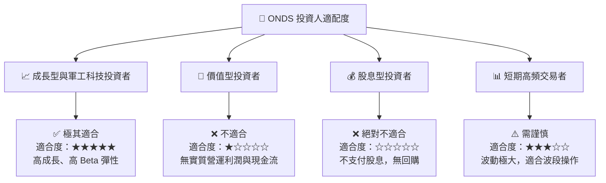

### 10.5 每季財報監控清單（Quarterly Watch List）

在未來的季度財報中，投資者應嚴格監控以下指標，並與本報告的設定門檻進行比對：

| 監控指標 | 基準值 (Q1 2026) | 觸發加碼門檻 | 觸發減碼/停損門檻 | 監控邏輯 |
|---|---|---|---|---|
| **單季營業收入** | $50.12M | > $65.0M | < $40.0M | 評估商業化增速是否維持 |
| **單季營業利潤** | -$42.67M | > -$20.0M | < -$50.0M | 判斷營運槓桿是否兌現 |
| **發行在外稀釋股數** | 469.0M | 股數增幅 < 2% | 股數單季增幅 > 8% | 監控股東權益是否被過度稀釋 |
| **單季自由現金流** | -$52.63M | > -$15.0M | < -$65.0M | 評估現金失血速度與安全跑道 |
| **SBC 佔營收比重** | 39.2% | < 15.0% | > 45.0% | 評估盈餘品質與員工激勵成本 |

### 10.6 反面論證：什麼會證明論點錯誤（What Would Change My Mind）

```
╔══════════════════════════════════════════════════════════════════╗
║              ⚠️ 論點失效條件（Disconfirming Evidence）           ║
╠══════════════════════════════════════════════════════════════════╣
║  本投資論點在下列情況成立時應立即重新檢視或退出：                ║
║  ☐ 核心業務營收成長率連續兩季同比（YoY）低於 50%                 ║
║  ☐ 即使營收擴大，營業利潤率（Operating Margin）持續低於 -80%     ║
║  ☐ 自由現金流持續失血，導致 $1.47B 的現金儲備在 3 年內消耗過半   ║
║  ☐ 真實 ROIC 跌破 -25%，顯示公司在加速摧毀股東價值               ║
║  ☐ 核心反無人機技術（Sentrycs）被競爭對手（如 Dedrone）超越      ║
╚══════════════════════════════════════════════════════════════════╝
```

---

> **免責聲明**：本報告為 AI 自動生成，僅供研究參考，不構成任何投資建議。投資有風險，入市需謹慎。