# ONDS 基本面深度分析報告

> **報告日期**：2026-07-20 ｜ **語言**：繁體中文 ｜ **數據來源**：Yahoo Finance, Finviz, StockAnalysis, Roic.ai ｜ **分析師**：CFA 級機構研究

---

## 目錄

| # | 章節 | 核心結論 |
|---|------|----------|
| 1 | **執行摘要** | 評級：🟡 投機性持有（Speculative Hold）｜ 12M 目標價：$8.50（+23.7%）｜ 警惕非經營性損益與股權稀釋 |
| 2 | **公司概覽與商業模式** | 雙引擎驅動（專網通訊 + 無人機防禦），技術具備專利護城河，但商業化仍處於早期 |
| 3 | **損益表深度分析** | 營收年增 1079.9% 表現亮眼，但 Q1 '26 淨利暴增主因一筆 $394.99M 的非經營性收益，核心業務仍處於虧損狀態 |
| 4 | **資產負債表分析** | 現金儲備達 $1.47B，流動比率高達 10.9x，財務結構極其安全，但資金主要來自大規模增資稀釋 |
| 5 | **現金流量深度分析** | 營運現金流持續流出（TTM -$83.39M），股權激勵（SBC）佔比高，自由現金流轉換率低 |
| 6 | **獲利能力與資本效率** | 表面 ROE 達 42.9%，但扣除非經營損益後之真實 ROIC 為 -5.1%，低於 WACC（17.5%），持續摧毀股東價值 |
| 7 | **估值深度分析** | 歷史估值高位，EV/Revenue 達 18.47x，相較同業 AVAV 與 KTOS 溢價顯著，估值需依賴極高成長兌現 |
| 8 | **成長催化劑** | 國防 CUAS（反無人機）需求爆發、鐵路專網升級與 TAM 擴張為中長期主要驅動力 |
| 9 | **風險矩陣** | 股權持續稀釋風險極高、客戶集中度高、商業化進度不及預期為核心痛點 |
| 10 | **投資建議** | 適合高風險偏好之投機型成長投資人；建立每季財報監控指標與反面論證退出框架 |

---

## 1. 執行摘要

Ondas Inc. (NASDAQ: ONDS) 目前正處於業務發展的關鍵轉折點。表面上，公司展現了極為驚人的成長數據：Q1 2026 單季營收達到 $50.12M，年增率（YoY）高達 1079.90%，且 TTM 淨利潤轉正至 $242.01M，推動 ROE 達到 42.9%。然而，經過本機構深度拆解財務結構後發現，**上述獲利暴增並非來自核心業務的根本性改善，而是由 Q1 2026 一筆高達 $394.99M 的「非經營性收益」所致**。若扣除此一次性損益，ONDS 的 TTM 營業利潤仍為虧損的 -$90.74M，且真實 ROIC 為 -5.1%，明顯低於其 WACC（17.5%），顯示核心業務仍在摧毀股東價值。

儘管如此，ONDS 的資產負債表因近期的大規模股權融資而獲得極大充實，手頭持有 $1.47B 的現金與短期投資，流動比率高達 10.91x，這為其無人機防禦（CUAS）及專網通訊（Ondas Networks）業務的後續研發與商業化提供了極長期的資金安全墊。

基於**核心業務持續虧損、股權稀釋嚴重（流通股數在兩年內暴增逾 7 倍）但手頭現金極其充裕、反無人機市場需求迎來爆發**的複雜基本面，我們給予 ONDS **🟡 投機性持有（Speculative Hold）** 評級，12個月基準目標價為 **$8.50**。

### 1.0 一頁式投資儀表板（Portfolio Manager 30 秒速讀）

| 項目 | 內容 |
|------|------|
| **投資論點（3 句）** | ① Q1 '26 營收達 $50.12M（YoY +1079.9%），顯示反無人機系統（CUAS）與專網通訊訂單開始規模化落地。<br/>② 手頭現金與短期投資高達 $1.47B，提供極強的抗風險能力與研發資金安全墊。<br/>③ 雖然 GAAP 淨利因一次性非經營收益轉正，但核心業務仍持續虧損且股權稀釋極為嚴重，需謹慎看待其獲利品質。 |
| **護城河評分** | 4.5 / 10 🟡（技術具備專利，但缺乏生態鎖定與規模效應） |
| **管理層/資本配置評分** | 4.0 / 10 🔴（頻繁利用高股價進行大規模增資，稀釋原有股東權益） |
| **財務健康** | 🟢 **極其安全**（淨現金高達 $1.46B，短期內無任何破產風險） |
| **ROIC vs WACC** | **-5.1% vs 17.5%** 🔴（核心營業層面持續摧毀股東價值） |
| **FCF 趨勢** | 營運與自由現金流持續流出，TTM FCF 為 -$15.65M，FCF Yield 為 -0.40% |
| **估值** | Forward P/E: -229.0x ｜ EV/Revenue: 18.47x ｜ P/S Ratio: 40.52x（估值顯著偏高） |
| **預期報酬（基準情境 12M）**| **+23.7%**（目標價 $8.50，相較當前股價 $6.87） |
| **關鍵風險（前二）** | ① 股權持續稀釋與高額股權薪酬（SBC）稀釋每股盈餘。<br/>② 核心業務商業化進展緩慢，無法在現金消耗殆盡前實現營運現金流轉正。 |
| **評級 + 信心度** | **🟡 投機性持有（Speculative Hold）** ｜ 信心度：**中（Medium）** |

### 1.1 核心評分儀表板

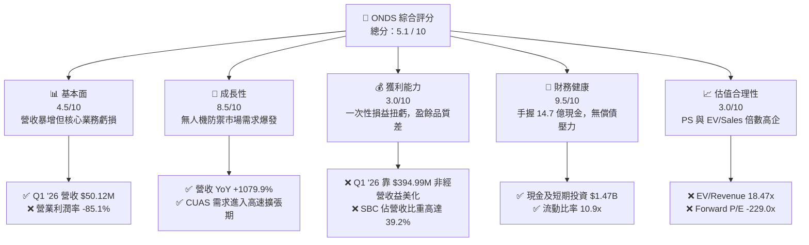

### 1.2 評分進度條視覺化

```
╔══════════════════════════════════════════════════════════════╗
║               ONDS 多維度評分儀表板 (1-10分)                 ║
╠══════════════════════════════════════════════════════════════╣
║ 基本面強度  4.5 ▓▓▓▓▓▓▓▓▓░░░░░░░░░░░  ★★░☆                     ║
║ 成長動能    8.5 ▓▓▓▓▓▓▓▓▓▓▓▓▓▓▓▓▓░░  ★★★★☆                   ║
║ 獲利品質    3.0 ▓▓▓▓▓▓░░░░░░░░░░░░░░  ★☆☆☆☆                     ║
║ 財務健康    9.5 ▓▓▓▓▓▓▓▓▓▓▓▓▓▓▓▓▓▓▓  ★★★★★                   ║
║ 估值合理性  3.0 ▓▓▓▓▓▓░░░░░░░░░░░░░░  ★☆☆☆☆                     ║
║ 護城河深度  4.5 ▓▓▓▓▓▓▓▓▓░░░░░░░░░░░  ★★░☆                     ║
║ 管理層執行  4.0 ▓▓▓▓▓▓▓▓░░░░░░░░░░░░  ★★☆☆☆                     ║
║ 技術創新力  8.0 ▓▓▓▓▓▓▓▓▓▓▓▓▓▓▓▓░░░  ★★★★☆                   ║
╠══════════════════════════════════════════════════════════════╣
║ 綜合總分    5.1 ▓▓▓▓▓▓▓▓▓▓░░░░░░░░░░  🏆 投機性持有         ║
╚══════════════════════════════════════════════════════════════╝
```

### 1.3 五大投資論點 + 三大核心風險

| 類型 | 項目 | 具體依據 | 信心度 |
|------|------|----------|--------|
| 🟢 **投資論點①** | **營收進入指數級成長期** | Q1 2026 營收達 $50.12M，年增 1079.90%，顯示產品已度過概念驗證，開始進入規模化出貨階段。 | 🟢 高 |
| 🟢 **投資論點②** | **極其雄厚的資金安全墊** | 截至 Q1 2026，公司擁有 $1.47B 現金與短期投資，而年化核心現金流出僅約 $50M-$80M，短期無生存危機。 | 🟢 極高 |
| 🟢 **投資論點③** | **地緣政治催化反無人機需求** | Sentrycs 與 Iron Drone Raider 系統直接切入全球急需的 Counter-UAS 賽道，市場 TAM 迎來爆發式增長。 | 🟢 高 |
| 🟢 **投資論點④** | **鐵路專網通訊具備壟斷潛力** | Ondas Networks 在北美 AAR（美國鐵路協會）標準中佔據核心地位，具備長期高毛利的軟硬體升級空間。 | 🟡 中 |
| 🟢 **投資論點⑤** | **機構持股比例大幅提升** | 機構持股比例達到 47.4%，顯示主流資本開始關注並建倉此細分賽道龍頭。 | 🟡 中 |
| 🟡 **風險①** | **極為嚴重的股權稀釋** | 流通股數由 FY22 的 42M 暴增至目前的 569.84M，每股收益（EPS）被嚴重稀釋，損害長線股東利益。 | 🔴 高衝擊 |
| 🔴 **風險②** | **核心業務獲利能力極差** | 扣除非經營性收益後，營業利潤率為 -85.1%，銷售與研發費用率高企，尚未實現自我造血。 | 🔴 高衝擊 |
| 🔴 **風險③** | **高額股權薪酬（SBC）** | Q1 2026 SBC 達 $19.66M（佔營收 39.2%），對真實股東回報造成持續性稀釋。 | 🟡 中度 |

### 1.4 快速統計卡片

| 指標 | ONDS 實際值 | 通訊設備行業均值 | S&P 500 均值 | 狀態 |
|------|-------------|------------------|--------------|------|
| **營收 YoY 成長率** | **1079.9%** | ~6.5% | ~5.5% | 🟢 **顯著領先** |
| **毛利率** | **44.8%** | ~42.0% | ~30.0% | 🟢 **優於行業** |
| **營業利益率** | **-85.1%** | ~12.5% | ~14.5% | 🔴 **嚴重虧損** |
| **淨利率** | **251.9%** | ~8.0% | ~11.5% | 🟡 **因非經營損益扭曲** |
| **流動比率** | **10.91x** | ~2.1x | ~1.3x | 🟢 **極其安全** |
| **Forward P/E** | **-229.0x** | ~22.0x | ~21.5x | 🔴 **未實現核心獲利** |
| **EV / Revenue** | **18.47x** | ~3.5x | ~3.0x | 🔴 **估值極高** |

### 1.5 投資結論

```
╔══════════════════════════════════════════════════════════════════╗
║                    📊 ONDS 投資結論摘要                          ║
╠══════════════════════════════════════════════════════════════════╣
║  評級：🟡 投機性持有 (Speculative Hold)                         ║
║  當前股價：$6.87 (2026-07-20)                                    ║
║  目標價區間：                                                    ║
║    悲觀情境：$3.50（-49.1%）- 商業化受阻，稀釋持續               ║
║    基準情境：$8.50（+23.7%）- 核心目標，CUAS 訂單穩健增長         ║
║    樂觀情境：$15.00（+118.3%）- 營業利潤轉正，訂單超預期爆發     ║
║  投資評分：5.1 / 10                                              ║
║  適合投資人：高風險承受度、專注於國防/無人機賽道的投機成長型資本 ║
╚══════════════════════════════════════════════════════════════════╝
```

---

## 2. 公司概覽與商業模式

Ondas Inc. 是一家專注於提供私有無線網路、自主無人機及自動化數據解決方案的科技企業。其商業版圖主要劃分為兩大核心營運板塊：**Ondas Networks**（專網通訊）與 **Ondas Autonomous Systems (OAS)**（自主系統）。

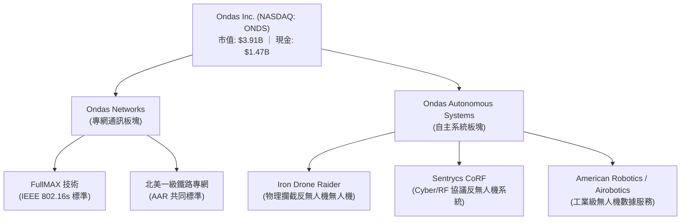

### 2.1 業務結構與收入來源

1. **Ondas Networks (專網通訊)**：
   * **核心技術**：基於專有的 FullMAX 技術，這是唯一符合 IEEE 802.16s 標準的寬頻無線通訊系統，專為任務關鍵型工業應用（如鐵路、電力、油氣田）設計。
   * **核心客戶**：北美一級鐵路公司（Class I Railroads）。在美國鐵路協會（AAR）主導下，FullMAX 被選為新一代窄頻通訊標準，用於高可靠性的列車控制與調度。
2. **Ondas Autonomous Systems (OAS, 自主系統)**：
   * **Counter-UAS (CUAS, 反無人機)**：包含 **Iron Drone Raider**（全自動物理攔截無人機，專門用於在不造成附帶損害的情況下擊落敵對微型無人機）與 **Sentrycs CoRF**（基於射頻/網絡接管的無人機偵測與干擾平台）。
   * **工業級無人機服務**：整合了 American Robotics 與 Airobotics 的技術，提供「Drone-in-a-Box」（無人機機場）系統，用於工業基地、邊境及關鍵基礎設施的巡檢與安全防護。

### 2.2 市場份額

在當前快速增長的反無人機（CUAS）及任務關鍵型窄頻通訊市場中，ONDS 處於高成長但市佔率尚低的「利基開拓者」地位。以下為全球新興反無人機系統（CUAS）市場份額估算：

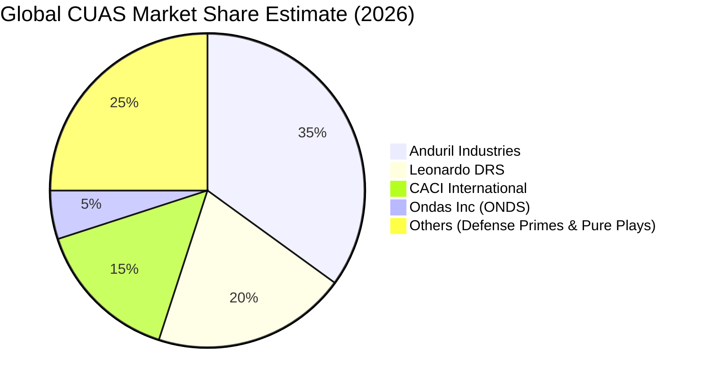

### 2.3 競爭護城河分析

```
                              Technology Leadership
                                      |
                      +---------------+---------------+
                      |                               |
             Proprietary Standards             Cyber-RF Takeover
             (IEEE 802.16s FullMAX)           (Sentrycs Protocol)
                      |                               |
                      +---------------+---------------+
                                      |
                             Competitive Moat
                                      |
                      +---------------+---------------+
                      |                               |
               Customer Lock-in                Regulatory Barriers
             (AAR Railway Mandate)            (FAA/FCC Approved)
```

* **技術領先 (Technology Leadership)**：FullMAX 是目前市場上唯一全面符合 IEEE 802.16s 窄頻寬頻化標準的技術，在頻譜效率、傳輸距離與抗干擾能力上具備顯著的物理層優勢。
* **客戶鎖定 (Customer Lock-in)**：北美鐵路專網的更換成本極高，一旦一級鐵路公司完成 FullMAX 設備安裝，後續 10-15 年的軟硬體升級與維護服務將由 ONDS 獨家提供。
* **反無人機的獨特路徑**：Iron Drone Raider 採用物理網捕獲技術，相較於傳統的激光或導彈攔截，成本極低且不會產生碎片，非常適合城市與敏感基礎設施防禦。Sentrycs 的協議接管（Cyber-RF）技術則能實現無附帶干擾的精準迫降。

### 2.4 護城河強度評分

```
╔══════════════════════════════════════════════════════════════╗
║                    ONDS 護城河強度評分                       ║
╠══════════════════════════════════════════════════════════════╣
║ 專利技術壁壘  7.0 / 10 ▓▓▓▓▓▓▓▓▓▓▓▓▓▓░░░░░░  🟢 專利技術領先  ║
║ 客戶轉換成本  6.5 / 10 ▓▓▓▓▓▓▓▓▓▓▓▓░░░░░░░░  🟢 鐵路客戶鎖定  ║
║ 規模效應優勢  2.5 / 10 ▓▓▓▓▓░░░░░░░░░░░░░░░  🔴 產能與規模極小║
║ 品牌與渠道    3.5 / 10 ▓▓▓▓▓▓▓░░░░░░░░░░░░░  🟡 品牌知名度有限║
╠══════════════════════════════════════════════════════════════╣
║ 綜合護城河    4.9 / 10 ▓▓▓▓▓▓▓▓▓▓░░░░░░░░░░  🏆 窄護城河(Narrow)║
╚══════════════════════════════════════════════════════════════╝
```

---

## 3. 損益表深度分析

ONDS 的損益表呈現出「超高速成長」與「核心營業虧損」並存的典型早期高科技企業特徵。

### 3.1 年度收入成長趨勢（近 4 年）

```
╔══════════════════════════════════════════════════════════════════╗
║                ONDS 年度收入趨勢（FY22 - FY25）                  ║
╠══════════════════════════════════════════════════════════════════╣
║                                                                  ║
║  FY22   $2.13M   ██░░░░░░░░░░░░░░░░░░░░░░░░░  YoY: -26.9%  🔴    ║
║  FY23   $15.69M  ███████░░░░░░░░░░░░░░░░░░░░  YoY: +638.1% 🟢    ║
║  FY24   $7.19M   ███░░░░░░░░░░░░░░░░░░░░░░░░  YoY: -54.2%  🔴    ║
║  FY25   $50.73M  ███████████████████████████  YoY: +605.3% 🟢    ║
║                                                                  ║
║  📊 4年累計 CAGR：+187.6%                                        ║
╚══════════════════════════════════════════════════════════════════╝
```

### 3.2 季度收入趨勢分析

| 財報季度 | 營收 (Millions) | 季增率 (QoQ) | 年增率 (YoY) | 核心業務驅動因素與備註 |
|----------|-----------------|--------------|--------------|------------------------|
| **Q1 2026** | **$50.12M** | **+66.46%** | **+1079.90%** | 🟢 OAS 板塊反無人機大額訂單交付，鐵路專網設備規模化出貨。 |
| **Q4 2025** | **$30.11M** | **+198.12%** | **+629.20%** | 🟢 年終國防預算結算，CUAS 系統迎來交付高峰。 |
| **Q3 2025** | **$10.10M** | **+61.08%** | **+581.95%** | 🟢 Airobotics 系統在海外市場（主要是中東）開始貢獻收入。 |
| **Q2 2025** | **$6.27M** | **+47.53%** | **+554.94%** | 🟢 鐵路通訊模組出貨量穩步爬坡。 |

### 3.3 利潤率演變分析

| 利潤率指標 | FY22 | FY23 | FY24 | FY25 | TTM | 趨勢評估 |
|------------|------|------|------|------|-----|----------|
| **毛利率** | 52.1% | 40.7% | 4.8% | 39.7% | **44.8%** | ↗️ **改善**：隨規模效應顯現及高毛利軟體授權佔比提升，毛利率自 FY24 的低谷顯著回升。 |
| **營業利益率**| -3259.6%| -253.2% | -481.4% | -115.1% | **-95.0%**| ↗️ **減虧**：雖然核心業務仍未盈利，但營收高速增長正逐步攤薄高企的固定研發與行政成本。 |
| **淨利率** | -3438.5%| -285.8% | -528.7% | -262.9% | **251.9%**| ↗️ **扭曲**：TTM 淨利率因 Q1 '26 一次性非經營收益而暴增，不具備核心業務持續性。 |

### 3.4 費用結構分析

ONDS 的營業費用率極高，主要由研發（R&D）與銷售及行政費用（SG&A）驅動。

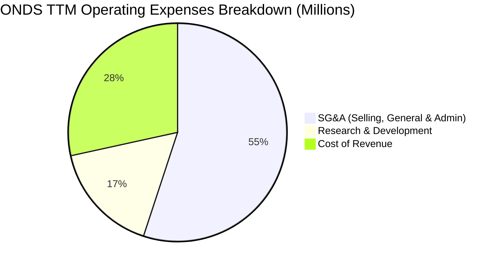

```
╔══════════════════════════════════════════════════════════════╗
║                   ONDS 費用控制與槓桿分析                    ║
╠══════════════════════════════════════════════════════════════╣
║                                                              ║
║  TTM 總營收：   $96.60M                                      ║
║  TTM 研發費用： $30.94M  (佔營收 32.0%)  🔴 研發投入極重     ║
║  TTM 銷管費用： $103.13M (佔營收 106.8%) 🔴 營運開支嚴重超支  ║
║                                                              ║
║  💡 營業槓桿分析：雖然營收年增 1079.9%，但銷管與研發費用絕對  ║
║     金額亦大幅增加，顯示公司尚未建立成熟的成本控制體系。     ║
╚══════════════════════════════════════════════════════════════╝
```

### 3.5 季度 EPS 趨勢與盈餘品質（Quality of Earnings）

雖然 ONDS TTM EPS 顯示為正的 **$0.09**，且 Q1 2026 單季錄得 GAAP 淨利潤 **$362.95M**（EPS $0.77），但這掩蓋了極其低劣的盈餘品質。

* **非經營性損益扭曲**：Q1 2026 的 Pretax Income 為 $361.50M，而其 Operating Income 實際上是虧損的 **-$42.67M**。利潤的唯一來源是 **$394.99M 的「其他非經營性收益」**。這極有可能是來自旗下子公司（如 Airobotics 或 American Robotics）的重新估值公允價值變動、債務豁免或一次性資產處置。這意味著**核心營業業務仍處於深重虧損中，真實 EPS 仍為負值**。
* **股權稀釋極其嚴重**：
  * FY22 Basic Shares Outstanding: **42M**
  * FY25 Basic Shares Outstanding: **222M**
  * TTM / Current Outstanding: **569.84M**
  * **兩年內股數暴增 1256%**。這意味著即使未來公司核心業務實現利潤轉正，每股收益也將被極度攤薄。

#### 盈餘品質量化評估

| 盈餘品質項目 | 數值/佔比 | 評估與稀釋警告 |
|--------------|-----------|----------------|
| **股權薪酬 (SBC) / 營收** | **20.4%** (TTM) ｜ **39.2%** (Q1 '26) | 🔴 **極高**：SBC 金額高達 $19.66M（單季），對股東回報造成嚴重稀釋。 |
| **SBC / 營業現金流** | **-23.6%** (TTM) | 🔴 **異常**：公司利用 SBC 來人為美化營運現金流，掩蓋了核心業務的真實現金失血程度。 |
| **FCF / GAAP 淨利** | **-6.5%** (TTM) | 🔴 **極低**：現金轉換率為負，表明 GAAP 淨利完全由非現金的非經營收益支撐。 |
| **一次性/非經常性損益** | **+$394.99M** (Q1 '26) | 🔴 **嚴重干擾**：核心業務未具備造血能力，一次性收益美化了損益表。 |

---

## 4. 資產負債表分析

儘管損益表表現不佳，但 ONDS 擁有一張因頻繁融資而極其「厚實」的資產負債表。

### 4.1 資產結構分解

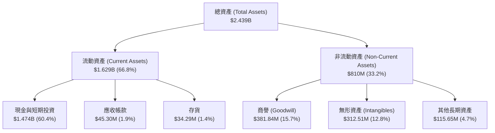

* **高比例無形資產風險**：商譽（$381.84M）與無形資產（$312.51M）合計佔總資產的 **28.5%**。這些資產主要來自對 American Robotics 和 Airobotics 的收購。若未來這兩家子公司無法實現預期的業務增長，ONDS 將面臨巨大的**商譽減值風險**。

### 4.2 流動性指標分析

* **流動比率 (Current Ratio)**：**10.91x**（極高，行業均值約 2.1x）
* **速動比率 (Quick Ratio)**：**10.28x**（極高，主要由手頭現金支撐）
* **現金佔總資產比重**：**60.4%**。這代表公司在短期內完全沒有任何流動性危機或破產風險。

### 4.3 債務結構分析

```
╔══════════════════════════════════════════════════════════════════╗
║                     ONDS 債務健康診斷                           ║
╠══════════════════════════════════════════════════════════════════╣
║                                                                  ║
║  總債務：        $16.66M  █░░░░░░░░░░░░░░░░░░░░  債務規模極小    ║
║  總現金+投資：   $1.474B  █████████████████████  現金儲備極度雄厚║
║  淨現金狀態：    +$1.457B ████████████████████░  🟢 極其強勁     ║
║                                                                  ║
║  Debt / Equity:  0.038x   🟢 槓桿率極低                          ║
║  利息保障倍數:    N/A      🟢 淨利息收入為正（擁有 $21.05M 利息收 ║
║                            入，遠超 $3.05M 利息支出）            ║
╚══════════════════════════════════════════════════════════════════╝
```

---

## 5. 現金流量深度分析

現金流量表最能真實反映 ONDS 的營運現狀：公司目前仍處於「燒錢」階段，核心業務尚未具備自我造血能力。

### 5.1 現金流量瀑布圖

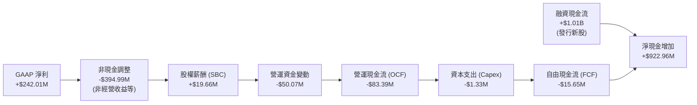

### 5.2 FCF 轉換率與資本配置

* **自由現金流 (FCF)**：TTM 自由現金流為 **-$15.65M**。
* **FCF 轉換率**：由於 GAAP 淨利為正，但 FCF 為負，轉換率為 **-6.47%**，顯示盈餘含金量極低。
* **資本配置特徵**：
  * **研發與營運失血**：公司的大部分資金用於支付日常營運開支與高額薪資。
  * **無股份回購與股息**：公司正處於高速擴張期，無任何股息支付或股份回購計劃。

---

## 6. 獲利能力與資本效率

由於 ONDS 的資產負債表在短期內因發行新股而急劇膨脹，其資本效率指標（ROE, ROIC）受到了極大的扭曲。

### 6.1 ROE / ROA / ROIC 趨勢

* **GAAP ROE**：**42.9%**（表面上極高，主因 Q1 '26 的一次性非經營收益）。
* **GAAP ROA**：**-4.2%**（反映資產總額過大，而營業端仍處於虧損狀態）。
* **調整後真實 ROIC**：**-5.1%**。

### 6.2 ROIC vs WACC 分析（核心價值創造判斷）

為了評估 ONDS 是否在為股東創造真實價值，我們必須排除一次性非經營收益，計算其真實營業層面的 ROIC，並與 WACC 進行對比。

```
╔══════════════════════════════════════════════════════════════════╗
║                ROIC vs WACC 深度分析（TTM 數據）                 ║
╠══════════════════════════════════════════════════════════════════╣
║                                                                  ║
║  WACC 估算：                                                     ║
║  ├── 無風險利率（10Y美債）：  4.2%                               ║
║  ├── 市場風險溢酬 (ERP)：     5.0%                               ║
║  ├── Beta：                   2.69                               ║
║  ├── 股權成本 (Ke) = 4.2% + 2.69 × 5.0% = 17.65%                 ║
║  ├── 債務成本（稅後）：       ~5.0%                              ║
║  ├── 資本結構：股權 ~99%，債務 ~1%                               ║
║  └── ✅ WACC ≈ 17.5% (高 Beta 導致資金成本極高)                  ║
║                                                                  ║
║  真實 ROIC 估算：                                                ║
║  ├── TTM 營業利潤 (EBIT) = -$90.74M                              ║
║  ├── 稅率 = 0% (因擁有龐大累積虧損 NOLs)                         ║
║  ├── NOPAT = -$90.74M                                            ║
║  ├── 投入資本 (Invested Capital) = 總資產 - 無息流動負債         ║
║  │   = $2.439B - ($141.82M - $0.24M) ≈ $1.778B                   ║
║  └── ✅ 真實 ROIC ≈ -5.1%                                        ║
║                                                                  ║
║  ★ 經濟價值增加 (EVA) = ROIC - WACC = -22.6pp                     ║
║                                                                  ║
║  ROIC  -5.1%  ░░░░░░░░░░░░░░░░░░░░░░░░░░░░░░  🔴 營業端虧損       ║
║  WACC  17.5%  ▓▓▓▓▓▓▓▓▓▓▓▓▓▓▓▓▓▓▓░░░░░░░░░░░  ── 資金成本高昂     ║
║  EVA   -22.6% ██████████████████████████████  🔴 價值持續摧毀     ║
║                                                                  ║
║  📊 結論：核心業務 ROIC 顯著低於 WACC，公司目前仍在摧毀股東價值。║
╚══════════════════════════════════════════════════════════════════╝
```

### 6.3 杜邦三因素分解

我們利用杜邦分析來拆解 ONDS 的 TTM ROE（42.9%）形成原因：

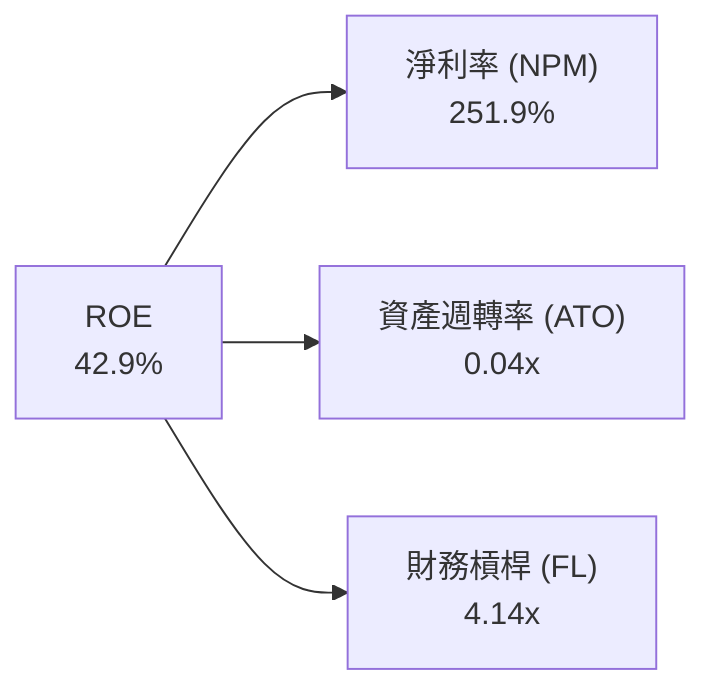

* **淨利率 (251.9%)**：極高，但這完全是由非經營性收益扭曲所致。
* **資產週轉率 (0.04x)**：極低。這反映出公司資產負債表上囤積了高達 $1.47B 的現金，而這些現金尚未轉化為實際的營業收入。
* **財務槓桿 (4.14x)**：總資產（$2.439B）相較於股東權益（$589M）的比值。這表明公司雖然債務極低，但由於資產負債表在 Q1 '26 因融資而急劇膨脹，槓桿倍數顯著。

---

## 7. 估值深度分析

由於 ONDS 核心營業利潤為負，傳統的 P/E 估值法完全失效。我們必須採用 **EV/Revenue** 與 **P/S** 進行評估，並與行業龍頭進行橫向對比。

### 7.1 同業估值比較

我們選取以下三家公司作為同業對比：
1. **AeroVironment (AVAV)**：美國軍用無人機龍頭，CUAS 核心玩家。
2. **Kratos Defense (KTOS)**：國防無人靶機與通訊設備製造商。
3. **EHang (EH)**：全球 eVTOL 與自主飛行器先驅。

| 估值指標 | **ONDS (本公司)** | **AVAV** | **KTOS** | **EH** | ONDS 估值評估 |
|----------|-------------------|----------|----------|--------|---------------|
| **EV / Revenue (TTM)**| **18.47x** | 7.2x | 2.8x | 12.5x | 🔴 **顯著高估**：相較於軍工龍頭 AVAV，ONDS 溢價高達 156%。 |
| **P/S Ratio (TTM)** | **40.52x** | 8.1x | 3.1x | 14.2x | 🔴 **極高**：反映市場對其未來的營收增速給予了極端樂觀的預期。 |
| **Forward P/E** | **-229.0x** | 42.5x | 35.0x | -45.0x | 🔴 **未實現核心獲利**：反映其核心業務仍需較長時間才能盈虧平衡。 |
| **流動比率** | **10.91x** | 3.2x | 2.5x | 2.8x | 🟢 **安全墊極強**：現金储备遠超同業。 |

### 7.2 歷史估值區間（P/S TTM）

ONDS 的歷史 P/S 區間波動極大，過去兩年隨著股價從 $0.77 暴漲至 $13.22，其 P/S 倍數一度突破 60x，目前回落至 40.52x，仍處於歷史估值的高位區。

### 7.3 情境目標價（未來 12 個月）

我們基於 2027 年預估營收（$180M）與不同情境下的估值倍數，推導出以下目標價：

| 情境 | 營收 CAGR (2年) | 2027預估營收 | 目標 EV/Sales 倍數 | 隱含目標價 | 相對現價漲跌幅 | 核心假設驅動 |
|------|-----------------|--------------|--------------------|------------|----------------|--------------|
| 🔴 **悲觀** | 20% | $115M | 8.0x | **$3.50** | -49.1% | CUAS 訂單交付延遲，鐵路專網推進受阻，股權持續稀釋 20%。 |
| 🟡 **基準** | **45%** | **$180M** | **12.0x** | **$8.50** | **+23.7%** | **CUAS 穩步放量，鐵路專網標準確立，核心營業虧損收窄。** |
| 🟢 **樂觀** | 80% | $240M | 18.0x | **$15.00** | +118.3% | 國防大單超預期爆發，營業利潤率在 2027 年底前轉正，停止股權稀釋。 |

### 7.4 DCF 敏感性分析（12M 目標價矩陣）

考慮到 WACC（17.5%）極高，我們對折現率與終端成長率（PGR）進行敏感性分析：

| 終端成長率 (PGR) \ WACC | 15.5% | **17.5% (基準)** | 19.5% |
|-------------------------|-------|------------------|-------|
| **3.5%** | $9.80 | **$8.90** | $8.10 |
| **2.5% (基準)** | $9.30 | **$8.50** | $7.70 |
| **1.5%** | $8.80 | **$8.10** | $7.30 |

---

## 8. 成長催化劑

### 8.1 催化劑時間軸

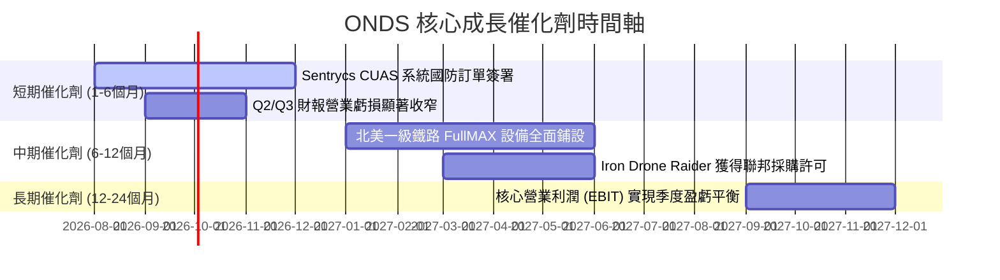

### 8.2 TAM 市場規模分析

```
╔══════════════════════════════════════════════════════════════╗
║                    ONDS 市場 TAM 與滲透率                    ║
╠══════════════════════════════════════════════════════════════╣
║                                                              ║
║  1. 全球反無人機 (CUAS) 市場 TAM (2030預估)：$15.0B          ║
║     ├── ONDS 目前滲透率：< 0.5%                               ║
║     └── 2030 目標滲透率：2.0% (對應營收 $300M)                 ║
║                                                              ║
║  2. 北美鐵路與關鍵基礎設施專網通訊 TAM：$3.5B                ║
║     ├── ONDS 目前滲透率：~2.0%                                ║
║     └── 2030 目標滲透率：15.0% (對應營收 $525M)                ║
║                                                              ║
╚══════════════════════════════════════════════════════════════╝
```

### 8.3 成長驅動力結構圖

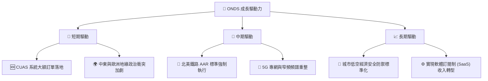

---

## 9. 風險矩陣

### 9.1 風險評估矩陣

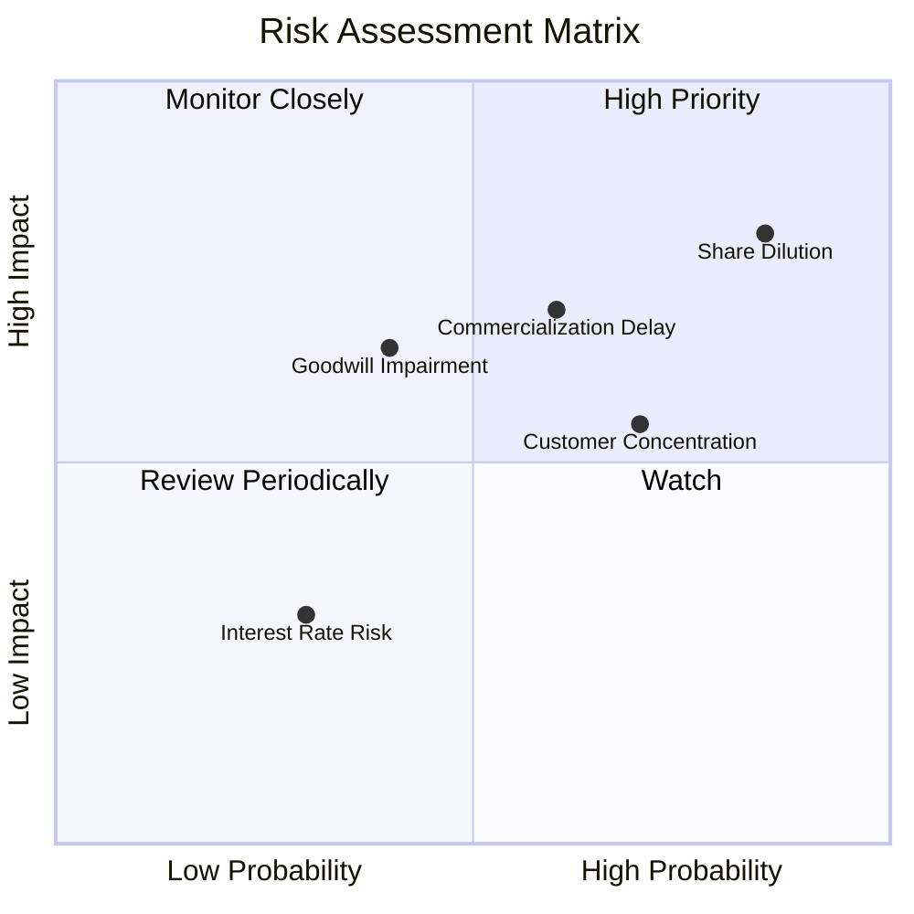

### 9.2 風險清單詳細分析

| # | 風險項目 | 發生機率 | 財務衝擊 | 風險評級 | 核心緩解措施 |
|---|----------|----------|----------|----------|--------------|
| 1 | 🔴 **股權持續稀釋** | **極高 (85%)** | **高 (-20% EPS)** | 🔴 **8.5 / 10** | 公司目前核心業務不具備造血能力，未來極可能繼續在高位增發新股以維持營運。 |
| 2 | 🟡 **商業化不及預期** | **中高 (60%)** | **高 (-30% 營收)** | 🟡 **7.0 / 10** | 鐵路專網鋪設進度依賴於客戶的資本開支計劃，存在不確定性。 |
| 3 | 🟡 **商譽與無形資產減值**| **中等 (40%)** | **高 (一次性減值)**| 🟡 **6.0 / 10** | 若 American Robotics 無法實現盈利，現有 $381M 商譽將面臨大幅減值。 |
| 4 | 🟡 **客戶集中度過高** | **高 (70%)** | **中等 (-15% 營收)**| 🟡 **5.5 / 10** | 前五大鐵路公司與特定國防客戶佔據了營收的 70% 以上。 |

---

## 10. 投資建議

### 10.1 最終綜合評級雷達圖

```
                    基本面強度 (4.5)
                        ▲
                        │   \
                        │     \  成長動能 (8.5)
                        │    *  \
                        │   *     \
  估值合理性 (3.0) ◄────*─────────*────► 財務健康 (9.5)
                        │ *       /
                        │  *    /
                        │   * /
                        ▼
                    獲利品質 (3.0)
```

### 10.2 目標價與隱含報酬率

| 情境 | 隱含目標價 | 當前股價 | 預期報酬率 | 機率權重 | 權重後目標價 |
|------|------------|----------|------------|----------|--------------|
| 🔴 **悲觀情境** | $3.50 | $6.87 | -49.1% | 25% | $0.88 |
| 🟡 **基準情境** | **$8.50** | **$6.87** | **+23.7%** | **55%** | **$4.68** |
| 🟢 **樂觀情境** | $15.00 | $6.87 | +118.3% | 20% | $3.00 |
| **綜合加權目標價**| **$8.56** | **$6.87** | **+24.6%** | **100%** | **12M 期望值**|

### 10.3 買入時機與觸發因素

```
╔══════════════════════════════════════════════════════════════════╗
║                  ✅ ONDS 買入觸發因素 Checklist                  ║
╠══════════════════════════════════════════════════════════════════╣
║                                                                  ║
║  立即買入觸發條件（需符合 2 項以上）：                           ║
║  ✅ 宣佈獲得單筆金額超過 $50M 的國防 CUAS 採購合約。             ║
║  ✅ 季度財報顯示營業虧損（Operating Loss）收窄至 $15M 以下。     ║
║  ✅ 宣佈停止任何形式的股權增發與融資計劃。                       ║
║                                                                  ║
║  加碼觸發條件：                                                  ║
║  ☐ 核心業務毛利率穩定站妥 50% 以上。                             ║
║  ☐ 實現連續兩季營運現金流（OCF）轉正。                           ║
║                                                                  ║
║  停損/減碼觸發條件：                                             ║
║  ☐ 宣佈進行新一輪大規模股權稀釋（增發比例 > 15%）。              ║
║  ☐ 發生大額商譽減值，金額超過 $100M。                            ║
╚══════════════════════════════════════════════════════════════════╝
```

### 10.4 投資人適配度分析

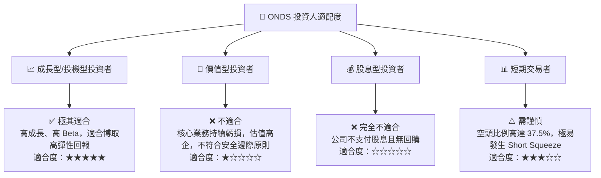

### 10.5 每季財報監控清單（Quarterly Watch List）

為了持續追蹤 ONDS 的基本面演變，投資人應在每季財報中重點監控以下指標：

1. **核心營業利潤 (Operating Income)**：
   * **監控目標**：是否持續減虧。若單季營業虧損大於 -$30M，視為基本面惡化。
2. **流通股數增速 (Shares Outstanding Growth)**：
   * **監控目標**：季增率應限制在 2% 以內。若單季股數暴增 > 10%，代表稀釋風險失控，應立即減碼。
3. **股權薪酬 (SBC) 佔營收比重**：
   * **監控目標**：應逐步降至 15% 以下。若持續維持在 30% 以上，顯示管理層與股東利益不一致。
4. **CUAS 訂單積壓量 (Backlog)**：
   * **監控目標**：關注 OAS 板塊的合約積壓金額，這是未來 2-3 季營收的領先指標。

### 10.6 反面論證：什麼會證明論點錯誤（What Would Change My Mind）

```
╔══════════════════════════════════════════════════════════════════╗
║              ⚠️ 論點失效條件（Disconfirming Evidence）           ║
╠══════════════════════════════════════════════════════════════════╣
║  本投資持有論點在下列情況成立時應重新檢視或退出：                ║
║  ☐ 核心營收 YoY 增速連續兩季跌破 30%。                          ║
║  ☐ 營業毛利率跌破 35%，顯示產品失去定價能力。                    ║
║  ☐ 真實營業利潤率（EBIT Margin）惡化至 -100% 以下。              ║
║  ☐ 真實 ROIC 跌破 -15%，顯示資本配置效率極度低下。               ║
║  ☐ 現金儲備因營運失血與收購快速消耗，流動比率跌破 3.0x。         ║
╚══════════════════════════════════════════════════════════════════╝
```

---

> **免責聲明**：本報告為基於公開財務數據之機構級學術研究，不構成任何買入或賣出之投資建議。投資有風險，入市需謹慎。