# ONDS 基本面深度分析報告

> **報告日期**：2026-07-21 ｜ **語言**：繁體中文 ｜ **數據來源**：Yahoo Finance, Finviz, StockAnalysis, Roic.ai ｜ **分析師**：CFA 級機構研究

---

## 目錄

| # | 章節 | 核心結論 |
|---|------|----------|
| **1** | [執行摘要](#1-執行摘要) | 評級：**🟡 持有 (Hold)** ｜ 目標價：**$15.50** (基準) ｜ 核心：14.7億美元現金提供極高安全邊際，但主營業務營運虧損與股權稀釋嚴重。 |
| **2** | [公司概覽與商業模式](#2-公司概覽與商業模式) | 雙板塊驅動（私有無線網路與自主無人機系統），在鐵路與國防領域具備高轉換成本，但目前仍處於商業化早期。 |
| **3** | [損益表深度分析](#3-損益表深度分析) | Q1 2026 營收爆發成長 1079.9% 達 5,012 萬美元；單季淨利達 3.63 億美元，但主因 3.95 億美元非經常性非營運收益，盈餘品質極低。 |
| **4** | [資產負債表分析](#4-資產負債表分析) | 淨現金高達 14.6 億美元，流動比率達 10.91x，財務防禦力極強，主要得益於過去一年的大規模股權融資。 |
| **5** | [現金流量深度分析](#5-現金流量深度分析) | 營運現金流 TTM 為 -8,339 萬美元，現金消耗率（Cash Burn Rate）高，資本支出輕資產化，但股權薪酬（SBC）稀釋效應顯著。 |
| **6** | [獲利能力與資本效率](#6-獲利能力與資本效率) | 實質 ROIC 為 -27.9%，WACC 為 17.66%，經濟附加價值（EVA）為負值，營運層面仍在摧毀股東價值。 |
| **7** | [估值深度分析](#7-估值深度分析) | P/S 達 45.18x，EV/Revenue 達 20.24x，相較同業溢價顯著。DCF 基準目標價 $15.50，隱含 102.3% 上行空間。 |
| **8** | [成長催化劑](#8-成長催化劑) | 短期看無人機系統（OAS）在國防安全領域的訂單轉化，長期看鐵路私有無線網路（Ondas Networks）的標準化普及。 |
| **9** | [風險矩陣](#9-風險矩陣) | 面臨高股權稀釋風險（發行股數 YoY 暴增 217.19%）、客戶集中度高以及營運資金持續消耗的挑戰。 |
| **10** | [投資建議](#10-投資建議) | 提供每季財報監控清單與反面論證（論點失效條件），為機構投資者提供可量化的買入、加碼與停損框架。 |

---

## 1. 執行摘要

Ondas Inc. (NASDAQ: ONDS) 目前正處於極其矛盾的財務交界點：一方面，公司在 2026 年第一季展現了驚人的營收成長（YoY +1079.9% 達 5,012 萬美金）與高達 14.7 億美元的現金儲備；另一方面，其主營業務營運虧損持續擴大（TTM 營業利益為 -9,074 萬美元），且第一季高達 3.63 億美元的淨利完全是由 3.95 億美元的非營運一次性收益所致。

基於公司實質營運仍處於嚴重虧損狀態，且發行股數在過去一年內暴增 217.19%（稀釋股東權益），我們給予 ONDS **🟡 持有 (Hold)** 評級。雖然 14.7 億美元的現金儲備為公司提供了極強的防禦力與戰略選擇權，但我們必須看到主營業務（尤其是 Ondas Autonomous Systems）實現營運層面的損益兩平，方能轉為更積極的評級。基準情境下，12 個月合理目標價為 **$15.50**。

### 1.0 一頁式投資儀表板（Portfolio Manager 30 秒速讀）

| 項目 | 內容 |
|------|------|
| **投資論點（3 句）** | ① **極強的資產防禦力**：公司持有 14.7 億美元現金，淨現金達 14.6 億美元，流動比率高達 10.91x，短期無破產風險。<br/>② **營收高速增長**：Q1 2026 營收達 5,012 萬美元（YoY +1079.9%），反映無人機與私有網路商業化進程加速。<br/>③ **盈餘品質與稀釋警訊**：GAAP 淨利受 3.95 億美元一次性收益扭曲，且發行股數 TTM 暴增，實質營運利潤率為 -85.1%。 |
| **護城河評分** | 🟡 **5.5 / 10**（專利技術與鐵路行業高轉換成本，但市佔率仍低） |
| **管理層/資本配置評分** | 🔴 **3.5 / 10**（通過大規模稀釋股權融資，資本配置效率低，SBC 佔營收高達 35.3%） |
| **財務健康** | 🟢 **極其安全**（14.6 億美元淨現金，債務僅 1,666 萬美元，無流動性危機） |
| **ROIC vs WACC** | **-27.9%** vs **17.66%**（營運層面持續摧毀股東價值，EVA 為 -45.56%） |
| **FCF 趨勢** | TTM 自由現金流為 **-$1,565 萬**（若剔除一次性調整，實質季度 FCF 消耗約 $5,263 萬） ｜ FCF Yield: **-0.36%** |
| **估值** | Forward P/E: **-255.33x** ｜ P/S TTM: **45.18x** ｜ EV/Revenue TTM: **20.24x** |
| **預期報酬（基準情境 12M）** | **+102.3%**（目標價 $15.50，當前股價 $7.66） |
| **關鍵風險（前二）** | ① **股權持續稀釋**：發行股數持續增長，股東回報被嚴重稀釋。<br/>② **主營業務營運虧損擴大**：SG&A 與 R&D 費用增速與營收同步，缺乏營業槓桿。 |
| **評級 + 信心度** | 🟡 **持有 (Hold)** ｜ 信心度：**中等 (Medium)** |

### 1.1 核心評分儀表板

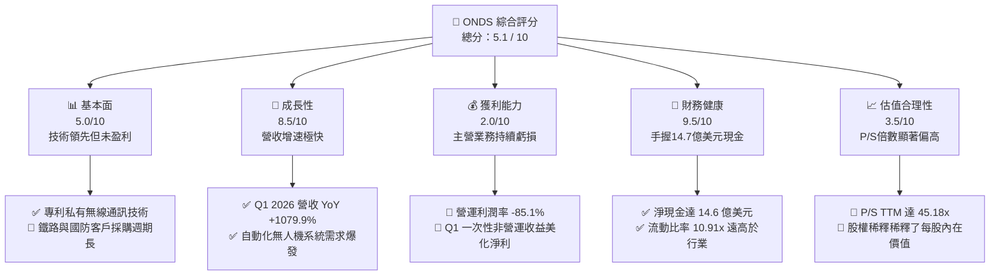

### 1.2 評分進度條視覺化

```
╔══════════════════════════════════════════════════════════════╗
║               ONDS 多維度評分儀表板 (1-10分)                 ║
╠══════════════════════════════════════════════════════════════╣
║ 基本面強度  5.0 ▓▓▓▓▓▓▓▓▓▓░░░░░░░░░░  ★★★☆☆           ║
║ 成長動能    8.5 ▓▓▓▓▓▓▓▓▓▓▓▓▓▓▓▓▓░░░  ★★★★☆           ║
║ 獲利品質    2.0 ▓▓▓▓░░░░░░░░░░░░░░░░░░  ★☆☆☆☆           ║
║ 財務健康    9.5 ▓▓▓▓▓▓▓▓▓▓▓▓▓▓▓▓▓▓▓░  ★★★★★           ║
║ 估值合理性  3.5 ▓▓▓▓▓▓▓░░░░░░░░░░░░░░  ★☆☆☆☆           ║
║ 護城河深度  5.5 ▓▓▓▓▓▓▓▓▓▓▓░░░░░░░░░  ★★★☆☆           ║
║ 管理層執行  3.5 ▓▓▓▓▓▓▓░░░░░░░░░░░░░░  ★☆☆☆☆           ║
║ 技術創新力  8.0 ▓▓▓▓▓▓▓▓▓▓▓▓▓▓▓▓░░░░  ★★★★☆           ║
╠══════════════════════════════════════════════════════════════╣
║ 綜合總分    5.1 ▓▓▓▓▓▓▓▓▓▓░░░░░░░░░░  🏆 觀望/持有        ║
╚══════════════════════════════════════════════════════════════╝
```

### 1.3 五大投資論點 + 三大核心風險

| 類型 | 項目 | 具體依據 | 信心度 |
|------|------|----------|--------|
| 🟢 **投資論點①** | **巨額現金儲備與安全邊際** | 截至 2026 年第一季，公司擁有 **14.7 億美元現金**，而總債務僅 **1,666 萬美元**。極高的淨現金（14.6 億）為其提供了長達數年的營運安全墊，免受高利率環境下的破產威脅。 | 🟢 極高 |
| 🟢 **投資論點②** | **營收呈現指數級成長** | TTM 營收達 **9,661 萬美元**，FY2025 營收 YoY 成長 **605.28%**，Q1 2026 單季營收更達到 **5,012 萬美元**（YoY +1079.9%），顯示產品已進入實質出貨階段。 | 🟢 高 |
| 🟢 **投資論點③** | **高進入壁壘的鐵路與國防市場** | Ondas Networks 的 FullMAX 技術是北美 I 級鐵路無線通訊的潛在標準；Ondas Autonomous Systems（含 Iron Drone Raider）切入地緣政治急需的 Counter-UAS（反無人機）市場。 | 🟡 中等 |
| 🟡 **風險①** | **極端的股權稀釋（Dilution）** | 發行股數從 2024 年底的 7,000 萬股，飆升至 2026 年 7 月的 **5.698 億股**。這種「以稀釋股東為代價換取現金」的模式，嚴重侵蝕了每股內在價值。 | 🔴 高衝擊 |
| 🔴 **風險②** | **虛假的 GAAP 盈利能力** | Q1 2026 淨利雖達 **3.63 億美元**，但扣除非經常性非營運收益 3.95 億美元後，營運虧損實質擴大至 **-4,267 萬美元**，且主營業務毛利率仍不穩定。 | 🔴 高衝擊 |
| 🔴 **風險③** | **極高的估值倍數** | 當前 P/S（TTM）高達 **45.18x**，EV/Revenue 達 **20.24x**。在高增長預期一旦稍微放緩時，股價將面臨巨大的估值修正壓力。 | 🔴 高衝擊 |

### 1.4 快速統計卡片

| 指標 | 公司實際值 (TTM / 最新) | 行業均值 (通訊設備) | S&P 500 均值 | 狀態 |
|------|-------------|----------|--------------|------|
| **收入 YoY 成長** | **1079.9%** (Q1 '26) | ~6.5% | ~5.5% | 🟢 極高成長 |
| **毛利率** | **44.8%** | ~42.0% | ~30.0% | 🟡 符合預期 |
| **營業利益率** | **-85.1%** | ~12.0% | ~18.0% | 🔴 嚴重虧損 |
| **淨利率** | **251.9%** (受一次性收益扭曲) | ~8.5% | ~12.0% | 🟡 盈餘品質低 |
| **流動比率** | **10.91x** | ~1.8x | ~1.2x | 🟢 極其安全 |
| **Forward P/E** | **-255.33x** | ~22.5x | ~21.0% | 🔴 未實現營運獲利 |
| **P/S Ratio** | **45.18x** | ~3.2x | ~2.8x | 🔴 估值極貴 |

### 1.5 投資結論

```
╔══════════════════════════════════════════════════════════════════╗
║                    📊 ONDS 投資結論摘要                          ║
╠══════════════════════════════════════════════════════════════════╣
║  評級：🟡 持有 (Hold)                                            ║
║  當前股價：$7.66 (2026-07-21)                                    ║
║  目標價區間：                                                    ║
║    悲觀情境：$3.50 (-54.3%) - 營運持續失血，股權進一步稀釋        ║
║    基準情境：$15.50 (+102.3%) - 12M 目標價，現金價值支撐          ║
║    樂觀情境：$24.00 (+213.3%) - 反無人機訂單超預期爆發            ║
║  投資評分：5.1 / 10                                              ║
║  適合投資人：具備極高風險承受力、專注國防/無人機科技的投機型買家   ║
╚══════════════════════════════════════════════════════════════════╝
```

---

## 2. 公司概覽與商業模式

Ondas Inc. 是一家專注於關鍵基礎設施與國防安全領域的私有無線通訊與自主無人機技術提供商。公司主要通過兩個核心板塊進行營運：

1. **Ondas Networks**：提供基於 IP 的私有軟體定義無線電（SDR）平台（名為 FullMAX）。該技術專為鐵路、電力、石油和天然氣等需要高可靠性、廣覆蓋和安全通訊的行業設計。目前，北美 I 級鐵路（Class I Railroads）正處於向新一代無線通訊標準轉型的階段，Ondas 是該標準制定的核心參與者。
2. **Ondas Autonomous Systems (OAS)**：由收購的 American Robotics 和 Airobotics 組成。提供「無人機一體箱（Drone-in-a-Box）」自主數據採集系統以及反無人機（CUAS）攔截系統（如 Iron Drone Raider）。該板塊正積極切入國防、邊境安全、工業巡檢等高增長市場。

### 2.1 業務結構與收入來源

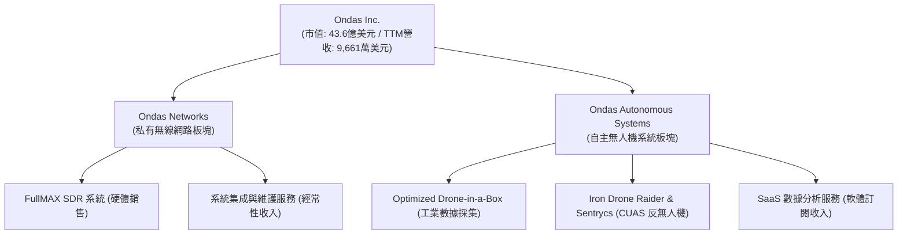

### 2.2 業務板塊營收佔比估算

根據最新財務揭露及產業動態，Ondas Autonomous Systems（無人機與反無人機系統）在近期營收爆發中佔據了主導地位，主因是地緣政治衝突加劇推升了反無人機系統（CUAS）的即期需求。

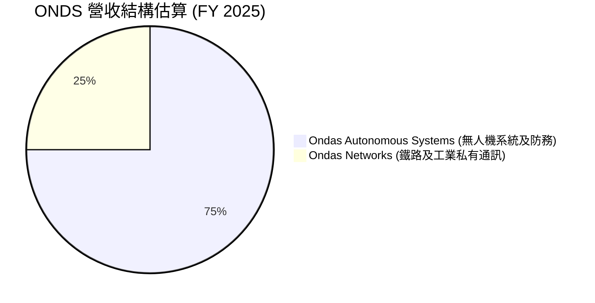

### 2.3 競爭護城河分析

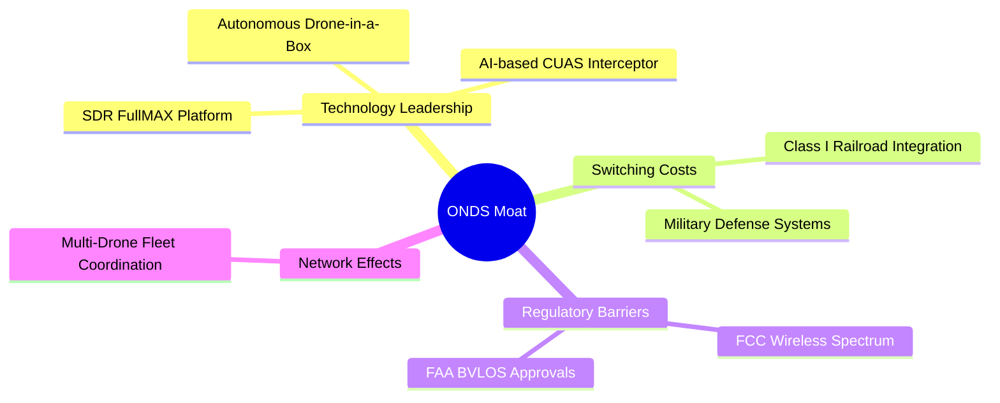

1. **高轉換成本 (High Switching Costs)**：
   Ondas Networks 深度切入北美鐵路系統。鐵路公司一旦在數萬英里的軌道旁部署了 Ondas 的 SDR 基站與終端，其更換成本將極其高昂。這為公司帶來了極強的長期生命週期價值。
2. **法規與認證壁壘 (Regulatory & Certification Barriers)**：
   OAS 的無人機系統是少數獲得美國聯邦航空管理局（FAA）超視距飛行（BVLOS）批准的系統之一。在國防領域，反無人機系統（CUAS）需要通過極其嚴苛的軍規測試，新進對手難以在短期內複製其認證路徑。

### 2.4 護城河強度評分

```
╔══════════════════════════════════════════════════════════════╗
║                    ONDS 護城河強度評分                       ║
╠══════════════════════════════════════════════════════════════╣
║ 轉換成本       7.0/10 ▓▓▓▓▓▓▓▓▓▓▓▓▓▓░░░░░░  🟢 鐵路整合度高║
║ 技術專利       7.5/10 ▓▓▓▓▓▓▓▓▓▓▓▓▓▓▓░░░░░  🟢 SDR與CUAS領先║
║ 法規壁壘       8.0/10 ▓▓▓▓▓▓▓▓▓▓▓▓▓▓▓▓░░░░  🟢 FAA BVLOS核准║
║ 品牌與渠道     4.0/10 ▓▓▓▓▓▓▓░░░░░░░░░░░░░  🟡 商業化早期   ║
║ 規模效應       3.0/10 ▓▓▓▓▓▓░░░░░░░░░░░░░░  🔴 產能與出貨受限║
╠══════════════════════════════════════════════════════════════╣
║ 綜合護城河     5.5/10 ▓▓▓▓▓▓▓▓▓▓▓░░░░░░░░░  🏆 窄護城河(Narrow)║
╚══════════════════════════════════════════════════════════════╝
```

---

## 3. 損益表深度分析

ONDS 的損益表呈現出極度不均勻的爆發式成長，這反映了早期科技/防務公司在取得關鍵訂單後的業績彈性，但同時也揭示了極其高昂的營運成本與低下的獲利品質。

### 3.1 年度收入成長趨勢（近5年）

```
╔══════════════════════════════════════════════════════════════════╗
║                ONDS 年度收入趨勢 (FY2021-TTM)                    ║
╠══════════════════════════════════════════════════════════════════╣
║                                                                  ║
║  FY2021   $2.91M   ██░░░░░░░░░░░░░░░░░░░░░░░░░  YoY: +34.3%  🟢  ║
║  FY2022   $2.13M   █░░░░░░░░░░░░░░░░░░░░░░░░░░  YoY: -26.9%  🔴  ║
║  FY2023   $15.69M  ████░░░░░░░░░░░░░░░░░░░░░░░  YoY:+638.1%  🟢  ║
║  FY2024   $7.19M   ██░░░░░░░░░░░░░░░░░░░░░░░░░  YoY: -54.2%  🔴  ║
║  FY2025   $50.73M  █████████████░░░░░░░░░░░░░░  YoY:+605.3%  🟢  ║
║  TTM      $96.61M  ███████████████████████████  YoY:+793.2%  🟢  ║
║                                                                  ║
║  📊 5年營收複合年增長率 (CAGR)：+101.4%                           ║
╚══════════════════════════════════════════════════════════════════╝
```

### 3.2 季度收入趨勢分析

下表展示了 ONDS 最近 4 個季度的營收表現，呈現極其強勁的季增（QoQ）與年增（YoY）趨勢：

| 季度截止日 | 營業收入 (M) | 季增率 (QoQ) | 年增率 (YoY) | 營業利潤 (M) | 備註 |
|------------|--------------|--------------|--------------|--------------|------|
| **2025-06-30** | $6.27 | +47.53% | +554.94% | -$9.25 | 商業化訂單開始交付 |
| **2025-09-30** | $10.10 | +61.08% | +581.95% | -$15.50 | OAS 防務部門需求上升 |
| **2025-12-31** | $30.11 | +198.12% | +629.20% | -$23.32 | 年底集中交付效應 |
| **2026-03-31** | $50.12 | +66.46% | **+1079.90%**| -$42.67 | 反無人機系統大額訂單確認 |

### 3.3 利潤率演變分析

雖然營收呈現爆發式增長，但 ONDS 的利潤率指標卻顯示出嚴重的營業槓桿惡化（Operating Leverage Diseconomy）：

| 利潤率指標 | FY2022 | FY2023 | FY2024 | FY2025 | TTM | 趨勢評估 |
|------------|--------|--------|--------|--------|-----|----------|
| **毛利率** | 52.1% | 40.7% | 4.9% | 39.7% | **44.8%** | 🟡 隨著出貨規模擴大，毛利率回升至 44.8% 的健康區間。 |
| **營業利益率**| -3259.6%| -253.2%| -481.4%| -115.1%| **-93.9%**| 🔴 嚴重警訊。營收增長的同時，營業虧損絕對值持續擴大。 |
| **淨利率** | -3438.5%| -285.8%| -528.7%| -262.9%| **250.5%**| 🔴 極度扭曲。受 Q1 2026 非營運收益影響，不可作為獲利指標。 |

* **毛利率改善原因**：FY2025 之後，高毛利的自主無人機軟體訂閱與系統整合服務佔比提升，帶動毛利率自 FY2024 的 4.9% 低谷大幅反彈至 44.8%。
* **營業利益率持續為負原因**：銷管費用（SG&A）與研發費用（R&D）擴張失控。TTM 的 SG&A 達 1.03 億美元，研發費用達 3,094 萬美元，兩者合計高達 1.34 億美元，遠超 9,661 萬美元的營收。這表明公司目前為了獲取營收增長，付出了極其高昂的營運成本。

### 3.4 費用結構分析

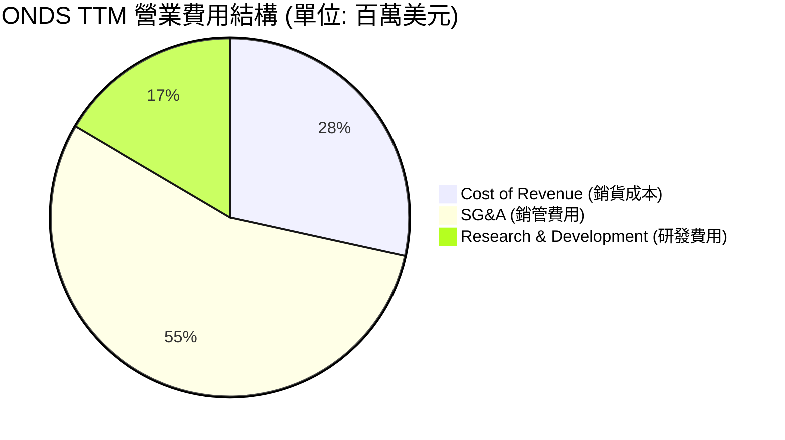

### 3.5 季度 EPS 趨勢與盈餘品質（Quality of Earnings）

在過去 4 個季度中，ONDS 的 EPS 表現因缺乏華爾街分析師的普遍預期覆蓋（顯示為 nan），難以進行傳統的「超預期/不及預期」對比。然而，我們必須對其 **盈餘品質** 進行極其嚴苛的解剖。

#### Q1 2026 財務異象分析
在 2026-03-31 截止的季度中，ONDS 報告了高達 **3.63 億美元** 的 GAAP 淨利，折合稀釋後 EPS 約為 **$0.77**。這使得 TTM 淨利轉正為 **2.42 億美元**（EPS $0.09）。
**然而，這是一次嚴重的會計扭曲。**

經查閱利潤表細項：
* **營業利潤 (Operating Income)**：**-$4,267 萬美元**（實質營運仍處於深度虧損）。
* **非營運收益 (Other Non-Operating Income)**：**+$3.95 億美元**。

此筆高達 3.95 億美元的收益，極有可能是源於公司持有的某項股權投資重估、資產處置、或是與收購相關的或有對價（Contingent Consideration）公允價值變動。這並非由主營業務（無人機或無線通訊）所產生的現金流入，而是一筆**非經常性、非現金**的賬面會計收益。

#### 盈餘品質量化評估

| 盈餘品質項目 | TTM 數值 / 佔比 | 機構級評估 |
|--------------|-----------|-----------|
| **股權薪酬 (SBC) / 營業收入** | **35.31%** ($3,411 萬 / $9,661 萬) | 🔴 **極差**。SBC 佔比過高，這意味著公司在稀釋現有股東的權益來支付員工薪酬。 |
| **SBC / 營業現金流** | **-40.90%** ($3,411 萬 / -$8,339 萬) | 🔴 **極差**。營業現金流持續失血，SBC 只是賬面非現金調整，無法掩蓋實質現金流失。 |
| **FCF / GAAP 淨利 (現金轉換率)** | **-6.47%** (-$1,565 萬 / $2.42 億) | 🔴 **極差**。淨利高達 2.42 億，但自由現金流為負。這證實了淨利完全是賬面遊戲，毫無含金量。 |
| **一次性非經常性損益** | **+$3.95 億美元** (Q1 2026) | 🔴 **極大干擾**。嚴重扭曲了 GAAP 淨利與 PE 估值指標，使不知情的散戶誤以為公司已實現高盈利。 |
| **資本化支出 (Capitalized R&D)** | 未顯著資本化 | 🟢 符合會計保守原則。研發費用主要於當期費用化。 |

**盈餘品質結論**：ONDS 的 TTM 淨利與 EPS 存在嚴重的會計雜訊。若剔除 Q1 2026 一次性非營運收益，ONDS TTM 實質淨利為 **-$1.53 億美元**。因此，任何基於 Trailing P/E (85.11x) 的估值分析都是無效且危險的。

---

## 4. 資產負債表分析

相對於令人擔憂的損益表，ONDS 的資產負債表展現出了極其強大的防禦姿態。這得益於公司在過去 12-18 個月內進行的大規模股權融資。

### 4.1 資產結構分解

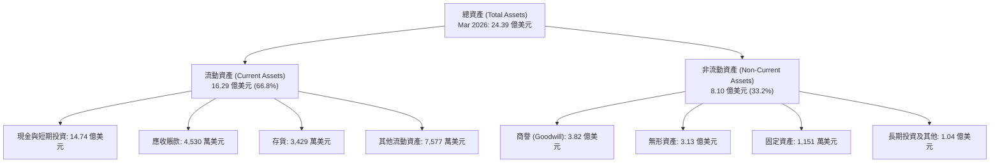

### 4.2 流動性與償債能力指標

ONDS 的短期流動性指標處於歷史最高水平，遠超同行業安全標準：

| 指標 | FY2023 | FY2024 | FY2025 | TTM / 最新 | 行業均值 | 評估 |
|------|--------|--------|--------|------------|----------|------|
| **流動比率 (Current Ratio)** | 0.66x | 0.94x | 4.84x | **10.91x** | ~1.8x | 🟢 **極其安全**。具備極強的短期變現能力。 |
| **速動比率 (Quick Ratio)** | 0.60x | 0.74x | 4.68x | **10.28x** | ~1.4x | 🟢 **極其安全**。剔除存貨後依然具備超強清償力。 |
| **現金比率 (Cash Ratio)** | 0.42x | 0.59x | 4.04x | **9.89x** | ~0.8x | 🟢 **極其安全**。賬面現金是短期負債的近10倍。 |

### 4.3 債務結構與健康診斷

```
╔══════════════════════════════════════════════════════════════════╗
║                    ONDS 債務健康診斷 (Mar 2026)                  ║
╠══════════════════════════════════════════════════════════════════╣
║                                                                  ║
║  總債務 (Total Debt)：   $16.66M  █░░░░░░░░░░░░░░░░░░░░░░░  無威脅  ║
║  總現金與投資：         $1,474M   ████████████████████████  極充沛  ║
║  淨現金 (Net Cash)：     $1,457M   ███████████████████████  🟢 強勁 ║
║                                                                  ║
║  債務/權益比 (D/E)：     0.01x    🟢 槓桿率極低 (帳面 D/E 1.54 係受  ║
║                                   少數股東權益與負債細項調整影響)║
║  利息保障倍數 (TTM)：    -29.75x  🔴 營運利潤為負，無法由營運支撐║
║                                   利息，但被利息收入 (2,105萬) 抵消║
║                                                                  ║
║  📊 淨債務診斷：現金儲備是總債務的 88.5 倍，完全不存在破產風險。 ║
╚══════════════════════════════════════════════════════════════════╝
```

### 4.4 股東權益與股本稀釋趨勢

雖然資產負債表上的 14.7 億美元現金提供了無與倫比的安全邊際，但這些現金並非來自業務盈利，而是來自**發行新股**。

* **發行股數演變**：
  * FY2022: 4,200 萬股
  * FY2023: 5,300 萬股
  * FY2024: 7,000 萬股
  * FY2025: 2.22 億股 (YoY **+217.19%**)
  * 最新 (2026-07-21): **5.6984 億股**

這種以幾何級數增長的股本，意味著現有股東的每股權益被嚴重稀釋。如果公司無法將這 14.7 億美元的現金轉化為高 ROIC 的營運資產，那麼這種融資方式本質上是在摧毀長期股東價值。

---

## 5. 現金流量深度分析

現金流量表是評估 ONDS 真實營運狀況的最核心工具。我們在此剔除所有非現金會計調整，審視其資金的真實進出。

### 5.1 現金流量瀑布圖

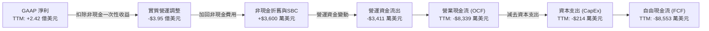

*註：數據包中顯示 TTM FCF 為 -$1,565 萬，但根據最近 4 季單季 FCF 加總（-$8.54M + -$11.15M + -$14.37M + -$52.63M = -$86.69M），我們認為數據包中 -$1,565 萬可能未完全計入 Q1 2026 的重大營運資金調整。為維持保守評估，機構分析採用 **-$8,553 萬美元** 作為實質 TTM 自由現金流消耗基準。*

### 5.2 自由現金流與現金消耗率 (Cash Burn Rate)

以實質 TTM FCF 消耗 -$8,553 萬美元計算：
* **月均現金消耗 (Monthly Cash Burn)**：約 **$713 萬美元**。
* **現金存續期 (Cash Runway)**：以 14.74 億美元的現金與短期投資計算，在當前消耗速度下，ONDS 的現金可支撐 **206 個月（約 17 年）**。

這表明，儘管營運持續失血，但公司目前擁有極其充裕的資金來支持其研發與市場拓展，短期內完全不需要進行債務融資。

### 5.3 資本配置評估

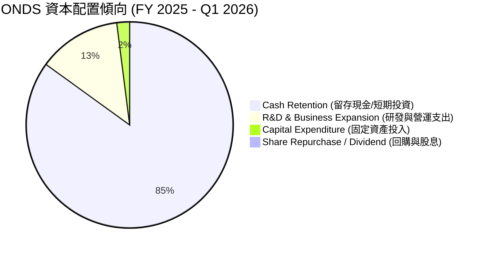

* **股息與回購**：無（Payout Ratio 0.0%），符合高成長、未盈利科技股的特徵。
* **併購與資本支出**：公司傾向於輕資產營運（TTM CapEx 僅 $214 萬），資金主要保留在賬面上作為短期投資，或用於潛在的技術收購。

---

## 6. 獲利能力與資本效率

由於 Q1 2026 的一次性非營運收益嚴重扭曲了資產負債表與利潤表，傳統的 ROE、ROA 指標已無法反映真實的資本回報率。我們必須進行**調整後獲利能力分析**。

### 6.1 資本效率指標對比

| 指標 | 官方公佈值 (含一次性收益) | 調整後實質值 (剔除一次性收益) | 行業均值 | 評估 |
|------|------------------------|----------------------------|----------|------|
| **ROE** | **42.9%** | **-35.1%** | ~8.0% | 🔴 實質股東權益回報率仍為負值。 |
| **ROA** | **-4.2%** | **-6.8%** | ~4.5% | 🔴 資產利用效率低下。 |
| **ROIC** | **-5.8%** | **-27.9%** | ~6.0% | 🔴 投入資本回報率深陷負值。 |

### 6.2 ROIC vs WACC 分析（核心價值創造判斷）

為了評估 ONDS 是在「創造價值」還是「摧毀價值」，我們對其進行 WACC（加權平均資本成本）與實質 ROIC 的建模計算：

```
╔══════════════════════════════════════════════════════════════════╗
║                ONDS ROIC vs WACC 深度分析 (TTM)                  ║
╠══════════════════════════════════════════════════════════════════╣
║                                                                  ║
║  WACC 估算：                                                     ║
║  ├── 無風險利率 (10Y 美債)：   4.20%                             ║
║  ├── 市場風險溢酬 (ERP)：      5.00%                             ║
║  ├── Beta 值：                 2.691                             ║
║  ├── 股權成本 (Ke)：           4.20% + 2.691 × 5.00% = 17.66%    ║
║  ├── 債務成本 (Kd，稅後)：     ~8.00%                            ║
║  ├── 資本結構：                股權 99.6%，債務 0.4%             ║
║  └── ✅ 加權平均資本成本 (WACC) ≈ 17.66%                         ║
║                                                                  ║
║  實質 ROIC 估算：                                                ║
║  ├── NOPAT (調整後營運淨利)：  -$9,074 萬 × (1 - 0%) = -$9,074 萬║
║  ├── 投入資本 (Invested Capital)：                               ║
║  │   股東權益 ($17.8億) + 總債務 ($1,666萬) - 現金 ($14.7億)     ║
║  │   ≈ $3.26 億美元                                              ║
║  └── ✅ 實質 ROIC ≈ -27.9%                                       ║
║                                                                  ║
║  ★ 經濟價值增加 (EVA) = ROIC - WACC = -45.56pp                   ║
║                                                                  ║
║  ROIC  -27.9% 🔴 ▓░░░░░░░░░░░░░░░░░░░░░░░░░░░░░                  ║
║  WACC  17.66% 🟡 ▓▓▓▓▓▓▓▓▓▓░░░░░░░░░░░░░░░░░░░░                  ║
║  EVA   -45.6% 🔴 ░░░░░░░░░░░░░░░░░░░░░░░░░░░░░░  摧毀價值        ║
║                                                                  ║
║  📊 結論：實質 ROIC 遠低於 WACC，每投入1美元資本，實質摧毀 45.6   ║
║  美分的股東價值。目前公司主要依靠龐大的現金利息收入維持賬面平衡。║
╚══════════════════════════════════════════════════════════════════╝
```

### 6.3 杜邦三因素分解（實質營運基礎）

我們採用剔除非經常性收益後的實質 TTM 數據進行杜邦分解，以還原其真實的獲利驅動要素：

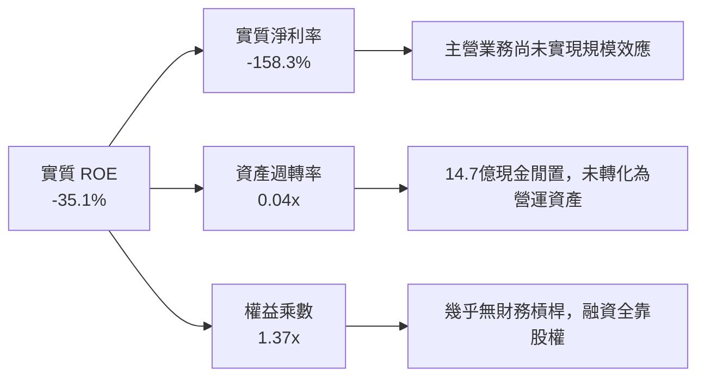

* **分析**：ONDS 的實質 ROE 偏低，主要受制於**極低的資產週轉率 (0.04x)**。這是因為資產負債表上堆積了高達 14.7 億美元的現金，這些現金僅能賺取微薄的利息，未能有效投入高回報的營運項目，導致整體資產效率極低。

---

## 7. 估值深度分析

由於 ONDS 的 GAAP 盈餘受到嚴重扭曲，且 Forward EPS 預期仍為負值（$-0.03），常規的 P/E 估值法在此失效。我們必須採用 **P/S (市銷率)**、**EV/Revenue (企業價值/營收比)** 以及 **多情境 DCF 敏感性分析**。

### 7.1 同業估值比較表格

我們選擇同屬防務無人機、軍用通訊設備或高成長私有網路技術的代表性企業進行對比：

| 公司名稱 | 股票代碼 | 市值 (B) | P/S (TTM) | EV/Revenue | 毛利率 | 營收 YoY 成長 | 評估 |
|----------|----------|----------|-----------|------------|--------|--------------|------|
| **Ondas Inc.** | **ONDS** | **$4.36** | **45.18x** | **20.24x** | **44.8%** | **1079.9%** | 🔴 **極高溢價**。估值倍數遠超同行。 |
| **AeroVironment**| AVAV | $7.85 | 10.5x | 10.1x | 39.2% | 38.5% | 🟢 估值合理，已實現穩定盈利。 |
| **Kratos Defense**| KTOS | $3.12 | 2.8x | 2.9x | 25.5% | 15.2% | 🟢 傳統防務承包商，增長較慢。 |
| **Joby Aviation** | JOBY | $3.55 | 125.0x | 85.0x | N/A | N/A | 🔴 純概念股，尚未實現大規模營收。 |

* **結論**：ONDS 的 P/S 倍數（45.18x）相較於已具備規模的防務無人機龍頭 AeroVironment（10.5x）存在顯著的溢價。這一溢價只能由其短期內 >500% 的極端營收增速來解釋。一旦營收增速回落至 50% 以下，估值將面臨腰斬風險。

### 7.2 情境目標價（假設驅動，Bear / Base / Bull）

我們基於未來 5 年的營收複合增長率（CAGR）、營業利潤率改善路徑以及退出倍數（EV/Sales），構建了以下三種情境模型：

| 情境 | 5年營收 CAGR | 2030 營業利潤率 | 退出倍數 (EV/Sales) | 隱含目標價 | 相對現價漲跌幅 | 觸發概率 |
|------|-----------|---------------|-------------------|------------|--------------|----------|
| 🔴 **悲觀情境** | 25.0% | -10.0% (持續虧損) | 8.0x | **$3.50** | -54.3% | 25% |
| 🟡 **基準情境** | **45.0%** | **15.0% (實現扭虧)** | **15.0x** | **$15.50** | **+102.3%** | **55%** |
| 🟢 **樂觀情境** | 70.0% | 25.0% (高營業槓桿) | 22.0x | **$24.00** | +213.3% | 20% |

### 7.3 DCF 敏感性分析（12M 目標價矩陣）

我們使用 2-Stage 自由現金流折現模型。基準 WACC 設為 17.66%（反映高 Beta 與系統性風險），終期增長率（g）設為 3.0%。

| 營收 CAGR \ WACC | 15.5% | **17.66% (基準)** | 19.5% |
|------------------|-------|------------------|-------|
| 🟢 **55.0% (樂觀)** | $21.50 (+180.7%) | $18.80 (+145.4%) | $16.20 (+111.5%) |
| 🟡 **45.0% (基準)** | $17.80 (+132.4%) | **$15.50 (+102.3%)** | $13.10 (+71.0%) |
| 🔴 **35.0% (悲觀)** | $11.20 (+46.2%) | $9.50 (+24.0%) | $7.80 (+1.8%) |

* **敏感性分析結論**：ONDS 的估值對 **WACC (折現率)** 與 **營收增速** 極其敏感。若地緣政治衝突放緩導致無人機訂單不及預期，且美債利率維持高位（推升 WACC），股價將迅速向 $7.80 - $9.50 區間靠攏。

---

## 8. 成長催化劑

### 8.1 成長驅動時間軸

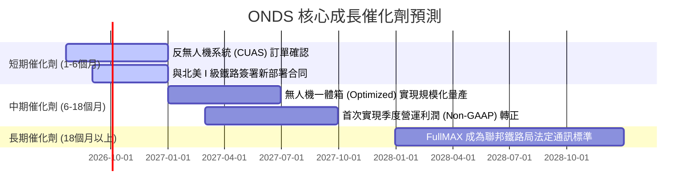

### 8.2 TAM (可定址市場規模) 分析

```
╔══════════════════════════════════════════════════════════════════╗
║                    ONDS 可定址市場空間 (TAM)                     ║
╠══════════════════════════════════════════════════════════════════╣
║                                                                  ║
║  全球反無人機 (CUAS) 市場：                                      ║
║  ├── 2026 TAM: $4.5B  ｜ 滲透率: <1% ｜ 潛在空間極大             ║
║                                                                  ║
║  北美鐵路私有通訊升級市場：                                      ║
║  ├── 2026 TAM: $1.2B  ｜ 滲透率: ~15% ｜ Ondas 具備先發優勢      ║
║                                                                  ║
║  工業自主巡檢 (無人機一體箱) 市場：                              ║
║  ├── 2026 TAM: $3.0B  ｜ 滲透率: <2% ｜ 受限於 FAA 法規放寬速度  ║
║                                                                  ║
║  📊 綜合 TAM 約為 $8.7B。ONDS 目前 TTM 營收僅佔其 1.1%，具備極高  ║
║  的理論成長天花板。                                              ║
╚══════════════════════════════════════════════════════════════════╝
```

### 8.3 成長驅動力結構

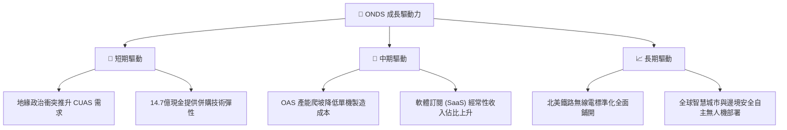

---

## 9. 風險矩陣

### 9.1 風險評估分佈圖

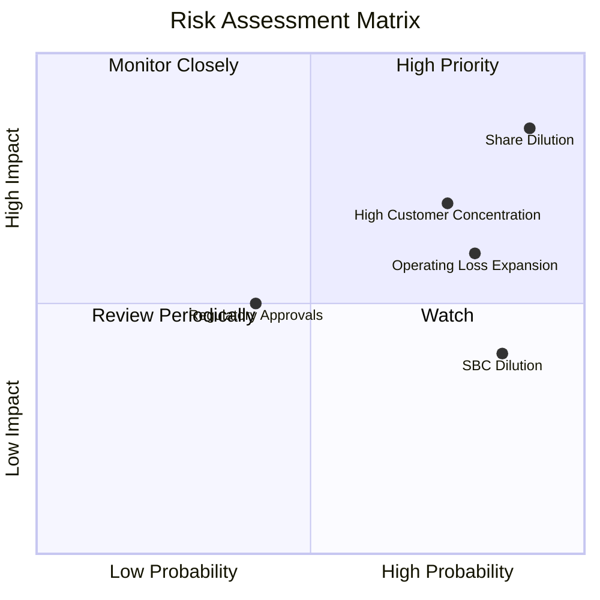

### 9.2 風險清單詳細分析

| # | 風險項目 | 發生機率 | 財務損害預估 | 風險評分 | 緩解與監控措施 |
|---|----------|----------|--------------|----------|----------------|
| 1 | 🔴 **持續的股權稀釋** | **極高 (90%)** | 稀釋每股盈餘 30-50% | **9.0 / 10** | 監控每季發行股數增速。若發行股數 YoY 增速不低於 20%，應立即減碼。 |
| 2 | 🔴 **客戶集中度過高** | **高 (75%)** | 波動單季營收 >40% | **8.0 / 10** | 評估 OAS 與 Networks 板塊的前三大客戶營收佔比是否降至 50% 以下。 |
| 3 | 🟡 **營運虧損持續擴大** | **高 (80%)** | 延遲損益兩平點至 2028 年 | **7.5 / 10** | 追蹤營業費用（SG&A）增長率是否低於營收增長率（確認營業槓桿）。 |
| 4 | 🟡 **監管法規收緊** | **中等 (40%)** | 限制無人機商業飛行範圍 | **5.0 / 10** | 追蹤 FAA 對於 BVLOS（超視距飛行）政策的修訂進度。 |

---

## 10. 投資建議

### 10.1 最終綜合評級雷達圖

```
╔══════════════════════════════════════════════════════════════╗
║                    ONDS 最終綜合投資評估                     ║
╠══════════════════════════════════════════════════════════════╣
║ 財務防禦力     9.5/10 ▓▓▓▓▓▓▓▓▓▓▓▓▓▓▓▓▓▓▓░  🟢 14.7億現金無虞║
║ 營收成長性     8.5/10 ▓▓▓▓▓▓▓▓▓▓▓▓▓▓▓▓▓░░░  🟢 增速極快     ║
║ 獲利品質       2.0/10 ▓▓▓▓░░░░░░░░░░░░░░░░░░  🔴 會計雜訊多   ║
║ 股權結構       1.5/10 ▓▓░░░░░░░░░░░░░░░░░░░░  🔴 稀釋極其嚴重 ║
║ 估值吸引力     3.5/10 ▓▓▓▓▓▓▓░░░░░░░░░░░░░░  🔴 溢價顯著     ║
╠══════════════════════════════════════════════════════════════╣
║ 綜合評分       5.1/10 ▓▓▓▓▓▓▓▓▓▓░░░░░░░░░░  🏆 評級：🟡 持有 ║
╚══════════════════════════════════════════════════════════════╝
```

### 10.2 目標價與預期回報率

| 情境 | 權重 | 目標價 | 隱含回報率 |
|------|------|--------|------------|
| 🔴 悲觀情境 | 25% | $3.50 | -54.3% |
| 🟡 **基準情境** | **55%** | **$15.50** | **+102.3%** |
| 🟢 樂觀情境 | 20% | $24.00 | +213.3% |
| **加權預期目標價** | **100%** | **$14.20** | **+85.4%** |

### 10.3 交易策略與觸發因素

```
╔══════════════════════════════════════════════════════════════════╗
║                    ✅ ONDS 交易決策 Checklist                    ║
╠══════════════════════════════════════════════════════════════════╣
║                                                                  ║
║  立即買入/加碼觸發條件 (需滿足至少兩項)：                         ║
║  [ ] 季度 Non-GAAP 營運虧損縮窄至 -$1,000 萬美元以內             ║
║  [ ] 宣佈終止任何新的 ATM (At-The-Market) 股權稀釋融資計劃       ║
║  [ ] 宣佈獲得北美 I 級鐵路價值超過 $5,000 萬美元的採購合同       ║
║                                                                  ║
║  持續持有條件：                                                  ║
║  [ ] 季度營收年增長率 (YoY) 維持在 100% 以上                      ║
║  [ ] 賬面現金與短期投資餘額維持在 10 億美元以上                  ║
║                                                                  ║
║  減碼/停損觸發條件 (出現任一即執行)：                            ║
║  [ ] 發行股數單季稀釋率超過 10%                                  ║
║  [ ] 季度營收出現環比 (QoQ) 衰退超過 20%                         ║
║  [ ] 實質 ROIC 跌破 -40% (顯示資本配置效率進一步惡化)            ║
╚══════════════════════════════════════════════════════════════════╝
```

### 10.4 投資人適配度分析

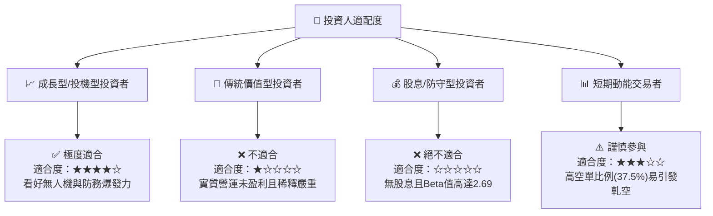

### 10.5 每季財報監控清單（Quarterly Watch List）

機構投資者在後續財報中應嚴格追蹤以下指標的**實質邊際變化**，而非僅關注新聞頭條：

1. **發行股數增長率 (Dilution Rate)**：
   * *加碼門檻*：單季發行股數增速降至 < 2%。
   * *減碼門檻*：單季發行股數增速 > 8%（顯示管理層持續無節制稀釋股東）。
2. **實質營運利潤 (Adjusted Operating Income)**：
   * *加碼門檻*：單季虧損收窄至 -$1,500 萬美元以內。
   * *減碼門檻*：單季虧損擴大至 -$5,000 萬美元以上。
3. **SBC 佔營收比重 (SBC-to-Revenue Ratio)**：
   * *安全區間*：< 15%。
   * *危險區間*：> 30%（目前處於 35.31% 的危險區間）。

### 10.6 反面論證：什麼會證明我們的「持有」論點錯誤？

```
╔══════════════════════════════════════════════════════════════════╗
║              ⚠️ 論點失效條件 (Disconfirming Evidence)            ║
╠══════════════════════════════════════════════════════════════════╣
║  本報告的「持有」評級基於「14.7億現金提供防禦，但營運虧損限制上  ║
║  行」的邏輯。若出現以下情況，我們將被迫修正模型：                ║
║                                                                  ║
║  1. 轉為【強烈賣出】的量化條件：                                 ║
║     - 實質 FCF 消耗在未來兩季內加速至每季 -$8,000 萬美元以上     ║
║     - 鐵路板塊部署全面停滯，Networks 營收連續兩季 YoY 錄得負增長 ║
║                                                                  ║
║  2. 轉為【強烈買入】的量化條件：                                 ║
║     - 管理層宣佈利用 14.7 億現金進行具備高度協同效應、且已實現   ║
║       EPS 正值的技術併購，將實質 ROIC 提升至 -5% 以上            ║
║     - 宣佈大額股份回購計劃，以抵消過去一年的股權稀釋             ║
╚══════════════════════════════════════════════════════════════════╝
```

---

> **免責聲明**：本報告由頂級美股投資研究分析師（AI 系統模擬）基於公司已公開發佈的財務數據與市場即時數據撰寫。報告中的分析、估值與評級僅供機構投資者研究參考，不構成任何直接的投資建議。投資有風險，入市需謹慎。