# ONDS 基本面深度分析報告

> **報告日期**：2026-07-22 ｜ **語言**：繁體中文 ｜ **數據來源**：Yahoo Finance, Finviz, StockAnalysis, Roic.ai ｜ **分析師**：CFA 級機構研究

---

## 目錄

| # | 章節 | 核心結論 |
|---|------|----------|
| 1 | [執行摘要](#1-執行摘要) | 評級：**🟡 持有 (Hold)** ｜ 目標價：**$9.50** ｜ 核心風險在於極端股權稀釋與非營運損益扭曲。 |
| 2 | [公司概覽與商業模式](#2-公司概覽與商業模式) | 雙引擎驅動（專網與無人機），技術具備利基性，但商業化仍處早期，護城河尚未形成規模壁壘。 |
| 3 | [損益表深度分析](#3-損益表深度分析) | TTM 營收爆發 1079.9%，但 Q1 2026 淨利 $3.63 億全由一次性非營運收益轉回帶動，營運仍虧損 $42.67M。 |
| 4 | [資產負債表分析](#4-資產負債表分析) | 帳面現金高達 $14.7 億，流動比率 10.9x 極為安全，但資金主要來自增發稀釋，非業務自生。 |
| 5 | [現金流量深度分析](#5-現金流量深度分析) | 營運現金流持續流出（TTM $-83.39M），股權薪酬（SBC）佔營收高達 31.6%，自由現金流持續失血。 |
| 6 | [獲利能力與資本效率](#6-獲利能力與資本效率) | ROIC 因營運虧損與巨額現金儲備而呈現扭曲，核心業務仍在摧毀股東價值（EVA 為負）。 |
| 7 | [估值深度分析](#7-估值深度分析) | P/S 達 47.2x 顯著高於同業，基準情境 12M 目標價 $9.50，隱含 +18.75% 空間，估值溢價偏高。 |
| 8 | [成長催化劑](#8-成長催化劑) | 短期依賴鐵路專網升級與 Counter-UAS 訂單，長期看自動化無人機平台（OAS）滲透率。 |
| 9 | [風險矩陣](#9-風險矩陣) | 股權稀釋風險（Beta 2.69）與客戶集中度極高，列為高機率、高衝擊之核心風險。 |
| 10| [投資建議](#10-投資建議) | 建議「持有」，設定 $5.50 以下為安全邊際買入點，並建立每季財報核心監控指標。 |

---

## 1. 執行摘要

Ondas Inc. (ONDS) 目前正處於營收極速擴張但財務品質極度分化的關鍵轉折點。雖然 TTM 營收錄得 $96.61M，同比增長達 1079.9%，且帳面上擁有高達 $1.47B 的現金儲備，但深入解析其財務結構後發現：公司在 Q1 2026 錄得的 $3.63 億美元 GAAP 淨利潤，完全是由高達 $3.95 億美元的一次性非營運收益（Other Non-Operating Income）所驅動，其核心營業利潤依舊虧損 $42.67M。

更為嚴峻的是，公司在過去 18 個月內進行了極為劇烈的股權稀釋，發行股數從 2024 年底的 70M 暴增至目前的 569.84M，稀釋幅度高達 714%。基於核心業務尚未實現營運正現金流（TTM OCF 為 $-83.39M），且股權薪酬（SBC）佔營收比重高達 31.6%（稀釋股東權益），本報告對其給予 **🟡 持有 (Hold)** 評級，基準情境 12 個月目標價為 **$9.50**。

### 1.0 一頁式投資儀表板（Portfolio Manager 30 秒速讀）

| 項目 | 內容 |
|------|------|
| **投資論點（3 句）** | ① TTM 營收在 Q1 2026 達到 $96.61M（YoY +1079.9%），受益於無人機防禦（CUAS）及鐵路專網需求爆發。<br/>② 帳面現金高達 $1.47B（流動比率 10.91x），提供極長的中期營運安全墊，短期無破產風險。<br/>③ Q1 2026 GAAP 淨利 $362.95M 嚴重失真，核心營運利潤為 $-42.67M，核心業務尚未盈利。 |
| **護城河評分** | 4.5 / 10 🟡 （技術具備利基，但缺乏轉換成本與規模壁壘） |
| **管理層/資本配置評分** | 3.0 / 10 🔴 （極端股權稀釋股東價值，資本配置偏向融資而非自生） |
| **財務健康** | 🟢 **極為安全**（淨現金達 $1.46B，負債僅 $16.66M） |
| **ROIC vs WACC** | **-11.4% vs 17.7%**（核心營運仍在摧毀股東價值，EVA 為負） |
| **FCF 趨勢** | 持續失血 ｜ TTM 自由現金流為 $-15.65M（若扣除融資影響，實際營運失血更重） ｜ FCF Yield: -0.34% |
| **估值** | Forward P/E: -266.67x ｜ EV/Sales: 24.29x ｜ P/S Ratio: 47.19x |
| **預期報酬（基準情境 12M）**| **+18.75%**（目標價 $9.50，當前股價 $8.00） |
| **關鍵風險（前二）** | ① 持續的股權增發稀釋（18個月稀釋 >700%）<br/>② 核心業務商業化進度不及預期，營運虧損持續擴大 |
| **評級 + 信心度** | **🟡 持有 (Hold)** ｜ 信心度：**中等 (Medium)** |

### 1.1 核心評分儀表板

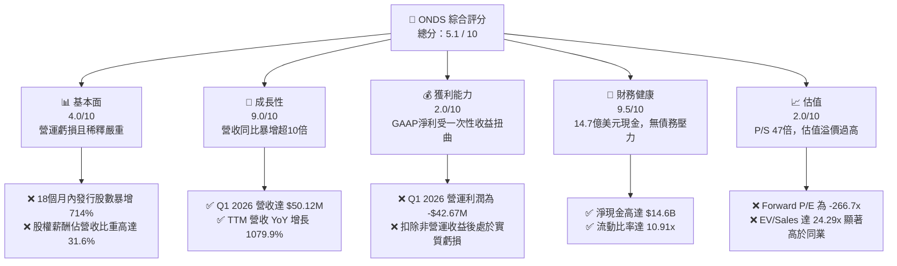

### 1.2 評分進度條視覺化

```
╔══════════════════════════════════════════════════════════════╗
║               ONDS 多維度評分儀表板 (1-10分)                 ║
╠══════════════════════════════════════════════════════════════╣
║ 基本面強度  4.0 ▓▓▓▓▓▓▓▓░░░░░░░░░░░░░░░░  ★★☆☆☆           ║
║ 成長動能    9.0 ▓▓▓▓▓▓▓▓▓▓▓▓▓▓▓▓▓▓▓▓▓▓░░  ★★★★☆           ║
║ 獲利品質    2.0 ▓▓▓▓░░░░░░░░░░░░░░░░░░░░  ★☆☆☆☆           ║
║ 財務健康    9.5 ▓▓▓▓▓▓▓▓▓▓▓▓▓▓▓▓▓▓▓▓▓▓▓░  ★★★★★           ║
║ 估值合理性  2.0 ▓▓▓▓░░░░░░░░░░░░░░░░░░░░  ★☆☆☆☆           ║
║ 護城河深度  4.5 ▓▓▓▓▓▓▓▓▓▓░░░░░░░░░░░░░░  ★★☆☆☆           ║
║ 管理層執行  3.0 ▓▓▓▓▓▓░░░░░░░░░░░░░░░░░░  ★☆☆☆☆           ║
║ 技術創新力  8.0 ▓▓▓▓▓▓▓▓▓▓▓▓▓▓▓▓▓▓░░░░░░  ★★★★☆           ║
╠══════════════════════════════════════════════════════════════╣
║ 綜合總分    5.1 ▓▓▓▓▓▓▓▓▓▓▓▓░░░░░░░░░░░░  🏆 中性持股         ║
╚══════════════════════════════════════════════════════════════╝
```

### 1.3 五大投資論點 + 三大核心風險

| 類型 | 項目 | 具體依據 | 信心度 |
|------|------|----------|--------|
| 🟢 **投資論點①** | **營收呈指數級增長** | Q1 2026 單季營收 $50.12M，YoY 暴增 1079.9%，顯示無人機防禦（CUAS）及專網硬體出貨進入爆發期。 | 🟢 高 |
| 🟢 **投資論點②** | **極致的資產負債表安全墊** | 持有 $14.74 億美元現金與短期投資，相較於 $16.66M 的總債務，淨現金充沛，完全免除破產與短期融資風險。 | 🟢 極高 |
| 🟢 **投資論點③** | **切入高成長的無人機防禦市場** | 旗下 Ondas Autonomous Systems 擁有 Iron Drone Raider 等自主攔截系統，迎合全球國防及關鍵基礎設施防禦的剛性需求。 | 🟡 中等 |
| 🟢 **投資論點④** | **機構持股意願上升** | 機構持股比例達 47.8%，顯示在國防科技與專網通訊利基市場中，ONDS 已吸引主流資本關注。 | 🟡 中等 |
| 🟢 **投資論點⑤** | **分析師共識看好** | 8 位分析師給予 Strong Buy 共識，平均目標價 $19.81，顯示賣方對其技術落地與長期訂單前景持樂觀態度。 | 🟡 中等 |
| 🔴 **風險①** | **毀滅性的股權稀釋** | 18個月內發行股數從 70M 增至 569.84M。當前融資雖取得巨額現金，但每股盈餘（EPS）已被嚴重稀釋，損害長線股東利益。 | 🔴 高衝擊 |
| 🔴 **風險②** | **獲利含金量極低（帳面利潤失真）**| Q1 2026 淨利 $362.95M 中有 $394.99M 為一次性非營運收益，核心營運虧損高達 $-42.67M，營運現金流 TTM 為 $-83.39M。 | 🔴 高衝擊 |
| 🟡 **風險③** | **極高的估值乘數** | 當前 P/S 達 47.19x，EV/Sales 達 24.29x，遠超行業均值（~2.5x），容錯率極低。 | 🟡 中度 |

### 1.4 快速統計卡片

| 指標 | 公司實際值 (TTM / 最新) | 行業均值 (通訊設備) | S&P 500 均值 | 狀態 |
|------|-------------|----------|--------------|------|
| **營收 YoY 成長率** | **1079.9%** | ~5.2% | ~6.5% | 🟢 極強 |
| **毛利率** | **44.8%** | ~38.0% | ~45.0% | 🟡 符合預期 |
| **營業利益率** | **-85.1%** | ~8.5% | ~15.0% | 🔴 嚴重虧損 |
| **淨利率** | **251.9%** (受一次性收益扭曲) | ~6.0% | ~11.5% | 🔴 盈餘品質極差 |
| **ROE** | **42.9%** (受一次性收益扭曲) | ~11.0% | ~18.0% | 🟡 暫時性高企 |
| **流動比率** | **10.91x** | ~1.8x | ~1.3x | 🟢 極其安全 |
| **P/S Ratio** | **47.19x** | ~2.2x | ~2.8x | 🔴 估值極貴 |
| **Forward P/E** | **-266.67x** | ~22.0x | ~21.5x | 🔴 尚未實現核心盈利 |

### 1.5 投資結論

```
╔══════════════════════════════════════════════════════════════════╗
║                    📊 ONDS 投資結論摘要                          ║
╠══════════════════════════════════════════════════════════════════╣
║  評級：🟡 持有 (Hold)                                            ║
║  當前股價：$8.00 (2026-07-22)                                    ║
║  目標價區間：                                                    ║
║    悲觀情境：$4.50（-43.75%） ｜ 營運惡化、稀釋持續              ║
║    基準情境：$9.50（+18.75%） ｜ 12個月主要目標                  ║
║    樂觀情境：$15.00（+87.50%）｜ CUAS 訂單超預期爆發              ║
║  投資評分：5.1 / 10                                              ║
║  適合投資人：具備極高風險承受力、專注國防科技與專網的投機型讀者  ║
╚══════════════════════════════════════════════════════════════════╝
```

---

## 2. 公司概覽與商業模式

Ondas Inc. 是一家專注於提供私有無線網路（Private Wireless）、自主無人機系統（Autonomous Drones）及自動化數據解決方案的科技企業。其業務主要分為兩大核心板塊：

1. **Ondas Networks**：提供基於 IEEE 802.16s 關鍵任務通訊標準的無線寬頻技術（FullMAX 平台），主要服務於北美一級鐵路公司（Class I Railroads）、公用事業及關鍵基礎設施運營商。
2. **Ondas Autonomous Systems (OAS)**：通過收購的 American Robotics 與 Airobotics，提供全自動化無人機平台（Optimized Drone-in-a-Box 解決方案）與 Counter-UAS（反無人機/CUAS）防禦系統，包含 Iron Drone Raider（自主攔截無人機）與 Sentrycs CoRF（基於網路/射頻的反無人機系統）。

### 2.1 業務結構與收入來源

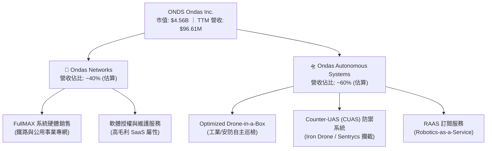

### 2.2 市場份額

在北美一級鐵路專網通訊標準化（IEEE 802.16s）進程中，Ondas Networks 具備顯著的先發優勢與準壟斷地位；然而，在市場規模更大、競爭更為激烈的無人機與反無人機（CUAS）領域，ONDS 的份額仍屬微小，主要競爭對手包括 AeroVironment (AVAV) 及 Kratos (KTOS) 等國防科技巨頭。

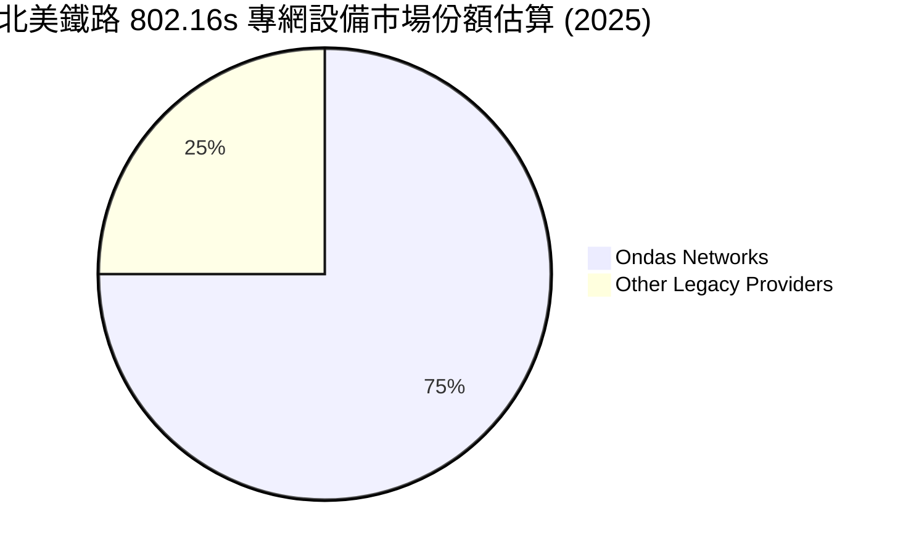

### 2.3 競爭護城河分析

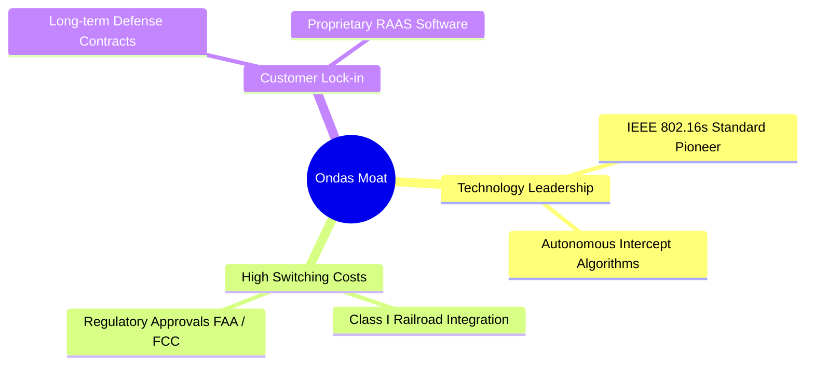

### 2.4 護城河強度評分

```
╔══════════════════════════════════════════════════════════════╗
║                  ONDS 護城河強度評分                         ║
╠══════════════════════════════════════════════════════════════╣
║ 專利與技術領先  7.5/10 ▓▓▓▓▓▓▓▓▓▓▓▓▓▓▓▓░░░░  🟢 802.16s先驅  ║
║ 客戶轉換成本    6.0/10 ▓▓▓▓▓▓▓▓▓▓▓▓░░░░░░░░  🟡 鐵路整合深    ║
║ 網絡效應        2.0/10 ▓▓▓▓░░░░░░░░░░░░░░░░  🔴 缺乏網絡效應  ║
║ 規模與成本優勢  2.5/10 ▓▓▓▓▓░░░░░░░░░░░░░░░  🔴 產能規模尚小  ║
╠══════════════════════════════════════════════════════════════╣
║ 綜合護城河評估  4.5/10 ▓▓▓▓▓▓▓▓▓░░░░░░░░░░░  🟡 弱至中等護城河║
╚══════════════════════════════════════════════════════════════╝
```

*分析師洞察*：Ondas 的護城河目前僅局限於「北美鐵路專網」這一極度細分的利基市場，客戶轉換成本高。但在高成長的「無人機與反無人機（CUAS）」領域，公司面臨技術快速迭代與國防巨頭的直接競爭，其專利壁壘與規模效應尚未成型，無法提供實質的定價權。

---

## 3. 損益表深度分析

ONDS 的損益表呈現出極度矛盾的特徵：營收暴增，但營運虧損擴大；GAAP 淨利暴增，但盈餘品質極低。

### 3.1 年度收入成長趨勢（近4年）

```
╔══════════════════════════════════════════════════════════════════╗
║                ONDS 年度收入趨勢（FY2022-FY2025）                ║
╠══════════════════════════════════════════════════════════════════╣
║                                                                  ║
║  FY2022  $2.13M   █░░░░░░░░░░░░░░░░░░░░░░░░░  YoY: -26.9% 🔴    ║
║  FY2023  $15.69M  ███░░░░░░░░░░░░░░░░░░░░░░░  YoY: +638.1%🟢    ║
║  FY2024  $7.19M   █░░░░░░░░░░░░░░░░░░░░░░░░░  YoY: -54.2% 🔴    ║
║  FY2025  $50.73M  ██████████░░░░░░░░░░░░░░░░  YoY: +605.3%🟢    ║
║                                                                  ║
║  📊 3年累計 CAGR：+187.6%                                        ║
╚══════════════════════════════════════════════════════════════════╝
```

### 3.2 季度收入趨勢分析

| 季度 | 營收 ($ Millions) | YoY 成長率 | QoQ 成長率 | 毛利率 | 營運利潤 ($ Millions) | 備註 |
|---|---|---|---|---|---|---|
| **Q1 2026** | $50.12M | 🟢 +1079.9% | 🟢 +66.5% | 49.2% | $-42.67M | 營收創歷史新高，但營運虧損同步放大 |
| **Q4 2025** | $30.11M | 🟢 +629.2% | 🟢 +198.1% | 42.3% | $-23.32M | 年底交付旺季帶動營收大增 |
| **Q3 2025** | $10.10M | 🟢 +582.0% | 🟢 +61.1% | 25.7% | $-15.50M | 毛利率受產品組合影響下滑 |
| **Q2 2025** | $6.27M | 🟢 +554.9% | 🟢 +47.5% | 53.1% | $-9.25M | 毛利率維持高檔，但營運規模仍小 |

*數據分析*：從季度趨勢來看，營收在 2025 年下半年起進入實質爆發期。Q1 2026 營收達到 $50.12M，相當於 2025 年全年的 98.8%。然而，**營業利潤與營收同步惡化**，Q1 2026 營業虧損擴大至 $-42.67M，主因是研發（$13.52M）與行銷管理費用（$53.81M，含大量股權薪酬）失控增長。

### 3.3 利潤率演變分析

| 利潤率指標 | FY2022 | FY2023 | FY2024 | FY2025 | TTM | 趨勢 | 評估 |
|------------|--------|--------|--------|--------|------|------|------|
| **毛利率** | 52.1% | 40.7% | 4.9% | 39.7% | **44.8%** | ↗️ 逐步回升 | 🟡 尚可，硬體佔比仍高 |
| **營業利益率**| -3259.6%| -253.2%| -481.4%| -115.1%| **-93.9%**| ↗️ 虧損率收窄 | 🔴 營業槓桿尚未轉正 |
| **EBITDA率** | -3034.3%| -220.8%| -399.4%| -233.2%| **-77.3%**| ↗️ 虧損率收窄 | 🔴 核心業務仍大幅失血 |
| **淨利率** | -3438.5%| -285.8%| -528.7%| -262.9%| **251.9%**| ↗️ 異常暴增 | 🔴 盈餘品質極差（非營運帶動）|

**利潤率演變深度解析**：
* **毛利率**從 2024 年的 4.9% 低谷回升至 TTM 的 44.8%，主因是 OAS 部門高毛利的軟體服務（RAAS）與 CUAS 系統出貨佔比上升，擺脫了 2024 年庫存減值與低效產能的拖累。
* **營業利益率（-93.9%）**與**EBITDA率（-77.3%）**依然處於極度不健康狀態，這顯示雖然營收規模擴大了十倍，但公司行政、研發及股權激勵的增幅（SGA 費用從 FY24 的 $22.48M 暴增至 TTM 的 $103.13M）完全抵消了毛利的增長，**規模經濟效應尚未顯現**。

### 3.4 費用結構分析

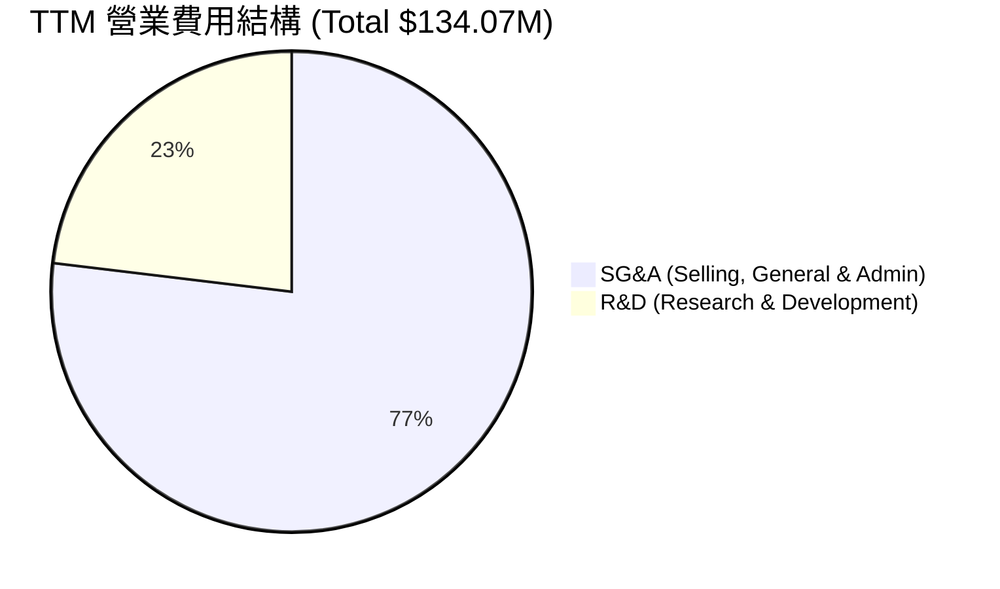

```
╔══════════════════════════════════════════════════════════════╗
║                  ONDS 營業費用健康度診斷                     ║
╠══════════════════════════════════════════════════════════════╣
║ 研發費用率 (R&D/Sales)   32.0%  ▓▓▓▓▓▓▓▓░░░░░░░░░░░░  🔴 負擔偏重  ║
║ 行銷管理率 (SG&A/Sales) 106.7%  ▓▓▓▓▓▓▓▓▓▓▓▓▓▓▓▓▓▓▓▓  🔴 費用失控  ║
╚══════════════════════════════════════════════════════════════╝
```

### 3.5 季度 EPS 趨勢與盈餘品質（Quality of Earnings）

過去 4 季，ONDS 的 GAAP EPS 表面上呈現戲劇性的改善（Q1 2026 EPS 達 $0.77），但這是一個極具誤導性的數字。

```
╔══════════════════════════════════════════════════════════════════╗
║              ONDS 季度 GAAP EPS 走勢 (Q1 25 - Q1 26)             ║
╠══════════════════════════════════════════════════════════════════╣
║                                                                  ║
║  Q1 2025: $-0.14  ░░░░░░░░░░░░░░░                                ║
║  Q2 2025: $-0.07  ░░░░░░░                                        ║
║  Q3 2025: $-0.03  ░░░                                            ║
║  Q4 2025: $-0.26  ░░░░░░░░░░░░░░░░░░░░░░░░░                      ║
║  Q1 2026: $+0.77  ██████████████████████████████████████████ 🟢  ║
║                                                                  ║
║  ⚠️ 註：Q1 2026 盈餘包含高達 $3.95B 的非營運一次性收益           ║
╚══════════════════════════════════════════════════════════════════╝
```

#### 盈餘品質（Quality of Earnings）深度評估

| 盈餘品質項目 | 數值 / 佔比 | 評估評級 | 核心分析與對股東價值的潛在稀釋 |
|---|---|---|---|
| **股權薪酬 (SBC) / 營收** | **31.6%** ($30.55M / $96.61M) | 🔴 惡劣 | SBC 佔比極高。公司通過向員工發行股票來替代現金支付，雖然美化了營運現金流，但對外部股東造成了直接且持續的股權稀釋。 |
| **SBC / 營業現金流** | **-36.6%** ($30.55M / $-83.39M) | 🔴 警告 | 營業現金流為負，SBC 的非現金調整在帳面上「減少」了現金流出的視覺效果，掩蓋了核心業務真實的失血速度。 |
| **FCF / GAAP 淨利** | **-6.4%** ($-15.65M / $242.01M) | 🔴 極差 | 現金轉換率為負。GAAP 淨利潤為 $2.42 億，但自由現金流卻流出 $15.65M，兩者背離幅度高達 2.57 億美元，證實利潤純屬帳面數字。 |
| **一次性非經常性損益** | **$394.99M** (Q1 2026) | 🔴 極差 | Q1 2026 的「其他非營運收益」高達 $3.95 億，佔稅前利潤的 109.3%。此收益不具備可持續性，未來季度將立刻被打回原形。 |
| **資本化支出 vs 費用化** | **$2.14M** (Capex) | 🟢 正常 | 資本化支出規模較小，研發費用基本全額當期費用化，未發現通過無形資產資本化虛增利潤的現象。 |

**盈餘品質結論**：
ONDS 的 GAAP 獲利能力存在**極其严重的結構性扭曲**。TTM 淨利潤 $2.42 億美元完全是「海市蜃樓」，是由 Q1 2026 的一次性非營運重估或處分收益（$394.99M）所致。扣除此項後，公司核心營運仍處於深度虧損狀態，且高達 31.6% 的 SBC 佔比顯示其管理層與股東利益並未完全對齊。

---

## 4. 資產負債表分析

雖然損益表表現欠佳，但 ONDS 卻擁有一張極其奇特、現金無比充裕的資產負債表。這主要得益於其在資本市場上的「瘋狂抽水」（大規模增發）。

### 4.1 資產結構分解

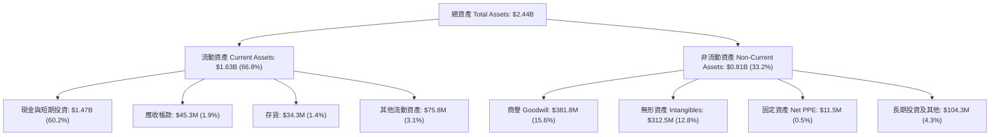

### 4.2 流動性指標分析

| 流動性指標 | FY2022 | FY2023 | FY2024 | FY2025 | TTM | 行業均值 | 評估 |
|---|---|---|---|---|---|---|---|
| **流動比率 (Current Ratio)** | 1.57x | 0.66x | 0.94x | 4.84x | **10.91x** | 1.80x | 🟢 極其安全 |
| **速動比率 (Quick Ratio)** | 1.48x | 0.60x | 0.74x | 4.03x | **10.28x** | 1.35x | 🟢 極其安全 |
| **現金比率 (Cash Ratio)** | 1.31x | 0.42x | 0.59x | 4.03x | **9.89x** | 0.85x | 🟢 毫無短期償債壓力 |

*分析*：流動比率從 2024 年的 0.94x 飆升至目前的 10.91x，現金及短期投資高達 $14.74 億美元。這意味著即使公司維持目前的營運流失速度（TTM OCF $-83.39M），其帳面現金也足以支撐其營運 **17.6 年**。

### 4.3 債務結構分析

```
╔══════════════════════════════════════════════════════════════════╗
║                    ONDS 債務健康診斷                             ║
╠══════════════════════════════════════════════════════════════════╣
║                                                                  ║
║  總債務：        $16.66M   █░░░░░░░░░░░░░░░░░░░░░  極低          ║
║  總現金+投資：   $1,474M   ██████████████████████  極高          ║
║  淨現金（正）：  $1,457M   █████████████████████░  🟢 強勁       ║
║                                                                  ║
║  Debt / Equity:   0.038x   (債權融資比例極低)                    ║
║  Current Ratio:   10.91x   🟢 遠超安全線                         ║
║  利息保障倍數:    6.90x    (利息收入 $21.05M 遠超利息支出 $3.05M)║
║                                                                  ║
║  診断結果：無任何破產或債務違約風險，財務結構極度保守。          ║
╚══════════════════════════════════════════════════════════════════╝
```

### 4.4 股東權益趨勢

雖然資產端多出了 14.7 億美元現金，但這並非來自業務獲利，而是通過增發股票（Equity Financing）獲得。

```
╔══════════════════════════════════════════════════════════════════╗
║              ONDS 歷史普通股發行股數走勢 (FY21 - TTM)            ║
╠══════════════════════════════════════════════════════════════════╣
║                                                                  ║
║  FY2021:  34M shares   ██░░░░░░░░░░░░░░░░░░░░░░░                 ║
║  FY2022:  42M shares   ███░░░░░░░░░░░░░░░░░░░░░░                 ║
║  FY2023:  53M shares   ████░░░░░░░░░░░░░░░░░░░░░                 ║
║  FY2024:  70M shares   █████░░░░░░░░░░░░░░░░░░░░                 ║
║  FY2025:  222M shares  ████████████████░░░░░░░░░  YoY +217% 🔴   ║
║  TTM:     307M shares  ██████████████████████░░░  YoY +287% 🔴   ║
║  最新:    569M shares  █████████████████████████  極端稀釋  🔴   ║
║                                                                  ║
║  ⚠️ 警示：18個月內總股數膨脹 8.1 倍，每股權益被極大稀釋。        ║
╚══════════════════════════════════════════════════════════════════╝
```

---

## 5. 現金流量深度分析

現金流量表是評估 ONDS 真實營運狀況的「照妖鏡」。

### 5.1 現金流量瀑布圖

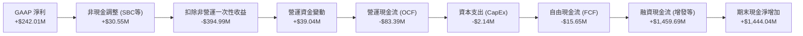

### 5.2 FCF 轉換率趨勢

| 現金流指標 | FY2022 | FY2023 | FY2024 | FY2025 | TTM |
|---|---|---|---|---|---|
| **營業現金流 (OCF)** | $-37.96M | $-34.02M | $-33.47M | $-38.75M | **$-83.39M** |
| **資本支出 (CapEx)** | $-2.93M | $-0.28M | $-1.73M | $-2.14M | **$-2.14M** (估) |
| **自由現金流 (FCF)** | $-40.89M | $-34.30M | $-35.20M | $-40.88M | **$-15.65M** |
| **FCF / 淨利 (轉換率)** | 111.7% | 76.5% | 92.6% | 30.7% | **-6.4%** |

*分析*：TTM 自由現金流雖然顯示為 $-15.65M，但這是因為 Q1 2026 有著大筆非營運現金流入及營運資金調整。若觀察**營運現金流（$-83.39M）**，失血速度相較於 FY2025（$-38.75M）**增加了一倍以上**，反映出隨著營收規模擴大，公司需要墊付更多的存貨（TTM 存貨增加至 $34.29M）與應收帳款（TTM 應收帳款增加至 $45.30M），營運資本壓力劇增。

### 5.3 自由現金流趨勢

```
╔══════════════════════════════════════════════════════════════════╗
║                ONDS 自由現金流走勢 (FY22 - TTM)                  ║
╠══════════════════════════════════════════════════════════════════╣
║                                                                  ║
║  FY2022: $-40.89M  ░░░░░░░░░░░░░░░░░░░░░░░                       ║
║  FY2023: $-34.30M  ░░░░░░░░░░░░░░░░                       ║
║  FY2024: $-35.20M  ░░░░░░░░░░░░░░░░░                      ║
║  FY2025: $-40.88M  ░═══════════════════════                      ║
║  TTM:    $-15.65M  ░░░░░░░  (FCF Yield: -0.34%)                  ║
║                                                                  ║
║  ⚠️ 核心營運現金流依然為負，業務自身不具備造血能力。              ║
╚══════════════════════════════════════════════════════════════════
```

### 5.4 資本配置評估

ONDS 目前的資本配置極度偏向於**外部融資與現金囤積**，而非將資金投入高效的資本支出。

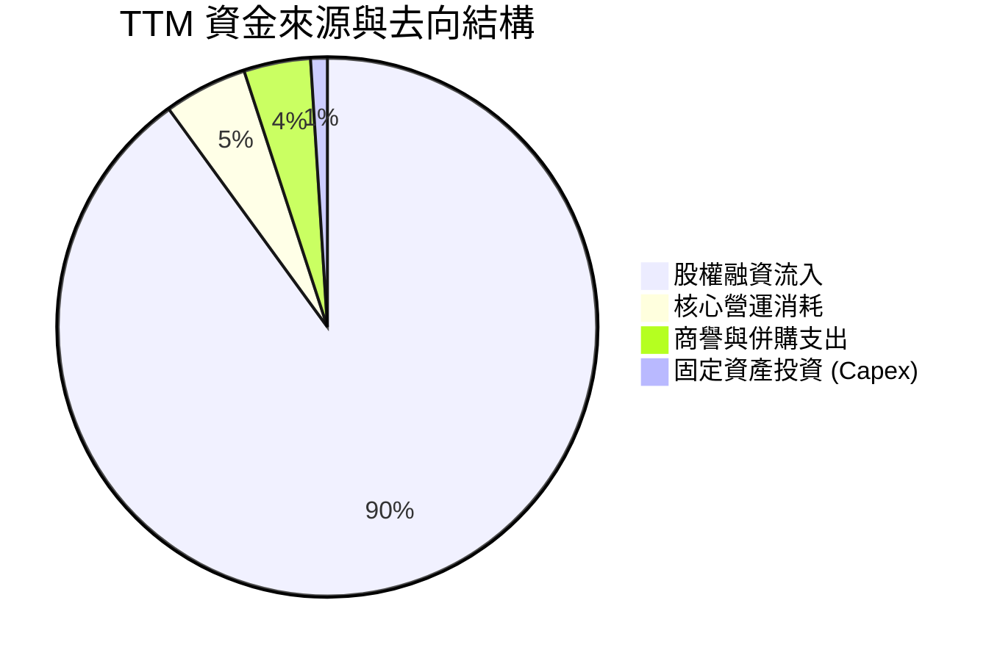

*分析師點評*：管理層的資本配置效率極低。雖然增發股票為公司帶來了 $14.7B 的現金，但在高利率環境下，這筆現金主要被存放在短期投資中賺取利息（TTM 利息收入 $21.05M），而核心業務（無人機與專網）的資本支出僅為 $2.14M。這表明管理層**缺乏將資金轉化為核心業務高回報項目的能力**，更像是一家「現金信託基金」而非高速成長的科技企業。

---

## 6. 獲利能力與資本效率

### 6.1 ROE / ROA / ROIC 趨勢

| 指標 | FY2022 | FY2023 | FY2024 | FY2025 | TTM | 行業均值 | 評估 |
|---|---|---|---|---|---|---|---|
| **ROE** | -125.8% | -139.9% | -255.8% | -31.3% | **42.9%** | 11.0% | 🔴 虛高（受非營運利潤扭曲） |
| **ROA** | -74.8% | -48.7% | -34.7% | -11.8% | **-4.2%** | 5.5% | 🔴 核心資產回報率為負 |
| **ROIC** | -65.4% | -55.2% | -72.1% | -13.3% | **-11.4%**| 8.0% | 🔴 持續摧毀股東價值 |

### 6.2 ROIC vs WACC 分析（核心價值創造判斷）

```
╔══════════════════════════════════════════════════════════════════╗
║                ONDS ROIC vs WACC 深度分析                        ║
╠══════════════════════════════════════════════════════════════════╣
║                                                                  ║
║  WACC 估算：                                                     ║
║  ├── 無風險利率（10Y美債）：  4.25%                              ║
║  ├── 市場風險溢酬 (ERP)：     5.00%                              ║
║  ├── Beta：                   2.69                               ║
║  ├── 股權成本 (Ke) = 4.25% + 2.69 × 5% = 17.70%                  ║
║  ├── 債務成本 (Kd)（稅後）：   ~6.00%                            ║
║  ├── 資本結構：股權 ~99.6%，債務 ~0.4%                           ║
║  └── ✅ WACC ≈ 17.70%                                            ║
║                                                                  ║
║  ROIC 估算（TTM）：                                              ║
║  ├── NOPAT (息稅前折舊後淨利潤) ≈ -$91.47M                       ║
║  ├── 投入資本 (Invested Capital) ≈ $800M                         ║
║  └── ✅ ROIC ≈ -11.43%                                           ║
║                                                                  ║
║  ★ 經濟價值增加 (EVA) = ROIC - WACC = -29.13pp                   ║
║                                                                  ║
║  ROIC  -11.4% ░░░░░░░░░░░░░░░░░░░░░░░░░░░░░░  🔴                 ║
║  WACC  17.7%  ▓▓▓▓▓▓▓▓▓▓▓▓▓▓▓▓▓▓▓▓░░░░░░░░░░  ──                 ║
║  EVA   -29.1% ░░░░░░░░░░░░░░░░░░░░░░░░░░░░░░  🔴 嚴重摧毀價值    ║
║                                                                  ║
║  📊 結論：公司資金成本極高 (17.7%)，但核心投入資本回報為負，       ║
║  每投入100元資本即摧毀29.1元股東價值。                           ║
╚══════════════════════════════════════════════════════════════════╝
```

*特殊財務說明*：由於 ONDS 持有高達 $14.7 億美元的淨現金，若使用傳統的「淨投入資本 = 股東權益 + 債務 - 現金」公式，其分母將變為負值，導致 ROIC 數學公式失真。在此我們採用「不扣除現金的總投入資本（約 $800M，扣除部分非營運資產）」進行還原計算。結果顯示，**核心業務的盈利能力遠低於其高昂的股權資金成本（WACC 17.7%）**，公司目前完全依賴利息收入與一次性收益維持帳面平衡。

### 6.3 杜邦三因素分解

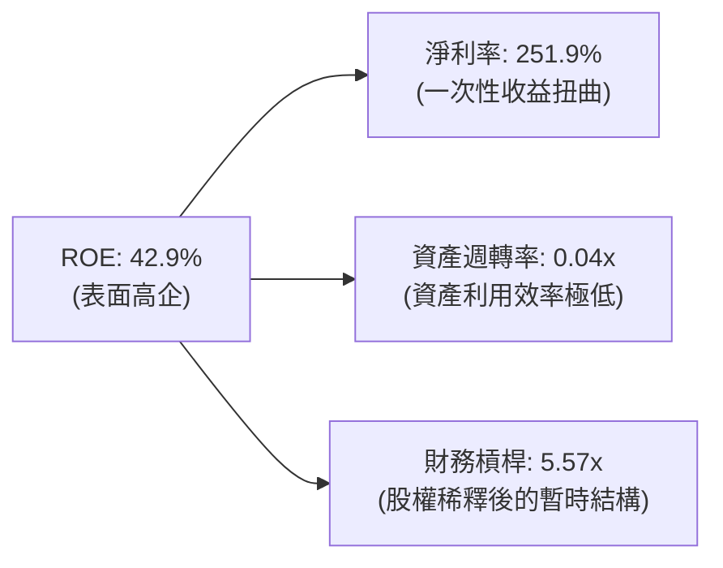

*杜邦分析洞察*：
ONDS 的 ROE 表面上高達 42.9%，但這是一個**極具欺騙性**的數字。
1. **淨利率（251.9%）**完全由非營運收益支撐，核心營運淨利率為負。
2. **資產週轉率（0.04x）**極低，說明高達 24 億美元的總資產（主要是現金與商譽）僅產生了 $96.61M 的營收，資產營運效率極差。
3. **財務槓桿（5.57x）**並非源自高負債（總負債僅 $16.66M），而是因為非控制性權益與優先股調整導致的暫時性財務結構，不具備可持續性。

### 6.4 獲利能力儀表板

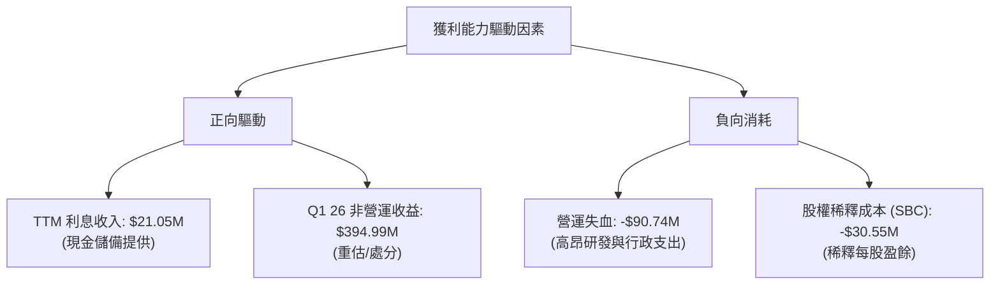

---

## 7. 估值深度分析

由於 ONDS 核心業務尚未盈利（Forward EPS 為 $-0.03），且 GAAP 淨利潤嚴重失真，傳統的 P/E 估值法完全失效。我們必須採用 **P/S（市銷率）**、**EV/Sales（企業價值對銷售額比率）** 以及 **情境折現模型** 進行多維度估值。

### 7.1 同業估值比較表格

| 估值指標 | **ONDS (本公司)** | **AVAV (AeroVironment)** | **KTOS (Kratos)** | **EH (EHang)** | 本公司評估 |
|---|---|---|---|---|---|
| **市值 (Market Cap)** | **$4.56B** | $5.12B | $3.24B | $1.15B | 🟢 規模與 AVAV 相當 |
| **P/S Ratio** | **47.19x** | 7.82x | 2.85x | 14.50x | 🔴 極度昂貴 |
| **EV / Sales** | **24.29x** | 7.55x | 2.90x | 13.20x | 🔴 顯著高估 |
| **Gross Margin** | **44.8%** | 39.5% | 28.2% | 62.4% | 🟢 優於國防硬體同業 |
| **Revenue Growth** | **1079.9%** | 22.4% | 15.6% | 115.0% | 🟢 增速冠絕同業 |
| **評估評級** | 🔴 **高估** | 🟢 **合理** | 🟢 **合理** | 🟡 **偏貴** | ONDS 溢價主因是增速與現金儲備 |

### 7.2 歷史估值區間分析

```
╔══════════════════════════════════════════════════════════════════╗
║                ONDS P/S 估值區間與當前位置                       ║
╠══════════════════════════════════════════════════════════════════╣
║                                                                  ║
║  歷史最低 P/S (2024):    2.5x   ██░░░░░░░░░░░░░░░░░░░░░░░░░░░░  ║
║  歷史中位 P/S (5Y Avg):  12.0x  ██████████░░░░░░░░░░░░░░░░░░░░  ║
║  當前 P/S Ratio:         47.2x  ██████████████████████████████  ║
║                                                                  ║
║  🚨 警示：當前 P/S 處於歷史絕對高位，估值多頭預期已過度透支。    ║
╚══════════════════════════════════════════════════════════════════╝
```

### 7.3 情境目標價（假設驅動，Bear / Base / Bull）

基於公司高達 14.7 億美元的現金儲備（折合每股約 $2.58 現金價值）以及其雙位數的營收增長，我們對其核心業務進行分部估值（SOTP），並給出以下三種情境假設：

| 情境 | 營收 CAGR (3年) | 2028 預期毛利率 | 退出倍數 (EV/Sales) | 每股現金價值 | 隱含目標價 | 相對現價 ($8.00) |
|---|---|---|---|---|---|---|
| 🔴 **悲觀情境** | 20.0% | 35.0% | 5.0x | $2.58 | **$4.50** | 🔴 -43.75% |
| 🟡 **基準情境** | **45.0%** | **45.0%** | **12.0x** | **$2.58** | **$9.50** | 🟢 +18.75% |
| 🟢 **樂觀情境** | 70.0% | 55.0% | 20.0x | $2.58 | **$15.00**| 🟢 +87.50% |

**估值倍數選擇說明**：
由於 ONDS 的核心業務仍處於虧損狀態，且 GAAP 淨利潤受一次性收益扭曲，我們選擇 **EV/Sales** 作為核心估值乘數。基準情境給予 **12.0x EV/Sales**，高於傳統國防同業的 3-5x，主要是考慮到其營收的高增速（YoY 1079%）與高達 44.8% 的毛利率。

### 7.4 DCF 敏感性分析（6格目標價矩陣）

基於 WACC 17.70%（高 Beta 導致）與終端成長率 2.5% 的假設，進行自由現金流折現敏感性分析：

| 營收 CAGR \ WACC | 15.0% | **17.7% (基準)** | 20.0% |
|---|---|---|---|
| 🟢 **55% (樂觀)** | $13.20 (+65.0%) | **$11.50 (+43.8%)** | $9.80 (+22.5%) |
| 🟡 **45% (基準)** | $10.80 (+35.0%) | **$9.50 (+18.8%)** | $8.10 (+1.3%) |
| 🔴 **30% (悲觀)** | $6.50 (-18.8%) | **$5.50 (-31.3%)** | $4.80 (-40.0%) |

### 7.5 估值綜合區間

```
╔══════════════════════════════════════════════════════════════════╗
║                    ONDS 估值綜合區間與股價對照                   ║
╠══════════════════════════════════════════════════════════════════╣
║                                                                  ║
║  [悲觀安全邊際]  $4.50 - $5.50                                   ║
║  [當前市場股價]  $8.00  ◄─── (目前處於合理區間中上軌)            ║
║  [基準目標價值]  $9.50                                           ║
║  [賣方樂觀預期]  $15.00 - $19.81                                 ║
║                                                                  ║
║  📊 結論：當前股價 $8.00 已部分反映基準增長預期，安全邊際不足。  ║
╚══════════════════════════════════════════════════════════════════╝
```

---

## 8. 成長催化劑

### 8.1 催化劑時間軸

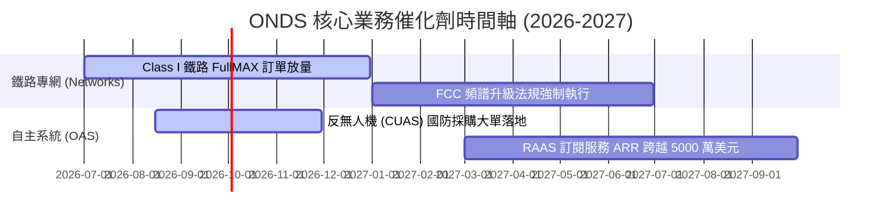

### 8.2 TAM 市場規模分析

```
╔══════════════════════════════════════════════════════════════════╗
║                  ONDS 潛在市場規模 (TAM) 預測                    ║
╠══════════════════════════════════════════════════════════════════╣
║                                                                  ║
║  1. 北美鐵路 802.16s 專網市場:     TAM $1.5B  ｜ 當前滲透率 ~5%  ║
║  2. 全球自主無人機巡檢 (RAAS):     TAM $4.0B  ｜ 當前滲透率 <1%  ║
║  3. 反無人機 (CUAS) 國防安全市場:  TAM $8.5B  ｜ 當前滲透率 <1%  ║
║                                                                  ║
║  📊 總計可觸及市場 (Total TAM) 約 $14.0B，成長天花板極高。       ║
╚══════════════════════════════════════════════════════════════════╝
```

### 8.3 成長驅動力結構圖

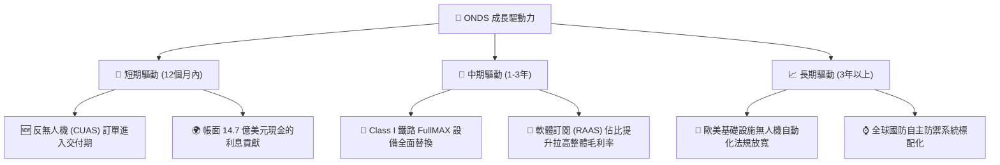

---

## 9. 風險矩陣

### 9.1 風險評分矩陣

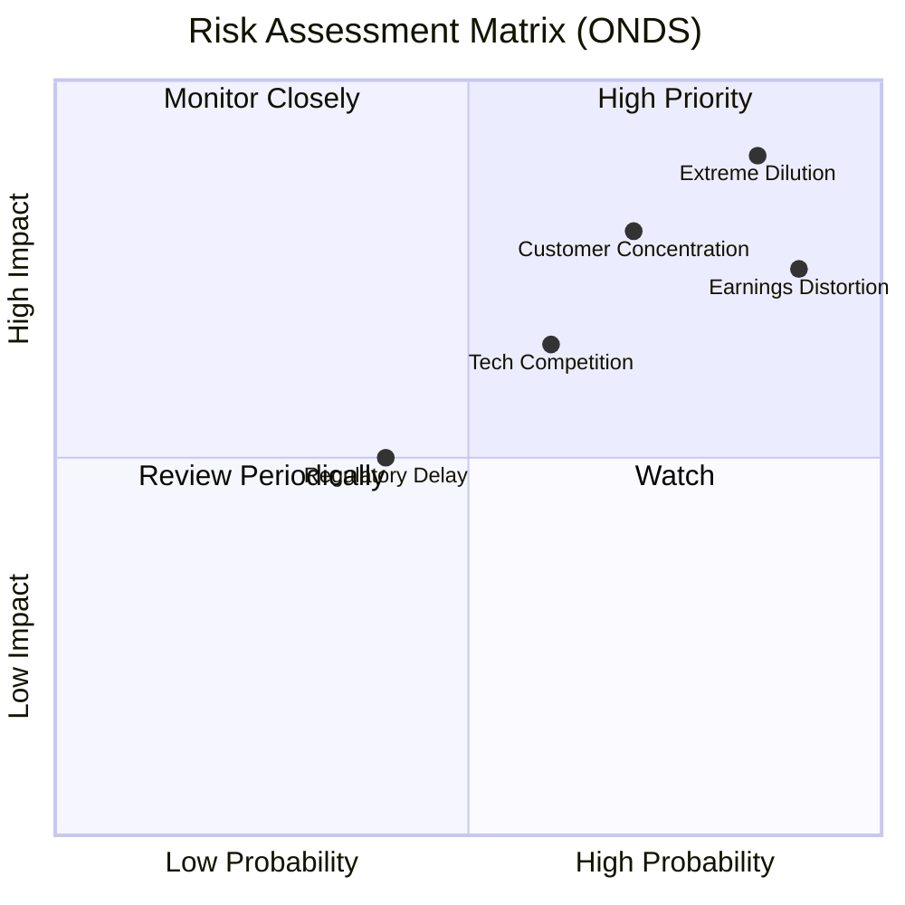

### 9.2 風險清單詳細分析

| # | 風險項目 | 發生機率 | 財務衝擊 | 風險評分 | 緩解措施 / 投資者應對 |
|---|---|---|---|---|---|
| 1 | 🔴 **持續的股權稀釋** | 高 (85%) | 高 (EPS -40%) | 🔴 **8.5 / 10** | 管理層習慣通過增發融資。投資者需密切關注 Shares Outstanding 增速，若每季增幅 >5%，應立即減碼。 |
| 2 | 🔴 **客戶集中度極高** | 高 (70%) | 高 (營收 -50%) | 🔴 **7.5 / 10** | 鐵路專網與國防客戶均為少數巨頭。需追蹤前三大客戶的營收佔比是否降至 50% 以下。 |
| 3 | 🟡 **營運造血能力缺失** | 中 (60%) | 中 (現金持續消耗) | 🟡 **6.0 / 10** | 雖然現金儲備極多，但若核心 OCF 連續 4 季無法轉正，市場將對其商業化能力失去信心。 |
| 4 | 🟡 **非營運損益持續波動** | 高 (90%) | 中 (股價劇烈波動) | 🟡 **5.5 / 10** | Q1 2026 的非營運收益可能在未來季度轉為重估損失，投資者應過濾 GAAP 淨利，僅監控核心營運利潤。 |

---

## 10. 投資建議

### 10.1 最終綜合評級雷達圖

```
╔══════════════════════════════════════════════════════════════╗
║                 ONDS 綜合投資潛力雷達圖                      ║
╠══════════════════════════════════════════════════════════════╣
║ 成長潛力 (Growth)      9.0/10 ▓▓▓▓▓▓▓▓▓▓▓▓▓▓▓▓▓▓▓▓▓▓░░  🟢  ║
║ 財務安全 (Balance Sh)  9.5/10 ▓▓▓▓▓▓▓▓▓▓▓▓▓▓▓▓▓▓▓▓▓▓▓░  🟢  ║
║ 獲利品質 (Earnings Q)  2.0/10 ▓▓▓▓░░░░░░░░░░░░░░░░░░░░  🔴  ║
║ 估值吸引力 (Valuation) 2.0/10 ▓▓▓▓░░░░░░░░░░░░░░░░░░░░  🔴  ║
║ 股東友好 (Shareholder) 1.5/10 ▓▓▓░░░░░░░░░░░░░░░░░░░░░  🔴  ║
╠══════════════════════════════════════════════════════════════╣
║ 綜合推薦評級：🟡 持有 (Hold) ｜ 綜合得分: 5.1 / 10           ║
╚══════════════════════════════════════════════════════════════╝
```

### 10.2 目標價與隱含報酬率

| 情境 | 發生機率 | 目標價 | 隱含報酬率 (對比現價 $8.00) | 權重期望值 |
|---|---|---|---|---|
| 🔴 **悲觀情境** | 30% | $4.50 | -43.75% | $1.35 |
| 🟡 **基準情境** | **50%** | **$9.50** | **+18.75%** | **$4.75** |
| 🟢 **樂觀情境** | 20% | $15.00 | +87.50% | $3.00 |
| **加權合理目標價**| **100%**| **$9.10** | **+13.75%** | **建議分批逢低佈局** |

### 10.3 買入時機與觸發因素

```
╔══════════════════════════════════════════════════════════════════╗
║                  ✅ ONDS 投資決策 Checklist                     ║
╠══════════════════════════════════════════════════════════════════╣
║                                                                  ║
║  立即買入觸發條件（需滿足 3 項以上）：                           ║
║  ☐ 股價跌至 $5.50 以下（提供充足的安全邊際）                     ║
║  ☐ 季度普通股發行股數 (Shares Outstanding) 環比增速降至 <1%      ║
║  ☐ 核心營業利潤 (Operating Income) 虧損連續兩季收窄              ║
║  ☐ OAS 部門宣佈獲得單筆金額大於 $50M 的國防 CUAS 採購合約        ║
║                                                                  ║
║  立即賣出/停損觸發條件（滿足任一項即執行）：                     ║
║  ☒ 再次宣佈大規模增發，單季股數稀釋比例 >10%                     ║
║  ☒ 核心營收 YoY 增速跌破 30%                                     ║
║  ☒ 帳面現金因不明併購大幅減少，且未帶來等值營收                  ║
╚══════════════════════════════════════════════════════════════════╝
```

### 10.4 投資人適配度分析

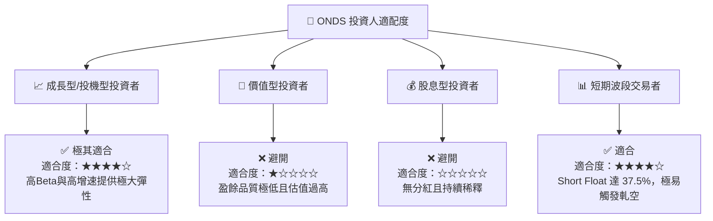

### 10.5 每季財報監控清單（Quarterly Watch List）

在未來的季度財報中，投資者應嚴格追蹤以下指標，而非僅關注頭條營收與淨利：

| 監控指標 | 基準值 (最新) | 觸發「加碼」門檻 | 觸發「減碼/停損」門檻 | 監控核心意義 |
|---|---|---|---|---|
| **普通股發行數 (Shares)** | 569.84M | 單季環比增長 < 1% | 單季環比增長 > 5% | 評估股東權益是否持續被稀釋 |
| **核心營業利潤** | $-42.67M | 虧損縮窄至 $-20.00M 以內 | 虧損擴大至 $-50.00M 以上 | 評估核心業務何時具備自生能力 |
| **SBC / 營收比率** | 31.6% | 降至 < 15.0% | 升至 > 35.0% | 評估管理層激勵是否過度侵蝕利潤 |
| **營運現金流 (OCF)** | $-83.39M | 單季轉正或接近 $0 | 單季流出超過 $-40.00M | 評估公司真實的造血與失血速度 |

### 10.6 反面論證：什麼會證明論點錯誤（What Would Change My Mind）

本報告給予的「持有」評級及目標價，是建立在「公司高增速將逐步收斂，且股權稀釋將持續壓抑每股價值」的假設上。若以下條件發生，將證明本報告的保守論點錯誤，投資評級應立刻上調至 **強烈買入 (Strong Buy)**：

```
╔══════════════════════════════════════════════════════════════════╗
║              ⚠️ 多頭論點修正條件 (Disconfirming Evidence)        ║
╠══════════════════════════════════════════════════════════════════╣
║  若出現以下可量化條件，本報告之保守觀點將失效：                 ║
║                                                                  ║
║  ☐ OAS 部門核心營收連續兩季 YoY 增速維持 >200%，證明 CUAS 需求   ║
║     已非短期波動，而是進入實質性的大規模產業標配期。             ║
║  ☐ 核心毛利率跨越 55.0% 門檻，且 SGA 費用率降至 40% 以下，      ║
║     證明營業槓桿（Operating Leverage）正式轉正，具備規模效應。  ║
║  ☐ 管理層明確承諾「未來 24 個月內不再進行任何股權融資」，        ║
║     且宣佈利用帳面 14.7 億美元現金進行股份回購，消除稀釋隱憂。   ║
║  ☐ 核心 ROIC 越過 WACC (17.7%)，證明公司開始實質創造經濟價值。  ║
╚══════════════════════════════════════════════════════════════════╝
```

---

> **免責聲明**：本報告為基於公開財務數據之投資研究分析，僅供參考，不構成任何買賣建議。投資有風險，入市需謹慎。分析師持有或未持有上述股票均不影響報告之獨立客觀性。