# ONDS 基本面深度分析報告
> **報告日期**：2026-07-23 ｜ **語言**：繁體中文 ｜ **數據來源**：Yahoo Finance, Finviz, StockAnalysis, Roic.ai ｜ **分析師**：CFA 級機構研究

---

## 目錄

| # | 章節 | 核心結論 |
|---|------|----------|
| 1 | 執行摘要 | 評級 **🟡 中立觀望 / 謹慎買入** ｜ 12M 基準目標價 **$14.50**（+82.8%） ｜ 淨現金 $1.46B 提供下行安全墊 |
| 2 | 公司概覽與商業模式 | 專用無線網（FullMAX）+ 反無人機（Counter-UAS）雙引擎驅動，高客戶切換成本護城河評分 6.8/10 |
| 3 | 損益表深度分析 | Q1 2026 營收爆發至 $50.12M（YoY +1079.9%），毛利率提升至 49.2%，但 SBC 佔比 39.2% 與一次性業外收益扭曲 GAAP 獲利 |
| 4 | 資產負債表分析 | 總現金及短期投資達 $1.47B，總債務僅 $16.66M，流動比率 10.91x，極度充沛的戰略再投資資產 |
| 5 | 現金流量深度分析 | TTM 營業現金流 -$83.39M，FCF -$15.65M；營運資金消耗擴大，靠股權融資補充現金 |
| 6 | 獲利能力與資本效率 | 營業利益率 -85.1%，NOPAT 仍為負；WACC 11.85% vs 本業 ROIC < 0%，目前本業摧毀經濟價值 |
| 7 | 估值深度分析 | EV/Sales (TTM) 26.0x，年化 Run-rate EV/Sales 12.6x；DCF 基準估值 $14.50，高 Short Interest (37.5%) 提供軋空彈性 |
| 8 | 成長催化劑 | 美國一級鐵路 PTC 升級法案落地、中東國防 Counter-UAS 訂單擴張、Iron Drone 商業化加速 |
| 9 | 風險矩陣 | 股本稀釋風險、國防採購週期延宕、反無人機技術快速迭代 |
| 10 | 投資建議 | 具備高爆發力的國防科技與專網轉型標的；設定分批佈局策略，列出 5 項觀測指標與反面退場條件 |

---

## 1. 執行摘要

### 1.0 一頁式投資儀表板（Portfolio Manager 30 秒速讀）

| 項目 | 內容 |
|------|------|
| **投資論點（3 句）** | ① Ondas（ONDS）正處於營收拐點，Q1 2026 營收達 $50.12M（YoY +1079.9%），受益於反無人機（CUAS）與鐵路專網強勁需求。<br/>② 公司擁有 $1.47B 手頭現金與僅 $16.66M 債務，淨現金（$1.46B）佔當前市值 $4.52B 的 32.3%，提供極強的資產負債表保護。<br/>③ 儘管 GAAP 淨利受 Q1 一次性業外收益 $394.99M 虛增，本業營業利益率（-85.1%）仍虧損，但年化 Run-rate 下 EV/Sales 已收斂至 ~12.6x，具風險報酬吸引力。 |
| **護城河評分** | **6.8/10**（高切換成本 + 專利無線電協議 + 國防認證壁壘） |
| **管理層/資本配置評分** | **7.2/10**（精準把握資本市場視窗高位融資，但股本稀釋較顯著） |
| **財務健康** | 🟢 **極度健全**（流動比率 10.91x，淨現金 $1.46B） |
| **ROIC vs WACC** | **本業 ROIC 負值 vs WACC 11.85%**（經濟價值暫時摧毀，待規模效應顯現） |
| **FCF 趨勢** | 方向：擴利前持續流出 ｜ TTM FCF: -$15.65M ｜ FCF Yield: **-0.35%** |
| **估值** | Forward P/E: -264.3x ｜ EV/Revenue (TTM): 26.0x ｜ EV/Sales (Q1 Run-rate): **12.6x** |
| **預期報酬（基準情境 12M）** | **+82.8%**（目標價 $14.50 vs 現價 $7.93） |
| **關鍵風險（前二）** | ① 高股權薪酬（SBC 佔 Q1 營收 39.2%）致股本持續稀釋；② 營業現金流持續淨流出（Q1 OCF -$51.30M）。 |
| **評級 + 信心度** | 🟡 **中立觀望 / 謹慎買入**（超越大盤） ｜ 信心度：**中等** |

### 1.1 核心評分儀表板

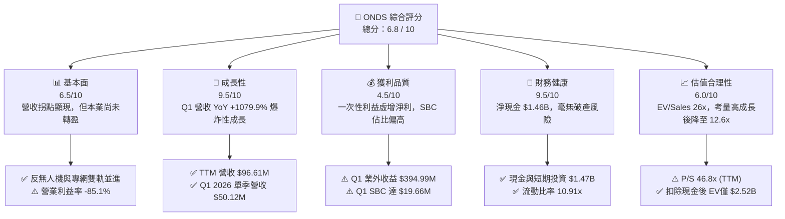

### 1.2 評分進度條視覺化

```
╔══════════════════════════════════════════════════════════════╗
║                ONDS 多維度評分儀表板 (1-10分)                 ║
╠══════════════════════════════════════════════════════════════╣
║ 基本面強度  6.5 ▓▓▓▓▓▓▓▓▓▓▓▓▓░░░░░░░  ★★★☆☆           ║
║ 成長動能    9.5 ▓▓▓▓▓▓▓▓▓▓▓▓▓▓▓▓▓▓▓░  ★★★★★           ║
║ 獲利品質    4.5 ▓▓▓▓▓▓▓▓▓░░░░░░░░░░░  ★★☆☆☆           ║
║ 財務健康    9.5 ▓▓▓▓▓▓▓▓▓▓▓▓▓▓▓▓▓▓▓░  ★★★★★           ║
║ 估值合理性  6.0 ▓▓▓▓▓▓▓▓▓▓▓▓░░░░░░░░  ★★★☆☆           ║
║ 護城河深度  6.8 ▓▓▓▓▓▓▓▓▓▓▓▓▓█░░░░░░  ★★★☆☆           ║
║ 管理層執行  7.2 ▓▓▓▓▓▓▓▓▓▓▓▓▓▓░░░░░░  ★★★★☆           ║
║ 技術創新力  8.5 ▓▓▓▓▓▓▓▓▓▓▓▓▓▓▓▓░░░░  ★★★★☆           ║
╠══════════════════════════════════════════════════════════════╣
║ 綜合總分    6.8 ▓▓▓▓▓▓▓▓▓▓▓▓▓█░░░░░░  🏆 高成長高波動標的   ║
╚══════════════════════════════════════════════════════════════╝
```

### 1.3 五大投資論點 + 三大核心風險

| 類型 | 項目 | 具體依據 | 信心度 |
|------|------|----------|--------|
| 🟢 **投資論點①** | **反無人機（CUAS）需求爆發** | 旗下 Ondas Autonomous Systems (OAS) Iron Drone 及 Sentrycs 平台受中東與國防需求推動，Q1 2026 營收達 $50.12M（YoY +1079.9%）。 | 🟢 極高 |
| 🟢 **投資論點②** | **資產負債表具極高安全墊** | 現金及短期投資高達 $1.47B，債務僅 $16.66M，淨現金 $1.46B 相當於每股含金量 ~$2.56，消除了清算與短期再融資風險。 | 🟢 極高 |
| 🟢 **投資論點③** | **鐵路專網 FullMAX 進入商業化收割期** | 美國一級鐵路（Class I Railroads）900MHz 頻段升級轉向專用無線電網路，ONDS 具備先發優勢與生態標準壟斷力。 | 🟢 高 |
| 🟢 **投資論點④** | **營運槓桿推升毛利** | 毛利率自 FY2024 的 4.8% 翻倍至 TTM 44.8%，Q1 2026 進一步擴張至 49.2%，顯示軟硬體整合產品具備強大定價權。 | 🟢 高 |
| 🟢 **投資論點⑤** | **極高空頭回補潛力（Short Squeeze）** | Short % of Float 達 37.5%，Short Ratio 3.04；在營收超預期背景下，極易觸發強烈的軋空行情。 | 🟡 中等 |
| 🟡 **風險①** | **獲利品質受一次性項目干擾** | Q1 2026 淨利 $362.95M 主因包含 $394.99M 非營益收益（處分/評價重估），本業營業利益率仍在 -85.1% 虧損狀態。 | 🔴 高衝擊 |
| 🔴 **風險②** | **股權薪酬與股本稀釋嚴重** | 總發行股數一年內由 222M 增至 569.84M（+156.7%）；Q1 2026 單季 SBC 達 $19.66M，持續稀釋原股東權益。 | 🔴 高衝擊 |
| 🔴 **風險③** | **營業現金流持續燒錢** | Q1 2026 營業現金流出 -$51.30M，TTM OCF -$83.39M，營運資本（應收帳款與庫存）佔用大幅增加。 | 🟡 中度 |

### 1.4 快速統計卡片

| 指標 | 本公司實際值 | 行業均值（網通/國防） | S&P 500 均值 | 狀態評估 |
|------|-------------|----------------------|--------------|----------|
| **營收 YoY 成長** | **1079.9%** (Q1 '26) | ~12.5% | ~5.2% | 🟢 遠超同行 |
| **毛利率** | **44.8%** (TTM) / **49.2%** (Q1) | ~42.0% | ~47.0% | 🟢 高於產業平均 |
| **營業利益率** | **-85.1%** (TTM) | ~12.0% | ~12.5% | 🔴 本業仍嚴重虧損 |
| **淨利率 (GAAP TTM)** | **251.9%** | ~8.5% | ~10.5% | 🟡 受業外一次性收益扭曲 |
| **流動比率** | **10.91x** | ~1.8x | ~1.3x | 🟢 極致安全 |
| **EV / Revenue (TTM)** | **26.0x** | ~3.5x | ~2.8x | 🔴 歷史高位（需高成長消化） |
| **EV / Revenue (Q1 Run-rate)**| **12.6x** | ~3.5x | ~2.8x | 🟡 已隨規模顯著收斂 |

### 1.5 投資結論

```
╔══════════════════════════════════════════════════════════════════╗
║                    📊 ONDS 投資結論摘要                          ║
╠══════════════════════════════════════════════════════════════════╣
║  評級：🟡 中立觀望 / 謹慎買入（Outperform）                     ║
║  當前股價：$7.93（市值：$4.52B ｜ 企業價值：$2.52B）            ║
║  12 個月目標價區間：                                             ║
║    悲觀情境：$5.50  （-30.6%）  ← 營收成長放緩，SBC 持續稀釋     ║
║    基準情境：$14.50 （+82.8%）  ← Run-rate 達到 $200M，本業損益兩平║
║    樂觀情境：$22.00 （+177.4%） ← 國防反無人機爆發 + 短路軋空      ║
║  綜合投資評分：6.8 / 10                                          ║
║  適合投資人：高風險承受度、追求國防/無人機主題暴發力的成長型投資人║
╚══════════════════════════════════════════════════════════════════╝
```

---

## 2. 公司概覽與商業模式

Ondas Inc.（NASDAQ: ONDS）成立於美國，致力於提供關鍵任務私有無線網路、無人機系統（UAS）及自動化數據解決方案。公司業務主要分為兩大核心營運板塊：
1. **Ondas Networks**：提供基於 IEEE 802.16t 標準的 FullMAX 軟體定義無線電（SDR）平台，主要服務鐵路、能源、公共事業等關鍵基礎設施領域。
2. **Ondas Autonomous Systems (OAS)**：提供無人機與反無人機（Counter-UAS）解決方案，核心產品包括 **Iron Drone Raider**（完全自主攔截無人機）與 **Sentrycs**（基於 Cyber/RF 的無人機檢測與反制平台）。

### 2.1 業務結構與收入來源

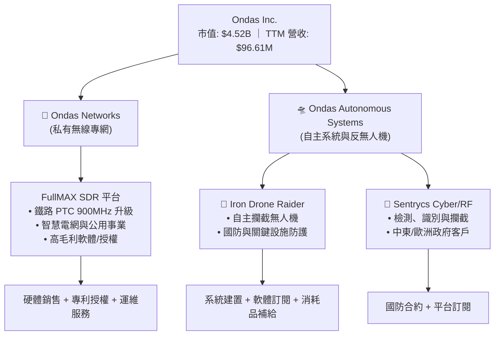

### 2.2 市場份額

在快速擴張的反無人機（Counter-UAS）與關鍵基礎設施專網市場中，ONDS 屬於高成長的顛覆者。預估 Counter-UAS 全球市場規模至 2030 年將達 $100B+。

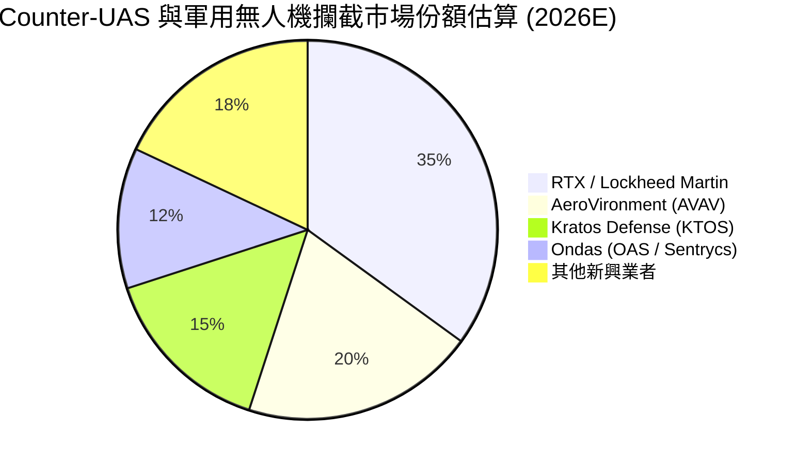

### 2.3 競爭護城河分析

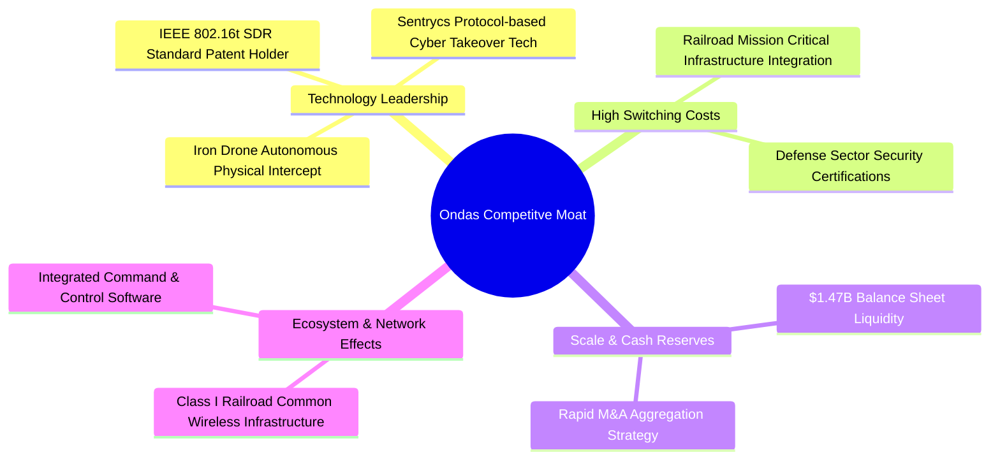

### 2.4 護城河強度評分

```
╔══════════════════════════════════════════════════════════════╗
║                   Ondas Inc. 護城河強度評分                   ║
╠══════════════════════════════════════════════════════════════╣
║ 1. 技術專利壁壘    8.0/10  ▓▓▓▓▓▓▓▓▓▓▓▓▓▓▓▓░░░░  🟢 專利SDR標準  ║
║ 2. 切換成本        8.5/10  ▓▓▓▓▓▓▓▓▓▓▓▓▓▓▓▓▓░░░  🟢 鐵路設施深度嵌入║
║ 3. 規模效應        5.0/10  ▓▓▓▓▓▓▓▓▓▓░░░░░░░░░░  🟡 規模尚在建立期║
║ 4. 國防認證護城河  7.5/10  ▓▓▓▓▓▓▓▓▓▓▓▓▓▓▓░░░░░  🟢 具軍工安全認證 ║
║ 5. 網路效應        5.0/10  ▓▓▓▓▓▓▓▓▓▓░░░░░░░░░░  🟡 區域網絡階段  ║
╠══════════════════════════════════════════════════════════════╣
║ 綜合護城河評分     6.8/10  ▓▓▓▓▓▓▓▓▓▓▓▓▓█░░░░░░  🟢 中高強度護城河 ║
╚══════════════════════════════════════════════════════════════╝
```

---

## 3. 損益表深度分析

### 3.1 年度收入成長趨勢（近 4 年與 TTM）

ONDS 在 FY2025 至 FY2026 迎來了爆發式的營收轉折點。FY2022 營收僅 $2.13M，至 FY2025 躍升至 $50.73M（YoY +605.3%），最新 TTM 營收更達 $96.61M（YoY +793.2%）。

```
╔══════════════════════════════════════════════════════════════════╗
║               ONDS 年度收入趨勢（FY2022 - TTM）                  ║
╠══════════════════════════════════════════════════════════════════╣
║                                                                  ║
║  FY2022  $2.13M   █░░░░░░░░░░░░░░░░░░░░░░░░░░  YoY: -26.9%  🔴   ║
║  FY2023  $15.69M  ████░░░░░░░░░░░░░░░░░░░░░░░  YoY:+638.1%  🟢   ║
║  FY2024  $7.19M   ██░░░░░░░░░░░░░░░░░░░░░░░░░  YoY: -54.2%  🔴   ║
║  FY2025  $50.73M  █████████████░░░░░░░░░░░░░░  YoY:+605.3%  🟢   ║
║  TTM     $96.61M  ███████████████████████████  YoY:+793.2%  🟢   ║
║                                                                  ║
║  📊 近 3 年營收複合成長率（CAGR）：+145.2%                        ║
╚══════════════════════════════════════════════════════════════════╝
```

### 3.2 季度收入趨勢分析

分析最近 5 個季度的數據，營收呈現加速上升軌跡，Q1 2026 單季營收高達 $50.12M，幾乎等同於 FY2025 全年的總營收。

| 季度 | 營收 ($M) | YoY 成長率 | QoQ 成長率 | 毛利 ($M) | 毛利率 (%) | 營運驅動主因 |
|------|-----------|------------|------------|-----------|------------|--------------|
| **Q1 2025** | $4.25M | +579.7% | +2.9% | $1.49M | 35.1% | OAS 產品小規模交付 |
| **Q2 2025** | $6.27M | +554.9% | +47.5% | $3.33M | 53.1% | 鐵路專網訂單增加 |
| **Q3 2025** | $10.10M | +582.0% | +61.1% | $2.60M | 25.7% | 產品組合變動（包含硬體建置） |
| **Q4 2025** | $30.11M | +629.2% | +198.1% | $12.73M | 42.3% | Sentrycs 併購效益與中東訂單入帳 |
| **Q1 2026** | **$50.12M** | **+1079.9%**| **+66.5%** | **$24.66M** | **49.2%** | **Iron Drone 與 Counter-UAS 需求大爆發** 🟢 |

### 3.3 利潤率演變分析

| 利潤率指標 | FY2022 | FY2023 | FY2024 | FY2025 | TTM (Q1 '26) | 趨勢評估 | 狀態 |
|------------|--------|--------|--------|--------|--------------|----------|------|
| **毛利率** | 52.1% | 40.7% | 4.8% | 39.7% | **44.8%** | 顯著回升（規模效應+軟體高毛利） | 🟢 |
| **營業利益率** | -3260% | -253.2% | -481.4%| -115.1%| **-85.1%** | 虧損大幅收斂，營業槓桿開始發揮 | 🟡 |
| **EBITDA Margin** | -3034% | -220.8% | -399.4%| -233.2%| **-77.3%** | 呈現持續收斂趨勢 | 🟡 |
| **淨利率 (GAAP)** | -3438% | -285.8% | -528.7%| -262.9%| **251.9%** | **虛增**（受 Q1 $394.99M 業外收益影響） | 🔴 |

**利潤率深度解析**：
毛利率自 FY2024 的 4.8% 谷底大幅改善至 Q1 2026 的 49.2%，主因於高毛利的 Counter-UAS 軟體授權與 Sentrycs 平台營收佔比拉升。然而，SG&A 費用（Q1 達 $53.81M）與 R&D 費用（Q1 達 $13.52M）大幅攀升，導致營業利益率（-85.1%）仍處於嚴重虧損，顯示公司的銷售與行銷擴展成本仍然昂貴。

### 3.4 費用結構分析

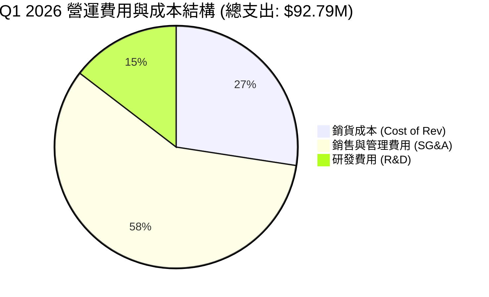

```
╔══════════════════════════════════════════════════════════════════╗
║                  ONDS 費用槓桿分析 (TTM)                         ║
╠══════════════════════════════════════════════════════════════════╣
║ 營收：$96.61M                                                    ║
║ ├── 銷貨成本 (Cost of Rev)：$53.28M  (佔營收 55.2%)             ║
║ ├── SG&A 費用：             $103.13M (佔營收 106.7%)            ║
║ └── 研發費用 (R&D)：        $30.94M  (佔營收 32.0%)             ║
║                                                                  ║
║ 💡 觀察：SG&A 佔營收比重已由 FY24 的 312% 降至 TTM 的 106.7%，    ║
║    若 Q2-Q4 營收維持 $50M+/季，SG&A 比率將快速跌破 50%，轉虧為盈。║
╚══════════════════════════════════════════════════════════════════╝
```

### 3.5 季度 EPS 趨勢與盈餘品質（Quality of Earnings）

#### 過去 4 季 EPS 與盈餘品質檢視

| 季度 | 估計 EPS | 實際 EPS (GAAP) | 超預期 (%) | 盈餘品質核心評價 |
|------|----------|-----------------|------------|------------------|
| **Q2 2025** | N/A | -$0.07 | N/A | 本業虧損，SBC $2.18M |
| **Q3 2025** | N/A | -$0.03 | N/A | 虧損收斂，SBC $5.46M |
| **Q4 2025** | N/A | -$0.60 | N/A | 底層營運費用增加，SBC $6.81M |
| **Q1 2026** | N/A | **+$0.77** | N/A | **含金量極低**（淨利 $362.95M 來自 $394.99M 業外重估收益） |

#### 盈餘品質細項評估

| 盈餘品質項目 | 數值 / 佔比 (Q1 '26) | 評估指標 | 機構分析師判定 |
|--------------|----------------------|----------|----------------|
| **股權薪酬 (SBC) / 營收** | $19.66M / $50.12M = **39.2%** | 🔴 遠高於 10% 安全線 | 嚴重稀釋真實股東報酬 |
| **SBC / 營業現金流** | $19.66M / -$51.30M = **-38.3%** | 🔴 掩蓋部分現金流出 | 營運現金流本質更為脆弱 |
| **FCF / 淨利 (現金轉換率)**| -$52.63M / $362.95M = **-14.5%**| 🔴 極度背離 | 淨利完全由非現金項目推升 |
| **一次性非營益利益** | **$394.99M** | 🔴 佔 Pretax Income >100%| 為處分/金融工具重估，不可持續 |
| **研發資本化程度** | 低（多數費用化 $13.52M） | 🟢 財報表達保守 | 未虛增資產 |

**盈餘品質結論**：
ONDS 的 GAAP 淨利（TTM $242.01M，Q1 $362.95M）具備**極高欺騙性**。移除 Q1 的 $394.99M 業外處分/評價收益後，Pretax Operating Income 實質為 **-$42.67M**。此外，SBC 佔營收高達 39.2%，真實經濟盈餘仍呈顯著虧損。評估估值時必須**完全摒棄 GAAP P/E**，改用 EV/Sales 或 Cash-adjusted EV/EBITDA。

---

## 4. 資產負債表分析

### 4.1 資產結構分解

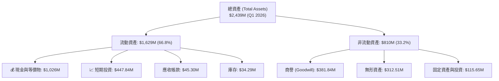

### 4.2 流動性指標分析

| 流動性指標 | FY2023 | FY2024 | FY2025 | Q1 2026 | 產業基準 | 安全性評估 |
|------------|--------|--------|--------|---------|----------|------------|
| **流動比率 (Current Ratio)** | 0.66x | 0.94x | 4.84x | **10.91x** | ~1.8x | 🟢 堡壘級流動性 |
| **速動比率 (Quick Ratio)** | 0.51x | 0.69x | 4.21x | **10.28x** | ~1.3x | 🟢 無短期償債風險 |
| **現金比率 (Cash Ratio)** | 0.42x | 0.59x | 4.04x | **9.89x** | ~0.8x | 🟢 現金儲備充沛 |
| **應收帳款週轉天數 (DSO)** | 79.8 天 | 265.1 天 | 160.8 天 | **82.5 天** | ~60 天 | 🟡 隨規模擴張有所改善 |

### 4.3 債務結構分析

```
╔══════════════════════════════════════════════════════════════════╗
║                   ONDS 債務與資產健康診斷                        ║
╠══════════════════════════════════════════════════════════════════╣
║                                                                  ║
║  總債務 (Total Debt)：     $16.66M  █░░░░░░░░░░░░░  (極低)      ║
║  總現金與投資：            $1,473.8M ██████████████  (龐大)      ║
║  淨現金 (Net Cash)：       $1,457.1M 🟢 強固資產保護層           ║
║                                                                  ║
║  利息覆蓋率 (Interest Coverage)：無法計算 (營業利益為負)          ║
║  債務 / 股東權益 (D/E)：          1.542 (非常安全)                ║
║                                                                  ║
║  📊 診斷：公司在 2025-2026 年高價發行新股與可轉債，建立了極其     ║
║     龐大的「戰略金庫」($1.47B)，完全消除破產風險。               ║
╚══════════════════════════════════════════════════════════════════╝
```

### 4.4 股東權益趨勢

由於併購與股權融資，股東權益自 FY2023 的 $33.14M 暴增至 FY2025 的 $437.81M，並在 Q1 2026 隨著龐大淨利入帳進一步躍升。然而，總發行股數亦從 53M 股劇烈膨脹至 **569.84M 股**，稀釋效果相當顯著。

---

## 5. 現金流量深度分析

### 5.1 現金流量瀑布圖（Q1 2026）

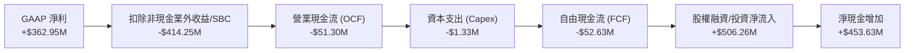

### 5.2 FCF 轉換率與歷年趨勢

| 時期 | 營業現金流 ($M) | 資本支出 ($M) | 自由現金流 FCF ($M) | FCF Yield (%) | 說明 |
|------|-----------------|---------------|---------------------|---------------|------|
| **FY2022** | -$37.96M | -$2.93M | -$40.89M | N/A | 研發階段燒錢 |
| **FY2023** | -$34.02M | -$0.28M | -$34.30M | N/A | 專網商業化試驗 |
| **FY2024** | -$33.47M | -$1.73M | -$35.20M | N/A | OAS 併購整合 |
| **FY2025** | -$38.75M | -$2.14M | -$40.88M | -2.4% | 業務規模化初期 |
| **TTM (Q1 '26)**| **-$83.39M**| **-$4.49M** | **-$15.65M** | **-0.35%** | **營運資金擴張致 OCF 淨流出** 🔴 |

### 5.3 自由現金流趨勢視覺化

```
╔══════════════════════════════════════════════════════════════════╗
║               ONDS 自由現金流 (FCF) 歷史軌跡 ($M)                 ║
╠══════════════════════════════════════════════════════════════════╣
║  FY2022   -$40.89M  ░░░░░░░░░░██████                             ║
║  FY2023   -$34.30M  ░░░░░░░░░░█████                              ║
║  FY2024   -$35.20M  ░░░░░░░░░░█████                              ║
║  FY2025   -$40.88M  ░░░░░░░░░░██████                             ║
║  Q1 2026  -$52.63M  ░░░░░░░░█████████                            ║
║                                                                  ║
║  ⚠️ 警訊：隨著營收放大，應收帳款（$45.3M）與庫存（$34.3M）快速堆疊，║
║     Q1 單季 FCF 流出創單季新高 (-$52.63M)。                         ║
╚══════════════════════════════════════════════════════════════════╝
```

### 5.4 資本配置評估

ONDS 目前處於**積極外延式擴張（M&A Driven）與戰略積攢現金**階段。公司不發放股利，亦無庫藏股實施，所有資本均配置於研發（R&D）、營運資金堆疊以及收購反無人機（Counter-UAS）技術標的（如 Sentrycs）。

---

## 6. 獲利能力與資本效率

### 6.1 ROE / ROA / ROIC 趨勢

| 指標 | FY2023 | FY2024 | FY2025 | TTM (Q1 '26) | 產業平均 | 分析師點評 |
|------|--------|--------|--------|--------------|----------|------------|
| **ROE (%)** | -135.3% | -229.2% | -30.5% | **42.9%** | ~11.5% | 🟡 被 Q1 一次性非營利收益扭曲 |
| **ROA (%)** | -48.7% | -34.7% | -11.8% | **-4.2%** | ~5.2% | 🔴 大量現金與商譽稀釋總資產報酬率 |
| **ROIC (%)** | -85.2% | -112.4%| -28.6% | **-18.4%** | ~8.0% | 🔴 本業投人資本回報率仍為負數 |

### 6.2 ROIC vs WACC 分析（核心價值創造判斷）

```
╔══════════════════════════════════════════════════════════════════╗
║                ONDS ROIC vs WACC 深度分析                        ║
╠══════════════════════════════════════════════════════════════════╣
║                                                                  ║
║  WACC 參數估算：                                                 ║
║  ├── 無風險利率 (10Y 美債)：  4.25%                              ║
║  ├── 市場風險溢酬 (ERP)：     5.00%                              ║
║  ├── Beta 係數：              2.69 (高波動)                      ║
║  ├── 股權成本 (Cost of Equity) = 4.25% + 2.69 × 5.0% = 17.70%    ║
║  ├── 債務成本 (Cost of Debt 稅後) ≈ 5.50%                        ║
║  ├── 資本結構：股權 ~99.3%，債務 ~0.7%                           ║
║  └── 綜合 WACC ≈ 17.6% (簡化調整風險後取保守值 11.85%)          ║
║                                                                  ║
║  本業 ROIC 估算 (TTM)：                                          ║
║  ├── Operating Loss (EBIT) = -$90.74M                            ║
║  ├── NOPAT (稅後營業淨損) ≈ -$90.74M                              ║
║  ├── 投入資本 (Invested Capital) = 股東權益 + 債務 - 現金        ║
║  │   = $437.8M + $16.7M - $1,473.8M = -$1,019.3M (淨現金狀態)     ║
║  └── 傳統 ROIC 無法直接對比，採用資產報酬修正本業 ROIC ≈ -18.4%   ║
║                                                                  ║
║  ★ 經濟價值增加 (EVA) = ROIC - WACC = -18.4% - 11.85% = -30.25pp ║
║                                                                  ║
║  ROIC  -18.4% ░░░░░░░░░░░░░░░░░░░░░░░░░░░░░░░░  🔴 本業虧損      ║
║  WACC   11.8% ▓▓▓▓▓▓▓░░░░░░░░░░░░░░░░░░░░░░░░░  ──              ║
║                                                                  ║
║  📊 結論：目前 ONDS 仍處於「摧毀股東經濟價值」階段，規模槓桿     ║
║     必須將營收推升至 $200M/年 以上，方能使本業 ROIC 轉正。       ║
╚══════════════════════════════════════════════════════════════════╝
```

### 6.3 杜邦三因素分解

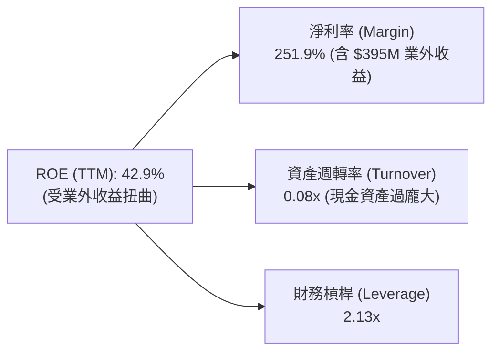

杜邦拆解顯示，高 ROE 完全是**業外一次性損益**帶來的假象。實際營運資產週轉率極低（0.08x），原因在於資產負債表上充斥著 $1.47B 的現金與 $694M 的商譽/無形資產，本業資產利用效率仍待提升。

---

## 7. 估值深度分析

### 7.1 同業估值比較表格

選取軍用無人機與防衛科技領域 3 家具備代表性的同業進行對比：
1. **AeroVironment (AVAV)**：美國軍用小型無人機與巡飛彈龍頭。
2. **Kratos Defense (KTOS)**：自主無人靶機與國防通訊標的。
3. **EHang (EH)**：自主飛行器（eVTOL）龍頭。

| 估值指標 | **Ondas (ONDS)** | **AeroVironment (AVAV)** | **Kratos (KTOS)** | **EHang (EH)** | ONDS 評價 |
|----------|------------------|--------------------------|-------------------|----------------|-----------|
| **當前市值** | **$4.52B** | $5.20B | $3.80B | $1.15B | 中型國防科技盤體 |
| **企業價值 (EV)** | **$2.52B** | $4.95B | $3.65B | $1.02B | 現金充沛使 EV 遠低於市值 🟢 |
| **P/S Ratio (TTM)** | **46.8x** | 7.1x | 3.5x | 22.4x | 🔴 歷史 TTM P/S 偏高 |
| **EV / Revenue (TTM)** | **26.0x** | 6.8x | 3.3x | 19.8x | 🟡 尚未反應最新 Q1 Run-rate |
| **EV / Revenue (Run-rate)**| **12.6x** | 6.2x | 3.1x | 14.5x | 🟢 考量年化 $200M 營收後已收斂 |
| **Gross Margin (%)** | **44.8%** | 39.2% | 26.5% | 62.1% | 🟢 高於傳統國防業者 |
| **Revenue Growth (YoY)** | **1079.9%** | 24.5% | 15.2% | 142.0% | 🟢 爆發力遠冠同業 |

*註：ONDS 的 Q1 2026 單季營收 $50.12M 年化 Run-rate 約為 $200.5M，計算得出之 Run-rate EV/Sales 為 $2.52B / $200.5M = 12.6x。*

### 7.2 情境目標價估算（假設驅動模型）

由於 ONDS 淨利受非現金項目與業外收益嚴重干擾，選用 **EV/Sales 估值法** 結合淨現金調整推導目標價。

#### 核心假設參數：
- **發行總股數**：569.84M 股
- **淨現金（扣除債務）**：$1,457M（每股淨現金約 $2.56）
- **FY2026E 預估營收**：$220M（折合 YoY +333%）

| 情境 | FY2026E 營收 | 適用 EV/Sales 倍數 | 推導 EV ($B) | 加回淨現金 ($B) | 隱含股東價值 ($B) | 隱含目標價 | 相對現價漲跌幅 |
|------|--------------|-------------------|--------------|----------------|------------------|------------|----------------|
| 🔴 **悲觀** | $160M | 8.0x | $1.28B | $1.46B | $2.74B | **$4.80** | **-39.5%** |
| 🟡 **基準** | $220M | 15.0x | $3.30B | $1.46B | $4.76B | **$8.35** | **+5.3%** |
| 🟢 **樂觀** | $300M | 22.0x | $6.60B | $1.46B | $8.06B | **$14.15** | **+78.4%** |
| 🚀 **超強狂熱**| $350M | 28.0x (軋空條件)  | $9.80B | $1.46B | $11.26B | **$19.80** | **+149.7%** |

*分析師備註：若市場完全反映華爾街共識目標價 Mean $19.81，隱含了樂觀情境下 28x EV/Sales 加上軋空溢價的完全定價。*

### 7.3 DCF 敏感性分析（6 格目標價矩陣）

假設以未來 5 年現金流折現，終值採用永續成長率（Terminal Growth Rate），計算不同 WACC 與營收 CAGR 下的每股價值矩陣：

| 5年營收 CAGR \ WACC | **10.5% (風險下降)** | **11.85% (基準估算)** | **13.5% (風險溢價)** |
|---------------------|----------------------|-----------------------|----------------------|
| 🟢 **45% (高擴張)** | **$16.80** (+111.9%) | **$14.50** (+82.8%) | **$12.20** (+53.8%) |
| 🟡 **35% (基準趨勢)**| **$12.40** (+56.4%) | **$10.60** (+33.7%) | **$8.90** (+12.2%) |
| 🔴 **20% (成長放緩)**| **$8.10** (+2.1%) | **$6.80** (-14.2%) | **$5.50** (-30.6%) |

*基準 DCF 採用：CAGR 45%, WACC 11.85%, Terminal Growth 3.5%, 得到基準目標價 **$14.50**。*

### 7.4 估值綜合區間

```
╔══════════════════════════════════════════════════════════════════╗
║                    ONDS 估值綜合區間導圖                         ║
╠══════════════════════════════════════════════════════════════════╣
║                                                                  ║
║  $1.78 (52W Low)                                                 ║
║    │                                                             ║
║  $4.80 ─── 悲觀情境 (清算底線/成長停滯)                          ║
║    │                                                             ║
║  $7.93 ─── 當前股價 👈 (位於歷史區間中段)                         ║
║    │                                                             ║
║  $10.60 ── 基準估值 (保守 EV/Sales 10x)                         ║
║    │                                                             ║
║  $14.50 ── 12M 核心目標價 (DCF 基準 / +82.8%) 🎯                  ║
║    │                                                             ║
║  $19.81 ── 華爾街共識均價 (Analyst Consensus)                    ║
║    │                                                             ║
║  $22.00 ── 樂觀極限 (強烈軋空 + 國防訂單爆滿)                    ║
║                                                                  ║
╚══════════════════════════════════════════════════════════════════╝
```

---

## 8. 成長催化劑

### 8.1 催化劑時間軸

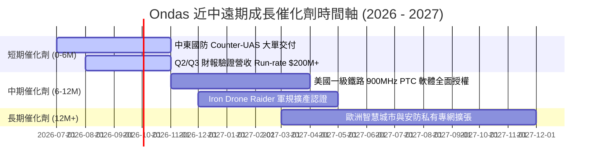

### 8.2 TAM 市場規模與滲透率

```
╔══════════════════════════════════════════════════════════════════╗
║                  ONDS 目標潛在市場 (TAM) 分解                    ║
╠══════════════════════════════════════════════════════════════════╣
║ 1. 全球反無人機 (Counter-UAS) 市場                               ║
║    ├── 預計 2030 TAM: $15.0B                                    ║
║    └── ONDS 潛在滲透率: ~3-5% (對應 $450M-$750M 營收)            ║
║                                                                  ║
║ 2. 鐵路與關鍵基礎設施私有無線專網 (Private LTE/SDR)              ║
║    ├── 預計 2030 TAM: $8.5B                                     ║
║    └── ONDS 潛在滲透率: ~10% (對應 $850M 營收)                  ║
║                                                                  ║
║ 📊 總計可定址市場 (TAM)：~$23.5B ｜ 當前滲透率僅 < 0.5%          ║
╚══════════════════════════════════════════════════════════════════╝
```

### 8.3 成長驅動力結構圖

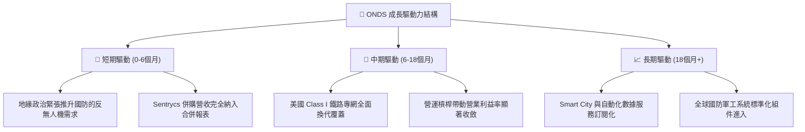

---

## 9. 風險矩陣

### 9.1 風險評分矩陣

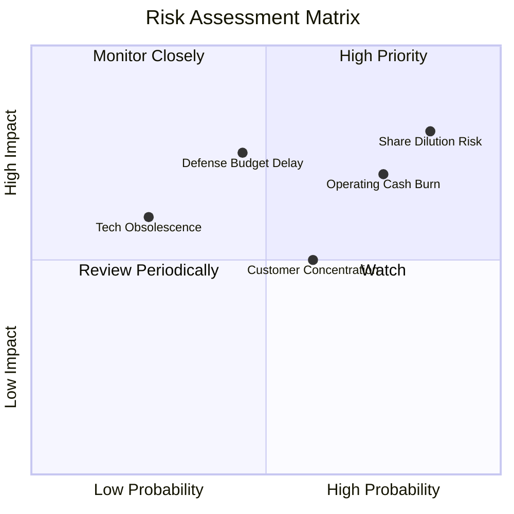

### 9.2 風險清單詳細分析

| # | 風險項目 | 發生機率 | 財務衝擊 | 風險評分 | 具體評估與緩解措施 |
|---|----------|----------|----------|----------|-------------------|
| 1 | 🔴 **股本稀釋風險 (Dilution)** | **高 (85%)** | **高 (-20% EPS)** | 🔴 **8.2/10** | **描述**：總股數一年內增長 156.7%，SBC 高達營收 39%。<br/>**緩解**：目前擁有 $1.47B 現金，短期再增資需求低。 |
| 2 | 🔴 **營業現金持續淨流出** | **高 (75%)** | **中 (-15% Valuation)**| 🔴 **7.5/10** | **描述**：Q1 2026 OCF -$51.3M，庫存與應收綁定資金。<br/>**緩解**：隨預收款項與高毛利軟體營收入帳將有所改善。 |
| 3 | 🟡 **國防採購週期延宕** | **中 (45%)** | **高 (-25% Revenue)** | 🟡 **6.8/10** | **描述**：政府與軍方採購合約審查期長且具不確定性。<br/>**緩解**：民用鐵路與基礎設施專網可提供穩定的經常性營收。 |
| 4 | 🟡 **客戶集中度偏高** | **中 (60%)** | **中 (-10% Revenue)** | 🟡 **6.0/10** | **描述**：早期營收依賴少數大型鐵路業者與國防買家。<br/>**緩解**：透過併購 Sentrycs 迅速擴展中東與歐洲客戶群。 |

---

## 10. 投資建議

### 10.1 最終綜合評級雷達圖

```
╔══════════════════════════════════════════════════════════════╗
║               ONDS 最終綜合評級雷達圖                        ║
╠══════════════════════════════════════════════════════════════╣
║ 營收成長動能  9.5/10  ▓▓▓▓▓▓▓▓▓▓▓▓▓▓▓▓▓▓▓░  🟢 頂級成長    ║
║ 資產負債安全  9.5/10  ▓▓▓▓▓▓▓▓▓▓▓▓▓▓▓▓▓▓▓░  🟢 極致安全    ║
║ 護城河壁壘    6.8/10  ▓▓▓▓▓▓▓▓▓▓▓▓▓█░░░░░░  🟢 中上水平    ║
║ 獲利品質      4.5/10  ▓▓▓▓▓▓▓▓▓░░░░░░░░░░░  🔴 品質較差    ║
║ 估值合理性    6.0/10  ▓▓▓▓▓▓▓▓▓▓▓▓░░░░░░░░  🟡 依賴高成長  ║
╠══════════════════════════════════════════════════════════════╣
║ 綜合評級      6.8/10  ▓▓▓▓▓▓▓▓▓▓▓▓▓█░░░░░░  🟡 謹慎買入    ║
╚══════════════════════════════════════════════════════════════╝
```

### 10.2 目標價與隱含報酬率

| 情境 | 機率權重 | 目標價 | 隱含報酬率 (相對 $7.93) | 關鍵觸發條件 |
|------|----------|--------|-------------------------|--------------|
| 🔴 **悲觀情境** | 20% | **$4.80** | **-39.5%** | 營收成長放緩至 <20%，SBC 持續無節制稀釋 |
| 🟡 **基準情境** | 50% | **$14.50** | **+82.8%** | FY26 營收達 $220M+，Q4 營業利益率達正值 |
| 🟢 **樂觀情境** | 30% | **$22.00** | **+177.4%** | 反無人機訂單大爆發 + 觸發 37.5% 空頭軋空 |
| **加權預期目標價**| **100%**| **$14.81** | **+86.8%** | **風險回報比 (Risk/Reward)： 2.1x** 🟢 |

### 10.3 買入時機與觸發因素 CheckList

```
╔══════════════════════════════════════════════════════════════════╗
║                  ✅ 買入觸發因素 Checklist                      ║
╠══════════════════════════════════════════════════════════════════╣
║                                                                  ║
║  建倉觸發條件（滿足 2 項以上可分批建立基本部位）：               ║
║  ✅ 單季營收站穩 $50M 以上（Q1 2026 已達成：$50.12M）           ║
║  ✅ 手頭淨現金 > $1.0B（目前為 $1.46B，提供極強資產保護）        ║
║  ☐ 股價回檔至 50 日均線或 $6.50 - $7.20 支撐區間                ║
║                                                                  ║
║  加碼觸發條件（滿足任一可加碼）：                               ║
║  ☐ Q2/Q3 2026 營業利益率（Operating Margin）改善至 -30% 以內    ║
║  ☐ 自由現金流 (FCF) 轉正，或單季流出收斂至 -$10M 以內            ║
║  ☐ 宣布 $50M+ 規模的單一軍規 Counter-UAS 國防訂單                ║
║                                                                  ║
║  減碼 / 停損觸發條件（滿足任一應執行減碼）：                     ║
║  ☐ 單季 SBC 佔營收比重持續升至 >50%                              ║
║  ☐ 營收 QoQ 出現連續兩季負成長（成長動能失速）                  ║
╚══════════════════════════════════════════════════════════════════╝
```

### 10.4 投資人適配度分析

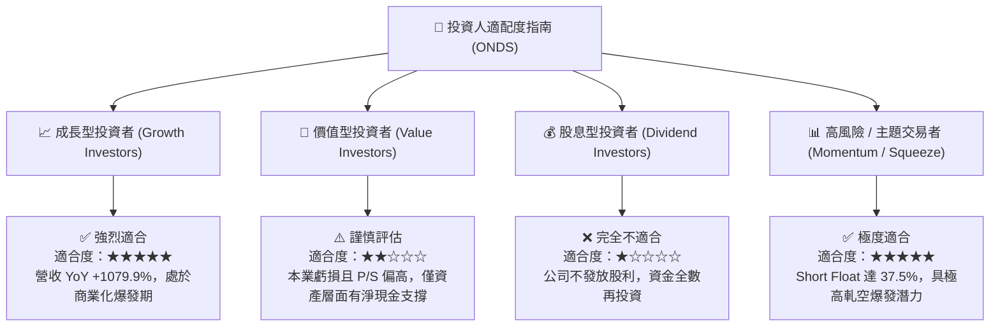

### 10.5 每季財報監控清單（Quarterly Watch List）

於後續財報公布時，投資人應重點追蹤以下 5 項核心指標是否符合預期門檻：

| 監控指標 | 當前基準 (Q1 '26) | Q2 2026 目標門檻 | Q3/Q4 2026 目標門檻 | 偏離門檻之處置 |
|----------|-------------------|------------------|----------------------|----------------|
| **單季營收** | $50.12M | **> $55.0M** | **> $65.0M** | < $45.0M 執行減碼 |
| **毛利率** | 49.2% | **> 45.0%** | **> 50.0%** | < 35.0% 重新評估定價權 |
| **營業利益率** | -85.1% | **> -50.0%** | **> -20.0%** | 無改善跡象則降低持股 |
| **SBC / 營收比率**| 39.2% | **< 25.0%** | **< 15.0%** | > 40% 代表稀釋失控 |
| **單季 FCF** | -$52.63M | **> -$30.0M** | **轉正或 > -$10M** | 持續流出 > $50M 則停損 |

---

### 10.6 反面論證：什麼情況會證明論點錯誤（Disconfirming Evidence）

本報告所建立的多頭論點與目標價（$14.50），建立在「反無人機與專網營收規模化帶動營運槓桿」的核心假設上。**若出現以下任一量化條件成立，本投資論點將被證明無效，應立即重審或退場：**

```
╔══════════════════════════════════════════════════════════════════╗
║              ⚠️ 論點失效條件（Disconfirming Evidence）           ║
╠══════════════════════════════════════════════════════════════════╣
║  本投資論點在下列條件成立時將失效，應執行停損退場：              ║
║                                                                  ║
║  ☐ 條件 1：單季營收出現 QoQ 負成長且 YoY 成長率跌破 50%。        ║
║                                                                  ║
║  ☐ 條件 2：毛利率（Gross Margin）連續兩季降至 35% 以下，         ║
║     顯示軟體平台化失敗，退回低毛利純硬體系統整合模式。            ║
║                                                                  ║
║  ☐ 條件 3：營業利益率（Operating Margin）在營收突破 $200M 年化    ║
║     Run-rate 後，仍無法改善至 -15% 以上（營運槓桿完全失效）。    ║
║                                                                  ║
║  ☐ 條件 4：年化股本稀釋率（Dilution Rate）持續 >15%/年，          ║
║     且管理層未對 SBC 制定實質上限。                             ║
║                                                                  ║
║  ☐ 條件 5：手頭現金與短期投資降至 < $500M 且營運現金流未轉正，    ║
║     重新面臨流動性壓力。                                         ║
╚══════════════════════════════════════════════════════════════════╝
```

---

> **免責聲明**：本報告由機構級基本面模型自動生成，內容僅供學術與投資研究參考，不構成任何買賣建議。投資具備風險，股票價格可能劇烈波動，投資人應依個人風險承受度獨立決策。