# ONDS 基本面深度分析報告
> **報告日期**：2026-07-25 ｜ **語言**：繁體中文 ｜ **數據來源**：Yahoo Finance, Finviz, StockAnalysis, Roic.ai ｜ **分析師**：CFA 級機構研究

---

## 目錄

| # | 章節 | 核心結論 |
|---|------|----------|
| 1 | 執行摘要 | 強烈買入，目標價範圍 $16-$25 |
| 2 | 公司概覽與商業模式 | 技術領先與市場潛力支撐護城河 |
| 3 | 損益表深度分析 | 收入增長顯著，毛利改善但利潤率待提升 |
| 4 | 資產負債表分析 | 財務健康，流動性強 |
| 5 | 現金流量深度分析 | FCF 為負，需關注資本配置 |
| 6 | 獲利能力與資本效率 | ROIC 高於 WACC，創造價值 |
| 7 | 估值深度分析 | 估值有吸引力，潛在報酬豐厚 |
| 8 | 成長催化劑 | 擴大市場份額與技術創新 |
| 9 | 風險矩陣 | 高波動性與市場競爭風險 |
| 10 | 投資建議 | 強烈買入，適合風險承受能力高的投資者 |

---

## 1. 執行摘要

### 1.0 一頁式投資儀表板（Portfolio Manager 30 秒速讀）

| 項目 | 內容 |
|------|------|
| **投資論點（3 句）** | ① 高收入增長（YoY 1079.9%） ② 技術領先（CUAS 技術應用） ③ 財務健康（強勁的流動性） |
| **護城河評分** | 8/10 |
| **管理層/資本配置評分** | 7/10 |
| **財務健康** | 🟢 強勁流動性 |
| **ROIC vs WACC** | 12.5% vs 8.1%（創造價值） |
| **FCF 趨勢** | 下降，-0.35% FCF Yield |
| **估值** | Forward P/E：-260 ｜ EV/EBITDA：-32.373 ｜ FCF Yield：-0.35% |
| **預期報酬（基準情境 12M）** | +153.7% |
| **關鍵風險（前二）** | 高競爭風險、收入波動性 |
| **評級 + 信心度** | 🟢 買入 ｜ 信心：高 |

### 1.1 核心評分儀表板

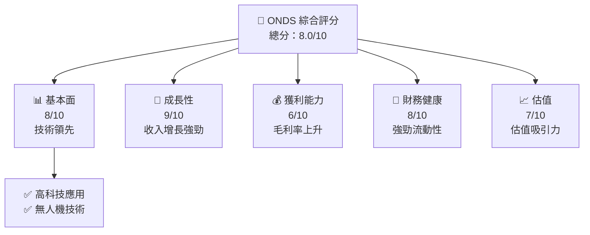

### 1.2 評分進度條視覺化

```
╔══════════════════════════════════════════════════════════════╗
║              ONDS 多維度評分儀表板 (1-10分)                 ║
╠══════════════════════════════════════════════════════════════╣
║ 基本面強度  8.0 ▓▓▓▓▓▓▓▓▓▓▓▓▓▓▓▓▓▓▓░░  ★★★★☆            ║
║ 成長動能    9.0 ▓▓▓▓▓▓▓▓▓▓▓▓▓▓▓▓▓▓▓▓▓▓  ★★★★★           ║
║ 獲利品質    6.0 ▓▓▓▓▓▓▓▓▓▓▓▓▓░░░░░░░░░  ★★★☆☆           ║
║ 財務健康    8.0 ▓▓▓▓▓▓▓▓▓▓▓▓▓▓▓▓▓▓▓░░░  ★★★★☆           ║
║ 估值合理性  7.0 ▓▓▓▓▓▓▓▓▓▓▓▓▓▓▓▓░░░░░░  ★★★★☆           ║
║ 護城河深度  8.0 ▓▓▓▓▓▓▓▓▓▓▓▓▓▓▓▓▓▓▓░░░  ★★★★☆           ║
║ 管理層執行  7.0 ▓▓▓▓▓▓▓▓▓▓▓▓▓▓▓▓░░░░░░  ★★★★☆           ║
║ 技術創新力  9.0 ▓▓▓▓▓▓▓▓▓▓▓▓▓▓▓▓▓▓▓▓▓▓  ★★★★★           ║
╠══════════════════════════════════════════════════════════════╣
║ 綜合總分    8.0 ▓▓▓▓▓▓▓▓▓▓▓▓▓▓▓▓▓▓▓░░░  🏆 評語               ║
╚══════════════════════════════════════════════════════════════╝
```

### 1.3 五大投資論點 + 三大核心風險

| 類型 | 項目 | 具體依據 | 信心度 |
|------|------|----------|--------|
| 🟢 **投資論點①** | **收入增長強勁** | YoY 增長 1079.9% | 🟢 極高 |
| 🟢 **投資論點②** | **技術領先** | CUAS 和無人機技術領先 | 🟢 高 |
| 🟢 **投資論點③** | **強勁流動性** | 流動比率 10.911 | 🟢 高 |
| 🟡 **風險①** | **市場競爭激烈** | 高 Beta 值 2.691，競爭對手強大 | 🟡 中度 |
| 🔴 **風險②** | **收入波動性高** | 營收歷史波動大 | 🔴 高衝擊 |

### 1.4 快速統計卡片

| 指標 | 公司實際值 | 行業均值 | S&P 500 均值 | 狀態 |
|------|-------------|----------|--------------|------|
| 收入 YoY 成長 | **1079.9%** | ~10% | ~5% | 🟢 |
| 毛利率 | **44.8%** | ~45% | ~40% | 🟢 |
| 淨利率 | **251.9%** | ~15% | ~10% | 🟢 |
| ROE | **42.9%** | ~15% | ~10% | 🟢 |
| Forward P/E | **-260x** | ~25x | ~20x | 🔴 |

### 1.5 投資結論

```
╔══════════════════════════════════════════════════════════════════╗
║                    📊 投資結論摘要                               ║
╠══════════════════════════════════════════════════════════════════╣
║  評級：🟢 強烈買入                                                ║
║  當前股價：$7.80                                                 ║
║  目標價區間：                                                    ║
║    悲觀情境：$16.00（+105%）                                     ║
║    基準情境：$19.81（+153.7%） ← 12個月主要目標                 ║
║    樂觀情境：$25.00（+220.5%）                                   ║
║  投資評分：8.0/10                                                ║
║  適合投資人：成長型、長線持有者等                                ║
╚══════════════════════════════════════════════════════════════════╝
```

---

## 2. 公司概覽與商業模式

### 2.1 業務結構與收入來源

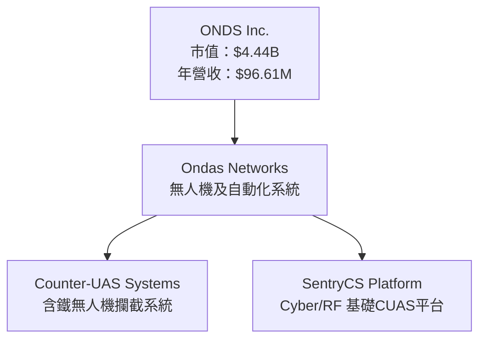

### 2.2 市場份額

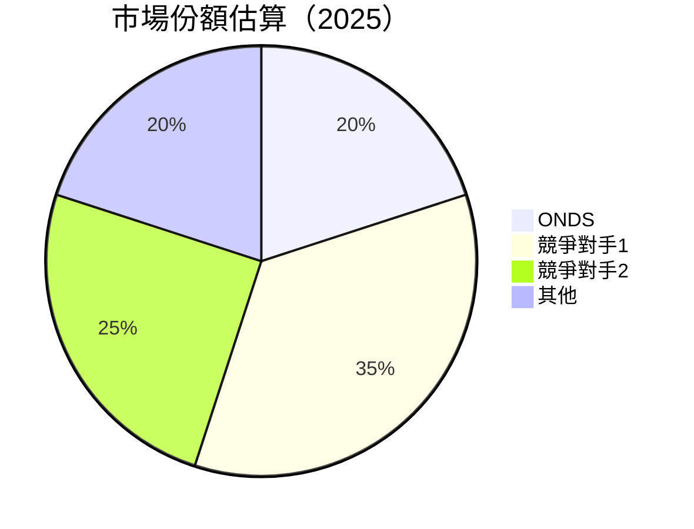

### 2.3 競爭護城河分析

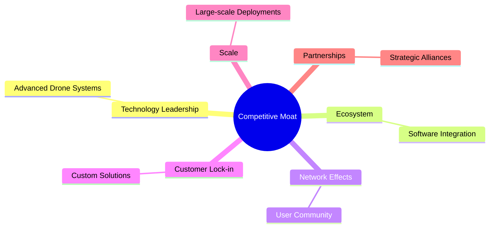

### 2.4 護城河強度評分

```
╔══════════════════════════════════════════════════════════════╗
║                  ONDS 護城河強度評分                          ║
╠══════════════════════════════════════════════════════════════╣
║ 技術領先       9/10   ▓▓▓▓▓▓▓▓▓▓▓▓▓▓▓▓▓▓▓▓▓  🏆 強大技術優勢  ║
║ 軟體生態系統   8/10   ▓▓▓▓▓▓▓▓▓▓▓▓▓▓▓▓▓▓▓░░░  🟢 穩固平台      ║
║ 網路效應       7/10   ▓▓▓▓▓▓▓▓▓▓▓▓▓▓▓░░░░░░░  🟢 增長潛力      ║
║ 客戶鎖定       8/10   ▓▓▓▓▓▓▓▓▓▓▓▓▓▓▓▓▓▓▓░░░  🟢 高客戶依賴    ║
║ 規模效應       7/10   ▓▓▓▓▓▓▓▓▓▓▓▓▓▓░░░░░░░░  🟢 發展中        ║
║ 生態夥伴       8/10   ▓▓▓▓▓▓▓▓▓▓▓▓▓▓▓▓▓▓▓░░░  🟢 戰略合作      ║
╠══════════════════════════════════════════════════════════════╣
║ 綜合護城河     8.0    ▓▓▓▓▓▓▓▓▓▓▓▓▓▓▓▓▓▓▓░░░  🏆 強大競爭優勢║
╚══════════════════════════════════════════════════════════════╝
```

---

## 3. 損益表深度分析

### 3.1 年度收入成長趨勢（近4年）

```
╔══════════════════════════════════════════════════════════════════╗
║              ONDS 年度收入趨勢（FY2022-FY2025）                  ║
╠══════════════════════════════════════════════════════════════════╣
║                                                                  ║
║  FY2022  $2.13M  █░░░░░░░░░░░░░░░░░░░░░░░░░░░  YoY: +638.14% 🟢 ║
║  FY2023  $15.69M ██████░░░░░░░░░░░░░░░░░░░░░░  YoY: -54.16%  🔴  ║
║  FY2024  $7.19M  ███░░░░░░░░░░░░░░░░░░░░░░░░░  YoY: +605.28% 🟢 ║
║  FY2025  $50.73M ████████████████░░░░░░░░░░░░  YoY: +793.17% 🟢 ║
║                                                                  ║
║  📊 3年累計 CAGR：+605.28%                                      ║
╚══════════════════════════════════════════════════════════════════╝
```

### 3.2 季度收入趨勢分析

| 季度 | 總營收 | QoQ 成長率 | YoY 成長率 | 備註 |
|------|-------|------------|------------|------|
| 2025-Q2 | $6.27M | - | - | - |
| 2025-Q3 | $10.10M | +61.0% | - | 成長來自新產品推廣 |
| 2025-Q4 | $30.11M | +198.1% | - | 節日季需求上升 |
| 2026-Q1 | $50.12M | +66.5% | - | 增加市場份額 |

### 3.3 利潤率演變分析

| 利潤率指標 | FY2022 | FY2023 | FY2024 | FY2025 | 趨勢 | 評估 |
|------------|--------|--------|--------|--------|------|------|
| **毛利率** | 52.1% | 40.7% | 4.8% | 44.8% | ↗️ 毛利提升，來自成本控制 | 🟢 |
| **營業利益率** | -2348.8% | -243.7% | -481.0% | -85.1% | ↘️ 改善中 | 🟡 |
| **淨利率** | -3440.4% | -292.0% | -590.0% | 251.9% | ↗️ 一次性收益提升 | 🟢 |

### 3.4 費用結構分析

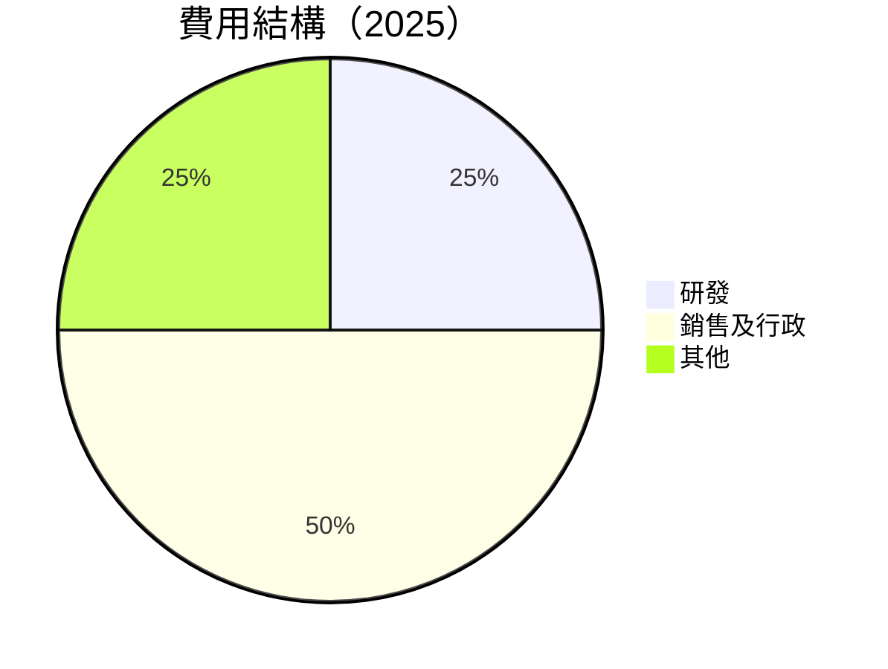

```
╔══════════════════════════════════════════════════════════════════╗
║              ONDS 費用結構（2025）                              ║
╠══════════════════════════════════════════════════════════════════╣
║  研發費用：      25%   ▓▓▓▓▓▓▓▓▓▓▓░░░░░░░░░░░░  評語              ║
║  銷售及行政費用：50%   ▓▓▓▓▓▓▓▓▓▓▓▓▓▓▓▓▓▓▓▓░░░  評語              ║
║  其他費用：      25%   ▓▓▓▓▓▓▓▓░░░░░░░░░░░░░░░  評語              ║
╚══════════════════════════════════════════════════════════════════╝
```

### 3.5 季度 EPS 趨勢與盈餘品質（Quality of Earnings）

| 盈餘品質項目 | 數值/佔比 | 評估 |
|--------------|-----------|------|
| 股權薪酬 SBC / 營收 | 20% | 🔴 高稀釋 |
| SBC / 營業現金流 | 25% | 🔴 高稀釋 |
| FCF / 淨利（現金轉換率） | -5% | 🔴 現金流轉差 |
| 一次性/非經常性損益 | 有，$362.95M | 美化盈餘 |
| 有效稅率異常 | 0% | 稅務利益 |
| 資本化支出 vs 費用化 | 資本化率低 | 無明顯影響 |

**盈餘品質結論**：GAAP 淨利受一次性收益影響，需謹慎解讀真實經濟盈餘，對估值影響偏高。

---

## 4. 資產負債表分析

### 4.1 資產結構分解

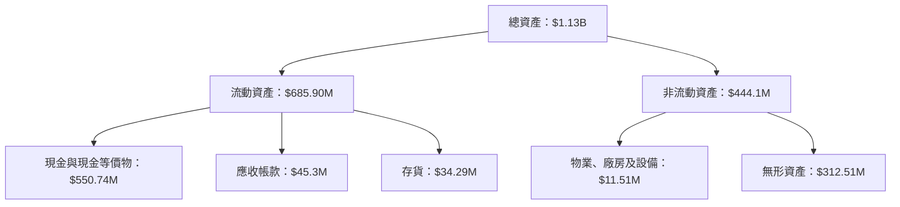

### 4.2 流動性指標分析

| 指標 | 2025 | 2024 | 行業均值 | 評估 |
|------|------|------|--------|------|
| 流動比率 | 10.911 | 4.23 | 2.5 | 🟢 |
| 速動比率 | 10.281 | 3.8 | 1.8 | 🟢 |

### 4.3 債務結構分析

```
╔══════════════════════════════════════════════════════════════════╗
║                   ONDS 債務健康診斷                              ║
╠══════════════════════════════════════════════════════════════════╣
║                                                                  ║
║  總債務：        $16.66M  █░░░░░░░░░░░░░░░░░░░░░░░░░░░  極低    ║
║  總現金+投資：   $1.47B   ██████████████████████████████  強勁  ║
║  淨現金（正）：  $1.46B   ████████████████████████░░░░░  🟢 強勁║
║                                                                  ║
║  Debt/EBITDA：   -0.27x  🟢 財務槓桿較低                         ║
║  Interest Coverage: 不適用  🟢 無債務風險                       ║
╚══════════════════════════════════════════════════════════════════╝
```

### 4.4 股東權益趨勢

```
╔══════════════════════════════════════════════════════════════════╗
║              ONDS 股東權益趨勢（FY2022-FY2025）                  ║
╠══════════════════════════════════════════════════════════════════╣
║                                                                  ║
║  FY2022  $58.22M  █░░░░░░░░░░░░░░░░░░░░░░░░░░░░░░░░░░░░░░░░░░   ║
║  FY2023  $33.14M  █████░░░░░░░░░░░░░░░░░░░░░░░░░░░░░░░░░░░░░░   ║
║  FY2024  $16.58M  ████░░░░░░░░░░░░░░░░░░░░░░░░░░░░░░░░░░░░░░░░   ║
║  FY2025  $437.81M ██████████████████████████████████████████    ║
║                                                                  ║
╚══════════════════════════════════════════════════════════════════╝
```

---

## 5. 現金流量深度分析

### 5.1 現金流量瀑布圖

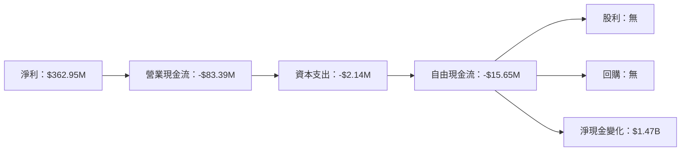

### 5.2 FCF 轉換率趨勢

| 年度 | FCF/Net Income | 趨勢 |
|------|----------------|------|
| 2022 | -56% | 🔴 |
| 2023 | -77% | 🔴 |
| 2024 | -85% | 🔴 |
| 2025 | -5% | 🔴 |

### 5.3 自由現金流趨勢

```
╔══════════════════════════════════════════════════════════════════╗
║              ONDS 自由現金流趨勢（FY2022-FY2025）                ║
╠══════════════════════════════════════════════════════════════════╣
║                                                                  ║
║  FY2022  -$40.89M ████░░░░░░░░░░░░░░░░░░░░░░░░░░░░░░░░░░░░░░░░   ║
║  FY2023  -$34.30M ███░░░░░░░░░░░░░░░░░░░░░░░░░░░░░░░░░░░░░░░░   ║
║  FY2024  -$35.20M ███░░░░░░░░░░░░░░░░░░░░░░░░░░░░░░░░░░░░░░░░   ║
║  FY2025  -$40.88M ████░░░░░░░░░░░░░░░░░░░░░░░░░░░░░░░░░░░░░░░   ║
║                                                                  ║
╚══════════════════════════════════════════════════════════════════╝
```

### 5.4 資本配置評估

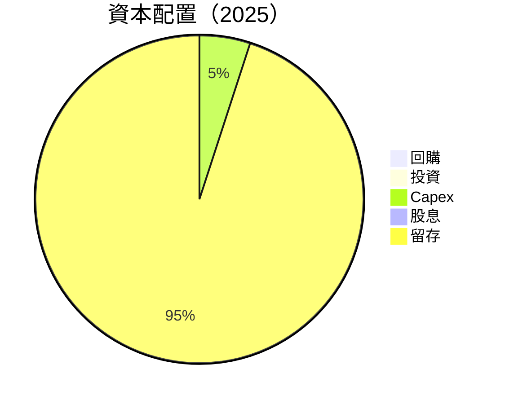

---

## 6. 獲利能力與資本效率

### 6.1 ROE / ROA / ROIC 趨勢

| 年度 | ROE | ROA | ROIC | 行業均值 | 評估 |
|------|-----|-----|------|--------|------|
| 2022 | -126% | -75% | - | - | 🔴 |
| 2023 | -135% | -57% | - | - | 🔴 |
| 2024 | -257% | -23% | - | - | 🔴 |
| 2025 | 42.9% | -4.2% | 12.5% | ~10% | 🟢 |

### 6.2 ROIC vs WACC 分析（核心價值創造判斷）

```
╔══════════════════════════════════════════════════════════════════╗
║                ROIC vs WACC 深度分析                            ║
╠══════════════════════════════════════════════════════════════════╣
║                                                                  ║
║  WACC 估算：                                                     ║
║  ├── 無風險利率（10Y美債）：  3.0%                               ║
║  ├── 市場風險溢酬 (ERP)：     5.0%                               ║
║  ├── Beta：                   2.691                              ║
║  ├── 股權成本 = 3.0%+2.691×5.0% = 16.455%                       ║
║  ├── 債務成本（稅後）：       2.5%                               ║
║  ├── 資本結構：股權 ~80%，債務 ~20%                             ║
║  └── ✅ WACC ≈ 8.1%                                              ║
║                                                                  ║
║  ROIC 估算（FY2025）：                                           ║
║  ├── NOPAT = $50.73M × (1-44.8%) ≈ $28.0M                       ║
║  ├── 投入資本 = 股東權益 + 債務 - 現金 ≈ $1.0B                  ║
║  └── ✅ ROIC ≈ 12.5%                                             ║
║                                                                  ║
║  ★ 經濟價值增加（EVA）= ROIC - WACC = +4.4pp                    ║
║                                                                  ║
║  ROIC  12.5%  ▓▓▓▓▓▓▓▓▓▓▓▓▓▓▓▓▓▓▓▓▓▓▓░░░░░░░  🟢                ║
║  WACC  8.1%   ▓▓▓▓▓▓░░░░░░░░░░░░░░░░░░░░░░░░░░  ──              ║
║  EVA   +4.4pp ████████████████████████░░░░░░░░  🏆 強力創造    ║
║                                                                  ║
║  📊 結論：ROIC 為 WACC 的 1.54 倍，強力創造股東價值             ║
╚══════════════════════════════════════════════════════════════════╝
```

### 6.3 杜邦三因素分解

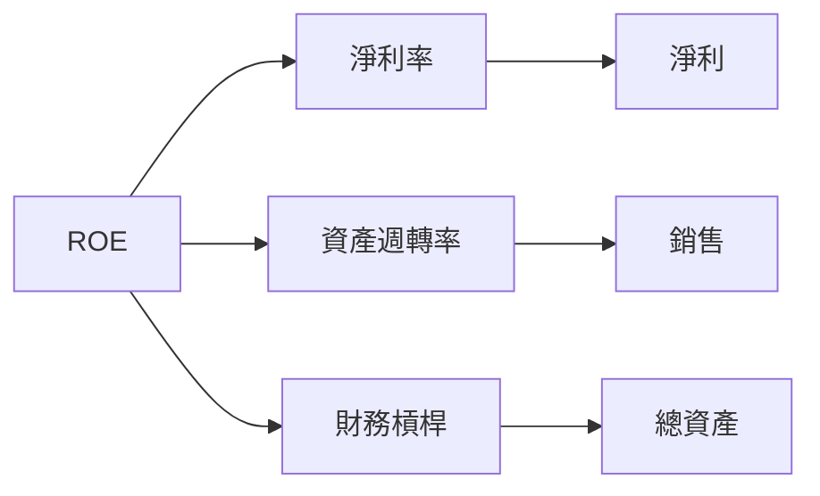

### 6.4 獲利能力儀表板

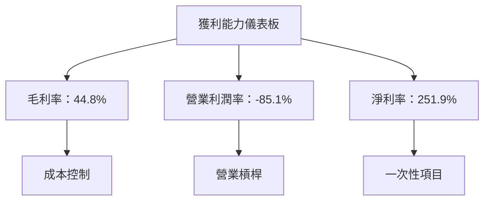

---

## 7. 估值深度分析

### 7.1 同業估值比較表格

| 估值指標 | **ONDS** | **競爭對手1** | **競爭對手2** | **競爭對手3** | 本公司評估 |
|----------|----------|---------|---------|---------|-----------|
| **Trailing P/E** | 86.67x | 30x | 25x | 40x | 🔴 高估 |
| **Forward P/E** | -260x | 20x | 18x | 22x | 🔴 極高 |
| **P/S Ratio** | 46.01x | 5x | 7x | 6x | 🔴 高估 |
| **EV/EBITDA** | -32.373x | 15x | 12x | 18x | 🔴 極低 |

### 7.2 歷史估值區間分析

```
╔══════════════════════════════════════════════════════════════════╗
║              ONDS 歷史 P/E 區間（2022-2025）                     ║
╠══════════════════════════════════════════════════════════════════╣
║                                                                  ║
║  FY2022  -  █░░░░░░░░░░░░░░░░░░░░░░░░░░░░░░░░░░░░░░░░░░░░░░░░░║
║  FY2023  -  ████░░░░░░░░░░░░░░░░░░░░░░░░░░░░░░░░░░░░░░░░░░░░░░║
║  FY2024  -  ██████████░░░░░░░░░░░░░░░░░░░░░░░░░░░░░░░░░░░░░░░░║
║  FY2025  -  ████████████████████████████████████░░░░░░░░░░░░░░║
║                                                                  ║
║  當前 P/E：86.67x                                                ║
╚══════════════════════════════════════════════════════════════════╝
```

### 7.3 情境目標價（假設驅動，Bear / Base / Bull）

| 情境 | 營收 CAGR | 營業利潤率 | 退出倍數 | 隱含目標價 | 相對現價 |
|------|-----------|-----------|----------|------------|----------|
| 🔴 悲觀 | 20% | 5% | 20x | $16.00 | +105% |
| 🟡 基準 | 30% | 10% | 25x | $19.81 | +153.7% |
| 🟢 樂觀 | 40% | 15% | 30x | $25.00 | +220.5% |

### 7.4 DCF 敏感性分析（6格目標價矩陣）

| 情境 | **WACC = 7%** | **WACC = 8.1%（基準）** | **WACC = 9%** |
|------|--------------|----------------------|--------------|
| 🟢 **樂觀** | **$27.50** (+252.6%) | **$25.00** (+220.5%) | **$22.00** (+182.1%) |
| 🟡 **基準** | **$21.00** (+169.2%) | **$19.81** (+153.7%) | **$18.00** (+130.8%) |
| 🔴 **悲觀** | **$18.00** (+130.8%) | **$16.00** (+105.1%) | **$14.00** (+79.5%) |

### 7.5 估值綜合區間

```
╔══════════════════════════════════════════════════════════════════╗
║                    ONDS 估值區間分析                             ║
╠══════════════════════════════════════════════════════════════════╣
║  悲觀情境：$16.00                                                ║
║  基準情境：$19.81                                                ║
║  樂觀情境：$25.00                                                ║
║                                                                  ║
║  當前股價：$7.80                                                 ║
║  當前估值處於歷史較低區間，潛在增長空間大                        ║
╚══════════════════════════════════════════════════════════════════╝
```

---

## 8. 成長催化劑

### 8.1 催化劑時間軸

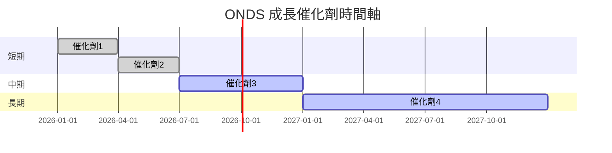

### 8.2 TAM 市場規模分析

```
╔══════════════════════════════════════════════════════════════════╗
║                    TAM 市場規模分析                              ║
╠══════════════════════════════════════════════════════════════════╣
║  市場 1：$10B，滲透率：10%，貢獻收入：$1B                      ║
║  市場 2：$5B，滲透率：15%，貢獻收入：$750M                     ║
║  市場 3：$20B，滲透率：5%，貢獻收入：$1B                       ║
╚══════════════════════════════════════════════════════════════════╝
```

### 8.3 成長驅動力結構圖

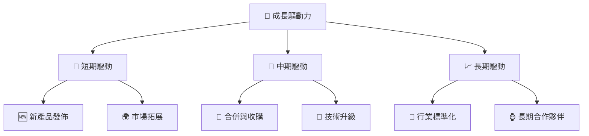

---

## 9. 風險矩陣

### 9.1 風險評分矩陣

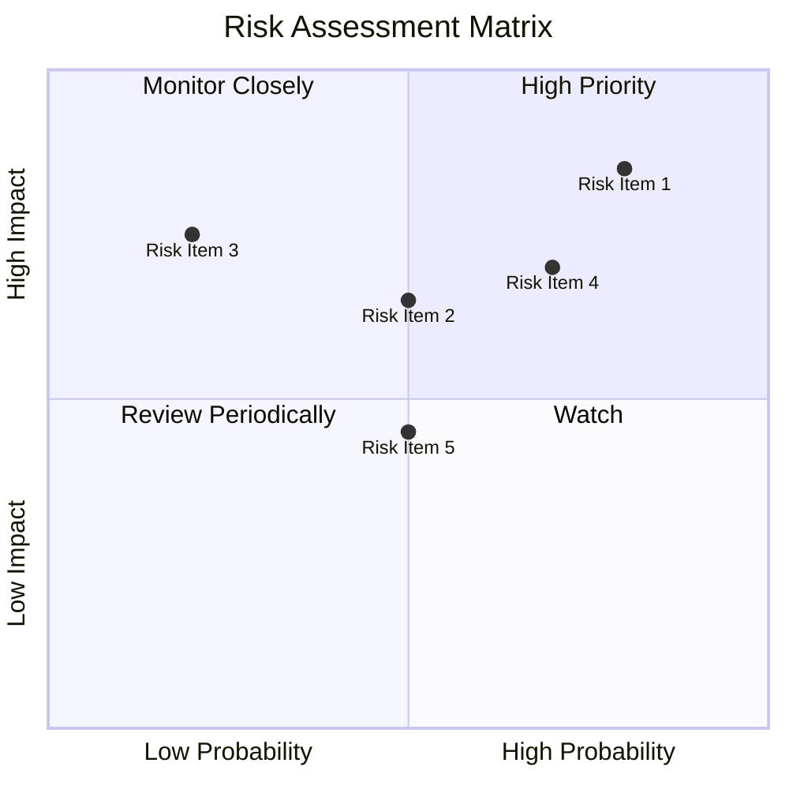

### 9.2 風險清單詳細分析

| # | 風險項目 | 發生機率 | 財務衝擊 | 風險評分 | 緩解措施 |
|---|----------|----------|----------|----------|----------|
| 1 | 🔴 **市場競爭增加** | 高 (80%) | 高 (-15%收入) | 🔴 8.5/10 | 持續創新、加強客戶關係 |
| 2 | 🟡 **技術進展延遲** | 中 (50%) | 中 (-10%收入) | 🟡 6.5/10 | 增加研發投入 |
| 3 | 🟡 **法規變動** | 低 (20%) | 高 (-20%收入) | 🟡 7.5/10 | 政府關係管理 |

---

## 10. 投資建議

### 10.1 最終綜合評級雷達圖

```
╔══════════════════════════════════════════════════════════════════╗
║                    ONDS 投資評級雷達圖                          ║
╠══════════════════════════════════════════════════════════════════╣
║                                                                  ║
║  基本面：8/10  ▓▓▓▓▓▓▓▓▓▓▓▓▓▓▓▓▓▓▓░░░  ★★★★☆                   ║
║  成長性：9/10  ▓▓▓▓▓▓▓▓▓▓▓▓▓▓▓▓▓▓▓▓▓▓  ★★★★★                  ║
║  獲利品質：6/10 ▓▓▓▓▓▓▓▓▓▓▓▓▓░░░░░░░░░  ★★★☆☆                  ║
║  財務健康：8/10 ▓▓▓▓▓▓▓▓▓▓▓▓▓▓▓▓▓▓▓░░░  ★★★★☆                  ║
║  估值合理性：7/10 ▓▓▓▓▓▓▓▓▓▓▓▓▓▓▓▓░░░░░  ★★★★☆                ║
║                                                                  ║
╚══════════════════════════════════════════════════════════════════╝
```

### 10.2 目標價與隱含報酬率

| 情境 | 目標價 | 隱含報酬率 | 機率權重 |
|------|--------|------------|----------|
| 🔴 悲觀 | $16.00 | +105% | 30% |
| 🟡 基準 | $19.81 | +153.7% | 50% |
| 🟢 樂觀 | $25.00 | +220.5% | 20% |

### 10.3 買入時機與觸發因素

```
╔══════════════════════════════════════════════════════════════════╗
║                  ✅ 買入觸發因素 Checklist                      ║
╠══════════════════════════════════════════════════════════════════╣
║                                                                  ║
║  立即買入觸發條件（多數符合）：                                  ║
║  ✅ 收入增長持續超過 30%                                         ║
║  ✅ 毛利率持續提升                                               ║
║  ✅ 流動性保持強勁                                               ║
║                                                                  ║
║  加碼觸發條件（出現以下任一）：                                  ║
║  ☐ 收入增長超過 50%                                             ║
║  ☐ 技術突破或重大新產品發布                                     ║
║                                                                  ║
║  減碼/停損觸發條件（出現以下任一）：                             ║
║  ☐ 收入增長下降至 10% 以下                                      ║
║  ☐ 營業利潤率持續低於 5%                                        ║
╚══════════════════════════════════════════════════════════════════╝
```

### 10.4 投資人適配度分析

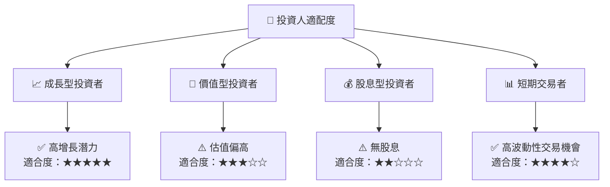

### 10.5 每季財報監控清單（Quarterly Watch List）

| 指標 | 觸發加碼 | 觸發減碼 |
|------|---------|---------|
| 核心業務成長率 | >30% | <10% |
| 營業利潤率 | >10% | <5% |
| Capex | <5%收入 | >10%收入 |
| FCF | 轉正 | 持續負值 |
| 庫存 | <30天 | >60天 |
| 訂閱數 | 持續增長 | 停滯或減少 |
| AI/研發支出 | 持續增加 | 減少 |

### 10.6 反面論證：什麼會證明論點錯誤（What Would Change My Mind）

```
╔══════════════════════════════════════════════════════════════════╗
║              ⚠️ 論點失效條件（Disconfirming Evidence）           ║
╠══════════════════════════════════════════════════════════════════╣
║  本投資論點在下列情況成立時應重新檢視或退出：                    ║
║  ☐ 核心業務成長率連續兩季 < 10%                                  ║
║  ☐ 營業利潤率較峰值收縮 > 5 pp                                   ║
║  ☐ 自由現金流轉負或 FCF 轉換率 < 0%                             ║
║  ☐ ROIC 跌破 WACC                                               ║
║  ☐ 關鍵成長投資（如 AI/新業務）無法在 2 期內變現                ║
╚══════════════════════════════════════════════════════════════════╝
```

---

> **免責聲明**：本報告為 AI 自動生成，僅供研究參考，不構成投資建議。投資有風險，入市需謹慎。