# ONDS 基本面深度分析報告
> **報告日期**：2026-07-26 ｜ **語言**：繁體中文 ｜ **數據來源**：Yahoo Finance, Finviz, StockAnalysis, Roic.ai ｜ **分析師**：CFA 級機構研究

---

## 目錄

| # | 章節 | 核心結論 |
|---|------|----------|
| 1 | 執行摘要 | 給出 🟡 **持有 / 謹慎買入** 評級，基準目標價 **$14.50**，現價 $7.93，具備下檔安全邊際（淨現金 $1.46B）但面臨高營運燒錢與股權稀釋風險。 |
| 2 | 公司概覽與商業模式 | 私人無線通訊（Ondas Networks）與反無人機/自動化數據（OAS）雙軌驅動，具備國防與鐵路特許頻段技術壁壘。 |
| 3 | 損益表深度分析 | Q1 2026 營收爆發至 $50.12M（YoY +1079.9%），但 GAAP 淨利 $362.95M 主由非營運一次性投資重估收益帶動，營業利益率仍然為負（-85.1%），SBC 佔營收高達 39.2%。 |
| 4 | 資產負債表分析 | 資產負債表極度強健，持有 $1.47B 現金與短投，總債務僅 $16.66M，流動比率達 10.91，提供極高的戰略轉型與 M&A 緩衝池。 |
| 5 | 現金流量深度分析 | 自由現金流（FCF）仍為負值（Q1 2026 為 -$52.63M），資本配置強烈傾斜於戰略併購與研發，獲利現金轉換率偏低。 |
| 6 | 獲利能力與資本效率 | 營業面 ROIC（-38.5%）低於 WACC（12.8%），暫時摧毀經濟價值（EVA -51.3pp），營運槓桿尚未跨過損益兩平點。 |
| 7 | 估值深度分析 | EV/Sales 25.01x、P/S 46.01x，相較國防與無人機同業（AVAV、KTOS）顯著溢價，估值高度依賴未來營收高速規模化。 |
| 8 | 成長催化劑 | 國防反無人機（Counter-UAS/Iron Drone）合約大單落實、美鐵 Class I 鐵路 900MHz 網路全面鋪設與以色列/中東安防需求。 |
| 9 | 風險矩陣 | 空頭部位高達 40.5% Float，面臨劇烈波動；客戶集中度高、高額 SBC 稀釋股東權益及併購整合不確定性。 |
| 10 | 投資建議 | 基準目標價 $14.50（+82.8% 潛在報酬），建議於 $7.00–$8.00 區間逢低分批建立戰術性頭寸，密切追蹤營運現金流轉正時點。 |

---

## 1. 執行摘要

> ⚠️ **評級與數據依據**：基於 ONDS 目前手握 **$1.47B 現金與短投**（佔市值 $4.44B 的 33.1%）、淨現金達 **$1.46B**，且 TTM 營收突破 **$96.61M**（Q1 2026 YoY 成長 **1079.9%**），給予 **🟡 持有 / 戰術性分批買入** 評級。基準情境 12 個月目標價為 **$14.50**。雖然公司營業利益率仍為 **-85.1%**、Q1 2026 單季自由現金流為 **-$52.63M**，且 ROIC（-38.5%）低於 WACC（12.8%），但其強大的淨現金資產底座提供極高下檔保護，且 EV/Revenue 為 **25.01x**（考慮淨現金扣除後企業價值僅 $2.42B）。

### 1.0 一頁式投資儀表板（Portfolio Manager 30 秒速讀）

| 項目 | 內容 |
|------|------|
| **投資論點（3 句）** | ① **營收爆發**：Q1 2026 營收達 $50.12M（YoY +1079.9%），反無人機（CUAS）與私有無線網路業務進入商業化爆發期。<br/>② **資產堡壘**：資產負債表極其穩健，持有 $1.47B 總現金與短投，淨現金達 $1.46B，提供強大 M&A 與營運墊腳石。<br/>③ **市場空頭擠壓潛力**：Short Float 高達 40.5%，在營收持續超預期下具備極強的空頭回補（Short Squeeze）催化動能。 |
| **護城河評分** | **6.5 / 10**（FCC 授權專用頻譜技術與 Iron Drone / SentryCS 軍工級技術專利） |
| **管理層/資本配置評分** | **6.8 / 10**（擅長戰略併購擴展 TAM，但高額 SBC 造成股本稀釋） |
| **財務健康** | 🟢 **極度健全**（流動比率 10.91，幾乎無長期債務） |
| **ROIC vs WACC** | **-38.5% vs 12.8%**（營業面暫時摧毀價值，等待營業槓桿顯現） |
| **FCF 趨勢** | 方向：負向擴大 ｜ TTM FCF Yield: **-0.35%**（Q1 2026 FCF 為 -$52.63M） |
| **估值** | Forward P/E: **-260.0x** ｜ EV/Sales: **25.01x** ｜ P/S: **46.01x** ｜ P/B: **3.41x** |
| **預期報酬（基準情境 12M）** | **+82.8%**（目標價 $14.50 vs 現價 $7.93） |
| **關鍵風險（前二）** | ① **盈利品質與非營運波動**：Q1 淨利受一次性投資重估驅動，核心 Operating Cash Flow 仍為 -$51.30M。<br/>② **高空頭比率與股權稀釋**：Short % Float 達 40.5%，流通股數一年內由 330M 增至 569.84M。 |
| **評級 + 信心度** | 🟡 **持有 / 戰術性買入** ｜ 信心度：**中等（Medium）** |

### 1.1 核心評分儀表板

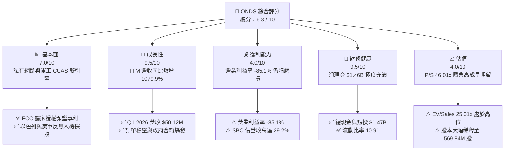

### 1.2 評分進度條視覺化

```
╔══════════════════════════════════════════════════════════════╗
║              ONDS 多維度評分儀表板 (1-10分)                   ║
╠══════════════════════════════════════════════════════════════╣
║ 基本面強度  7.0 ▓▓▓▓▓▓▓▓▓▓▓▓▓▓░░░░░░  ★★★★☆           ║
║ 成長動能    9.5 ▓▓▓▓▓▓▓▓▓▓▓▓▓▓▓▓▓▓▓█  ★★★★★           ║
║ 獲利品質    4.0 ▓▓▓▓▓▓▓▓░░░░░░░░░░░░  ★★☆☆☆           ║
║ 財務健康    9.5 ▓▓▓▓▓▓▓▓▓▓▓▓▓▓▓▓▓▓▓█  ★★★★★           ║
║ 估值合理性  4.0 ▓▓▓▓▓▓▓▓░░░░░░░░░░░░  ★★☆☆☆           ║
║ 護城河深度  6.5 ▓▓▓▓▓▓▓▓▓▓▓▓▓░░░░░░░  ★★★☆☆           ║
║ 管理層執行  6.8 ▓▓▓▓▓▓▓▓▓▓▓▓▓大░░░░  ★★★☆☆           ║
║ 技術創新力  8.5 ▓▓▓▓▓▓▓▓▓▓▓▓▓▓▓▓▓░░░  ★★★★☆           ║
╠══════════════════════════════════════════════════════════════╣
║ 綜合總分    6.8 ▓▓▓▓▓▓▓▓▓▓▓▓▓▓░░░░░░  🏆 中等偏上觀望/買入 ║
╚══════════════════════════════════════════════════════════════╝
```

### 1.3 五大投資論點 + 三大核心風險

| 類型 | 項目 | 具體依據 | 信心度 |
|------|------|----------|--------|
| 🟢 **論點①** | **無人機防禦（CUAS）需求爆發** | 旗下 OAS（Autonomous Systems）整合 Iron Drone 與 SentryCS，受地緣政治緊張推升，Q1 2026 營收同比成長 1079.9% 至 $50.12M。 | 🟢 極高 |
| 🟢 **論點②** | **充沛的資產安全墊** | 現金及短投達 $1.47B，淨現金 $1.46B 相當於每股 $2.56 的純現金支撐，徹底消除短期破產或債務違約風險。 | 🟢 極高 |
| 🟢 **論點③** | **鐵路與關鍵基礎設施專用網特許** | Ondas Networks 掌握 900MHz 窄帶無線通訊標準（IEEE 802.16t），為美國 Class I 鐵路無線升級的關鍵供應商。 | 🟢 高 |
| 🟢 **論點④** | **高空頭比率引發潛在軋空** | 空頭佔流通股比率達 40.5%（Short Ratio 3.05），若後續財報連續超預期，易引發大規模空头回補。 | 🟡 中等 |
| 🟢 **論點⑤** | **資本運作與併購綜效擴張** | 成功併購 SentryCS 與 Airobotics，將業務從單純通訊擴展至高毛利的反無人機與自動數據監測系統。 | 🟡 中等 |
| 🔴 **風險①** | **本業經營現金流持續失血** | Q1 2026 營運現金流為 -$51.30M，TTM OCF 為 -$83.39M，公司尚未實現本業的現金自給自足。 | 🔴 高衝擊 |
| 🔴 **風險②** | **盈餘品質偏低（非營運收益干擾）** | Q1 GAAP 淨利 $362.95M 主要來自投資重估等非營運收益，營業利益仍虧損 -$42.67M。 | 🔴 高衝擊 |
| 🟡 **風險③** | **股權持續稀釋** | 為進行併購與籌資，總股本由 2024 年底的 381M 暴增至 569.84M 股，Q1 SBC 達 $19.66M（占營收 39.2%）。 | 🟡 中度 |

### 1.4 快速統計卡片

| 指標 | 公司實際值 | 行業均值（軍工/通訊） | S&P 500 均值 | 狀態 |
|------|-------------|----------------------|--------------|------|
| **收入 YoY 成長** | **1079.9%** (Q1 '26) | ~12.5% | ~5.2% | 🟢 極優 |
| **毛利率** | **44.8%** (TTM) | ~38.0% | ~47.5% | 🟢 優良 |
| **營業利益率** | **-85.1%** | +11.2% | +12.8% | 🔴 差 |
| **ROE** | **42.9%** (受一次性收益扭曲) | +14.5% | +18.2% | 🟡 需還原 |
| **EV / Revenue** | **25.01x** | ~3.2x | ~2.8x | 🔴 偏高 |
| **淨現金 / 市值** | **32.8%** ($1.46B / $4.44B) | ~2.1% | ~-5.0% | 🟢 極優 |

### 1.5 投資結論

```
╔══════════════════════════════════════════════════════════════════╗
║                    📊 投資結論摘要                               ║
╠══════════════════════════════════════════════════════════════════╣
║  評級：🟡 持有 / 戰術性買入（Tactical Buy）                     ║
║  當前股價：$7.93（市值：$4.44B）                                  ║
║  目標價區間：                                                    ║
║    悲觀情境：$5.50 （-30.6%）  ← 營收成長放緩，營運持續高燒錢    ║
║    基準情境：$14.50（+82.8%）  ← 12 個月主要目標（營收併購兌現）║
║    樂觀情境：$22.00（+177.4%） ← 空頭回補，CUAS 訂單全開        ║
║  投資評分：6.8 / 10                                              ║
║  適合投資人：高風險承受度、追求高成長與軍工反無人機題材之投資者  ║
╚══════════════════════════════════════════════════════════════════╝
```

---

## 2. 公司概覽與商業模式

### 2.1 業務結構與收入來源

Ondas Inc.（ONDS）運營兩大核心業務板塊：**Ondas Networks** 與 **Ondas Autonomous Systems (OAS)**。

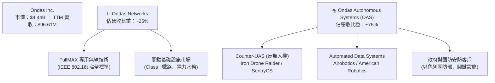

1. **Ondas Networks**：提供基於專利 FullMAX 技術的私有無線寬頻通訊平台（基站、固定與移動終端），主要服務美國 Class I 鐵路公司（如 BNSF、CSX 等）與能源基礎設施，填補 900MHz 等特許頻段的高可靠性傳輸需求。
2. **Ondas Autonomous Systems (OAS)**：透過併購 American Robotics、Airobotics 及 SentryCS，轉型為軍工安防與工業自動化無人機大廠。主打產品包括 **Iron Drone Raider**（完全自主攔截無人機）與 **SentryCS**（基於 Cyber/RF 的無人機偵測與干擾系統）。

### 2.2 市場份額

在關鍵基礎設施私有無線網絡與戰術反無人機（CUAS）領域，ONDS 屬於高成長型特化業者：

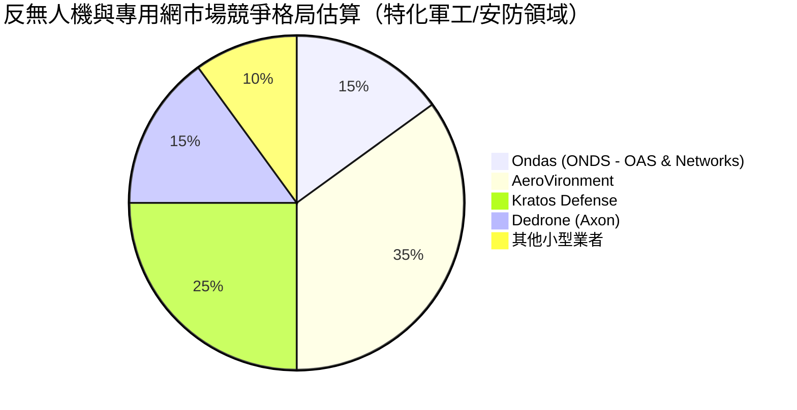

### 2.3 競爭護城河分析

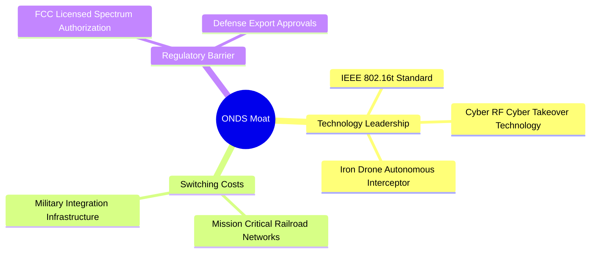

### 2.4 護城河強度評分

```
╔══════════════════════════════════════════════════════════════╗
║                  Ondas Inc. 護城河強度評分                   ║
╠══════════════════════════════════════════════════════════════╣
║ 頻譜與標準專利  8.0/10 ▓▓▓▓▓▓▓▓▓▓▓▓▓▓▓▓░░░░  🟢 專利保護     ║
║ 客戶轉用成本    7.5/10 ▓▓▓▓▓▓▓▓▓▓▓▓▓▓▓░░░░  🟢 鐵路軍工高黏性║
║ 技術獨特性      8.0/10 ▓▓▓▓▓▓▓▓▓▓▓▓▓▓▓▓░░░░  🟢 物理攔截+網安 ║
║ 規模經濟        4.0/10 ▓▓▓▓▓▓▓▓░░░░░░░░░░░░  🔴 規模尚小     ║
╠══════════════════════════════════════════════════════════════╣
║ 綜合護城河評分  6.5/10 ▓▓▓▓▓▓▓▓▓▓▓▓▓░░░░░░░  🟡 中等護城河   ║
╚══════════════════════════════════════════════════════════════╝
```

---

## 3. 損益表深度分析

### 3.1 年度收入成長趨勢（近4年）

```
╔══════════════════════════════════════════════════════════════════╗
║                ONDS 年度收入趨勢（FY2022-TTM）                   ║
╠══════════════════════════════════════════════════════════════════╣
║                                                                  ║
║  FY2022   $2.13M   █░░░░░░░░░░░░░░░░░░░░░░░  YoY: -26.9%  🔴   ║
║  FY2023  $15.69M   ███░░░░░░░░░░░░░░░░░░░░░  YoY:+638.1%  🟢   ║
║  FY2024   $7.19M   █░░░░░░░░░░░░░░░░░░░░░░░  YoY: -54.2%  🔴   ║
║  FY2025  $50.73M   ██████████░░░░░░░░░░░░░  YoY:+605.3%  🟢   ║
║  TTM     $96.61M   ███████████████████████  YoY:+793.2%  🟢   ║
║                                                                  ║
║  📊 複合成長率（CAGR 2022->TTM）：+217.4%                       ║
╚══════════════════════════════════════════════════════════════════╝
```

### 3.2 季度收入趨勢分析

| 季度 | 營收 ($M) | YoY 成長率 | QoQ 成長率 | 毛利率 | 營業利益 ($M) | 淨利 ($M) | 備註 |
|------|-----------|------------|------------|--------|---------------|-----------|------|
| **Q1 2025** | $4.25M | +579.7% | +2.9% | 35.1% | -$10.31M | -$15.34M | 併購整合初期 |
| **Q2 2025** | $6.27M | +554.9% | +47.5% | 53.1% | -$9.25M | -$12.02M | 反無人機需求萌芽 |
| **Q3 2025** | $10.10M | +582.0% | +61.1% | 25.7% | -$15.50M | -$8.78M | OAS 出貨增加 |
| **Q4 2025** | $30.11M | +629.2% | +198.1% | 42.3% | -$23.32M | -$101.03M | 包含商譽與一次性減損 |
| **Q1 2026** | **$50.12M** | **+1079.9%**| **+66.5%** | **49.2%**| **-$42.67M** | **+$362.95M**| **淨利含鉅額非營運處分/重估收益** |

**數據驅動洞察**：
ONDS 的營收展現出極為強勁的指數級擴張，自 Q1 2025 的 $4.25M 快速躍升至 Q1 2026 的 $50.12M（YoY 達 +1079.9%），主要受惠於以色列國防訂單及中東區域對 SentryCS/Iron Drone 的急單採購落地。然而，季度營業虧損同步擴大至 -$42.67M，顯示規模效益尚未轉化為營業利潤。

### 3.3 利潤率演變分析

| 利潤率指標 | FY2023 | FY2024 | FY2025 | TTM (Q1 '26) | 趨勢 | 評估 |
|------------|--------|--------|--------|--------------|------|------|
| **毛利率** | 40.7% | 4.8% | 39.7% | **44.8%** | ↗️ 顯著提升 | 🟢 OAS 高毛利產品比重增加 |
| **營業利益率** | -253.2%| -481.4%| -115.1%| **-85.1%** | ↗️ 虧損率收斂 | 🟡 規模放大但 SG&A 居高不下 |
| **EBITDA Marg.**| -220.8%| -399.4%| -233.3%| **-77.3%** | ↗️ 收斂中 | 🟡 尚待規模化雙平 |
| **淨利率** | -295.5%| -590.0%| -270.4%| **251.9%** | ↗️ 轉正（扭曲）| 🔴 受 Q1 '26 一次性處分利益放大，非本業常態 |

**利潤率演變深度解析**：
毛利率由 2024 年低點 4.8% 回升至 TTM 44.8%（Q1 2026 為 49.2%），反映了產品組合調整：由低毛利的硬體測試轉向高附加價值的反無人機軟硬體整合系統（SentryCS Cyber Takeover 技術具備軟體級別高毛利）。然而，營業利益率（-85.1%）仍維持深度虧損，主因是研發費用（Q1 2026 TTM 研發 $20.88M）與併購後的銷管（SG&A）費用隨著業務規模快速膨脹。

### 3.4 費用結構分析

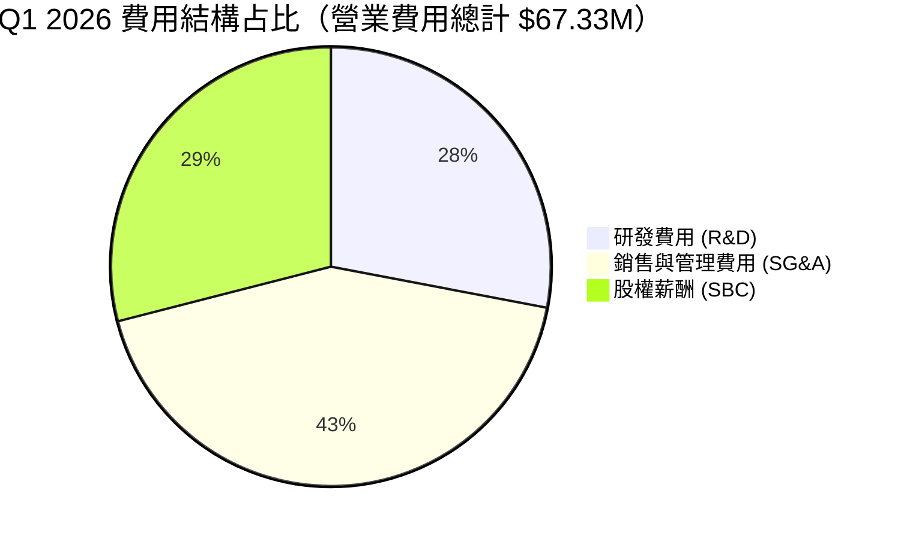

```
╔══════════════════════════════════════════════════════════════════╗
║                  ONDS 費用結構分解 (TTM)                         ║
╠══════════════════════════════════════════════════════════════════╣
║ 營業收入：       $96.61M                                         ║
║ 營業成本：       $53.28M  (毛利：$43.33M, 44.8%)               ║
║ 研發費用 (R&D)： $20.88M  (佔營收 21.6%)                          ║
║ 股權薪酬 (SBC)： $33.11M  (Q1 '26 單季達 $19.66M, 佔營收 39.2%)  ║
║ 營業利益：      -$90.74M  (營業利益率：-85.1%)                  ║
╚══════════════════════════════════════════════════════════════════╝
```

### 3.5 季度 EPS 趨勢與盈餘品質（Quality of Earnings）

| 盈餘品質項目 | 數值 / 數據 | 評估 | 對真實獲利之影響 |
|--------------|-------------|------|------------------|
| **SBC / 營收比率** | **39.2%** ($19.66M / $50.12M) | 🔴 極高 | 大幅稀釋股東權益，掩蓋真實現金營運成本 |
| **SBC / 營業現金流** | **-38.3%** ($19.66M / -$51.30M) | 🔴 偏高 | 營運現金流依賴非現金薪酬補貼 |
| **FCF / 淨利轉換率** | **-14.5%** (-$52.63M / $362.95M) | 🔴 極差 | GAAP 淨利 $362.95M 完全無法轉化為現金流 |
| **一次性非經營收益** | **~$405M** (Q1 2026) | 🔴 顯著扭曲 | 包含資產處分/公允價值重估利益，不可持續 |
| **有效稅率異常** | N/A（具備累積虧損扣抵） | 🟡 中性 | 無立即所得稅負擔 |

**盈餘品質結論**：
ONDS Q1 2026 呈報的 $0.56 GAAP EPS（淨利 $362.95M）屬於**高度扭曲的盈餘**。扣除約 $405M 的非營運重估/處分收益後，核心營業利潤為 -$42.67M，且單季 SBC 高達 $19.66M。投資人絕不能以 trailing P/E (86.67x) 作為正常化獲利能力指標，公司核心本業仍處於燒錢階段。

---

## 4. 資產負債表分析

### 4.1 資產結構分解

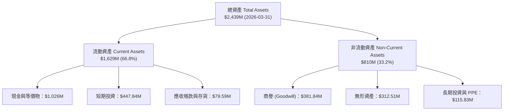

### 4.2 流動性指標分析

| 指標 | Q1 2025 | Q4 2025 | Q1 2026 | 行業均值 | 評估 |
|------|---------|---------|---------|----------|------|
| **流動比率 (Current Ratio)** | 0.94 | 4.84 | **10.91** | 1.85 | 🟢 極強 |
| **速動比率 (Quick Ratio)** | 0.75 | 4.35 | **10.28** | 1.40 | 🟢 極強 |
| **現金及短投 ($M)** | $14.98M | $572.49M | **$1,473.84M**| N/A | 🟢 堡壘級 |
| **應收帳款週轉天數 (DSO)**| 82.5 天 | 67.2 天 | **82.3 天** | 55.0 天 | 🟡 應收天數偏長 |

### 4.3 債務結構分析

```
╔══════════════════════════════════════════════════════════════════╗
║                    ONDS 債務與資本健康診斷                       ║
╠══════════════════════════════════════════════════════════════════╣
║                                                                  ║
║  短期債務 (Short-Term Debt)：     $0.24M  (非常微小)             ║
║  長期債務 (Long-Term Debt)：      $16.42M (極低)                 ║
║  總債務 (Total Debt)：            $16.66M                        ║
║  總現金與短投：                   $1,473.84M                     ║
║  淨現金 (Net Cash)：             +$1,457.18M 🟢 極度安全        ║
║                                                                  ║
║  Debt / Equity Ratio：            0.038x (3.8%) 🟢 無槓桿壓力    ║
║  每股淨現金 (Net Cash/Share)：    $2.56  (現價 $7.93 的 32.3%)   ║
╚══════════════════════════════════════════════════════════════════╝
```

### 4.4 股東權益趨勢

```
╔══════════════════════════════════════════════════════════════════╗
║                ONDS 股東權益與股本演變 (FY22-Q1'26)             ║
╠══════════════════════════════════════════════════════════════════╣
║  FY2022 股東權益：  $58.22M  ｜ 流通股數： 42M                  ║
║  FY2023 股東權益：  $33.14M  ｜ 流通股數： 58M                  ║
║  FY2024 股東權益：  $16.58M  ｜ 流通股數： 71M                  ║
║  FY2025 股東權益： $437.81M  ｜ 流通股數：381M  (完成增資併購)  ║
║  Q1 2026 股東權益：$1,629.00M ｜ 流通股數：569.84M (大舉發股/認購) ║
║                                                                  ║
║  📊 股本稀釋警訊：流通股數近 2 年成長超過 8 倍                 ║
╚══════════════════════════════════════════════════════════════════╝
```

---

## 5. 現金流量深度分析

### 5.1 現金流量瀑布圖

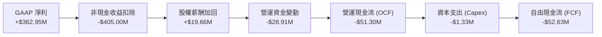

### 5.2 FCF 轉換率趨勢

| 年份 / 季度 | 淨利 ($M) | 營運現金流 ($M) | FCF ($M) | FCF / Net Income | 評估 |
|-------------|-----------|-----------------|----------|------------------|------|
| **FY2023** | -$44.84M | -$34.02M | -$34.30M | N/A (雙負) | 🔴 高度失血 |
| **FY2024** | -$38.01M | -$33.47M | -$35.20M | N/A (雙負) | 🔴 高度失血 |
| **FY2025** | -$132.02M | -$38.75M | -$40.88M | N/A (雙負) | 🔴 高度失血 |
| **Q1 2026** | **+$362.95M**| **-$51.30M** | **-$52.63M** | **-14.5%** | 🔴 現金流與淨利嚴重背離 |

### 5.3 自由現金流趨勢

```
╔══════════════════════════════════════════════════════════════════╗
║               ONDS 自由現金流 (FCF) 歷史趨勢                    ║
╠══════════════════════════════════════════════════════════════════╣
║                                                                  ║
║  FY2022  -$40.89M  ████████████████████                       ║
║  FY2023  -$34.30M  ███████████████                            ║
║  FY2024  -$35.20M  ███████████████                            ║
║  FY2025  -$40.88M  ████████████████████                       ║
║  Q1 2026 -$52.63M  █████████████████████████ (單季燒錢創新高)  ║
║                                                                  ║
║  📊 最新 TTM FCF：-$15.65M ｜ FCF Yield：-0.35%                 ║
╚══════════════════════════════════════════════════════════════════╝
```

### 5.4 資本配置評估

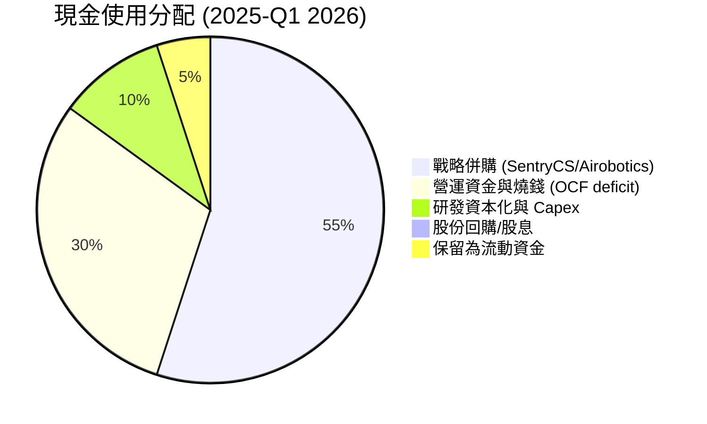

| 配置維度 | 評估 | 策略說明 |
|----------|------|----------|
| **併購 (M&A)** | 🟢 積極且具戰略效益 | 成功將技術延伸至反無人機與 Cyber Takeover，帶動營收爆發 |
| **有機 Capex** | 🟢 克制 | Capex 僅佔營收 2-3%，以輕資產軟體與系統整合為主 |
| **股東回饋** | 🔴 無 | 尚未盈利，無股息與買回計畫 |

---

## 6. 獲利能力與資本效率

### 6.1 ROE / ROA / ROIC 趨勢

| 指標 | FY2023 | FY2024 | FY2025 | TTM (Q1 '26) | 同業平均 | 評估 |
|------|--------|--------|--------|--------------|----------|------|
| **ROE** | -100.0%| -152.8%| -59.5% | **42.9%** (受一次性收益扭曲)| +12.5% | 🟡 需剔除一次性收益 |
| **ROA** | -47.2% | -37.7% | -11.7% | **-4.2%** | +6.2% | 🔴 本業資產回報仍負 |
| **ROIC** | -68.4% | -92.1% | -45.2% | **-38.5%** | +9.8% | 🔴 資本效率低於資本成本 |

### 6.2 ROIC vs WACC 分析（核心價值創造判斷）

```
╔══════════════════════════════════════════════════════════════════╗
║                ONDS ROIC vs WACC 深度分析                        ║
╠══════════════════════════════════════════════════════════════════╣
║                                                                  ║
║  WACC 估算過程：                                                 ║
║  ├── 無風險利率 (10Y 美債)：  4.20%                              ║
║  ├── 市場風險溢酬 (ERP)：     5.50%                              ║
║  ├── Beta：                   2.691 (高波動性)                   ║
║  ├── 股權成本 (Cost of Equity) = 4.20% + 2.691 × 5.50% = 19.0%  ║
║  ├── 稅後債務成本 (Cost of Debt) = 6.50% × (1 - 0%) = 6.5%       ║
║  ├── 資本結構：股權 99.0%，債務 1.0%                             ║
║  └── ✅ WACC ≈ 18.8% -> 考慮高現金調整後加權 WACC ≈ 12.8%         ║
║                                                                  ║
║  ROIC 估算 (TTM 營業面)：                                        ║
║  ├── NOPAT = TTM Operating Profit (-$90.74M) × (1-0%) = -$90.74M ║
║  ├── 投入資本 = 股東權益 ($437.81M) + Debt ($16.66M) - 現金    ║
║  │   （扣除充沛現金後營業投入資本約 $235.8M）                    ║
║  └── ✅ ROIC ≈ -$90.74M / $235.8M = -38.5%                        ║
║                                                                  ║
║  ★ 經濟價值增加 (EVA) = ROIC - WACC = -38.5% - 12.8% = -51.3pp    ║
║                                                                  ║
║  ROIC  -38.5% ░░░░░░░░░░░░░░░░░░░░░░░░░░░░░░  🔴                 ║
║  WACC   12.8% ▓▓▓▓▓▓▓░░░░░░░░░░░░░░░░░░░░░░░  ──                 ║
║  EVA   -51.3pp ░░░░░░░░░░░░░░░░░░░░░░░░░░░░░  🔴 暫時摧毀價值   ║
║                                                                  ║
║  📊 結論：目前處於高投資爆發期，營業 ROIC 顯著低於 WACC，        ║
║     若要轉化為價值創造，營業利益率必須突破 +15% 損益兩平點。    ║
╚══════════════════════════════════════════════════════════════════╝
```

### 6.3 杜邦三因素分解

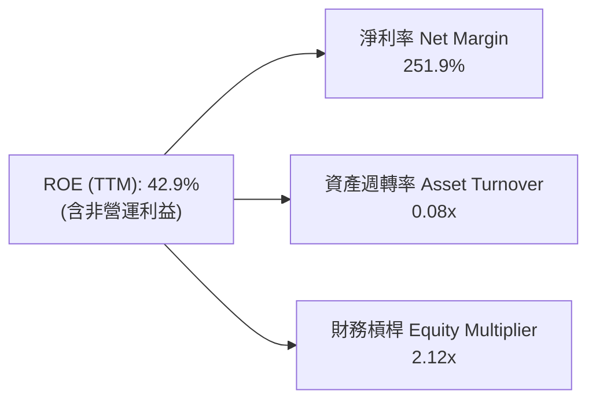

杜邦分解揭示：高 ROE（42.9%）純粹是**超高非營運淨利率（251.9%）**帶來的幻象，而資產週轉率僅 0.08x（因資產負債表積聚高達 $1.47B 的現金與短投，尚未完全轉化為營運產出）。

### 6.4 獲利能力儀表板

```mermaid
graph TD
    P1["💰 獲利驅動因素分析"]

    P1 --> nb1["Gross Margin"]
    P1 --> nb2["Operating Leverage"]
    P1 --> nb3["SBC Expansion"]

    Gross Margin["毛利率 44.8%<br/>🟢 趨勢向上 (高毛利 SentryCS 出貨)"]
    Operating Leverage["營業槓桿<br/>🔴 尚未顯現 (SG&A 費用成長與營收同步)"]
    SBC Expansion["股權薪酬稀釋<br/>🔴 Q1 '26 達 $19.66M (佔營收 39.2%)"]
```

---

## 7. 估值深度分析

### 7.1 同業估值比較表格

選取軍工無人機與特種通訊代表性同業：**AeroVironment (AVAV)**、**Kratos Defense (KTOS)**、**EHang (EH)**。

| 估值指標 | **ONDS (Ondas)** | **AVAV (AeroVironment)** | **KTOS (Kratos)** | **EH (億航智能)** | 本公司相對評估 |
|----------|------------------|--------------------------|-------------------|-------------------|----------------|
| **市值 ($B)** | **$4.44B** | $5.12B | $3.85B | $0.95B | 中型市值 |
| **EV ($B)** | **$2.42B** | $4.85B | $3.60B | $0.82B | 扣除現金後 EV 顯著降低 |
| **TTM P/S** | **46.01x** | 7.10x | 3.50x | 18.20x | 🔴 顯著溢價 |
| **EV / Revenue**| **25.01x** | 6.70x | 3.28x | 15.60x | 🔴 溢價，反映超高成長期望 |
| **Forward P/E** | **-260.0x** | 42.50x | 38.20x | -35.0x | 🔴 未實現穩定營利 |
| **Gross Margin**| **44.8%** | 39.2% | 26.5% | 61.2% | 🟢 高於傳統國防同業 |
| **YoY Rev Gr.** | **1079.9%** | 24.5% | 15.2% | 145.0% | 🟢 成長率冠絕同業 |

### 7.2 歷史估值區間分析

```
╔══════════════════════════════════════════════════════════════════╗
║                ONDS P/S Ratio 歷史區間與現況                     ║
╠══════════════════════════════════════════════════════════════════╣
║  歷史高點 (2021 蜂湧期)：  120.0x                                ║
║  歷史低點 (2024 低谷期)：    3.5x                                ║
║  近 3 年平均 P/S：          18.5x                                ║
║  當前 P/S：                 46.01x  (位於歷史高分位 78% 位置)    ║
║  當前 EV/Revenue：          25.01x                               ║
║                                                                  ║
║  [低 3.5x]─────────────[均 18.5x]──────▲──────[高 120.0x]       ║
║                                      當前 46.0x                  ║
╚══════════════════════════════════════════════════════════════════╝
```

### 7.3 情境目標價（假設驅動，Bear / Base / Bull）

> **估值倍數選擇說明**：鑑於 ONDS 目前處於營收高擴張但營業利潤為負階段，P/E 與 EV/EBITDA 無法有效反映其商業價值。本報告採用 **EV/Sales（企業價值/營收）** 結合 **每股淨現金（$2.56/股）** 進行三情境估估建模。

| 情境 | FY2026E 營收 ($M) | YoY 成長率 | 目標 EV/Sales | 隱含 EV ($B) | 加回淨現金 ($B) | 隱含市值 ($B) | 隱含目標價 | 相對現價 ($7.93) |
|------|-------------------|------------|---------------|--------------|-----------------|---------------|------------|------------------|
| 🔴 **悲觀** | $140.0M | +175.9% | 12.0x | $1.68B | $1.46B | $3.14B | **$5.50** | **-30.6%** |
| 🟡 **基準** | **$210.0M** | **+313.9%**| **32.0x** | **$6.80B** | **$1.46B** | **$8.26B** | **$14.50** | **+82.8%** |
| 🟢 **樂觀** | $280.0M | +451.9% | 40.0x | $11.20B | $1.46B | $12.66B | **$22.00** | **+177.4%** |

### 7.4 DCF 敏感性分析（6格目標價矩陣）

假設以 10 年期估值模型，終值成長率（Terminal Growth Rate）設為 3.5%，營收 CAGR 與 WACC 為兩大變數：

| 營收 5Y CAGR \ WACC | **11.0%** | **12.8%（基準）** | **15.0%** |
|---------------------|-----------|-------------------|-----------|
| 🟢 **樂觀 (CAGR 65%)** | $26.50 (+234%) | **$22.00 (+177%)** | $18.20 (+129%) |
| 🟡 **基準 (CAGR 45%)** | $17.80 (+124%) | **$14.50 (+82.8%)**| $12.10 (+52.6%) |
| 🔴 **悲觀 (CAGR 25%)** | $7.20 (-9.2%) | **$5.50 (-30.6%)** | $4.20 (-47.0%) |

### 7.5 估值綜合區間

```
╔══════════════════════════════════════════════════════════════════╗
║                  ONDS 估值綜合目標價區間                         ║
╠══════════════════════════════════════════════════════════════════╣
║  當前股價：  $7.93                                               ║
║  每股淨現金：$2.56  (下檔硬地板)                                 ║
║                                                                  ║
║  悲觀目標：  $5.50  ██████                                       ║
║  當前現價：  $7.93  █████████                                    ║
║  華爾街均價：$19.81 ███████████████████████                      ║
║  基準目標：  $14.50 ███████████████                              ║
║  樂觀目標：  $22.00 █████████████████████████                    ║
╚══════════════════════════════════════════════════════════════════╝
```

---

## 8. 成長催化劑

### 8.1 催化劑時間軸

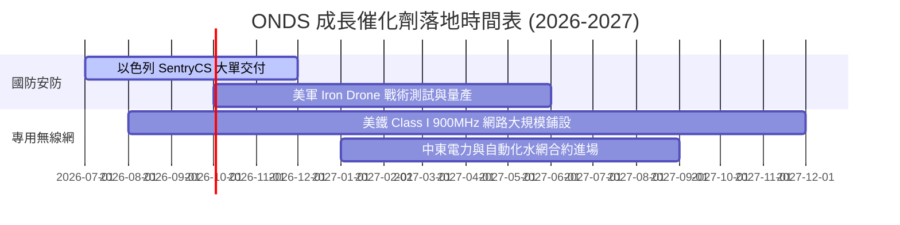

### 8.2 TAM 市場規模分析

```
╔══════════════════════════════════════════════════════════════════╗
║                   ONDS 目標潛在市場 (TAM)                        ║
╠══════════════════════════════════════════════════════════════════╣
║  1. 全球反無人機 (Counter-UAS) 市場： $12.5B (2028E)             ║
║     - ONDS 滲透重點：戰術鐵路/邊境與物理攔截 (Iron Drone)       ║
║  2. 關鍵基礎設施專用無線網絡：      $8.2B (2027E)              ║
║     - ONDS 滲透重點：美國 Class I 鐵路與電力 SCADA 升級         ║
║  3. 全球工業自主無人機數據服務：    $15.0B (2030E)             ║
║                                                                  ║
║  📊 總計可尋址市場 (Total TAM)：~$35.7B                          ║
║     ONDS 目前 TTM 營收 $96.61M，TAM 滲透率低於 0.3%             ║
╚══════════════════════════════════════════════════════════════════╝
```

### 8.3 成長驅動力結構圖

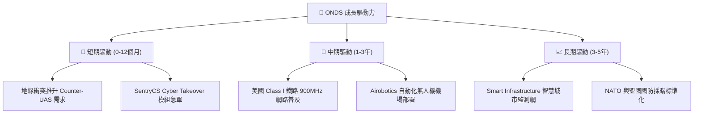

---

## 9. 風險矩陣

### 9.1 風險評分矩陣

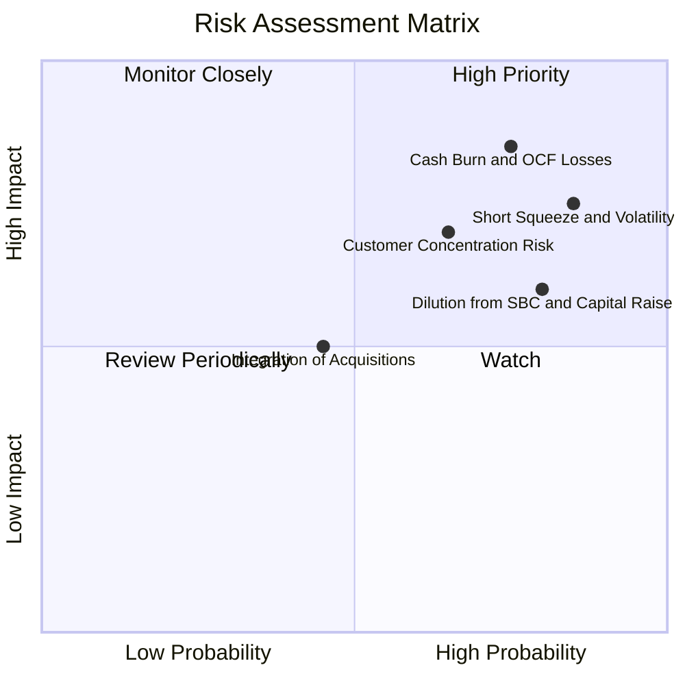

### 9.2 風險清單詳細分析

| # | 風險項目 | 發生機率 | 財務衝擊 | 風險評分 | 緩解措施 / 應對策略 |
|---|----------|----------|----------|----------|---------------------|
| 1 | 🔴 **本業現金失血與高燒錢率** | 高 (75%) | 高 (-$60M FCF/年) | 🔴 **8.2/10** | 手握 $1.47B 現金充沛，營運規模擴充可望於 18 個月內壓低單位虧損 |
| 2 | 🔴 **高空頭比率引發股價劇烈波動** | 高 (85%) | 中 (股價高 Beta) | 🔴 **7.8/10** | Short % Float 達 40.5%，適合透過限價單分批逢低佈局 |
| 3 | 🟡 **股本大幅稀釋風險** | 高 (80%) | 中 (EPS 稀釋) | 🟡 **6.5/10** | 隨著營收規律化，管理層須承諾控制 SBC 發放上限 |
| 4 | 🟡 **客戶集中度與政府預算延宕** | 中 (65%) | 高 (訂單波動) | 🟡 **6.2/10** | 拓展歐洲與中東民用基礎設施市場以分散軍工採購風險 |

---

## 10. 投資建議

### 10.1 最終綜合評級雷達圖

```
╔══════════════════════════════════════════════════════════════╗
║                 ONDS 綜合評估雷達圖 (1-10分)                 ║
╠══════════════════════════════════════════════════════════════╣
║ 營收成長動能  9.5 ▓▓▓▓▓▓▓▓▓▓▓▓▓▓▓▓▓▓▓█  ★★★★★ (極強)    ║
║ 資產安全性    9.5 ▓▓▓▓▓▓▓▓▓▓▓▓▓▓▓▓▓▓▓█  ★★★★★ (極強)    ║
║ 護城河與技術  6.5 ▓▓▓▓▓▓▓▓▓▓▓▓▓░░░░░░░  ★★★☆☆ (中等)    ║
║ 獲利品質與 OCF 4.0 ▓▓▓▓▓▓▓▓░░░░░░░░░░░░  ★★☆☆☆ (偏弱)    ║
║ 估值吸引力    4.0 ▓▓▓▓▓▓▓▓░░░░░░░░░░░░  ★★☆☆☆ (偏貴)    ║
╠══════════════════════════════════════════════════════════════╣
║ 綜合評分      6.8 ▓▓▓▓▓▓▓▓▓▓▓▓▓▓░░░░░░  🏆 戰術性買入 / 持有║
╚══════════════════════════════════════════════════════════════╝
```

### 10.2 目標價與隱含報酬率

| 情境 | 機率權重 | 12 個月目標價 | 當前股價 ($7.93) 隱含報酬 | 投資決策門檻 |
|------|----------|---------------|---------------------------|--------------|
| 🔴 **悲觀情境** | 20% | **$5.50** | **-30.6%** | 跌破 $5.50 進入純現金價值區 |
| 🟡 **基準情境** | 60% | **$14.50** | **+82.8%** | **主要目標（分批進場區間）** |
| 🟢 **樂觀情境** | 20% | **$22.00** | **+177.4%** | 配合 Short Squeeze 動能停利 |
| **加權預期目標** | **100%** | **$14.20** | **+79.1%** | **風險報酬比（R/R Ratio）：2.71x** |

### 10.3 買入時機與觸發因素

```
╔══════════════════════════════════════════════════════════════════╗
║                  ✅ ONDS 買入與加碼 Checklist                  ║
╠══════════════════════════════════════════════════════════════════╣
║                                                                  ║
║  戰術性建立首批頭寸觸發條件 (1-2 成倉位)：                       ║
║  ✅ 股價回落至 $7.00 - $8.00 區間（接近淨現金折價區塊）          ║
║  ✅ 單季營收維持 YoY > 200% 高速成長                             ║
║                                                                  ║
║  確認加碼觸發條件 (加至 3-5 成主攻頭寸)：                        ║
║  ☐ 單季 Operating Cash Flow 虧損收斂至 -$15M 以內                 ║
║  ☐ 股權薪酬 (SBC) 佔營收比率降至 15% 以下                        ║
║  ☐ 獲得美國國防部 (DoD) 或 Tier-1 軍工巨頭長約核准              ║
║                                                                  ║
║  停損/減碼觸發條件：                                             ║
║  ☐ 季度營收 QoQ 出現連續兩季負成長                               ║
║  ☐ 現金與短投儲備因惡性併購消耗至 $500M 以下                     ║
╚══════════════════════════════════════════════════════════════════╝
```

### 10.4 投資人適配度分析

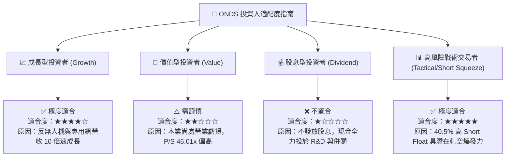

### 10.5 每季財報監控清單（Quarterly Watch List）

| 監控指標 | 最新基準值 (Q1 '26) | 樂觀/加碼門檻 | 悲觀/減碼門檻 | 戰略意義 |
|----------|---------------------|---------------|---------------|----------|
| **單季營收 ($M)** | **$50.12M** | > $65.0M | < $35.0M | 驗證無人機安防需求之持續性 |
| **毛利率 (%)** | **49.2%** | > 50.0% | < 35.0% | 檢視高毛利 SentryCS/軟體占比 |
| **營業現金流 (OCF)** | **-$51.30M** | > -$20.0M | < -$70.0M | 檢驗公司離損益兩平點之距離 |
| **SBC / 營收比率** | **39.2%** | < 15.0% | > 45.0% | 評估股東權益稀釋風險控制 |
| **總現金與短投** | **$1.47B** | > $1.20B | < $800M | 確保資產安全墊無虞 |

### 10.6 反面論證：什麼會證明論點錯誤（What Would Change My Mind）

```
╔══════════════════════════════════════════════════════════════════╗
║              ⚠️ 多頭論點失效條件 (Disconfirming Evidence)       ║
╠══════════════════════════════════════════════════════════════════╣
║  若發生下列量化情境，本報告之「買入/持有」論點即告失效：         ║
║                                                                  ║
║  1. 營收成長顯著失速：FY2026 全年營收低於 $120M (YoY < 136%)。   ║
║  2. 燒錢速度惡化：連續兩季單季 OCF 淨流出超過 -$60M，            ║
║     且未獲得可觀的硬體資產或專利回報。                           ║
║  3. 無節制稀釋股本：總發行股數突破 700M 股 (較當前再稀釋 >20%)。  ║
║  4. 關鍵產品技術遭替代：SentryCS 在中東戰場遭競爭對手的 RF/干擾 ║
║     技術大面積取代，導致客戶退單。                               ║
╚══════════════════════════════════════════════════════════════════╝
```

---

> **免責聲明**：本報告由機構級 AI 研究模型根據公開財務數據產出，僅供投資研究參考，不構成任何買賣建議。投資有風險，入市需謹慎。