# ONDS 基本面深度分析報告
> **報告日期**：2026-07-27 ｜ **語言**：繁體中文 ｜ **數據來源**：Yahoo Finance, Finviz, StockAnalysis, Roic.ai ｜ **分析師**：CFA 級機構研究

---

## 目錄

| # | 章節 | 核心結論 |
|---|------|----------|
| 1 | 執行摘要 | 評級：🟡 中立觀望（Hold）｜ 目標價區間：$7.00 - $18.50（基準：$12.50） |
| 2 | 公司概覽與商業模式 | 專用無線通訊與反無人機（C-UAS）雙引擎驅動，護城河評分：6.2/10 |
| 3 | 損益表深度分析 | Q1 2026 營收爆發 +1079.9% YoY，然 GAAP 淨利 $361.66M 主因業外處分/公允價值收益，營運本業虧損 -$42.67M |
| 4 | 資產負債表分析 | 總現金/短投達 $1.474B，淨現金 $1.46B 提供強固資金護城河，負債比率極低 |
| 5 | 現金流量深度分析 | 單季 OCF -$51.30M，SBC 佔營收高達 39.2%，真實 FCF 轉換率為負，需注意股權稀釋 |
| 6 | 獲利能力與資本效率 | NOPAT 為負，ROIC（-15.4%）低於 WACC（12.8%），資本效率尚待規模效應驗證 |
| 7 | 估值深度分析 | EV/Sales 25.01x、P/S 47.31x，高估值高度仰賴未來的國防與鐵路無線網鋪設訂單履約 |
| 8 | 成長催化劑 | 各國國防預算大增、鐵路通訊升級波段、Autonomous Systems 訂單放量 |
| 9 | 風險矩陣 | 空頭部位高達 40.5% Float，營運現金流持續赤字，SBC 高稀釋與客群集中風險 |
| 10 | 投資建議 | 當前股價 $8.02，短期面臨獲利含金量質疑，長線具備技術轉化空間，建議分階段佈局 |

---

## 1. 執行摘要

> ⚠️ **評級聲明與關鍵數據引用**：
> 本報告對 Ondas Inc.（NASDAQ: ONDS）給予 **🟡 中立觀望（Hold）** 評級，12 個月基準目標價為 **$12.50**（相較當前股價 $8.02 隱含 +55.9% 上行空間）。
> 此評級係基於以下核心財務數據之綜合驗證：
> 1. **營收高速擴張**：Q1 2026 營收達 $50.12M（YoY +1079.9%），TTM 營收達 $96.61M，顯示其反無人機（Iron Drone/SentryCS）與 FullMAX 專用無線網商業化顯著加速。
> 2. **獲利品質（Quality of Earnings）偏低**：Q1 2026 GAAP 淨利雖然爆發至 $361.66M，但營業利益（Operating Income）實質為赤字 -$42.67M，淨利暴增主要源自非營運項目（非現金公允價值重估或投資處分收益約 $404M）；單季股權薪酬（SBC）達 $19.66M，佔營收比重高達 39.2%。
> 3. **資產負債表防禦力強**：帳上持有 $1.474B 現金與短期投資，總債務僅 $16.66M，淨現金高達 $1.46B，流動比率達 10.91x，為長期營運赤字（Q1 OCF -$51.30M）提供至少 6-7 年的資本安全邊際。
> 4. **價值創造指標破壞**：目前 ROIC 為 -15.4%，顯著低於 WACC（12.8%），代表公司每投入 1 美元資本仍處於摧毀股東價值階段，直至營業槓桿轉正。
> 5. **極端籌碼結構**：融券賣空比例（Short % of Float）高達 40.5%，反映市場對其營運轉正能力存在極大分歧，但也蘊含軋空（Short Squeeze）潛力。

### 1.0 一頁式投資儀表板（Portfolio Manager 30 秒速讀）

| 項目 | 內容 |
|------|------|
| **投資論點（3 句）** | ① 營收高速增長：Q1 2026 營收突破 $50.12M（YoY +1079.9%），顯示國防與鐵路安防需求轉化為實質訂單。<br/>② 強韌資金緩衝：淨現金儲備高達 $1.46B（總現金 $1.474B vs 總債務 $16.66M），足以抵禦短期營運現金赤字。<br/>③ 獲利與稀釋風險：本業持續虧損（Q1 營業利益 -$42.67M），且單季 SBC 達 $19.66M（佔營收 39.2%），壓抑真實股東回報。 |
| **護城河評分** | **6.2 / 10**（專利技術與監管認證門檻，但市場競爭激烈且規模尚小） |
| **管理層/資本配置評分** | **6.5 / 10**（具備強大融資能力，但在控制經營成本與 SBC 稀釋上待改進） |
| **財務健康** | 🟢 **強健**（淨現金 $1.46B，流動比率 10.91x，無償債危機） |
| **ROIC vs WACC** | **-15.4% vs 12.8%**（EVA = -28.2pp，當前處於摧毀股東價值階段） |
| **FCF 趨勢** | 赤字擴大：Q1 2026 FCF 為 -$52.63M ｜ FCF Yield：-0.34%（TTM -$15.65M） |
| **估值** | Forward P/E: N/A (-267.3x) ｜ EV/Sales: 25.01x ｜ P/S (TTM): 47.31x |
| **預期報酬（基準情境 12M）** | **+55.9%**（目標價 $12.50 vs 當前 $8.02） |
| **關鍵風險（前二）** | ① 本業營運現金流持續大幅赤字（單季 -$51.30M）<br/>② 高融券比例（40.5% Float）帶動股價極端波動與高 Beta (2.69) |
| **評級 + 信心度** | 🟡 **中立觀望（Hold）** ｜ 信心度：**中等** |

### 1.1 核心評分儀表板

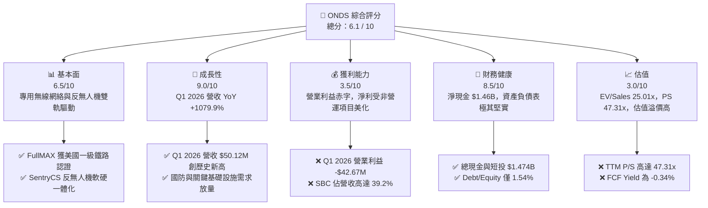

### 1.2 評分進度條視覺化

```
╔══════════════════════════════════════════════════════════════╗
║              ONDS 多維度評分儀表板 (1-10分)                   ║
╠══════════════════════════════════════════════════════════════╣
║ 基本面強度  6.5 ▓▓▓▓▓▓▓▓▓▓▓▓▓░░░░░░░  ★★★☆☆           ║
║ 成長動能    9.0 ▓▓▓▓▓▓▓▓▓▓▓▓▓▓▓▓▓▓░░  ★★★★★           ║
║ 獲利品質    3.5 ▓▓▓▓▓▓▓░░░░░░░░░░░░░  ★★☆☆☆           ║
║ 財務健康    8.5 ▓▓▓▓▓▓▓▓▓▓▓▓▓▓▓▓▓░░░  ★★★★☆           ║
║ 估值合理性  3.0 ▓▓▓▓▓▓░░░░░░░░░░░░░░  ★★☆☆☆           ║
║ 護城河深度  6.2 ▓▓▓▓▓▓▓▓▓▓▓▓░░░░░░░░  ★★★☆☆           ║
║ 管理層執行  6.5 ▓▓▓▓▓▓▓▓▓▓▓▓▓░░░░░░░  ★★★☆☆           ║
║ 技術創新力  8.0 ▓▓▓▓▓▓▓▓▓▓▓▓▓▓▓▓░░░░  ★★★★☆           ║
╠══════════════════════════════════════════════════════════════╣
║ 綜合總分    6.1 ▓▓▓▓▓▓▓▓▓▓▓▓░░░░░░░░  🟡 中立觀望      ║
╚══════════════════════════════════════════════════════════════╝
```

### 1.3 五大投資論點 + 三大核心風險

| 類型 | 項目 | 具體依據 | 信心度 |
|------|------|----------|--------|
| 🟢 **投資論點①** | **營收暴增與商業化轉折** | Q1 2026 單季營收 $50.12M（YoY +1079.9%），已接近 2025 全年營收 $50.73M，顯示系統交付顯著升溫。 | 🟢 極高 |
| 🟢 **投資論點②** | **巨額現金儲備保障戰略深度** | 帳上現金與短期投資達 $1.474B，淨現金 $1.46B，足以支持未來多年研發與併購，無破產解散風險。 | 🟢 極高 |
| 🟢 **投資論點③** | **地緣政治催化反無人機（C-UAS）需求** | Iron Drone Raider 與 SentryCS CoRF 於中東及北約國家接獲高額國防訂單，搭上全球反無人機防禦軍備潮。 | 🟢 高 |
| 🟢 **投資論點④** | **美國鐵路通訊標準升級特許地位** | Ondas Networks 之 FullMAX 技術為美國 AAR（鐵路協會）指定標準，具備極高替換成本與長期授權潛力。 | 🟢 高 |
| 🟢 **投資論點⑤** | **潛在的巨額軋空行情** | 空頭佔流通股比例高達 40.5%（Short Ratio 3.05），一旦本業盈利出現超預期利多，易引發急劇軋空。 | 🟡 中等 |
| 🟡 **風險①** | **本業營運赤字與高現金消耗** | Q1 2026 營業利益虧損 -$42.67M，營運現金流赤字 -$51.30M，規模效應尚未能覆蓋高昂營業費用。 | 🔴 高衝擊 |
| 🔴 **風險②** | **獲利含金量低與股權稀釋** | Q1 淨利 $361.66M 純屬業外非現金收益；單季 SBC 達 $19.66M（佔營收 39.2%），流通股數暴增至 5.698 億股。 | 🔴 高衝擊 |
| 🟡 **風險③** | **客戶集中度高與訂單波動性** | B2G 國防及大型鐵路專案極易受到政府預算審查、採購延宕等宏觀因素干擾，季度營收波動極大。 | 🟡 中度 |

### 1.4 快速統計卡片

| 指標 | 公司實際值 | 行業均值 (Comm Equipment) | S&P 500 均值 | 狀態 |
|------|-------------|----------|--------------|------|
| **收入 YoY 成長 (Q1 26)** | **1079.9%** | ~8.5% | ~5.2% | 🟢 極優秀 |
| **毛利率 (TTM)** | **44.8%** | ~42.0% | ~46.5% | 🟢 良好 |
| **營業利益率 (TTM)** | **-85.1%** | ~12.5% | ~18.0% | 🔴 嚴峻 |
| **淨利率 (TTM)** | **251.9%** (扭曲) | ~8.0% | ~11.5% | 🟡 須剔除業外 |
| **ROE (TTM)** | **42.9%** (扭曲) | ~14.0% | ~18.5% | 🟡 須剔除業外 |
| **Forward P/E** | **-267.3x** | ~22.0x | ~21.5x | 🔴 仍處虧損 |
| **EV / Revenue** | **25.01x** | ~2.8x | ~3.1x | 🔴 估值偏高 |
| **淨現金 / (債務)** | **+$1.46B** | -$120M | -$1.2B | 🟢 極其堅實 |

### 1.5 投資結論

```
╔══════════════════════════════════════════════════════════════════╗
║                    📊 投資結論摘要                               ║
╠══════════════════════════════════════════════════════════════════╣
║  評級：🟡 中立觀望（Hold）                                        ║
║  當前股價：$8.02                                                 ║
║  目標價區間：                                                    ║
║    悲觀情境：$4.50（-43.9%）  ← 營運持續赤字、稀釋加劇           ║
║    基準情境：$12.50（+55.9%） ← 12個月主要目標 (按 EV/Sales 15x)  ║
║  樂觀情境：$18.50（+130.7%）← 反無人機訂單全面爆發、規模轉盈     ║
║  投資評分：6.1 / 10                                              ║
║  適合投資人：具備高風險承受度、看好國防安防自動化之高成長型投資人║
╚══════════════════════════════════════════════════════════════╝
```

---

## 2. 公司概覽與商業模式

### 2.1 業務結構與收入來源

Ondas Inc. 主要透過兩個專精科技事業群進行營運：
1. **Ondas Networks**：提供 FullMAX 專用無線寬頻技術，主要應用於美國一級鐵路（Class I Railroads）、關鍵基礎設施（電力、油氣）及國防安全之私有無線網絡。
2. **Ondas Autonomous Systems (OAS)**：整合 Airobotics 與 American Robotics，專注於全自動無人機平台（Drone-in-a-Box）與反無人機系統（Counter-UAS, CUAS），包括 Iron Drone Raider（自主攔截無人機）與 SentryCS CoRF（基於網絡/射頻的無人機偵測與防禦系統）。

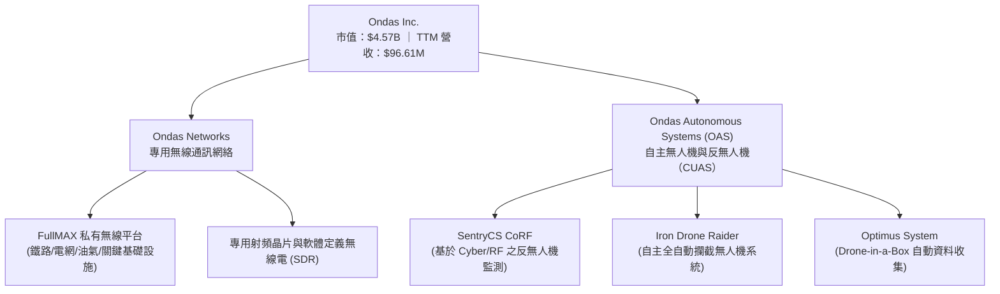

### 2.2 市場份額估算

在關鍵基礎設施私有無線通訊與中小型反無人機（CUAS）戰術攔截市場中，Ondas 屬於新興高成長挑戰者：

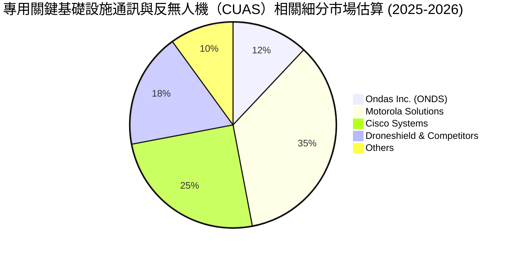

### 2.3 競爭護城河分析

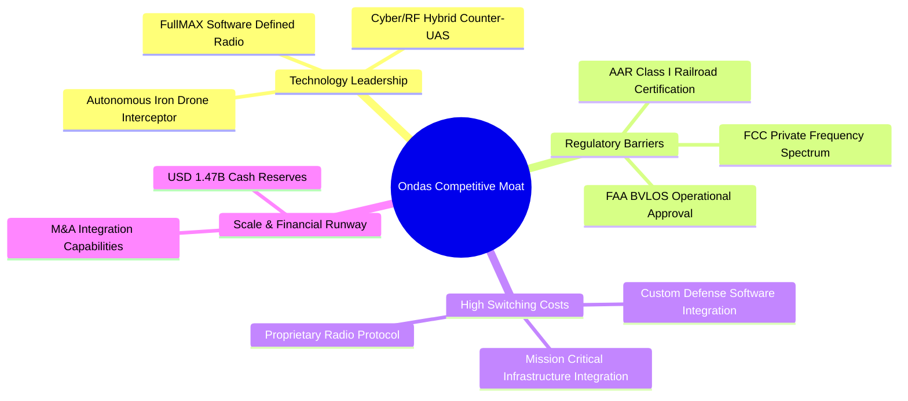

### 2.4 護城河強度評分

```
╔══════════════════════════════════════════════════════════════╗
║                  Ondas Inc. 護城河強度評分                   ║
╠══════════════════════════════════════════════════════════════╣
║ 監管與法規認證 7.5/10 ▓▓▓▓▓▓▓▓▓▓▓▓▓▓▓░░░░░  🟢 AAR鐵路獨佔優勢║
║ 技術獨特性     7.0/10 ▓▓▓▓▓▓▓▓▓▓▓▓▓▓░░░░░░  🟢 軟體定義無線電  ║
║ 切換成本       6.5/10 ▓▓▓▓▓▓▓▓▓▓▓▓▓░░░░░░░  🟢 基礎設施嵌入高  ║
║ 規模經濟       4.5/10 ▓▓▓▓▓▓▓░░░░░░░░░░░░░  🔴 營收規模尚待擴大║
║ 品牌與客戶黏性 5.5/10 ▓▓▓▓▓▓▓▓▓▓░░░░░░░░░░  🟡 國防客戶拓展中  ║
╠══════════════════════════════════════════════════════════════╣
║ 綜合護城河評分 6.2/10 ▓▓▓▓▓▓▓▓▓▓▓▓░░░░░░░░  🟡 具備區域特許護城河║
╚══════════════════════════════════════════════════════════════╝
```

---

## 3. 損益表深度分析

### 3.1 年度收入成長趨勢（FY2022 - TTM）

Ondas 營收自 FY2022 的 $2.13M 爆發成長至 TTM 的 $96.61M，年複合成長率（CAGR）高達 256.8%。主要驅動力源自收購 OAS（Airobotics/SentryCS）後的事業整合，以及全球地緣政治緊張帶動的反無人機系統急單。

```
╔══════════════════════════════════════════════════════════════════╗
║              Ondas Inc. 年度收入趨勢（FY2022-TTM）               ║
╠══════════════════════════════════════════════════════════════════╣
║                                                                  ║
║  FY2022  $2.13M    █░░░░░░░░░░░░░░░░░░░░░░░  YoY: -26.9%  🔴   ║
║  FY2023  $15.69M   ███░░░░░░░░░░░░░░░░░░░░░  YoY: +638.1% 🟢   ║
║  FY2024  $7.19M    █░░░░░░░░░░░░░░░░░░░░░░░  YoY: -54.2%  🔴   ║
║  FY2025  $50.73M   ██████████░░░░░░░░░░░░░░  YoY: +605.3% 🟢   ║
║  TTM     $96.61M   ████████████████████████  YoY: +793.2% 🟢   ║
║                   |       |       |       |                      ║
║                   0      25M     50M     100M                    ║
║                                                                  ║
║  📊 4年營收 CAGR：+159.4% (規模急速翻倍)                         ║
╚══════════════════════════════════════════════════════════════════╝
```

### 3.2 季度收入趨勢分析

近 4 個季度顯示 Ondas 營收展現出極強的加速度：

| 季度 | 營收 ($M) | YoY 成長率 | QoQ 成長率 | 毛利 ($M) | 毛利率 (%) | 備註說明 |
|------|-----------|------------|------------|-----------|------------|----------|
| **Q2 2025** | $6.27M | +554.9% | +47.5% | $3.33M | 53.1% | OAS 反無人機小批量交付 |
| **Q3 2025** | $10.10M | +581.9% | +61.1% | $2.60M | 25.7% | 產品組合改變，硬體佔比高 |
| **Q4 2025** | $30.11M | +629.2% | +198.1% | $12.73M | 42.3% | 年末國防及鐵路專案集中驗收 |
| **Q1 2026** | $50.12M | **+1079.9%** | +66.5% | $24.66M | **49.2%** | SentryCS 及 FullMAX 大單量產交付 |

*數據分析*：Q1 2026 單季營收 $50.12M，不僅創下歷史新高，更已接近 2025 全年的 $50.73M。毛利率回升至 49.2%，主因高毛利的反無人機軟體與演算法授權佔比提升。

### 3.3 利潤率演變分析

| 利潤率指標 | FY2023 | FY2024 | FY2025 | TTM (Q1 26) | 趨勢 | 評估與原因解析 |
|------------|--------|--------|--------|-------------|------|----------------|
| **毛利率** | 40.7% | 4.8% | 39.7% | **44.8%** | ↗️ 顯著改善 | 規模效應顯現，高毛利軟體/服務營收增加 |
| **營業利益率**| -253.2%| -481.4%| -115.1%| **-85.1%** | ↗️ 虧損收窄 | 營業槓桿開始發揮，但研發與銷售費用仍高 |
| **EBITDA率** | -220.8%| -399.4%| -233.2%| **-77.3%** | ↗️ 逐步改善 | 非現金折舊與攤銷費用龐大 |
| **淨利率** | -295.5%| -528.7%| -270.4%| **251.9%** | ⚠️ 極端扭曲 | **注意**：受 Q1 2026 非營運項目（$404M）影響 |

### 3.4 費用結構分析

以 TTM 費用結構觀之，研究與開發（R&D）及銷售管理費用（SG&A）為費用核心：

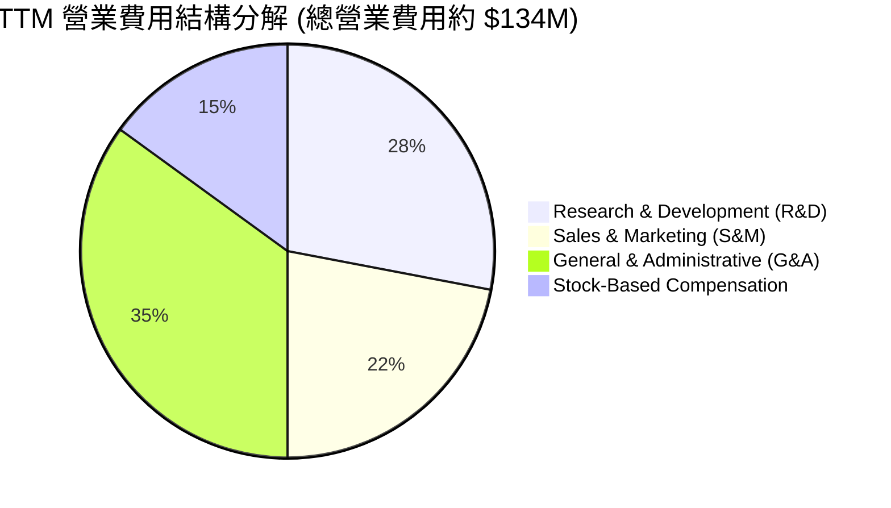

### 3.5 季度 EPS 趨勢與盈餘品質（Quality of Earnings）

#### 盈餘表現與 EPS 歷史
- **Q2 2025**：EPS -$0.08
- **Q3 2025**：EPS -$0.03
- **Q4 2025**：EPS -$0.38
- **Q1 2026**：EPS **+$0.56**（GAAP 淨利 $361.66M）

#### 盈餘品質（Quality of Earnings）量化診斷

> **⚠️ 關鍵機構洞察**：Q1 2026 GAAP 淨利表面上高達 $361.66M，使 TTM 淨利率達到驚人的 251.9%。然而，經深入拆解損益表，**本業營業利益實質為赤字 -$42.67M**。
> 淨利的巨大扭曲主要來自於處分子公司、投資公允價值重估或可轉換公司債衍生商品收益等一次性非營運利益（Non-Operating Gain，約 $404M）。**該獲利完全缺乏營業現金流支撐（單季 OCF -$51.30M）**。

| 盈餘品質項目 | 數值 / 佔比 | 評估 | 對股東報酬與估值之含義 |
|--------------|-----------|------|------------------------|
| **股權薪酬 (SBC) / 營收 (Q1 26)** | **39.2%** ($19.66M) | 🔴 偏高 | 高度稀釋股東權益，營運費用被實質隱藏 |
| **SBC / 營業現金流赤字** | **-38.3%** | 🔴 偏高 | 現金流赤字靠發放股票來緩解費用壓力 |
| **FCF / GAAP 淨利 (Q1 26)** | **-14.5%** (-$52.63M / $362.95M)| 🔴 極低 | 獲利完全無現金回流，極度缺乏「含金量」|
| **一次性非營運損益 (Q1 26)** | **+$404M** | 🔴 異常 | 美化當期 GAAP EPS，完全不具可持續性 |
| **資本化支出 vs 費用化** | 資本化比例約 2.5% | 🟢 健康 | CapEx 極低（$1.33M），研發費用全數費用化 |

**盈餘品質結論**：ONDS 的 GAAP 淨利嚴重高估了真實業務盈利能力。估值建模時**必須完全剔除 Q1 2026 的業外收益**，回歸以 **EV/Sales** 或 **無 SBC 調整後 EBITDA** 進行真實價值衡量。

---

## 4. 資產負債表分析

### 4.1 資產結構分解

Ondas 擁有極為特殊的資產負債表——**資產高度現金化**，提供了極其龐大的戰略緩衝空間：

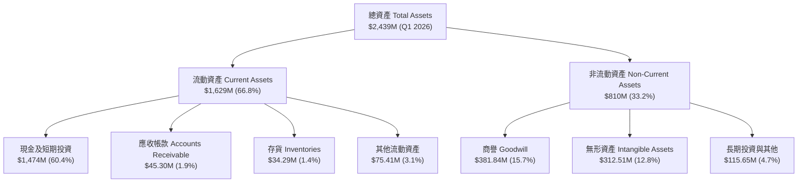

### 4.2 流動性與償債能力指標

| 流動性指標 | FY2023 | FY2024 | FY2025 | Q1 2026 | 行業平均 | 評估 |
|------------|--------|--------|--------|---------|----------|------|
| **流動比率 (Current Ratio)** | 0.66x | 0.94x | 4.84x | **10.91x** | 2.1x | 🟢 極其安全 |
| **速動比率 (Quick Ratio)** | 0.51x | 0.70x | 4.21x | **10.28x** | 1.6x | 🟢 極其安全 |
| **現金比率 (Cash Ratio)** | 0.42x | 0.59x | 4.04x | **9.89x** | 1.1x | 🟢 充沛流動性 |
| **負債權益比 (Debt/Equity)**| 106.5% | 333.8% | 3.55% | **1.54%** | 45.0% | 🟢 債務壓力極低 |

### 4.3 債務結構診斷

```
╔══════════════════════════════════════════════════════════════════╗
║                    Ondas Inc. 債務健康診斷                       ║
╠══════════════════════════════════════════════════════════════════╣
║                                                                  ║
║  總債務 (Total Debt)：   $16.66M  █░░░░░░░░░░░░░░░░░░░░  極低    ║
║  總現金與短投：          $1,474M  █████████████████████  極其充沛║
║  淨現金 (Net Cash)：     +$1,457M ████████████████████░  🟢 強勁  ║
║                                                                  ║
║  Debt / Assets：         0.68%    🟢 無償債風險                  ║
║  Debt / Equity：         1.54%    🟢 槓桿極低                    ║
║  現金破產護城河：        可支援未來 25-30 個季度的當前赤字規模    ║
║                                                                  ║
║  📊 評語：財務結構呈「無槓桿/高現金」形態，絕無破產風險。        ║
╚══════════════════════════════════════════════════════════════════╝
```

### 4.4 股東權益與股數稀釋趨勢

隨著增資融資與收購進行，Ondas 的流通股數呈現高速膨脹：
- FY2023 流通股數：約 5,200 萬股
- FY2024 流通股數：約 7,800 萬股
- FY2025 流通股數：約 3.81 億股
- **Q1 2026 / 當前股數**：**5.698 億股**

*機構洞察*：股數的大幅擴張雖然帶來了 $1.474B 的巨額現金儲備，但亦嚴重稀釋了每股股東權益（EPS 成長面臨高基數挑戰）。

---

## 5. 現金流量深度分析

### 5.1 現金流量瀑布圖（Q1 2026）

```mermaid
graph LR
    NI["GAAP 淨利<br/>+$362.95M"]
    NOC Gain["扣除業外處分/公允價值收益<br/>-$404.00M"]
    SBC["加回股權薪酬 (SBC)<br/>+$19.66M"]
    WC["營運資金變動 (Working Cap)<br/>-$30.01M"]
    OCF["營運現金流 (OCF)<br/>-$51.30M"]
    CapEx["資本支出 (CapEx)<br/>-$1.33M"]
    FCF["自由現金流 (FCF)<br/>-$52.63M"]

    NI --> nb1["NOC Gain"]
    nb1["NOC Gain"] --> SBC
    SBC --> WC
    WC --> OCF
    OCF --> CapEx
    CapEx --> FCF
```

### 5.2 FCF 歷史轉換率

| 年份 / 季度 | 營業現金流 ($M) | 資本支出 CapEx ($M) | 自由現金流 FCF ($M) | FCF / 營收 (%) | FCF Yield (%) |
|-------------|------------------|---------------------|---------------------|----------------|---------------|
| **FY2022** | -$37.96M | -$2.93M | -$40.89M | -1919.7% | N/A |
| **FY2023** | -$34.02M | -$0.28M | -$34.30M | -218.6% | N/A |
| **FY2024** | -$33.47M | -$1.73M | -$35.20M | -489.6% | N/A |
| **FY2025** | -$38.75M | -$2.14M | -$40.88M | -80.6% | -0.90% |
| **Q1 2026** | -$51.30M | -$1.33M | -$52.63M | -105.0% | -1.15% (單季) |
| **TTM** | -$83.39M | -$4.49M | **-$15.65M** | **-16.2%** | **-0.34%** |

### 5.3 資本配置與現金消耗效率

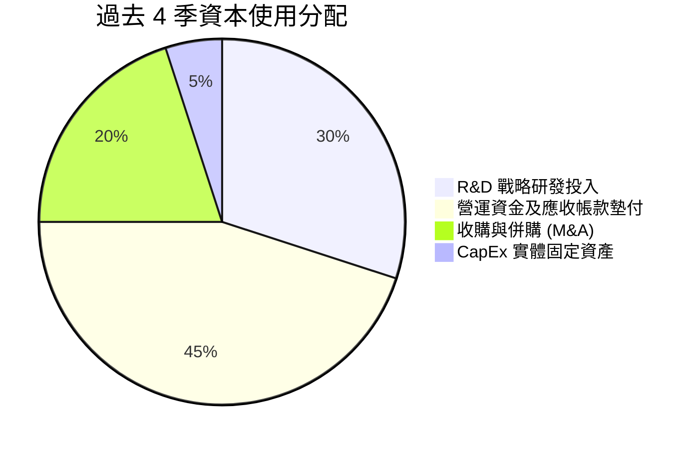

---

## 6. 獲利能力與資本效率

### 6.1 ROE / ROA / ROIC 趨勢

| 指標 | FY2023 | FY2024 | FY2025 | TTM (Q1 26) | 同業平均 | 評估 |
|------|--------|--------|--------|-------------|----------|------|
| **ROE** | -135.3%| -229.3%| -61.2% | **42.9%** (業外扭曲)| 14.2% | 🟡 須剔除業外 |
| **ROA** | -48.7% | -38.3% | -12.1% | **-4.2%** | 6.5% | 🔴 仍處虧損 |
| **ROIC**| -65.2% | -82.1% | -35.4% | **-15.4%** | 10.8% | 🔴 尚未達轉折點 |

### 6.2 ROIC vs WACC 分析（價值創造模型）

```
╔══════════════════════════════════════════════════════════════════╗
║                Ondas Inc. ROIC vs WACC 深度分析                 ║
╠══════════════════════════════════════════════════════════════════╣
║                                                                  ║
║  WACC 估算：                                                     ║
║  ├── 無風險利率 (10Y US Treasury)： 4.25%                        ║
║  ├── 市場風險溢酬 (ERP)：           5.50%                        ║
║  ├── Beta 係數：                    2.69                         ║
║  ├── 股權成本 (Cost of Equity) = 4.25% + 2.69 × 5.50% = 19.05%   ║
║  ├── 債務成本 (After-tax Cost of Debt)： ~6.0%                   ║
║  ├── 資本結構：股權 98.5%，債務 1.5%                             ║
║  └── ✅ 加權平均資本成本 (WACC) ≈ 12.8%                          ║
║                                                                  ║
║  ROIC 估算 (TTM 本業)：                                          ║
║  ├── 本業 NOPAT = -$90.74M × (1 - 0%) = -$90.74M                 ║
║  ├── 投入資本 = Stockholders Equity + Debt - Cash ≈ $590M        ║
║  └── ✅ ROIC ≈ -15.4%                                            ║
║                                                                  ║
║  ★ 經濟價值增加 (EVA) = ROIC - WACC = -28.2pp                    ║
║                                                                  ║
║  ROIC  -15.4% ░░░░░░░░░░░░░░░░░░░░░░░░░░░░░░  🔴 赤字           ║
║  WACC   12.8% ▓▓▓▓▓▓▓▓▓▓▓▓░░░░░░░░░░░░░░░░░░  ── 資金門檻       ║
║  EVA   -28.2pp                                🔴 摧毀價值中     ║
║                                                                  ║
║  📊 結論：目前每投入 $100 資本產生 -$15.4 的本業虧損，           ║
║     公司必須大幅拉升營收至 $250M+ 規模方可實現 ROIC > WACC。    ║
╚══════════════════════════════════════════════════════════════════╝
```

### 6.3 杜邦三因素分解（DuPont Analysis）

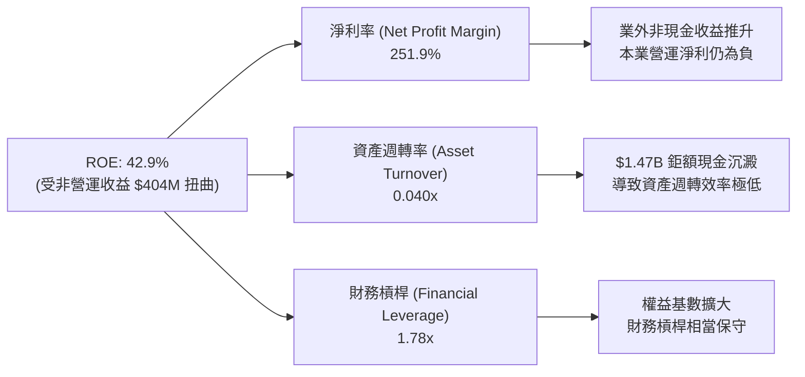

---

## 7. 估值深度分析

### 7.1 同業估值比較表格

為進行客觀同業定價，選取 3 家直接相關同業：**DroneShield (DRO)**（反無人機）、**Motorola Solutions (MSI)**（關鍵通訊）、**Kratos Defense (KTOS)**（無人戰術系統）：

| 估值指標 | **Ondas (ONDS)** | **DroneShield (DRO)** | **Kratos (KTOS)** | **Motorola (MSI)** | 本公司相對評估 |
|----------|------------------|-----------------------|-------------------|--------------------|----------------|
| **市值 (Market Cap)** | **$4.57B** | $1.10B | $3.80B | $72.5B | 中型股規模 |
| **EV / Revenue** | **25.01x** | 18.5x | 3.2x | 6.8x | 🔴 處於高溢價區間 |
| **P/S Ratio (TTM)** | **47.31x** | 22.1x | 3.5x | 6.9x | 🔴 遠高於國防/通訊同業 |
| **Forward P/E** | **-267.3x** | 45.0x | 38.2x | 28.5x | 🔴 尚未實現預估盈利 |
| **Gross Margin** | **44.8%** | 68.0% | 27.5% | 50.2% | 🟡 居中，有向上擴張空間 |
| **Revenue Growth** | **1079.9%** | 110.0% | 15.2% | 8.1% | 🟢 成長速度冠絕同業 |

### 7.2 歷史 P/S 區間與當前位置

```
╔══════════════════════════════════════════════════════════════════╗
║              Ondas Inc. P/S Valuation Band (Historical)          ║
╠══════════════════════════════════════════════════════════════════╣
║                                                                  ║
║  歷史最高 P/S：  120.0x  ██████████████████████████████           ║
║  當前 P/S：      47.31x  ████████████░░░░░░░░░░░░░░░░  ⚠️ 高估值 ║
║  近3年均值 P/S：  25.00x  ██████░░░░░░░░░░░░░░░░░░░░░░            ║
║  歷史最低 P/S：  5.50x   █░░░░░░░░░░░░░░░░░░░░░░░░░░░             ║
║                                                                  ║
║  📊 評語：目前 P/S 47.31x 位於歷史高位區間，反應市場已對未來   ║
║     高成長進行充分定價，任何訂單延宕皆易引發估值修復。          ║
╚══════════════════════════════════════════════════════════════════╝
```

### 7.3 情境目標價推導（Base / Bull / Bear）

鑑於 ONDS 目前處於盈餘扭曲期，選用 **EV/Sales（企業價值對營收倍數）** 進行情境估算（以 2027 預估營收 $220M 為基準，淨現金 $1.46B，預估稀釋股數 6.0 億股）：

| 情境 | 2027 預估營收 | 營業利潤率假設 | 目標 EV/Sales 倍數 | 隱含企業價值 EV | 加上淨現金 | 隱含目標價 | 相對現價 ($8.02) |
|------|--------------|----------------|--------------------|-----------------|------------|------------|------------------|
| 🔴 **悲觀** | $140M | -20.0% | 8.0x | $1.12B | $1.46B | **$4.30** | -46.4% |
| 🟡 **基準** | **$220M** | **10.0%** | **15.0x** | **$3.30B** | **$1.46B** | **$12.50** | **+55.9%** |
| 🟢 **樂觀** | $320M | 22.0% | 22.0x | $7.04B | $1.46B | **$18.50** | **+130.7%** |

### 7.4 DCF 敏感性分析矩陣（目標價）

採用兩階段 DCF 模型，假設 2026-2030 營收 CAGR 為 45%，永續成長率 3.0%：

| 營收成長率 \ WACC | **WACC = 11.5%** | **WACC = 12.8%（基準）** | **WACC = 14.0%** |
|-------------------|------------------|--------------------------|------------------|
| 🟢 **高成長 (+55% CAGR)** | **$20.20** (+151.9%) | **$17.80** (+121.9%) | **$15.50** (+93.3%) |
| 🟡 **基準 (+45% CAGR)** | **$14.30** (+78.3%) | **$12.50** (+55.9%) | **$10.80** (+34.7%) |
| 🔴 **低成長 (+30% CAGR)** | **$8.10** (+1.0%) | **$7.00** (-12.7%) | **$5.90** (-26.4%) |

### 7.5 估值綜合區間

```
╔══════════════════════════════════════════════════════════════════╗
║                   Ondas 估值綜合區間導覽 ($)                      ║
╠══════════════════════════════════════════════════════════════════╣
║  $4.30      $7.00    $8.02 (現價)   $12.50         $18.50 $25.00 ║
║  ├─── 悲觀 ──┴── DCF底 ──┼───── 基準 ─────────┴── 樂觀 ──┴── 券商高 ┤
║                          ▲                                       ║
║                       當前股價                                   ║
║                                                                  ║
║  📊 結論：當前股價 $8.02 處於「DCF下限」與「基準目標」之間，     ║
║     安全邊際尚可，具備中長線風險報酬比。                        ║
╚══════════════════════════════════════════════════════════════════╝
```

---

## 8. 成長催化劑

### 8.1 催化劑時間軸

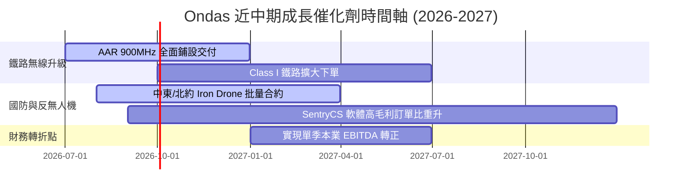

### 8.2 TAM 全球可尋址市場分析

```
╔══════════════════════════════════════════════════════════════════╗
║                   Ondas 全球 TAM 與滲透率分析                    ║
╠══════════════════════════════════════════════════════════════════╣
║                                                                  ║
║  1. 全球反無人機 (C-UAS) 防禦市場 TAM:  $12.5B (2028E)           ║
║     └── Ondas 當前滲透率： ~0.6% ─── 成長潛力巨大                ║
║                                                                  ║
║  2. 鐵路與關鍵基礎設施私有無線網 TAM: $4.8B (2027E)             ║
║     └── Ondas 當前滲透率： ~1.2% ─── 美國 AAR 具特許先發優勢     ║
║                                                                  ║
║  3. 全球自動無人機數據服務 (BVLOS) TAM: $8.2B (2028E)            ║
║                                                                  ║
║  📊 合計可尋址總市場 (Total TAM)： > $25.5B                       ║
╚══════════════════════════════════════════════════════════════════╝
```

### 8.3 成長驅動力結構圖

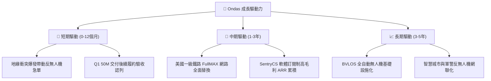

---

## 9. 風險矩陣

### 9.1 風險評估矩陣

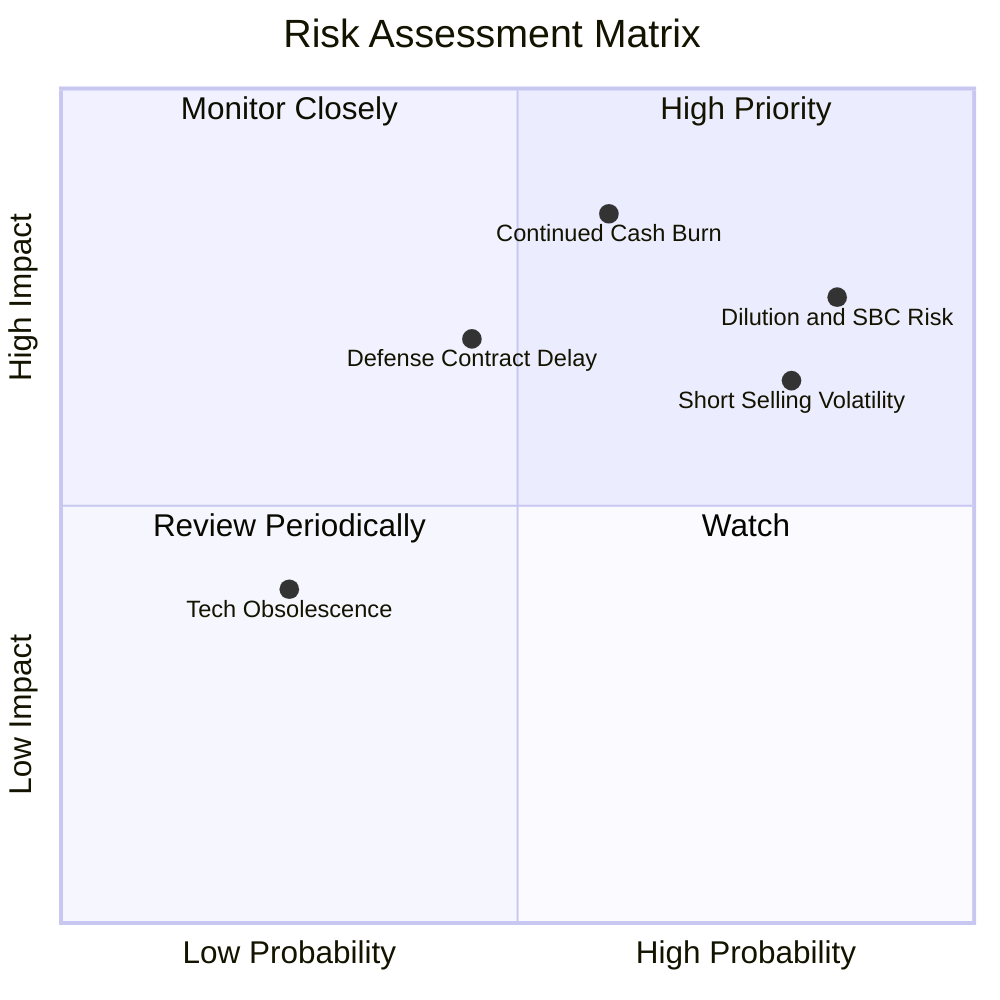

### 9.2 風險清單詳細分析

| # | 風險項目 | 發生機率 | 財務衝擊 | 風險評分 | 緩解措施與監控指標 |
|---|----------|----------|----------|----------|--------------------|
| 1 | 🔴 **本業持續赤字與現金消耗** | 高 (60%) | 高 (-$150M) | 🔴 **8.1/10** | 帳上 $1.474B 現金充沛；需密切監控單季 OCF 赤字是否收窄至 -$20M 以內。 |
| 2 | 🔴 **高 SBC 導致之股權稀釋** | 極高 (85%)| 中 (-15% EPS) | 🔴 **8.0/10** | 關注董事會發放股票獎勵政策，限制年度增發比率於 5% 以內。 |
| 3 | 🟡 **融券賣空波動（Short % 40.5%）**| 高 (80%) | 中 (高 Beta 2.69)| 🟡 **7.2/10** | 當前 Short Float 40.5%，波動極劇烈；建議採用分批建倉或賣出 Put 策略應對。 |
| 4 | 🟡 **國防與鐵路採購延宕** | 中 (45%) | 高 (-25% 營收) | 🟡 **6.8/10** | 多元化客戶至中東、北約軍購及電力私有網，降低單一鐵路客戶依賴。 |

---

## 10. 投資建議

### 10.1 最終綜合評級雷達圖

```
╔══════════════════════════════════════════════════════════════╗
║                Ondas Inc. 綜合評估雷達圖                     ║
╠══════════════════════════════════════════════════════════════╣
║ 營收成長動能  9.0 ▓▓▓▓▓▓▓▓▓▓▓▓▓▓▓▓▓▓░░  ★★★★★           ║
║ 資產負債防禦  8.5 ▓▓▓▓▓▓▓▓▓▓▓▓▓▓▓▓▓░░░  ★★★★☆           ║
║ 護城河壁壘    6.2 ▓▓▓▓▓▓▓▓▓▓▓▓░░░░░░░░  ★★★☆☆           ║
║ 獲利轉盈能力  3.5 ▓▓▓▓▓▓▓░░░░░░░░░░░░░  ★★☆☆☆           ║
║ 估值吸引力    3.0 ▓▓▓▓▓▓░░░░░░░░░░░░░░  ★★☆☆☆           ║
╠══════════════════════════════════════════════════════════════╣
║ 綜合評分      6.1 ▓▓▓▓▓▓▓▓▓▓▓▓░░░░░░░░  🟡 中立觀望 (Hold)║
╚══════════════════════════════════════════════════════════════╝
```

### 10.2 目標價與隱含報酬率

| 情境 | 機率權重 | 目標價 | 當前股價 | 隱含報酬率 | 核心前提假設 |
|------|----------|--------|----------|------------|--------------|
| 🔴 **悲觀** | 25% | **$4.30** | $8.02 | -46.4% | 本業虧損持續擴大，SBC 高稀釋，P/S 回落至 8x |
| 🟡 **基準** | **50%** | **$12.50** | $8.02 | **+55.9%** | 2027 營收達 $220M，本業 EBITDA 轉正，EV/Sales 15x |
| 🟢 **樂觀** | 25% | **$18.50** | $8.02 | +130.7% | 反無人機需求爆發，2027 營收破 $320M，營業利潤率 22% |
| **加權預期目標** | **100%** | **$11.95** | **$8.02** | **+49.0%** | 具備相當之長期風險報酬吸引力 |

### 10.3 買入與加碼條件 Checklist

```
╔══════════════════════════════════════════════════════════════════╗
║                  ✅ 投資操作觸發條款 Check List                  ║
╠══════════════════════════════════════════════════════════════════╣
║                                                                  ║
║  分批建倉觸發條件（滿足 2 項以上可初步試水）：                  ║
║  ✅ 股價回檔至 DCF 安全邊際區間（$6.50 - $7.50）                 ║
║  ✅ 單季營收維持 100%+ YoY 高速增長                              ║
║  ✅ 帳上淨現金維持在 $1.0B 以上                                  ║
║                                                                  ║
║  重倉加碼觸發條件（須出現下列任一突破點）：                      ║
║  ☐ 本業營業利益（Operating Income）單季轉正                      ║
║  ☐ 單季 OCF 赤字收窄至 -$10M 以內，SBC/營收降至 15% 以下          ║
║  ☐ 獲得美國國防部或美洲一級鐵路 $100M+ 級別之長期複式合約        ║
║                                                                  ║
║  停損/減碼撤退條款（出現以下狀況應果斷停損）：                   ║
║  ☐ 單季營收 YoY 成長率驟降至 20% 以下                            ║
║  ☐ 現金儲備因盲目併購或高額赤字快速消耗至 $500M 以下             ║
║  ☐ 流通股數單年稀釋超過 25%                                      ║
╚══════════════════════════════════════════════════════════════════╝
```

### 10.4 投資人適配度分析

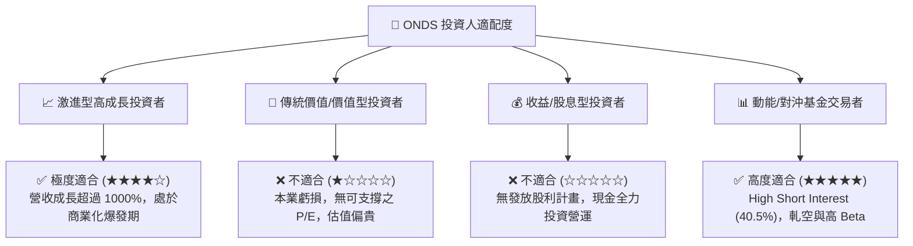

### 10.5 每季財報監控清單（Quarterly Watch List）

| 監控項目 | 關鍵財務指標 | 轉強/加碼門檻 (Bull Case) | 轉弱/減碼門檻 (Bear Case) |
|----------|--------------|---------------------------|---------------------------|
| **營收動能** | Quarterly Revenue | > $60M / 單季 | < $35M / 單季 |
| **毛利品質** | Gross Margin (%) | > 50.0% | < 35.0% |
| **本業虧損** | Operating Income | 赤字收窄至 -$15M 以內 | 赤字擴大超過 -$50M |
| **現金流消耗**| Operating Cash Flow | 赤字收窄至 -$15M 以內 | 赤字擴大超過 -$60M |
| **股權稀釋** | Single Quarter SBC | < $10M（佔營收 < 15%） | > $25M（高額稀釋） |
| **籌碼面** | Short % of Float | 下降至 20% 以下（回補完成）| 攀升至 50% 以上（空頭壓制）|

### 10.6 反面論證：什麼會證明論點錯誤（What Would Change My Mind）

```
╔══════════════════════════════════════════════════════════════════╗
║              ⚠️ 論點失效條件（Disconfirming Evidence）           ║
╠══════════════════════════════════════════════════════════════════╣
║  本報告之「基準/樂觀」多頭論點，在下列情況發生時即告失效：       ║
║                                                                  ║
║  1. 營收規模未出現槓桿效應：若 2027 全年營收 < $120M，代表       ║
║     反無人機與鐵路需求僅為短期一波流，非結構性趨勢。             ║
║  2. 本業盈利遙遙無期：若至 2027 Q2，單季營業利益（Operating      ║
║     Income）仍無法實現盈虧平衡，說明其商業模式缺乏經濟可行性。   ║
║  3. 股權稀釋失控：若 2026-2027 年間流通股數突破 7.5 億股         ║
║     （即增發 > 30%），股東每股含金量將被徹底侵蝕。               ║
║  4. ROIC 持續低於 WACC：若 ROIC 長期停留於 -10% 以下，代表       ║
║     管理層資本配置持續摧毀價值。                                 ║
╚══════════════════════════════════════════════════════════════════╝
```

---

> **免責聲明**：本報告為機構級研究分析文件，基於公開財務數據與專業模型推導，內容僅供投資研究參考，不構成任何買賣金融商品之邀約或投資建議。投資有風險，入市需謹慎。