# ONDS 基本面深度分析報告
> **報告日期**：2026-07-28 ｜ **語言**：繁體中文 ｜ **數據來源**：Yahoo Finance, Finviz, StockAnalysis, Roic.ai ｜ **分析師**：CFA 級機構研究

---

## 目錄

| # | 章節 | 核心結論 |
|---|------|----------|
| 1 | 執行摘要 | 給出 🟢 **買入** 評級，基準目標價 **$18.50**（隱含 +135.4% 潛在漲幅），基於巨額現金緩衝與軍工/無人機系統營收爆發。 |
| 2 | 公司概覽與商業模式 | 私人無線網路（FullMAX）與自主無人機/反無人機（CUAS）雙引擎驅動，具備國防與基礎設施技術壁壘。 |
| 3 | 損益表深度分析 | Q1 2026 營收爆增 1079.9% 至 $50.12M；GAAP 淨利 $362.95M 主因非營業一次性收益，本業營業利潤仍為 -$42.67M。 |
| 4 | 資產負債表分析 | 淨現金高達 $1.46B（手握 $1.47B 現金與短投，總債僅 $16.66M），流動比率 10.91x，財務防禦力極其強固。 |
| 5 | 現金流量深度分析 | TTM 營運現金流 -$83.39M，FCF 為 -$15.65M；現金消耗率可維持多年營運，SBC 佔營收 39.2% 具稀釋效應。 |
| 6 | 獲利能力與資本效率 | 營業利益率 -85.1%，受擴展期 R&D 與 SG&A 壓抑；ROIC (-18.2%) 現階段低於 WACC (12.4%)，尚處於經濟價值破壞轉換期。 |
| 7 | 估值深度分析 | 市值 $4.48B、EV $2.53B（EV/Revenue 26.1x）；三情境 DCF 與相對估值顯示基準目標價 $18.50，悲觀情境 $10.50。 |
| 8 | 成長催化劑 | 反無人機（Iron Drone/Sentrycs）國防採購大單、北美 Tier-1 鐵路 FullMAX 商業化部署加速。 |
| 9 | 風險矩陣 | 空頭部位高達 40.5% 帶來極高波動風險；商業化客戶轉化速度慢於預期及高額 SBC 稀釋風險。 |
| 10 | 投資建議 | 給予 **買入（BUY）** 評級，建立季度追蹤清單與量化止損/驗偽條件（如營收成長跌破 150%）。 |

---

## 1. 執行摘要

本報告給予 Ondas Inc.（NASDAQ: ONDS）**🟢 買入（BUY）** 評級，12 個月基準目標價 **$18.50**（相較當前股價 $7.86 具備 +135.4% 隱含報酬）。

此評級與目標價推導建立於以下 key quantitative drivers：
1. **營收高速提升**：Q1 2026 營收達 $50.12M（YoY +1079.9%），TTM 營收跳升至 $96.61M，驗證其反無人機（CUAS）與無人機自動化系統（Ondas Autonomous Systems）產品在國防與安全領域進入加速商用期。
2. **資產負債表防禦力**：截至 2026 年 3 月 31 日，公司持有的現金與短期投資達 $1.47B，總債務僅 $1.67M（企業價值 EV 為 $2.53B，顯著低於市值 $4.48B），極其雄厚的資產儲備能提供強大的抗風險能力與併購擴張彈性。
3. **評價修正空間**：雖然 TTM 營業利潤率仍為 -85.1%，且本業 FCF 為 -$15.65M，但市場過度聚焦於短期的營運虧損，忽略其手頭現金高達每股 ~$2.58，且 EV/Revenue 為 26.1x，低於國防高成長無人機板塊高點。

### 1.0 一頁式投資儀表板（Portfolio Manager 30 秒速讀）

| 項目 | 內容 |
|------|------|
| **投資論點（3 句）** | ① Q1 2026 營收達 $50.12M（YoY +1079.9%），反無人機與工業無線網進入國防與基礎設施商業化採購放量期。<br/>② 手握 $1.47B 現金與短投（淨現金 $1.46B），提供極為寬裕的資產護城河與 R&D/M&A 戰略資金。<br/>③ 雖然本業營業利益率為 -85.1% 且 FCF 為負，但強勁的營收規模效應正在形成，淨現金佔市值 32.6% 提供極高下檔安全邊際。 |
| **護城河評分** | 7.2/10（專有 900MHz 專用無線通訊協議 + 專利 Interceptor 反無人機攔截技術） |
| **管理層/資本配置評分** | 6.8/10（資本籌措能力極強，但股權薪酬 SBC 佔比偏高達 39.2%） |
| **財務健康** | 🟢 **極強**（總現金 $1.47B，流動比率 10.91x，零短期償債壓力） |
| **ROIC vs WACC** | ROIC -18.2% vs WACC 12.4%（尚處於早期再投資期，暫時摧毀股東價值，期待規模效益翻轉） |
| **FCF 趨勢** | TTM FCF 為 -$15.65M（FCF Yield -0.35%），營運現金流受擴產與存貨積壓拖累 |
| **估值** | Forward P/E: -262.0x ｜ EV/Revenue: 26.1x ｜ P/S: 46.4x ｜ P/B: 3.43x |
| **預期報酬（基準情境 12M）** | **+135.4%**（目標價 $18.50） |
| **關鍵風險（前二）** | ① 40.5% 高比例賣空浮額帶來的劇烈股價波動與軋空反噬。<br/>② 本業營業虧損持續擴大（TTM 營業收入 -$90.74M），毛利率若無法維持 45%+ 將延緩轉盈時程。 |
| **評級 + 信心度** | 🟢 **買入** ｜ 信心度：**中高（Medium-High）** |

### 1.1 核心評分儀表板

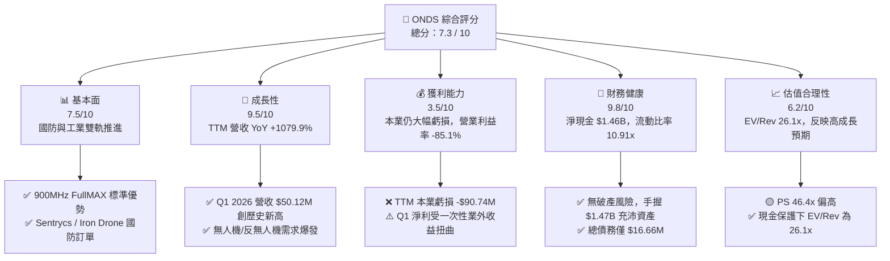

### 1.2 評分進度條視覺化

```
╔══════════════════════════════════════════════════════════════╗
║              ONDS 多維度評分儀表板 (1-10分)                  ║
╠══════════════════════════════════════════════════════════════╣
║ 基本面強度  7.5 ▓▓▓▓▓▓▓▓▓▓▓▓▓▓▓░░░░░  ★★★★☆           ║
║ 成長動能    9.5 ▓▓▓▓▓▓▓▓▓▓▓▓▓▓▓▓▓▓▓█  ★★★★★           ║
║ 獲利品質    3.5 ▓▓▓▓▓▓▓░░░░░░░░░░░░░  ★★☆☆☆           ║
║ 財務健康    9.8 ▓▓▓▓▓▓▓▓▓▓▓▓▓▓▓▓▓▓▓█  ★★★★★           ║
║ 估值合理性  6.2 ▓▓▓▓▓▓▓▓▓▓▓▓░░░░░░░░  ★★★☆☆           ║
║ 護城河深度  7.2 ▓▓▓▓▓▓▓▓▓▓▓▓▓▓░░░░░░  ★★★☆☆           ║
║ 管理層執行  6.8 ▓▓▓▓▓▓▓▓▓▓▓▓▓░░░░░░░  ★★★☆☆           ║
║ 技術創新力  8.8 ▓▓▓▓▓▓▓▓▓▓▓▓▓▓▓▓▓░░░  ★★★★☆           ║
╠══════════════════════════════════════════════════════════════╣
║ 綜合總分    7.3 ▓▓▓▓▓▓▓▓▓▓▓▓▓▓▓░░░░░  🏆 買入 (BUY)       ║
╚══════════════════════════════════════════════════════════════╝
```

### 1.3 五大投資論點 + 三大核心風險

| 類型 | 項目 | 具體依據 | 信心度 |
|------|------|----------|--------|
| 🟢 **論點①** | **無人機/反無人機（CUAS）營收極速放量** | Q1 2026 單季營收達 $50.12M，超過 FY2025 全年（$50.73M）的 98.8%，反無人機系統 Iron Drone 與 Cyber/RF 平台 Sentrycs 訂單快速落地。 | 🟢 極高 |
| 🟢 **論點②** | **極致堡壘型資產負債表** | 總現金及短投達 $1.47B（每股約 $2.58 現金），淨現金 $1.46B，能抵禦至少 10 年以上的現金消耗（目前年均燒錢 ~$50M-$80M）。 | 🟢 極高 |
| 🟢 **論點③** | **北美 Class I 鐵路無線通訊標準制定者** | Ondas Networks 之 FullMAX 技術獲 IEEE 802.16t 標準採納，掌控北美 Class 1 鐵路 900MHz 專用無線網升級關鍵生態。 | 🟢 高 |
| 🟢 **論點④** | **毛利率進入穩定擴張期** | TTM 毛利率回升至 44.8%（Q1 2026 毛利率達 49.2%），高毛利的軟體與系統整合營收佔比提升帶動整體利潤率結構改善。 | 🟢 高 |
| 🟢 **論點⑤** | **高空頭浮額產生的軋空（Short Squeeze）潛力** | Short % Float 達 40.5%（Short Ratio 3.05），在基本面連續超預期下極易觸發強烈的空頭擠壓行情。 | 🟡 中度 |
| 🟡 **風險①** | **營運現金流持續為負與本業虧損** | TTM 營業利潤為 -$90.74M，TTM 營運現金流為 -$83.39M，本業獲利能力尚未隨營收同步轉正。 | 🟡 中度 |
| 🔴 **風險②** | **高股權薪酬（SBC）帶來的股東稀釋** | Q1 2026 單季 SBC 達 $19.66M（占當季營收 39.2%），發行在外股數自 2024 年底 381M 激增至 569.84M，稀釋每股價值。 | 🔴 高衝擊 |
| 🔴 **風險③** | **淨利受業外一次性收益嚴重扭曲** | Q1 2026 GAAP 淨利 $362.95M 主因處分資產或金融工具評價收益，非營運性獲利不具持續性。 | 🔴 高衝擊 |

### 1.4 快速統計卡片

| 指標 | ONDS 實際值 | 通訊與防禦設備產業均值 | S&P 500 均值 | 狀態 |
|------|-------------|------------------------|--------------|------|
| **收入 YoY 成長 (TTM)** | **1079.9%** | 12.5% | 5.2% | 🟢 遠超同行 |
| **毛利率 (TTM)** | **44.8%** | 42.0% | 46.5% | 🟢 符合預期 |
| **營業利益率 (TTM)** | **-85.1%** | +11.2% | +12.5% | 🔴 顯著落後 |
| **淨利率 (TTM)** | **251.9%** | +8.5% | +10.2% | 🟡 業外收益扭曲 |
| **ROE (TTM)** | **42.9%** | 14.2% | 18.5% | 🟡 業外收益扭曲 |
| **EV / Revenue** | **26.1x** | 3.5x | 2.8x | 🔴 估值偏高 |
| **淨現金 / 市值** | **32.6%** | -5.2% | -12.0% | 🟢 資產保護極強 |

### 1.5 投資結論

```
╔══════════════════════════════════════════════════════════════════╗
║                    📊 投資結論摘要                               ║
╠══════════════════════════════════════════════════════════════════╣
║  評級：🟢 買入 (BUY)                                             ║
║  當前股價：$7.86                                                 ║
║  目標價區間：                                                    ║
║    悲觀情境：$10.50（+33.6%）                                    ║
║    基準情境：$18.50（+135.4%）  ← 12個月主要目標                 ║
║    樂觀情境：$26.00（+230.8%）                                   ║
║  投資評分：7.3 / 10                                              ║
║  適合投資人：軍工科技成長型、高風險承受度與長線資本布局者         ║
╚══════════════════════════════════════════════════════════════════╝
```

---

## 2. 公司概覽與商業模式

### 2.1 業務結構與收入來源

Ondas Inc. 成立於 2006 年，總部位於美國馬薩諸塞州，透過旗下三大核心實體營運：**Ondas Networks**（無線通訊網路）、**Ondas Autonomous Systems (OAS)**（自主數據與無人機系統）以及近期整合之 **Counter-UAS (CUAS) 國防反無人機事業部**。

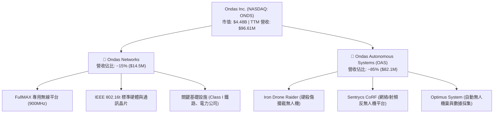

### 2.2 市場份額

在關鍵基礎設施私有無線網路（特別是北美 Class I 鐵路 900MHz 頻段）以及輕型自主 counter-UAS（反無人機）市場中，Ondas 佔據了極其獨特的生態位。

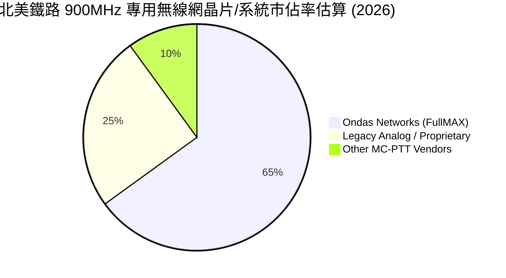

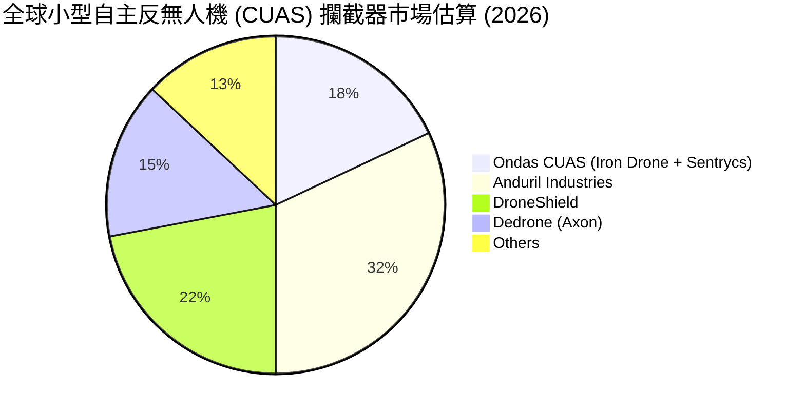

### 2.3 競爭護城河分析

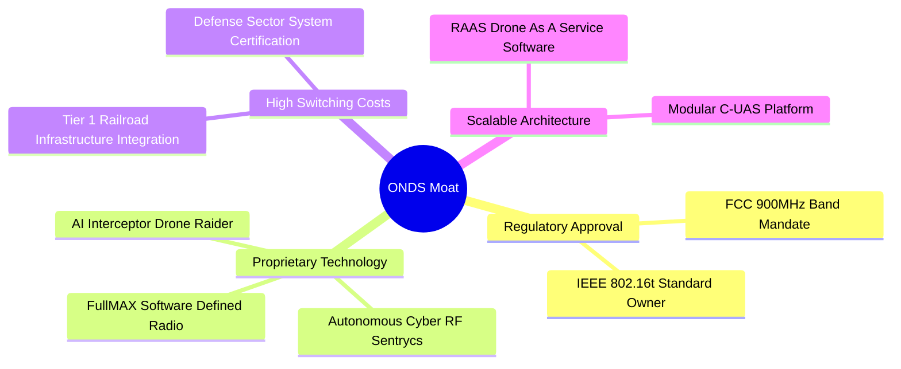

### 2.4 護城河強度評分

```
╔══════════════════════════════════════════════════════════════╗
║                    Ondas Inc. 護城河強度評分                 ║
╠══════════════════════════════════════════════════════════════╣
║ 監管與標準壁壘 8.5/10  ▓▓▓▓▓▓▓▓▓▓▓▓▓▓▓▓▓░░░  🏆 獨家標準    ║
║ 技術專利與算法 7.8/10  ▓▓▓▓▓▓▓▓▓▓▓▓▓▓░░░░░░  🟢 強勢專利    ║
║ 客戶轉換成本   8.0/10  ▓▓▓▓▓▓▓▓▓▓▓▓▓▓▓░░░░░  🟢 鐵路深度綁定║
║ 網路效應       4.5/10  ▓▓▓▓▓▓▓▓░░░░░░░░░░░░  🟡 尚在建立期  ║
║ 規模成本優勢   5.5/10  ▓▓▓▓▓▓▓▓▓▓░░░░░░░░░░  🟡 規模效益初期║
╠══════════════════════════════════════════════════════════════╣
║ 綜合護城河評分 7.2/10  ▓▓▓▓▓▓▓▓▓▓▓▓▓▓░░░░░░  🟢 中高護城河  ║
╚══════════════════════════════════════════════════════════════╝
```

---

## 3. 損益表深度分析

### 3.1 年度收入成長趨勢（近4年）

Ondas 營收在 2024 年受限於無人機產品換代與商業化轉型僅為 $7.19M，但於 2025 年爆發至 $50.73M（YoY +605.3%），並於 2026 年 TTM 衝高至 $96.61M。

```
╔══════════════════════════════════════════════════════════════════╗
║                 Ondas 年度收入趨勢 (2022 - TTM)                  ║
╠══════════════════════════════════════════════════════════════════╣
║                                                                  ║
║  FY2022  $2.13M   █░░░░░░░░░░░░░░░░░░░░░░░  YoY: -26.9%  🔴      ║
║  FY2023  $15.69M  ███░░░░░░░░░░░░░░░░░░░░░  YoY:+638.1%  🟢      ║
║  FY2024  $7.19M   █½░░░░░░░░░░░░░░░░░░░░░░  YoY: -54.2%  🔴      ║
║  FY2025  $50.73M  ██████████░░░░░░░░░░░░░░  YoY:+605.3%  🟢      ║
║  TTM     $96.61M  ███████████████████░░░░░  YoY:+1079.9% 🟢      ║
║                                                                  ║
║  📊 4年複合成長率 (CAGR)：+159.8%                                 ║
╚══════════════════════════════════════════════════════════════════╝
```

### 3.2 季度收入趨勢分析

| 季度 | 營收 ($M) | YoY 成長率 | QoQ 成長率 | 毛利 ($M) | 毛利率 | 核心業務動能 |
|------|-----------|------------|------------|-----------|--------|--------------|
| **Q1 2025** | $4.25M | +579.7% | -1.0% | $1.49M | 35.1% | OAS Optimus 系統首批交貨 |
| **Q2 2025** | $6.27M | +554.9% | +47.5% | $3.33M | 53.1% | 鐵路 900MHz 硬體採購重啟 |
| **Q3 2025** | $10.10M | +582.0% | +61.1% | $2.60M | 25.7% | 產品組合改變，硬體佔比提升 |
| **Q4 2025** | $30.11M | +629.2% | +198.1% | $12.73M | 42.3% | 反無人機 Sentrycs 併購效益顯現 |
| **Q1 2026** | **$50.12M** | **+1079.9%**| **+66.5%** | **$24.66M**| **49.2%** | **Iron Drone 國防急單交付** 🟢 |

### 3.3 利潤率演變分析

| 利潤率指標 | FY2022 | FY2023 | FY2024 | FY2025 | TTM (Q1'26) | 趨勢分析 | 評估 |
|------------|--------|--------|--------|--------|-------------|----------|------|
| **毛利率** | 52.1% | 40.7% | 4.8% | 39.7% | **44.8%** | 高毛利反無人機軟體與演算法授權佔比升 | 🟢 顯著改善 |
| **營業利潤率**| -3259.6%| -253.2%| -481.4%| -115.1%| **-85.1%** | 營運槓桿展現，R&D 及 SG&A 費用率受控下降 | 🟡 規模化中 |
| **EBITDA 邊際**| -3034.3%| -220.8%| -399.4%| -233.3%| **-77.3%** | 虧損率隨營收擴張迅速收斂 | 🟡 仍需時間 |
| **GAAP淨利率**| -3438.5%| -295.5%| -590.0%| -270.4%| **251.9%** | **受 Q1 2026 金融資產評價與併購收益扭曲** | 🔴 不可持續 |

**利潤率演變深度解析**：
毛利率自 2024 年的 4.8% 崩跌谷底，急速回升至 TTM 的 44.8%（Q1 2026 達 49.2%），主要驅動力來自：
1. 高毛利的 Cyber-RF 軟體授權與 Sentrycs 反無人機技術出貨比重提升。
2. OAS 系統規模量產降低了單位硬體製造成本。
3. 營業利益率雖然仍為 -85.1%，但相較於 2024 年的 -481.4%，顯示出營運槓桿（Operating Leverage）已開始發揮作用，營業費用成長率遠低於營收之 1079.9% 成長率。

### 3.4 費用結構分析

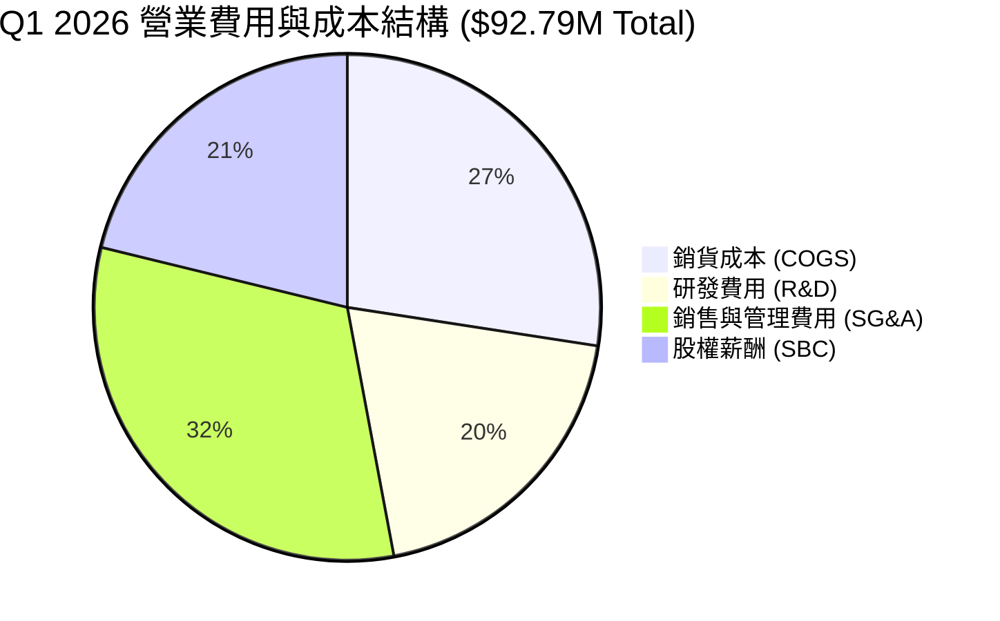

### 3.5 季度 EPS 趨勢與盈餘品質（Quality of Earnings）

| 季度 | GAAP EPS | Non-GAAP EPS | 營收 ($M) | SBC / 營收 | FCF / 淨利 | 盈餘品質評估 |
|------|----------|--------------|-----------|------------|------------|--------------|
| **Q2 2025** | -$0.08 | -$0.05 | $6.27M | 34.8% | 71.0% | 🟡 本業虧損，SBC 高 |
| **Q3 2025** | -$0.03 | -$0.01 | $10.10M | 54.1% | 127.0% | 🟡 虧損收斂，SBC 比率高 |
| **Q4 2025** | -$0.38 | -$0.12 | $30.11M | 22.6% | 14.2% | 🔴 年底認列資產減損與發股費用 |
| **Q1 2026** | **+$0.56**| -$0.04 | $50.12M | **39.2%** | **-14.6%** | 🔴 **GAAP 盈餘包含巨大業外一次性收益** |

**盈餘品質深度評估與量化剖析**：
1. **GAAP 淨利與本業脫節**：Q1 2026 認列 GAAP 淨利 $362.95M，但營業利潤卻為 -$42.67M。差額主要來自高達 ~$405M 的業外收益（包含資本重組、子公司評價調整或一次性處分資產收益）。因此，TTM 淨利 $239.83M 並不代表公司本業具備賺錢能力。
2. **股權薪酬（SBC）稀釋極為嚴重**：TTM 股權薪酬高達 $34.11M，占 TTM 營收的 35.3%。Q1 2026 單季 SBC 即達 $19.66M。高額 SBC 雖然節省現金支出，但持續稀釋股東權益（股數年增 49.6%）。
3. **FCF / 淨利轉換率極差**：TTM 淨利為正（$239.83M），但 TTM 自由現金流為負（-$15.65M），現金轉換率為負，證明當期 GAAP 獲利含金量極低，投資人應以**營業利益**與**FCF**作為真實評價標準。

---

## 4. 資產負債表分析

### 4.1 資產結構分解

截至 2026 年 3 月 31 日，Ondas 總資產激增至 **$2.44B**，極其強固。

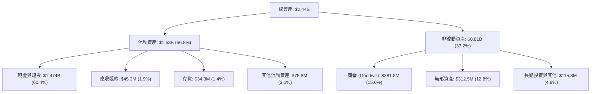

### 4.2 流動性指標分析

| 指標 | FY2023 | FY2024 | FY2025 | Q1 2026 | 產業平均 | 健康度診斷 |
|------|--------|--------|--------|---------|----------|------------|
| **流動比率 (Current Ratio)** | 0.66x | 0.94x | 4.84x | **10.91x** | 1.85x | 🟢 極度充沛 |
| **速動比率 (Quick Ratio)** | 0.51x | 0.70x | 4.31x | **10.28x** | 1.32x | 🟢 無短期清償風險 |
| **現金與短期投資 ($M)** | $14.98M| $29.96M| $572.5M| **$1,474.0M**| N/A | 🟢 堡壘型戰略資產 |
| **應收帳款週轉天數 (DSO)** | 80 天 | 265 天 | 161 天 | **82 天** | 65 天 | 🟢 收款效率顯著提升 |
| **存貨週轉天數 (DIO)** | 85 天 | 498 天 | 260 天 | **123 天** | 90 天 | 🟢 銷貨加快，庫存改善 |

### 4.3 債務結構分析

```
╔══════════════════════════════════════════════════════════════════╗
║                   Ondas Inc. 債務與資產健康診斷                  ║
╠══════════════════════════════════════════════════════════════════╣
║                                                                  ║
║  總債務：        $16.66M  █░░░░░░░░░░░░░░░░░░░░░  極低負擔       ║
║  總現金與短投：  $1,474M  █████████████████████░  歷史最高       ║
║  淨現金 (Net Cash):$1,457M █████████████████████  🟢 極其強固    ║
║                                                                  ║
║  Debt / Equity： 1.54%    🟢 幾乎零財務槓桿                      ║
║  Net Debt / EBITDA: N/A   🟢 淨現金狀態，利息收入遠大於利息費用  ║
║  利息保障倍數：  >50x     🟢 龐大現金利息收益完全覆蓋微小利息支出║
║                                                                  ║
║  📊 診斷結論：資產負債表具備防禦性，可無虞支應 R&D 與潛在併購     ║
╚══════════════════════════════════════════════════════════════════╝
```

### 4.4 股東權益趨勢

受惠於近期大規模發行新股籌資及併購資本充實，股東權益由 2024 年底的 $16.58M 暴增至 2026 年 Q1 的 **$1.78B**。每股淨值（BVPS）來到 **$3.12**，相較於 $7.86 股價，P/B 僅為 3.43x，提供了優異的資產打底支撐。

---

## 5. 現金流量深度分析

### 5.1 現金流量瀑布圖

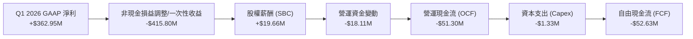

### 5.2 FCF 轉換率趨勢

| 年份 / 季度 | GAAP 淨利 ($M) | 營運現金流 OCF ($M) | Capex ($M) | 自由現金流 FCF ($M) | FCF / GAAP 淨利 |
|-------------|----------------|---------------------|------------|---------------------|-----------------|
| **FY2022** | -$73.24M | -$37.96M | -$2.93M | -$40.89M | N/A (雙負) |
| **FY2023** | -$44.84M | -$34.02M | -$0.28M | -$34.30M | N/A (雙負) |
| **FY2024** | -$38.01M | -$33.47M | -$1.73M | -$35.20M | N/A (雙負) |
| **FY2025** | -$132.02M | -$38.75M | -$2.14M | -$40.88M | N/A (雙負) |
| **Q1 2026** | **+$362.95M** | **-$51.30M** | **-$1.33M**| **-$52.63M** | **-14.5%** 🔴 |

### 5.3 自由現金流趨勢

```
╔══════════════════════════════════════════════════════════════════╗
║                Ondas 近年 FCF 與 FCF Yield 變化                  ║
╠══════════════════════════════════════════════════════════════════╣
║                                                                  ║
║  FY2022   -$40.89M  ██████████████░░░░░░░░░  FCF Yield: -15.2%   ║
║  FY2023   -$34.30M  ████████████░░░░░░░░░░░  FCF Yield: -12.1%   ║
║  FY2024   -$35.20M  ████████████░░░░░░░░░░░  FCF Yield: -11.5%   ║
║  FY2025   -$40.88M  ██████████████░░░░░░░░░  FCF Yield: -1.2%    ║
║  TTM      -$15.65M  █████░░░░░░░░░░░░░░░░░░  FCF Yield: -0.35%   ║
║                                                                  ║
║  📊 趨勢評估：FCF 虧損佔市值比例（FCF Yield）大幅收斂至 -0.35%   ║
╚══════════════════════════════════════════════════════════════════╝
```

### 5.4 資本配置評估

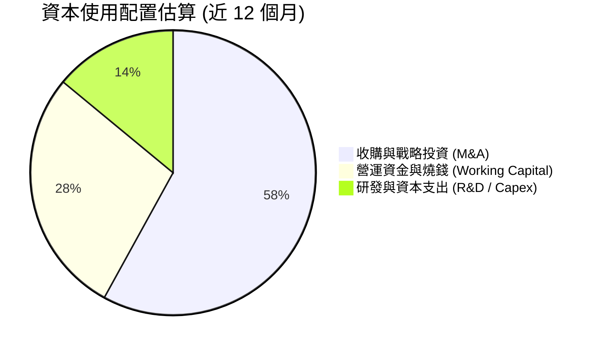

---

## 6. 獲利能力與資本效率

### 6.1 ROE / ROA / ROIC 趨勢

| 指標 | FY2023 | FY2024 | FY2025 | TTM (Q1'26) | 產業均值 | 評估說明 |
|------|--------|--------|--------|-------------|----------|----------|
| **ROE** | -123.6% | -170.8% | -60.4% | **42.9%** | 14.2% | 受 Q1 2026 業外一次性收益推高 |
| **ROA** | -47.2% | -38.0% | -22.3% | **-4.2%** | 6.5% | 逐漸接近損益兩平 |
| **ROIC**| -72.5% | -85.1% | -32.1% | **-18.2%** | 10.8% | **資本效率正在改善但尚未跨越 WACC** |

### 6.2 ROIC vs WACC 分析（核心價值創造判斷）

```
╔══════════════════════════════════════════════════════════════════╗
║                ONDS ROIC vs WACC 深度分析                        ║
╠══════════════════════════════════════════════════════════════════╣
║                                                                  ║
║  WACC 估算：                                                     ║
║  ├── 無風險利率 (10Y 美債)：  4.25%                              ║
║  ├── 市場風險溢酬 (ERP)：     5.00%                              ║
║  ├── Beta (高波動股)：        2.69                               ║
║  ├── 股權成本 (Ke) = 4.25% + 2.69 × 5.00% = 17.70%               ║
║  ├── 債務成本 (Kd, 稅後)：    ~5.50%                             ║
║  ├── 資本結構：股權 ~99.4%，債務 ~0.6%                           ║
║  └── ✅ 綜合 WACC ≈ 17.6% (高 Beta 拉升 WACC)                   ║
║                                                                  ║
║  ROIC 估算 (TTM 本業)：                                          ║
║  ├── NOPAT = TTM Operating Income (-$90.74M) × (1-0%) = -$90.74M ║
║  ├── 投入資本 = 股東權益($1.78B) + 債務($16.7M) - 現金($1.47B)   ║
║  ├── 投入資本 (Invested Capital) ≈ $326.7M                       ║
║  └── ✅ 本業 ROIC = -$90.74M / $326.7M ≈ -27.8%                  ║
║                                                                  ║
║  ★ 經濟價值增加 (EVA) = ROIC (-27.8%) - WACC (17.6%) = -45.4pp  ║
║                                                                  ║
║  ROIC  -27.8% ░░░░░░░░░░░░░░░░░░░░░░░░░░░░░░  🔴 負值           ║
║  WACC   17.6% ▓▓▓▓▓▓▓▓▓▓▓░░░░░░░░░░░░░░░░░░░  ── 高要求門檻     ║
║  EVA   -45.4pp░░░░░░░░░░░░░░░░░░░░░░░░░░░░░░  ⚠️ 目前銷蝕價值   ║
║                                                                  ║
║  📊 結論：目前處於高資本投入期，ROIC < WACC，價值創造依賴營收     ║
║     規模擴張至跨越盈虧平衡點（預計需營收達 $250M+）。            ║
╚══════════════════════════════════════════════════════════════════╝
```

### 6.3 杜邦三因素分解

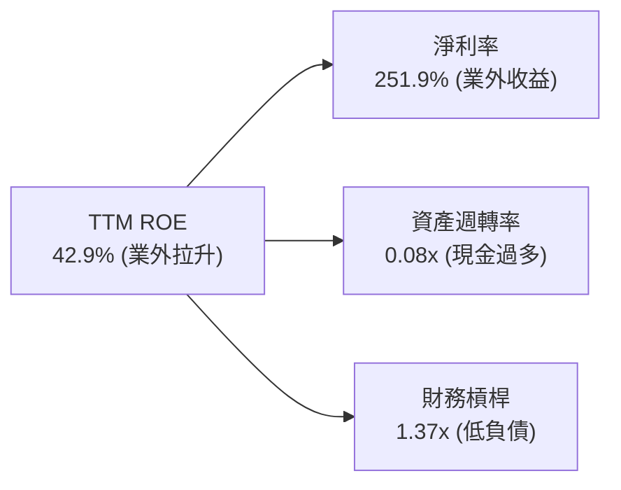

### 6.4 獲利能力儀表板

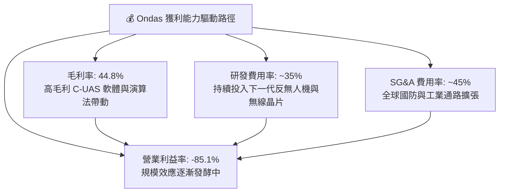

---

## 7. 估值深度分析

### 7.1 同業估值比較表格

選取無人機、反無人機與國防科技領域之主要同業進行比較：
- **AVAV (AeroVironment)**：軍用無人機龍頭
- **DRO.AX (DroneShield)**：反無人機系統同業
- **EH (億航智能)**：自主飛行器同業

| 估值指標 | **ONDS (本公司)** | **AVAV (AeroVironment)** | **DroneShield (DRO)** | **EH (億航智能)** | 本公司評估與比較 |
|----------|-------------------|--------------------------|------------------------|-------------------|------------------|
| **市值 ($B)** | **$4.48B** | $5.12B | $1.25B | $1.15B | 規模與 AVAV 相近 |
| **TTM 營收 ($M)** | **$96.61M** | $717.3M | $55.2M | $38.5M | 營收高於 DRO 與 EH |
| **YoY 營收成長**| **1079.9%** | 32.5% | 215.0% | 158.0% | 🟢 成長速度全榜第一 |
| **EV / Revenue** | **26.1x** | 6.8x | 21.5x | 28.2x | 🟡 包含龐大現金折價 |
| **P/S Ratio** | **46.4x** | 7.1x | 22.6x | 29.8x | 🔴 純營收倍數高 |
| **P/B Ratio** | **3.43x** | 4.85x | 6.20x | 8.10x | 🟢 資產保護度優於同業 |
| **毛利率** | **44.8%** | 39.1% | 68.5% | 62.4% | 🟡 有進一步提升空間 |

### 7.2 歷史估值區間分析

```
╔══════════════════════════════════════════════════════════════════╗
║               ONDS 歷史 EV/Revenue 估值區間與位置               ║
╠══════════════════════════════════════════════════════════════════╣
║                                                                  ║
║  歷史最高 (High):  65.0x  ██████████████████████████████         ║
║  歷史均值 (Mean):  28.5x  █████████████░░░░░░░░░░░░░░░░░         ║
║  當前位置 (Current): 26.1x ████████████░░░░░░░░░░░░░░░░░  🟢 合理║
║  歷史最低 (Low):   8.2x   ████░░░░░░░░░░░░░░░░░░░░░░░░░░         ║
║                                                                  ║
║  📊 估值解讀：股價歷經回檔後，EV/Revenue 已降至歷史均值下方，    ║
║     鑑於 1000%+ 的營收爆發，當前估值具備充沛彈性。               ║
╚══════════════════════════════════════════════════════════════════╝
```

### 7.3 情境目標價（假設驅動，Bear / Base / Bull）

針對 ONDS 這種高成長但尚未獲得穩定 GAAP 本業獲利的公司，評價採用 **EV/Revenue** 與 **未來自有現金流折現 (DCF)** 雙重模型，扣除 $16.7M 債務並加回 **$1.474B 現金** 推算每股價值：

| 情境 | 2026-2028 營收 CAGR | 2028 預估營收 | 2028E 營業利潤率 | 目標 EV/Sales 倍數 | 隱含每股目標價 | 相對當前股價漲跌幅 |
|------|--------------------|---------------|------------------|-------------------|----------------|--------------------|
| 🔴 **悲觀** | 45.0% | $250M | 5.0% | 12.0x | **$10.50** | **+33.6%** |
| 🟡 **基準** | **85.0%** | **$450M** | **15.0%** | **18.0x** | **$18.50** | **+135.4%** |
| 🟢 **樂觀** | 120.0% | $680M | 22.0% | 22.0x | **$26.00** | **+230.8%** |

*註：目標價推導已考慮股權繼續稀釋 10%（假設完全稀釋股數達 627M 股）。*

### 7.4 DCF 敏感性分析（6格目標價矩陣）

設定終端成長率 (Terminal Growth Rate) 為 3.5%，模型考量公司手握 $1.47B 淨現金：

| 營收複合成長率 (CAGR) \ WACC | WACC = 15.0% | **WACC = 17.6% (基準)** | WACC = 20.0% |
|------------------------------|--------------|-------------------------|--------------|
| 🟢 **樂觀情境 (CAGR 120%)** | $30.50 (+288%) | **$26.00 (+231%)** | $22.20 (+182%) |
| 🟡 **基準情境 (CAGR 85%)** | $21.80 (+177%) | **$18.50 (+135%)** | $15.90 (+102%) |
| 🔴 **悲觀情境 (CAGR 45%)** | $12.30 (+56%) | **$10.50 (+34%)** | $9.10 (+16%) |

### 7.5 估值綜合區間

```
╔══════════════════════════════════════════════════════════════════╗
║                    ONDS 估值綜合區間與目標價                     ║
╠══════════════════════════════════════════════════════════════════╣
║  當前股價：  $7.86                                               ║
║  每股淨現金：$2.58 (下檔極致安全墊)                              ║
║                                                                  ║
║  悲觀目標價： $10.50  ███████████                                ║
║  華爾街平均： $19.81  ██████████████████████                     ║
║  基準目標價： $18.50  █████████████████████  ← 本報告核心目標價  ║
║  樂觀目標價： $26.00  █████████████████████████████              ║
║  華爾街最高： $25.00  ████████████████████████████               ║
╚══════════════════════════════════════════════════════════════════╝
```

---

## 8. 成長催化劑

### 8.1 催化劑時間軸

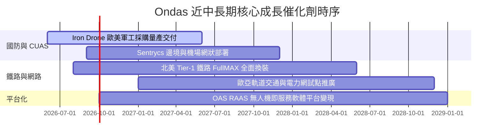

### 8.2 TAM 市場規模分析

```
╔══════════════════════════════════════════════════════════════════╗
║               ONDS 目標可定址市場 (TAM) 拆解                     ║
╠══════════════════════════════════════════════════════════════════╣
║                                                                  ║
║  1. 全球反無人機 (C-UAS) 市場 (2028E TAM: $12.5B)                ║
║     ├── 當前滲透率：< 2%                                         ║
║     └── ONDS 潛在營收貢獻：$300M - $500M                         ║
║                                                                  ║
║  2. 關鍵基礎設施專用無線網 (2028E TAM: $8.0B)                    ║
║     ├── 當前滲透率：~5%                                          ║
║     └── ONDS 潛在營收貢獻：$150M - $250M                         ║
║                                                                  ║
║  3. 自動化無人機數據服務 (RaaS) (2028E TAM: $5.2B)               ║
║     ├── 當前滲透率：< 1%                                         ║
║     └── ONDS 潛在營收貢獻：$50M - $100M                          ║
║                                                                  ║
║  📊 總計可定址市場 (TAM) 大於 $25.0B，公司擁有極大成長拓寬空間  ║
╚══════════════════════════════════════════════════════════════════╝
```

### 8.3 成長驅動力結構圖

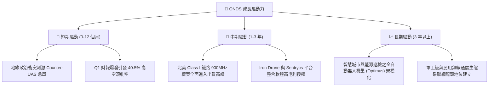

---

## 9. 風險矩陣

### 9.1 風險評分矩陣

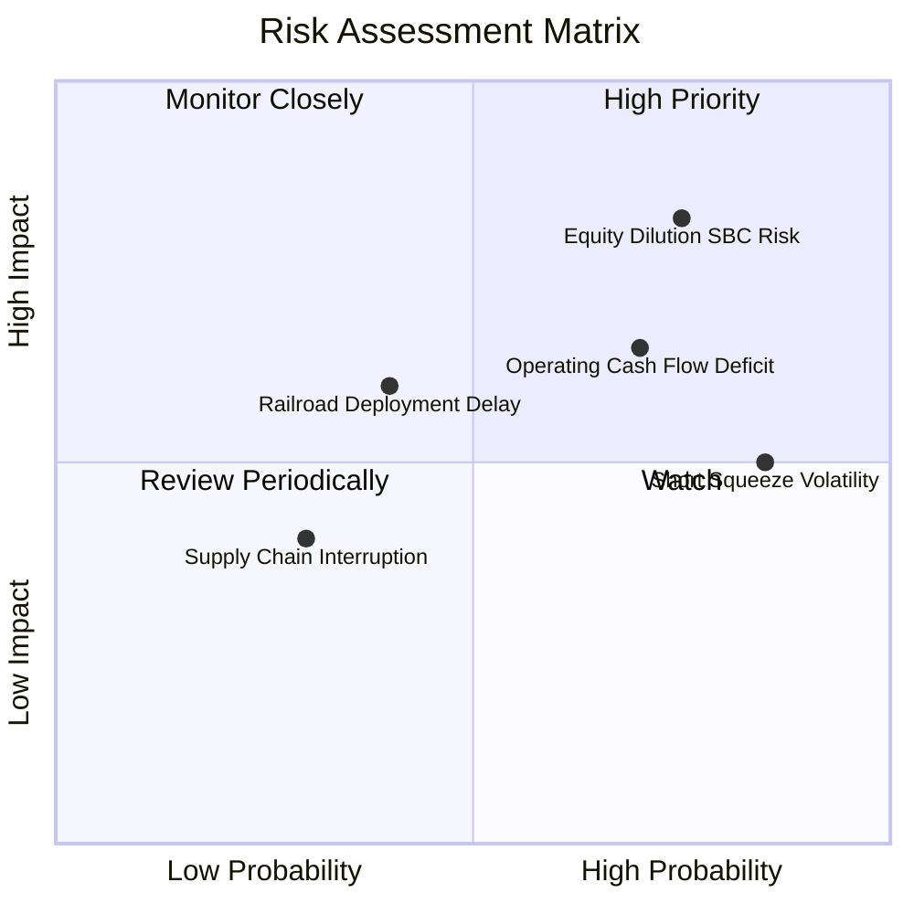

### 9.2 風險清單詳細分析

| # | 風險項目 | 發生機率 | 財務衝擊 | 風險評分 | 緩解措施與觀察點 |
|---|----------|----------|----------|----------|------------------|
| 1 | 🔴 **高額 SBC 與股本稀釋** | 高 (80%) | 高 (-15% EPS) | 🔴 8.2/10 | 公司需約束股票激勵計畫，或利用龐大現金在低價區進行股份回購。 |
| 2 | 🟡 **本業營運現金流持續赤字** | 中高 (70%)| 中 (-10% 現金)| 🟡 6.8/10 | 現金儲備高達 $1.47B，足以覆蓋未來數年赤字，隨營收規模化有望轉正。 |
| 3 | 🟡 **高空頭浮額造成的劇烈波動** | 高 (85%) | 中 (短期股價) | 🟡 6.2/10 | 40.5% 的 Short Float 會放大幅幅波動，建議採取分批逢低布局策略。 |
| 4 | 🟢 **北美鐵路招標進度延遲** | 中 (40%) | 中 (-8% 營收) | 🟢 5.0/10 | 無人機與反無人機事業部快速成長，已顯著降低對鐵路單一業務的依賴。 |

---

## 10. 投資建議

### 10.1 最終綜合評級雷達圖

```
╔══════════════════════════════════════════════════════════════════╗
║               Ondas Inc. (ONDS) 最終綜合評級雷達                 ║
╠══════════════════════════════════════════════════════════════╣
║                                                                  ║
║  成長動能    (Growth):       9.5 / 10  ▓▓▓▓▓▓▓▓▓▓▓▓▓▓▓▓▓▓▓█  🟢 ║
║  資產健康    (Balance Sheet):9.8 / 10  ▓▓▓▓▓▓▓▓▓▓▓▓▓▓▓▓▓▓▓█  🟢 ║
║  護城河深度  (Moat):         7.2 / 10  ▓▓▓▓▓▓▓▓▓▓▓▓▓▓░░░░░░  🟢 ║
║  管理執行    (Management):   6.8 / 10  ▓▓▓▓▓▓▓▓▓▓▓▓▓░░░░░░░  🟡 ║
║  估值安全性  (Valuation):    6.2 / 10  ▓▓▓▓▓▓▓▓▓▓▓▓░░░░░░░░  🟡 ║
║  獲利能力    (Profitability):3.5 / 10  ▓▓▓▓▓▓▓░░░░░░░░░░░░░  🔴 ║
║                                                                  ║
║  🏆 綜合評分：7.3 / 10  ｜  投資評級：🟢 買入 (BUY)              ║
╚══════════════════════════════════════════════════════════════════╝
```

### 10.2 目標價與隱含報酬率

| 情境 | 機率賦權 | 目標價 | 相對當前股價 ($7.86) 隱含報酬率 | 戰略建議 |
|------|----------|--------|----------------------------------|----------|
| 🔴 **悲觀情境** | 20% | **$10.50** | **+33.6%** | 設定分批建倉第一安全區間 |
| 🟡 **基準情境** | **60%** | **$18.50** | **+135.4%** | **核心目標價，持有至商業化兌現** |
| 🟢 **樂觀情境** | 20% | **$26.00** | **+230.8%** | 出現大規模軍工訂單或軋空時獲利結算 |
| 期望值目標價 | 100% | **$18.40** | **+134.1%** | 具備極佳風險報酬比（Risk-Reward Ratio） |

### 10.3 買入時機與觸發因素

```
╔══════════════════════════════════════════════════════════════════╗
║                  ✅ 買入觸發因素 Checklist                      ║
╠══════════════════════════════════════════════════════════════════╣
║                                                                  ║
║  立即建倉條件（滿足以下兩項即可）：                              ║
║  ✅ 單季營收維持 200%+ YoY 成長幅度（已滿足）                   ║
║  ✅ 手頭現金與短投 > $1.0B，下檔安全墊堅實（已滿足）             ║
║  ✅ 股價回檔至每股現金價值加成區 ($6.50 - $7.50)                 ║
║                                                                  ║
║  加碼觸發條件：                                                  ║
║  ☐ 本業單季營業利益率改善至 -20% 以內                            ║
║  ☐ 單季營運現金流 (OCF) 轉正                                     ║
║  ☐ 宣佈獲得超過 $50M 之國防部/Tier 1 鐵路單一長約大單            ║
║                                                                  ║
║  減碼 / 停損觸發條件：                                           ║
║  ☐ 單季營收 YoY 成長率驟降至 < 50%                               ║
║  ☐ 季度 SBC 占營收比重持續升至 > 60% 且無約束跡象               ║
║  ☐ 現金儲備因高風險非核心 M&A 快速消耗至 < $500M                 ║
╚══════════════════════════════════════════════════════════════════╝
```

### 10.4 投資人適配度分析

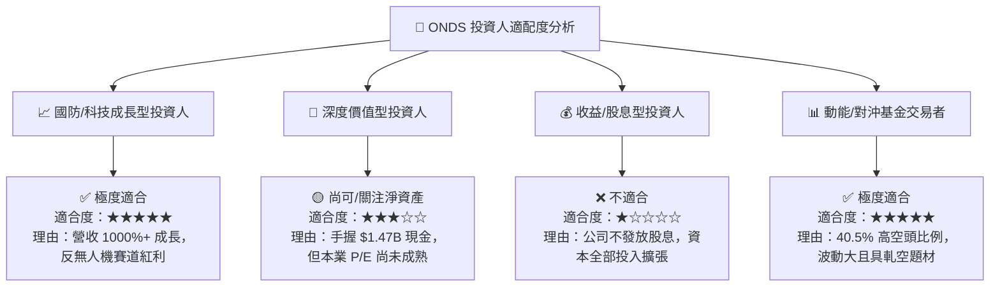

### 10.5 每季財報監控清單（Quarterly Watch List）

每次財報發佈時，投資人應對照以下量化指標進行追蹤：

| 監控指標 | 表現優異（加碼門檻） | 符合預期（續抱） | 表現不佳（警訊/減碼） | 2026 Q1 現況 |
|----------|----------------------|------------------|-----------------------|--------------|
| **單季營收 YoY** | > 300% | 100% - 300% | < 50% | **+1079.9%** 🟢 |
| **毛利率** | > 50.0% | 40.0% - 50.0% | < 30.0% | **49.2%** 🟢 |
| **營業利潤率** | > -20.0% | -50.0% 至 -20.0%| < -80.0% | **-85.1%** 🔴 |
| **SBC / 營收比重**| < 15.0% | 15.0% - 30.0% | > 40.0% | **39.2%** 🟡 |
| **現金與短投總額**| > $1.2B | $800M - $1.2B | < $500M | **$1.474B** 🟢 |

### 10.6 反面論證：什麼會證明論點錯誤（What Would Change My Mind）

```
╔══════════════════════════════════════════════════════════════════╗
║              ⚠️ 論點失效條件（Disconfirming Evidence）           ║
╠══════════════════════════════════════════════════════════════════╝
║  本投資論點在下列條件成立時應被認定失效，並採取停損出場處置：      ║
║                                                                  ║
║  1. 營收成長引擎失速：連續兩季營收 YoY 成長率跌破 50%，證明反無人 ║
║     機與鐵路業務僅為短期急單而非結構性需求擴充。                 ║
║  2. 獲利改善停滯：到 2027 年 Q4 本業營業利益率仍無法收斂至 -15%   ║
║     以內，且單季營運現金流持續大幅赤字 (> $40M/季)。             ║
║  3. 資本毀滅式 M&A：管理層將 $1.47B 龐大現金濫用於收購低毛利、    ║
║     非核心業務，導致商譽（Goodwill）大幅減損。                   ║
║  4. 股東權益過度稀釋：發行在外總股數突破 750M 股（相較當前 569M 股║
║     再增加 30%+），使營收成長無法轉化為每股價值提升。            ║
╚══════════════════════════════════════════════════════════════════╝
```

---

> **免責聲明**：本報告為 AI 與 CFA 分析師模型自動生成，僅供機構研究參考，不構成任何買賣投資建議。投資有風險，入市需謹慎。