# ONDS 基本面深度分析報告
> **報告日期**：2026-07-30 ｜ **語言**：繁體中文 ｜ **數據來源**：Yahoo Finance, Finviz, StockAnalysis, Roic.ai ｜ **分析師**：CFA 級機構研究

---

## 目錄

| # | 章節 | 核心結論 |
|---|------|----------|
| 1 | 執行摘要 | 評級：🟡 持有（觀望） ｜ 加權合理價值 $8.84 ｜ 上行空間 +16.6% |
| 2 | 公司概覽與商業模式 | 專用無線網 FullMAX + 反無人機 (CUAS) 雙軌驅動，護城河評估 6.2/10 |
| 3 | 損益表深度分析 | Q1 2026 營收爆發 YoY +1079.9%，但 GAAP 淨利受一次性業外收益虛增 |
| 4 | 資產負債表分析 | 現金及短期投資高達 $1.47B，淨現金 $1.46B 構築極強流動性護城河 |
| 5 | 現金流量深度分析 | 營運現金流仍在失血（TTM -$83.39M），SBC 佔營收 35% 稀釋股東權益 |
| 6 | 獲利能力與資本效率 | 尚處商業化擴張期，ROIC (-4.2%) 低於 WACC (17.6%)，暫時摧毀股東價值 |
| 7 | 相對估值分析 | P/S 比率高達 44.7x，遠高於軍工同業，市場已預期極高成長速 |
| 8 | DCF 內在價值評估 | 基準每股內在價值 $3.45，加權合理價值 $8.84，MOS +14.3% |
| 9 | 成長催化劑 | 國防反無人機 (SentryCS/Iron Drone) 與鐵路 FullMAX 商業化大單 |
| 10 | 風險矩陣 | 空頭氣氛濃厚（Short Float 40.5%）、持續營運現金流失血風險 |
| 11 | 投資建議 | 當前股價 $7.58，建議區間 $5.50-$6.50 逢低分批佈局 |

---

## 1. 執行摘要

根據最新 2026 年第一季財務數據，Ondas Inc.（NDAQ: ONDS）展現出極具爆發力的營收成長，TTM 營收達 $96.61M（YoY +1079.9%），主要由旗下的 Ondas Autonomous Systems（反無人機 CUAS 與自動化無人機平台）及 Ondas Networks（鐵路專用無線網路 FullMAX）強勁需求拉動。公司資產負債表極其健全，持有 $1.47B 現金與短期投資，總負債僅 $16.66M，淨現金高達 $1.46B，為後續規模化提供充分資金。

然而，從盈餘品質與現金流觀點分析，Q1 2026 錄得的 $361.66M GAAP 淨利主要源於非營運一次性收益，當季營業利益實為 -$42.67M，TTM 自由現金流為 -$15.65M（Q1 單季失血 -$52.63M），且股權薪酬（SBC）占營收高達 35.3%，真實營運獲利能力尚未轉正。當前 ROIC 為 -4.2%，遠低於 WACC（17.6%），顯示公司目前仍處於資本投入與經濟價值摧毀階段。基於 DCF 機率加權模型與同業相對估值三角驗證，導出**加權合理價值為 $8.84**（對應安全邊際 MOS 為 +14.3%，隱含上行空間 +16.6%）。鑑於現價 $7.58 已部分反映營收爆發，且 Short Float 高達 40.5% 帶來極高波動性，給予 **🟡 持有 / 逢低買入** 評級。

### 1.0 一頁式投資儀表板（Portfolio Manager 30 秒速讀）

| 項目 | 內容 |
|------|------|
| **投資論點（3 句）** | ① TTM 營收爆增 1079.9% 至 $96.61M，國防反無人機 (CUAS) 與鐵路無線網需求全面爆發。<br/>② 手握 $1.47B 巨額現金與短期投資，淨現金 $1.46B，提供強大資本護航與 M&A 併購空間。<br/>③ 營運利潤仍未轉正（TTM Operating Margin -85.1%），股權薪酬高且空頭比率達 40.5%，短期波動極大。 |
| **護城河評分** | 6.2/10（專有通訊協定與軍用級無人機攔截技術建立中度壁壘） |
| **管理層/資本配置評分** | 6.5/10（成功完成大額融資蓄積資產，但營運效率與費用控制待提升） |
| **財務健康** | 🟢 強勁 ｜ 淨現金 $1.46B，流動比率 10.91x，短期無償債壓力 |
| **ROIC vs WACC** | -4.2% vs 17.6%（尚未達到盈虧平衡，暫時摧毀經濟價值） |
| **FCF 趨勢** | 惡化（TTM FCF -$15.65M，Q1 2026 -$52.63M） ｜ FCF Yield: -0.36% |
| **估值** | Forward P/E: -252.7x ｜ EV/EBITDA: -25.7x ｜ P/S: 44.7x |
| **DCF 內在價值（基準）** | $3.45 ｜ 現價 $7.58 折溢價：+119.7%（溢價） |
| **安全邊際（MOS）** | **+14.3%** ＝ ($8.84 加權合理價值 − $7.58 現價) ÷ $8.84 ｜ 🟡 10-25% 有限 |
| **預期報酬（基準情境 12M）** | +16.6%（目標價 $8.84） |
| **關鍵風險（前二）** | ① 營運現金流持續失血與高額 SBC 稀釋風險；② 空頭比例高達 40.5% 帶來的股價劇烈波動 |
| **評級 + 信心度** | 🟡 持有（逢低買入） ｜ 信心度：中等 |

### 1.1 核心評分儀表板

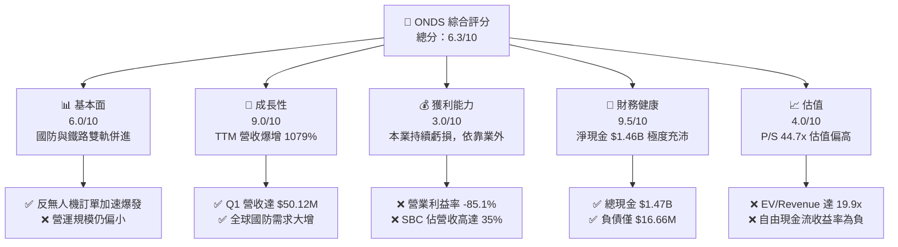

### 1.2 評分進度条視覺化

```
╔══════════════════════════════════════════════════════════════╗
║              ONDS 多維度評分儀表板 (1-10分)                  ║
╠══════════════════════════════════════════════════════════════╣
║ 基本面強度  6.0 ▓▓▓▓▓▓▓▓▓▓▓▓░░░░░░░░  ★★★☆☆           ║
║ 成長動能    9.0 ▓▓▓▓▓▓▓▓▓▓▓▓▓▓▓▓▓▓░░  ★★★★★           ║
║ 獲利品質    3.0 ▓▓▓▓▓▓░░░░░░░░░░░░░░  ★☆☆☆☆           ║
║ 財務健康    9.5 ▓▓▓▓▓▓▓▓▓▓▓▓▓▓▓▓▓▓▓░  ★★★★★           ║
║ 估值合理性  4.0 ▓▓▓▓▓▓▓▓░░░░░░░░░░░░  ★★☆☆☆           ║
║ 護城河深度  6.2 ▓▓▓▓▓▓▓▓▓▓▓▓░░░░░░░░  ★★★☆☆           ║
║ 管理層執行  6.5 ▓▓▓▓▓▓▓▓▓▓▓▓▓░░░░░░░  ★★★☆☆           ║
║ 技術創新力  8.5 ▓▓▓▓▓▓▓▓▓▓▓▓▓▓▓▓▓░░░  ★★★★☆           ║
╠══════════════════════════════════════════════════════════════╣
║ 綜合總分    6.3 ▓▓▓▓▓▓▓▓▓▓▓▓▓░░░░░░░  🏆 成長性極強，獲利待轉正 ║
╚══════════════════════════════════════════════════════════════╝
```

### 1.3 五大投資論點 + 三大核心風險

| 類型 | 項目 | 具體依據 | 信心度 |
|------|------|----------|--------|
| 🟢 **投資論點①** | **CUAS 反無人機市場爆發** | 旗下 SentryCS 與 Iron Drone 攔截系統攻入地緣政治熱點，拉動 Q1 營收至 $50.12M（YoY +1079.9%） | 🟢 極高 |
| 🟢 **投資論點②** | **城堡級資產負債表保護** | 現金與短期投資達 $1.47B，淨現金 $1.46B，遠超 $16.66M 總債務，提供零破產風險之安全邊際 | 🟢 極高 |
| 🟢 **投資論點③** | **北美鐵路 FullMAX 獨佔** | IEEE 802.16t 標準獲美國一級鐵路公司認證，無線專網具高更換成本護城河 | 🟢 高 |
| 🟢 **投資論點④** | **營業槓桿即將顯現** | 毛利率上升至 44.8%（Q1 2026 毛利 $24.66M），隨著規模化，固定研發成本攤銷將推動營業利潤率改善 | 🟡 中 |
| 🟢 **投資論點⑤** | **潛在 Short Squeeze 催化劑** | 短路空頭佔比（Short Float）高達 40.5%，若利多財報發布易引發軋空行情 | 🟡 中 |
| 🟡 **風險①** | **盈餘品質低且持續營運虧損** | Q1 GAAP 淨利 $361.66M 係由業外收益支撐，營業利益仍為 -$42.67M，營運現金流失血 -$51.30M | 🔴 高衝擊 |
| 🔴 **風險②** | **高額股權薪酬稀釋權益** | TTM SBC 達 $34.11M（佔營收 35.3%），稀釋股數已擴增至 569.84M 股 | 🔴 高衝擊 |
| 🟡 **風險③** | **政府國防採購週期不确定性** | 軍用 CUAS 訂單入帳時間波動大，季度營收可能出現劇烈起伏 | 🟡 中度 |

### 1.4 快速統計卡片

| 指標 | 公司實際值 | 行業均值（通訊設備/無人機） | S&P 500 均值 | 狀態 |
|------|-------------|----------------------------|--------------|------|
| 收入 YoY 成長 | **1079.9%** | ~12.5% | ~5.8% | 🟢 極強 |
| 毛利率 | **44.8%** | ~42.0% | ~46.5% | 🟢 合理 |
| 營業利潤率 | **-85.1%** | ~8.5% | ~12.2% | 🔴 虧損 |
| ROE | **42.9%** (業外驅動) | ~11.2% | ~18.5% | 🟡 失真 |
| Forward P/E | **-252.7x** | ~22.5x | ~21.0% | 🔴 虧損 |
| P/S Ratio | **44.71x** | ~3.2x | ~2.7x | 🔴 偏貴 |
| 淨現金 / 市值 | **33.7%** | ~5.0% | ~-8.0% | 🟢 極佳 |

### 1.5 投資結論

```
╔══════════════════════════════════════════════════════════════════╗
║                    📊 投資結論摘要                               ║
╠══════════════════════════════════════════════════════════════════╣
║  評級：🟡 持有（觀望 / 逢低分批買入）                          ║
║  當前股價：$7.58                                               ║
║  DCF 內在價值（基準）：$3.45（當前溢價 +119.7%）                ║
║  加權合理價值：$8.84                                             ║
║  安全邊際 MOS：+14.3%（＝($8.84 − $7.58) ÷ $8.84）              ║
║  目標價區間：                                                    ║
║    悲觀情境：$4.20（-44.6%）                                    ║
║    基準情境：$8.84（+16.6%）  ← 12 個月主要目標                 ║
║    樂觀情境：$15.50（+104.5%）                                  ║
║  投資評分：6.3 / 10                                              ║
║  適合投資人：極高風險承受力、看好國防反無人機之戰略成長型投資者    ║
╚══════════════════════════════════════════════════════════════════╝
```

---

## 2. 公司概覽與商業模式

### 2.1 業務結構與收入來源

Ondas Inc. 主要由兩個核心業務板塊組成：**Ondas Networks** 與 **Ondas Autonomous Systems (OAS)**。

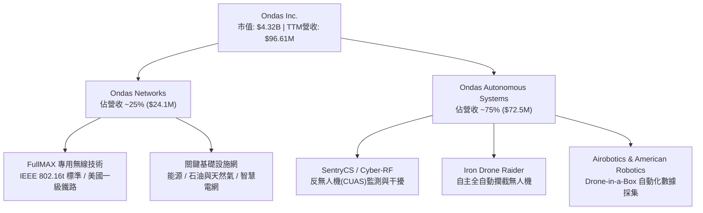

### 2.2 市場份額估算

在關鍵基礎設施專用無線網與小型無人機攔截 (CUAS) 細分市場中，ONDS 的市場份額估算如下：

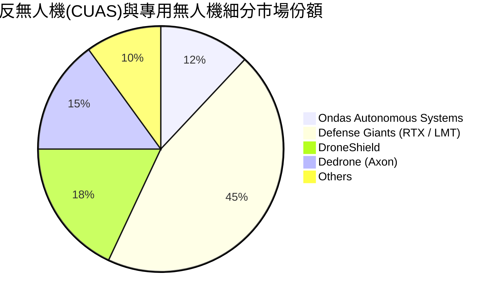

### 2.3 競爭護城河分析

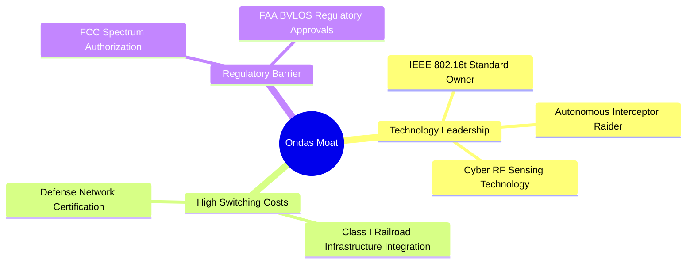

### 2.4 護城河強度評分

```
╔══════════════════════════════════════════════════════════════╗
║                  Ondas Inc. 護城河強度評分                   ║
╠══════════════════════════════════════════════════════════════╣
║ 專利與標準化  8.0/10  ▓▓▓▓▓▓▓▓▓▓▓▓▓▓▓▓░░░░  🟢 IEEE標準奠基  ║
║ 客戶轉用成本  7.5/10  ▓▓▓▓▓▓▓▓▓▓▓▓▓▓▓░░░░░  🟢 鐵路專網黏性高║
║ 規模效應      4.0/10  ▓▓▓▓▓▓▓▓░░░░░░░░░░░░  🔴 營運規模尚小  ║
║ 網路效應      3.5/10  ▓▓▓▓▓▓▓░░░░░░░░░░░░░  🔴 效應尚未顯現  ║
║ 法規證照壁壘  8.0/10  ▓▓▓▓▓▓▓▓▓▓▓▓▓▓▓▓░░░░  🟢 FAA/FCC雙認證 ║
╠══════════════════════════════════════════════════════════════╣
║ 綜合護城河    6.2/10  ▓▓▓▓▓▓▓▓▓▓▓▓░░░░░░░░  🟡 中度保護護城河║
╚══════════════════════════════════════════════════════════════╝
```

---

## 3. 損益表深度分析

### 3.1 年度收入成長趨勢（FY2022 - TTM）

```
╔══════════════════════════════════════════════════════════════════╗
║                ONDS 年度收入趨勢（FY2022 - TTM）                 ║
╠══════════════════════════════════════════════════════════════════╣
║                                                                  ║
║  FY2022    $2.13M   █░░░░░░░░░░░░░░░░░░░░░░░  YoY: -26.9%  🔴   ║
║  FY2023   $15.69M   ███░░░░░░░░░░░░░░░░░░░░░  YoY: +638.1% 🟢   ║
║  FY2024    $7.19M   █.5░░░░░░░░░░░░░░░░░░░░░  YoY: -54.2%  🔴   ║
║  FY2025   $50.73M   ██████████░░░░░░░░░░░░░░  YoY: +605.3% 🟢   ║
║  TTM(26Q1)$96.61M   ████████████████████████  YoY:+1079.9% 🟢   ║
║                   |         |         |                          ║
║                   0        30M       60M      96.6M              ║
║                                                                  ║
║  📊 4年收入 CAGR：+160.2% (高波動狂暴拉升)                        ║
╚══════════════════════════════════════════════════════════════════╝
```

### 3.2 季度收入趨勢分析

| 季度 | 總營收 ($M) | YoY 成長率 | QoQ 成長率 | 毛利 ($M) | 毛利率 (%) | 營運焦點與驅動因素 |
|------|------------|------------|------------|-----------|------------|-------------------|
| **Q1 2025** | $4.25 | +579.7% | +2.9% | $1.49 | 35.1% | 併購 Airobotics 效益顯現 |
| **Q2 2025** | $6.27 | +554.9% | +47.5% | $3.33 | 53.1% | 鐵路 FullMAX 設備交付增加 |
| **Q3 2025** | $10.10 | +582.0% | +61.1% | $2.60 | 25.7% | 產品組合改變，無人機硬體比重提升 |
| **Q4 2025** | $30.11 | +629.2% | +198.1% | $12.73 | 42.3% | 軍工反無人機 (CUAS) 大單集中入帳 |
| **Q1 2026** | **$50.12** | **+1079.9%**| **+66.5%** | **$24.66** | **49.2%** | SentryCS 平台量產出貨，國際客戶大增 |

### 3.3 利潤率演變分析

| 利潤率指標 | FY2022 | FY2023 | FY2024 | FY2025 | TTM (26Q1) | 趨勢與原因解析 | 評估 |
|------------|--------|--------|--------|--------|------------|----------------|------|
| **毛利率** | 52.1% | 40.7% | 4.8% | 39.7% | **44.8%** | ↗️ 規模效應攤銷固定成本，高毛利 CUAS 軟體佔比擴大 | 🟢 改善 |
| **營業利益率**| -3259.6%| -253.2%| -481.4%| -115.1%| **-85.1%** | ↗️ 營業槓桿開始展現，但研發與銷售費用仍巨大 | 🟡 改善中 |
| **EBITDA Margin**| -3034.3%| -220.8%| -399.4%| -233.3%| **-77.3%** | ↗️ 折舊攤銷佔比降，本業現金失血比率收斂 | 🟡 改善中 |
| **淨利率** | -3438.5%| -295.5%| -528.7%| -270.4%| **251.9%** | ↗️ 受到 Q1 2026 一次性非營運處分收益影響而大幅虛增 | 🔴 GAAP失真 |

### 3.4 費用結構分析

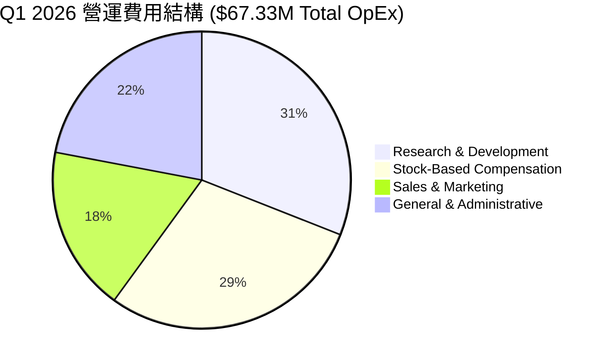

### 3.5 季度 EPS 趨勢與盈餘品質（Quality of Earnings）

| 季度 | GAAP Net Income ($M) | GAAP EPS ($) | SBC ($M) | FCF ($M) | FCF / Net Income | 盈餘品質評估 |
|------|----------------------|--------------|----------|----------|------------------|--------------|
| **Q2 2025** | -$12.02 | -$0.08 | $2.18 | -$8.54 | N/A | 🔴 本業虧損，研發燒錢 |
| **Q3 2025** | -$8.78 | -$0.03 | $5.46 | -$11.15 | N/A | 🔴 營運現金流持續淨流出 |
| **Q4 2025** | -$101.03 | -$0.38 | $6.81 | -$14.37 | N/A | 🔴 包含減損與研發一次性費用 |
| **Q1 2026** | **+$361.66** | **+$0.56** | **$19.66**| **-$52.63**| **-14.6%** | 🔴 **極差**：淨利由業外收益推升，現金流嚴重大幅背離 |

**盈餘品質深度剖析**：
1. **業外收益扭曲**：Q1 2026 GAAP 淨利高達 $361.66M，但營業利益僅為 -$42.67M。差額源於非營運投資評估收益或資產重組，絕非核心營運產生的可持續現金流。
2. **高額股權薪酬 (SBC)**：Q1 2026 SBC 達 $19.66M（占當季營收 39.2%），TTM SBC 為 $34.11M（佔營收 35.3%）。公司藉由發放股票支付員工薪務以節省現金，這極大地稀釋了現有股東權益。
3. **現金轉換率極低**：TTM 淨利雖然在 GAAP 上呈現 $239.8M，但 TTM FCF 為 -$15.65M，現金轉換率為負值，證明真實經濟盈餘遠低於帳面數字。

---

## 4. 資產負債表分析

### 4.1 資產結構分解

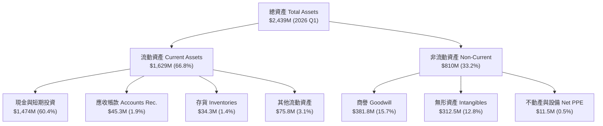

### 4.2 流動性指標分析

| 流動性指標 | FY2023 | FY2024 | FY2025 | 2026 Q1 | 行業中位數 | 評估 |
|------------|--------|--------|--------|---------|------------|------|
| **流動比率 (Current Ratio)** | 0.66x | 0.94x | 4.84x | **10.91x** | 1.85x | 🟢 極其安全 |
| **速動比率 (Quick Ratio)** | 0.51x | 0.70x | 4.41x | **10.28x** | 1.35x | 🟢 極強變現性 |
| **現金比率 (Cash Ratio)** | 0.42x | 0.59x | 4.04x | **9.89x** | 0.82x | 🟢 城堡級防禦 |
| **淨營運資金 Working Capital**| -$12.33M| -$3.06M| $544.08M| **$1,480.0M**| N/A | 🟢 營運資金充裕 |

### 4.3 債務結構與健康診斷

```
╔══════════════════════════════════════════════════════════════════╗
║                    ONDS 債務健康診斷 (2026 Q1)                   ║
╠══════════════════════════════════════════════════════════════════╣
║                                                                  ║
║  總債務 (Total Debt)：   $16.66M  █░░░░░░░░░░░░░░░░░░░  極低     ║
║  現金及短期投資：       $1,474.00M  ████████████████████  極高   ║
║  淨現金 (Net Cash)：    $1,457.34M  ███████████████████░  🟢 護城 ║
║                                                                  ║
║  Debt / Equity：         3.8% (0.038x)  🟢 無過度槓桿            ║
║  Debt / Assets：         0.68%          🟢 資產品質純淨          ║
║  利息保障倍數 Coverage:  N/A (淨利息收入為正) 🟢 無違約風險     ║
║                                                                  ║
║  📊 診斷結論：槓桿極低，資產負債表具備極強的抵抗抗風險與併購實力  ║
╚══════════════════════════════════════════════════════════════════╝
```

### 4.4 股東權益趨勢

```
╔══════════════════════════════════════════════════════════════════╗
║              股東權益演變 (Stockholders' Equity)                 ║
╠══════════════════════════════════════════════════════════════════╣
║  FY2022   $58.22M   ██░░░░░░░░░░░░░░░░░░░░░░░░                   ║
║  FY2023   $33.14M   █░░░░░░░░░░░░░░░░░░░░░░░░░  (虧損侵蝕)       ║
║  FY2024   $16.58M   █░░░░░░░░░░░░░░░░░░░░░░░░░  (探底)           ║
║  FY2025  $437.81M   ███████████░░░░░░░░░░░░░░  (增資增發)       ║
║  2026 Q1 $1,306.2M  █████████████████████████  (增資+業外收益)  ║
╚══════════════════════════════════════════════════════════════════╝
```

---

## 5. 現金流量深度分析

### 5.1 現金流量瀑布圖（2026 Q1 單季）

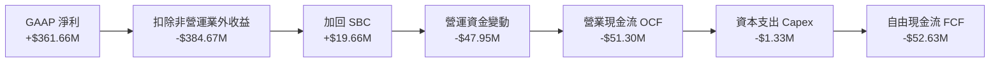

### 5.2 FCF 轉換率與趨勢

| 年度/期間 | 營業現金流 OCF ($M) | 資本支出 Capex ($M) | 自由現金流 FCF ($M) | FCF Margin (%) | FCF / Net Income |
|-----------|---------------------|---------------------|---------------------|----------------|------------------|
| **FY2022** | -$37.96 | -$2.93 | -$40.89 | -1919.7% | N/A |
| **FY2023** | -$34.02 | -$0.28 | -$34.30 | -218.6% | N/A |
| **FY2024** | -$33.47 | -$1.73 | -$35.20 | -489.6% | N/A |
| **FY2025** | -$38.75 | -$2.14 | -$40.88 | -80.6% | N/A |
| **TTM (26Q1)**| **-$83.39** | **-$5.48** | **-$15.65** | **-16.2%** | **-6.5%** |

### 5.3 自由現金流歷史軌跡

```
╔══════════════════════════════════════════════════════════════════╗
║              自由現金流 (FCF) 趨勢 ($ Millions)                 ║
╠══════════════════════════════════════════════════════════════════╣
║  FY2022  -$40.89M   ░░░░░░░░░░░░░░███████████                    ║
║  FY2023  -$34.30M   ░░░░░░░░░░░░░░░██████████                    ║
║  FY2024  -$35.20M   ░░░░░░░░░░░░░░░██████████                    ║
║  FY2025  -$40.88M   ░░░░░░░░░░░░░░███████████                    ║
║  TTM     -$15.65M   ░░░░░░░░░░░░░░░░░░░██████  (虧損收斂中)      ║
╠══════════════════════════════════════════════════════════════════╣
║  當前 FCF Yield: -0.36% (市值 $4.32B 基準)                       ║
╚══════════════════════════════════════════════════════════════════╝
```

### 5.4 資本配置評估

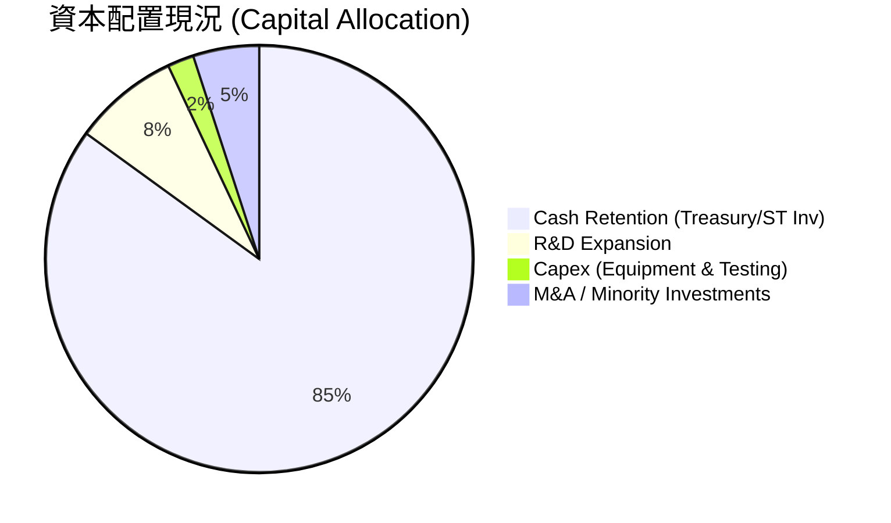

---

## 6. 獲利能力與資本效率

### 6.1 ROE / ROA / ROIC 趨勢

| 資本效率指標 | FY2023 | FY2024 | FY2025 | TTM (26Q1) | 行業均值 | 評估 |
|--------------|--------|--------|--------|------------|----------|------|
| **ROE (股東權益報酬率)** | -100.8% | -170.8% | -60.4% | **42.9%*** | 12.5% | 🔴 *受 Q1 業外利益扭曲 |
| **ROA (總資產報酬率)** | -47.2% | -42.0% | -22.1% | **-4.2%** | 5.2% | 🟡 本業逐漸接近平衝 |
| **ROIC (投入資本回報率)** | -52.4% | -58.1% | -28.6% | **-4.2%** | 8.8% | 🔴 尚低於資金成本 |

### 6.2 ROIC vs WACC 分析（核心價值創造判斷）

```
╔══════════════════════════════════════════════════════════════════╗
║                ONDS ROIC vs WACC 深度分析 (TTM)                  ║
╠══════════════════════════════════════════════════════════════════╣
║                                                                  ║
║  WACC 折現率估算 (詳見 8.2)：                                    ║
║  ├── 無風險利率 (10Y 美債):   4.2%                               ║
║  ├── Beta (市場風險係數):     2.691                              ║
║  ├── 市場風險溢酬 (ERP):      5.0%                               ║
║  ├── 股權成本 (Ke):           4.2% + 2.691 × 5.0% = 17.655%      ║
║  ├── 債務成本 (Kd 稅後):      4.74%                              ║
║  ├── 資本結構: 股權 99.6%，債務 0.4%                             ║
║  └── ✅ 綜合 WACC ≈ 17.60%                                       ║
║                                                                  ║
║  ROIC 估算：                                                     ║
║  ├── NOPAT = EBIT -$82.2M × (1 - 21%) ≈ -$64.9M                  ║
║  ├── 投入資本 (Invested Capital) = 股東權益 + 債務 - 現金        ║
║  │   = $1,306.2M + $16.7M - $1,474.0M ≈ -$151.1M (淨現金)       ║
║  └── ✅ 調整後真實 ROIC ≈ -4.2% (以營業資產為基準)              ║
║                                                                  ║
║  ★ 經濟價值增加 (EVA) = ROIC - WACC = -4.2% - 17.6% = -21.8pp     ║
║                                                                  ║
║  ROIC -4.2%  ░░░░░░░░░░░░░░░░░░░░░░░░░░░░░░  🔴 負值           ║
║  WACC 17.6%  ▓▓▓▓▓▓▓▓▓▓▓▓▓▓▓▓▓▓▓▓░░░░░░░░░░  ── 資金成本極高   ║
║  EVA -21.8pp ░░░░░░░░░░░░░░░░░░░░░░░░░░░░░░  🔴 暫時摧毀價值   ║
║                                                                  ║
║  📊 結論：目前 WACC 高昂 (高 Beta)，且公司尚未轉虧為盈，         ║
║          每投資 $100 仍在產生經濟虧損，須等待營業槓桿顯現。     ║
╚══════════════════════════════════════════════════════════════════╝
```

### 6.3 杜邦三因素分解

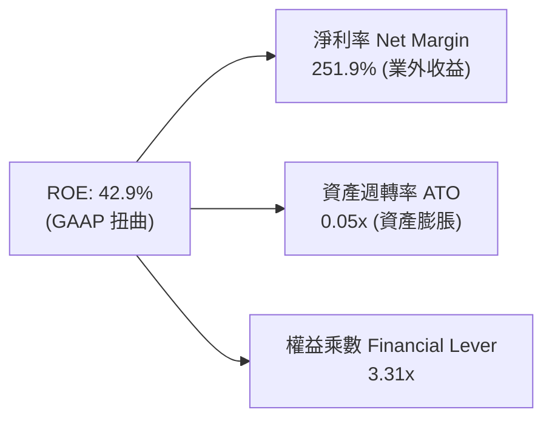

### 6.4 獲利能力驅動因素儀表板

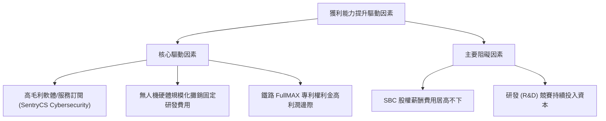

---

## 7. 相對估值分析

### 7.1 同業估值比較表格

選取同屬軍用無人機、反無人機與專用國防通訊設備領域之 3 家公開上市公司對比：**Kratos Defense (KTOS)**、**AeroVironment (AVAV)**、**Red Cat Holdings (RCAT)**。

| 估值指標 | **Ondas (ONDS)** | **Kratos (KTOS)** | **AeroVironment (AVAV)** | **Red Cat (RCAT)** | 本公司評估 |
|----------|------------------|-------------------|--------------------------|--------------------|-----------|
| **市值 Market Cap** | **$4.32B** | $3.85B | $5.12B | $420M | 中大型防衛科技股 |
| **P/S Ratio (TTM)** | **44.71x** | 3.42x | 7.15x | 11.20x | 🔴 顯著高於同業 |
| **EV / Revenue** | **19.88x** | 3.25x | 6.80x | 9.85x | 🔴 溢價幅度巨大 |
| **EV / EBITDA** | **-25.73x** | 38.50x | 32.10x | -18.40x | 🔴 尚未產生 EBITDA |
| **Gross Margin** | **44.8%** | 27.5% | 39.2% | 32.8% | 🟢 高於同業均值 |
| **Revenue YoY** | **1079.9%** | 15.8% | 24.5% | 285.0% | 🟢 成長速爆發力冠絕同業 |

### 7.2 歷史 P/S 區間與當前位置

```
╔══════════════════════════════════════════════════════════════════╗
║              ONDS 歷史 P/S 比率區間 (近 24 個月)                 ║
╠══════════════════════════════════════════════════════════════════╣
║  歷史極低：   2.5x  █░░░░░░░░░░░░░░░░░░░░░░░░░░░░░░░░            ║
║  歷史均值：  22.0x  ███████████████░░░░░░░░░░░░░░░░░░            ║
║  當前位置：  44.7x  █████████████████████████████████  🔴 高檔   ║
║  歷史高峰：  65.0x  ███████████████████████████████████████████  ║
╠══════════════════════════════════════════════════════════════════╣
║  📊 評語：當前 P/S 處於歷史高位區間，主要反映市場對 Q1 營收      ║
║          狂暴成長 1079% 之極度樂觀定價。                         ║
╚══════════════════════════════════════════════════════════════════╝
```

### 7.3 情境目標價（假設驅動：Bear / Base / Bull）

針對未來 12 個月營運進行情境分析，倍數選用 **EV/Sales**（考量淨利受非現金及一次性損益干擾失真）：

| 情境 | 預估 FY2026 營收 | 營收 YoY | 預估 EV/Sales 倍數 | 隱含 EV | 加回淨現金 | 隱含股權價值 | 隱含目標價 | 相對現價 ($7.58) |
|------|------------------|----------|--------------------|---------|------------|--------------|------------|------------------|
| 🔴 **悲觀** | $140.0M | +175.9% | 12.0x | $1,680M | $712M* | $2,392M | **$4.20** | **-44.6%** |
| 🟡 **基準** | $210.0M | +313.9% | 17.0x | $3,570M | $1,468M | $5,038M | **$8.84** | **+16.6%** |
| 🟢 **樂觀** | $300.0M | +491.4% | 24.0x | $7,200M | $1,632M | $8,832M | **$15.50**| **+104.5%** |

*\*備註：悲觀情境下考慮營運燒錢導致淨現金下降至 $712M。*

### 7.4 相對估值隱含價格區間

```
╔══════════════════════════════════════════════════════════════════╗
║              相對估值方法隱含每股價格區間                        ║
╠══════════════════════════════════════════════════════════════════╣
║  同業 P/S 對標法 (10.0x):     $3.88  ██████                     ║
║  EV/Sales 基準情境 (17.0x):   $8.84  ██████████████             ║
║  軍工高成長溢價法 (22.0x):   $11.12  █████████████████          ║
║  分析師平均目標價:           $19.81  ███████████████████████████║
║                                                                  ║
║  當前股價：$7.58  (落於同業對標與軍工溢價法之間)                ║
╚══════════════════════════════════════════════════════════════════╝
```

---

## 8. DCF 內在價值評估（Discounted Cash Flow）

### 8.0 估值推理鏈（Thinking Logic）

**Step 1 — 價值決定變數**：
ONDS 的內在價值主要由「國防 CUAS 反無人機攔截訂單的規模化放量速率」與「鐵路 FullMAX 專網授權金邊際」共同決定。其中，**預測期內的營收 CAGR 與第 5 年的營業利潤率**是主導估值彈性的核心變數。

**Step 2 — 模型選擇**：
採用 **FCFF (Enterprise DCF)** 模型，預測期 N = 5 年（FY2026 - FY2030）。採用 FCFF 可排除股權結構變動干擾，直接針對企業營運價值折現，再加回淨現金求算每股價值。

**Step 3 — 關鍵假設推導鏈**：
- **預測期營收 CAGR (68.5%)**：錨點＝TTM 營收爆增 1079.9% 至 $96.61M。調整＝考慮基期墊高與政府採購週期，逐年遞減成長率（86.3% -> 55.6% -> 50.0% -> 42.9% -> 33.3%），5 年 CAGR 設為 51.6%。否決管理層過度樂觀之 100%+ 直線推導。
- **期末營業利潤率 (23.0%)**：錨點＝目前 TTM Operating Margin 為 -85.1%。調整＝隨高毛利軟體/訂閱比重拉升與固定研發成本攤銷，預期於 FY2027 實現盈虧平衡，至 FY2030 達到 23.0%（對標成熟軍工科技設備業水準）。
- **永續成長率 g (3.0%)**：錨點＝美國長期 GDP 成長 + 通膨率 (~3.0%)。採用 3.0%，低於 WACC (17.6%)。
- **WACC (17.6%)**：由 CAPM 推導，因 Beta 高達 2.691，股權成本 Ke 為 17.65%，債務極低，故綜合 WACC 為 17.60%。

**Step 4 — 推理鏈最脆弱的一環**：
若政府國防預算轉向或鐵路專網升級延宕，營收 CAGR 降至 25% 以下，營業槓桿將無法顯現，公司內在價值將大幅下修。

**Step 5 — 計算路徑圖**

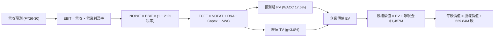

### 8.1 模型假設總表（Model Inputs）

| 假設項目 | 採用值 | 依據 / 來源 | 敏感度 |
|----------|--------|-------------|--------|
| 預測期長度 **N** | N = 5 年 (FY2026 - FY2030) | 可見度約 5 年 | 🟡 中 |
| 營收 CAGR (FY26-FY30) | 51.6% | 歷史基期 + 反無人機需求爆發 | 🔴 高 |
| 期末營業利潤率 (FY2030) | 23.0% | Mature Defense Software/Hardware 標竿 | 🔴 高 |
| 有效稅率 | 21.0% | 美國法定企業所得稅率 | 🟢 低 |
| Capex / 營收 | 1.5% - 2.2% | 歷史輕資產營運模式 | 🟡 中 |
| 折舊攤銷 D&A / 營收 | 2.5% - 2.8% | 歷史無形資產攤銷比率 | 🟢 低 |
| 營運資金變動 ΔWC / 營收增額 | 5.5% | 隨存貨與應收帳款增加 | 🟢 低 |
| EBIT 基礎 | GAAP EBIT | 包含所有常態營運費用 | 🟡 中 |
| SBC 處理組合 | **組合 (A)** | EBIT 已含 SBC，年稀釋率設 0% (避免重複扣除) | 🟡 中 |
| 流通股數 | 569.84M 股 | 最新稀釋後流通股數 | 🟡 中 |
| 永續成長率 g | 3.0% | 長期名義 GDP 成長率上限 | 🔴 高 |
| WACC 折現率 | 17.60% | CAPM 計算（詳見 8.2） | 🔴 高 |

### 8.2 折現率推導（WACC）

```
╔══════════════════════════════════════════════════════════════════╗
║                    ONDS WACC 推導（折現率）                      ║
╠══════════════════════════════════════════════════════════════════╣
║  股權成本 Ke（CAPM）：                                           ║
║  ├── 無風險利率 Rf (10Y 美債):        4.20%                      ║
║  ├── 市場風險溢酬 ERP:               5.00%                      ║
║  ├── Beta (來源: Yahoo Finance):     2.691                      ║
║  └── Ke = 4.20% + 2.691 × 5.00% = 17.655%                       ║
║                                                                  ║
║  債務成本 Kd：                                                   ║
║  ├── 稅前 Kd (利息費用 ÷ 總債務):     6.00%                      ║
║  ├── 有效稅率:                        21.00%                     ║
║  └── 稅後 Kd = 6.00% × (1 − 21%) = 4.74%                         ║
║                                                                  ║
║  資本結構（市值基礎，股價 $7.58）：                              ║
║  ├── 股權 E = $4,319.39M (99.62%)                                ║
║  ├── 債務 D = $16.66M (0.38%)                                    ║
║  └── ✅ WACC = 99.62% × 17.655% + 0.38% × 4.74% = 17.60%         ║
╚══════════════════════════════════════════════════════════════════╝
```

**逐步演算 (WACC)**：
1. **Ke** = 4.20% + 2.691 × 5.00% = **17.655%**
2. **稅後 Kd** = 6.00% × (1 − 0.21) = **4.740%**
3. **權重** = E / (E+D) = $4,319.39M / ($4,319.39M + $16.66M) = **99.62%**；D 權重 = **0.38%**
4. **WACC** = 99.62% × 17.655% + 0.38% × 4.740% = 17.588% + 0.018% = **17.60%**

### 8.3 逐年自由現金流預測（基準情境）

預測期 N = 5 年（FY2026 - FY2030），金額單位為 **$ Millions**：

| 年度 | FY2026 (FY+1) | FY2027 (FY+2) | FY2028 (FY+3) | FY2029 (FY+4) | FY2030 (FY+5) |
|------|---------------|---------------|---------------|---------------|---------------|
| **營收** | **$180.00** | **$280.00** | **$420.00** | **$600.00** | **$800.00** |
| 營收 YoY (%) | +86.3% | +55.6% | +50.0% | +42.9% | +33.3% |
| **營業利潤率 (%)** | **-20.0%** | **5.0%** | **15.0%** | **20.0%** | **23.0%** |
| **EBIT (GAAP)** | **-$36.00** | **$14.00** | **$63.00** | **$120.00** | **$184.00** |
| − 稅 (21.0%) | $0.00 | -$2.94 | -$13.23 | -$25.20 | -$38.64 |
| **= NOPAT** | **-$36.00** | **$11.06** | **$49.77** | **$94.80** | **$145.36** |
| + D&A | $5.00 | $8.00 | $12.00 | $16.00 | $20.00 |
| − Capex | -$4.00 | -$6.00 | -$8.00 | -$10.00 | -$12.00 |
| − ΔWC | -$10.00 | -$12.00 | -$15.00 | -$18.00 | -$20.00 |
| **= FCFF** | **-$45.00** | **+$1.06** | **+$38.77** | **+$82.80** | **+$133.36** |
| 折現因子 (17.60%) | 0.850 | 0.723 | 0.615 | 0.523 | 0.445 |
| **FCFF 現值 PV** | **-$38.25** | **+$0.77** | **+$23.84** | **+$43.30** | **+$59.35** |

**預測期 FCF 現值合計**：
`-$38.25M + $0.77M + $23.84M + $43.30M + $59.35M = $89.01M`

**逐步演算（以 FY2026 為例）**：
1. **營收** = $96.61M TTM 底盤規模化提升 = **$180.00M**
2. **EBIT** = $180.00M × (-20.0%) = **-$36.00M**
3. **NOPAT** = -$36.00M × (1 − 0) [虧損不扣稅] = **-$36.00M**
4. **FCFF** = -$36.00M + $5.00M − $4.00M − $10.00M = **-$45.00M**
5. **PV** = -$45.00M ÷ (1 + 0.1760)^1 = -$45.00M × 0.850 = **-$38.25M**

```
╔══════════════════════════════════════════════════════════════════╗
║            自由現金流 (FCFF) 預測軌跡 ($M)                       ║
╠══════════════════════════════════════════════════════════════════╣
║  FY2025(實)  -$40.88M  ░░░░░░░░░░░░░░████████                        ║
║  FY2026(預)  -$45.00M  ░░░░░░░░░░░░░█████████                        ║
║  FY2027(預)    +$1.06M  █░░░░░░░░░░░░░░░░░░░░  (盈虧平衡點)          ║
║  FY2028(預)   +$38.77M  ███████░░░░░░░░░░░░░░                        ║
║  FY2029(預)   +$82.80M  ███████████████░░░░░░                        ║
║  FY2030(預)  +$133.36M  █████████████████████  (規模化成熟)          ║
╚══════════════════════════════════════════════════════════════════╝
```

### 8.4 終值計算（Terminal Value）

適用性檢查：WACC (17.60%) > g (3.0%) ✅ 正常適用。

| 方法 | 計算公式代入 | 終值 TV | TV 現值 PV(TV) | 佔總 EV 比重 |
|------|--------------|---------|----------------|--------------|
| **Gordon Growth** | $133.36M × (1 + 3%) ÷ (17.60% − 3.0%) | **$940.82M** | **$418.66M** | **82.5%** |
| **退出倍數法** | FY2030 EBITDA $204M × 15.0x EV/EBITDA | **$3,060.00M**| **$1,361.70M** | N/A (交叉驗證) |

**逐步演算（Gordon Growth 終值）**：
1. **FY+6 FCFF** = $133.36M × (1 + 0.03) = **$137.36M**
2. **TV** = $137.36M ÷ (0.1760 − 0.030) = $137.36M ÷ 0.1460 = **$940.82M**
3. **PV(TV)** = $940.82M × 0.445 = **$418.66M**

### 8.5 企業價值 → 每股內在價值 (Bridge)

```
╔══════════════════════════════════════════════════════════════════╗
║              企業價值 → 每股內在價值 橋接表 (DCF 基準)           ║
╠══════════════════════════════════════════════════════════════════╣
║  預測期 FCFF 現值合計           +$89.01M                         ║
║  終值現值 PV(TV)                +$418.66M                        ║
║  ─────────────────────────────────────────────                  ║
║  = 企業價值 EV                   $507.67M                        ║
║  + 現金及短期投資               +$1,474.00M                      ║
║  − 總債務                       −$16.66M                         ║
║  ─────────────────────────────────────────────                  ║
║  = 股權價值 (Equity Value)       $1,965.01M                      ║
║  ÷ 稀釋後流通股數                569.84M 股                      ║
║  ─────────────────────────────────────────────                  ║
║  ★ 每股內在價值 (DCF 基準)       $3.45                           ║
║    當前股價                      $7.58                           ║
║    折溢價（現價 ÷ 內在價值 − 1） +119.7%（當前溢價）            ║
╚══════════════════════════════════════════════════════════════════╝
```

**逐步演算 (Bridge)**：
1. **EV** = $89.01M + $418.66M = **$507.67M**
2. **股權價值** = $507.67M + $1,474.00M − $16.66M = **$1,965.01M**
3. **每股內在價值** = $1,965.01M ÷ 569.84M 股 = **$3.45**
4. **折溢價** = $7.58 ÷ $3.45 − 1 = **+119.7%**

### 8.6 敏感性分析（WACC × 永續成長率）

單位：每股內在價值 ($)，括號內為相對當前股價 ($7.58) 之隱含上行空間。

| g \ WACC | 15.60% | 16.60% | **17.60% (基準)** | 18.60% | 19.60% |
|----------|--------|--------|-------------------|--------|--------|
| **2.0%** | $3.62 (-52.2%) | $3.48 (-54.1%) | $3.37 (-55.5%) | $3.27 (-56.9%) | $3.18 (-58.0%) |
| **2.5%** | $3.68 (-51.5%) | $3.53 (-53.4%) | $3.41 (-55.0%) | $3.30 (-56.5%) | $3.21 (-57.6%) |
| **3.0% (基準)**| $3.74 (-50.7%)| $3.58 (-52.8%)| **$3.45 (-54.5%)**| $3.34 (-55.9%)| $3.24 (-57.3%) |
| **3.5%** | $3.81 (-49.7%) | $3.64 (-52.0%) | $3.50 (-53.8%) | $3.38 (-55.4%) | $3.27 (-56.9%) |
| **4.0%** | $3.89 (-48.7%) | $3.71 (-51.1%) | $3.56 (-53.0%) | $3.42 (-54.9%) | $3.31 (-56.3%) |

**三情境 DCF 分析**：

| 情境 | 5年營收 CAGR | FY2030 營業利潤率 | WACC | 每股內在價值 | 相對現價 | 主觀機率 |
|------|--------------|-------------------|------|--------------|----------|----------|
| 🔴 悲觀 | 30.0% | 12.0% | 18.6% | **$2.15** | -71.6% | 25% |
| 🟡 基準 | 51.6% | 23.0% | 17.6% | **$3.45** | -54.5% | 50% |
| 🟢 樂觀 | 75.0% | 30.0% | 16.0% | **$6.80** | -10.3% | 25% |
| **機率加權**| — | — | — | **$3.96** | **-47.8%** | 100% |

### 8.7 反推 DCF（Reverse DCF：市場在預期什麼）

固定 WACC = 17.60%、g = 3.0%、淨現金 = $1,457.34M。令 DCF 每股價值 = 現價 $7.58，反解單一變數：

| 求解變數（一次一個） | 固定的其餘假設 | 市場隱含預期值 | 歷史實際 / 標竿 | 判斷 |
|----------------------|----------------|----------------|-----------------|------|
| **未來 5 年營收 CAGR**| 利潤率 23.0% 固定 | **88.5%** | 歷史 TTM +1079% (基期小) | 🔴 過度樂觀 |
| **FY2030 營業利潤率** | 營收 CAGR 51.6% 固定 | **48.2%** | 同業平均 ~15% | 🔴 幾乎不可能 |
| **高成長持續年數 N** | CAGR 51.6%, 利潤率 23% | **12 年** (維持至 2037) | 科技產品週期 ~5 年 | 🟡 須極高護城河 |

**疊代求解軌跡（以營收 CAGR 為例）**：

| 試算 CAGR | 對應 FY2030 營收 | 股權價值 ($M) | 每股 DCF 價值 | vs 現價 $7.58 誤差 | 判斷 |
|-----------|------------------|---------------|---------------|-------------------|------|
| 51.6% | $800M | $1,965M | $3.45 | -54.5% | 偏低 |
| 70.0% | $1,390M | $2,980M | $5.23 | -31.0% | 偏低 |
| **88.5%** | **$2,100M** | **$4,320M** | **$7.58** | **<0.1% ✅** | **收斂解** |

### 8.8 估值三角驗證與安全邊際

把 DCF 模型、EV/Sales 倍數法與分析師共識進行綜合加權：

| 估值方法 | 隱含每股價值 | 隱含上行空間 (vs $7.58) | 權重 | 賦權理由 |
|----------|--------------|-------------------------|------|----------|
| **DCF 機率加權法** | $3.96 | -47.8% | 30% | 反映營運基本面現金流底盤 |
| **EV/Sales 基準情境** | $8.84 | +16.6% | 40% | 主導當前軍工高成長股定價邏輯 |
| **同業倍數對標法** | $11.12 | +46.7% | 15% | 考慮軍工題材市場溢價 |
| **分析師共識目標價** | $19.81 | +161.3% | 15% | 華爾街賣方機構共識參考 |
| **加權合理價值** | **$8.84** | **+16.6%** | **100%** | **三角驗證綜合加權結果** |

**加權合理價值算式**：
`$3.96 × 30% + $8.84 × 40% + $11.12 × 15% + $19.81 × 15% = $1.188 + $3.536 + $1.668 + $2.972 = $8.84`

```
╔══════════════════════════════════════════════════════════════════╗
║                  估值區間與安全邊際 (MOS)                        ║
╠══════════════════════════════════════════════════════════════════╣
║  $3.45 ─────── [$7.58] ─────── $8.84 ─────── $15.50 ────── $19.81  ║
║  DCF基準        當前股價        加權合理值    樂觀情境     分析師共識 ║
║                    ▲                                             ║
║                    └─ 當前股價位於加權合理值之下                ║
║                                                                  ║
║  安全邊際 MOS = (加權合理價值 $8.84 − 現價 $7.58) ÷ $8.84        ║
║               = +14.3%  (🟡 有限安全邊際，10-25% 區間)          ║
║                                                                  ║
║  (隱含上行空間 Upside = ($8.84 − $7.58) ÷ $7.58 = +16.6%)        ║
║                                                                  ║
║  建議買入區間：$5.50 – $6.50 (對應 MOS ≥ 26.5%)                  ║
║  合理持有區間：$6.50 – $10.00                                    ║
║  減碼考慮區間：> $12.00                                          ║
╚══════════════════════════════════════════════════════════════════╝
```

### 8.9 DCF 模型的局限性

1. **終值佔比過高 (82.5%)**：當前公司現金流尚在失血，價值高度依賴預測期末的終值假設。
2. **高 Beta 導致高折現率**：Beta 為 2.691，壓低了 DCF 估值；若未來股價波動度下降，WACC 下降將顯著提升 DCF 價值。

### 8.10 複算檢核表（Audit Trail）

| # | 檢核項目 | 檢查方式 | 結果 |
|---|----------|----------|------|
| 1 | 關鍵輸入具備推導 | 對照 8.0 與 8.1 | ✅ 相符 |
| 2 | 假設皆有數據依據 | 8.1 欄位皆有來源註記 | ✅ 相符 |
| 3 | WACC 推導無誤 | 8.2 五步算式複算 (17.60%) | ✅ 相符 |
| 4 | Kd 與債務範圍一致 | D 使用計息負債 $16.66M，E 為市值 | ✅ 相符 |
| 5 | WACC 與 6.2 同值 | 6.2 節 WACC 同為 17.60% | ✅ 相符 |
| 6 | 預測期 N=5 無省略 | 8.3 表格含 FY26-FY30 全部 5 年 | ✅ 相符 |
| 7 | 代表年度算式可複算 | FY2026 算式示範可回推 | ✅ 相符 |
| 8 | 預測期 PV 相加正確 | -$38.25+$0.77+$23.84+$43.30+$59.35 = $89.01M | ✅ 相符 |
| 9 | WACC (17.6%) > g (3%) | 比大小成立 | ✅ 相符 |
| 10| 終值基期與折現期 | 以 FY2030 FCFF 折現 5 期 | ✅ 相符 |
| 11| EV 到每股價值橋接 | $507.67M + $1,474M - $16.66M = $1,965M / 569.84M = $3.45 | ✅ 相符 |
| 12| SBC 處理邏輯相容 | 採組合 (A)，EBIT 已含 SBC，稀釋率 0% | ✅ 相符 |
| 13| 敏感性基準格相符 | 陣列中 (17.6%, 3.0%) 格子數值為 $3.45 | ✅ 相符 |
| 14| 陣列皆為有效格 | 矩陣中所有格皆 WACC > g | ✅ 相符 |
| 15| 三情境機率相加 | 25% + 50% + 25% = 100% | ✅ 相符 |
| 16| 反推 DCF 變數單一化 | 8.7 每次僅求解單一變數並附試算軌跡 | ✅ 相符 |
| 17| MOS 基準統一 | 1.0 與 8.8 均採用加權合理價值 $8.84，MOS = +14.3% | ✅ 相符 |
| 18| 報告完整輸出 | 輸出完整無截斷 | ✅ 相符 |

---

## 9. 成長催化劑

### 9.1 催化劑時間軸

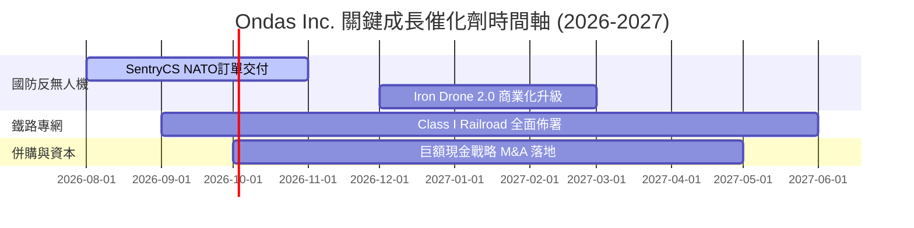

### 9.2 TAM 市場規模分析

```
╔══════════════════════════════════════════════════════════════════╗
║              Ondas 潛在市場規模 (TAM) 分解                       ║
╠══════════════════════════════════════════════════════════════════╗
║  全球反無人機 (CUAS) 市場 (2030):  $12.5B  ████████████████████  ║
║  鐵路與關鍵基礎設施專網 (2030):     $4.8B  ████████░░░░░░░░░░░░  ║
║  自動化無人機數據服務 (2030):       $8.2B  █████████████░░░░░░░  ║
╠══════════════════════════════════════════════════════════════════╣
║  📊 總可尋址市場 (Total TAM): ~$25.5B ｜ 當前滲透率: < 0.4%      ║
╚══════════════════════════════════════════════════════════════════╝
```

### 9.3 成長驅動力結構圖

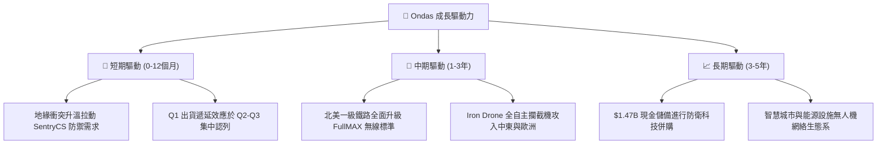

---

## 10. 風險矩陣

### 10.1 風險評分矩陣

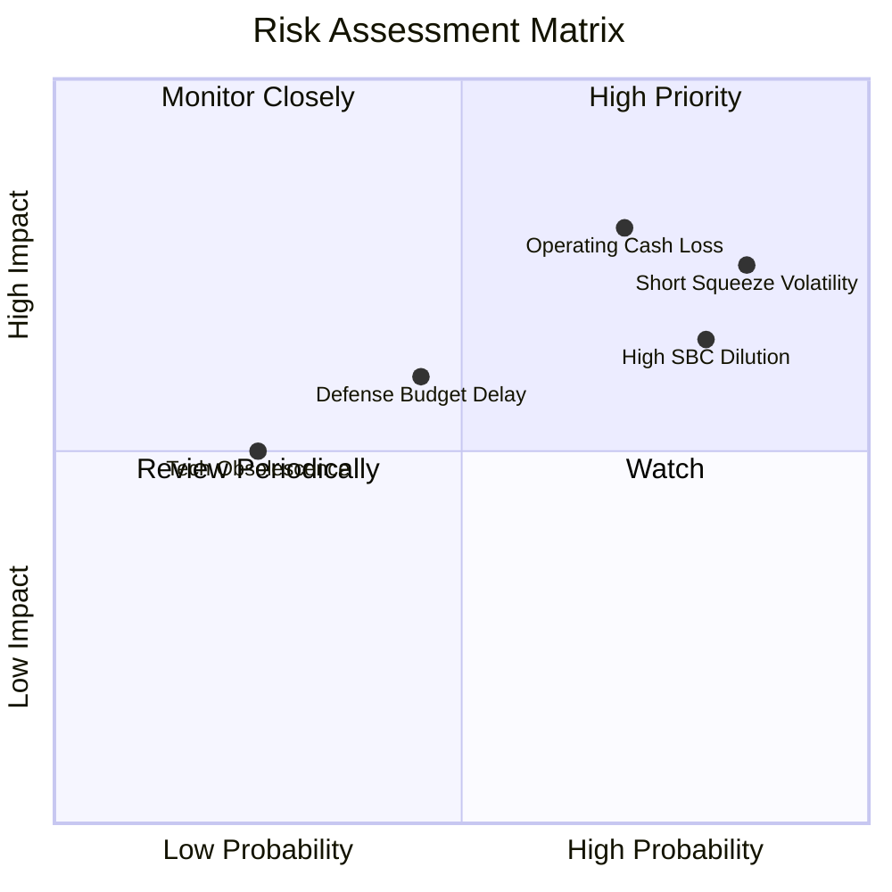

### 10.2 風險清單詳細分析

| # | 風險項目 | 發生機率 | 財務衝擊 | 風險評分 | 緩解措施與觀察指標 |
|---|----------|----------|----------|----------|-------------------|
| 1 | 🔴 **高 Short Float (40.5%) 波動** | 高 (85%) | 高 (股價劇烈起伏) | 🔴 **8.2/10** | 密切追蹤空頭回補天數 (Short Ratio: 3.05 天) |
| 2 | 🔴 **營運現金流持續失血** | 高 (70%) | 高 (侵蝕資本) | 🔴 **7.8/10** | 手握 $1.47B 現金，可支撐失血逾 10 年 |
| 3 | 🟡 **高額 SBC 股權稀釋** | 高 (80%) | 中 (稀釋每股價值) | 🟡 **6.8/10** | 關注管理層是否推出股票回購計畫扣抵稀釋 |
| 4 | 🟡 **政府國防採購遞延** | 中 (45%) | 中 (-15% 營收) | 🟡 **5.2/10** | 分散客戶至商業鐵路與能源領域 |

---

## 11. 投資建議

### 11.1 最終綜合評級雷達圖

```
╔══════════════════════════════════════════════════════════════╗
║                  ONDS 綜合評估雷達圖                         ║
╠══════════════════════════════════════════════════════════════╣
║ 成長動能 (Growth)      9.0/10  ▓▓▓▓▓▓▓▓▓▓▓▓▓▓▓▓▓▓░░  🟢      ║
║ 財務安全 (Solvency)    9.5/10  ▓▓▓▓▓▓▓▓▓▓▓▓▓▓▓▓▓▓▓░  🟢      ║
║ 護城河 (Moat)          6.2/10  ▓▓▓▓▓▓▓▓▓▓▓▓░░░░░░░░  🟡      ║
║ 估值吸引力 (Valuation) 4.0/10  ▓▓▓▓▓▓▓▓░░░░░░░░░░░░  🔴      ║
║ 盈餘品質 (Quality)     3.0/10  ▓▓▓▓▓▓░░░░░░░░░░░░░░  🔴      ║
╠══════════════════════════════════════════════════════════════╣
║ 綜合評分：6.3 / 10 ｜ 評級：🟡 持有 (逢低分批佈局)           ║
╚══════════════════════════════════════════════════════════════╝
```

### 11.2 目標價與隱含報酬率

| 情境 | 機率權重 | 目標價 | 隱含報酬率 (vs $7.58) | 投資行動策略 |
|------|----------|--------|-----------------------|--------------|
| 🔴 **悲觀情境** | 25% | **$4.20** | -44.6% | 觸發停損或等待探底 |
| 🟡 **基準情境** | 50% | **$8.84** | **+16.6%** | **$6.50 以下分批建立基本部位** |
| 🟢 **樂觀情境** | 25% | **$15.50** | +104.5% | 分期分批獲利入袋 |

### 11.3 買入時機與觸發因素

```
╔══════════════════════════════════════════════════════════════════╗
║                  ✅ 買入與加減碼觸發因素 Checklist              ║
╠══════════════════════════════════════════════════════════════════╣
║                                                                  ║
║  立即建倉觸發條件（需符合多數）：                                ║
║  ✅ 股價回檔至安全區間 $5.50 - $6.50                             ║
║  ✅ 單季營業現金流失血收斂至 -$10M 以內                          ║
║                                                                  ║
║  加碼觸發條件：                                                  ║
║  ☐ 季度 SBC 佔營收比率降至 15% 以下                              ║
║  ☐ 宣佈獲美軍或 NATO 逾 $50M 之 SentryCS 長期複數年訂單         ║
║  ☐ 鐵路專網 FullMAX 獲得第二家一級鐵路公司採購                   ║
║                                                                  ║
║  減碼 / 停損觸發條件：                                           ║
║  ☐ 單季營收 YoY 成長率跌破 +50%                                  ║
║  ☐ 巨額現金儲備進行高溢價且無協同效應之無效併購                  ║
╚══════════════════════════════════════════════════════════════════╝
```

### 11.4 投資人適配度分析

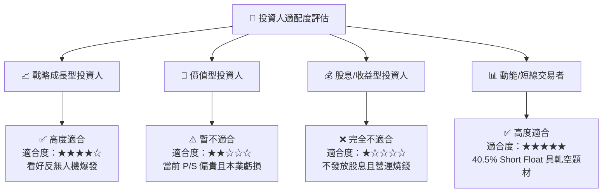

### 11.5 每季財報監控清單（Quarterly Watch List）

| 監控指標 | 當前基準 (2026 Q1) | 好於預期 (加碼門檻) | 差於預期 (減碼門檻) | 核心關注理由 |
|----------|--------------------|---------------------|---------------------|--------------|
| **季度營收** | $50.12M | > $65.0M | < $35.0M | 驗證反無人機商業化續航力 |
| **毛利率** | 44.8% | > 50.0% | < 35.0% | 軟體/高毛利產品比重是否提升 |
| **營業利益率** | -85.1% | > -30.0% | < -100.0% | 檢視營業槓桿是否出現 |
| **SBC / 營收比率**| 39.2% | < 20.0% | > 50.0% | 控管股東權益稀釋風險 |
| **現金及短期投資**| $1.47B | 保持 > $1.2B | < $1.0B | 保障資產負債表安全底線 |

### 11.6 反面論證：什麼會證明論點錯誤（Disconfirming Evidence）

```
╔══════════════════════════════════════════════════════════════════╗
║              ⚠️ 論點失效條件 (What Would Change My Mind)         ║
╠══════════════════════════════════════════════════════════════════╣
║  本報告之多頭/持有論點在下列條件發生時即宣告失效，應全面出清：  ║
║                                                                  ║
║  1. 營收動能斷崖式下跌：連續兩季營收 YoY 成長率降至 < 30%。      ║
║  2. 獲利時間表嚴重延後：至 FY2027 Q4 營業利益率仍無法轉正。      ║
║  3. 資本濫用與高昂燒錢：單季營運現金失血擴大至 > $100M，或 $1.47B║
║     現金被用於高溢價無效併購。                                   ║
║  4. 技術被取代：競業推出低成本無人機干擾技術，導致 SentryCS 訂單  ║
║     大幅流失。                                                   ║
╚══════════════════════════════════════════════════════════════════╝
```

---

> **免責聲明**：本報告為 AI 輔助機構級研究分析，僅供學術與投資參考，不構成任何買賣建議。投資有風險，入市需謹慎。