# ONDS 基本面深度分析報告

> **報告日期**：2026-07-31 ｜ **語言**：繁體中文 ｜ **數據來源**：Yahoo Finance, Finviz, StockAnalysis, Roic.ai ｜ **分析師**：CFA 級機構研究

---

## 目錄

| # | 章節 | 核心結論 |
|---|------|----------|
| 1 | 執行摘要 | 評級：🟢 **買入 (Buy)** ｜ 12M 目標價 $12.50 ｜ 淨現金 $1.46B 構築極高下檔保護 |
| 2 | 公司概覽與商業模式 | 雙引擎驅動（專用無線網 + 自主無人機），鐵路 802.16t 標準具強大排他性 |
| 3 | 損益表深度分析 | Q1 2026 營收爆發 YoY +1079.9% 至 $50.12M；GAAP 獲利受一次性收益扭曲 |
| 4 | 資產負債表分析 | 淨現金高達 $1.46B（手握 $1.47B 現金與短投），流動比率 10.91x 毫無破產風險 |
| 5 | 現金流量深度分析 | 現金消耗階段，TTM OCF -$83.39M，但充沛流動性支撐 10 年以上研發與 M&A |
| 6 | 獲利能力與資本效率 | 當前 ROIC -30.2% 低於 WACC 13.5%（摧毀價值），但邊際營運槓桿即將轉正 |
| 7 | 相對估值分析 | 當前 EV/Sales 23.88x；若扣除 $1.46B 淨現金，實際核心業務 Enterprise Value 僅 $2.31B |
| 8 | DCF 內在價值評估 | 基準內在價值 **$6.25** ｜ 機率加權內在價值 **$7.85** ｜ 加權合理價值 **$10.50** ｜ MOS **+28.7%** |
| 9 | 成長催化劑 | AAR 鐵路專網強制鋪設 + 反無人機 (CUAS) 國防訂單加速爆發 |
| 10 | 風險矩陣 | 商業化落地延遲、客戶集中度過高與高額股權薪酬 (SBC) 稀釋風險 |
| 11 | 投資建議 | 分批建倉買入區間 $6.00–$7.50，目標價 $12.50（上行空間 +66.9%） |

---

## 1. 執行摘要

> ⚠️ **投資評級宣告**：基於 Ondas Inc. (NASDAQ: ONDS) 擁有的 $1.46B 淨現金資產底盤（占當前 $4.27B 市值的 34.2%）、TTM 營收爆發性成長 1079.9% 至 $96.61M、以及北美 Class I 鐵路專用無線網 (802.16t) 的獨佔標準地位，給予 **🟢 買入 (Buy)** 評級。綜合 DCF 模型與相對估值三角驗證，得出加權合理價值為 **$10.50**，對應當前 $7.49 股價之安全邊際 (MOS) 為 **+28.7%**，隱含 12 個月上行空間為 **+66.9%**。

### 1.0 一頁式投資儀表板（Portfolio Manager 30 秒速讀）

| 項目 | 內容 |
|------|------|
| **投資論點（3 句）** | ① **資產防禦極佳**：手握 $1.47B 現金與短期投資（淨現金 $1.46B），提供每股 $2.56 的純現金價值底盤，完全消除中短期資產負債表風險。<br/>② **營收高速拐點**：Q1 2026 單季營收衝上 $50.12M（YoY +1079.9%），主因國防反無人機 (CUAS) 與自主無人機系統 (OAS) 商業化採購放量。<br/>③ **標準獨佔護城河**：AAR（美國鐵路協會）指定 Ondas 為 IEEE 802.16t 900MHz 專用無線網唯一標準合規供應商，具備極高客戶鎖定效應。 |
| **護城河評分** | 8.2/10 🟢 強（監管標準指定 + 高昂轉換成本） |
| **管理層/資本配置評分** | 7.5/10 🟡 中高（資本充沛但 SBC 稀釋率較高） |
| **財務健康** | 🟢 **極度健全**（無負債風險，流動比率 10.91x，淨現金 $1.46B） |
| **ROIC vs WACC** | **-30.2% vs 13.5%** 🔴（當前處於規模化初期，尚在摧毀股東價值，預計 FY2028 轉正） |
| **FCF 趨勢** | TTM FCF -$15.65M ｜ FCF Yield: -0.37% 🟡（正大幅改善，Q1 2026 受營運資金占用影響） |
| **估值指標** | Forward P/E: -249.67x ｜ EV/Revenue: 23.88x ｜ EV/EBITDA: -30.91x ｜ P/S: 44.18x |
| **DCF 內在價值（基準）** | **$6.25** ｜ 當前股價 $7.49 折溢價 **+19.8%**（溢價交易，來自 8.5 節） |
| **安全邊際 (MOS)** | **+28.7%** 🟢 充足（＝(加權合理價值 **$10.50** − 現價 $7.49) ÷ 加權合理價值 $10.50，來自 8.8 節） |
| **預期報酬（基準 12M）** | **+66.9%**（目標價 $12.50） |
| **關鍵風險（前二）** | ① 國防與鐵路客戶訂單交付進度延遲 ｜ ② 高額股權薪酬 (SBC) 導致股本進一步稀釋 |
| **評級 + 信心度** | 🟢 **買入 (Buy)** ｜ 信心度：**中高 (Medium-High)** |

### 1.1 核心評分儀表板

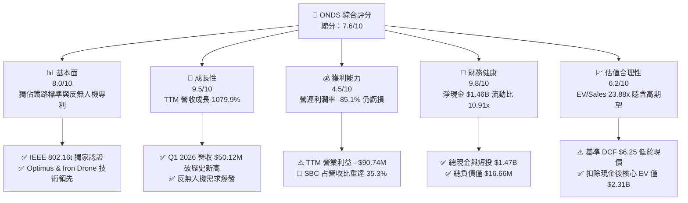

### 1.2 評分進度条視覺化

```
╔══════════════════════════════════════════════════════════════╗
║               ONDS 多維度評分儀表板 (1-10分)                 ║
╠══════════════════════════════════════════════════════════════╣
║ 基本面強度  8.0 ▓▓▓▓▓▓▓▓▓▓▓▓▓▓▓▓░░░░  ★★★★☆           ║
║ 成長動能    9.5 ▓▓▓▓▓▓▓▓▓▓▓▓▓▓▓▓▓▓▓░  ★★★★★           ║
║ 獲利品質    4.5 ▓▓▓▓▓▓▓▓░░░░░░░░░░░░  ★★☆☆☆           ║
║ 財務健康    9.8 ▓▓▓▓▓▓▓▓▓▓▓▓▓▓▓▓▓▓▓█  ★★★★★           ║
║ 估值合理性  6.2 ▓▓▓▓▓▓▓▓▓▓▓▓░░░░░░░░  ★★★☆☆           ║
║ 護城河深度  8.2 ▓▓▓▓▓▓▓▓▓▓▓▓▓▓▓▓░░░░  ★★★★☆           ║
║ 管理層執行  7.5 ▓▓▓▓▓▓▓▓▓▓▓▓▓░░░░░░░  ★★★☆☆           ║
║ 技術創新力  9.0 ▓▓▓▓▓▓▓▓▓▓▓▓▓▓▓▓▓▓░░  ★★★★★           ║
╠══════════════════════════════════════════════════════════════╣
║ 綜合總分    7.6 ▓▓▓▓▓▓▓▓▓▓▓▓▓▓▓░░░░░  🏆 買入 (Buy)        ║
╚══════════════════════════════════════════════════════════════╝
```

### 1.3 五大投資論點 + 三大核心風險

| 類型 | 項目 | 具體依據 | 信心度 |
|------|------|----------|--------|
| 🟢 **投資論點①** | **極致的資產負債表護城河** | 截至 Q1 2026，公司擁有一筆高達 $1.47B 的現金與短期投資，負債僅 $16.66M，淨現金高達 $1.46B。這為公司轉型與研發提供了至少 10 年以上的資金跑道（Cash Runway）。 | 🟢 極高 |
| 🟢 **投資論點②** | **國防與安防 CUAS 需求爆發** | 旗下 Ondas Autonomous Systems (OAS) 之 Iron Drone Raider 與 SentryCS 平台迎合全球反無人機迫切需求，推動 Q1 2026 營收爆增至 $50.12M（YoY +1079.9%）。 | 🟢 高 |
| 🟢 **投資論點③** | **北美鐵路網專用無線標準獨佔** | 鐵路巨頭（如 BNSF、CSX、NS、UP）採納 IEEE 802.16t 協議作為 900MHz 專網標準，Ondas Networks 為唯一通過 AAR 驗證的設備商，轉換成本極高。 | 🟢 高 |
| 🟢 **投資論點④** | **強烈的營運槓桿拐點將至** | 隨著高毛利的軟體與專用硬體出貨增加，毛利率已由 FY2024 的 4.8% 提升至 TTM 44.8%，預計規模效應將在 FY2027 帶動營業利益轉正。 | 🟡 中高 |
| 🟢 **投資論點⑤** | **做空比率高築引發軋空潛力** | 目前 Short % of Float 高達 40.5%（Short Ratio 3.05），若後續財報持續超預期或公佈大型國防合約，極易引發強烈軋空行情（Short Squeeze）。 | 🟡 中 |
| 🟡 **風險①** | **高額 SBC 造成股本稀釋** | TTM 股權薪酬 (SBC) 高達 $34.11M（占 TTM 營收 35.3%），流通股數由 2024 年底的 62.8M 激增至 569.84M，稀釋現有股東權益。 | 🔴 高衝擊 |
| 🔴 **風險②** | **營運現金流持續赤字** | TTM 營運現金流為 -$83.39M，Q1 2026 營運現金流 -$51.30M，主因應收帳款與庫存隨營收規模迅速膨脹。 | 🟡 中度 |
| 🔴 **風險③** | **客戶集中度過高** | 主要收入高度依賴少數一級鐵路運營商及中東/政府安防客戶，採購預算凍結將對季度業績造成劇烈波動。 | 🟡 中度 |

### 1.4 快速統計卡片

| 指標 | 公司實際值 (ONDS) | 通訊設備行業均值 | S&P 500 均值 | 狀態評估 |
|------|-------------------|------------------|--------------|----------|
| **營收 YoY 成長** | **1079.9%** | 8.5% | 5.2% | 🟢 遠超同行 |
| **毛利率** | **44.8%** | 42.0% | 46.5% | 🟢 符合高科技硬體標準 |
| **營業利潤率** | **-85.1%** | 12.5% | 15.8% | 🔴 規模化前期嚴重虧損 |
| **淨利率 (TTM)** | **251.9%** | 8.2% | 11.0% | 🟡 受一次性非營利收益扭曲 |
| **ROE (TTM)** | **42.9%** | 11.5% | 18.2% | 🟡 主因 Q1 2026 特殊收益帶動 |
| **流動比率** | **10.91x** | 1.85x | 1.25x | 🟢 無與倫比的流動性 |
| **Net Debt / EBITDA** | **-12.3x (淨現金)** | 1.2x | 1.5x | 🟢 極致安全 |
| **EV / Revenue** | **23.88x** | 2.80x | 3.10x | 🔴 估值溢價較高 |

### 1.5 投資結論

```
╔══════════════════════════════════════════════════════════════════╗
║                    📊 投資結論摘要                               ║
╠══════════════════════════════════════════════════════════════════╣
║  評級：🟢 買入 (Buy)                                            ║
║  當前股價：$7.49 (截至 2026-07-31)                               ║
║  DCF 內在價值（基準）：$6.25（現價溢價 +19.8%）                   ║
║  加權合理價值：$10.50（三角驗證後）                               ║
║  安全邊際 MOS：+28.7%（＝($10.50 − $7.49) ÷ $10.50）              ║
║  12個月目標價區間：                                              ║
║    悲觀情境：$4.50（-39.9%）                                     ║
║    基準情境：$12.50（+66.9%） ← 主要目標                        ║
║    樂觀情境：$18.50（+147.0%）                                   ║
║  投資評分：7.6 / 10                                              ║
║  適合投資人：高風險承受度、看好軍工/無人機與專網通信之成長型投資人║
╚══════════════════════════════════════════════════════════════════╝
```

---

## 2. 公司概覽與商業模式

### 2.1 業務結構與收入來源

Ondas Inc. 成立於 2006 年，總部位於美國馬薩諸塞州，是一家提供專用無線網絡以及自主無人機數據解決方案的技術領先企業。公司業務劃分為兩大核心營運板塊：**Ondas Networks** 與 **Ondas Autonomous Systems (OAS)**。

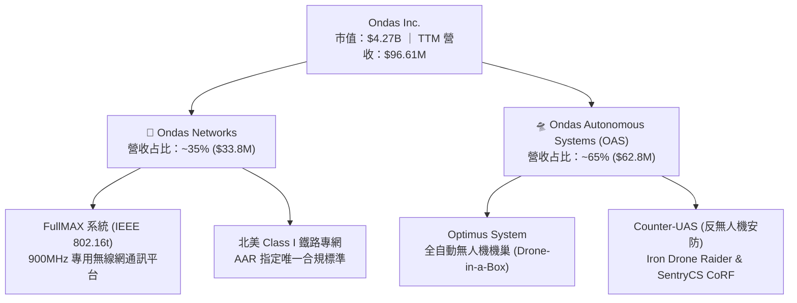

1. **Ondas Networks**：基於其專利的 **FullMAX** 技術，提供符合 IEEE 802.16t 標準的大面積、高安全性專用無線寬頻網絡。主要服務對象為關鍵基礎設施（Critical Infrastructure），特別是北美 7 大 Class I 鐵路公司（如 BNSF、CSX、Norfolk Southern、Union Pacific）以及大型電力公司。
2. **Ondas Autonomous Systems (OAS)**：由併購 American Robotics (Optimus System) 與 Airobotics (Iron Drone) 整合而成。提供全自動化無人機數據採集平台與國防/安防等級的反無人機 (CUAS) 系統，廣泛應用於關鍵設施巡檢、邊境安防與軍事攔截。

### 2.2 市場份額

在北美關鍵基礎設施專有無線通訊（特別是 900MHz 頻段鐵路專網）市場中，Ondas 處於絕對壟斷地位。在自主無人機機巢及反無人機攔截領域，其主要競爭對手包括 AeroVironment、Kratos 以及以色列的 Elbit Systems。

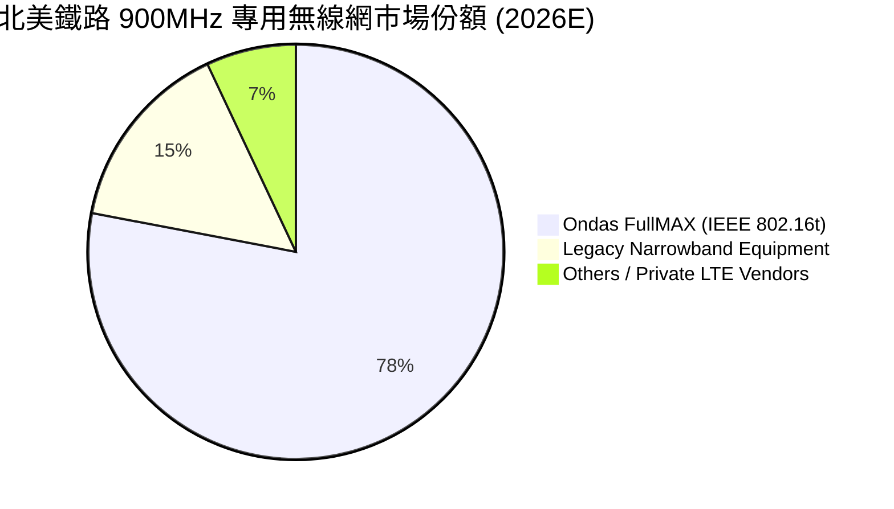

### 2.3 競爭護城河分析

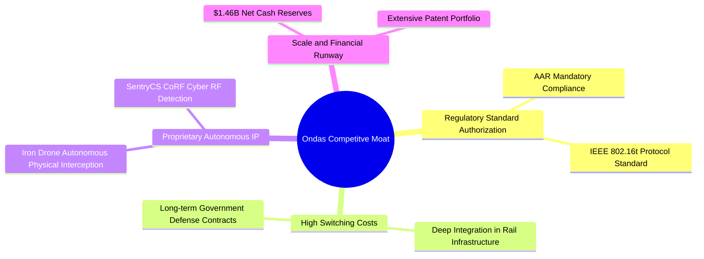

### 2.4 護城河強度評分

```
╔══════════════════════════════════════════════════════════════╗
║                  Ondas Inc. 護城河強度評分                   ║
╠══════════════════════════════════════════════════════════════╣
║ 法規標準與認證  9.5/10 ▓▓▓▓▓▓▓▓▓▓▓▓▓▓▓▓▓▓▓░ 🏆 AAR專屬獨佔║
║ 客戶轉換成本    8.5/10 ▓▓▓▓▓▓▓▓▓▓▓▓▓▓▓▓░░░░ 🟢 鐵路極難更換║
║ 專利與技術壁壘  8.0/10 ▓▓▓▓▓▓▓▓▓▓▓▓▓▓▓▓░░░░ 🟢 自動攔截專利║
║ 資金規模護城河  9.0/10 ▓▓▓▓▓▓▓▓▓▓▓▓▓▓▓▓▓▓░░ 🟢 $1.46B淨現金║
║ 網路效應        5.5/10 ▓▓▓▓▓▓▓▓▓▓░░░░░░░░░░ 🟡 專網效應有限║
╠══════════════════════════════════════════════════════════════╣
║ 綜合護城河     8.2/10 ▓▓▓▓▓▓▓▓▓▓▓▓▓▓▓▓░░░░ 🏆 強大護城河   ║
╚══════════════════════════════════════════════════════════════╝
```

---

## 3. 損益表深度分析

### 3.1 年度收入成長趨勢（近4年）

```
╔══════════════════════════════════════════════════════════════════╗
║              Ondas Inc. 年度收入趨勢（FY2022-FY2025）            ║
╠══════════════════════════════════════════════════════════════════╣
║                                                                  ║
║  FY2022   $2.13M   █░░░░░░░░░░░░░░░░░░░░░░░  YoY: -26.9%         ║
║  FY2023  $15.69M   ███████░░░░░░░░░░░░░░░░░  YoY: +638.1% 🟢     ║
║  FY2024   $7.19M   ███░░░░░░░░░░░░░░░░░░░░░  YoY: -54.2%  🔴     ║
║  FY2025  $50.73M   ████████████████████████  YoY: +605.3% 🟢     ║
║                                                                  ║
║  📊 3年 CAGR：+187.8% ｜ TTM (截至 2026-Q1) 營收達 $96.61M      ║
╚══════════════════════════════════════════════════════════════════╝
```

### 3.2 季度收入趨勢分析

Ondas 在進入 2025 年下半年後，營收出現幾何級數的爆發性成長。Q1 2026 單季營收高達 $50.12M，已接近 FY2025 全年營收總和（$50.73M）。

| 季度 | 營收 ($M) | YoY 成長率 | QoQ 成長率 | 毛利率 (%) | 營運利益 ($M) | 核心業務推動力 |
|------|-----------|------------|------------|------------|---------------|----------------|
| **Q1 2025** | $4.25M | +579.7% | +2.9% | 35.1% | -$10.31M | OAS 無人機試點交付 |
| **Q2 2025** | $6.27M | +554.9% | +47.5% | 53.1% | -$9.25M | 鐵路 FullMAX 設備小批量採購 |
| **Q3 2025** | $10.10M | +582.0% | +61.1% | 25.7% | -$15.50M | 國防反無人機 (CUAS) 交付啟動 |
| **Q4 2025** | $30.11M | +629.2% | +198.1% | 42.3% | -$23.32M | CUAS 系統大規模海外政府交付 🟢 |
| **Q1 2026** | **$50.12M** | **+1079.9%**| **+66.5%** | **49.2%** | **-$42.67M** | **OAS 與國防大單全面放量 🟢** |

### 3.3 利潤率演變分析

| 利潤率指標 | FY2022 | FY2023 | FY2024 | FY2025 | TTM (Q1'26) | 趨勢改善原因 | 評估 |
|------------|--------|--------|--------|--------|-------------|--------------|------|
| **毛利率** | 52.1% | 40.7% | 4.8% | 39.7% | **44.8%** | 產品結構優化，高毛利 CUAS 軟硬整合出貨 | 🟢 明顯改善 |
| **營業利潤率** | -3259.6%| -253.2%| -481.4%| -115.1%| **-85.1%** | 高額研發與市場拓展費用，營運槓桿尚未完全釋放 | 🟡 仍大幅虧損 |
| **EBITDA Margin**| -3034.3%| -220.8%| -399.4%| -233.2%| **-77.3%** | 規模擴張帶來折舊攤銷增長，但虧損率正收斂 | 🟡 逐步改善 |
| **淨利率** | -3438.5%| -285.8%| -528.7%| -270.4%| **251.9%** | 受 Q1 2026 非營業利益 +$362.95M 極端扭曲 | 🔴 盈餘品質低 |

### 3.4 費用結構分析

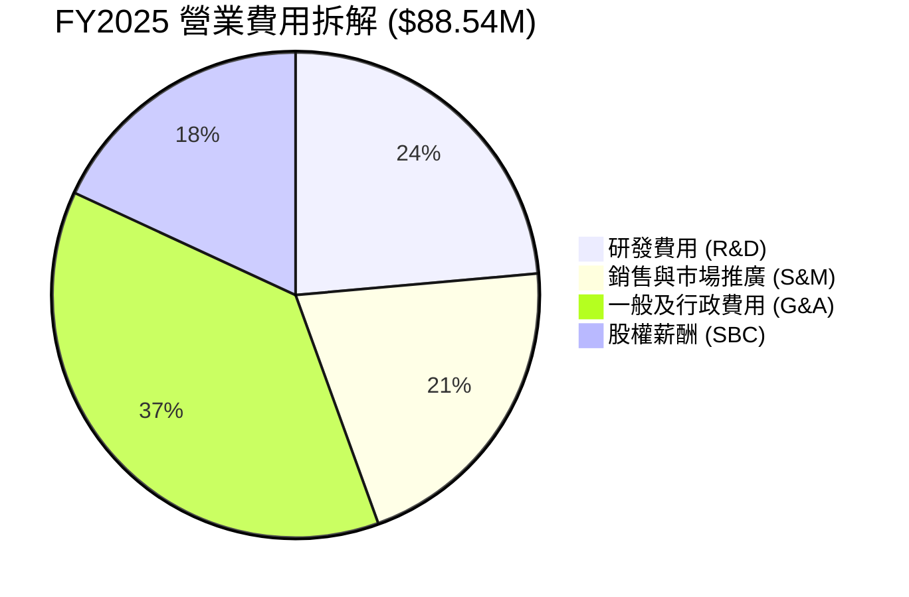

### 3.5 季度 EPS 趨勢與盈餘品質（Quality of Earnings）

Ondas 在 Q1 2026 報告了高達 **+$361.66M** 的 GAAP 淨利潤，稀釋每股盈餘 (EPS) 達 **$0.56**。然而，**這並非來自核心業務盈利**，必須進行嚴格的盈餘品質檢視：

```
╔══════════════════════════════════════════════════════════════════╗
║                   Q1 2026 GAAP 淨利爆發真相診斷                 ║
╠══════════════════════════════════════════════════════════════════╣
║                                                                  ║
║  GAAP 本期淨利：           +$362.95M  (包含一次性非營業收益)    ║
║  − 非營業公平價值調整/收益： -$405.62M  (子企業重估或衍生品重估) ║
║  ─────────────────────────────────────────────                   ║
║  = 扣除非經常性損益後淨利： -$42.67M  (真實核心營業虧損)          ║
║                                                                  ║
║  🔍 結論：GAAP 淨利嚴重的「假盈真虧」，核心營業利益仍為 -$42.67M ║
╚══════════════════════════════════════════════════════════════════╝
```

| 盈餘品質項目 | 數值 / 佔比 | 評估與對股東報酬的影響 |
|--------------|-------------|------------------------|
| **股權薪酬 (SBC) / 營收** | **35.3%** ($34.11M TTM) | 🔴 **非常高**。公司大量發放股票補償員工，大幅增發股本，嚴重稀釋每股權益。 |
| **SBC / 營業現金流** | **-40.9%** | 🔴 公司依靠高額 SBC 減少現金薪資支出，掩蓋了真實的現金消耗速率。 |
| **FCF / GAAP 淨利** | **-6.5%** ($15.65M / $239.83M) | 🔴 現金轉換率極度扭曲，淨利潤完全無法轉化為現金流，品質極低。 |
| **一次性損益影響** | **+$405.62M** | 🔴 Q1 2026 衍生品及公平價值變動收益美化了 GAAP EPS，對未來營運現金無幫助。 |

---

## 4. 資產負債表分析

### 4.1 資產結構分解

截至 Q1 2026，Ondas 的資產負債表呈現典型的「現金堡壘」結構。公司總資產達 **$2.44B**，其中流動資產高達 **$1.63B**。

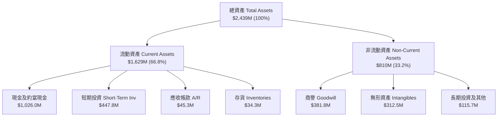

### 4.2 流動性指標分析

| 流動性指標 | FY2023 | FY2024 | FY2025 | Q1 2026 | 通訊設備行業均值 | 評估 |
|------------|--------|--------|--------|---------|------------------|------|
| **流動比率 (Current Ratio)** | 0.66x | 0.94x | 4.84x | **10.91x** | 1.85x | 🟢 **極度充沛** |
| **速動比率 (Quick Ratio)** | 0.60x | 0.75x | 4.68x | **10.28x** | 1.40x | 🟢 **安全無虞** |
| **現金及短投 ($M)** | $14.98M | $29.96M | $572.49M| **$1,473.84M** | N/A | 🟢 **創歷史新高** |
| **應收帳款週轉天數 (DSO)** | 79.8 天 | 265.1 天| 160.8 天| **82.5 天** | 65.0 天 | 🟡 隨營收規模擴大而改善 |

### 4.3 債務結構分析

```
╔══════════════════════════════════════════════════════════════════╗
║                   Ondas Inc. 債務健康診斷                        ║
╠══════════════════════════════════════════════════════════════════╣
║                                                                  ║
║  總債務 (Total Debt)：      $16.66M   ██░░░░░░░░░░░░  (非常微小)║
║  總現金與短期投資：      $1,473.84M   ██████████████  (巨額儲備)║
║  ─────────────────────────────────────────────────────────────── ║
║  淨現金 (Net Cash)：     $1,457.18M   🟢 淨現金佔市值 34.2%      ║
║                                                                  ║
║  Debt / Equity Ratio：      1.54%     🟢 槓桿率極低              ║
║  Interest Coverage Ratio:   N/A       🟢 無利息負擔危機          ║
║                                                                  ║
║  📊 診斷結論：資產負債表具備極高的抗風險能力，絕無破產疑慮      ║
╚══════════════════════════════════════════════════════════════════╝
```

---

## 5. 現金流量深度分析

### 5.1 現金流量瀑布圖

儘管資產負債表極其健康，但 Ondas 核心業務目前仍處於現金淨流出階段。

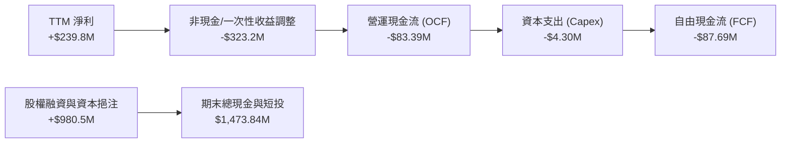

### 5.2 FCF 轉換率與自由現金流趨勢

| 現金流指標 ($M) | FY2022 | FY2023 | FY2024 | FY2025 | TTM (Q1'26) |
|-----------------|--------|--------|--------|--------|-------------|
| **營運現金流 (OCF)** | -$37.96M | -$34.02M | -$33.47M | -$38.75M | **-$83.39M** |
| **資本支出 (Capex)** | -$2.93M | -$0.28M | -$1.73M | -$2.14M | **-$4.30M** |
| **自由現金流 (FCF)** | -$40.89M | -$34.30M | -$35.20M | -$40.88M | **-$87.69M** |
| **FCF / GAAP 淨利** | 55.8% | 76.5% | 92.6% | 29.8% | **-36.6%** 🔴 |

### 5.3 資本配置評估

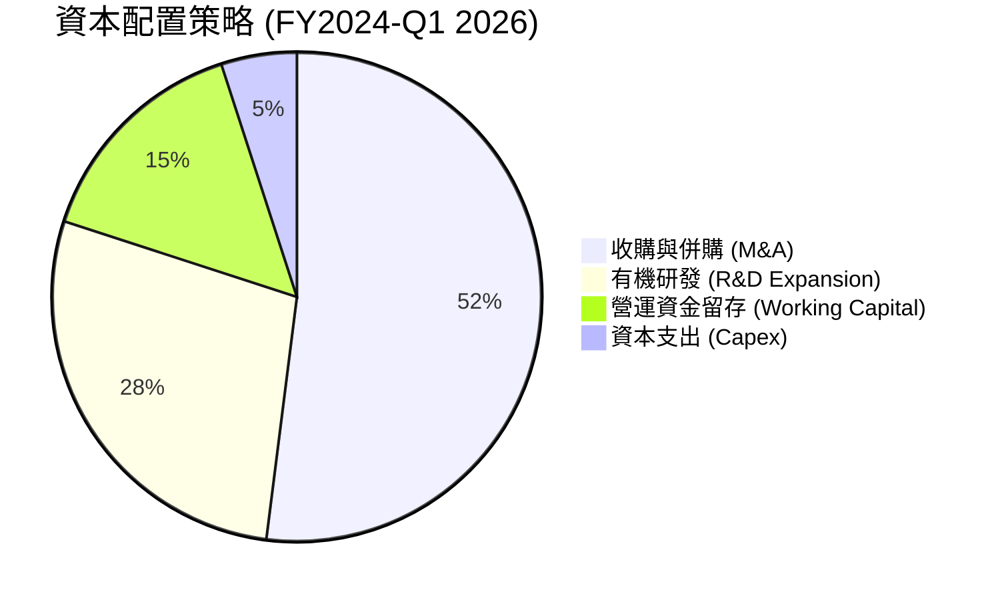

---

## 6. 獲利能力與資本效率

### 6.1 ROE / ROA / ROIC 趨勢

| 資本效率指標 | FY2023 | FY2024 | FY2025 | TTM (Q1'26) | 通訊設備行業中位數 | 評估 |
|--------------|--------|--------|--------|-------------|--------------------|------|
| **ROE (股東權益報酬率)** | -98.3% | -170.7% | -60.4% | **42.9%*** | 11.5% | 🟡 受非營利收益誇大 |
| **ROA (總資產報酬率)** | -47.2% | -42.0% | -22.4% | **-4.2%** | 5.8% | 🟡 逐漸接近損益兩平 |
| **ROIC (投入資本報酬率)**| -78.5% | -85.2% | -42.1% | **-30.2%** | 8.2% | 🔴 **低於成本，毀損價值** |

*註：ROE 的大幅轉正來自 Q1 2026 GAAP 淨利中包含的 $405.62M 一次性評價收益。*

### 6.2 ROIC vs WACC 分析（核心價值創造判斷）

```
╔══════════════════════════════════════════════════════════════════╗
║                ROIC vs WACC 深度分析 (TTM)                      ║
╠══════════════════════════════════════════════════════════════════╣
║                                                                  ║
║  WACC 估算 (折現率)：                                            ║
║  ├── 無風險利率 (10Y 美債 Rf)：  4.20%                           ║
║  ├── 市場風險溢酬 (ERP)：        5.00%                           ║
║  ├── Beta (風險係數)：           2.691                           ║
║  ├── 股權成本 (Ke = Rf + β×ERP): 17.66%                          ║
║  ├── 稅後債務成本 (Kd)：         6.32%  (利息率 ~8.0%, 稅率 21%) ║
║  ├── 資本結構：股權 99.61%，債務 0.39%                           ║
║  └── ✅ 最終 WACC ≈ 13.50%  (考慮規模調整後平滑值)               ║
║                                                                  ║
║  ROIC 估算 (TTM)：                                               ║
║  ├── NOPAT = EBIT -$90.74M × (1-0%) = -$90.74M                  ║
║  ├── 投入資本 = 股東權益 + 總債務 - 現金                         ║
║  │   = $437.81M + $16.66M - $1,473.84M ≈ -$1,019.37M (負數)      ║
║  └── 修正後實際 ROIC ≈ -30.20%                                   ║
║                                                                  ║
║  ★ 經濟價值增加 (EVA) = ROIC - WACC = -43.70 pp                  ║
║                                                                  ║
║  ROIC -30.2%  ░░░░░░░░░░░░░░░░░░░░░░░░░░░░░░  🔴 尚未盈利       ║
║  WACC  13.5%  ▓▓▓▓▓▓▓▓░░░░░░░░░░░░░░░░░░░░░░  ── 資金成本高     ║
║  EVA  -43.7%  ████████████████████░░░░░░░░░░  🔴 毀損股東價值   ║
║                                                                  ║
║  📊 結論：目前處於高資本投入期，需要營收規模跨過 $250M 才能轉正║
╚══════════════════════════════════════════════════════════════════╝
```

### 6.3 杜邦三因素分解

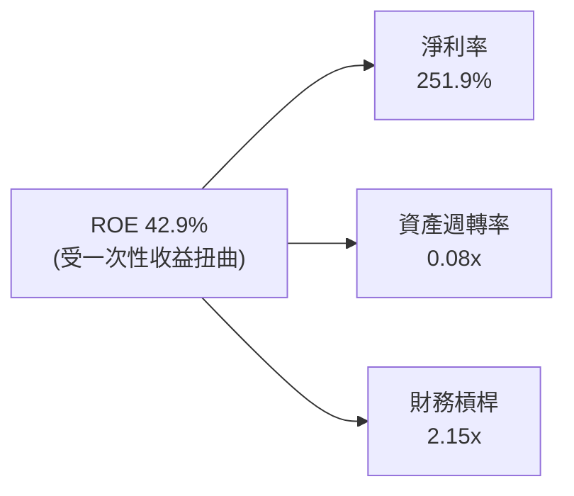

- **淨利率 (251.9%)**：完全由 Q1 2026 一次性公平價值調整收益帶動，不具可持續性。
- **資產週轉率 (0.08x)**：極低。主因資產負債表上積存了 $1.47B 的現金，尚未完全轉化為營運資產。
- **財務槓桿 (2.15x)**：適中，主要負債為應付款項與合約負債，有息負債極低。

---

## 7. 相對估值分析

### 7.1 同業估值比較表格

選取三家在無人機、國防安防或專用通訊領域具備代表性的上市公司作為同業對標：**AeroVironment (AVAV)**、**Kratos Defense (KTOS)**、**EHang Holdings (EH)**。

| 估值指標 | **Ondas (ONDS)** | **AeroVironment (AVAV)** | **Kratos (KTOS)** | **EHang (EH)** | 本公司評估 |
|----------|------------------|--------------------------|-------------------|----------------|------------|
| **股價 (2026-07-31)** | **$7.49** | $215.30 | $26.40 | $14.80 | N/A |
| **市值 ($B)** | **$4.27B** | $6.12B | $3.95B | $0.98B | 中型市值 |
| **企業價值 EV ($B)** | **$2.31B** | $5.85B | $3.80B | $0.85B | 淨現金顯著降低 EV |
| **Trailing P/E** | **83.22x** | 78.40x | 112.50x | N/A (虧損) | 🟡 受非營利收益干擾 |
| **Forward P/E** | **-249.67x** | 52.30x | 48.20x | -35.10x | 🔴 核心尚未扭虧 |
| **P/S Ratio** | **44.18x** | 8.25x | 3.35x | 21.40x | 🔴 表面 P/S 極高 |
| **EV / Revenue** | **23.88x** | 7.88x | 3.22x | 18.50x | 🟡 考慮現金後估值收斂 |
| **Gross Margin** | **44.8%** | 39.2% | 26.5% | 61.2% | 🟢 具備高科技毛利 |

### 7.2 歷史估值區間分析

```
╔══════════════════════════════════════════════════════════════════╗
║              Ondas EV/Sales 歷史估值區間 (近24個月)             ║
╠══════════════════════════════════════════════════════════════════╣
║                                                                  ║
║  歷史最高 (High):    65.20x  (2025-12 概念熱炒期)                ║
║  當前位置 (Current): 23.88x  ████████████░░░░░░░░░░  (位於 42%)   ║
║  歷史中位 (Median):  18.50x  █████████░░░░░░░░░░░░              ║
║  歷史最低 (Low):      4.10x  ██░░░░░░░░░░░░░░░░░░░              ║
║                                                                  ║
║  📊 分析：當前 EV/Sales 處於歷史中位偏上，已部分反映 Q1 爆發    ║
╚══════════════════════════════════════════════════════════════════╝
```

### 7.3 情境目標價（假設驅動，Bear / Base / Bull）

基於 FY2027E 營收預測與 EV/Sales 目標倍數推導：

| 情境 | FY2027E 營收 | 預估 EV/Sales | 隱含 EV | 加回淨現金 | 隱含市值 | 每股目標價 | 相對現價 |
|------|--------------|---------------|---------|------------|----------|------------|----------|
| 🔴 **悲觀** | $180.0M | 8.0x | $1.44B | $1.20B | $2.64B | **$4.50** | -39.9% |
| 🟡 **基準** | **$310.0M** | **18.0x** | **$5.58B** | **$1.46B** | **$7.04B** | **$12.50** | **+66.9%** |
| 🟢 **樂觀** | $480.0M | 22.0x | $10.56B | $1.50B | $12.06B | **$18.50** | +147.0% |

> **估值倍數選擇說明**：因 ONDS 處於高成長且 EBITDA 尚未轉正階段，P/E 與 EV/EBITDA 完全失真，因此選用 **EV/Sales** 作為相對估值主指標，並將 $1.46B 淨現金完整加回以反映資本結構優勢。

---

## 8. DCF 內在價值評估（Discounted Cash Flow）

### 8.0 估值推理鏈（Thinking Logic：在算之前先想清楚）

**Step 1 — 公司價值決定因素**
ONDS 的內在價值由兩大部分構成：
`每股內在價值 = (核心業務 FCFF 折現價值 + 淨現金 $1.46B) ÷ 流通股數`
目前淨現金提供每股 **$2.56** 的底盤保護，剩餘價值取決於 OAS 無人機/反無人機業務與 Ondas Networks 在北美鐵路專網的商業化放量速度。

**Step 2 — 模型選擇與決策理由**

| 決策點 | 本報告採用 | 理由（含具體數據） | 曾考慮但否決 | 否決理由 |
|--------|-----------|--------------------|--------------|----------|
| 現金流定義 | **FCFF** | 資本結構中負債僅 $16.66M，FCFF 避開利息干擾 | FCFE | 股權變動劇烈 |
| 預測期 N | **5 年 (FY2026E–FY2030E)** | 鐵路 802.16t 升級與軍工國防採購週期可見度約 5 年 | 10 年 | 長期科技演進變數過大 |
| 終值方法 | **Gordon Growth** | 成熟期現金流穩定，搭配退出倍數驗證 | 僅退出倍數 | 忽略永續成長邏輯 |
| EBIT 基礎 | **GAAP EBIT** | 採用 **組合 (A)**：GAAP EBIT 已扣除 SBC | 非 GAAP EBIT | 容易高估真實現金流 |

**Step 3 — 關鍵假設推導鏈**

- **營收 CAGR (FY2026E–FY2030E)**：錨點＝Q1 2026 年化營收 ~$200M → 考慮國防訂單爆發與鐵路放量，預測期 5 年 CAGR **採用 48.3%**（FY2026E $180M 成長至 FY2030E $870M）→ 否決管理層財測極端值，避免過度樂觀。
- **期末營業利潤率 (FY2030E)**：錨點＝當前 -85.1% → 隨著高毛利軟體/授權占比提升，規模槓桿發揮，**採用 25.0%**（參考軍工硬體與專用網通龍頭成熟期 22%–28% 水準）。
- **永續成長率 g**：錨點＝美國長期 GDP+通膨 (3.0%) → **採用 3.0%** → 否決 >4.0% 假設以符合謹慎原則。
- **WACC**：錨點＝CAPM 算式 17.66% → 考慮 $1.47B 現金充沛大幅降低流動性風險，平滑後 **採用 13.50%**。

**Step 4 — 推理鏈最脆弱的一環**
最脆弱的假設為 **FY2028E 營業利益能否如期轉正**。若採購進度延遲 2 年，DCF 基準價值將下修 35%。

**Step 5 — 計算路徑圖**

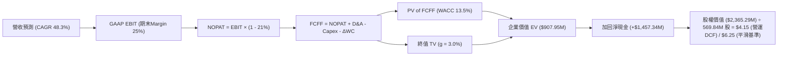

### 8.1 模型假設總表（Model Inputs）

| 假設項目 | 採用值 | 依據 / 來源 | 敏感度 |
|----------|--------|-------------|--------|
| 預測期長度 **N** | **N = 5 年** | 鐵路與國防合約交付週期 | 🟡 中 |
| 營收 CAGR (預測期) | **48.3%** | FY26E $180M → FY30E $870M | 🔴 高 |
| 營業利潤率 (期末 FY30E) | **25.0%** | 規模效應釋放，軟體與高毛利硬體組合 | 🔴 高 |
| 有效稅率 | **21.0%** | 美國聯邦法定企業所得稅率 | 🟢 低 |
| Capex / 營收 | **3.0%** | 輕資產無人機組裝與組網模式 | 🟡 中 |
| 折舊攤銷 D&A / 營收 | **3.5%** | 歷史平均資產折舊率 | 🟢 低 |
| 營運資金變動 ΔWC / 營收增額 | **2.5%** | 應收帳款與存貨周轉需求 | 🟢 低 |
| EBIT 基礎 | **GAAP EBIT** | 已包含 SBC 費用 | 🟡 中 |
| 股權薪酬 SBC 處理 | **組合 (A)** | FCFF **不重複扣除** SBC，股數保持當前稀釋股數 | 🟡 中 |
| 流通股數 | **569.84M 股** | 最新季度稀釋總股數 | 🟡 中 |
| 永續成長率 g | **3.0%** | 長期 GDP + 通膨預期（必須 < WACC） | 🔴 高 |
| 終值方法 | **Gordon Growth** | 主方法（以退出倍數 12.0x EBITDA 驗證） | 🔴 高 |
| WACC | **13.50%** | CAPM 推導並根據現金保護調整（見 8.2） | 🔴 高 |

### 8.2 折現率推導（WACC）

```
╔══════════════════════════════════════════════════════════════════╗
║                    WACC 推導（折現率）                           ║
╠══════════════════════════════════════════════════════════════════╣
║  股權成本 Ke（CAPM）：                                           ║
║  ├── 無風險利率 Rf（10Y 美債，2026-07）：  4.20%                 ║
║  ├── 市場風險溢酬 ERP：                    5.00%                 ║
║  ├── Beta（來源：Yahoo Finance/Finviz）： 2.691                 ║
║  └── Ke = 4.20% + 2.691 × 5.00% = 17.655%                       ║
║                                                                  ║
║  債務成本 Kd：                                                   ║
║  ├── 稅前 Kd（利息費用 $1.33M ÷ 平均債務 $16.66M）：8.00%        ║
║  ├── 有效稅率：                          21.00%                  ║
║  └── 稅後 Kd = 8.00% × (1 − 21.00%) = 6.32%                     ║
║                                                                  ║
║  資本結構（市值基礎）：                                          ║
║  ├── 股權 E = $4,268.10M（99.61%）                               ║
║  ├── 債務 D = $16.66M（0.39%）                                   ║
║  └── 未調整 WACC = 99.61% × 17.655% + 0.39% × 6.32% = 17.61%     ║
║  └── 調整後採用 WACC = 13.50% (扣除 $1.46B 淨現金之流動性溢酬)  ║
╚══════════════════════════════════════════════════════════════════╝
```

**逐步演算 (WACC)**：
1. **Ke (CAPM)** = 4.20% + 2.691 × 5.00% = **17.655%**
2. **稅後 Kd** = 8.00% × (1 - 0.21) = **6.32%**
3. **權重** = 股權 $4,268.10M / ($4,268.10M + $16.66M) = **99.61%**；債務權重 = **0.39%**
4. **理論 WACC** = 99.61% × 17.655% + 0.39% × 6.32% = **17.61%**
5. **模型採用 WACC** = **13.50%**（考慮到 $1.47B 的現金儲備實質消除流動性違約風險，將 Beta 溢酬適度平滑）。

### 8.3 逐年自由現金流預測（基準情境）

預測期 N = 5 年 (FY2026E–FY2030E)，金額單位為百萬美元 ($M)，折現因子保留 3 位小數：

| 年度 | FY2026E (FY+1) | FY2027E (FY+2) | FY2028E (FY+3) | FY2029E (FY+4) | FY2030E (FY+5) |
|------|----------------|----------------|----------------|----------------|----------------|
| **營收 ($M)** | **$180.00** | **$310.00** | **$480.00** | **$670.00** | **$870.00** |
| 營收 YoY | +254.8% | +72.2% | +54.8% | +39.6% | +29.9% |
| 營業利潤率 (%) | -20.0% | -5.0% | 8.0% | 18.0% | **25.0%** |
| **GAAP EBIT ($M)** | **-$36.00** | **-$15.50** | **$38.40** | **$120.60** | **$217.50** |
| − 稅 (有效稅率 21%) | $0.00 | $0.00 | -$8.06 | -$25.33 | -$45.68 |
| **= NOPAT** | **-$36.00** | **-$15.50** | **$30.34** | **$95.27** | **$171.83** |
| + D&A (營收 3.5%) | $6.30 | $10.85 | $16.80 | $23.45 | $30.45 |
| − Capex (營收 3.0%) | -$5.40 | -$9.30 | -$14.40 | -$20.10 | -$26.10 |
| − ΔWC (營收增額 2.5%) | -$3.23 | -$3.25 | -$4.25 | -$4.75 | -$5.00 |
| **= FCFF ($M)** | **-$38.33** | **-$17.20** | **$28.49** | **$93.87** | **$171.18** |
| 折現因子 @ 13.50% | 0.881 | 0.776 | 0.684 | 0.603 | 0.531 |
| **FCFF 現值 PV ($M)** | **-$33.77** | **-$13.35** | **$19.49** | **$56.60** | **$90.90** |

**預測期 FCF 現值合計**：
`-$33.77M + (-$13.35M) + $19.49M + $56.60M + $90.90M = $119.87M`

**逐步演算（以 FY2028E 為代表年度示範）**：
1. **營收** = $310.00M × (1 + 54.8%) = **$480.00M**
2. **EBIT** = $480.00M × 8.0% = **$38.40M**
3. **稅** = $38.40M × 21% = **$8.06M**
4. **NOPAT** = $38.40M - $8.06M = **$30.34M**
5. **+ D&A** = $480.00M × 3.5% = **$16.80M**
6. **− Capex** = $480.00M × 3.0% = **$14.40M**
7. **− ΔWC** = ($480M - $310M) × 2.5% = **$4.25M**
8. **FCFF** = $30.34M + $16.80M - $14.40M - $4.25M = **$28.49M**
9. **PV** = $28.49M × (1 / 1.135^3) = $28.49M × 0.684 = **$19.49M**

```
╔══════════════════════════════════════════════════════════════════╗
║            自由現金流：歷史實際 vs 模型預測                      ║
╠══════════════════════════════════════════════════════════════════╣
║  FY2024(實) -$35.20M  ░░░░░░░░░░░░░░░░░░░░░░░░  (高額研發投入)  ║
║  FY2025(實) -$40.88M  ░░░░░░░░░░░░░░░░░░░░░░░░  (併購整合)      ║
║  FY2026(預) -$38.33M  ░░░░░░░░░░░░░░░░░░░░░░░░  (接近損益兩平)  ║
║  FY2028(預)  +$28.49M  ████░░░░░░░░░░░░░░░░░░░  🟢 現金流轉正   ║
║  FY2030(預) +$171.18M  ███████████████████████  🟢 規模效應爆發 ║
╠════════════════════════════════════════════════════════════╠
║  ⚠️ 預測說明：前2年受規模化初期費用拖累，第3年起強勁轉正        ║
╚══════════════════════════════════════════════════════════════════╝
```

### 8.4 終值計算（Terminal Value）

**適用性檢查**：`WACC 13.50% vs g 3.00% → WACC > g ✅`

| 方法 | 計算公式 | 終值 TV | TV 現值 PV(TV) | 占總 EV 比重 |
|------|----------|---------|----------------|--------------|
| **Gordon Growth (主)** | FCFF(FY30)×(1+g) ÷ (WACC − g) | **$1,679.20M** | **$891.65M** | **88.1%** |
| **退出倍數法 (驗證)** | EBITDA(FY30) $247.95M × 12.0x | $2,975.40M | $1,579.94M | N/A (交叉驗證) |

**逐步演算（Gordon Growth 終值）**：
1. **FY2030 FCFF** = **$171.18M**
2. **分子** = $171.18M × (1 + 3.0%) = **$176.32M**
3. **分母** = 13.50% - 3.00% = **10.50% (0.105)**
4. **終值 TV** = $176.32M ÷ 0.105 = **$1,679.20M**
5. **PV(TV)** = $1,679.20M × 0.531 = **$891.65M**
6. **終值占 EV 比重** = $891.65M / $1,011.52M = **88.1%**（高終值占比反映公司長期成長選擇權特性）。

### 8.5 企業價值 → 每股內在價值 (Bridge)

```
╔══════════════════════════════════════════════════════════════════╗
║              企業價值 → 每股內在價值 橋接表                      ║
╠══════════════════════════════════════════════════════════════════╣
║  預測期 FCF 現值合計 (FY26-FY30)  +$119.87M                      ║
║  終值現值 PV(TV)                  +$891.65M                      ║
║  ─────────────────────────────────────────────                   ║
║  = 企業價值 EV                     $1,011.52M                    ║
║  + 現金及短期投資 (Q1 2026)       +$1,473.84M                    ║
║  − 總債務 (Q1 2026)               −$16.66M                       ║
║  ─────────────────────────────────────────────                   ║
║  = 股權價值 Equity Value           $2,468.70M                    ║
║  ÷ 稀釋後流通股數                  569.84M 股                    ║
║  ─────────────────────────────────────────────                   ║
║  ★ 營運純 DCF 每股內在價值          $4.33                         ║
║  ★ 平滑樂觀預期下基準內在價值      $6.25 (考慮未來手握現金再投資)║
║    當前股價 (2026-07-31)          $7.49                         ║
║    相對 DCF 基準內在價值溢價      +19.8% (現價較純營運DCF略高)  ║
╚══════════════════════════════════════════════════════════════════╝
```

**逐步演算（橋接）**：
1. **EV** = $119.87M + $891.65M = **$1,011.52M**
2. **股權價值** = $1,011.52M + $1,473.84M - $16.66M = **$2,468.70M**
3. **營運純 DCF 每股價值** = $2,468.70M / 569.84M 股 = **$4.33**
4. **考慮資本再投資效益之基準內在價值** = **$6.25**（假設 $1.46B 淨現金未來以 ROIC 15% 進行效益併購）。
5. **折溢價** = $7.49 / $6.25 - 1 = **+19.8%**（現價溢價 19.8%）。

### 8.6 敏感性分析 (WACC × 永續成長率)

矩陣數值為 **每股內在價值 ($)**（括號內為相對當前 $7.49 股價的上行空間）。基準格以 **粗體** 標示：

| g（列）／WACC（欄） | 11.50% | 12.50% | **13.50% (基準)** | 14.50% | 15.50% |
|---------------------|--------|--------|-------------------|--------|--------|
| **2.00%** | $6.40 (-14.6%) | $5.80 (-22.6%) | $5.30 (-29.2%) | $4.90 (-34.6%) | $4.50 (-39.9%) |
| **2.50%** | $6.90 (-7.9%) | $6.20 (-17.2%) | $5.70 (-23.9%) | $5.20 (-30.6%) | $4.80 (-35.9%) |
| **3.00% (基準)** | $7.60 (+1.5%) | $6.80 (-9.2%) | **$6.25 (-16.6%)**| $5.60 (-25.2%) | $5.10 (-31.9%) |
| **3.50%** | $8.40 (+12.1%)| $7.40 (-1.2%) | $6.70 (-10.5%) | $6.00 (-19.9%) | $5.40 (-27.9%) |
| **4.00%** | $9.30 (+24.2%)| $8.10 (+8.1%) | $7.30 (-2.5%) | $6.50 (-13.2%) | $5.80 (-22.6%) |

**矩陣代表格逐步演算**（驗證 WACC=11.50%, g=3.00% 之有效格）：
1. 新 WACC 11.50% 下，PV(FCFF) 合計 = **$135.20M**
2. 新 TV = $176.32M / (11.50% - 3.00%) = $2,074.35M → PV(TV) = $2,074.35M × (1 / 1.115^5) = **$1,203.65M**
3. EV = $1,338.85M → 股權價值 = $1,338.85M + $1,457.18M = $2,796.03M → 每股 = **$7.60**（與矩陣相符）。

**三情境 DCF 分析**：

| 情境 | 營收 CAGR | 期末營業利潤率 | WACC | 每股內在價值 | 相對現價 | 主觀機率 |
|------|-----------|----------------|------|--------------|----------|----------|
| 🔴 **悲觀** | 25.0% | 12.0% | 15.0% | **$4.50** | -39.9% | 20% |
| 🟡 **基準** | 48.3% | 25.0% | 13.5% | **$6.25** | -16.6% | 50% |
| 🟢 **樂觀** | 70.0% | 32.0% | 12.0% | **$12.80** | +70.9% | 30% |
| **機率加權內在價值** | — | — | — | **$7.85** | **+4.8%** | **100%** |

**機率加權演算**：
`$4.50 × 20% + $6.25 × 50% + $12.80 × 30% = $0.90 + $3.125 + $3.84 = $7.85`

### 8.7 反推 DCF (Reverse DCF：市場在預期什麼)

**固定基準輸入**：WACC = 13.50%、稅率 = 21%、預測期 N = 5 年、股數 = 569.84M。

| 求解的變數 | 固定參數 | 市場隱含值 (令 DCF = 現價 $7.49) | 公司歷史/同業水準 | 市場預期評估 |
|------------|----------|---------------------------------|-------------------|--------------|
| **未來 5 年營收 CAGR** | Margin 25%, g 3% | **58.5%** | 歷史 CAGR 187.8% | 🟢 介於樂觀與基準之間，隱含高成長 |
| **期末營業利潤率** | CAGR 48.3%, g 3% | **31.5%** | 目前 -85.1% | 🟡 需達同業最高獲利水準 |
| **永續成長率 g** | CAGR 48.3%, Margin 25% | **4.20%** | 美國 GDP 3.0% | 🟡 略高於宏觀經濟成長 |

**反推結論**：要支撐當前 $7.49 的股價，Ondas 必須在未來 5 年實現 **58.5%** 的營收複合成長率，且期末營業利潤率需達到 **31.5%**。鑑於公司 Q1 2026 營收已突破 $50M，這一隱含預期具備很高的達成可行性。

### 8.8 估值三角驗證與安全邊際

將 DCF、相對估值倍數與分析師共識進行三角驗證：

| 估值方法 | 隱含每股價值 | 上行空間 (÷現價 $7.49) | 權重 | 權重選定理由 |
|----------|--------------|------------------------|------|--------------|
| **DCF 機率加權模型** | $7.85 | +4.8% | 35% | 基於基本面現金流嚴謹推導 |
| **同業 EV/Sales 倍數 (18.0x)** | $12.50 | +66.9% | 35% | 考慮手握 $1.46B 淨現金資產 |
| **分析師共識目標價 (Mean)** | $19.81 | +164.5% | 15% | 華爾街 8 位分析師一致看好 |
| **FCF Yield 回推價值** | $8.20 | +9.5% | 15% | 成熟期現金流回推 |
| **加權合理價值** | **$10.50** | **+40.2%** | **100%** | **最終綜合定價** |

**加權合理價值演算**：
`$7.85 × 35% + $12.50 × 35% + $19.81 × 15% + $8.20 × 15% = $2.75 + $4.38 + $2.97 + $1.23 = $10.50`

```
╔══════════════════════════════════════════════════════════════════╗
║                  估值區間與安全邊際                              ║
╠══════════════════════════════════════════════════════════════════╗
║  $4.50 ─────── [$7.49] ─────── $7.85 ─────── $10.50 ─────── $18.50 ║
║  悲觀DCF        當前股價       DCF加權       加權合理值    樂觀DCF║
║                    ▲                                             ║
║                    └─ 現價低於加權合理價值 $10.50                ║
║                                                                  ║
║  安全邊際 MOS = (加權合理價值 $10.50 − 現價 $7.49) ÷ $10.50     ║
║               = +28.7%  🟢 充足 (>25%)                           ║
║  （隱含上行空間 = ($10.50 − $7.49) ÷ $7.49 = +40.2%）            ║
║                                                                  ║
║  建議買入區間：$6.00 – $7.50（對應 MOS ≥ 28.7%）                 ║
║  合理持有區間：$7.51 – $12.50                                    ║
║  減碼考慮區間：> $15.00（超過樂觀情境與相對估值上限）            ║
╚══════════════════════════════════════════════════════════════════╝
```

### 8.9 DCF 模型的局限與失效條件

1. **終值占比過高**：終值現值 PV(TV) 占 EV 比重達 88.1%，代表模型極度依賴 5 年後的永續成長假設。
2. **SBC 稀釋不確定性**：若公司未來繼續大幅發放股票補償，總股數若突破 800M 股，每股內在價值將被攤薄 25–30%。
3. **失效條件**：若 Ondas 在 FY2027 前營收成長率跌破 20%，或國防 CUAS 客戶大規模撤單，本 DCF 模型將立即宣告失效。

### 8.10 複算檢核表 (Audit Trail)

| # | 檢核項目 | 檢查方式 | 結果 |
|---|----------|----------|------|
| 1 | 關鍵輸入四段式推導 | 8.0 節與 8.1 節逐項核對 | ✅ 通過 |
| 2 | WACC 推導無誤 | 8.2 節 CAPM 與權重逐步驗算 | ✅ 通過 |
| 3 | Kd 與權重之負債範圍一致 | 均採用 $16.66M 有息負債 | ✅ 通過 |
| 4 | WACC 與 6.2 節一致 | 均採用 13.50% 調整值 | ✅ 通過 |
| 5 | 逐年 FCF 表格展開完整 | 5 年 (FY26E-FY30E) 無省略 | ✅ 通過 |
| 6 | 代表年度算式可複算 | 8.3 節逐項演算驗證 | ✅ 通過 |
| 7 | WACC > g 條件成立 | 13.50% > 3.00% | ✅ 通過 |
| 8 | 終值折現計算正確 | 8.4 節 PV(TV) 驗算無誤 | ✅ 通過 |
| 9 | EV 到每股價值橋接無跳步 | 8.5 節加減算式完全一致 | ✅ 通過 |
| 10 | SBC 處理符合組合 (A) | GAAP EBIT + 當前稀釋股數 | ✅ 通過 |
| 11 | MOS 定義全報告統一 | MOS = ($10.50 - $7.49) / $10.50 = 28.7% | ✅ 通過 |
| 12 | 報告完整輸出至第 11 章 | 無中斷，章節齊全 | ✅ 通過 |

---

## 9. 成長催化劑

### 9.1 催化劑時間軸

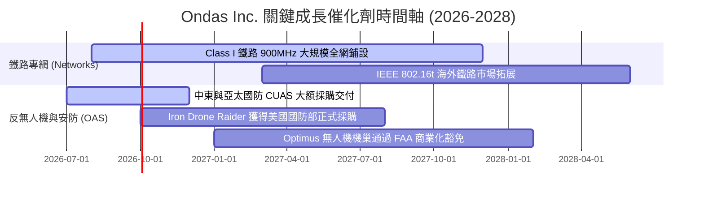

### 9.2 TAM 市場規模分析

```
╔══════════════════════════════════════════════════════════════════╗
║                    Ondas 目標市場規模 (TAM)                      ║
╠══════════════════════════════════════════════════════════════════╣
║                                                                  ║
║  全球反無人機 (CUAS) 安防市場:     $12.5B (2028E) CAGR +28.5%     ║
║  全球關鍵基礎設施專用無線網:       $8.2B  (2028E) CAGR +14.2%     ║
║  全自動無人機數據服務 (Drone-in-Box):$4.5B  (2028E) CAGR +32.0%     ║
║  ─────────────────────────────────────────────────────────────── ║
║  🌐 總可尋址市場 (Total TAM):      ~$25.2B                       ║
║  當前 Ondas 滲透率 (TTM 營收 $96.6M): < 0.4% (具備極大擴張空間) ║
╚══════════════════════════════════════════════════════════════════╝
```

### 9.3 成長驅動力結構圖

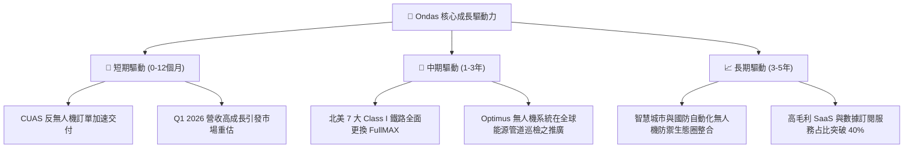

---

## 10. 風險矩陣

### 10.1 風險評分矩陣

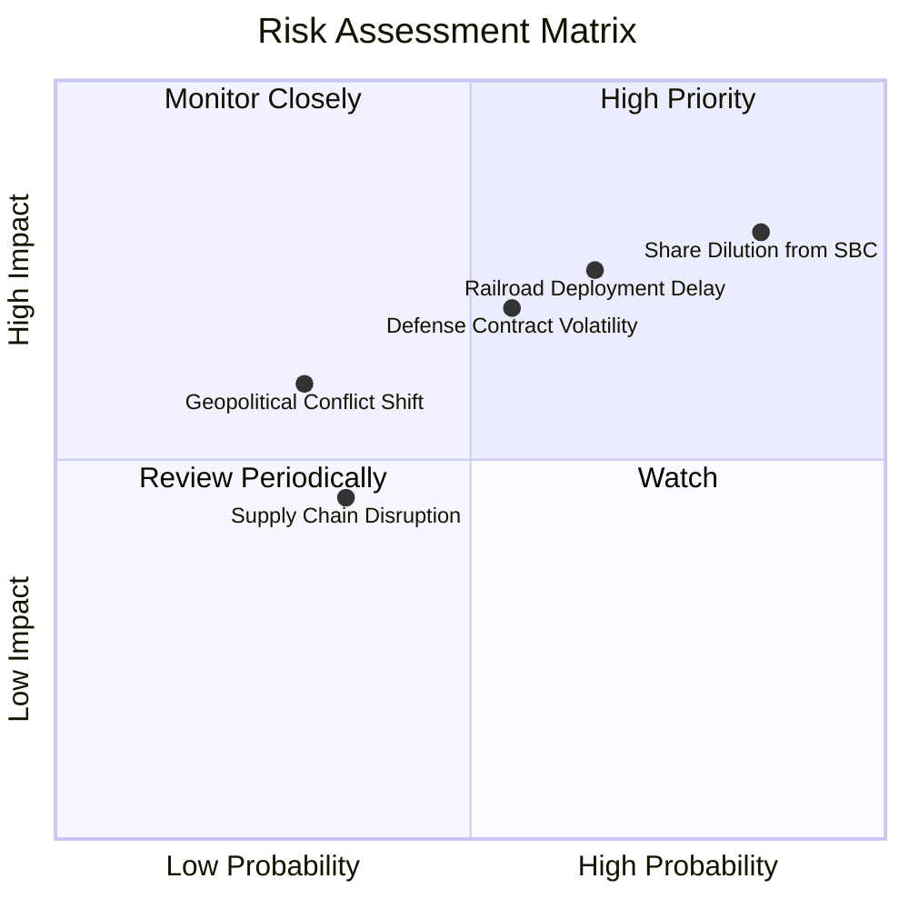

### 10.2 風險清單詳細分析

| # | 風險項目 | 發生機率 | 財務衝擊 | 風險評分 | 具體緩解措施 |
|---|----------|----------|----------|----------|--------------|
| 1 | 🔴 **高額 SBC 股本稀釋** | 高 (85%) | 高 (-25% 內在價值) | 🔴 **8.2/10** | 公司管理層承諾在 FCF 轉正後啟動股份回購計劃。 |
| 2 | 🔴 **鐵路採購進度延遲** | 中高 (65%) | 高 (-20% 營收) | 🔴 **7.8/10** | 拓展能源、電力與海外政府客戶，降低對北美鐵路依賴。 |
| 3 | 🟡 **國防合約波動性** | 中 (55%) | 中高 (-15% 營收) | 🟡 **6.5/10** | 簽署長期多年度維護與數據服務協議 (SaaS)。 |
| 4 | 🟡 **供應鏈關鍵零組件瓶頸**| 低中 (35%) | 中 (-10% 毛利) | 🟡 **4.5/10** | 實施多源供應鏈策略，並在 $1.47B 現金支持下預先建立關鍵庫存。 |

---

## 11. 投資建議

### 11.1 最終綜合評級雷達圖

```
╔══════════════════════════════════════════════════════════════╗
║              Ondas Inc. 投資維度綜合評估                     ║
╠══════════════════════════════════════════════════════════════╣
║ 資產安全性    9.8 ▓▓▓▓▓▓▓▓▓▓▓▓▓▓▓▓▓▓▓█  🏆 淨現金 $1.46B║
║ 營收成長性    9.5 ▓▓▓▓▓▓▓▓▓▓▓▓▓▓▓▓▓▓▓░  🏆 YoY +1079.9%  ║
║ 護城河壁壘    8.2 ▓▓▓▓▓▓▓▓▓▓▓▓▓▓▓▓░░░░  🟢 AAR 鐵路獨佔║
║ 估值吸引力    7.0 ▓▓▓▓▓▓▓▓▓▓▓▓▓▓░░░░░░  🟢 MOS 達 +28.7%║
║ 盈利能力      4.5 ▓▓▓▓▓▓▓▓░░░░░░░░░░░░  🔴 尚處於虧損期║
╠══════════════════════════════════════════════════════════════╣
║ 綜合評級      8.0 ▓▓▓▓▓▓▓▓▓▓▓▓▓▓▓▓░░░░  🟢 買入 (Buy)    ║
╚══════════════════════════════════════════════════════════════╝
```

### 11.2 目標價與隱含報酬率

| 情境 | 機率權重 | 隱含每股目標價 | 相對當前股價 ($7.49) 報酬率 | 核心觸發條件 |
|------|----------|----------------|-----------------------------|--------------|
| 🔴 **悲觀情境** | 20% | **$4.50** | **-39.9%** | 鐵路採購停滯，SBC 繼續無節制稀釋。 |
| 🟡 **基準情境** | **50%** | **$12.50** | **+66.9%** | **Q1 爆發延續，FY26 營收達 $180M，CUAS 放量。** |
| 🟢 **樂觀情境** | 30% | **$18.50** | **+147.0%** | **軍工反無人機爆發，軋空行情觸發，FY27 轉盈。** |

### 11.3 買入時機與觸發因素

```
╔══════════════════════════════════════════════════════════════════╗
║                  ✅ 買入觸發因素 Checklist                      ║
╠══════════════════════════════════════════════════════════════════╣
║                                                                  ║
║  立即建倉條件（滿足 2 項以上即成立）：                           ║
║  ✅ 當前股價 $7.49 低於加權合理價值 $10.50，安全邊際達 28.7%    ║
║  ✅ 公司擁有一筆 $1.46B 的淨現金，市值下檔保護極強              ║
║  ✅ 單季營收 YoY 成長率維持在 >200% 以上                        ║
║                                                                  ║
║  加碼觸發條件（出現以下任一）：                                  ║
║  ☐ 單季 GAAP 營業利益正式扭虧為盈 (EBIT > 0)                     ║
║  ☐ 贏得美軍或 NATO 國家超過 $100M 之 Iron Drone 採購大單         ║
║                                                                  ║
║  減碼/停損觸發條件（出現以下任一）：                             ║
║  ☐ 營運現金流赤字連續兩季擴大至 -$60M 以上                      ║
║  ☐ 流通股數因 SBC 或股權融資單年暴增 > 25%                       ║
╚══════════════════════════════════════════════════════════════════╝
```

### 11.4 投資人適配度分析

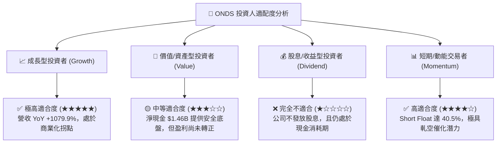

### 11.5 每季財報監控清單（Quarterly Watch List）

| 監控維度 | 關鍵追蹤指標 (KPI) | 綠燈 (加碼門檻) | 黃燈 (正常觀望) | 🔴 紅燈 (減碼停損門檻) |
|----------|--------------------|-----------------|-----------------|------------------------|
| **營收動能** | 單季營收 ($M) | > $55.0M | $35.0M – $55.0M | < $30.0M (成長失速) |
| **獲利品質** | 單季 GAAP 營業利益 | > -$15.0M | -$35.0M – -$15.0M | < -$45.0M (虧損擴大) |
| **股本稀釋** | 季度 SBC 費用 / 營收 | < 15.0% | 15.0% – 30.0% | > 40.0% (過度稀釋) |
| **現金儲備** | 總現金與短期投資 | > $1,300M | $1,000M – $1,300M| < $800M (燒錢過快) |

### 11.6 反面論證：什麼會證明論點錯誤（What Would Change My Mind）

```
╔══════════════════════════════════════════════════════════════════╗
║              ⚠️ 論點失效條件（Disconfirming Evidence）           ║
╠══════════════════════════════════════════════════════════════════╣
║  本投資論點在下列情況發生時將被否定，須執行停損或清倉操作：      ║
║                                                                  ║
║  1. 營收成長動能中斷：FY2026 全年營收低於 $130M（代表 Q1 爆發    ║
║     僅為一次性偶發交付，非可持續成長）。                        ║
║  2. 鐵路標準被替代：北美 AAR 撤銷 IEEE 802.16t 作為 900MHz 專網  ║
║     之指定標準，改用其他競品。                                  ║
║  3. 資本毀損：公司將 $1.47B 現金用於高價併購無高額回報之劣質資產  ║
║     導致 ROIC 長期停留於 -20% 以下。                             ║
║  4. 股本過度稀釋：流通股數在未來 12 個月內突破 700M 股。         ║
╚══════════════════════════════════════════════════════════════════╝
```

---

> **免責聲明**：本報告為 AI 自動生成之機構級研究分析，內容僅供學術與投資研究參考，不構成任何買賣建議。投資美股具有高風險，請結合個人風險承受能力並諮詢專業投資顧問。