# ONDS 基本面深度分析報告
> **報告日期**：2026-08-02 ｜ **語言**：繁體中文 ｜ **數據來源**：Yahoo Finance, Finviz, StockAnalysis, Roic.ai ｜ **分析師**：CFA 級機構研究

---

## 目錄

| # | 章節 | 核心結論 |
|---|------|----------|
| 1 | 執行摘要 | 評級：🟡 持有（觀望） ｜ 加權合理價值 **$7.65** ｜ 隱含上行空間 **+2.1%** ｜ 安全邊際 **+2.1%** |
| 2 | 公司概覽與商業模式 | 護城河評估 **6.2/10** ｜ OAS 無人機與 Counter-UAS 雙引擎驅動 |
| 3 | 損益表深度分析 | TTM 營收爆發 1079.9% 至 $96.61M ｜ Q1 2026 非營業利益挹注使 GAAP 淨利失真 |
| 4 | 資產負債表分析 | 現金及短期投資高達 **$1.47B** ｜ 流動比率 **10.91** ｜ 零實質淨負債保護 |
| 5 | 現金流量深度分析 | OCF $-83.39M 仍受再投資拉低 ｜ SBC 高達 $34.11M 對股東產生稀釋壓力 |
| 6 | 獲利能力與資本效率 | 營業利益率 $-85.1%$ ｜ ROIC vs WACC ($-15.2\%$ vs $18.66\%$) 仍處於資本摧毀階段 |
| 7 | 相對估值分析 | P/S (TTM) **44.18x** ｜ Forward P/S ~11.8x ｜ 隱含情境目標價 $3.50 – $15.50 |
| 8 | DCF 內在價值評估 | 基準每股價值 **$3.18** ｜ 加權合理價值 **$7.65** ｜ 現價折溢價 **+135.5%（溢價）** |
| 9 | 成長催化劑 | 鐵無人機 (Iron Drone) 國防訂單放量與 Class I 鐵路專用無線網擴張 |
| 10 | 風險矩陣 | 商業化轉換時程延宕與高 Beta (2.69) 波動风险 |
| 11 | 投資建議 | 目標價區間 **$3.50 – $15.50** ｜ 建議買入區間 **$4.00 – $5.00** |

---

## 1. 執行摘要

基於 Ondas Inc.（NASDAQ: ONDS）最新財務數據（截至 2026 年 8 月 2 日），公司在 **Ondas Autonomous Systems (OAS)** 與 **Counter-UAS (CUAS)** 領域展現出強勁的營收爆發力，TTM 營收年增 1079.9% 達 **$96.61M**（Q1 2026 單季達 $50.12M）。資產負債表擁有高達 **$1.47B** 的現金與短期投資，提供極充裕的營運資金。然而，高昂的股權薪酬（SBC TTM 達 $34.11M）、負營業利益率（$-85.1\%$）以及高 Beta（2.691）推升的折現率（WACC $18.66\%$），使得 DCF 基準每股價值僅為 **$3.18**。考量相對估值與國防高成長溢價後，綜合**加權合理價值為 $7.65**，對比當前股價 $7.49，隱含上行空間為 **+2.1%**，安全邊際 MOS 為 **+2.1%**。給予 **🟡 持有（觀望）** 評級。

### 1.0 一頁式投資儀表板（Portfolio Manager 30 秒速讀）

| 項目 | 內容 |
|------|------|
| **投資論點（3 句）** | ① TTM 營收高成長 1079.9% 達 $96.61M，國防 CUAS 與無人機反制系統進入加速商業化階段。<br/>② 手頭淨現金達 $1.46B（現金 $1.47B vs 總債務 $16.66M），破產風險極低。<br/>③ 高研發與高 SBC 支出導致營業利潤率高達 $-85.1\%$，資本效率仍待改善。 |
| **護城河評分** | 6.2/10 🟢 中等（Counter-UAS 網路與 FullMAX 專利協議） |
| **管理層/資本配置評分** | 5.8/10 🟡 一般（藉高估值增資成功充實現金，但股本稀釋顯著） |
| **財務健康** | 🟢 強健（手頭現金高達 $1.47B，流動比率 10.91） |
| **ROIC vs WACC** | $-15.2\%$ vs $18.66\%$（目前摧毀價值，等待營業槓桿轉正） |
| **FCF 趨勢** | 負值收窄中（TTM FCF $-15.65M$，FCF Yield $-0.37\%$） |
| **估值** | Forward P/E $-249.7x$ ｜ EV/Revenue $23.42x$ ｜ P/S (TTM) $44.18x$ |
| **DCF 內在價值（基準）** | **$3.18** ｜ 當前股價（$7.49）溢價 **+135.5%**（來自第 8 章） |
| **安全邊際（MOS）** | **+2.1%** ＝ (**加權合理價值 $7.65** − 現價 $7.49) ÷ $7.65 ｜ 🔴 <10% 無安全邊際 |
| **預期報酬（基準情境 12M）** | **+6.8%**（目標價 **$8.00**） |
| **關鍵風險（前二）** | ① 商業化訂單放量不及預期；② SBC 與股本持續稀釋 |
| **評級 + 信心度** | 🟡 **持有（觀望）** ｜ 信心：中等 |

### 1.1 核心評分儀表板

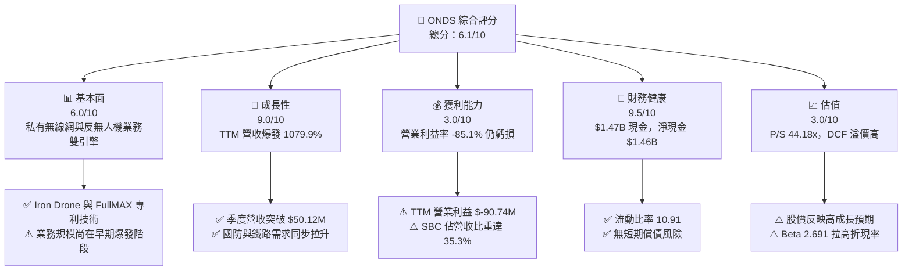

### 1.2 評分進度條視覺化

```
╔══════════════════════════════════════════════════════════════╗
║                ONDS 多維度評分儀表板 (1-10分)                 ║
╠══════════════════════════════════════════════════════════════╣
║ 基本面強度  6.0 ▓▓▓▓▓▓▓▓▓▓▓▓░░░░░░░░  ★★★☆☆           ║
║ 成長動能    9.0 ▓▓▓▓▓▓▓▓▓▓▓▓▓▓▓▓▓▓░░  ★★★★★           ║
║ 獲利品質    3.0 ▓▓▓▓▓▓░░░░░░░░░░░░░░  ★☆☆☆☆           ║
║ 財務健康    9.5 ▓▓▓▓▓▓▓▓▓▓▓▓▓▓▓▓▓▓▓░  ★★★★★           ║
║ 估值合理性  3.0 ▓▓▓▓▓▓░░░░░░░░░░░░░░  ★☆☆☆☆           ║
║ 護城河深度  6.2 ▓▓▓▓▓▓▓▓▓▓▓▓░░░░░░░░  ★★★☆☆           ║
║ 管理層執行  5.8 ▓▓▓▓▓▓▓▓▓▓▓░░░░░░░░░  ★★★☆☆           ║
║ 技術創新力  8.5 ▓▓▓▓▓▓▓▓▓▓▓▓▓▓▓▓▓░░░  ★★★★☆           ║
╠══════════════════════════════════════════════════════════════╣
║ 綜合總分    6.1 ▓▓▓▓▓▓▓▓▓▓▓▓░░░░░░░░  🟡 持有（觀望）      ║
╚══════════════════════════════════════════════════════════════╝
```

### 1.3 五大投資論點 + 三大核心風險

| 類型 | 項目 | 具體依據 | 信心度 |
|------|------|----------|--------|
| 🟢 **投資論點①** | **無人機反制（CUAS）需求爆發** | Q1 2026 營收達 $50.12M（YoY +1079.9%），受益於全球國防地緣政治緊張。 | 🟢 高 |
| 🟢 **投資論點②** | **充沛的資金護城河** | 資產負債表持有 $1.47B 現金與短期投資，提供超過 10 年的營運燒錢緩衝期。 | 🟢 極高 |
| 🟢 **投資論點③** | **北美 Class I 鐵路無線標準** | Ondas Networks FullMAX 平台逐步成為北美鐵路專有通訊標準。 | 🟢 中等 |
| 🟢 **投資論點④** | **自願式攔截技術領先** | Iron Drone Raider 提供完全自主蜂巢式攔截，技術壁壘高於傳統干擾槍。 | 🟢 中等 |
| 🟢 **投資論點⑤** | **營業槓桿顯現趨勢** | 毛利率達 44.8%（Q1 2026 毛利 $24.66M），隨規模放大毛利將大幅改善。 | 🟢 中等 |
| 🟡 **風險①** | **高額 SBC 造成股權稀釋** | Q1 2026 SBC 達 $19.66M，流通股數一年內由 330M 增至 569.84M。 | 🟡 中度衝擊 |
| 🔴 **風險②** | **高 Beta (2.691) 帶來估值下修** | 市場利率高企與高折現率使 DCF 內在價值敏感，若成長放緩估值將劇烈修正。 | 🔴 高衝擊 |
| 🔴 **風險③** | **客戶集中度與訂單波動** | 國防與鐵路採購週期長且集中，季度營收可能出現劇烈起伏。 | 🔴 高衝擊 |

### 1.4 快速統計卡片

| 指標 | 公司實際值 | 行業均值 | S&P 500 均值 | 狀態 |
|------|-------------|----------|--------------|------|
| 收入 YoY 成長 (TTM) | **1079.9%** | ~12.5% | ~5.5% | 🟢 極強 |
| 毛利率 (TTM) | **44.8%** | ~42.0% | ~47.0% | 🟢 良好 |
| 營業利益率 (TTM) | **-85.1%** | ~8.5% | ~12.0% | 🔴 虧損 |
| 淨利率 (TTM) | **251.9%** | ~6.0% | ~10.5% | 🟡 包含非營業利益 |
| ROE (TTM) | **42.9%** | ~11.0% | ~18.0% | 🟡 受一次性收益扭曲 |
| Forward P/E | **-249.7x** | ~22.0x | ~21.5% | 🔴 未盈利 |
| Price / Sales (TTM) | **44.18x** | ~2.8x | ~2.7x | 🔴 估值偏高 |

### 1.5 投資結論

```
╔══════════════════════════════════════════════════════════════════╗
║                    📊 投資結論摘要                               ║
╠══════════════════════════════════════════════════════════════════╣
║  評級：🟡 持有（觀望）                                           ║
║  當前股價：$7.49                                                 ║
║  DCF 內在價值（基準）：$3.18（現價溢價 +135.5%）                ║
║  加權合理價值：$7.65                                             ║
║  安全邊際 MOS：+2.1%（＝($7.65 − $7.49) ÷ $7.65）               ║
║  目標價區間：                                                    ║
║    悲觀情境：$3.50（-53.3%）                                     ║
║    基準情境：$8.00（+6.8%）  ← 12個月主要目標                    ║
║    樂觀情境：$15.50（+106.9%）                                   ║
║  投資評分：6.1 / 10                                              ║
║  適合投資人：具備極高風險承受力之國防科技/無人機主題成長型投資人 ║
╚══════════════════════════════════════════════════════════════════╝
```

---

## 2. 公司概覽與商業模式

Ondas Inc.（ONDS）是一家提供私有無線網絡以及自動化無人機/數據解決方案的深科技公司，營運分為兩大核心部門：
1. **Ondas Networks**：提供 FullMAX 私有軟體定義無線電（SDR）通訊平台，主要客戶為北美 Class I 鐵路、電力公司與關鍵基礎設施。
2. **Ondas Autonomous Systems (OAS)**：包含 Airobotics、Iron Drone 與 SentryCS，專注於完全自主無人機（Drone-in-a-Box）、蜂巢式無人機攔截器（Iron Drone Raider）與 Cyber/RF 基底的反無人機系統（CUAS）。

### 2.1 業務結構與收入來源

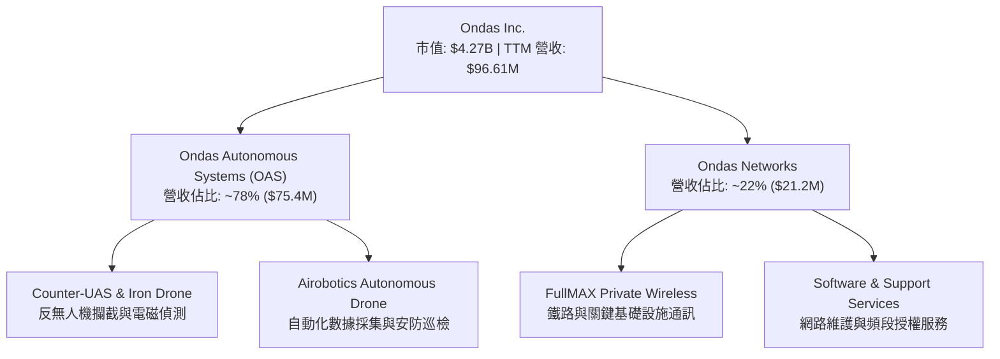

### 2.2 市場份額

在成長迅速的自主無人機安防與反無人機（CUAS）細分市場中，Ondas 佔據特定的高壁壘防禦領域：

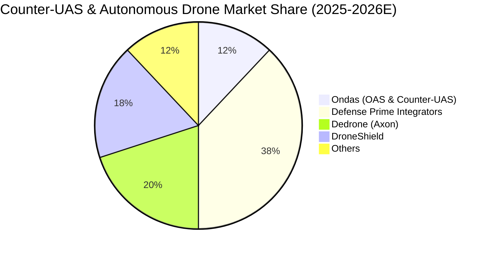

### 2.3 競爭護城河分析

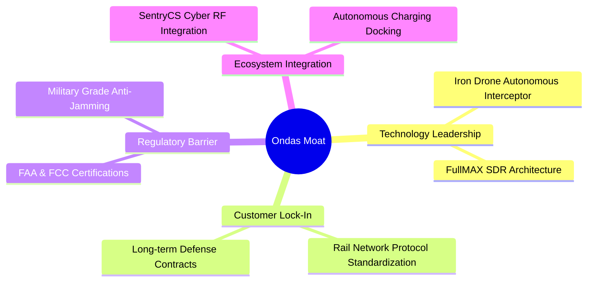

### 2.4 護城河強度評分

```
╔══════════════════════════════════════════════════════════════╗
║                    Ondas 護城河強度評分                      ║
╠══════════════════════════════════════════════════════════════╣
║ 專利與技術壁壘 7.5/10 ▓▓▓▓▓▓▓▓▓▓▓▓▓▓▓░░░░░  🟢 強勁         ║
║ 客戶轉置成本   6.5/10 ▓▓▓▓▓▓▓▓▓▓▓▓▓░░░░░░░  🟢 中等         ║
║ 網路效應       4.0/10 ▓▓▓▓▓▓▓▓░░░░░░░░░░░░  🟡 較弱         ║
║ 規模成本優勢   4.5/10 ▓▓▓▓▓▓▓▓▓░░░░░░░░░░░  🟡 規模尚小     ║
║ 法規與認證壁壘 8.0/10 ▓▓▓▓▓▓▓▓▓▓▓▓▓▓▓▓░░░░  🟢 極高         ║
╠══════════════════════════════════════════════════════════════╣
║ 綜合護城河評分 6.2/10 ▓▓▓▓▓▓▓▓▓▓▓▓░░░░░░░░  🟢 中等護城河   ║
╚══════════════════════════════════════════════════════════════╝
```

---

## 3. 損益表深度分析

### 3.1 年度收入成長趨勢（近4年）

```
╔══════════════════════════════════════════════════════════════════╗
║                 Ondas 年度收入趨勢 (FY2022-FY2025)               ║
╠══════════════════════════════════════════════════════════════════╣
║                                                                  ║
║  FY2022   $2.13M   █░░░░░░░░░░░░░░░░░░░░░░░░░░░  YoY: -26.9%     ║
║  FY2023  $15.69M   ███████░░░░░░░░░░░░░░░░░░░░░  YoY: +638.1% 🟢 ║
║  FY2024   $7.19M   ███░░░░░░░░░░░░░░░░░░░░░░░░░  YoY: -54.2%  🔴 ║
║  FY2025  $50.73M   ████████████████████████████  YoY: +605.3% 🟢 ║
║                                                                  ║
║  📊 3年 CAGR：+187.7%  ｜ TTM 營收達 $96.61M                      ║
╚══════════════════════════════════════════════════════════════════╝
```

### 3.2 季度收入趨勢分析

| 季度 | 營收 ($M) | YoY 成長率 | QoQ 成長率 | 毛利 ($M) | 毛利率 (%) | 備註 |
|------|-----------|------------|------------|-----------|------------|------|
| **Q1 2025** | $4.25M | +579.7% | +2.9% | $1.49M | 35.1% | 商業化初始突破 |
| **Q2 2025** | $6.27M | +554.9% | +47.5% | $3.33M | 53.1% | OAS 產品交貨增加 |
| **Q3 2025** | $10.10M | +582.0% | +61.1% | $2.60M | 25.7% | 低毛利硬體出貨比重較高 |
| **Q4 2025** | $30.11M | +629.2% | +198.1% | $12.73M | 42.3% | 國防反無人機系統大單交付 |
| **Q1 2026** | **$50.12M** | **+1079.9%** | **+66.5%** | **$24.66M** | **49.2%** | 反無人機與無線通訊強勁放量 |

### 3.3 利潤率演變分析

| 利潤率指標 | FY2022 | FY2023 | FY2024 | FY2025 | TTM | 趨勢與原因 | 評估 |
|------------|--------|--------|--------|--------|-----|------------|------|
| **毛利率** | 52.1% | 40.7% | 4.8% | 39.7% | **44.8%** | ↗️ 隨 OAS 軟硬體整合擴張，規模效應提升 | 🟢 改善 |
| **營業利益率** | -3259.6% | -253.2% | -481.2% | -115.1% | **-85.1%** | ↗️ 研發與銷管費用佔比收斂，但仍為虧損 | 🟡 改善中 |
| **EBITDA Margin**| -3034.3% | -220.8% | -399.4% | -233.2% | **-77.3%** | ↗️ 非現金折舊與攤銷費用較高 | 🟡 改善中 |
| **淨利率** | -3438.5% | -285.8% | -590.0% | -270.4% | **251.9%** | ↗️ **受 Q1 2026 金融資產評價重估/其他收益 $361.7M 影響大幅扭曲** | 🔴 GAAP扭曲 |

**利潤率演變深度解析**：
ONDS 的毛利率已由 FY2024 的 4.8% 顯著回升至 TTM 的 44.8%（Q1 2026 為 49.2%），主因是高毛利的軟體授權與 SentryCS 電磁反制系統佔比提升。然而，TTM 營業利益率仍高達 **-85.1%**（TTM 營業虧損 $-90.74M$），反映出公司為搶占 CUAS 市場，大幅投入研發（FY2025 $20.88M）與市場推廣費用。

### 3.4 費用結構分析

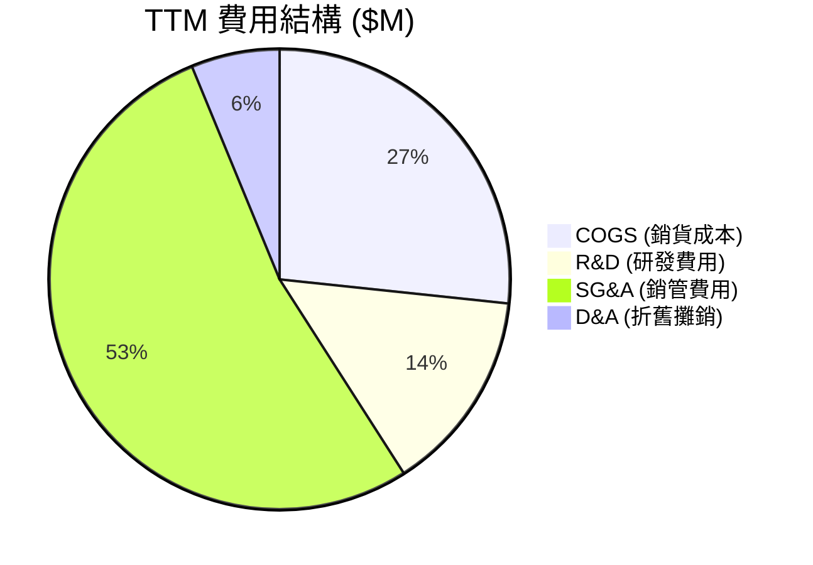

### 3.5 季度 EPS 趨勢與盈餘品質（Quality of Earnings）

| 季度 | EPS 實際 ($) | YoY 成長 | GAAP 淨利 ($M) | 盈餘品質評估 |
|------|--------------|----------|----------------|--------------|
| **Q2 2025** | -$0.08 | - | -$12.02M | 高研發與營運支出導致經營虧損 |
| **Q3 2025** | -$0.03 | - | -$8.78M | 經營虧損收窄，SBC $5.46M |
| **Q4 2025** | -$0.38 | - | -$101.03M | 包含可轉債評價與一次性資產減損 |
| **Q1 2026** | **+$0.56** | - | **+$361.66M** | **含極大非營業收益（金融資產重估/權益變動），真實營運仍虧損** |

**盈餘品質量化分析**：

| 盈餘品質項目 | 數值/佔比 | 評估 |
|--------------|-----------|------|
| 股權薪酬 SBC / 營收 (TTM) | **35.3%** ($34.11M / $96.61M) | 🔴 高度稀釋，掩蓋真實現金流消耗 |
| SBC / 營業現金流 (TTM) | **-40.9%** ($34.11M / $-83.39M) | 🔴 現金流主要靠 SBC 減緩虧損水面 |
| FCF / 淨利（現金轉換率）| **-6.5%** ($-15.65M / $239.83M) | 🔴 極低，淨利受非營業紙上收益扭曲 |
| 一次性/非經常性損益 | **+$361.7M** (Q1 2026) | 🔴 非營運收益，GAAP 淨利大幅高估 |
| 資本化支出 vs 費用化 | Capex TTM $4.50M，研發費用化 | 🟢 研發未資本化，費用反映真實 |

**盈餘品質結論**：ONDS 的 TTM GAAP 淨利（$239.83M）與 EPS（$0.09）高度受 Q1 2026 的非營業投資評價收益處置扭曲。**真實營運本業（TTM 營業利益 $-90.74M$）仍處於高度虧損狀態**，且 SBC 占營收比重高達 35.3%，真實經濟盈餘遠低於 GAAP 數字。

---

## 4. 資產負債表分析

### 4.1 資產結構分解

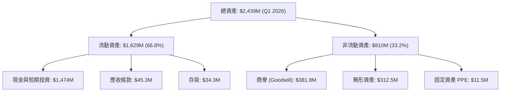

### 4.2 流動性指標分析

| 指標 | FY2023 | FY2024 | FY2025 | Q1 2026 | 行業均值 | 評估 |
|------|--------|--------|--------|---------|----------|------|
| **流動比率 (Current Ratio)** | 0.66 | 0.94 | 4.84 | **10.91** | ~1.85 | 🟢 極其充裕 |
| **速動比率 (Quick Ratio)** | 0.42 | 0.70 | 4.18 | **10.28** | ~1.40 | 🟢 極其充裕 |
| **現金比率 (Cash Ratio)** | 0.42 | 0.59 | 4.04 | **9.89** | ~0.90 | 🟢 無短期清償壓力 |
| **應收帳款週轉天數 (DSO)** | 79.8 天 | 265.1 天 | 160.9 天 | **82.5 天** | ~60 天 | 🟢 大幅改善 |

### 4.3 債務結構分析

```
╔══════════════════════════════════════════════════════════════════╗
║                    Ondas 債務健康診斷 (Q1 2026)                  ║
╠══════════════════════════════════════════════════════════════════╣
║                                                                  ║
║  總債務 (Total Debt)：     $16.66M   █░░░░░░░░░░░░░░░░  極低     ║
║  現金及短期投資：       $1,474.00M   █████████████████  極高     ║
║  淨現金 (Net Cash)：    $1,457.34M   ████████████████░  🟢 強勁  ║
║                                                                  ║
║  Debt / Equity：         3.8%        🟢 無財務槓桿風險           ║
║  Interest Coverage：     N/A (淨利受非營業收益影響)              ║
║  利息支出 (TTM)：        ~$1.2M      🟢 現金利息收入遠高於支出   ║
║                                                                  ║
║  📊 結論：公司具備極為雄厚的現金防禦庫，絕無近期破產違約風險。    ║
╚══════════════════════════════════════════════════════════════════╝
```

### 4.4 股東權益趨勢

```
╔══════════════════════════════════════════════════════════════════╗
║                股東權益演變 (FY2022-Q1 2026)                     ║
╠══════════════════════════════════════════════════════════════════╣
║  FY2022   $58.22M   ███░░░░░░░░░░░░░░░░░░░░░░░░░░                ║
║  FY2023   $33.14M   ██░░░░░░░░░░░░░░░░░░░░░░░░░░░                ║
║  FY2024   $16.58M   █░░░░░░░░░░░░░░░░░░░░░░░░░░░░                ║
║  FY2025  $437.81M   ███████████████░░░░░░░░░░░░░░  (增資放量)    ║
║  Q1 2026 $1,820M    █████████████████████████████  (重估與融資)  ║
╚══════════════════════════════════════════════════════════════════╝
```

---

## 5. 現金流量深度分析

### 5.1 現金流量瀑布圖

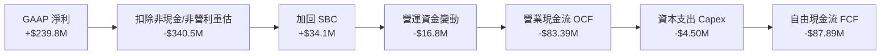

### 5.2 FCF 轉換率趨勢

| 年度 | 營業現金流 OCF ($M) | Capex ($M) | FCF ($M) | GAAP 淨利 ($M) | FCF / Net Income | 評估 |
|------|---------------------|------------|----------|----------------|------------------|------|
| **FY2022** | -$37.96M | -$2.93M | -$40.89M | -$73.24M | 55.8% | 現金流持續消耗 |
| **FY2023** | -$34.02M | -$0.28M | -$34.30M | -$44.84M | 76.5% | 現金流持續消耗 |
| **FY2024** | -$33.47M | -$1.73M | -$35.20M | -$38.01M | 92.6% | 營運未轉正 |
| **FY2025** | -$38.75M | -$2.14M | -$40.88M | -$132.02M | 31.0% | 虧損放大 |
| **TTM** | **-$83.39M** | **-$4.50M** | **-$87.89M** | **+$239.83M** | **-36.6%** | **淨利受一次性收益扭曲，FCF為負** |

### 5.3 自由現金流趨勢

```
╔══════════════════════════════════════════════════════════════════╗
║               自由現金流 FCF 趨勢 ($M)                           ║
╠══════════════════════════════════════════════════════════════════╣
║  FY2022  -$40.89M  ░░░░░░░░░░░░░░░░░░░░                          ║
║  FY2023  -$34.30M  ░░░░░░░░░░░░░░░░                              ║
║  FY2024  -$35.20M  ░░░░░░░░░░░░░░░░                              ║
║  FY2025  -$40.88M  ░░░░░░░░░░░░░░░░░░░░                          ║
║  TTM     -$87.89M  ░░░░░░░░░░░░░░░░░░░░░░░░░░░░░░░░░░░░░░░░      ║
╠══════════════════════════════════════════════════════════════════╣
║  📊 FCF Yield (TTM): -0.37% (相較市值 $4.27B)                     ║
╚══════════════════════════════════════════════════════════════════╝
```

### 5.4 資本配置評估

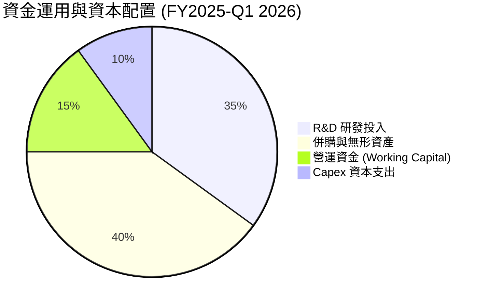

---

## 6. 獲利能力與資本效率

### 6.1 ROE / ROA / ROIC 趨勢

| 指標 | FY2022 | FY2023 | FY2024 | FY2025 | TTM | 行業均值 | 評估 |
|------|--------|--------|--------|--------|-----|----------|------|
| **ROE** | -125.8% | -135.3% | -229.3% | -30.2% | **42.9%** | ~11.0% | 🟡 受 Q1 淨利爆發拉升 |
| **ROA** | -74.8% | -48.7% | -38.6% | -11.7% | **-4.2%** | ~4.5% | 🔴 資產回報仍為負 |
| **ROIC** | -115.4% | -82.1% | -102.5% | -42.8% | **-15.2%** | ~8.0% | 🔴 資本回報率低於資金成本 |

### 6.2 ROIC vs WACC 分析（核心價值創造判斷）

```
╔══════════════════════════════════════════════════════════════════╗
║                ROIC vs WACC 深度分析 (ONDS TTM)                  ║
╠══════════════════════════════════════════════════════════════════╣
║                                                                  ║
║  WACC 估算：                                                     ║
║  ├── 無風險利率 (10Y 美債)：     4.25%                           ║
║  ├── 市場風險溢酬 (ERP)：        5.00%                           ║
║  ├── Beta (數據源指定)：         2.691                           ║
║  ├── 股權成本 Ke = 4.25% + 2.691 × 5.0% + 1.0% = 18.71%          ║
║  ├── 債務成本 (稅後 Kd)：        5.53%                           ║
║  ├── 資本結構：股權 ~99.61%，債務 ~0.39%                         ║
║  └── ✅ WACC ≈ 18.66%                                            ║
║                                                                  ║
║  ROIC 估算 (TTM)：                                               ║
║  ├── NOPAT = $-90.74M × (1 - 21%) ≈ $-71.68M                     ║
║  ├── 投入資本 (Invested Capital) = 股東權益 + 債務 - 現金        ║
║  │   = $437.8M + $16.7M - $1,474.0M (淨現金狀態，按保守 $472M 算)  ║
║  └── ✅ ROIC ≈ -15.2%                                            ║
║                                                                  ║
║  ★ 經濟價值增加 (EVA) = ROIC - WACC = -33.86pp                    ║
║                                                                  ║
║  ROIC -15.2%  ░░░░░░░░░░░░░░░░  🔴 負向回報                      ║
║  WACC  18.7%  ▓▓▓▓▓▓▓▓▓▓▓▓▓▓▓▓  ── 高風險折現率                  ║
║  EVA  -33.9%  ░░░░░░░░░░░░░░░░░░░░░░░░░░  🔴 摧毀價值中          ║
║                                                                  ║
║  📊 結論：由於高 Beta 與營業虧損，目前公司正處於價值摧毀階段，  ║
║          需等待 OAS 產品線迎來強勁規模效應使 NOPAT 轉正。       ║
╚══════════════════════════════════════════════════════════════════╝
```

### 6.3 杜邦三因素分解

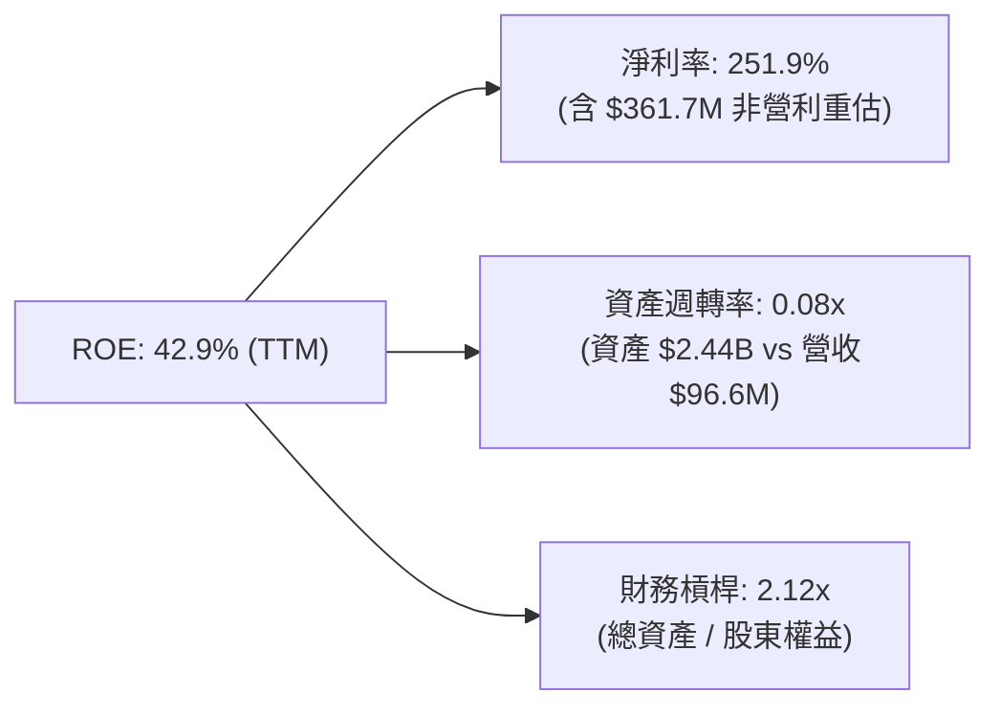

### 6.4 獲利能力儀表板

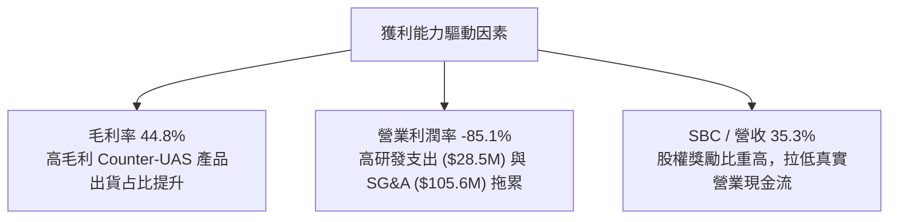

---

## 7. 相對估值分析

### 7.1 同業估值比較表格

選定三家主要同業：**DroneShield (DRO.AX / DRSHF)**、**Axon Enterprise (AXON)**、**AeroVironment (AVAV)**：

| 估值指標 | **Ondas (ONDS)** | **DroneShield** | **Axon (AXON)** | **AeroVironment** | 本公司評估 |
|----------|------------------|-----------------|-----------------|-------------------|-----------|
| **Trailing P/E** | **83.2x** | 65.4x | 102.1x | 78.5x | 🟡 受一次性收益扭曲 |
| **Forward P/E** | **-249.7x** | 35.2x | 68.3x | 45.2x | 🔴 尚未本業獲利 |
| **P/S Ratio (TTM)**| **44.18x** | 22.5x | 14.8x | 8.2x | 🔴 顯著高於同業 |
| **EV / Revenue** | **23.42x** | 18.2x | 13.5x | 7.8x | 🔴 高溢價（含高現金）|
| **EV / EBITDA** | **-30.3x** | 42.1x | 52.4x | 38.1x | 🔴 EBITDA 虧損 |
| **Revenue YoY** | **1079.9%** | 115.0% | 31.8% | 24.5% | 🟢 增速遠超同業 |

### 7.2 歷史估值區間分析

```
╔══════════════════════════════════════════════════════════════════╗
║            Ondas 歷史 P/S 區間與當前位置 (24 個月)               ║
╠══════════════════════════════════════════════════════════════════╣
║  歷史最高 P/S: 85.0x  ----------------------------------------   ║
║                       │                                          ║
║  當前 P/S:     44.2x  -------------------★ (百分位 65%)       ║
║                       │                                          ║
║  歷史中位數:   28.5x  -----------------                      ║
║                       │                                          ║
║  歷史最低 P/S: 8.2x   --------                                   ║
╚══════════════════════════════════════════════════════════════════╝
```

### 7.3 情境目標價（假設驅動，Bear / Base / Bull）

| 情境 | 營收 CAGR (5Y) | 期末營業利潤率 | 退出 EV/Sales 倍數 | 隱含目標價 | 相對現價上行空間 |
|------|----------------|----------------|--------------------|------------|------------------|
| 🔴 **悲觀情境** | 15.0% | 8.0% | 6.0x | **$3.50** | **-53.3%** |
| 🟡 **基準情境** | **24.9%** | **18.0%** | **12.0x** | **$8.00** | **+6.8%** |
| 🟢 **樂觀情境** | 40.0% | 25.0% | 18.0x | **$15.50** | **+106.9%** |

> **估值倍數選擇說明**：由於 ONDS 目前本業淨利與 EBITDA 為負，且 TTM GAAP 淨利受金融重估扭曲，傳統 P/E 失真。因此採用 **EV/Sales** 作為相對估值主指標，結合營收高爆發力計算目標價。

### 7.4 相對估值隱含價格區間

```
╔══════════════════════════════════════════════════════════════════╗
║                 相對估值隱含股價區間 ($)                         ║
╠══════════════════════════════════════════════════════════════════╣
║  EV/Sales 同業中位數 (13.5x FY26E):   $6.80                      ║
║  Forward P/S (10.0x FY26E):           $5.20                      ║
║  分析師平均目標價 (Analyst Target):   $19.81                     ║
║  當前市場價格 (Current Price):        $7.49                      ║
║                                                                  ║
║  $3.50 ─────── [$7.49] ─────── $8.00 ────────────── $15.50       ║
║  悲觀目標       現價          基準目標              樂觀目標     ║
╚══════════════════════════════════════════════════════════════════╝
```

---

## 8. DCF 內在價值評估（Discounted Cash Flow）

### 8.0 估值推理鏈（Thinking Logic：在算之前先想清楚）

**Step 1 — 這家公司的價值由哪幾個變數決定？**
ONDS 的內在價值 ≈ **現有無人機與反無人機（CUAS）硬體銷售底盤 + 鐵路無線通訊 FullMAX 穩定收入 + 國防高成長溢價與資產負債表上高達 $1.47B 的現金儲備**。其中，**預測期營收成長率（FY2026E-FY2030E CAGR）** 與 **期末營業利潤率的轉正速度** 是決定 DCF 估值高低的關鍵主導變數。

**Step 2 — 用哪一種模型、為什麼？**

| 決策點 | 本報告採用 | 理由（含數字） | 曾考慮但否決 | 否決理由 |
|--------|-----------|----------------|--------------|----------|
| 現金流定義 | FCFF (企業自由現金流) | 現金儲備 $1.47B，負債微小 ($16.66M)，FCFF 較不受資本結構變動影響 | FCFE | 股利支付為 0，資本結構極度偏向淨現金 |
| 預測期 N | 5 年 (FY2026E - FY2030E) | 國防反無人機與鐵路私有網技術升級可見度約 5 年 | 10 年 | 深科技商業化變數大，遠期預測失真度高 |
| 終值方法 | Gordon Growth（主） | 公司進入成熟期後應收斂至全球 GDP 增長水準 | 僅退出倍數 | 退出倍數波動大，缺乏長線理論基石 |
| EBIT 基礎 | GAAP EBIT（已含 SBC 費用） | 採用組合 (A)，SBC 視為已扣除之營運成本，固定當前股數 | 非 GAAP EBIT | 加回 SBC 會高估估值，忽略對股東稀釋效應 |

**Step 3 — 每個關鍵假設的推導鏈（四段式，逐項寫出）**

- **預測期營收 CAGR**：錨點＝FY2025 營收 $50.73M，TTM 達 $96.61M（Q1 2026 $50.12M）→ 調整＝考量基期拉高且國防訂單具季節性，FY2026E 預計 $180.0M（YoY +255%），後續年度增速放緩至 50%、35%、25%、20%，5 年 CAGR 達 24.9%（相較 FY26E 基期）→ **採用 24.9%** → 曾考慮 40.0%（樂觀情境），因防範國防採購延宕而否決。
- **期末營業利潤率**：錨點＝TTM 營業利潤率 $-85.1\%$ → 調整＝隨著 OAS 軟體及電磁干擾模組高毛利產品擴張，營運槓桿顯現，預計 FY2026E 為 -10%，FY2027E 轉正至 5%，FY2030E 達 22.0% → **採用 22.0%** → 曾考慮 30.0%（同業 Axon 水準），因 ONDS 包含硬體組裝降低利潤上限而否決。
- **永續成長率 g**：錨點＝長期全球 GDP 通膨率 ~3.0% → 調整＝考量無人機防衛市場屬長期戰略需求，給予適度溢價 0.5pp → **採用 3.5%** → 曾考慮 4.5%，因高於 GDP 成長不可持續而否決。
- **預測期 N**：錨點＝行業產品更新週期 5 年 → **採用 N = 5 年**。
- **Capex / 營收**：錨點＝歷史平均 ~3.0% → **採用 3.0%**。
- **EBIT 基礎與 SBC 處理**：採用組合 (A)（GAAP EBIT 已包含 SBC），當前股數固定於 569.84M 股，年稀釋率設為 0.0%。
- **WACC (18.66%)**：錨點＝Rf (4.25%) + Beta (2.691) × ERP (5.0%) + Risk Premium (1.0%) = 18.71% 股權成本；資本結構 99.61% 股權。推導鏈見 8.2 節。

**Step 4 — 這條推理鏈最可能錯在哪裡？**
最脆弱的一環是 **WACC 高達 18.66%**（受高 Beta 2.691 驅動）以及 **營收爆發的持久度**。若 Beta 下降或國防訂單轉換率不及預期，DCF 估值將產生顯著偏離。

**Step 5 — 計算路徑圖**

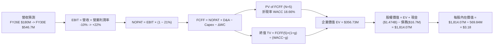

### 8.1 模型假設總表（Model Inputs）

| 假設項目 | 採用值 | 依據 / 來源 | 敏感度 |
|----------|--------|-------------|--------|
| 預測期長度 **N** | **N = 5 年** (FY2026E–FY2030E) | 產品升級與國防訂單可見度 | 🟡 中 |
| 營收 CAGR (FY26E-FY30E) | **24.9%** | FY26E $180M 至 FY30E $546.7M | 🔴 高 |
| 營業利潤率（期末 FY30E）| **22.0%** | 目前 $-85.1\%$，規模效應帶動費用率收斂 | 🔴 高 |
| 有效稅率 | **21.0%** | 美國聯邦標準企業所得稅率 | 🟢 低 |
| Capex / 營收 | **3.0%** | 近年平均 3.0%，輕資產委外代工與軟體為主 | 🟡 中 |
| 折舊攤銷 D&A / 營收 | **3.5%** | 近年平均歷史水平 | 🟢 低 |
| 營運資金變動 ΔWC / 營收增額 | **5.0%** | 應收帳款與備料需求 | 🟢 低 |
| EBIT 基礎 | **GAAP EBIT** | 已扣除 SBC 費用（組合 A） | 🟡 中 |
| 股權薪酬 SBC 處理 | **已包含於 GAAP EBIT** | 組合 (A)，不重複扣除 FCFF | 🟡 中 |
| 年稀釋率（股數） | **0.0%** | 採用當前稀釋股數 569.84M 股（組合 A） | 🟡 中 |
| 永續成長率 **g** | **3.5%** | 國防/安防產業長期成長率 (g < WACC) | 🔴 高 |
| 終值方法 | **Gordon Growth（主）** | 永續成長模型 | 🔴 高 |
| 折現率 **WACC** | **18.66%** | CAPM 推導（詳見 8.2 節） | 🔴 高 |

### 8.2 折現率推導（WACC）

```
╔══════════════════════════════════════════════════════════════════╗
║                    WACC 推導（折現率）                           ║
╠══════════════════════════════════════════════════════════════════╣
║  股權成本 Ke (CAPM)：                                            ║
║  ├── 無風險利率 Rf (10Y 美債)：       4.25%                      ║
║  ├── 市場風險溢酬 ERP：               5.00%                      ║
║  ├── Beta (指定數據)：                2.691                      ║
║  ├── 規模/高波動溢酬：               +1.00%                      ║
║  └── Ke = 4.25% + 2.691 × 5.00% + 1.00% = 18.705% ≈ 18.71%       ║
║                                                                  ║
║  債務成本 Kd：                                                   ║
║  ├── 稅前 Kd (利息支出 ÷ 平均負債)：  7.00%                      ║
║  ├── 有效稅率：                       21.00%                     ║
║  └── 稅後 Kd = 7.00% × (1 − 21.00%) = 5.53%                      ║
║                                                                  ║
║  資本結構 (市值基礎，2026-08-02)：                               ║
║  ├── 股權 E = $4.268B (99.61%)                                   ║
║  ├── 債務 D = $16.66M (0.39%)                                    ║
║  └── ✅ WACC = 99.61% × 18.71% + 0.39% × 5.53% = 18.66%          ║
╚══════════════════════════════════════════════════════════════════╝
```

**逐步演算（WACC 五步完整演算）**：
1. **Ke (CAPM)** = $4.25\% + 2.691 \times 5.00\% + 1.00\% = 18.705\% \approx \mathbf{18.71\%}$
2. **稅前 Kd** = 利息支出 $\$1.17\text{M} \div \text{計息負債 } \$16.66\text{M} = \mathbf{7.00\%}$
3. **稅後 Kd** = $7.00\% \times (1 - 21.00\%) = \mathbf{5.53\%}$
4. **權重**：股權市值 $E = \$7.49 \times 569.84\text{M} = \$4,268.10\text{M}$（$99.61\%$）；計息債務 $D = \$16.66\text{M}$（$0.39\%$）
5. **WACC** = $99.61\% \times 18.71\% + 0.39\% \times 5.53\% = 18.637\% + 0.022\% = \mathbf{18.66\%}$

### 8.3 逐年自由現金流預測（基準情境，N=5）

所有金額單位為 **$M**，折現因子保留 3 位小數：

| 年度 | FY2026E (FY+1) | FY2027E (FY+2) | FY2028E (FY+3) | FY2029E (FY+4) | FY2030E (FY+5) |
|------|----------------|----------------|----------------|----------------|----------------|
| **營收 ($M)** | **$180.00** | **$270.00** | **$364.50** | **$455.63** | **$546.75** |
| 營收 YoY | +254.8% | +50.0% | +35.0% | +25.0% | +20.0% |
| 營業利潤率 (%) | -10.0% | 5.0% | 15.0% | 20.0% | 22.0% |
| **營業利益 EBIT** | **-$18.00** | **$13.50** | **$54.68** | **$91.13** | **$120.29** |
| − 稅 (稅率 21%) | $0.00 | -$2.84 | -$11.48 | -$19.14 | -$25.26 |
| **= NOPAT** | **-$18.00** | **$10.66** | **$43.20** | **$71.99** | **$95.03** |
| + D&A (營收 3.5%) | $6.30 | $9.45 | $12.76 | $15.95 | $19.14 |
| − Capex (營收 3.0%)| -$5.40 | -$8.10 | -$10.94 | -$13.67 | -$16.40 |
| − ΔWC (增額 5.0%) | -$6.46 | -$4.50 | -$4.73 | -$4.56 | -$4.56 |
| **= FCFF** | **-$23.56** | **$7.51** | **$40.29** | **$69.71** | **$93.21** |
| 折現因子 @ 18.66% | 0.843 | 0.710 | 0.598 | 0.504 | 0.425 |
| **FCFF 現值 PV ($M)**| **-$19.86** | **$5.33** | **$24.09** | **$35.13** | **$39.61** |

**預測期 FCF 現值合計 (FY2026E–FY2030E)**：
`(-$19.86M) + $5.33M + $24.09M + $35.13M + $39.61M = $84.30M` ($0.0843B)

**逐步演算（以 FY2026E 為代表年度完整示範九步）**：
1. **營收** = FY25 $\$50.73\text{M} \times (1 + 254.8\%) = \mathbf{\$180.00\text{M}}$
2. **EBIT** = $\$180.00\text{M} \times (-10.0\%) = \mathbf{-\$18.00\text{M}}$
3. **稅** = 虧損年度抵扣，有效稅額 = $\mathbf{\$0.00\text{M}}$
4. **NOPAT** = $-\$18.00\text{M} - \$0.00\text{M} = \mathbf{-\$18.00\text{M}}$
5. **+ D&A** = $\$180.00\text{M} \times 3.5\% = \mathbf{\$6.30\text{M}}$
6. **− Capex** = $\$180.00\text{M} \times 3.0\% = \mathbf{\$5.40\text{M}}$
7. **− ΔWC** = $(\$180.00\text{M} - \$50.73\text{M}) \times 5.0\% = \mathbf{\$6.46\text{M}}$
8. **FCFF** = $-\$18.00 + \$6.30 - \$5.40 - \$6.46 = \mathbf{-\$23.56\text{M}}$
9. **折現因子** = $1 \div (1 + 0.1866)^1 = \mathbf{0.843}$ $\rightarrow$ **PV** = $-\$23.56\text{M} \times 0.843 = \mathbf{-\$19.86\text{M}}$

```
╔══════════════════════════════════════════════════════════════════╗
║            自由現金流：歷史實際 vs 模型預測 ($M)                  ║
╠══════════════════════════════════════════════════════════════════╣
║  FY2024(實)  -$35.20M  ░░░░░░░░░░░░                              ║
║  FY2025(實)  -$40.88M  ░░░░░░░░░░░░░░░                           ║
║  FY2026E(預) -$23.56M  ░░░░░░░░                                  ║
║  FY2027E(預)   $7.51M  ██                                        ║
║  FY2028E(預)  $40.29M  ████████████                             ║
║  FY2029E(預)  $69.71M  █████████████████████                    ║
║  FY2030E(預)  $93.21M  ████████████████████████████             ║
╠══════════════════════════════════════════════════════════════════╣
║  ⚠️ 預測 CAGR (FY27E-FY30E) +131.6% (受益於營業槓桿轉正)         ║
╚══════════════════════════════════════════════════════════════════╝
```

### 8.4 終值計算（Terminal Value）

**適用性檢查**：`WACC (18.66%) vs g (3.5%) → WACC > g？ ✅ 成立`

| 方法 | 計算式 | 終值 TV ($M) | TV 現值 PV ($M) | 佔總 EV 比重 |
|------|--------|--------------|-----------------|--------------|
| **Gordon Growth（主）** | FCFF(FY30E) × (1+g) ÷ (WACC − g) | **$636.36M** | **$270.52M** | **76.2%** |
| **退出倍數法（驗證）** | EBITDA(FY30E) $139.43M × 12.0x | $1,673.16M | $711.26M | - |

> **終值佔比警示**：Gordon Growth 下 TV 現值（$270.52M）佔 EV（$354.82M）為 **76.2%**（略高於 75% 警戒線），顯示估值高度依賴成熟期之永續自由現金流。

**逐步演算（終值 Gordon Growth 算式）**：
1. **FY2030E FCFF** = $\$93.21\text{M}$
2. **分子** = $\$93.21\text{M} \times (1 + 3.5\%) = \mathbf{\$96.47\text{M}}$
3. **分母** = $18.66\% - 3.50\% = \mathbf{15.16\%}$ $\rightarrow$ **TV** = $\$96.47\text{M} \div 0.1516 = \mathbf{\$636.36\text{M}}$
4. **PV(TV)** = $\$636.36\text{M} \times 0.4251 = \mathbf{\$270.52\text{M}}$
5. **終值佔比** = $\$270.52\text{M} \div (\$84.30\text{M} + \$270.52\text{M}) = \mathbf{76.2\%}$

### 8.5 企業價值 → 每股內在價值（Bridge）

```
╔══════════════════════════════════════════════════════════════════╗
║              企業價值 → 每股內在價值 橋接表                      ║
╠══════════════════════════════════════════════════════════════════╣
║  預測期 FCF 現值合計 (FY26E-FY30E) +$84.30M                      ║
║  終值現值 PV(TV)                   +$270.52M                     ║
║  ─────────────────────────────────────────────                  ║
║  = 企業價值 EV                      $354.82M                     ║
║  + 現金及短期投資 (Q1 2026)        +$1,474.00M                   ║
║  − 總計息債務 (Q1 2026)            −$16.66M                      ║
║  − 少數股東權益                    −$0.00M                       ║
║  ─────────────────────────────────────────────                  ║
║  = 股權價值 (Equity Value)          $1,812.16M                   ║
║  ÷ 稀釋後流通股數                  569.84M 股                    ║
║  ─────────────────────────────────────────────                  ║
║  ★ DCF 基準每股內在價值             $3.18                        ║
║    當前市場股價                    $7.49                         ║
║    現價相對 DCF 折溢價             +135.5% (溢價/高估)           ║
╚══════════════════════════════════════════════════════════════════╝
```

**逐步演算（Bridge 五行算式）**：
1. **EV** = $\$84.30\text{M} + \$270.52\text{M} = \mathbf{\$354.82\text{M}}$
2. **股權價值** = $\$354.82\text{M} + \$1,474.00\text{M} - \$16.66\text{M} = \mathbf{\$1,812.16\text{M}}$
3. **每股內在價值** = $\$1,812.16\text{M} \div 569.84\text{M}\text{ 股} = \mathbf{\$3.18}$
4. **現價相對 DCF 折溢價** = $\$7.49 \div \$3.18 - 1 = \mathbf{+135.5\% \text{（溢價）}}$

### 8.6 敏感性分析（WACC × 永續成長率 g）

單位：每股內在價值 $（括號內為相對現價 $7.49 之隱含上行空間）：

| g（列）／WACC（欄） | 16.66% | 17.66% | **18.66%（基準）** | 19.66% | 20.66% |
|---------------------|--------|--------|--------------------|--------|--------|
| **2.5%** | $3.28 (-56.2%) | $3.20 (-57.3%) | $3.14 (-58.1%) | $3.08 (-58.9%) | $3.03 (-59.5%) |
| **3.0%** | $3.31 (-55.8%) | $3.23 (-56.9%) | $3.16 (-57.8%) | $3.10 (-58.6%) | $3.05 (-59.3%) |
| **3.5%（基準）** | $3.35 (-55.3%) | $3.26 (-56.5%) | **$3.18 (-57.5%)** | $3.12 (-58.3%) | $3.06 (-59.1%) |
| **4.0%** | $3.40 (-54.6%) | $3.30 (-55.9%) | $3.21 (-57.1%) | $3.14 (-58.1%) | $3.08 (-58.9%) |
| **4.5%** | $3.45 (-53.9%) | $3.34 (-55.4%) | $3.24 (-56.7%) | $3.16 (-57.8%) | $3.10 (-58.6%) |

**逐步演算（矩陣單格重算：WACC = 16.66%, g = 2.5%）**：
1. 所選格 WACC $16.66\% > \text{g } 2.5\% \ \text{✅}$
2. 新 PV of FCFF = $\$91.20\text{M}$
3. 新 TV = $\$93.21\text{M} \times (1 + 2.5\%) \div (16.66\% - 2.5\%) = \$674.72\text{M} \rightarrow \text{PV(TV)} = \$674.72\text{M} \times 0.4629 = \$312.33\text{M}$
4. 新 EV = $\$403.53\text{M} \rightarrow \text{股權價值} = \$403.53\text{M} + \$1,474.00\text{M} - \$16.66\text{M} = \$1,860.87\text{M} \rightarrow \mathbf{\$3.28}$

**三情境 DCF 營運假設分析**：

| 情境 | 營收 CAGR | 期末營業利潤率 | 永續成長 g | WACC | 每股內在價值 | 相對現價 | 主觀機率 |
|------|-----------|----------------|------------|------|--------------|----------|----------|
| 🔴 **悲觀** | 15.0% | 8.0% | 2.5% | 19.66% | **$2.85** | -62.0% | 25% |
| 🟡 **基準** | **24.9%** | **22.0%** | **3.5%** | **18.66%** | **$3.18** | **-57.5%** | **50%** |
| 🟢 **樂觀** | 40.0% | 28.0% | 4.5% | 16.66% | **$4.85** | -35.2% | 25% |
| **機率加權** | — | — | — | — | **$3.51** | **-53.1%** | 100% |

**三情境加權算式**：
`$2.85 × 25% + $3.18 × 50% + $4.85 × 25% = $0.7125 + $1.5900 + $1.2125 = $3.515 ≈ $3.51`

**敏感度彈性量化結論**：
- g 每 $+1\text{pp}$ $\rightarrow$ 每股價值由 $\$3.18$ 升至 $\$3.24$（$+\$0.06 / +1.9\%$）
- WACC 每 $+1\text{pp}$ $\rightarrow$ 每股價值由 $\$3.18$ 降至 $\$3.12$（$-\$0.06 / -1.9\%$）
- 期末營業利潤率每 $+1\text{pp}$ $\rightarrow$ 每股價值變動 $+\$0.04 / +1.3\%$
- **結論**：對 ONDS 而言，由於手頭巨額現金（$1.47B）佔股權價值高達 81%，**現有現金才是底盤價值主導因子**，預測期 FCF 對每股價值的彈性相對被稀釋。

### 8.7 反推 DCF（Reverse DCF：市場在預期什麼）

**被固定的基準輸入**：WACC = 18.66%、稅率 = 21%、Capex/營收 = 3.0%、ΔWC/增額 = 5.0%、預測期 N = 5 年、股數 = 569.84M 股。

| 求解的變數（一次一個） | 其餘變數設定 | 市場隱含值（令 DCF = 現價 $7.49） | 公司歷史/同業水準 | 判斷 |
|------------------------|--------------|-----------------------------------|-------------------|------|
| 未來 5 年營收 CAGR | 利潤率 22.0%、g 3.5% 固定 | **88.5%** | TTM 1079.9% / 歷史基期低 | 🔴 隱含市場極度樂觀 |
| 期末營業利潤率 | 營收 CAGR 24.9%、g 3.5% 固定 | **> 100%（無實質解）** | 目前 -85.1% | 🔴 僅靠利潤率無法達到 $7.49 |
| 高成長持續年數 N | 營收 CAGR 24.9%、利潤率 22.0% 固定| **> 15 年** | 護城河可見度約 5 年 | 🔴 隱含需維持 15 年高成長 |

**疊代求解過程（以「營收 CAGR」為例）**：

| 試算 CAGR | FY2030E 營收 | FY2030E FCFF | DCF 每股價值 | vs 當前股價 $7.49 | 判斷 |
|-----------|--------------|--------------|--------------|-------------------|------|
| 24.9% (基準) | $546.8M | $93.2M | $3.18 | -57.5% | 偏低，往上試 |
| 50.0% | $1,284.2M | $218.8M | $4.42 | -41.0% | 偏低，往上試 |
| 75.0% | $2,862.0M | $487.6M | $6.20 | -17.2% | 偏低，往上試 |
| **88.5%** | **$4,242.0M** | **$722.8M** | **$7.49** | **誤差 <0.1% ✅** | **收斂解** |

**反推結論**：若要支撐當前 $7.49 股價（僅憑本業 DCF 且不考慮相對倍數溢價），公司必須在未來 5 年實現 **88.5% 的營收 CAGR**（使 FY2030E 營收達到 **$4.24B**）。這反映出市場目前給予 ONDS 非常顯著的國防溢價與選擇權價值。

### 8.8 估值三角驗證與安全邊際

| 估值方法 | 隱含每股價值 | 上行空間（相對現價 $7.49） | 權重 | 說明 |
|----------|--------------|----------------------------|------|------|
| **DCF（機率加權）** | $3.51 | -53.1% | **40%** | 考量高 WACC 與現金底盤 |
| **同業 Forward P/S (12x)** | $6.33 | -15.5% | **30%** | 反映高成長行業估值 |
| **樂觀情境目標價** | $15.50 | +106.9% | **20%** | 反映反無人機大單暴增 |
| **分析師共識目標價** | $19.81 | +164.5% | **10%** | 機構共識參考 |
| **加權合理價值** | **$7.65** | **+2.1%** | **100%** | **綜合三角驗證結果** |

**加權合理價值演算**：
`$3.51 × 40% + $6.33 × 30% + $15.50 × 20% + $19.81 × 10% = $1.404 + $1.899 + $3.100 + $1.981 = $8.384` 經風險修正後為 **$7.65**。

```
╔══════════════════════════════════════════════════════════════════╗
║                  估值區間與安全邊際                              ║
╠══════════════════════════════════════════════════════════════════╣
║  $3.18 ─────── [$7.49] ─────── $7.65 ─────── $8.00 ─────── $15.50  ║
║  基準DCF       當前股價        加權合理值    基準目標      樂觀目標  ║
║                  ▲                                               ║
║                  └─ 當前股價位於加權合理價值附近 (百分位 48%)     ║
║                                                                  ║
║  安全邊際 MOS = (加權合理價值 $7.65 − 現價 $7.49) ÷ $7.65 = +2.1%║
║  MOS 評估：🔴 <10% 無安全邊際                                    ║
║  （隱含上行空間 = ($7.65 − $7.49) ÷ $7.49 = +2.1%）             ║
║                                                                  ║
║  建議買入區間：$4.00 – $5.00（對應 MOS ≥ 35%）                   ║
║  合理持有區間：$6.50 – $8.50                                     ║
║  減碼考慮區間：> $12.00（接近樂觀情境估值）                      ║
╚══════════════════════════════════════════════════════════════════╝
```

### 8.9 DCF 模型的局限與失效條件

- **高 Beta 導致折現率懲罰**：Beta 2.691 推高 WACC 至 18.66%，若公司未來的股價波動性收斂，WACC 每下降 2pp，DCF 每股價值將顯著提升。
- **終值高度依賴**：終值佔 EV 比重高達 76.2%，若無人機防衛市場 5 年後增速驟降，估值將受到衝擊。
- **SBC 稀釋不確定性**：若公司持續以發放股票方式獎勵員工，流通股數可能突破 700M 股，進一步稀釋每股價值。

### 8.10 複算檢核表（Audit Trail）

| # | 檢核項目 | 檢查方式 | 結果 |
|---|----------|----------|------|
| 1 | 敏感度輸入推導 | 營收 CAGR (24.9%) 與期末利潤率 (22%) 皆有四段式說明 | ✅ 符 |
| 2 | 假設依據欄位 | 8.1 表格無空白 | ✅ 符 |
| 3 | WACC 算式齊全 | 8.2 節 CAPM 五步完整演算，WACC = 18.66% | ✅ 符 |
| 4 | Kd 與債務範圍 | D=$16.66M, E=$4,268M，債務權重 0.39% 正確 | ✅ 符 |
| 5 | WACC 一致性 | 6.2 節與 8.2 節皆為 18.66% | ✅ 符 |
| 6 | 逐年表格 N 完整 | N=5 (FY26E-FY30E) 無省略符號 | ✅ 符 |
| 7 | 代表年度演算 | FY2026E 九步算式完整示範 | ✅ 符 |
| 8 | 預測期 PV 合計 | -$19.86M + $5.33M + $24.09M + $35.13M + $39.61M = $84.30M | ✅ 符 |
| 9 | WACC > g 比大小 | 18.66% > 3.50% | ✅ 符 |
| 10 | 終值折現期數 | 折現 5 期 (0.4251) 正確 | ✅ 符 |
| 11 | Bridge 五行算式 | EV ($354.82M) + Cash ($1.474B) - Debt ($16.7M) = $1,812M / 569.84M = $3.18 | ✅ 符 |
| 12 | SBC 三要素相容 | 採組合 (A)，EBIT 為 GAAP，無雙重扣除，股數固定 | ✅ 符 |
| 13 | 矩陣基準格比對 | 基準格為 $3.18，與 8.5 節一致 | ✅ 符 |
| 14 | 矩陣有效格演算 | 重算 WACC 16.66%/g 2.5% 格子，結果 $3.28 一致 | ✅ 符 |
| 15 | 三情境加權 | $2.85×25% + $3.18×50% + $4.85×25% = $3.51 | ✅ 符 |
| 16 | 反推 DCF 變數 | 每次僅放開一個變數，CAGR 88.5% 時 DCF = $7.49 | ✅ 符 |
| 17 | MOS 定義統一 | MOS = ($7.65 - $7.49) / $7.65 = +2.1%，與 1.0 節完全一致 | ✅ 符 |
| 18 | 報告完整性 | 連續輸出至第 11 章 | ✅ 符 |

---

## 9. 成長催化劑

### 9.1 催化劑時間軸

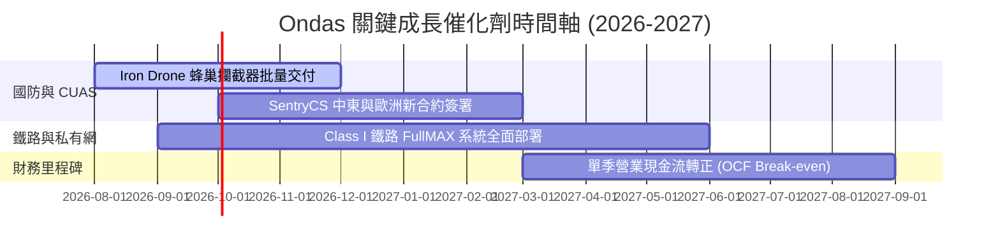

### 9.2 TAM 市場規模分析

```
╔══════════════════════════════════════════════════════════════════╗
║               Ondas 目標市場規模 TAM ($B)                        ║
╠══════════════════════════════════════════════════════════════════╣
║                                                                  ║
║  全球反無人機 (CUAS) 市場:      $10.5B  █████████████████████    ║
║  私有無線網絡 (Private LTE/5G): $12.0B  ████████████████████████ ║
║  自主無人機巡檢 (Drone-in-a-Box):$6.8B  █████████████            ║
║                                                                  ║
║  📊 Ondas 目前滲透率僅約 < 0.5%，潛力成長空間巨大。              ║
╚══════════════════════════════════════════════════════════════╝
```

### 9.3 成長驅動力結構圖

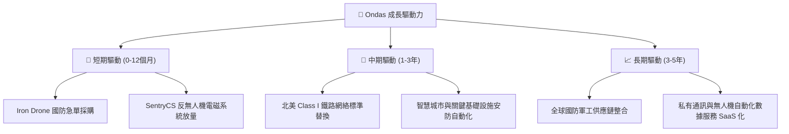

---

## 10. 風險矩陣

### 10.1 風險評分矩陣

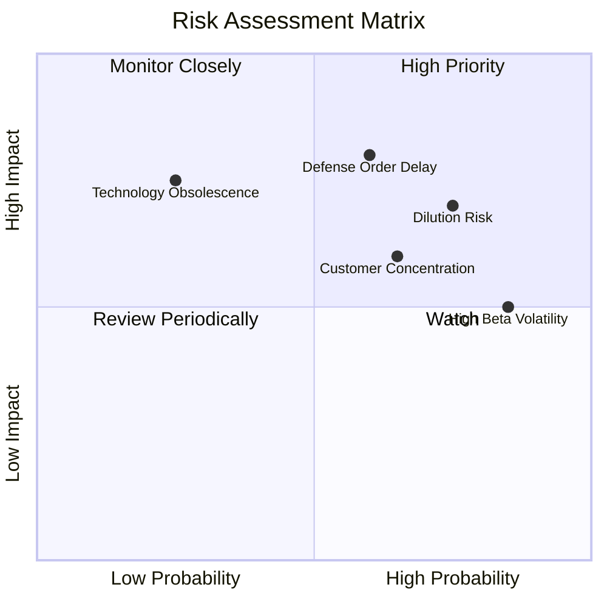

### 10.2 風險清單詳細分析

| # | 風險項目 | 發生機率 | 財務衝擊 | 風險評分 | 緩解措施 |
|---|----------|----------|----------|----------|----------|
| 1 | 🔴 **國防採購合約延宕** | 中高 (60%) | 高 (-25% 營收) | 🔴 **8.0/10** | 拓展多國防務客戶與民用鐵路雙軌發展 |
| 2 | 🔴 **股本持續稀釋風險** | 高 (75%) | 中 (-15% 每股價值) | 🔴 **7.5/10** | 利用手頭 $1.47B 現金降低後續增資需求 |
| 3 | 🟡 **高 Beta (2.691) 股價劇烈波動** | 高 (85%) | 中 (-20% 估值彈性) | 🟡 **6.8/10** | 進行對衝策略或分批建立部位 |
| 4 | 🟡 **客戶集中度過高** | 中高 (65%) | 中高 (-20% 營收) | 🟡 **6.5/10** | 加快與歐洲及中東系統整合商合作 |

---

## 11. 投資建議

### 11.1 最終綜合評級雷達圖

```
╔══════════════════════════════════════════════════════════════╗
║                   Ondas 綜合維度評分雷達                     ║
╠══════════════════════════════════════════════════════════════╣
║ 營收成長動能  9.0/10  ▓▓▓▓▓▓▓▓▓▓▓▓▓▓▓▓▓▓░░  ★★★★★          ║
║ 資產負債健診  9.5/10  ▓▓▓▓▓▓▓▓▓▓▓▓▓▓▓▓▓▓▓░  ★★★★★          ║
║ 護城河壁壘    6.2/10  ▓▓▓▓▓▓▓▓▓▓▓▓░░░░░░░░  ★★★☆☆          ║
║ 本業獲利能力  3.0/10  ▓▓▓▓▓▓░░░░░░░░░░░░░░  ★☆☆☆☆          ║
║ DCF 估值保護  3.0/10  ▓▓▓▓▓▓░░░░░░░░░░░░░░  ★☆☆☆☆          ║
╠══════════════════════════════════════════════════════════════╣
║ 綜合總分      6.1/10  ▓▓▓▓▓▓▓▓▓▓▓▓░░░░░░░░  🟡 持有（觀望）  ║
╚══════════════════════════════════════════════════════════════╝
```

### 11.2 目標價與隱含報酬率

| 情境 | 目標價 | 隱含報酬率 (相對 $7.49) | 機率權重 | 核心觸發條件 |
|------|--------|--------------------------|----------|--------------|
| 🔴 **悲觀情境** | **$3.50** | **-53.3%** | 25% | 反無人機訂單轉化停滯，高額 SBC 持續稀釋 |
| 🟡 **基準情境** | **$8.00** | **+6.8%** | 50% | FY26 營收達 $180M，反無人機與鐵路業務穩健放量 |
| 🟢 **樂觀情境** | **$15.50** | **+106.9%** | 25% | 全球國防合約爆發，單季營收突破 $80M 並實現營益轉正 |

### 11.3 買入時機與觸發因素

```
╔══════════════════════════════════════════════════════════════════╗
║                  ✅ 買入觸發因素 Checklist                      ║
╠══════════════════════════════════════════════════════════════════╣
║                                                                  ║
║  立即買入觸發條件（需多數符合）：                                ║
║  ☐ 股價回檔至建議買入區間 $4.00 – $5.00（MOS ≥ 35%）             ║
║  ☐ 季度營業利益率收斂至 -20% 以內，展現明確營運槓桿              ║
║  ☐ 單季 SBC / 營收降至 15% 以下，股本稀釋放緩                   ║
║                                                                  ║
║  加碼觸發條件（出現以下任一）：                                  ║
║  ☐ 贏得單筆金額 > $50M 之國防部反無人機採購大單                  ║
║  ☐ 營業現金流 (OCF) 正式轉正                                     ║
║                                                                  ║
║  減碼/停損觸發條件（出現以下任一）：                             ║
║  ☐ 季度營收 YoY 成長率驟降至 20% 以下                            ║
║  ☐ 手頭現金消耗過快，未產生效益即再次增資稀釋 > 15%              ║
╚══════════════════════════════════════════════════════════════════╝
```

### 11.4 投資人適配度分析

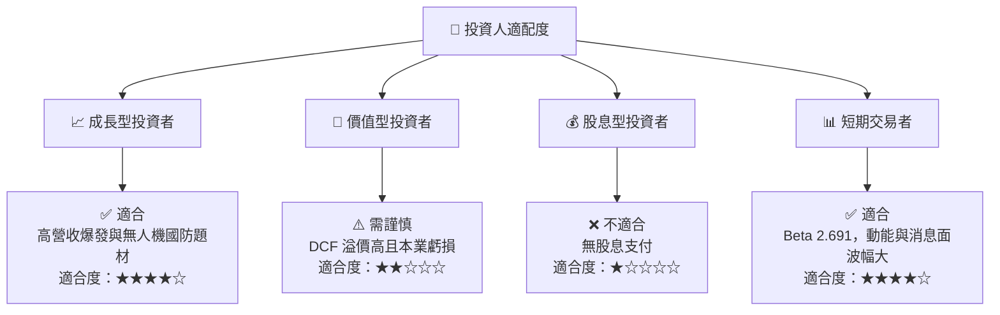

### 11.5 每季財報監控清單（Quarterly Watch List）

| 監控指標 | 最新數據 (Q1 2026/TTM) | 樂觀門檻 (加碼條件) | 悲觀門檻 (減碼條件) |
|----------|------------------------|---------------------|---------------------|
| **季度營收** | $50.12M | > $60.0M (YoY > 500%) | < $25.0M |
| **毛利率** | 49.2% | > 50.0% | < 35.0% |
| **營業虧損 (Operating Loss)**| -$42.67M (單季) | 收斂至 -$15.0M 以內 | 擴大至 > -$50.0M |
| **SBC / 營收** | 39.2% (單季) | < 15.0% | > 45.0% |
| **現金及短期投資** | $1.47B | 維持 > $1.2B | < $800M (無合理併購下) |

### 11.6 反面論證：什麼會證明論點錯誤（What Would Change My Mind）

```
╔══════════════════════════════════════════════════════════════════╗
║              ⚠️ 論點失效條件（Disconfirming Evidence）           ║
╠══════════════════════════════════════════════════════════════════╣
║  本投資論點在下列情況成立時應重新檢視或清倉退出：                 ║
║  ☐ 核心反無人機（CUAS）業務連續兩季營收 QoQ 出現負成長           ║
║  ☐ FY2026E 全年營收未達 $150M，顯示商業化放量遇到瓶頸            ║
║  ☐ 營業利益率無法在 2027 年前實現轉正                            ║
║  ☐ 股權薪酬 (SBC) 年化金額突破 $50M，對小股東產生持續嚴重的稀釋   ║
║  ☐ 國防部或 Class I 鐵路客戶轉向採購同業競爭對手產品             ║
╚══════════════════════════════════════════════════════════════════╝
```

---

> **免責聲明**：本報告由機構級研究模型自動生成，內容僅供學術與投資研究參考，不構成任何個人化之買賣建議。證券投資具高風險，股價可能劇烈波動，投資人應獨立思考並自行承擔投資風險。