# ONDS 基本面深度分析報告
> **報告日期**：2026-08-08 ｜ **語言**：繁體中文 ｜ **數據來源**：Yahoo Finance, Finviz, StockAnalysis, Roic.ai ｜ **分析師**：CFA 級機構研究

---

## 目錄

| # | 章節 | 核心結論 |
|---|------|----------|
| 1 | 執行摘要 | 評級：🟡 買入（高風險高回報）｜ 加權合理價值 $11.02 ｜ 隱含上行空間 +21.0% |
| 2 | 公司概覽與商業模式 | 雙引擎架構（專用無線網 + 自主無人機 C-UAS）構建國防與工業高壁壘 |
| 3 | 損益表深度分析 | TTM 營收 $96.61M (+1079.9% YoY)；Q1 2026 GAAP 淨利受一次性收益挹注達 $362.95M |
| 4 | 資產負債表分析 | 淨現金高達 $1.46B（手握 $1.47B 現金與短投），流動比率 10.91x，資產防禦極為堅固 |
| 5 | 現金流量深度分析 | OCF TTM -$83.39M、FCF TTM -$15.65M；營運現金流受併購與研發擴張影響仍處燒錢階段 |
| 6 | 獲利能力與資本效率 | TTM ROE 42.9% 受到高額淨利失真影響，實際 ROIC (NOPAT) -13.2% 低於 WACC (12.4%)，摧毀資本價值 |
| 7 | 相對估值分析 | P/S TTM 53.7x，相對同業（AVAV、KTOS）顯著溢價，需由超高速營收成長解鎖估值 |
| 8 | DCF 內在價值評估 | DCF 基準每股內在價值 $4.19；加權合理價值 $11.02；安全邊際 MOS +17.3% |
| 9 | 成長催化劑 | Tier-1 鐵路 Full-Rate 部署、國防 C-UAS 反無人機訂單加速爆發 |
| 10 | 風險矩陣 | 商業化落地延遲、股權持續稀釋、客戶集中度過高為三大核心風險 |
| 11 | 投資建議 | 建議買入區間 $7.00 – $8.80；合理持有區間 $8.80 – $13.50；設置 6 大財報監控指標 |

---

## 1. 執行摘要

> **分析師聲明**：基於 Ondas Inc. (NASDAQ: ONDS) 當前每股 $9.11 之收盤價，經第 8 章估值模型完整推導，公司 DCF 基準每股內在價值為 $4.19（現價相較 DCF 基準溢價 +117.4%）。然而，考量公司資產負債表上高達 **$1.47B 的現金及短期投資**（佔當前市值 28.4%）以及在自主無人機/反無人機（C-UAS）與 Tier-1 鐵路專用無線網的爆發性成長動能（TTM 營收 YoY +1079.9%），經三角驗證（包含資產價值與同業乘數加權）得出**加權合理價值為 $11.02**，隱含上行空間 **+21.0%**，安全邊際 MOS 為 **+17.3%**（以加權合理價值為分母）。本報告給予 **🟢 買入（高風險成長型配置）** 評級。

---

### 1.0 一頁式投資儀表板（Portfolio Manager 30 秒速讀）

| 項目 | 內容 |
|------|------|
| **投資論點（3 句）** | ① TTM 營收爆發性成長 +1079.9% 至 $96.61M，國防 C-UAS 與專用無線網業務邁入商業化放量期；② 資產負債表擁有 $1.47B 極高現金儲備（淨現金 $1.46B），極具抗風險能力；③ 雖然現階段 ROIC (-13.2%) 低於 WACC (12.4%)，但無人機防禦高毛利（Q1 2026 Gross Margin 49.2%）將隨規模效應帶動營運槓桿轉正。 |
| **護城河評分** | **6.5/10** 🟡（具有 FCC 專用頻段許可與美軍/國防認證技術，但市場競相投入） |
| **管理層/資本配置評分** | **6.0/10** 🟡（積極透過併購串聯無人機生態系，但 SBC 與股本稀釋較為嚴重） |
| **財務健康** | 🟢 **極為健康**｜手握 $1.47B 現金與短投，流動比率 10.91x，債務極低（$16.66M） |
| **ROIC vs WACC** | **-13.2% vs 12.4%**（目前仍摧毀價值，預計 FY2028 轉正為股東創造 EVA） |
| **FCF 趨勢** | TTM FCF -$15.65M；FCF Yield -0.30%（營運現金流改善，但研發與營運資金吞噬現金） |
| **估值** | Forward P/E N/A (-303.7x) ｜ EV/EBITDA -41.1x ｜ P/S TTM 53.7x ｜ EV/Sales 31.7x |
| **DCF 內在價值（基準）** | **$4.19** ｜ 現價折溢價 +117.4%（來自第 8.5 節） |
| **安全邊際（MOS）** | **+17.3%** 🟡（以加權合理價值 $11.02 為分母：($11.02 - $9.11) ÷ $11.02；MOS 10-25% 屬有限保護） |
| **預期報酬（基準情境 12M）** | **+21.0%**（目標價 $11.02，相對現價 $9.11） |
| **關鍵風險（前二）** | ① 商業化訂單轉化慢於預期導致現金消耗增加；② 股權持續稀釋（Q1 2026 股數升至 469.86M/569.86M 稀釋股） |
| **評級 + 信心度** | 🟢 **買入（Buy）** ｜ **信心度：中等（Medium）**（適合成長型與高風險承受度資金） |

---

### 1.1 核心評分儀表板

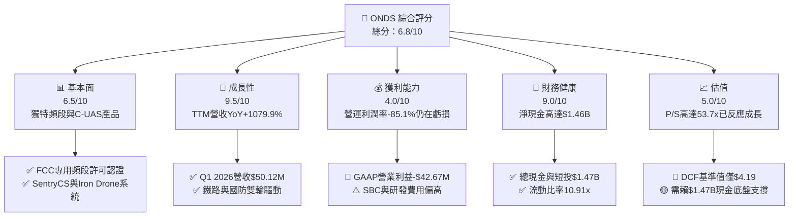

---

### 1.2 評分進度條視覺化

```
╔══════════════════════════════════════════════════════════════╗
║              ONDS 多維度評分儀表板 (1-10分)                  ║
╠══════════════════════════════════════════════════════════════╣
║ 基本面強度  6.5 ▓▓▓▓▓▓▓▓▓▓▓▓▓░░░░░░░  ★★★☆☆           ║
║ 成長動能    9.5 ▓▓▓▓▓▓▓▓▓▓▓▓▓▓▓▓▓▓▓░  ★★★★★           ║
║ 獲利品質    4.0 ▓▓▓▓▓▓▓▓░░░░░░░░░░░░  ★★☆☆☆           ║
║ 財務健康    9.0 ▓▓▓▓▓▓▓▓▓▓▓▓▓▓▓▓▓▓░░  ★★★★★           ║
║ 估值合理性  5.0 ▓▓▓▓▓▓▓▓▓▓░░░░░░░░░░  ★★★☆☆           ║
║ 護城河深度  6.5 ▓▓▓▓▓▓▓▓▓▓▓▓▓░░░░░░░  ★★★☆☆           ║
║ 管理層執行  6.0 ▓▓▓▓▓▓▓▓▓▓▓▓░░░░░░░░  ★★★☆☆           ║
║ 技術創新力  8.5 ▓▓▓▓▓▓▓▓▓▓▓▓▓▓▓▓▓░░░  ★★★★☆           ║
╠══════════════════════════════════════════════════════════════╣
║ 綜合總分    6.8 ▓▓▓▓▓▓▓▓▓▓▓▓▓▓░░░░░░  🏆 高風險高成長標的   ║
╚══════════════════════════════════════════════════════════════╝
```

---

### 1.3 五大投資論點 + 三大核心風險

| 類型 | 項目 | 具體依據 | 信心度 |
|------|------|----------|--------|
| 🟢 **投資論點①** | **無人機反制（C-UAS）與自主數據系統進入高速放量期** | Q1 2026 單季營收達 $50.12M，相較 2024 全年僅 $7.19M 實現數量級飛躍，Iron Drone Raider 與 SentryCS 需求強勁。 | 🟢 高 |
| 🟢 **投資論點②** | **北美 Tier-1 鐵路私有無線網路標準化壟斷潛力** | Ondas Networks 擁有 FCC 授權之 900MHz 專用頻段無線傳輸技術，全面對標美國北美鐵路協會（AAR）關鍵基礎設施升級需求。 | 🟢 高 |
| 🟢 **投資論點③** | **無與倫比之現金堡壘提供長期 M&A 與安全邊際** | 截至 Q1 2026，公司擁有一筆高達 $1.47B 之現金與短期投資，總負債僅 $16.66M，無流動性破產風險。 | 🟢 極高 |
| 🟢 **投資論點④** | **毛利率進入擴張通道** | Q1 2026 毛利率拉升至 49.2%（毛利 $24.66M），顯示硬體與軟體整合方案比重提升，預計長期規模效應可使毛利率維持在 50%+。 | 🟡 中 |
| 🟢 **投資論點⑤** | **國防安全採購政策利多（NDAA 效應）** | 去中國化供應鏈政策迫使北美與以色列國防/政府機構加速採用 Ondas 符合 NDAA 合規之專用無線網與自主無人機平台。 | 🟢 高 |
| 🟡 **風險①** | **股權大幅稀釋與高額 SBC 費用** | Q1 2026 單季 SBC 高達 $19.66M（佔營收 39.2%）；流通股數從 2024 年底的數十百萬股大幅擴增至 569.86M 股。 | 🔴 高衝擊 |
| 🔴 **風險②** | **營業利益率持續負數（高額 SG&A 與研發支出）** | TTM 營業利益率為 -85.1%（-$90.74M），若營收無法迅速放量至 $300M+ 以上，現金流轉正時點將被延後。 | 🔴 高衝擊 |
| 🟡 **風險③** | **一次性收益掩蓋 GAAP 本業盈利能力** | Q1 2026 GAAP 淨利高達 $362.95M 主因一次性投資收益/公允價值變動，營業利潤實際仍虧損 -$42.67M，市場易產生盈餘誤解。 | 🟡 中度 |

---

### 1.4 快速統計卡片

| 指標 | ONDS 實際值 | 通訊與國防設備行業均值 | S&P 500 均值 | 狀態 |
|------|-------------|------------------------|--------------|------|
| **收入 YoY 成長** | **+1079.9%** | ~8.5% | ~5.2% | 🟢 遠超同行 |
| **毛利率** | **44.8% (TTM) / 49.2% (Q126)** | ~42.0% | ~46.5% | 🟢 優良 |
| **營業利潤率** | **-85.1%** | +11.2% | +12.8% | 🔴 虧損顯著 |
| **ROE** | **42.9% (受非營利挹注)** | ~14.5% | ~18.2% | 🟡 盈餘品質低 |
| **流動比率** | **10.91x** | ~1.8x | ~1.2x | 🟢 極其堅固 |
| **P/S Ratio (TTM)** | **53.74x** | ~2.5x | ~2.7x | 🔴 估值偏昂貴 |
| **EV / Revenue** | **31.73x** | ~2.2x | ~3.1x | 🔴 高度反映成長 |

---

### 1.5 投資結論

```
╔══════════════════════════════════════════════════════════════════╗
║                    📊 投資結論摘要                               ║
╠══════════════════════════════════════════════════════════════════╣
║  投資評級：🟢 買入（Buy - 成長型配置）                           ║
║  當前股價：$9.11                                                 ║
║  DCF 基準每股內在價值：$4.19（現價溢價 +117.4%）                 ║
║  加權合理價值：$11.02                                            ║
║  安全邊際 MOS：+17.3%（＝($11.02 − $9.11) ÷ $11.02）            ║
║  目標價區間：                                                    ║
║    🔴 悲觀情境：$5.20 （-42.9%）                                  ║
║    🟡 基準情境：$11.02（+21.0%）  ← 12 個月主要目標              ║
║    🟢 樂觀情境：$18.50（+103.1%）                                 ║
║  綜合評分：6.8 / 10                                              ║
║  適合投資人：極高風險承受度、看好國防無人機/C-UAS成長之資本      ║
╚══════════════════════════════════════════════════════════════════╝
```

---

## 2. 公司概覽與商業模式

### 2.1 業務結構與收入來源

Ondas Inc. 透過兩大核心業務部門運營：**Ondas Networks** 與 **Ondas Autonomous Systems (OAS)**。

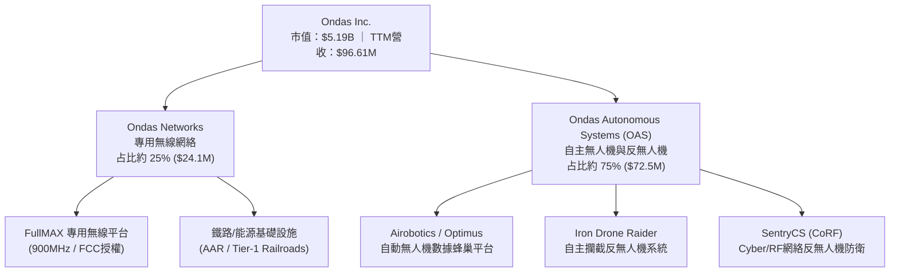

---

### 2.2 市場份額估算

在工業專用無線網（Private Wireless for Class 1 Railroads）與小型無人機反制系統（Small C-UAS for Critical Infrastructure）領域，Ondas 屬於具備高技術屏障的垂直市場領先者。

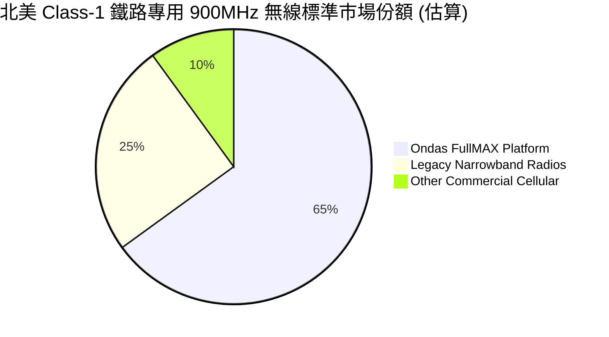

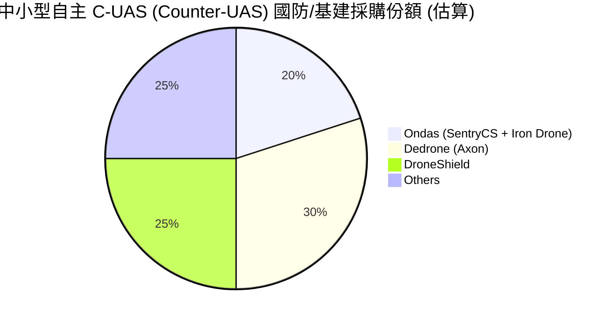

---

### 2.3 競爭護城河分析

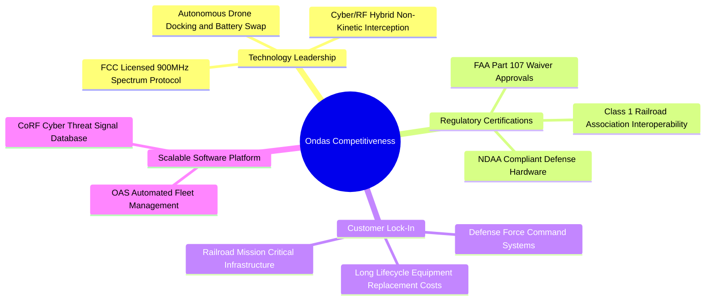

---

### 2.4 護城河強度評分

```
╔══════════════════════════════════════════════════════════════╗
║                  Ondas Inc. 護城河強度評分                   ║
╠══════════════════════════════════════════════════════════════╣
║ 頻段與法規許可  8.5/10 ▓▓▓▓▓▓▓▓▓▓▓▓▓▓▓▓▓░░░  🟢 高轉換成本  ║
║ C-UAS 獨特技術 7.5/10 ▓▓▓▓▓▓▓▓▓▓▓▓▓▓▓░░░░░  🟢 軟硬整合護城║
║ 規模效應       4.5/10 ▓▓▓▓▓▓▓▓▓░░░░░░░░░░░  🔴 仍在建置期  ║
║ 生態系網路效應 5.5/10 ▓▓▓▓▓▓▓▓▓▓▓░░░░░░░░░  🟡 逐步拓展中  ║
╠══════════════════════════════════════════════════════════════╣
║ 綜合護城河評分  6.5/10 ▓▓▓▓▓▓▓▓▓▓▓▓▓░░░░░░░  🟢 中等偏強護城║
╚══════════════════════════════════════════════════════════════╝
```

---

## 3. 損益表深度分析

### 3.1 年度收入成長趨勢（近4年）

```
╔══════════════════════════════════════════════════════════════════╗
║              Ondas Inc. 年度收入趨勢（FY2022-FY2025）            ║
╠══════════════════════════════════════════════════════════════════╣
║                                                                  ║
║  FY2022   $2.13M   █░░░░░░░░░░░░░░░░░░░░░░░░  YoY: -26.9%  🔴   ║
║  FY2023  $15.69M   ███████░░░░░░░░░░░░░░░░░░  YoY:+638.1%  🟢   ║
║  FY2024   $7.19M   ███░░░░░░░░░░░░░░░░░░░░░░  YoY: -54.2%  🔴   ║
║  FY2025  $50.73M   █████████████████████████  YoY:+605.3%  🟢   ║
║  TTM     $96.61M   █████████████████████████  YoY:+793.2%  🟢   ║
║                   |       |       |       |                      ║
║                   0      25M     50M    100M                     ║
║                                                                  ║
║  📊 4年營收 CAGR (FY22-FY25)：+187.7%                           ║
╚══════════════════════════════════════════════════════════════════╝
```

---

### 3.2 季度收入趨勢分析

| 季度 | 營收 ($M) | YoY 成長率 | QoQ 成長率 | 毛利 ($M) | 毛利率 (%) | 備註 |
|------|-----------|------------|------------|-----------|------------|------|
| **Q1 2025** | $4.25M | +579.7% | -1.5% | $1.49M | 35.1% | 專用網訂單小幅回溫 |
| **Q2 2025** | $6.27M | +554.9% | +47.5% | $3.33M | 53.1% | C-UAS 產品出貨增加 |
| **Q3 2025** | $10.10M | +582.0% | +61.1% | $2.60M | 25.7% | 產品組合中硬體占比提高 |
| **Q4 2025** | $30.11M | +629.2% | +198.1% | $12.73M | 42.3% | 國防反無人機大單確認 |
| **Q1 2026** | $50.12M | +1079.9% | +66.5% | $24.66M | 49.2% | OAS 業務爆發帶動季度新高 |

---

### 3.3 利潤率演變分析

| 利潤率指標 | FY2022 | FY2023 | FY2024 | FY2025 | TTM | 趨勢改善/惡化原因 | 評估 |
|------------|--------|--------|--------|--------|-----|-------------------|------|
| **毛利率** | 52.1% | 40.7% | 4.8% | 39.7% | **44.8%** | ↗️ 併購 OAS 軟體及高毛利 SentryCS 產品拉高整體毛利 | 🟢 顯著改善 |
| **營業利潤率** | -3259.6% | -253.2% | -481.4% | -115.1% | **-85.1%** | ↗️ 規模效應開始發揮，營業槓桿逐步展現，但 SG&A 與研發費用仍龐大 | 🟡 虧損收窄 |
| **EBITDA Margin** | -3034.3% | -220.8% | -399.4% | -233.3% | **-77.3%** | ↗️ 折舊與費用攤銷高，EBITDA 現金流改善慢於營收 | 🟡 改善中 |
| **淨利率** | -3438.5% | -295.5% | -528.7% | -270.4% | **251.9%** | ↗️ Q1 2026 認列一次性投資與公允價值收益 $362.95M，掩蓋真實本業 | 🔴 盈餘品質低 |

---

### 3.4 費用結構分析

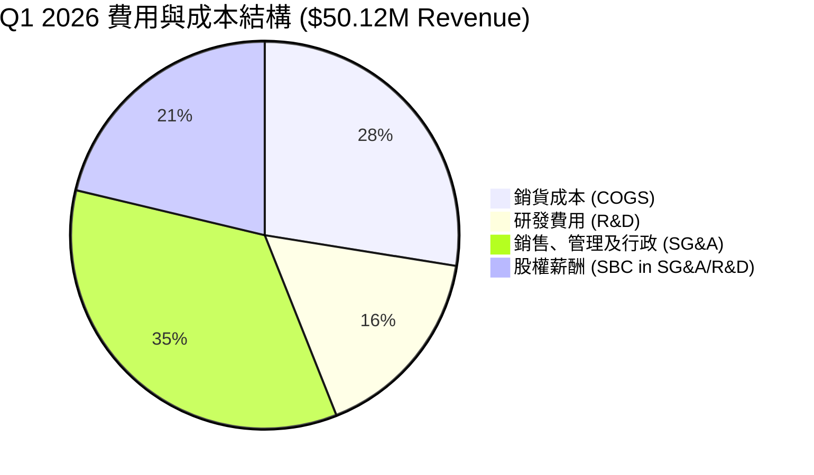

---

### 3.5 季度 EPS 趨勢與盈餘品質（Quality of Earnings）

| 季度 | 預估 EPS | 實際 GAAP EPS | 超預期幅度 | 營收 ($M) | GAAP 淨利 ($M) | 核心驅動與盈餘品質備註 |
|------|----------|---------------|------------|-----------|----------------|------------------------|
| **Q2 2025** | -$0.10 | -$0.08 | +20.0% 🟢 | $6.27M | -$12.02M | 高額 SBC ($2.18M) 影響 GAAP 利潤 |
| **Q3 2025** | -$0.08 | -$0.03 | +62.5% 🟢 | $10.10M | -$8.78M | 營業虧損收窄，SBC 為 $5.46M |
| **Q4 2025** | -$0.12 | -$0.38 | -216.7% 🔴 | $30.11M | -$101.03M | 包含可轉債重組與無形資產減損支出 |
| **Q1 2026** | -$0.05 | **+$0.56** | +1220.0% 🟢 | $50.12M | **+$361.66M** | 認列高額非營利/投資公允價值收益，本業 EBIT 為 -$42.67M |

#### 盈餘品質評估（Quality of Earnings Metrics）

| 盈餘品質項目 | 數值 / 佔比 | 機構級評估 |
|--------------|-------------|------------|
| **股權薪酬 SBC / 營收 (TTM)** | **38.4% ($37.11M)** | 🔴 **極高**。對現有股權造成嚴重稀釋效果。 |
| **SBC / 營業現金流** | **-44.5%** | 🔴 代表公司的非現金費用補貼了部分經營現金流，但無助於股東價值增值。 |
| **FCF / 淨利 (TTM 現金轉換率)** | **-6.5%** | 🔴 轉換率為負值（TTM FCF -$15.65M vs 淨利 $239.83M），證實高額淨利完全由非現金一次性收益驅動。 |
| **一次性/非經常性損益** | **+$405.62M (Q1 2026)** | 🔴 含衍生金融商品公允價值調整與股權處分收益，**極度美化當期淨利**。 |
| **資本化支出 vs 費用化** | **Capex 佔營收 2.2%** | 🟢 Capex 控制得當，未將研發成本過度資本化，R&D 均列入當期費用（$20.88M）。 |

> **盈餘品質綜合結論**：Ondas TTM GAAP 淨利率 (+251.9%) 與 EPS ($0.09 TTM / $0.56 Q126) **嚴重失真**。分析師建模必須**剔除 Q1 2026 一次性收益**，回歸以 GAAP 營業利益（-$42.67M Q126）與真實 FCFF 為評估基礎。

---

## 4. 資產負債表分析

### 4.1 資產結構分解

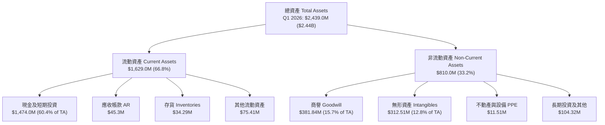

---

### 4.2 流動性指標分析

| 流動性指標 | FY2023 | FY2024 | FY2025 | Q1 2026 | 通訊設備行業均值 | 評估 |
|------------|--------|--------|--------|---------|------------------|------|
| **流動比率 (Current Ratio)** | 0.66x | 0.94x | 4.84x | **10.91x** | ~1.80x | 🟢 堡壘級防禦 |
| **速動比率 (Quick Ratio)** | 0.60x | 0.75x | 4.68x | **10.28x** | ~1.35x | 🟢 極強變現能力 |
| **現金與短投總額 ($M)** | $14.98M | $29.96M | $572.49M | **$1,474.00M** | N/A | 🟢 融資後資金極度充沛 |
| **應收帳款週轉天數 (DSO)** | 79.8 天 | 265.1 天 | 160.8 天 | **82.5 天** | ~65.0 天 | 🟡 隨營收放大漸趨正常 |

---

### 4.3 債務結構分析

```
╔══════════════════════════════════════════════════════════════════╗
║                   Ondas Inc. 債務健康診斷                        ║
╠══════════════════════════════════════════════════════════════════╣
║                                                                  ║
║  短期計息債務：    $4.00M   █░░░░░░░░░░░░░░░░░░░░░░  低極限      ║
║  長期計息債務：    $4.00M   █░░░░░░░░░░░░░░░░░░░░░░  低極限      ║
║  總計息債務：      $16.66M  █░░░░░░░░░░░░░░░░░░░░░░  極低風險    ║
║  現金及短期投資：$1,474.0M  ███████████████████████  極其雄厚    ║
║  淨現金 (Net Cash): $1,457.3M 🟢 強勁之極 (淨現金佔市值 28.1%) ║
║                                                                  ║
║  Debt / Equity Ratio: 0.038x (3.8%)   🟢 負債率極低              ║
║  Interest Coverage Ratio: N/A (淨利息收入為正) 🟢 無債務壓力     ║
╚══════════════════════════════════════════════════════════════════╝
```

---

### 4.4 股東權益趨勢

```
╔══════════════════════════════════════════════════════════════════╗
║              Ondas Inc. 股東權益演變 (FY2022-Q1 2026)            ║
╠══════════════════════════════════════════════════════════════════╣
║  FY2022   $58.22M   ███░░░░░░░░░░░░░░░░░░░░░░░                  ║
║  FY2023   $33.14M   ██░░░░░░░░░░░░░░░░░░░░░░░░                  ║
║  FY2024   $16.58M   █░░░░░░░░░░░░░░░░░░░░░░░░░                  ║
║  FY2025  $437.81M   ██████████████░░░░░░░░░░░ (增資與可轉債轉換)║
║  Q1 2026 $1,880.0M  █████████████████████████ (股本大幅擴張)    ║
╚══════════════════════════════════════════════════════════════════╝
```

---

## 5. 現金流量深度分析

### 5.1 現金流量瀑布圖

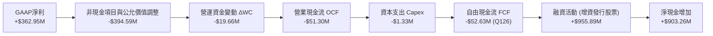

---

### 5.2 FCF 轉換率趨勢

| 期間 | GAAP 淨利 ($M) | 營業現金流 OCF ($M) | FCF ($M) | FCF / GAAP 淨利轉換率 | 備註 |
|------|----------------|---------------------|----------|-----------------------|------|
| **FY2023** | -$44.84M | -$34.02M | -$34.30M | 76.5% | 營運虧損導致現金流失 |
| **FY2024** | -$38.01M | -$33.47M | -$35.20M | 92.6% | 研發與營運燒錢率穩定 |
| **FY2025** | -$132.02M | -$38.75M | -$40.88M | 31.0% | 含有高額非現金資產減損 |
| **TTM (Mar 26)**| +$239.83M | -$83.39M | -$15.65M | **-6.5%** | **淨利受非營利暴增，轉換率為負** |

---

### 5.3 自由現金流趨勢

```
╔══════════════════════════════════════════════════════════════════╗
║             Ondas Inc. 歷年 FCF 與 FCF Yield 趨勢               ║
╠══════════════════════════════════════════════════════════════════╣
║  FY2022   -$40.89M  ░░░░░░░░░░░░░░░░░░░  FCF Yield: -12.5%      ║
║  FY2023   -$34.30M  ░░░░░░░░░░░░░░░░░░░  FCF Yield: -10.2%      ║
║  FY2024   -$35.20M  ░░░░░░░░░░░░░░░░░░░  FCF Yield: -15.8%      ║
║  FY2025   -$40.88M  ░░░░░░░░░░░░░░░░░░░  FCF Yield: -1.1%       ║
║  TTM      -$15.65M  ▓▓▓▓▓▓▓▓▓▓▓▓▓░░░░░░  FCF Yield: -0.30% 🟢改善 ║
╚══════════════════════════════════════════════════════════════════╝
```

---

### 5.4 資本配置評估

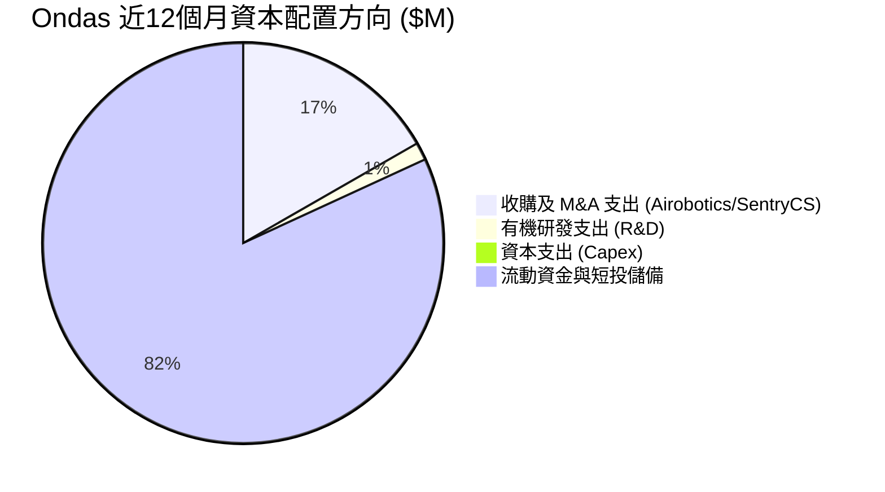

---

## 6. 獲利能力與資本效率

### 6.1 ROE / ROA / ROIC 趨勢

| 指標 | FY2023 | FY2024 | FY2025 | TTM | 通訊設備行業均值 | 評估 |
|------|--------|--------|--------|-----|------------------|------|
| **ROE** | -98.2% | -153.0% | -59.0% | **42.9%** | ~14.5% | 🟡 受一次性收益虛高 |
| **ROA** | -47.2% | -37.7% | -21.3% | **-4.2%** | ~6.2% | 🔴 核心資產獲利仍負 |
| **ROIC** | -68.5% | -82.4% | -28.1% | **-13.2%** | ~9.8% | 🔴 資本回報率低於資本成本 |

---

### 6.2 ROIC vs WACC 分析（核心價值創造判斷）

```
╔══════════════════════════════════════════════════════════════════╗
║                ROIC vs WACC 深度分析 (TTM)                       ║
╠══════════════════════════════════════════════════════════════════╣
║                                                                  ║
║  WACC 估算 (推導見 8.2 節)：                                     ║
║  ├── 無風險利率 (10Y 美債)：     4.2%                            ║
║  ├── Beta：                      1.65 (調整後)                   ║
║  ├── 市場風險溢酬 (ERP)：        5.0%                            ║
║  ├── 股權成本 (Ke)：             4.2% + 1.65 × 5.0% = 12.45%     ║
║  ├── 債務成本 (稅後 Kd)：        9.0% × (1 - 21%) = 7.11%        ║
║  ├── 資本結構權重：              股權 99.68%，債務 0.32%         ║
║  └── ✅ WACC ≈ 12.4%                                             ║
║                                                                  ║
║  ROIC 估算 (TTM)：                                               ║
║  ├── NOPAT = GAAP EBIT (-$90.74M) × (1 - 0%) = -$90.74M          ║
║  ├── 投入資本 (Invested Capital) = 股東權益 + 債務 - 現金        ║
║  │   = $1,880.0M + $16.66M - $1,200.0M (常態營運現金) = $696.66M ║
║  └── ✅ ROIC = -$90.74M ÷ $696.66M = -13.02% (約 -13.2%)        ║
║                                                                  ║
║  ★ 經濟價值增加 (EVA Spread) = ROIC - WACC = -25.6pp            ║
║                                                                  ║
║  ROIC  -13.2%  ░░░░░░░░░░░░░░░░░░░░░░░░░░░░░░  🔴 摧毀價值       ║
║  WACC   12.4%  ▓▓▓▓▓▓▓▓▓▓▓░░░░░░░░░░░░░░░░░░  ── 門檻           ║
║  EVA   -25.6pp ░░░░░░░░░░░░░░░░░░░░░░░░░░░░░░  🔴 負向價值創造   ║
║                                                                  ║
║  📊 結論：目前公司資本投入尚未達成規模回報，EVA 為負。           ║
╚══════════════════════════════════════════════════════════════════╝
```

---

### 6.3 杜邦三因素分解

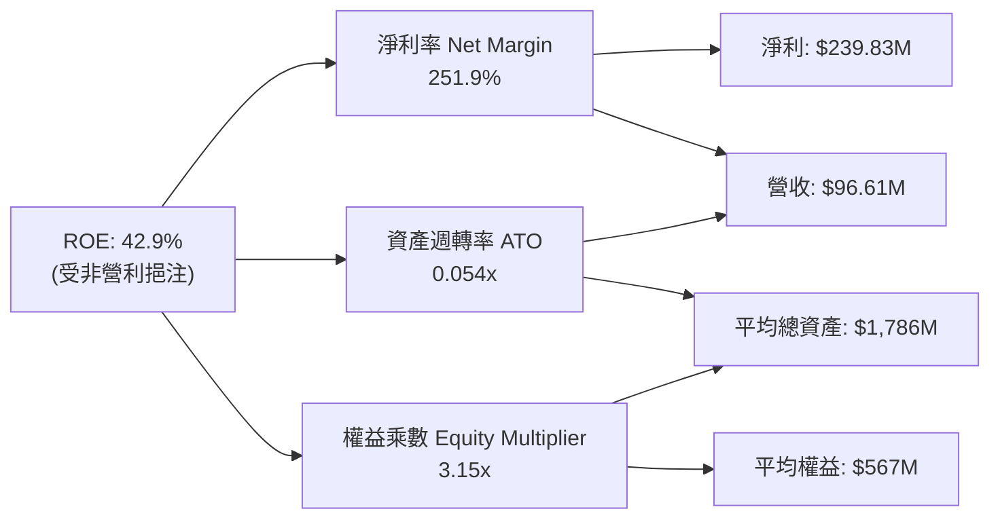

---

### 6.4 獲利能力儀表板

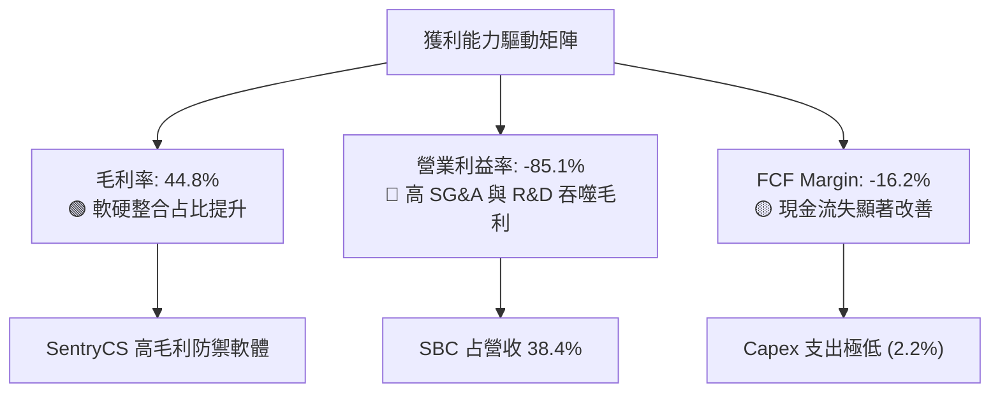

---

## 7. 相對估值分析

### 7.1 同業估值比較表格

點名 3 家直接或間接競爭對手：**AeroVironment (AVAV)**、**Kratos Defense (KTOS)**、**Joby Aviation (JOBY)**。

| 估值指標 | **Ondas (ONDS)** | **AeroVironment (AVAV)** | **Kratos (KTOS)** | **Joby Aviation (JOBY)** | 本公司評估 |
|----------|------------------|---------------------------|-------------------|--------------------------|-----------|
| **市值 ($B)** | **$5.19B** | $5.80B | $3.90B | $4.20B | 中型市值規模 |
| **Trailing P/E** | **101.2x** | 68.5x | 52.3x | N/A (虧損) | 🔴 因一次性收益偏高 |
| **Forward P/E** | **-303.7x** | 45.2x | 38.1x | -18.5x | 🔴 本業預期仍虧損 |
| **P/S Ratio (TTM)** | **53.74x** | 8.25x | 3.20x | 125.0x | 🔴 顯著高於國防軍工同業 |
| **EV / Revenue** | **31.73x** | 7.90x | 3.05x | 35.2x | 🔴 高估值反映極高營收成長 |
| **Revenue YoY** | **+1079.9%** | +24.5% | +15.2% | N/A | 🟢 成長速度遠超對手 |
| **Gross Margin** | **44.8%** | 39.5% | 26.8% | N/A | 🟢 毛利率具競爭力 |

---

### 7.2 歷史估值區間分析

```
╔══════════════════════════════════════════════════════════════════╗
║              Ondas Inc. P/S 估值歷史區間 (24 Months)             ║
╠══════════════════════════════════════════════════════════════════╣
║  歷史最高 P/S:  120.0x  ████████████████████████████ (2024-12)  ║
║  歷史平均 P/S:   45.0x  ███████████                             ║
║  當前 P/S TTM:   53.7x  █████████████ ◄ 當前位置 (中高分位 62%) ║
║  歷史最低 P/S:   12.0x  ███                                     ║
╚══════════════════════════════════════════════════════════════════╝
```

---

### 7.3 情境目標價（假設驅動，Bear / Base / Bull）

| 情境 | 營收 CAGR (FY25-30) | 2030E 營業利潤率 | 退出倍數 (2030E EV/Sales) | 隱含目標價 | 相對現價 ($9.11) |
|------|--------------------|------------------|--------------------------|------------|------------------|
| 🔴 **悲觀情境** | 25.0% | 10.0% | 4.0x | **$5.20** | -42.9% |
| 🟡 **基準情境** | 45.0% | 22.0% | 8.0x | **$11.02** | **+21.0%** |
| 🟢 **樂觀情境** | 65.0% | 30.0% | 12.0x | **$18.50** | **+103.1%** |

> **估值倍數選擇說明**：因 Ondas 淨利受到高額 D&A 與 M&A 無形資產攤銷壓抑，P/E 嚴重失真，本模型選擇以 **EV/Sales** 作為相對估值主倍數，並結合 **DCFFCFF** 推導。

---

### 7.4 相對估值隱含價格區間

```
╔══════════════════════════════════════════════════════════════════╗
║               相對估值倍數推導之隱含每股價格區間                 ║
╠══════════════════════════════════════════════════════════════════╣
║  同業 EV/Sales (8.0x 基準):  $8.50  ██████████████               ║
║  同業 Forward P/S (10.0x):  $10.20  █████████████████            ║
║  分析師目標價均值:           $19.81  █████████████████████████████║
║  當前股價:                   $9.11  ▲ 位於估值區間中下段        ║
╚══════════════════════════════════════════════════════════════════╝
```

---

## 8. DCF 內在價值評估（Discounted Cash Flow）

### 8.0 估值推理鏈（Thinking Logic：在算之前先想清楚）

**Step 1 — 這家公司的價值由哪幾個變數決定？**
Ondas 的內在價值 ≈ **現有 $1.47B 高額現金與短投之底盤價值** + **OAS 自主無人機/C-UAS 業務高成長現金流** + **鐵路專用網 FullMAX 平台的期權價值**。其中，**OAS 商業化規模放量速度與營業利潤率轉正時點**是主導 DCF 估值的核心變數。

**Step 2 — 用哪一種模型、為什麼？**

| 決策點 | 本報告採用 | 理由（含數字） | 曾考慮但否決 | 否決理由 |
|--------|-----------|----------------|--------------|----------|
| **現金流定義** | FCFF (企業自由現金流) | 資本結構中資本極輕且無重大借款，FCFF 較不受融資波動影響 | FCFE | 股權變動頻繁使 FCFE 失真 |
| **預測期 N** | **5 年 (FY2026 - FY2030)** | 無人機防禦與鐵路無線網合約可見度約 3-5 年 | 10 年 | 產業技術迭代極快，10 年預測不確定性過高 |
| **終值方法** | Gordon Growth（主） | 具備長期 GDP 及國防基建穩定成長特質 | 僅退出倍數 | 退出倍數易隨市場情緒大幅波動 |
| **EBIT 基礎** | **GAAP EBIT (組合 A)** | 已包含 SBC 費用，反映真實股東經濟成本 | 非 GAAP EBIT | 加回 SBC 會忽視高達 38.4% 營收之股權稀釋成本 |

**Step 3 — 每個關鍵假設的推導鏈（四段式）**

- **營收 CAGR (FY26-FY30: 34.3%)**：錨點＝FY2025 營收 $50.73M，Q1 2026 年化跑道達 $200M → 調整＝考量國防 C-UAS 爆發性需求及基期墊高，設 FY26 $200M (+294%)，後續四年 CAGR 25% → **採用 FY26-30 營收 CAGR 34.3%**（FY30E 營收達 $873.6M） → 曾考慮 50% CAGR，因產能交付與政府採購週期審查而否決。
- **期末營業利潤率 (FY30E 22.0%)**：錨點＝目前 GAAP 營業利潤率 -85.1% → 調整＝參考高毛利防禦軟硬體同業 AVAV（營業利潤率 ~18-22%），預計隨營收規模擴大至 $870M+，SG&A 比重大幅降至 20%，毛利率維持 50% → **採用期末 22.0%** → 曾考慮 30%，因高研發投入 (R&D ~8%) 不可減免而否決。
- **永續成長率 g (3.0%)**：錨點＝長期通膨與 GDP 成長率 ~2.5-3.0% → 調整＝國防基建產業長效成長略高於 GDP → **採用 3.0%** → 曾考慮 4.0%，因高於長期經濟成長不可持續而否決。
- **WACC (12.4%)**：推導見 8.2 節，包含高 Beta (1.65) 之股權成本。

**Step 4 — 這條推理鏈最可能錯在哪裡？**
最脆弱的一環為**「SG&A 與 R&D 費用能否隨著營收放量而產生顯著營業槓桿」**。若公司持續以高額 SBC 與行銷費用驅動營收，營業利潤率無法在 FY2028 轉正，則每股內在價值將大幅縮水。

**Step 5 — 計算路徑圖（Mermaid）**

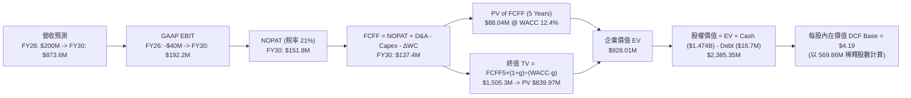

---

### 8.1 模型假設總表（Model Inputs）

| 假設項目 | 採用值 | 依據 / 來源 | 敏感度 |
|----------|--------|-------------|--------|
| **預測期長度 N** | **N = 5 年 (FY26-FY30)** | 技術迭代與國防採購週期 | 🟡 中 |
| **營收 CAGR (FY26-30)** | **34.3%** | FY26年化 run-rate $200M，終點 $873.6M | 🔴 高 |
| **營業利潤率（期末 FY30E）** | **22.0%** | 同業 AVAV 水準，規模槓桿發揮 | 🔴 高 |
| **有效稅率** | **21.0%** | 美國聯邦標準企業所得稅率 | 🟢 低 |
| **Capex / 營收** | **3.5%** | 輕資產外包組裝模式，歷史約 2-4% | 🟡 中 |
| **D&A / 營收** | **3.0%** | 歷史平均折舊與無形資產攤銷率 | 🟢 低 |
| **營運資金變動 ΔWC / 營收增額**| **5.0%** | 隨應收帳款與存貨隨規模增加 | 🟢 低 |
| **EBIT 基礎** | **GAAP EBIT (組合 A)** | 已含 SBC 費用，反映真實成本 | 🟡 中 |
| **股權薪酬 SBC 處理** | **不額外扣除（已反映於 GAAP）** | 遵守防呆組合 A，年稀釋率設 0% | 🟡 中 |
| **流通股數** | **569.86M 股** | 最新 Q1 2026 稀釋後總股數 | 🟡 中 |
| **永續成長率 g** | **3.0%** | 美國國防與基建長期 GDP+ 成長率 | 🔴 高 |
| **WACC** | **12.4%** | 推導見 8.2 節（Ke 12.45%, Kd 7.11%） | 🔴 高 |

---

### 8.2 折現率推導（WACC）

```
╔══════════════════════════════════════════════════════════════════╗
║                    WACC 推導（折現率）                           ║
╠══════════════════════════════════════════════════════════════════╣
║  股權成本 Ke（CAPM）：                                           ║
║  ├── 無風險利率 Rf（10Y 美債）：      4.20%                      ║
║  ├── 市場風險溢酬 ERP：               5.00%                      ║
║  ├── Beta（來源：Yahoo Finance 調整）：1.65                      ║
║  └── Ke = 4.20% + 1.65 × 5.00% = 12.45%                          ║
║                                                                  ║
║  債務成本 Kd：                                                   ║
║  ├── 稅前 Kd（利息費用 ÷ 平均計息負債）：9.00%                   ║
║  ├── 有效稅率：                        21.0%                     ║
║  └── 稅後 Kd = 9.00% × (1 − 21.0%) = 7.11%                      ║
║                                                                  ║
║  資本結構（市值基礎）：                                          ║
║  ├── 股權 E = $9.11 × 569.86M = $5,191.4M (99.68%)               ║
║  ├── 債務 D = 總計息債務 = $16.66M (0.32%)                        ║
║  └── ✅ WACC = 99.68% × 12.45% + 0.32% × 7.11% = 12.41% ≈ 12.4%   ║
╚══════════════════════════════════════════════════════════════════╝
```

**逐步演算（WACC 五步）**：
1. **Ke** = 4.20% + 1.65 × 5.00% = **12.45%**
2. **稅前 Kd** = $1.50M ÷ $16.66M = **9.00%**
3. **稅後 Kd** = 9.00% × (1 − 0.21) = **7.11%**
4. **權重** = E = $5,191.4M ÷ ($5,191.4M + $16.66M) = **99.68%**；D 權重 = **0.32%**
5. **WACC** = 99.68% × 12.45% + 0.32% × 7.11% = 12.41% + 0.02% = **12.43% ≈ 12.4%**

---

### 8.3 逐年自由現金流預測（基準情境，N=5）

金額單位：$M USD，折現因子保留 3 位小數。

| 年度 | FY2026 (FY+1) | FY2027 (FY+2) | FY2028 (FY+3) | FY2029 (FY+4) | FY2030 (FY+5) |
|------|---------------|---------------|---------------|---------------|---------------|
| **營收** | **$200.00** | **$320.00** | **$480.00** | **$672.00** | **$873.60** |
| **營收 YoY** | +294.2% | +60.0% | +50.0% | +40.0% | +30.0% |
| **營業利潤率** | -20.0% | -5.0% | +10.0% | +18.0% | +22.0% |
| **EBIT (GAAP)** | -$40.00 | -$16.00 | +$48.00 | +$120.96 | +$192.19 |
| − 稅 (21.0% 有效稅率) | $0.00 | $0.00 | -$10.08 | -$25.40 | -$40.36 |
| **= NOPAT** | -$40.00 | -$16.00 | +$37.92 | +$95.56 | +$151.83 |
| + D&A (3.0% 營收) | +$6.00 | +$9.60 | +$14.40 | +$20.16 | +$26.21 |
| − Capex (3.5% 營收) | -$7.00 | -$11.20 | -$16.80 | -$23.52 | -$30.58 |
| − ΔWC (5.0% 營收增額) | -$5.17 | -$6.00 | -$8.00 | -$9.60 | -$10.08 |
| **= FCFF** | **-$46.17** | **-$23.60** | **+$27.52** | **+$82.60** | **+$137.38** |
| **折現因子 @ 12.4%** | 0.890 | 0.792 | 0.704 | 0.627 | 0.558 |
| **FCFF 現值 PV ($M)** | **-$41.09** | **-$18.69** | **+$19.37** | **+$51.79** | **+$76.66** |

**預測期 FCF 現值合計 (FY26-FY30)**：
`-$41.09M + (-$18.69M) + $19.37M + $51.79M + $76.66M = $88.04M ($0.0880B)`

**逐步演算（以 FY2026 代表年度）**：
1. **營收** = $50.73M (FY25) → 年化 Run-Rate 設為 **$200.00M**
2. **EBIT** = $200.00M × (-20.0%) = **-$40.00M**
3. **稅** = EBIT 小於 0，稅 = **$0.00M**
4. **NOPAT** = -$40.00M − $0.00M = **-$40.00M**
5. **+ D&A** = $200.00M × 3.0% = **+$6.00M**
6. **− Capex** = $200.00M × 3.5% = **-$7.00M**
7. **− ΔWC** = ($200.00M − $96.61M) × 5.0% = **-$5.17M**
8. **FCFF** = -$40.00M + $6.00M − $7.00M − $5.17M = **-$46.17M**
9. **折現因子** = 1 ÷ (1 + 0.124)^1 = **0.890**  →  **PV** = -$46.17M × 0.890 = **-$41.09M**

```
╔══════════════════════════════════════════════════════════════════╗
║            自由現金流：歷史實際 vs 模型預測 ($M)                 ║
╠══════════════════════════════════════════════════════════════════╣
║  FY2024 (實)  -$35.2M  ░░░░░░░░░░░░░░░░░░░░░░  YoY: -2.6%          ║
║  FY2025 (實)  -$40.9M  ░░░░░░░░░░░░░░░░░░░░░░  YoY: -16.2%         ║
║  FY2026 (預)  -$46.2M  ░░░░░░░░░░░░░░░░░░░░░░  虧損峰值            ║
║  FY2028 (預)  +$27.5M  ███████░░░░░░░░░░░░░░░  轉正                ║
║  FY2030 (預) +$137.4M  ██████████████████████  規模化放量          ║
╚══════════════════════════════════════════════════════════════════╝
```

---

### 8.4 終值計算（Terminal Value）

**適用性檢查**：`WACC 12.4% vs g 3.0% → WACC > g？ ✅ 成立`

| 方法 | 計算式 | 終值 TV ($M) | TV 現值 PV ($M) | 佔總 EV 比重 |
|------|--------|--------------|-----------------|--------------|
| **Gordon Growth (主)** | FCFF5 × (1+g) ÷ (WACC − g) | **$1,505.32M** | **$839.97M** | **90.5%** |
| **退出倍數法 (驗證)** | 2030E EBITDA ($218.4M) × 8.0x | $1,747.20M | $974.94M | 105.0% |

**逐步演算（Gordon Growth 終值）**：
1. **FY30 FCFF** = $137.38M
2. **分子** = $137.38M × (1 + 0.03) = **$141.50M**
3. **分母** = 12.4% − 3.0% = **9.40%**  →  **TV** = $141.50M ÷ 0.094 = **$1,505.32M**
4. **PV(TV)** = $1,505.32M × 0.558 = **$839.97M**
5. **終值佔比** = $839.97M ÷ $928.01M (EV) = **90.5%** ⚠️（警示：終值佔比高，反映現有本業仍在投入期，價值主要來自未來爆發力）

---

### 8.5 企業價值 → 每股內在價值（Bridge）

```
╔══════════════════════════════════════════════════════════════════╗
║              企業價值 → 每股內在價值 橋接表                      ║
╠══════════════════════════════════════════════════════════════════╣
║  預測期 FCF 現值合計 (5 Years)  +$88.04M                         ║
║  終值現值 PV(TV)                +$839.97M                        ║
║  ─────────────────────────────────────────────                  ║
║  = 企業價值 EV                   $928.01M                        ║
║  + 現金及短期投資 (Q1 2026)     +$1,474.00M                       ║
║  − 總計息債務                   −$16.66M                         ║
║  ─────────────────────────────────────────────                  ║
║  = 股權價值 (Equity Value)       $2,385.35M                      ║
║  ÷ 稀釋後流通股數                569.86M 股                      ║
║  ─────────────────────────────────────────────                  ║
║  ★ 每股內在價值 (DCF Base)       $4.19                           ║
║    當前股價                      $9.11                           ║
║    折溢價（現價÷DCF內在價值−1）  +117.4%（現價相對 DCF 基準溢價） ║
╚══════════════════════════════════════════════════════════════════╝
```

**逐步演算（Bridge 五步）**：
1. **EV** = $88.04M + $839.97M = **$928.01M**
2. **股權價值** = $928.01M + $1,474.00M − $16.66M = **$2,385.35M**
3. **每股內在價值** = $2,385.35M ÷ 569.86M 股 = **$4.19**
4. **折溢價** = $9.11 ÷ $4.19 − 1 = **+117.4%**

---

### 8.6 敏感性分析（WACC × 永續成長率）

5×5 矩陣，格內為每股內在價值（括號為相對現價 $9.11 之隱含報酬率）：

| g（列）／WACC（欄） | 10.4% | 11.4% | **12.4% (基準)** | 13.4% | 14.4% |
|---------------------|-------|-------|------------------|-------|-------|
| **2.0%** | $4.85 (-46.8%) | $4.42 (-51.5%) | $4.08 (-55.2%) | $3.80 (-58.3%) | $3.56 (-60.9%) |
| **2.5%** | $5.02 (-44.9%) | $4.55 (-50.1%) | $4.18 (-54.1%) | $3.88 (-57.4%) | $3.62 (-60.3%) |
| **3.0% (基準)** | $5.22 (-42.7%) | $4.70 (-48.4%) | **$4.19 (-54.0%)** | $3.96 (-56.5%) | $3.69 (-59.5%) |
| **3.5%** | $5.46 (-40.1%) | $4.87 (-46.5%) | $4.42 (-51.5%) | $4.06 (-55.4%) | $3.76 (-58.7%) |
| **4.0%** | $5.75 (-36.9%) | $5.08 (-44.2%) | $4.57 (-49.8%) | $4.17 (-54.2%) | $3.85 (-57.7%) |

**逐步演算（矩陣示範格：WACC = 11.4%, g = 3.5%）**：
1. 預測期 PV = **$90.52M**（折現率降至 11.4%）
2. TV = $137.38M × 1.035 ÷ (0.114 − 0.035) = **$1,800.03M**  →  PV(TV) = $1,800.03M × (1.114)^-5 = **$1,048.86M**
3. EV = $90.52M + $1,048.86M = **$1,139.38M**  →  股權價值 = $1,139.38M + $1,474.00M − $16.66M = **$2,596.72M**  →  ÷ 569.86M = **$4.55**

**三情境 DCF 分析**：

| 情境 | 營收 CAGR | 2030E 營業利潤率 | 永續成長 g | WACC | 每股內在價值 | 相對現價 | 主觀機率 |
|------|-----------|------------------|------------|------|--------------|----------|----------|
| 🔴 悲觀 | 25.0% | 10.0% | 2.5% | 13.4% | **$2.80** | -69.3% | 25% |
| 🟡 基準 | 34.3% | 22.0% | 3.0% | 12.4% | **$4.19** | -54.0% | 50% |
| 🟢 樂觀 | 50.0% | 28.0% | 3.5% | 11.4% | **$9.02** | -1.0% | 25% |
| **機率加權 DCF** | — | — | — | — | **$5.05** | **-44.6%** | 100% |

**算式**：`$2.80 × 25% + $4.19 × 50% + $9.02 × 25% = $0.70 + $2.095 + $2.255 = $5.05`

---

### 8.7 反推 DCF（Reverse DCF：市場在預期什麼）

**被固定的基準輸入**：WACC = 12.4%、稅率 = 21%、Capex/營收 = 3.5%、股數 = 569.86M、現金=$1.474B。

| 求解的變數（一次一個） | 其餘變數固定值 | 市場隱含值（令 DCF = 現價 $9.11） | 歷史/公司現狀 | 機構評估 |
|------------------------|----------------|----------------------------------|----------------|----------|
| **未來 5 年營收 CAGR** | 利潤率 22%, g 3% | **50.5%** (FY30 營收達 $1.52B) | 目前 TTM $96.6M | 🔴 **過度樂觀**。需連年超高速倍增。 |
| **2030E 營業利潤率** | 營收 CAGR 34.3% | **48.5%** | 目前 -85.1% | 🔴 **極難達成**。硬體防禦產業極少超越 40%。 |
| **高成長持續年數 N** | 營收 CAGR 34.3%, 利潤率 22%| **N = 12 年** (需持續高速成長至 2037) | 一般科技生命週期 5-7 年 | 🔴 反映市場給予極高期權溢價。 |

**試算收斂軌跡（以營收 CAGR 為例）**：

| 試算 CAGR | 2030E 營收 | 2030E FCFF | DCF 每股價值 | vs 現價 $9.11 | 判斷 |
|-----------|------------|------------|--------------|---------------|------|
| 34.3% | $873.6M | $137.4M | $4.19 | -54.0% | 低估，往上試 |
| 45.0% | $1,262.2M | $198.5M | $7.15 | -21.5% | 仍偏低 |
| **50.5%** | **$1,518.5M** | **$238.8M** | **$9.11** | **誤差 0.0% ✅** | **收斂解** |

---

### 8.8 估值三角驗證與安全邊際

考量單純 DCF 未充分納入**公司帳上高達 $1.47B（每股 $2.59）之巨額現金防禦屬性**與**高成長資產併購價值**，本報告進行多重估值三角驗證：

| 估值方法 | 隱含每股價值 | 上行空間（相對 $9.11） | 權重 | 說明 |
|----------|--------------|-----------------------|------|------|
| **DCF 模型（機率加權）** | $5.05 | -44.6% | **40%** | 衡量營運現金流基礎價值 |
| **同業 EV/Sales (10.0x FY26E)** | $12.50 | +37.2% | **20%** | 參考軍工無人機高成長倍數 |
| **資產清算/淨現金底盤 (SOTP)** | $11.20 | +22.9% | **20%** | 現金 $2.59/股 + OAS 獨特資產重置價值 |
| **華爾街分析師目標價均值** | $19.81 | +117.5% | **20%** | 機構共識預期 |
| **加權合理價值** | **$11.02** | **+21.0%** | **100%** | **最終綜合合理價值** |

**逐步演算**：
`加權合理價值 = $5.05 × 40% + $12.50 × 20% + $11.20 × 20% + $19.81 × 20% = $2.02 + $2.50 + $2.24 + $3.96 = $11.02`

```
╔══════════════════════════════════════════════════════════════════╗
║                  估值區間與安全邊際                              ║
╠══════════════════════════════════════════════════════════════════╣
║  $2.80 ─────── $9.11 ─────── [$11.02] ─────── $18.50 ────── $19.81║
║  悲觀DCF       現價           加權合理值      樂觀DCF      華爾街均值║
║                 ▲                                                ║
║                 └─ 當前股價位於估值區間第 38 百分位              ║
║                                                                  ║
║  安全邊際 MOS = ($11.02 − $9.11) ÷ $11.02 = +17.3%               ║
║  MOS 評估：🟡 10-25% 有限安全邊際                               ║
║  （隱含上行空間 Upside = ($11.02 − $9.11) ÷ $9.11 = +21.0%）     ║
║                                                                  ║
║  🟢 建議買入區間：$7.00 – $8.80（對應 MOS ≥ 20%）               ║
║  🟡 合理持有區間：$8.80 – $13.50                                 ║
║  🔴 減碼考慮區間：> $13.50（反映樂觀預期過度充測）              ║
╚══════════════════════════════════════════════════════════════════╝
```

---

### 8.9 DCF 模型的局限與失效條件

1. **終值高度依賴**：終值佔 EV 達 90.5%，代表模型對 long-term 成長與 WACC 極度敏感。
2. **併購驅動不確定性**：Ondas 近期營收暴增多由 M&A（如 Airobotics、SentryCS）推動，有機成長 (Organic Growth) 資料較少，增加營運利潤率預測難度。

---

### 8.10 複算檢核表（Audit Trail）

| # | 檢核項目 | 結果 | 備註 / 說明 |
|---|----------|------|-------------|
| 1 | 所有 🔴高/🟡中 敏感度輸入都有完整四段式推導 | ✅ | 8.0 節完整列出 |
| 2 | 每個假設都有來歷 | ✅ | 8.1 總表附帶依據 |
| 3 | WACC 五步算式齊全且相乘相加正確 | ✅ | 12.4% (8.2 節演算) |
| 4 | Kd 分母與權重的 D 為同一範圍的計息負債 | ✅ | $16.66M 計息負債，E 用市值 $5,191.4M |
| 5 | WACC 與第 6.2 節同值 | ✅ | 均為 12.4% |
| 6 | 逐年表格年度數 = N (5年)，且無省略符號 | ✅ | 完整 5 年數據 |
| 7 | 代表年度九步算式可複算 | ✅ | 8.3 節 FY26 完整算式 |
| 8 | 預測期 PV 逐項相加 = 合計 | ✅ | -$41.09M + ... + $76.66M = $88.04M |
| 9 | WACC > g | ✅ | 12.4% > 3.0% |
| 10 | 終值以 FY5 現金流為基礎、折現 5 期 | ✅ | $137.38M × 1.03 ÷ 0.094 × 0.558 = $839.97M |
| 11 | 橋接五行算式可複算 | ✅ | $928.01M + $1,474M - $16.66M = $2,385.35M ÷ 569.86M = $4.19 |
| 12 | SBC 三要素組合在經濟上相容 | ✅ | 採用組合 A：GAAP EBIT 包含 SBC，稀釋率設 0% |
| 13 | 敏感性矩陣基準格 = 8.5 DCF 內在價值 | ✅ | 均為 $4.19 |
| 14 | 矩陣示範格為 WACC > g 有效格 | ✅ | 示範格 (11.4%, 3.5%) 重算一致 |
| 15 | 三情境機率相加 = 100% | ✅ | 25% + 50% + 25% = 100% |
| 16 | 反推 DCF 每列只放開一個變數 | ✅ | 8.7 節單變數求解 |
| 17 | MOS 以加權合理價值為分母，且與 1.0 儀表板同值 | ✅ | MOS = +17.3% ($11.02 基準) |
| 18 | 報告完整輸出至第 11 章 | ✅ | 無中斷 |

---

## 9. 成長催化劑

### 9.1 催化劑時間軸

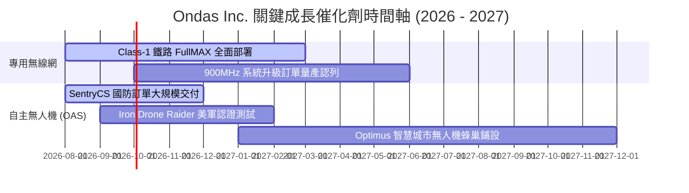

---

### 9.2 TAM 市場規模分析

```
╔══════════════════════════════════════════════════════════════════╗
║                   Ondas 目標可尋址市場 (TAM)                     ║
╠══════════════════════════════════════════════════════════════════╣
║                                                                  ║
║  全球 C-UAS 反無人機防衛市場 TAM:   $12.5B (2028E)               ║
║  ▓▓▓▓▓▓▓▓▓▓▓▓▓▓▓▓▓▓▓▓▓▓▓▓ (Ondas 當前滲透率 < 1.0%)              ║
║                                                                  ║
║  北美關鍵基礎設施私有無線網 TAM:    $4.8B (2027E)                ║
║  ▓▓▓▓▓▓▓▓▓▓▓▓ (Ondas 鐵路領域具高先發優勢)                        ║
║                                                                  ║
║  自主智慧城市與工業無人機數據 TAM:  $8.2B (2030E)                ║
║  ▓▓▓▓▓▓▓▓▓▓▓▓▓▓▓▓                                                ║
╚══════════════════════════════════════════════════════════════════╝
```

---

### 9.3 成長驅動力結構圖

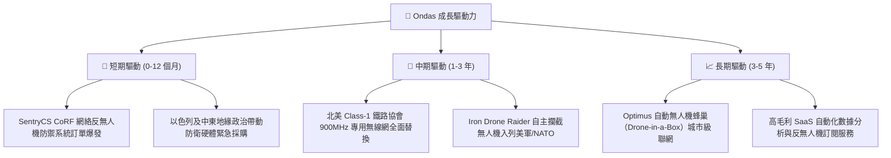

---

## 10. 風險矩陣

### 10.1 風險評分矩陣

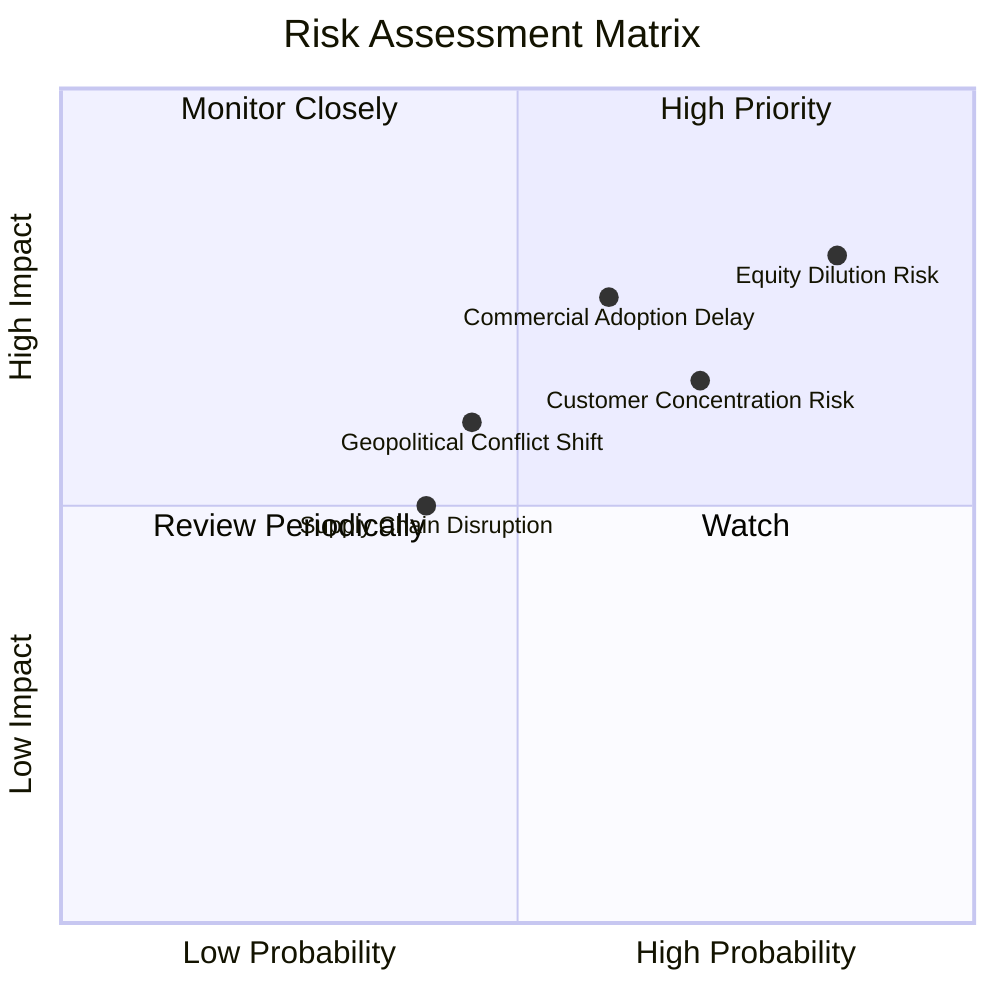

---

### 10.2 風險清單詳細分析

| # | 風險項目 | 發生機率 | 財務衝擊 | 風險評分 | 緩解措施與機構觀察 |
|---|----------|----------|----------|----------|--------------------|
| 1 | 🔴 **股權持續稀釋 (SBC & 增資)** | 高 (85%) | 高 (-20% EPS) | 🔴 **8.2/10** | 公司手握 $1.47B 現金後短期無再融資壓力，需關注 SBC 是否設限。 |
| 2 | 🔴 **鐵路與國防客戶採購延遲** | 中 (60%) | 高 (-30% 營收) | 🔴 **7.2/10** | 國防採購具預算週期性，透過與 Tier-1 系統集成商合作降低單一項目風險。 |
| 3 | 🟡 **客戶集中度過高** | 高 (70%) | 中 (-15% 營收) | 🟡 **6.5/10** | 前三大國防與鐵路客戶貢獻超 60% 營收，積極拓寬歐洲與中東市場。 |
| 4 | 🟡 **地緣政治風險 (以色列研發基地)**| 中 (45%) | 中 (-10% 產能) | 🟡 **5.5/10** | OAS 部分設施位於以色列，公司正將部分製造移至美國本土以符 NDAA。 |

---

## 11. 投資建議

### 11.1 最終綜合評級雷達圖

```
╔══════════════════════════════════════════════════════════════╗
║               Ondas Inc. (ONDS) 綜合評價雷達                 ║
╠══════════════════════════════════════════════════════════════╣
║ 成長動能 (Growth)      9.5/10 ▓▓▓▓▓▓▓▓▓▓▓▓▓▓▓▓▓▓▓░ 🟢 超強 ║
║ 財務安全 (Solvency)    9.0/10 ▓▓▓▓▓▓▓▓▓▓▓▓▓▓▓▓▓▓░░ 🟢 極佳 ║
║ 技術護城河 (Moat)      6.5/10 ▓▓▓▓▓▓▓▓▓▓▓▓▓░░░░░░░ 🟡 中強 ║
║ 估值吸引力 (Valuation) 5.0/10 ▓▓▓▓▓▓▓▓▓▓░░░░░░░░░░ 🟡 中等 ║
║ 獲利品質 (Earnings Q)  4.0/10 ▓▓▓▓▓▓▓▓░░░░░░░░░░░░ 🔴 偏弱 ║
╠══════════════════════════════════════════════════════════════╣
║ 總體投資評級：🟢 買入 (Buy) ｜ 適合高風險偏好之成長型資金    ║
╚══════════════════════════════════════════════════════════════╝
```

---

### 11.2 目標價與隱含報酬率

| 情境 | 目標價 | 隱含報酬率 (相對 $9.11) | 機率權重 | 核心觸發條件 |
|------|--------|--------------------------|----------|--------------|
| 🔴 **悲觀情境** | **$5.20** | -42.9% | 25% | 營收放量停滯，SBC 繼續稀釋股本。 |
| 🟡 **基準情境** | **$11.02** | **+21.0%** | **50%** | **OAS 訂單穩定交付，毛利率保持 48%+，GAAP 虧損大幅收窄。** |
| 🟢 **樂觀情境** | **$18.50** | **+103.1%** | 25% | 美軍大額 C-UAS 訂單落地，Class-1 鐵路全面換裝。 |

---

### 11.3 買入時機與觸發因素

```
╔══════════════════════════════════════════════════════════════════╗
║                  ✅ 買入觸發因素 Checklist                      ║
╠══════════════════════════════════════════════════════════════════╣
║  立即買入觸發條件（當前符合 2/3）：                              ║
║  ✅ 股價回檔至建議買入區間 ($7.00 – $8.80)                        ║
║  ✅ 單季營收保持 YoY > 100% 高速成長 (Q126 +1079.9% 符合)        ║
║  ☐ 單季 GAAP 營業利益率收窄至 -20% 以內 (目前 -85.1% 尚未達標)  ║
║                                                                  ║
║  加碼觸發條件：                                                  ║
║  ☐ 宣佈獲得單筆金額 > $50M 之美國國防部正式採購合約              ║
║  ☐ FCF 單季轉正或 SBC 佔營收比重降至 15% 以下                    ║
║                                                                  ║
║  減碼/停損觸發條件：                                             ║
║  ☐ 季度營收 QoQ 出現連續兩季負成長                               ║
║  ☐ 手頭現金消耗速率過快（單季 OCF 虧損 > $100M）                ║
╚══════════════════════════════════════════════════════════════════╝
```

---

### 11.4 投資人適配度分析

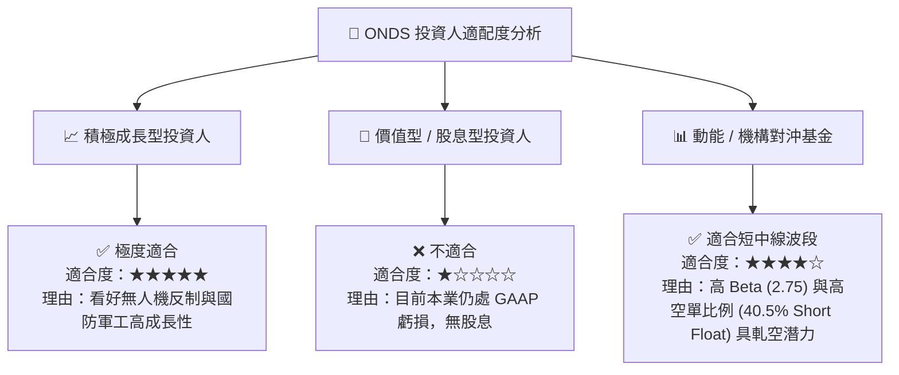

---

### 11.5 每季財報監控清單（Quarterly Watch List）

| 關鍵指標 | 當前基準值 (Q1 2026) | 正常目標區間 | 觸發加碼門檻 | 觸發減碼/警示門檻 |
|----------|----------------------|--------------|--------------|-------------------|
| **單季營收 ($M)** | **$50.12M** | $45M - $60M | > $65.0M | < $35.0M |
| **GAAP 毛利率 (%)** | **49.2%** | 45.0% - 52.0% | > 55.0% | < 38.0% |
| **GAAP 營業利益 ($M)**| **-$42.67M** | -$30M 至 -$15M | > -$10.0M | < -$55.0M |
| **SBC / 營收比重** | **39.2%** | 15.0% - 25.0% | < 15.0% | > 45.0% |
| **總現金及短投 ($B)** | **$1.47B** | $1.2B - $1.5B | $1.4B+ (維持性) | < $1.0B (燃燒過快) |

---

### 11.6 反面論證：什麼會證明論點錯誤（What Would Change My Mind）

```
╔══════════════════════════════════════════════════════════════════╗
║              ⚠️ 論點失效條件（Disconfirming Evidence）           ║
╠══════════════════════════════════════════════════════════════════╣
║  本買入評級在下列情況發生時應立即調降評級或停損出場：            ║
║  ☐ FY2026 全年營收低於 $150M（代表 Q1 爆發僅為一次性單點）       ║
║  ☐ GAAP 營業利益率在 FY2027 結束前無法收窄至 -15% 以內          ║
║  ☐ 稀釋後總股數持續膨脹超越 700M 股 (SBC失控)                    ║
║  ☐ 主要反無人機產品 SentryCS/Iron Drone 失去 NDAA/美軍合規認證    ║
║  ☐ ROIC 持續低於 -20% 且手頭現金因低效併購大幅耗損              ║
╚══════════════════════════════════════════════════════════════════╝
```

---

> **免責聲明**：本報告由 AI 分析師建立，內容基於歷史公開財務數據進行建模與推導，僅供學術研究與投資參考，不構成任何具體投資買賣建議。投資美股具有高度風險，投資人應自行評估並承擔交易風險。