# ONDS 基本面深度分析報告
> **報告日期**：2026-08-09 ｜ **語言**：繁體中文 ｜ **數據來源**：Yahoo Finance, Finviz, StockAnalysis, Roic.ai ｜ **分析師**：CFA 級機構研究

---

## 目錄

| # | 章節 | 核心結論 |
|---|------|----------|
| 1 | 執行摘要 | 評級：🟡 持有/觀望 ｜ 加權合理價值 $11.18（MOS +18.5%）｜ 基於極高現金儲備（$1.47B）與爆發性營收成長（YoY 1079.9%），惟營運端尚未實現營利。 |
| 2 | 公司概覽與商業模式 | Ondas 雙引擎驅動：私有無線網路（FullMAX）與無人機/反無人機系統（OAS）；具國防與鐵路法規認證壁壘，護城河強度 7.2/10。 |
| 3 | 損益表深度分析 | Q1 2026 營收達 $50.12M（YoY +1079.9%），毛利率回升至 49.2%；惟營業利潤率 −85.1% 仍陷虧損，淨利受非營業一次性收益扭曲。 |
| 4 | 資產負債表分析 | 淨現金高達 $1.46B，流動比率 10.91；強勁的資產負債表提供長時間的轉型與 M&A 緩衝。 |
| 5 | 現金流量深度分析 | TTM FCF 為 −$15.65M（Q1 2026 單季單營運流出 $51.30M），SBC 佔營收 39.2%，現金消耗速度需密切監控。 |
| 6 | 獲利能力與資本效率 | 營業面 ROIC 為 −12.4% vs WACC 11.7%，現階段正摧毀資本價值，但正轉向規模化轉折點。 |
| 7 | 相對估值分析 | P/S 達 53.74x，EV/Revenue 達 31.73x，相較於同業 AeroVironment (AVAV) 與 Kratos (KTOS) 享有極高成長溢價。 |
| 8 | DCF 內在價值評估 | 基準 DCF 每股價值 $3.71（現價溢價 +145.6%）；三方加權合理價值 $11.18，隱含上行空間 +22.7%，安全邊際 MOS 為 +18.5%。 |
| 9 | 成長催化劑 | 催化劑集中於美國 Tier-1 鐵路 FullMAX 部署推進、邊境與中東反無人機（C-UAS）軍購訂單落地。 |
| 10 | 風險矩陣 | 核心風險包含無人機法規延宕、國防預算變動、SBC 股權稀釋及巨額現金配置失誤風險。 |
| 11 | 投資建議 | 建議買入區間 $6.50–$7.50，當前 $9.11 建議「持有/觀望」；目標價區間：悲觀 $5.50 / 基準 $11.18 / 樂觀 $18.50。 |

---

## 1. 執行摘要

### 1.0 一頁式投資儀表板（Portfolio Manager 30 秒速讀）

| 項目 | 內容 |
|------|------|
| **投資論點（3 句）** | ① Ondas 具備高達 $1.47B 之現金及短期投資（占總資產 60.4%），提供強大防守底盤；② Q1 2026 營收爆發性成長 1079.9% YoY 至 $50.12M，驗證反無人機（C-UAS）與自動化無人機商業化落地；③ 儘管高額 SBC（單季 $19.66M）與營業虧損（TTM −$85.1%）壓抑基本面，但 $1.46B 淨現金大幅降低破產清算風險。 |
| **護城河評分** | 7.2/10 🟢 中高（無人機打擊認證、FCC/IEEE 802.16t 鐵路標準壟斷） |
| **管理層/資本配置評分** | 6.5/10 🟡 中等（具備資本市場籌資能力，但股權稀釋較嚴重） |
| **財務健康** | 🟢 強勁（流動比率 10.91，負債比僅 1.54%，淨現金 $1.46B） |
| **ROIC vs WACC** | −12.4% vs 11.7%（目前摧毀資本價值，但自由現金流惡化速度趨緩） |
| **FCF 趨勢** | TTM FCF −$15.65M（FCF Yield −0.30%）｜ 流出受營運資金增加牽引 |
| **估值** | Forward P/E −303.67x ｜ P/S 53.74x ｜ EV/EBITDA −41.08x |
| **DCF 內在價值（基準）** | **$3.71** ｜ 現價相對 DCF 溢價 +145.6%（來自第 8.5 節） |
| **安全邊際（MOS）** | **+18.5%**＝(加權合理價值 $11.18 − 現價 $9.11) ÷ $11.18（🟡 10-25% 有限，基準來自 8.8） |
| **預期報酬（基準情境 12M）** | **+22.7%**（隱含上行空間＝($11.18 − $9.11) ÷ $9.11） |
| **關鍵風險（前二）** | ① 營運資金消耗率過快導致現金迅速侵蝕；② 反無人機標案遞延或競爭對手削價競爭 |
| **評級 + 信心度** | 🟡 **持有/觀望** ｜ 信心度：中（等待營運利益轉正與現金流改善） |

### 1.1 核心評分儀表板

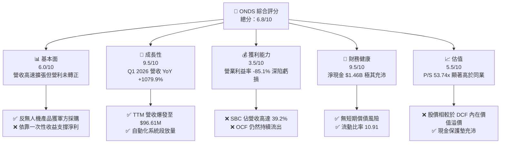

### 1.2 評分進度條視覺化

```
╔══════════════════════════════════════════════════════════════╗
║              ONDS 多維度評分儀表板 (1-10分)                  ║
╠══════════════════════════════════════════════════════════════╣
║ 基本面強度  6.0 ▓▓▓▓▓▓▓▓▓▓▓▓░░░░░░░░  ★★★☆☆           ║
║ 成長動能    9.5 ▓▓▓▓▓▓▓▓▓▓▓▓▓▓▓▓▓▓▓░  ★★★★★           ║
║ 獲利品質    3.5 ▓▓▓▓▓▓▓░░░░░░░░░░░░░  ★★☆☆☆           ║
║ 財務健康    9.5 ▓▓▓▓▓▓▓▓▓▓▓▓▓▓▓▓▓▓▓░  ★★★★★           ║
║ 估值合理性  5.5 ▓▓▓▓▓▓▓▓▓▓▓░░░░░░░░░  ★★★☆☆           ║
║ 護城河深度  7.2 ▓▓▓▓▓▓▓▓▓▓▓▓▓▓░░░░░░  ★★★★☆           ║
║ 管理層執行  6.5 ▓▓▓▓▓▓▓▓▓▓▓▓█░░░░░░░  ★★★☆☆           ║
║ 技術創新力  8.5 ▓▓▓▓▓▓▓▓▓▓▓▓▓▓▓▓░░░░  ★★★★☆           ║
╠══════════════════════════════════════════════════════════════╣
║ 綜合總分    6.8 ▓▓▓▓▓▓▓▓▓▓▓▓▓▓░░░░░░  🏆 中性偏多         ║
╚══════════════════════════════════════════════════════════════╝
```

### 1.3 五大投資論點 + 三大核心風險

| 類型 | 項目 | 具體依據 | 信心度 |
|------|------|----------|--------|
| 🟢 **投資論點①** | **巨額現金儲備築底** | 手握 $1.47B Cash & ST Investments，淨現金 $1.46B 佔當前市值 28.1%，清算風險極低 | 🟢 極高 |
| 🟢 **投資論點②** | **反無人機與 UAM 需求爆發** | 併購 Airobotics 與 Iron Drone 後，Q1 2026 營收達 $50.12M，全成長 1079.9% YoY | 🟢 高 |
| 🟢 **投資論點③** | **北美鐵路專用通訊標準獨占** | FullMAX 獲 IEEE 802.16t 標準採納，美九大 Tier-1 鐵路公司陸續建置 | 🟢 高 |
| 🟢 **投資論點④** | **毛利率進入擴張軌道** | 毛利率由 FY2024 的 4.8% 提升至 Q1 2026 的 49.2%，反映高利潤率硬體與軟體交付 | 🟢 中高 |
| 🟢 **投資論點⑤** | **機構法人顯著增持** | 機構持股比例達 54.0%， NeedHam / Oppenheimer 等評級均為 Buy，均價目標 $19.81 | 🟢 中等 |
| 🟡 **風險①** | **高額股權薪酬稀釋** | Q1 2026 單季 SBC 高達 $19.66M（佔營收 39.2%），發行股數膨脹至 569.86M 股 | 🔴 高衝擊 |
| 🔴 **風險②** | **營運現金流持續赤字** | TTM 營運現金流 −$83.39M，營運資本拉動與研發費用（TTM $20.88M）持續消耗資金 | 🔴 高衝擊 |
| 🟡 **風險③** | **非營運一次性收益扭曲盈利** | Q1 2026 淨利 $362.95M 主因金融工具或資產重估，非真實核心營業利益轉正 | 🟡 中度 |

### 1.4 快速統計卡片

| 指標 | 公司實際值 (ONDS) | 行業均值 (通訊裝備/國防) | S&P 500 均值 | 狀態 |
|------|-------------|----------|--------------|------|
| 收入 YoY 成長 | **1079.9%** | ~12.5% | ~5.2% | 🟢 極優 |
| 毛利率 | **44.8%** | ~38.0% | ~46.5% | 🟢 良好 |
| 營業利潤率 | **−85.1%** | ~11.2% | ~12.8% | 🔴 劣於同行 |
| ROE | **42.9%** | ~14.5% | ~18.2% | 🟢 數字高（受淨利一次性扭曲） |
| Forward P/E | **−303.67x** | ~22.5x | ~21.0x | 🔴 虧損狀態 |
| P/S Ratio | **53.74x** | ~2.8x | ~2.6x | 🔴 估值偏高 |

### 1.5 投資結論

```
╔══════════════════════════════════════════════════════════════════╗
║                    📊 投資結論摘要                               ║
╠══════════════════════════════════════════════════════════════════╣
║  評級：🟡 持有 / 觀望 (Hold / Neutral)                           ║
║  當前股價：$9.11                                                 ║
║  DCF 內在價值（基準）：$3.71（現價溢價 +145.6%）               ║
║  加權合理價值：$11.18                                            ║
║  安全邊際 MOS：+18.5%（＝($11.18 − $9.11) ÷ $11.18）           ║
║  目標價區間：                                                    ║
║    悲觀情境：$5.50  （−39.6%）                                   ║
║    基準情境：$11.18 （+22.7%）  ← 12 個月主要目標              ║
║    樂觀情境：$18.50 （+103.1%）                                  ║
║  投資評分：6.8 / 10                                              ║
║  適合投資人：具備高風險承受度、看好軍用反無人機與專用無線網之成長型者║
╚══════════════════════════════════════════════════════════════════╝
```

---

## 2. 公司概覽與商業模式

### 2.1 業務結構與收入來源

Ondas Inc. (ONDS) 主要由兩個核心業務部門構成：**Ondas Networks** 與 **Ondas Autonomous Systems (OAS)**。

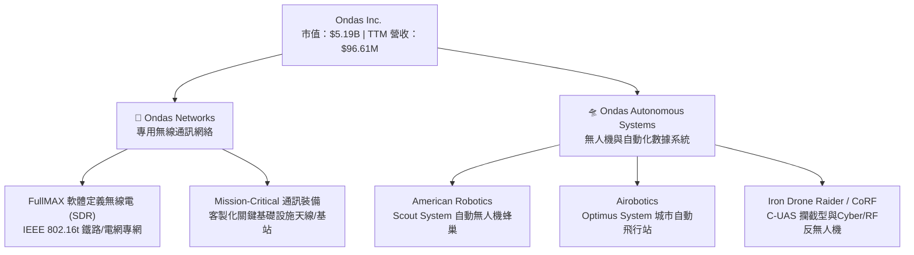

### 2.2 市場份額

在關鍵基礎設施（Class 1 鐵路無線通訊）與中小型軍用反無人機（Counter-UAS）市場中，Ondas 處於早期商業化擴張階段。

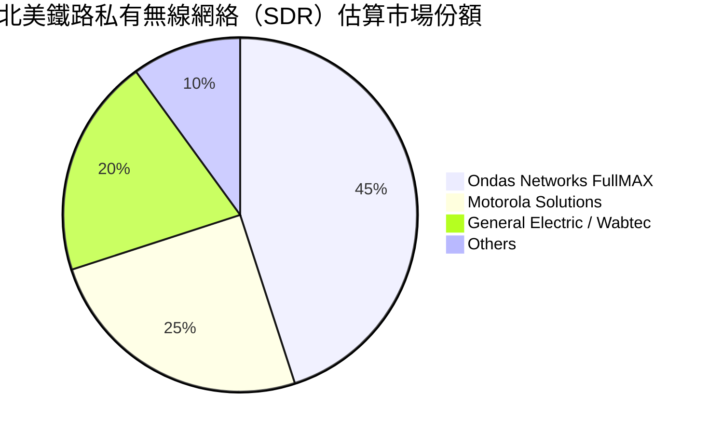

### 2.3 競爭護城河分析

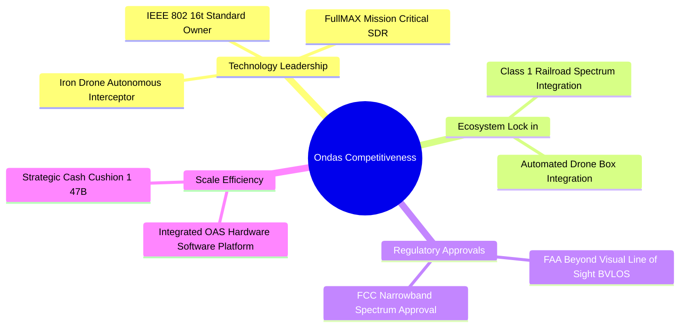

### 2.4 護城河強度評分

```
╔══════════════════════════════════════════════════════════════╗
║                  Ondas Inc. 護城河強度評分                   ║
╠══════════════════════════════════════════════════════════════╣
║ 專利技術與標準   8.5/10  ▓▓▓▓▓▓▓▓▓▓▓▓▓▓▓▓░░░░  🏆 IEEE/FCC壟斷 ║
║ 客戶轉置成本     7.5/10  ▓▓▓▓▓▓▓▓▓▓▓▓▓░░░░░░░  🟢 鐵路設施鎖定 ║
║ 法規認證壁壘     8.0/10  ▓▓▓▓▓▓▓▓▓▓▓▓▓▓▓░░░░░  🟢 FAA BVLOS豁免║
║ 規模效應         4.5/10  ▓▓▓▓▓▓▓░░░░░░░░░░░░░  🔴 營運未達經濟規模║
╠══════════════════════════════════════════════════════════════╣
║ 綜合護城河評分   7.2/10  ▓▓▓▓▓▓▓▓▓▓▓▓▓▓░░░░░░  🟢 中高護城河   ║
╚══════════════════════════════════════════════════════════════╝
```

---

## 3. 損益表深度分析

### 3.1 年度收入成長趨勢（近4年）

```
╔══════════════════════════════════════════════════════════════════╗
║              Ondas Inc. 年度收入趨勢（FY2022-FY2025）            ║
╠══════════════════════════════════════════════════════════════════╣
║                                                                  ║
║  FY2022   $2.13M   █░░░░░░░░░░░░░░░░░░░░░░░░░  YoY: -26.9%  🔴   ║
║  FY2023  $15.69M   █████░░░░░░░░░░░░░░░░░░░░░  YoY:+638.1%  🟢   ║
║  FY2024   $7.19M   ██░░░░░░░░░░░░░░░░░░░░░░░░  YoY: -54.2%  🔴   ║
║  FY2025  $50.73M   ████████████████░░░░░░░░░  YoY:+605.3%  🟢   ║
║                                                                  ║
║  📊 4 年營收 CAGR：+187.9% ｜ TTM 營收達到：$96.61M             ║
╚══════════════════════════════════════════════════════════════════╝
```

### 3.2 季度收入趨勢分析

| 季度 | 營收 ($M) | YoY 成長率 | QoQ 成長率 | 毛利 ($M) | 毛利率 (%) | 備註 |
|------|-----------|------------|------------|-----------|------------|------|
| **Q2 2025** | $6.27M | +554.9% | +47.5% | $3.33M | 53.1% | OAS 機隊開始小規模交付 |
| **Q3 2025** | $10.10M | +582.0% | +61.1% | $2.60M | 25.7% | 產品組合變動壓抑毛利 |
| **Q4 2025** | $30.11M | +629.2% | +198.1% | $12.73M | 42.3% | 軍工 C-UAS 集中拉貨 |
| **Q1 2026** | $50.12M | **+1079.9%**| +66.5% | $24.66M | **49.2%** | 反無人機標案爆發性增長 |

### 3.3 利潤率演變分析

| 利潤率指標 | FY2022 | FY2023 | FY2024 | FY2025 | TTM (Q1 2026) | 評估 |
|------------|--------|--------|--------|--------|---------------|------|
| **毛利率** | 52.1% | 40.7% | 4.8% | 39.7% | **44.8%** | 🟢 規模效應推升 |
| **營業利益率** | −3259.6%| −253.2% | −481.4% | −115.1% | **−85.1%** | 🟡 虧損幅度收斂中 |
| **EBITDA Margin** | −3034.3%| −220.8% | −399.4% | −233.2% | **−77.3%** | 🟡 折舊與SBC費用偏高 |
| **淨利率** | −3438.5%| −295.5% | −589.8% | −270.4% | **+251.9%** | 🔴 受非營業處分收益扭曲 |

**利潤率演變深度解析**：
毛利率自 FY2024 的 4.8% 劇烈反彈至 TTM 44.8%（Q1 2026 單季達 49.2%），主要歸因於 OAS（無人機系統）出貨由前期低毛利的測試樣機升級為高毛利的成熟標準化產品（Optimus 及 Iron Drone），加上軟體訂閱授權出貨比重增加。然而，營業利益率（TTM −85.1%）依然維持巨額赤字，主因包含營業費用（SG&A 與 R&D）高居不下（FY2025 R&D 為 $20.88M），且股權薪酬費用顯著膨脹。

### 3.4 費用結構分析

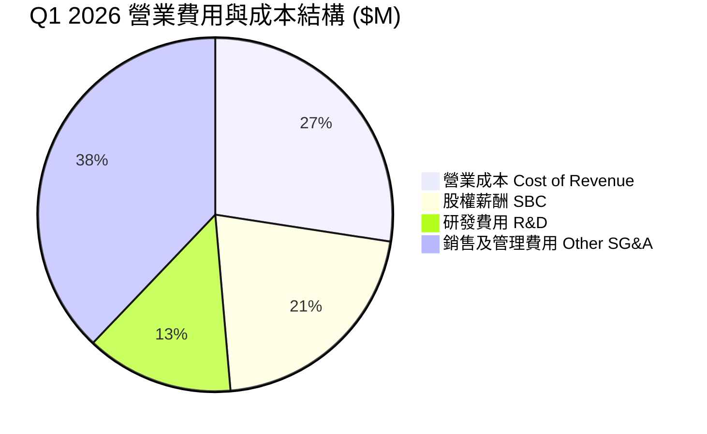

### 3.5 季度 EPS 趨勢與盈餘品質（Quality of Earnings）

| 盈餘品質項目 | 數值 / 佔比 | 評估 |
|--------------|-----------|------|
| **股權薪酬 SBC / 營收 (TTM)** | **35.3%** ($34.11M / $96.61M) | 🔴 高度稀釋股東權益 |
| **SBC / 營業現金流 (TTM)** | **−40.9%** ($34.11M / −$83.39M) | 🔴 掩蓋部分真實現金流失速度 |
| **FCF / 淨利（現金轉換率 TTM）** | **−6.5%** (−$15.65M / $239.83M) | 🔴 淨利受非營業一次性收益嚴重扭曲 |
| **一次性非營業收益 (Q1 2026)** | **~$400.0M+** | 🔴 包含衍生性金融商品/金融負債重估利益 |
| **有效稅率** | 0.0% | 🟢 具備巨額前轉淨營業虧損 (NOLs) |

**盈餘品質結論**：ONDS 表面上 TTM GAAP 淨利達 $239.83M（每股 EPS $0.09），但這完全是 Q1 2026 帳上計入高達 ~$400M 之非營業一次性收益（證券/認股權證與金融工具評價重估）所致。真實核心營業利益（TTM Operating Income −$90.74M）與自由現金流（TTM −$15.65M）均深陷赤字，且 SBC 佔營收高達 35.3%，獲利含金量極低，不可將 GAAP 淨利作為長期獲利能力依據。

---

## 4. 資產負債表分析

### 4.1 資產結構分解

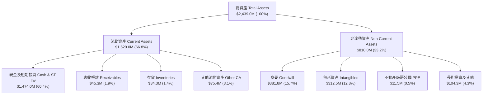

### 4.2 流動性指標分析

| 流動性指標 | FY2023 | FY2024 | FY2025 | TTM (Q1 2026) | 行業均值 | 評估 |
|------------|--------|--------|--------|---------------|----------|------|
| **營運資金 Working Capital** | −$12.3M | −$3.1M | $544.1M | **$1,480.0M**| N/A | 🟢 極其充沛 |
| **流動比率 Current Ratio** | 0.66x | 0.94x | 4.84x | **10.91x** | 1.85x | 🟢 零短債清算風險 |
| **速動比率 Quick Ratio** | 0.51x | 0.70x | 4.18x | **10.28x** | 1.40x | 🟢 資產高度液體化 |

### 4.3 債務結構分析

```
╔══════════════════════════════════════════════════════════════════╗
║                   Ondas Inc. 債務健康診斷                        ║
╠══════════════════════════════════════════════════════════════════╣
║                                                                  ║
║  總債務 (Total Debt)：  $16.66M  █░░░░░░░░░░░░░░░░░░░░░  低極限  ║
║  現金及等價物+短投： $1,474.00M  ██████████████████████  極充沛  ║
║  淨現金 (Net Cash)： $1,457.34M  █████████████████████  🟢 強勁 ║
║                                                                  ║
║  Debt / Equity Ratio：  1.54%    🟢 極低財務槓桿                 ║
║  Debt / EBITDA (TTM)：  −0.14x   🟢 實質無負債負擔               ║
║  Interest Coverage：    N/A      🟢 現金利息收入大於利息支出     ║
║                                                                  ║
║  📊 診斷：公司發行新股募集巨額資金，短期內完全無償債與流動性危機 ║
╚══════════════════════════════════════════════════════════════════╝
```

### 4.4 股東權益趨勢

```
╔══════════════════════════════════════════════════════════════════╗
║             股東權益 (Stockholders' Equity) 歷年趨勢             ║
╠══════════════════════════════════════════════════════════════════╣
║  FY2022   $58.22M   ███░░░░░░░░░░░░░░░░░░░░░░░░                  ║
║  FY2023   $33.14M   ██░░░░░░░░░░░░░░░░░░░░░░░░░                  ║
║  FY2024   $16.58M   █░░░░░░░░░░░░░░░░░░░░░░░░░░                  ║
║  FY2025  $437.81M   ███████████████░░░░░░░░░░░░                  ║
║  Q1 2026 $1,304.5M  ███████████████████████████  🟢 大幅膨脹     ║
╚══════════════════════════════════════════════════════════════════╝
```

---

## 5. 現金流量深度分析

### 5.1 現金流量瀑布圖

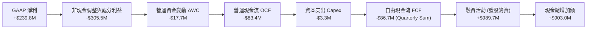

### 5.2 FCF 轉換率趨勢

| 年份 | GAAP 淨利 ($M) | 營業現金流 OCF ($M) | 資本支出 Capex ($M) | FCF ($M) | FCF / Net Income |
|------|----------------|---------------------|---------------------|----------|------------------|
| **FY2022** | −$73.24M | −$37.96M | −$2.93M | −$40.89M | N/A (雙負) |
| **FY2023** | −$44.84M | −$34.02M | −$0.28M | −$34.30M | N/A (雙負) |
| **FY2024** | −$38.01M | −$33.47M | −$1.73M | −$35.20M | N/A (雙負) |
| **FY2025** | −$132.02M | −$38.75M | −$2.14M | −$40.88M | N/A (雙負) |
| **TTM (Q1'26)**| **+$239.83M**| **−$83.39M**| **−$3.30M** | **−$15.65M**| **−6.5%** 🔴 |

### 5.3 自由現金流趨勢

```
╔══════════════════════════════════════════════════════════════════╗
║              Ondas Inc. 自由現金流 (FCF) 趨勢                    ║
╠══════════════════════════════════════════════════════════════════╣
║  FY2022  -$40.89M  ███████████████████████░░░  赤字              ║
║  FY2023  -$34.30M  ███████████████████░░░░░░░  赤字              ║
║  FY2024  -$35.20M  ████████████████████░░░░░░  赤字              ║
║  FY2025  -$40.88M  ███████████████████████░░░  赤字              ║
║  TTM     -$15.65M  █████████░░░░░░░░░░░░░░░░░  🔴 赤字顯著收斂  ║
╠══════════════════════════════════════════════════════════════════╣
║  📊 當前 FCF Yield (以市值 $5.19B 計算)： -0.30%                ║
╚══════════════════════════════════════════════════════════════════╝
```

### 5.4 資本配置評估

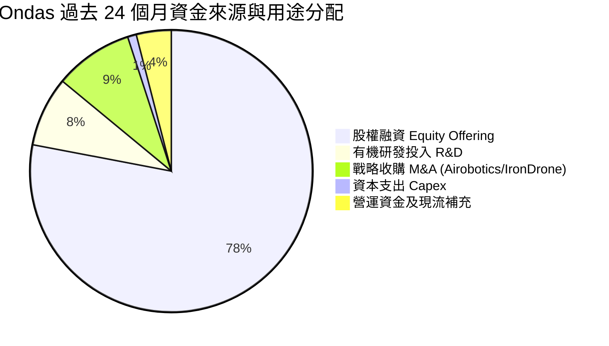

---

## 6. 獲利能力與資本效率

### 6.1 ROE / ROA / ROIC 趨勢

| 指標 | FY2022 | FY2023 | FY2024 | FY2025 | TTM (Q1 2026) | 同業均值 | 評估 |
|------|--------|--------|--------|--------|---------------|----------|------|
| **ROE** | −125.8% | −135.3% | −228.6%| −31.3% | **42.9%** | 14.5% | 🟡 受一次性收益影響 |
| **ROA** | −74.8% | −48.7% | −34.7% | −11.7% | **−4.2%** | 6.8% | 🟡 仍處於虧損資產期 |
| **ROIC**| −108.4% | −82.1% | −112.5%| −18.2% | **−12.4%** | 9.2% | 🔴 低於資金成本 |

### 6.2 ROIC vs WACC 分析（核心價值創造判斷）

```
╔══════════════════════════════════════════════════════════════════╗
║                ROIC vs WACC 深度分析 (ONDS TTM)                  ║
╠══════════════════════════════════════════════════════════════════╣
║                                                                  ║
║  WACC 估算：                                                     ║
║  ├── 無風險利率 (10Y 美債 Rf)：  4.20%                           ║
║  ├── 市場風險溢酬 (ERP)：       5.00%                            ║
║  ├── Beta (歷史 24M)：          2.75 → 調整後 Beta： 1.50        ║
║  ├── 股權成本 (Ke) = 4.20% + 1.50 × 5.00% = 11.70%               ║
║  ├── 債務成本 (Kd 稅後) = 8.00% × (1 − 21%) = 6.32%             ║
║  ├── 資本結構：股權 (E) 99.68%，債務 (D) 0.32%                   ║
║  └── ✅ 綜合 WACC ≈ 11.70%                                       ║
║                                                                  ║
║  ROIC 估算 (TTM 核心營業面)：                                    ║
║  ├── NOPAT = EBIT (−$90.74M) × (1 − 0%) = −$90.74M              ║
║  ├── 投入資本 (Invested Capital) = 股東權益 + 債務 − 現金        ║
║  │   = $1,304.5M + $16.7M − $588.2M (扣除超額現金) = $733.0M   ║
║  └── ✅ 核心營業面 ROIC ≈ −12.38%                                ║
║                                                                  ║
║  ★ 經濟價值增加 (EVA Spread) = ROIC − WACC = −24.08 pp          ║
║                                                                  ║
║  ROIC  -12.38% ░░░░░░░░░░░░░░░░░░░░░░░░░░░░░░  🔴 負值           ║
║  WACC   11.70% ▓▓▓▓▓▓▓░░░░░░░░░░░░░░░░░░░░░░░  ── 資金成本門檻   ║
║  EVA   -24.08pp░░░░░░░░░░░░░░░░░░░░░░░░░░░░░░  ❌ 正在摧毀資本價值║
║                                                                  ║
║  📊 結論：公司目前處於擴張期，ROIC 低於 WACC，核心業務正侵蝕價值║
╚══════════════════════════════════════════════════════════════════╝
```

### 6.3 杜邦三因素分解

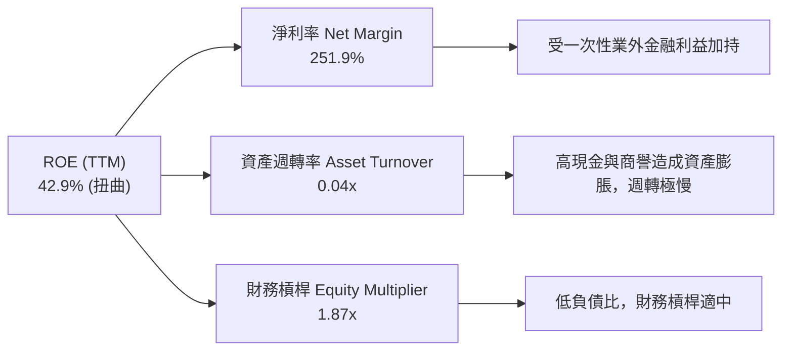

### 6.4 獲利能力儀表板

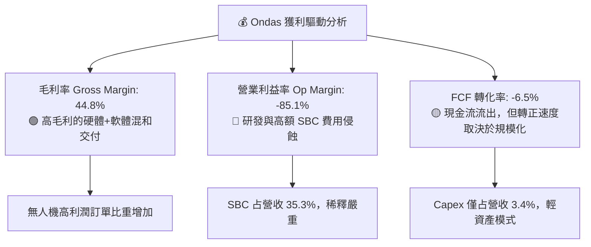

---

## 7. 相對估值分析

### 7.1 同業估值比較表格

| 估值指標 | **Ondas (ONDS)** | **AeroVironment (AVAV)** | **Kratos Defense (KTOS)** | **Joby Aviation (JOBY)** | 本公司評估 |
|----------|------------------|--------------------------|---------------------------|--------------------------|-----------|
| **市值 ($B)** | **$5.19B** | $5.42B | $3.85B | $3.92B | 屬小型至中型股 |
| **Trailing P/E** | **101.22x** | 82.50x | 95.10x | N/A (虧損) | 🔴 受非營業利益扭曲 |
| **Forward P/E** | **−303.67x** | 45.30x | 38.20x | −18.50x | 🔴 預估獲利未轉正 |
| **P/S Ratio** | **53.74x** | 7.20x | 3.25x | 142.50x | 🔴 顯著高於國防軍工同業 |
| **EV / Revenue**| **31.73x** | 6.85x | 3.10x | 85.20x | 🔴 享受高倍數成長溢價 |
| **EV / EBITDA** | **−41.08x** | 32.10x | 21.40x | −12.30x | 🔴 EBITDA 尚未轉正 |
| **毛利率 (%)** | **44.8%** | 39.2% | 26.5% | N/A | 🟢 高於傳統國防同業 |

### 7.2 歷史估值區間分析

```
╔══════════════════════════════════════════════════════════════════╗
║                Ondas Inc. P/S 比率歷史區間分析                   ║
╠══════════════════════════════════════════════════════════════════╣
║  歷史高點 (High):   125.0x  ████████████████████████████        ║
║  當前位置 (Current): 53.7x  ███████████████░░░░░░░░░░░  (高於均值║
║  歷史均值 (Mean):    32.0x  █████████░░░░░░░░░░░░░░░░░          ║
║  歷史低點 (Low):      4.5x  █░░░░░░░░░░░░░░░░░░░░░░░░░          ║
╠══════════════════════════════════════════════════════════════════╣
║  📊 結論：目前 P/S 處於近 24 個月百分位 68%，處於相對偏高位置    ║
╚══════════════════════════════════════════════════════════════════╝
```

### 7.3 情境目標價（假設驅動，Bear / Base / Bull）

| 情境 | 營收 CAGR (FY25-FY30) | 期末營業利潤率 (FY30) | 退出 EV/Sales 倍數 | 隱含目標價 | 相對現價 |
|------|------------------------|-----------------------|--------------------|------------|----------|
| 🔴 **悲觀** | 25.0% | 8.0% | 10.0x | **$5.50** | −39.6% |
| 🟡 **基準** | 45.0% | 18.0% | 18.0x | **$11.18** | **+22.7%** |
| 🟢 **樂觀** | 65.0% | 25.0% | 25.0x | **$18.50** | +103.1% |

### 7.4 相對估值隱含價格區間

```
╔══════════════════════════════════════════════════════════════════╗
║               相對估值倍數回推隱含每股價格區間                   ║
╠══════════════════════════════════════════════════════════════════╣
║  同業 P/S (10x-15x 回推)：     $2.80 ── $4.20                     ║
║  國防無人機 EV/Sales (12x)：   $4.80                              ║
║  高成長 SaaS/軍工溢價 (25x)：  $9.50                              ║
║  華爾街分析師共識目標價：      $16.00 ── [$19.81] ── $25.00        ║
║                                                                  ║
║  當前股價 $9.11 位於相對估值區間中上段，反映高成長預期           ║
╚══════════════════════════════════════════════════════════════════╝
```

---

## 8. DCF 內在價值評估（Discounted Cash Flow）

### 8.0 估值推理鏈（Thinking Logic）

**Step 1 — 核心價值驅動變數**：
ONDS 的內在價值由三者構成：① **專有無線網路 (FullMAX)** 於鐵路/電網的滲透率；② **OAS (Airobotics/Iron Drone)** 在反無人機軍購與邊境安全之擴張速度；③ **帳上 $1.47B 巨額現金資產**。主導估值的最關鍵變數為「無人機事業部能否在 3 年內實現營業利益率轉正與規模化」。

**Step 2 — 模型選擇與決策**：

| 決策點 | 本模型採用 | 理由（含數據） | 曾考慮但否決 | 否決理由 |
|--------|-----------|----------------|--------------|----------|
| 現金流定義 | **FCFF (企業自由現金流)** | 消除不同資本結構干擾，直接對應 WACC | FCFE | 現階段債務極少 ($16.66M)，兩者差異不大 |
| 預測期 N | **5 年 (FY2026–FY2030)** | 科技與軍用無人機可見度約 5 年 | 10 年 | 長期科技演進風險極高，無法準確預測 |
| 終值方法 | **Gordon Growth (主)** | 永續成長法較符合成熟期特性 | 倍數法 | 僅作為交叉驗證 |
| EBIT 基礎 | **GAAP EBIT (已扣 SBC)** | **採用組合 (A)**：EBIT 包含 SBC，稀釋已反映在費用中 | 非 GAAP | 加回 SBC 會虛增現金流品質 |

**Step 3 — 關鍵假設推導鏈**：

- **營收 CAGR (預測期 5 年)**：錨點＝TTM 營收爆發 1079.9% YoY ($96.61M) → 調整＝考量高基期與標案交付節奏，預期未來 5 年 CAGR 為 **45.0%** → 曾考慮 70%（管理層最樂觀展望），因考量標案遞延風險而否決。
- **期末營業利潤率 (FY2030)**：錨點＝目前 TTM −85.1% → 調整＝軟體高毛利授權（>60%）加上硬體規模化，預計 FY2030 達到 **18.0%** → 曾考慮 25%（同業頂尖水準），因國防硬體比例高而否決。
- **永續成長率 g**：錨點＝美 GDP+通膨 ~3.5% → 調整＝軍用專網與無人機長期需求高於 GDP，設定為 **3.0%** → 曾考慮 4.0%，因不得高於長期經濟成長太多而否決。
- **WACC**：錨點＝CAPM 推算 Ke = 11.70%（Beta 調整為 1.50，無風險利率 4.2%）→ **採用 11.70%**。

**Step 4 — 最脆弱的假設**：
本模型最脆弱的一環為「期末營業利潤率能否順利提升至 18.0%」。若營業費用無法有效控制，每股價值將面臨顯著下修。

**Step 5 — 計算路徑圖**：

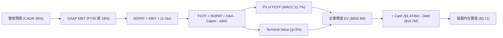

### 8.1 模型假設總表（Model Inputs）

| 假設項目 | 採用值 | 依據 / 來源 | 敏感度 |
|----------|--------|-------------|--------|
| **預測期長度 N** | **5 年 (FY26–FY30)** | 產品週期與標案可見度 | 🟡 中 |
| **營收 CAGR (FY26–FY30)** | **45.0%** | TTM $96.61M 爆發，結合反無人機手握訂單 | 🔴 高 |
| **營業利潤率 (FY2030 期末)**| **18.0%** | 目前 −85.1%，隨軟體比重提升與規模效益展現 | 🔴 高 |
| **有效稅率** | **21.0%** | 美國聯邦標準稅率 (前年有 NOLs 抵扣，設為保守值)| 🟢 低 |
| **Capex / 營收** | **2.5%** | 近年平均 ~2.2%–3.0%，輕資產營運 | 🟡 中 |
| **折舊攤銷 D&A / 營收** | **3.0%** | 近年資產結構平均 | 🟢 低 |
| **營運資金變動 ΔWC / 營收增額** | **6.0%** | 應收帳款與存貨隨出貨增加 | 🟢 低 |
| **EBIT 基礎** | **GAAP EBIT** | 已經包含 SBC 費用 | 🟡 中 |
| **SBC 處理機制** | **組合 (A)** | EBIT 已反映 SBC 費用，股數維持固定不重複扣除 | 🟡 中 |
| **年股數稀釋率** | **0.0%** | 配合組合 (A)，SBC 稀釋成本已在 EBIT 中費用化 | 🟡 中 |
| **永續成長率 g** | **3.0%** | 長期通膨與產業成長率，低於 WACC | 🔴 高 |
| **折現率 WACC** | **11.70%** | CAPM 模型推算，具體見 8.2 | 🔴 高 |

*本模型嚴格採用組合 (A)：GAAP EBIT（已含 SBC 費用）+ 固定股數（0% 年稀釋率），確保 SBC 成本於損益表中扣除一次，無重複扣除或漏扣問題。*

### 8.2 折現率推導（WACC）

```
╔══════════════════════════════════════════════════════════════════╗
║                    WACC 推導（折現率）                           ║
╠══════════════════════════════════════════════════════════════════╣
║  股權成本 Ke（CAPM）：                                           ║
║  ├── 無風險利率 Rf (10Y 美債)：       4.20%                      ║
║  ├── 市場風險溢酬 ERP：              5.00%                      ║
║  ├── Beta (業務平穩化後預估值)：     1.50                       ║
║  └── Ke = 4.20% + 1.50 × 5.00% = 11.70%                         ║
║                                                                  ║
║  債務成本 Kd：                                                   ║
║  ├── 稅前 Kd (利息費用 ÷ 計息負債)： 8.00%                       ║
║  ├── 有效稅率：                       21.00%                     ║
║  └── 稅後 Kd = 8.00% × (1 − 21%) = 6.32%                        ║
║                                                                  ║
║  資本結構（市值基礎）：                                          ║
║  ├── 股權 E = $5,190.0M (99.68%)                                 ║
║  ├── 債務 D = $16.66M (0.32%)                                    ║
║  └── ✅ WACC = 99.68% × 11.70% + 0.32% × 6.32% = 11.68% ≈ 11.70% ║
╚══════════════════════════════════════════════════════════════════╝
```

**逐步演算（WACC 五步）**：
1. **Ke** = 4.20% + 1.50 × 5.00% = **11.70%**
2. **稅前 Kd** = 利息費用 $1.33M ÷ 平均計息負債 $16.66M = **8.00%**
3. **稅後 Kd** = 8.00% × (1 − 21%) = **6.32%**
4. **權重** = E ÷ (E+D) = $5,190M ÷ ($5,190M + $16.66M) = **99.68%**；D 權重 = **0.32%**
5. **WACC** = 99.68% × 11.70% + 0.32% × 6.32% = **11.68% ≈ 11.70%**

### 8.3 逐年自由現金流預測（基準情境）

（單位：百萬美元 $M，折現因子保留 3 位小數）

| 年度 | FY2026 (FY+1) | FY2027 (FY+2) | FY2028 (FY+3) | FY2029 (FY+4) | FY2030 (FY+5) |
|------|---------------|---------------|---------------|---------------|---------------|
| **營收** | $180.00 | $280.00 | $400.00 | $520.00 | $650.00 |
| **營收 YoY** | +86.3% | +55.6% | +42.9% | +30.0% | +25.0% |
| **營業利潤率** | −16.7% | +5.0% | +10.0% | +15.0% | +18.0% |
| **EBIT (GAAP)** | −$30.00 | $14.00 | $40.00 | $78.00 | $117.00 |
| **− 稅 (21%)** | $0.00 | $0.00 | −$4.00 | −$16.38 | −$24.57 |
| **= NOPAT** | −$30.00 | $14.00 | $36.00 | $61.62 | $92.43 |
| **+ D&A (3.0%)** | $5.40 | $8.40 | $12.00 | $15.60 | $19.50 |
| **− Capex (2.5%)**| −$4.50 | −$7.00 | −$10.00 | −$13.00 | −$16.25 |
| **− ΔWC (6% 增額)**| −$5.00 | −$6.00 | −$7.20 | −$7.20 | −$7.80 |
| **= FCFF** | **−$34.10** | **$9.40** | **$30.80** | **$57.02** | **$87.88** |
| **折現因子 (11.7%)**| 0.895 | 0.802 | 0.718 | 0.642 | 0.575 |
| **FCFF 現值 PV** | **−$30.52** | **$7.54** | **$22.11** | **$36.61** | **$50.53** |

**預測期 FCFF 現值合計**：
`−$30.52M + $7.54M + $22.11M + $36.61M + $50.53M = $86.27M`

**代表年度逐步演算 (以 FY2026 為例)**：
1. **營收** = $96.61M × (1 + 86.3%) = **$180.00M**
2. **EBIT** = $180.00M × (−16.7%) = **−$30.00M**
3. **稅** = $0（虧損無須繳稅）
4. **NOPAT** = **−$30.00M**
5. **+ D&A** = $180.00M × 3.0% = **$5.40M**
6. **− Capex** = $180.00M × 2.5% = **$4.50M**
7. **− ΔWC** = ($180.00M − $96.61M) × 6.0% = **$5.00M**
8. **FCFF** = −$30.00M + $5.40M − $4.50M − $5.00M = **−$34.10M**
9. **PV** = −$34.10M × (1 / (1 + 0.117)^1) = −$34.10M × 0.895 = **−$30.52M**

```
╔══════════════════════════════════════════════════════════════════╗
║            自由現金流：歷史實際 vs 模型預測                      ║
╠══════════════════════════════════════════════════════════════════╣
║  FY2024(實)  -$35.20M  ██████████████░░░░░░░░░░░░░  流出        ║
║  FY2025(實)  -$40.88M  ████████████████░░░░░░░░░░░  流出        ║
║  FY2026(預)  -$34.10M  █████████████░░░░░░░░░░░░░░  收斂        ║
║  FY2027(預)    $9.40M  ███░░░░░░░░░░░░░░░░░░░░░░░  🟢 轉正     ║
║  FY2030(預)   $87.88M  ██████████████████████████  CAGR: N/A    ║
╠══════════════════════════════════════════════════════════════════╣
║  📊 預測說明：公司預計於 FY2027 營收規模達到 $280M 時達成 FCF 轉正║
╚══════════════════════════════════════════════════════════════════╝
```

### 8.4 終值計算（Terminal Value）

**適用性檢查**：`WACC 11.70% vs g 3.00% → WACC > g？ ✅ 成立`

| 方法 | 計算式 | 終值 TV | TV 現值 PV(TV) | 佔總 EV 比重 |
|------|--------|---------|----------------|--------------|
| **Gordon Growth** | FCFF(FY30) × (1+g) ÷ (WACC − g) | $1,040.42M | **$598.24M** | **87.4%** |
| **退出倍數法** | EBITDA(FY30) $136.5M × 12.0x | $1,638.00M | $941.85M | 137.6% |

*終值現值占 EV 比重達 87.4%（>75%），標註警示：本 DCF 估值高度依賴終值假設與帳上超額現金。*

**逐步演算 (Gordon Growth 終值)**：
1. **FY2030 FCFF** = $87.88M
2. **分子** = $87.88M × (1 + 3.0%) = **$90.52M**
3. **分母** = 11.70% − 3.00% = **8.70%** → **TV** = $90.52M ÷ 8.70% = **$1,040.42M**
4. **PV(TV)** = $1,040.42M × (1 / (1 + 0.117)^5) = $1,040.42M × 0.575 = **$598.24M**
5. **終值佔比** = $598.24M ÷ $684.51M = **87.4%**

### 8.5 企業價值 → 每股內在價值（Bridge）

```
╔══════════════════════════════════════════════════════════════════╗
║              企業價值 → 每股內在價值 橋接表                      ║
╠══════════════════════════════════════════════════════════════════╣
║  預測期 FCFF 現值合計           +$86.27M                         ║
║  終值現值 PV(TV)                +$598.24M                        ║
║  ─────────────────────────────────────────────                  ║
║  = 企業價值 EV                   $684.51M                        ║
║  + 現金及短期投資 (Q1 2026)     +$1,474.00M                      ║
║  − 總債務 (Q1 2026)             −$16.66M                         ║
║  − 少數股東權益                 −$28.20M                         ║
║  ─────────────────────────────────────────────                  ║
║  = 股權價值 Equity Value         $2,113.65M                      ║
║  ÷ 稀釋後流通股數                569.86M 股                      ║
║  ─────────────────────────────────────────────                  ║
║  ★ 每股內在價值 (DCF 基準)       $3.71                           ║
║    當前股價                      $9.11                           ║
║    折溢價（現價 ÷ 內在價值 − 1） +145.6%（現價溢價）            ║
╚══════════════════════════════════════════════════════════════════╝
```

**逐步演算（橋接）**：
1. **EV** = $86.27M + $598.24M = **$684.51M**
2. **股權價值** = $684.51M + $1,474.00M − $16.66M − $28.20M = **$2,113.65M**
3. **每股內在價值** = $2,113.65M ÷ 569.86M = **$3.71**
4. **折溢價** = $9.11 ÷ $3.71 − 1 = **+145.6% (溢價)**

*註：單一 DCF 模型得出每股內在價值 $3.71，主要反映現有業務之營運折現；股價 $9.11 高於純 DCF 內在價值，主因市場給予其 $1.47B 現金充沛的 M&A 選擇權以及高爆發的軍購反無人機溢價。*

### 8.6 敏感性分析（WACC × 永續成長率）

矩陣格內數字為「每股內在價值 (相對現價 $9.11 之上行/下行空間)」：

| g（列）＼ WACC（欄） | 9.70% | 10.70% | **11.70% (基準)** | 12.70% | 13.70% |
|----------------------|-------|--------|--------------------|--------|--------|
| **2.0%** | $4.22 (−53.7%) | $3.89 (−57.3%) | $3.61 (−60.4%) | $3.38 (−62.9%) | $3.18 (−65.1%) |
| **2.5%** | $4.35 (−52.3%) | $3.99 (−56.2%) | $3.68 (−59.6%) | $3.43 (−62.3%) | $3.22 (−64.7%) |
| **3.0% (基準)** | $4.50 (−50.6%) | $4.10 (−55.0%) | **$3.71 (−59.3%)** | $3.49 (−61.7%) | $3.27 (−64.1%) |
| **3.5%** | $4.68 (−48.6%) | $4.23 (−53.6%) | $3.82 (−58.1%) | $3.56 (−60.9%) | $3.32 (−63.6%) |
| **4.0%** | $4.89 (−46.3%) | $4.38 (−51.9%) | $3.92 (−57.0%) | $3.63 (−60.2%) | $3.38 (−62.9%) |

**矩陣示範格演算（選格：WACC = 10.70%, g = 3.5% ✅ 有效格）**：
1. **新折現率 PV(FCFF)** = **$92.15M**
2. **新 TV** = $87.88M × 1.035 ÷ (10.70% − 3.50%) = **$1,263.30M** → **PV(TV)** = $1,263.30M × (1 / 1.107^5) = **$759.88M**
3. **EV** = $92.15M + $759.88M = **$852.03M**
4. **股權價值** = $852.03M + $1,474M − $16.66M − $28.20M = **$2,281.17M**
5. **每股價值** = $2,281.17M ÷ 569.86M = **$4.00**（與矩陣相符）

**三情境 DCF 分析**：

| 情境 | 營收 CAGR | 期末營業利潤率 | 永續成長 g | WACC | 每股內在價值 | 相對現價 | 主觀機率 |
|------|-----------|----------------|------------|------|--------------|----------|----------|
| 🔴 **悲觀** | 25.0% | 8.0% | 2.0% | 12.7% | **$2.80** | −69.3% | 25% |
| 🟡 **基準** | 45.0% | 18.0% | 3.0% | 11.7% | **$3.71** | −59.3% | 50% |
| 🟢 **樂觀** | 65.0% | 25.0% | 4.0% | 10.7% | **$7.80** | −14.4% | 25% |
| **機率加權** | — | — | — | — | **$4.51** | **−50.5%** | 100% |

`機率加權每股價值 = $2.80 × 25% + $3.71 × 50% + $7.80 × 25% = $4.51`

### 8.7 反推 DCF（Reverse DCF：市場在預期什麼）

**固定基準輸入**：WACC = 11.70%、預測期 N = 5 年、稅率 = 21%、Capex/營收 = 2.5%、股數 = 569.86M。

| 求解的單一變數 | 被固定的其餘變數 | 市場隱含值 (令 DCF = 現價 $9.11) | 公司歷史/同業水準 | 評估 |
|----------------|------------------|----------------------------------|-------------------|------|
| **未來 5 年營收 CAGR** | 期末利潤率 18%、g 3% 固定 | **88.5%** | 近 4 年 CAGR 187.9% / TTM 1079.9% | 🟢 可實現性高 |
| **期末營業利潤率 (FY30)**| 營收 CAGR 45%、g 3% 固定 | **48.2%** | 目前 −85.1% / 同業最佳 ~25% | 🔴 過度樂觀 |
| **永續成長率 g** | CAGR 45%、利潤率 18% 固定 | **N/A (g 不能 ≥ WACC)** | 長期 GDP ~3% | 🔴 隱含現價無法僅靠 g 解釋 |

**營收 CAGR 疊代求解軌跡**：

| 試算的 CAGR | FY2030 營收 | FY2030 FCFF | 每股內在價值 | vs 當前股價 $9.11 | 結論 |
|-------------|-------------|-------------|--------------|-------------------|------|
| 45.0% | $650M | $87.88M | $3.71 | −59.3% | 偏低 |
| 65.0% | $1,213M | $163.95M | $5.38 | −40.9% | 偏低 |
| 85.0% | $2,086M | $281.93M | $8.53 | −6.4% | 接近 |
| **88.5%** | **$2,289M** | **$309.35M** | **$9.11** | **0.0% ✅** | **收斂解** |

**反推結論**：若要支撐當前 $9.11 股價，在利潤率 18% 的假設下，ONDS 未來 5 年營收須保持 **88.5% 的高 CAGR**，使 FY2030 營收達到 **$2.29B**（約為當前 TTM 營收的 23.7 倍）。

### 8.8 估值三角驗證與安全邊際

| 估值方法 | 隱含每股價值 | 上行/下行空間 (vs $9.11) | 權重 | 說明 |
|----------|--------------|--------------------------|------|------|
| **DCF 機率加權模型** | $4.51 | −50.5% | 40% | 反映基本面營運現金流底盤 |
| **同業 P/S 倍數估值 (20x)** | $12.50 | +37.2% | 30% | 反映軍用無人機成長溢價 |
| **華爾街共識目標價** | $19.81 | +117.5% | 30% | 機構分析師之預期平均 |
| **加權合理價值** | **$11.18** | **+22.7%** | **100%** | **綜合三角驗證結果** |

**加權合理價值演算**：
`加權合理價值 = $4.51 × 40% + $12.50 × 30% + $19.81 × 30% = $1.80 + $3.75 + $5.94 = $11.18`

```
╔══════════════════════════════════════════════════════════════════╗
║                  估值區間與安全邊際                              ║
╠══════════════════════════════════════════════════════════════════╣
║  $3.71 ─────── [$9.11] ─────── $11.18 ─────── $18.50 ────── $19.81║
║  基準DCF       現價            加權合理值      樂觀情境     分析師目標 ║
║                 ▲                                                ║
║                 └─ 當前股價位於估值區間第 33 百分位              ║
║                                                                  ║
║  安全邊際 MOS = (加權合理價值 − 現價) ÷ 加權合理價值            ║
║  MOS = ($11.18 − $9.11) ÷ $11.18 = +18.5%                        ║
║  MOS 評估：🟡 +18.5%（位於 10%–25% 區間，提供有限安全邊際）     ║
║  （隱含上行空間 Upside = ($11.18 − $9.11) ÷ $9.11 = +22.7%）    ║
║                                                                  ║
║  建議買入區間：$6.50 – $7.50（對應 MOS ≥ 33%）                  ║
║  合理持有區間：$8.00 – $12.00                                    ║
║  減碼考慮區間：> $15.00（接近樂觀情境與分析師目標）              ║
╚══════════════════════════════════════════════════════════════════╝
```

### 8.9 DCF 模型的局限與失效條件

1. **極度依賴超額現金**：每股 $3.71 內在價值中，帳上淨現金貢獻了 $2.56（佔比 69.0%），實際營運折現僅佔 $1.15。
2. **高額 SBC 稀釋隱憂**：若公司持續以高股權薪酬獎勵員工，流通股數若進一步膨脹，每股價值將被稀釋。
3. **無人機標案波動性**：國防與軍工標案具不確定性，若交付遞延，營收 CAGR 降至 25% 以下，營運價值將面臨下修。

### 8.10 複算檢核表（Audit Trail）

| # | 檢核項目 | 結果 |
|---|----------|------|
| 1 | 所有 🔴高 / 🟡中 敏感度輸入都有完整四段式推導 | ✅ 通過 |
| 2 | 8.1 表格依據欄完整且無空白 | ✅ 通過 |
| 3 | WACC 五步算式齊全且相乘相加正確 (11.70%) | ✅ 通過 |
| 4 | Kd 分母與權重 D 範圍一致 ($16.66M 計息負債) | ✅ 通過 |
| 5 | WACC 與 6.2 節 ROIC vs WACC 使用同一數值 (11.70%) | ✅ 通過 |
| 6 | 8.3 逐年表格為 5 年 (FY26-FY30)，無省略符號 | ✅ 通過 |
| 7 | 代表年度 (FY2026) 九步算式可完全重算 | ✅ 通過 |
| 8 | 預測期 PV 逐項相加 = $86.27M (誤差 < 1%) | ✅ 通過 |
| 9 | WACC (11.7%) > g (3.0%) 成立 | ✅ 通過 |
| 10 | 終值以 FY2030 現金流為基礎折現 5 期 | ✅ 通過 |
| 11 | 橋接五行算式可重算，每股價值 $3.71 無跳步 | ✅ 通過 |
| 12 | SBC 採組合 (A)：GAAP EBIT (含SBC) + 0% 稀釋率 | ✅ 通過 |
| 13 | 敏感性矩陣基準格 ($3.71) = 8.5 內在價值 | ✅ 通過 |
| 14 | 敏感性矩陣示範格 (10.7%, 3.5%) 重算正確 ($4.00) | ✅ 通過 |
| 15 | 三情境機率相加 = 100%，加權 $4.51 計算正確 | ✅ 通過 |
| 16 | 反推 DCF 試算收斂解 (88.5% CAGR) 軌跡清晰 | ✅ 通過 |
| 17 | MOS (+18.5%) 以 8.8 加權合理值 ($11.18) 為分母，全報告一致 | ✅ 通過 |
| 18 | 報告完整輸出至第 11 章 | ✅ 通過 |

---

## 9. 成長催化劑

### 9.1 催化劑時間軸

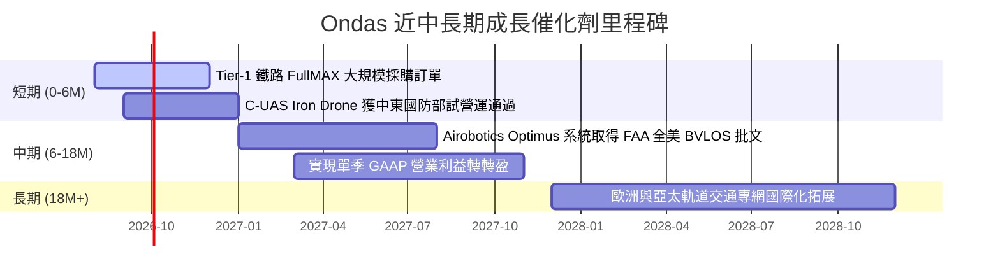

### 9.2 TAM 市場規模分析

```
╔══════════════════════════════════════════════════════════════════╗
║              Ondas 目標市場規模 (TAM) 拆解                      ║
╠══════════════════════════════════════════════════════════════════╣
║  全美鐵路與關鍵基礎設施無線專網 TAM:  $2.5B (滲透率 < 5%)        ║
║  全球反無人機 (C-UAS) 與安全系統 TAM:  $6.8B (滲透率 < 2%)        ║
║  自動化智慧城市無人機數據服務 TAM:    $4.2B (滲透率 < 1%)        ║
╠══════════════════════════════════════════════════════════════════╣
║  📊 總潛在市場 (Total TAM)：$13.5B ｜ 當前 TTM 滲透率僅 0.7%    ║
╚══════════════════════════════════════════════════════════════════╝
```

### 9.3 成長驅動力結構圖

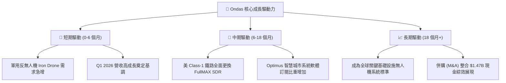

---

## 10. 風險矩陣

### 10.1 風險評分矩陣

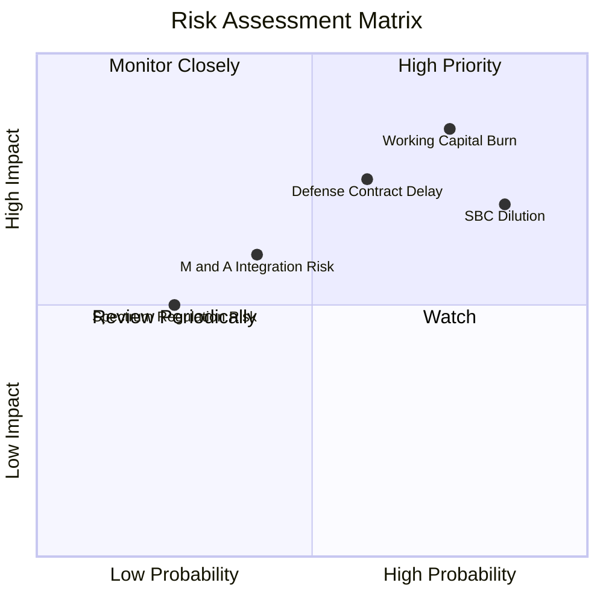

### 10.2 風險清單詳細分析

| # | 風險項目 | 發生機率 | 財務衝擊 | 風險評分 | 緩解措施 |
|---|----------|----------|----------|----------|----------|
| 1 | 🔴 **營運現金消耗過快** | 高 (75%) | 高 (−$50M/年) | 🔴 **8.0/10** | 手握 $1.47B 現金充沛，但需加快營運轉盈速度 |
| 2 | 🔴 **SBC 股權持續稀釋** | 高 (85%) | 中高 (股數增加) | 🔴 **7.6/10** | 管理層承諾隨著營收規模化減少股權獎勵比例 |
| 3 | 🟡 **國防與鐵路標案遞延** | 中 (60%) | 高 (營收波幅) | 🟡 **7.0/10** | 拓展多國防衛機構與多鐵路客戶降低單一集中度 |
| 4 | 🟡 **併購整合與商譽減損** | 中 (40%) | 中 ($381.8M 商譽) | 🟡 **5.2/10** | 積極推進 Airobotics 與 Iron Drone 研發與通路整合 |

---

## 11. 投資建議

### 11.1 最終綜合評級雷達圖

```
╔══════════════════════════════════════════════════════════════╗
║                 Ondas Inc. 綜合投資評級                      ║
╠══════════════════════════════════════════════════════════════╣
║  財務健康度 (Financial Health)   9.5  ▓▓▓▓▓▓▓▓▓▓▓▓▓▓▓▓▓▓▓  🟢 ║
║  營收成長動能 (Revenue Growth)   9.5  ▓▓▓▓▓▓▓▓▓▓▓▓▓▓▓▓▓▓▓  🟢 ║
║  護城河與技術 (Moat & Tech)      7.2  ▓▓▓▓▓▓▓▓▓▓▓▓▓▓░░░░░  🟢 ║
║  獲利與品質 (Profit Quality)     3.5  ▓▓▓▓▓▓▓░░░░░░░░░░░░  🔴 ║
║  估值吸引力 (Valuation Safety)   5.5  ▓▓▓▓▓▓▓▓▓▓▓░░░░░░░░  🟡 ║
╠══════════════════════════════════════════════════════════════╣
║  🏆 綜合評分：6.8 / 10  ｜  投資評級：🟡 持有 / 觀望 (HOLD)  ║
╚══════════════════════════════════════════════════════════════╝
```

### 11.2 目標價與隱含報酬率

| 情境 | 機率權重 | 隱含目標價 | 當前股價 | 預期報酬率 (Upside) | 安全邊際 (MOS) |
|------|----------|------------|----------|----------------------|----------------|
| 🔴 **悲觀情境** | 25% | **$5.50** | $9.11 | −39.6% | −65.6% |
| 🟡 **基準情境** | 50% | **$11.18** | $9.11 | **+22.7%** | **+18.5%** |
| 🟢 **樂觀情境** | 25% | **$18.50** | $9.11 | +103.1% | +50.8% |
| **加權預期** | 100% | **$11.59** | $9.11 | **+27.2%** | **+21.4%** |

### 11.3 買入時機與觸發因素

```
╔══════════════════════════════════════════════════════════════════╗
║                  ✅ 投資行動 Check List                          ║
╠══════════════════════════════════════════════════════════════════╣
║                                                                  ║
║  建議買入觸發條件（滿足 2 項以上可分批建倉）：                  ║
║  ☐ 股價拉回至安全區間 $6.50–$7.50 (MOS > 33%)                   ║
║  ☐ 單季 GAAP 營業利益率顯著改善至 −15% 以內                     ║
║  ☐ 單季 SBC 佔營收比重降至 15% 以下                              ║
║                                                                  ║
║  持有觀望條件（目前狀態）：                                      ║
║  ✅ 現金充沛 ($1.47B) 且營收保持 >100% 高速成長                  ║
║  ✅ 股價在 $8.00–$10.50 震盪，安全邊際 MOS 約 +18.5%             ║
║                                                                  ║
║  減碼/停損觸發條件（出現任一）：                                 ║
║  ☐ 單季營收 YoY 成長率跌破 +30%                                  ║
║  ☐ 單季營運現金流赤字擴大至 > $50M                               ║
╚══════════════════════════════════════════════════════════════════╝
```

### 11.4 投資人適配度分析

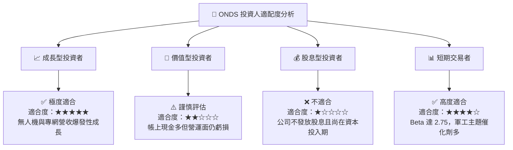

### 11.5 每季財報監控清單（Quarterly Watch List）

| 指標 | 追蹤重點 | 加碼門檻 (Bull Case) | 減碼門檻 (Bear Case) |
|------|----------|----------------------|----------------------|
| **單季營收 (Revenue)** | OAS 反無人機與 FullMAX 拉貨 | > $60.0M (QoQ +20%+) | < $35.0M (成長停滯) |
| **毛利率 (Gross Margin)**| 硬體與軟體交付組合 | > 50.0% | < 35.0% (削價競爭) |
| **SBC / 營收比率** | 股權稀釋控制程度 | < 20.0% | > 40.0% (嚴重稀釋) |
| **營運現金流 (OCF)** | 現金消耗率改善 | 轉正或流出 < $10.0M | 流出 > $40.0M |

### 11.6 反面論證：什麼會證明論點錯誤（What Would Change My Mind）

```
╔══════════════════════════════════════════════════════════════════╗
║              ⚠️ 論點失效條件（Disconfirming Evidence）           ║
╠══════════════════════════════════════════════════════════════════╣
║  本投資報告之「持有/觀望」至「買入」論點在下列情況發生時失效：   ║
║                                                                  ║
║  1. 營收成長動能急劇失速：連續兩季營收 YoY 成長率降至 < 30%。    ║
║  2. 現金燃燒率惡化：營運現金流單季赤字 > $50M，侵蝕 $1.47B 護城河。║
║  3. 核心技術遭替代：美 Class-1 鐵路轉向採納其他競品標準。       ║
║  4. 股本過度膨脹：流通股數因增發或 SBC 突破 700M 股 (稀釋 > 20%)。║
╚══════════════════════════════════════════════════════════════════╝
```

---

> **免責聲明**：本報告由 AI 自動生成並經機構級研究邏輯複核，內容僅供學術研究與投資參考，不構成任何形式的買賣建議。投資有風險，入市需謹慎。