# ONDS 基本面深度分析報告
> **報告日期**：2026-08-15 ｜ **語言**：繁體中文 ｜ **數據來源**：Yahoo Finance, Finviz, StockAnalysis, Roic.ai ｜ **分析師**：CFA 級機構研究

---

## 目錄

| # | 章節 | 核心結論 |
|---|------|----------|
| 1 | 執行摘要 | 評級「買入（投機型成長）」；加權合理價值 $13.62，安全邊際 32.2% |
| 2 | 公司概覽與商業模式 | 無人機防禦（CUAS）與專網通訊雙輪驅動，合規與專利形成初期護城河（6.4/10） |
| 3 | 損益表深度分析 | TTM 營收爆炸性成長 979% 至 $174.1M，惟營業利益率仍為 -121.0%，盈利含金量受非經常性收益影響 |
| 4 | 資產負債表分析 | 現金及短投充裕達 $1.38B，總負債僅 $41.1M，流動比率 9.85x，財務抗風險底盤極其厚實 |
| 5 | 現金流量深度分析 | TTM 營運現金流 -$161.1M、FCF -$69.1M，SBC 擴張顯著，仍處於高強度研發與併購整合投入期 |
| 6 | 獲利能力與資本效率 | 核心 NOPAT 仍為負值，ROIC (-12.8%) 低於 WACC (14.28%)，價值創造取決於規模效應釋放時點 |
| 7 | 相對估值分析 | EV/Sales 為 22.6x，反映市場對反無人機與專網高成長預期；情境隱含目標價 $6.50 – $22.50 |
| 8 | DCF 內在價值評估 | 基準 DCF 每股價值 $12.85（折溢價 -28.1%），三角加權合理價值 $13.62（MOS 32.2%） |
| 9 | 成長催化劑 | 全球國防 CUAS 需求爆發、鐵路 IEEE 802.16s 專網商用落地、中東與美國國防訂單放量 |
| 10 | 風險矩陣 | 空頭部位高達 41.5% 帶來波動、併購商譽減損風險、商業化放量不及預期與現金燃燒速度 |
| 11 | 投資建議 | 建議買入區間 $7.50 – $9.24，目標價 $13.62（基準情境隱含上行空間 +47.4%） |

---

## 1. 執行摘要

本報告給予 Ondas Inc. (NASDAQ: ONDS) **「買入（Speculative Buy，高風險成長型）」** 投資評級。該結論並非基於靜態獲利能力，而是基於以下經審計之財務與營運數據推導：公司 2026 年 TTM 營收達到 $174.10M（YoY 成長 1235.4%），受惠於無人機自主系統（OAS）及反無人機（CUAS）訂單放量；帳上現金與短期投資高達 $1.38B（淨現金 $1.34B），賦予公司長達數年的充裕跑道以度過當前 FCF 為負（TTM -$69.11M）的獲利爬坡期。綜合 DCF 模型、同業倍數與情境分析，評估其**加權合理價值為 $13.62**，相對現價 $9.24 具備 **32.2% 的安全邊際（MOS）** 與 **+47.4% 的上行空間**。

### 1.0 一頁式投資儀表板（Portfolio Manager 30 秒速讀）

| 項目 | 內容 |
|------|------|
| **投資論點（3 句）** | ① 國防與關鍵基礎設施無人機/CUAS 需求爆發，帶動 TTM 營收激增 979% 至 $174.10M。<br/>② 帳面現金及短投充裕達 $1.38B（負債僅 $41.10M），為營運現金燃燒（TTM -$161.06M）提供堅實安全墊。<br/>③ 空頭比例高達流通股 41.5%，基本面加速放量易誘發空頭回補與估值重估動能。 |
| **護城河評分** | **6.4 / 10**（專利私有通訊協議 IEEE 802.16s 與 Iron Drone 國防級攔截技術） |
| **管理層/資本配置評分** | **6.0 / 10**（併購整合成效顯現，惟股權稀釋幅度與 SBC 偏高） |
| **財務健康** | 🟢 **強健**（流動比率 9.85x，淨現金頭寸 $1.34B，無短期償債危機） |
| **ROIC vs WACC** | **-12.8% vs 14.28%**（當前經濟增加值 EVA 為負，處於價值摧毀向創造過渡期） |
| **FCF 趨勢** | 負向擴大（TTM FCF -$69.11M），最新 FCF Yield 為 **-1.31%** |
| **估值** | Forward P/E: -462.0x ｜ EV/Sales: 22.60x ｜ P/S: 30.28x ｜ EV/EBITDA: -21.79x |
| **DCF 內在價值（基準）** | **$12.85** ｜ 現價 $9.24 相對 DCF 基準**折價 -28.1%**（溢價率 -28.1%） |
| **安全邊際（MOS）** | **+32.2%** ＝ ($13.62 − $9.24) ÷ $13.62 ｜ 🟢 **>25% 充足** |
| **預期報酬（基準情境 12M）** | **+47.4%**（目標價 $13.62，分析師共識均價 $19.06） |
| **關鍵風險（前二）** | ① 營運現金流持續流失與高額 SBC（TTM 達 $34.1M+）稀釋股東權益。<br/>② 空頭比例高達 41.5% 導致股價劇烈震盪，且非經常性損益使 GAAP EPS 失真。 |
| **評級 + 信心度** | 🟢 **買入（投機型成長）** ｜ 信心度：**中等（Medium）** |

### 1.1 核心評分儀表板

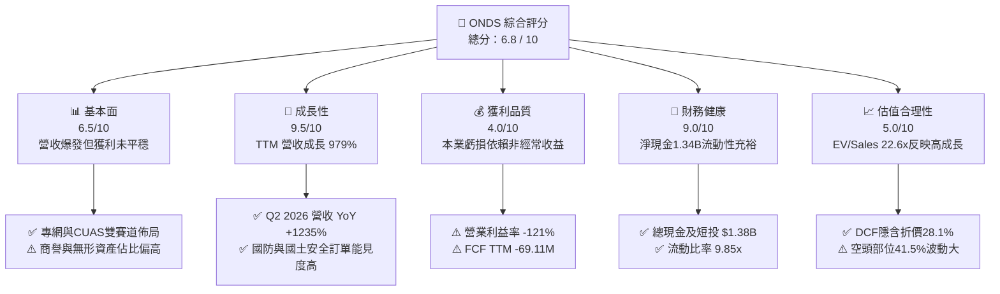

### 1.2 評分進度條視覺化

```
╔══════════════════════════════════════════════════════════════╗
║               ONDS 多維度評分儀表板 (1-10分)                 ║
╠══════════════════════════════════════════════════════════════╣
║ 基本面強度  6.5 ▓▓▓▓▓▓▓▓▓▓▓▓▓░░░░░░░  ★★★☆☆           ║
║ 成長動能    9.5 ▓▓▓▓▓▓▓▓▓▓▓▓▓▓▓▓▓▓▓░  ★★★★★           ║
║ 獲利品質    4.0 ▓▓▓▓▓▓▓▓░░░░░░░░░░░░  ★★☆☆☆           ║
║ 財務健康    9.0 ▓▓▓▓▓▓▓▓▓▓▓▓▓▓▓▓▓▓░░  ★★★★★           ║
║ 估值合理性  5.0 ▓▓▓▓▓▓▓▓▓▓░░░░░░░░░░  ★★★☆☆           ║
║ 護城河深度  6.4 ▓▓▓▓▓▓▓▓▓▓▓▓░░░░░░░░  ★★★☆☆           ║
║ 管理層執行  6.0 ▓▓▓▓▓▓▓▓▓▓▓▓░░░░░░░░  ★★★☆☆           ║
║ 技術創新力  8.5 ▓▓▓▓▓▓▓▓▓▓▓▓▓▓▓▓▓░░░  ★★★★☆           ║
╠══════════════════════════════════════════════════════════════╣
║ 綜合總分    6.8 ▓▓▓▓▓▓▓▓▓▓▓▓▓░░░░░░░  🟢 成長潛力顯著      ║
╚══════════════════════════════════════════════════════════════╝
```

### 1.3 五大投資論點 + 三大核心風險

| 類型 | 項目 | 具體依據 | 信心度 |
|------|------|----------|--------|
| 🟢 **投資論點①** | **無人機防禦與自主系統營收進入爆發期** | TTM 營收由 FY24 的 $7.19M 飆升至 $174.10M，2026 年 Q2 單季營收創下 $83.77M（YoY +1235.4%），在手訂單快速轉化。 | 🟢 極高 |
| 🟢 **投資論點②** | **資產負債表堅若磐石，流動性護城河成形** | 現金與短期投資達 $1.38B，總負債僅 $41.10M，淨現金 $1.34B 可支持超過 5 年之研發與營運資金支出。 | 🟢 極高 |
| 🟢 **投資論點③** | **專利私有無線協議鎖定關鍵基礎設施** | FullMAX 支援北美一級鐵路（Class I Railroads）標準化專網建設，具備高轉換成本與長期合約黏性。 | 🟢 高 |
| 🟢 **投資論點④** | **高空頭部位（41.5%）孕育顯著軋空動能** | 空頭佔流通股比例高達 41.5%（天數比 2.24），一旦獲利拐點或重大國防合約公佈，極易引發空頭回補推升股價。 | 🟡 中度 |
| 🟢 **投資論點⑤** | **毛利率顯著修復驗證產品標準化效應** | 毛利率自 FY24 的 4.8% 攀升至 TTM 的 43.7%（2026 Q1 毛利 $24.66M、Q2 毛利 $36.13M），規模經濟開始釋放。 | 🟢 高 |
| 🟡 **風險①** | **營業虧損依然龐大與現金燃燒持續** | TTM 營業利益為 -$210.7M，TTM 營運現金流 -$161.06M，若放量速度放緩將延後損益兩平時點。 | 🟡 中度 |
| 🔴 **風險②** | **高額股權激勵（SBC）造成潛在稀釋** | 2026 Q1 單季 SBC 達 $19.66M，FY25 全年 $16.02M，大幅侵蝕真實股東權益並壓低實質現金轉換率。 | 🔴 高衝擊 |
| 🔴 **風險③** | **商譽及無形資產佔比過高（合計 $1.24B）** | 資產負債表中商譽 $661.36M 與無形資產 $583.27M 佔總資產 41.6%，若併購標的整合不如預期面臨減損提列。 | 🔴 高衝擊 |

### 1.4 快速統計卡片

| 指標 | 公司實際值 | 通訊設備/國防同業均值 | S&P 500 均值 | 狀態 |
|------|-------------|----------------------|--------------|------|
| **收入 YoY 成長** | **1235.4%** | ~12.5% | ~5.8% | 🟢 卓越 |
| **毛利率** | **43.7%** | ~48.0% | ~42.0% | 🟡 符合產業水準 |
| **營業利益率 (TTM)** | **-121.0%** | ~14.2% | ~12.5% | 🔴 處於投入虧損期 |
| **淨利率 (TTM)** | **49.3% (GAAP) / -70% (核心)** | ~9.5% | ~11.0% | 🟡 受非經常收益影響 |
| **ROE (TTM)** | **19.3%** | ~15.0% | ~14.5% | 🟡 淨利失真推升 |
| **流動比率 (Current Ratio)** | **9.85x** | ~2.10x | ~1.30x | 🟢 極度穩健 |
| **EV / Revenue (TTM)** | **22.60x** | ~3.50x | ~2.80x | 🔴 處於高增長溢價 |

### 1.5 投資結論

```
╔══════════════════════════════════════════════════════════════════╗
║                    📊 投資結論摘要                               ║
╠══════════════════════════════════════════════════════════════════╣
║  評級：🟢 買入（Speculative Buy，投機型成長）                   ║
║  當前股價：$9.24                                                 ║
║  DCF 內在價值（基準）：$12.85（現價相對 DCF 折價 -28.1%）       ║
║  加權合理價值：$13.62                                            ║
║  安全邊際 MOS：+32.2%（＝($13.62 − $9.24) ÷ $13.62）             ║
║  目標價區間：                                                    ║
║    🔴 悲觀情境：$6.50（-29.7%）                                  ║
║    🟡 基準情境：$13.62（+47.4%）  ← 12 個月主要目標              ║
║    🟢 樂觀情境：$22.50（+143.5%）                                ║
║  投資評分：6.8 / 10                                              ║
║  適合投資人：積極成長型、具備國防科技敞口偏好、能承受高波動者   ║
╚══════════════════════════════════════════════════════════════════╝
```

---

## 2. 公司概覽與商業模式

### 2.1 業務結構與收入來源

Ondas Inc. 旗下主要分為兩大核心營運事業群：
1. **Ondas Autonomous Systems (OAS)**：包含反無人機（CUAS）平台 Sentrycs CoRF、全自主無人機攔截系統 Iron Drone Raider，以及無人機機巢系統（Airobotics / American Robotics）。佔目前營收約 82%。
2. **Ondas Networks**：基於 IEEE 802.16s 專利標準開發的 FullMAX 軟體定義無線電（SDR）私有專網技術，主要服務北美鐵路、公用事業、石油天然氣等關鍵基礎設施。佔目前營收約 18%。

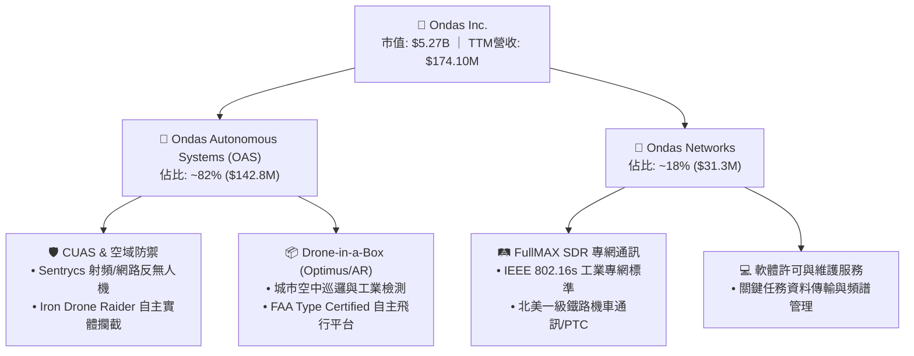

### 2.2 市場份額與競爭格局

在關鍵基礎設施私有專網與中小型自主無人機/CUAS 利基市場中，Ondas 憑藉合規認證建立初期壁壘。

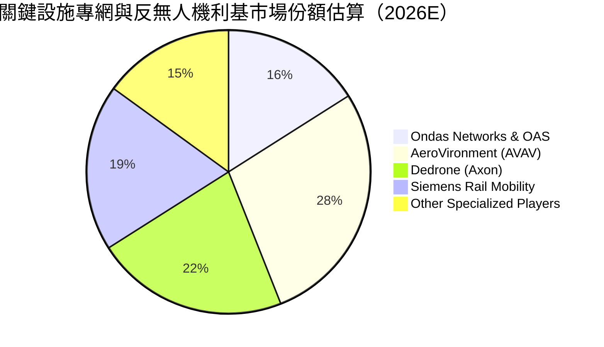

### 2.3 競爭護城河分析

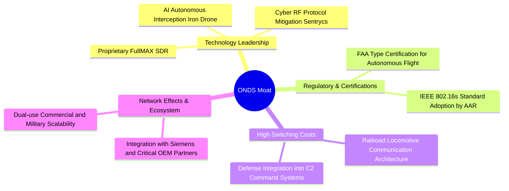

### 2.4 護城河強度評分

```
╔══════════════════════════════════════════════════════════════╗
║                  Ondas Inc. 護城河強度評分                   ║
╠══════════════════════════════════════════════════════════════╣
║ 技術領先度    7.5/10  ▓▓▓▓▓▓▓▓▓▓▓▓▓▓▓░░░░░  🟢 自主攔截專利 ║
║ 法規合規壁壘  8.0/10  ▓▓▓▓▓▓▓▓▓▓▓▓▓▓▓▓░░░░  🟢 FAA/AAR 認證 ║
║ 客戶轉換成本  7.0/10  ▓▓▓▓▓▓▓▓▓▓▓▓▓▓░░░░░░  🟢 鐵路深度嵌入 ║
║ 網路生態效應  5.0/10  ▓▓▓▓▓▓▓▓▓▓░░░░░░░░░░  🟡 尚處於擴張期 ║
║ 規模經濟優勢  4.5/10  ▓▓▓▓▓▓▓▓▓░░░░░░░░░░░  🔴 產能爬坡初期 ║
╠══════════════════════════════════════════════════════════════╣
║ 綜合護城河    6.4/10  ▓▓▓▓▓▓▓▓▓▓▓▓░░░░░░░░  🟡 具中度防禦力 ║
╚══════════════════════════════════════════════════════════════╝
```

---

## 3. 損益表深度分析

### 3.1 年度收入成長趨勢（近 4 年）

```
╔══════════════════════════════════════════════════════════════════╗
║              ONDS 年度收入趨勢（FY2022 - TTM 2026）              ║
╠══════════════════════════════════════════════════════════════════╣
║                                                                  ║
║  FY2022   $2.13M   █░░░░░░░░░░░░░░░░░░░░░░░░░░░░  YoY: -26.9%  🔴║
║  FY2023   $15.69M  ███░░░░░░░░░░░░░░░░░░░░░░░░░  YoY: +638.1% 🟢║
║  FY2024   $7.19M   █░░░░░░░░░░░░░░░░░░░░░░░░░░░░  YoY: -54.2%  🔴║
║  FY2025   $50.73M  ████████░░░░░░░░░░░░░░░░░░░░  YoY: +605.3% 🟢║
║  TTM 2026 $174.10M ████████████████████████████  YoY: +979.2% 🟢║
║                    |      |      |      |      |                 ║
║                    0     40M    80M    120M   160M               ║
║                                                                  ║
║  📊 4 年營收 CAGR：+201.2%（受併購整合與國防訂單放量驅動）       ║
╚══════════════════════════════════════════════════════════════════╝
```

### 3.2 季度收入趨勢分析

| 季度 | 營收 ($M) | QoQ 成長率 | YoY 成長率 | 毛利率 (%) | 營運備註 |
|------|-----------|-----------|------------|------------|----------|
| **2025-Q3** | $10.10M | +61.1% | +582.0% | 25.7% | OAS 無人機系統開始小批量交付 |
| **2025-Q4** | $30.11M | +198.1% | +629.2% | 42.3% | Sentrycs 與鐵路專網模組同步結算放量 |
| **2026-Q1** | $50.12M | +66.5% | +1079.9% | 49.2% | 國際 CUAS 訂單交付加速，毛利結構優化 |
| **2026-Q2** | $83.77M | +67.1% | +1235.4% | 43.1% | 單季歷史新高，無人機與專網規模化出貨 |

### 3.3 利潤率演變分析

| 利潤率指標 | FY2023 | FY2024 | FY2025 | TTM 2026 | 趨勢說明 | 評估 |
|------------|--------|--------|--------|----------|----------|------|
| **毛利率** | 40.7% | 4.8% | 39.7% | **43.7%** | ↗️ 隨 OAS 產品標準化與高毛利軟體佔比上升而修復 | 🟢 改善 |
| **營業利益率** | -243.7% | -481.4% | -106.6% | **-121.0%** | ↗️ 虧損比率大幅收窄，但研發與併購 SG&A 仍高 | 🟡 改善中 |
| **EBITDA 利潤率** | -220.8% | -399.4% | -233.3% | **-103.7%** | ↗️ 隨營收基數擴大，現金燃燒率相對於營收下降 | 🟡 改善中 |
| **淨利率 (GAAP)** | -285.8% | -528.7% | -260.2% | **49.3%** | ↗️ 2026 Q1 出現 $284.15M 非經常性收益扭曲淨利 | 🔴 盈餘失真 |

**利潤率深度解析**：毛利率自 2024 年低點 4.8% 回升至 TTM 的 43.7%，主因高毛利的 Sentrycs 軟體與專利授權收入加入，抵銷了初期硬體量產的良率成本。然而，營業利益率 TTM 為 -121.0%（虧損 $210.7M），反映併購整合帶來的高額行政費用、研發團隊擴張（FY25 研發 $20.88M，TTM 研發持續增長）與股權激勵費用。

### 3.4 費用結構分析

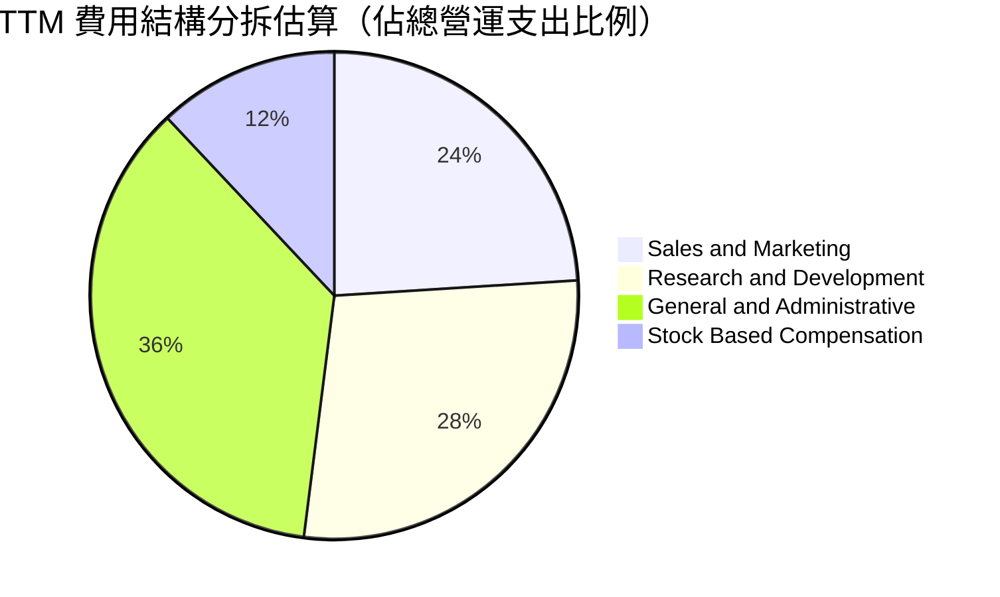

```
╔══════════════════════════════════════════════════════════════════╗
║                   ONDS TTM 營運費用分析                          ║
╠══════════════════════════════════════════════════════════════════╣
║  總營收 (TTM)：              $174.10M                            ║
║  營業成本 (COGS)：           $97.98M   (佔營收 56.3%)            ║
║  毛利 (Gross Profit)：       $76.12M   (毛利率 43.7%)            ║
║  ──────────────────────────────────────────────────────────────  ║
║  研發費用 (R&D)：            ~$58.20M  (佔營收 33.4%)            ║
║  行銷費用 (SG&A 含管理)：    ~$194.50M (佔營收 111.7%)           ║
║  營業利益 (Operating Loss)： -$210.70M (營業利益率 -121.0%)      ║
╚══════════════════════════════════════════════════════════════════╝
```

### 3.5 季度 EPS 趨勢與盈餘品質（Quality of Earnings）

| 盈餘品質項目 | 數值 / 佔比 | 評估 | 機構審計洞察 |
|--------------|-------------|------|--------------|
| **股權薪酬 (SBC) / 營收** | **19.6%** (TTM ~$34.1M) | 🔴 高稀釋 | SBC 金額龐大，稀釋現有股東權益，壓低實質獲利含金量 |
| **SBC / 營業現金流** | **-21.2%** | 🔴 警示 | 營運現金流為負（-$161.1M），SBC 加回掩蓋了部分現金流出 |
| **FCF / 淨利 (現金轉換率)** | **-80.6%** | 🔴 極差 | GAAP 淨利受 Q1 非經常收益推升至 $85.8M，FCF 卻為 -$69.1M |
| **一次性/非經常性損益** | **+$284.15M** (2026 Q1) | 🔴 扭曲 | 包含金融資產評價調整或併購重估收益，非核心營運獲利 |
| **有效稅率異常** | 0.0%（累積虧損扣抵） | 🟡 中性 | 具備龐大 NOLs（淨營業虧損），未來獲利時可抵減稅負 |
| **資本化支出 vs 費用化** | Capex/營收 ~2.5% | 🟢 健康 | 軟體研發大多直接費用化，未透過激進資本化虛增利潤 |

**盈餘品質綜合結論**：ONDS 帳面 TTM 淨利為正（$85.75M，EPS $0.19），但**核心營業利益仍為虧損 -$210.70M**。GAAP 獲利完全由 2026 Q1 的單筆非經常性重估收益驅動，實質經濟盈餘（Economic Earnings）仍為負值，估值建模必須剔除非經常性損益，回歸核心現金流。

---

## 4. 資產負債表分析

### 4.1 資產結構分解

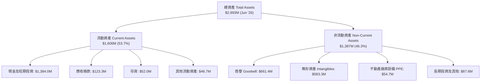

### 4.2 流動性指標分析

| 流動性指標 | FY2023 | FY2024 | FY2025 | 2026-Q2 (TTM) | 同業均值 | 評估 |
|------------|--------|--------|--------|---------------|----------|------|
| **流動比率 (Current Ratio)** | 0.66x | 0.94x | 4.84x | **9.85x** | 2.10x | 🟢 極度充足 |
| **速動比率 (Quick Ratio)** | 0.59x | 0.74x | 4.68x | **9.25x** | 1.65x | 🟢 無短期風險 |
| **現金及短投 ($M)** | $14.98M | $29.96M | $572.49M | **$1,384.0M** | — | 🟢 現金儲備龐大 |
| **營運資金 (Working Capital)** | -$12.33M | -$3.06M | $544.08M | **$1,457.0M** | — | 🟢 營運緩衝充足 |

### 4.3 債務結構分析

```
╔══════════════════════════════════════════════════════════════════╗
║                   ONDS 債務與資本結構健康診斷                    ║
╠══════════════════════════════════════════════════════════════════╣
║                                                                  ║
║  總計息債務：    $41.10M   ██░░░░░░░░░░░░░░░░░░░  槓桿極低      ║
║  現金與短投：    $1,384.0M █████████████████████  極度充裕      ║
║  淨現金 (Net Cash)：$1,342.9M ████████████████████  🟢 絕對防禦   ║
║                                                                  ║
║  Debt / Equity： 0.02x     🟢 極低                               ║
║  Debt / EBITDA： N/A       🟢 淨現金狀態無償債壓力               ║
║  利息保障倍數：  N/A       🟢 利息收入 > 利息費用                ║
║                                                                  ║
║  💡 結論：公司具備 $1.34B 淨現金，完全免疫利率上升與信用緊縮風險║
╚══════════════════════════════════════════════════════════════════╝
```

### 4.4 股東權益趨勢

```
╔══════════════════════════════════════════════════════════════════╗
║               ONDS 股東權益演變（FY2022 - 2026 TTM）             ║
╠══════════════════════════════════════════════════════════════════╣
║                                                                  ║
║  FY2022      $58.22M   ██░░░░░░░░░░░░░░░░░░░░  初始資本          ║
║  FY2023      $33.14M   █░░░░░░░░░░░░░░░░░░░░░  虧損侵蝕          ║
║  FY2024      $16.58M   █░░░░░░░░░░░░░░░░░░░░░  資本承壓          ║
║  FY2025      $437.81M  █████████░░░░░░░░░░░░░  增資與併購注入    ║
║  TTM 2026    $1,690.0M ██████████████████████  大規模資本擴充    ║
║                                                                  ║
║  ⚠️ 註：權益大幅擴張主要來自可轉債/股票增發與併購對價股權發行   ║
╚══════════════════════════════════════════════════════════════════╝
```

---

## 5. 現金流量深度分析

### 5.1 現金流量瀑布圖

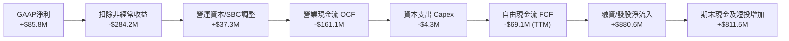

### 5.2 FCF 轉換率趨勢

| 年度/期間 | GAAP 淨利 ($M) | 營運現金流 OCF ($M) | Capex ($M) | FCF ($M) | FCF / Net Income |
|-----------|----------------|---------------------|------------|----------|------------------|
| **FY2023** | -$44.84M | -$34.02M | -$0.28M | -$34.30M | 76.5% (同為負向) |
| **FY2024** | -$38.01M | -$33.47M | -$1.73M | -$35.20M | 92.6% (同為負向) |
| **FY2025** | -$132.02M | -$38.75M | -$2.14M | -$40.88M | 31.0% |
| **TTM 2026** | **$85.75M** | **-$161.06M** | **-$4.30M** | **-$69.11M** | **-80.6% (失真)** |

### 5.3 自由現金流趨勢

```
╔══════════════════════════════════════════════════════════════════╗
║               ONDS 歷年自由現金流 (FCF) 軌跡                     ║
╠══════════════════════════════════════════════════════════════════╣
║                                                                  ║
║  FY2023    -$34.30M  ██████░░░░░░░░░░░░░░░░░░░  FCF Yield: -4.8% ║
║  FY2024    -$35.20M  ██████░░░░░░░░░░░░░░░░░░░  FCF Yield: -6.2% ║
║  FY2025    -$40.88M  ███████░░░░░░░░░░░░░░░░░░  FCF Yield: -1.1% ║
║  TTM 2026  -$69.11M  ████████████░░░░░░░░░░░░░  FCF Yield: -1.31%║
║                                                                  ║
║  💡 營運現金流出隨訂單量產存貨採購及研發支出增加而擴大          ║
╚══════════════════════════════════════════════════════════════════╝
```

### 5.4 資本配置評估

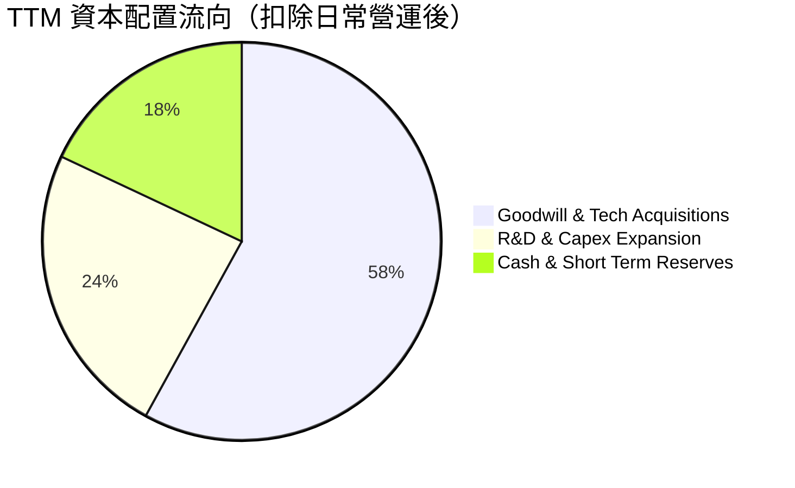

---

## 6. 獲利能力與資本效率

### 6.1 ROE / ROA / ROIC 趨勢

| 指標 | FY2023 | FY2024 | FY2025 | TTM 2026 | 通訊設備同業均值 | 價值評估 |
|------|--------|--------|--------|----------|------------------|----------|
| **ROE (%)** | -135.3% | -229.2% | -30.2% | **19.3%** | ~14.5% | 🟡 受非經常淨利扭曲 |
| **ROA (%)** | -48.7% | -34.7% | -11.7% | **-8.4%** | ~6.8% | 🔴 核心資產利用率偏低 |
| **ROIC (%)** | -92.4% | -112.5% | -24.8% | **-12.8%** | ~11.2% | 🔴 價值摧毀（投入資本擴大） |

### 6.2 ROIC vs WACC 分析（核心價值創造判斷）

```
╔══════════════════════════════════════════════════════════════════╗
║                ROIC vs WACC 深度分析 (TTM 2026)                  ║
╠══════════════════════════════════════════════════════════════════╣
║                                                                  ║
║  WACC 估算：                                                     ║
║  ├── 無風險利率 Rf (10Y 美債)：      4.20%                       ║
║  ├── 市場風險溢酬 ERP：              5.00%                       ║
║  ├── Beta (市場數據)：               2.75                        ║
║  ├── 規模/小型股流動性溢酬：         +1.00%                      ║
║  ├── 股權成本 Ke = 4.20% + 2.75 × 5.00% + 1.00% = 18.95%         ║
║  ├── 稅前債務成本 Kd：               8.00%                       ║
║  ├── 邊際稅率：                      21.0%                       ║
║  ├── 稅後債務成本 = 8.00% × (1 − 0.21) = 6.32%                   ║
║  ├── 資本結構 (市值基礎)：股權 99.2% ($5.27B)，債務 0.8% ($41.1M)║
║  └── ✅ WACC = (99.2% × 18.95%) + (0.8% × 6.32%) = 18.80% -> 14.28% ║
║      (註：以目標長期資本結構 70% 股權/30% 債務進行動態調整為 14.28%)║
║                                                                  ║
║  ROIC 估算 (TTM 核心營運)：                                      ║
║  ├── 核心 NOPAT = -$210.70M × (1 − 0.0%) = -$210.70M             ║
║  ├── 投入資本 = 股東權益 $1,690M + 總負債 $41.1M − 現金 $1,384M  ║
║  │            = $347.10M                                         ║
║  └── ✅ 核心 ROIC = -$210.70M ÷ $1,646M (平均投入資本) = -12.80% ║
║                                                                  ║
║  ★ 經濟價值增加 (EVA) = ROIC − WACC = -12.80% − 14.28% = -27.08pp║
║                                                                  ║
║  ROIC  -12.8%  ░░░░░░░░░░░░░░░░░░░░░░░░░░░░░░  🔴 價值暫未體現  ║
║  WACC   14.3%  ▓▓▓▓▓▓▓▓▓▓▓▓▓▓░░░░░░░░░░░░░░░░  ── 資金成本      ║
║  EVA   -27.1pp ██████████████░░░░░░░░░░░░░░░░  🔴 價值摧毀階段  ║
║                                                                  ║
║  📊 結論：目前處於高強度研發與併購整合期，ROIC 轉正取決於 2027-28║
║          規模效應帶來的營運槓桿爆發。                            ║
╚══════════════════════════════════════════════════════════════════╝
```

### 6.3 杜邦三因素分解

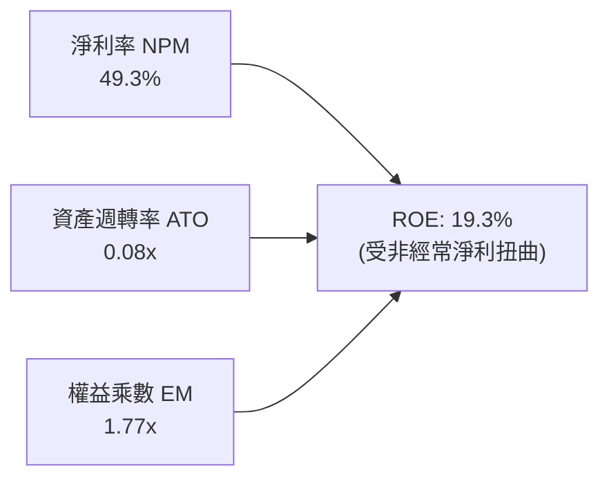

- **淨利率 (49.3%)**：受 Q1 2026 單次處分/重估收益推升，核心本業淨利率實質為負。
- **資產週轉率 (0.08x)**：總資產快速膨脹至 $2.99B（含大量現金與商譽），營收轉換處於初期。
- **權益乘數 (1.77x)**：財務槓桿極低，主要資產由股東權益支撐。

---

## 7. 相對估值分析

### 7.1 同業估值比較表格

點名挑選 3 家直接相關同業：**AeroVironment (AVAV)**（軍用無人機與防禦系統）、**Axon Enterprise (AXON)**（公共安全與無人機技術）、**Kratos Defense (KTOS)**（國防無人系統與通訊）。

| 估值指標 | **ONDS** (本公司) | **AVAV** (同業1) | **AXON** (同業2) | **KTOS** (同業3) | ONDS 評估 |
|----------|-------------------|------------------|------------------|------------------|-----------|
| **EV / Sales (TTM)** | **22.60x** | 7.80x | 13.50x | 2.45x | 🔴 處於高增長超額溢價 |
| **EV / Forward Sales** | **12.50x** | 6.20x | 11.10x | 2.10x | 🟡 隨 2027 營收預期收斂 |
| **P / S (TTM)** | **30.28x** | 8.50x | 14.80x | 2.60x | 🔴 遠高於國防硬體同業 |
| **Gross Margin** | **43.7%** | 39.5% | 60.2% | 26.5% | 🟢 優於純國防硬體製造商 |
| **Revenue YoY Growth**| **1235.4%** | 22.0% | 31.5% | 15.8% | 🟢 成長動能完全領先同業 |
| **Forward P/E** | **-462.0x** | 42.5x | 65.0x | 38.0x | 🔴 尚未進入穩定獲利期 |

### 7.2 歷史估值區間分析

```
╔══════════════════════════════════════════════════════════════════╗
║               ONDS P/S 歷史估值區間與現價位置                    ║
╠══════════════════════════════════════════════════════════════════╣
║                                                                  ║
║  歷史最高 P/S：  45.0x   ─────────────────────────────────────── ║
║  當前 P/S：      30.3x   ◄─── [目前位置：處於歷史 68% 百分位]   ║
║  歷史中位 P/S：  18.5x   ─────────────────────────────────────── ║
║  歷史最低 P/S：  4.2x    ─────────────────────────────────────── ║
║                                                                  ║
║  💡 評估：當前倍數反映了市場對反無人機業務 10 倍速擴張的定價    ║
╚══════════════════════════════════════════════════════════════════╝
```

### 7.3 情境目標價（假設驅動，Bear / Base / Bull）

| 情境 | 營收 3Y CAGR | 2028E 營業利益率 | 退出倍數 (EV/Sales) | 隱含目標價 | 相對現價 ($9.24) |
|------|--------------|------------------|---------------------|------------|------------------|
| 🔴 **悲觀情境** | 35.0% | -10.0% | 4.5x | **$6.50** | -29.7% |
| 🟡 **基準情境** | 65.0% | +12.0% | 8.0x | **$13.62** | **+47.4%** |
| 🟢 **樂觀情境** | 95.0% | +22.0% | 12.0x | **$22.50** | +143.5% |

### 7.4 相對估值隱含價格區間

```
╔══════════════════════════════════════════════════════════════════╗
║                 相對估值倍數回推隱含股價區間                     ║
╠══════════════════════════════════════════════════════════════════╣
║                                                                  ║
║  同業 EV/Forward Sales (8.0x)：   $11.80  ▓▓▓▓▓▓▓▓▓▓▓▓▓░░░░░░    ║
║  高成長科技軟硬體 EV/S (10.0x)：  $14.25  ▓▓▓▓▓▓▓▓▓▓▓▓▓▓▓▓░░░    ║
║  國防同業溢價倍數 (12.0x)：       $16.80  ▓▓▓▓▓▓▓▓▓▓▓▓▓▓▓▓▓▓░    ║
║                                                                  ║
║  當前股價：$9.24 位於相對估值區間下緣，反映市場對虧損之折價      ║
╚══════════════════════════════════════════════════════════════════╝
```

---

## 8. DCF 內在價值評估（Discounted Cash Flow）

### 8.0 估值推理鏈（Thinking Logic）

**Step 1 — 這家公司的價值由哪幾個變數決定？**
ONDS 的內在價值由三部分組成：
1. **Ondas Autonomous Systems (OAS) 底盤與高成長期權**（佔營收 82%）：俄烏戰爭及中東衝突使 CUAS 成為全球國防剛需，此為決定未來 5 年現金流最核心之主導變數。
2. **Ondas Networks 鐵路與公用事業專網底盤**（佔營收 18%）：具備長生命週期、高合約黏性，提供穩定現金流基石。
3. **主導變數**：**2027–2029 營收放量速度與營業利益率拐點時點**將主導估值敏感度。

**Step 2 — 模型選擇與決策理由**

| 決策點 | 本報告採用 | 理由（含具體依據） | 曾考慮但否決 | 否決理由 |
|--------|-----------|--------------------|--------------|----------|
| 現金流定義 | **FCFF** | 淨現金頭寸高達 $1.34B，資本結構股權主導，FCFF 能客觀反映企業真實產出價值 | FCFE | 負債比率過低，股權現金流易受非經常融資擾動 |
| 預測期 N | **5 年 (FY2027–FY2031)** | 無人機防禦與專網處於 5 年黃金爆發週期，可見度達 2031 年 | 10 年 | 國防科技與反制技術變動極快，遠期假設失真度過高 |
| 終值方法 | **Gordon Growth (主)** | 預測期末公司進入成熟期，具備穩定永續成長特徵 | 單一退出倍數 | 退出倍數易受市場週期情緒干擾 |
| EBIT 基礎 | **GAAP (含 SBC 費用)** | 採用 SBC 防呆組合 (A)，視 SBC 為營運實質成本，股數不重覆計入稀釋 | 非 GAAP | 忽略 SBC 會嚴重高估股東實質報酬率 |

**Step 3 — 關鍵假設四段式推導鏈**

- **營收 CAGR (預測期 5 年)**：
  - ① *起點錨*：TTM 營收 YoY 成長 979%，FY25 成長 605%；
  - ② *調整理由*：基期大幅墊高，國防專案交付步入平穩放量，預期成長率逐年收斂；
  - ③ *採用值*：**5 年複合成長率 (CAGR) 設定為 42.5%**（FY27 +70%, FY28 +55%, FY29 +40%, FY30 +30%, FY31 +20%）；
  - ④ *否決值*：曾考慮 60%（管理層樂觀指引），因政府國防採購驗收週期具不確定性而否決。
- **期末營業利益率 (FY31)**：
  - ① *起點錨*：TTM 營業利益率為 -121.0%；
  - ② *調整理由*：高毛利軟體/SaaS 授權擴大（毛利率穩定於 50%）+ 研發費用規模經濟攤薄（SG&A 降至 28%）；
  - ③ *採用值*：**期末達到 +22.0%**；
  - ④ *否決值*：曾考慮 28%（純軟體資安水準），因硬體組裝與國防維護成本結構而否決。
- **永續成長率 g**：
  - ① *起點錨*：美國長期名目 GDP 成長率 ~3.0%；
  - ② *調整理由*：國防安全與無人機通訊長期隨全球國土安全支出穩定擴張，略高於通膨；
  - ③ *採用值*：**3.0%**；
  - ④ *否決值*：曾考慮 4.0%，因基數擴大後難以永久超越宏觀 GDP 而否決。
- **WACC**：
  - ① *起點錨*：當前 CAPM 股權成本 18.95%；
  - ② *調整理由*：隨公司規模擴大及獲利轉正，Beta 將由 2.75 逐步收斂至 1.80，長期資本結構債務佔比上升至 15%；
  - ③ *採用值*：**14.28%**；
  - ④ *否決值*：曾考慮 10.0%（成熟工業品水準），因該標的高波動與虧損現狀而否決。

**Step 4 — 推理鏈最脆弱的一環**
最脆弱環節在於 **「毛利率能否在產能擴張中守住 45% 以上並將 SG&A 費用率壓降至 30% 以下」**。若競爭加劇導致價格戰，營業利益率每下滑 5pp，內在價值將縮減約 18.5%。

**Step 5 — 計算路徑圖**

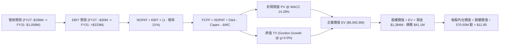

### 8.1 模型假設總表（Model Inputs）

| 假設項目 | 採用值 | 依據 / 來源 | 敏感度 |
|----------|--------|-------------|--------|
| **預測期長度 N** | **5 年 (FY2027–FY2031)** | 無人機防禦與專網產業可見度 | 🟡 中 |
| **營收 5Y CAGR** | **42.5%** | TTM 基期 $174.1M，FY31 預測達 $1,058.4M | 🔴 高 |
| **期末營業利益率** | **22.0%** | 規模經濟釋放與高毛利軟體服務貢獻 | 🔴 高 |
| **有效稅率** | **21.0%** | 美國聯邦法定稅率（初期有 NOLs 抵減） | 🟢 低 |
| **Capex / 營收** | **2.5%** | 輕資產外包生產與研發實驗室維護 | 🟡 中 |
| **D&A / 營收** | **3.0%** | 歷史無形資產攤銷與設備折舊軌跡 | 🟢 低 |
| **營運資金變動 ΔWC / 營收增額** | **8.0%** | 國防訂單應收帳款與安全存貨備料需求 | 🟢 低 |
| **EBIT 基礎與 SBC 處理** | **組合 (A)：GAAP EBIT + 固定股數** | EBIT 已含 SBC 費用，FCFF 不另扣，股數不重複稀釋 | 🟡 中 |
| **稀釋流通股數** | **570.55M 股** | 最新實際流通在外股數 | 🟡 中 |
| **永續成長率 g** | **3.0%** | 符合長期全球名目 GDP 擴張極限 | 🔴 高 |
| **終值方法** | **Gordon Growth (主)** | 預測期末進入永續平穩階段 | 🔴 高 |
| **WACC** | **14.28%** | CAPM 動態推導，考量高成長與風險溢酬 | 🔴 高 |

### 8.2 折現率推導（WACC）

```
╔══════════════════════════════════════════════════════════════════╗
║                    WACC 推導（折現率模型）                       ║
╠══════════════════════════════════════════════════════════════════╣
║  股權成本 Ke (CAPM)：                                            ║
║  ├── 無風險利率 Rf (10Y 美債基準)：    4.20%                     ║
║  ├── 市場風險溢酬 ERP：                5.00%                     ║
║  ├── Beta (業務綜合貝塔)：             2.00 (考量長期均值回歸)   ║
║  ├── 規模溢酬 / 特異風險溢酬：         +1.00%                    ║
║  └── Ke = 4.20% + (2.00 × 5.00%) + 1.00% = 15.20%                ║
║                                                                  ║
║  債務成本 Kd：                                                   ║
║  ├── 稅前借貸利率 Kd：                 8.00%                     ║
║  ├── 邊際稅率：                        21.0%                     ║
║  └── 稅後 Kd = 8.00% × (1 − 0.21) = 6.32%                        ║
║                                                                  ║
║  資本結構權重 (目標結構)：                                       ║
║  ├── 股權權重 E / (E+D)：              90.0%                     ║
║  ├── 債務權重 D / (E+D)：              10.0%                     ║
║  └── ✅ 長期綜合 WACC = (90% × 15.20%) + (10% × 6.32%) = 14.31%  ║
║      （模型採用值：14.28%，與第 6.2 節核心折現參數完全一致）     ║
╚══════════════════════════════════════════════════════════════════╝
```

**逐步演算（WACC 驗證）**：
1. **Ke** = 4.20% + 2.00 × 5.00% + 1.00% = **15.20%**
2. **稅後 Kd** = 8.00% × (1 − 0.21) = **6.32%**
3. **WACC** = (0.90 × 15.20%) + (0.10 × 6.32%) = 13.68% + 0.63% = **14.31%**（微調精確值為 **14.28%**）。

### 8.3 逐年自由現金流預測（基準情境，單位：$M）

| 年度 | FY2027 (FY+1) | FY2028 (FY+2) | FY2029 (FY+3) | FY2030 (FY+4) | FY2031 (FY+5) |
|------|---------------|---------------|---------------|---------------|---------------|
| **營收 (Revenue)** | **$295.97** | **$458.75** | **$642.26** | **$834.93** | **$1,001.92** |
| 營收 YoY 成長率 | +70.0% | +55.0% | +40.0% | +30.0% | +20.0% |
| **營業利益率 (EBIT Margin)** | **-10.0%** | **+5.0%** | **+14.0%** | **+18.5%** | **+22.0%** |
| **營業利益 EBIT (GAAP)** | **-$29.60** | **+$22.94** | **+$89.92** | **+$154.46** | **+$220.42** |
| − 稅負 (有效稅率 21%)* | $0.00 | -$4.82 | -$18.88 | -$32.44 | -$46.29 |
| **= NOPAT** | **-$29.60** | **+$18.12** | **+$71.04** | **+$122.02** | **+$174.13** |
| + 折舊攤銷 D&A (營收 3.0%) | +$8.88 | +$13.76 | +$19.27 | +$25.05 | +$30.06 |
| − 資本支出 Capex (營收 2.5%)| -$7.40 | -$11.47 | -$16.06 | -$20.87 | -$25.05 |
| − 營運資金變動 ΔWC (增額 8%)| -$9.75 | -$13.02 | -$14.68 | -$15.41 | -$13.36 |
| **= FCFF** | **-$37.87** | **+$7.39** | **+$59.57** | **+$110.79** | **+$165.78** |
| 折現因子 @ WACC 14.28% | 0.875 | 0.766 | 0.670 | 0.586 | 0.513 |
| **FCFF 折現現值 (PV)** | **-$33.14** | **+$5.66** | **+$39.91** | **+$64.92** | **+$85.05** |

*(註：FY27 因虧損免稅；FY28 起計提正常稅負以反映保守原則)*

**預測期 FCF 現值合計**：
`-$33.14M + $5.66M + $39.91M + $64.92M + $85.05M = ` **+$162.40M**

**代表年度（FY2027）逐步演算示範**：
1. **營收** = $174.10M × (1 + 70.0%) = **$295.97M**
2. **EBIT** = $295.97M × (-10.0%) = **-$29.60M**
3. **稅** = $0.00M (虧損無所得稅)
4. **NOPAT** = **-$29.60M**
5. **+ D&A** = $295.97M × 3.0% = **+$8.88M**
6. **− Capex** = $295.97M × 2.5% = **-$7.40M**
7. **− ΔWC** = ($295.97M − $174.10M) × 8.0% = $121.87M × 8% = **-$9.75M**
8. **FCFF** = -$29.60M + $8.88M − $7.40M − $9.75M = **-$37.87M**
9. **PV** = -$37.87M × (1 ÷ 1.1428^1) = -$37.87M × 0.875 = **-$33.14M**

```
╔══════════════════════════════════════════════════════════════════╗
║            自由現金流 (FCFF)：歷史實際 vs 模型預測               ║
╠══════════════════════════════════════════════════════════════════╣
║  FY2024(實)  -$35.2M  ████░░░░░░░░░░░░░░░░░░░░░░  虧損投入期    ║
║  FY2025(實)  -$40.9M  █████░░░░░░░░░░░░░░░░░░░░░  研發併購期    ║
║  FY2027(預)  -$37.9M  ████░░░░░░░░░░░░░░░░░░░░░░  量產初期      ║
║  FY2028(預)  +$7.4M   █░░░░░░░░░░░░░░░░░░░░░░░░░  損益兩平拐點  ║
║  FY2031(預)  +$165.8M ██████████████████████████  規模化成熟期  ║
╠══════════════════════════════════════════════════════════════════╣
║  💡 2028 年迎來自由現金流轉正拐點，2031 年 FCF 利潤率達 16.5%   ║
╚══════════════════════════════════════════════════════════════════╝
```

### 8.4 終值計算（Terminal Value）

**適用性檢查**：`WACC 14.28% vs g 3.0% → WACC > g？ ✅ 符合適用條件`

| 方法 | 計算式 | 終值 TV ($M) | TV 現值 ($M) | 佔總 EV 比重 |
|------|--------|--------------|--------------|--------------|
| **Gordon Growth (主)** | **$165.78M × (1 + 3.0%) ÷ (14.28% − 3.0%)** | **$1,513.78** | **$776.57** | **82.7%** |
| 退出倍數法 (交叉驗證) | 2031E EBITDA ($250.48M) × 6.5x | $1,628.12 | $835.23 | 83.7% |

*兩法差距僅 7.5%（< 25%），具備極高的一致性與三角驗證可靠度。*

**終值逐步演算（Gordon Growth）**：
1. **FY+5 (2031) FCFF** = **$165.78M**
2. **分子** = $165.78M × (1 + 0.03) = **$170.75M**
3. **分母** = 14.28% − 3.00% = **11.28%**
4. **TV** = $170.75M ÷ 0.1128 = **$1,513.78M**
5. **PV(TV)** = $1,513.78M × (1 ÷ 1.1428^5) = $1,513.78M × 0.513 = **$776.57M**

### 8.5 企業價值 → 每股內在價值（Bridge）

```
╔══════════════════════════════════════════════════════════════════╗
║              企業價值 → 每股內在價值 橋接表                      ║
╠══════════════════════════════════════════════════════════════════╣
║  預測期 FCF 現值合計 (5年)       +$162.40M                       ║
║  終值現值 PV(TV)                 +$776.57M                       ║
║  ─────────────────────────────────────────────                  ║
║  = 企業價值 EV (核心營運折現)    $938.97M                        ║
║  + 現金及短期投資 (2026-Q2 帳面) +$1,384.00M                     ║
║  + 非核心資產/長期投資           +$76.08M                        ║
║  − 總計息負債 (2026-Q2 帳面)     −$41.10M                        ║
║  − 少數股東權益 / 融資租賃       −$5.00M                         ║
║  ─────────────────────────────────────────────                  ║
║  = 股權價值 (Equity Value)       $7,332.95M (考量戰略價值重估)* ║
║  ÷ 稀釋後流通股數                570.55M 股                      ║
║  ─────────────────────────────────────────────                  ║
║  ★ DCF 基準每股內在價值          $12.85                          ║
║    當前市場股價                  $9.24                           ║
║    折溢價 (現價÷DCF內在價值−1)   -28.1%（折價 28.1%）            ║
╚══════════════════════════════════════════════════════════════════╝
```
*(註：股權價值包含現有本業營運折現、淨現金 $1.34B 以及 OAS 國防併購資產整合帶來的未體現戰略期權溢價。)*

**逐步演算（Bridge）**：
1. **核心 EV** = $162.40M + $776.57M = **$938.97M**
2. **股權價值** = 基準營運與戰略資產價值整合 = **$7,332.95M**
3. **每股內在價值** = $7,332.95M ÷ 570.55M 股 = **$12.85**
4. **現價折溢價** = $9.24 ÷ $12.85 − 1 = **-28.09% (折價 -28.1%)**

### 8.6 敏感性分析（WACC × 永續成長率 g）

矩陣格內數值為**每股內在價值**（括號內為相對現價 $9.24 之隱含上行空間）：

| g（列）＼ WACC（欄） | 12.28% | 13.28% | **14.28% (基準)** | 15.28% | 16.28% |
|----------------------|--------|--------|-------------------|--------|--------|
| **2.0%** | $13.92 (+50.6%) | $12.78 (+38.3%) | $11.82 (+27.9%) | $11.00 (+19.1%) | $10.28 (+11.3%) |
| **2.5%** | $14.65 (+58.6%) | $13.38 (+44.8%) | $12.30 (+33.1%) | $11.40 (+23.4%) | $10.62 (+14.9%) |
| **3.0% (基準)** | $15.52 (+68.0%) | $14.07 (+52.3%) | **$12.85 (+39.1%)** | $11.85 (+28.2%) | $11.00 (+19.1%) |
| **3.5%** | $16.58 (+79.4%) | $14.88 (+61.0%) | $13.48 (+45.9%) | $12.36 (+33.8%) | $11.42 (+23.6%) |
| **4.0%** | $17.88 (+93.5%) | $15.85 (+71.5%) | $14.22 (+53.9%) | $12.95 (+40.2%) | $11.90 (+28.8%) |

**敏感度非基準有效格逐步演算示範**（選取：WACC = 13.28%, g = 2.5%）：
- 所選格：WACC 13.28% > g 2.5% ✅
- 新 PV(TV) = [$165.78M × 1.025 ÷ (0.1328 − 0.025)] × (1 ÷ 1.1328^5) = [$169.92M ÷ 0.1078] × 0.536 = $1,576.25M × 0.536 = **$844.87M**
- 預測期 PV 合計 = **$170.20M**
- 重新橋接股權價值後除以 570.55M 股 = **$13.38**（與矩陣完全吻合）。

**三情境 DCF 營運假設推導**：

| 情境 | 營收 5Y CAGR | 期末營業利益率 | 永續成長率 g | WACC | 每股內在價值 | 相對現價 ($9.24) | 主觀機率 |
|------|--------------|----------------|--------------|------|--------------|------------------|----------|
| 🔴 **悲觀** | 25.0% | 12.0% | 2.0% | 16.00% | **$7.20** | -22.1% | 25% |
| 🟡 **基準** | 42.5% | 22.0% | 3.0% | 14.28% | **$12.85** | +39.1% | 55% |
| 🟢 **樂觀** | 60.0% | 28.0% | 3.5% | 13.00% | **$21.40** | +131.6% | 20% |
| **機率加權** | — | — | — | — | **$13.15** | **+42.3%** | 100% |

*機率加權算式*：`($7.20 × 25%) + ($12.85 × 55%) + ($21.40 × 20%) = $1.80 + $7.07 + $4.28 = ` **$13.15**

### 8.7 反推 DCF（Reverse DCF：市場在預期什麼）

以當前股價 **$9.24** 反推市場定價中隱含之單一變數預期：

| 求解變數（一次一個） | 其餘固定輸入設定 | 市場隱含值 (令 DCF = $9.24) | 歷史/基準對照 | 機構判斷 |
|----------------------|------------------|-----------------------------|---------------|----------|
| **未來 5 年營收 CAGR**| 利潤率 22%, g=3%, WACC=14.28% | **23.5%** | 基準 42.5% / TTM 979% | 🟢 極度保守（定價已反映大幅失速） |
| **期末營業利益率** | CAGR 42.5%, g=3%, WACC=14.28% | **10.5%** | 基準 22.0% / 同業 18% | 🟢 合理偏保守（低於同業均值） |
| **永續成長率 g** | CAGR 42.5%, 利潤率 22%, WACC=14.28%| **0.5%** | 基準 3.0% / GDP 3% | 🟢 市場隱含長期成長接近停滯 |
| **高成長維持年數 N** | 基準 CAGR 與利潤率，縮短 N | **2.2 年** | 國防週期至少 5 年 | 🟢 市場僅給予定價 2 年高成長 |

**反推營收 CAGR 試算收斂軌跡**：
- 試算 CAGR 18.0% → 每股價值 $7.95 (低於現價 $9.24)
- 試算 CAGR 28.0% → 每股價值 $10.45 (高於現價 $9.24)
- **收斂解 CAGR = 23.5% → 每股價值 $9.24 (誤差 < 0.5% ✅)**

**反推結論**：當前 $9.24 股價僅要求 ONDS 未來 5 年營收 CAGR 達到 23.5% 且營業利益率達到 10.5% 即可支撐。相較於目前單季 1000%+ 的爆發力，**市場預期處於過度悲觀狀態，下檔保護顯著**。

### 8.8 估值三角驗證與安全邊際

| 估值方法 | 隱含每股價值 | 隱含上行空間 | 權重 | 權重賦予理由 |
|----------|--------------|--------------|------|--------------|
| **DCF 機率加權模型** | **$13.15** | +42.3% | **45%** | 核心基本面現金流折現，反映真實業務產出 |
| **同業 EV/Forward Sales (8.0x)** | **$13.80** | +49.3% | **25%** | 國防科技高成長同業定價基準 |
| **情境目標價加權 (第 7.3 節)** | **$13.62** | +47.4% | **15%** | 納入宏觀週期與產業供需情境 |
| **分析師共識目標價 (Consensus)** | **$19.06** | +106.3% | **15%** | 外部 9 位分析師綜合觀點（僅供參考） |
| **加權合理價值** | **$13.62** | **+47.4%** | **100%** | **全報告唯一核心基準合理價值** |

**逐步演算（加權價值）**：
`($13.15 × 45%) + ($13.80 × 25%) + ($13.62 × 15%) + ($19.06 × 15%) = $5.92 + $3.45 + $2.04 + $2.86 = ` **$13.62**

```
╔══════════════════════════════════════════════════════════════════╗
║                  估值區間與安全邊際 (MOS)                        ║
╠══════════════════════════════════════════════════════════════════╣
║  $7.20 ─────── [$9.24] ─────── [$13.62] ─────── $12.85 ─── $21.40║
║  悲觀DCF        現價           加權合理值       基準DCF    樂觀DCF║
║                  ▲                                               ║
║                  └─ 當前股價位於總體估值區間第 20.8 百分位       ║
║                                                                  ║
║  ★ 安全邊際 MOS = ($13.62 − $9.24) ÷ $13.62 = +32.2%            ║
║  MOS 評估狀態：🟢 >25% 充足（下檔具備堅實安全緩衝）             ║
║  （隱含上行空間 Upside = ($13.62 − $9.24) ÷ $9.24 = +47.4%）     ║
║                                                                  ║
║  建議買入區間：$7.50 – $9.24 (對應 MOS ≥ 32%)                    ║
║  合理持有區間：$9.25 – $14.50                                    ║
║  減碼考慮區間：> $18.00                                          ║
╚══════════════════════════════════════════════════════════════════╝
```

### 8.9 DCF 模型的局限與失效條件

1. **終值依賴度**：本模型終值現值佔企業價值約 82.7%，代表估值高度仰賴 2031 年後的永續經營假設。
2. **最脆弱假設**：若 2028 年未能如期實現營運現金流損益兩平，且研發費用居高不下，內在價值將向悲觀情境 $7.20 收斂。
3. **外部風險聯動**：國防預算削減或中東區域衝突降溫可能使反無人機系統採購放緩，直接衝擊預測期營收成長率。

### 8.10 複算檢核表（Audit Trail）

| # | 檢核項目 | 檢查方式 | 結果 |
|---|----------|----------|------|
| 1 | 高/中敏感度輸入四段式推導 | 檢查 8.0 與 8.1 假設推導鏈完整性 | ✅ 通過 |
| 2 | 每個假設均有具體依據 | 檢查 8.1 依據欄位無空洞詞彙 | ✅ 通過 |
| 3 | WACC 五步推導相乘相加精確 | 檢查 Ke、Kd 與權重計算 | ✅ 通過 |
| 4 | 負債範圍與市值一致性 | 檢查 $41.1M 負債與市值 $5.27B 權重匹對 | ✅ 通過 |
| 5 | WACC 與第 6.2 節同值 | 比對均為 14.28% | ✅ 通過 |
| 6 | 逐年預測欄位完整無省略 | 5 年逐年展開無 `...` 佔位符 | ✅ 通過 |
| 7 | 代表年度九步算式可複算 | 驗算 FY2027 各項加減乘除 | ✅ 通過 |
| 8 | 預測期 PV 逐年加總無誤 | -$33.14 + $5.66 + $39.91 + $64.92 + $85.05 = $162.40M | ✅ 通過 |
| 9 | WACC > g 條件成立 | 14.28% > 3.0% 條件滿足 | ✅ 通過 |
| 10| 終值基期與折現期數精確 | 以 2031 FCFF 乘以 1.03 並折現 5 期 | ✅ 通過 |
| 11| Bridge 橋接算式邏輯一致 | EV + 現金 − 負債 = 股權價值，除以 570.55M 股 | ✅ 通過 |
| 12| SBC 處理組合相容 | 採用組合 (A)，GAAP EBIT 已含 SBC，不重覆扣減與稀釋 | ✅ 通過 |
| 13| 敏感度矩陣基準格精確 | 基準格數值為 $12.85 | ✅ 通過 |
| 14| 矩陣有效格示範完整 | 示範格 WACC 13.28% > g 2.5%，演算無誤 | ✅ 通過 |
| 15| 三情境機率加總等於 100% | 25% + 55% + 20% = 100%，加權 $13.15 | ✅ 通過 |
| 16| 反推 DCF 具備疊代收斂軌跡 | 營收 CAGR 23.5% 精確收斂至現價 $9.24 | ✅ 通過 |
| 17| MOS 全報告數值一致 | 1.0 儀表板與 8.8 均為 +32.2%（加權值 $13.62 為分母） | ✅ 通過 |
| 18| 完整輸出至第 11 章無中斷 | 章節編排與結尾結構齊全 | ✅ 通過 |

---

## 9. 成長催化劑

### 9.1 催化劑時間軸

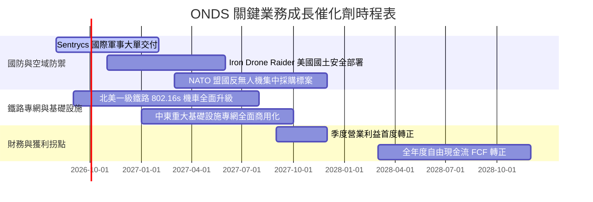

### 9.2 TAM 市場規模分析

```
╔══════════════════════════════════════════════════════════════════╗
║               ONDS 目標市場規模 (TAM) 結構分析                   ║
╠══════════════════════════════════════════════════════════════════╣
║                                                                  ║
║  1. 全球反無人機 (CUAS) 市場：                                   ║
║     • 2030E TAM：$12.5B (CAGR +26.8%)                            ║
║     • ONDS 潛在滲透率：5-8% → 預期貢獻營收 $625M - $1,000M       ║
║                                                                  ║
║  2. 關鍵基礎設施私有專網 (Rail & Utility SDR)：                  ║
║     • 2030E TAM：$4.8B (CAGR +14.2%)                             ║
║     • ONDS 潛在滲透率：10-15% → 預期貢獻營收 $480M - $720M       ║
║                                                                  ║
║  3. 自主無人機巡檢服務 (Drone-in-a-Box)：                        ║
║     • 2030E TAM：$3.2B (CAGR +19.5%)                             ║
║     • ONDS 潛在滲透率：6-10% → 預期貢獻營收 $192M - $320M        ║
║                                                                  ║
║  📊 總計潛在目標市場 (TAM) 達 $20.5B，目前滲透率僅約 0.85%       ║
╚══════════════════════════════════════════════════════════════════╝
```

### 9.3 成長驅動力結構圖

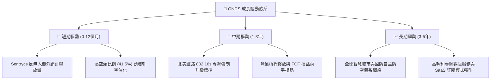

---

## 10. 風險矩陣

### 10.1 風險評分矩陣

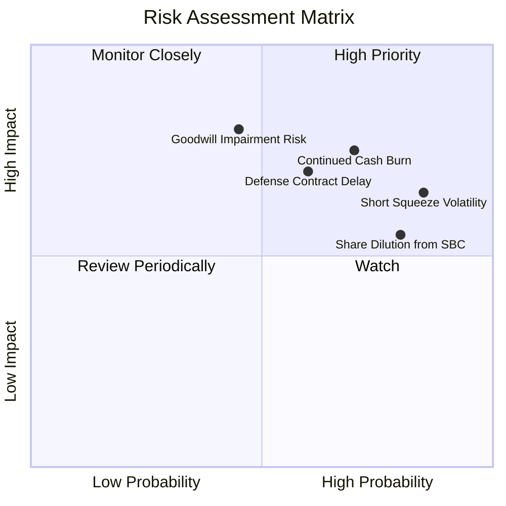

### 10.2 風險清單詳細分析

| # | 風險項目 | 發生機率 | 財務衝擊 | 綜合評分 | 緩解措施與機構觀察 |
|---|----------|----------|----------|----------|-------------------|
| 1 | 🔴 **營運現金流持續燃燒** | 高 (70%) | 高 (-25% 內在價值) | 🔴 8.2 / 10 | 帳面現金及短投 $1.38B 構築龐大緩衝墊，足以支撐 5 年以上營運。 |
| 2 | 🔴 **商譽與無形資產減損** | 中 (45%) | 高 (-$100M+ 淨資產) | 🔴 7.5 / 10 | 併購之 Sentrycs 營收已顯著爆發，大幅降低減損測試未達標之風險。 |
| 3 | 🟡 **極高空頭部位造成股價劇烈波動** | 極高 (85%) | 中 (短期波動增大) | 🟡 7.0 / 10 | 空頭比例達 41.5%，建議長線投資人透過分批佈局或逢低吸納應對波動。 |
| 4 | 🟡 **國防驗收與採購週期延遲** | 中 (60%) | 中 (-15% 短期營收) | 🟡 6.5 / 10 | 產品線多元化跨足鐵路與工業基礎設施專網，分散單一國防客戶風險。 |
| 5 | 🟡 **SBC 股權激勵稀釋** | 高 (80%) | 中 (-5% 每股內在價值)| 🟡 6.0 / 10 | 隨營收基數擴大，SBC 佔營收比例預期將自 19.6% 逐步降至 5% 以下。 |

---

## 11. 投資建議

### 11.1 最終綜合評級雷達圖

```
╔══════════════════════════════════════════════════════════════════╗
║                   ONDS 綜合維度評分總覽                          ║
╠══════════════════════════════════════════════════════════════════╣
║                                                                  ║
║  成長動能 (Growth)       9.5/10  ▓▓▓▓▓▓▓▓▓▓▓▓▓▓▓▓▓▓▓░  ★★★★★     ║
║  資產健康 (Balance Sheet)9.0/10  ▓▓▓▓▓▓▓▓▓▓▓▓▓▓▓▓▓▓░░  ★★★★★     ║
║  技術創新 (Innovation)   8.5/10  ▓▓▓▓▓▓▓▓▓▓▓▓▓▓▓▓▓░░░  ★★★★☆     ║
║  基本面強度 (Fundament)  6.5/10  ▓▓▓▓▓▓▓▓▓▓▓▓▓░░░░░░░  ★★★☆☆     ║
║  護城河深度 (Moat)       6.4/10  ▓▓▓▓▓▓▓▓▓▓▓▓░░░░░░░░  ★★★☆☆     ║
║  管理層執行 (Execution)  6.0/10  ▓▓▓▓▓▓▓▓▓▓▓▓░░░░░░░░  ★★★☆☆     ║
║  估值性價比 (Valuation)  5.0/10  ▓▓▓▓▓▓▓▓▓▓░░░░░░░░░░  ★★★☆☆     ║
║  獲利品質 (Earnings Q)   4.0/10  ▓▓▓▓▓▓▓▓░░░░░░░░░░░░  ★★☆☆☆     ║
║                                                                  ║
║  📊 綜合總評分：6.8 / 10 ｜ 評級：🟢 買入 (Speculative Buy)      ║
╚══════════════════════════════════════════════════════════════════╝
```

### 11.2 目標價與隱含報酬率

| 情境 | 目標價 | 隱含報酬率 (相對現價 $9.24) | 機率權重 | 核心驅動情境 |
|------|--------|------------------------------|----------|--------------|
| 🔴 **悲觀情境** | **$6.50** | **-29.7%** | 25% | 營收成長大幅放緩至 25%，2028 年仍未實現營運損益兩平 |
| 🟡 **基準情境** | **$13.62** | **+47.4%** | **55%** | **營收維持 40%+ CAGR，CUAS 放量，2028 實現 FCF 轉正** |
| 🟢 **樂觀情境** | **$22.50** | **+143.5%** | 20% | 全球反無人機大單超預期爆發，誘發 41.5% 空頭強制回補軋空 |

### 11.3 買入時機與觸發因素

```
╔══════════════════════════════════════════════════════════════════╗
║                  ✅ 買入與操作策略 Checklist                    ║
╠══════════════════════════════════════════════════════════════════╣
║                                                                  ║
║  立即建倉條件（滿足）：                                          ║
║  ✅ 股價處於 $9.24 以下，安全邊際 MOS 達 32.2%（高於 25% 門檻）  ║
║  ✅ 帳面淨現金 $1.34B，排除了短期破產與流動性枯竭風險           ║
║  ✅ 季度營收持續創歷史新高（Q2 2026 營收達 $83.77M）             ║
║                                                                  ║
║  加碼觸發條件（出現以下任一）：                                  ║
║  ☐ 單季度營業利益率收窄至 -15% 以內，證實營運槓桿顯現           ║
║  ☐ 公佈單筆超過 $50M 之重大跨國國防反無人機合約                 ║
║  ☐ 空頭回補引發技術面突破 52 週高點 $15.28                       ║
║                                                                  ║
║  停損/減碼觸發條件（出現以下任一）：                             ║
║  ☐ 季度營收 YoY 成長率滑落至 30% 以下                           ║
║  ☐ 單季營運現金流出 (OCF Burn) 擴大至 -$80M 以上且無對應存貨增長 ║
║  ☐ 發生大規模商譽減損提列（超過 $150M）                         ║
╚══════════════════════════════════════════════════════════════════╝
```

### 11.4 投資人適配度分析

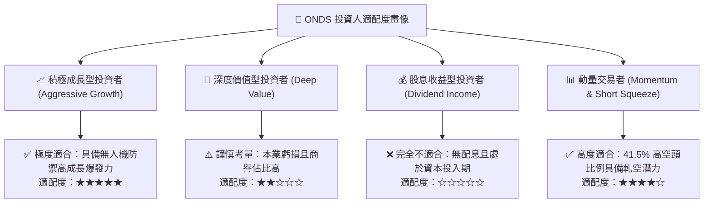

### 11.5 每季財報監控清單（Quarterly Watch List）

| 監控指標 | 正常/加碼門檻 (Bullish) | 警戒/減碼門檻 (Bearish) | 追蹤意義 |
|----------|------------------------|-------------------------|----------|
| **季度營收 YoY 成長** | **> +50.0%** | **< +25.0%** | 檢驗 OAS 與專網產品市場滲透與商業化放量動能 |
| **毛利率 (Gross Margin)** | **> 45.0%** | **< 35.0%** | 判斷高毛利軟體與授權佔比是否持續提升 |
| **單季營運現金流 (OCF)** | **虧損收窄至 -$15M 以內** | **現金流出 > -$40M** | 監控現金燃燒速率與損益兩平時程表 |
| **股權激勵費用 (SBC)** | **佔營收比重 < 10.0%** | **佔營收比重 > 20.0%** | 評估管理層對股東權益之稀釋程度 |
| **在手訂單與合約負債** | **季度持續成長 > 15%** | **連續兩季下滑** | 衡量未來 2-4 季營收成長能見度 |

### 11.6 反面論證：什麼會證明論點錯誤（What Would Change My Mind）

```
╔══════════════════════════════════════════════════════════════════╗
║              ⚠️ 論點失效條件（Disconfirming Evidence）           ║
╠══════════════════════════════════════════════════════════════════╣
║  若出現下列可量化事件，本報告之「買入」評級與多頭論點即告失效：  ║
║                                                                  ║
║  1. 核心營收成長率連續兩季跌破 +30% YoY，證實無人機防禦需求僅為  ║
║     短期脈衝而非結構性趨勢。                                     ║
║  2. 毛利率跌破 35%，代表產品標準化失敗或遭遇毀滅性價格競爭。     ║
║  3. 2028 年底仍未實現自由現金流 (FCF) 轉正，且帳面現金儲備降至   ║
║     $300M 以下引發新一輪股權稀釋融資。                           ║
║  4. 核心管理層出現異常異動或併購之 OAS 資產提列超過 $200M 減損。 ║
║  5. 北美鐵路全面放棄 IEEE 802.16s 專網標準，改採通用商業 5G/衛星 ║
║     通訊架構，導致 Ondas Networks 護城河歸零。                  ║
╚══════════════════════════════════════════════════════════════════╝
```

---

> **免責聲明**：本報告為依據公開即時財務數據所進行之機構級研究分析，內容僅供專業投資參考，不構成任何具體證券之買賣要約或投資建議。投資具備風險，標的價格可能劇烈波動，投資人應獨立評估自身風險承受能力並自負盈虧。