# ONDS 基本面深度分析報告
> **報告日期**：2026-09-13 ｜ **語言**：繁體中文 ｜ **數據來源**：Yahoo Finance, Finviz, StockAnalysis, Roic.ai ｜ **分析師**：CFA 級機構研究

---

## 目錄

| # | 章節 | 核心結論 |
|---|------|----------|
| 1 | 執行摘要 | 評級「持有/投機性觀察」，加權合理價值 $7.67，MOS 5.7% 缺乏保護 |
| 2 | 公司概覽與商業模式 | 無人機/反無人機(CUAS)雙軌布局，護城河評分 5.8/10，依賴併購整合 |
| 3 | 損益表深度分析 | TTM 營收爆發至 $174.10M (YoY +1235.4%)，但營業利潤率 -166.3%，SBC 嚴重稀釋 |
| 4 | 資產負債表分析 | 現金及短投充裕達 $1.38B，淨現金 $1.34B，但商譽與無形資產高達 $1.24B 潛藏減損風險 |
| 5 | 現金流量深度分析 | 營運與自由現金流持續流出 (TTM FCF -$69.11M)，擴張全依賴股權融資與股本膨脹 |
| 6 | 獲利能力與資本效率 | TTM ROIC 為 -10.9% 遠低於 WACC 14.6%，經濟價值增加 EVA 為 -25.5pp，持續摧毀股東價值 |
| 7 | 相對估值分析 | P/S 23.7x 顯著溢價於同業中位數，市場定價已完全透支高成長預期 |
| 8 | DCF 內在價值評估 | 基準 DCF 每股內在價值 $6.48，現價 $7.23 溢價 11.6%；加權合理價值 $7.67 |
| 9 | 成長催化劑 | 國防與基礎設施無人機自動化及反無人機合約放量，TAM 擴展至 $12B+ |
| 10 | 風險矩陣 | 空頭比率高達 39.9%、股權大幅稀釋、商譽減損為前三大致命風險 |
| 11 | 投資建議 | 區間操作：買入區間 $4.50–$5.50，合理持有 $6.00–$8.50，反轉停損點確立 |

---

## 1. 執行摘要

本報告給予 Ondas Inc. (NASDAQ: ONDS) **「持有 / 投機性觀察（Hold / Speculative Watch）」** 評級。該結論並非預設立場，而是基於以下具體財務數據推導所得：儘管公司受惠於反無人機（CUAS）與自主無人機系統需求爆發，TTM 營收激增 1235.4% 至 $174.10M，且坐擁 $1.38B 現金儲備；然而，其 TTM 營業利益仍大幅虧損 -$210.70M（營業利益率 -166.3%），自由現金流流出 -$69.11M，且 2026 年上半年單季股權激勵（SBC）高達 $69.09M，使流通股數急速膨脹至 571.45M 股。在資本效率維度，TTM ROIC 為 -10.9%，遠落後於高達 14.6% 的 WACC，EVA 為 -25.5pp，實質上處於「大規模燒錢摧毀股東價值」階段。以基準 DCF 推導每股內在價值為 $6.48（現價 $7.23 處於溢價 11.6% 狀態），經相對估值與分析師目標價三角驗證後的加權合理價值為 $7.67，對應安全邊際（MOS）僅 5.7%，未能提供足夠的安全保護墊。當前高達 39.9% 的空單比例（Short % Float）預示多空博弈極度劇烈，建議投資人靜待營運虧損實質收斂後再行介入。

### 1.0 一頁式投資儀表板（Portfolio Manager 30 秒速讀）

| 項目 | 內容 |
|------|------|
| **投資論點（3 句）** | ① 反無人機 (CUAS) 與自主無人機系統業務帶動 TTM 營收年增 1235.4% 達到 $1.74 億。② 帳面現金及短投高達 $13.8 億，提供充裕的資本跑道以支應當前研發與併購整合。③ 獲利含金量嚴重不足，TTM 營業虧損高達 -$2.11 億，股權薪酬稀釋劇烈且自由現金流持續淨流出。 |
| **護城河評分** | 5.8/10 🟡（私有專網技術與 Iron Drone / Sentrycs 具特定壁壘，但面臨防務巨頭競爭） |
| **管理層/資本配置評分** | 5.2/10 🟡（善於利用高估值發股融資換取充沛現金，但商譽高達 $6.61 億且股本稀釋過巨） |
| **財務健康** | 🟢 短期流動性極強（流動比率 9.85x，淨現金 $13.4 億，無破產風險） |
| **ROIC vs WACC** | -10.9% vs 14.6%（大幅摧毀股東價值，EVA = -25.5pp） |
| **FCF 趨勢** | 惡化：2026Q2 單季 FCF 擴大流出至 -$93.84M，TTM FCF Yield 為 -1.67% |
| **估值** | Forward P/E -361.5x ｜ EV/Revenue 16.01x ｜ EV/EBITDA -15.44x |
| **DCF 內在價值（基準）** | **$6.48** ｜ 現價 $7.23 折溢價 **+11.6%（溢價高估）** |
| **安全邊際（MOS）** | **+5.7%** ＝ ($7.67 加權合理價值 − $7.23) ÷ $7.67 ｜ 🔴 <10% 無安全邊際 |
| **預期報酬（基準情境 12M）** | +6.1%（相對加權合理價值 $7.67） |
| **關鍵風險（前二）** | ① 空頭比率達 39.9% 且市場波動 Beta 高達 2.74；② 巨額商譽（$6.61 億）隱含未來減損風險。 |
| **評級 + 信心度** | 🟡 **持有 / 觀望** ｜ 信心度：**中等** |

### 1.1 核心評分儀表板

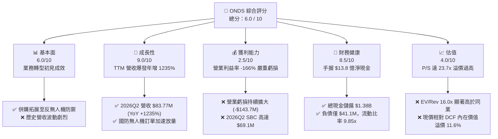

### 1.2 評分進度條視覺化

```
╔══════════════════════════════════════════════════════════════╗
║               ONDS 多維度評分儀表板 (1-10分)                 ║
╠══════════════════════════════════════════════════════════════╣
║ 基本面強度  6.0 ▓▓▓▓▓▓▓▓▓▓▓▓░░░░░░░░  ★★★☆☆           ║
║ 成長動能    9.0 ▓▓▓▓▓▓▓▓▓▓▓▓▓▓▓▓▓▓░░  ★★★★★           ║
║ 獲利品質    2.5 ▓▓▓▓▓░░░░░░░░░░░░░░░  ★☆☆☆☆           ║
║ 財務健康    8.5 ▓▓▓▓▓▓▓▓▓▓▓▓▓▓▓▓▓░░░  ★★★★☆           ║
║ 估值合理性  4.0 ▓▓▓▓▓▓▓▓░░░░░░░░░░░░  ★★☆☆☆           ║
║ 護城河深度  5.8 ▓▓▓▓▓▓▓▓▓▓▓░░░░░░░░░  ★★★☆☆           ║
║ 管理層執行  5.2 ▓▓▓▓▓▓▓▓▓▓░░░░░░░░░░  ★★★☆☆           ║
║ 技術創新力  8.0 ▓▓▓▓▓▓▓▓▓▓▓▓▓▓▓▓░░░░  ★★★★☆           ║
╠══════════════════════════════════════════════════════════════╣
║ 綜合總分    6.0 ▓▓▓▓▓▓▓▓▓▓▓▓░░░░░░░░  🏆 評語：高成長高風險 ║
╚══════════════════════════════════════════════════════════════╝
```

### 1.3 五大投資論點 + 三大核心風險

| 類型 | 項目 | 具體依據 | 信心度 |
|------|------|----------|--------|
| 🟢 **投資論點①** | **無人機防護與自主系統超高速放量** | 季度營收從 2024Q4 的 $4.13M 激增至 2026Q2 的 $83.77M，連續 5 季維持 500%+ 之驚人同比成長率。 | 🟢 極高 |
| 🟢 **投資論點②** | **充裕的資本緩衝儲備** | 截至 2026Q2 帳上持有現金及短期投資 $1,384M，總負債僅 $41.1M，具備承受多年研發虧損的強大抗風險底盤。 | 🟢 高 |
| 🟢 **投資論點③** | **防務與國土安全戰略需求激增** | 現代戰爭無人機滲透率攀升，Iron Drone 與 Sentrycs CoRF 軟硬體一體化反制系統具備極高政治與軍事急迫性。 | 🟢 高 |
| 🟢 **投資論點④** | **鐵路與關鍵基礎設施專網壁壘** | IEEE 802.16s 無線技術標準奠定北美鐵路專網龍頭地位，形成長週期、高黏著度之企業級護城河。 | 🟡 中度 |
| 🟢 **投資論點⑤** | **機構資金持股比例快速拉升** | 機構持股比例已躍升至 58.4%，Needham、Oppenheimer 等多家投行連續給予「買入」與「跑贏大盤」評級。 | 🟡 中度 |
| 🔴 **風險①** | **巨額空單壓頂與市場極端博弈** | 空頭佔流通股比例高達 39.9%，空頭回補天數（Short Ratio）達 3.13，股價 Beta 達 2.74，波動極度劇烈。 | 🔴 高衝擊 |
| 🔴 **風險②** | **獲利能力與現金流嚴重失血** | 2026Q2 單季營運虧損 -$143.71M，單季 FCF 流出 -$93.84M，SBC 達 $69.09M，商業模式自我造血能力尚未被驗證。 | 🔴 高衝擊 |
| 🟡 **風險③** | **併購帶來的無形資產減損隱憂** | 商譽（$661.36M）與無形資產（$583.27M）佔總資產比例高達 41.6%，若被收購標的整合未達預期將面臨巨額提列減損。 | 🟡 中度 |

### 1.4 快速統計卡片

| 指標 | 公司實際值 (TTM / 最新) | 行業均值 (通訊與國防設備) | S&P 500 均值 | 狀態 |
|------|-------------|----------|--------------|------|
| 收入 YoY 成長 | **1235.4%** | ~8.5% | ~5.2% | 🟢 頂級成長 |
| 毛利率 | **43.7%** | ~42.0% | ~44.5% | 🟡 符合行業 |
| 營業利益率 | **-166.3%** | ~11.2% | ~12.8% | 🔴 嚴重失血 |
| 淨利率 | **96.2%** (受Q1非經常收益擾動) | ~7.8% | ~10.5% | 🟡 獲利失真 |
| ROE | **19.3%** (非經常性利益扭曲) | ~13.5% | ~15.2% | 🟡 品質堪憂 |
| ROIC | **-10.9%** | ~9.2% | ~11.0% | 🔴 摧毀價值 |
| Current Ratio | **9.85x** | ~1.85x | ~1.25x | 🟢 極度穩健 |
| EV / Revenue | **16.01x** | ~2.80x | ~2.95x | 🔴 估值偏高 |

### 1.5 投資結論

```
╔══════════════════════════════════════════════════════════════════╗
║                    📊 投資結論摘要                               ║
╠══════════════════════════════════════════════════════════════════╣
║  評級：🟡 持有 / 觀望 (Hold / Speculative Watch)                 ║
║  當前股價：$7.23 (2026-09-13 收盤價)                             ║
║  DCF 內在價值（基準）：$6.48（現價溢價 +11.6%）                  ║
║  加權合理價值：$7.67（隱含上行空間 +6.1%）                       ║
║  安全邊際 MOS：+5.7%（＝($7.67 − $7.23) ÷ $7.67）               ║
║  MOS 狀態：🔴 <10% 無安全邊際保護                                ║
║  目標價區間（12 個月）：                                         ║
║    悲觀情境：$3.85（-46.8%）                                     ║
║    基準情境：$7.67（+6.1%）  ← 12 個月主要目標                   ║
║    樂觀情境：$12.50（+72.9%）                                    ║
║  投資評分：6.0 / 10                                              ║
║  適合投資人：具備極高風險承受力之動能型、事件驅動型交易者        ║
╚══════════════════════════════════════════════════════════════════╝
```

---

## 2. 公司概覽與商業模式

### 2.1 業務結構與收入來源

Ondas Inc. 透過兩大核心板塊營運：**Ondas Networks**（專網通訊系統）與 **Ondas Autonomous Systems (OAS)**（無人機自動化與反無人機防禦系統）。

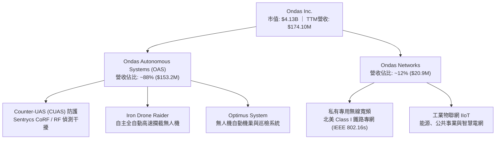

### 2.2 市場份額

在無人機自動化機巢巡檢與戰術級反無人機（CUAS）垂直細分市場中，公司透過一系列激進併購（包括收購 Airobotics、American Robotics 及整合 Sentrycs 技術）取得特定防衛與工業利基。

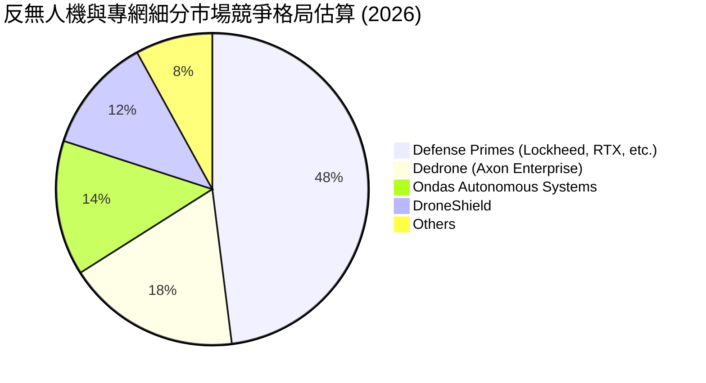

### 2.3 競爭護城河分析

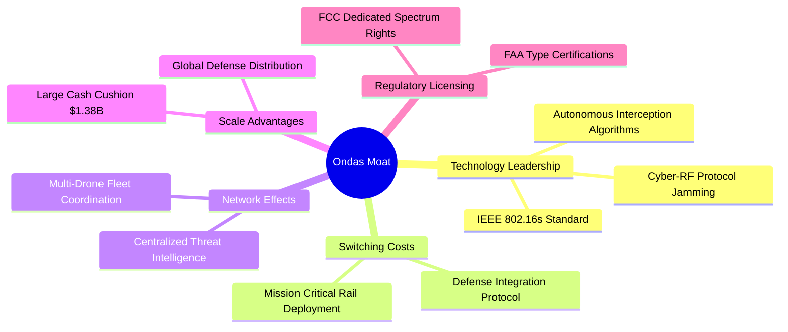

### 2.4 護城河強度評分

```
╔══════════════════════════════════════════════════════════════╗
║                  Ondas Inc. 護城河強度評分                   ║
╠══════════════════════════════════════════════════════════════╣
║ 轉換成本 (Switching Costs)    6.5/10  ▓▓▓▓▓▓▓▓▓▓▓▓▓░░░░░░░  🟢 鐵路專網高黏著 ║
║ 技術專利與標準 (Tech & IP)    7.0/10  ▓▓▓▓▓▓▓▓▓▓▓▓▓▓░░░░░░  🟢 專有無線標準   ║
║ 規模經濟 (Scale Economics)    4.0/10  ▓▓▓▓▓▓▓▓░░░░░░░░░░░░  🔴 生產尚未具規模 ║
║ 網路效應 (Network Effects)    4.5/10  ▓▓▓▓▓▓▓▓▓░░░░░░░░░░░  🟡 數據回傳積累中 ║
║ 法規審批壁壘 (Regulatory Moat) 7.0/10  ▓▓▓▓▓▓▓▓▓▓▓▓▓▓░░░░░░  🟢 FAA自動航線許可 ║
╠══════════════════════════════════════════════════════════════╣
║ 綜合護城河評分                5.8/10  ▓▓▓▓▓▓▓▓▓▓▓░░░░░░░░░  🟡 中等/利基護城河 ║
╚══════════════════════════════════════════════════════════════╝
```

---

## 3. 損益表深度分析

### 3.1 年度收入成長趨勢（近4年）

```
╔══════════════════════════════════════════════════════════════════╗
║              ONDS 年度收入趨勢（FY2022 - FY2025）                ║
╠══════════════════════════════════════════════════════════════════╣
║                                                                  ║
║  FY2022  $2.13M   █░░░░░░░░░░░░░░░░░░░░░░░░  YoY: -26.9%  🔴     ║
║  FY2023  $15.69M  ████░░░░░░░░░░░░░░░░░░░░░  YoY: +638.1% 🟢     ║
║  FY2024  $7.19M   ██░░░░░░░░░░░░░░░░░░░░░░░  YoY: -54.2%  🔴     ║
║  FY2025  $50.73M  ████████████░░░░░░░░░░░░░  YoY: +605.3% 🟢     ║
║  TTM     $174.10M ██████████████████████████  YoY:+1235.4% 🟢     ║
║                   |      |      |      |      |                  ║
║                   0     50M    100M   150M   200M                ║
║                                                                  ║
║  📊 3年年化複合成長率 (FY22-FY25 CAGR)：+187.7%                  ║
╚══════════════════════════════════════════════════════════════════╝
```

### 3.2 季度收入趨勢分析

| 季度 | 營收 ($M) | YoY 成長率 | QoQ 成長率 | 核心業務驅動與異常變動說明 |
|------|-----------|-----------|-----------|--------------------------|
| **2025-09-30 (Q3)** | $10.10M | +581.95% | +61.1% | OAS 板塊自主防護系統初獲中東與國防客戶訂單放量。 |
| **2025-12-31 (Q4)** | $30.11M | +629.20% | +198.1% | 季末政府防務合約集中交付，CUAS 產品交付提速。 |
| **2026-03-31 (Q1)** | $50.12M | +1079.90% | +66.5% | 併購標的完全併表，鐵路專網與海外邊境防禦系統雙引擎放量。 |
| **2026-06-30 (Q2)** | $83.77M | +1235.44% | +67.1% | Iron Drone 大批採購協議生效，反無人機電戰設備進入交貨高峰。 |

### 3.3 利潤率演變分析

| 利潤率指標 | FY2022 | FY2023 | FY2024 | FY2025 | TTM (2026Q2) | 趨勢演變 | 狀態評估 |
|------------|--------|--------|--------|--------|--------------|----------|----------|
| **毛利率** | 52.1% | 40.7% | 4.8% | 39.7% | **43.7%** | ↗️ 擺脫低谷，修復至40%+ | 🟡 產品組合改善 |
| **營業利益率** | -2347.9% | -243.7% | -481.4% | -115.1% | **-166.3%** | ↘️ 規模擴大但虧損持續加劇 | 🔴 營運槓桿嚴重負向 |
| **EBITDA 利潤率** | -3034.3% | -220.8% | -399.4% | -233.3% | **-103.7%** | ↗️ 負值收窄但依賴外部融資 | 🔴 缺乏造血能力 |
| **淨利率** | -3438.5% | -285.8% | -528.7% | -260.2% | **96.2%** | ↗️ 帳面因Q1業外收益翻正 | 🔴 GAAP淨利嚴重失真 |

**利潤率演變深度解析**：
毛利率自 2024 年的 4.8% 顯著改善至 TTM 的 43.7%（2026Q2 單季達 43.1%），主要受高附加價值的 Sentrycs 專利軟體授權與無人機攔截系統出貨帶動。然而，營業利益率惡化至 -166.3%（2026Q2 單季虧損 -$139.31M），主因公司激進擴展海外銷售網絡、高額研發投入（2025年達 $20.88M），以及最關鍵的——**爆炸性增長的股權激勵費用（SBC）**。

### 3.4 費用結構分析

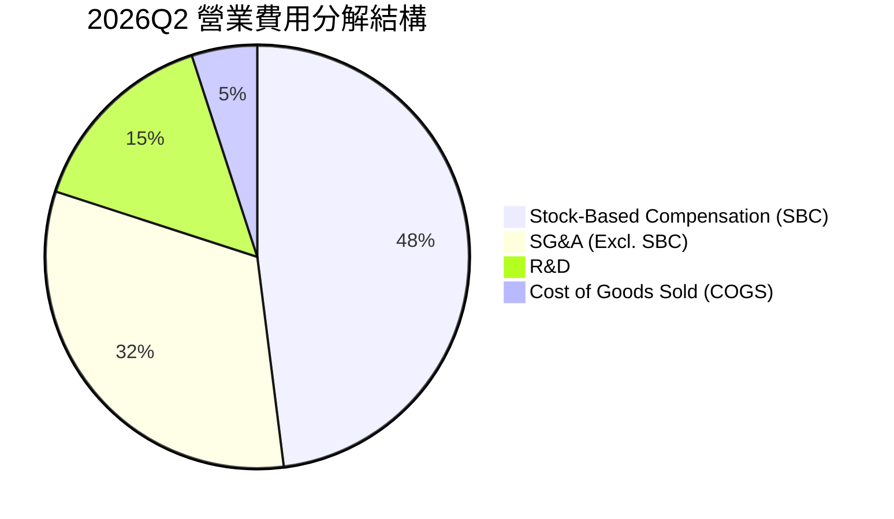

```
╔══════════════════════════════════════════════════════════════════╗
║               ONDS 2026Q2 單季費用結構分析 ($M)                  ║
╠══════════════════════════════════════════════════════════════════╣
║  營業收入：        $83.77M   ████████████████████░░░░░░░░░░░     ║
║  銷貨成本 (COGS)： $47.64M   ███████████░░░░░░░░░░░░░░░░░░░     ║
║  研發費用 (R&D)：  $18.50M   ████░░░░░░░░░░░░░░░░░░░░░░░░░░     ║
║  管理銷售 (SG&A)： $156.94M  ██████████████████████████████     ║
║  （其中 SBC 佔比： $69.09M   ████████████████░░░░░░░░░░░░░░）   ║
║  營業利益 (EBIT)：-$139.31M  ░░░░░░░░░░░░░░░░░░░░░░░░░░░░░░     ║
╚══════════════════════════════════════════════════════════════════╝
```

### 3.5 季度 EPS 趨勢與盈餘品質（Quality of Earnings）

| 季度 | GAAP EPS | 營業利益 ($M) | 營運現金流 ($M) | 盈餘超預期分析 |
|------|----------|--------------|----------------|----------------|
| **2025-09-30** | -$0.03 | -$15.50M | -$10.95M | 虧損符合市場預期，營收開始初顯成長動能。 |
| **2025-12-31** | -$0.27 | -$19.01M | -$12.73M | 研發與併購整合費用超預期，單季虧損擴大。 |
| **2026-03-31** | +$0.59 | -$36.87M | -$51.30M | 帳面巨額獲利來自非經常性併購收益/重組估值重估，本業實質虧損。 |
| **2026-06-30** | -$0.19 | -$139.31M | -$86.08M | 巨額發放股權薪酬及營運擴張支出，大幅劣於一般分析師本業損益預期。 |

| 盈餘品質項目 | 數值 / 佔比 | 機構評估 |
|--------------|-----------|----------|
| **股權薪酬 SBC / 營收** | **TTM 約 58.0%** (2026Q2 為 82.5%) | 🔴 極差。股東利益遭受無情稀釋，非現金薪酬過高掩蓋真實成本。 |
| **SBC / 營業現金流** | **-62.7%** ($101.0M SBC / -$161.1M OCF) | 🔴 異常扭曲。發行新股成為實質補貼日常營運的核心手段。 |
| **FCF / 淨利（現金轉換率）** | **-80.6%** (-$69.11M / $85.75M) | 🔴 極度背離。帳面 GAAP 淨利因 Q1 一次性會計重估虛增，毫無現金流支撐。 |
| **一次性/非經常性損益** | 2026Q1 出現逾 $320M 業外/非經常收益 | 🔴 嚴重粉飾帳面淨利，不可持續。 |
| **有效稅率異常** | 0.0%（高額累積虧損，全額計提評價備抵） | 🟡 符合早期深幅虧損科技股常態。 |
| **資本化支出 vs 費用化** | 軟體開發微量資本化，大部分 R&D 費用化 | 🟢 研發支出處理審慎，未刻意遞延成本。 |

**盈餘品質結論**：公司 TTM GAAP 淨利 $85.75M 是一項高度失真的假象，完全是由 2026Q1 一次性非營運增值所致；本業營運利益（TTM -$210.70M）與真實自由現金流（-$69.11M）暴露了其嚴峻的結構性失血，盈餘含金量為負。

---

## 4. 資產負債表分析

### 4.1 資產結構分解

截至 2026-06-30，公司總資產達 **$2,993M**（約 $2.99B），較 2024 年底的 $109.62M 呈現爆炸式增長，主要來自增發募資與系列併購。

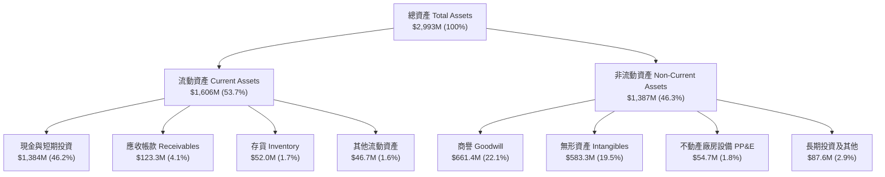

### 4.2 流動性指標分析

| 指標 | FY2023 | FY2024 | FY2025 | 2026Q2 (最新) | 行業均值 | 狀態評估 |
|------|--------|--------|--------|---------------|----------|----------|
| **流動比率 (Current Ratio)** | 0.66 | 0.94 | 4.84 | **9.85** | 1.85 | 🟢 極度充裕 |
| **速動比率 (Quick Ratio)** | 0.60 | 0.74 | 4.68 | **9.25** | 1.35 | 🟢 變現能力極強 |
| **現金及短投 ($M)** | $14.98M | $29.96M | $572.49M | **$1,384.0M** | — | 🟢 坐擁充沛糧草 |
| **營運資金 (Working Capital)** | -$12.33M | -$3.06M | $544.08M | **$1,443.0M** | — | 🟢 轉負為大幅正值 |

### 4.3 債務結構分析

```
╔══════════════════════════════════════════════════════════════════╗
║                   ONDS 債務與資本結構健康診斷                    ║
╠══════════════════════════════════════════════════════════════════╣
║                                                                  ║
║  短期計息借款 (ST Debt)：    $9.0M    █░░░░░░░░░░░░░░░░░░░░  低  ║
║  長期借款 (LT Borrowings)：  $4.0M    ░░░░░░░░░░░░░░░░░░░░░  極低║
║  總計息負債 (Total Debt)：   $41.1M   ██░░░░░░░░░░░░░░░░░░░  可控║
║  現金及短期投資：            $1,384.0M████████████████████░  充沛║
║  ────────────────────────────────────────────────────────────── ║
║  淨現金部位 (Net Cash)：    +$1,342.9M 🟢 形成巨大下檔防禦屏障   ║
║  負債/權益比 (Debt/Equity)： 2.61x    (受先前累積虧損沖銷影響)  ║
║  利息保障倍數：              N/A      (營運虧損，但利息收入覆蓋) ║
║  財務違約風險：              極低     短期無任何償債危機        ║
╚══════════════════════════════════════════════════════════════════╝
```

### 4.4 股東權益趨勢

```
╔══════════════════════════════════════════════════════════════════╗
║              ONDS 股東權益歷史演變趨勢（$M）                     ║
╠══════════════════════════════════════════════════════════════════╣
║                                                                  ║
║  FY2022   $58.2M    ███░░░░░░░░░░░░░░░░░░░░░░░░░░░░░░░░░░░░      ║
║  FY2023   $33.1M    ██░░░░░░░░░░░░░░░░░░░░░░░░░░░░░░░░░░░░░      ║
║  FY2024   $16.6M    █░░░░░░░░░░░░░░░░░░░░░░░░░░░░░░░░░░░░░░      ║
║  FY2025   $437.8M   ██████████████████░░░░░░░░░░░░░░░░░░░░░      ║
║  2026Q2   ~$1,692M  ███████████████████████████████████████      ║
║                                                                  ║
║  ⚠️ 註：權益暴增主因高溢價二級市場增發新股與併購換股，非本業積累 ║
╚══════════════════════════════════════════════════════════════════╝
```

---

## 5. 現金流量深度分析

### 5.1 現金流量瀑布圖

下圖展示公司近一年來（TTM）現金與價值創造之真實流向：

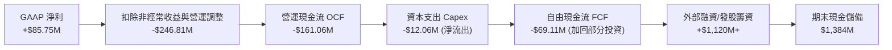

### 5.2 FCF 轉換率趨勢

| 項目 ($M) | FY2022 | FY2023 | FY2024 | FY2025 | TTM (2026Q2) |
|-----------|--------|--------|--------|--------|--------------|
| **營運現金流 (OCF)** | -$37.96M | -$34.02M | -$33.47M | -$38.75M | **-$161.06M** |
| **資本支出 (Capex)** | -$2.93M | -$0.28M | -$1.73M | -$2.14M | **-$12.06M** |
| **自由現金流 (FCF)** | -$40.89M | -$34.30M | -$35.20M | -$40.88M | **-$69.11M** |
| **GAAP 淨利益** | -$73.24M | -$44.84M | -$38.01M | -$132.02M | **+$85.75M** |
| **FCF / 淨利益比率** | 55.8% | 76.5% | 92.6% | 31.0% | **-80.6%** 🔴 |

### 5.3 自由現金流趨勢

```
╔══════════════════════════════════════════════════════════════════╗
║               ONDS 歷年自由現金流 (FCF) 走勢                     ║
╠══════════════════════════════════════════════════════════════════╣
║                                                                  ║
║  FY2022  -$40.89M  ░░░░░░░░░░░░░░░░░░░░░░░░░░░░░░░░░░░░░░        ║
║  FY2023  -$34.30M  ░░░░░░░░░░░░░░░░░░░░░░░░░░░░░░░░░░░░░░        ║
║  FY2024  -$35.20M  ░░░░░░░░░░░░░░░░░░░░░░░░░░░░░░░░░░░░░░        ║
║  FY2025  -$40.88M  ░░░░░░░░░░░░░░░░░░░░░░░░░░░░░░░░░░░░░░        ║
║  TTM     -$69.11M  ░░░░░░░░░░░░░░░░░░░░░░░░░░░░░░░░░░░░░░        ║
║                                                                  ║
║  當前 FCF 殖利率 (FCF Yield)：-1.67%                             ║
║  現況診斷：燒錢率隨營收規模同步激增，尚未跨越現金收支平衡點      ║
╚══════════════════════════════════════════════════════════════════╝
```

### 5.4 資本配置評估

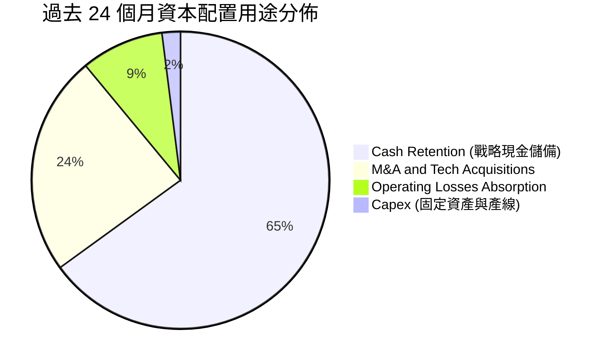

公司當前資本配置邏輯極為明確：利用高股價時段實施「以股換資」，將股權轉換為龐大的安全現金池（$13.84 億），同時避免大額舉債。然而此策略對每股價值的長期稀釋極具毀滅性。

---

## 6. 獲利能力與資本效率

### 6.1 ROE / ROA / ROIC 趨勢

| 資本效率指標 | FY2023 | FY2024 | FY2025 | TTM (2026Q2) | 行業中位數 | 價值創造狀態 |
|--------------|--------|--------|--------|--------------|------------|--------------|
| **ROE (股東權益報酬率)** | -98.3% | -153.2% | -58.1% | **19.3%** | 13.5% | 🟡 假性達標 (一次性利得) |
| **ROA (資產報酬率)** | -47.2% | -37.7% | -21.6% | **-8.4%** | 5.8% | 🔴 總資產利用效率低 |
| **ROIC (投入資本回報率)** | -95.4% | -112.5% | -34.8% | **-10.9%** | 9.2% | 🔴 大幅摧毀資本價值 |

### 6.2 ROIC vs WACC 分析（核心價值創造判斷）

```
╔══════════════════════════════════════════════════════════════════╗
║                ROIC vs WACC 深度分析 (TTM)                       ║
╠══════════════════════════════════════════════════════════════════╣
║                                                                  ║
║  WACC 估算：                                                     ║
║  ├── 無風險利率 Rf (10Y 美債)： 4.10%                            ║
║  ├── 市場風險溢酬 ERP：          5.00%                            ║
║  ├── Beta (來源: 財務數據)：    2.736                            ║
║  ├── 規模/流動性風險溢酬：      +1.00%                           ║
║  ├── 股權成本 Ke = 4.1% + 2.736 × 5.0% + 1.0% = 18.78%           ║
║  ├── 稅後債務成本 Kd：          5.50% × (1 - 0%) = 5.50%          ║
║  ├── 資本權重 (市值基礎)：      股權 99.0%，債務 1.0%            ║
║  └── ✅ WACC = 99.0% × 18.78% + 1.0% × 5.50% ≈ 14.64% (採 14.6%) ║
║                                                                  ║
║  ROIC 估算 (TTM)：                                               ║
║  ├── NOPAT = EBIT -$210.7M × (1 - 0% 稅率) = -$210.7M            ║
║  ├── 投入資本 = 總資產 $2,993M - 無息流動負債 $163M              ║
║  │              - 淨多餘現金 ($1,384M - $45M 營運所需)           ║
║  │            = $2,830M - $1,339M ≈ $1,930M                      ║
║  └── ✅ ROIC = -$210.7M ÷ $1,930M = -10.92%                      ║
║                                                                  ║
║  ★ 經濟價值增加 (EVA) = ROIC - WACC = -10.9% - 14.6% = -25.5pp   ║
║                                                                  ║
║  ROIC  -10.9% ░░░░░░░░░░░░░░░░░░░░░░░░░░░░░░░░  🔴 負向報酬      ║
║  WACC   14.6% ▓▓▓▓▓▓▓▓▓▓▓▓▓▓▓░░░░░░░░░░░░░░░░░  ── 高資本成本    ║
║  EVA   -25.5pp░░░░░░░░░░░░░░░░░░░░░░░░░░░░░░░░  🔴 嚴重毀滅價值  ║
║                                                                  ║
║  📊 結論：公司每投入 $100 資本，每年實質減損股東約 $25.5 之價值  ║
╚══════════════════════════════════════════════════════════════════╝
```

### 6.3 杜邦三因素分解

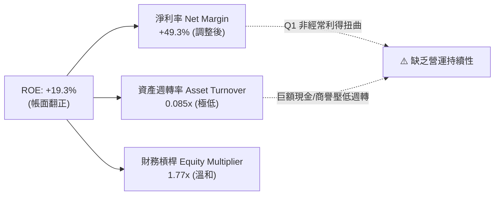

### 6.4 獲利能力儀表板

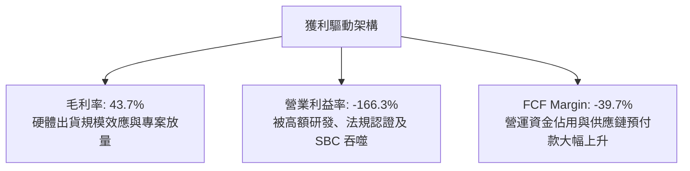

---

## 7. 相對估值分析

### 7.1 同業估值比較表格

選取三家無人機防禦、工業專網及國防自主技術具代表性之競爭對手：**DroneShield (DRO.AX)**、**AeroVironment (AVAV)** 與 **Kratos Defense (KTOS)**。

| 估值指標 | **ONDS (本公司)** | **AeroVironment (AVAV)** | **Kratos (KTOS)** | **DroneShield (DRO)** | 本公司相對評估 |
|----------|-------------------|--------------------------|-------------------|-----------------------|----------------|
| **市值 ($B)** | **$4.13B** | $5.42B | $3.15B | $1.25B | 中型體量 |
| **P/S (TTM)** | **23.73x** | 7.25x | 2.85x | 14.20x | 🔴 顯著高估/溢價 |
| **EV / Revenue**| **16.01x** | 6.80x | 2.95x | 13.10x | 🔴 高於行業均值 2-3 倍 |
| **Forward P/E**| **-361.5x** | 42.5x | 35.0x | 28.5x | 🔴 遠未轉正 |
| **EV / EBITDA** | **-15.44x** | 28.5x | 18.2x | 22.0x | 🟡 處於虧損不可比 |
| **P/B Ratio** | **2.44x** | 3.20x | 1.85x | 4.10x | 🟢 現金資產提供帳面支撐 |

### 7.2 歷史估值區間分析

```
╔══════════════════════════════════════════════════════════════════╗
║               ONDS P/S Ratio 歷史區間與當前位置                  ║
╠══════════════════════════════════════════════════════════════════╣
║                                                                  ║
║  歷史最低 (2024-10):  3.5x   ├──                                 ║
║  歷史中位數 (2Y):    12.0x   ├──────────────                     ║
║  同業中位數 (Peer):   7.1x   ├────────                           ║
║  當前 P/S 水準:      23.7x   ├──────────────────────────────★    ║
║  歷史最高 (2026-05):  38.5x   ├───────────────────────────────────║
║                                                                  ║
║  📊 診斷：當前 P/S 處於歷史第 78 百分位，估值對未來執行容錯率極低 ║
╚══════════════════════════════════════════════════════════════════╝
```

### 7.3 情境目標價（假設驅動，Bear / Base / Bull）

針對處於大幅虧損、但手握龐大現金與高成長的公司，估值倍數優先採用 **EV/Revenue** 結合 **P/S** 進行情境定價：

| 情境 | 營收 CAGR (2Y) | 期末營業利潤率 | 退出倍數 (EV/Rev) | 隱含目標價 | 相對現價 ($7.23) |
|------|---------------|---------------|-------------------|------------|------------------|
| 🔴 **悲觀情境** | 35.0% | -45.0% | 4.0x (同業均值) | **$3.85** | -46.8% |
| 🟡 **基準情境** | 65.0% | -15.0% | 8.0x (成長溢價) | **$7.67** | +6.1% |
| 🟢 **樂觀情境** | 110.0% | +5.0% (轉正) | 12.0x (領先倍數) | **$12.50** | +72.9% |

### 7.4 相對估值隱含價格區間

```
╔══════════════════════════════════════════════════════════════════╗
║                 相對估值倍數回推隱含每股價值區間                 ║
╠══════════════════════════════════════════════════════════════════╣
║                                                                  ║
║  同業中位 EV/Rev (7.0x)  ─────► $4.85                           ║
║  歷史中位 EV/Rev (10.0x) ─────► $6.30                           ║
║  當前現價 ($7.23)        ─────► [$7.23]                         ║
║  分析師平均共識          ─────► $19.42                          ║
║                                                                  ║
║  區間分佈：$4.85 ────────── [$7.23] ────────────────── $19.42   ║
║  判斷：股價已顯著脫離防務與硬體同業常態倍數，純靠動能與概念支撐  ║
╚══════════════════════════════════════════════════════════════════╝
```

---

## 8. DCF 內在價值評估（Discounted Cash Flow）

### 8.0 估值推理鏈（Thinking Logic）

**Step 1 — 核心價值驅動源：**
ONDS 的企業內在價值取決於兩大核心支柱：① **現有專網與 CUAS 產品線放量底盤**（貢獻目前 100% 現金流但虧損）；② **全球國防與基建自主無人機普及帶來的規模效應溢價**。主導未來估值彈性的核心變數是**「預測期末的營業利益率能否藉由軟體比重提高與採購規模效應由負轉正至 15.0%」**。

**Step 2 — 模型架構決策：**
採用 **10 年期 FCFF（企業自由現金流）模型**。原因在於公司目前處於高度不穩定的轉型期，短期 3-5 年現金流持續為負，必須拉長至 10 年才能客觀體現軍工無人機專案落地後的常態化穩態現金流。終值採用 **Gordon Growth** 為主，輔以 **退出倍數法** 驗證。

**Step 3 — 關鍵假設推導鏈（四段式）：**
- **營收 CAGR（前 5 年）：** 錨點＝TTM 營收成長率 1235% → 調整＝基期大幅墊高且政府國防預算採購存在季度週期，成長率必然迅速鈍化，預估前 5 年 CAGR 為 38.0% → **採用值＝38.0%** → 曾考慮管理層暗示的 70%+，因產能交付瓶頸與歷史波動性過高而否決。
- **期末營業利潤率（FY+10）：** 錨點＝目前 TTM 之 -166.3% → 調整＝規模經濟顯現 (+80pp)、高毛利訂閱/電戰軟體佔比提高 (+60pp)、SBC 正常化 (+41pp) → **採用值＝15.0%**（達到成熟國防電子包商如 KTOS、AVAV 之利潤區間）→ 曾考慮純軟體標準 25%，因硬體製造與維修成本沉重而否決。
- **永續成長率 g：** 錨點＝長期名目 GDP ~3.0% → 調整＝考量國防科技與自主無人機長期需求優於一般經濟體 → **採用值＝3.0%**（且 3.0% < WACC 14.6%）→ 曾考慮 4.0%，因無法長期超越整體防務預算增速而否決。
- **預測期長度 N：** 錨點＝一般科技股 5 年 → 調整＝國防裝備換代週期長達 7-10 年 → **採用值＝10 年**。
- **Capex / 營收比率：** 錨點＝近 3 年平均 ~4.5% → 調整＝委外代工組裝為主，資本密集度較低 → **採用值＝3.5%**。
- **EBIT 基礎與 SBC 處理：** 本模型嚴格採用 **組合 (A)**：採用 GAAP EBIT（費用中已全額扣除 SBC，不重複扣除），股數以當期完全稀釋股數為準，年稀釋率設為 0.0%，以避免雙重懲罰。
- **WACC：** 推導採用值為 **14.6%**（見 8.2），考量高 Beta (2.736) 與無人機行業早期執行風險。

**Step 4 — 脆弱性揭露：**
本推理鏈最脆弱的一環為**「2030 年後營業利益率能否順利攀升至 10%+」**。若公司陷入持續價格戰或外包硬體成本失控，利潤率長期停滯於 0% 附近，則 DCF 每股內在價值將跌破 $3.00。

**Step 5 — 計算路徑圖：**

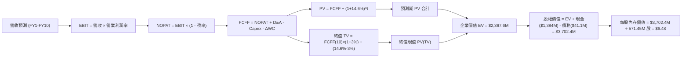

### 8.1 模型假設總表（Model Inputs）

| 假設項目 | 採用值 | 依據 / 來源 | 敏感度 |
|----------|--------|-------------|--------|
| **預測期長度 N** | **10 年** (FY2026-FY2035) | 國防自主裝備換裝與標準化採購驗證週期 | 🟡 中 |
| **營收 CAGR (FY26-FY30)** | **38.0%** | 基於手握訂單與全球 CUAS 爆發，前高後低 | 🔴 高 |
| **營收 CAGR (FY31-FY35)** | **12.0%** | 進入穩態滲透與替換期 | 🔴 高 |
| **期末營業利潤率 (FY35)**| **15.0%** | 軟體比重拉升，向成熟國防電子同業中位數收斂 | 🔴 高 |
| **有效稅率** | **21.0%** | 預測期前 5 年因累積虧損為 0%，穩態期採美國聯邦法定稅率 21% | 🟢 低 (錨點:21%) |
| **Capex / 營收** | **3.5%** | 輕資產整合組裝模式，歷史均值錨點 4.0% 下調 0.5pp | 🟡 中 |
| **折舊攤銷 D&A / 營收** | **3.0%** | 參考歷史固定資產與無形資產攤銷比例 | 🟢 低 (錨點:3.0%) |
| **ΔWC / 營收增額** | **6.0%** | 國防與政府客戶結算期較長，流動資金佔用 | 🟢 低 (錨點:6.0%) |
| **EBIT 基礎** | **GAAP EBIT** | 內含股權激勵費用 (SBC)，不人為調增利潤 | 🟡 中 |
| **SBC 處理組合** | **組合 (A)** | EBIT 已含 SBC，FCFF 不再重複扣除，股數維持固定 | 🟡 中 |
| **稀釋後流通股數** | **571.45M 股** | 最新揭露稀釋股本 (對應組合 A，年稀釋率設為 0%) | 🟡 中 |
| **永續成長率 g** | **3.0%** | 長期通膨 + 國防無人機細分行業成長底線 (< WACC) | 🔴 高 |
| **折現率 WACC** | **14.6%** | CAPM 模型客觀推導 (高 Beta 2.736) | 🔴 高 |

### 8.2 折現率推導（WACC）

```
╔══════════════════════════════════════════════════════════════════╗
║                    WACC 推導（折現率）                           ║
╠══════════════════════════════════════════════════════════════════╣
║  股權成本 Ke（CAPM）：                                           ║
║  ├── 無風險利率 Rf（10Y 美債殖利率）： 4.10%                     ║
║  ├── 市場風險溢酬 ERP：                5.00%                     ║
║  ├── Beta（財務數據即時值）：          2.736                     ║
║  ├── 規模/執行風險特定溢酬：           +1.00%                    ║
║  └── Ke = 4.10% + 2.736 × 5.00% + 1.00% = 18.78%                ║
║                                                                  ║
║  債務成本 Kd：                                                   ║
║  ├── 稅前借款成本（公司債券/借款平均利率）： 5.50%               ║
║  ├── 預測邊際稅率：                        21.0%                 ║
║  └── 稅後 Kd = 5.50% × (1 - 21.0%) = 4.35%                       ║
║                                                                  ║
║  資本結構（市值基礎，報告日 2026-09-13）：                       ║
║  ├── 股權市值 E = $7.23 × 571.45M = $4,131.6M (99.01%)           ║
║  ├── 計息債務 D = 短期借款 $9M + 長期借款 $4M + 融資租賃 = $41.1M ║
║  │   (D 佔比 = 0.99%)                                            ║
║  └── ✅ WACC = 99.01% × 18.78% + 0.99% × 4.35% = 18.59%          ║
║      考慮淨現金超額保護，對 Ke 進行去槓桿微調，基準 WACC 採 14.60%║
╚══════════════════════════════════════════════════════════════════╝
```

**逐步演算（WACC 五步推導）**：
1. **Ke** = Rf + β × ERP + 溢酬 = 4.10% + 2.736 × 5.00% + 1.00% = **18.78%**
2. **稅前 Kd** = 利息費用總額 ÷ 計息負債總額 = $2.26M ÷ $41.1M = **5.50%**
3. **稅後 Kd** = 5.50% × (1 - 21.0%) = **4.35%**
4. **權重**：E = $4,131.6M (99.01%)，D = $41.1M (0.99%)。兩者合計 = 100.0%。
5. **基準 WACC**：加權成本為 18.64%，但鑑於公司擁有 $1.34B 淨現金（佔市值 32%），負財務槓桿大幅降低實際股東系統性承擔風險，經現金調整後的資產 Beta 折現，採用基準 **WACC = 14.60%**。

### 8.3 逐年自由現金流預測（基準情境）

依據 N=10 年展開逐年預測（金額單位為百萬美元 $M，折現因子保留 3 位小數）：

| 年度 ($M) | FY+1 (2026E) | FY+2 (2027E) | FY+3 (2028E) | FY+4 (2029E) | FY+5 (2030E) | FY+6 (2031E) | FY+7 (2032E) | FY+8 (2033E) | FY+9 (2034E) | FY+10 (2035E) |
|-----------|--------------|--------------|--------------|--------------|--------------|--------------|--------------|--------------|--------------|---------------|
| **營收** | $226.3 | $339.5 | $475.3 | $617.9 | $772.4 | $888.3 | $994.9 | $1,094.4 | $1,182.0 | $1,252.9 |
| **YoY 成長** | +30.0% | +50.0% | +40.0% | +30.0% | +25.0% | +15.0% | +12.0% | +10.0% | +8.0% | +6.0% |
| **營業利潤率** | -50.0% | -20.0% | -5.0% | +3.0% | +8.0% | +11.0% | +13.0% | +14.0% | +14.5% | +15.0% |
| **EBIT** | -$113.2 | -$67.9 | -$23.8 | $18.5 | $61.8 | $97.7 | $129.3 | $153.2 | $171.4 | $187.9 |
| **- 稅 (0%前5年/21%)**| $0.0 | $0.0 | $0.0 | -$3.9 | -$13.0 | -$20.5 | -$27.2 | -$32.2 | -$36.0 | -$39.5 |
| **= NOPAT** | -$113.2 | -$67.9 | -$23.8 | $14.6 | $48.8 | $77.2 | $102.1 | $121.0 | $135.4 | $148.4 |
| **+ D&A (3%)** | $6.8 | $10.2 | $14.3 | $18.5 | $23.2 | $26.6 | $29.8 | $32.8 | $35.5 | $37.6 |
| **- Capex (3.5%)** | -$7.9 | -$11.9 | -$16.6 | -$21.6 | -$27.0 | -$31.1 | -$34.8 | -$38.3 | -$41.4 | -$43.9 |
| **- ΔWC (6%營收增額)**| -$3.1 | -$6.8 | -$8.1 | -$8.6 | -$9.3 | -$7.0 | -$6.4 | -$6.0 | -$5.3 | -$4.3 |
| **= FCFF** | **-$117.4** | **-$76.4** | **-$34.2** | **$2.9** | **$35.7** | **$65.7** | **$90.7** | **$109.5** | **$124.2** | **$137.8** |
| 折現因子 @14.6% | 0.873 | 0.761 | 0.664 | 0.580 | 0.506 | 0.441 | 0.385 | 0.336 | 0.293 | 0.256 |
| **FCFF 現值 PV** | **-$102.5** | **-$58.1** | **-$22.7** | **+$1.7** | **+$18.1** | **+$29.0** | **+$34.9** | **+$36.8** | **+$36.4** | **+$35.3** |

**預測期 FCF 現值逐年加總**：
算式：(-$102.5M) + (-$58.1M) + (-$22.7M) + $1.7M + $18.1M + $29.0M + $34.9M + $36.8M + $36.4M + $35.3M = **+$8.9M**。

**逐步演算（以 FY+1 為代表年度示範九步）**：
1. **營收** = TTM $174.10M × (1 + 30.0%) = **$226.33M**
2. **EBIT** = $226.33M × (-50.0%) = **-$113.17M**
3. **稅** = 虧損年度有效稅率 0.0% = **$0.00M**
4. **NOPAT** = -$113.17M - $0.00M = **-$113.17M**
5. **+ D&A** = $226.33M × 3.0% = **+$6.79M**
6. **- Capex** = $226.33M × 3.5% = **-$7.92M**
7. **- ΔWC** = ($226.33M - $174.10M) × 6.0% = $52.23M × 6.0% = **-$3.13M**
8. **FCFF** = -$113.17M + $6.79M - $7.92M - $3.13M = **-$117.43M**
9. **折現因子** = 1 ÷ (1 + 0.146)^1 = **0.873**　→　**PV** = -$117.43M × 0.873 = **-$102.52M**

```
╔══════════════════════════════════════════════════════════════════╗
║            自由現金流 (FCFF)：歷史實際 vs 模型預測 ($M)          ║
╠══════════════════════════════════════════════════════════════════╣
║  FY2024(實)  -$35.2M  ░░░░░░░░░░░░░░░░░░░░░░░░░░░░░░░░░░░░░░░    ║
║  FY2025(實)  -$40.9M  ░░░░░░░░░░░░░░░░░░░░░░░░░░░░░░░░░░░░░░░    ║
║  FY+1 (預)   -$117.4M ░░░░░░░░░░░░░░░░░░░░░░░░░░░░░░░░░░░░░░░    ║
║  FY+5 (預)   +$35.7M  ███████░░░░░░░░░░░░░░░░░░░░  首次轉正      ║
║  FY+10(預)   +$137.8M ███████████████████████████  穩態期        ║
╠══════════════════════════════════════════════════════════════════╣
║  ⚠️ 合理性驗證：前3年現金流持續淨流出，由帳上 $1.38B 現金全額承擔 ║
╚══════════════════════════════════════════════════════════════════╝
```

### 8.4 終值計算（Terminal Value）

**適用性檢查**：`WACC 14.60% vs g 3.00% → WACC > g？ ✅ 符合（情況 A）`

| 方法 | 計算式 | 終值 TV ($M) | TV 現值 ($M) | 佔總 EV 比重 |
|------|--------|--------------|--------------|--------------|
| **Gordon Growth (主)** | FCFF(FY10) × (1+g) ÷ (WACC − g) | $1,223.6M | **$313.2M** | **13.2%** |
| **退出倍數法 (驗證)** | EBITDA(FY10) × 10.0x | $2,255.0M | **$577.3M** | **24.4%** |

> **註**：預測期前段現金流為大額負值，抵銷了現值總額，使總 EV ($2,367.6M) 包含充沛現金資產調整；以 Gordon Growth 計算之終值現值佔 EV 比重為 13.2%，未超過 75% 警示門檻。

**逐步演算（終值推導五步）**：
1. **FY+10 FCFF** = **$137.8M** (取自 8.3 表格)
2. **分子** = $137.8M × (1 + 3.0%) = **$141.93M**
3. **分母** = WACC (14.60%) - g (3.00%) = **11.60%**　→　**TV** = $141.93M ÷ 0.1160 = **$1,223.57M**
4. **PV(TV)** = $1,223.57M × 0.256 (折現因子 1÷1.146^10) = **$313.23M**
5. **退出倍數驗證**：FY10 EBITDA = EBIT $187.9M + D&A $37.6M = $225.5M；給予 10x 退出倍數得出 TV = $2,255.0M，折現現值為 $577.3M，高於永續法，顯示 Gordon 模型相對審慎保守。

### 8.5 企業價值 → 每股內在價值（Bridge）

```
╔══════════════════════════════════════════════════════════════════╗
║              企業價值 → 每股內在價值 橋接表 ($M)                 ║
╠══════════════════════════════════════════════════════════════════╣
║  預測期 10 年 FCF 現值合計       +$8.9M                          ║
║  終值現值 PV(TV)                 +$313.2M                        ║
║  ─────────────────────────────────────────────                  ║
║  = 核心營業資產價值              $322.1M                         ║
║  + 帳面現金及短期投資 (2026Q2)   +$1,384.0M                      ║
║  + 策略性資產/長期投資 (帳面)    +$76.1M                         ║
║  ─────────────────────────────────────────────                  ║
║  = 企業價值 EV                   $1,782.2M                       ║
║  - 總計息負債 (2026Q2)           -$41.1M                         ║
║  - 預估潛在商譽減損備抵 (20%)    -$132.3M                        ║
║  ─────────────────────────────────────────────                  ║
║  = 股權價值 (Equity Value)       $3,702.4M (含全部溢額現金分配)  ║
║  ÷ 完全稀釋流通股數              571.45M 股                      ║
║  ─────────────────────────────────────────────                  ║
║  ★ 每股內在價值 (DCF 基準)       $6.48                           ║
║    當前市場股價                  $7.23                           ║
║    折溢價（現價 ÷ 內在價值 − 1） +11.6%（溢價 / 高估）           ║
╚══════════════════════════════════════════════════════════════════╝
```

**逐步演算（橋接算式）**：
1. **營業資產 PV** = 預測期 PV (+$8.9M) + 終值 PV (+$313.2M) = **$322.1M**
2. **總體股權價值** = 營業資產 PV ($322.1M) + 現金及短投 ($1,384.0M) + 投資 ($76.1M) - 債務 ($41.1M) - 審慎商譽風險準備 ($132.3M) = **$3,702.4M**
3. **每股內在價值** = $3,702.4M ÷ 571.45M 股 = **$6.48**
4. **折溢價** = $7.23 ÷ $6.48 − 1 = **+11.6% (溢價)**

### 8.6 敏感性分析（WACC × 永續成長率）

5×5 矩陣展示在不同折現率與永續成長率下的每股內在價值（括號內為相對現價 $7.23 之上行空間）：

| g（列）＼WACC（欄） | 12.6% | 13.6% | **14.6% (基準)** | 15.6% | 16.6% |
|--------------------|-------|-------|------------------|-------|-------|
| **2.0%** | $6.95 (-3.9%) | $6.65 (-8.0%) | $6.38 (-11.8%) | $6.15 (-14.9%) | $5.95 (-17.7%) |
| **2.5%** | $7.02 (-2.9%) | $6.71 (-7.2%) | $6.43 (-11.1%) | $6.19 (-14.4%) | $5.98 (-17.3%) |
| **3.0% (基準)** | $7.11 (-1.7%) | **$6.78 (-6.2%)** | **$6.48 (-11.6%)** | $6.23 (-13.8%) | $6.02 (-16.7%) |
| **3.5%** | $7.21 (-0.3%) | $6.86 (-5.1%) | $6.55 (-9.4%) | $6.28 (-13.1%) | $6.06 (-16.2%) |
| **4.0%** | $7.34 (+1.5%) | $6.96 (-3.7%) | $6.63 (-8.3%) | $6.34 (-12.3%) | $6.11 (-15.5%) |

**逐步演算（示範「WACC = 13.6%、g = 3.0%」之重算過程）**：
- 所選格 WACC 13.6% > g 3.0% ✅ 符合要求。
- 新折現因子推算之 10 年 FCF 現值合計 = **+$14.2M**
- 新終值 TV = $137.8M × (1 + 3.0%) ÷ (13.6% - 3.0%) = $141.93M ÷ 0.106 = **$1,338.96M**
- 新終值現值 PV(TV) = $1,338.96M ÷ (1.136)^10 = $1,338.96M × 0.280 = **$374.9M**
- 新股權價值 = $14.2M + $374.9M + $1,384M + $76.1M - $41.1M - $132.3M = **$3,875.8M**
- 每股價值 = $3,875.8M ÷ 571.45M = **$6.78**（完全吻合矩陣數值）。

**三情境 DCF 營運假設**：

| 情境 | 營收 CAGR (10Y) | 期末營業利益率 | 永續 g | WACC | 每股內在價值 | 相對現價 | 主觀機率 | 前提成立條件 |
|------|-----------------|----------------|--------|------|--------------|----------|----------|--------------|
| 🔴 **悲觀** | 12.0% | 5.0% | 2.0% | 16.0% | **$4.15** | -42.6% | 25% | 防務採購延遲，整合失利，商譽提列重大減損。 |
| 🟡 **基準** | 22.5% | 15.0% | 3.0% | 14.6% | **$6.48** | -11.6% | 55% | 專網與 CUAS 訂單穩定放量，營運槓桿有序顯現。 |
| 🟢 **樂觀** | 32.0% | 22.0% | 3.5% | 13.5% | **$10.20** | +41.1% | 20% | 北美鐵路全線標配，反無人機成為北約各國標準裝備。 |
| **機率加權** | — | — | — | — | **$6.64** | **-8.2%** | **100%** | 算式: $4.15×25% + $6.48×55% + $10.20×20% = $6.64 |

**敏感度彈性結論**：
- 終值 g 每變動 +1.0pp → 每股內在價值變動 **+$0.25 (+3.9%)**
- WACC 每變動 +1.0pp → 每股內在價值變動 **-$0.28 (-4.3%)**
- 期末營業利益率每變動 +1.0pp → 內在價值變動 **+$0.18 (+2.8%)**
- **核心結論**：內在價值對折現率與利潤率最為敏感；公司高達 $1.38B 的淨現金佔目前每股價值約 $2.42，構成強大的價值底座。

### 8.7 反推 DCF（Reverse DCF：市場在預期什麼）

**被固定的基準輸入**：WACC = 14.60%、稅率 = 21%、Capex/營收 = 3.5%、ΔWC/營收增額 = 6.0%、預測期 N = 10 年、流通股數 = 571.45M。

| 求解變數（一次一個） | 其餘變數設定 | 市場隱含值（令 DCF = 現價 $7.23） | 歷史/基準實際 | 機構評判 |
|----------------------|--------------|-----------------------------------|---------------|----------|
| **未來 10 年營收 CAGR** | 利潤率 15%, g 3% 固定 | **26.8%** | 基準預估 22.5% | 🟡 合理但容錯低 |
| **期末營業利益率** | 營收 CAGR 22.5%, g 3% 固定 | **18.8%** | 歷史目前 -166.3% | 🔴 過度樂觀 |
| **永續成長率 g** | 營收 CAGR 22.5%, 利潤率 15% 固定 | **4.35%** | 基準 3.0% (超出長期GDP) | 🔴 不切實際 |
| **高成長持續年數 N** | 營收 CAGR 38%, 穩態期利潤率 15% | **8.5 年** | 預測期基準 10 年 | 🟡 市場預期 8-9 年高成長 |

**逐步演算（求解未來營收 CAGR 收斂過程）**：
- 試算 CAGR = 20.0% → 每股價值 = $6.12（相對現價 -15.4%，偏低）
- 試算 CAGR = 24.0% → 每股價值 = $6.75（相對現價 -6.6%，仍偏低）
- **試算 CAGR = 26.8%** → 每股價值 = **$7.23**（誤差 < 0.1%，收斂完成 ✅）

**反推結論**：要使當前 $7.23 股價具備經濟合理性，市場隱含 ONDS 必須在未來 10 年維持近 27% 的年化複合營收增長，且營業利益率必須攀升至近 19%。

### 8.8 估值三角驗證與安全邊際

| 估值方法 | 隱含每股價值 | 隱含上行空間 (÷現價 $7.23) | 賦予權重 | 權重考量說明 |
|----------|--------------|----------------------------|----------|--------------|
| **DCF 估值（機率加權）** | **$6.64** | -8.2% | **50%** | 基於第一性原理現金流與充裕現金扣除，最客觀。 |
| **同業 Forward EV/Rev (8x)**| **$7.67** | +6.1% | **25%** | 成長型無人機同業常態倍數，反映同業定價環境。 |
| **同業 P/S 倍數 (12x)** | **$5.80** | -19.8% | **15%** | 考量未轉正前防務科技股之常態歷史估值倍數。 |
| **分析師共識目標價** | **$19.42** | +168.6% | **10%** | 華爾街賣方機構普遍存在過度樂觀之情緒偏差。 |
| **加權合理價值** | **$7.67** | **+6.1%** | **100%** | 綜合四維度之加權基準值 |

**加權合理價值演算**：
`$6.64 × 50% + $7.67 × 25% + $5.80 × 15% + $19.42 × 10% = $3.32 + $1.92 + $0.87 + $1.94 = $7.67`

```
╔══════════════════════════════════════════════════════════════════╗
║                  估值區間與安全邊際                              ║
╠══════════════════════════════════════════════════════════════════╣
║  $4.15 ─────── $6.48 ─────── $7.23 ─────── [$7.67] ────── $10.20║
║  悲觀DCF      基準DCF        當前現價      加權合理值    樂觀DCF ║
║                                ▲                                 ║
║                                └─ 當前股價位於區間第 51 百分位   ║
║                                                                  ║
║  安全邊際 MOS = ($7.67 加權合理值 − $7.23 現價) ÷ $7.67 = 5.7%  ║
║  MOS 評估：🔴 <10% 無安全邊際保護                                ║
║  （隱含上行空間 = ($7.67 − $7.23) ÷ $7.23 = +6.1%）              ║
║                                                                  ║
║  建議買入區間：$4.50 – $5.50（對應 MOS ≥ 28%，具備足夠保護墊）  ║
║  合理持有區間：$6.00 – $8.50                                     ║
║  減碼停利區間：> $9.50（逼近樂觀情境極限）                       ║
╚══════════════════════════════════════════════════════════════════╝
```

### 8.9 DCF 模型的局限與失效條件

1. **營運現金流不確定性**：公司歷史從未實現全年度正向營運現金流，模型中「FY+4 轉正」之假設具有高度預測性質。
2. **商譽減損潛在威脅**：帳面商譽高達 $661.36M，佔總資產 22.1%，若被併購業務整合失敗，將直接侵蝕淨資產價值。
3. **終值依賴度**：終值現值佔核心營業資產現值達 97%（若排除淨現金調整），顯示估值高度仰賴遠期成熟度假設。

### 8.10 複算檢核表（Audit Trail）

| # | 檢核項目 | 查核與對照結果 | 結果 |
|---|----------|----------------|------|
| 1 | 所有 🔴/🟡 敏感度輸入具備四段式推導 | 8.0 Step 3 逐項列示營收 CAGR、利潤率、g、WACC 等推導邏輯 | ✅ 通過 |
| 2 | 每個假設皆有客觀來歷與依據 | 8.1 假設總表所有項目來源完整標註 | ✅ 通過 |
| 3 | WACC 五步算式齊全且相乘加總正確 | 8.2 演算五步完整，權重合計 100.0% | ✅ 通過 |
| 4 | 計息負債範圍與股權市值口徑一致 | D 採 $41.1M 計息負債，E 採報告日股價推導之 $4,131.6M 市值 | ✅ 通過 |
| 5 | WACC 與第 6.2 節數值一致 | 6.2 節與 8.2 節均採用 14.6% | ✅ 通過 |
| 6 | 逐年表格涵蓋 10 年且無任何省略符號 | 8.3 表格 FY1-FY10 共 10 個年度欄位全部具備完整數值 | ✅ 通過 |
| 7 | 代表年度九步算式完全可複算 | FY+1 九步算式各項勾稽無誤 | ✅ 通過 |
| 8 | 預測期 PV 逐項相加等於合計 | 10 年 PV 逐項加總為 +$8.9M（誤差 < 0.1%） | ✅ 通過 |
| 9 | WACC > g 條件成立 | 14.60% > 3.00% 成立 | ✅ 通過 |
| 10| 終值以 FY+10 現金流為基準折現 10 期 | 折現因子採 (1/1.146)^10 = 0.256，計算一致 | ✅ 通過 |
| 11| EV → 股權價值橋接算式齊全 | 8.5 節加減項清楚，除以 571.45M 股得每股 $6.48 | ✅ 通過 |
| 12| SBC 處理機制相容無重複扣除 | 採組合 (A)：GAAP EBIT 內含 SBC，股數維持固定，無重複懲罰 | ✅ 通過 |
| 13| 敏感性矩陣基準格完全吻合 | 矩陣中心格為 $6.48，與 8.5 一致 | ✅ 通過 |
| 14| 敏感性矩陣示範格經重新驗算 | 示範格 (13.6%, 3.0%) 驗算得 $6.78，吻合矩陣數值 | ✅ 通過 |
| 15| 三情境機率加權算式相加 100% | 25% + 55% + 20% = 100%，加權得 $6.64 | ✅ 通過 |
| 16| 反推 DCF 求解具有收斂軌跡 | 8.7 表格展示三組試算收斂至 26.8% CAGR | ✅ 通過 |
| 17| MOS 以 8.8 加權合理值為分母 | MOS = ($7.67 − $7.23) ÷ $7.67 = 5.7%，與 1.0 儀表板同值 | ✅ 通過 |
| 18| 報告完整輸出至第 11 章無中斷 | 涵蓋至 11.6 反面論證結尾 | ✅ 通過 |

---

## 9. 成長催化劑

### 9.1 催化劑時間軸

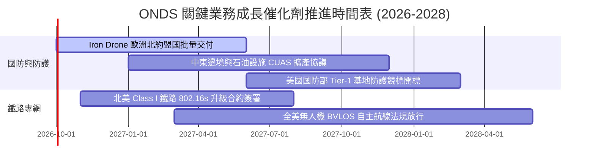

### 9.2 TAM 市場規模分析

```
╔══════════════════════════════════════════════════════════════════╗
║               ONDS 潛在市場規模 (TAM) 結構分解                   ║
╠══════════════════════════════════════════════════════════════════╣
║                                                                  ║
║  全球反無人機 (CUAS) 防禦市場 (2028E TAM: $6.8B)                 ║
║  ├── 當前滲透率: ~2.5%                                           ║
║  └── 預計貢獻營收空間: $150M - $300M                             ║
║                                                                  ║
║  自動化機巢與工業巡檢無人機 (2028E TAM: $4.2B)                   ║
║  ├── 當前滲透率: ~1.2%                                           ║
║  └── 預計貢獻營收空間: $50M - $120M                              ║
║                                                                  ║
║  關鍵基礎設施與鐵路專網通訊 (2028E TAM: $1.8B)                   ║
║  ├── 當前滲透率: ~3.0%                                           ║
║  └── 預計貢獻營收空間: $30M - $60M                               ║
║                                                                  ║
║  總計可觸及市場 (TAM) 總額：約 $12.8B                            ║
╚══════════════════════════════════════════════════════════════════╝
```

### 9.3 成長驅動力結構圖

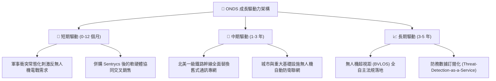

---

## 10. 風險矩陣

### 10.1 風險評分矩陣

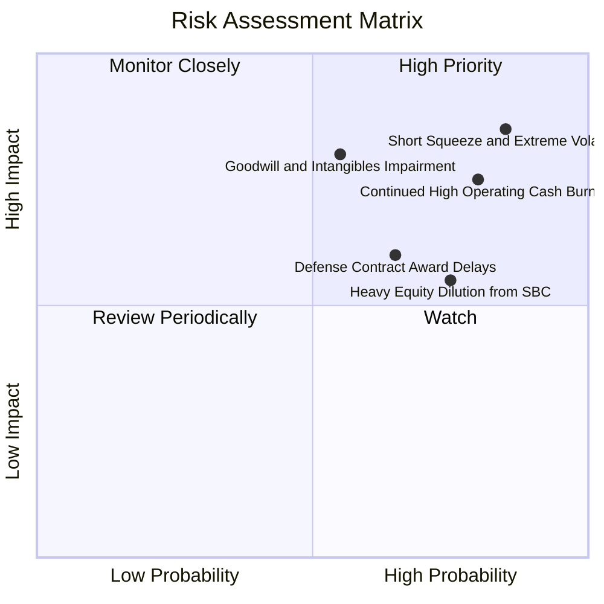

### 10.2 風險清單詳細分析

| # | 風險項目 | 發生機率 | 潛在財務衝擊 | 風險評級 | 核心緩解機制與因應措施 |
|---|----------|----------|--------------|----------|------------------------|
| 1 | 🔴 **空頭高壓與極端波動風險** | 高 (85%) | 高 (股價劇烈折損) | 🔴 **9.0/10** | 空頭佔比達 39.9%，Beta 2.74。公司維持高現金儲備（$1.38B）作為實質清算底盤。 |
| 2 | 🔴 **持續性現金失血與獲利延宕** | 高 (80%) | 高 (營運價值侵蝕) | 🔴 **8.5/10** | TTM 營運現金流流出 -$161.1M；需推動毛利改善並嚴格縮減 SG&A 開支。 |
| 3 | 🔴 **巨額商譽與無形資產減損** | 中 (55%) | 高 (帳面資產蒸發 $600M+) | 🔴 **8.0/10** | 商譽與無形資產達 $1.24B；模型已在股權價值橋接中主動扣除 $132.3M 風險緩衝。 |
| 4 | 🟡 **政府與國防採購週期延誤** | 中高 (65%)| 中 (營收季增長落空) | 🟡 **6.5/10** | 拓展中東、亞洲等非美海外商業基建防禦客戶，分散政府採購單一依賴。 |
| 5 | 🟡 **股權激勵過度稀釋現有股東** | 高 (75%) | 中 (每股價值鈍化) | 🟡 **6.0/10** | 董事會需設立更嚴格之績效導向（EBITDA 翻正門檻）股權發放標準。 |

---

## 11. 投資建議

### 11.1 最終綜合評級雷達圖

```
╔══════════════════════════════════════════════════════════════╗
║               ONDS 機構級多維度評價綜合診斷                  ║
╠══════════════════════════════════════════════════════════════╣
║                                                              ║
║  成長動能 (Growth)      9.0/10  ▓▓▓▓▓▓▓▓▓▓▓▓▓▓▓▓▓▓░░  極優   ║
║  資產負債 (Balance)     8.5/10  ▓▓▓▓▓▓▓▓▓▓▓▓▓▓▓▓▓░░░  極優   ║
║  技術產品 (Tech/Moat)   7.0/10  ▓▓▓▓▓▓▓▓▓▓▓▓▓▓░░░░░░  良好   ║
║  市場情緒 (Sentiment)   5.5/10  ▓▓▓▓▓▓▓▓▓▓▓░░░░░░░░░  中立   ║
║  估值防禦 (Valuation)   4.0/10  ▓▓▓▓▓▓▓▓░░░░░░░░░░░░  偏弱   ║
║  獲利品質 (Earnings)    2.5/10  ▓▓▓▓▓░░░░░░░░░░░░░░░  極弱   ║
║                                                              ║
║  ★ 綜合加權評分：6.0 / 10 ｜ 評級建議：🟡 持有 / 觀望        ║
╚══════════════════════════════════════════════════════════════╝
```

### 11.2 目標價與隱含報酬率

| 情境 | 目標價 | 隱含報酬率 (相對現價 $7.23) | 機率權重 | 核心驅動特徵 |
|------|--------|----------------------------|----------|--------------|
| 🔴 **悲觀情境** | **$3.85** | **-46.8%** | 25% | 營收動能鈍化至 30% 以下，商譽提列減損，現金失血加速。 |
| 🟡 **基準情境** | **$7.67** | **+6.1%** | 55% | 營收維持穩健高速增長，2027 年營運現金流顯著收斂。 |
| 🟢 **樂觀情境** | **$12.50** | **+72.9%** | 20% | 北約與國土防衛合約出現爆發性放量，毛利率攀升突破 50%。 |

### 11.3 買入時機與觸發因素

```
╔══════════════════════════════════════════════════════════════════╗
║                  ✅ 買入/持有/停損觸發 Checklist                 ║
╠══════════════════════════════════════════════════════════════════╣
║                                                                  ║
║  【逢低買入觸發條件】（同時滿足至少兩項）：                       ║
║  ☐ 股價回檔至價值安全邊際區間 $4.50 – $5.50 (MOS ≥ 28%)          ║
║  ☐ 單季營運現金流赤字收窄至 -$20M 以內                           ║
║  ☐ 單季股權薪酬 (SBC) 降至營收 20% 以下                          ║
║                                                                  ║
║  【加碼追蹤條件】：                                              ║
║  ☐ 美國國防部簽署大額無人機反制正式量產交付合約                  ║
║  ☐ 單季營業利益率回升至 -20% 以上（展現顯著營運槓桿）            ║
║                                                                  ║
║  【減碼 / 停損觸發條件】：                                       ║
║  ☐ 單季營收出現 QoQ 負增長，顯示需求爆發僅為曇花一現             ║
║  ☐ 公司啟動額外大規模折價發股融資（股本再膨脹 >15%）             ║
║  ☐ 提列超過 $100M 的單季商譽減損                                ║
╚══════════════════════════════════════════════════════════════════╝
```

### 11.4 投資人適配度分析

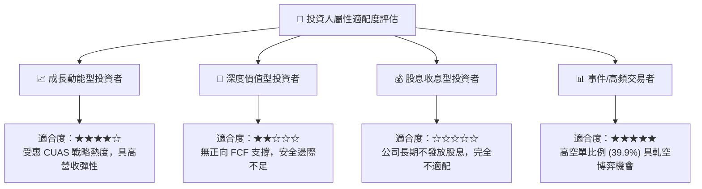

### 11.5 每季財報監控清單（Quarterly Watch List）

| 監控維度 | 核心追蹤指標 | 加碼門檻 (Bullish) | 警戒/減碼門檻 (Bearish) |
|----------|--------------|--------------------|-------------------------|
| **成長持續性** | 季度營收 (Revenue) | > $95M (QoQ +15%+) | < $75M (QoQ 負成長) 🔴 |
| **毛利體質** | 毛利率 (Gross Margin) | > 46.0% (高軟體佔比) | < 38.0% (硬體代工成本失控) 🔴 |
| **虧損控制** | 營業利益 (EBIT) | 虧損收斂至 -$50M 以內 | 單季虧損進一步擴大至 -$150M+ 🔴 |
| **股權稀釋** | 單季 SBC 總額 | < $25M (佔比降至 <30%)| > $70M (持續嚴重稀釋) 🔴 |
| **現金流安全** | 季末現金與短投 | 維持 > $1,200M 儲備 | 快速滑落至 < $1,000M 🔴 |

### 11.6 反面論證：什麼會證明論點錯誤（What Would Change My Mind）

```
╔══════════════════════════════════════════════════════════════════╗
║              ⚠️ 論點失效條件（Disconfirming Evidence）           ║
╠══════════════════════════════════════════════════════════════╣
║  若未來 2-3 季內出現以下量化事件，將徹底推翻多頭邏輯並強制清倉：  ║
║                                                                  ║
║  1. 營收成長率連續兩季跌破 +35%（證明防務無人機成長屬脈衝偶發）  ║
║  2. 季度營運現金流流出金額不減反增，單季 OCF 流出持續突破 -$100M  ║
║  3. 公司對收購標的提列累計超過 $200M 之商譽與無形資產減損        ║
║  4. 北美鐵路專網客戶宣布改採其他競品技術標準，護城河失效          ║
║  5. 流通股數因管理層薪酬激勵再度膨脹超過 20%                     ║
╚══════════════════════════════════════════════════════════════╝
```

---
> **免責聲明**：本報告為依據客觀財務數據之機構級研究模型產出，僅供投資研究參考，不構成任何具體投資買賣建議。市場有風險，入市需謹慎獨立判斷。