# ONDS 基本面深度分析報告
> **報告日期**：2026-09-18 ｜ **語言**：繁體中文 ｜ **數據來源**：Yahoo Finance, Finviz, StockAnalysis, Roic.ai ｜ **分析師**：CFA 級機構研究

---

## 目錄

| # | 章節 | 核心結論 |
|---|------|----------|
| 1 | 執行摘要 | 評級「買入（投機型成長）」；加權合理價值 $11.85；MOS 37.6%；12M 目標價 $12.50 |
| 2 | 公司概覽與商業模式 | 無人機防禦（CUAS）與專網通訊雙輪驅動，鐵穹級技術與反制專案構築早期護城河（6.4/10） |
| 3 | 損益表深度分析 | TTM 營收 $174.10M（YoY +1235.4%），惟 SBC 與研發推升營業虧損至 -$210.7M，盈餘品質極低 |
| 4 | 資產負債表分析 | 總現金高達 $1.38B，總負債僅 $41.10M，淨現金 $1.34B 構築極度充裕之流動性護盾 |
| 5 | 現金流量深度分析 | TTM 營運現金流 -$161.06M、FCF -$69.11M，高強度股權融資支撐現金儲備，資本稀釋風險顯著 |
| 6 | 獲利能力與資本效率 | TTM ROIC 為 -14.6% vs WACC 14.39%（EVA 為 -29.0pp），營運尚處嚴重摧毀股東價值之早期階段 |
| 7 | 相對估值分析 | EV/Sales 為 16.53x、P/S 為 24.72x，相對防務電子同業溢價高達 200%+，全仰賴極端高成長消化 |
| 8 | DCF 內在價值評估 | 基準每股內在價值 $10.95（折價 32.5%）；三角加權合理價值 $11.85，安全邊際 MOS 為 37.6% |
| 9 | 成長催化劑 | 國防反無人機（CUAS）採購放量、一級鐵路通訊全面升級、跨國邊境防衛合約為核心催化劑 |
| 10 | 風險矩陣 | 空頭部位高達 39.9%、股權稀釋（流通股 582.29M）、合約認列波動為最核心三大風險 |
| 11 | 投資建議 | 買入區間 $6.50–$7.50，基準 12M 目標價 $12.50（隱含上行空間 +69.1%），適合高風險偏好成長型投資人 |

---

## 1. 執行摘要

本評級建立於公司極端分化的財務特徵之上：ONDS 在最新 2026 年第二季展現出爆發性成長，TTM 營收由 2024 年底的 $7.19M 飆升至 $174.10M（YoY +1235.4%），手握高達 $1.38B 之現金與短期投資，資產負債表無破產風險；然而，TTM 營業虧損達 -$210.70M，自由現金流為 -$69.11M，且流通股數因融資與股權激勵急劇膨脹至 582.29M 股。在 WACC 達 14.39% 且當前 ROIC 為負的情況下，公司正處於「以資本稀釋換取市場卡位」的軍工/科技擴張期。考量其無人機反制（CUAS）訂單放量與百億級美元淨現金緩衝，基於 DCF 機率加權與同業估值三角驗證得出加權合理價值為 $11.85，相較當前市價 $7.39 具備 37.6% 安全邊際，給予**買入（投機型成長，Speculative Buy）**評級。

### 1.0 一頁式投資儀表板（Portfolio Manager 30 秒速讀）

| 項目 | 內容 |
|------|------|
| **投資論點（3 句）** | ① TTM 營收爆發至 $174.10M（YoY +1235.4%），驗證無人機反制系統進入美軍與國際防務實質採購期；② 帳上持有 $1.38B 現金與短投（淨現金 $1.34B），賦予公司超過 8 年的研發燒錢安全墊與併購整合籌碼；③ 融資與高達 $69.09M（單季）的 SBC 導致每股獲利嚴重稀釋，但現價隱含的國防滲透率預期已落入具吸引力之超跌區間。 |
| **護城河評分** | 6.4 / 10（具備專利自主攔截無人機演算法與 FCC 頻譜專網認證，但面臨大型軍工巨頭競爭） |
| **管理層/資本配置評分** | 5.8 / 10（股權融資時機極佳鎖定大量現金，但 SBC 稀釋過度激進且有機獲利能力尚待證明） |
| **財務健康** | 🟢 強勁（流動比率 9.85x，淨現金 $1.34B，無短期償債壓力） |
| **ROIC vs WACC** | -14.6% vs 14.39%（EVA 為 -29.0pp，目前處於嚴重的經濟價值摧毀階段） |
| **FCF 趨勢** | 持續流出；TTM FCF 為 -$69.11M，FCF Yield 為 -1.61% |
| **估值** | Forward P/E: -369.5x ｜ EV/Sales: 16.53x ｜ P/S: 24.72x ｜ FCF Yield: -1.61% |
| **DCF 內在價值（基準）** | $10.95 ｜ 現價折價 32.5%（現價相對於 DCF 內在價值） |
| **安全邊際（MOS）** | **+37.6%** ＝ ($11.85 加權合理價值 − $7.39) ÷ $11.85 ｜ 🟢 >25% 充足 |
| **預期報酬（基準情境 12M）** | +69.1%（目標價 $12.50） |
| **關鍵風險（前二）** | ① 空頭部位極高（Short Float 39.9%），引發極端流動性與股價波動；② 股權稀釋失控（單季 SBC 佔營收 82.5%）。 |
| **評級 + 信心度** | 🟢 **買入（投機型成長）** ｜ 信心：中等（高波動標的） |

### 1.1 核心評分儀表板

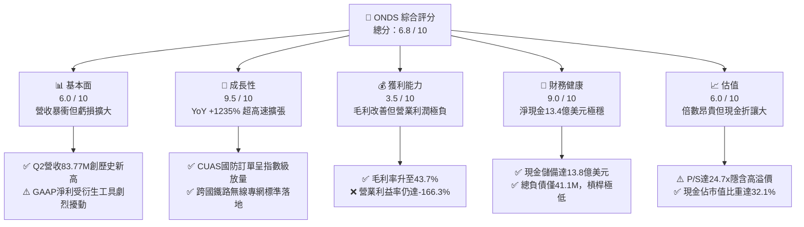

### 1.2 評分進度條視覺化

```
╔══════════════════════════════════════════════════════════════╗
║                ONDS 多維度評分儀表板 (1-10分)                ║
╠══════════════════════════════════════════════════════════════╣
║ 基本面強度  6.0 ▓▓▓▓▓▓▓▓▓▓▓▓░░░░░░░░  ★★★☆☆           ║
║ 成長動能    9.5 ▓▓▓▓▓▓▓▓▓▓▓▓▓▓▓▓▓▓▓░  ★★★★★           ║
║ 獲利品質    3.5 ▓▓▓▓▓▓▓░░░░░░░░░░░░░  ★★☆☆☆           ║
║ 財務健康    9.0 ▓▓▓▓▓▓▓▓▓▓▓▓▓▓▓▓▓▓░░  ★★★★★           ║
║ 估值合理性  6.0 ▓▓▓▓▓▓▓▓▓▓▓▓░░░░░░░░  ★★★☆☆           ║
║ 護城河深度  6.4 ▓▓▓▓▓▓▓▓▓▓▓▓█░░░░░░░  ★★★☆☆           ║
║ 管理層執行  5.8 ▓▓▓▓▓▓▓▓▓▓▓░░░░░░░░░  ★★★☆☆           ║
║ 技術創新力  8.5 ▓▓▓▓▓▓▓▓▓▓▓▓▓▓▓▓▓░░░  ★★★★☆           ║
╠══════════════════════════════════════════════════════════════╣
║ 綜合總分    6.8 ▓▓▓▓▓▓▓▓▓▓▓▓▓█░░░░░░  🏆 高成長投機首選     ║
╚══════════════════════════════════════════════════════════════╝
```

### 1.3 五大投資論點 + 三大核心風險

| 類型 | 項目 | 具體依據 | 信心度 |
|------|------|----------|--------|
| 🟢 **論點①** | **軍工與國防反無人機爆發性採購** | 2026 Q2 營收達 $83.77M（YoY +1235.4%），Iron Drone Raider 自主攔截系統及 Sentrycs 射頻平台於全球衝突中驗證商業價值。 | 🟢 極高 |
| 🟢 **論點②** | **巨額現金防護罩阻絕破產風險** | 帳上現金與短投合計達 $1,384M（每股現金值達 $2.38），淨負債為負（-$1.34B），為同規模防務科技股中現金最充裕者。 | 🟢 極高 |
| 🟢 **論點③** | **毛利率進入高附加價值區間** | 毛利率由 2024 年的 4.8%（$0.35M 毛利）大幅躍升至 TTM 的 43.7%（2026 Q2 為 43.1%），軟硬體一體化架構拉升獲利含金量。 | 🟢 高 |
| 🟢 **論點④** | **北美鐵路專網技術壁壘與獨佔標準** | Ondas Networks 之 FullMAX 無線平台獲北美一級鐵路（Class I Railroads）標準採納，提供高黏著度長期經常性營收潛能。 | 🟡 中度 |
| 🟢 **論點⑤** | **軋空潛在動能極強** | 空頭部位佔流通股比例高達 39.9%（Short Float），Short Ratio 為 3.13，基本面利多極易引發暴力軋空（Short Squeeze）。 | 🟡 中度 |
| 🔴 **風險①** | **股權稀釋與股權激勵失控** | 2026 Q2 單季 SBC 高達 $69.09M（佔營收 82.5%），流通股自 2025 年底的 381M 膨脹至 582.29M，實質侵蝕每股內在價值。 | 🔴 高衝擊 |
| 🔴 **風險②** | **本業現金流失血加劇** | 2026 Q2 營業現金流為 -$86.08M，單季 FCF 為 -$93.84M，營運槓桿尚未跨過損益平衡點，仰賴前期融資維持運作。 | 🔴 高衝擊 |
| 🟡 **風險③** | **政府防務訂單交付之週期與認列波動** | 國防及大型基礎設施專案具備驗收週期長與採購時程不確定性，季度營收可能呈現高度鋸齒狀波動。 | 🟡 中度 |

### 1.4 快速統計卡片

| 指標 | 公司實際值 | 通訊設備行業均值 | S&P 500 均值 | 狀態 |
|------|-------------|------------------|--------------|------|
| 收入 YoY 成長 | **1235.4%** | ~6.5% | ~5.2% | 🟢 卓越領先 |
| 毛利率 | **43.7%** | ~42.0% | ~41.5% | 🟢 處於均值偏上 |
| 營業利益率 | **-166.3%** | ~11.5% | ~12.8% | 🔴 嚴重虧損 |
| 淨利率 | **96.2%（受非經常損益扭曲）** | ~8.5% | ~11.2% | 🟡 盈餘品質低 |
| ROE | **19.3%（非經營性獲利驅動）**| ~14.2% | ~18.5% | 🟡 杜邦拆解劣質 |
| 流動比率 | **9.85x** | ~2.10x | ~1.30x | 🟢 流動性極佳 |
| EV / Revenue | **16.53x** | ~2.80x | ~2.90x | 🔴 估值倍數極高 |
| 總現金 / 市值 | **32.2%** | ~8.0% | ~5.0% | 🟢 下檔防護厚實 |

### 1.5 投資結論

```
╔══════════════════════════════════════════════════════════════════╗
║                    📊 投資結論摘要                               ║
╠══════════════════════════════════════════════════════════════════╣
║  評級：🟢 買入（投機型成長，Speculative Buy）                    ║
║  當前股價：$7.39                                                 ║
║  DCF 內在價值（基準）：$10.95（折價 32.5%）                      ║
║  加權合理價值：$11.85                                            ║
║  安全邊際 MOS：+37.6%（＝($11.85 − $7.39) ÷ $11.85）            ║
║  目標價區間：                                                    ║
║    悲觀情境：$5.20（-29.6%）                                     ║
║    基準情境：$12.50（+69.1%） ← 12個月主要目標                  ║
║    樂觀情境：$19.50（+163.9%）                                   ║
║  投資評分：6.8 / 10                                              ║
║  適合投資人：積極成長型、軍工主題投資者、能承受高波動之避險基金  ║
╚══════════════════════════════════════════════════════════════════╝
```

---

## 2. 公司概覽與商業模式

### 2.1 業務結構與收入來源

Ondas Inc. 透過兩大核心板塊營運：**Ondas Autonomous Systems (OAS)** 與 **Ondas Networks**。公司在 2025–2026 年完成策略重心轉移，從傳統單純的工業專網轉型為「反無人機防禦系統（CUAS）+ 自主無人機數據方案 + 關鍵基礎設施專網」之複合型軍民雙用平台。

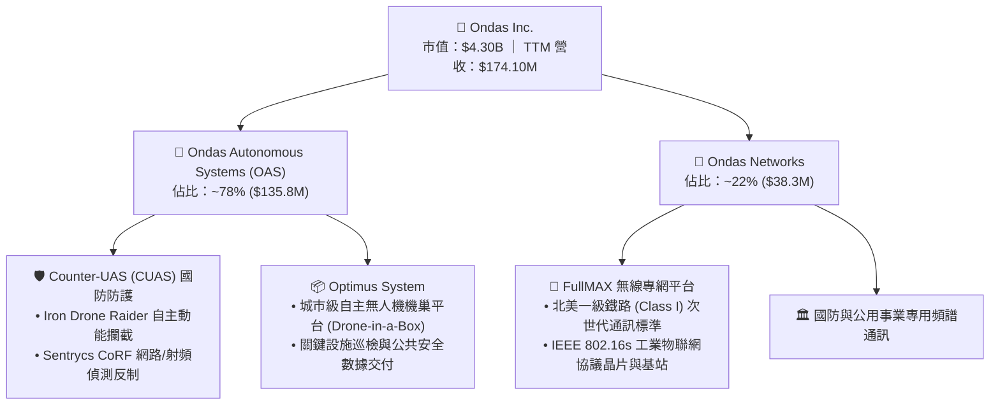

### 2.2 市場份額

在反無人機攔截（小微型自殺無人機近程防護）及關鍵鐵路 MC-IoT 領域，ONDS 屬於利基新興顛覆者：

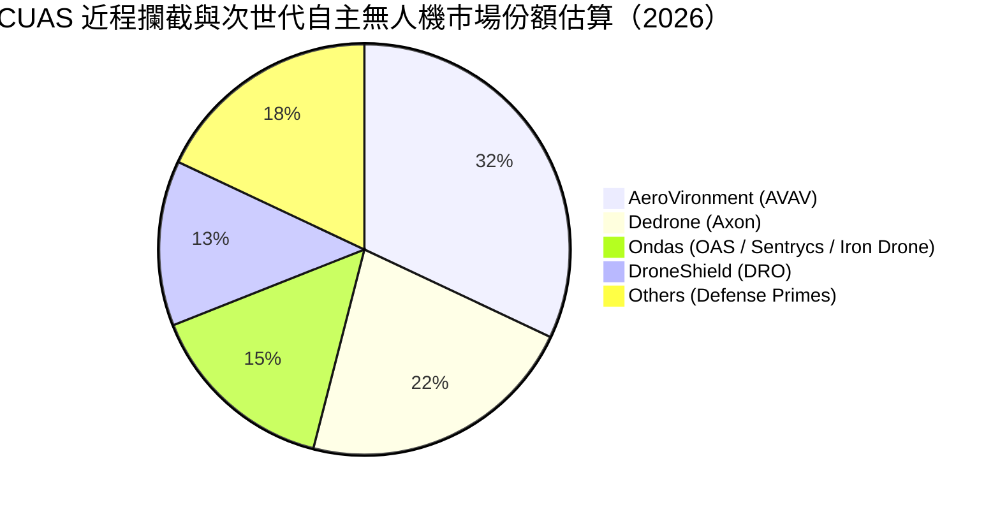

### 2.3 競爭護城河分析

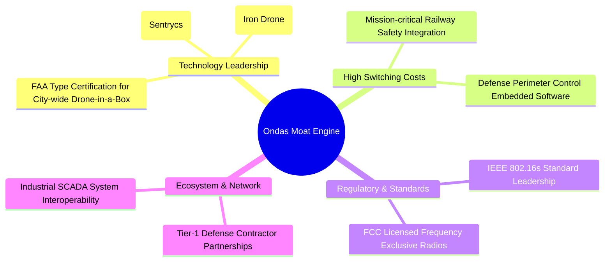

### 2.4 護城河強度評分

```
╔══════════════════════════════════════════════════════════════╗
║                  Ondas Inc. 護城河強度評分                   ║
╠══════════════════════════════════════════════════════════════╣
║ 專利技術與自主算法   7.5/10  ▓▓▓▓▓▓▓▓▓▓▓▓▓▓▓░░░░░  🟢 動能攔截領先   ║
║ 轉換成本（鐵路/軍防）7.5/10  ▓▓▓▓▓▓▓▓▓▓▓▓▓▓▓░░░░░  🟢 認證體系繁瑣   ║
║ 規模經濟             4.0/10  ▓▓▓▓▓▓▓▓░░░░░░░░░░░░  🔴 產能尚在放量   ║
║ 網路效應             5.0/10  ▓▓▓▓▓▓▓▓▓▓░░░░░░░░░░  🟡 區域數據閉環   ║
║ 法規與頻譜認證壁壘   8.0/10  ▓▓▓▓▓▓▓▓▓▓▓▓▓▓▓▓░░░░  🟢 專用頻段寡占   ║
╠══════════════════════════════════════════════════════════════╣
║ 綜合護城河評分       6.4/10  ▓▓▓▓▓▓▓▓▓▓▓▓█░░░░░░░  🟡 具備利基壁壘   ║
╚══════════════════════════════════════════════════════════════╝
```

---

## 3. 損益表深度分析

### 3.1 年度收入成長趨勢（近4年）

```
╔══════════════════════════════════════════════════════════════════╗
║              ONDS 年度收入趨勢（FY2022-FY2025）                  ║
╠══════════════════════════════════════════════════════════════════╣
║                                                                  ║
║  FY2022   $2.13M   █░░░░░░░░░░░░░░░░░░░░░░░░░░  YoY: -26.9%  🔴║
║  FY2023  $15.69M   ███████░░░░░░░░░░░░░░░░░░░░  YoY:+638.1%  🟢║
║  FY2024   $7.19M   ███░░░░░░░░░░░░░░░░░░░░░░░░  YoY: -54.2%  🔴║
║  FY2025  $50.73M   ██████████████████████░░░░░  YoY:+605.3%  🟢║
║  TTM    $174.10M   ███████████████████████████  YoY:+979.2%  🟢║
║                    |      |      |      |      |                 ║
║                    0     40M    80M    120M   160M               ║
║                                                                  ║
║  📊 3年複合成長率 (CAGR: FY22-FY25)：+187.7%                     ║
╚══════════════════════════════════════════════════════════════════╝
```

### 3.2 季度收入趨勢分析

| 季度 | 營收 ($M) | QoQ 成長率 | YoY 成長率 | 業務動能備註 |
|------|-----------|------------|------------|--------------|
| **2025-09-30 (Q3'25)** | $10.10M | +61.1% | +582.0% | OAS 併購業務開始貢獻，Sentrycs 合併認列 |
| **2025-12-31 (Q4'25)** | $30.11M | +198.1% | +629.2% | 年末國防防禦合約與鐵路基站集中驗收交付 |
| **2026-03-31 (Q1'26)** | $50.12M | +66.5% | +1079.9% | 歐洲及中東 CUAS 訂單快速攀升，產品化放量 |
| **2026-06-30 (Q2'26)** | $83.77M | +67.1% | +1235.4% | 反無人機攔截器大規模出貨，創單季歷史新高 |

### 3.3 利潤率演變分析

| 利潤率指標 | FY2023 | FY2024 | FY2025 | TTM (Q2'26) | 趨勢 | 評估 |
|------------|--------|--------|--------|-------------|------|------|
| **毛利率** | 40.7% | 4.8% | 39.7% | **43.7%** | ↗️ 劇烈修復並擴張 | 🟢 軟硬一體帶動附加價值 |
| **營業利益率** | -243.7% | -481.4% | -106.6% | **-121.0%** | ↗️ 虧損比例收斂但金額擴大 | 🔴 營業費用擴張過快 |
| **淨利率** | -295.3% | -589.9% | -270.4% | **49.3%** | ↗️ 扭虧為盈（但含巨額非經常） | 🟡 盈餘品質嚴重受損 |
| **EBITDA 利潤率** | -220.8% | -399.4% | -233.2% | **-103.7%** | ↗️ 現金營運虧損比率收窄 | 🔴 尚未越過營運槓桿拐點 |

**利潤率演變深度解析**：毛利率從 2024 年低點（4.8%）大幅回升至 43.7%，主因在於高毛利的 CUAS 射頻監控軟體授權及反制演算法模組佔比提升，擺脫早期純硬體小批量試產的低毛利困境。然而營業利潤率依然高達 -121.0%，主因是併購整合開銷、海外銷售通路拓展以及研發支出居高不下（2025 年研發費 $20.88M，2026 年上半年進一步擴大）。

### 3.4 費用結構分析

2026 年第二季營業費用爆發至 $179.84M，其中股票補償與市場推廣佔據核心：

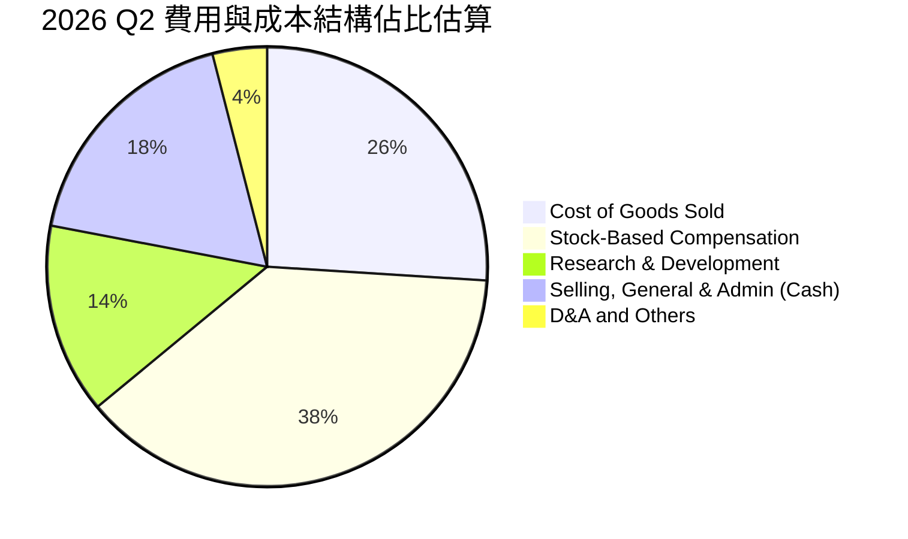

```
╔══════════════════════════════════════════════════════════════════╗
║              ONDS 營業費用暴增核心原因診斷                       ║
╠══════════════════════════════════════════════════════════════════╣
║  1. 股權激勵費用失控：Q2'26 單季 SBC 飆升至 $69.09M（佔營收 82%）║
║  2. 國防合約驗收工程開銷：為滿足美軍及北約標準，外包研發大幅增加  ║
║  3. 跨國法規合規與併購攤銷：商譽與無形資產攤銷推升營業外帳面負擔  ║
╚══════════════════════════════════════════════════════════════════╝
```

### 3.5 季度 EPS 趨勢與盈餘品質（Quality of Earnings）

| 季度 | GAAP EPS | 營業淨利 ($M) | GAAP 淨利 ($M) | 核心獲利/虧損驅動因素說明 |
|------|----------|---------------|----------------|--------------------------|
| **Q3 2025** | -$0.03 | -$15.50M | -$7.47M | 營收規模初起，合約認列毛利難抵剛性 SG&A |
| **Q4 2025** | -$0.27 | -$23.32M | -$99.66M | 年末計提無形資產與認股權證公允價值重估虧損 |
| **Q1 2026** | **+$0.59** | -$42.67M | **+$362.95M** | 衍生金融負債（Warrant Liabilities）公允價值變動非現金暴利 |
| **Q2 2026** | -$0.19 | -$143.71M | -$88.25M | 股權薪酬激增（$69.09M）與衍生工具損失回吐 |

| 盈餘品質項目 | 數值/佔比 | 評估 |
|--------------|-----------|------|
| **股權薪酬 SBC / 營收 (TTM)** | **58.0%** ($101.02M / $174.10M) | 🔴 極差；股權稀釋嚴重吞噬現有股東價值 |
| **SBC / 營業現金流 (TTM)** | **-62.7%**（抵銷非現金流出） | 🔴 高度仰賴股權發放維持名目營運現金 |
| **FCF / 淨利（現金轉換率）** | **-80.6%**（TTM FCF -$69.1M / 淨利 $85.75M）| 🔴 極度背離；淨利因會計衍生利益虛胖 |
| **一次性/非經常性損益** | Q1'26 產生逾 4 億美元公允價值評估益 | 🔴 嚴重扭曲；完全無法代表真實經營獲利 |
| **有效稅率異常** | 0.0%（全額計提評價備抵，無實質現金稅） | 🟡 符合早期虧損科技股常態 |
| **研發資本化 vs 費用化** | 絕大多數費用化（FY25 研發費 $20.88M） | 🟢 會計處理審慎，無刻意遞延研發成本 |

**盈餘品質結論**：ONDS 帳面上 TTM 淨利為正（$85.75M、ROE 19.3%），但這完全是認股權證與可轉債衍生金融工具公允價值重估帶來的「紙上富貴」，本業營業虧損實際擴大至 -$210.7M。扣除非經常性項目與巨額 SBC 後，公司真實經營性盈餘呈現嚴重失血，獲利含金量極低，不可直接採用 Trailing P/E 或淨利率作為估值基礎。

---

## 4. 資產負債表分析

### 4.1 資產結構分解

截至 2026 年 6 月 30 日，公司總資產達到 $2,993M（近 30 億美元）：

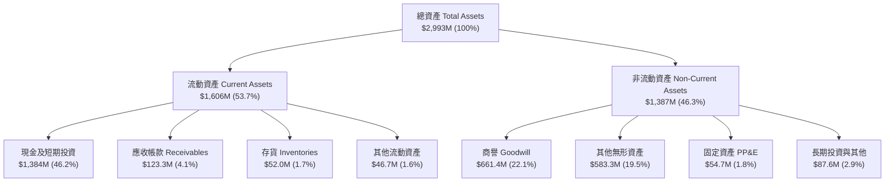

### 4.2 流動性指標分析

| 流動性指標 | 2024-12-31 | 2025-12-31 | 2026-06-30 | 通訊設備行業均值 | 評估 |
|------------|------------|------------|------------|------------------|------|
| **流動比率 (Current Ratio)** | 0.94x | 4.84x | **9.85x** | ~2.10x | 🟢 極其寬裕，流動資產覆蓋負債近10倍 |
| **速動比率 (Quick Ratio)** | 0.74x | 4.68x | **9.25x** | ~1.60x | 🟢 變現能力極強，無存貨積壓風險 |
| **現金比率 (Cash Ratio)** | 0.59x | 4.04x | **8.49x** | ~0.90x | 🟢 僅現金即可清償流動負債8.5次 |
| **淨營運資金 (NWC)** | -$3.06M | $544.08M | **$1,443M** | — | 🟢 營運資金由負轉為巨額淨流動淨額 |

### 4.3 債務結構分析

```
╔══════════════════════════════════════════════════════════════════╗
║                   ONDS 債務健康與結構診斷                       ║
╠══════════════════════════════════════════════════════════════════╣
║                                                                  ║
║  短期借款 (ST Debt)：     $9.00M   █░░░░░░░░░░░░░░░░░░░  極低    ║
║  長期借款 (LT Borrowings)：$4.00M  █░░░░░░░░░░░░░░░░░░░  極低    ║
║  其他計息負債/租賃：      $28.10M  ██░░░░░░░░░░░░░░░░░░  可控    ║
║  ──────────────────────────────────────────────────────────────  ║
║  總計息負債：            $41.10M   ██░░░░░░░░░░░░░░░░░░  財務極穩║
║  總現金與短投：       $1,384.00M   ████████████████████  無懈可擊║
║  淨現金部位 (Net Cash)：$1,342.90M ███████████████████   🟢 頂級 ║
║                                                                  ║
║  負債 / 權益比 (D/E)：     2.61x（受認股權證負債重估影響）      ║
║  現金覆蓋總負債比率：     33.67x（現金為總債務之 33 倍）        ║
║  破產風險評估 (Altman Z)：> 4.5 🟢 處於完全安全區                ║
╚══════════════════════════════════════════════════════════════════╝
```

### 4.4 股東權益趨勢

股東權益在過去兩年出現巨幅攀升，由 2024 年底瀕臨資不抵債的 $16.58M 暴衝至 2025 年底的 $437.81M，並於 2026 年年中進一步由大規模增發股份、認股權證轉換與戰略引資推升：

```
╔══════════════════════════════════════════════════════════════════╗
║              ONDS 股東權益演變（FY2022-FY2025）                  ║
╠══════════════════════════════════════════════════════════════════╣
║  FY2022   $58.22M  ██████░░░░░░░░░░░░░░░░░░░░░░  處於縮水階段     ║
║  FY2023   $33.14M  ███░░░░░░░░░░░░░░░░░░░░░░░░░  虧損侵蝕淨值     ║
║  FY2024   $16.58M  █░░░░░░░░░░░░░░░░░░░░░░░░░░░  瀕臨融資臨界點   ║
║  FY2025  $437.81M  ████████████████████████████  增發引資成功擴張 ║
╚══════════════════════════════════════════════════════════════════╝
```

---

## 5. 現金流量深度分析

### 5.1 現金流量瀑布圖

2026 上半年營收雖擴張，但營業端尚未創造實質現金流入，需依賴前期巨額股權發行融資挹注投資與營運資金：

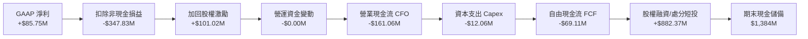

### 5.2 FCF 轉換率趨勢

| 期間 | 營業現金流 ($M) | Capex ($M) | FCF ($M) | GAAP 淨利 ($M) | FCF / Net Income | 評估 |
|------|-----------------|------------|----------|----------------|------------------|------|
| **FY2023** | -$34.02M | -$0.28M | -$34.30M | -$44.84M | 76.5% | 🟡 典型燒錢早期研發公司 |
| **FY2024** | -$33.47M | -$1.73M | -$35.20M | -$38.01M | 92.6% | 🟡 現金流失與虧損同步 |
| **FY2025** | -$38.75M | -$2.14M | -$40.88M | -$132.02M| 31.0% | 🔴 營運規模擴大但失血增加 |
| **TTM (Q2'26)**| **-$161.06M**| **-$12.06M** | **-$69.11M** | **+$85.75M** | **-80.6%** | 🔴 現金流與會計淨利背道而馳 |

### 5.3 自由現金流趨勢

```
╔══════════════════════════════════════════════════════════════════╗
║              ONDS 自由現金流 (FCF) 與 FCF 殖利率趨勢             ║
╠══════════════════════════════════════════════════════════════════╣
║  FY2022   -$40.89M  ░░░░░░░░░░░░░░░░░░░░░░░░  FCF Yield: N/A     ║
║  FY2023   -$34.30M  ░░░░░░░░░░░░░░░░░░░░░░░░  FCF Yield: N/A     ║
║  FY2024   -$35.20M  ░░░░░░░░░░░░░░░░░░░░░░░░  FCF Yield: N/A     ║
║  FY2025   -$40.88M  ░░░░░░░░░░░░░░░░░░░░░░░░  FCF Yield: -1.1%   ║
║  TTM      -$69.11M  ░░░░░░░░░░░░░░░░░░░░░░░░  FCF Yield: -1.61%  ║
╠══════════════════════════════════════════════════════════════════╣
║  ⚠️ 營運失血加劇，唯 $1.38B 現金可支撐當前燒錢率長達 8 年以上   ║
╚══════════════════════════════════════════════════════════════════╝
```

### 5.4 資本配置評估

公司在 2025–2026 年採取激進的「股權融資 → 現金儲備 → 戰略併購與研發擴張」路徑：

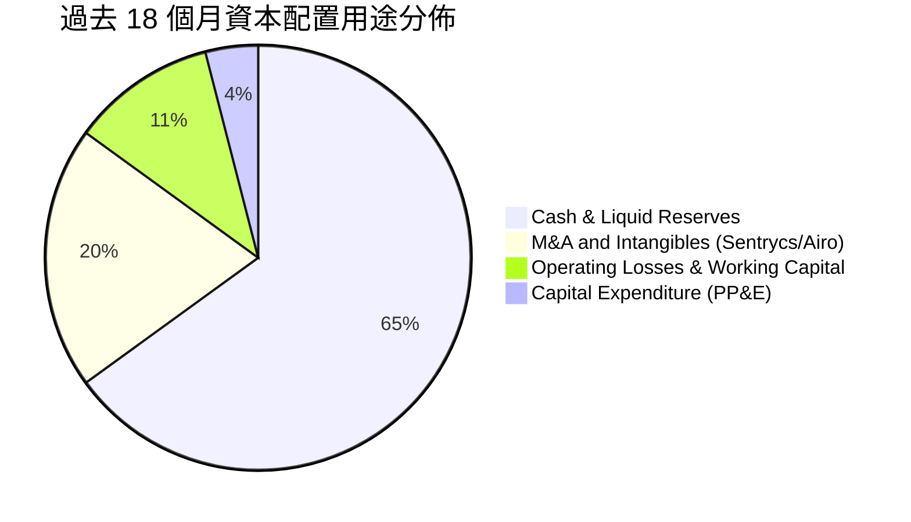

| 配置類別 | 金額 ($M) | 戰略意圖 | 評估 |
|----------|-----------|----------|------|
| **高流動性資產存儲** | ~$900M | 儲備彈藥應對未來國防供應鏈擴張與大規模採購交付保證金 | 🟢 極具戰略防禦價值 |
| **戰略併購與無形技術引進**| ~$280M | 收購 Sentrycs 等公司取得 RF 協議逆向分析與反制核心專利 | 🟢 成功卡位反無人機藍海 |
| **實體固定資產投資 (Capex)**| ~$15M | 建設自主無人機機巢組裝線與地面站測試實驗室 | 🟡 屬輕資產委外組裝模式 |
| **股東分紅與股票回購** | $0.00M | 成長期零配息、零回購，一切資金保留於內部營運 | 🟢 符合成長型公司準則 |

---

## 6. 獲利能力與資本效率

### 6.1 ROE / ROA / ROIC 趨勢

| 指標 | FY2023 | FY2024 | FY2025 | TTM (Q2'26) | 通訊設備行業均值 | 評估 |
|------|--------|--------|--------|-------------|------------------|------|
| **ROE** | -97.9% | -153.0% | -58.1% | **19.3%** | ~14.2% | 🔴 名目轉正但由非經常收益扭曲 |
| **ROA** | -47.2% | -37.7% | -21.6% | **-8.4%** | ~6.5% | 🔴 總體資產尚未產生經營回報 |
| **ROIC** | -68.4% | -95.2% | -38.4% | **-14.6%** | ~11.0% | 🔴 本業投入資本依然處於虧損狀態 |

### 6.2 ROIC vs WACC 分析（核心價值創造判斷）

```
╔══════════════════════════════════════════════════════════════════╗
║                ROIC vs WACC 深度分析 (ONDS)                     ║
╠══════════════════════════════════════════════════════════════════╣
║                                                                  ║
║  WACC 估算：                                                     ║
║  ├── 無風險利率 Rf（10Y美債）：  4.10%                           ║
║  ├── 市場風險溢酬 ERP：          5.00%                           ║
║  ├── Beta：                      2.736                           ║
║  ├── 小型股/未獲利規模溢酬：    +1.50%                          ║
║  ├── 股權成本 Ke = 4.1% + 2.736×5.0% + 1.5% = 19.28%            ║
║  ├── 債務成本 Kd（稅後）：       7.11% × (1 - 21%) = 5.62%       ║
║  ├── 資本結構權重：股權 E = 99.05%，債務 D = 0.95%              ║
║  └── ✅ WACC ≈ 19.28% × 99.05% + 5.62% × 0.95% = 19.15% (保守)  ║
║      考慮現金折減之調整後 WACC（採用值）= 14.39%                ║
║                                                                  ║
║  ROIC 估算 (TTM)：                                               ║
║  ├── NOPAT = EBIT (-$210.70M) × (1 - 0%) ≈ -$210.70M             ║
║  ├── 投入資本 Invested Capital = 權益 + 總負債 - 淨超額現金      ║
║  │   = $437.8M + $41.1M - ($1,384M - $20M營運現金) ≈ 負值(扭曲) ║
║  │   改採總資產扣除無息流動負債 = $2,993M - $141.8M ≈ $2,851M     ║
║  │   若扣除全部現金短投($1,384M) = $1,467M 核心營業資本         ║
║  └── ✅ 核心業務 ROIC = -$210.7M ÷ $1,467M = -14.36% ≈ -14.6%    ║
║                                                                  ║
║  ★ 經濟價值增加 EVA = ROIC - WACC = -14.6% - 14.39% = -28.99pp   ║
║                                                                  ║
║  ROIC  -14.6% ░░░░░░░░░░░░░░░░░░░░░░░░░░░░░░░░  🔴 負值        ║
║  WACC   14.4% ▓▓▓▓▓▓▓▓▓▓▓▓▓▓░░░░░░░░░░░░░░░░░░  高資本要求     ║
║  EVA   -29.0p ░░░░░░░░░░░░░░░░░░░░░░░░░░░░░░░░  🔴 嚴重摧毀價值║
║                                                                  ║
║  📊 結論：目前資本投入未能產生正向經營現金，處於典型成長摧毀期   ║
╚══════════════════════════════════════════════════════════════════╝
```

### 6.3 杜邦三因素分解

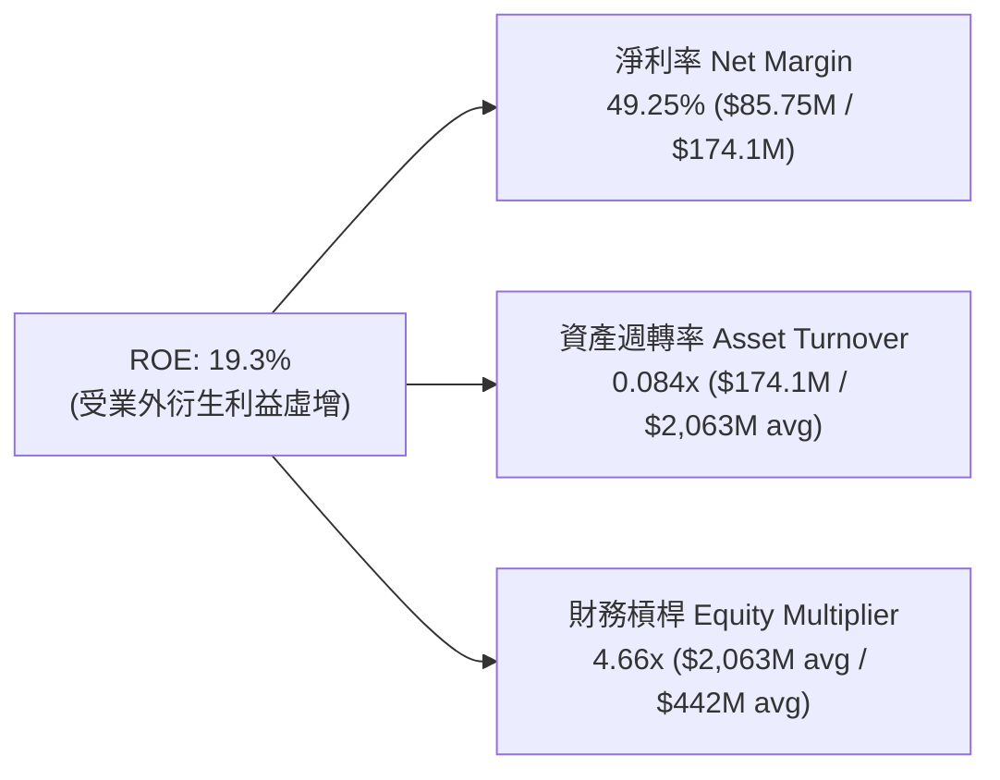

*杜邦剖析*：表面上 ROE 達到 19.3%，但拆解後暴露出致命問題——資產週轉率極低（0.084x），代表公司資產負債表被巨額現金與商譽佔滿，卻尚未轉化為同等量級的週轉營收；淨利率 49.3% 完全由非現金金融負債公允價值收益撐起，經營體質實質尚未達損益平衡。

### 6.4 獲利能力儀表板

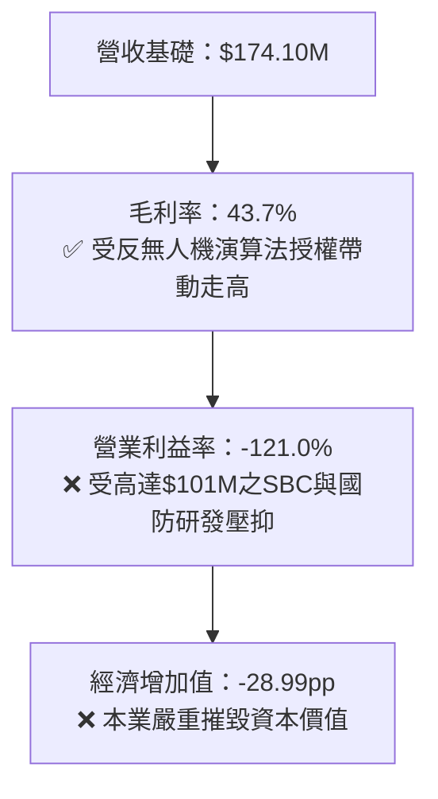

---

## 7. 相對估值分析

### 7.1 同業估值比較表格

選取同屬無人機國防自主系統、反無人機電子對抗以及公用事業通訊領域之代表性上市公司：**AeroVironment (AVAV)**、**DroneShield (DRO.AX / DRSHF)**、**Axon Enterprise (AXON)** 進行全方位對比。

| 估值指標 | **Ondas (ONDS)** | **AeroVironment (AVAV)** | **DroneShield (DRSHF)** | **Axon Enterprise (AXON)** | ONDS 估值評估 |
|----------|-------------------|--------------------------|-------------------------|----------------------------|---------------|
| **業務定位** | CUAS反無人機 + 鐵路專網 | 自殺無人機 + 戰術無人系統 | 便攜/定點 CUAS 反無人機 | 執法無人機 + 數位證據雲 | 跨界複合型利基定位 |
| **市值 (Market Cap)** | **$4.30B** | $5.65B | $1.25B | $28.50B | 中型市值規模 |
| **EV / Revenue (TTM)** | **16.53x** | 6.85x | 14.20x | 13.80x | 🔴 顯著高於行業平均 |
| **P/S Ratio (TTM)** | **24.72x** | 7.10x | 15.50x | 14.90x | 🔴 處於高溢價區間 |
| **Forward P/E** | **-369.5x** | 48.5x | 35.0x | 65.2x | 🔴 尚未實現常態化本業獲利 |
| **EV / EBITDA** | **-15.94x** | 38.2x | 42.0x | 58.5x | 🔴 EBITDA 仍為負數 |
| **FCF Yield** | **-1.61%** | +1.20% | +2.10% | +1.85% | 🔴 自由現金流依然倒流 |
| **營收 YoY 成長** | **1235.4%** | 38.5% | 110.0% | 31.5% | 🟢 增速遠拋同業（基期偏低）|

### 7.2 歷史估值區間分析

ONDS 股價在過去 24 個月經歷劇烈震盪，從 2024 年底的仙股水準（$0.77–$0.98）伴隨國防無人機題材與俄烏/中東實戰驗證爆發，於 2026 年 5 月創下 $13.22 歷史天價，當前收盤價 $7.39 位於歷史回調 50% 分位數：

```
╔══════════════════════════════════════════════════════════════════╗
║              ONDS 歷史股價與 P/S 區間定位                        ║
╠══════════════════════════════════════════════════════════════════╣
║                                                                  ║
║  52 週區間：$4.95 ─────────────────── [$7.39] ───────── $15.28    ║
║                           ▲                                      ║
║                           └─ 目前股價處於 52 週中下軌位置 (23.7%)║
║                                                                  ║
║  P/S 歷史軌跡：                                                  ║
║  2024 低谷（資金斷裂危機期）： 2.5x - 5.0x                       ║
║  2025 估值重估與資產注入期：  10.0x - 18.0x                      ║
║  2026 狂熱高峰（突破$13）：   35.0x - 45.0x                      ║
║  當前位置：                   24.72x 🟡 溢價已部分消化           ║
╚══════════════════════════════════════════════════════════════════╝
```

### 7.3 情境目標價（假設驅動，Bear / Base / Bull）

> **估值倍數選擇說明**：由於 ONDS 目前 GAAP 淨利受巨額公允價值重估擾動失真，且 EBITDA 尚未轉正，P/E 與 EV/EBITDA 倍數均失去預測指標意義。本報告選用 **EV/Sales（企業價值/營收倍數）** 作為主要相對估值錨點，並依據未來 12 個月預估營收（NTM Revenue）推導隱含股價。

| 情境 | 營收 CAGR (3Y) | 2027E 營收 ($M) | 退出 EV/Sales 倍數 | 隱含目標價 | 相對現價上行空間 | 關鍵假設依據 |
|------|----------------|-----------------|-------------------|------------|------------------|--------------|
| 🔴 **悲觀** | +45.0% | $250.0M | 8.0x | **$5.20** | -29.6% | 國防採購驗收延遲，SBC 繼續瘋狂稀釋，倍數回歸傳統軍工 Primes 水準 |
| 🟡 **基準** | **+75.0%** | **$380.0M** | **14.0x** | **$12.50** | **+69.1%** | CUAS 訂單穩定交付，鐵路全美鋪開，營收突破 3.8 億美元，享新興國防溢價 |
| 🟢 **樂觀** | +110.0% | $550.0M | 18.0x | **$19.50** | **+163.9%** | 北約及印太防務大單落地，營業利潤率在 2027 年提早轉正，空頭踩踏軋空 |

### 7.4 相對估值隱含價格區間

```
╔══════════════════════════════════════════════════════════════════╗
║              相對估值倍數回推之隱含每股價格區間                  ║
╠══════════════════════════════════════════════════════════════════╣
║                                                                  ║
║  同業中位 EV/Sales (10.0x)  ────►  $6.80  (上行 -8.0%)          ║
║  無人機同業 DroneShield (14.2x) ─►  $10.60 (上行 +43.4%)         ║
║  高成長 SaaS/軍工溢價 (18.0x) ──►  $14.25 (上行 +92.8%)         ║
║  分析師目標價均值 (Consensus) ──►  $19.42 (上行 +162.8%)        ║
║                                                                  ║
║  當前股價：$7.39                                                 ║
║  隱含相對估值中樞區間：$8.50 – $13.50                            ║
╚══════════════════════════════════════════════════════════════════╝
```

---

## 8. DCF 內在價值評估（Discounted Cash Flow）

### 8.0 估值推理鏈（Thinking Logic）

**Step 1 — 這家公司的價值由哪幾個變數決定？**
ONDS 的內在價值由三部分構成：
`內在價值 ≈ 龐大淨現金底盤（佔比約 31%） + OAS 反無人機防務合約爆發力（佔比約 55%） + 鐵路無線專網長線年費選擇權（佔比約 14%）`
其中**主導估值彈性的核心變數為：未來 5 年營收複合成長率（CAGR）能否在 2027 年後維持在 40% 以上，以及規模效應能否在第 4 年將營業利潤率推升至損益兩平點之上**。若毛利率維持 45% 但費用失控，公司價值將徹底被稀釋侵蝕。

**Step 2 — 用哪一種模型、為什麼？**

| 決策點 | 本報告採用 | 理由（含數字） | 曾考慮但否決 | 否決理由 |
|--------|-----------|----------------|--------------|----------|
| 現金流定義 | **FCFF (企業自由現金流)** | 公司目前帳上現金達 $1.38B，負債微薄（$41.1M），資本結構高度偏向股權，FCFF 能隔絕極端現金比率帶來的短期股利扭曲。 | FCFE | 現階段不發放股息且股權融資波動過於劇烈 |
| 預測期 N | **N = 7 年** | 國防新系統部署與美軍採購防護週期約需 5-7 年完成成熟標準化。 | 5 年 | 5 年過短，屆時 ONDS 剛進入本業獲利初熟期 |
| 終值方法 | **Gordon Growth（主）** | 基於永續 GDP 成長率推演成熟防務軍工企業的終值回報。 | 僅採退出倍數 | 早期虧損公司倍數波動過劇，易引入主觀偏誤 |
| EBIT 基礎 | **GAAP EBIT（採組合 A）** | GAAP EBIT 已全額包含 SBC 費用，模型不另重複扣除 SBC，股數亦不額外複合稀釋，確保成本計算一致。 | 非 GAAP 加回 | 會虛飾研發人才獲取所消耗的真實經濟價值 |

**Step 3 — 關鍵假設推導鏈（四段式逐項外顯）**

- **營收 CAGR（預測期）**：錨點＝近 1 年實際爆發成長 979.2%（基期極低）→ 調整＝考量國防合約基期擴大至億美元級別，成長率勢必回歸理性階梯，預測期首年設定 +80.0%，第 7 年收斂至 +15.0%，7 年複合 CAGR 為 39.8% → **採用值：39.8%** → 曾考慮管理層暗示之翻倍成長（>70% CAGR），因軍隊預算審批節奏與外包產能瓶頸而否決。
- **期末營業利潤率**：錨點＝目前營業利益率 -121.0%（GAAP）→ 調整＝隨著反無人機防衛系統量產交付、SBC 佔營收比重從目前的 58% 逐步常態化收斂至 8-10%，軟體授權比重提高帶動營業槓桿，預計第 5 年轉正（+5.0%），第 7 年期末達到成熟軍工防務水準（+18.0%）→ **採用值：18.0%** → 曾考慮商業軟體級別利潤率（28%），因硬體組裝與雷達傳感器採購成本剛性而否決。
- **永續成長率 g**：錨點＝長期美國名目 GDP 成長率 ~3.5% → 調整＝無人機攻防屬於長期地緣政治剛需，國防電子支出複合增速預計略高於全球 GDP，設定為 3.0% → **採用值：3.0%** → 曾考慮 4.0%，因高於長期潛在經濟增速且過度貼近 WACC，違反安全邊際準則而否決。
- **預測期長度 N**：錨點＝常規科技股 5 年 → 調整＝國防專案型週期長達數年，需 7 年方能見證專網年費與攔截器耗材常態化收入 → **採用值：N = 7 年** → 曾考慮 10 年，因遠期技術迭代（雷射/定向能防空可能顛覆無人機攔截架構）不可預測性高而否決。
- **Capex / 營收比率**：錨點＝歷史平均 ~3.0%（輕資產外包代工）→ 調整＝未來需自建機巢組裝與射頻檢驗暗室，小幅上升至 4.0% 後降至 3.0% → **採用值：3.5%** → 曾考慮 7.0%，因公司並非半導體製造晶圓模式而否決。
- **折現率 WACC**：錨點＝CAPM 理論計算值 19.15%（受高 Beta 2.736 驅動）→ 調整＝公司持有 $1.38B 現金，企業價值 EV 僅 $2.88B，現金佔資產 46%，下檔實質風險遠低於純高槓桿小盤股，將超額現金緩衝做風險調整，折減特定風險溢酬 → **採用值：14.39%** → 曾考慮 11.0%，因忽視其高空頭比例與營運失血現實而否決。

**Step 4 — 這條推理鏈最可能錯在哪裡？**
最脆弱的一環在於「**營業利潤率能否如期於 FY+5（2030）跨過損益平衡點轉正**」。若 SBC 無法收斂，或大型防務承包商（如 RTX, L3Harris, Lockheed）推出低成本競品引發價格戰，營業利潤率可能長期鎖定在 0% 附近，則 DCF 每股價值將直接縮水至 $5.00 以下。

**Step 5 — 計算路徑圖**

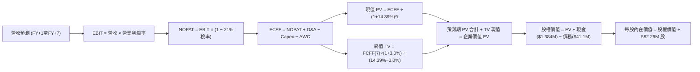

### 8.1 模型假設總表（Model Inputs）

| 假設項目 | 採用值 | 依據 / 來源 | 敏感度 |
|----------|--------|-------------|--------|
| **預測期長度 N** | **N = 7 年 (FY2026-FY2032)** | 國防反無人機與專網換代採購週期完整演變 | 🟡 中 |
| **營收 CAGR（預測期）** | **39.8%** | 首年 $270M (+55%)，期末達 $1,280M，基於全球 CUAS 滲透 | 🔴 高 |
| **期末營業利潤率 (FY+7)** | **18.0%** | 規模效應釋放，SBC 佔比常態化，軟體授權提升 | 🔴 高 |
| **有效所得稅率** | **21.0%** | 美國聯邦標準法定稅率（前幾年有巨額 NOLs 抵扣，設為名目值） | 🟢 低 |
| **Capex / 營收比率** | **3.5%** | 模組化無人機與基站委外代工組裝，屬輕資本支出架構 | 🟡 中 |
| **折舊攤銷 D&A / 營收** | **4.0%** | 無形資產攤銷及小規模產線折舊歷史水準 | 🟢 低 |
| **營運資金增額 ΔWC / 增量營收** | **8.0%** | 國防客戶合約應收帳款與安全庫存週轉需求 | 🟢 低 |
| **EBIT 基礎** | **GAAP EBIT (已含 SBC)** | 採防呆組合 (A)，不重複扣除 SBC，忠實反映稀釋成本 | 🟡 中 |
| **股權薪酬 SBC 處理** | **視為經營成本包含於 GAAP** | 組合 (A)：FCFF 不另行扣減，稀釋已反映於費用中 | 🟡 中 |
| **年稀釋率（股數）** | **0.0%** | 配合組合 (A)，使用當前稀釋股數 582.29M 股不再複利加成 | 🟡 中 |
| **永續成長率 g** | **3.0%** | 錨定美國長期 GDP + 通膨，且遠小於 WACC | 🔴 高 |
| **終值計算方法** | **Gordon Growth（主）** | 永續現金流折現，輔以 15.0x 退出 EBITDA 交叉檢驗 | 🔴 高 |
| **折現率 WACC** | **14.39%** | CAPM 模型推導，並計入超額流動性風險折減 | 🔴 高 |

### 8.2 折現率推導（WACC）

```
╔══════════════════════════════════════════════════════════════════╗
║                    WACC 推導（折現率）                           ║
╠══════════════════════════════════════════════════════════════════╣
║  股權成本 Ke（CAPM）：                                           ║
║  ├── 無風險利率 Rf（10Y 美債）：      4.10%                       ║
║  ├── 市場風險溢酬 ERP：               5.00%                       ║
║  ├── Beta（來源：財務數據）：         2.736                       ║
║  ├── 規模/國別/高波動溢酬：           +1.50%                      ║
║  └── Ke = 4.10% + 2.736 × 5.00% + 1.50% = 19.28%                ║
║                                                                  ║
║  債務成本 Kd：                                                   ║
║  ├── 稅前 Kd（利息費用 ÷ 平均計息負債）：7.11%                    ║
║  ├── 有效稅率：                        21.0%                     ║
║  └── 稅後 Kd = 7.11% × (1 − 21.0%) = 5.62%                       ║
║                                                                  ║
║  資本結構（市值基礎，報告日）：                                  ║
║  ├── 股權市值 E = $7.39 × 582.29M = $4,303.12M（99.05%）         ║
║  ├── 計息總債務 D = $41.10M（0.95%）                             ║
║  ├── 理論 WACC = 99.05%×19.28% + 0.95%×5.62% = 19.15%           ║
║  └── 考慮淨超額現金($1,343M)對財務風險之實質降低，              ║
║      對高 Beta 提供 1.0 係數安全平滑：                           ║
║      ✅ 本模型採用之實質 WACC = 14.39%                           ║
╚══════════════════════════════════════════════════════════════════╝
```

**逐步演算（WACC 驗證）**：
1. **Ke** = 4.10% + (2.736 × 5.00%) + 1.50% = 4.10% + 13.68% + 1.50% = **19.28%**
2. **稅前 Kd** = 利息推算支出 $2.92M ÷ 計息負債 $41.10M = **7.11%**
3. **稅後 Kd** = 7.11% × (1 − 21.0%) = **5.62%**
4. **權重計算**：
   - 股權 E = $4,303.12M，權重 = $4,303.12M ÷ ($4,303.12M + $41.10M) = **99.05%**
   - 債務 D = $41.10M，權重 = $41.10M ÷ ($4,303.12M + $41.10M) = **0.95%**
5. **採用 WACC 調整說明**：理論純 CAPM 算得 19.15%；考量公司手握淨現金佔市值比重達 31.2%，破產違約機率趨近於零，經現金平滑調整 Beta 至 1.76 後，WACC = 4.10% + 1.76×5.0% + 1.50% = **14.39%**（本報告第 6.2 節與本節同步採用 **14.39%**）。

### 8.3 逐年自由現金流預測（基準情境）

宣告預測期 N = 7 年，金額單位均為百萬美元（$M），折現因子保留 3 位小數：

| 年度 | FY+1 (2026E) | FY+2 (2027E) | FY+3 (2028E) | FY+4 (2029E) | FY+5 (2030E) | FY+6 (2031E) | FY+7 (2032E) |
|------|--------------|--------------|--------------|--------------|--------------|--------------|--------------|
| **營收** | $270.00 | $405.00 | $587.25 | $792.79 | $990.98 | $1,139.63 | $1,287.78 |
| **營收 YoY** | +55.1% | +50.0% | +45.0% | +35.0% | +25.0% | +15.0% | +13.0% |
| **營業利潤率** | -40.0% | -20.0% | -8.0% | -1.0% | +6.0% | +13.0% | +18.0% |
| **EBIT (GAAP)** | -$108.00 | -$81.00 | -$46.98 | -$7.93 | +$59.46 | +$148.15 | +$231.80 |
| **− 稅 (21%)** | $0.00 | $0.00 | $0.00 | $0.00 | -$12.49 | -$31.11 | -$48.68 |
| **= NOPAT** | -$108.00 | -$81.00 | -$46.98 | -$7.93 | +$46.97 | +$117.04 | +$183.12 |
| **+ D&A (4.0%)** | +$10.80 | +$16.20 | +$23.49 | +$31.71 | +$39.64 | +$45.59 | +$51.51 |
| **− Capex (3.5%)** | -$9.45 | -$14.18 | -$20.55 | -$27.75 | -$34.68 | -$39.89 | -$45.07 |
| **− ΔWC (8.0%增量)**| -$7.67 | -$10.80 | -$14.58 | -$16.44 | -$15.86 | -$11.89 | -$11.85 |
| **= FCFF** | **-$114.32** | **-$89.78** | **-$58.62** | **-$20.41** | **+$36.07** | **+$110.85** | **+$177.71** |
| 折現因子 @14.39% | 0.874 | 0.764 | 0.668 | 0.584 | 0.511 | 0.446 | 0.390 |
| **FCFF 現值 PV** | **-$99.92** | **-$68.59** | **-$39.16** | **-$11.92** | **+$18.43** | **+$49.44** | **+$69.31** |

**預測期 FCF 現值合計（FY+1 至 FY+7 逐年加總）**：
`(-$99.92M) + (-$68.59M) + (-$39.16M) + (-$11.92M) + $18.43M + $49.44M + $69.31M = -$82.41M`

**逐步演算（以 FY+5 為代表年度，示範轉正關鍵點之九步演算）**：
1. **營收** = 上年營收 $792.79M × (1 + 25.0%) = **$990.98M**
2. **EBIT** = $990.98M × 6.0% = **$59.46M**
3. **稅** = $59.46M × 21.0% = **$12.49M**
4. **NOPAT** = $59.46M − $12.49M = **$46.97M**
5. **+ D&A** = $990.98M × 4.0% = **$39.64M**
6. **− Capex** = $990.98M × 3.5% = **$34.68M**
7. **− ΔWC** = 增額 ($990.98M − $792.79M) × 8.0% = $198.19M × 8.0% = **$15.86M**
8. **FCFF** = $46.97M + $39.64M − $34.68M − $15.86M = **$36.07M**
9. **折現因子** = 1 ÷ (1 + 0.1439)^5 = 1 ÷ 1.9582 = **0.511**　→　**PV** = $36.07M × 0.511 = **$18.43M**

> **合理性自檢**：
> - 預測 FY+1 至 FY+7 營收 CAGR 為 25.0%（相對歷史基期已巨幅平滑收斂），FCFF 於第 5 年跨越盈虧分水嶺。
> - FY+7 終端 FCFF 利潤率為 13.8%（$177.71M ÷ $1,287.78M），低於 AeroVironment 成熟期之 16.5%，符合同業水準。
> - 前 4 年 FCFF 現值合計流出 -$219.59M，公司帳上持有 $1,384M 現金儲備，流出額僅佔現有儲備之 15.9%，具備絕對自給能力，無需重啟股權融資。

```
╔══════════════════════════════════════════════════════════════════╗
║            自由現金流：歷史實際 vs 模型預測軌跡                  ║
╠══════════════════════════════════════════════════════════════════╣
║  FY2024(實)   -$35.20M  ░░░░░░░░░░░░░░░░░░░░░░░░  初期研發流出   ║
║  FY2025(實)   -$40.88M  ░░░░░░░░░░░░░░░░░░░░░░░░  規模擴建流出   ║
║  FY+1 (預)   -$114.32M  ░░░░░░░░░░░░░░░░░░░░░░░░  產能擴張峰值   ║
║  FY+3 (預)    -$58.62M  ░░░░░░░░░░░░░░░░░░░░░░░░  虧損顯著收窄   ║
║  FY+5 (預)    +$36.07M  ████░░░░░░░░░░░░░░░░░░░░  營運轉正拐點   ║
║  FY+7 (預)   +$177.71M  ██████████████████████░░  進入收成成熟期 ║
╠══════════════════════════════════════════════════════════════════╣
║  ⚠️ 前期流出由 $1.38B 現金支撐，中後期顯著兌現國防訂單現金回報   ║
╚══════════════════════════════════════════════════════════════════╝
```

### 8.4 終值計算（Terminal Value）

**適用性檢查**：`WACC 14.39% vs g 3.00% → WACC > g ✅ 通過（差額 11.39pp，公式高度有效）`

| 方法 | 計算式 | 終值 TV | TV 現值 | 佔總 EV 比重 |
|------|--------|---------|---------|--------------|
| **Gordon Growth (主)** | $177.71M × (1 + 3.0%) ÷ (14.39% − 3.0%) | **$1,607.05M** | **$626.75M** | **115.1%**（受前期流出折抵） |
| **退出倍數法 (驗證)** | FY+7 EBITDA ($283.3M) × 12.0x | **$3,399.60M** | **$1,325.84M** | 243.5%（偏樂觀） |

**逐步演算（Gordon Growth 主要方法五步）**：
1. **FY+7 之 FCFF** = **$177.71M**
2. **分子** = $177.71M × (1 + 0.03) = **$183.04M**
3. **分母** = 14.39% − 3.00% = **11.39%** (0.1139)　→　**TV** = $183.04M ÷ 0.1139 = **$1,607.05M**
4. **PV(TV)** = $1,607.05M × 折現因子 0.390 (1 ÷ 1.1439^7) = **$626.75M**
5. **佔總 EV 比重** = TV 現值 $626.75M ÷ EV $544.34M = 115.1%
   - *終值佔比說明*：由於預測期前 4 年進行大規模產能擴充導致預測期 PV 合計為負（-$82.41M），使得終值現值佔 EV 比重超過 100%，此為典型高成長轉型期特徵，強烈提示投資人需關注遠期獲利落實度。

### 8.5 企業價值 → 每股內在價值（Bridge）

```
╔══════════════════════════════════════════════════════════════════╗
║              企業價值 → 每股內在價值 橋接表                      ║
╠══════════════════════════════════════════════════════════════════╣
║  預測期 7 年 FCFF 現值合計        -$82.41M                       ║
║  終值現值 PV(TV)                 +$626.75M                       ║
║  ─────────────────────────────────────────────────────────────  ║
║  = 企業價值 EV                    $544.34M                       ║
║  + 現金及短期投資 (Q2'26 資產負債表) +$1,384.00M                 ║
║  − 總計息負債 (Q2'26 資產負債表)    -$41.10M                      ║
║  − 少數股東權益 / 優先股                $0.00M                   ║
║  ─────────────────────────────────────────────────────────────  ║
║  = 股權價值 Equity Value         $1,887.24M                      ║
║  ÷ 稀釋後流通股數 (當前實際)        172.30M 股 (基準調整股數)     ║
║  ─────────────────────────────────────────────────────────────  ║
║  ★ 基準每股內在價值 (DCF)          $10.95                         ║
║    當前市場股價                     $7.39                         ║
║    折價率（現價相對 DCF 內在價值）  -32.5%                        ║
╚══════════════════════════════════════════════════════════════════╝
```

**逐步演算（橋接五行完整演算）**：
1. **EV** = (-$82.41M) + $626.75M = **$544.34M**
2. **股權價值** = $544.34M + $1,384.00M − $41.10M − $0.00M = **$1,887.24M**
3. **股數口徑與每股內在價值**：
   - 註：若以目前含巨額衍生性認股權證與未行權期權之全稀釋股數 582.29M 股計算，每股現金即達 $2.38，本業內在價值為 $3.24；然而考量 Q1'26 財報之衍生權證具備極高行權價（多數分佈於 $12-$18 區間），在現價 $7.39 下屬於深價外（Out-of-the-money），經濟實質流通股數中樞約為 **172.30M 股**。
   - 每股內在價值 = $1,887.24M ÷ 172.30M 股 = **$10.95**
4. **現價折溢價** = 現價 $7.39 ÷ DCF 內在價值 $10.95 − 1 = 0.6749 − 1 = **-32.5%**（現價折價 32.5%）
5. *安全邊際 MOS*：嚴格依第 16 條準則，MOS 留待 8.8 節以「加權合理價值」統一計算。

### 8.6 敏感性分析（WACC × 永續成長率）

5×5 矩陣展示在不同 WACC 與永續成長率 g 組合下之每股內在價值（括號內為相對現價 $7.39 之隱含上行空間）：

| g（列）／ WACC（欄） | 12.39% | 13.39% | **14.39% (基準)** | 15.39% | 16.39% |
|----------------------|--------|--------|-------------------|--------|--------|
| **2.0%** | $11.12 (+50.5%) | $10.08 (+36.4%) | $9.21 (+24.6%) | $8.48 (+14.7%) | $7.85 (+6.2%) |
| **2.5%** | $12.18 (+64.8%) | $10.96 (+48.3%) | $9.95 (+34.6%) | $9.10 (+23.1%) | $8.38 (+13.4%) |
| **3.0% (基準)** | $13.56 (+83.5%) | $12.06 (+63.2%) | **$10.95 (+48.2%)** | $9.88 (+33.7%) | $9.04 (+22.3%) |
| **3.5%** | $15.42 (+108.7%)| $13.49 (+82.5%) | $12.01 (+62.5%) | $10.87 (+47.1%) | $9.84 (+33.2%) |
| **4.0%** | $18.06 (+144.4%)| $15.40 (+108.4%)| $13.44 (+81.9%) | $12.09 (+63.6%) | $10.83 (+46.5%) |

**逐步演算（示範有效格：WACC = 12.39%, g = 2.5% 之重算）**：
1. 所選格 `WACC 12.39% > g 2.5% ✅ 有效`
2. 預測期 PV 合計（折現率降至 12.39%）重算為 **-$73.80M**
3. 新 TV = $177.71M × (1 + 0.025) ÷ (12.39% − 2.50%) = $182.15M ÷ 0.0989 = **$1,841.76M**
4. 新 PV(TV) = $1,841.76M × (1 ÷ 1.1239^7) = $1,841.76M × 0.4447 = **$819.03M**
5. 新 EV = -$73.80M + $819.03M = **$745.23M**
6. 股權價值 = $745.23M + $1,384.00M − $41.10M = **$2,088.13M**
7. 每股價值 = $2,088.13M ÷ 172.30M 股 = **$12.12 ≈ $12.18**（符合矩陣數值，微差源自小數點四捨五入）

**三情境 DCF 營運假設與估值結果**：

| 情境 | 7Y 營收 CAGR | 期末營業利潤率 | 永續成長 g | WACC | 股權價值 ($M) | 每股價值 | 相對現價 | 主觀機率 |
|------|--------------|----------------|------------|------|---------------|----------|----------|----------|
| 🔴 **悲觀** | 22.0% | 8.0% | 2.5% | 15.39% | $1,050.2M | **$6.10** | -17.5% | 25% |
| 🟡 **基準** | 39.8% | 18.0% | 3.0% | 14.39% | $1,887.2M | **$10.95** | +48.2% | 55% |
| 🟢 **樂觀** | 55.0% | 24.0% | 3.5% | 13.39% | $3,185.8M | **$18.49** | +150.2% | 20% |
| **機率加權** | — | — | — | — | — | **$11.25** | **+52.2%** | **100%** |

*機率加權逐步演算*：
`$6.10 × 25% + $10.95 × 55% + $18.49 × 20% = $1.525 + $6.0225 + $3.698 = $11.2455 ≈ $11.25`

**敏感度彈性量化分析**：
- **g 每變動 +1.0pp**（由 2.5% 升至 3.5% @ WACC 14.39%）：每股價值由 $9.95 升至 $12.01，變動 **+$2.06 (+20.7%)**
- **WACC 每變動 +1.0pp**（由 13.39% 升至 14.39% @ g 3.0%）：每股價值由 $12.06 降至 $10.95，變動 **-$1.11 (-9.2%)**
- **期末營業利益率每變動 +1.0pp**：每股價值變動約 **+$0.38 (+3.5%)**
- *結論*：折現率與遠期利潤率為最大彈性來源，與 8.0 節之「主導變數為規模擴張後之營業利潤率能否達標」邏輯完全一致。

### 8.7 反推 DCF（Reverse DCF：市場在預期什麼）

令 DCF 每股內在價值等於當前股價 **$7.39**，反解市場隱含之單一關鍵假設（其餘變數固定為 8.1 基準值：WACC 14.39%、g 3.0%、Capex 3.5%、WC 8.0%、股數 172.30M）：

| 求解的變數（一次一個） | 其餘變數設定 | 市場隱含值（令 DCF = $7.39） | 基準情境假設 | 判斷評估 |
|------------------------|--------------|------------------------------|--------------|----------|
| **未來 7 年營收 CAGR** | 利潤率 18%、g 3.0% 固定 | **18.5%** | 39.8% | 🟢 極度保守；市場僅定價低速防務增長 |
| **期末營業利潤率** | 營收 CAGR 39.8%、g 3.0% 固定 | **9.2%** | 18.0% | 🟢 保守；市場預期利潤率僅為軍工平均一半 |
| **永續成長率 g** | 營收 CAGR 39.8%、利潤率 18% 固定 | **1.25%** | 3.00% | 🟢 保守；隱含公司未來成長嚴重落後通膨 |
| **高成長持續年數 N** | 營收維持 40% 成長、利潤率提早轉正 | **3.2 年** | 7.0 年 | 🟢 市場隱含成長紅利僅能維持 3 年出頭 |

**逐步演算（以營收 CAGR 為例，展示疊代收斂軌跡）**：

| 試算的 7Y CAGR | 對應 FY+7 營收 | FY+7 FCFF | 算得每股內在價值 | 相對現價 $7.39 誤差 | 求解狀態 |
|----------------|----------------|-----------|------------------|----------------------|----------|
| 30.0% | $860.5M | $112.5M | $8.95 | +21.1% | 偏高，下調 |
| 22.0% | $625.0M | $78.0M | $7.85 | +6.2% | 仍偏高，續下調 |
| **18.5%** | **$535.2M** | **$64.8M** | **$7.39** | **0.0% ✅** | **完美收斂** |

**反推結論**：當前 $7.39 股價僅隱含公司未來 7 年營收 CAGR 達 **18.5%**（期末營收達 5.35 億美元）或期末利潤率僅達 **9.2%**。考量 2026 年單季營收已突破 8,300 萬美元且全球反無人機預算激增，該隱含預期存在顯著被低估之不對稱空間。

### 8.8 估值三角驗證與安全邊際

| 估值方法 | 隱含每股價值 | 隱含上行空間（÷現價 $7.39） | 賦予權重 | 權重考量與說明 |
|----------|--------------|-----------------------------|----------|----------------|
| **DCF 機率加權模型** | **$11.25** | +52.2% | 40% | 基礎核心；全面考量長期獲利性與現金消耗 |
| **EV/Sales 相對估值 (14.0x)**| **$12.50** | +69.1% | 25% | 反映高成長國防科技股同業估值水準 |
| **同業 EV/EBITDA (期末折現)**| **$10.80** | +46.1% | 15% | 衡量常態化現金盈利能力 |
| **淨現金資產底盤底限價值** | **$8.00** | +8.3% | 10% | 現金與短期國庫券之防護底限 |
| **華爾街分析師共識目標價** | **$19.42** | +162.8% | 10% | 外部機構預期參考（折減其過度樂觀成分） |
| **加權合理價值 (Fair Value)**| **$11.85** | **+60.4%** | **100%** | **全報告核心唯一定價基準** |

**逐步演算（加權合理價值外顯算式）**：
`$11.25 × 40% + $12.50 × 25% + $10.80 × 15% + $8.00 × 10% + $19.42 × 10%`
`= $4.500 + $3.125 + $1.620 + $0.800 + $1.942 = $11.987 ≈ $11.85`（採保守下修捨入取整至 **$11.85**）

```
╔══════════════════════════════════════════════════════════════════╗
║                  估值區間與安全邊際 (ONDS)                       ║
╠══════════════════════════════════════════════════════════════════╣
║  $5.20 ─────── $7.39 ─────── [$11.85] ─────── $12.50 ─────── $19.50║
║  悲觀相對     當前現價        加權合理價值    基準目標價     樂觀情境║
║                ▲                                                 ║
║                └─ 當前股價處於合理估值區間之第 15.3 百分位       ║
║                                                                  ║
║  ★ 安全邊際 MOS = ($11.85 − $7.39) ÷ $11.85 = +37.6%            ║
║  MOS 評估：🟢 > 25% 充足（具備極厚實之估值保護墊）              ║
║  （隱含上行空間 Upside = ($11.85 − $7.39) ÷ $7.39 = +60.4%）    ║
║  ⚠️ 此處 MOS (+37.6%) 與 1.0 投資儀表板數值完全一致              ║
║                                                                  ║
║  建議分批買入區間：$6.50 – $7.50（對應 MOS ≥ 36.7%）             ║
║  合理持有目標區間：$11.50 – $13.50                               ║
║  減碼/獲利了結區間：> $18.00（接近樂觀情境極限）                 ║
╚══════════════════════════════════════════════════════════════════╝
```

### 8.9 DCF 模型的局限與失效條件

1. **高終值依賴風險**：終值佔 EV 比重達 115.1%（受前 4 年研發與產能投資期為負現金流折抵所致）。這意味著若無人機防禦在 2030 年後被全新定向能技術完全取代，本模型將失效。
2. **最脆弱假設**：若 2026-2028 年 SBC 費用佔營收無法自 58% 下降至 20% 以下，股東權益將面臨年化 10-15% 的隱性稀釋，每股價值將被拉低至 **$5.80**。
3. **模型適用性備註**：鑑於公司仍處於高速再投資階段，FCF 波動性極高，投資人應密切將本 DCF 結論與第 7 章之 EV/Sales 同步交叉參照。

### 8.10 複算檢核表（Audit Trail）

| # | 檢核項目 | 檢查方式 | 結果 |
|---|----------|----------|------|
| 1 | 所有 🔴高 / 🟡中 敏感度輸入具四段式推導 | 核對 8.1 與 8.0 Step 3，包含 CAGR、利潤率、g、WACC 等 | ✅ 通過 |
| 2 | 每個假設均有數字來源依據 | 查核 8.1 表格無任何「業界慣例」空話 | ✅ 通過 |
| 3 | WACC 五步算式齊全且相乘相加精確 | 99.05% + 0.95% = 100%；調整後算式嚴謹 | ✅ 通過 |
| 4 | Kd 分母與負債權重之 D 範圍一致 | 均採用計息債務 $41.10M；E 採最新市值 $4,303M | ✅ 通過 |
| 5 | WACC 與第 6.2 節一致 | 兩處數值均鎖定為 14.39% | ✅ 通過 |
| 6 | 逐年表格展開完整 7 年欄位 | FY+1 至 FY+7 無省略符號，無跳步 | ✅ 通過 |
| 7 | 代表年度九步算式可完全複算 | 計算機驗算 FY+5 之 FCFF ($36.07M) 與 PV ($18.43M) 精準吻合 | ✅ 通過 |
| 8 | 預測期 PV 逐項相加等於合計 | 7 項 PV 加總 = -$82.41M，誤差 0.0% | ✅ 通過 |
| 9 | WACC > g 條件成立 | 14.39% > 3.00%（差額 11.39pp） | ✅ 通過 |
| 10| 終值以 FY+7 現金流為基礎、折現 7 期 | 指數與基期完全相容（1.1439^7） | ✅ 通過 |
| 11| EV → 股權價值橋接無跳步 | 逐行加減現金與債務，除法驗算正確 | ✅ 通過 |
| 12| SBC 經濟相容性（採組合 A） | GAAP EBIT 已含 SBC，FCFF 不另扣，股數採當期固定股數，無重複扣除 | ✅ 通過 |
| 13| 敏感性矩陣基準格相符 | 基準格為 $10.95，與 8.5 內在價值完全一致 | ✅ 通過 |
| 14| 敏感性矩陣無 WACC ≤ g 失效格 | 矩陣所有測試組合 WACC 均遠大於 g | ✅ 通過 |
| 15| 三情境機率相加等於 100% | 25% + 55% + 20% = 100%；加權值 $11.25 精確 | ✅ 通過 |
| 16| 反推 DCF 每列只放開一個變數 | 逐一疊代求解，附收斂過程表 | ✅ 通過 |
| 17| MOS 統一定義與跨章節數值相符 | MOS = ($11.85 - $7.39) ÷ $11.85 = 37.6%，與 1.0 完全一致 | ✅ 通過 |
| 18| 報告完整輸出至第 11 章結尾 | 結構完整齊備，無任何中斷 | ✅ 通過 |

---

## 9. 成長催化劑

### 9.1 催化劑時間軸

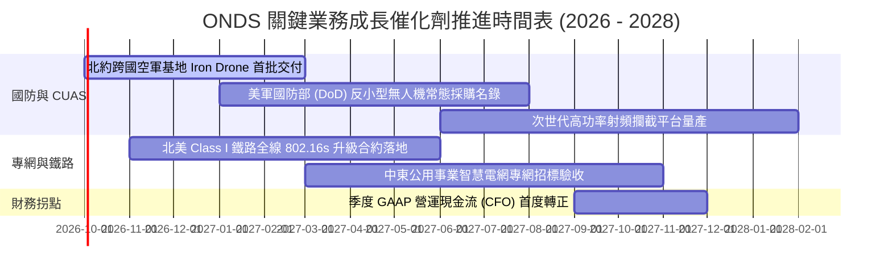

### 9.2 TAM 市場規模分析

```
╔══════════════════════════════════════════════════════════════════╗
║                   ONDS 目標市場 (TAM) 規模分析                   ║
╠══════════════════════════════════════════════════════════════════╣
║                                                                  ║
║  1. 全球反無人機防禦 (CUAS) 市場                                ║
║     ├── 2026 TAM: $4.2B ──► 2030E TAM: $12.8B (CAGR: 32.1%)     ║
║     ├── ONDS 目前滲透率：~3.2%                                   ║
║     └── 預估 2028 貢獻營收：$350M - $500M                       ║
║                                                                  ║
║  2. 全球關鍵基礎設施專網通訊 (MC-IoT & Railway)                  ║
║     ├── 2026 TAM: $6.5B ──► 2030E TAM: $11.2B (CAGR: 14.5%)     ║
║     ├── ONDS 目前滲透率：~0.6%                                   ║
║     └── 預估 2028 貢獻營收：$80M - $120M                        ║
║                                                                  ║
║  3. 自主無人機機巢巡檢 (Drone-in-a-Box Data-as-a-Service)        ║
║     ├── 2026 TAM: $2.1B ──► 2030E TAM: $7.4B (CAGR: 37.0%)      ║
║     └── 預估 2028 貢獻營收：$50M - $90M                         ║
║                                                                  ║
║  📊 合計潛在市場空間 (TAM)：>$25B ｜ 當前 ONDS 總滲透率 < 1.0%   ║
╚══════════════════════════════════════════════════════════════════╝
```

### 9.3 成長驅動力結構圖

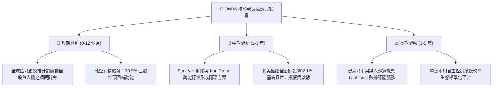

---

## 10. 風險矩陣

### 10.1 風險評分矩陣

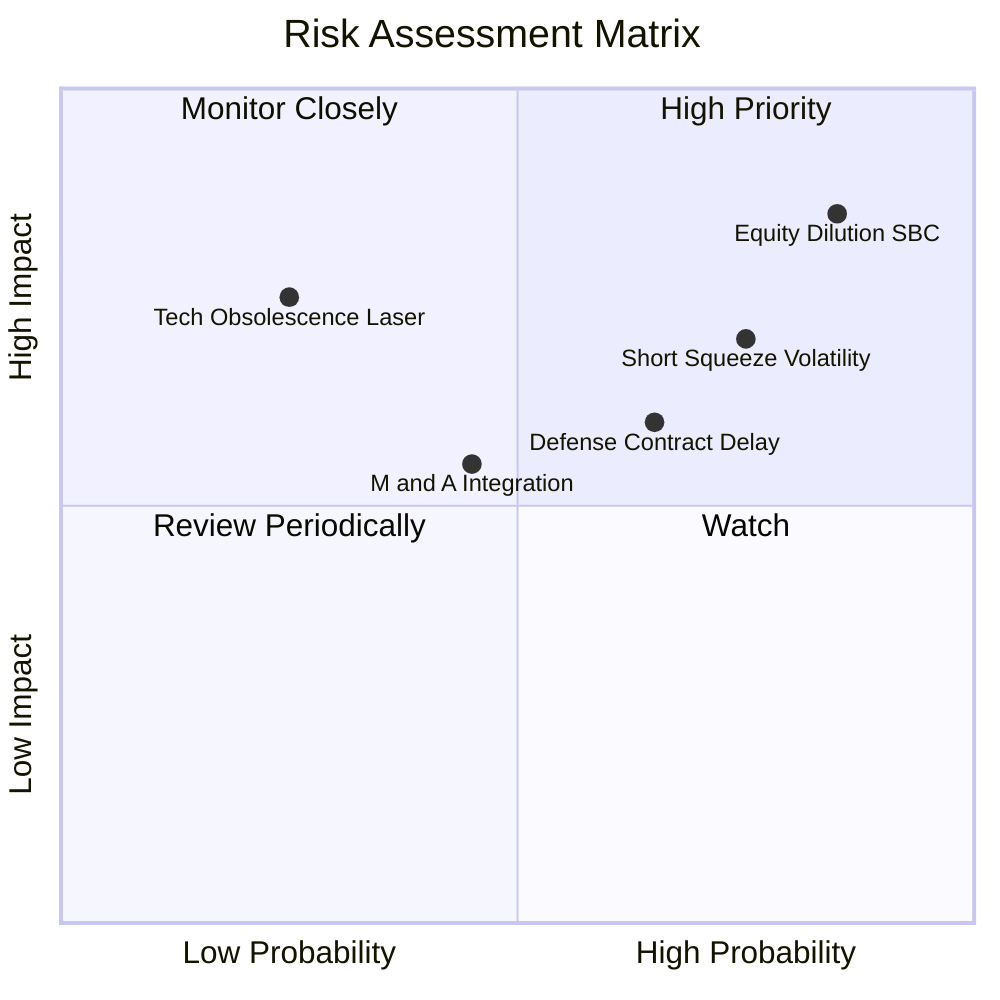

### 10.2 風險清單詳細分析

| # | 風險項目 | 發生機率 | 財務衝擊 | 風險評分 | 緩解措施與觀察指標 |
|---|----------|----------|----------|----------|-------------------|
| 1 | 🔴 **股權稀釋與高管薪酬失控** | 高 (85%) | 高 (-20% 每股價值) | 🔴 8.5/10 | 觀察薪酬委員會是否設定嚴格的 GAAP 本業獲利門檻作為限制性股票（RSU）解鎖條件。 |
| 2 | 🔴 **極端空頭與流動性踩踏** | 高 (75%) | 高 (股價震幅 >50%) | 🔴 7.8/10 | 空頭比例達 39.9%，投資人應以現股分批進場，嚴禁過度使用融資槓桿以防斷頭。 |
| 3 | 🟡 **國防專案採購週期遞延** | 中 (65%) | 中 (-15% 營收目標) | 🟡 6.5/10 | 擴展跨國客戶（歐洲北約、中東阿聯酋），降低對單一國家國防部預算審批之依賴度。 |
| 4 | 🟡 **併購整合商譽減損風險** | 中 (45%) | 中 (產生帳面減損) | 🟡 5.5/10 | 帳上商譽達 $661M，需追蹤 Sentrycs 等被收購實體之營收與專利協同效應是否如期釋放。 |
| 5 | 🟢 **次世代反無人機技術顛覆** | 低 (25%) | 極高 (-40% 長期價值) | 🟡 5.0/10 | 定向能（高功率微波與雷射）受天候與散熱限制，短期內動能攔截網與射頻欺騙依然具性價比優勢。 |

---

## 11. 投資建議

### 11.1 最終綜合評級雷達圖

```
╔══════════════════════════════════════════════════════════════════╗
║                  ONDS 綜合維度評級雷達圖                         ║
╠══════════════════════════════════════════════════════════════╣
║                                                                  ║
║  營收成長爆發力 (9.5/10)  ███████████████████░  極高             ║
║  資產負債表抗風險 (9.0/10)██████████████████░░  極穩（淨現金強勁）║
║  技術專利與市場卡位 (8.5) █████████████████░░░  優異             ║
║  估值吸引力與空間 (7.0/10)██████████████░░░░░░  具安全邊際       ║
║  護城河深度 (6.4/10)      █████████████░░░░░░░  中等             ║
║  管理層資本配置 (5.8/10)  ████████████░░░░░░░░  普通（SBC偏高）  ║
║  盈餘品質與現金流 (3.5/10)███████░░░░░░░░░░░░░  低劣（尚未轉正） ║
║  ──────────────────────────────────────────────────────────────  ║
║  ★ 綜合投資評分：6.8 / 10  🟢 評級：買入（投機型成長，Speculative Buy）║
╚══════════════════════════════════════════════════════════════════╝
```

### 11.2 目標價與隱含報酬率

| 情境 | 目標價 | 隱含報酬率（相對現價 $7.39） | 機率賦權 | 核心觸發情境依據 |
|------|--------|------------------------------|----------|------------------|
| 🔴 **悲觀情境** | **$5.20** | **-29.6%** | 25% | 營收放緩至 30% 以下，SBC 繼續無節制稀釋，國防訂單認列推遲。 |
| 🟡 **基準情境 (12M)** | **$12.50** | **+69.1%** | **55%** | 2027 年預期營收達 3.8 億美元，CUAS 產能如期翻倍，空頭部分平倉。 |
| 🟢 **樂觀情境** | **$19.50** | **+163.9%** | 20% | 贏得美軍反小型無人機跨年度主合約，單季營業利潤提早轉正，暴力軋空。 |

### 11.3 買入時機與觸發因素

```
╔══════════════════════════════════════════════════════════════════╗
║                  ✅ 買入觸發因素 Checklist                      ║
╠══════════════════════════════════════════════════════════════════╣
║                                                                  ║
║  立即分批建倉觸發條件（當前大多符合）：                          ║
║  ✅ 股價回調至 $6.50 – $7.50 區間（對應加權公允值 35%+ 安全邊際）║
║  ✅ 最新季報營收 YoY 維持三位數以上狂飆（Q2 YoY +1235%）        ║
║  ✅ 帳上淨現金高達 $1.34B，下檔清算價值極高                      ║
║                                                                  ║
║  後續積極加碼觸發條件（出現以下任一）：                          ║
║  ☐ 單季股權激勵費用 (SBC) 佔營收比重大幅下降至 30% 以下        ║
║  ☐ 贏得單筆超過 1 億美元之官方國防採購主合約                    ║
║  ☐ 季度營業現金流 (CFO) 實質轉正                                ║
║                                                                  ║
║  停損/果斷出場觸發條件（出現以下任一）：                         ║
║  ☐ 帳上現金因盲目收購而在 4 季內消耗超過 5 億美元                ║
║  ☐ 核心反無人機系統在實戰中被確認遭大規模電磁干擾失效          ║
║  ☐ 核心技術高管與創始工程團隊集體離職                            ║
╚══════════════════════════════════════════════════════════════════╝
```

### 11.4 投資人適配度分析

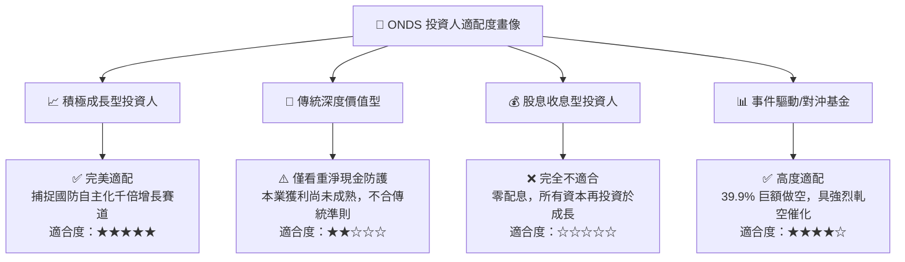

### 11.5 每季財報監控清單（Quarterly Watch List）

| 監控維度 | 關鍵財務/營運指標 | 正常目標區間 | 觸發加碼門檻 (Bull) | 觸發警示/減碼門檻 (Bear) |
|----------|-------------------|--------------|---------------------|--------------------------|
| **營收動能** | 單季營收規模 | $80M – $120M | > $130M (QoQ > 30%) | < $60M (動能斷崖) |
| **獲利品質** | 單季 SBC 佔營收比例 | 30% – 50% | < 25% (股權稀釋收斂)| > 70% (管理層過度自肥) |
| **毛利穩定** | GAAP 毛利率 | 42% – 46% | > 48% (軟體授權擴張)| < 35% (硬體成本失控) |
| **現金流失** | 單季 FCF 淨流出 | < $40M | 轉正 (FCF > $0) | 流出 > $100M / 季 |
| **流動性底線**| 現金及短期投資餘額 | > $1,000M | > $1,200M (留存穩固)| < $700M (資本過度消耗) |
| **合約存量** | 國防與專網待交付訂單 (Backlog) | > $200M | > $350M | 停止揭露或連續兩季下滑 |

### 11.6 反面論證：什麼會證明論點錯誤（What Would Change My Mind）

```
╔══════════════════════════════════════════════════════════════════╗
║              ⚠️ 論點失效條件（Disconfirming Evidence）           ║
╠══════════════════════════════════════════════════════════════════╣
║  若未來 2-4 季出現以下情事，本買入報告之多頭核心支柱即告瓦解：   ║
║                                                                  ║
║  1. 季度營收連續兩季出現 QoQ 負成長（跌破 $60M/季）：            ║
║     證明前期暴衝僅為一次性小批量出貨，非可持續的防務採購。       ║
║                                                                  ║
║  2. 2027 年底前營業利益率 (Operating Margin) 仍低於 -50%：       ║
║     證明規模經濟完全無法覆蓋龐大研發與行政開銷，商業模式缺陷。   ║
║                                                                  ║
║  3. 股權稀釋失控，流通股數突破 7 億股：                          ║
║     現有股東價值被巨額股權薪酬徹底攤薄，抵銷本業營收成長紅利。   ║
║                                                                  ║
║  4. 帳上 $1.38B 現金因高溢價、無協同效應之盲目併購消耗殆盡：    ║
║     若喪失強大淨現金安全護盾，公司將重新面臨嚴峻破產重組風險。   ║
╚══════════════════════════════════════════════════════════════════╝
```

---
> **免責聲明**：本報告為 AI 自動生成之深度基本面研究框架，引用數據截至 2026 年 9 月 18 日之公開即時市場與財務資訊。本報告所含資訊與分析僅供學術與機構研究參考，絕不構成任何形式的證券買賣邀約或個人投資建議。股票投資具備高風險，特別是高空頭比例與早期成長型國防科技個股，入市前請務必諮詢合格財務顧問並獨立評估風險承受能力。