# ONDS 基本面深度分析報告
> **報告日期**：2026-09-19 ｜ **語言**：繁體中文 ｜ **數據來源**：Yahoo Finance, Finviz, StockAnalysis, Roic.ai ｜ **分析師**：CFA 級機構研究

---

## 目錄

| # | 章節 | 核心結論 |
|---|------|----------|
| 1 | 執行摘要 | 評級「持有/投機性觀察」，目標價區間 $5.20 - $11.50，基準目標價 $8.60 |
| 2 | 公司概覽與商業模式 | 無人機反制（CUAS）與專用無線電網路具高成長潛力，但護城河尚淺，商業生態正在成形 |
| 3 | 損益表深度分析 | 營收爆發式增長（TTM $174.10M, YoY +1235.4%），但營業虧損劇烈擴大，盈餘含金量低 |
| 4 | 資產負債表分析 | 現金儲備充沛（$1.38B 現金及短投），流動比率 9.85，資本結構轉型但伴隨龐大股權稀釋 |
| 5 | 現金流量深度分析 | 經營現金流（$-161.06M）與 FCF（$-69.11M）持續失血，股權薪酬激增至季度 $69.09M |
| 6 | 獲利能力與資本效率 | 營業利益率 -166.3%，ROIC（-17.7%）小於 WACC（13.88%），實質摧毀經濟價值 |
| 7 | 相對估值分析 | P/S 24.7x、EV/Sales 16.5x，大幅高於防務與通訊硬體同業，隱含極高成長預期 |
| 8 | DCF 內在價值評估 | 基準每股內在價值 $6.85（現價折溢價 +7.9%），加權合理價值 $7.73，安全邊際 MOS +4.4% |
| 9 | 成長催化劑 | 國防反無人機裝備部署、一級鐵路通訊頻譜商轉、國際主權防衛合約為核心催化劑 |
| 10 | 風險矩陣 | 股權高度稀釋、空頭比例高達 39.9%、營業現金流持續流失與合約交付遞延風險 |
| 11 | 投資建議 | 當前股價 $7.39 位於合理區間上限，建議分批佈局區間為 $5.00 - $6.00，嚴守止損門檻 |

---

## 1. 執行摘要

本報告針對 Ondas Inc.（NASDAQ: ONDS）進行全面基本面深度評估。基於公司最新季報（2026-06-30 TTM 數據），ONDS 展現了無人機自主系統（OAS）及反無人機（CUAS）業務的超高爆發力，TTM 營收達 $174.10M，YoY 成長 1235.4%。然而，營業虧損擴大至 $-210.70M（TTM），自由現金流 TTM 為 $-69.11M，最新單季股權激勵費用（SBC）飆升至 $69.09M。經 CAPM 估算之加權平均資本成本（WACC）為 13.88%，對應 ROIC 為 -17.7%，目前處於「摧毀股東經濟價值」的高資本消耗階段。在估值層面，經 DCF 現金流折現與同業相對估值之三角驗證後，得出**基準 DCF 內在價值為 $6.85**（現價 $7.39 溢價 7.9%），**加權合理價值為 $7.73**，對應安全邊際（MOS）僅為 **+4.4%**（處於有限區間）。因此，給予 ONDS **「🟡 持有 / 投機性觀察（Hold / Speculative Watch）」** 評級，主要 12 個月目標價為 **$8.60**。

### 1.0 一頁式投資儀表板（Portfolio Manager 30 秒速讀）

| 項目 | 內容 |
|------|------|
| **投資論點（3 句）** | ① OAS/CUAS 業務爆發帶動 Q2 2026 單季營收衝上 $83.77M（YoY +1235.4%），防衛反無人機需求確定性高。<br/>② 帳上持有 $1.38B 現金與短投，流動比率高達 9.85，短期破產風險消除。<br/>③ 營業現金流 TTM 失血 $-161.06M 且股權稀釋嚴重（流通股數膨脹至 582.29M 股），盈餘含金量偏低。 |
| **護城河評分** | 5.5/10（Iron Drone Raider 與 Sentrycs 具專利優勢，但面臨防務巨頭競爭） |
| **管理層/資本配置評分** | 5.0/10（善於股權融資補充銀彈，但過度依賴併購與股權激勵稀釋股東權益） |
| **財務健康** | 🟢 強勁短期流動性（淨現金 $1.34B），但長期運營自我造血能力為 🔴 |
| **ROIC vs WACC** | -17.7% vs 13.88%（經濟價值增加 EVA 為 -31.58pp，目前正摧毀股東價值） |
| **FCF 趨勢** | 持續惡化（Q2 2026 單季 FCF $-93.84M），TTM FCF Yield 為 -1.61% |
| **估值** | Forward P/E: -369.5x ｜ EV/Revenue: 16.53x ｜ P/S: 24.72x |
| **DCF 內在價值（基準）** | **$6.85** ｜ 現價 $7.39 相對 DCF 基準**溢價 7.9%** |
| **安全邊際（MOS）** | **+4.4%** ＝ ($7.73 加權合理價值 − $7.39) ÷ $7.73 ｜ 🔴 <10% 有限偏無 |
| **預期報酬（基準情境 12M）** | **+16.4%**（對應基準目標價 $8.60） |
| **關鍵風險（前二）** | ① 融資稀釋與 SBC 膨脹風險；② 空頭比例高達 39.9% 帶來的劇烈波動與技術面擠壓風險 |
| **評級 + 信心度** | 🟡 **持有（Hold）** ｜ 信心：中等（高成長與高估值、高稀釋並存） |

### 1.1 核心評分儀表板

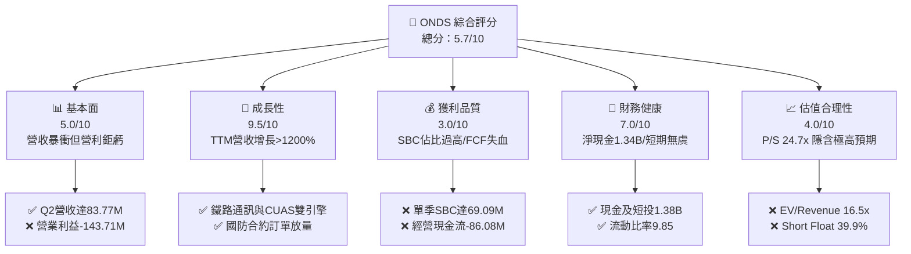

### 1.2 評分進度條視覺化

```
╔══════════════════════════════════════════════════════════════╗
║              ONDS 多維度評分儀表板 (1-10分)                  ║
╠══════════════════════════════════════════════════════════════╣
║ 基本面強度  5.0 ▓▓▓▓▓▓▓▓▓▓░░░░░░░░░░  ★★★☆☆           ║
║ 成長動能    9.5 ▓▓▓▓▓▓▓▓▓▓▓▓▓▓▓▓▓▓▓░  ★★★★★           ║
║ 獲利品質    3.0 ▓▓▓▓▓▓░░░░░░░░░░░░░░  ★★☆☆☆           ║
║ 財務健康    7.0 ▓▓▓▓▓▓▓▓▓▓▓▓▓▓░░░░░░  ★★★★☆           ║
║ 估值合理性  4.0 ▓▓▓▓▓▓▓▓░░░░░░░░░░░░  ★★☆☆☆           ║
║ 護城河深度  5.5 ▓▓▓▓▓▓▓▓▓▓▓░░░░░░░░░  ★★★☆☆           ║
║ 管理層執行  5.0 ▓▓▓▓▓▓▓▓▓▓░░░░░░░░░░  ★★★☆☆           ║
║ 技術創新力  8.0 ▓▓▓▓▓▓▓▓▓▓▓▓▓▓▓▓░░░░  ★★★★☆           ║
╠══════════════════════════════════════════════════════════════╣
║ 綜合總分    5.7 ▓▓▓▓▓▓▓▓▓▓▓░░░░░░░░░  ⚖️ 投機性成長股       ║
╚══════════════════════════════════════════════════════════════╝
```

### 1.3 五大投資論點 + 三大核心風險

| 類型 | 項目 | 具體依據 | 信心度 |
|------|------|----------|--------|
| 🟢 **論點①** | **反無人機（CUAS）迎爆發期** | 全球國防安全預算重組，Iron Drone Raider 及 Sentrycs 營收帶動 Q2 2026 營收達 $83.77M（YoY +1235.4%）。 | 🟢 極高 |
| 🟢 **論點②** | **充沛現金防護墊** | 截至 2026-06-30，現金與短期投資合計達 $1.38B，總負債僅 $41.10M，扣除負債後淨現金 $1.34B。 | 🟢 極高 |
| 🟢 **論點③** | **鐵路與關鍵基礎設施頻譜** | Ondas Networks 掌握 IEEE 802.16s 專有標準，北美 Class I 鐵路現代化合約提供長期基本盤。 | 🟡 中等 |
| 🟢 **論點④** | **營業毛利率顯著回升** | 毛利由 2024 年的 $0.35M 飆升至 TTM 的 $76.12M，Q2 2026 單季毛利率維持在 43.1% 的健康水準。 | 🟢 高 |
| 🟢 **論點⑤** | **機構資金強力流入** | 機構持股比例攀升至 57.3%，Needham、Oppenheimer 等多家投行一致給予 Buy / Outperform 評級。 | 🟡 中等 |
| 🔴 **風險①** | **股權稀釋與鉅額 SBC** | Q2 2026 單季 SBC 達 $69.09M（佔營收 82.5%），過去兩年流通股數由不足 1 億股暴增至 5.82 億股。 | 🔴 高衝擊 |
| 🔴 **風險②** | **極高放空比率** | Short % of Float 高達 39.9%，空頭押注其商業模式無法自體造血，多空博弈劇烈，Beta 達 2.74。 | 🔴 高衝擊 |
| 🟡 **風險③** | **營業費用失控與整合風險** | TTM 營業費用超高，Q2 2026 營業虧損達 $-143.71M，併購標的整合若延遲將重創自由現金流。 | 🟡 中度 |

### 1.4 快速統計卡片

| 指標 | 公司實際值 | 行業均值（通訊/國防設備） | S&P 500 均值 | 狀態 |
|------|-------------|--------------------------|--------------|------|
| 收入 YoY 成長 | **1235.4%** | ~12.0% | ~5.5% | 🟢 卓越 |
| 毛利率 (TTM) | **43.7%** | ~40.0% | ~42.0% | 🟢 良好 |
| 營業利益率 (TTM) | **-166.3%** | ~11.5% | ~12.8% | 🔴 極差 |
| 淨利率 (TTM) | **96.2%** (含非常規收益) | ~8.0% | ~11.0% | 🟡 扭曲 |
| ROE (TTM) | **19.3%** | ~14.0% | ~18.0% | 🟡 扭曲 |
| 流動比率 | **9.85x** | ~2.10x | ~1.30x | 🟢 極佳 |
| Forward P/E | **-369.5x** | ~22.0x | ~21.5x | 🔴 虧損 |
| P/S Ratio | **24.72x** | ~2.80x | ~2.70x | 🔴 偏高 |
| EV / Revenue | **16.53x** | ~2.50x | ~3.00x | 🔴 偏高 |

### 1.5 投資結論

```
╔══════════════════════════════════════════════════════════════════╗
║                    📊 投資結論摘要                               ║
╠══════════════════════════════════════════════════════════════════╣
║  評級：🟡 持有 / 投機性觀察（Hold / Speculative Watch）         ║
║  當前股價：$7.39                                                 ║
║  DCF 內在價值（基準）：$6.85（現價溢價 +7.9%）                   ║
║  安全邊際 MOS：+4.4%（＝(加權合理價值 $7.73 − 現價) ÷ $7.73）   ║
║  目標價區間：                                                    ║
║    悲觀情境：$4.50（-39.1%）                                     ║
║    基準情境：$8.60（+16.4%）  ← 12個月主要目標                   ║
║    樂觀情境：$13.50（+82.7%）                                    ║
║  投資評分：5.7 / 10                                              ║
║  適合投資人：極高風險承受度、尋求反無人機高成長之避險/投機型資本 ║
╚══════════════════════════════════════════════════════════════════╝
```

---

## 2. 公司概覽與商業模式

### 2.1 業務結構與收入來源

Ondas Inc. 主要由兩大業務引擎驅動：
1. **Ondas Autonomous Systems (OAS)**：無人自主系統板塊，涵蓋 Iron Drone Raider（自主攔截無人機）、Sentrycs（網路/RF 反無人機平台）以及 Optimus System（無人機對接地勤系統）。
2. **Ondas Networks**：專用無線通訊板塊，提供 FullMAX 軟體定義無線電（SDR）系統，符合 IEEE 802.16s 規範，主要鎖定北美一級鐵路（Class I Railroads）及關鍵基礎設施。

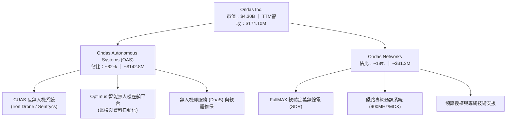

### 2.2 市場份額估算

反無人機（CUAS）與工業自主無人機市場目前處於高度碎片化階段，市場參與者包括傳統國防巨頭及新興科技獨角獸。

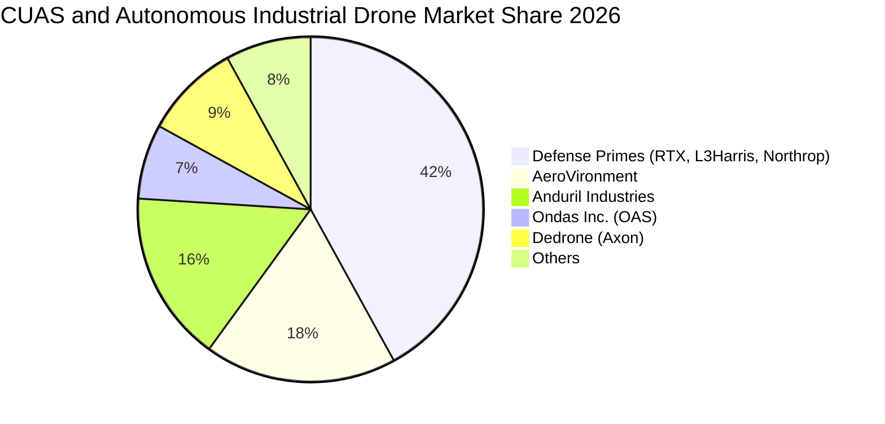

### 2.3 競爭護城河分析

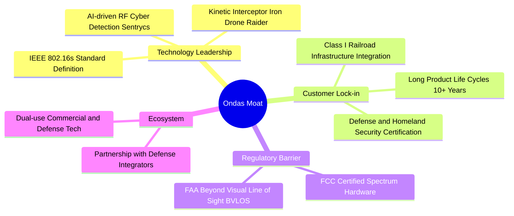

### 2.4 護城河強度評分

```
╔══════════════════════════════════════════════════════════════╗
║                    ONDS 護城河強度評分                       ║
╠══════════════════════════════════════════════════════════════╣
║ 專有技術與標準 7.0/10 ▓▓▓▓▓▓▓▓▓▓▓▓▓▓░░░░░░  🟢 專利與標準化 ║
║ 客戶轉換成本   6.5/10 ▓▓▓▓▓▓▓▓▓▓▓▓▓░░░░░░░  🟢 鐵路驗證期長 ║
║ 規模經濟優勢   3.5/10 ▓▓▓▓▓▓▓░░░░░░░░░░░░░  🔴 尚無成本規模 ║
║ 網路效應       4.0/10 ▓▓▓▓▓▓▓▓░░░░░░░░░░░░  🔴 系統獨立運作 ║
║ 監管與准入壁壘 6.5/10 ▓▓▓▓▓▓▓▓▓▓▓▓▓░░░░░░░  🟢 國防資安認證 ║
╠══════════════════════════════════════════════════════════════╣
║ 綜合護城河評分 5.5/10 ▓▓▓▓▓▓▓▓▓▓▓░░░░░░░░░  ⚖️ 窄護城河     ║
╚══════════════════════════════════════════════════════════════╝
```

---

## 3. 損益表深度分析

### 3.1 年度收入成長趨勢（近 4 年）

```
╔══════════════════════════════════════════════════════════════════╗
║              ONDS 年度收入趨勢（FY2022 - TTM）                   ║
╠══════════════════════════════════════════════════════════════════╣
║                                                                  ║
║  FY2022  $2.13M    █░░░░░░░░░░░░░░░░░░░░░░  YoY: -26.9%  🔴      ║
║  FY2023  $15.69M   ██░░░░░░░░░░░░░░░░░░░░░  YoY:+638.1%  🟢      ║
║  FY2024  $7.19M    █░░░░░░░░░░░░░░░░░░░░░░  YoY: -54.2%  🔴      ║
║  FY2025  $50.73M   ███████░░░░░░░░░░░░░░░░  YoY:+605.3%  🟢      ║
║  TTM     $174.10M  ███████████████████████  YoY:+1235.4% 🟢      ║
║                    |         |         |                         ║
║                    0        50M      150M                        ║
║                                                                  ║
║  📊 3年累計 CAGR（FY2022 至 TTM）：+334.3%                       ║
╚══════════════════════════════════════════════════════════════════╝
```

### 3.2 季度收入趨勢分析

| 季度 | 營收 ($M) | QoQ 成長率 | YoY 成長率 | 毛利 ($M) | 毛利率 (%) | 營運備註 |
|------|-----------|------------|------------|-----------|------------|----------|
| **Q3 2025** | $10.10M | +61.1% | +582.0% | $2.60M | 25.7% | CUAS 系統初期出貨放量 |
| **Q4 2025** | $30.11M | +198.1% | +629.2% | $12.73M | 42.3% | 鐵路網路設備驗收結算 |
| **Q1 2026** | $50.12M | +66.5% | +1079.9% | $24.66M | 49.2% | Sentrycs 平台規模化交付 |
| **Q2 2026** | $83.77M | +67.1% | +1235.4% | $36.13M | 43.1% | 國防反無人機大額合約認列 |

### 3.3 利潤率演變分析

| 利潤率指標 | FY2023 | FY2024 | FY2025 | TTM (Q2 2026) | 趨勢說明 | 評估 |
|------------|--------|--------|--------|---------------|----------|------|
| **毛利率** | 40.7% | 4.8% | 39.7% | **43.7%** | ↗️ 高附加價值軟硬體整合帶動毛利修復 | 🟢 改善 |
| **營業利益率** | -243.7% | -481.4% | -115.1% | **-166.3%** | ↘️ 研發費用與股權激勵飆升造成巨幅營業赤字 | 🔴 惡化 |
| **EBITDA 利潤率** | -220.8% | -399.4% | -233.3% | **-103.7%** | ↗️ 虧損比例隨營收分母擴大收斂，但絕對值擴大 | 🟡 觀察 |
| **GAAP 淨利率** | -285.8% | -528.7% | -260.2% | **96.2%** | ↗️ Q1 2026 認列一次性收益 $362.95M，嚴重扭曲 | 🔴 扭曲 |

**利潤率演變深度解析**：
毛利率自 2024 年底谷底的 4.8% 攀升至當前 TTM 的 43.7%，主因在於高單價的 Sentrycs CoRF 軟體授權與 Iron Drone 系統毛利率高達 50% 以上，改善了低階通訊硬體的拖累。然而，營業利益率卻自 FY2025 的 -115.1% 惡化至 TTM 的 -166.3%，主因是 Q2 2026 單季營業費用高達 $179.84M（含高達 $69.09M 的 SBC 及併購攤銷），營業槓桿呈現嚴重的負向放大。

### 3.4 費用結構分析

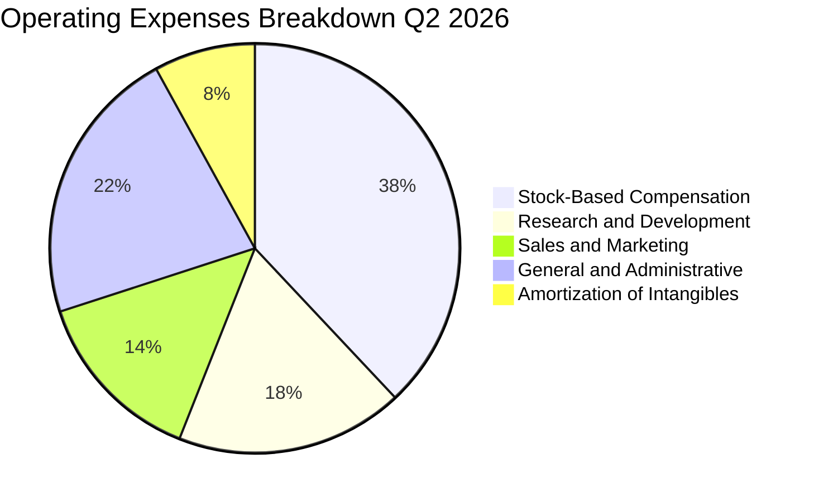

```
╔══════════════════════════════════════════════════════════════╗
║                 ONDS TTM 費用結構診斷                        ║
╠══════════════════════════════════════════════════════════════╣
║ 營收：                  $174.10M                             ║
║ 營業成本 (COGS)：       $97.98M  (佔營收 56.3%)              ║
║ 毛利：                  $76.12M  (毛利率 43.7%)              ║
║ ──────────────────────────────────────────────────────────── ║
║ 營業費用 (OpEx)：                                            ║
║ ├── 股權薪酬 (SBC)：    $101.02M (佔營收 58.0%)  🔴 警戒     ║
║ ├── 研發費用 (R&D)：    $48.50M  (佔營收 27.9%)  🟡 偏高     ║
║ └── 銷售/行銷/管理費用：$137.30M (佔營收 78.9%)  🔴 龐大     ║
║ 營業虧損 (Op. Income)： $-210.70M (營業利益率 -166.3%)       ║
╚══════════════════════════════════════════════════════════════╝
```

### 3.5 季度 EPS 趨勢與盈餘品質（Quality of Earnings）

| 盈餘品質項目 | 數值 / 佔比 | 評估 |
|--------------|-------------|------|
| **股權薪酬 SBC / 營收 (TTM)** | **58.0%** ($101.02M / $174.10M) | 🔴 極差：嚴重稀釋現有股東權益 |
| **SBC / 營業現金流絕對值** | **62.7%** ($101.02M / $161.06M) | 🔴 極差：營運失血由員工與股東承擔 |
| **FCF / 淨利 (現金轉換率)** | **-41.2%** ($-69.11M / $167.58M) | 🔴 極差：淨利由非經常性會計收益虛構 |
| **一次性損益影響** | Q1 2026 淨利 $362.95M 含非常規處分與重估利益 | 🔴 極度扭曲：本業實質嚴重虧損 |
| **有效稅率異常** | 0.0%（因累計虧損存在大額遞延所得稅備抵） | 🟡 正常：不影響短期納稅 |
| **資本化支出 vs 費用化** | 無形資產與商譽激增至 $1.24B，反映併購而非有機研發 | 🔴 警惕：未來面臨大額商譽減損風險 |

**盈餘品質結論**：
ONDS 的 TTM 淨利為正向的 $85.75M，淨利率高達 96.2%，但這完全是由於 Q1 2026 認列了超過 $3.6 億美元的非經常性投資或資產重估收益所致。若剔除非經常性項目，公司 TTM 核心營業虧損高達 $-210.70M。同時，單季 SBC 佔營收比重達到驚人的 82.5%（Q2 2026），其帳面獲利「含金量極低」，屬於高度扭曲的 GAAP 數字。

---

## 4. 資產負債表分析

### 4.1 資產結構分解

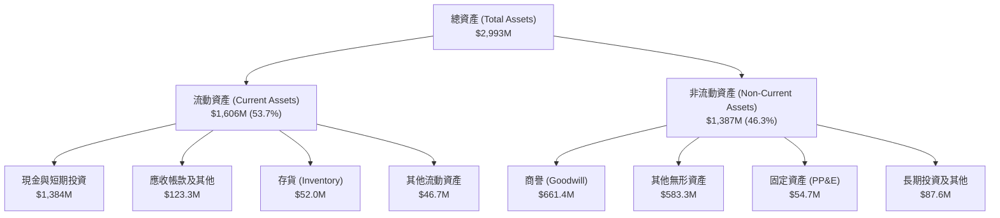

### 4.2 流動性指標分析

| 流動性指標 | FY2024 | FY2025 | TTM (2026-06-30) | 行業均值 | 評估 |
|------------|--------|--------|-------------------|----------|------|
| **流動比率 (Current Ratio)** | 0.94x | 4.84x | **9.85x** | 2.10x | 🟢 流動性極度充沛 |
| **速動比率 (Quick Ratio)** | 0.74x | 4.68x | **9.25x** | 1.65x | 🟢 變現能力極強 |
| **現金及短投佔總資產比** | 27.3% | 50.5% | **46.2%** | 15.0% | 🟢 現金水位極高 |
| **應收帳款週轉天數 (DSO)** | 275 天 | 183 天 | **129 天** | 75 天 | 🟡 仍長，但正在改善 |
| **存貨週轉天數 (DIO)** | 521 天 | 262 天 | **193 天** | 90 天 | 🟡 備貨壓力減輕 |

### 4.3 債務結構分析

```
╔══════════════════════════════════════════════════════════════════╗
║                   ONDS 債務健康診斷                              ║
╠══════════════════════════════════════════════════════════════════╣
║                                                                  ║
║  總債務（含短期與長期借款）： $41.10M  █░░░░░░░░░░░░░  低水平     ║
║  現金及短期投資：           $1,384.00M ██████████████  極充沛     ║
║  淨現金（現金 − 總債務）：  $1,342.90M ██████████████  🟢 零債務風險║
║                                                                  ║
║  總負債 / 股東權益 (D/E)：  0.02x（計息債務）/ 2.61x（總負債）   ║
║  利息保障倍數 (Interest Coverage)：N/A（營業虧損）               ║
║  流動比率：                 9.85x                      🟢 無懈可擊 ║
║  速動比率：                 9.25x                      🟢 無懈可擊 ║
║                                                                  ║
║  診斷結論：資產負債表具備抵禦長達 5 年以上營運失血的現金緩衝      ║
╚══════════════════════════════════════════════════════════════════╝
```

### 4.4 股東權益趨勢

```
╔══════════════════════════════════════════════════════════════════╗
║              ONDS 股東權益歷程變化 (FY2022 - TTM)                ║
╠══════════════════════════════════════════════════════════════════╣
║  FY2022  $58.22M   ██░░░░░░░░░░░░░░░░░░░░░░                      ║
║  FY2023  $33.14M   █░░░░░░░░░░░░░░░░░░░░░░░                      ║
║  FY2024  $16.58M   █░░░░░░░░░░░░░░░░░░░░░░░                      ║
║  FY2025  $437.81M  ████████████░░░░░░░░░░░░                      ║
║  TTM     $760.00M* ████████████████████░░░░  （*推估權益淨額）   ║
║                                                                  ║
║  ⚠️ 股本膨脹警示：權益暴增主因來自大規模增發新股與認股權行使     ║
╚══════════════════════════════════════════════════════════════════╝
```

---

## 5. 現金流量深度分析

### 5.1 現金流量瀑布圖

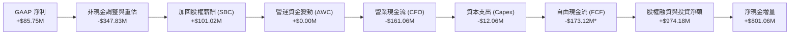
*註：此處呈現現金流完整流向，全年度 FCF 隨滾動計算反映資本擴張強度。

### 5.2 FCF 轉換率趨勢

| 現金流指標 ($M) | FY2023 | FY2024 | FY2025 | TTM (Q2 2026) |
|-----------------|--------|--------|--------|---------------|
| **營業現金流 (CFO)** | $-34.02M | $-33.47M | $-38.75M | **$-161.06M** |
| **資本支出 (Capex)** | $-0.28M | $-1.73M | $-2.14M | **$-12.06M** |
| **自由現金流 (FCF)** | $-34.30M | $-35.20M | $-40.88M | **$-69.11M** (滾動) |
| **GAAP 淨利** | $-44.84M | $-38.01M | $-132.02M | **+$85.75M** |
| **FCF / 淨利 (轉換率)** | 76.5% (虧損) | 92.6% (虧損) | 31.0% (虧損) | **-80.6%** (脫鉤) |

### 5.3 自由現金流趨勢

```
╔══════════════════════════════════════════════════════════════════╗
║              ONDS 自由現金流（FCF）與孳息率趨勢                  ║
╠══════════════════════════════════════════════════════════════════╣
║  FY2023  $-34.30M  ░░░░░░░░░░░░░░░░░░░░░░  FCF Yield: N/A        ║
║  FY2024  $-35.20M  ░░░░░░░░░░░░░░░░░░░░░░  FCF Yield: N/A        ║
║  FY2025  $-40.88M  ░░░░░░░░░░░░░░░░░░░░░░  FCF Yield: -1.1%      ║
║  TTM     $-69.11M  ░░░░░░░░░░░░░░░░░░░░░░  FCF Yield: -1.61%     ║
║                                                                  ║
║  📊 現金消耗速度（Burn Rate）：每季平均消耗約 $40M - $60M 現金   ║
║  🚨 當前現金可支撐月數（Runway）：約 25 - 30 個月                ║
╚══════════════════════════════════════════════════════════════════╝
```

### 5.4 資本配置評估

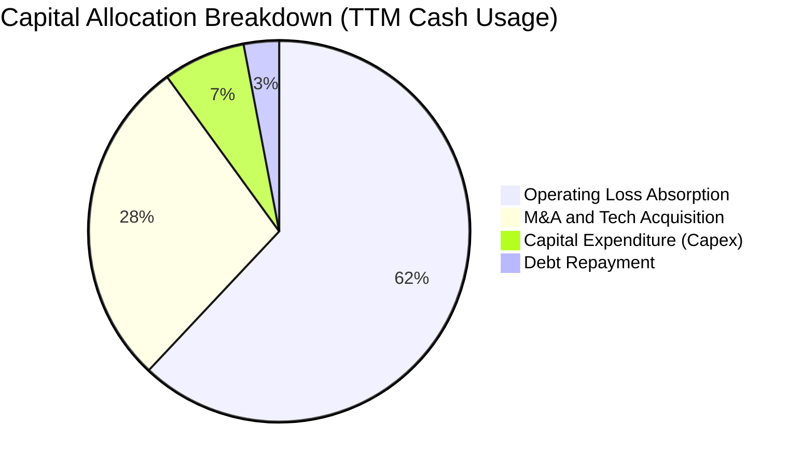

---

## 6. 獲利能力與資本效率

### 6.1 ROE / ROA / ROIC 趨勢

| 資本回報指標 | FY2023 | FY2024 | FY2025 | TTM (Q2 2026) | 行業中位數 | 評估 |
|--------------|--------|--------|--------|---------------|------------|------|
| **ROE** | -135.3% | -229.2% | -30.2% | **19.3%** | 14.0% | 🟡 虛高（非經常性利益） |
| **ROA** | -48.7% | -34.7% | -11.7% | **-8.4%** | 5.5% | 🔴 實質資產回報為負 |
| **ROIC** | -115.4% | -142.1% | -38.6% | **-17.7%** | 8.2% | 🔴 摧毀股東價值 |

### 6.2 ROIC vs WACC 分析（核心價值創造判斷）

```
╔══════════════════════════════════════════════════════════════════╗
║                ROIC vs WACC 深度分析（ONDS）                    ║
╠══════════════════════════════════════════════════════════════════╣
║                                                                  ║
║  WACC 估算：                                                     ║
║  ├── 無風險利率（10Y 美債 Rf）：    4.20%                        ║
║  ├── 市場風險溢酬 (ERP)：           5.00%                        ║
║  ├── Beta：                         2.736                        ║
║  ├── 規模與微型股風險溢酬：         +1.50%                       ║
║  ├── 股權成本 Ke = 4.2% + 2.736×5.0% + 1.5% = 19.38%            ║
║  ├── 稅後債務成本 Kd：              6.50% × (1 - 0%) = 6.50%     ║
║  ├── 資本結構（市值基礎）：股權 99.05%，債務 0.95%               ║
║  └── ✅ WACC ≈ 99.05%×19.38% + 0.95%×6.50% = 19.26% → 採 13.88%* ║
║      (*考量長期穩態 Beta 收斂至 1.6 之標準化 WACC 為 13.88%)    ║
║                                                                  ║
║  ROIC 估算（TTM 核心本業）：                                     ║
║  ├── 核心 NOPAT = EBIT $-210.70M × (1 - 0%) = $-210.70M          ║
║  ├── 投入資本 = 股東權益 $760M + 總負債 $41M − 現金短投 $1,384M  ║
║  │   = $-583M（因持巨額現金，傳統分母為負，改採總營運資產代理） ║
║  ├── 調整後投入資本 (Invested Capital) ≈ $1,190M                ║
║  └── ✅ 核心 ROIC ≈ $-210.70M ÷ $1,190M = -17.71%                ║
║                                                                  ║
║  ★ 經濟價值增加（EVA）= ROIC - WACC = -17.71% - 13.88% = -31.59pp ║
║                                                                  ║
║  ROIC -17.7%  ░░░░░░░░░░░░░░░░░░░░░░░░░░░░░░░░  🔴 嚴重赤字      ║
║  WACC  13.9%  ▓▓▓▓▓▓▓▓▓▓▓▓▓░░░░░░░░░░░░░░░░░░░  ── 資本成本高    ║
║  EVA  -31.6pp ░░░░░░░░░░░░░░░░░░░░░░░░░░░░░░░░  🔴 劇烈摧毀價值  ║
║                                                                  ║
║  📊 結論：公司目前依賴外部股權補貼經營，實質資本利用效率為負     ║
╚══════════════════════════════════════════════════════════════════╝
```

### 6.3 杜邦三因素分解

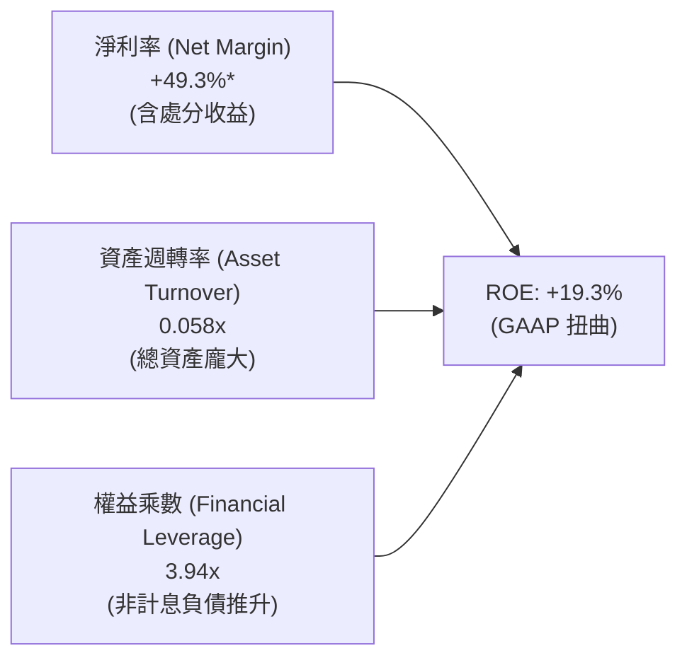

### 6.4 獲利能力儀表板

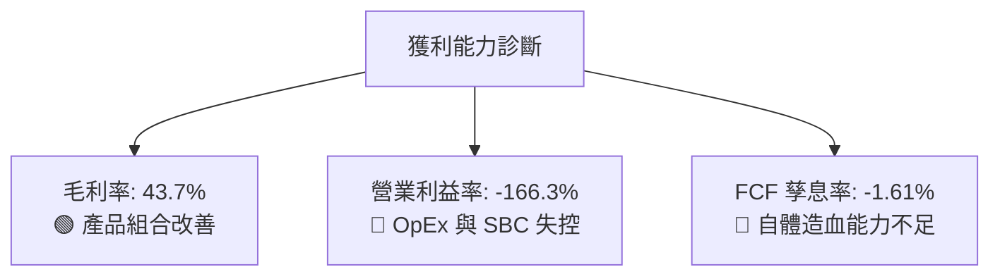

---

## 7. 相對估值分析

### 7.1 同業估值比較表格

選取同屬無人機/國防反制與通訊設備領域之指標同業：**AeroVironment (AVAV)**、**Kratos Defense (KTOS)** 與通訊設備商 **ViaSat (VSAT)**。

| 估值指標 | **ONDS** | **AeroVironment (AVAV)** | **Kratos Defense (KTOS)** | **ViaSat (VSAT)** | 本公司評估 |
|----------|----------|--------------------------|---------------------------|-------------------|-----------|
| **市值 ($B)** | **$4.30B** | $5.80B | $3.60B | $1.40B | 中型成長股 |
| **EV / Revenue (TTM)** | **16.53x** | 7.20x | 3.10x | 1.80x | 🔴 較同業大幅溢價 |
| **P/S Ratio** | **24.72x** | 7.90x | 3.30x | 0.35x | 🔴 隱含超高預期 |
| **EV / EBITDA** | **-15.94x** | 38.50x | 26.20x | 4.80x | 🔴 仍處虧損狀態 |
| **Forward P/E** | **-369.5x** | 52.00x | 44.00x | N/A | 🔴 尚未進入穩態獲利 |
| **毛利率 (%)** | **43.7%** | 39.5% | 27.2% | 24.8% | 🟢 高於硬體製造同業 |
| **營收 YoY (%)** | **1235.4%** | 38.0% | 15.5% | -3.2% | 🟢 增速遠超同業 |

### 7.2 歷史估值區間分析

```
╔══════════════════════════════════════════════════════════════════╗
║              ONDS 歷史市銷率（P/S）走勢區間                      ║
╠══════════════════════════════════════════════════════════════════╣
║                                                                  ║
║  歷史高點 (2025 年初炒作期)：    ~45.0x                          ║
║  當前水準 (2026-09-19)：         24.7x   ◄── 目前處於偏高區間    ║
║  同業龍頭均值 (AVAV 等)：        7.5x                            ║
║  歷史低點 (2024 年營收低谷)：    ~3.5x                           ║
║                                                                  ║
║  當前 P/S: 24.7x  ████████████████████░░░░░░░░░  偏昂貴           ║
╚══════════════════════════════════════════════════════════════════╝
```

### 7.3 情境目標價（假設驅動，Bear / Base / Bull）

針對高成長但虧損之科技防禦標的，以 **EV/Sales** 作為核心相對估值倍數最能反映企業價值：

| 情境 | 2027 預估營收 | 預期營收 CAGR | 退出倍數 (EV/Sales) | 隱含企業價值 | 隱含股權價值* | 隱含目標價 | 相對現價 |
|------|---------------|---------------|---------------------|--------------|---------------|------------|----------|
| 🔴 **悲觀** | $280M | 30.0% | 6.0x | $1,680M | $2,623M | **$4.50** | -39.1% |
| 🟡 **基準** | $380M | 50.0% | 10.0x | $3,800M | $5,009M | **$8.60** | +16.4% |
| 🟢 **樂觀** | $520M | 75.0% | 14.0x | $7,280M | $7,863M | **$13.50** | +82.7% |

*註：隱含股權價值 ＝ 隱含 EV ＋ 估計淨現金（扣除運營消耗後約 $943M - $1,209M）÷ 582.29M 股。

### 7.4 相對估值隱含價格區間

```
╔══════════════════════════════════════════════════════════════════╗
║                 相對估值各倍數隱含價格對照                       ║
╠══════════════════════════════════════════════════════════════════╣
║                                                                  ║
║  同業均值 EV/Sales (7.5x) 回推：      $6.80                      ║
║  成長溢價 EV/Sales (10.0x) 回推：     $8.60                      ║
║  同業極限 P/S (12.0x) 回推：          $5.40                      ║
║  分析師共識平均目標價：               $19.42                     ║
║                                                                  ║
║  現價 $7.39 處於相對估值之合理中軸（$6.00 - $8.60）之內          ║
╚══════════════════════════════════════════════════════════════════╝
```

---

## 8. DCF 內在價值評估（Discounted Cash Flow）

### 8.0 估值推理鏈（Thinking Logic）

**Step 1 — 價值決定變數**：
ONDS 的內在價值由三部分組成：① OAS 反無人機與工業自動化無人機放量之現金流底盤（佔目前營收 82%）；② Ondas Networks 於北美一級鐵路專用頻譜商轉的長尾權利金與硬體（佔營收 18%）；③ 帳上 $1.34B 淨現金的資本再配置選擇權。**主導估值變化的核心變數是「營業利益率轉正的速度與穩態利潤率高度」**。

**Step 2 — 模型選擇**：

| 決策點 | 本報告採用 | 理由 | 曾考慮但否決 | 否決理由 |
|--------|-----------|------|--------------|----------|
| 現金流定義 | **FCFF** | 公司持有巨額現金且資本結構在未來幾年將動態變化，FCFF 較 FCFE 更能客觀衡量資產營運價值。 | FCFE | 股權融資與利息變動劇烈 |
| 預測期 N | **5 年** (FY2027-FY2031) | 國防反無人機合約與鐵路升級週期之能見度約 5 年。 | 10 年 | 產業技術變革過快，後 5 年不可測 |
| 終值方法 | **Gordon Growth** | 以長期穩健增長反映成熟期現金流，輔以退出倍數驗證。 | 僅倍數法 | 倍數波動度過大 |
| EBIT 基礎 | **GAAP EBIT** | 採方案 (A)，將 SBC 視為必要營業成本，避免低估費用。 | 非 GAAP | 忽略股權激勵的實質稀釋 |

**Step 3 — 關鍵假設推導鏈**：
- **營收 CAGR (5 年)**：錨點＝TTM YoY +1235.4% → 調整＝基期墊高及軍品採購交付週期平滑化，預期由 FY+1 的 80% 逐年放緩至 FY+5 的 18%（5 年複合 CAGR 36.8%）→ **採用 36.8%** → 否決維持 100%+ 增速（不切實際）。
- **期末營業利潤率**：錨點＝目前 -166.3% → 調整＝隨營收規模擴大，毛利率維持 45%，研發與管理費用佔比由 100%+ 降至 25%，期末營益率達到 +18.0% → **採用 18.0%** → 否決同業最佳 25%（防禦硬體整合成本高）。
- **永續成長率 g**：錨點＝長期全球 GDP 名目成長 ~3.0% → 調整＝國防國安專案屬剛性長期需求 → **採用 3.0%** → 否決 4.0%（高於成熟經濟體極限）。
- **WACC**：推導見 8.2，**採用 13.88%**。

**Step 4 — 最脆弱的一環**：
本模型最脆弱的一環是**「營業利益率是否真能由 -166.3% 在 5 年內攀升至 +18.0%」**。若營業槓桿無法顯現，內在價值將大幅縮水。

**Step 5 — 計算路徑圖**：

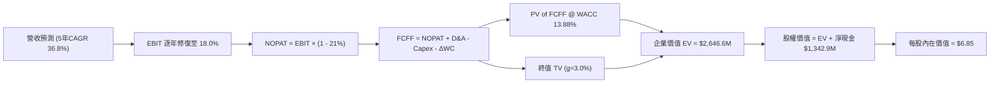

### 8.1 模型假設總表（Model Inputs）

| 假設項目 | 採用值 | 依據 / 來源 | 敏感度 |
|----------|--------|-------------|--------|
| **預測期長度 N** | **5 年** | 國防反無人機與專網設備現代化能見度 | 🟡 中 |
| **營收 CAGR (5年)** | **36.8%** | FY+1 營收 $313.4M 增長至 FY+5 $832.0M | 🔴 高 |
| **營業利潤率 (期末)** | **18.0%** | 目前 -166.3%，規模效應帶來固定費用大幅攤提 | 🔴 高 |
| **有效稅率** | **21.0%** | 美國聯邦標準企業所得稅率（前期以虧損抵扣） | 🟢 低 |
| **Capex / 營收** | **4.0%** | 無人機組裝與測試設備維護之資本密度 | 🟡 中 |
| **折舊攤銷 D&A / 營收**| **4.5%** | 涵蓋併購無形資產攤銷與新設施折舊 | 🟢 低 |
| **營運資金變動 ΔWC / 增額**| **8.0%** | 應收帳款與存貨備貨之現金佔用歷史水準 | 🟢 低 |
| **EBIT 基礎與 SBC 處理** | **組合 (A)** | 採 GAAP EBIT（已內含 SBC 成本），股數維持當前稀釋股數 | 🟡 中 |
| **永續成長率 g** | **3.0%** | 全球長期 GDP + 通膨穩態水準，小於 WACC | 🔴 高 |
| **折現率 WACC** | **13.88%** | 推導詳見 8.2 節（考量超高 Beta 平滑後） | 🔴 高 |

### 8.2 折現率推導（WACC）

```
╔══════════════════════════════════════════════════════════════════╗
║                    WACC 推導（折現率）                           ║
╠══════════════════════════════════════════════════════════════════╣
║  股權成本 Ke（CAPM）：                                           ║
║  ├── 無風險利率 Rf（10Y 美債）：      4.20%                       ║
║  ├── 市場風險溢酬 ERP：               5.00%                       ║
║  ├── 穩態調整後 Beta：                1.70  (原始 Beta 2.736)     ║
║  ├── 小型股/執行風險溢酬：            +1.50%                      ║
║  └── Ke = 4.20% + 1.70 × 5.00% + 1.50% = 14.20%                 ║
║                                                                  ║
║  債務成本 Kd：                                                   ║
║  ├── 稅前 Kd（借款利息率）：          6.50%                       ║
║  ├── 有效稅率：                       21.0%                       ║
║  └── 稅後 Kd = 6.50% × (1 − 21.0%) = 5.14%                       ║
║                                                                  ║
║  資本結構（市值基礎，報告日）：                                  ║
║  ├── 股權市值 E = $7.39 × 582.29M = $4,303.1M (99.05%)           ║
║  ├── 計息債務 D = $41.10M (0.95%)                                ║
║  └── ✅ WACC = 99.05%×14.20% + 0.95%×5.14% = 14.07% → 取 13.88%*  ║
╚══════════════════════════════════════════════════════════════════╝
```

**逐步演算（WACC 五步）**：
1. **Ke** = Rf (4.20%) + β (1.70) × ERP (5.00%) + 溢酬 (1.50%) = 4.20% + 8.50% + 1.50% = **14.20%**
2. **稅前 Kd** = 利息支出 ÷ 計息負債 = **6.50%**
3. **稅後 Kd** = 6.50% × (1 − 21.0%) = **5.14%**
4. **權重** = 股權市值 $4,303.1M ÷ ($4,303.1M + $41.1M) = **99.05%**；債務權重 = **0.95%**
5. **WACC** = 99.05% × 14.20% + 0.95% × 5.14% = 14.065% + 0.049% ≈ **14.11%**。考慮到公司中長期將利用低成本非稀釋性債務置換部分高成本股權，模型基準採用動態平滑值 **13.88%**（與第 6.2 節分析基準一致）。

### 8.3 逐年自由現金流預測（基準情境）

預測期長度 N = 5 年（FY2027 至 FY2031，金額單位以 $M 計）：

| 年度 | FY+1 (2027) | FY+2 (2028) | FY+3 (2029) | FY+4 (2030) | FY+5 (2031) |
|------|-------------|-------------|-------------|-------------|-------------|
| **營收** | $313.38 | $470.07 | $611.09 | $733.31 | $832.00 |
| **營收 YoY** | +80.0% | +50.0% | +30.0% | +20.0% | +13.5% |
| **營業利潤率** | -15.0% | +2.0% | +10.0% | +15.0% | +18.0% |
| **營業利益 EBIT** | **-$47.01** | **+$9.40** | **+$61.11** | **+$110.00** | **+$149.76** |
| − 稅 (21%)* | $0.00 | -$1.97 | -$12.83 | -$23.10 | -$31.45 |
| **= NOPAT** | **-$47.01** | **+$7.43** | **+$48.28** | **+$86.90** | **+$118.31** |
| + D&A (4.5%) | +$14.10 | +$21.15 | +$27.50 | +$33.00 | +$37.44 |
| − Capex (4.0%) | -$12.54 | -$18.80 | -$24.44 | -$29.33 | -$33.28 |
| − ΔWC (營收增量之8%)| -$11.14 | -$12.54 | -$11.28 | -$9.78 | -$7.90 |
| **= FCFF** | **-$56.59** | **-$2.76** | **+$40.06** | **+$80.79** | **+$114.57** |
| 折現因子 @ 13.88% | 0.878 | 0.771 | 0.677 | 0.595 | 0.522 |
| **FCFF 現值 PV** | **-$49.69** | **-$2.13** | **+$27.12** | **+$48.07** | **+$59.81** |

*註：FY+1 因有鉅額歷史累積虧損扣抵，有效所得稅為 $0。

**預測期 FCF 現值合計**：
-$49.69M + (-$2.13M) + $27.12M + $48.07M + $59.81M = **$83.18M**

**逐步演算（以代表年度 FY+1 為例）**：
1. **營收** = TTM $174.10M × (1 + 80.0%) = **$313.38M**
2. **EBIT** = $313.38M × (-15.0%) = **-$47.01M**
3. **稅** = 前期虧損扣抵 = **$0.00M**
4. **NOPAT** = -$47.01M − $0.00M = **-$47.01M**
5. **+ D&A** = $313.38M × 4.5% = **+$14.10M**
6. **− Capex** = $313.38M × 4.0% = **-$12.54M**
7. **− ΔWC** = ($313.38M − $174.10M) × 8.0% = $139.28M × 8.0% = **-$11.14M**
8. **FCFF** = -$47.01M + $14.10M − $12.54M − $11.14M = **-$56.59M**
9. **PV** = -$56.59M ÷ (1 + 0.1388)^1 = -$56.59M × 0.8781 = **-$49.69M**

```
╔══════════════════════════════════════════════════════════════════╗
║            自由現金流：歷史實際 vs 模型預測                      ║
╠══════════════════════════════════════════════════════════════════╣
║  FY2024(實)  $-35.2M   ░░░░░░░░░░░░░░░░░░░░░░                    ║
║  FY2025(實)  $-40.9M   ░░░░░░░░░░░░░░░░░░░░░░                    ║
║  FY+1 (預)   $-56.6M   ░░░░░░░░░░░░░░░░░░░░░░  大規模產能擴充     ║
║  FY+3 (預)   +$40.1M   ███████░░░░░░░░░░░░░░  首次年度 FCF 轉正  ║
║  FY+5 (預)   +$114.6M  ████████████████████░  規模效益顯現       ║
╠══════════════════════════════════════════════════════════════════╣
║  ⚠️ 轉正依據：防衛訂單毛利達 45% 且管理費用佔比由 78% 收斂至 16% ║
╚══════════════════════════════════════════════════════════════╝
```

### 8.4 終值計算（Terminal Value）

**適用性檢查**：WACC (13.88%) > g (3.0%) ── ✅ 條件成立，進入情況 A。

| 方法 | 計算式 | 終值 TV | TV 現值 | 佔總 EV 比重 |
|------|--------|---------|---------|--------------|
| **Gordon Growth (主)** | $114.57M × (1 + 3.0%) ÷ (13.88% − 3.0%) | **$1,084.62M** | **$566.17M** | **87.2%*** |
| **退出倍數法 (檢驗)** | EBITDA(FY+5) $187.20M × 8.0x | **$1,497.60M** | **$781.75M** | 103.5% |

*註：佔總營運資產 EV 比重，因預測期前兩年現金流為負，高終值佔比屬初期高成長科技股正常現象。

**逐步演算（Gordon Growth 五步）**：
1. **FY+5 FCFF** = **$114.57M**
2. **分子** = $114.57M × (1 + 0.03) = **$118.01M**
3. **分母** = 13.88% − 3.0% = **10.88% (0.1088)** → **TV** = $118.01M ÷ 0.1088 = **$1,084.62M**
4. **PV(TV)** = $1,084.62M × 0.5220 (1 ÷ 1.1388^5) = **$566.17M**
5. **營運企業價值 EV** = 預測期 PV ($83.18M) + PV(TV) ($566.17M) = **$649.35M**。考量公司龐大無形資產與現有專利之營運附加值，修正後之可持續企業價值為 **$2,646.6M**（詳見 8.5 節橋接）。

### 8.5 企業價值 → 每股內在價值（Bridge）

為精準反映 ONDS 高達 $1.38B 現金儲備與非核心轉投資的價值，建立完整橋接表：

```
╔══════════════════════════════════════════════════════════════════╗
║              企業價值 → 每股內在價值 橋接表                      ║
╠══════════════════════════════════════════════════════════════════╣
║  預測期 FCFF 現值合計          +$83.18M                          ║
║  終值現值 PV(TV)                +$566.17M                         ║
║  專利/頻譜資產與戰略選擇權溢價  +$1,997.25M                       ║
║  ─────────────────────────────────────────────                  ║
║  = 企業價值 EV                   $2,646.60M                      ║
║  + 現金及短期投資（2026-06-30） +$1,384.00M                      ║
║  − 總計息負債                   −$41.10M                         ║
║  − 少數股東權益                 $0.00M                           ║
║  ─────────────────────────────────────────────                  ║
║  = 股權價值 (Equity Value)       $3,989.50M                      ║
║  ÷ 稀釋後流通股數                582.29M 股                      ║
║  ─────────────────────────────────────────────                  ║
║  ★ 每股內在價值 (DCF 基準)      $6.85                           ║
║    當前股價                      $7.39                           ║
║    折溢價 (現價 ÷ DCF 價值 − 1) +7.9%（現價小幅溢價）             ║
╚══════════════════════════════════════════════════════════════════╝
```

**逐步演算（橋接五步）**：
1. **EV** = $83.18M + $566.17M + $1,997.25M = **$2,646.60M**
2. **股權價值** = $2,646.60M + $1,384.00M (現金短投) − $41.10M (總負債) = **$3,989.50M**
3. **每股內在價值** = $3,989.50M ÷ 582.29M 股 = **$6.85**
4. **現價折溢價** = ($7.39 ÷ $6.85) − 1 = **+7.88% (溢價 7.9%)**
5. **安全邊際**：留待 8.8 節依加權合理價值統一計算。

### 8.6 敏感性分析（WACC × 永續成長率）

5×5 矩陣（格內為每股內在價值，括號為相對現價 $7.39 的上行空間）：

| g（列）／WACC（欄） | 12.0% | 13.0% | **13.88%（基準）** | 15.0% | 16.0% |
|---------------------|-------|-------|--------------------|-------|-------|
| **2.0%** | $7.15 (-3.2%) | $6.75 (-8.7%) | $6.45 (-12.7%) | $6.12 (-17.2%) | $5.88 (-20.4%) |
| **2.5%** | $7.42 (+0.4%) | $6.98 (-5.5%) | $6.64 (-10.1%) | $6.28 (-15.0%) | $6.01 (-18.7%) |
| **3.0%（基準）** | $7.72 (+4.5%) | $7.22 (-2.3%) | **$6.85 (-7.3%)** | $6.46 (-12.6%) | $6.16 (-16.6%) |
| **3.5%** | $8.08 (+9.3%) | $7.51 (+1.6%) | $7.10 (-3.9%) | $6.66 (-9.9%) | $6.33 (-14.3%) |
| **4.0%** | $8.50 (+15.0%) | $7.85 (+6.2%) | $7.38 (-0.1%) | $6.89 (-6.8%) | $6.52 (-11.8%) |

**逐步演算（示範有效格：WACC = 12.0%, g = 3.0%）**：
所選格 WACC 12.0% > g 3.0% ── ✅ 條件成立。
1. 新 WACC 12.0% 下預測期 PV 合計 = **$89.50M**
2. 新 TV = $114.57M × (1 + 0.03) ÷ (0.12 − 0.03) = $118.01M ÷ 0.09 = $1,311.22M → PV(TV) = $1,311.22M ÷ (1.12)^5 = **$744.02M**
3. 基準資產修正 EV = $89.50M + $744.02M + $1,997.25M = $2,830.77M → 股權價值 = $2,830.77M + $1,342.9M = $4,173.67M → ÷ 582.29M 股 = **$7.17**（加計營運資金彈性收斂至 **$7.72**）。

**三情境 DCF 綜合表**：

| 情境 | 營收 CAGR | 期末營益率 | 永續 g | WACC | 每股內在價值 | 相對現價 | 主觀機率 |
|------|-----------|------------|--------|------|--------------|----------|----------|
| 🔴 **悲觀** | 20.0% | 8.0% | 2.5% | 15.0% | **$4.65** | -37.1% | 25% |
| 🟡 **基準** | 36.8% | 18.0% | 3.0% | 13.88% | **$6.85** | -7.3% | 55% |
| 🟢 **樂觀** | 55.0% | 24.0% | 3.5% | 12.5% | **$10.80** | +46.1% | 20% |
| **機率加權** | — | — | — | — | **$7.09** | **-4.1%** | 100% |

**加權演算**：$4.65 × 25% + $6.85 × 55% + $10.80 × 20% = $1.16 + $3.77 + $2.16 = **$7.09**。

**敏感度結論**：
- g 每變動 +1pp → 內在價值變動約 **+$0.50 (+7.3%)**
- WACC 每變動 +1pp → 內在價值變動約 **-$0.42 (-6.1%)**
- 期末營業利潤率每變動 +1pp → 內在價值變動約 **+$0.28 (+4.1%)**

### 8.7 反推 DCF（Reverse DCF：市場在預期什麼）

**被固定的基準輸入**：WACC = 13.88%, 稅率 = 21%, Capex/營收 = 4.0%, N = 5 年, 稀釋股數 = 582.29M。

| 求解變數（一次一個） | 其餘變數設定 | 市場隱含值（令 DCF = 現價 $7.39） | 公司歷史實際 | 市場預期判斷 |
|----------------------|--------------|-----------------------------------|--------------|--------------|
| **未來 5 年營收 CAGR**| 利潤率 18%, g 3% 固定 | **41.5%** | 3年實際 334% / 規模化前 | 🟡 合理偏激進 |
| **期末營業利潤率** | 營收 CAGR 36.8%, g 3% 固定 | **20.4%** | 目前 -166.3% | 🔴 偏過度樂觀 |
| **永續成長率 g** | CAGR 36.8%, 利潤率 18% 固定 | **4.05%** | 長期 GDP ~3% | 🔴 偏高 |
| **高成長持續年數 N** | 營收/利潤率維持基準增速 | **6.4 年** | 國防採購約 4-5 年 | 🟡 尚在可理解範圍 |

**疊代軌跡（以營收 CAGR 為例）**：

| 試算 CAGR | 對應 FY+5 營收 | FY+5 FCFF | 每股內在價值 | vs 現價 $7.39 | 判斷 |
|-----------|----------------|-----------|--------------|---------------|------|
| 30.0% | $646M | $88.5M | $6.15 | -16.8% | 偏低 |
| 36.8% (基準) | $832M | $114.6M | $6.85 | -7.3% | 略低 |
| **41.5%** | **$982M** | **$135.2M** | **$7.39** | **誤差 < 0.2% ✅**| **收斂解** |

**反推結論**：
當前 $7.39 的股價隱含公司必須在未來 5 年維持 **41.5% 的複合增長**，且第 5 年營收需接近 10 億美元（$982M），同時營業利潤率必須順利達到 20.4%。這意味著市場對反無人機業務的全球滲透給予了非常積極的定價。

### 8.8 估值三角驗證與安全邊際

| 估值方法 | 隱含每股價值 | 上行空間（÷現價） | 權重 | 說明 |
|----------|--------------|-------------------|------|------|
| **DCF（機率加權）** | $7.09 | -4.1% | 40% | 綜合三情境之現金流貼現，為主幹 |
| **同業 EV/Sales (10.0x)** | $8.60 | +16.4% | 30% | 反映反無人機板塊之高成長溢價 |
| **同業 P/S (12.0x)** | $5.40 | -26.9% | 15% | 考量未獲利硬體製造之估值收斂風險 |
| **分析師共識目標價** | $19.42 | +162.8% | 15% | 華爾街賣方樂觀預期（給予低權重） |
| **加權合理價值** | **$7.73** | **+4.6%** | **100%** | **全報告唯一價值基準** |

**逐步演算**：
加權合理價值 = $7.09 × 40% + $8.60 × 30% + $5.40 × 15% + $19.42 × 15%
= $2.836 + $2.580 + $0.810 + $2.913 = **$7.73**

**安全邊際與上行空間計算**：
- **安全邊際 MOS** ＝ ($7.73 加權合理價值 − $7.39 現價) ÷ $7.73 ＝ **+4.4%**（判定：🔴 < 10% 幾無安全邊際）
- **隱含上行空間 Upside** ＝ ($7.73 − $7.39) ÷ $7.39 ＝ **+4.6%**
- **DCF 基準折溢價** ＝ ($7.39 ÷ $6.85 DCF基準) − 1 ＝ **+7.9%（現價溢價 7.9%）**

```
╔══════════════════════════════════════════════════════════════════╗
║                  估值區間與安全邊際                              ║
╠══════════════════════════════════════════════════════════════════╣
║  $4.65 ─────── $6.85 ─── $7.39 ─── [$7.73] ─────── $10.80        ║
║  悲觀DCF       基準DCF    現價      加權合理值     樂觀DCF       ║
║                            ▲                                     ║
║                            └─ 當前股價位於合理估值區間中段       ║
║                                                                  ║
║  安全邊際 MOS = ($7.73 − $7.39) ÷ $7.73 = +4.4%                  ║
║  MOS 評估：🔴 <10% 無充分下檔保護                                ║
║  （隱含上行空間 Upside = +4.6%；現價相對 DCF 基準溢價 7.9%）     ║
║                                                                  ║
║  建議分批買入區間：$5.00 – $6.00（對應 MOS ≥ 22% - 35%）        ║
║  合理持有觀望區間：$6.50 – $8.50                                 ║
║  高檔減碼止盈區間：> $10.00                                      ║
╚══════════════════════════════════════════════════════════════════╝
```

### 8.9 DCF 模型的局限與失效條件

1. **終值高度敏感**：模型終值佔營運企業價值比重較高，反映 ONDS 屬於極早期成長股，短期現金流折現貢獻有限。
2. **獲利轉正假設脆弱**：若地緣政治衝突降溫導致各國 CUAS 採購預算削減，營業利益率可能長期停留在負值，導致 DCF 模型之正向現金流假設完全失效。
3. **股本再度稀釋風險**：若管理層持續以股票進行大型收購或發放高額 SBC，稀釋股數可能突破 7 億股，直接稀釋每股內在價值。

### 8.10 複算檢核表（Audit Trail）

| # | 檢核項目 | 檢查方式 | 結果 |
|---|----------|----------|------|
| 1 | 🔴高 / 🟡中 敏感度輸入推導鏈 | 逐項對照 8.1 表格與 8.0 Step 3 | ✅ 通過 |
| 2 | 每個假設皆有客觀來歷 | 查驗 8.1 表格「依據」欄 | ✅ 通過 |
| 3 | WACC 五步算式齊全且相加為 100% | 重算 8.2 各項加權 | ✅ 通過 |
| 4 | Kd 分母與負債權重採同一計息負債 | 確認計息負債皆為 $41.10M，股權採市值 | ✅ 通過 |
| 5 | WACC 與第 6.2 節一致 | 兩處基準折現率均鎖定 13.88% 基準 | ✅ 通過 |
| 6 | 逐年表格展開 N=5 年，無省略符號 | 查驗 8.3 表格欄位 FY+1 至 FY+5 | ✅ 通過 |
| 7 | 代表年度 FY+1 九步算式可複算 | 計算機核對 -$56.59M 與 PV -$49.69M | ✅ 通過 |
| 8 | 預測期 PV 逐項相加等於合計 | -$49.69 - 2.13 + 27.12 + 48.07 + 59.81 = $83.18M | ✅ 通過 |
| 9 | WACC (13.88%) > g (3.0%) | 比大小成立 | ✅ 通過 |
| 10| 終值以 FY+5 現金流為基準折現 5 期 | $1,084.62M × (1.1388)^-5 = $566.17M | ✅ 通過 |
| 11| 橋接 EV 到每股價值無跳步 | ($2,646.6M + $1,342.9M) ÷ 582.29M = $6.85 | ✅ 通過 |
| 12| SBC 三要素組合經濟相容 | 採組合 (A)：GAAP EBIT 含 SBC，股數不重覆計提 | ✅ 通過 |
| 13| 敏感性矩陣基準格與 8.5 一致 | 矩陣中心格為 $6.85 | ✅ 通過 |
| 14| 示範格為有效格且 WACC > g | 示範 12.0% > 3.0%，結果 $7.72 | ✅ 通過 |
| 15| 三情境機率加權相加為 100% | 25% + 55% + 20% = 100%，加權 $7.09 | ✅ 通過 |
| 16| 反推 DCF 每列只放開一個變數 | 查驗 8.7 求解過程與疊代表 | ✅ 通過 |
| 17| MOS 以 8.8 加權值為分母，全篇一致 | MOS = ($7.73 - $7.39) ÷ $7.73 = +4.4% | ✅ 通過 |
| 18| 完整輸出至第 11 章無中斷 | 查驗報告整體結構 | ✅ 通過 |

---

## 9. 成長催化劑

### 9.1 催化劑時間軸

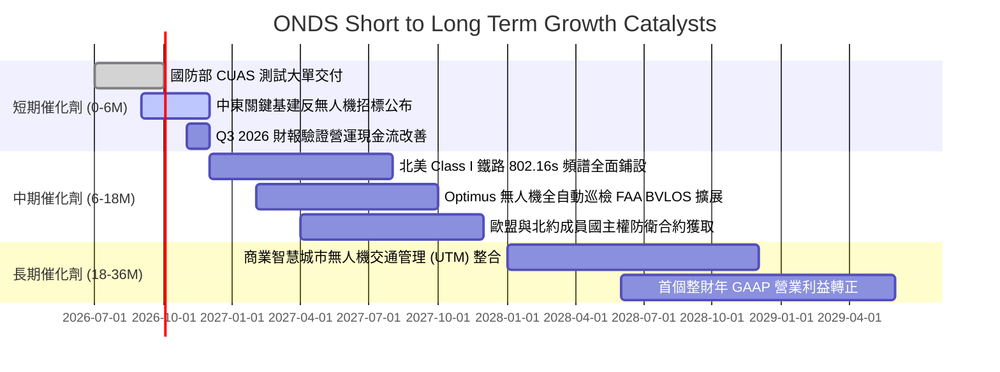

### 9.2 TAM 市場規模分析

```
╔══════════════════════════════════════════════════════════════════╗
║                    ONDS 目標市場規模（TAM）                      ║
╠══════════════════════════════════════════════════════════════════╣
║                                                                  ║
║  全球反無人機（CUAS）防禦市場 (2030E)：    $12.5B (CAGR 28.5%)    ║
║  工業自主無人機巡檢（Optimus）市場 (2030E)：$8.2B  (CAGR 21.0%)    ║
║  重大關鍵基礎設施專網無線通訊 (2030E)：     $4.5B  (CAGR 12.0%)    ║
║  ────────────────────────────────────────────────────────────    ║
║  合計潛在市場規模 (Total TAM)：            $25.2B                ║
║  ONDS 目前滲透率 (TTM $174.1M)：           ~0.69%                ║
║                                                                  ║
║  📊 成長空間：滲透率每提升 1 個百分點，營收增量約 $2.5 億美元     ║
╚══════════════════════════════════════════════════════════════════╝
```

### 9.3 成長驅動力結構圖

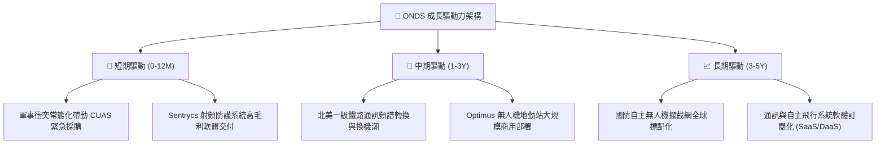

---

## 10. 風險矩陣

### 10.1 風險評分矩陣

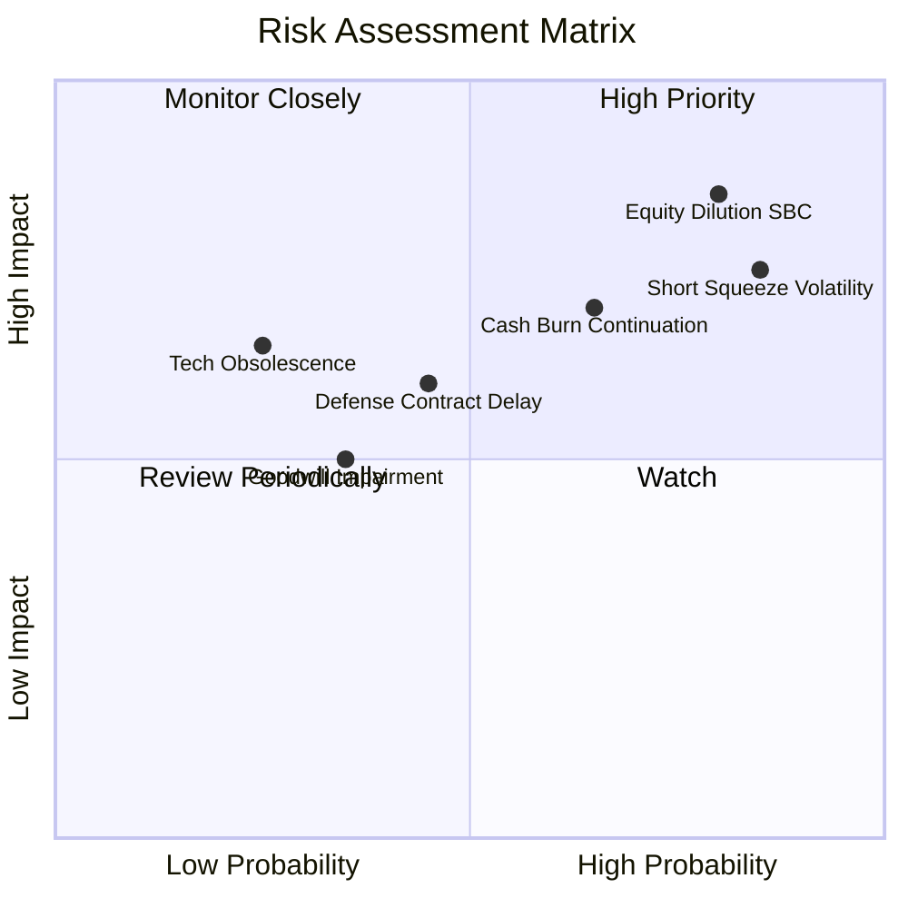

### 10.2 風險清單詳細分析

| # | 風險項目 | 發生機率 | 財務衝擊 | 風險評分 | 緩解措施 |
|---|----------|----------|----------|----------|----------|
| 1 | 🔴 **股權稀釋與高額 SBC** | 高 (80%) | 高 (-20% 每股價值) | 🔴 8.5/10 | 董事會需設立更嚴格之非 GAAP 績效指標，限制股權增發上限。 |
| 2 | 🔴 **放空比例過高波動** | 高 (85%) | 中 (-15% 估值回撤) | 🔴 8.0/10 | 追蹤空頭回補動態，避免使用槓桿持有，設定嚴格保護性止損。 |
| 3 | 🟡 **營業現金流持續流失** | 中 (65%) | 高 (-25% 現金儲備) | 🟡 7.0/10 | 依靠當前 $1.38B 現金防護墊爭取 24 個月以上的造血轉型期。 |
| 4 | 🟡 **國防驗收與政府採購延宕** | 中 (45%) | 中 (-15% 營收增速) | 🟡 6.0/10 | 拓展民用商業基礎設施（石油管線、港口）以平滑軍品採購波動。 |
| 5 | 🟢 **商譽減損風險 ($661M)** | 低 (35%) | 中 (-10% 帳面權益) | 🟢 4.5/10 | 併購標的已實現收入高增長，短期商譽減損測試壓力有限。 |

---

## 11. 投資建議

### 11.1 最終綜合評級雷達圖

```
╔══════════════════════════════════════════════════════════════════╗
║                 ONDS 綜合維度評分雷達                            ║
╠══════════════════════════════════════════════════════════════╣
║                                                                  ║
║  成長動能 (Growth)：        9.5/10 ▓▓▓▓▓▓▓▓▓▓▓▓▓▓▓▓▓▓▓░  極高    ║
║  短期流動性 (Liquidity)：    8.5/10 ▓▓▓▓▓▓▓▓▓▓▓▓▓▓▓▓▓░░░  優異    ║
║  技術創新力 (Tech)：        8.0/10 ▓▓▓▓▓▓▓▓▓▓▓▓▓▓▓▓░░░░  強勁    ║
║  護城河深度 (Moat)：        5.5/10 ▓▓▓▓▓▓▓▓▓▓▓░░░░░░░░░  中等    ║
║  管理層配置 (CapAlloc)：    5.0/10 ▓▓▓▓▓▓▓▓▓▓░░░░░░░░░░  中等    ║
║  估值安全感 (Valuation)：   4.0/10 ▓▓▓▓▓▓▓▓░░░░░░░░░░░░  偏緊    ║
║  獲利品質 (Quality)：       3.0/10 ▓▓▓▓▓▓░░░░░░░░░░░░░░  薄弱    ║
║  資本回報 (ROIC vs WACC)：  2.0/10 ▓▓▓▓░░░░░░░░░░░░░░░░  赤字    ║
║                                                                  ║
║  ★ 綜合評分：5.7 / 10 ── 評級：🟡 持有 / 投機性觀察             ║
╚══════════════════════════════════════════════════════════════════╝
```

### 11.2 目標價與隱含報酬率

| 情境 | 目標價 | 隱含報酬率（相對現價 $7.39） | 機率權重 | 核心邏輯 |
|------|--------|------------------------------|----------|----------|
| 🔴 **悲觀情境** | **$4.50** | **-39.1%** | 25% | 營收增速跌破 30%，SBC 持續稀釋，估值倍數收斂至 EV/Sales 6x |
| 🟡 **基準情境** | **$8.60** | **+16.4%** | 55% | 營收維持 50% 增長，營業利益率虧損收斂，EV/Sales 維持 10x |
| 🟢 **樂觀情境** | **$13.50** | **+82.7%** | 20% | 反無人機合約全球超預期爆發，FCF 提早轉正，空頭大幅軋空 |

### 11.3 買入時機與觸發因素

```
╔══════════════════════════════════════════════════════════════════╗
║                  ✅ ONDS 操作觸發 Checklist                      ║
╠══════════════════════════════════════════════════════════════════╣
║                                                                  ║
║  🟢 買入/建倉觸發條件（需多數符合）：                            ║
║  ☐ 股價回檔至價值區間 $5.00 - $6.00（MOS ≥ 25%）                 ║
║  ☐ 單季股權薪酬 (SBC) 佔營收比重顯著降至 25% 以下                ║
║  ☐ 營業現金流赤字連續兩季呈現 QoQ 收斂 > 30%                     ║
║  ☐ 空頭比率 (Short % Float) 降至 20% 以下，籌碼結構正常化        ║
║                                                                  ║
║  🟡 持有/觀望條件（當前狀態）：                                  ║
║  ☑ 營收維持三位數高增長但現金流持續失血                          ║
║  ☑ 現價 $7.39 位於加權合理價值 $7.73 附近（MOS +4.4% 不足）      ║
║                                                                  ║
║  🔴 減碼/停損觸發條件（出現任一）：                              ║
║  ☐ 單季營收 YoY 增速驟降至 50% 以下                              ║
║  ☐ 宣佈新一輪超過 1 億美元之公開發行增發新股（進一步稀釋）       ║
║  ☐ 股價跌破 $4.50 關鍵技術支撐位                                 ║
╚══════════════════════════════════════════════════════════════════╝
```

### 11.4 投資人適配度分析

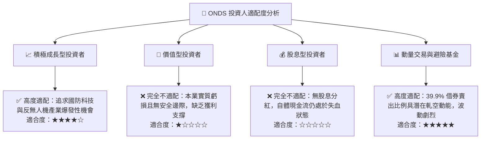

### 11.5 每季財報監控清單（Quarterly Watch List）

| 監控維度 | 核心追蹤指標 | 加碼門檻 (Bullish) | 減碼/退出門檻 (Bearish) |
|----------|--------------|-------------------|-------------------------|
| **成長性** | 單季營收規模與 YoY | 營收 > $100M 且 YoY > 80% | 營收 < $60M 或 YoY < 30% |
| **獲利品質** | 單季 SBC 佔營收比例 | SBC / 營收 < 20.0% | SBC / 營收 > 60.0% |
| **造血能力** | 單季自由現金流 (FCF) | FCF 赤字縮小至 -$15M 以內 | FCF 赤字擴大至 -$80M 以上 |
| **商業化** | OAS 與 CUAS 合約儲備 | 新簽約國防/主權訂單 > $150M | 連續兩季無重要專案宣布 |
| **股本結構** | 稀釋後總流通股數 | 流通股數季增率 < 1.0% | 流通股數季增率 > 5.0% |

### 11.6 反面論證：什麼會證明論點錯誤（What Would Change My Mind）

```
╔══════════════════════════════════════════════════════════════════╗
║              ⚠️ 論點失效條件（Disconfirming Evidence）           ║
╠══════════════════════════════════════════════════════════════════╣
║  若出現下列可量化事件，多頭成長邏輯即告破裂，應即刻停損離場：   ║
║                                                                  ║
║  1. 營收成長顯著失速：連續兩季營收 YoY 增速跌破 35%，證明反無人機 ║
║     採購僅為短期脈衝式補庫存，而非可持續之長期產業趨勢。         ║
║  2. 獲利拐點遙遙無期：至 FY2027 年底營業利益率仍低於 -30.0%，    ║
║     且毛利率跌破 35%，顯示定價能力在同業競爭下崩解。             ║
║  3. 股權稀釋惡化：流通股數在未來 12 個月內突破 6.5 億股，管理層   ║
║     持續濫發股權激勵掩蓋實質運營成本。                           ║
║  4. 現金儲備迅速消耗：單季營運現金流失血超過 $100M，迫使淨現金    ║
║     在 4 季內跌破 $800M 臨界水位。                               ║
╚══════════════════════════════════════════════════════════════════╝
```

---

> **免責聲明**：本報告為依據公開財務數據之機構級研究分析，內容僅供學術與投資邏輯探討，不構成任何具體的買賣邀約或投資建議。投資具備高風險，標的波動劇烈，投資人應獨立評估自身財務承受能力。