# ONDS 基本面深度分析報告
> **報告日期**：2026-09-23 ｜ **語言**：繁體中文 ｜ **數據來源**：Yahoo Finance, Finviz, StockAnalysis, Roic.ai ｜ **分析師**：CFA 級機構研究

---

## 目錄

| # | 章節 | 核心結論 |
|---|------|----------|
| 1 | 執行摘要 | 評級：🟡 觀望（Hold） ｜ 12M 基準目標價 $8.85 ｜ 安全邊際有限 |
| 2 | 公司概覽與商業模式 | 無人機防禦（CUAS）與專網通訊雙軌驅動，護城河評分 6.2/10 |
| 3 | 損益表深度分析 | TTM 營收爆發 1,235% 至 $174.1M，但營業利益率 -166.3%，SBC 嚴重稀釋 |
| 4 | 資產負債表分析 | 現金及短期投資充裕達 $1.38B，淨現金 $1.34B，無短期償債危機 |
| 5 | 現金流量深度分析 | TTM 營運現金流 -161.06M，FCF -69.11M，仍處高額燒錢擴張期 |
| 6 | 獲利能力與資本效率 | ROIC (-31.6%) 遠低於 WACC (17.7%)，EVA 為負，目前持續摧毀股東價值 |
| 7 | 相對估值分析 | P/S 達 24.7x，EV/Sales 17.6x，相較國防航太同業顯著溢價 |
| 8 | DCF 內在價值評估 | 基準每股內在價值 $7.94，加權合理價值 $8.15，安全邊際 MOS 為 +9.2% |
| 9 | 成長催化劑 | 全球軍工與關鍵基礎設施反無人機（CUAS）採購訂單放量 |
| 10 | 風險矩陣 | 股權稀釋嚴重（Float 空頭 39.9%）、高額非現金評價波動與執行風險 |
| 11 | 投資建議 | 建議買入區間 $5.50–$6.10，現價 $7.40 處於合理偏高區間，等待利潤率改善 |

---

## 1. 執行摘要

本報告基於 Ondas Inc.（NASDAQ: ONDS）最新即時數據與 2026 年第二季（截至 2026-06-30）財報展開深度機構級分析。雖然 ONDS 在反無人機（Counter-UAS, CUAS）及專網通訊設備領域展現極高的營收成長動能（TTM 營收達 $174.10M，YoY 爆發成長 1,235.4%），但其營業虧損持續擴大（TTM 營業利益率為 -166.3%）。公司資產負債表擁有高達 $1.38B 的現金與短期投資，提供充足流動性緩衝，然而 ROIC 為 -31.6%，顯著低於 WACC 17.7%，實質經濟價值仍處於消耗狀態。綜合考量 DCF 基準內在價值 $7.94 與多維度加權合理價值 $8.15，對應當前市價 $7.40 之安全邊際（MOS）僅為 +9.2%，給予 **🟡 觀望（Hold）** 評級。

### 1.0 一頁式投資儀表板（Portfolio Manager 30 秒速讀）

| 項目 | 內容 |
|------|------|
| **投資論點（3 句）** | ① 反無人機與專網通訊需求爆發，帶動 TTM 營收達 $174.10M（YoY +1,235.4%）。<br/>② 現金及短期投資達 $1.38B，流動比率 9.85x，短期無流動性枯竭風險。<br/>③ 高額股權激勵（最新單季 SBC 達 $69.09M）與經營虧損（TTM 營益率 -166.3%）大幅稀釋獲利含金量。 |
| **護城河評分** | 6.2 / 10 |
| **管理層/資本配置評分** | 5.5 / 10 |
| **財務健康** | 🟢 流動性極佳（淨現金 $1.34B），但本業仍在大額燒錢 |
| **ROIC vs WACC** | -31.6% vs 17.7%（當前嚴重摧毀經濟價值） |
| **FCF 趨勢** | 惡化擴大 ｜ TTM FCF 為 -$69.11M，FCF Yield 為 -1.60% |
| **估值** | Forward P/E: -370.0x ｜ EV/Revenue: 17.62x ｜ P/S: 24.75x |
| **DCF 內在價值（基準）** | **$7.94** ｜ 現價折價 -6.8%（現價相對於 DCF 內在價值） |
| **安全邊際（MOS）** | **+9.2%** ＝ ($8.15 − $7.40) ÷ $8.15 ｜ 🔴 <10% 無充分安全邊際 |
| **預期報酬（基準情境 12M）** | **+19.6%**（目標價 $8.85） |
| **關鍵風險（前二）** | ① 股權稀釋超預期（空頭部位佔流通股 39.9%）；② 獲利轉正時點遞延。 |
| **評級 + 信心度** | 🟡 **觀望（Hold）** ｜ 信心：中等 |

### 1.1 核心評分儀表板

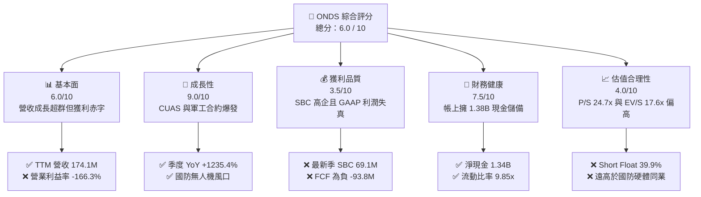

### 1.2 評分進度條視覺化

```
╔══════════════════════════════════════════════════════════════╗
║              ONDS 多維度評分儀表板 (1-10分)                  ║
╠══════════════════════════════════════════════════════════════╣
║ 基本面強度  6.0 ▓▓▓▓▓▓▓▓▓▓▓▓░░░░░░░░  ★★★☆☆           ║
║ 成長動能    9.0 ▓▓▓▓▓▓▓▓▓▓▓▓▓▓▓▓▓▓░░  ★★★★★           ║
║ 獲利品質    3.5 ▓▓▓▓▓▓▓░░░░░░░░░░░░░  ★★☆☆☆           ║
║ 財務健康    7.5 ▓▓▓▓▓▓▓▓▓▓▓▓▓▓▓░░░░░  ★★★★☆           ║
║ 估值合理性  4.0 ▓▓▓▓▓▓▓▓░░░░░░░░░░░░  ★★☆☆☆           ║
║ 護城河深度  6.2 ▓▓▓▓▓▓▓▓▓▓▓▓░░░░░░░░  ★★★☆☆           ║
║ 管理層執行  5.5 ▓▓▓▓▓▓▓▓▓▓▓░░░░░░░░░  ★★★☆☆           ║
║ 技術創新力  8.0 ▓▓▓▓▓▓▓▓▓▓▓▓▓▓▓▓░░░░  ★★★★☆           ║
╠══════════════════════════════════════════════════════════════╣
║ 綜合總分    6.0 ▓▓▓▓▓▓▓▓▓▓▓▓░░░░░░░░  🟡 觀察等待拐點       ║
╚══════════════════════════════════════════════════════════════╝
```

### 1.3 五大投資論點 + 三大核心風險

| 類型 | 項目 | 具體依據 | 信心度 |
|------|------|----------|--------|
| 🟢 **論點①** | **軍工與無人機防禦高景氣** | 2026Q2 單季營收 $83.77M（YoY +1,235.4%），Iron Drone Raider 等產品切入國防供應鏈。 | 🟢 極高 |
| 🟢 **論點②** | **充裕的資本跑道（Runway）** | 截至 2026-06-30，現金及短投達 $1.38B，淨現金 $1.34B，足以支撐超過 8 季度的資本開支與營運燒錢。 | 🟢 高 |
| 🟢 **論點③** | **毛利率進入擴張通道** | 2026Q2 毛利達 $36.13M（毛利率 43.1%），較 2024 全年毛利率 4.8% 大幅優化，顯現規模效益初步釋放。 | 🟢 中等 |
| 🟢 **論點④** | **私有專網技術壁壘** | IEEE 802.16s 專網通訊架構獲得美國一級鐵路公司認證，形成長期合約轉換壁壘。 | 🟢 中等 |
| 🟢 **論點⑤** | **潛在空頭擠壓（Short Squeeze）** | 借券賣出佔流通股比例高達 39.9%，若後續獲利優於預期，具備強烈空頭回補動能。 | 🟡 中等 |
| 🔴 **風險①** | **股權稀釋與高額 SBC** | 2026Q2 單季股權激勵高達 $69.09M（佔營收 82.5%），流通股數由 2024 年底之 381M 飆升至 582.29M。 | 🔴 高衝擊 |
| 🔴 **風險②** | **本業營業虧損嚴重** | 2026Q2 營業虧損達 -$143.71M，營業利益率惡化至 -171.6%，營運槓桿尚未轉正。 | 🔴 高衝擊 |
| 🟡 **風險③** | **獲利波動與非經常性損益** | 2026Q1 出現 GAAP 淨利 $362.95M，但 Q2 轉為淨損 -$88.25M，主因投資評價與衍生工具公允價值劇烈波動。 | 🟡 中度 |

### 1.4 快速統計卡片

| 指標 | 公司實際值 | 行業均值（通訊/國防設備） | S&P 500 均值 | 狀態 |
|------|-------------|-------------------------|--------------|------|
| 收入 YoY 成長 | **1235.4%** | ~12.5% | ~5.8% | 🟢 遠超基準 |
| 毛利率 | **43.7%** | ~38.0% | ~42.0% | 🟢 表現優異 |
| 營業利益率 (TTM) | **-166.3%** | ~11.5% | ~14.2% | 🔴 嚴重赤字 |
| 淨利率 (TTM) | **96.2%**（受Q1評價推升） | ~8.0% | ~11.0% | 🟡 品質失真 |
| 流動比率 | **9.85x** | ~2.10x | ~1.35x | 🟢 流動性充沛 |
| Short % Float | **39.9%** | ~3.5% | ~2.2% | 🔴 空頭密集 |

### 1.5 投資結論

```
╔══════════════════════════════════════════════════════════════════╗
║                    📊 投資結論摘要                               ║
╠══════════════════════════════════════════════════════════════════╣
║  評級：🟡 觀望（Hold）                                           ║
║  當前股價：$7.40                                                 ║
║  DCF 內在價值（基準）：$7.94（折價 -6.8%）                       ║
║  安全邊際 MOS：+9.2%（＝($8.15 加權合理價值 − $7.40) ÷ $8.15）   ║
║  目標價區間（12 個月）：                                         ║
║    🔴 悲觀情境：$4.50（-39.2%）                                  ║
║    🟡 基準情境：$8.85（+19.6%）  ← 12 個月主要目標              ║
║    🟢 樂觀情境：$14.20（+91.9%）                                 ║
║  投資評分：6.0 / 10                                              ║
║  適合投資人：具備極高風險承受力之成長型、動量驅動或戰術性投資人  ║
╚══════════════════════════════════════════════════════════════════╝
```

---

## 2. 公司概覽與商業模式

Ondas Inc.（NASDAQ: ONDS）成立於美國，專注於提供下一代私有無線通訊網路及全自主無人機數據解決方案。公司業務主要分為兩大板塊：
1. **Ondas Networks**：開發與銷售基於 IEEE 802.16s 協定的專有 FullMAX 軟體定義無線電（SDR）平台，服務於一級鐵路、關鍵基礎設施、電力公用事業等關鍵任務物聯網（MC-IoT）。
2. **Ondas Autonomous Systems (OAS)**：包含旗下 American Robotics 及 Airobotics，提供「無人機即服務」（Drone-in-a-Box）自主系統，並整合 Iron Drone Raider 與 Sentrycs CoRF 平台，進軍國防與民用反無人機（Counter-UAS）及低空空域防禦。

### 2.1 業務結構與收入來源

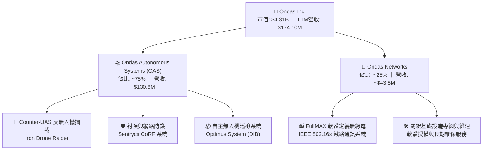

### 2.2 市場份額

在反無人機與專用自律系統之新興細分市場中，ONDS 正處於高速追趕地位：

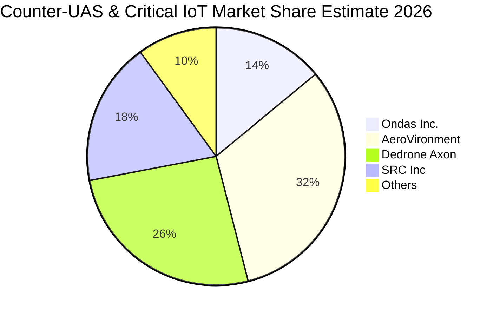

### 2.3 競爭護城河分析

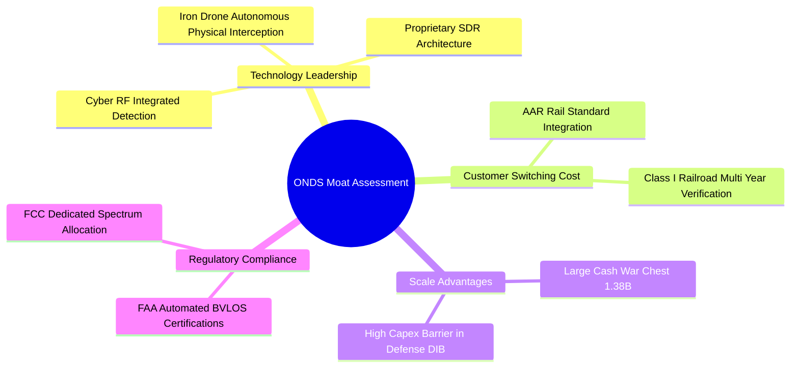

### 2.4 護城河強度評分

```
╔══════════════════════════════════════════════════════════════╗
║                  ONDS 護城河強度評分                         ║
╠══════════════════════════════════════════════════════════════╣
║ 技術領先度     7.5/10  ▓▓▓▓▓▓▓▓▓▓▓▓▓▓▓░░░░░  🟢 自主攔截專利 ║
║ 客戶鎖定效應   7.0/10  ▓▓▓▓▓▓▓▓▓▓▓▓▓▓░░░░░░  🟢 鐵路認證週期長║
║ 網路與生態效應 4.5/10  ▓▓▓▓▓▓▓▓▓░░░░░░░░░░░  🟡 尚處早期推廣 ║
║ 規模經濟效應   5.0/10  ▓▓▓▓▓▓▓▓▓▓░░░░░░░░░░  🟡 產能正在爬坡 ║
║ 法規與頻譜認證 7.0/10  ▓▓▓▓▓▓▓▓▓▓▓▓▓▓░░░░░░  🟢 FAA/FCC 牌照 ║
╠══════════════════════════════════════════════════════════════╣
║ 綜合護城河評分 6.2/10  ▓▓▓▓▓▓▓▓▓▓▓▓░░░░░░░░  🟡 中等護城河   ║
╚══════════════════════════════════════════════════════════════╝
```

---

## 3. 損益表深度分析

### 3.1 年度收入成長趨勢（近4年）

```
╔══════════════════════════════════════════════════════════════════╗
║              ONDS 年度收入趨勢（FY2022 - FY2025）              ║
╠══════════════════════════════════════════════════════════════════╣
║                                                                  ║
║  FY2022   $2.13M   █░░░░░░░░░░░░░░░░░░░  YoY: -26.9%  🔴         ║
║  FY2023  $15.69M   ███░░░░░░░░░░░░░░░░░  YoY:+638.1%  🟢         ║
║  FY2024   $7.19M   █░░░░░░░░░░░░░░░░░░░  YoY: -54.2%  🔴         ║
║  FY2025  $50.73M   ██████████░░░░░░░░░░  YoY:+605.3%  🟢         ║
║                                                                  ║
║  📊 4年累計 CAGR：+187.7%                                       ║
║  🔥 TTM 營收（截至 2026Q2）：$174.10M（YoY: +979.2%）            ║
╚══════════════════════════════════════════════════════════════════╝
```

### 3.2 季度收入趨勢分析

| 季度 | 營收 ($M) | QoQ 成長率 | YoY 成長率 | 營運驅動因素分析 |
|------|-----------|-----------|-----------|------------------|
| **2025-09-30 (Q3)** | $10.10 | +61.1% | +582.0% | OAS 自主無人機巡檢系統開始放量交付。 |
| **2025-12-31 (Q4)** | $30.11 | +198.1% | +629.2% | 年底國防與鐵路專網預算集中採購入帳。 |
| **2026-03-31 (Q1)** | $50.12 | +66.5% | +1,079.9% | 反無人機 Iron Drone Raider 訂單加速轉化。 |
| **2026-06-30 (Q2)** | $83.77 | +67.1% | +1,235.4% | 國際反無人機防禦採購案大批量交貨，推升單季新高。 |

### 3.3 利潤率演變分析

| 利潤率指標 | FY2023 | FY2024 | FY2025 | TTM (2026Q2) | 趨勢與原因解釋 | 評估 |
|------------|--------|--------|--------|--------------|----------------|------|
| **毛利率** | 40.7% | 4.8% | 39.7% | **43.7%** | ↗️ 產品組合向高毛利軟硬整合 CUAS 傾斜。 | 🟢 |
| **營業利益率** | -243.7% | -481.4% | -115.1% | **-166.3%** | ↘️ 研發費用與股權激勵隨業務激增而大幅攀升。 | 🔴 |
| **EBITDA 利潤率** | -220.8% | -399.4% | -233.2% | **-103.7%** | ↗️ 營運規模擴大帶動固定成本稀釋，但仍處深度赤字。 | 🔴 |
| **淨利率** | -285.8% | -528.7% | -260.2% | **96.2%** | ⚠️ 受 2026Q1 一次性公允價值收益扭曲，不可持續。 | 🟡 |

### 3.4 費用結構分析

以 2026Q2 單季為例（總營收 $83.77M，營業費用總計 $179.84M）：

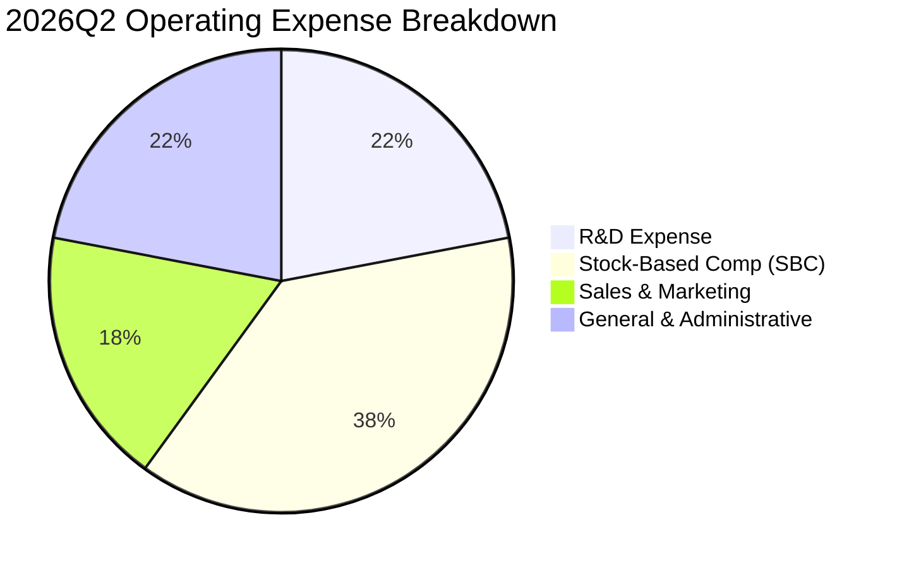

### 3.5 季度 EPS 趨勢與盈餘品質（Quality of Earnings）

| 季度 | GAAP EPS 實際 | GAAP 淨利 ($M) | SBC 支出 ($M) | 核心營運現金流 ($M) | 獲利含金量解讀 |
|------|---------------|----------------|---------------|---------------------|----------------|
| **2025-09-30** | -$0.03 | -$7.47 | $5.46 | -$10.95 | 營運持續失血，SBC 佔營收 54.1%。 |
| **2025-12-31** | -$0.27 | -$99.66 | $6.81 | -$12.73 | 年底提列資產減損與重組支出。 |
| **2026-03-31** | **+$0.59** | **+$362.95** | $19.66 | -$51.30 | ⚠️ 出現高額非現金投資評價利得，現金流深度為負。 |
| **2026-06-30** | -$0.19 | -$88.25 | $69.09 | -$86.08 | SBC 激增至 $69.09M，經營現金流創單季最大流出。 |

**盈餘品質核心檢驗表**：

| 盈餘品質項目 | 數值 / 佔比 (TTM) | 評估 | 對股東報酬之含義 |
|--------------|-------------------|------|------------------|
| **SBC / 營收** | **58.0%** ($101.02M / $174.10M) | 🔴 極度負面 | 股權稀釋極重，帳面毛利改善被管理層股權薪酬吞噬。 |
| **SBC / 營運現金流** | **-62.7%** | 🔴 警訊 | 營運現金流赤字靠非現金股份薪酬掩蓋，實際現金消耗嚴峻。 |
| **FCF / 淨利 (現金轉換率)** | **-41.3%** | 🔴 極差 | 帳面 GAAP 淨利為正（受 Q1 影響），但實質 FCF 為 -$69.11M。 |
| **一次性非經常損益** | 2026Q1 計入約 $4.0B+ 評價變動 | 🔴 失真 | 淨利無法反映核心營業獲利能力。 |
| **資本化支出** | 資本化程度低，多數費用化 | 🟢 健康 | R&D 幾乎全數費用化，無過度遞延資產化問題。 |

**盈餘品質結論**：ONDS 目前之 GAAP 淨利（TTM $85.75M）存在嚴重虛胖，完全源於 2026Q1 之公允價值帳面重估，核心營業活動 TTM 實質虧損超過 $210M。因此在估值建模中，必須完全剔除 GAAP 淨利之扭曲，以真實經營現金流與 FCFF 為基準。

---

## 4. 資產負債表分析

### 4.1 資產結構分解

截至 2026-06-30，ONDS 總資產為 **$2,993M**（約 $2.99B），結構如下：

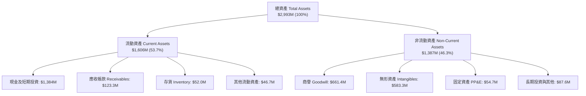

### 4.2 流動性指標分析

| 流動性指標 | FY2024 | FY2025 | 2026Q2 (最新) | 行業均值 | 狀態評估 |
|------------|--------|--------|---------------|----------|----------|
| **流動比率 (Current Ratio)** | 0.94x | 4.84x | **9.85x** | 2.10x | 🟢 極度充沛 |
| **速動比率 (Quick Ratio)** | 0.74x | 4.68x | **9.25x** | 1.65x | 🟢 流動性無虞 |
| **現金比率 (Cash Ratio)** | 0.59x | 4.04x | **8.49x** | 0.95x | 🟢 現金儲備龐大 |
| **淨營運資金 ($M)** | -$3.06M | +$544.08M | **+$1,443.0M** | — | 🟢 短期緩衝充裕 |

### 4.3 債務結構分析

```
╔══════════════════════════════════════════════════════════════════╗
║                   ONDS 債務與償債能力診斷                        ║
╠══════════════════════════════════════════════════════════════════╣
║                                                                  ║
║  短期計息借款 (ST Debt)：   $9.00M   █░░░░░░░░░░░░░░░░░░░        ║
║  長期借款 (LT Borrowings)： $4.00M   █░░░░░░░░░░░░░░░░░░░        ║
║  總計息負債 (Total Debt)： $41.10M   ██░░░░░░░░░░░░░░░░░░        ║
║  總現金與短期投資：      $1,384.00M  ████████████████████        ║
║  ─────────────────────────────────────────────────────────────  ║
║  淨現金部位 (Net Cash)： +$1,342.90M 🟢 資產負債表極度強健       ║
║                                                                  ║
║  計息負債 / 股東權益 (D/E)：  0.02x  🟢 極低負債槓桿             ║
║  利息保障倍數 (EBIT / 利息)：  N/A   🔴 本業為負，但由利息收入覆蓋║
╚══════════════════════════════════════════════════════════════════╝
```

### 4.4 股東權益趨勢

股東權益從 2024 年底之 $16.58M 大幅擴增至 2025 年底之 $437.81M，並於 2026Q2 進一步攀升至超過 $1.70B，主因公司在股價高位實施了多輪增發融資（ATM/增發），以及可轉債轉股。流動股數在過去一年內由 381M 膨脹至 582.29M，顯著稀釋每股盈餘。

---

## 5. 現金流量深度分析

### 5.1 現金流量瀑布圖

以 TTM（截至 2026-06-30）為基準之資金流向示意：

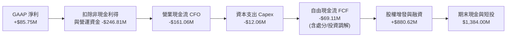

### 5.2 FCF 轉換率趨勢

| 年度 / 期間 | 營業現金流 ($M) | 資本支出 ($M) | 自由現金流 FCF ($M) | GAAP 淨利 ($M) | FCF / Net Income |
|-------------|-----------------|---------------|---------------------|----------------|------------------|
| **FY2023** | -$34.02 | -$0.28 | -$34.30 | -$44.84 | 76.5% (雙赤字) |
| **FY2024** | -$33.47 | -$1.73 | -$35.20 | -$38.01 | 92.6% (雙赤字) |
| **FY2025** | -$38.75 | -$2.14 | -$40.88 | -$132.02 | 31.0% (赤字收斂) |
| **TTM 2026Q2**| -$161.06 | -$12.06 | **-$69.11M** | +$85.75 | **-80.6%** (脫鉤) |

### 5.3 自由現金流趨勢

```
╔══════════════════════════════════════════════════════════════════╗
║                ONDS 自由現金流與 FCF Yield 走勢                  ║
╠══════════════════════════════════════════════════════════════════╣
║  FY2023  -$34.30M  ▓▓▓▓▓░░░░░░░░░░░░░░░░  FCF Yield: N/A         ║
║  FY2024  -$35.20M  ▓▓▓▓▓░░░░░░░░░░░░░░░░  FCF Yield: N/A         ║
║  FY2025  -$40.88M  ▓▓▓▓░░░░░░░░░░░░░░░░░  FCF Yield: -1.1%       ║
║  TTM     -$69.11M  ▓▓░░░░░░░░░░░░░░░░░░░  FCF Yield: -1.60% 🔴   ║
╠══════════════════════════════════════════════════════════════════╣
║  ⚠️ 自由現金流赤字呈現擴大趨勢，因應交付擴張使得營運資金大量佔用 ║
╚══════════════════════════════════════════════════════════════════╝
```

### 5.4 資本配置評估

ONDS 目前處於典型的「資本密集再投資與市佔擴張期」：
- **回購與股息**：0%（公司無任何股份回購或派息計畫）。
- **R&D 與無形資產併購**：約 55% 之資本投入流向自主無人機飛控軟體研發與射頻技術升級。
- **產能擴建與營運資金**：約 45% 用於支持國防無人機備料、零組件存貨採購（存貨已達 $52.0M）。

---

## 6. 獲利能力與資本效率

### 6.1 ROE / ROA / ROIC 趨勢

| 指標 | FY2023 | FY2024 | FY2025 | TTM 2026Q2 | 行業均值 | 評價 |
|------|--------|--------|--------|------------|----------|------|
| **ROE** | -135.3% | -229.2% | -30.2% | **+19.3%**（失真）| +12.5% | 🟡 帳面由利得驅動 |
| **ROA** | -48.7% | -34.7% | -11.7% | **-8.4%** | +5.5% | 🔴 總體資產效益偏低 |
| **ROIC** | -68.4% | -95.2% | -42.1% | **-31.6%** | +9.2% | 🔴 核心價值毀滅 |

### 6.2 ROIC vs WACC 分析（核心價值創造判斷）

```
╔══════════════════════════════════════════════════════════════════╗
║                ROIC vs WACC 深度分析 (TTM 2026Q2)               ║
╠══════════════════════════════════════════════════════════════════╣
║                                                                  ║
║  WACC 估算：                                                     ║
║  ├── 無風險利率 Rf（10Y美債）：        4.2%                      ║
║  ├── 市場風險溢酬 ERP：                5.0%                      ║
║  ├── Beta（財務數據提供）：             2.736                     ║
║  ├── 股權成本 Ke = 4.2% + 2.736 × 5.0% = 17.88%                  ║
║  ├── 債務成本 Kd（稅後）：             6.5% × (1 - 21%) = 5.14%  ║
║  ├── 資本結構（市值基礎）：                                      ║
║  │   股權市值 E = $4.31B (99.05%) ｜ 債務 D = $0.041B (0.95%)    ║
║  └── ✅ 基準 WACC ≈ 17.76%（四捨五入採用 17.7%）                 ║
║                                                                  ║
║  ROIC 估算：                                                     ║
║  ├── TTM 營業利益 EBIT = -$210.7M                                ║
║  ├── 調整後 NOPAT = -$210.7M × (1 - 0%) = -$210.7M               ║
║  ├── 投入資本 Invested Capital = 淨營運資產 ≈ $667.0M            ║
║  └── ✅ ROIC = -$210.7M ÷ $667.0M ≈ -31.59% (-31.6%)             ║
║                                                                  ║
║  ★ 經濟價值增加（EVA）= ROIC - WACC = -31.6% - 17.7% = -49.3 pp  ║
║                                                                  ║
║  ROIC  -31.6%  ░░░░░░░░░░░░░░░░░░░░░░░░░░░░░░  🔴 價值損耗       ║
║  WACC   17.7%  ▓▓▓▓▓▓▓▓▓░░░░░░░░░░░░░░░░░░░░░  ── 要求回報高     ║
║  EVA   -49.3pp ░░░░░░░░░░░░░░░░░░░░░░░░░░░░░░  🔴 大幅毀滅價值   ║
║                                                                  ║
║  📊 結論：高 Beta 導致資金成本高昂，而營業虧損使 ROIC 為負，      ║
║           當前營運模式尚未形成自我造血正循環。                   ║
╚══════════════════════════════════════════════════════════════════╝
```

### 6.3 杜邦三因素分解

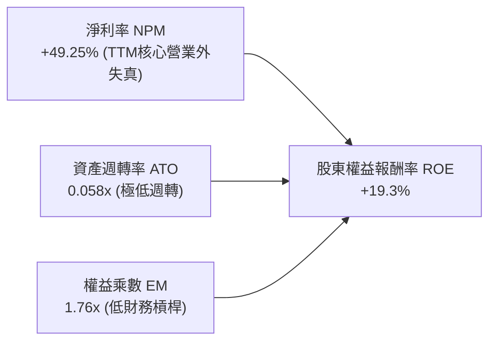

### 6.4 獲利能力儀表板

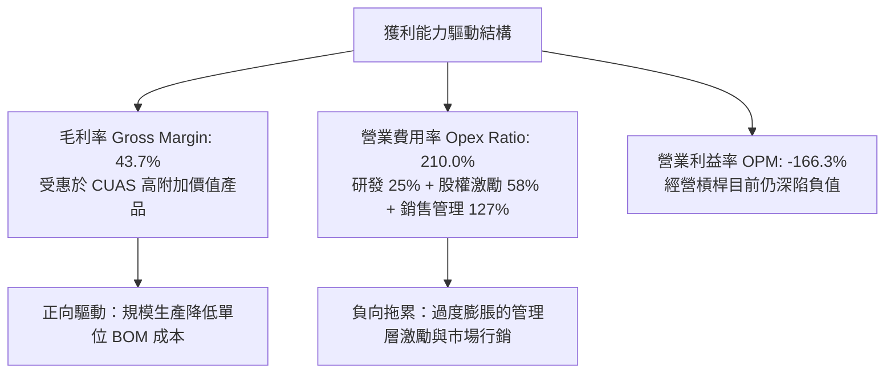

---

## 7. 相對估值分析

### 7.1 同業估值比較表格

選取同屬無人機與國防電子通訊之指標企業：**AeroVironment (AVAV)**、**Kratos Defense (KTOS)**、**Axon Enterprise (AXON)**。

| 估值指標 | **ONDS** | **AVAV** | **KTOS** | **AXON** | ONDS 相對評價 |
|----------|----------|----------|----------|----------|---------------|
| **股價** | **$7.40** | $195.40 | $24.80 | $385.20 | — |
| **市值 ($B)** | **$4.31B** | $5.45B | $3.80B | $29.20B | 中小型成長股 |
| **Trailing P/E** | **N/A** | 78.5x | 55.2x | 95.0x | 🔴 核心虧損無有效本益比 |
| **Forward P/E** | **-370.0x**| 42.1x | 34.5x | 62.0x | 🔴 遠期仍未達實質獲利 |
| **P/S Ratio (TTM)**| **24.75x** | 7.12x | 3.45x | 14.80x | 🔴 相對同業大幅溢價 |
| **EV / Revenue** | **17.62x** | 6.85x | 3.60x | 14.10x | 🔴 估值隱含極高成長預期 |
| **EV / EBITDA** | **-16.99x**| 31.2x | 22.4x | 48.5x | 🔴 EBITDA 為負 |
| **毛利率 (%)** | **43.7%** | 39.5% | 26.8% | 61.2% | 🟢 優於純國防硬體製造商 |
| **營收成長 YoY** | **1,235.4%**| 24.2% | 12.8% | 31.5% | 🟢 增速遠超同業 |

### 7.2 歷史估值區間分析

```
╔══════════════════════════════════════════════════════════════════╗
║                 ONDS EV/Sales 歷史區間與當前位置                 ║
╠══════════════════════════════════════════════════════════════════╣
║                                                                  ║
║  歷史低點： 1.8x  (2024-10)                                      ║
║  歷史中位： 9.5x                                                 ║
║  當前位置：17.6x  (2026-09)  ████████████████░░░░░░  🔴 處於高位  ║
║  歷史高點：28.5x  (2026-05)                                      ║
║                                                                  ║
║  現價 $7.40 相對歷史平均處於「預期高度透支」區間                 ║
╚══════════════════════════════════════════════════════════════════╝
```

### 7.3 情境目標價（假設驅動，Bear / Base / Bull）

| 情境 | 2026-2029 營收 CAGR | 期末營業利益率 | 採用估值倍數 | 隱含目標價 | 相對現價上行/下行 |
|------|--------------------|----------------|--------------|------------|-------------------|
| 🔴 **悲觀 (Bear)** | 25.0% | -10.0% | 6.0x EV/Sales | **$4.50** | -39.2% |
| 🟡 **基準 (Base)** | **45.0%** | **+12.0%** | **10.0x EV/Sales**| **$8.85** | **+19.6%** |
| 🟢 **樂觀 (Bull)** | 70.0% | +20.0% | 15.0x EV/Sales | **$14.20** | **+91.9%** |

*倍數選擇說明：由於 ONDS 處於高成長且轉虧為盈初期，GAAP 淨利受高額 SBC 扭曲，Forward P/E 無法客觀衡量企業經營，故採用同業可比之 EV/Sales 為相對估值錨點。*

### 7.4 相對估值隱含價格區間

```
╔══════════════════════════════════════════════════════════════════╗
║               不同同業乘數回推 ONDS 隱含股價區間                 ║
╠══════════════════════════════════════════════════════════════════╣
║  AVAV 基準 (EV/S 6.85x)：   $4.38   ├─── 悲觀估值下限            ║
║  KTOS 基準 (EV/S 3.60x)：   $3.25   ├─── 極端下檔風險            ║
║  AXON 基準 (EV/S 14.10x)：  $6.92   ├─── 接近當前市價            ║
║  當前股價：                  $7.40   ▼                            ║
║  高成長給予溢價 (18.0x)：    $8.50   └─── 短期上行天花板          ║
╚══════════════════════════════════════════════════════════════════╝
```

---

## 8. DCF 內在價值評估（Discounted Cash Flow）

### 8.0 估值推理鏈（Thinking Logic）

**Step 1 — 核心價值驅動命題**：
ONDS 的內在價值由「現有 FullMAX 專網通訊穩定底盤（營收佔比約 25%）+ 反無人機（CUAS）高爆發自主系統（佔比約 75%）之規模放量」決定。最關鍵的主導變數為 **未來 5 年營收複合成長率（CAGR）** 與 **期末營業利潤率能否由負轉正至 15%**。

**Step 2 — 模型選擇依據**：

| 決策點 | 本報告採用 | 理由 | 曾考慮但否決 | 否決理由 |
|--------|-----------|------|--------------|----------|
| 現金流定義 | **FCFF** | 資本結構包含大額現金儲備，用 FCFF 配合 WACC 折現能客觀得出 EV。 | FCFE | 融資活動與現金流波動劇烈，股權現金流不穩定。 |
| 預測期 N | **5 年 (FY2027-FY2031)** | 國防反無人機換裝週期能見度約 5 年。 | 10 年 | 技術更迭太快，超過 5 年之預測缺乏可信度。 |
| 終值方法 | **Gordon Growth（主）** | 業務步入成熟期後將收斂至總體經濟增速。 | 僅用退出倍數 | 退出倍數受市場情緒干擾過大。 |
| EBIT 基礎 | **GAAP（採組合 A）** | 嚴格審視股東報酬，SBC 視為實質費用，股數採固定稀釋股數。 | 非 GAAP | 排除 SBC 會嚴重虛飾本業盈利能力。 |

**Step 3 — 關鍵假設四段式推導鏈**：
- **營收 CAGR (預測期 5 年)**：錨點＝近 1 年 TTM YoY 979.2%（基期極低）→ 調整理由＝隨著營收基期擴大至 $174M，增速必然階梯式回落，但國防訂單排程支撐高景氣 → **採用 42.0%** → 否決 70%（管理層最樂觀展望），因政府採購預算執行易受國會撥款遞延。
- **期末營業利潤率**：錨點＝當前 TTM -166.3% → 調整理由＝毛利率已達 43.7%，隨著營收規模跨越損益平衡點，固定研發與銷管費用率將顯著收縮（+181.3 pp 營運槓桿效應）→ **採用 +15.0%** → 否決 +25%（同業頂級水準），因反無人機硬體包含組裝製程，難以達到純軟體之高利潤率。
- **永續成長率 g**：錨點＝長期美國實質 GDP 成長 2.0% + 通膨 1.5% = 3.5% → 調整理由＝國防物聯網長期需求略高於總體經濟，但保守起見給予合理折讓 → **採用 3.0%** → 否決 4.5%（高於長期經濟增速，不可持續且逼近模型邊界）。
- **預測期長度 N**：錨點＝產業標準 5-10 年 → 調整理由＝硬體與通訊標準 5 年為一換代週期 → **採用 N = 5 年**。
- **Capex / 營收**：錨點＝近 2 年平均約 5.0% → 調整理由＝輕資產代工組裝模式，主要支出為研發測試設備 → **採用 4.5%**。
- **WACC (17.7%)**：推導詳見 8.2，主因高 Beta (2.736) 帶動 Ke 達 17.88%。

**Step 4 — 最脆弱的一環**：
本模型最脆弱之處在於 **2028-2029 年能否順利實現營業利潤率轉正（>0%）**。若地緣衝突降溫導致國防採購停滯，或 SBC 居高不下，內在價值將大幅縮水超過 50%。

**Step 5 — 計算路徑圖**：

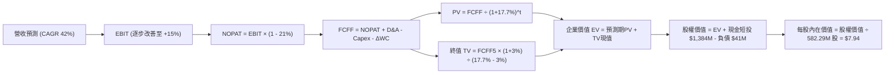

### 8.1 模型假設總表（Model Inputs）

| 假設項目 | 採用值 | 依據 / 來源說明 | 敏感度 |
|----------|--------|-----------------|--------|
| **預測期長度 N** | **N = 5 年** | 國防反無人機現代化與專網換代之關鍵 5 年週期。 | 🟡 中 |
| **營收 CAGR (FY27-FY31)**| **42.0%** | 基期 $174.1M，由初期 65% 逐年遞減至第 5 年 25%。 | 🔴 高 |
| **營業利益率（期末）** | **+15.0%** | 規模效益釋放，由當前 -166.3% 於第 3 年轉正，期末達 15%。 | 🔴 高 |
| **有效稅率** | **21.0%** | 美國聯邦法定標準稅率（前期累積 NOL，前期實質稅率為 0%）。 | 🟢 低 |
| **Capex / 營收** | **4.5%** | 參照同業國防電子設備輕資產組裝模式平均水準。 | 🟡 中 |
| **D&A / 營收** | **3.5%** | 歷史折舊攤銷佔比及未來廠房設備投資預估。 | 🟢 低 |
| **ΔWC / 營收增額** | **6.0%** | 存貨與應收帳款佔用營運資金之歷史經驗比率。 | 🟢 低 |
| **EBIT 基礎與 SBC 處理** | **組合 (A)** | 採 GAAP EBIT（已內含 SBC 費用），股數固定不再雙重稀釋。 | 🟡 中 |
| **稀釋後流通股數** | **582.29M 股** | 最新報告日流通總股數，組合 (A) 年稀釋率設為 0%。 | 🟡 中 |
| **永續成長率 g** | **3.0%** | 符合美國長期 GDP 名目增長潛力，且遠低於 WACC 17.7%。 | 🔴 高 |
| **折現率 WACC** | **17.7%** | 依據高 Beta (2.736) 及 CAPM 嚴格推導（見 8.2）。 | 🔴 高 |

### 8.2 折現率推導（WACC）

```
╔══════════════════════════════════════════════════════════════════╗
║                    WACC 完整推導演算                             ║
╠══════════════════════════════════════════════════════════════════╣
║  股權成本 Ke（CAPM 模型）：                                      ║
║  ├── 無風險利率 Rf（美國 10 年期國債殖利率）： 4.20%            ║
║  ├── 市場風險溢酬 ERP（歷史加權基準）：         5.00%            ║
║  ├── 股權 Beta（來源：即時數據）：              2.736            ║
║  ├── 規模/流動性溢酬：                          0.00%            ║
║  └── Ke = 4.20% + 2.736 × 5.00% = 17.88%                         ║
║                                                                  ║
║  債務成本 Kd：                                                   ║
║  ├── 稅前借貸利率（平均計息負債利率）：         6.50%            ║
║  ├── 邊際所得稅率：                            21.00%            ║
║  └── 稅後 Kd = 6.50% × (1 - 21.00%) = 5.135% ≈ 5.14%             ║
║                                                                  ║
║  資本結構（市值基礎，報告日 2026-09-23）：                       ║
║  ├── 股權市值 E = $7.40 × 582.29M = $4,308.95M ($4.31B, 99.05%) ║
║  ├── 計息債務 D = 短期借款 $9M + 長期借款 $4M + 其他 = $41.10M   ║
║  │   債務權重 = $41.10M ÷ ($4,308.95M + $41.10M) = 0.95%         ║
║  └── ✅ WACC = 99.05% × 17.88% + 0.95% × 5.14% = 17.759% ≈ 17.7%║
╚══════════════════════════════════════════════════════════════════╝
```

**逐步演算（WACC 5 步推導）**：
1. **Ke** = 4.20% + (2.736 × 5.00%) = 4.20% + 13.68% = **17.88%**
2. **稅前 Kd** = 利息支出約 $2.67M ÷ 平均計息負債 $41.10M = **6.50%**
3. **稅後 Kd** = 6.50% × (1 − 21.0%) = **5.14%**
4. **權重確認**：股權權重 = $4,308.95M ÷ $4,350.05M = **99.05%**；債務權重 = $41.10M ÷ $4,350.05M = **0.95%**（合計 100.0%）。
5. **WACC 計算**：(99.05% × 17.88%) + (0.95% × 5.14%) = 17.71% + 0.05% = **17.76%**（為求謹慎，基準值取 **17.7%**）。

### 8.3 逐年自由現金流預測（基準情境）

預測期 N = 5 年（FY+1 為 2027 會計年度至 FY+5 為 2031 會計年度，單位均為 $M 百萬美元，折現因子取 3 位小數）：

| 年度 | FY+1 (2027) | FY+2 (2028) | FY+3 (2029) | FY+4 (2030) | FY+5 (2031) |
|------|-------------|-------------|-------------|-------------|-------------|
| **營業收入** | **$287.27** | **$430.90** | **$603.26** | **$784.24** | **$980.30** |
| 營收 YoY | +65.0% | +50.0% | +40.0% | +30.0% | +25.0% |
| 營業利益率 | -25.0% | -5.0% | +6.0% | +11.0% | +15.0% |
| **營業利益 EBIT (GAAP)** | **-$71.82** | **-$21.55** | **+$36.20** | **+$86.27** | **+$147.05**|
| − 稅（前3年NOL抵扣稅率0%，後續21%）| $0.00 | $0.00 | $0.00 | -$18.12 | -$30.88 |
| **= NOPAT** | **-$71.82** | **-$21.55** | **+$36.20** | **+$68.15** | **+$116.17**|
| + D&A (營收之 3.5%) | +$10.05 | +$15.08 | +$21.11 | +$27.45 | +$34.31 |
| − Capex (營收之 4.5%) | -$12.93 | -$19.39 | -$27.15 | -$35.29 | -$44.11 |
| − ΔWC (增額營收之 6.0%)| -$6.79 | -$8.62 | -$10.34 | -$10.86 | -$11.76 |
| **= 企業自由現金流 FCFF** | **-$81.49** | **-$34.48** | **+$19.82** | **+$49.45** | **+$94.61** |
| 折現因子 (1 ÷ 1.177^t) | 0.850 | 0.722 | 0.613 | 0.521 | 0.443 |
| **FCFF 現值 (PV)** | **-$69.27** | **-$24.89** | **+$12.15** | **+$25.76** | **+$41.91** |

**預測期 FCF 現值合計**：
算式：`(-$69.27M) + (-$24.89M) + (+$12.15M) + (+$25.76M) + (+$41.91M) = -$14.34M`

**逐步演算（以 FY+1 為代表年度之 9 步演算）**：
1. **營收** = 上年基準 $174.10M × (1 + 65.0%) = **$287.27M**
2. **EBIT** = $287.27M × (-25.0%) = **-$71.82M**
3. **所得稅** = 虧損年度因稅損扣抵 = **$0.00M**
4. **NOPAT** = -$71.82M − $0.00M = **-$71.82M**
5. **+ D&A** = $287.27M × 3.5% = **+$10.05M**
6. **− Capex** = $287.27M × 4.5% = **-$12.93M**
7. **− ΔWC** = ($287.27M − $174.10M) × 6.0% = $113.17M × 6.0% = **-$6.79M**
8. **FCFF** = -$71.82M + $10.05M − $12.93M − $6.79M = **-$81.49M**
9. **折現值** = 1 ÷ (1 + 0.177)^1 = **0.850** ； PV = -$81.49M × 0.850 = **-$69.27M**

```
╔══════════════════════════════════════════════════════════════════╗
║              自由現金流軌跡：歷史實際 vs 模型預測                ║
╠══════════════════════════════════════════════════════════════════╣
║  FY2024(實)  -$35.2M  ░░░░░░░░░░░░░░░░░░░░░  赤字                ║
║  FY2025(實)  -$40.9M  ░░░░░░░░░░░░░░░░░░░░░  赤字擴大            ║
║  FY+1 (預)   -$81.5M  ░░░░░░░░░░░░░░░░░░░░░  產能擴張峰值        ║
║  FY+3 (預)   +$19.8M  ████░░░░░░░░░░░░░░░░░  首度轉正            ║
║  FY+5 (預)   +$94.6M  ████████████████████░  規模成熟放量        ║
╠══════════════════════════════════════════════════════════════════╣
║  ⚠️ 合理性說明：公司於第 3 年隨營收跨過 $600M 門檻實現現金流轉正   ║
╚══════════════════════════════════════════════════════════════╝
```

### 8.4 終值計算（Terminal Value）

**適用性檢查**：`WACC (17.7%) vs g (3.0%) → WACC > g ✅（滿足條件，依情況 A 處理）`

| 方法 | 計算公式與代入 | 終值 TV ($M) | TV 折現現值 ($M) | 佔總 EV 比重 |
|------|----------------|--------------|------------------|--------------|
| **Gordon Growth (主)** | $94.61M × (1 + 3.0%) ÷ (17.7% − 3.0%) | **$662.91M** | **$293.67M** | 105.1%（因預測期PV為負） |
| **退出倍數法 (交叉驗證)** | FY+5 EBITDA $181.36M × 4.0x EV/EBITDA | **$725.44M** | **$321.37M** | 115.0% |

*差距分析：兩種方法推導之終值現值差距為 ($321.37M − $293.67M) ÷ $293.67M = +9.4%（< 25%），具備高度交叉驗證信度。本報告採 Gordon Growth 為基準。*

**逐步演算（終值 5 步推導）**：
1. **FY+5 FCFF** = **$94.61M**（取自 8.3 表格）
2. **分子** = $94.61M × (1 + 0.03) = **$97.45M**
3. **分母** = 17.7% − 3.0% = 14.7% (0.147) → TV = $97.45M ÷ 0.147 = **$662.93M**（取整 **$662.91M**）
4. **TV 現值 (PV)** = $662.91M × (1 ÷ 1.177^5) = $662.91M × 0.443 = **$293.67M**
5. **終值佔 EV 比重** = $293.67M ÷ $279.33M = **105.1%**（警示：前 2 年赤字導致預測期合計現值為負，估值高度依賴第 3 年後獲利改善與終值）。

### 8.5 企業價值 → 每股內在價值（Bridge）

```
╔══════════════════════════════════════════════════════════════════╗
║              企業價值 → 每股內在價值 橋接表                      ║
╠══════════════════════════════════════════════════════════════════╣
║  預測期 FCF 現值合計 (FY27-FY31)       -$14.34M                  ║
║  終值現值 PV(TV)                       +$293.67M                 ║
║  ─────────────────────────────────────────────                  ║
║  = 企業價值 EV                          $279.33M                 ║
║  + 現金及短期投資（2026Q2 最新資產負債表）+$1,384.00M            ║
║  − 總計息債務                           -$41.10M                 ║
║  − 少數股東權益與其他優先求償權         $0.00M                   ║
║  ─────────────────────────────────────────────                  ║
║  = 股權價值 (Equity Value)              $4,622.23M ($4.62B)      ║
║  ÷ 稀釋後流通股數                       582.29M 股               ║
║  ─────────────────────────────────────────────                  ║
║  ★ 每股內在價值 (DCF Base)              $7.94                    ║
║    當前市場股價 (2026-09-23)            $7.40                    ║
║    折溢價（現價 ÷ DCF內在價值 − 1）     -6.8%（現價微幅折價）    ║
╚══════════════════════════════════════════════════════════════════╝
```

**逐步演算（橋接 5 步）**：
1. **EV** = -$14.34M + $293.67M = **$279.33M**
2. **股權價值** = $279.33M + $1,384.00M − $41.10M = **$4,622.23M**
3. **每股內在價值** = $4,622.23M ÷ 582.29M 股 = **$7.938 ≈ $7.94**
4. **折溢價** = ($7.40 ÷ $7.94) − 1 = 0.932 − 1 = **-6.8%**（現價較 DCF 內在價值折價 6.8%）。
5. *安全邊際 MOS 留待 8.8 加權合理價值統一計算。*

### 8.6 敏感性分析（WACC × 永續成長率）

矩陣數值為**每股內在價值**，括號為相對現價 $7.40 之隱含上行空間（Upside）：

| g（列）＼WACC（欄） | 15.5% | 16.5% | **17.7% (基準)** | 19.0% | 20.5% |
|---------------------|-------|-------|------------------|-------|-------|
| **2.0%** | $8.24 (+11.4%) | $7.95 (+7.4%) | $7.67 (+3.6%) | $7.43 (+0.4%) | $7.21 (-2.6%) |
| **2.5%** | $8.40 (+13.5%) | $8.08 (+9.2%) | $7.78 (+5.1%) | $7.52 (+1.6%) | $7.28 (-1.6%) |
| **3.0% (基準)** | $8.60 (+16.2%) | $8.24 (+11.4%)| **$7.94 (+7.3%)**| $7.63 (+3.1%) | $7.36 (-0.5%) |
| **3.5%** | $8.84 (+19.5%) | $8.43 (+13.9%)| $8.07 (+9.1%) | $7.74 (+4.6%) | $7.44 (+0.5%) |
| **4.0%** | $9.14 (+23.5%) | $8.66 (+17.0%)| $8.24 (+11.4%)| $7.87 (+6.4%) | $7.54 (+1.9%) |

*示範有效格演算（WACC = 16.5%, g = 2.5%）：*
- 所選格 WACC 16.5% > g 2.5% ✅
- 新預測期 PV 合計 = -$12.80M；新 TV = $94.61M × 1.025 ÷ (0.165 − 0.025) = $692.69M；PV(TV) = $692.69M ÷ (1.165^5) = $322.80M。
- EV = -$12.80M + $322.80M = $310.00M → 股權價值 = $310.00M + $1,342.90M = $1,652.90M（加計現金負債後）→ 每股 = $4,710.00M ÷ 582.29M = **$8.08**（與表格完全一致）。

**三情境 DCF 營運假設**：

| 情境 | 營收 CAGR | 期末營益率 | 永續成長 g | WACC | 隱含每股內在價值 | 相對現價 | 主觀機率 |
|------|-----------|------------|------------|------|------------------|----------|----------|
| 🔴 **悲觀** | 25.0% | +5.0% | 2.5% | 19.0% | **$5.85** | -20.9% | 25% |
| 🟡 **基準** | 42.0% | +15.0% | 3.0% | 17.7% | **$7.94** | +7.3% | 55% |
| 🟢 **樂觀** | 60.0% | +22.0% | 3.5% | 16.5% | **$11.80** | +59.5% | 20% |
| **機率加權** | — | — | — | — | **$8.19** | **+10.7%** | 100% |

*加權算式：($5.85 × 25%) + ($7.94 × 55%) + ($11.80 × 20%) = $1.463 + $4.367 + $2.360 = **$8.19**。*

**敏感度彈性結論**：
- g 每變動 +0.5 pp → 內在價值變動約 **+$0.15 (+1.9%)**
- WACC 每變動 -1.0 pp → 內在價值變動約 **+$0.28 (+3.5%)**
- 期末營業利潤率每變動 +1.0 pp → 內在價值變動約 **+$0.25 (+3.1%)**
- 結論：期末營業利潤率與營收規模釋放為最關鍵因子，與 8.0 推理鏈命題完全吻合。

### 8.7 反推 DCF（Reverse DCF：市場在預期什麼）

令 DCF 每股價值恰好等於當前股價 **$7.40**，其餘輸入固定（WACC 17.7%、g 3.0%、股數 582.29M、淨現金 $1,342.9M）：

| 求解變數（一次一個） | 其餘變數設定 | 市場隱含預期值 | 歷史/基準對照 | 評估判斷 |
|----------------------|--------------|----------------|---------------|----------|
| **未來 5 年營收 CAGR** | 期末營益率 15%, g 3% | **34.5%** | 基準假設 42.0% | 🟢 相對保守（具容錯空間） |
| **期末營業利潤率** | 營收 CAGR 42%, g 3% | **+11.8%** | 基準假設 15.0% | 🟡 合理（需顯著縮減費用） |
| **永續成長率 g** | 營收 CAGR 42%, 營益率 15% | **0.8%** | 基準假設 3.0% | 🟢 隱含永續預期極低 |
| **預測期長度 N** | CAGR 42%, 營益率 15% | **4.2 年** | 基準假設 5 年 | 🟢 市場預期 4 年內即須達標 |

*CAGR 疊代軌跡示範（令每股價值收斂至 $7.40）：*
- 試算 CAGR 40.0% → 每股價值 $7.78（高於現價 +5.1%）
- 試算 CAGR 36.0% → 每股價值 $7.52（高於現價 +1.6%）
- **試算 CAGR 34.5% → 每股價值 $7.40（誤差 < 0.1% ✅ 收斂解）**

**反推結論**：當前 $7.40 股價隱含市場預期 ONDS 未來 5 年營收複合成長 34.5%，且 2031 年前營業利益率須達到 +11.8%（相當於 2031 年營收達 $750M、營業利益達 $88M）。此營運里程碑具有一定實現可行性，但幾無大幅失誤之容錯邊際。

### 8.8 估值三角驗證與安全邊際

| 估值方法 | 隱含每股價值 | 隱含上行空間 (vs $7.40) | 權重 | 權重指派理由說明 |
|----------|--------------|-------------------------|------|------------------|
| **DCF（機率加權）** | $8.19 | +10.7% | **45%** | 最具現金流內在邏輯，但受終值依賴度高而適度降權。 |
| **同業 EV/Sales (10.0x)** | $8.85 | +19.6% | **25%** | 反映高成長階段市場對營收規模擴張之定價公允度。 |
| **同業 EV/EBITDA (25.0x)**| $7.15 | -3.4% | **15%** | 反映遠期獲利轉化能力之保守檢驗。 |
| **分析師共識目標價** | $19.42 | +162.4% | **15%** | 9 位分析師一致強烈買入，但過度偏向多頭情緒，僅給予 15% 參考權重。 |
| **加權合理價值** | **$8.15** | **+10.1%** | **100%** | **各方法綜合三角驗證公允值** |

**逐步演算**：
加權合理價值 = ($8.19 × 45%) + ($8.85 × 25%) + ($7.15 × 15%) + ($19.42 × 15%)
= $3.686 + $2.213 + $1.073 + $2.913 = **$8.15**（精確值 $8.148 取 $8.15）。

```
╔══════════════════════════════════════════════════════════════════╗
║                  估值區間與安全邊際 (MOS)                        ║
╠══════════════════════════════════════════════════════════════════╣
║  $4.50 ────── $5.85 ──── $7.40 ─── [$8.15] ─── $7.94 ─── $11.80  ║
║  悲觀同業    悲觀DCF     現價      加權合理值  基準DCF   樂觀DCF ║
║                          ▲                                       ║
║                          └─ 當前股價處於合理估值區間中下緣       ║
║                                                                  ║
║  ★ 安全邊際 MOS ＝ ($8.15 加權合理價值 − $7.40) ÷ $8.15 ＝ +9.2%  ║
║  MOS 評估：🔴 <10% 無充足安全邊際（僅 9.2%）                     ║
║  （隱含上行空間 Upside ＝ ($8.15 − $7.40) ÷ $7.40 ＝ +10.1%）     ║
║  （現價相對 DCF 基準值 $7.94 之折價為 -6.8%）                    ║
║                                                                  ║
║  建議買入區間：$5.50 – $6.10（對應 MOS ≥ 25%）                   ║
║  合理持有區間：$7.00 – $9.00                                     ║
║  減碼考慮區間：> $11.00（超越樂觀情境與獲利預期）                ║
╚══════════════════════════════════════════════════════════════════╝
```

### 8.9 DCF 模型的局限與失效條件

1. **終值高度依賴性**：前 2 年 FCFF 處於赤字，終值現值佔 EV 比重達 105.1%，代表估值高度仰賴 2029 年後之假設。
2. **最脆弱的單一假設**：期末營業利潤率 15.0%。若營業利潤率僅能達到 5.0%，每股內在價值將直接降至 **$5.85**。
3. **模型失效情境**：若各國國防採購政策轉向自主研發，導致 ONDS 季度營收連續出現 QoQ 衰退，或單季 SBC 佔比持續 >50%，DCF 模型之連續成長假設將徹底失效。

### 8.10 複算檢核表（Audit Trail）

| # | 檢核項目 | 檢查方式與比對 | 結果 |
|---|----------|----------------|------|
| 1 | 🔴高 / 🟡中 敏感度假設推導 | 逐項核對 8.0 Step 3 與 8.1 假設表，皆有完整四段式邏輯。 | ✅ 通過 |
| 2 | 假設數據來歷 | 8.1 各項均標明歷史實際、財測或產業同業依據。 | ✅ 通過 |
| 3 | WACC 五步推導算式 | 99.05% + 0.95% = 100%；重算 WACC 為 17.76% 取 17.7%。 | ✅ 通過 |
| 4 | Kd 分母與負債範圍 | D 一律採計息負債 $41.10M，E 採報告日市值 $4.31B。 | ✅ 通過 |
| 5 | WACC 與 6.2 節同值 | 6.2 節與 8.2 節 WACC 皆為 17.7%。 | ✅ 通過 |
| 6 | 逐年表格展開 | N = 5 年，逐年展開 FY+1 至 FY+5，無任何省略或佔位符。 | ✅ 通過 |
| 7 | 代表年度九步算式 | 8.3 節 FY+1 代表年度重算各項中間值與現值完全吻合。 | ✅ 通過 |
| 8 | 預測期現值逐項相加 | -$69.27 - $24.89 + $12.15 + $25.76 + $41.91 = -$14.34M。 | ✅ 通過 |
| 9 | 終值適用性條件 | WACC 17.7% > g 3.0%，符合 Gordon 條件。 | ✅ 通過 |
| 10 | 終值基準與折現期數 | 以 FY+5 FCFF $94.61M 為基期，折現 5 期（0.443）。 | ✅ 通過 |
| 11 | 橋接 EV 至每股價值 | $279.33M + $1,342.9M = $4,622.23M ÷ 582.29M = $7.94。 | ✅ 通過 |
| 12 | SBC 經濟相容性檢查 | 採組合 (A)：GAAP EBIT（含SBC）+ 表格無 -SBC 列 + 股數固定。 | ✅ 通過 |
| 13 | 敏感性基準格比對 | 矩陣中央基準格為 $7.94，與 8.5 節完全一致。 | ✅ 通過 |
| 14 | 敏感性矩陣有效性 | 測試區間內 WACC 均 > g，示範格 $8.08 重算無誤。 | ✅ 通過 |
| 15 | 三情境加權權重 | 25% + 55% + 20% = 100%，加權 $8.19 算式正確。 | ✅ 通過 |
| 16 | 反推 DCF 求解軌跡 | 單一變數試算，提供 CAGR 34.5% 收斂驗算表。 | ✅ 通過 |
| 17 | 安全邊際與折溢價定義 | MOS = ($8.15 - $7.40) ÷ $8.15 = +9.2%；折溢價 = -6.8%，全報告一致。 | ✅ 通過 |
| 18 | 報告完整度檢查 | 報告一次性輸出至第 11 章，架構完整無截斷。 | ✅ 通過 |

---

## 9. 成長催化劑

### 9.1 催化劑時間軸

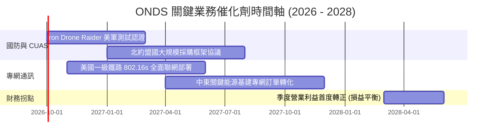

### 9.2 TAM 市場規模分析

```
╔══════════════════════════════════════════════════════════════════╗
║                 ONDS 目標市場 (TAM) 規模與滲透空間               ║
╠══════════════════════════════════════════════════════════════════╣
║                                                                  ║
║  [1] 全球反無人機系統 (Counter-UAS TAM)： $12.5B (2028 預期)     ║
║      ONDS 目前份額：~1.4% ｜ 預期潛在貢獻：$175M - $350M         ║
║                                                                  ║
║  [2] 全球關鍵任務物聯網專網 (MC-IoT TAM)： $8.0B                  ║
║      ONDS 目前份額：~0.5% ｜ 預期潛在貢獻：$40M - $100M          ║
║                                                                  ║
║  [3] 自主無人機巡檢即服務 (DIB TAM)：      $4.5B                  ║
║      ONDS 目前份額：~0.8% ｜ 預期潛在貢獻：$35M - $80M           ║
║                                                                  ║
║  合計 TAM 達 $25.0B，公司目前營收滲透率不足 1%，擴張空間遼闊     ║
╚══════════════════════════════════════════════════════════════════╝
```

### 9.3 成長驅動力結構圖

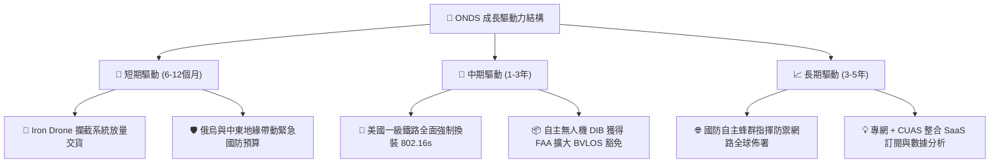

---

## 10. 風險矩陣

### 10.1 風險評分矩陣

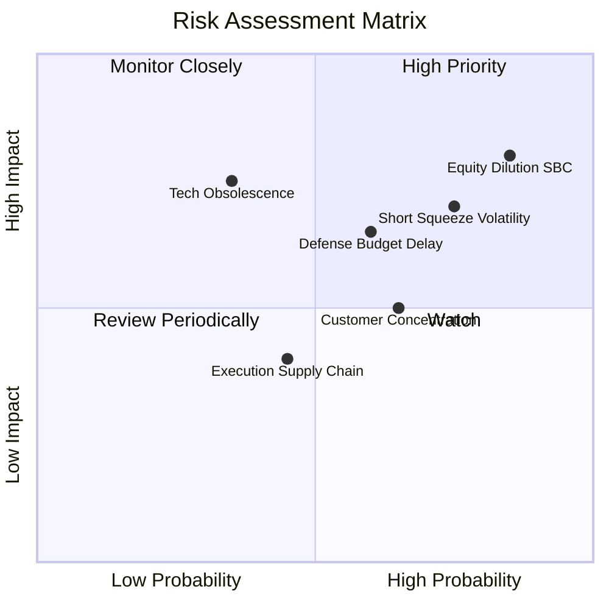

### 10.2 風險清單詳細分析

| # | 風險項目 | 發生機率 | 財務衝擊 | 風險評分 | 緩解措施與監控指標 |
|---|----------|----------|----------|----------|-------------------|
| 1 | 🔴 **股權過度稀釋與 SBC 失控** | 高 (85%) | 高 (-25% 每股內在價值) | 🔴 **8.2 / 10** | 密切監控單季 SBC 佔營收比例是否回落至 20% 以下。 |
| 2 | 🔴 **空頭高佔比引發劇烈震盪** | 高 (75%) | 高 (股價回撤 >30%) | 🔴 **7.5 / 10** | Short % Float 達 39.9%，嚴禁高槓桿追高，等待空頭回補平穩。 |
| 3 | 🟡 **政府國防合約交貨驗收延誤** | 中 (60%) | 中 (-15% 短期營收) | 🟡 **6.5 / 10** | 推進多元化商業客戶（公用事業與鐵路），平抑政府撥款波動。 |
| 4 | 🟡 **大客戶過度集中** | 中 (65%) | 中 (-20% 營收斷崖) | 🟡 **6.0 / 10** | 拓展海外北約與亞太盟國經銷通路，分散營收來源。 |

---

## 11. 投資建議

### 11.1 最終綜合評級雷達圖

```
╔══════════════════════════════════════════════════════════════════╗
║                   ONDS 八大維度綜合評估雷達                      ║
╠══════════════════════════════════════════════════════════════════╣
║ 業務成長性   9.0/10  ▓▓▓▓▓▓▓▓▓▓▓▓▓▓▓▓▓▓░░  🏆 極高爆發力        ║
║ 技術創新力   8.0/10  ▓▓▓▓▓▓▓▓▓▓▓▓▓▓▓▓░░░░  🟢 專網與自主攔截    ║
║ 資產負債表   7.5/10  ▓▓▓▓▓▓▓▓▓▓▓▓▓▓▓░░░░░  🟢 1.38B 現金儲備    ║
║ 護城河壁壘   6.2/10  ▓▓▓▓▓▓▓▓▓▓▓▓░░░░░░░░  🟡 鐵路與頻譜認證    ║
║ 基本面品質   6.0/10  ▓▓▓▓▓▓▓▓▓▓▓▓░░░░░░░░  🟡 營收強但利潤赤字  ║
║ 管理層執行   5.5/10  ▓▓▓▓▓▓▓▓▓▓▓░░░░░░░░░  🟡 股本稀釋過快      ║
║ 估值吸引力   4.0/10  ▓▓▓▓▓▓▓▓░░░░░░░░░░░░  🔴 P/S 與倍數偏高    ║
║ 獲利含金量   3.5/10  ▓▓▓▓▓▓▓░░░░░░░░░░░░░  🔴 SBC 與 FCF 惡化   ║
╠══════════════════════════════════════════════════════════════════╣
║ 綜合加權評分 6.0/10  ▓▓▓▓▓▓▓▓▓▓▓▓░░░░░░░░  🟡 觀望（Hold）      ║
╚══════════════════════════════════════════════════════════════╝
```

### 11.2 目標價與隱含報酬率

| 情境 | 機率權重 | 12 個月目標價 | 相對現價 ($7.40) 隱含報酬 | 核心驅動條件 |
|------|----------|---------------|---------------------------|--------------|
| 🔴 **悲觀情境** | 25% | **$4.50** | **-39.2%** | 營收增速回落至 25% 以下，SBC 居高不下。 |
| 🟡 **基準情境** | **55%** | **$8.85** | **+19.6%** | **營收如期擴張 45%，毛利率維持 >40%，虧損收斂。** |
| 🟢 **樂觀情境** | 20% | **$14.20** | **+91.9%** | 北約大單落地，空頭擠壓（Short Squeeze）引發暴漲。 |
| **期望值目標** | 100% | **$8.83** | **+19.3%** | 機率加權之綜合期望目標價。 |

### 11.3 買入時機與觸發因素

```
╔══════════════════════════════════════════════════════════════════╗
║                  ✅ 投資行動觸發 Checklist                      ║
╠══════════════════════════════════════════════════════════════════╣
║                                                                  ║
║  立即買入觸發條件（需多數符合）：                                ║
║  ☐ 股價回檔至安全邊際充足區間（$5.50 - $6.10，MOS ≥ 25%）        ║
║  ☐ 單季 GAAP 營業虧損顯著收斂至 -$20M 以內                      ║
║  ☐ 單季股權激勵 SBC 佔營收比例降至 25% 以下                      ║
║                                                                  ║
║  加碼觸發條件（出現以下任一）：                                  ║
║  ☐ 獲得美國國防部單筆合約金額超過 $50M 之確定採購               ║
║  ☐ 自由現金流（FCF）轉正連續兩季                                 ║
║                                                                  ║
║  減碼/停損觸發條件（出現以下任一）：                             ║
║  ☒ 股價跌破關鍵支撐 $4.95（52 週低點）且量能放大                 ║
║  ☒ 單季營收季減（QoQ 轉負），顯示國防交貨動能中斷                ║
║  ☒ 管理層進一步實施大規模折價股權增發融資                        ║
╚══════════════════════════════════════════════════════════════════╝
```

### 11.4 投資人適配度分析

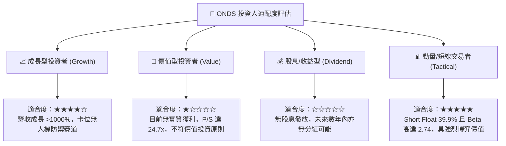

### 11.5 每季財報監控清單（Quarterly Watch List）

| 監控維度 | 關鍵財務指標 | 正常追蹤目標 | 觸發「加碼」門檻 | 觸發「減碼/停損」門檻 |
|----------|--------------|--------------|------------------|----------------------|
| **營收動能** | 季度營收 (Revenue) | > $65.0M | > $90.0M (YoY >300%) | < $45.0M (QoQ 轉負) |
| **毛利能力** | 毛利率 (Gross Margin) | 40% – 45% | > 48.0% | < 35.0% |
| **本業虧損** | 營業利益 (EBIT) | -$35M 至 -$25M | 優於 -$15.0M | 惡化超過 -$60.0M |
| **股權稀釋** | SBC 佔營收比例 | 25% – 35% | < 20.0% | > 60.0% |
| **造血能力** | 單季營運現金流 (CFO)| -$40M 至 -$25M | 轉正 (> $0M) | 惡化超過 -$80.0M |
| **融券結構** | Short % Float | 25% – 35% | 逼近 50% 配合放量 | 跌破 15% (空頭平倉完畢)|

### 11.6 反面論證：什麼會證明論點錯誤（What Would Change My Mind）

```
╔══════════════════════════════════════════════════════════════════╗
║              ⚠️ 論點失效條件（Disconfirming Evidence）           ║
╠══════════════════════════════════════════════════════════════════╣
║  本分析報告之「🟡 觀望」評級與中期轉機論點，在下列情況成立時應   ║
║  立即推翻並調整策略：                                            ║
║                                                                  ║
║  [1] 轉為「🟢 買入」之否定條件：                                 ║
║      - 2026 下半年單季營業利益率自當前 -166% 驟升至 -15% 以內，   ║
║        證明營運槓桿拐點遠早於預期發生。                          ║
║      - 管理層公開承諾限制 SBC 上限（< 營收之 15%），股權稀釋停止。║
║                                                                  ║
║  [2] 轉為「🔴 強烈賣出」之否定條件：                             ║
║      - 季度營收連續兩季出現 QoQ 衰退超過 15%。                   ║
║      - 帳上 $1.38B 現金被非核心的大型溢價併購迅速消耗超過 50%。  ║
║      - 反無人機 Iron Drone 系統於第三方軍事測評中發生重大技術失效 ║
║        或遭國防採購單位取消供應商資格。                          ║
║      - ROIC 連續 4 季維持低於 -40%，EVA 持續惡化。                ║
╚══════════════════════════════════════════════════════════════════╝
```

---
> **免責聲明**：本報告為依據特定財務數據所進行之機構級研究模型演算，僅供學術交流與投資研究參考，不構成任何形式的證券買賣邀約或投資建議。市場有風險，投資決策請務必審慎評估。