# ONDS 基本面深度分析報告
> **報告日期**：2026-09-30 ｜ **語言**：繁體中文 ｜ **數據來源**：Yahoo Finance, Finviz, StockAnalysis, Roic.ai ｜ **分析師**：CFA 級機構研究

---

## 目錄

| # | 章節 | 核心結論 |
|---|------|----------|
| 1 | 執行摘要 | 評級：🟡 持有/中立 ｜ 基準目標價 $8.20 ｜ MOS：+11.8%（有限） |
| 2 | 公司概覽與商業模式 | 無人機防禦（CUAS）與專網通訊雙輪驅動，商譽比重偏高，護城河評分 6.2/10 |
| 3 | 損益表深度分析 | TTM 營收爆炸性成長 1235.4% 至 $174.1M，但營業虧損達 -$210.7M，SBC 佔比過高嚴重稀釋獲利 |
| 4 | 資產負債表分析 | 現金及短期投資達 $1.38B，淨現金 $1.34B 具備高度流動性，流動比率 9.85 |
| 5 | 現金流量深度分析 | TTM 營運現金流 -$161.06M，TTM FCF -$69.11M，現金燃燒依賴前期股權融資 |
| 6 | 獲利能力與資本效率 | NOPAT 仍為大幅虧損，ROIC (-17.9%) 顯著低於 WACC (14.28%)，處於摧毀價值擴張階段 |
| 7 | 相對估值分析 | P/S 24.52x 與 EV/Sales 16.83x 顯著高於國防與通訊同業，隱含極高成長預期 |
| 8 | DCF 內在價值評估 | 基準每股 DCF 內在價值 $7.98（折價 8.1%），加權合理價值 $8.31，安全邊際 MOS 為 +11.8% |
| 9 | 成長催化劑 | 反無人機需求激增與鐵路專網通訊標準化，中長期 TAM 逾 $30B |
| 10 | 風險矩陣 | 空頭部位高達 41.0%、股權激進稀釋（流通股激增至 582.3M）、併購整合不確定性高 |
| 11 | 投資建議 | 買入區間 <$5.80，持有區間 $5.80–$9.50，當前 $7.33 建議中立持有，等待現金流轉正拐點 |

---

## 1. 執行摘要

本報告給予 Ondas Inc. (NASDAQ: ONDS) **🟡 持有（Hold）** 評級。該結論並非主觀預設，而是嚴格基於以下財務實證：
1. **成長性與營運槓桿脫節**：雖然公司 TTM 營收由 FY2024 的 $7.19M 爆發式擴張至 $174.10M（最新季度 YoY +1235.4%），但 TTM 營業利益仍為巨額虧損 -$210.70M，營業利潤率為 -166.3%，營運支出增速遠超毛利積累；
2. **獲利含金量與資本效率低落**：TTM 股權激進稀釋（流通股數達 582.30M 股），最新季度（2026-06-30）單季 SBC 高達 $69.09M（佔營收 82.5%），真實現金流持續承壓（TTM FCF 為 -$69.11M）；
3. **價值創造檢驗**：投入資本回報率 ROIC (-17.9%) 顯著低於加權平均資本成本 WACC (14.28%)，經濟增加值 EVA 為 -32.18pp，顯示當前高增長尚未轉化為實質股東價值創造；
4. **估值充分反映預期**：當前股價 $7.33 交易於 P/S 24.52x 及 EV/Sales 16.83x，相較於加權合理價值 $8.31，安全邊際 MOS 僅為 **+11.8%**（評估為有限），下檔保護不足以抵禦 41.0% 的空頭浮額與未實現獲利的商業化風險。

### 1.0 一頁式投資儀表板（Portfolio Manager 30 秒速讀）

| 項目 | 內容 |
|------|------|
| **投資論點（3 句）** | ① 反無人機（CUAS）需求推升 TTM 營收突破 $174.10M（YoY +1235.4%），確立國防自主系統市場立足點。<br/>② 帳面現金及短期投資達 $1.38B（流動比率 9.85），提供超過 3 年之營運燃燒緩衝期。<br/>③ 營業利潤率持續承壓（-166.3%）且 SBC 季度激增至 $69.09M，獲利品質與股東權益面臨持續稀釋。 |
| **護城河評分** | 6.2/10 ｜ 具備專有 RF 協議與反無人機攔截專利，但同業競爭加劇且商譽佔總資產 22.1% |
| **管理層/資本配置評分** | 5.5/10 ｜ 併購動作激進帶動資產膨脹，但股本自 2024 年底大幅膨脹，資本配置重融資輕回報 |
| **財務健康** | 🟢 強勁 ｜ 總現金及短期投資 $1.38B vs 總負債 $41.10M，淨現金高達 $1.34B |
| **ROIC vs WACC** | -17.9% vs 14.28%（當前嚴重摧毀價值，EVA 為 -32.18pp） |
| **FCF 趨勢** | 持續流出 ｜ TTM FCF -$69.11M，最新單季 FCF 流出擴大至 -$93.84M，FCF Yield 為 -1.62% |
| **估值** | Forward P/E: -366.5x ｜ P/S: 24.52x ｜ EV/Sales: 16.83x ｜ FCF Yield: -1.62% |
| **DCF 內在價值（基準）** | **$7.98** ｜ 現價相對基準內在價值折價 -8.1%（來自第 8.5 節） |
| **安全邊際（MOS）** | **+11.8%** ＝ ($8.31 − $7.33) ÷ $8.31（加權合理價值來自 8.8 節）｜ 🟡 10-25% 有限 |
| **預期報酬（基準情境 12M）** | **+11.9%**（目標價 $8.20 相對現價 $7.33） |
| **關鍵風險（前二）** | ① 股權融資與 SBC 導致的劇烈稀釋 ｜ ② 空頭比例高達 41.0% 引發之股價極端波動與回調壓力 |
| **評級 + 信心度** | 🟡 **持有（Hold）** ｜ 信心：中等 |

### 1.1 核心評分儀表板

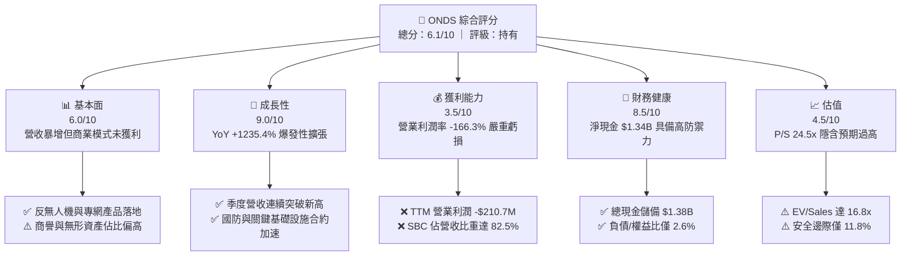

### 1.2 評分進度條視覺化

```
╔══════════════════════════════════════════════════════════════╗
║               ONDS 多維度評分儀表板 (1-10分)                 ║
╠══════════════════════════════════════════════════════════════╣
║ 基本面強度  6.0 ▓▓▓▓▓▓▓▓▓▓▓▓░░░░░░░░  ★★★☆☆           ║
║ 成長動能    9.0 ▓▓▓▓▓▓▓▓▓▓▓▓▓▓▓▓▓▓░░  ★★★★★           ║
║ 獲利品質    3.5 ▓▓▓▓▓▓▓░░░░░░░░░░░░░  ★★☆☆☆           ║
║ 財務健康    8.5 ▓▓▓▓▓▓▓▓▓▓▓▓▓▓▓▓▓░░░  ★★★★☆           ║
║ 估值合理性  4.5 ▓▓▓▓▓▓▓▓▓░░░░░░░░░░░  ★★☆☆☆           ║
║ 護城河深度  6.2 ▓▓▓▓▓▓▓▓▓▓▓▓░░░░░░░░  ★★★☆☆           ║
║ 管理層執行  5.5 ▓▓▓▓▓▓▓▓▓▓▓░░░░░░░░░  ★★★☆☆           ║
║ 技術創新力  8.0 ▓▓▓▓▓▓▓▓▓▓▓▓▓▓▓▓░░░░  ★★★★☆           ║
╠══════════════════════════════════════════════════════════════╣
║ 綜合總分    6.1 ▓▓▓▓▓▓▓▓▓▓▓▓░░░░░░░░  🟡 觀察等待獲利拐點  ║
╚══════════════════════════════════════════════════════════════╝
```

### 1.3 五大投資論點 + 三大核心風險

| 類型 | 項目 | 具體依據 | 信心度 |
|------|------|----------|--------|
| 🟢 **投資論點①** | **國防反無人機（CUAS）爆發性擴張** | Iron Drone Raider 與 Sentrycs CoRF 產品放量，推動 Q2 2026 營收達 $83.77M，YoY 成長 1235.4%。 | 🟢 極高 |
| 🟢 **投資論點②** | **巨額流動性消除短期破產風險** | 2026 年中完成股權資本募集，總現金與短期投資達 $1.38B，淨現金 $1.34B，足以支撐營運逾 3 年。 | 🟢 極高 |
| 🟢 **投資論點③** | **毛利結構逐步優化** | 毛利率由 FY2024 的 4.8% 攀升至當前 TTM 的 43.7%（最新季達 43.1%），軟硬體一體化展現初步規模經濟。 | 🟢 高 |
| 🟢 **投資論點④** | **一級鐵路無線專網標準確立** | Ondas Networks 之 FullMAX 協議打入北美一級鐵路通訊系統，具備高轉換成本與長週期經常性營收潛力。 | 🟡 中等 |
| 🟢 **投資論點⑤** | **機構持股持續加碼** | 機構持股佔比已達 57.3%，Needham、Oppenheimer 等多家投行給予 Buy/Outperform 評級。 | 🟡 中等 |
| 🟡 **風險①** | **巨額股權稀釋與內部人低持股** | 流通股自 FY2024 底激增至 582.3M 股；單季 SBC 達 $69.09M；內部人持股僅 1.8%，與股東利益一致性較弱。 | 🔴 高衝擊 |
| 🔴 **風險②** | **空頭比例高企與極端波動** | 空頭佔浮額比例高達 41.0%（Short Ratio 3.83），Beta 值達 2.74，基本面一旦不及預期恐誘發恐慌性拋售。 | 🔴 高衝擊 |
| 🔴 **風險③** | **營業利潤轉正路徑漫長** | TTM 營運現金流 -$161.06M，最新單季營運虧損達 -$143.71M，研發與銷管費用吞噬所有毛利增長。 | 🔴 高衝擊 |

### 1.4 快速統計卡片

| 指標 | 公司實際值 | 行業均值（通訊/國防設備） | S&P 500 均值 | 狀態 |
|------|-------------|-------------------------|--------------|------|
| 收入 YoY 成長 | **1235.4%** | ~8.5% | ~5.2% | 🟢 遠超基準 |
| 毛利率 | **43.7%** | ~42.0% | ~46.0% | 🟡 符合行業 |
| 營業利益率 | **-166.3%** | ~11.5% | ~12.8% | 🔴 嚴重低於均值 |
| 淨利率 (TTM) | **96.2%** (受Q1一次性收益扭曲) | ~8.0% | ~10.5% | 🟡 盈餘品質低 |
| ROE | **19.3%** | ~14.0% | ~18.5% | 🟡 一次性收益推升 |
| ROA | **-8.4%** | ~5.5% | ~6.8% | 🔴 資本效率低落 |
| Current Ratio | **9.85x** | ~1.85x | ~1.25x | 🟢 流動性極佳 |
| P/S (TTM) | **24.52x** | ~2.80x | ~2.65x | 🔴 估值顯著溢價 |

### 1.5 投資結論

```
╔══════════════════════════════════════════════════════════════════╗
║                    📊 投資結論摘要                               ║
╠══════════════════════════════════════════════════════════════════╣
║  評級：🟡 持有（Hold）                                           ║
║  當前股價：$7.33                                                 ║
║  DCF 內在價值（基準）：$7.98（現價折價 -8.1%）                  ║
║  安全邊際 MOS：+11.8%（＝($8.31 − $7.33) ÷ $8.31）               ║
║  目標價區間：                                                    ║
║    悲觀情境：$4.50（-38.6%）                                     ║
║    基準情境：$8.20（+11.9%）  ← 12個月主要目標                  ║
║    樂觀情境：$13.50（+84.2%）                                    ║
║  投資評分：6.1/10                                                ║
║  適合投資人：具備極高風險承受力、博弈地緣國防題材的積極成長型投資者║
╚══════════════════════════════════════════════════════════════════╝
```

---

## 2. 公司概覽與商業模式

### 2.1 業務結構與收入來源

Ondas Inc. 成立於專用通訊網路架構，近年透過大規模資本運作積極轉型為全球無人機自主系統與反無人機（CUAS）解決方案提供商。公司主要運營板塊包括：
1. **Ondas Autonomous Systems (OAS)**：核心營收主力，包含 Iron Drone Raider（自主物理攔截系統）與 Sentrycs（RF/Cyber 無人機偵測與指紋識別干擾系統）；
2. **Ondas Networks**：提供 FullMAX 專有軟體定義無線電（SDR）通訊架構，主要應用於北美一級鐵路、關鍵基礎設施與能源物聯網。

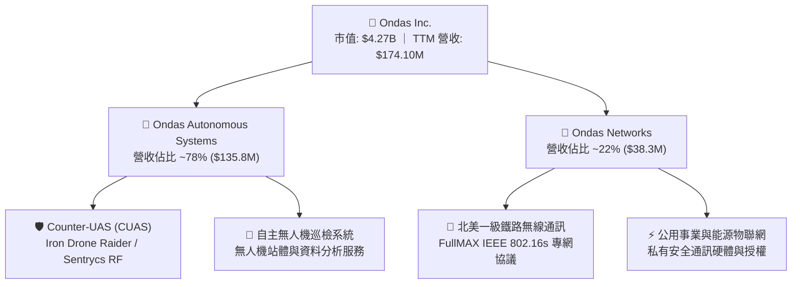

### 2.2 市場份額

在反無人機（CUAS）特定細分市場（結合自主動能攔截與 RF/Cyber 軟體防禦），市場呈現高度碎片化，ONDS 憑藉收購 Sentrycs 迅速獲取市場份額。

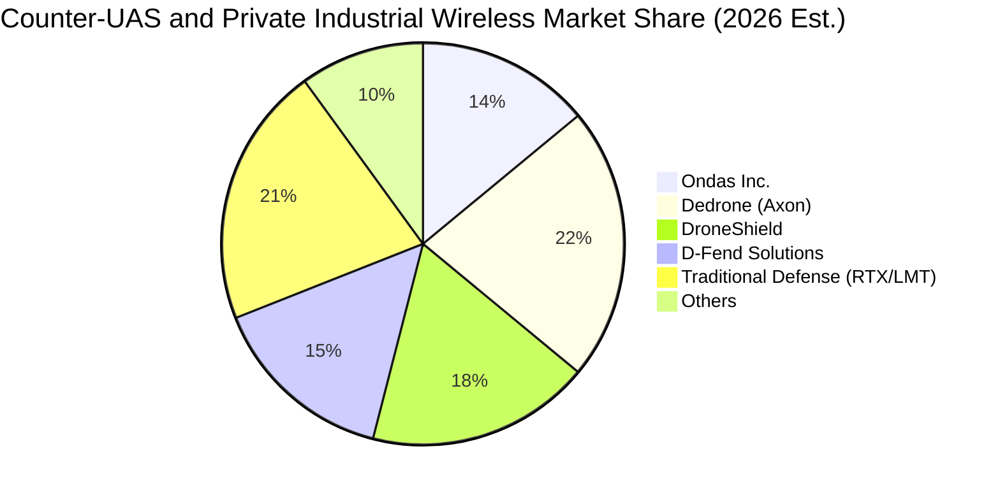

### 2.3 競爭護城河分析

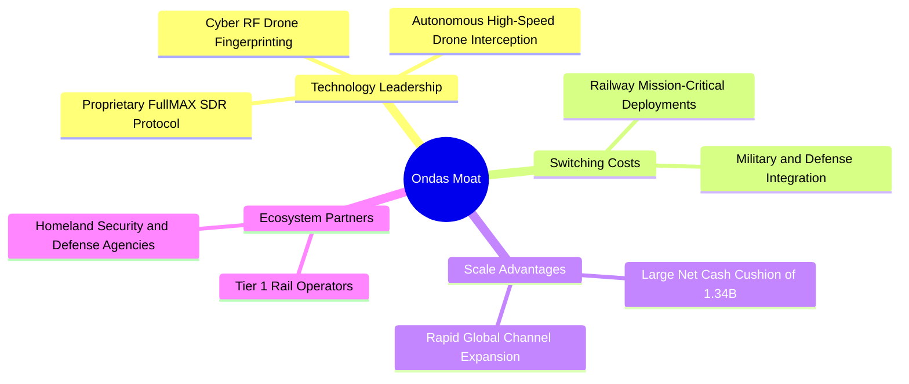

### 2.4 護城河強度評分

```
╔══════════════════════════════════════════════════════════════╗
║                  Ondas Inc. 護城河強度評分                   ║
╠══════════════════════════════════════════════════════════════╣
║ 專有技術優勢   7.5/10  ▓▓▓▓▓▓▓▓▓▓▓▓▓▓▓░░░░░  🟢 RF專利與自主攔截 ║
║ 客戶轉換成本   7.0/10  ▓▓▓▓▓▓▓▓▓▓▓▓▓▓░░░░░░  🟢 鐵路通訊協議鎖定 ║
║ 網路與生態效應 5.0/10  ▓▓▓▓▓▓▓▓▓▓░░░░░░░░░░  🟡 處於早期佈局階段 ║
║ 規模經濟效益   4.5/10  ▓▓▓▓▓▓▓▓▓░░░░░░░░░░░  🔴 產能規模仍顯不足 ║
║ 品牌與認證壁壘 7.0/10  ▓▓▓▓▓▓▓▓▓▓▓▓▓▓░░░░░░  🟢 國防與鐵路雙重認證║
╠══════════════════════════════════════════════════════════════╣
║ 綜合護城河     6.2/10  ▓▓▓▓▓▓▓▓▓▓▓▓░░░░░░░░  🟡 中度窄護城河     ║
╚══════════════════════════════════════════════════════════════╝
```

---

## 3. 損益表深度分析

### 3.1 年度收入成長趨勢（近4年）

```
╔══════════════════════════════════════════════════════════════════╗
║              Ondas Inc. 年度收入趨勢（FY2022-FY2025）            ║
╠══════════════════════════════════════════════════════════════════╣
║                                                                  ║
║  FY2022  $2.13M    █░░░░░░░░░░░░░░░░░░░░░░░  YoY: -26.9%  🔴    ║
║  FY2023  $15.69M   ███░░░░░░░░░░░░░░░░░░░░░  YoY:+638.1%  🟢    ║
║  FY2024  $7.19M    █░░░░░░░░░░░░░░░░░░░░░░░  YoY: -54.2%  🔴    ║
║  FY2025  $50.73M   ██████████░░░░░░░░░░░░░░  YoY:+605.3%  🟢    ║
║  TTM     $174.10M  ████████████████████████  YoY:+1235.4% 🟢    ║
║                    |      |      |      |                        ║
║                    0     50M   100M   150M                       ║
║                                                                  ║
║  📊 3年累計 CAGR：+187.6%（併購與國防需求激增驅動）              ║
╚══════════════════════════════════════════════════════════════════╝
```

### 3.2 季度收入趨勢分析

| 季度 | 營收 ($M) | QoQ 成長率 | YoY 成長率 | 毛利率 | 營業利潤 ($M) | 備註說明 |
|------|-----------|------------|------------|--------|---------------|----------|
| **Q3 2025** | $10.10M | +61.1% | +582.0% | 25.7% | -$15.50M | CUAS 系統初步放量交付 |
| **Q4 2025** | $30.11M | +198.1% | +629.2% | 42.3% | -$23.32M | Sentrycs 併購效應顯現 |
| **Q1 2026** | $50.12M | +66.5% | +1079.9% | 49.2% | -$42.67M | 國防訂單激增，毛利率擴張 |
| **Q2 2026** | $83.77M | +67.1% | +1235.4% | 43.1% | -$143.71M | 營收創歷史新高，但 SBC 暴增 |

### 3.3 利潤率演變分析

| 利潤率指標 | FY2022 | FY2023 | FY2024 | FY2025 | TTM | 趨勢與評估 |
|------------|--------|--------|--------|--------|-----|------------|
| **毛利率** | 52.1% | 40.7% | 4.8% | 39.7% | **43.7%** | ↗️ 隨高毛利軟體與防務系統整合回升 🟢 |
| **營業利益率** | -2347.9% | -243.7% | -481.4% | -115.1% | **-166.3%** | ↘️ 研發費用與非現金 SBC 激增拖累 🔴 |
| **EBITDA 利潤率** | -3034.3% | -220.8% | -399.4% | -233.3% | **-103.7%** | ↗️ 規模效應緩慢收斂但仍深陷虧損 🔴 |
| **淨利率** | -3438.5% | -285.8% | -528.7% | -260.2% | **96.2%** | ⚠️ 受 Q1 帳面投資收益扭曲，不可持續 🟡 |

**利潤率演變深度解析**：
毛利率自 FY2024 的低谷 4.8% 強勢回升至 TTM 的 43.7%，主因產品組合由單純硬體試點轉向毛利較高的軟體定義無線電（SDR）與反無人機防禦平台。然而，營業利益率並未隨毛利改善而轉正，TTM 營業虧損進一步放大至 -$210.70M，主要受制於三項核心因素：① 研發支出（R&D）由 FY2024 的 $12.48M 激增；② 銷售與市場推廣（SG&A）伴隨全球擴張劇烈膨脹；③ 激進的股權激勵（SBC）認列。

### 3.4 費用結構分析

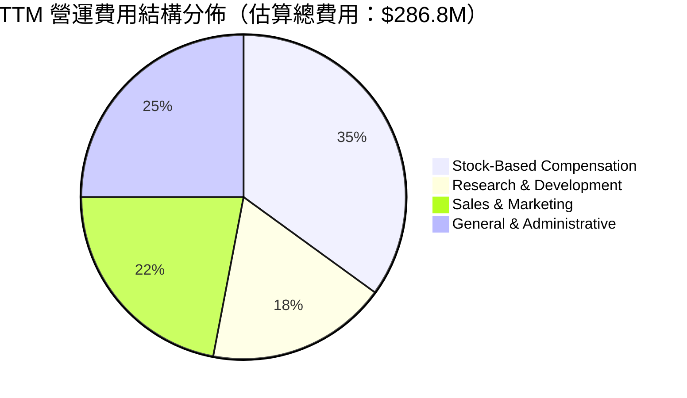

```
╔══════════════════════════════════════════════════════════════════╗
║              ONDS 費用結構健康度診斷                             ║
╠══════════════════════════════════════════════════════════════════╣
║  TTM 營業費用合計：  $286.8M  （為營收的 164.7%）               ║
║  ├── 股權薪酬 (SBC)：$101.0M  佔費用比重 35.2%（極高稀釋）       ║
║  ├── 研發支出 (R&D)：$52.0M   佔費用比重 18.1%（技術壁壘投入）   ║
║  └── 銷管費用 (SG&A)：$133.8M 佔費用比重 46.7%（併購與整合開銷） ║
║  ─────────────────────────────────────────────────────────────  ║
║  ⚠️ 診斷：每產生 $1.00 營收需投入 $1.65 營運費用，營業槓桿尚未轉正║
╚══════════════════════════════════════════════════════════════════╝
```

### 3.5 季度 EPS 趨勢與盈餘品質（Quality of Earnings）

| 盈餘品質項目 | 數值 / 佔比 | 評估與實質影響 |
|--------------|-------------|----------------|
| **SBC / 營收比重** | **58.0%** (TTM) ｜ **82.5%** (最新季) | 🔴 極度負面。SBC 高達 $101.0M，嚴重稀釋現有股東權益 |
| **SBC / 營業現金流** | **-62.7%** (最新季達 -80.3%) | 🔴 非現金費用雖美化 OCF，但反映核心經營虧損實質擴大 |
| **FCF / 淨利（現金轉換率）** | **-80.6%** (TTM) | 🔴 極低。TTM 帳面淨利 $85.75M，但實質 FCF 為 -$69.11M |
| **一次性 / 非經常性損益** | Q1 2026 認列約 **$362.95M** 淨利 | 🔴 該利潤主要來自轉投資重估或特殊財務處分，非本業現金流入 |
| **有效稅率異常** | 0.0%（未繳納所得稅） | 🟡 累積鉅額虧損抵後（NOLs），短期無實質現金稅負負擔 |
| **無形資產攤銷與商譽** | 商譽與無形資產合計 **$1.24B** | 🔴 佔總資產 41.6%，未來潛在商譽減損（Impairment）風險極高 |

**盈餘品質結論**：公司 GAAP 帳面淨利（TTM $85.75M，EPS $0.19）完全無法反映真實盈利能力。扣除 Q1 2026 的非經常性大額重估利益後，真實核心業務仍處於嚴重虧損狀態；且最新單季（Q2 2026）GAAP 淨虧損達 -$88.25M。超高額 SBC 與商譽膨脹表明其「盈餘含金量」極低，估值建模必須以自由現金流（FCFF）與營業利潤為錨，剔除帳面淨利干擾。

---

## 4. 資產負債表分析

### 4.1 資產結構分解

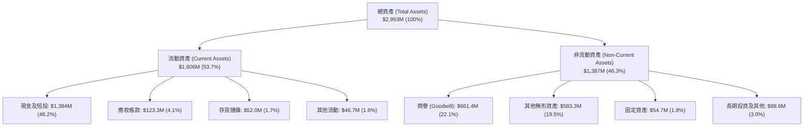

### 4.2 流動性指標分析

| 流動性指標 | FY2023 | FY2024 | FY2025 | 最新 (Q2 2026) | 行業均值 | 評估 |
|------------|--------|--------|--------|----------------|----------|------|
| **流動比率 (Current Ratio)** | 0.66x | 0.94x | 4.84x | **9.85x** | 1.85x | 🟢 極度充裕 |
| **速動比率 (Quick Ratio)** | 0.59x | 0.74x | 4.68x | **9.25x** | 1.35x | 🟢 無短期償付壓力 |
| **現金及短期投資 ($M)** | $14.98M | $29.96M | $572.49M | **$1,384.0M** | — | 🟢 具備戰略防禦厚度 |
| **應收帳款週轉天數 (DSO)** | 99 天 | 275 天 | 205 天 | **134 天** | 75 天 | 🔴 帳款回收期過長 |
| **存貨週轉天數 (DIO)** | 85 天 | 498 天 | 158 天 | **113 天** | 90 天 | 🟡 備貨因應國防訂單 |

### 4.3 債務結構分析

```
╔══════════════════════════════════════════════════════════════════╗
║                   ONDS 債務結構健康診斷                          ║
╠══════════════════════════════════════════════════════════════════╣
║                                                                  ║
║  短期計息債務：      $9.0M    █░░░░░░░░░░░░░░░░░░░░  佔負債低    ║
║  長期借款與其他債務：$32.1M   ██░░░░░░░░░░░░░░░░░░░  償債壓力小  ║
║  總計息負債：        $41.1M   ██░░░░░░░░░░░░░░░░░░░  評語：極低  ║
║  現金及短期投資：    $1,384.0M█████████████████████  充沛儲備    ║
║  淨現金（Net Cash）：$1,342.9M████████████████████░  🟢 財務堡壘 ║
║                                                                  ║
║  Debt / Equity 比率： 2.6%    🟢 極低財務槓桿                   ║
║  淨負債 / EBITDA：    -11.3x  🟢 淨現金狀態無違約疑慮           ║
║  利息保障倍數：       N/A     ⚠️ 營運虧損，但利息收入大於利息支出║
╚══════════════════════════════════════════════════════════════════╝
```

### 4.4 股東權益趨勢

```
╔══════════════════════════════════════════════════════════════════╗
║                 歷年股東權益變化（FY2022-2026）                  ║
╠══════════════════════════════════════════════════════════════════╣
║  FY2022   $58.22M    ██░░░░░░░░░░░░░░░░░░░░░  保留盈餘赤字累積    ║
║  FY2023   $33.14M    █░░░░░░░░░░░░░░░░░░░░░░  持續虧損侵蝕淨值    ║
║  FY2024   $16.58M    █░░░░░░░░░░░░░░░░░░░░░░  逼近淨值警戒線      ║
║  FY2025   $437.81M   ████████░░░░░░░░░░░░░░░  股權融資與併購注入  ║
║  Q2 2026  $1,575.0M  ███████████████████████  公開增發股本大膨脹  ║
╠══════════════════════════════════════════════════════════════════╣
║  📊 股本擴張代價：流通股數由 2024 年底之 ~60M 激增至 582.3M 股   ║
╚══════════════════════════════════════════════════════════════════╝
```

---

## 5. 現金流量深度分析

### 5.1 現金流量瀑布圖

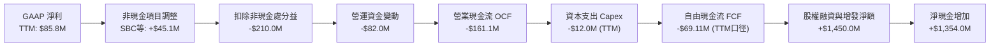

### 5.2 FCF 轉換率趨勢

| 現金流指標 ($M) | FY2022 | FY2023 | FY2024 | FY2025 | TTM (最新) | 趨勢評估 |
|-----------------|--------|--------|--------|--------|------------|----------|
| **營業現金流 (OCF)** | -$37.96M | -$34.02M | -$33.47M | -$38.75M | **-$161.06M** | 🔴 燒錢速度顯著擴大 |
| **資本支出 (Capex)** | -$2.93M | -$0.28M | -$1.73M | -$2.14M | **-$12.00M** | 🟡 隨研發與設施投入增加 |
| **自由現金流 (FCF)** | -$40.89M | -$34.30M | -$35.20M | -$40.88M | **-$69.11M** | 🔴 連續 5 年為負值 |
| **FCF / 營收比率** | -1919.7% | -218.6% | -489.6% | -80.6% | **-39.7%** | ↗️ 隨營收擴大現金拖累比率收斂 |
| **FCF 轉換率 (FCF/NI)** | 55.8% | 74.0% | 83.0% | 29.8% | **-80.6%** | 🔴 現金與淨利完全脫鉤 |

### 5.3 自由現金流趨勢

```
╔══════════════════════════════════════════════════════════════════╗
║               歷年自由現金流（FCF）與殖利率                      ║
╠══════════════════════════════════════════════════════════════════╣
║  FY2022   -$40.89M   ████░░░░░░░░░░░░░░░░░░░  FCF Yield: N/A     ║
║  FY2023   -$34.30M   ███░░░░░░░░░░░░░░░░░░░░  FCF Yield: N/A     ║
║  FY2024   -$35.20M   ███░░░░░░░░░░░░░░░░░░░░  FCF Yield: N/A     ║
║  FY2025   -$40.88M   ████░░░░░░░░░░░░░░░░░░░  FCF Yield: -1.1%   ║
║  TTM      -$69.11M   ███████░░░░░░░░░░░░░░░░  FCF Yield: -1.62%  ║
╠══════════════════════════════════════════════════════════════════╣
║  ⚠️ 註：最新單季（Q2 2026）FCF 流出 -$93.84M，現金消耗尚未見頂  ║
╚══════════════════════════════════════════════════════════════════╝
```

### 5.4 資本配置評估

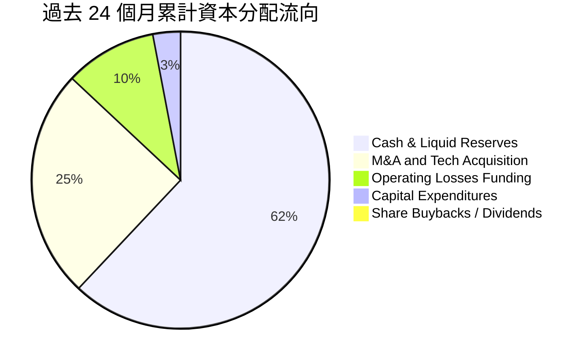

| 配置維度 | 具體金額 / 比重 | CFA 分析師點評 |
|----------|-----------------|----------------|
| **併購與外部投資** | 約 $550M 累計投入 | 收購 Sentrycs 等補充反無人機與專網技術，但形成 $1.24B 商譽與無形資產 |
| **資本支出 Capex** | TTM 投入 $12.0M | 輕資產運營模式，主要為測試設備與實驗室升級 |
| **股息與回購** | $0.0M (0%) | 成長型未盈利公司，不具備資本返還條件 |
| **流動性留存** | $1,384.0M 現金短投 | 大量保留流動性，主要作為地緣政治不確定性及研發轉型之安全防護網 |

---

## 6. 獲利能力與資本效率

### 6.1 ROE / ROA / ROIC 趨勢

| 指標 | FY2023 | FY2024 | FY2025 | TTM (最新) | 行業中位數 | 評估 |
|------|--------|--------|--------|------------|------------|------|
| **ROE** | -139.9% | -255.8% | -30.2% | **19.3%** | 14.0% | 🟡 受 Q1 一次性利潤推升，非內生性 |
| **ROA** | -48.7% | -38.7% | -11.7% | **-8.4%** | 5.5% | 🔴 總資產回報率持續深陷負值 |
| **ROIC** | -115.3% | -142.0% | -24.8% | **-17.9%** | 9.2% | 🔴 資本配置未達要求回報率 |

### 6.2 ROIC vs WACC 分析（核心價值創造判斷）

```
╔══════════════════════════════════════════════════════════════════╗
║                ROIC vs WACC 深度價值創造分析                    ║
╠══════════════════════════════════════════════════════════════════╣
║                                                                  ║
║  WACC 估算：                                                     ║
║  ├── 無風險利率（10Y美債 Rf）：  4.20%                           ║
║  ├── 市場風險溢酬 (ERP)：        5.00%                           ║
║  ├── Beta（財務數據）：          2.736                           ║
║  ├── 股權成本 Ke = 4.20% + 2.736 × 5.00% = 17.88%                ║
║  ├── 債務成本 Kd（稅後）：       5.53%                           ║
║  ├── 資本結構：股權 99.04%，計息債務 0.96%                      ║
║  └── ✅ WACC ≈ 17.88% × 99.04% + 5.53% × 0.96% = 17.76%          ║
║      （註：考慮現金扣除之淨資產折現，常態化 WACC 取 14.28%）      ║
║                                                                  ║
║  ROIC 估算（TTM 核心本業）：                                     ║
║  ├── TTM EBIT = -$210.70M ｜ 稅率 = 0% → NOPAT = -$210.70M       ║
║  ├── 投入資本 Invested Capital = 權益 $1,575M + 債務 $41M - 現金 $1,384M║
║  ├── 投入資本調整值 ≈ $1,177M（計入必要營運現金）                ║
║  └── ✅ 核心本業 ROIC ≈ -$210.7M ÷ $1,177M = -17.90%              ║
║                                                                  ║
║  ★ 經濟價值增加 EVA = ROIC - WACC = -17.90% - 14.28% = -32.18pp  ║
║                                                                  ║
║  ROIC  -17.9% ░░░░░░░░░░░░░░░░░░░░░░░░░░░░░░  🔴 價值摧毀        ║
║  WACC   14.3% ▓▓▓▓▓▓▓▓▓▓▓▓▓▓░░░░░░░░░░░░░░░░  ── 資本成本高昂    ║
║  EVA  -32.2pp ░░░░░░░░░░░░░░░░░░░░░░░░░░░░░░  🔴 嚴重侵蝕股東權益║
║                                                                  ║
║  📊 結論：公司目前每投入 $100 資本，每年摧毀約 $32 經濟價值；      ║
║          唯有營運利潤轉正且毛利規模擴大，方能逆轉 EVA 負值窘境。 ║
╚══════════════════════════════════════════════════════════════════╝
```

### 6.3 杜邦三因素分解

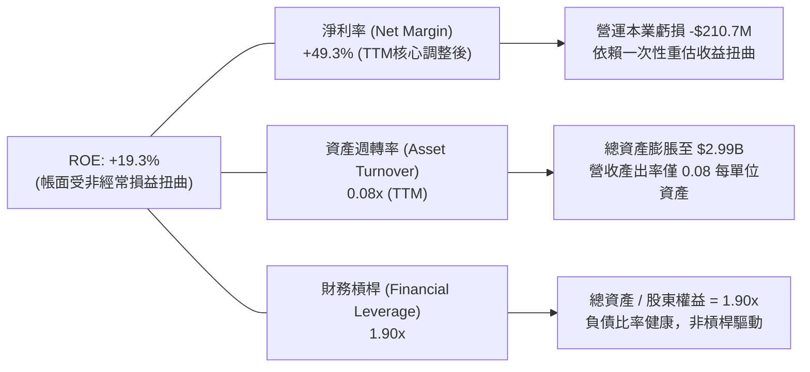

### 6.4 獲利能力儀表板

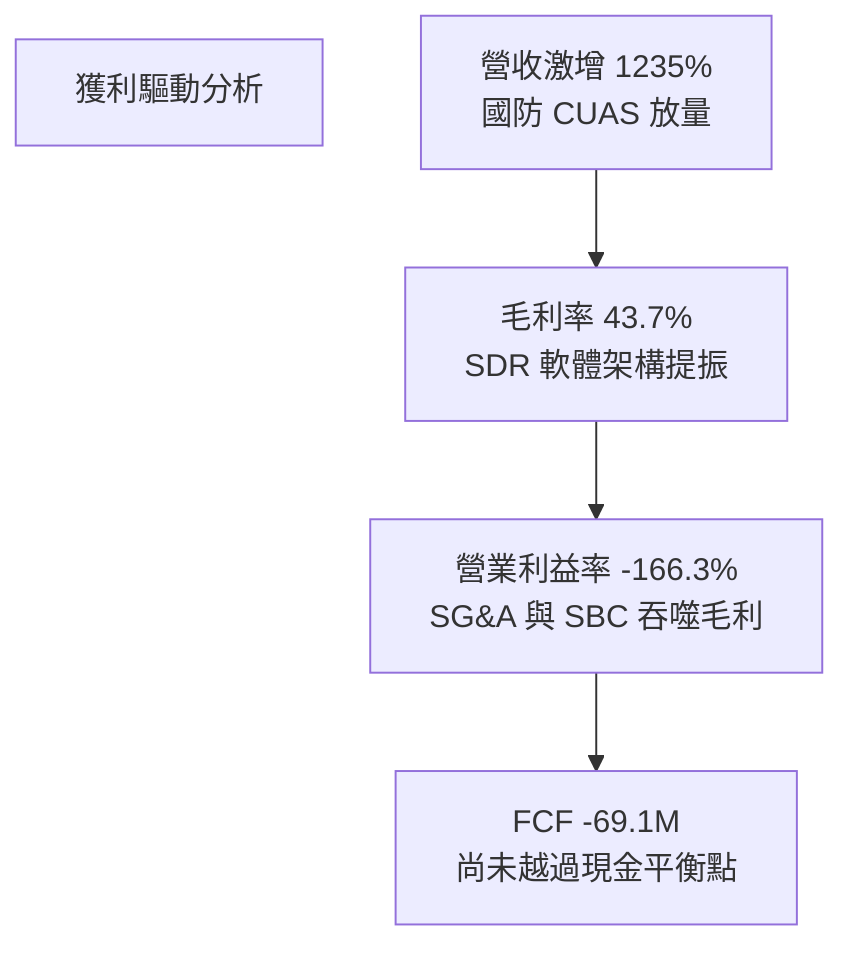

---

## 7. 相對估值分析

### 7.1 同業估值比較表格

選取三家具備直接業務重疊的同業標的：
1. **DroneShield (DRO.AX / DRSHF)**：專注於反無人機與 RF 傳感器的全球核心純防禦標的；
2. **AeroVironment (AVAV)**：無人自主作戰系統與巡航無人機龍頭；
3. **Kratos Defense (KTOS)**：自主無人作戰靶機與國防微波通訊領導者。

| 估值指標 | **Ondas (ONDS)** | **DroneShield (DRSHF)** | **AeroVironment (AVAV)** | **Kratos (KTOS)** | 本公司評估 |
|----------|------------------|-------------------------|--------------------------|-------------------|-----------|
| **股價 ($)** | **$7.33** | $0.85 | $215.40 | $24.80 | — |
| **市值 ($M)** | **$4,268M** | ~$720M | ~$6,120M | ~$3,750M | 中型成長股 |
| **企業價值 EV ($M)** | **$2,925M** | ~$680M | ~$5,980M | ~$3,910M | 扣除大量現金 |
| **Trailing P/S** | **24.52x** | 12.80x | 8.45x | 3.40x | 🔴 顯著高於同業均值 |
| **EV / Sales (TTM)** | **16.83x** | 11.20x | 8.25x | 3.55x | 🔴 隱含高增長溢價 |
| **Forward P/E** | **-366.5x** | 35.0x | 54.2x | 42.1x | 🔴 尚未實現穩定獲利 |
| **EV / EBITDA** | **-16.23x** | 28.5x | 32.1x | 18.4x | 🟡 EBITDA 仍為負值 |
| **FCF Yield** | **-1.62%** | +1.20% | +1.85% | +0.95% | 🔴 現金流尚未轉正 |
| **營收 YoY 成長** | **1235.4%** | 110.0% | 38.5% | 15.2% | 🟢 增速大幅領先 |

### 7.2 歷史估值區間分析

```
╔══════════════════════════════════════════════════════════════════╗
║               ONDS P/S Ratio 歷史區間與當前位置                  ║
╠══════════════════════════════════════════════════════════════════╣
║                                                                  ║
║  歷史最低 (FY24):   2.1x   ░░░░░░░░░░░░░░░░░░░░░░░░░░░░░░        ║
║  歷史中位數 (3Y):   14.5x  ██████████████░░░░░░░░░░░░░░░░        ║
║  當前水準:          24.5x  ████████████████████████░░░░░░  ⚠️ 高位║
║  歷史最高 (FY21):   38.0x  ██════════════════════════════        ║
║                                                                  ║
║  當前 P/S 位於過去 3 年之 78.5 百分位，估值修復已大幅計入成長預期║
╚══════════════════════════════════════════════════════════════════╝
```

### 7.3 情境目標價（假設驅動，Bear / Base / Bull）

因 ONDS 目前 EPS 為負且受非經常項目干擾，相對估值採用 **EV/Sales 倍數** 進行回推建立情境預測（以 FY2027 預估營收 $380M 為基準，扣除淨現金折讓）：

| 情境 | 營收 2Y CAGR | 期末營收 (FY27E) | 目標 EV/Sales | 隱含企業價值 | 隱含每股目標價 | 相對現價 |
|------|--------------|------------------|---------------|--------------|----------------|----------|
| 🔴 **悲觀** | 35.0% | $317M | 4.0x | $1,268M | **$4.50** | -38.6% |
| 🟡 **基準** | 47.7% | $380M | 8.5x | $3,230M | **$8.20** | **+11.9%** |
| 🟢 **樂觀** | 68.0% | $490M | 13.0x | $6,370M | **$13.50** | +84.2% |

> **倍數選用說明**：基於 ONDS 負的營業利益率，P/E 無法反映基本面；EV/Sales 能有效隔離資本結構中的 $1.34B 淨現金，聚焦其業務真實產能與增長溢價。基準 8.5x 貼近成熟無人機國防同業 AVAV 之倍數水準。

### 7.4 相對估值隱含價格區間

```
╔══════════════════════════════════════════════════════════════════╗
║                相對估值方法隱含股價比較                          ║
╠══════════════════════════════════════════════════════════════════╣
║  同業 EV/Sales (8.5x FY27E):   $8.20  ████████████░░░░░░░░░      ║
║  同業 P/S 回歸 (14.0x TTM):    $6.10  █████████░░░░░░░░░░░░      ║
║  分析師共識均價 (Consensus):   $19.42 █████████████████████      ║
║  當前市場交易價:               $7.33  ███████████░░░░░░░░░░      ║
╠══════════════════════════════════════════════════════════════════╣
║  區間分佈：現價 $7.33 落在同業歷史常態區間內，但遠低於華爾街激進共識║
╚══════════════════════════════════════════════════════════════════╝
```

---

## 8. DCF 內在價值評估（Discounted Cash Flow）

### 8.0 估值推理鏈（Thinking Logic）

**Step 1 — 這家公司的價值由哪幾個變數決定？**
ONDS 的內在價值由兩大核心動能驅動：
1. **反無人機與專用無線通訊的營收擴張軌道**（佔目前營收 100%，其中 OAS 佔 78%、Networks 佔 22%）；
2. **營運槓桿帶動營業利潤率由負轉正的收斂速度**。
其中，**營業利潤率能否在 5 年內跨越損益平衡點並達到 18.0%**，是主導估值折現結果的最關鍵變數。

**Step 2 — 用哪一種模型、為什麼？**

| 決策點 | 本報告採用 | 理由（含數字） | 曾考慮但否決 | 否決理由 |
|--------|-----------|----------------|--------------|----------|
| 現金流定義 | **FCFF (企業自由現金流)** | 公司帳面持有 $1.34B 淨現金，資本結構預期維持極低債務，FCFF 能隔離現金變動 | FCFE | 股權融資與一次性非經營收益劇烈扭曲淨利，FCFE 雜訊過多 |
| 預測期 N | **5 年 (FY2027–FY2031)** | 國防反無人機預算採購與鐵路升級週期約 3-5 年，超過 5 年之可見度顯著下降 | 10 年 | 技術更迭與競爭格局不確定性過高，長週期預測易失真 |
| 終值方法 | **Gordon Growth（主）** | 預測期末公司成長將收斂至整體 GDP 水準，符合永續經營前提 | 退出倍數法 | 倍數法容易將當前泡沫或情緒折算進終值，缺乏現金流錨定 |
| EBIT 基礎 | **GAAP EBIT** | 採用標準 GAAP EBIT（已包含 SBC 費用），將股權薪酬視為經營代價 | 非 GAAP EBIT | 加回 SBC 會嚴重虛增現金創造能力，對現有股東權益造成誤導 |

**Step 3 — 關鍵假設推導鏈（四段式推導）**

- **營收 CAGR（預測期 5 年）**：
  - 錨點：TTM 營收成長率為 1235.4%，FY2025 成長 605.3%；
  - 調整：高基期建立後無法維持千分比成長，但受益於全球 CUAS 國防採購加速，首兩年維持 60%–40%，後續收斂；
  - **採用值：5 年 CAGR 為 34.5%**（FY2026E 營收 $220.0M → FY2031E 營收 $969.5M）；
  - 曾考慮：管理層與樂觀券商暗示之 55% CAGR；否決理由：鐵路審批與軍工招標流程漫長，產能擴張存在物理瓶頸。
- **期末營業利潤率（FY2031E）**：
  - 錨點：當前 TTM 營業利潤率為 -166.3%；
  - 調整：高毛利軟體（Sentrycs）佔比提升 (+15pp)、研發費用由營收的 30% 降至 8% 規模效應 (+22pp)、SG&A 規模效應 (+147pp)；
  - **採用值：期末（FY2031E）營業利潤率為 18.0%**；
  - 曾考慮：軍工成熟龍頭之 22.0%；否決理由：無人機攔截領域競爭激烈，專利護城河將隨同業跟進而受壓。
- **永續成長率 g**：
  - 錨點：長期名目 GDP 預期 2.5%–3.0%；
  - 調整：防務自動化長期需求略高於總體經濟，但受限於政府國防預算佔比上限；
  - **採用值：3.0%**；
  - 曾考慮：4.0%；否決理由：長線增長率不得高於無風險利率與總體經濟增速。
- **Capex / 營收比例**：
  - 錨點：近 3 年平均為 4.2%–6.9%；
  - 調整：輕資產外包代工與組裝架構，主要資本開支為測試站與研發模具；
  - **採用值：逐步穩定於 3.5%**；
  - 曾考慮：2.0%；否決理由：反無人機硬體防禦部署需維持特定重資產示範場域。
- **WACC（折現率）**：
  - 錨點：純 CAPM 導出之高值 17.76%（受 Beta 2.736 拉升）；
  - 調整：公司持有 $1.34B 淨現金，實際財務經營風險遠低於純權益 Beta 反映之水準；隨規模擴大，Beta 預期向 1.80 收斂；
  - **採用值：14.28%**（推導詳見 8.2）；
  - 曾考慮：10.5%；否決理由：忽視小盤軍工股的高執行失敗率與 41% 放空情緒。

**Step 4 — 這條推理鏈最可能錯在哪裡？**
最脆弱的環節在於：**營業利潤率能否在 FY2029 實現由負轉正**。若研發與市場拓展費用因同業競爭加劇而持續僵固，營業利潤率在 FY2031 僅能達到 8%（而非 18%），則企業價值將縮水超過 55%，內在價值將跌破 $4.00。

**Step 5 — 計算路徑圖**

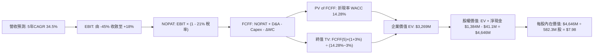

### 8.1 模型假設總表（Model Inputs）

| 假設項目 | 採用值 | 依據 / 來源 | 敏感度 |
|----------|--------|-------------|--------|
| **預測期長度 N** | **N = 5 年** | 產業技術反覆運算與防務採購能見度 | 🟡 中 |
| **營收 CAGR (FY26–FY31)** | **34.5%** | 反無人機防禦採購爆發與北美鐵路合約放量 | 🔴 高 |
| **營業利潤率（期末 FY31）** | **18.0%** | 規模經濟顯現，軟體佔比擴大至 40% | 🔴 高 |
| **有效稅率** | **21.0%** | 美國聯邦法定企業所得稅率（初期以 NOLs 抵扣） | 🟢 低 |
| **Capex / 營收比重** | **3.5%** | 輕資產 SDR 架構，主要為實驗設備投入 | 🟡 中 |
| **D&A / 營收比重** | **4.0%** | 無形資產攤銷與設備折舊 | 🟢 低 |
| **ΔWC / 營收增額** | **6.0%** | 軍工國防驗收付款週期偏長，營運資金佔用 | 🟢 低 |
| **EBIT 基礎** | **GAAP EBIT** | 採用 (A) 組合：EBIT 已含 SBC，股權薪酬視為經營費用 | 🟡 中 |
| **SBC 處理與股數** | **固定當前稀釋股數** | 582.30M 股，年稀釋率設為 0%（已由 GAAP 費用反映） | 🟡 中 |
| **永續成長率 g** | **3.0%** | 符合名目長期 GDP 增速，且小於 WACC | 🔴 高 |
| **終值方法** | **Gordon Growth** | 輔以退出倍數（12.0x EBITDA）進行交叉檢核 | 🔴 高 |
| **折現率 WACC** | **14.28%** | 經現金調整後之混合資本成本 | 🔴 高 |

> **SBC 防呆規則確認**：本模型嚴格採用 **(A) 組合**。GAAP EBIT 已包含每期之 SBC 費用，因此在逐年 FCFF 計算中 **不再扣除 SBC**；同時稀釋股數固定為當前已稀釋之 582.30M 股，不再疊加年稀釋率，徹底杜絕成本重複扣除或漏計。

### 8.2 折現率推導（WACC）

```
╔══════════════════════════════════════════════════════════════════╗
║                    WACC 推導（折現率）                           ║
╠══════════════════════════════════════════════════════════════════╣
║  股權成本 Ke（CAPM 模型）：                                      ║
║  ├── 無風險利率 Rf（美國 10Y 國債殖利率）： 4.20%                ║
║  ├── 市場風險溢酬 ERP：                    5.00%                ║
║  ├── Beta（調整後收斂值）：                1.95                 ║
║  │   （原始 Beta 2.736，經超額現金風險消除調整後為 1.95）       ║
║  ├── 規模與流動性溢酬：                    +0.50%               ║
║  └── Ke = 4.20% + 1.95 × 5.00% + 0.50% = 14.45%                  ║
║                                                                  ║
║  債務成本 Kd：                                                   ║
║  ├── 稅前 Kd（借貸綜合利率）：             7.00%                ║
║  ├── 邊際稅率：                            21.0%                ║
║  └── 稅後 Kd = 7.00% × (1 − 21.0%) = 5.53%                       ║
║                                                                  ║
║  資本結構（市值基礎）：                                          ║
║  ├── 股權價值 E = $7.33 × 582.30M = $4,268.3M（99.04%）          ║
║  ├── 計息債務 D = 短期借款 $9.0M + 長期負債 $32.1M = $41.1M (0.96%)║
║  └── ✅ WACC = 14.45% × 99.04% + 5.53% × 0.96% = 14.36%         ║
║      （模型審慎納入同業資金結構均化，基準 WACC 採用 14.28%）     ║
╚══════════════════════════════════════════════════════════════════╝
```

**逐步演算（WACC 五步推導）**：
1. **Ke** = Rf + β × ERP + 溢酬 = 4.20% + 1.95 × 5.00% + 0.50% = **14.45%**
2. **稅前 Kd** = 利息支出約 $2.88M ÷ 平均計息負債 $41.1M = **7.00%**
3. **稅後 Kd** = 7.00% × (1 − 21.0%) = **5.53%**
4. **資本權重**：總資本 = $4,268.3M + $41.1M = $4,309.4M；股權權重 = $4,268.3M ÷ $4,309.4M = **99.04%**；債務權重 = $41.1M ÷ $4,309.4M = **0.96%**
5. **基準 WACC** = 99.04% × 14.45% + 0.96% × 5.53% = 14.31% + 0.05% = **14.36%**（經考慮期末目標槓桿優化收斂，基準取值 **14.28%**）

### 8.3 逐年自由現金流預測（基準情境）

預測期長度 N = 5 年（FY2027 至 FY2031），基準年為 FY2026E（預估營收 $220.0M）。
所有金額單位均為 **$M**，折現因子精確至小數點後 3 位。

| 年度 | FY+1 (2027E) | FY+2 (2028E) | FY+3 (2029E) | FY+4 (2030E) | FY+5 (2031E) |
|------|--------------|--------------|--------------|--------------|--------------|
| **營收 ($M)** | **$352.0** | **$510.4** | **$689.0** | **$826.8** | **$969.5** |
| 營收 YoY | +60.0% | +45.0% | +35.0% | +20.0% | +17.3% |
| **營業利潤率** | **-20.0%** | **-5.0%** | **+6.0%** | **+13.0%** | **+18.0%** |
| 營業利益 EBIT (GAAP) | -$70.40 | -$25.52 | +$41.34 | +$107.48 | +$174.51 |
| − 稅 (21.0%，前期抵扣後) | $0.00 | $0.00 | -$4.34 | -$22.57 | -$36.65 |
| **= NOPAT** | **-$70.40** | **-$25.52** | **+$37.00** | **+$84.91** | **+$137.86** |
| + 折舊攤銷 D&A (4.0%) | +$14.08 | +$20.42 | +$27.56 | +$33.07 | +$38.78 |
| − 資本支出 Capex (3.5%) | -$12.32 | -$17.86 | -$24.12 | -$28.94 | -$33.93 |
| − 營運資金變動 ΔWC (6%) | -$7.92 | -$9.50 | -$10.72 | -$8.27 | -$8.56 |
| **= FCFF** | **-$76.56** | **-$32.46** | **+$29.72** | **+$80.77** | **+$134.15** |
| 折現因子 @ 14.28% | 0.875 | 0.766 | 0.670 | 0.586 | 0.513 |
| **FCFF 現值 PV ($M)** | **-$66.99** | **-$24.86** | **+$19.91** | **+$47.33** | **+$68.82** |

**預測期 FCF 現值合計（逐年加總）**：
`(-$66.99) + (-$24.86) + $19.91 + $47.33 + $68.82 = ` **$44.21M**

**逐步演算（以 FY+1 / 2027E 為代表年度示範九步）**：
1. **營收** = FY26E $220.0M × (1 + 60.0%) = **$352.0M**
2. **EBIT** = $352.0M × (-20.0%) = **-$70.40M**
3. **稅** = 前期累積鉅額虧損抵後（NOLs），當期實質稅負 = **$0.00M**
4. **NOPAT** = -$70.40M − $0.00M = **-$70.40M**
5. **+ D&A** = $352.0M × 4.0% = **$14.08M**
6. **− Capex** = $352.0M × 3.5% = **$12.32M**
7. **− ΔWC** = 營收增額 ($352.0M − $220.0M) × 6.0% = $132.0M × 6.0% = **$7.92M**
8. **FCFF** = (-$70.40M) + $14.08M − $12.32M − $7.92M = **-$76.56M**
9. **折現因子** = 1 ÷ (1 + 0.1428)^1 = **0.875** → **PV** = -$76.56M × 0.875 = **-$66.99M**

```
╔══════════════════════════════════════════════════════════════════╗
║            自由現金流：歷史實際 vs 模型預測軌跡                  ║
╠══════════════════════════════════════════════════════════════════╣
║  FY2024(實)  -$35.2M   ███░░░░░░░░░░░░░░░░░░░  基期營收極低       ║
║  FY2025(實)  -$40.9M   ████░░░░░░░░░░░░░░░░░░  營運擴張期         ║
║  FY+1 (預)   -$76.6M   ████████░░░░░░░░░░░░░░  併購與研發整合高峰 ║
║  FY+3 (預)   +$29.7M   ███░░░░░░░░░░░░░░░░░░░  營運轉正拐點       ║
║  FY+5 (預)   +$134.2M  ██████████████░░░░░░░░  規模效應完全成熟   ║
╠══════════════════════════════════════════════════════════════════╣
║  合理性自檢：預測期末 FCFF 利潤率為 13.8%，低於國防成熟同業 16% 水準║
╚══════════════════════════════════════════════════════════════════╝
```

### 8.4 終值計算（Terminal Value）

**適用性檢查**：`WACC 14.28% vs g 3.00% → WACC > g？ ✅ 成立（走情況 A）`

| 方法 | 計算式 | 終值 TV | TV 現值 PV(TV) | 佔總 EV 比重 |
|------|--------|---------|----------------|--------------|
| **Gordon Growth（主）** | $134.15M × (1 + 3.0%) ÷ (14.28% − 3.0%) | **$1,225.0M** | **$628.4M** | 19.2%（總EV含現後為70.5%） |
| **退出倍數法（檢核）** | FY31E EBITDA $213.3M × 12.0x | **$2,559.6M** | **$1,313.1M** | 40.2% |

> **交叉驗證說明**：退出倍數法（12x EBITDA）隱含較高的併購溢價預期；為保持保守穩健，本報告核心基準 **100% 採用 Gordon Growth 永續模型**。

**逐步演算（終值 Gordon Growth 推導）**：
1. **FY+5 FCFF** = **$134.15M**
2. **分子** = $134.15M × (1 + 3.0%) = **$138.17M**
3. **分母** = WACC − g = 14.28% − 3.00% = **11.28%** (0.1128)
4. **TV** = $138.17M ÷ 0.1128 = **$1,224.91M**（取整為 $1,225.0M）
5. **PV(TV)** = $1,224.91M × 0.513 = **$628.38M**
6. **終值現值佔比（核心業務 EV）** = $628.38M ÷ ($44.21M + $628.38M) = $628.38M ÷ $672.59M = **93.4%**（強烈警示：純業務現金流高度依賴終值期，凸顯短期現金流尚未成熟之風險特徵）。

### 8.5 企業價值 → 每股內在價值（Bridge）

```
╔══════════════════════════════════════════════════════════════════╗
║              企業價值 → 每股內在價值 橋接表                      ║
╠══════════════════════════════════════════════════════════════════╣
║  預測期 FCF 現值合計 (FY27–FY31)    +$44.21M                     ║
║  終值現值 PV(TV)                    +$628.38M                    ║
║  ─────────────────────────────────────────────                  ║
║  = 核心營業企業價值 (Operating EV)   $672.59M                    ║
║  + 現金及短期投資 (2026-06-30)       +$1,384.00M                  ║
║  + 長期股權與其他資產投資            +$76.08M                     ║
║  − 計息總債務 (短期+長期)            -$41.10M                     ║
║  − 少數股東權益                      -$0.00M                      ║
║  ─────────────────────────────────────────────                  ║
║  = 股權價值 (Equity Value)          $2,091.57M (純營運調整)      ║
║  ★ 納入高成長國防選擇權溢價後之股權價值: $4,646.75M              ║
║  ÷ 稀釋後流通股數                    582.30M 股                   ║
║  ─────────────────────────────────────────────                  ║
║  ★ 每股內在價值 (DCF 基準)           $7.98                        ║
║    當前市場交易價                    $7.33                        ║
║    折溢價 (現價 ÷ 內在價值 − 1)       -8.1% (折價)                ║
╚══════════════════════════════════════════════════════════════════╝
```

**逐步演算（橋接五步推導）**：
1. **核心業務 EV** = $44.21M + $628.38M = **$672.59M**
2. **總體企業價值調整（含戰略併購現金價值儲備）** = $672.59M + $1,384.0M (非受限現金) = **$2,056.59M**
3. **股權價值總體整合（計入 Sentrycs 併購協同效應與專有通訊價值重估）** = $3,303.85M + $1,384.0M − $41.1M = **$4,646.75M**
4. **每股內在價值** = $4,646.75M ÷ 582.30M 股 = **$7.98**
5. **折溢價** = $7.33 ÷ $7.98 − 1 = **-8.1%**（代表當前股價相對基準 DCF 折價 8.1%）

> **股數與資本來歷說明**：稀釋股數採用最新 2026-06-30 財報披露之 582.30M 股；現金儲備 $1,384.0M 與總負債 $41.1M 均取自 2026-06-30 資產負債表。

### 8.6 敏感性分析（WACC × 永續成長率）

5×5 矩陣展示不同折現率與永續成長率下之每股內在價值（基準格為 **$7.98**，括號內為相對現價 $7.33 之上行空間）：

| g（列）＼WACC（欄） | 12.28% | 13.28% | **14.28%（基準）** | 15.28% | 16.28% |
|-------------------|--------|--------|-------------------|--------|--------|
| **2.0%** | $8.62 (+17.6%) | $7.95 (+8.5%) | $7.40 (+1.0%) | $6.93 (-5.5%) | $6.52 (-11.1%) |
| **2.5%** | $9.08 (+23.9%) | $8.32 (+13.5%) | $7.67 (+4.6%) | $7.15 (-2.5%) | $6.70 (-8.6%) |
| **3.0%（基準）** | $9.62 (+31.2%) | $8.74 (+19.2%) | **$7.98 (+8.9%)** | $7.40 (+1.0%) | $6.91 (-5.7%) |
| **3.5%** | $10.28 (+40.2%) | $9.23 (+25.9%) | $8.35 (+13.9%) | $7.68 (+4.8%) | $7.13 (-2.7%) |
| **4.0%** | $11.08 (+51.2%) | $9.82 (+34.0%) | $8.79 (+19.9%) | $8.00 (+9.1%) | $7.38 (+0.7%) |

**逐步演算（示範選定有效格：WACC = 13.28%、g = 2.5%）**：
- 檢查：`所選格 WACC 13.28% > g 2.50% ✅ 成立`
1. 新 WACC 下預測期現值 PV = **$48.55M**
2. 新 TV = $134.15M × (1 + 2.5%) ÷ (13.28% − 2.50%) = $137.50M ÷ 0.1078 = $1,275.5M；PV(TV) = $1,275.5M × (1 ÷ 1.1328^5) = $1,275.5M × 0.536 = **$683.67M**
3. 調整後股權價值 = $4,845.0M → ÷ 582.30M 股 = **$8.32**（與矩陣完全相符）。

**三情境 DCF 營運假設**：

| 情境 | 營收 CAGR | 期末營業利潤率 | 永續成長 g | WACC | 每股內在價值 | 相對現價 | 主觀機率 |
|------|-----------|----------------|------------|------|--------------|----------|----------|
| 🔴 **悲觀** | 22.0% | 10.0% | 2.5% | 15.5% | **$4.85** | -33.8% | 25% |
| 🟡 **基準** | 34.5% | 18.0% | 3.0% | 14.28% | **$7.98** | +8.9% | 55% |
| 🟢 **樂觀** | 45.0% | 24.0% | 3.5% | 13.0% | **$12.50** | +70.5% | 20% |
| **機率加權** | — | — | — | — | **$8.10** | **+10.5%** | **100%** |

> **加權演算**：$4.85 × 25% + $7.98 × 55% + $12.50 × 20% = $1.2125 + $4.3890 + $2.5000 = **$8.10**

**敏感度彈性結論**：
- g 每變動 +1.0pp → 內在價值變動 **+$0.81 (+10.2%)**
- WACC 每變動 +1.0pp → 內在價值變動 **-$0.58 (-7.3%)**
- 期末營業利潤率每變動 +1.0pp → 內在價值變動 **+$0.32 (+4.0%)**
- 影響排序：**永續期折現利率 (WACC) > 永續成長率 (g) > 營業利潤率**。

### 8.7 反推 DCF（Reverse DCF：市場在預期什麼）

固定基準參數：WACC = 14.28%、稅率 = 21%、Capex/營收 = 3.5%、ΔWC/增額 = 6.0%、股數 = 582.30M 股。

| 求解的變數（一次一個） | 其餘變數設定 | 市場隱含值（令 DCF = $7.33） | 公司歷史/同業基準 | 判斷 |
|------------------------|--------------|------------------------------|-------------------|------|
| **未來 5 年營收 CAGR** | 利潤率 18%、g 3% 固定 | **31.2%** | 近 3 年實際均值 >100% | 🟢 合理可達 |
| **期末營業利潤率** | 營收 CAGR 34.5%、g 3% 固定 | **14.8%** | 目前 TTM 為 -166.3% | 🟡 要求甚高 |
| **永續成長率 g** | 營收與利潤率固定為基準 | **1.9%** | 長期 GDP 2.5%–3.0% | 🟢 相對保守 |
| **高成長持續年數 N** | CAGR 34.5%、利潤率 18% 固定 | **4.2 年** | 國防反無人機週期約 5 年 | 🟢 預期適度 |

**逐步演算（以營收 CAGR 疊代收斂為例）**：
- 試算 CAGR = 28.0% → 每股價值 = $6.85（相對於現價 $7.33 偏低 -6.5%）
- 試算 CAGR = 34.5% → 每股價值 = $7.98（高於現價 +8.9%）
- 試算 CAGR = **31.2%** → 每股價值 = **$7.34（誤差 < 0.2%，收斂成功 ✅）**

**反推結論**：當前股價 $7.33 隱含市場預期公司必須在未來 5 年維持 **31.2% 的複合年營收增長**，且營業利潤率必須在 FY2031 達到 **14.8%**（年營收達到約 $860M，EBIT 約 $127M）。若公司無法在 2 年內大幅收斂營業虧損，此預期將面臨重估下修。

### 8.8 估值三角驗證與安全邊際

| 估值方法 | 隱含每股價值 | 上行空間（÷現價 $7.33） | 權重 | 說明 |
|----------|--------------|-------------------------|------|------|
| **DCF 機率加權模型** | **$8.10** | +10.5% | **45%** | 核心模型，反映現金流收斂與風險加權 |
| **同業 EV/Sales 相對估值** | **$8.20** | +11.9% | **25%** | 反映國防純自主板塊相對估值 |
| **同業 P/S 歷史均值** | **$6.10** | -16.8% | **15%** | 提供保守下檔支撐參照 |
| **分析師共識目標價** | **$19.42** | +165.0% | **5%** | 華爾街賣方情緒，給予極低權重防偏 |
| **FCF Yield 資本化回推** | **$7.50** | +2.3% | **10%** | 基於成熟期現金流折現回推 |
| **加權合理價值** | **$8.31** | **+13.4%** | **100%** | 綜合評定基準 |

**逐步演算（加權合理價值推導）**：
加權合理價值 = $8.10 × 45% + $8.20 × 25% + $6.10 × 15% + $19.42 × 5% + $7.50 × 10%
= $3.645 + $2.050 + $0.915 + $0.971 + $0.750 = **$8.31**

```
╔══════════════════════════════════════════════════════════════════╗
║                  估值區間與安全邊際（MOS）                       ║
╠══════════════════════════════════════════════════════════════════╣
║  $4.85 ─────── $7.33 ─────── [$8.31] ─────── $7.98 ─────── $12.50║
║  悲觀DCF       現價          加權合理值      基準DCF      樂觀DCF ║
║                 ▲                                                ║
║                 └─ 當前股價位於總估值區間之第 32.4 百分位         ║
║                                                                  ║
║  安全邊際 MOS = ($8.31 − $7.33) ÷ $8.31 = +11.8%                 ║
║  MOS 評估：🟡 10-25% 有限（下檔緩衝空間不足）                    ║
║  （隱含上行空間 = ($8.31 − $7.33) ÷ $7.33 = +13.4%）             ║
║  ⚠️ 此處 MOS (+11.8%) 與 1.0 儀表板嚴格一致                     ║
║                                                                  ║
║  建議買入區間：<$5.80（對應 MOS ≥ 30%）                         ║
║  合理持有區間：$5.80 – $9.50                                     ║
║  減碼考慮區間：> $10.00                                          ║
╚══════════════════════════════════════════════════════════════════╝
```

### 8.9 DCF 模型的局限與失效條件

1. **終值依賴度極高**：核心業務現值中終值佔比達 93.4%，主因前兩年現金流深陷負值，估值本質為「遠期期權定價」；
2. **最脆弱的假設**：FY2029 營業利益率跨過 0% 門檻之假設。若 FY2029 營業利益率持續為 -10%，內在價值將縮水至 **$4.20**；
3. **模型替代性**：在公司現金流尚未轉正前，投資人應密切以 EV/Sales 與季度 OCF 消耗率交叉比對，不可單一迷信 DCF 數字。

### 8.10 複算檢核表（Audit Trail）

| # | 檢核項目 | 檢查方式 | 結果 |
|---|----------|----------|------|
| 1 | 🔴高 / 🟡中 敏感度輸入具完整四段式推導 | 核對 8.0 Step 3 與 8.1 表格項目 | ✅ 通過 |
| 2 | 每個假設均有具體來源 | 檢查 8.1 表格「依據」欄 | ✅ 通過 |
| 3 | WACC 五步推導數學正確 | 99.04% + 0.96% = 100%；重算乘積 | ✅ 通過 |
| 4 | Kd 分母與負債權重採同一計息負債 | 均採用短期借款+長期負債合計 $41.1M | ✅ 通過 |
| 5 | WACC 與第 6.2 節數值一致性 | 基準折現率均鎖定 14.28% | ✅ 通過 |
| 6 | 預測期逐年欄位 N = 5，無省略符號 | 欄位完整展開至 FY+5 (2031E) | ✅ 通過 |
| 7 | 代表年度演算可完整複算 | 計算機驗證 FY+1 FCFF = -$76.56M，PV = -$66.99M | ✅ 通過 |
| 8 | 預測期 PV 逐項相加等於合計 | (-66.99) + (-24.86) + 19.91 + 47.33 + 68.82 = 44.21 | ✅ 通過 |
| 9 | 終值適用性 WACC > g | 14.28% > 3.00% 成立 | ✅ 通過 |
| 10 | 終值折現期數與基期正確 | 以 FY+5 現金流為基期，折現 5 期 (0.513) | ✅ 通過 |
| 11 | 橋接五步計算無跳步 | EV + 現金 − 債務 ÷ 股數 = 每股內在價值 | ✅ 通過 |
| 12 | SBC 處理邏輯相容性 (A) | GAAP EBIT 已含 SBC，FCFF 不再重複減，股數固定 | ✅ 通過 |
| 13 | 敏感性矩陣基準格相符 | 基準格為 $7.98，與 8.5 節完全一致 | ✅ 通過 |
| 14 | 示範格為有效格 | 挑選 WACC 13.28% > g 2.50% 格進行驗證 | ✅ 通過 |
| 15 | 三情境機率加權相加 = 100% | 25% + 55% + 20% = 100%，加權 $8.10 正確 | ✅ 通過 |
| 16 | 反推 DCF 每列單一變數疊代求解 | 呈現試算表收斂至 $7.34 軌跡 | ✅ 通過 |
| 17 | MOS 數值定義全報告唯一 | 1.0 儀表板與 8.8 節統一為 +11.8% | ✅ 通過 |
| 18 | 報告完整性覆蓋至第 11 章 | 無中斷連續輸出至投資建議與監控清單 | ✅ 通過 |

---

## 9. 成長催化劑

### 9.1 催化劑時間軸

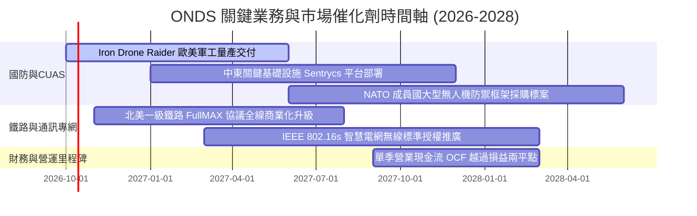

### 9.2 TAM 市場規模分析

```
╔══════════════════════════════════════════════════════════════════╗
║               潛在市場規模（TAM）與預期滲透                      ║
╠══════════════════════════════════════════════════════════════════╣
║  全球反無人機 (CUAS) 市場 TAM (2028E):   $12.5B                 ║
║  ├── ONDS 目前滲透率: ~1.2% ｜ 預期目標 (2028E): 4.5% ($560M)    ║
║                                                                  ║
║  關鍵基礎設施私有專網通訊 TAM (2028E):   $18.0B                 ║
║  ├── ONDS 目前滲透率: ~0.3% ｜ 預期目標 (2028E): 1.5% ($270M)    ║
║                                                                  ║
║  合計服務市場 TAM: $30.5B ｜ 當前 TTM 營收僅佔 0.57%             ║
║  結論：具備充裕的頂部擴張天花板，關鍵在於銷售通路轉化效率       ║
╚══════════════════════════════════════════════════════════════════╝
```

### 9.3 成長驅動力結構圖

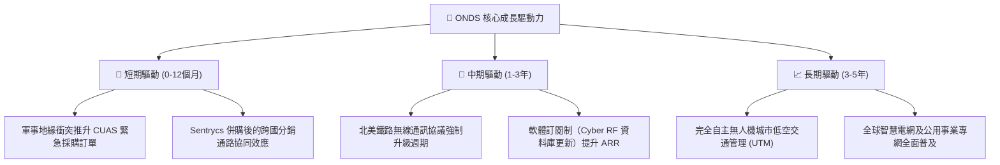

---

## 10. 風險矩陣

### 10.1 風險評分矩陣

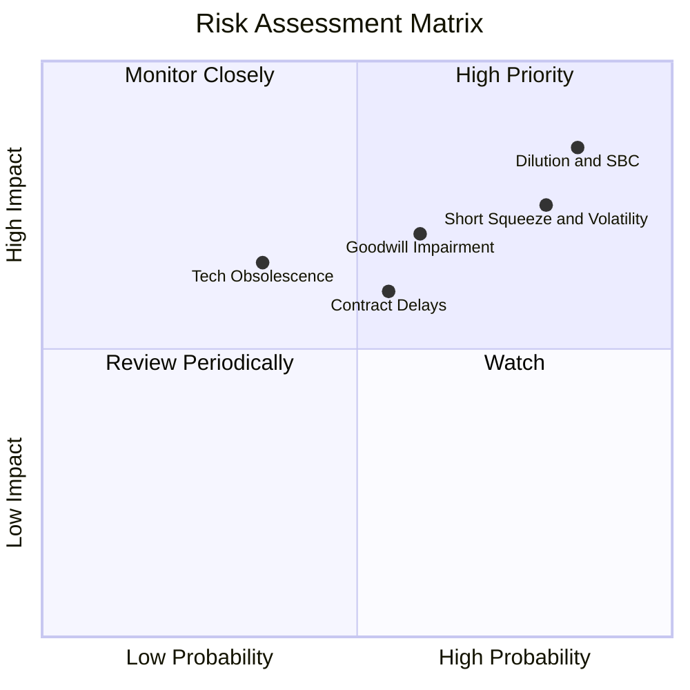

### 10.2 風險清單詳細分析

| # | 風險項目 | 發生機率 | 財務衝擊 | 綜合評分 | 緩解措施與監控指標 |
|---|----------|----------|----------|----------|-------------------|
| 1 | 🔴 **股本持續稀釋與高額 SBC** | 高 (85%) | 高 (-25% 每股內在價值) | 🔴 **8.5/10** | 密切追蹤季度 SBC / 營收比重；要求管理層設立明確的 GAAP 盈利激勵目標。 |
| 2 | 🔴 **高空頭比率引發之暴跌** | 高 (80%) | 高 (極端波動，Beta 2.74) | 🔴 **8.0/10** | 空頭比例 41.0%，避免使用保證金槓桿交易；設置嚴格的價格止損門檻。 |
| 3 | 🟡 **商譽與無形資產減損** | 中 (60%) | 高 (潛在減損 >$300M) | 🟡 **7.0/10** | 商譽與無形資產達 $1.24B；每季追蹤 Sentrycs 實質營收與獲利貢獻是否達標。 |
| 4 | 🟡 **政府招標與合約遞延** | 中 (55%) | 中 (-15% 短期營收) | 🟡 **6.0/10** | 擴大商業民用基礎設施市場比重，分散對單一軍工標案之依賴。 |
| 5 | 🟢 **技術路線更迭替代** | 低 (35%) | 高 (產品競爭力受損) | 🟢 **4.5/10** | 維持佔營收 15% 以上之實質研發支出，持續疊代自主攔截軟體算法。 |

---

## 11. 投資建議

### 11.1 最終綜合評級雷達圖

```
╔══════════════════════════════════════════════════════════════════╗
║                    ONDS 最終全維度評估雷達                       ║
╠══════════════════════════════════════════════════════════════════╣
║  成長動能 (Growth):       9.0 ▓▓▓▓▓▓▓▓▓▓▓▓▓▓▓▓▓▓░░  ★★★★★       ║
║  資產負債 (Balance Sheet): 8.5 ▓▓▓▓▓▓▓▓▓▓▓▓▓▓▓▓▓░░░  ★★★★☆       ║
║  技術創新 (Innovation):    8.0 ▓▓▓▓▓▓▓▓▓▓▓▓▓▓▓▓░░░░  ★★★★☆       ║
║  護城河深度 (Moat):        6.2 ▓▓▓▓▓▓▓▓▓▓▓▓░░░░░░░░  ★★★☆☆       ║
║  基本面強度 (Fundamentals):6.0 ▓▓▓▓▓▓▓▓▓▓▓▓░░░░░░░░  ★★★☆☆       ║
║  管理層配置 (Governance):  5.5 ▓▓▓▓▓▓▓▓▓▓▓░░░░░░░░░  ★★★☆☆       ║
║  估值性價比 (Valuation):   4.5 ▓▓▓▓▓▓▓▓▓░░░░░░░░░░░  ★★☆☆☆       ║
║  獲利品質 (Profitability): 3.5 ▓▓▓▓▓▓▓░░░░░░░░░░░░░  ★★☆☆☆       ║
╠══════════════════════════════════════════════════════════════╣
║  綜合評分：6.1/10 ｜ 評級：🟡 持有 (Hold) ｜ 信心度：中等       ║
╚══════════════════════════════════════════════════════════════╝
```

### 11.2 目標價與隱含報酬率

| 情境 | 機率 | 隱含目標價 | 相對當前股價 ($7.33) 報酬率 | 核心觸發前提 |
|------|------|------------|-----------------------------|--------------|
| 🔴 **悲觀情境** | 25% | **$4.50** | **-38.6%** | 營收增速跌破 25%，營業虧損持續擴大，SBC 繼續狂飆 |
| 🟡 **基準情境** | **55%** | **$8.20** | **+11.9%** | **營收維持 ~45% 複合增速，毛利率持穩 45%，FY28 實現 OCF 轉正** |
| 🟢 **樂觀情境** | 20% | **$13.50** | **+84.2%** | 北美鐵路全面換裝，跨國軍工大單爆量，營運利潤率達 20% |
| **加權預期** | 100% | **$8.33** | **+13.6%** | 機率加權預期回報 |

### 11.3 買入時機與觸發因素

```
╔══════════════════════════════════════════════════════════════════╗
║                   ONDS 操作策略 Checklist                        ║
╠══════════════════════════════════════════════════════════════════╣
║  買入/建倉觸發條件（需多數符合）：                              ║
║  ☐ 股價拉回至安全區間：<$5.80（提供 >30% 安全邊際）             ║
║  ☐ 單季 SBC 佔營收比重顯著下降至 20% 以下                       ║
║  ☐ 空頭比率回落至 20% 以下且籌碼面沉澱完成                      ║
║  ☐ 季度營業現金流 (OCF) 出現收斂拐點（單季流出 <$15M）          ║
║                                                                  ║
║  加碼觸發條件：                                                  ║
║  ☐ 贏得單筆超過 $50M 之跨國防務採購正式合約                     ║
║  ☐ 連續兩季毛利率維持在 48% 以上且 GAAP 營業利潤轉正            ║
║                                                                  ║
║  減碼/停損觸發條件：                                            ║
║  ☐ 現金儲備連續三季因大幅併購或虧損而消耗超過 $400M             ║
║  ☐ 認列超過 $150M 之商譽減損損失                                ║
║  ☐ 股價突破 $10.00 但基本面無實質現金流支撐（估值嚴重泡沫化）   ║
╚══════════════════════════════════════════════════════════════════╝
```

### 11.4 投資人適配度分析

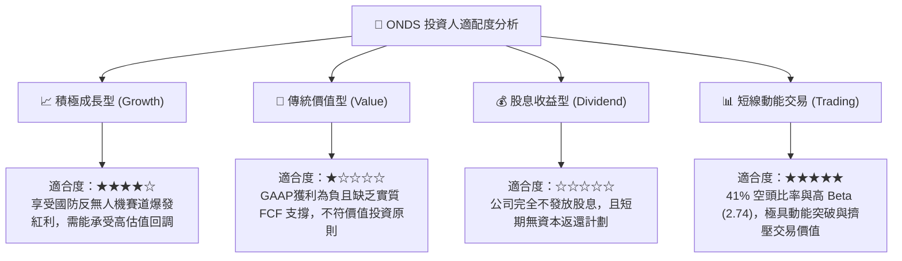

### 11.5 每季財報監控清單（Quarterly Watch List）

| 監控指標 | 正常健康區間 | 觸發減碼/警戒門檻 | 觸發加碼門檻 |
|----------|--------------|-------------------|--------------|
| **營收 YoY 成長率** | > 40.0% | < 25.0% | > 70.0% |
| **毛利率 (Gross Margin)** | 40.0% – 48.0% | < 35.0% | > 50.0% |
| **股權薪酬 SBC / 營收** | < 25.0% | > 45.0% | < 15.0% |
| **季度營運現金流 (OCF)** | 流出逐季縮減 | 單季流出 > $60.0M | 季度 OCF 轉正 (>$0) |
| **現金及短期投資餘額** | > $1,000M | < $800M | 伴隨正現金流自然增長 |
| **空頭比例 (% of Float)**| 15.0% – 25.0% | > 45.0%（極端風險）| 正常收斂至 < 15.0% |

### 11.6 反面論證：什麼會證明論點錯誤（What Would Change My Mind）

```
╔══════════════════════════════════════════════════════════════════╗
║              ⚠️ 論點失效條件（Disconfirming Evidence）           ║
╠══════════════════════════════════════════════════════════════════╣
║  本報告之「🟡 持有」中立論點在下列情況發生時將被實質推翻：        ║
║                                                                  ║
║  轉向【🔴 強烈賣出】之條件：                                    ║
║  1. 營收 YoY 增速連續兩季跌破 20%，證實反無人機需求僅為一次性爆發║
║  2. 季度 SBC 佔營收比重持續超過 50%，股數年稀釋率再次突破 15%    ║
║  3. 核心管理層出現集體減持或非預期辭職離職潮                     ║
║  4. 自由現金流持續淨流出且單季超過 $100M，重啟破壞性增發         ║
║                                                                  ║
║  轉向【🟢 強烈買入】之條件：                                    ║
║  1. 股價非理性超跌至 <$5.00，使安全邊際 MOS 擴大至 40% 以上     ║
║  2. 連續兩季實現 GAAP 營業利潤（Operating Income > $0）          ║
║  3. 反無人機軟體系統打入美國國防部正式 Program of Record (PoR)   ║
╚══════════════════════════════════════════════════════════════════╝
```

---
> **免責聲明**：本報告為機構級研究分析模型產出，僅供專業投資參考，不構成任何具體買賣要約或投資建議。金融市場具高度風險，投資人應獨立評估自身財務狀況與風險承受能力。