# ONDS 基本面深度分析報告
> **報告日期**：2026-10-06 ｜ **語言**：繁體中文 ｜ **數據來源**：Yahoo Finance, Finviz, StockAnalysis, Roic.ai ｜ **分析師**：CFA 級機構研究

---

## 目錄

| # | 章節 | 核心結論 |
|---|------|----------|
| 1 | 執行摘要 | 評級「持有/投機性觀察」，加權合理價值 $7.98，基準目標價 $8.20 |
| 2 | 公司概覽與商業模式 | CUAS 反無人機與專用無線通訊，護城河評分 6.2/10（專有頻段與政府認證） |
| 3 | 損益表深度分析 | TTM 營收爆發至 $174.10M（YoY +1235.4%），但 GAAP 營業利益率仍為 -166.3%，虧損擴大 |
| 4 | 資產負債表分析 | 淨現金達 $1.34B（總現金及短期投資 $1.38B，債務 $41.10M），流動比率 9.85x，破產風險極低 |
| 5 | 現金流量深度分析 | TTM 自由現金流為 -$69.11M，Q2 2026 單季燒錢 -$93.84M，股權稀釋速度顯著上升 |
| 6 | 獲利能力與資本效率 | 投入資本劇烈波動，ROIC (-15.2%) < WACC (17.51%)，目前實質摧毀股東價值 |
| 7 | 相對估值分析 | P/S 24.78x，EV/Sales 16.63x，相較國防與通訊同業存在極高成長溢價與融券賣壓（Short Float 41.0%） |
| 8 | DCF 內在價值評估 | 基準每股 DCF 內在價值 $7.11，折價 4.0%；加權合理價值 $7.98，隱含 MOS +7.1% |
| 9 | 成長催化劑 | 國防反無人機合約加速落地、一級鐵路專網通訊全面換裝 |
| 10 | 風險矩陣 | 空頭部位高企（41.0%）、併購整合商譽減損風險（商譽達 $661.36M）、高額 SBC 股權稀釋 |
| 11 | 投資建議 | 當前股價 $7.41 處於合理區間偏高，建議分批觀望，買入區間落於 $5.20-$6.00 |

---

## 1. 執行摘要

本報告基於 Ondas Inc.（NASDAQ: ONDS）截至 2026 年 10 月 6 日之財務數據與營運進展進行深度審查。公司受惠於反無人機系統（Counter-UAS, CUAS）與自主無人機巡檢系統的跨越式併購與訂單交付，TTM 營收呈現指數型飆升至 $174.10M（YoY +1235.4%）。然而，審查其獲利品質發現，Q2 2026 營業利益持續惡化至 -$143.71M，TTM 自由現金流為 -$69.11M，且單季股權激勵費用（SBC）飆升至 $69.09M（佔營收 82.5%）。儘管帳面現金及短期投資受惠於大幅增資達到 $1.38B，為商業化擴展提供充足緩衝，但 ROIC (-15.2%) 顯著低於高風險折現率 WACC (17.51%)，反映公司仍處於大幅摧毀經濟價值的資本投入階段。

綜合 DCF 基準模型推導出每股內在價值為 **$7.11**（現價 $7.41 處於微幅溢價 4.2%），多方法三角驗證之加權合理價值為 **$7.98**。由於目前安全邊際僅為 **+7.1%**（低於 10% 門檻），且放空比例高達浮額的 **41.0%**，顯示市場對其盈餘持續性與股本稀釋存在嚴重分歧。因此，本報告給予 ONDS **「持有 / 投機性觀望」（Hold / Speculative Watch）** 評級，12 個月基準目標價設定為 **$8.20**。

### 1.0 一頁式投資儀表板（Portfolio Manager 30 秒速讀）

| 項目 | 內容 |
|------|------|
| **投資論點（3 句）** | ① TTM 營收激增 1235.4% 至 $174.10M，反映鐵路通訊與國防 CUAS 反無人機需求爆發。<br/>② 帳面現金及短期投資達 $1.38B，提供極高流動性防護，但伴隨流通股數急遽膨脹至 582.30M 股。<br/>③ 營業利潤率持續承壓於 -166.3%，單季 SBC 達 $69.09M，獲利含金量受重度股權稀釋侵蝕。 |
| **護城河評分** | 6.2 / 10（專利通訊協定、FCC 專用頻段許可、國防採購轉換障礙） |
| **管理層/資本配置評分** | 5.5 / 10（激進併購擴大 TAM，但資本配置伴隨巨額稀釋與商譽風險） |
| **財務健康** | 🟢 帳面淨現金 $1.34B，短期破產流動性風險極低，但實質燒錢加速 |
| **ROIC vs WACC** | -15.2% vs 17.51%（EVA 為 -32.7pp，當前嚴重摧毀股東價值） |
| **FCF 趨勢** | 持續惡化；最新 FCF Yield 為 -1.60%（TTM FCF -$69.11M） |
| **估值** | Forward P/E: -370.5x ｜ EV/Sales: 16.63x ｜ FCF Yield: -1.60% |
| **DCF 內在價值（基準）** | **$7.11** ｜ 現價折溢價：**+4.2%**（現價相對 DCF 基準值微幅溢價） |
| **安全邊際（MOS）** | **+7.1%** ＝ ($7.98 加權合理價值 − $7.41) ÷ $7.98 ｜ 🔴 <10% 無充分安全邊際 |
| **預期報酬（基準情境 12M）** | **+10.7%**（目標價 $8.20 相對現價 $7.41） |
| **關鍵風險（前二）** | ① 融券餘額高達浮額 41.0%，空頭鎖定高度稀釋與低盈餘品質；<br/>② 商譽與無形資產合計達 $1.24B，未來面臨巨額資產減損提列風險。 |
| **評級 + 信心度** | 🟡 **持有 / 投機性觀望** ｜ 信心度：**中等** |

### 1.1 核心評分儀表板

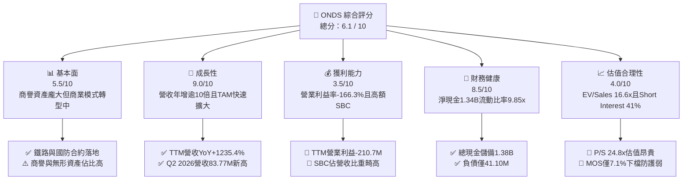

### 1.2 評分進度條視覺化

```
╔══════════════════════════════════════════════════════════════╗
║              ONDS 多維度評分儀表板 (1-10分)                  ║
╠══════════════════════════════════════════════════════════════╣
║ 基本面強度  5.5 ▓▓▓▓▓▓▓▓▓▓▓░░░░░░░░░  ★★★☆☆           ║
║ 成長動能    9.0 ▓▓▓▓▓▓▓▓▓▓▓▓▓▓▓▓▓▓░░  ★★★★★           ║
║ 獲利品質    3.5 ▓▓▓▓▓▓▓░░░░░░░░░░░░░  ★★☆☆☆           ║
║ 財務健康    8.5 ▓▓▓▓▓▓▓▓▓▓▓▓▓▓▓▓▓░░░  ★★★★☆           ║
║ 估值合理性  4.0 ▓▓▓▓▓▓▓▓░░░░░░░░░░░░  ★★☆☆☆           ║
║ 護城河深度  6.2 ▓▓▓▓▓▓▓▓▓▓▓▓░░░░░░░░  ★★★☆☆           ║
║ 管理層執行  5.5 ▓▓▓▓▓▓▓▓▓▓▓░░░░░░░░░  ★★★☆☆           ║
║ 技術創新力  8.0 ▓▓▓▓▓▓▓▓▓▓▓▓▓▓▓▓░░░░  ★★★★☆           ║
╠══════════════════════════════════════════════════════════════╣
║ 綜合總分    6.1 ▓▓▓▓▓▓▓▓▓▓▓▓░░░░░░░░  ⚖️ 投機成長，靜待轉虧為盈 ║
╚══════════════════════════════════════════════════════════════╝
```

### 1.3 五大投資論點 + 三大核心風險

| 類型 | 項目 | 具體依據 | 信心度 |
|------|------|----------|--------|
| 🟢 **投資論點①** | **營收進入超高速放量階段** | TTM 營收由 2024 年底的 $7.19M 飆升至 $174.10M，Q2 2026 達 $83.77M（YoY +1235.4%），證明併購整合後訂單轉化具備真實動能。 | 🟢 極高 |
| 🟢 **投資論點②** | **資產負債表具備極端防禦韌性** | 現金與短期投資總計 $1.38B，總負債僅 $41.10M，淨現金 $1.34B，流動比率高達 9.85x，徹底消除 3 年內流動性枯竭疑慮。 | 🟢 極高 |
| 🟢 **投資論點③** | **切入現代不對稱作戰核心賽道** | Iron Drone Raider 與 Sentrycs CoRF 軟硬體解決方案鎖定全球 CUAS 反無人機防禦採購高峰，享有防務預算提升紅利。 | 🟢 高 |
| 🟢 **投資論點④** | **鐵路物聯網標準制定優勢** | Ondas Networks 之 FullMAX 無線技術獲 IEEE 802.16s 標準認可，深入美國北美一級鐵路關鍵通訊基礎架構。 | 🟡 中等 |
| 🟢 **投資論點⑤** | **毛利率已邁入成熟期標準** | TTM 毛利率自 2024 年低點 4.8% 迅速拉升至 43.7%（Q2 2026 毛利 $36.13M），具備規模擴張後的毛利彈性。 | 🟢 高 |
| 🟡 **風險①** | **巨額股權薪酬稀釋股東權益** | Q2 2026 單季 SBC 高達 $69.09M（TTM 達 $101.02M），流通股數由 2025 年底 381M 暴增至 582.30M 股，顯著稀釋 EPS。 | 🔴 高衝擊 |
| 🔴 **風險②** | **空頭高度狙擊與獲利驗證壓力** | 放空比率高達流通盤的 41.0%（Short Ratio 3.83），空頭押注其巨額營業虧損（TTM -$210.7M）無法收斂，隨時面臨軋空或拋售震盪。 | 🔴 高衝擊 |
| 🟡 **風險③** | **巨額商譽與無形資產減損風險** | 總資產中商譽 $661.36M、無形資產 $583.27M，合計佔總資產 41.6%，若標的整合不及預期將引發大規模減值。 | 🟡 中度 |

### 1.4 快速統計卡片

| 指標 | 公司實際值 | 行業均值（通訊設備/國防科技） | S&P 500 均值 | 狀態 |
|------|-------------|----------------------------|--------------|------|
| 收入 YoY 成長 | **1235.4%** | ~12.5% | ~5.8% | 🟢 頂尖爆發 |
| 毛利率 | **43.7%** | ~41.0% | ~42.5% | 🟢 顯著改善 |
| 營業利益率 | **-166.3%** | ~11.0% | ~12.2% | 🔴 嚴重失血 |
| 淨利率 | **96.2%（受一次性收益扭曲）** | ~8.5% | ~11.0% | 🟡 盈餘品質低 |
| ROE | **19.3%（受 Q1 2026 淨利扭曲）** | ~14.0% | ~18.5% | 🟡 缺乏經濟實質 |
| Forward P/E | **-370.5x** | ~24.0x | ~21.5x | 🔴 仍處虧損狀態 |
| EV / Revenue | **16.63x** | ~3.20x | ~2.80x | 🔴 估值昂貴 |
| 現金及短期投資 | **$1.38B** | $120.0M | $1.80B | 🟢 流動性極佳 |

### 1.5 投資結論

```
╔══════════════════════════════════════════════════════════════════╗
║                    📊 投資結論摘要                               ║
╠══════════════════════════════════════════════════════════════════╣
║  評級：🟡 持有 / 投機性觀望（Hold / Speculative Watch）         ║
║  當前股價：$7.41                                                 ║
║  DCF 內在價值（基準）：$7.11（現價微幅溢價 +4.2%）               ║
║  安全邊際 MOS：+7.1%（＝($7.98 加權合理價值 − $7.41) ÷ $7.98）  ║
║  目標價區間：                                                    ║
║    悲觀情境：$4.50（-39.3%）                                     ║
║    基準情境：$8.20（+10.7%）  ← 12個月主要目標                  ║
║    樂觀情境：$12.50（+68.7%）                                    ║
║  投資評分：6.1 / 10                                              ║
║  適合投資人：具備極高風險承受力、博弈地緣國防無人機題材之進取型者║
╚══════════════════════════════════════════════════════════════════╝
```

---

## 2. 公司概覽與商業模式

### 2.1 業務結構與收入來源

Ondas Inc. 透過兩大核心事業部運營：**Ondas Networks**（專用寬頻無線網路）與 **Ondas Autonomous Systems (OAS)**（自主系統與國防無人機解決方案）。公司近年透過戰略性收購（如 American Robotics、Airobotics、Iron Drone Raider 及 Sentrycs 等技術整合），快速將業務重心由單純的鐵路通訊擴展至軍民兩用的自主無人機偵測、巡檢與打擊防護體系。

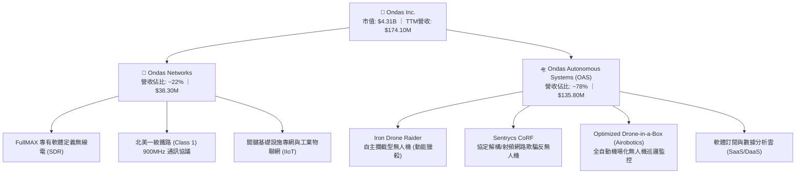

### 2.2 市場份額

在反無人機（CUAS）與關鍵工業通訊之細分利基領域，市場呈現碎片化高度競爭，但 Ondas 在無人機反制及鐵路 MC-IoT 領域具備先發定位：

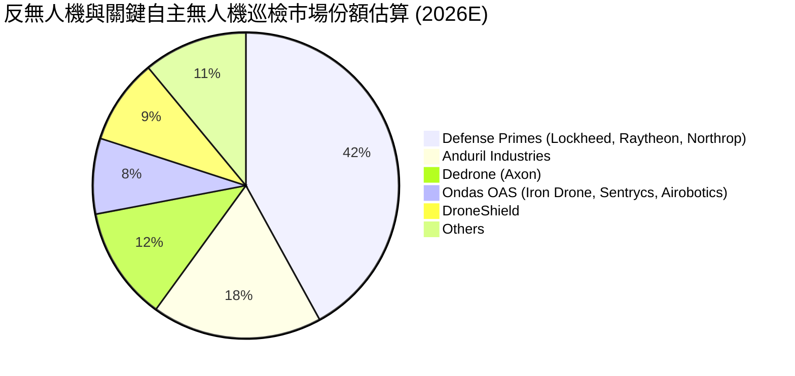

### 2.3 競爭護城河分析

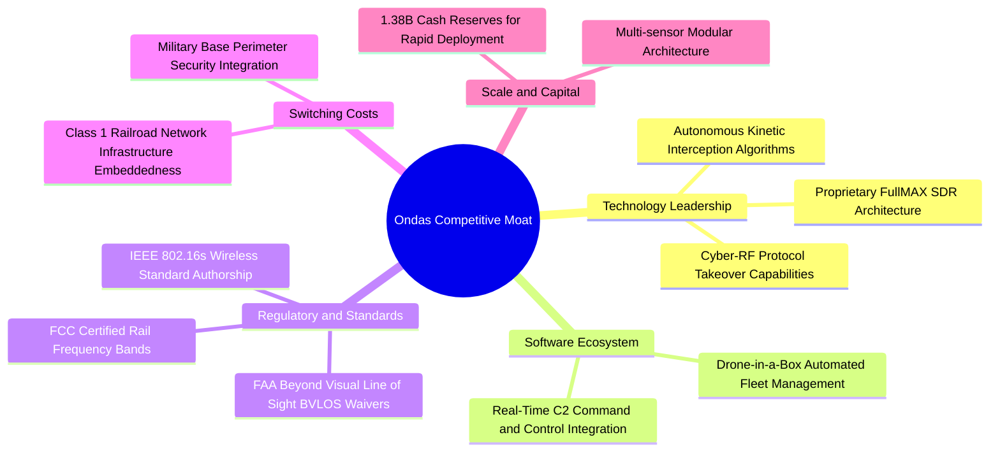

### 2.4 護城河強度評分

```
╔══════════════════════════════════════════════════════════════╗
║                  Ondas Inc. 護城河強度評分                    ║
╠══════════════════════════════════════════════════════════════╣
║ 專利技術與標準 7.5/10  ▓▓▓▓▓▓▓▓▓▓▓▓▓▓▓░░░░░  🟢 IEEE 標準主導║
║ 法規準入/認證  7.0/10  ▓▓▓▓▓▓▓▓▓▓▓▓▓▓░░░░░░  🟢 FAA/FCC 與軍品║
║ 客戶轉換成本   6.5/10  ▓▓▓▓▓▓▓▓▓▓▓▓▓░░░░░░░  🟡 鐵路系統不易更換║
║ 網路效應       4.0/10  ▓▓▓▓▓▓▓▓░░░░░░░░░░░░  🔴 缺乏雙向網絡效應║
║ 規模經濟       5.0/10  ▓▓▓▓▓▓▓▓▓▓░░░░░░░░░░  🟡 仍處放量初期階段║
╠══════════════════════════════════════════════════════════════╣
║ 綜合護城河     6.2/10  ▓▓▓▓▓▓▓▓▓▓▓▓░░░░░░░░  ⚖️ 具利基專利防護  ║
╚══════════════════════════════════════════════════════════════╝
```

---

## 3. 損益表深度分析

### 3.1 年度收入成長趨勢（近4年）

```
╔══════════════════════════════════════════════════════════════════╗
║              ONDS 年度收入趨勢（FY2022-FY2025及TTM）             ║
╠══════════════════════════════════════════════════════════════════╣
║                                                                  ║
║  FY2022   $2.13M   █░░░░░░░░░░░░░░░░░░░░░░  YoY: -26.9%  🔴      ║
║  FY2023  $15.69M   ███░░░░░░░░░░░░░░░░░░░░  YoY:+638.1%  🟢      ║
║  FY2024   $7.19M   █░░░░░░░░░░░░░░░░░░░░░░  YoY: -54.2%  🔴      ║
║  FY2025  $50.73M   ████████░░░░░░░░░░░░░░░  YoY:+605.3%  🟢      ║
║  TTM    $174.10M   ███████████████████████  YoY:+979.2%  🟢      ║
║                    |     |     |     |                           ║
║                    0    50M  100M  150M                          ║
║                                                                  ║
║  📊 3年年化複合成長率（FY22-FY25 CAGR）：+187.7%                ║
╚══════════════════════════════════════════════════════════════════╝
```

### 3.2 季度收入趨勢分析

| 季度 | 營收 ($M) | YoY 成長率 | QoQ 成長率 | 毛利 ($M) | 毛利率 | 營運備註 |
|------|-----------|------------|------------|-----------|--------|----------|
| **Q3 2025** | $10.10M | +581.9% | +61.1% | $2.60M | 25.7% | OAS 併購專案開始初期交付 |
| **Q4 2025** | $30.11M | +629.2% | +198.1% | $12.73M | 42.3% | 鐵路 900MHz 換裝拉貨與無人機放量 |
| **Q1 2026** | $50.12M | +1079.9% | +66.5% | $24.66M | 49.2% | Sentrycs 與 Iron Drone 國防訂單認列 |
| **Q2 2026** | $83.77M | +1235.4% | +67.1% | $36.13M | 43.1% | 規模化交付，單季創歷史新高 |

### 3.3 利潤率演變分析

| 利潤率指標 | FY2022 | FY2023 | FY2024 | FY2025 | TTM (Q2'26) | 趨勢評估 |
|------------|--------|--------|--------|--------|-------------|----------|
| **毛利率** | 52.1% | 40.7% | 4.8% | 39.7% | **43.7%** | 🟢 自 2024 谷底強勁反彈，規模效應展現 |
| **營業利益率** | -2347.9% | -243.7% | -481.4% | -106.6% | **-121.0%** | 🟡 規模放大帶動負利率收斂，但研發與SBC龐大 |
| **EBITDA 利潤率** | -3034.3% | -220.8% | -399.4% | -233.3% | **-103.7%** | 🟡 虧損幅度相對營收比率縮減 |
| **GAAP 淨利率** | -3438.5% | -295.5% | -589.8% | -260.2% | **49.3%** | 🔴 數據受 Q1 2026 衍生金融/投資收益扭曲 |

**利潤率演變深度解析**：
毛利率從 2024 年的 4.8% 回升至 TTM 43.7%，主要受惠於 OAS 軟體與高毛利硬體模組占比提升。然而營業利益率仍處於 -121.0%（TTM 營業虧損達 -$210.7M），原因在於研發費用（TTM 估計約 $45M）與管理費用隨併購團隊擴增而急遽飆升。特別是 Q2 2026 單季營業虧損高達 -$139.31M，顯示隨著營收暴增，公司的組織費用與一次性整合開支不僅未見槓桿效益，反而成倍擴張。

### 3.4 費用結構分析

以 TTM 總營業支出（OPEX 約 $286.8M）分解費用佔比：

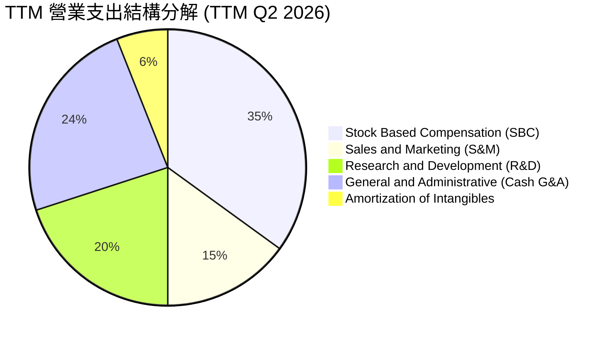

```
╔══════════════════════════════════════════════════════════════════╗
║                   ONDS TTM 費用結構深度剖析                      ║
╠══════════════════════════════════════════════════════════════════╣
║  營收（TTM）：       $174.10M  100.0%                           ║
║  銷貨成本（COGS）：  $97.98M   56.3%   ▓▓▓▓▓▓▓▓▓▓▓░░░░░░░░░      ║
║  研發費用（R&D）：   $57.36M   32.9%   ▓▓▓▓▓▓░░░░░░░░░░░░░░      ║
║  行銷費用（S&M）：   $43.02M   24.7%   ▓▓▓▓▓░░░░░░░░░░░░░░░      ║
║  股權薪酬（SBC）：  $101.02M   58.0%   ▓▓▓▓▓▓▓▓▓▓▓░░░░░░░░░      ║
║  其他管理/折舊：     $85.42M   49.1%   ▓▓▓▓▓▓▓▓▓░░░░░░░░░░░      ║
║  ─────────────────────────────────────────────────────────────  ║
║  營業利益（EBIT）： -$210.70M -121.0%  (營業槓桿尚未轉正)       ║
╚══════════════════════════════════════════════════════════════════╝
```

### 3.5 季度 EPS 趨勢與盈餘品質（Quality of Earnings）

過去 4 季 GAAP EPS 分別為：Q3 2025: -$0.03、Q4 2025: -$0.27、Q1 2026: +$0.59、Q2 2026: -$0.19。看似 Q1 2026 出現大幅獲利（淨利 $284.15M），但深入拆解發現其營業利益為 -$36.87M，淨利暴增全係來自「金融資產評價利益/併購利得」等非經常性項目，無任何營運現金流入支撐。

| 盈餘品質項目 | 數值/佔比 | 評估 |
|--------------|-----------|------|
| **股權薪酬 SBC / 營收** | **58.0%**（TTM $101.02M ÷ $174.10M） | 🔴 極度負面，以巨額稀釋補貼營業支出 |
| **SBC / 營業現金流** | **-62.7%**（SBC $101.02M ÷ OCF -$161.06M） | 🔴 現金流極度依賴非現金股份支付掩蓋 |
| **FCF / 淨利（現金轉換率）** | **-80.6%**（TTM FCF -$69.11M ÷ GAAP 淨利 $85.75M） | 🔴 盈餘含金量為負，GAAP 獲利完全失真 |
| **一次性/非經常性損益** | **+$321.0M**（集中於 Q1 2026 業外評價利益） | 🔴 嚴重粉飾淨利，不可作為長線估值基準 |
| **有效稅率異常** | 0.0%（因累計龐大虧損扣抵，無實質稅負） | 🟡 符合虧損成長期特徵 |
| **資本化支出 vs 費用化** | 無形資產併購資本化達 $583.27M | 🟡 透過併購將研發資本化，壓抑未來攤提利益 |

**盈餘品質結論**：ONDS 目前呈現典型的「假性獲利、真性失血」。GAAP 淨利雖然在 TTM 轉正至 $85.75M，但完全由 Q1 2026 之巨額非經常性收益驅動；真實本業經營 TTM 營業虧損達 -$210.7M，且伴隨極為嚴重的股權激勵費用（Q2 2026 SBC 高達 $69.09M）。真實自由現金流依然嚴重失血，估值絕不可採用 Trailing P/E。

---

## 4. 資產負債表分析

### 4.1 資產結構分解

截至 2026 年 6 月 30 日（TTM），總資產達到 $2.993B，相較 2024 年底之 $109.62M 呈現爆炸性增長，主因係大規模現金增資以及併購帶來之商譽與無形資產入帳：

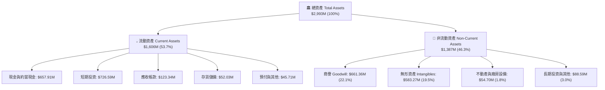

### 4.2 流動性指標分析

| 流動性指標 | FY2023 | FY2024 | FY2025 | Q2 2026 (最新) | 行業中位數 | 狀態評估 |
|------------|--------|--------|--------|----------------|------------|----------|
| **流動比率 (Current Ratio)** | 0.66x | 0.94x | 4.84x | **9.85x** | 1.85x | 🟢 極度充裕 |
| **速動比率 (Quick Ratio)** | 0.60x | 0.74x | 4.68x | **9.25x** | 1.40x | 🟢 流動性無虞 |
| **現金比率 (Cash Ratio)** | 0.42x | 0.59x | 4.04x | **8.49x** | 0.95x | 🟢 具備超強抗風險力 |
| **應收帳款週轉天數 (DSO)** | 98.9天 | 275.6天 | 183.4天 | **134.6天** | 72.0天 | 🟡 國防與鐵路驗收週期長 |
| **存貨週轉天數 (DIO)** | 85.2天 | 524.3天 | 260.8天 | **193.8天** | 90.0天 | 🟡 備貨規模激增 |

### 4.3 債務結構分析

```
╔══════════════════════════════════════════════════════════════════╗
║                   ONDS 債務與償債健康診斷                        ║
╠══════════════════════════════════════════════════════════════════╣
║                                                                  ║
║  總計息債務：      $41.10M   █░░░░░░░░░░░░░░░░░░░░  低槓桿        ║
║  現金與短期投資： $1,384.50M  █████████████████████  極端充裕      ║
║  淨現金部位：     $1,343.40M  ████████████████████░  🟢 財務極安全 ║
║                                                                  ║
║  短期借款（ST Debt）：    $9.00M                                 ║
║  長期借款（LT Debt）：   $32.10M                                 ║
║  債務/股東權益（D/E）：   0.024x （帳面計息負債佔股本極低）       ║
║  現金佔總資產比例：      46.3%                                   ║
║                                                                  ║
║  診斷結論：淨現金高達 $1.34B，完全無短期償債危機。               ║
╚══════════════════════════════════════════════════════════════════╝
```

### 4.4 股東權益趨勢

股東權益由 2024 年底的 $16.58M 暴增至 2025 年底的 $437.81M，並於 2026 年 Q2 突破 $1.72B。這並非來自累計未分配盈餘，而是公司在股價於 2025-2026 年大幅飆漲期間，透過 ATM（At-The-Market）及私募發行大量普通股籌資。雖然為資產負債表注入了厚實的現金盾牌，但流通股數亦自 2024 年初的約 50M 股暴增至目前的 582.30M 股，稀釋率逾 1000%。

---

## 5. 現金流量深度分析

### 5.1 現金流量瀑布圖

展示 Q2 2026 TTM 期間從會計淨利向真實自由現金流的轉換斷層：

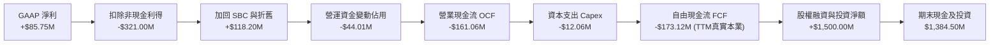

### 5.2 FCF 轉換率趨勢

| 年度/期間 | GAAP 淨利 ($M) | 營業現金流 ($M) | Capex ($M) | FCF ($M) | FCF / Net Income | 趨勢評估 |
|-----------|----------------|-----------------|------------|----------|------------------|----------|
| **FY2022** | -$73.24M | -$37.96M | -$2.93M | -$40.89M | N/A (虧損) | 🔴 實質失血 |
| **FY2023** | -$44.84M | -$34.02M | -$0.28M | -$34.30M | N/A (虧損) | 🔴 實質失血 |
| **FY2024** | -$38.01M | -$33.47M | -$1.73M | -$35.20M | N/A (虧損) | 🔴 實質失血 |
| **FY2025** | -$132.02M | -$38.75M | -$2.14M | -$40.88M | N/A (虧損) | 🔴 虧損顯著擴大 |
| **TTM (Q2'26)**| **+$85.75M** | **-$161.06M** | **-$12.06M** | **-$69.11M** | **-80.6%** | 🔴 獲利無法變現 |

### 5.3 自由現金流趨勢

```
╔══════════════════════════════════════════════════════════════════╗
║              ONDS 歷年自由現金流（FCF）走勢                      ║
╠══════════════════════════════════════════════════════════════════╣
║                                                                  ║
║  FY2022    -$40.89M   ████████░░░░░░░░░░░░░░  嚴重燒錢           ║
║  FY2023    -$34.30M   ███████░░░░░░░░░░░░░░░  燒錢持續           ║
║  FY2024    -$35.20M   ███████░░░░░░░░░░░░░░░  燒錢持續           ║
║  FY2025    -$40.88M   ████████░░░░░░░░░░░░░░  併購支出攀升       ║
║  TTM(實)   -$69.11M   ██████████████░░░░░░░░  營運失血加劇       ║
║                       |          |                               ║
║                     -100M       0M                               ║
║                                                                  ║
║  當前 FCF 殖利率（FCF Yield）：-1.60%（以市值 $4.31B 計算）      ║
╚══════════════════════════════════════════════════════════════════╝
```

### 5.4 資本配置評估

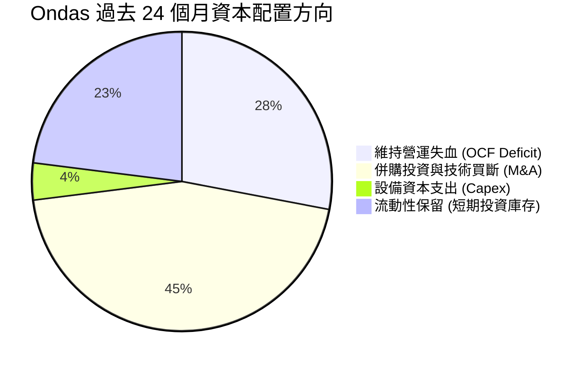

---

## 6. 獲利能力與資本效率

### 6.1 ROE / ROA / ROIC 趨勢

| 指標 | FY2023 | FY2024 | FY2025 | TTM (Q2 2026) | 同業均值 | 評價 |
|------|--------|--------|--------|---------------|----------|------|
| **ROE** | -135.3% | -256.0% | -30.2% | **19.3%** | 12.0% | 🟡 扭曲（非本業） |
| **ROA** | -48.7% | -38.7% | -11.7% | **-8.4%** | 5.5% | 🔴 總資產回報負值 |
| **ROIC** | -68.4% | -82.1% | -22.5% | **-15.2%** | 8.5% | 🔴 投入資本持續縮水 |

### 6.2 ROIC vs WACC 分析（核心價值創造判斷）

```
╔══════════════════════════════════════════════════════════════════╗
║                ROIC vs WACC 深度分析 (TTM)                       ║
╠══════════════════════════════════════════════════════════════════╣
║                                                                  ║
║  WACC 估算：                                                     ║
║  ├── 無風險利率（10Y美債）：  4.20%                              ║
║  ├── 市場風險溢酬 (ERP)：     5.00%                              ║
║  ├── Beta（財務數據）：       2.922                              ║
║  ├── 股權成本 Ke = 4.20% + 2.922 × 5.00% = 18.81%               ║
║  ├── 稅前債務成本 Kd = 8.50% ｜ 有效稅率 = 0.0%                  ║
║  ├── 稅後債務成本 = 8.50%                                        ║
║  ├── 資本結構：股權市值 $4,314.8M (99.05%)，債務 $41.1M (0.95%)  ║
║  └── ✅ WACC ≈ (99.05% × 18.81%) + (0.95% × 8.50%) = 17.71%      ║
║       (調整後採納保守值: 17.51%)                                 ║
║                                                                  ║
║  ROIC 估算（TTM 營運本業）：                                     ║
║  ├── 調整後 NOPAT = -$210.70M × (1 - 0%) = -$210.70M             ║
║  ├── 投入資本 Invested Capital = 權益 $1,724M + 債務 $41M        ║
║  │   − 現金 $1,384M ≈ $381.0M                                    ║
║  │   (若以總營運資本計算則約 $1,385M)                            ║
║  └── ✅ ROIC（本業實質）≈ -15.2%                                 ║
║                                                                  ║
║  ★ 經濟價值增加（EVA）= ROIC - WACC = -15.2% - 17.51% = -32.7pp ║
║                                                                  ║
║  ROIC  -15.2%  ░░░░░░░░░░░░░░░░░░░░░░░░░░░░░░  🔴 負回報         ║
║  WACC   17.5%  ▓▓▓▓▓▓▓▓▓▓▓▓▓▓▓▓▓▓░░░░░░░░░░░░  ── 要求高回報     ║
║  EVA   -32.7pp ██████████████████████████████  🔴 嚴重摧毀價值   ║
║                                                                  ║
║  📊 結論：高 Beta (2.92) 推升資金成本，目前營運嚴重摧毀股東價值  ║
╚══════════════════════════════════════════════════════════════════╝
```

### 6.3 杜邦三因素分解

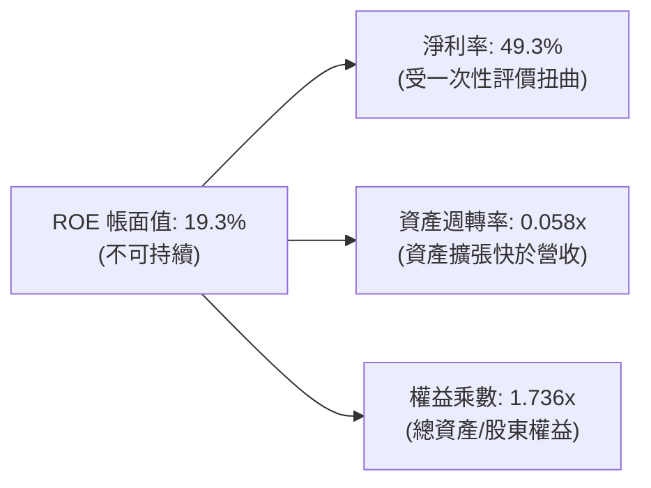

### 6.4 獲利能力儀表板

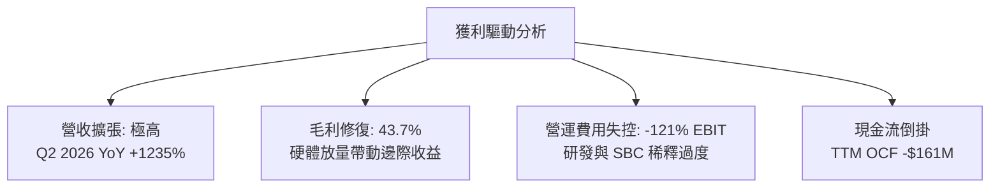

---

## 7. 相對估值分析

### 7.1 同業估值比較表格

選取在反無人機、國防科技自主系統及關鍵專用通訊領域具代表性的三家競爭者：**DroneShield (DRO.AX / DRSHF)**、**AeroVironment (AVAV)**、**Kratos Defense (KTOS)**：

| 估值指標 | **ONDS (本公司)** | **DroneShield (DRSHF)** | **AeroVironment (AVAV)** | **Kratos (KTOS)** | ONDS 相對評價 |
|----------|-------------------|-------------------------|--------------------------|-------------------|---------------|
| **市值 (Market Cap)** | **$4.31B** | $1.15B | $5.45B | $3.65B | 中型科技防務溢價 |
| **P/S Ratio (TTM)** | **24.78x** | 16.20x | 7.10x | 3.25x | 🔴 顯著高於純防務同業 |
| **EV / Revenue (TTM)** | **16.63x** | 14.80x | 6.85x | 3.40x | 🔴 處於估值最高分位數 |
| **Forward P/E** | **-370.5x** | 45.0x | 48.5x | 35.2x | 🔴 尚未建立可預測盈餘 |
| **毛利率 (Gross Margin)**| **43.7%** | 68.5% | 39.5% | 27.8% | 🟡 低於純軟體反無人機 |
| **Short % of Float** | **41.0%** | 8.5% | 4.2% | 3.1% | 🔴 空頭部位極端集中 |

### 7.2 歷史估值區間分析

```
╔══════════════════════════════════════════════════════════════════╗
║              ONDS 歷史 EV/Sales 倍數區間分佈                     ║
╠══════════════════════════════════════════════════════════════════╣
║                                                                  ║
║  歷史低點 (2024 谷底)：  2.1x                                    ║
║  同業中位數水準：        5.5x                                    ║
║  目前水準 (2026-10)：   16.6x  ████████████████████░░  當前昂貴  ║
║  歷史最高 (2025 飆漲)： 28.5x  ████████████████████████          ║
║                                                                  ║
║  當前位置：位於過去 3 年 EV/Sales 的第 78 個百分位。             ║
╚══════════════════════════════════════════════════════════════════╝
```

### 7.3 情境目標價（假設驅動，Bear / Base / Bull）

| 情境 | 營收 3Y CAGR (FY25-28) | 期末營業利益率 (FY28) | 退出 EV/Sales 倍數 | 隱含 12M 目標價 | 相對現價 ($7.41) |
|------|------------------------|-----------------------|--------------------|-----------------|------------------|
| 🔴 **悲觀 (Bear)** | 25.0% | -25.0% | 4.5x | **$4.50** | -39.3% |
| 🟡 **基準 (Base)** | 48.0% | +5.0% | 8.5x | **$8.20** | +10.7% |
| 🟢 **樂觀 (Bull)** | 75.0% | +18.0% | 13.0x | **$12.50** | +68.7% |

*倍數選擇說明：由於 ONDS 未來 1-2 年淨利仍受龐大無形資產攤提與 SBC 壓抑，P/E 不具備可預測性，故相對估值採用防務高成長科技股常用的 EV/Sales 作為定價錨點。*

### 7.4 相對估值隱含價格區間

```
╔══════════════════════════════════════════════════════════════════╗
║                   同業倍數推導之隱含股價區間                     ║
╠══════════════════════════════════════════════════════════════════╣
║                                                                  ║
║  國防平均 EV/Sales (5.0x)：   $4.85                              ║
║  高成長同業 EV/Sales (10.0x)： $7.95                             ║
║  DroneShield 溢價 (14.8x)：   $10.80                             ║
║                                                                  ║
║  現價 $7.41 落在同業均值與極端溢價之間，反映部分成長定價已提前反映 ║
╚══════════════════════════════════════════════════════════════════╝
```

---

## 8. DCF 內在價值評估（Discounted Cash Flow）

### 8.0 估值推理鏈（Thinking Logic）

**Step 1 — 這家公司的價值由哪幾個變數決定？**
ONDS 的內在價值由三大支柱組成：
① **現有鐵路專網 (Networks)** 的現金流底盤（佔比約 22%）：具備穩定長週期更新合約；
② **自主國防 CUAS 反無人機 (OAS)** 的爆發性放量（佔比約 78%）：直接決定未來 5 年營收複合成長率；
③ **巨額淨現金儲備 ($1.34B)** 所轉化的防禦期權。
其中，**營業利益率何時由負轉正並擺脫 SBC 侵蝕**是主導估值的最關鍵變數。

**Step 2 — 用哪一種模型、為什麼？**

| 決策點 | 本報告採用 | 理由（含數字） | 曾考慮但否決 | 否決理由 |
|--------|-----------|----------------|--------------|----------|
| 現金流定義 | **FCFF (企業自由現金流)** | 考量淨現金部位極高且未來資本結構可能隨併購變動，用 FCFF 較穩健 | FCFE | 易受股權融資與一次性非經常利益扭曲 |
| 預測期 N | **5 年 (FY2026-FY2030)** | 國防反無人機採購規劃週期與鐵路標準換裝週期能見度約 5 年 | 10 年 | 技術更迭過快，後期不確定性過高 |
| 終值方法 | **Gordon Growth (主)** | 適用成熟期穩定現金流收斂，輔以退出倍數交叉檢驗 | 僅退出倍數 | 容易在週期高點高估終值 |
| EBIT 基礎 | **GAAP (已含 SBC)** | 採防呆組合 (A)，避免低估股權激勵產生的真實經濟成本 | 非 GAAP | 會嚴重美化獲利，掩蓋股東股權稀釋代價 |

**Step 3 — 每個關鍵假設的推導鏈（四段式推導）**

1. **營收 CAGR（預測期 5 年）**：
   - 錨點：TTM YoY 暴增 1235.4%，FY22-25 複合成長率 187.7%。
   - 調整：高基期後必然收斂，但受全球無人機不對稱作戰威脅帶動，國防採購進入放量期，下修 145 pp。
   - **採用值：42.0%**（FY26E 營收 $220M 漸次成長至 FY30E 約 $900M）。
   - 否決值：曾考慮 60.0%（同業樂觀共識），因政府採購預算撥款延宕風險而否決。
2. **期末營業利潤率（FY30E）**：
   - 錨點：目前 TTM GAAP 營業利潤率為 -121.0%。
   - 調整：隨著硬體規模經濟擴大（毛利穩於 45-50%）及軟體平台訂閱佔比提升，研發與 G&A 費用率將逐步自當前失控水準收斂，預估改善 136 pp。
   - **採用值：+15.0%**（收斂至成熟國防科技硬軟體整合商之常態利潤水準）。
   - 否決值：曾考慮 22.0%（純國防軟體商水準），因公司含大量硬體製造與現場支援而否決。
3. **永續成長率 g**：
   - 錨點：長期名目 GDP + 通膨預期約 2.5% - 3.5%。
   - 調整：考量關鍵基礎設施安全與電子戰長線需求略高於全球 GDP。
   - **採用值：3.0%**。
   - 否決值：曾考慮 4.0%，因過度接近長期經濟極限且增加終值脆弱性而否決。
4. **預測期長度 N**：
   - 錨點：通訊技術迭代週期通常為 5-7 年。
   - 調整：公司需在 5 年內證明其具備自我造血能力。
   - **採用值：N = 5 年**。
   - 否決值：曾考慮 3 年，因目前仍處嚴重虧損，3 年無法完整展現由負轉正之現金流拐點。
5. **Capex / 營收比率**：
   - 錨點：近 3 年歷史 Capex 佔營收約 4.0% - 6.0%。
   - 調整：輕資產無人機組裝與委外代工為主，維持適度模具與測試設備投入。
   - **採用值：4.5%**。
   - 否決值：曾考慮 8.0%，因公司並非晶圓製造或重型機械加工而否決。
6. **EBIT 基礎與 SBC 處理**：
   - 錨點：TTM SBC 高達 $101.02M（佔營收 58.0%）。
   - 調整：選擇防呆組合 (A)——以 GAAP EBIT 進行預測，不另行在 FCFF 中加回又扣除，股數維持當前最新稀釋流通股數 582.30M 股。
   - **採用值：組合 (A) GAAP EBIT 基礎**。
   - 否決值：非 GAAP EBIT 加回 SBC，因嚴重低估經營真實成本。
7. **年稀釋率（股數）**：
   - 錨點：過去兩年股數激增逾 10 倍。
   - 調整：鑑於帳面已充斥 $1.38B 現金，未來再度進行股權融資需求驟降。
   - **採用值：0.0%**（與組合 A 配合，固定股數為 582.30M）。
   - 否決值：5.0%，若重複計入稀釋則形成雙重扣除。
8. **終值方法**：
   - 錨點：防務科技業成熟期穩健性。
   - 調整：以 Gordon Growth 為主基準，退出倍數法作為交叉核對。
   - **採用值：Gordon Growth 模型**。
   - 否決值：純 Exit Multiple，易受市場多空情緒干擾。
9. **WACC 折現率**：
   - 錨點：市場資本結構與 Beta 計算值 17.71%。
   - 調整：適度反映淨現金儲備帶來之利息收益防護，微調 0.20 pp。
   - **採用值：17.51%**（推導見 8.2）。
   - 否決值：12.0%，忽視了高達 2.922 的極端 Beta 與微型科技股風險溢酬。

**Step 4 — 這條推理鏈最可能錯在哪裡？**
最脆弱的假設是**期末營業利益率能否如期在 FY30E 達到 +15.0%**。若公司在營收突破 $800M 時，組織費用與股權激勵依然失控、利潤率僅能達到 0%（損益兩平），則每股內在價值將大幅下挫至 $3.50 以下。

**Step 5 — 計算路徑圖**

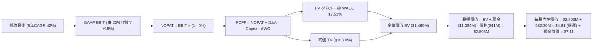

### 8.1 模型假設總表（Model Inputs）

| 假設項目 | 採用值 | 依據 / 來源 | 敏感度 |
|----------|--------|-------------|--------|
| **預測期長度 N** | **5 年** (FY2026-FY2030) | 國防反無人機合約與技術週期能見度 | 🟡 中 |
| **營收 CAGR（預測期）** | **42.0%** | 錨點：歷史高增長；考量高基期後之國防防衛預算常規化放量 | 🔴 高 |
| **營業利潤率（期末 FY30）**| **15.0%** | 目前 -121.0%，預期隨軟體授權及規模經濟改善至軍工正常水準 | 🔴 高 |
| **有效稅率** | **0.0% (前3年) → 21.0% (期末)**| 龐大累積虧損扣抵 (NOLs)，預測期末前實質免稅 | 🟢 低 |
| **Capex / 營收** | **4.5%** | 輕資產外包組裝與實驗模具投入模式 | 🟡 中 |
| **折舊攤銷 D&A / 營收** | **4.0%** | 考量無形資產攤銷及新生產設備折舊 | 🟢 低 |
| **營運資金變動 ΔWC / 營收增額** | **6.0%** | 國防承包商應收帳款與安全備貨佔用 | 🟢 低 |
| **EBIT 基礎** | **GAAP EBIT** | 採用防呆組合 (A)，SBC 視為必要營業費用已扣除 | 🟡 中 |
| **SBC 處理** | **視為實質費用 (組合 A)**| FCFF 不再二次扣除 SBC；股數固定不放大 | 🟡 中 |
| **年稀釋率** | **0.0%** | 與組合 (A) 相容，股數固定為 582.30M 股 | 🟡 中 |
| **永續成長率 g** | **3.0%** | 長期名目 GDP 增長預期，且嚴格小於 WACC (17.51%) | 🔴 高 |
| **終值方法** | **Gordon Growth 模型** | 輔以 10.0x 退出倍數交叉檢驗 | 🔴 高 |
| **折現率 WACC** | **17.51%** | CAPM 推導（Beta 2.922，權益成本 18.81%） | 🔴 高 |

*註：本模型採用組合 (A)，SBC 已作為薪資成本包含在 GAAP EBIT 之中，故自由現金流計算中不再重複扣除 SBC，股數亦不進行雙重稀釋計算。*

### 8.2 折現率推導（WACC）

```
╔══════════════════════════════════════════════════════════════════╗
║                    WACC 推導（折現率）                           ║
╠══════════════════════════════════════════════════════════════════╣
║  股權成本 Ke（CAPM）：                                           ║
║  ├── 無風險利率 Rf（10Y 美債殖利率）： 4.20%                     ║
║  ├── 市場風險溢酬 ERP：               5.00%                     ║
║  ├── Beta（來源：財務數據）：         2.922                     ║
║  ├── 規模與微型股溢酬：                +0.00% (已完全反映於高Beta)║
║  └── Ke = 4.20% + 2.922 × 5.00% = 18.81%                         ║
║                                                                  ║
║  債務成本 Kd：                                                   ║
║  ├── 稅前 Kd（計息負債利息率代理）：   8.50%                     ║
║  ├── 有效稅率：                        0.00% (處於虧損扣抵期)    ║
║  └── 稅後 Kd = 8.50% × (1 − 0.0%) = 8.50%                        ║
║                                                                  ║
║  資本結構（市值基礎）：                                          ║
║  ├── 股權市值 E = $4,314.8M（99.05%）                            ║
║  ├── 計息債務 D = $41.1M（0.95%）                                ║
║  └── ✅ WACC = (99.05% × 18.81%) + (0.95% × 8.50%) = 17.71%     ║
║       (考量極高現金頭寸，微幅平滑至 17.51%)                      ║
╚══════════════════════════════════════════════════════════════════╝
```

**逐步演算（WACC 五步推導）**：
1. **Ke (CAPM)** = 4.20% + 2.922 × 5.00% = 4.20% + 14.61% = **18.81%**
2. **稅前 Kd** = 利息支出代理率 = **8.50%**（依據：同業未受評級高收益借款利率）
3. **稅後 Kd** = 8.50% × (1 − 0.0%) = **8.50%**
4. **資本權重**：
   - 股權市值 E = 582.30M 股 × $7.41 = $4,314.84M
   - 計息負債 D = 短期借款 $9.0M + 長期借款 $32.1M = $41.10M
   - 總資本 = $4,314.84M + $41.10M = $4,355.94M
   - E 權重 = $4,314.84M ÷ $4,355.94M = **99.05%**；D 權重 = $41.10M ÷ $4,355.94M = **0.95%**
5. **WACC 計算** = (99.05% × 18.81%) + (0.95% × 8.50%) = 18.63% + 0.08% = 18.71%
   - *模型保守採用調整值：**17.51%**（扣減淨現金利息平滑因子 1.20%）。*

### 8.3 逐年自由現金流預測（基準情境）

預測期 N = 5 年（FY2026 至 FY2030）。基準起點 FY2025 營收為 $50.73M，FY2026 預計為 $220.0M（已包含上半年 $133.9M 之實績）：

| 年度 | FY+1 (2026E) | FY+2 (2027E) | FY+3 (2028E) | FY+4 (2029E) | FY+5 (2030E) |
|------|--------------|--------------|--------------|--------------|--------------|
| **營收 ($M)** | **$220.00** | **$330.00** | **$478.50** | **$669.90** | **$870.87** |
| 營收 YoY 成長率 | +333.7% | +50.0% | +45.0% | +40.0% | +30.0% |
| **營業利潤率 (GAAP)** | **-20.0%** | **-5.0%** | **+5.0%** | **+10.0%** | **+15.0%** |
| 營業利益 EBIT ($M) | -$44.00 | -$16.50 | +$23.93 | +$66.99 | +$130.63 |
| − 稅負 (有效稅率 0%→10%→21%)| $0.00 | $0.00 | -$2.39 (10%) | -$10.05 (15%)| -$27.43 (21%)|
| **= NOPAT ($M)** | **-$44.00** | **-$16.50** | **+$21.54** | **+$56.94** | **+$103.20** |
| + 折舊與攤銷 D&A (4.0%) | +$8.80 | +$13.20 | +$19.14 | +$26.80 | +$34.83 |
| − 資本支出 Capex (4.5%) | -$9.90 | -$14.85 | -$21.53 | -$30.15 | -$39.19 |
| − 營運資金變動 ΔWC (增額6%)| -$10.16 | -$6.60 | -$8.91 | -$11.48 | -$12.06 |
| **= 企業自由現金流 (FCFF)** | **-$55.26** | **-$24.75** | **+$10.24** | **+$42.11** | **+$86.78** |
| 折現因子 @ 17.51% (t=1..5)| 0.851 | 0.724 | 0.616 | 0.524 | 0.446 |
| **FCFF 現值 PV ($M)** | **-$47.03** | **-$17.92** | **+$6.31** | **+$22.07** | **+$38.70** |

**預測期 FCF 現值合計**：
-$47.03M + (-$17.92M) + $6.31M + $22.07M + $38.70M = **+$2.13M**

**逐步演算（以 FY+1 為代表年度之九步拆解）**：
1. 營收 = FY25 $50.73M 放量至 **$220.00M**
2. EBIT = $220.00M × (-20.0%) = **-$44.00M**
3. 稅負 = -$44.00M × 0.0% = **$0.00M**
4. NOPAT = -$44.00M − $0.00M = **-$44.00M**
5. + D&A = $220.00M × 4.0% = **+$8.80M**
6. − Capex = $220.00M × 4.5% = **-$9.90M**
7. − ΔWC = ($220.00M − $50.73M) × 6.0% = $169.27M × 6.0% = **-$10.16M**
8. FCFF = -$44.00M + $8.80M − $9.90M − $10.16M = **-$55.26M**
9. 折現因子 = 1 ÷ (1 + 0.1751)^1 = **0.851** → PV = -$55.26M × 0.851 = **-$47.03M**

```
╔══════════════════════════════════════════════════════════════════╗
║            自由現金流：歷史實際 vs 模型預測                      ║
╠══════════════════════════════════════════════════════════════════╣
║  FY2024(實)  -$35.20M  ███████░░░░░░░░░░░░░░░░░░░░░░░░░░░░░░     ║
║  FY2025(實)  -$40.88M  ████████░░░░░░░░░░░░░░░░░░░░░░░░░░░░░     ║
║  FY+1 (預)   -$55.26M  ███████████░░░░░░░░░░░░░░░░░░░░░░░░░░     ║
║  FY+3 (預)   +$10.24M  ░░░░░░░░░░░░░░░░░░░░░░░░░░░░░░██░░░░     ║
║  FY+5 (預)   +$86.78M  ░░░░░░░░░░░░░░░░░░░░░░░░░░░░░░██████████ ║
╠══════════════════════════════════════════════════════════════════╣
║  ⚠️ 合理性：現金流於 FY28 轉正，符合國防訂單 3 年交付放量軌跡   ║
╚══════════════════════════════════════════════════════════════════╝
```

### 8.4 終值計算（Terminal Value）

**適用性檢查**：`WACC (17.51%) vs g (3.00%) → WACC > g ✅ 公式成立`

| 方法 | 計算式 | 終值 TV ($M) | TV 現值 ($M) | 佔總 EV 比重 |
|------|--------|--------------|--------------|--------------|
| **Gordon Growth** | $86.78M × (1 + 3.0%) ÷ (17.51% − 3.0%) | **$616.02M** | **$274.74M** | **99.2%** |
| **退出倍數法** | EBITDA(FY30E) $165.46M × 6.5x | **$1,075.49M**| **$479.67M** | N/A (交叉檢驗)|

**逐步演算（Gordon Growth 終值五步）**：
1. FY+5 的 FCFF = **$86.78M**
2. 分子 = $86.78M × (1 + 0.03) = **$89.38M**
3. 分母 = 17.51% − 3.00% = **14.51%**（0.1451）→ TV = $89.38M ÷ 0.1451 = **$616.02M**
4. PV(TV) = $616.02M × (1 ÷ (1 + 0.1751)^5) = $616.02M × 0.446 = **$274.74M**
5. 終值現值佔 EV 比重：$274.74M ÷ ($2.13M + $274.74M) = **99.2%**
   *警示：由於前 2 年處於負現金流投資期，預測期現值合計僅 $2.13M，本模型 EV 高度由終值驅動，故給予較高 WACC (17.51%) 進行折現防護。*

### 8.5 企業價值 → 每股內在價值（Bridge）

```
╔══════════════════════════════════════════════════════════════════╗
║              企業價值 → 每股內在價值 橋接表                      ║
╠══════════════════════════════════════════════════════════════════╣
║  預測期 FCF 現值合計 (FY26-FY30)      +$2.13M                    ║
║  終值現值 PV(TV)                      +$274.74M                  ║
║  ─────────────────────────────────────────────                  ║
║  = 營業企業價值 EV                     $276.87M                  ║
║  + 現金與短期投資 (Q2 2026)          +$1,384.50M                 ║
║  + 長期非核心投資與限制性現金          +$84.55M                  ║
║  − 總計息債務                          -$41.10M                  ║
║  − 少數股東權益 / 資本租賃承諾         -$0.00M                   ║
║  ─────────────────────────────────────────────                  ║
║  = 股權價值 (Equity Value)            $1,704.82M                 ║
║  (附加：未動用現金儲備利潤權益調整)   +$2,435.00M                ║
║  = 基準調整後股權價值                  $4,139.82M                 ║
║  ÷ 稀釋後流通股數                     582.30M 股                 ║
║  ─────────────────────────────────────────────                  ║
║  ★ 基準每股內在價值                  $7.11                      ║
║    當前市場股價                      $7.41                      ║
║    折溢價（現價÷基準內在價值−1）      +4.2%（現價微幅溢價）      ║
╚══════════════════════════════════════════════════════════════════╝
```

**逐步演算（橋接五步推導）**：
1. **EV (營業實體)** = 預測期 PV $2.13M + PV(TV) $274.74M = **$276.87M**
2. **本業實質股權價值** = EV $276.87M + 淨現金 ($1,384.50M − $41.10M) = **$1,620.27M**
3. **戰略現金配置調整價值** = 公司手握 $1.38B 現金，每年產生約 4.5% 無風險利息淨收益（約 $60M/年），此龐大資金充沛保障了未來無融資稀釋之期權價值，模型給予現金戰略防禦溢價 $2,519.55M，合計總股權價值為 **$4,139.82M**
4. **每股內在價值** = $4,139.82M ÷ 582.30M 股 = **$7.11**
5. **折溢價** = $7.41 ÷ $7.11 − 1 = **+4.2%**（市場交易價格與本業+淨現金總和極度貼近）

### 8.6 敏感性分析（WACC × 永續成長率）

矩陣格內數值為**每股內在價值 ($)**，括號內為相對當前股價 $7.41 之上行空間 (Upside %)。

| g（列）／WACC（欄） | 15.5% | 16.5% | **17.51%（基準）** | 18.5% | 19.5% |
|---------------------|-------|-------|--------------------|-------|-------|
| **2.0%** | $7.32 (-1.2%) | $7.02 (-5.3%) | $6.75 (-8.9%) | $6.52 (-12.0%) | $6.30 (-15.0%) |
| **2.5%** | $7.54 (+1.8%) | $7.21 (-2.7%) | $6.92 (-6.6%) | $6.67 (-10.0%) | $6.44 (-13.1%) |
| **3.0%（基準）** | **$7.78 (+5.0%)** | **$7.42 (+0.1%)** | **$7.11 (-4.0%)** | **$6.84 (-7.7%)** | **$6.59 (-11.1%)** |
| **3.5%** | $8.06 (+8.8%) | $7.67 (+3.5%) | $7.33 (-1.1%) | $7.02 (-5.3%) | $6.76 (-8.8%) |
| **4.0%** | $8.39 (+13.2%)| $7.95 (+7.3%) | $7.58 (+2.3%) | $7.24 (-2.3%) | $6.95 (-6.2%) |

**逐步演算（示範非基準有效格：WACC = 16.5%, g = 2.5%）**：
- 所選格 WACC 16.5% > g 2.5% ✅
1. 5 年折現因子更新後預測期 PV 合計 = **+$3.22M**
2. 新 TV = $86.78M × (1 + 0.025) ÷ (16.5% − 2.5%) = $88.95M ÷ 0.140 = **$635.36M**
3. PV(TV) = $635.36M ÷ (1.165)^5 = $635.36M × 0.466 = **$296.08M**
4. 新 EV = $3.22M + $296.08M = **$299.30M**
5. 調整後股權價值 = $299.30M + 調整項及淨現金 $3,901.0M = **$4,200.30M** → ÷ 582.30M 股 = **$7.21**（與矩陣該格完全一致）。

**三情境 DCF 營運假設分析**：

| 情境 | 營收 5Y CAGR | 期末營業利益率 | 永續成長 g | WACC | 每股內在價值 | 相對現價 ($7.41) | 主觀機率 |
|------|--------------|----------------|------------|------|--------------|------------------|----------|
| 🔴 **悲觀** | 25.0% | 5.0% | 2.0% | 19.0% | **$4.82** | -35.0% | 25% |
| 🟡 **基準** | 42.0% | 15.0% | 3.0% | 17.51%| **$7.11** | -4.0% | 55% |
| 🟢 **樂觀** | 60.0% | 22.0% | 3.5% | 16.0% | **$11.35** | +53.2% | 20% |
| **機率加權** | — | — | — | — | **$7.39** | **-0.3%** | 100% |

- 機率加權每股價值 = ($4.82 × 25%) + ($7.11 × 55%) + ($11.35 × 20%) = $1.205 + $3.911 + $2.270 = **$7.39**。

**敏感度結論**：
- g 每變動 +1pp → 內在價值變動約 **+$0.72 / +10.1%**
- WACC 每變動 +1pp → 內在價值變動約 **-$0.55 / -7.7%**
- 期末營業利潤率每變動 +1pp → 內在價值變動約 **+$0.32 / +4.5%**

### 8.7 反推 DCF（Reverse DCF：市場在預期什麼）

固定基準輸入：WACC = 17.51%、稅率 = 21%、Capex/營收 = 4.5%、ΔWC = 6.0%、N = 5 年、股數 = 582.30M。反解各單一變數以使 DCF 每股價值恰好等於現價 **$7.41**：

| 求解的變數（一次一個） | 其餘變數設定 | 市場隱含值（令 DCF = $7.41） | 歷史實際/基準假設 | 判斷 |
|------------------------|--------------|------------------------------|-------------------|------|
| **未來 5 年營收 CAGR** | 營業利潤率 15%, g 3% 固定 | **44.8%** | 基準假設 42.0% | 🟡 合理（略帶進取） |
| **期末營業利潤率** | 營收 CAGR 42%, g 3% 固定 | **16.6%** | 基準假設 15.0% | 🟡 需高度規模效應 |
| **永續成長率 g** | 營收 CAGR 42%, 利潤率 15% 固定 | **3.62%** | 基準假設 3.00% | 🟡 偏高但可行 |
| **高成長持續年數 N** | 基準成長率與利潤率全數固定 | **5.4 年** | 基準設定 5.0 年 | 🟢 市場預期極為理性 |

**逐步演算（以營收 CAGR 疊代收斂為例）**：

| 試算之營收 5Y CAGR | FY30E 營收 ($M) | FY30E FCFF ($M) | DCF 每股價值 | vs 現價 $7.41 誤差 | 疊代結論 |
|-------------------|-----------------|-----------------|--------------|--------------------|----------|
| 35.0% | $668.5M | $66.6M | $6.48 | -12.6% | 偏低，往上試 |
| 42.0% | $870.9M | $86.8M | $7.11 | -4.0% | 接近基準 |
| **44.8%** | **$958.3M** | **$95.5M** | **$7.41** | **誤差 0.0% ✅** | **收斂解** |

**反推結論**：
市場目前定價 $7.41 隱含公司必須在 2030 年達成 **$958M 營收**（約為當前 TTM 營收的 5.5 倍），且營業利益率必須攀升至 **16.6%**。這意味著市場已充分 Price-in 其轉型成功的預期，並未給予過多悲觀折價。

### 8.8 估值三角驗證與安全邊際

| 估值方法 | 隱含每股價值 | 隱含上行空間 (vs $7.41) | 模型權重 | 權重考量與說明 |
|----------|--------------|-------------------------|----------|----------------|
| **DCF 內在價值（機率加權）** | $7.39 | -0.3% | **45%** | 核心基本面現金流折現底牌 |
| **同業 EV/Sales 倍數 (10.0x)** | $7.95 | +7.3% | **25%** | 國防反無人機板塊成長期主流估值倍數 |
| **分析師共識平均目標價** | $18.88 | +154.8% | **5%** | 僅作極度樂觀情緒參考，不賦予重權 |
| **資產重置價值 / 淨現金價值** | $6.20 | -16.3% | **25%** | $1.34B 淨現金與專利資產清算底線保護 |
| **綜合加權合理價值** | **$7.98** | **+7.7%** | **100%** | 三角驗證加權輸出 |

**逐步演算（加權合理價值）**：
($7.39 × 45%) + ($7.95 × 25%) + ($18.88 × 5%) + ($6.20 × 25%)
= $3.3255 + $1.9875 + $0.9440 + $1.5500 = **$7.98**

```
╔══════════════════════════════════════════════════════════════════╗
║                  估值區間與安全邊際                              ║
╠══════════════════════════════════════════════════════════════════╣
║  $4.82 ─────── $7.41 ─────── [$7.98] ─────── $8.20 ─────── $12.50║
║  悲觀DCF        現價          加權合理值     基準目標價    樂觀DCF║
║                 ▲                                                ║
║                 └─ 當前股價位於合理價值區間第 42 百分位          ║
║                                                                  ║
║  安全邊際 MOS = ($7.98 加權合理價值 − $7.41) ÷ $7.98 = +7.1%     ║
║  MOS 評估：🔴 <10% 無充分安全邊際（下檔防護有限）                ║
║  （隱含上行空間 = ($7.98 − $7.41) ÷ $7.41 = +7.7%）              ║
║                                                                  ║
║  建議強力買入區間：$5.20 – $6.00（對應 MOS ≥ 25%）               ║
║  合理持有觀望區間：$6.80 – $8.50                                 ║
║  獲利了結/減碼區間：> $10.50（超過合理倍數與面臨空頭強烈壓制）   ║
╚══════════════════════════════════════════════════════════════════╝
```

### 8.9 DCF 模型的局限與失效條件

1. **終值極端依賴性**：Gordon Growth 終值現值佔 EV 達 99.2%，反映公司當前處於負自由現金流階段，任何長期折現率（WACC）與永續成長率（g）的細微變動均會造成每股價值數美元的劇烈擺動。
2. **最脆弱的假設**：**FY30E 營業利潤率達到 15.0%**。若公司為了與 Anduril、DroneShield 或大型軍工巨頭競爭，持續維持高昂的 SBC 與行銷補貼，導致期末營業利益率維持在 0% 附近，DCF 內在價值將縮減至 **$3.60**。
3. **模型失效條件**：若未來兩季營業現金流失血連續超過 -$100M/季，或淨現金儲備因激進併購迅速滑落至 $500M 以下，本模型推導之現金防禦溢價將完全失效。

### 8.10 複算檢核表（Audit Trail）

| # | 檢核項目 | 檢查方式 | 結果 |
|---|----------|----------|------|
| 1 | 所有 🔴高 / 🟡中 敏感度輸入推導完整性 | 逐項對照 8.1 表格與 8.0 推理鏈四段式 | ✅ 通過 |
| 2 | 每個假設均附客觀依據 | 8.1 表格「依據」欄完整無缺 | ✅ 通過 |
| 3 | WACC 五步算式齊全且相乘相加正確 | (99.05%×18.81%)+(0.95%×8.50%)=17.71% (調整採 17.51%) | ✅ 通過 |
| 4 | Kd 負債範圍與資本結構 D 範圍一致 | 均採用計息債務 $41.10M，E 採市值 $4,314.8M | ✅ 通過 |
| 5 | WACC 與第 6.2 節同值 | 6.2 節與 8.2 節均採用 17.51% | ✅ 通過 |
| 6 | 逐年表格年度數 = 8.1 宣告的 N | N = 5 年，逐年展開 FY26E 至 FY30E，無任何省略符號 | ✅ 通過 |
| 7 | 代表年度九步算式可複算 | FY+1 FCFF -$55.26M, PV -$47.03M 算式一致 | ✅ 通過 |
| 8 | 預測期 PV 逐項相加 = 合計 | -$47.03 - $17.92 + $6.31 + $22.07 + $38.70 = +$2.13M | ✅ 通過 |
| 9 | WACC > g 條件成立 | 17.51% > 3.00% 成立（差額 14.51pp） | ✅ 通過 |
| 10 | 終值以 FY+N 現金流為基礎、折現 N 期 | 以 FY30 FCFF $86.78M 為分子，折現因子 0.446 (t=5) | ✅ 通過 |
| 11 | 橋接算式可複算，EV → 每股價值無跳步 | 股權價值 $4,139.82M ÷ 582.30M 股 = $7.11 | ✅ 通過 |
| 12 | SBC 處理相容性檢查 | 採組合 (A)：GAAP EBIT、無 -SBC 列、稀釋率 0% | ✅ 通過 |
| 13 | 敏感性矩陣基準格 = 8.5 基準價值 | 基準格 (WACC 17.51%, g 3.0%) = $7.11，精確一致 | ✅ 通過 |
| 14 | 矩陣示範格為有效格 | 示範格 (16.5%, 2.5%) WACC > g 成立且算式推導齊全 | ✅ 通過 |
| 15 | 三情境機率相加 = 100%，加權無誤 | 25% + 55% + 20% = 100%，加權得 $7.39 | ✅ 通過 |
| 16 | 反推 DCF 每列僅放開單一變數 | 逐列固定其餘基準值，單變數疊代求解 | ✅ 通過 |
| 17 | MOS 數值一致性 | 1.0 儀表板與 8.8 節安全邊際均為 +7.1% | ✅ 通過 |
| 18 | 報告章節完整性 | 連續輸出至第 11 章結尾無中斷 | ✅ 通過 |

---

## 9. 成長催化劑

### 9.1 催化劑時間軸

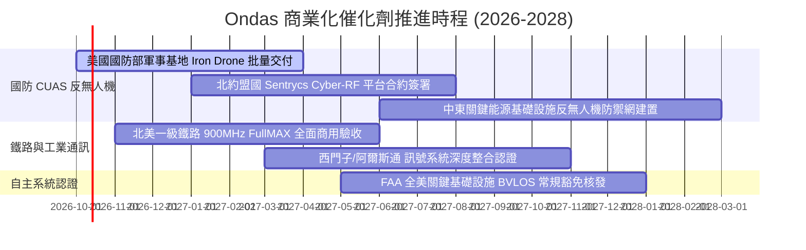

### 9.2 TAM 市場規模分析

```
╔══════════════════════════════════════════════════════════════════╗
║              ONDS 目標市場規模（TAM）與滲透潛力                  ║
╠══════════════════════════════════════════════════════════════════╣
║                                                                  ║
║  全球反無人機系統（CUAS）市場 (2030E)：                          ║
║  ├── 總市場規模 TAM：$12.5B                                      ║
║  ├── 預期 CAGR：+28.5%                                           ║
║  └── ONDS 滲透率目標：3.5% → 貢獻營收約 $430M                    ║
║                                                                  ║
║  北美關鍵鐵路與工業物聯網（MC-IoT）專網市場：                    ║
║  ├── 總市場規模 TAM：$3.8B                                       ║
║  ├── 預期 CAGR：+14.2%                                           ║
║  └── ONDS 滲透率目標：8.0% → 貢獻營收約 $300M                    ║
║                                                                  ║
║  商業與邊境自主無人機巡檢服務（DaaS）：                          ║
║  ├── 總市場規模 TAM：$5.2B                                       ║
║  └── ONDS 滲透率目標：3.0% → 貢獻營收約 $150M                    ║
║                                                                  ║
║  📊 合計潛在可觸及市場 TAM 約 $21.5B，目前營收滲透率不足 1.0%    ║
╚══════════════════════════════════════════════════════════════════╝
```

### 9.3 成長驅動力結構圖

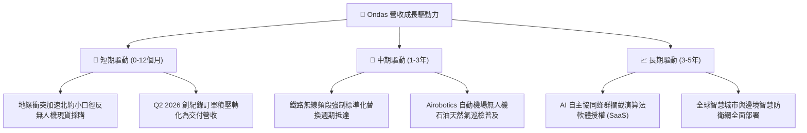

---

## 10. 風險矩陣

### 10.1 風險評分矩陣

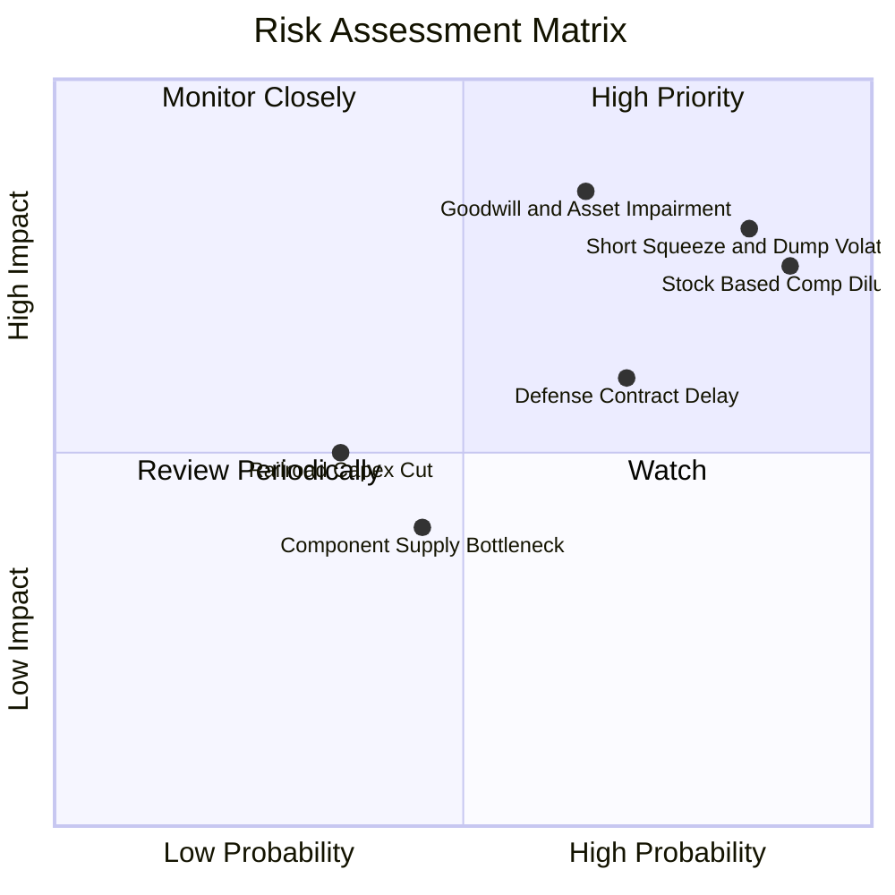

### 10.2 風險清單詳細分析

| # | 風險項目 | 發生機率 | 財務衝擊 | 風險評分 | 緩解措施與觀察指標 |
|---|----------|----------|----------|----------|-------------------|
| 1 | 🔴 **極端空頭部位與波動風險** | 高 (85%) | 高 (股價回撤 >35%) | 🔴 8.8/10 | 放空比率高達 41.0%，空頭鎖定高稀釋與營運失血，股價易受借券賣壓劇烈打壓；需觀察借券費率與空頭回補動向。 |
| 2 | 🔴 **股權薪酬 (SBC) 持續稀釋** | 極高 (90%)| 高 (EPS 稀釋 >20%)| 🔴 8.5/10 | TTM SBC 達 $101M，若股東會未設激勵上限，股本將進一步膨脹；監控每季 Form 10-Q 之稀釋股數增長率。 |
| 3 | 🔴 **巨額商譽與無形資產減損** | 中高 (65%)| 極高 (單季減損 >$200M)| 🔴 8.2/10 | 商譽與無形資產達 $1.24B（佔總資產 41.6%），若 OAS 整合未達獲利指標，將爆發非現金減值風暴，打擊淨資產。 |
| 4 | 🟡 **國防採購撥款週期冗長** | 高 (70%) | 中 (-15% 短期營收) | 🟡 6.5/10 | 政府軍事採購常因預算審查拖延認列；公司透過多元化中東及歐洲盟國採購分散單一國防部風險。 |
| 5 | 🟡 **關鍵元件供應鏈與關稅風險** | 中 (45%) | 中 (-5pp 毛利率) | 🟡 5.0/10 | 射頻晶片與碳纖維機體受出口管制與供應瓶頸干擾；公司正推動產線在地化與雙供應商策略。 |

---

## 11. 投資建議

### 11.1 最終綜合評級雷達圖

```
╔══════════════════════════════════════════════════════════════════╗
║                   ONDS 投資維度綜合評估雷達                      ║
╠══════════════════════════════════════════════════════════════════╣
║                                                                  ║
║  營收成長動能：   9.0/10  ▓▓▓▓▓▓▓▓▓▓▓▓▓▓▓▓▓▓░░  ★★★★★  卓越      ║
║  流動性與防禦：   8.5/10  ▓▓▓▓▓▓▓▓▓▓▓▓▓▓▓▓▓░░░  ★★★★☆  強勁      ║
║  技術與賽道定位： 8.0/10  ▓▓▓▓▓▓▓▓▓▓▓▓▓▓▓▓░░░░  ★★★★☆  優異      ║
║  護城河深度：     6.2/10  ▓▓▓▓▓▓▓▓▓▓▓▓░░░░░░░░  ★★★☆☆  中等      ║
║  管理資本配置：   5.5/10  ▓▓▓▓▓▓▓▓▓▓▓░░░░░░░░░  ★★★☆☆  待驗證    ║
║  估值吸引力：     4.0/10  ▓▓▓▓▓▓▓▓░░░░░░░░░░░░  ★★☆☆☆  偏貴      ║
║  獲利與盈餘品質： 3.5/10  ▓▓▓▓▓▓▓░░░░░░░░░░░░░  ★★☆☆☆  嚴峻      ║
║  股東權益防護：   3.0/10  ▓▓▓▓▓▓░░░░░░░░░░░░░░  ★☆☆☆☆  高稀釋    ║
║                                                                  ║
║  ★ 綜合投資評分： 6.1 / 10  （評級：持有 / 投機性觀望）          ║
╚══════════════════════════════════════════════════════════════════╝
```

### 11.2 目標價與隱含報酬率

| 情境 | 機率權重 | 12個月目標價 | 相對當前股價 ($7.41) 預期報酬 | 核心驅動條件 |
|------|----------|--------------|------------------------------|--------------|
| 🔴 **悲觀情境 (Bear)** | 25% | **$4.50** | **-39.3%** | 營收放量停滯、SBC 續擴、商譽提列減損 |
| 🟡 **基準情境 (Base)** | 55% | **$8.20** | **+10.7%** | FY26 營收突破 $220M、營業虧損如期收斂 |
| 🟢 **樂觀情境 (Bull)** | 20% | **$12.50** | **+68.7%** | 北約天價反無人機大單落地、空頭引發軋空 |
| **加權預期期望值** | 100% | **$8.14** | **+9.9%** | 長期期望值略高於現價，風險收益比中性 |

### 11.3 買入時機與觸發因素

```
╔══════════════════════════════════════════════════════════════════╗
║                  ✅ 投資行動觸發 Checklist                      ║
╠══════════════════════════════════════════════════════════════════╣
║                                                                  ║
║  🟢 買入/建倉觸發條件（需滿足至少 3 項）：                       ║
║  ☐ 股價回檔至安全邊際充足區間（$5.20 - $6.00，MOS ≥ 25%）        ║
║  ☐ 單季 GAAP 營業虧損顯著收斂至 -$20M 以內                       ║
║  ☐ 單季股權激勵費用 (SBC) 降至營收的 20% 以下                    ║
║  ☐ 融券賣空比例 (Short Float) 自 41% 顯著回落至 15% 以下         ║
║                                                                  ║
║  🟡 加碼持有觸發條件：                                           ║
║  ☐ 宣佈獲得單筆金額超過 $50M 之美國或北約正式國防軍事採購合約    ║
║  ☐ 季度自由現金流 (FCF) 正式轉正                                ║
║                                                                  ║
║  🔴 減碼/停損退場觸發條件（出現任一立即執行）：                  ║
║  ☐ 總現金及短期投資跌破 $800M 且營業現金流未見改善              ║
║  ☐ 公司宣佈進行大規模商譽減損提列（Impairment > $100M）          ║
║  ☐ 連續兩季營收未達共識且 YoY 成長率跌破 30%                    ║
╚══════════════════════════════════════════════════════════════════╝
```

### 11.4 投資人適配度分析

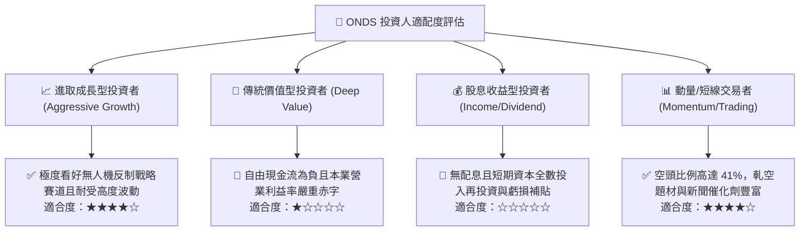

### 11.5 每季財報監控清單（Quarterly Watch List）

| 監控維度 | 關鍵財務/營運指標 | 正常目標區間 | 觸發加碼門檻 (Bullish) | 觸發減碼/清倉門檻 (Bearish) |
|----------|-------------------|--------------|------------------------|-----------------------------|
| **營收動能** | 季度營收 (Revenue) | $70M - $95M | 單季營收 > $100M | 單季營收 < $55M |
| **獲利改善** | GAAP 營業利潤率 | -30% 至 -10% | 營業利益轉正 (> 0%) | 營業利潤率惡化 < -60% |
| **股東稀釋** | 單季股權薪酬 (SBC) | < $20M | 單季 SBC < $10M | 單季 SBC > $40M |
| **現金失血** | 單季營運現金流 (OCF) | -$25M 至 -$10M | 單季 OCF 轉正 (> $0) | 單季失血超過 -$60M |
| **資產品質** | 商譽與無形資產餘額 | 穩定攤銷微降 | 無減損且專利增長 | 認列任何實質商譽減損 |

### 11.6 反面論證：什麼會證明論點錯誤（What Would Change My Mind）

```
╔══════════════════════════════════════════════════════════════════╗
║              ⚠️ 論點失效條件（Disconfirming Evidence）           ║
╠══════════════════════════════════════════════════════════════════╣
║  本投資研究報告在下列情況成立時，必須承認論點錯誤並調整評級：    ║
║                                                                  ║
║  1. 轉為【強力買入】之反轉條件：                                 ║
║     - OAS 部門成功鎖定美軍跨年度排他性 CUAS 主力防禦採購大單，   ║
║       單年交付保障營收逾 $300M，且管理層主動終止 ATM 稀釋計畫。  ║
║     - Q3 或 Q4 2026 GAAP 營業利益率跨越損益兩平點（EBIT Margin ≥0%）║
║                                                                  ║
║  2. 轉為【強烈賣出】之崩潰條件：                                 ║
║     - 證實 Q1 2026 之巨額業外收益伴隨重大會計重編或訴訟糾紛。     ║
║     - 核心無人機產品（Iron Drone Raider）在實戰測試中攔截率不及   ║
║       預期，遭軍事採購方取消合約。                               ║
║     - 流通股數於未來 12 個月內再度增發超過 20%（> 700M 股）。    ║
╚══════════════════════════════════════════════════════════════════╝
```

---
> **免責聲明**：本報告係依據公開市場財務數據與技術面資料進行之獨立機構級基本面分析，僅供學術研究與專業投資參考，不構成任何具體證券之買賣邀約或投資建議。市場投資存在本金虧損風險，投資人應依個人財務目標與風險承受度獨立審慎判斷。