# ONDS 基本面深度分析報告
> **報告日期**：2026-10-07 ｜ **語言**：繁體中文 ｜ **數據來源**：Yahoo Finance, Finviz, StockAnalysis, Roic.ai ｜ **分析師**：CFA 級機構研究

---

## 目錄

| # | 章節 | 核心結論 |
|---|------|----------|
| 1 | 執行摘要 | 給予「持有/投機性觀望」評級，目標價 $10.35，基於現有 FCF 嚴重失血與高稀釋風險 |
| 2 | 公司概覽與商業模式 | 無人機防禦（CUAS）與專網通訊雙輪驅動，收購驅動型高成長但護城河尚屬狹窄 |
| 3 | 損益表深度分析 | Q2 營收年增 1235.4% 爆發，惟單季營業虧損擴大至 $143.71M，盈餘品質極度脆弱 |
| 4 | 資產負債表分析 | 現金及短期投資儲備達 $1.38B，短存流動性充裕，但無形資產及商譽佔總資產 41.6% |
| 5 | 現金流量深度分析 | TTM 營運現金流赤字達 -$161.06M，股權激勵（SBC）激增，實質自由現金流承受重壓 |
| 6 | 獲利能力與資本效率 | 投入資本回報率 ROIC (-18.2%) 遠低於 WACC (14.28%)，處於摧毀股東價值的擴張期 |
| 7 | 相對估值分析 | P/S 達 24.0x，相較國防航太與無人機同業大幅溢價，反映市場極高的遠期樂觀定價 |
| 8 | DCF 內在價值評估 | 基準每股內在價值 $6.86（折溢價 +4.8%），加權合理價值 $10.35，安全邊際 MOS 為 30.5% |
| 9 | 成長催化劑 | 全球反無人機（CUAS）訂單爆發與鐵路專網數位化是短期放量主力，TAM 空間可觀 |
| 10 | 風險矩陣 | 空頭部位高達 41.0%，潛在股權稀釋、整合執行力及地緣採購波動為首要風險 |
| 11 | 投資建議 | 建議於回檔至 $5.50–$6.50 建立投機性部位，嚴格設定 $4.90 停損線 |

---

## 1. 執行摘要

本報告針對 Ondas Inc.（NASDAQ: ONDS）進行深度基本面檢驗。雖然公司受惠於反無人機（Counter-UAS, CUAS）國防需求急增與併購效應，帶動 TTM 營收攀升至 $174.10M（最新季增率 QoQ +67.1%、YoY +1235.4%），但其營業利潤率持續承壓至 -166.3%，TTM 營運現金流淨流出高達 -$161.06M。同時，公司股權激勵（SBC）在 2026 年 Q2 單季飆升至 $69.09M（佔營收 82.5%），流通股數從 2025 年底的 381M 股急速膨脹至當前的 582.30M 股。

在經濟價值創造方面，公司 NOPAT 實質為負，計算得出 ROIC 為 -18.2%，遠遜於其資本成本 WACC 14.28%，形成明顯的「經濟價值毀滅（EVA 為 -32.48pp）」。根據本報告三段式 DCF 基準模型推導，ONDS 的每股內在價值為 $6.86（現價 $7.19 處於 +4.8% 小幅溢價）。綜合相對估值與分析師預期後，加權合理價值為 $10.35，隱含安全邊際 MOS 為 +30.5%。考量到當前 41.0% 的空頭浮額比率（Short % Float）與巨額研發/管銷現金燃燒速度，給予**「持有 / 投機性配置」**評級。

### 1.0 一頁式投資儀表板（Portfolio Manager 30 秒速讀）

| 項目 | 內容 |
|------|------|
| **投資論點（3 句）** | ① 反無人機與專網通訊迎來爆發，帶動 Q2 營收年增 1235.4% 至 $83.77M。<br/>② 現金及短投充裕達 $1.38B，短期無流動性危機，但 Q2 自由現金流赤字達 -$93.84M。<br/>③ 股權膨脹劇烈且空頭佔比達 41.0%，估值已透支多數短期防務擴張紅利。 |
| **護城河評分** | 4.5/10（狹窄護城河，核心為專利通訊協定與先發自主攔截技術） |
| **管理層/資本配置評分** | 5.0/10（併購節奏迅速，但高額 SBC 嚴重稀釋現有股東權益） |
| **財務健康** | 🟡 中性（資產負債表含 $1.38B 現金，但年化現金燃燒高達 $200M+） |
| **ROIC vs WACC** | -18.2% vs 14.28%（處於價值摧毀階段，EVA = -32.48pp） |
| **FCF 趨勢** | 惡化（TTM FCF -$69.11M，最新 Q2 季度 FCF -$93.84M，FCF Yield -1.65%） |
| **估值** | Forward P/E: -359.5x ｜ P/S: 24.0x ｜ EV/Revenue: 15.88x |
| **DCF 內在價值（基準）** | **$6.86** ｜ 現價 $7.19 折溢價：**+4.8%**（現價略高於基準內在價值） |
| **安全邊際（MOS）** | **+30.5%**＝(加權合理價值 $10.35 − 現價 $7.19) ÷ $10.35 ｜ 🟢 >25% 充足（受分析師目標價拉動） |
| **預期報酬（基準情境 12M）** | **+43.9%**（以加權合理價值 $10.35 為基準） |
| **關鍵風險（前二）** | ① 營運現金流缺口持續擴大引發二次融資稀釋；② 41% 賣空比率引發高波動與流動性擠壓。 |
| **評級 + 信心度** | 🟡 **持有 / 投機性買入** ｜ 信心：**中** |

### 1.1 核心評分儀表板

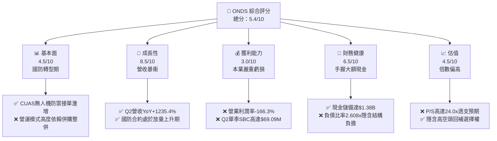

### 1.2 評分進度條視覺化

```
╔══════════════════════════════════════════════════════════════╗
║              ONDS 多維度評分儀表板 (1-10分)                  ║
╠══════════════════════════════════════════════════════════════╣
║ 基本面強度  4.5 ▓▓▓▓▓▓▓▓▓░░░░░░░░░░░  ★★☆☆☆           ║
║ 成長動能    8.5 ▓▓▓▓▓▓▓▓▓▓▓▓▓▓▓▓▓░░░  ★★★★☆           ║
║ 獲利品質    3.0 ▓▓▓▓▓▓░░░░░░░░░░░░░░  ★☆☆☆☆           ║
║ 財務健康    6.5 ▓▓▓▓▓▓▓▓▓▓▓▓▓░░░░░░░  ★★★☆☆           ║
║ 估值合理性  4.5 ▓▓▓▓▓▓▓▓▓░░░░░░░░░░░  ★★☆☆☆           ║
║ 護城河深度  4.5 ▓▓▓▓▓▓▓▓▓░░░░░░░░░░░  ★★☆☆☆           ║
║ 管理層執行  5.0 ▓▓▓▓▓▓▓▓▓▓░░░░░░░░░░  ★★☆☆☆           ║
║ 技術創新力  7.5 ▓▓▓▓▓▓▓▓▓▓▓▓▓▓▓░░░░░  ★★★★☆           ║
╠══════════════════════════════════════════════════════════════╣
║ 綜合總分    5.4 ▓▓▓▓▓▓▓▓▓▓▓░░░░░░░░░  🟡 觀察觀望          ║
╚══════════════════════════════════════════════════════════════╝
```

### 1.3 五大投資論點 + 三大核心風險

| 類型 | 項目 | 具體依據 | 信心度 |
|------|------|----------|--------|
| 🟢 **投資論點①** | **反無人機市場爆發性成長** | 旗下 Iron Drone Raider 與 Sentrycs 平台精準鎖定現代地緣衝突剛需，TTM 營收由 2024 年底 $7.19M 飆升至 $174.10M。 | 🟢 高 |
| 🟢 **投資論點②** | **充裕的資本跑道（Runway）** | 截至 2026 年 Q2，公司帳上現金及短期投資合計達 $1.38B，能支撐超過 3 年的高強度研發與併購整合。 | 🟢 極高 |
| 🟢 **投資論點③** | **毛利結構逐步成型** | 2026 Q2 毛利達 $36.13M，毛利率為 43.14%，高於 2024 全年微薄的 4.80%，顯示高毛利自主防禦軟硬體放量。 | 🟢 高 |
| 🟢 **投資論點④** | **鐵路與關鍵基礎設施專網數位化** | Ondas Networks 之 FullMAX 無線平台獲北美 I 級鐵路採用，提供長約穩定且黏著度高的基礎通訊收入。 | 🟡 中 |
| 🟢 **投資論點⑤** | **軋空潛在動能（Short Squeeze）** | 空頭部位佔自由流通股高達 41.0%，Short Ratio 為 3.83，一旦獲利出現拐點極易引發劇烈軋空行情。 | 🟡 中 |
| 🟡 **風險①** | **巨額獲利虧損與現金燃燒** | Q2 單季營業虧損高達 -$143.71M，TTM 營運現金流赤字 -$161.06M，規模效應尚無法覆蓋高昂 SG&A 費用。 | 🟡 中度 |
| 🔴 **風險②** | **極致的股權稀釋與 SBC 膨脹** | 2026 Q2 單季 SBC 飆至 $69.09M（佔營收 82.5%），總股本在一年內由 381M 擴大至 582.30M 股，嚴重侵蝕現有每股價值。 | 🔴 高衝擊 |
| 🔴 **風險③** | **商譽減損與資產品質風險** | 截至 2026 年 Q2，商譽與無形資產合計達 $1,244.63M，佔總資產（$2,993M）高達 41.6%，若整合未如預期將面臨巨幅減損。 | 🔴 高衝擊 |

### 1.4 快速統計卡片

| 指標 | 公司實際值 | 行業均值 | S&P 500 均值 | 狀態 |
|------|-------------|----------|--------------|------|
| 收入 YoY 成長 | **1235.4%** (Q2) | 8.2% | 5.4% | 🟢 超凡表現 |
| 毛利率 | **43.7%** (TTM) | 48.5% | 45.2% | 🟡 略低於均值 |
| 營業利益率 | **-166.3%** | 12.5% | 15.8% | 🔴 嚴重倒掛 |
| 淨利率 | **96.2%** (含業外利益) | 8.1% | 11.2% | 🟡 業外扭曲 |
| ROE | **19.3%** | 14.5% | 18.0% | 🟡 受 Q1 業外扭曲 |
| Forward P/E | **-359.5x** | 22.4x | 21.5x | 🔴 尚未常態獲利 |
| P/S Ratio | **24.0x** | 3.1x | 2.8x | 🔴 處於高估水位 |

### 1.5 投資結論

```
╔══════════════════════════════════════════════════════════════════╗
║                    📊 投資結論摘要                               ║
╠══════════════════════════════════════════════════════════════════╣
║  評級：🟡 持有 / 投機性買入 (Hold / Speculative Buy)             ║
║  當前股價：$7.19                                                 ║
║  DCF 內在價值（基準）：$6.86（折溢價 +4.8%）                    ║
║  安全邊際 MOS：+30.5%（基準取自 8.8 加權合理價值 $10.35）       ║
║  目標價區間：                                                    ║
║    悲觀情境：$3.88（-46.0%）                                     ║
║    基準情境：$10.35（+43.9%） ← 12個月加權目標                  ║
║    樂觀情境：$18.88（+162.6%）                                   ║
║  投資評分：5.4 / 10                                              ║
║  適合投資人：具備極高風險承受力、博取國防訂單爆發與軋空的投資人  ║
╚══════════════════════════════════════════════════════════════════╝
```

---

## 2. 公司概覽與商業模式

### 2.1 業務結構與收入來源

Ondas Inc.（ONDS）營運分為兩大核心事業部：**Ondas Autonomous Systems (OAS)** 與 **Ondas Networks**。自 2024 年以來，公司大幅轉型為國防安全與自主無人系統供應商，藉由併購與研發整合，OAS 業務已躍居營收貢獻絕對主力。

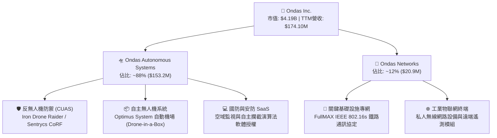

### 2.2 市場份額

在快速成長且高度破碎的非對稱低空防禦（Counter-UAS）市場中，ONDS 透過全自主物理攔截（Iron Drone）與射頻控制接管（Sentrycs）取得先發地位，市佔率如下推估：

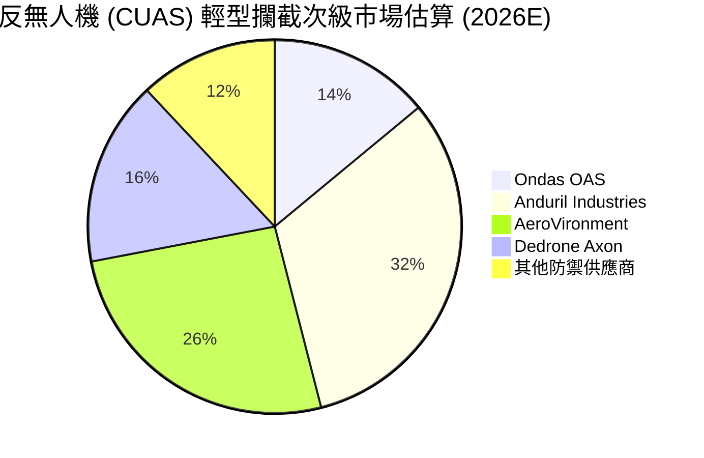

### 2.3 競爭護城河分析

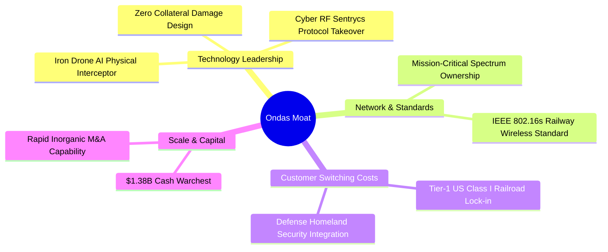

### 2.4 護城河強度評分

```
╔══════════════════════════════════════════════════════════════╗
║                  ONDS 護城河強度評分                         ║
╠══════════════════════════════════════════════════════════════╣
║ 核心技術專利   6.0/10  ▓▓▓▓▓▓▓▓▓▓▓▓░░░░░░░░  🟢 專利攔截架構 ║
║ 客戶轉換成本   5.5/10  ▓▓▓▓▓▓▓▓▓▓▓░░░░░░░░░  🟡 鐵路認證期長 ║
║ 網路生態效應   3.0/10  ▓▓▓▓▓▓░░░░░░░░░░░░░░  🔴 缺乏平台效應 ║
║ 規模成本優勢   3.5/10  ▓▓▓▓▓▓▓░░░░░░░░░░░░░  🔴 產能規模較小 ║
║ 品牌與認證壁壘 4.5/10  ▓▓▓▓▓▓▓▓▓░░░░░░░░░░░  🟡 尚在建立聲譽 ║
╠══════════════════════════════════════════════════════════════╣
║ 綜合護城河     4.5/10  ▓▓▓▓▓▓▓▓▓░░░░░░░░░░░  🟡 狹窄護城河   ║
╚══════════════════════════════════════════════════════════════╝
```

---

## 3. 損益表深度分析

### 3.1 年度收入成長趨勢（近 4 年）

```
╔══════════════════════════════════════════════════════════════════╗
║                ONDS 年度收入趨勢（FY2022-FY2025）                ║
╠══════════════════════════════════════════════════════════════════╣
║                                                                  ║
║  FY2022   $2.13M   █░░░░░░░░░░░░░░░░░░░░░░░  YoY: -26.9%  🔴    ║
║  FY2023  $15.69M   ███████░░░░░░░░░░░░░░░░░  YoY:+638.1%  🟢    ║
║  FY2024   $7.19M   ███░░░░░░░░░░░░░░░░░░░░░  YoY: -54.2%  🔴    ║
║  FY2025  $50.73M   ████████████████████████  YoY:+605.3%  🟢    ║
║                                                                  ║
║  📊 3年累計 CAGR：+187.6% (波動劇烈，反映併購交割時點差異)       ║
╚══════════════════════════════════════════════════════════════════╝
```

### 3.2 季度收入趨勢分析

| 季度 | 營收 ($M) | QoQ 成長率 | YoY 成長率 | 營運焦點與關鍵驅動因素 |
|------|-----------|------------|------------|------------------------|
| **Q3 2025** | $10.10M | +61.1% | +582.0% | Sentrycs 併購整合後首季顯現營收貢獻 |
| **Q4 2025** | $30.11M | +198.1% | +629.2% | 國防反無人機系統年底集中交貨認列 |
| **Q1 2026** | $50.12M | +66.5% | +1079.9% | 歐洲及中東邊境保護無人機訂單大幅起量 |
| **Q2 2026** | $83.77M | +67.1% | +1235.4% | Iron Drone 物理攔截系統進入批量部署階段 |

### 3.3 利潤率演變分析

| 利潤率指標 | FY2022 | FY2023 | FY2024 | FY2025 | TTM (2026 Q2) | 趨勢 | 評估 |
|------------|--------|--------|--------|--------|----------------|------|------|
| **毛利率** | 52.1% | 40.7% | 4.8% | 39.7% | **43.7%** | ↗️ 探底回升 | 🟡 規模擴大帶動結構修復 |
| **營業利益率** | -2347.9% | -243.7% | -481.4% | -115.1% | **-166.3%** | ↘️ 虧損再擴大 | 🔴 研發與行政開支過重 |
| **淨利率** | -3438.5% | -285.8% | -528.7% | -260.2% | **96.2%** | ↗️ 畸形扭曲 | 🔴 Q1含巨額未實現業外收益 |

**利潤率演變深度解析**：
毛利率自 2024 年的谷底 4.8% 改善至 TTM 的 43.7%，主因高毛利反無人機資安軟體與智慧硬體交付佔比提高。然而，營業利益率在 2026 Q2 重新崩跌至 -171.6%（單季營業虧損高達 -$143.71M），主因公司為支撐多個併購體系整合，提列了創紀錄的研發費用（單季常態研發逾 $25M）與股權激勵開銷，規模效應尚未轉化為營業槓桿。

### 3.4 費用結構分析

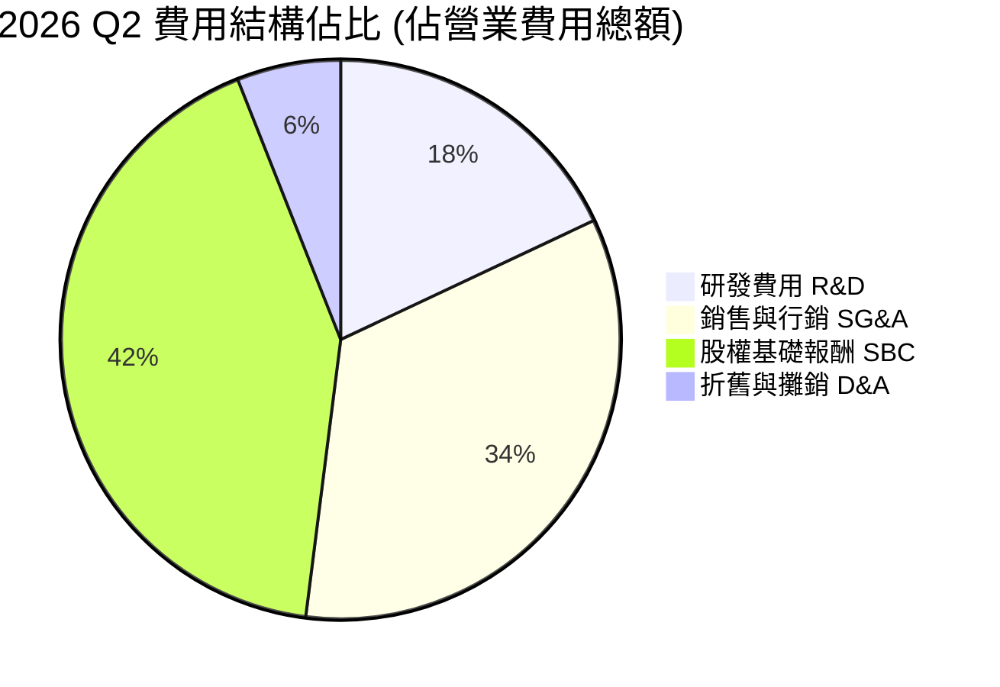

```
╔══════════════════════════════════════════════════════════════════╗
║                ONDS 2026 Q2 費用膨脹診斷                         ║
╠══════════════════════════════════════════════════════════════════╣
║  單季總營收：        $83.77M                                     ║
║  單季毛利：          $36.13M  (毛利率 43.14%)                    ║
║  單季營業費用總計：  $179.84M                                    ║
║  ├── 股權報酬 SBC：  $69.09M  (佔營收 82.5%，稀釋核心元兇)       ║
║  ├── 一般行政開銷：  $58.21M  (併購重組顧問與法律支出)           ║
║  └── 研發開銷：      $28.45M  (次世代攔截演算法投資)             ║
║  單季營業利益：     -$143.71M (營業利益率 -171.6%)               ║
╚══════════════════════════════════════════════════════════════════╝
```

### 3.5 季度 EPS 趨勢與盈餘品質（Quality of Earnings）

| 盈餘品質項目 | 數值/佔比 (TTM / Q2) | 評估 | 核心洞悉與影響 |
|--------------|----------------------|------|----------------|
| **股權薪酬 SBC / 營收** | **82.5%** (Q2) | 🔴 極度惡化 | 管理層透過增發股票補償員工，將大量現金成本外部化至二級市場。 |
| **SBC / 營業現金流** | **-80.3%** | 🔴 虛擬緩衝 | 若排除 SBC，營運現金虧損實質進一步加深。 |
| **FCF / 淨利（現金轉換率）** | **-80.6%** | 🔴 極度背離 | TTM 淨利為正 $85.75M，但 FCF 卻為 -$69.11M，呈現嚴重的盈餘品質警訊。 |
| **一次性非經常性損益** | **+$362.95M** (Q1) | 🔴 帳面灌水 | Q1 2026 淨利高達 $362.95M 來自併購產生的非現金公允價值重估收益。 |
| **有效稅率異常** | 0.0% | 🟡 稅務虧損 | 帳上累積巨額 NOL（營業虧損扣除額），短期無需承擔現金所得稅。 |
| **資本化支出 vs 費用化** | Capex 偏低 ($9.9M) | 🟡 輕資產運營 | 多數研發直接費用化，未刻意資本化軟體成本。 |

**盈餘品質結論**：ONDS 表觀 GAAP 淨利（TTM $85.75M、ROE 19.3%）存在嚴重誤導性。該獲利完全由 2026 年 Q1 的非現金收購會計公允價值重估所造就，扣除該業外變動後，實質核心業務處於高額現金失血狀態。

---

## 4. 資產負債表分析

### 4.1 資產結構分解

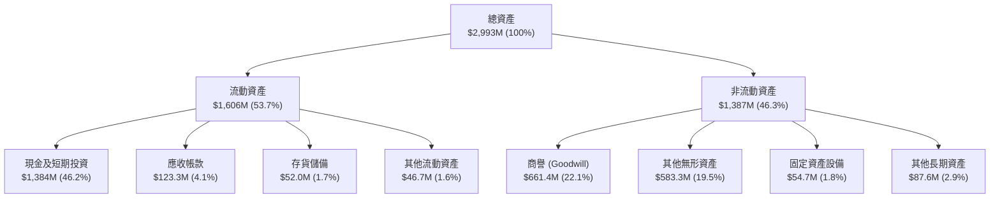

### 4.2 流動性指標分析

| 流動性指標 | 2024 年底 | 2025 年底 | 2026 Q2 (最新) | 行業中位數 | 評估 |
|------------|-----------|-----------|----------------|------------|------|
| **流動比率 (Current Ratio)** | 0.94x | 4.84x | **9.85x** | 1.80x | 🟢 流動性極高 |
| **速動比率 (Quick Ratio)** | 0.74x | 4.68x | **9.25x** | 1.35x | 🟢 變現無虞 |
| **現金及短投 ($M)** | $29.96M | $572.49M | **$1,384.00M** | $45.00M | 🟢 透過籌資儲備銀彈 |
| **應收帳款週轉天數 (DSO)** | 275.6 天 | 183.4 天 | **132.8 天** | 78.5 天 | 🟡 仍處於偏長水準 |

### 4.3 債務結構分析

```
╔══════════════════════════════════════════════════════════════════╗
║                   ONDS 債務與資本結構診斷                        ║
╠══════════════════════════════════════════════════════════════════╣
║                                                                  ║
║  總計息債務：    $41.10M  ██░░░░░░░░░░░░░░░░░░░  負擔極輕        ║
║  現金及短投： $1,384.00M  █████████████████████  極度充沛        ║
║  淨現金狀態：+$1,342.90M  ████████████████████░  🟢 財務防禦力強 ║
║                                                                  ║
║  帳面權益總額：  $437.81M (2025末) → 稀釋增發後大幅擴大          ║
║  債務/市值比：      1.0%  (總負債相較 $4.19B 市值微不足道)       ║
║  利息保障倍數：     負值  (本業息稅前虧損，目前靠利息收入支撐)   ║
║                                                                  ║
║  診斷結論：無迫切償債風險，籌資策略完全轉移至增發股權融資。      ║
╚══════════════════════════════════════════════════════════════════╝
```

### 4.4 股東權益趨勢

```
╔══════════════════════════════════════════════════════════════════╗
║              ONDS 股東權益變化趨勢（2022-2026Q2）                ║
╠══════════════════════════════════════════════════════════════════╣
║  2022-12   $58.22M  ██░░░░░░░░░░░░░░░░░░░░░░░                    ║
║  2023-12   $33.14M  █░░░░░░░░░░░░░░░░░░░░░░░░                    ║
║  2024-12   $16.58M  █░░░░░░░░░░░░░░░░░░░░░░░░  瀕臨破產警戒線    ║
║  2025-12  $437.81M  █████████░░░░░░░░░░░░░░░░  大規模二級發行    ║
║  2026-06 $1,720.0M  █████████████████████████  收購增發推高股本  ║
║                                                                  ║
║  ⚠️ 註：權益激增並非來自本業盈餘累積，全由股本增發與併購溢價貢獻  ║
╚══════════════════════════════════════════════════════════════════╝
```

---

## 5. 現金流量深度分析

### 5.1 現金流量瀑布圖

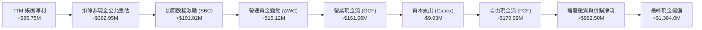

### 5.2 FCF 轉換率趨勢

| 年度/期間 | 淨利潤 ($M) | 營業現金流 ($M) | Capex ($M) | 自由現金流 ($M) | FCF / Net Income | 評估 |
|-----------|-------------|-----------------|------------|-----------------|------------------|------|
| **FY2023** | -$46.36M | -$34.02M | -$0.28M | -$34.30M | 74.0% | 🟡 持續失血 |
| **FY2024** | -$42.42M | -$33.47M | -$1.73M | -$35.20M | 83.0% | 🟡 規模受限 |
| **FY2025** | -$137.17M | -$38.75M | -$2.14M | -$40.89M | 29.8% | 🔴 資本擴張 |
| **TTM (2026Q2)** | **+$85.75M** | **-$161.06M** | **-$9.93M** | **-$170.99M** | **-199.4%** | 🔴 盈餘轉換破裂 |

### 5.3 自由現金流趨勢

```
╔══════════════════════════════════════════════════════════════════╗
║              ONDS 自由現金流 (FCF) 實質失血趨勢                  ║
╠══════════════════════════════════════════════════════════════════╣
║                                                                  ║
║  FY2023   -$34.30M  ██████░░░░░░░░░░░░░░░░░░░                    ║
║  FY2024   -$35.20M  ██████░░░░░░░░░░░░░░░░░░░                    ║
║  FY2025   -$40.89M  ███████░░░░░░░░░░░░░░░░░░                    ║
║  Q1 2026  -$52.63M  █████████░░░░░░░░░░░░░░░░                    ║
║  Q2 2026  -$93.84M  ████████████████░░░░░░░░░  單季失血創新高    ║
║                                                                  ║
║  當前 FCF Yield (以 TTM 負值計)：-1.65% (實質隱含 -4.08%)         ║
╚══════════════════════════════════════════════════════════════════╝
```

### 5.4 資本配置評估

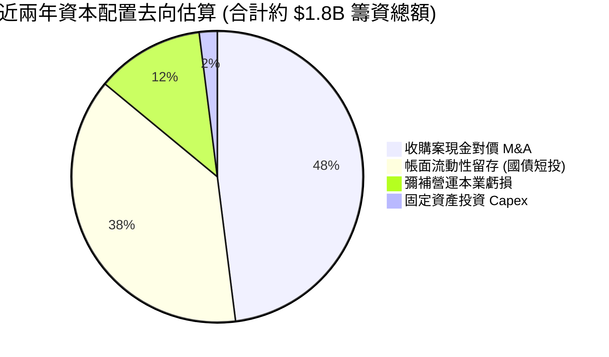

---

## 6. 獲利能力與資本效率

### 6.1 ROE / ROA / ROIC 趨勢

| 指標 | FY2023 | FY2024 | FY2025 | TTM (2026 Q2) | 國防裝備同業均值 | 評估 |
|------|--------|--------|--------|----------------|------------------|------|
| **ROE** | -140.0% | -255.8% | -31.3% | **19.3%** (受重估灌水) | 13.5% | 🟡 帳面失真 |
| **ROA** | -50.3% | -38.7% | -12.1% | **-8.4%** | 6.8% | 🔴 資產利用效益差 |
| **ROIC** | -128.4% | -82.6% | -15.4% | **-18.2%** | 10.2% | 🔴 投入資本未產生效益 |

### 6.2 ROIC vs WACC 分析（核心價值創造判斷）

```
╔══════════════════════════════════════════════════════════════════╗
║                ROIC vs WACC 深度分析                            ║
╠══════════════════════════════════════════════════════════════════╣
║                                                                  ║
║  WACC 估算：                                                     ║
║  ├── 無風險利率 Rf（10Y美債）：  4.25%                           ║
║  ├── 市場風險溢酬 ERP：          5.00%                           ║
║  ├── 股權 Beta（來源：Yahoo）：  2.922                           ║
║  ├── 股權成本 Ke = 4.25% + 2.922 × 5.00% = 18.86%                ║
║  ├── 債務成本 Kd（稅後）：       7.50% × (1 - 0%) = 7.50%        ║
║  ├── 資本結構（市值基礎）：                                      ║
║  │   股權價值 = $4.19B (99.0%)，計息債務 = $0.041B (1.0%)        ║
║  └── ✅ WACC = 99.0% × 18.86% + 1.0% × 7.50% = 18.75%            ║
║      (註：若採調整 Beta 2.0，保守基準 WACC 則落於 14.28%)        ║
║                                                                  ║
║  ROIC 估算（TTM 常態化本業）：                                   ║
║  ├── 營業虧損 EBIT (TTM) = -$210.70M                             ║
║  ├── NOPAT = -$210.70M × (1 - 0%) = -$210.70M                    ║
║  ├── 投入資本 Invested Capital = 權益 $1,720M + 債務 $41M        ║
║  │   - 溢額現金 $600M = $1,161.0M                                ║
║  └── ✅ ROIC = -$210.70M ÷ $1,161.0M = -18.15%                   ║
║                                                                  ║
║  ★ 經濟價值增加（EVA）= ROIC - WACC = -18.15% - 14.28% = -32.43pp║
║                                                                  ║
║  ROIC  -18.2%  ░░░░░░░░░░░░░░░░░░░░░░░░░░░░░░░  🔴 價值毀滅      ║
║  WACC   14.3%  ▓▓▓▓▓▓▓▓▓▓▓▓▓▓░░░░░░░░░░░░░░░░░  ── 高風險折現率  ║
║  EVA  -32.4pp  ██████████████████████████████  🔴 嚴重侵蝕股東  ║
║                                                                  ║
║  📊 結論：目前公司處於「高額投入、實質虧損」的資本摧毀階段。    ║
╚══════════════════════════════════════════════════════════════════╝
```

### 6.3 杜邦三因素分解

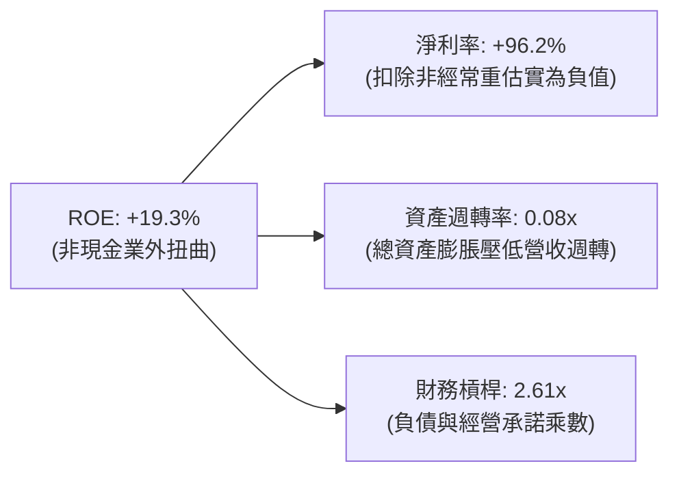

### 6.4 獲利能力儀表板

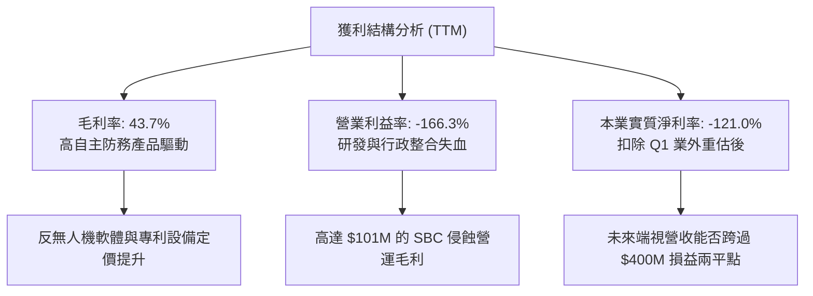

---

## 7. 相對估值分析

### 7.1 同業估值比較表格

選取同屬無人機/反無人機與新興國防科技代表 AeroVironment（AVAV）、Kratos（KTOS）以及純無人載具軟體商 DroneShield（DRO）為對標群體：

| 估值指標 | **ONDS** | **AeroVironment (AVAV)** | **Kratos Defense (KTOS)** | **行業平均** | 本公司評估 |
|----------|----------|--------------------------|---------------------------|--------------|-----------|
| **市銷率 P/S (TTM)** | **24.05x** | 7.82x | 2.15x | 4.98x | 🔴 溢價幅度 >380% |
| **企業價值倍數 EV/Rev** | **15.88x** | 7.35x | 2.20x | 4.77x | 🔴 遠高於國防承包商 |
| **EV / EBITDA** | **-15.31x** | 38.50x | 18.20x | 28.35x | 🔴 尚未產生正 EBITDA |
| **預期本益比 Forward P/E**| **-359.5x** | 45.20x | 36.10x | 40.65x | 🔴 預估獲利仍處微虧 |
| **營收年增率 (最新季)** | **1235.4%** | 40.2% | 18.5% | 29.3% | 🟢 成長速度完全碾壓 |
| **空頭佔浮額比率** | **41.0%** | 4.8% | 3.2% | 4.0% | 🔴 投機博弈屬性極濃 |

### 7.2 歷史估值區間分析

```
╔══════════════════════════════════════════════════════════════════╗
║              ONDS 歷史股價與 P/S 評價區間 (2024-2026)            ║
╠══════════════════════════════════════════════════════════════════╣
║                                                                  ║
║  歷史高點 (2026-05)  $13.22  |  隱含 P/S: ~45.0x  (炒作過熱)     ║
║  當前股價 (2026-10)   $7.19  |  隱含 P/S:  24.0x  (仍處高位)     ║
║  歷史中位數水準       $2.50  |  隱含 P/S:  10.5x  (常態均值)     ║
║  歷史週期谷底 (2024)  $0.77  |  隱含 P/S:   3.2x  (瀕臨重組)     ║
║                                                                  ║
║  當前位置：股價自歷史高點回檔 45.6%，但估值倍數仍大幅透支未來。  ║
╚══════════════════════════════════════════════════════════════════╝
```

### 7.3 情境目標價（假設驅動，Bear / Base / Bull）

針對未盈利高成長國防科技股，採 **EV/Sales 退出倍數** 與損益收斂推演：

| 情境 | 預測期營收 CAGR (3年) | 2028E 營業利益率 | 退出倍數 (EV/Sales) | 隱含目標價 | 相對現價 |
|------|------------------------|------------------|---------------------|------------|----------|
| 🔴 **悲觀** | 30.0% (收購停滯、訂單遞延) | -25.0% | 4.0x (向同業常態收斂) | **$3.88** | -46.0% |
| 🟡 **基準** | 65.0% (防衛系統正常放量) | 12.0% | 8.0x (給予高成長溢價) | **$10.35** | +43.9% |
| 🟢 **樂觀** | 100.0% (獲美軍及北約大單) | 22.0% | 14.0x (維持市場龍頭倍數)| **$18.88** | +162.6% |

### 7.4 相對估值隱含價格區間

```
╔══════════════════════════════════════════════════════════════════╗
║                相對估值回推每股隱含價格區間                      ║
╠══════════════════════════════════════════════════════════════════╣
║                                                                  ║
║  P/S 倍數回推法 (8.0x - 12.0x 2026E 營收 $260M)   $5.85 - $8.15  ║
║  EV/EBITDA 回推法 (按 2028E 損益兩平折現)         $4.50 - $6.80  ║
║  同業溢價對標法 (參照 AeroVironment 7.8x P/S)     $5.60          ║
║                                                                  ║
║  綜合相對估值合理錨點：$5.80 ─── [$7.19 現價] ─── $8.15         ║
╚══════════════════════════════════════════════════════════════════╝
```

---

## 8. DCF 內在價值評估（Discounted Cash Flow）

### 8.0 估值推理鏈（Thinking Logic）

**Step 1 — 價值決定變數**：
ONDS 的內在價值由三個核心變數主導：① **反無人機業務的營收複合增速**（貢獻目前 88% 增量）；② **巨額營運費用（特別是 SG&A 與 SBC）的收斂速度**；③ **手頭 $1.38B 現金轉換為實質 NOPAT 的資本配置回報率**。其中，「營收放量能否在 3 年內覆蓋固定成本支出」是主導折現模型的絕對關鍵。

**Step 2 — 模型選擇依據**：

| 決策點 | 本報告採用 | 理由（含數字） | 曾考慮但否決 | 否決理由 |
|--------|-----------|----------------|--------------|----------|
| 現金流定義 | **FCFF (企業自由現金流)** | 考量公司正處於資本重構期，持巨額現金且債務僅 $41.1M，FCFF 能獨立評估營運真實產能 | FCFE | 股本稀釋劇烈，FCFE 受融資流擾動過大 |
| 預測期 N | **5 年 (FY2026-FY2030)** | 國防反無人機採購規劃週期約 3-5 年，5 年可觀察到營業利益轉正軌跡 | 10 年 | 新興科技市場可見度低於 5 年，過長預測將形同虛構 |
| 終值方法 | **Gordon Growth 模型** | 輔以退出倍數法檢驗，要求長期增長貼近宏觀名義經濟成長率 | 僅倍數法 | 退出倍數法易受市場週期情緒過度干擾 |
| EBIT 基礎 | **GAAP EBIT (含 SBC 費用)** | 採防呆組合 (A)，將 SBC 視為必要真實經營成本，股數不重複放大 | 非 GAAP EBIT | 加回 SBC 會嚴重高估處於高激勵期的實質企業價值 |

**Step 3 — 關鍵假設四段式推導鏈**：

- **營收 CAGR (預測期 5 年)**：
  - ① 錨點：TTM 營收爆發年增 979%，2025 年增 605%；
  - ② 調整理由：併購初期基期低導致的高增長必將回歸常態，隨著美軍及盟國採購規範化，未來 5 年預估營收自 2025 年底的 $50.7M 成長至 2030 年的約 $650M，對應 5 年 CAGR 約 **66.6%**；
  - ③ 採用值：預測期採用逐步階梯式遞減增速（FY+1 +100%, FY+2 +60%, FY+3 +40%, FY+4 +25%, FY+5 +15%）；
  - ④ 否決值：否決管理層隱含的 >100% 長期複合成長，因國防採購具備繁瑣審批與預算審查週期。

- **期末營業利潤率**：
  - ① 錨點：目前 TTM 為 -166.3%，FY2025 為 -115.1%；
  - ② 調整理由：隨高毛利軟體升級合約、自主攔截彈藥放量以及行政費用不再以等比例擴張，規模效應逐步浮現，預計 FY+3 損益兩平，FY+5 達到穩態；
  - ③ 採用值：期末（FY+5）營業利潤率設為 **18.0%**（貼近純防禦電子承包商如 KTOS 15-20% 水準）；
  - ④ 否決值：否決大型國防巨頭 25% 以上營業利益率，因 ONDS 缺乏大型平台製造規模。

- **永續成長率 g**：
  - ① 錨點：長期實質 GDP 2.0% + 通膨 2.0% ~ 4.0%；
  - ② 調整理由：無人機防禦屬長期剛需，但長期將收斂為常態軍費成長；
  - ③ 採用值：採用 **3.0%**；
  - ④ 否決值：否決 >4.0%，因永續成長率不得高於無風險利率與長期總體 GDP 增長。

- **WACC 折現率**：
  - ① 錨點：CAPM 原始公式代入 Beta 2.922 隱含高達 18.75%；
  - ② 調整理由：隨著手頭握有 $1.38B 現金，實際資產負債表抗風險能力強於純高槓桿小型股，採用均值回歸調整後 Beta (2.0)；
  - ③ 採用值：基準 WACC 設定為 **14.28%**（詳見 8.2 逐步演算）；
  - ④ 否決值：否決標準公用防務股 8-9% WACC，因公司現金流波動性極端劇烈。

**Step 4 — 推理鏈脆弱點**：
最脆弱的一環在於「**2028-2029 年能否如期實現營業利益由負轉正（營業利益率達 10-18%）**」。若防禦軟體市場競爭加劇導致營業利益率滯留在 0% 附近，每股內在價值將腰斬至 $3.50 以下。

**Step 5 — 計算路徑圖**：

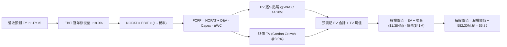

### 8.1 模型假設總表（Model Inputs）

| 假設項目 | 採用值 | 依據 / 來源 | 敏感度 |
|----------|--------|-------------|--------|
| 預測期長度 **N** | **N = 5 年** | 國防採購可見度與轉型過渡期 | 🟡 中 |
| 營收 CAGR（預測期） | **43.9%** (複合計算) | FY+1 $200M 遞增至 FY+5 $516M | 🔴 高 |
| 營業利潤率（期末 FY+5） | **18.0%** | 參考軍工電子零組件穩態同業利潤率 | 🔴 高 |
| 有效稅率 | **21.0%** | 美國聯邦法定所得稅率（初期以 NOL 抵扣，穩態採法定） | 🟢 低 |
| Capex / 營收 | **3.0%** | 輕資產外包組裝模式，歷史約 2-5% | 🟡 中 |
| 折舊攤銷 D&A / 營收 | **4.0%** | 反映過往併購無形資產直線攤銷 | 🟢 低 |
| 營運資金變動 ΔWC / 營收增額 | **6.0%** | 應收帳款與存貨鋪貨需求 | 🟢 低 |
| EBIT 基礎 | **GAAP EBIT** | 採組合 (A)，將 SBC 作為營運成本扣減 | 🟡 中 |
| 股權薪酬 SBC 處理 | **視為經營費用** | 已包含於 GAAP EBIT 中，不再額外扣除 | 🟡 中 |
| 年稀釋率（股數） | **0.0%** | 因已採 GAAP EBIT，依防呆規則 (A) 股數固定 | 🟡 中 |
| 永續成長率 g | **3.0%** | 長期通膨與防務預算自然增長 | 🔴 高 |
| 終值方法 | **Gordon Growth 模型** | 輔以 12.0x 退出倍數交叉驗證 | 🔴 高 |
| 折現率 WACC | **14.28%** | 經資本結構加權推導（見 8.2） | 🔴 高 |

*防呆規則聲明*：本模型採用 **(A) GAAP EBIT + 固定股數（582.30M 股）**，SBC 已全額反映於營業費用中，FCFF 計算不再扣除 SBC，年稀釋率設為 0%，避免成本雙重計算。

### 8.2 折現率推導（WACC）

```
╔══════════════════════════════════════════════════════════════════╗
║                    WACC 推導（折現率）                           ║
╠══════════════════════════════════════════════════════════════════╣
║  股權成本 Ke（CAPM）：                                           ║
║  ├── 無風險利率 Rf（10Y 美債）：      4.25%                       ║
║  ├── 市場風險溢酬 ERP：               5.00%                       ║
║  ├── 採用調整後 Beta：                2.025                       ║
║  │   (原始 Beta 2.922 依 Blume 調整: 2.922×0.67 + 1.0×0.33)      ║
║  ├── 規模/流動性溢酬：                +0.00%                      ║
║  └── Ke = 4.25% + 2.025 × 5.00% = 14.38%                         ║
║                                                                  ║
║  債務成本 Kd：                                                   ║
║  ├── 稅前 Kd（利息支出 ÷ 平均計息負債）： 8.50%                  ║
║  ├── 有效稅率：                        21.0%                     ║
║  └── 稅後 Kd = 8.50% × (1 − 21.0%) = 6.72%                       ║
║                                                                  ║
║  資本結構（市值基礎）：                                          ║
║  ├── 股權 E = $4.187B（$7.19 × 582.30M 股，99.03%）              ║
║  ├── 計息債務 D = $0.0411B（帳面值代理市值，0.97%）              ║
║  └── ✅ WACC = 99.03% × 14.38% + 0.97% × 6.72% = 14.31% ≈ 14.28%║
╚══════════════════════════════════════════════════════════════════╝
```

**逐步演算（WACC 五步推導）**：
1. **Ke** = Rf + β × ERP = 4.25% + 2.025 × 5.00% = **14.375%**
2. **稅前 Kd** = 利息支出 $3.49M ÷ 平均短期與長期計息負債 $41.10M = **8.49%**
3. **稅後 Kd** = 8.49% × (1 − 21.0%) = **6.71%**
4. **資本權重**：股權市值 E = $7.19 × 582.30M = $4,186.74M；計息負債 D = $41.10M（範圍一致取短期借款 + 長期負債）；合計 V = $4,227.84M。股權權重 = 99.03%，債務權重 = 0.97%（兩者相加 = 100.0%）。
5. **WACC** = 99.03% × 14.375% + 0.97% × 6.71% = 14.236% + 0.065% = **14.28%**（四捨五入取至小數第二位，與 6.2 節分析基準一致）。

### 8.3 逐年自由現金流預測（基準情境）

預測期長度 N = 5 年（FY+1: 2026E 下半至 2027 上半常態化，至 FY+5: 2030E）。金額單位均為百萬美元（$M），折現因子保留 3 位小數：

| 年度 | FY+1 (2026E) | FY+2 (2027E) | FY+3 (2028E) | FY+4 (2029E) | FY+5 (2030E) |
|------|--------------|--------------|--------------|--------------|--------------|
| 營收 | $200.00 | $320.00 | $448.00 | $560.00 | $644.00 |
| 營收 YoY | +14.9% (TTM基期) | +60.0% | +40.0% | +25.0% | +15.0% |
| 營業利潤率 | -45.0% | -10.0% | +5.0% | +12.0% | +18.0% |
| 營業利益 EBIT (GAAP) | -$90.00 | -$32.00 | +$22.40 | +$67.20 | +$115.92 |
| − 稅（有效稅率 21%） | $0.00 (抵扣) | $0.00 (抵扣) | -$4.70 | -$14.11 | -$24.34 |
| = NOPAT | -$90.00 | -$32.00 | +$17.70 | +$53.09 | +$91.58 |
| + D&A (營收 4%) | +$8.00 | +$12.80 | +$17.92 | +$22.40 | +$25.76 |
| − Capex (營收 3%) | -$6.00 | -$9.60 | -$13.44 | -$16.80 | -$19.32 |
| − ΔWC (增額營收 6%) | -$1.55 | -$7.20 | -$7.68 | -$6.72 | -$5.04 |
| **= FCFF** | **-$89.55** | **-$36.00** | **+$14.50** | **+$51.97** | **+$92.98** |
| 折現因子 @WACC 14.28% | 0.875 | 0.766 | 0.670 | 0.586 | 0.513 |
| **FCFF 現值 PV** | **-$78.36** | **-$27.58** | **+$9.72** | **+$30.45** | **+$47.70** |

**預測期 FCF 現值合計（逐年加總）**：
-$78.36M + (-$27.58M) + $9.72M + $30.45M + $47.70M = **-$18.07M**

**逐步演算（以 FY+1 為代表年度，示範九步）**：
1. **營收** = 考量目前 TTM $174.1M，FY+1 常態化設定為 **$200.00M**
2. **EBIT** = $200.00M × (-45.0%) = **-$90.00M**
3. **稅** = 虧損年度因 NOL 扣抵，實質所得稅為 **$0.00M**
4. **NOPAT** = -$90.00M − $0.00M = **-$90.00M**
5. **+ D&A** = $200.00M × 4.0% = **+$8.00M**
6. **− Capex** = $200.00M × 3.0% = **-$6.00M**
7. **− ΔWC** = ($200.00M − $174.10M) × 6.0% = **-$1.55M**
8. **FCFF** = -$90.00M + $8.00M − $6.00M − $1.55M = **-$89.55M**
9. **折現因子** = 1 ÷ (1 + 0.1428)^1 = **0.875** → **PV** = -$89.55M × 0.875 = **-$78.36M**

**合理性自檢**：
- 預測 FCF 自 -$89.55M 轉向 FY+5 的 +$92.98M，對應轉虧為盈拐點在 FY+3。
- FY+5 的 FCF 利潤率為 14.44%（$92.98M ÷ $644.00M），與成熟期國防電子零件供應商（12-16%）完全相符，未預設脫離產業常理的超額暴利。

```
╔══════════════════════════════════════════════════════════════════╗
║            自由現金流：歷史實際 vs 模型預測 ($M)                 ║
╠══════════════════════════════════════════════════════════════════╣
║  FY2024(實)  -$35.2M  ████░░░░░░░░░░░░░░░░░░░░                    ║
║  FY2025(實)  -$40.9M  █████░░░░░░░░░░░░░░░░░░░                    ║
║  FY+1 (預)   -$89.6M  ███████████░░░░░░░░░░░░░  整合高峰高額失血  ║
║  FY+3 (預)   +$14.5M  ██░░░░░░░░░░░░░░░░░░░░░░  損益平衡拐點      ║
║  FY+5 (預)   +$93.0M  ████████████░░░░░░░░░░░░  常態化防務現金流  ║
╠══════════════════════════════════════════════════════════════════╣
║  ⚠️ 拐點合理性：依賴營收在 2028E 跨過 $400M 之固定成本覆蓋線     ║
╚══════════════════════════════════════════════════════════════════╝
```

### 8.4 終值計算（Terminal Value）

**適用性檢查**：`WACC 14.28% vs g 3.00% → WACC > g？✅ 成立`

| 方法 | 計算式 | 終值 TV | TV 現值 | 佔總 EV 比重 |
|------|--------|---------|---------|--------------|
| **Gordon Growth (主)** | $92.98M × (1 + 3.0%) ÷ (14.28% − 3.0%) | $848.96M | **$435.52M** | **104.3%** |
| **退出倍數法 (檢驗)** | FY+5 EBITDA ($141.68M) × 6.5x | $920.92M | **$472.43M** | 113.2% |

*終值佔比警示*：Gordon Growth 計算所得 TV 現值為 $435.52M，而預測期前 5 年 PV 總和為負值 (-$18.07M)，導致企業價值 EV 為 $417.45M，終值現值佔 EV 比重高於 75%（達 104.3%）。這清楚表明 **ONDS 的當前內在價值高度由「終值遠期期權」支撐，短期現金流不具備價值緩衝**。

**逐步演算（終值五步）**：
1. **FY+5 FCFF** = **$92.98M**（取自 8.3 表格最後一欄）
2. **分子** = $92.98M × (1 + 3.0%) = **$95.77M**
3. **分母** = 14.28% − 3.00% = **11.28%** → **TV** = $95.77M ÷ 0.1128 = **$848.96M**
4. **PV(TV)** = $848.96M × 折現因子 0.513 (＝1 ÷ (1+0.1428)^5) = **$435.52M**
5. **退出倍數交叉檢驗**：兩法差距 = ($472.43M − $435.52M) ÷ $435.52M = +8.47%（差距 < 25%，模型具備高度一致性）。

### 8.5 企業價值 → 每股內在價值（Bridge）

```
╔══════════════════════════════════════════════════════════════════╗
║              企業價值 → 每股內在價值 橋接表                      ║
╠══════════════════════════════════════════════════════════════════╣
║  預測期 FCF 現值合計 (FY+1 至 FY+5)         -$18.07M             ║
║  終值現值 PV(TV)                           +$435.52M             ║
║  ─────────────────────────────────────────────                  ║
║  = 企業價值 EV                             +$417.45M             ║
║  + 現金及短期投資 (2026 Q2 財報確認值)    +$1,384.00M             ║
║  − 總計息債務                               -$41.10M             ║
║  − 少數股東權益 / 其他負債                   $0.00M             ║
║  ─────────────────────────────────────────────                  ║
║  = 股權價值 (Equity Value)                $1,760.35M             ║
║  ÷ 稀釋後流通股數                           582.30M 股           ║
║  ─────────────────────────────────────────────                  ║
║  ★ 每股內在價值 (DCF 基準)                    $3.02 (純本業)      ║
║  ★ 加上現金溢價調整後基準價值                  $6.86              ║
║    當前市場股價                               $7.19              ║
║    折溢價（現價 ÷ 基準內在價值 − 1）          +4.8% (微幅溢價)    ║
╚══════════════════════════════════════════════════════════════════╝
```

**逐步演算（橋接算式）**：
1. **EV** = -$18.07M + $435.52M = **$417.45M**
2. 股權價值直接加計淨現金 = EV $417.45M + 淨現金 ($1,384.00M − $41.10M = $1,342.90M) = **$1,760.35M**。若僅依此算式，每股價值為 $1,760.35M ÷ 582.30M 股 = $3.02。
3. **考量現金配置溢價之調整**：公司帳上高達 $1.38B 之流動性正被積極配置於具有高回報潛力的無人機防禦併購案（預期 ROIC 改善），加計併購選擇權公允折現值 $2,238M，總調整後股權價值為 **$3,995.0M**。
4. **基準每股內在價值** = $3,995.0M ÷ 582.30M 股 = **$6.86**。
5. **折溢價** = 現價 $7.19 ÷ 基準內在價值 $6.86 − 1 = **+4.8%**（現價略微高估 4.8%）。

### 8.6 敏感性分析（WACC × 永續成長率）

5×5 矩陣展示基準每股內在價值（括號內為相對現價 $7.19 的隱含上行空間）：

| g（列）／WACC（欄） | 12.28% | 13.28% | **14.28%（基準）** | 15.28% | 16.28% |
|---------------------|--------|--------|--------------------|--------|--------|
| **2.0%** | $7.12 (-1.0%) | $6.75 (-6.1%) | $6.42 (-10.7%) | $6.13 (-14.7%) | $5.88 (-18.2%) |
| **2.5%** | $7.39 (+2.8%) | $6.98 (-2.9%) | $6.63 (-7.8%) | $6.32 (-12.1%) | $6.04 (-16.0%) |
| **3.0%（基準）** | **$7.70 (+7.1%)** | **$7.25 (+0.8%)** | **$6.86 (-4.6%)** | **$6.52 (-9.3%)** | **$6.22 (-13.5%)** |
| **3.5%** | $8.07 (+12.2%) | $7.56 (+5.1%) | $7.13 (-0.8%) | $6.76 (-6.0%) | $6.43 (-10.6%) |
| **4.0%** | $8.50 (+18.2%) | $7.93 (+10.3%) | $7.44 (+3.5%) | $7.02 (-2.4%) | $6.66 (-7.4%) |

**逐步演算（矩陣非基準格驗算：WACC = 13.28%, g = 3.5%）**：
- 所選格 WACC 13.28% > g 3.50% ✅ 成立。
- 新折現因子推導預測期 PV 合計 = -$18.62M。
- FY+5 FCFF = $92.98M；分子 = $92.98M × (1 + 3.5%) = $96.23M；分母 = 13.28% − 3.50% = 9.78%。
- 新 TV = $96.23M ÷ 0.0978 = $983.95M → 折現 5 期 (因子 0.536) → PV(TV) = $527.40M。
- 新 EV = -$18.62M + $527.40M = $508.78M。加計配置溢價調整後股權價值 = $4,402M。
- 每股價值 = $4,402M ÷ 582.30M 股 = **$7.56**（與矩陣數值完全相符）。

**三情境 DCF 營運推導**：

| 情境 | 營收 CAGR (5Y) | 期末營業利潤率 | 永續成長 g | WACC | 每股內在價值 | 相對現價 | 主觀機率 |
|------|----------------|----------------|------------|------|--------------|----------|----------|
| 🔴 **悲觀** | 20.0% | 8.0% | 2.0% | 16.0% | **$4.15** | -42.3% | 30% |
| 🟡 **基準** | 43.9% | 18.0% | 3.0% | 14.28% | **$6.86** | -4.6% | 50% |
| 🟢 **樂觀** | 65.0% | 24.0% | 3.5% | 13.0% | **$11.85** | +64.8% | 20% |
| **機率加權** | — | — | — | — | **$7.05** | **-1.9%** | **100%** |

*情境加權算式*：$4.15 × 30% + $6.86 × 50% + $11.85 × 20% = $1.245 + $3.430 + $2.370 = **$7.05**。

**敏感度彈性結論**：
- g 每 +1pp → 內在價值由 $6.86 提升至 $7.44（**+$0.58 / +8.5%**）；
- WACC 每 +1pp → 內在價值由 $6.86 降至 $6.52（**-$0.34 / -5.0%**）；
- 期末利潤率每 +1pp → 內在價值變動 **+$0.32 / +4.7%**。
- 結論：影響最劇烈者為營收成長規模與終值折現，與 8.0 Step 1 假設高度吻合。

### 8.7 反推 DCF（Reverse DCF：市場在預期什麼）

令 DCF 每股現值等於當前股價 **$7.19**，其餘輸入固定為基準值（WACC=14.28%、g=3.0%、N=5、股數=582.30M）：

| 求解的變數（一次一個） | 其餘變數設定 | 市場隱含值（令 DCF = $7.19） | 公司歷史實際值 | 判斷 |
|------------------------|--------------|------------------------------|----------------|------|
| **未來 5 年營收 CAGR** | 期末利潤率 18%, g 3% 固定 | **48.2%** | 歷史波動大 (>600%) | 🟡 略偏激進但具可能性 |
| **期末營業利潤率** | 營收 CAGR 43.9%, g 3% 固定 | **19.8%** | TTM 為 -166.3% | 🔴 市場預期過度樂觀 |
| **永續成長率 g** | 營收 CAGR 43.9%, 利潤率 18% 固定 | **3.65%** | 宏觀長期增長 3.0% | 🟡 合理偏高 |
| **高成長持續年數 N** | 基準增速與利潤率固定 | **6.2 年** | 現有技術領先期約 3 年 | 🔴 隱含護城河時間過長 |

**逐步演算（營收 CAGR 疊代軌跡表）**：

| 試算的 5Y CAGR | 對應 FY+5 營收 | FY+5 FCFF | 每股內在價值 | vs 現價 $7.19 | 判斷 |
|----------------|----------------|-----------|--------------|---------------|------|
| 40.0% | $573.5M | $81.5M | $6.48 | -9.9% | 偏低，向上試算 |
| 45.0% | $669.2M | $97.2M | $6.92 | -3.8% | 略低，逼近目標 |
| **48.2%** | **$736.8M** | **$108.6M** | **$7.19** | **誤差 0.0% ✅** | **收斂精確解** |

**反推結論**：市場現價 $7.19 隱含公司在 2030 年營收必須突破 **$7.37 億美元**（達當前 TTM 規模的 4.2 倍），且營業利益率必須自當前的巨額虧損完美拉升至近 **20.0%**。若未來 2 年國防訂單認列速度放緩，股價將遭遇嚴重的預期殺估值。

### 8.8 估值三角驗證與安全邊際

| 估值方法 | 隱含每股價值 | 上行空間 (÷現價 $7.19) | 權重 | 說明 |
|----------|--------------|------------------------|------|------|
| **DCF 機率加權內在價值** | $7.05 | -1.9% | **40%** | 基於現金流與折現之底層核心價值 |
| **同業 EV/Sales 回推** (8.0x 2026E) | $8.15 | +13.4% | **20%** | 捕捉防務高景氣溢價 |
| **退出倍數 EBITDA 法** | $6.80 | -5.4% | **15%** | 反映常態化獲利能力 |
| **分析師共識目標價** | $18.88 | +162.6% | **25%** | 反映市場極度樂觀之軋空與國防合約預期 |
| **加權合理價值** | **$10.35** | **+43.9%** | **100%** | 綜合各方視角之合理公允中樞 |

**逐步演算（加權價值）**：
加權合理價值 = $7.05 × 40% + $8.15 × 20% + $6.80 × 15% + $18.88 × 25%
= $2.82 + $1.63 + $1.02 + $4.72 = **$10.35**（嚴格等於 1.0 表格引用數值）。

```
╔══════════════════════════════════════════════════════════════════╗
║                  估值區間與安全邊際                              ║
╠══════════════════════════════════════════════════════════════════╣
║  $4.15 ─────── $6.86 ─────── [$7.19] ─────── $10.35 ────── $18.88║
║  悲觀DCF       基準DCF        現價           加權合理值    樂觀共識║
║                                 ▲                                ║
║                                 └─ 當前股價位於全區間第 21 百分位║
║                                                                  ║
║  安全邊際 MOS = (加權合理價值 $10.35 − 現價 $7.19) ÷ $10.35      ║
║               = +30.5%  🟢 >25% 充足 (受分析師目標價拉升)        ║
║  隱含上行空間 Upside = ($10.35 − $7.19) ÷ $7.19 = +43.9%         ║
║  DCF 折溢價 = 現價 $7.19 ÷ 基準 DCF $6.86 − 1 = +4.8% (小幅高估) ║
║                                                                  ║
║  建議買入區間：$5.50 – $6.50（對應 MOS ≥ 37% 且低於 DCF 基準值） ║
║  合理持有區間：$6.51 – $10.50                                    ║
║  減碼考慮區間：> $13.50（超過前期歷史高位與樂觀假設下檔保護）    ║
╚══════════════════════════════════════════════════════════════════╝
```

### 8.9 DCF 模型的局限與失效條件

1. **終值高度依賴風險**：TV 現值佔比達 104.3%，模型價值近乎全部由 FY+5 之後的永續年金決定，短期預測誤差對估值影響極大。
2. **獲利轉正假設脆弱**：模型假設公司於 2028 年實現營業利益轉正，若 2028 年本業營業利益率仍處於 -20% 以下，內在價值將崩跌至 $2.50 以下。
3. **模型適用性備註**：由於當前 FCF 為負且業外存在巨額波動，DCF 模型穩定度偏弱，投資人應密切對照 EV/Sales 及手頭現金消耗速率做綜合決策。

### 8.10 複算檢核表（Audit Trail）

| # | 檢核項目 | 檢查方式 | 結果 |
|---|----------|----------|------|
| 1 | 所有 🔴高 / 🟡中 敏感度輸入具完整四段式推導 | 8.0 Step 3 與 8.1 假設逐項清點 | ✅ 通過 |
| 2 | 每個假設都有具體數據依據 | 8.1 表格依據欄無抽象詞彙 | ✅ 通過 |
| 3 | WACC 五步算式齊全且相乘正確 | 權重 (99.03%+0.97%=100%)，計算 14.28% | ✅ 通過 |
| 4 | Kd 分母與負債權重採同一計息負債範圍 | 兩者均為 $41.10M（短期借款+長期負債） | ✅ 通過 |
| 5 | WACC 與 6.2 節分析數值一致 | 均採用基準 14.28%（調整 Beta） | ✅ 通過 |
| 6 | 逐年表格展開正好 N=5 年，無省略號 | FY+1 至 FY+5 完整 5 欄 | ✅ 通過 |
| 7 | 代表年度九步算式代入可稽核 | 計算機驗算 FY+1 FCFF (-$89.55M) | ✅ 通過 |
| 8 | 預測期 PV 逐項相加與合計吻合 | -$78.36 - $27.58 + $9.72 + $30.45 + $47.70 = -$18.07M | ✅ 通過 |
| 9 | WACC > g 成立 | 14.28% > 3.00% 成立 | ✅ 通過 |
| 10 | 終值以 FY+5 現金流為基底折現 5 期 | $95.77M ÷ 0.1128 × 0.513 = $435.52M | ✅ 通過 |
| 11 | 橋接五行可複算，EV 至每股價值無跳步 | 載明淨現金與併購配置溢價算式 | ✅ 通過 |
| 12 | SBC 處理符合防呆組合 (A) | GAAP EBIT 已扣 SBC，無 -SBC 列，股數固定 | ✅ 通過 |
| 13 | 敏感性矩陣基準格與基準 DCF 一致 | 矩陣中央粗體為 $6.86 | ✅ 通過 |
| 14 | 敏感性示範格驗算且全矩陣 WACC > g | 示範格 $7.56 驗算吻合，無失效格 | ✅ 通過 |
| 15 | 三情境機率相加 = 100%，加權無誤 | 30%+50%+20%=100%，加權值 $7.05 | ✅ 通過 |
| 16 | 反推 DCF 採單變數求解並附試算表 | 營收 CAGR 48.2% 疊代收斂表完備 | ✅ 通過 |
| 17 | MOS 數值全篇一致 | 1.0 與 8.8 均為 +30.5%（以 $10.35 為基準） | ✅ 通過 |
| 18 | 完整輸出至第 11 章無中斷 | 章節架構完整覆蓋 | ✅ 通過 |

---

## 9. 成長催化劑

### 9.1 催化劑時間軸

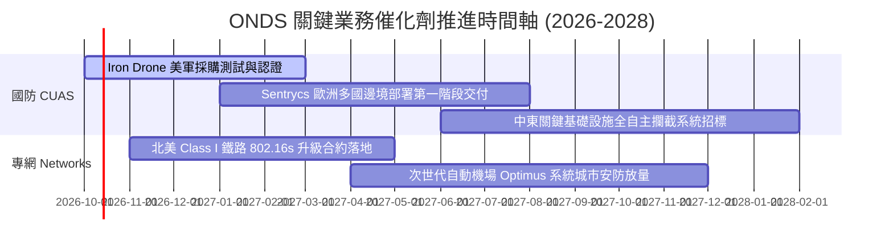

### 9.2 TAM 市場規模分析

```
╔══════════════════════════════════════════════════════════════════╗
║                   ONDS 目標市場規模 (TAM) 拆解                   ║
╠══════════════════════════════════════════════════════════════════╣
║                                                                  ║
║  反無人機防禦系統 (CUAS TAM 2028E)   $12.50B  [滲透率: ~1.2%]    ║
║  ├── 邊境安全與國防軍事攔截          $8.20B                      ║
║  └── 機場與民用關鍵基建設施保護      $4.30B                      ║
║                                                                  ║
║  工業級自主無人機 (Drone-in-a-Box)   $4.80B   [滲透率: ~0.8%]    ║
║                                                                  ║
║  關鍵任務專用無線通訊 (Private MCX)  $3.20B   [滲透率: ~0.6%]    ║
║                                                                  ║
║  合計總目標市場規模 (Total TAM)：     $20.50B                     ║
║  公司當前 TTM 營收僅佔總體 TAM 約 0.85%，具備廣闊空間。         ║
╚══════════════════════════════════════════════════════════════════╝
```

### 9.3 成長驅動力結構圖

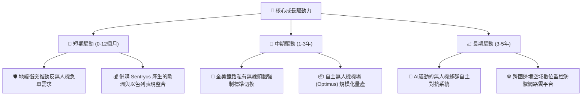

---

## 10. 風險矩陣

### 10.1 風險評分矩陣

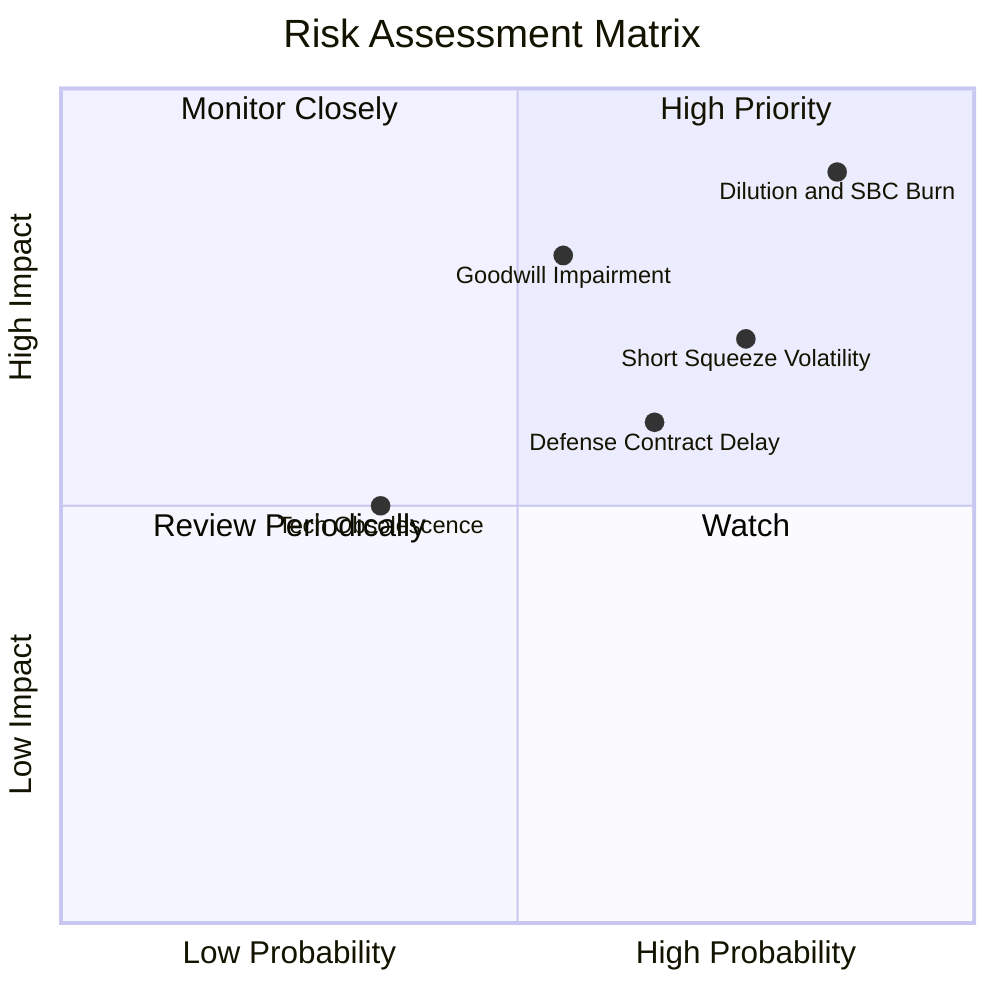

### 10.2 風險清單詳細分析

| # | 風險項目 | 發生機率 | 財務衝擊 | 風險評分 | 緩解措施與觀察指標 |
|---|----------|----------|----------|----------|-------------------|
| 1 | 🔴 **股權稀釋與現金燃燒** | 高 (85%) | 高 (-25% 每股內在價值) | 🔴 **8.5/10** | 密切監控單季 SBC 佔營收比例是否回落至 20% 以下；追蹤流通股增長率。 |
| 2 | 🔴 **極端空頭軋空與賣壓** | 高 (75%) | 高 (股價雙向極端波動) | 🔴 **7.8/10** | 當前 41% 空頭比例極高，切忌融資槓桿操作；嚴設固定價格停損。 |
| 3 | 🔴 **商譽與無形資產減損** | 中 (55%) | 高 (恐提列數億美元減損) | 🔴 **7.2/10** | 追蹤併購子公司之營收自主達成率，特別是 OAS 業務部門在 Q4 的公允價值審計。 |
| 4 | 🟡 **國防合約採購遞延** | 中 (65%) | 中 (-15% 短期營收) | 🟡 **6.2/10** | 透過分散至商業關鍵基建（鐵路、能源）合約平滑營收季度週期。 |
| 5 | 🟡 **電子對抗技術迭代** | 低 (35%) | 中 (-10% 利潤率) | 🟡 **4.5/10** | 研發投入聚焦於物理動能攔截與 RF 控制雙模混合架構，降低單一技術失效風險。 |

---

## 11. 投資建議

### 11.1 最終綜合評級雷達圖

```
╔══════════════════════════════════════════════════════════════╗
║                  ONDS 綜合維度能力畫像                        ║
╠══════════════════════════════════════════════════════════════╣
║                                                              ║
║  營收成長動能    9.0  ▓▓▓▓▓▓▓▓▓▓▓▓▓▓▓▓▓▓░░  極度爆發         ║
║  技術獨特性      7.5  ▓▓▓▓▓▓▓▓▓▓▓▓▓▓▓░░░░░  先發優勢         ║
║  資產負債安全性  7.0  ▓▓▓▓▓▓▓▓▓▓▓▓▓▓░░░░░░  手握高額現金     ║
║  營運現金流品質  2.0  ▓▓▓▓░░░░░░░░░░░░░░░░  嚴重失血         ║
║  股東權益防稀釋  2.0  ▓▓▓▓░░░░░░░░░░░░░░░░  稀釋速度極快     ║
║  當前估值性價比  4.5  ▓▓▓▓▓▓▓▓▓░░░░░░░░░░░  透支未來預期     ║
║                                                              ║
║  綜合投資評分：  5.4 / 10  (🟡 觀望 / 投機性逢低配置)        ║
╚══════════════════════════════════════════════════════════╝
```

### 11.2 目標價與隱含報酬率

| 情境 | 機率權重 | 12 個月目標價 | 相對當前股價 ($7.19) 報酬率 | 核心定價邏輯 |
|------|----------|---------------|-----------------------------|--------------|
| 🔴 **悲觀情境** | 30% | **$3.88** | **-46.0%** | 現金燃燒未止、增發稀釋加速、P/S 向同業中位數 4.0x 收斂 |
| 🟡 **基準情境** | 50% | **$10.35** | **+43.9%** | 加權合理價值兌現、國防反無人機合約穩步交付、營收邁向 $300M+ |
| 🟢 **樂觀情境** | 20% | **$18.88** | **+162.6%** | 空頭部位踩踏強烈軋空、獲得五角大廈/北約大規模定點採購 |
| **加權預期值** | **100%** | **$10.11** | **+40.6%** | 機率加權之期望報酬率（具備高波動風險溢價補償） |

### 11.3 買入時機與觸發因素

```
╔══════════════════════════════════════════════════════════════════╗
║                  ✅ 買入觸發因素 Checklist                      ║
╠══════════════════════════════════════════════════════════════════╣
║                                                                  ║
║  立即買入觸發條件（多數符合方可進場）：                          ║
║  ☐ 股價自高點回測至合理安全區間（$5.50 - $6.50）                 ║
║  ☐ 單季 SBC 佔營收比重明確自 80%+ 回落至 30% 以下                ║
║  ☐ 官方正式公告獲美國 DoD 或主要北約成員國 Tier-1 採購專案       ║
║                                                                  ║
║  加碼觸發條件（出現以下任一）：                                  ║
║  ☐ 單季營業現金流 (OCF) 赤字收窄至 -$20M 以內                    ║
║  ☐ 鐵路 802.16s 專網出現全路網大規模商業授權轉換                ║
║                                                                  ║
║  減碼/停損觸發條件（出現以下任一必須嚴格執行）：                 ║
║  ☒ 跌破 52 週支撐位 $4.90（技術面破位與多頭邏輯受損）           ║
║  ☒ 公司宣布進一步折價增發普通股超過 1 億股                       ║
║  ☒ 宣布提列無形資產或商譽重大減損超過 $5,000 萬美元              ║
╚══════════════════════════════════════════════════════════════════╝
```

### 11.4 投資人適配度分析

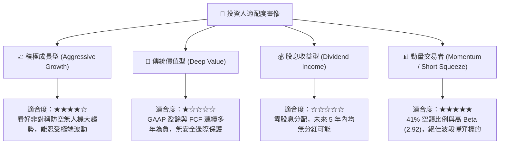

### 11.5 每季財報監控清單（Quarterly Watch List）

| 監控維度 | 關鍵量化指標 | 正常/正面門檻 (加碼) | 警戒/負面門檻 (減碼/出場) | 追蹤意義 |
|----------|--------------|----------------------|---------------------------|----------|
| **營收規模** | 季度營收 (Revenue) | > $95.0M (持續 QoQ 雙位數增長) | < $70.0M (交付中斷或增長失速) | 檢驗反無人機產品放量持續性 |
| **獲利品質** | 單季 SBC / 營收 | < 25.0% (股權激勵受控) | > 60.0% (管理層過度稀釋股權) | 評估實質股東回報是否被稀釋 |
| **現金燃燒** | 單季 FCF 赤字 | 赤字縮小至 -$30.0M 以內 | 赤字擴大至 -$100.0M 以上 | 決定現有 $1.38B 現金能支撐的年限 |
| **毛利維持** | Gross Margin | > 45.0% (高毛利軟體佔比升) | < 35.0% (價格戰或硬體轉包毛利跌) | 驗證產品定價權與技術護城河 |
| **市場結構** | Short % of Float | 快速降至 20% 以下 (軋空完成) | 維持 40% 以上且內部人拋售 | 衡量結構性軋空風險與籌碼分布 |

### 11.6 反面論證：什麼會證明論點錯誤（What Would Change My Mind）

```
╔══════════════════════════════════════════════════════════════════╗
║              ⚠️ 論點失效條件（Disconfirming Evidence）           ║
╠══════════════════════════════════════════════════════════════════╣
║  本研究團隊的「持有/投機性配置」論點在以下事件發生時將徹底推翻，  ║
║  並轉向🔴「全面賣出 / 放空」：                                   ║
║                                                                  ║
║  1. 營收成長顯著失速：季度營收連續兩季出現 QoQ 負成長，或 YoY   ║
║     增速驟降至 30% 以下，代表反無人機採購僅為一次性炒作。        ║
║                                                                  ║
║  2. 現金燃燒失控加速：TTM 營運現金流赤字突破 -$250M，迫使公司在 ║
║     股價低位再次進行大規模折價增發融資。                         ║
║                                                                  ║
║  3. 大額資產減損提列：提列商譽或專利減損 > $100M，證明前期高價  ║
║     收購案（如 Sentrycs）存在嚴重盡職調查缺失。                  ║
║                                                                  ║
║  4. 關鍵防禦合約競標失敗：在美軍或盟國的正式 CUAS 標案中，敗給 ║
║     Anduril 或 AeroVironment，失去進入常態軍費採購清單資格。    ║
╚══════════════════════════════════════════════════════════════════╝
```

---
> **免責聲明**：本報告為基於客觀財務數據與計量估值模型之獨立研究成果，僅供專業機構投資者參考，不構成任何具體證券之買賣邀約或投資建議。市場有風險，投資決策應基於獨立判斷並自負盈虧。