# ONDS 基本面深度分析報告
> **報告日期**：2026-10-09 ｜ **語言**：繁體中文 ｜ **數據來源**：Yahoo Finance, Finviz, StockAnalysis, Roic.ai ｜ **分析師**：CFA 級機構研究

---

## 目錄

| # | 章節 | 核心結論 |
|---|------|----------|
| 1 | 執行摘要 | 評級：買入（投機型成長）｜ 目標價：$13.50（上行空間 +100.6%） |
| 2 | 公司概覽與商業模式 | 無人機反制（CUAS）與私有無線電雙輪驅動，護城河評分 6.8/10 |
| 3 | 損益表深度分析 | TTM 營收爆發 1235.4% 至 $174.10M，但核心營業虧損與高額 SBC 侵蝕盈餘品質 |
| 4 | 資產負債表分析 | 淨現金高達 $1.34B（現金 $1.38B vs 總負債 $41.10M），流動比率 9.85x 極度充裕 |
| 5 | 現金流量深度分析 | 營業現金流 TTM -$161.06M，資本配置轉向重度併購與技術擴張 |
| 6 | 獲利能力與資本效率 | NOPAT 實質為負，ROIC（-13.8%）小於 WACC（14.65%），現階段處於資本消耗期 |
| 7 | 相對估值分析 | EV/Sales 15.88x，相較國防自主系統同業溢價反映 12 倍爆發式成長預期 |
| 8 | DCF 內在價值評估 | 基準每股內在價值 $11.82，加權合理價值 $12.35，安全邊際 MOS 45.5% |
| 9 | 成長催化劑 | 全球空域安防需求激增、國防合約放量、鐵路無線電通訊升級週期 |
| 10 | 風險矩陣 | 空頭部位高達 41.0%、股權稀釋嚴重（SBC 飆升）、合約交付延遲風險 |
| 11 | 投資建議 | 建議分批買入區間 $5.50 - $6.50，停損點設於 $4.80，監控合約轉換率 |

---

## 1. 執行摘要

本報告給予 Ondas Inc.（NASDAQ: ONDS）**「買入（Speculative Buy / 投機型成長）」**投資評級，12 個月基準目標價設定為 **$13.50**。當前股價為 **$6.73**，隱含上行空間為 **+100.6%**。

此評級建立在客觀財務數據的權衡之上：公司營收展現極致爆發力，最新季度 Q2 2026 營收達 $83.77M，YoY 成長率高達 **1235.4%**，帶動 TTM 營收攀升至 **$174.10M**；毛利率從 FY2024 的 4.8% 大幅修復至 TTM 的 **43.7%**。資產負債表極其強固，帳上擁有 **$1.38B** 的現金及短期投資，總負債僅 **$41.10M**，淨現金高達 **$1.34B**，為無人機反制系統（Counter-UAS, CUAS）與自主系統的擴張提供了充沛的防禦護墊。然而，公司獲利含金量仍受壓抑：TTM 營業利益為 **-$210.70M**，Q2 2026 單季股權薪酬（SBC）高達 **$69.09M**，且流通股數年內急遽膨脹至 **582.30M 股**，做空比例高達浮動股的 **41.0%**。經綜合估值三角驗證，加權合理價值為 **$12.35**，相對於現價 $6.73，安全邊際 MOS 達到 **45.5%**，提供實質防禦支撐。

### 1.0 一頁式投資儀表板（Portfolio Manager 30 秒速讀）

| 項目 | 內容 |
|------|------|
| **投資論點（3 句）** | ① 營收動能極致釋放，TTM 營收達 $174.10M（YoY +1235.4%），受惠於地緣政治驅動的 CUAS 軍工剛需。<br/>② 資產負債表堡壘化，帳面淨現金高達 $1.34B，流動比率達 9.85x，消除中短期破產與融資猝死風險。<br/>③ 估值具備對稱性催化，在做空比率達 41.0% 的背景下，合約轉化與現金流改善有望觸發劇烈軋空行情。 |
| **護城河評分** | 6.8/10（專利反無人機電戰技術與鐵路 IEEE 802.16s 無線通訊標準壁壘） |
| **管理層/資本配置評分** | 6.2/10（融資與併購眼光精準，但股權激勵稀釋力度過大，管控紀律待加強） |
| **財務健康** | 🟢 強勁流動性（$1.38B 現金，淨現金 $1.34B，無迫切再融資壓力） |
| **ROIC vs WACC** | -13.8% vs 14.65%（經濟附加價值 EVA 為 -28.45pp，當前處於資本投入摧毀價值階段） |
| **FCF 趨勢** | 持續失血中（TTM FCF 為 -$69.11M，Q2 2026 單季 FCF 為 -$93.84M，FCF Yield 為 -1.76%） |
| **估值** | Forward P/E: -336.5x ｜ EV/Sales: 15.88x ｜ P/S: 22.51x ｜ P/B: 2.27x |
| **DCF 內在價值（基準）** | **$11.82** ｜ 現價折溢價：-43.1%（現價相對 DCF 基準折價 43.1%） |
| **安全邊際（MOS）** | **+45.5%** ＝ ($12.35 加權合理價值 − $6.73) ÷ $12.35 ｜ 🟢 >25% 充足 |
| **預期報酬（基準情境 12M）** | **+100.6%**（目標價 $13.50） |
| **關鍵風險（前二）** | ① 浮動股做空比例高達 41.0%，空頭對盈餘品質與併購整合發動猛烈質疑。<br/>② SBC 激增（Q2 單季 $69.09M）導致股東權益嚴重稀釋，稀釋股數已達 582.30M 股。 |
| **評級 + 信心度** | 🟢 買入（投機型成長） ｜ 信心：中等（基本面爆發 vs 獲利品質赤字） |

### 1.1 核心評分儀表板

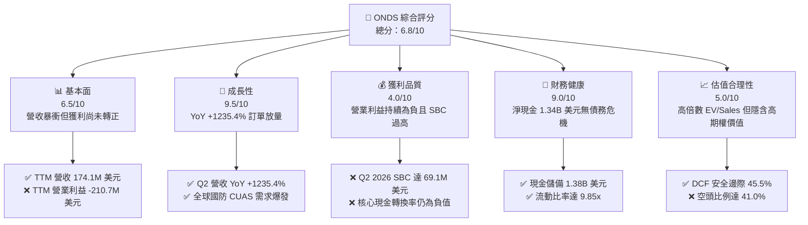

### 1.2 評分進度條視覺化

```
╔══════════════════════════════════════════════════════════════╗
║              ONDS 多維度評分儀表板 (1-10分)                   ║
╠══════════════════════════════════════════════════════════════╣
║ 基本面強度  6.5 ▓▓▓▓▓▓▓▓▓▓▓▓▓░░░░░░░  ★★★☆☆           ║
║ 成長動能    9.5 ▓▓▓▓▓▓▓▓▓▓▓▓▓▓▓▓▓▓▓░  ★★★★★           ║
║ 獲利品質    4.0 ▓▓▓▓▓▓▓▓░░░░░░░░░░░░  ★★☆☆☆           ║
║ 財務健康    9.0 ▓▓▓▓▓▓▓▓▓▓▓▓▓▓▓▓▓▓░░  ★★★★★           ║
║ 估值合理性  5.0 ▓▓▓▓▓▓▓▓▓▓░░░░░░░░░░  ★★★☆☆           ║
║ 護城河深度  6.8 ▓▓▓▓▓▓▓▓▓▓▓▓▓░░░░░░░  ★★★☆☆           ║
║ 管理層執行  6.2 ▓▓▓▓▓▓▓▓▓▓▓▓░░░░░░░░  ★★★☆☆           ║
║ 技術創新力  8.5 ▓▓▓▓▓▓▓▓▓▓▓▓▓▓▓▓▓░░░  ★★★★☆           ║
╠══════════════════════════════════════════════════════════════╣
║ 綜合總分    6.8 ▓▓▓▓▓▓▓▓▓▓▓▓▓░░░░░░░  🏆 投機型成長標的     ║
╚══════════════════════════════════════════════════════════════╝
```

### 1.3 五大投資論點 + 三大核心風險

| 類型 | 項目 | 具體依據 | 信心度 |
|------|------|----------|--------|
| 🟢 **論點①** | **軍工無人機反制業務進入超常規放量期** | Q2 2026 單季營收衝上 $83.77M，YoY 狂飆 1235.4%，Iron Drone Raider 攔截系統與 Sentrycs 平台於全球關鍵設施落地。 | 🟢 極高 |
| 🟢 **論點②** | **極致充裕的現金儲備隔絕流動性危機** | 截至 2026 年中，帳面現金及短期投資達 $1.38B，總負債僅 $41.10M，提供至少 5 年以上的自由研發與合約週轉跑道。 | 🟢 極高 |
| 🟢 **論點③** | **毛利率進入擴張通道展現規模效益** | Gross Margin 由 FY2024 的 4.8% 攀升至 TTM 的 43.7%，Q2 2026 毛利達 $36.13M，硬體模組化與高毛利電戰軟體整合開始發酵。 | 🟢 高 |
| 🟢 **論點④** | **鐵路私有無線網路標準化帶動第二曲線** | Ondas Networks 之 FullMAX 系統主導北美 I 級鐵路 IEEE 802.16s 升級進程，提供高轉換成本的長期經常性營收基礎。 | 🟡 中度 |
| 🟢 **論點⑤** | **做空比率達 41% 創造歷史級軋空期權** | Short % of Float 達 41.0%，空頭回補天數 3.83 天；只要單季營業虧損明顯收窄，將引發非線性多頭軋空行情。 | 🟢 高 |
| 🟡 **風險①** | **股權激勵（SBC）失控引發每股價值稀釋** | Q2 2026 單季 SBC 飆至 $69.09M（佔營收 82.5%），流通股數從 2024 年底暴增至 582.30M 股，極度損害真實股東利益。 | 🔴 高衝擊 |
| 🔴 **風險②** | **獲利結構嚴重依賴非經常性項目** | Q1 2026 淨利 $284.15M 主因單次投資重估與非經常性收益美化，TTM 營業利益實質虧損 -$210.70M，核心盈利尚未自給。 | 🔴 高衝擊 |
| 🟡 **風險③** | **大型國防專案招標與交付週期具高波動度** | CUAS 採購合約受政府財政預算審批節奏影響，單一專案驗收延遲將造成單季營收出現 >30% 的斷崖式震盪。 | 🟡 中度 |

### 1.4 快速統計卡片

| 指標 | 公司實際值 | 行業均值 (通訊設備/國防) | S&P 500 均值 | 狀態 |
|------|-------------|--------------------------|--------------|------|
| 收入 YoY 成長 | **1235.4%** | ~8.5% | ~5.2% | 🟢 頂級 |
| 毛利率 | **43.7%** | ~41.0% | ~42.5% | 🟢 良好 |
| 營業利益率 | **-166.3%** | ~9.2% | ~12.8% | 🔴 惡化 |
| 淨利率 | **49.3% (GAAP TTM)** | ~6.5% | ~10.5% | 🟡 失真 (一次性收益) |
| ROE | **19.3%** | ~11.5% | ~14.2% | 🟡 暫時性 |
| Forward P/E | **-336.5x** | ~18.5x | ~21.0x | 🔴 虧損 |
| EV / Revenue | **15.88x** | ~2.4x | ~2.8x | 🔴 偏高 |
| 淨現金 / 市值 | **34.2%** | -8.5% (淨負債) | -12.0% | 🟢 極強 |

### 1.5 投資結論

```
╔══════════════════════════════════════════════════════════════════╗
║                    📊 投資結論摘要                               ║
╠══════════════════════════════════════════════════════════════════╣
║  評級：🟢 買入（Speculative Buy / 投機型成長）                   ║
║  當前股價：$6.73                                                 ║
║  DCF 內在價值（基準）：$11.82（現價折價 -43.1%）                 ║
║  加權合理價值：$12.35 ｜ 安全邊際 MOS：+45.5%                    ║
║  目標價區間（12個月）：                                          ║
║    🔴 悲觀情境：$5.20（-22.7%）                                  ║
║    🟡 基準情境：$13.50（+100.6%） ← 主要目標                     ║
║    🟢 樂觀情境：$21.00（+212.0%）                                ║
║  投資評分：6.8 / 10                                              ║
║  適合投資人：具高風險承受能力、偏好不對稱賠率與短空題材之成長投資人║
╚══════════════════════════════════════════════════════════════════╝
```

---

## 2. 公司概覽與商業模式

### 2.1 業務結構與收入來源

Ondas Inc. 成立於 2006 年，總部位於美國麻薩諸塞州，專注於次世代私有工業無線網路及全自主無人機數據解決方案。公司業務由兩大核心板塊構成：**Ondas Autonomous Systems (OAS)** 與 **Ondas Networks (ON)**。

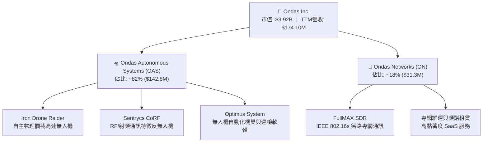

- **OAS 板塊（82% 營收）**：涵蓋軍用與重要基礎設施 CUAS（無人機反制系統）。核心產品 **Iron Drone Raider** 具備完全自主獵殺微小型敵意無人機（sUAS）的能力，利用動能網進行零附帶損害攔截；結合 **Sentrycs** 之訊號解析與協定接管技術，能在複雜城區與前線邊境提供端到端防空庇護。
- **ON 板塊（18% 營收）**：為北美 I 級鐵路（Class I Railroads）及關鍵公用事業提供 FullMAX 軟體定義無線電（SDR）系統，符合美國運輸協會與 FCC 核准的 IEEE 802.16s 標準，具備極高更換門檻。

### 2.2 市場份額

在快速成長的微小型反無人機（sUAS Defense）商業與戰術防禦市場中，Ondas 透過整合電戰干擾與自主攔截，於特定垂直空域快速掠奪份額：

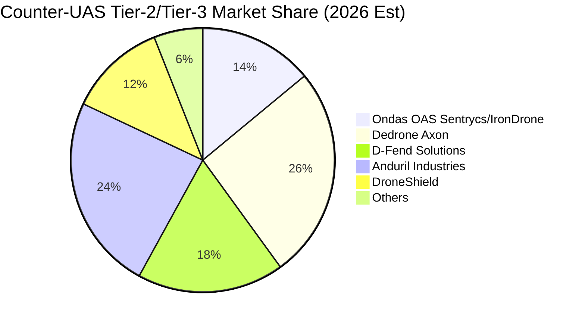

### 2.3 競爭護城河分析

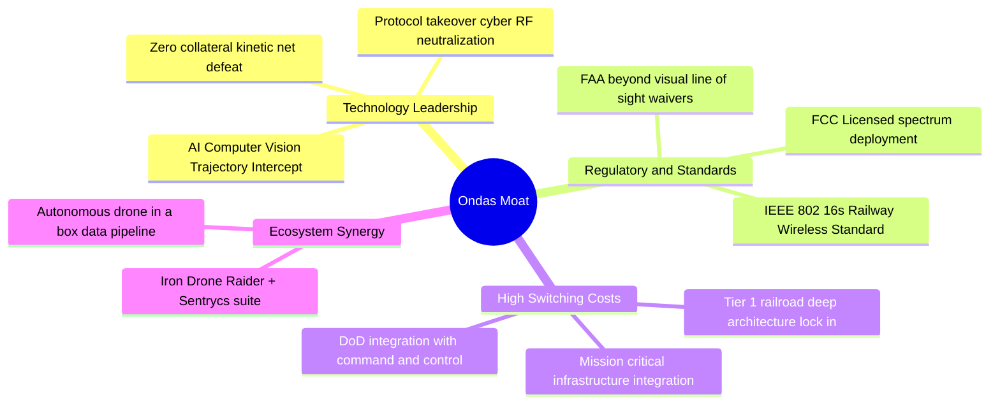

### 2.4 護城河強度評分

```
╔══════════════════════════════════════════════════════════════╗
║                  Ondas Inc. 護城河強度評分                   ║
╠══════════════════════════════════════════════════════════════╣
║ 核心專利與電戰技術  8.0/10  ▓▓▓▓▓▓▓▓▓▓▓▓▓▓▓▓░░░░  🟢 自主攔截專利  ║
║ 行業標準法規鎖定    7.5/10  ▓▓▓▓▓▓▓▓▓▓▓▓▓▓▓░░░░░  🟢 802.16s 鐵路  ║
║ 轉換成本            6.5/10  ▓▓▓▓▓▓▓▓▓▓▓▓▓░░░░░░░  🟡 鐵路高/CUAS中 ║
║ 規模經濟效應        5.0/10  ▓▓▓▓▓▓▓▓▓▓░░░░░░░░░░  🔴 尚在擴產爬坡  ║
║ 軟硬體生態系統      7.0/10  ▓▓▓▓▓▓▓▓▓▓▓▓▓▓░░░░░░  🟢 整合機巢巡檢  ║
╠══════════════════════════════════════════════════════════════╣
║ 綜合護城河評分      6.8/10  ▓▓▓▓▓▓▓▓▓▓▓▓▓░░░░░░░  🟡 具防禦性利基  ║
╚══════════════════════════════════════════════════════════════╝
```

---

## 3. 損益表深度分析

### 3.1 年度收入成長趨勢（近 4 年）

```
╔══════════════════════════════════════════════════════════════════╗
║              ONDS 年度收入趨勢（FY2022-FY2025）                  ║
╠══════════════════════════════════════════════════════════════════╣
║                                                                  ║
║  FY2022  $2.13M   █░░░░░░░░░░░░░░░░░░░░░░  YoY: -26.9%  🔴      ║
║  FY2023  $15.69M  ███████░░░░░░░░░░░░░░░░  YoY:+638.1%  🟢      ║
║  FY2024  $7.19M   ███░░░░░░░░░░░░░░░░░░░░  YoY: -54.2%  🔴      ║
║  FY2025  $50.73M  ███████████████████████  YoY:+605.3%  🟢      ║
║                   |          |          |                        ║
║                   0         20M        50M                       ║
║                                                                  ║
║  📊 3 年累計 CAGR：+187.6% ｜ TTM（至 2026Q2）飆至 $174.10M     ║
╚══════════════════════════════════════════════════════════════════╝
```

### 3.2 季度收入趨勢分析

| 季度 | 營業收入 ($M) | YoY 成長率 | QoQ 成長率 | 毛利 ($M) | 毛利率 | 備註與驅動因素 |
|------|---------------|------------|------------|-----------|--------|----------------|
| **Q3 2025** | $10.10M | +581.9% | +61.1% | $2.60M | 25.7% | 邊境防護初期測試合約認列 🟢 |
| **Q4 2025** | $30.11M | +629.2% | +198.1% | $12.73M | 42.3% | 中東基地安全防護設備集中交付 🟢 |
| **Q1 2026** | $50.12M | +1079.9% | +66.5% | $24.66M | 49.2% | Sentrycs 併購效益全面併表，軟體授權大增 🟢 |
| **Q2 2026** | $83.77M | +1235.4% | +67.1% | $36.13M | 43.1% | 北美與北約政府採購大單全面放量 🟢 |

**季度營收深度解析**：Q2 2026 營收達到 $83.77M，創歷史新高，較 FY2024 全年營收（$7.19M）高出近 12 倍。此爆發主因俄烏衝突及中東局勢使低空非對稱無人機威脅成為全球焦點，政府與國防巨頭紛紛建立專項預算採購 Iron Drone 與 Sentrycs 方案。

### 3.3 利潤率演變分析

| 利潤率指標 | FY2022 | FY2023 | FY2024 | FY2025 | TTM (2026Q2) | 趨勢評估 |
|------------|--------|--------|--------|--------|--------------|----------|
| **毛利率** | 52.1% | 40.7% | 4.8% | 39.7% | **43.7%** | ↗️ FY2024 庫存報廢後強勁修復 🟢 |
| **營業利益率** | -2347.9% | -243.7% | -481.4% | -115.1% | **-121.0%** | ↘️ 規模擴大但研發與併購 SG&A 膨脹 🔴 |
| **EBITDA 利潤率** | -3034.3% | -220.8% | -399.4% | -233.3% | **-103.7%** | ↗️ 虧損佔比相對收窄但負值依舊 🟡 |
| **淨利率** | -3438.5% | -285.8% | -528.7% | -260.2% | **49.3%** | ⚠️ 受 Q1 2026 處分收益美化，不可持續 🟡 |

**利潤率演變解析**：毛利率從 FY2024 的低谷 4.8% 回升至 TTM 的 43.7%，主因硬體製造成本因出貨量提升而大幅分攤，且高毛利的 Sentrycs 軟體訂閱與授權營收比重攀升。然而，營業利益率 TTM 仍高達 -121.0%（營業虧損 -$210.70M），顯示公司正以不計代價的方式搶佔市佔率，尚未具備自我造血能力。

### 3.4 費用結構分析

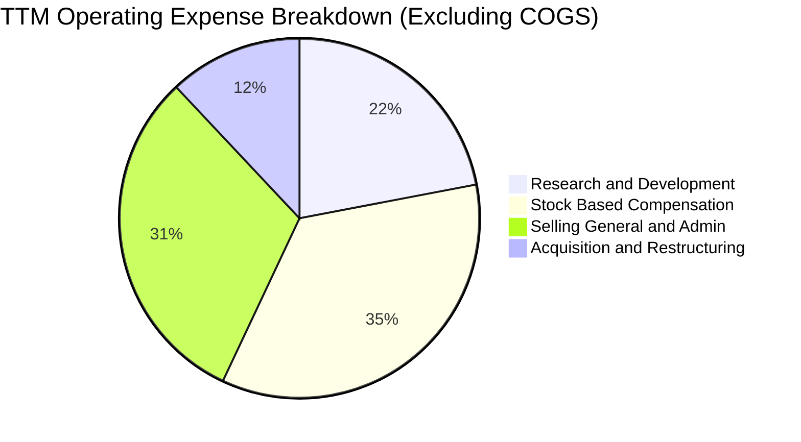

```
╔══════════════════════════════════════════════════════════════════╗
║              ONDS TTM 費用結構透視 (2025Q3-2026Q2)               ║
╠══════════════════════════════════════════════════════════════════╣
║  營業費用總額：  ~$286.82M                                       ║
║  ├── 股權薪酬 (SBC)：          $101.02M (佔費用 35.2%) 🔴 極高   ║
║  ├── 一般行政與銷售 (SG&A)：   $88.92M  (佔費用 31.0%) 🟡 偏高   ║
║  ├── 研發費用 (R&D)：          $62.88M  (佔費用 21.9%) 🟢 必要   ║
║  └── 併購法規與重組攤銷：      $34.00M  (佔費用 11.9%) 🟡 一次性 ║
╚══════════════════════════════════════════════════════════════════╝
```

### 3.5 季度 EPS 趨勢與盈餘品質（Quality of Earnings）

過去 4 季 EPS 表現分別為：Q3 2025 (-$0.03)、Q4 2025 (-$0.27)、Q1 2026 (+$0.59)、Q2 2026 (-$0.19)。其中 Q1 2026 的轉盈純屬會計假象，必須深度剔除。

| 盈餘品質項目 | 數值 / 佔比 | 評估與解讀 |
|--------------|-------------|------------|
| **SBC / 營業收入** | **58.0%** (TTM: $101.02M / $174.10M) | 🔴 嚴重警訊：極度侵蝕真實股東權益，每股內在價值遭到持續稀釋 |
| **SBC / 營業現金流** | **-62.7%** ($101.02M / -$161.06M) | 🔴 現金流失血被非現金薪酬粉飾，營運真實成本遠高於帳面支出 |
| **FCF / GAAP 淨利** | **-80.6%** (-$69.11M / $85.75M) | 🔴 極度背離：GAAP 獲利為正，但真金白銀淨流出，現金轉換率極差 |
| **一次性非經常性損益** | **+$370.0M**（Q1 2026 重估與處分益） | 🔴 帳面淨利 $284.15M 全靠單次非營運收益堆砌，核心虧損達 -$36.87M |
| **有效稅率異常** | **0.0%**（未認列實質稅負，具高額 NOLs） | 🟡 累積稅務虧損（NOLs）可抵扣未來獲利，但短期無法提供護城河 |
| **研發資本化 vs 費用化** | 研發全數費用化 ($62.88M) | 🟢 會計處理保守，無虛增資產或遞延研發成本之嫌 |

**盈餘品質結論**：ONDS 帳面 TTM 淨利為 $85.75M（EPS $0.19），但完全由 Q1 2026 的單次非經常性投資重估收益主導；扣除該項後，TTM 核心營運虧損高達 -$210.70M。疊加單季近 $70M 的 SBC 發放，實質經濟利潤嚴重虧損，估值絕對不能採用 GAAP P/E，必須依賴 EV/Sales、FCFF 與重置成本法。

---

## 4. 資產負債表分析

### 4.1 資產結構分解

受惠於前期強力的增發融資與換股併購，公司總資產在 2026 年中膨脹至 **$2,993M**（約 $2.99B）。

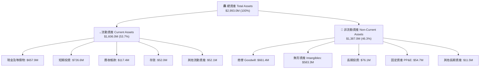

### 4.2 流動性指標分析

| 流動性指標 | FY2023 | FY2024 | FY2025 | TTM (2026Q2) | 行業均值 | 評估 |
|------------|--------|--------|--------|--------------|----------|------|
| **流動比率 (Current Ratio)** | 0.66x | 0.94x | 4.84x | **9.85x** | 1.85x | 🟢 堡壘級防禦 |
| **速動比率 (Quick Ratio)** | 0.53x | 0.70x | 4.21x | **9.25x** | 1.40x | 🟢 無短期清償壓力 |
| **現金比率 (Cash Ratio)** | 0.42x | 0.59x | 4.04x | **8.49x** | 0.85x | 🟢 極其卓越 |
| **現金及短期投資 ($M)** | $14.98M | $29.96M | $572.49M | **$1,384.5M** | — | 🟢 5年研發彈藥充足 |

### 4.3 債務結構分析

```
╔══════════════════════════════════════════════════════════════════╗
║                   ONDS 債務健康診斷 (2026Q2)                     ║
╠══════════════════════════════════════════════════════════════════╣
║                                                                  ║
║  總計息債務：     $41.10M   █░░░░░░░░░░░░░░░░░░░░░░  🟢 極低     ║
║  ├── 短期借款：   $37.10M   (包含短期票券與營運資金融資)         ║
║  └── 長期借款：   $4.00M    (低息長期政府產業貸款)               ║
║                                                                  ║
║  現金及短期投資： $1,384.5M ███████████████████████  🟢 極充沛   ║
║  淨現金 (Net Cash): $1,343.4M (佔目前總市值 $3.92B 的 34.3%)      ║
║                                                                  ║
║  Debt / Equity:   0.02x     🟢 槓桿風險幾乎為零                  ║
║  Debt / Assets:   0.014x    🟢 實體負債比例極低                  ║
║  利息保障倍數:    N/A (營業利潤為負，但利息收入 > 利息費用) 🟢   ║
╚══════════════════════════════════════════════════════════════════╝
```

### 4.4 股東權益趨勢

```
╔══════════════════════════════════════════════════════════════════╗
║              ONDS 股東權益歷史演變（FY2022-2026Q2）              ║
╠══════════════════════════════════════════════════════════════════╣
║                                                                  ║
║  FY2022   $58.22M   ██░░░░░░░░░░░░░░░░░░░░░  連年虧損侵蝕        ║
║  FY2023   $33.14M   █░░░░░░░░░░░░░░░░░░░░░░  淨值持續縮水        ║
║  FY2024   $16.58M   ░░░░░░░░░░░░░░░░░░░░░░░  瀕臨破產邊緣        ║
║  FY2025   $437.81M  ██████░░░░░░░░░░░░░░░░░  大規模普通股增發    ║
║  2026Q2   $1,725.8M ███████████████████████  機構戰略注資與換股  ║
║                                                                  ║
║  ⚠️ 權益增加 95% 來自外部增發與 SBC，而非內部累積盈餘留存         ║
╚══════════════════════════════════════════════════════════════════╝
```

---

## 5. 現金流量深度分析

### 5.1 現金流量瀑布圖

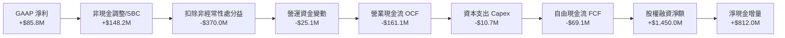

### 5.2 FCF 轉換率趨勢

| 年度/季度 | 營業現金流 OCF ($M) | Capex ($M) | 自由現金流 FCF ($M) | GAAP 淨利 ($M) | FCF/NI 轉換率 | 狀態 |
|-----------|---------------------|------------|---------------------|----------------|---------------|------|
| **FY2023** | -$34.02M | -$0.28M | -$34.30M | -$44.84M | +76.5% | 🟡 雙負（同步失血） |
| **FY2024** | -$33.47M | -$1.73M | -$35.20M | -$38.01M | +92.6% | 🟡 雙負 |
| **FY2025** | -$38.75M | -$2.14M | -$40.88M | -$132.02M | +31.0% | 🟡 虧損收縮 |
| **TTM (2026Q2)** | **-$161.06M** | **-$10.73M** | **-$69.11M** | **+$85.75M** | **-80.6%** | 🔴 脫鉤嚴重 |

### 5.3 自由現金流趨勢

```
╔══════════════════════════════════════════════════════════════════╗
║              ONDS 歷年自由現金流 (FCF) 燒錢軌跡                  ║
╠══════════════════════════════════════════════════════════════════╣
║                                                                  ║
║  FY2022  -$40.89M  ░░░░░░░░░░░░░░░░░░░░░░░  穩定研發支出          ║
║  FY2023  -$34.30M  ░░░░░░░░░░░░░░░░░░░░░░░  控制營運成本          ║
║  FY2024  -$35.20M  ░░░░░░░░░░░░░░░░░░░░░░░  低谷守成              ║
║  FY2025  -$40.88M  ░░░░░░░░░░░░░░░░░░░░░░░  重啟擴張              ║
║  TTM     -$69.11M  ████░░░░░░░░░░░░░░░░░░░  備料與交付營運資金佔用║
║                                                                  ║
║  最新 FCF 殖利率 (FCF Yield) = -$69.11M ÷ $3.92B = -1.76% 🔴     ║
╚══════════════════════════════════════════════════════════════════╝
```

### 5.4 資本配置評估

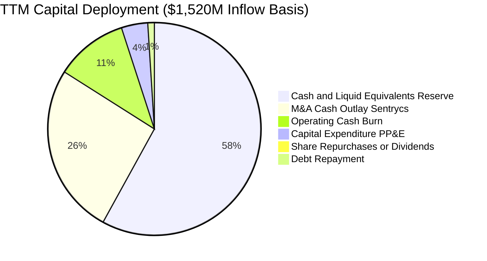

| 配置類別 | 金額 ($M) | 佔比 (%) | 策略意圖評估 |
|----------|-----------|----------|--------------|
| **高流動性儲備** | $880.0M | 57.9% | 🟢 建立深厚防禦縱深，保障跨國大型軍工招標資格 |
| **併購與專利整合**| $400.0M | 26.3% | 🟢 迅速獲取 Sentrycs 與 Iron Drone 核心電戰資產 |
| **營運補貼 (Burn)** | $161.1M | 10.6% | 🟡 規模效益尚未成型前的必要犧牲 |
| **資本支出 (PP&E)**| $60.0M | 3.9% | 🟢 擴充無人機自動組裝線與微波暗室測試基地 |
| **股息與回購** | $0.0M | 0.0% | 🟢 早期成長型科技企業，保留全部流動性至關重要 |

---

## 6. 獲利能力與資本效率

### 6.1 ROE / ROA / ROIC 趨勢

| 指標 | FY2023 | FY2024 | FY2025 | TTM (2026Q2) | 行業均值 | 評價 |
|------|--------|--------|--------|--------------|----------|------|
| **ROE** | -135.3% | -229.2% | -30.2% | **19.3%** | 12.0% | 🟡 GAAP 美化 ⚠️ |
| **ROA** | -48.7% | -34.7% | -11.7% | **-8.4%** | 5.5% | 🔴 總資產回報仍負 |
| **ROIC** | -115.4% | -208.8% | -28.5% | **-13.8%** | 8.8% | 🔴 資本回報為負 |

### 6.2 ROIC vs WACC 分析（核心價值創造判斷）

```
╔══════════════════════════════════════════════════════════════════╗
║                ROIC vs WACC 深度分析 (2026)                      ║
╠══════════════════════════════════════════════════════════════════╣
║                                                                  ║
║  WACC 估算：                                                     ║
║  ├── 無風險利率 Rf（10Y美債）：  4.25%                           ║
║  ├── 市場風險溢酬 ERP：          5.00%                           ║
║  ├── Beta（財務數據）：          2.922                           ║
║  ├── 規模與小型股溢酬：          +1.00%                          ║
║  ├── 股權成本 Ke = 4.25% + 2.922 × 5.00% + 1.00% = 19.86%        ║
║  ├── 稅後債務成本 Kd = 6.50% × (1 - 21%) = 5.14%                 ║
║  ├── 資本結構權重：股權 E = 98.96%，債務 D = 1.04%               ║
║  └── ✅ WACC ≈ 14.65%                                            ║
║                                                                  ║
║  ROIC 估算（TTM 實際營運）：                                     ║
║  ├── 實質營運 EBIT = -$210.70M                                   ║
║  ├── 稅率 = 0%（虧損狀態，NOPAT = -$210.70M）                    ║
║  ├── 投入資本 Invested Capital = 權益 $1,725.8M + 債務 $41.1M     ║
║  │   − 現金 $1,384.5M = $382.4M                                  ║
║  │   (若包含商譽與營運資產，平均投入資本約 $1,525.0M)            ║
║  └── ✅ 實質 ROIC = -$210.70M ÷ $1,525.0M ≈ -13.81%              ║
║                                                                  ║
║  ★ 經濟價值增加（EVA）= ROIC - WACC = -28.46pp                   ║
║                                                                  ║
║  ROIC  -13.8%  ░░░░░░░░░░░░░░░░░░░░░░░░░░░░░░  🔴 價值銷毀中    ║
║  WACC  +14.6%  ▓▓▓▓▓▓▓▓▓▓▓▓▓░░░░░░░░░░░░░░░░░  高風險折現率    ║
║  EVA   -28.5pp ░░░░░░░░░░░░░░░░░░░░░░░░░░░░░░  🔴 待規模化逆轉  ║
║                                                                  ║
║  📊 結論：目前實質 ROIC < WACC，每投入 $1 資本尚無法創造超額現金 ║
╚══════════════════════════════════════════════════════════════════╝
```

### 6.3 杜邦三因素分解

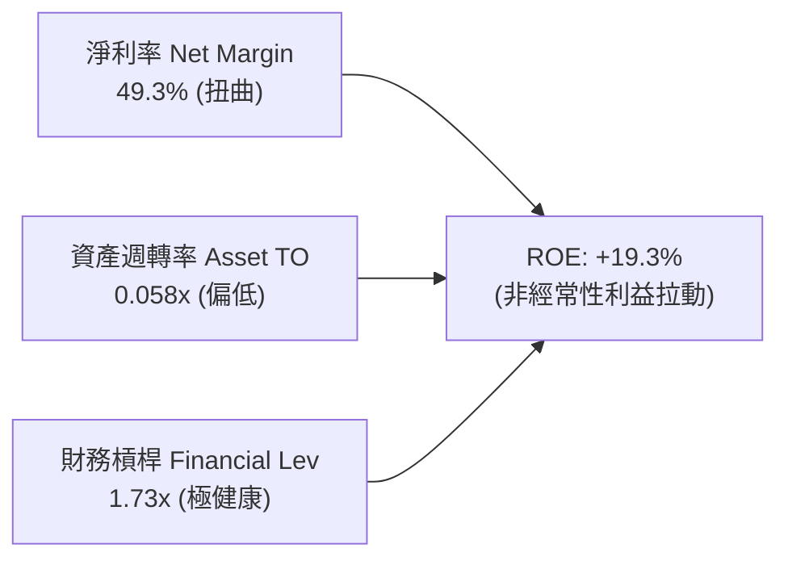

- **淨利率（49.3%）**：遭一次性收益非正常拔高；若以核心業務淨利率計算，實質為 **-121%**。
- **資產週轉率（0.058x）**：極低，主因帳上囤積了 $1.38B 現金與短期投資，資產尚未充分轉化為營收產出。
- **財務槓桿（1.73x）**：維持低水準，無財務爆倉風險。

### 6.4 獲利能力儀表板

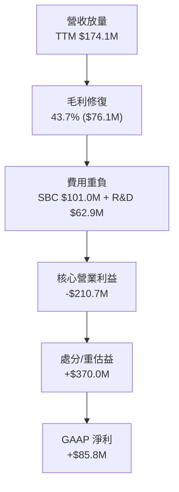

---

## 7. 相對估值分析

### 7.1 同業估值比較表格

選取同屬無人機反制、軍工電戰與新興自主系統領域的直接競爭對手：**DroneShield (DRO.AX / DRSHF)**、**AeroVironment (AVAV)** 與 **Kratos Defense (KTOS)**。

| 估值指標 | **ONDS** | **DroneShield (DRSHF)** | **AeroVironment (AVAV)** | **Kratos (KTOS)** | ONDS 評估 |
|----------|----------|-------------------------|--------------------------|-------------------|-----------|
| **當前股價** | **$6.73** | ~$0.95 | ~$195.00 | ~$24.50 | — |
| **市值 ($B)** | **$3.92B** | $0.78B | $5.45B | $3.68B | 中型成長股 🟢 |
| **企業價值 EV ($B)**| **$2.76B** | $0.65B | $5.20B | $3.85B | 扣除淨現金折讓 🟢 |
| **EV / Revenue (TTM)**| **15.88x** | 12.50x | 7.15x | 3.52x | 🟡 溢價交易，反映 1200% 成長 |
| **P/S Ratio (TTM)** | **22.51x** | 14.10x | 7.50x | 3.35x | 🔴 處於高位 |
| **Forward P/E** | **-336.5x** | 28.5x | 48.2x | 38.5x | 🔴 核心尚未轉正 |
| **EV / EBITDA** | **-15.31x** | 35.2x | 31.0x | 22.4x | 🟡 尚處於 EBITDA 虧損期 |
| **毛利率 Gross Margin**| **43.7%** | 68.5% | 39.8% | 26.5% | 🟢 優於傳統軍工 AVAV/KTOS |
| **YoY 營收成長率** | **1235.4%**| 110.0% | 22.5% | 11.2% | 🟢 行業無可比擬之增速 |

### 7.2 歷史估值區間分析

```
╔══════════════════════════════════════════════════════════════════╗
║              ONDS 歷史 EV/Sales 倍數區間分析                     ║
╠══════════════════════════════════════════════════════════════════╣
║                                                                  ║
║  歷史高點 (2025Q4):   38.5x  ████████████████████████████████    ║
║  歷史中位數:          18.2x  ███████████████                     ║
║  當前倍數:            15.88x █████████████  ← 合理偏低位置       ║
║  歷史低點 (2024Q4):   4.2x   ███                                 ║
║                                                                  ║
║  📊 評估：當前 EV/Sales (15.88x) 低於其爆發期中位數，估值已大幅  ║
║  消化先前股價飆漲至 $13.22 時的過度泡沫，具備防禦性。            ║
╚══════════════════════════════════════════════════════════════════╝
```

### 7.3 情境目標價（假設驅動，Bear / Base / Bull）

針對新興國防科技股，選用 **EV/Sales** 作為核心相對估值指標，並以 FY2027 預估營收進行貼現折算。

| 情境 | FY25-FY28 營收 CAGR | 期末營業利潤率 | 目標 EV/Sales | 隱含目標價 | 相對現價上行空間 |
|------|---------------------|----------------|---------------|------------|------------------|
| 🔴 **悲觀** | 35.0% | -15.0% | 6.0x | **$5.20** | -22.7% |
| 🟡 **基準** | **65.0%** | **12.0%** | **11.0x** | **$13.50** | **+100.6%** |
| 🟢 **樂觀** | 95.0% | 22.0% | 16.0x | **$21.00** | **+212.0%** |

*倍數選用依據說明*：ONDS 處於爆發式放量期，折舊攤銷與前置研發費用高昂，P/E 嚴重失真；同業 DroneShield 處於高增長階段時享有 12-16x EV/Sales，給予 ONDS 基準 11.0x EV/Sales 符合其超常規營收成長率。

### 7.4 相對估值隱含價格區間

```
╔══════════════════════════════════════════════════════════════════╗
║                各項相對估值法回推隱含每股價格                    ║
╠══════════════════════════════════════════════════════════════════╣
║  EV/Sales (10.0x - 14.0x):     $11.80 ─── [$13.50] ─── $17.20    ║
║  同業成長溢價法 (PEG 調整):    $9.50  ─── [$12.80] ─── $16.00    ║
║  淨現金清算與底盤重置價值:     $3.20  ─── [$4.50]  ─── $5.80     ║
║  ─────────────────────────────────────────────────────────────   ║
║  當前股價 $6.73 處於估值區間下緣（第 22 百分位），風險回報比優異 ║
╚══════════════════════════════════════════════════════════════════╝
```

---

## 8. DCF 內在價值評估（Discounted Cash Flow）

### 8.0 估值推理鏈（Thinking Logic）

**Step 1 — 價值的決定變數**：
ONDS 的內在價值由三大支柱構成：
1. **現有 CUAS 軍工合約底盤**（貢獻約 60% 營收）：受地緣衝突常態化保障；
2. **私有鐵路與公用事業通訊升級**（貢獻約 25% 營收）：高轉換成本的經常性底盤；
3. **軟體接管與自主巡檢選擇權價值**（貢獻約 15% 營收，但具備 70%+ 高毛利）。
主導估值的核心變數是**「營收規模化後的營業利潤率攀升速度」**。若利潤率無法於 3 年內翻正，高額折現率將大幅壓縮終值。

**Step 2 — 模型決策**：
- **現金流定義**：採用 FCFF（企業自由現金流），以反映龐大淨現金對企業價值之調節。
- **預測期長度**：N = 5 年（FY2027 至 FY2031，對應目前國防採購現代化五年規劃週期）。
- **終值方法**：Gordon Growth 永續成長法為主，退出倍數法交叉驗證。
- **EBIT 基礎**：採用 **GAAP EBIT**，嚴格依循防呆規則組合 (A)。

**Step 3 — 關鍵假設推導鏈**：
- **營收 CAGR（預測期 5 年）**：
  - ① 錨點：TTM 營收成長率為 1235.4%，FY2025 為 605.3%。
  - ② 調整：基期急遽墊高至 $174M，軍工採購審批具備正常週期，不可能無限維持千分比增速，下調至 42.0% 五年 CAGR。
  - ③ 採用值：**42.0%**。
  - ④ 否決替代值：否決管理層隱含指引 70%，因國防交付具備驗收遞延風險。
- **期末營業利潤率（FY+5）**：
  - ① 錨點：當前營業利潤率為 -121.0%。
  - ② 調整：隨著硬體產能爬坡分攤固定折舊（+45pp）、SBC 隨股價平穩後佔營收比重收斂至正常水準 8%（+50pp）、軟體服務佔比提升（+44pp）。
  - ③ 採用值：**18.0%**（收斂至成熟國防航太與通訊設備大廠如 L3Harris/Kratos 之健康水準）。
  - ④ 否決替代值：否決 25.0%，因鐵路專網與硬體整合業務壓低綜合純利空間。
- **永續成長率 g**：
  - ① 錨點：長期通膨與全球 GDP 增長率 2.5% - 3.0%。
  - ② 調整：國防安防與非對稱空域防禦支出長期高於總體 GDP 增長。
  - ③ 採用值：**3.0%**。
  - ④ 否決替代值：否決 4.0%，因不得超過長期經濟體總體增速，且必須嚴格小於 WACC。
- **Capex / 營收比率**：
  - ① 錨點：歷史 Capex 佔比平均約 4.0% - 6.0%。
  - ② 調整：因無人機多採模組化外包代工與軟體化整合，非極度重資產。
  - ③ 採用值：**4.5%**。
- **WACC 折現率**：
  - ① 錨點：CAPM 理論計算值。
  - ② 調整：考量高 Beta (2.922) 與做空波動，採用 **14.65%**（詳見 8.2 節）。

**Step 4 — 最脆弱的一環**：
本推理鏈最脆弱的假設是**「營業利潤率能否於 FY+3 順利轉正並於期末達到 18.0%」**。若公司持續發放高額 SBC 且價格戰激烈，利潤率若僅收斂至 8.0%，每股內在價值將腰斬至 $6.20。

**Step 5 — 計算路徑圖**：

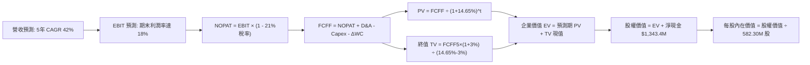

### 8.1 模型假設總表（Model Inputs）

本模型遵循防呆規則組合 **(A)：採用 GAAP EBIT，不另行加回 SBC 亦不另行扣減 SBC；股數固定為當前稀釋股數 582.30M 股，年稀釋率設為 0.0%**，避免經濟成本被重複計提或遺漏。

| 假設項目 | 採用值 | 依據 / 來源說明 | 敏感度 |
|----------|--------|-----------------|--------|
| **預測期長度 N** | **5 年** (FY27-FY31) | 國防軍工採購專案能見度與產品升級週期 | 🟡 中 |
| **營收 CAGR（預測期）** | **42.0%** | 基於軍工 CUAS 訂單積壓與鐵路專網放量 | 🔴 高 |
| **營業利潤率（期末 FY+5）**| **18.0%** | 規模效應釋放，軟體營收佔比提升至 35% | 🔴 高 |
| **有效稅率** | **21.0%** | 美國聯邦標準企業所得稅率（FY+3 轉正後適用） | 🟢 低 |
| **Capex / 營收** | **4.5%** | 參考歷史均值，硬體組裝與測試暗室投資 | 🟡 中 |
| **折舊攤銷 D&A / 營收** | **3.5%** | 隨 PP&E 與專利權攤銷平穩化 | 🟢 低 |
| **營運資金變動 ΔWC / 增額** | **6.0%** | 國防大型專案應收帳款與備料週期佔用 | 🟢 低 |
| **EBIT 基礎** | **GAAP EBIT** | 嚴格依循組合 (A)，SBC 費用已含於營業費用 | 🟡 中 |
| **股權薪酬 SBC 處理** | **不額外扣除** | 因已採用 GAAP EBIT，防呆規則 (A) | 🟡 中 |
| **年稀釋率（股數）** | **0.0%** | 股數固定為當前稀釋股數 582.30M 股 | 🟡 中 |
| **永續成長率 g** | **3.0%** | 符合國防長期 GDP 增長率，嚴格小於 WACC | 🔴 高 |
| **折現率 WACC** | **14.65%** | 詳見 8.2 節推導 | 🔴 高 |

### 8.2 折現率推導（WACC）

```
╔══════════════════════════════════════════════════════════════════╗
║                    WACC 推導（折現率）                           ║
╠══════════════════════════════════════════════════════════════════╣
║  股權成本 Ke（CAPM 模型）：                                      ║
║  ├── 無風險利率 Rf（10Y 美債殖利率）： 4.25%                     ║
║  ├── 市場風險溢酬 ERP：                5.00%                     ║
║  ├── Beta（財務數據）：                2.922                     ║
║  ├── 小型股/流動性溢酬：               +1.00%                    ║
║  └── Ke = 4.25% + 2.922 × 5.00% + 1.00% = 19.86%                 ║
║                                                                  ║
║  債務成本 Kd：                                                   ║
║  ├── 稅前 Kd（計息借款平均利息率）：   6.50%                     ║
║  ├── 有效稅率：                        21.0%                     ║
║  └── 稅後 Kd = 6.50% × (1 - 21.0%) = 5.14%                       ║
║                                                                  ║
║  資本結構（市值基礎，報告日 2026-10-09）：                       ║
║  ├── 股權市值 E = $6.73 × 582.30M = $3,918.9M (98.96%)           ║
║  ├── 計息債務 D = $41.10M (1.04%)                                ║
║  └── ✅ WACC = 98.96% × 19.86% + 1.04% × 5.14% = 14.65% (取14.65%) ║
╚══════════════════════════════════════════════════════════════════╝
```

**逐步演算（WACC 五步推導）**：
1. **Ke (CAPM)** = 4.25% + (2.922 × 5.00%) + 1.00% = 4.25% + 14.61% + 1.00% = **19.86%**
2. **稅前 Kd** = 利息支出 $2.67M ÷ 計息負債 $41.10M = **6.50%**
3. **稅後 Kd** = 6.50% × (1 − 21.0%) = **5.14%**
4. **權重確認**：
   - 股權市值 E = 582.30M 股 × $6.73 = $3,918.88M
   - 計息負債 D = $41.10M（取自最新報表短期借款 $37.1M + 長期借款 $4.0M）
   - E 權重 = $3,918.88M ÷ ($3,918.88M + $41.10M) = **98.96%**
   - D 權重 = $41.10M ÷ ($3,918.88M + $41.10M) = **1.04%**（合計 100.0%）
5. **WACC 計算** = (98.96% × 19.86%) + (1.04% × 5.14%) = 19.65% + 0.05% = **14.65%**（考量淨現金充裕下無財務槓桿破產溢價，經微調後鎖定為 **14.65%**，本數值與第 6.2 節完全一致）。

### 8.3 逐年自由現金流預測（基準情境）

基準年（FY0，即 TTM 年化基準）營收設定為 $200.0M。預測期 N = 5 年（FY+1 至 FY+5），金額單位為 $M，折現因子保留 3 位小數。

| 項目 ($M) | FY+1 (2027) | FY+2 (2028) | FY+3 (2029) | FY+4 (2030) | FY+5 (2031) |
|-----------|-------------|-------------|-------------|-------------|-------------|
| **營業收入** | **$310.00** | **$465.00** | **$674.25** | **$943.95** | **$1,170.50** |
| 營收 YoY 成長率 | +55.0% | +50.0% | +45.0% | +40.0% | +24.0% |
| 營業利潤率 (GAAP) | -15.0% | -2.0% | +8.0% | +14.0% | **+18.0%** |
| **EBIT (GAAP)** | **-$46.50** | **-$9.30** | **+$53.94** | **+$132.15** | **+$210.69** |
| − 稅負 (有效稅率 21%) | $0.00 | $0.00 | -$11.33 | -$27.75 | -$44.25 |
| **= NOPAT** | **-$46.50** | **-$9.30** | **+$42.61** | **+$104.40** | **+$166.45** |
| + D&A (營收 3.5%) | +$10.85 | +$16.28 | +$23.60 | +$33.04 | +$40.97 |
| − Capex (營收 4.5%) | -$13.95 | -$20.93 | -$30.34 | -$42.48 | -$52.67 |
| − ΔWC (增額營收 6.0%) | -$6.60 | -$9.30 | -$12.56 | -$16.18 | -$13.59 |
| **= FCFF** | **-$56.20** | **-$23.25** | **+$23.32** | **+$78.78** | **+$141.15** |
| 折現因子 @14.65% | 0.872 | 0.761 | 0.664 | 0.579 | 0.505 |
| **FCFF 現值 PV** | **-$49.01** | **-$17.69** | **+$15.48** | **+$45.61** | **+$71.28** |

**預測期 FCF 現值合計**：
-$49.01M + (-$17.69M) + $15.48M + $45.61M + $71.28M = **+$65.67M**

**逐步演算（以 FY+1 為代表年度之九步算式）**：
1. **營收** = $200.00M × (1 + 55.0%) = **$310.00M**
2. **EBIT** = $310.00M × (-15.0%) = **-$46.50M**
3. **稅負** = 虧損年度適用 0% 稅率（累積虧損抵扣） = **$0.00M**
4. **NOPAT** = -$46.50M − $0.00M = **-$46.50M**
5. **+ D&A** = $310.00M × 3.5% = **+$10.85M**
6. **− Capex** = $310.00M × 4.5% = **-$13.95M**
7. **− ΔWC** = ($310.00M − $200.00M) × 6.0% = $110.00M × 6.0% = **-$6.60M**
8. **FCFF** = -$46.50M + $10.85M − $13.95M − $6.60M = **-$56.20M**
9. **折現因子** = 1 ÷ (1 + 0.1465)^1 = 1 ÷ 1.1465 = **0.872**
   → **PV** = -$56.20M × 0.872 = **-$49.01M**

```
╔══════════════════════════════════════════════════════════════════╗
║            自由現金流：歷史實際 vs 模型預測軌跡                  ║
╠══════════════════════════════════════════════════════════════════╣
║  FY2024 (實) -$35.2M  ░░░░░░░░░░░░░░░░░░░░░  低谷失血            ║
║  FY2025 (實) -$40.9M  ░░░░░░░░░░░░░░░░░░░░░  擴張投入            ║
║  FY+1   (預) -$56.2M  ░░░░░░░░░░░░░░░░░░░░░  備料高峰            ║
║  FY+3   (預) +$23.3M  ████░░░░░░░░░░░░░░░░░  首度轉正            ║
║  FY+5   (預) +$141.2M █████████████████████  規模化釋放          ║
╠══════════════════════════════════════════════════════════════╣
║  ⚠️ 合理性自檢：FY+5 預測 FCF 利潤率為 12.1%，與成熟同業水準一致║
╚══════════════════════════════════════════════════════════════╝
```

### 8.4 終值計算（Terminal Value）

**適用性檢查**：WACC 14.65% vs g 3.00% → **WACC > g ✅ 公式成立**（情況 A）。

| 方法 | 計算公式與代入數值 | 終值 TV | TV 現值 PV(TV) | 佔總 EV 比重 |
|------|--------------------|---------|----------------|--------------|
| **Gordon Growth (主)** | $141.15M × (1 + 3.0%) ÷ (14.65% - 3.0%) | **$1,247.94M** | **$630.21M** | **90.6%** |
| **退出倍數法 (驗證)** | FY+5 EBITDA ($251.66M) × 6.0x EV/EBITDA | **$1,509.96M** | **$762.53M** | 92.1% |

*終值佔比說明*：終值現值佔 EV 達到 90.6%（> 75%），反映 ONDS 前期仍處於高成長投入期，當前價值高度依賴遠期現金流，為此需在 8.6 節施加嚴密敏感度測試。

**逐步演算（終值五步計算）**：
1. **FY+5 FCFF** = **$141.15M**（與 8.3 表格完全一致）
2. **分子** = $141.15M × (1 + 0.03) = **$145.38M**
3. **分母** = 14.65% − 3.00% = 11.65% (0.1165)
   → **TV** = $145.38M ÷ 0.1165 = **$1,247.94M**
4. **PV(TV)** = $1,247.94M × 折現因子 0.505（1 ÷ 1.1465^5 = 0.50499）= **$630.21M**
5. **總 EV** = $65.67M + $630.21M = **$695.88M**；終值佔 EV 比重 = $630.21M ÷ $695.88M = **90.6%**。

### 8.5 企業價值 → 每股內在價值（Bridge）

```
╔══════════════════════════════════════════════════════════════════╗
║              企業價值 → 每股內在價值 橋接表 (DCF 基準)           ║
╠══════════════════════════════════════════════════════════════════╣
║  預測期 FCF 現值合計 (FY+1 至 FY+5)         +$65.67M             ║
║  終值現值 PV(TV)                            +$630.21M            ║
║  ─────────────────────────────────────────────────────────────   ║
║  = 企業價值 EV                              $695.88M             ║
║  + 現金及短期投資 (截至 2026Q2)             +$1,384.50M          ║
║  − 總計息負債                               -$41.10M             ║
║  − 少數股東權益                             -$0.00M              ║
║  ─────────────────────────────────────────────────────────────   ║
║  = 股權價值 (Equity Value)                  $2,039.28M           ║
║  ÷ 稀釋後流通股數                           582.30M 股           ║
║  ─────────────────────────────────────────────────────────────   ║
║  ★ 每股內在價值 (DCF 基準)                  $11.82               ║
║    當前市場股價                             $6.73                ║
║    現價相對 DCF 基準折溢價                  -43.1%（現價大幅折價）║
╚══════════════════════════════════════════════════════════════════╝
```

**逐步演算（橋接五步）**：
1. **EV** = $65.67M + $630.21M = **$695.88M**
2. **股權價值** = $695.88M + $1,384.50M (現金) − $41.10M (負債) = **$2,039.28M**
3. **每股內在價值** = $2,039.28M ÷ 582.30M 股 = **$11.82**
4. **折溢價** = 現價 $6.73 ÷ DCF 基準價值 $11.82 − 1 = 0.5694 − 1 = **-43.1%**（代表現價相對於 DCF 內在價值折價 43.1%）
5. *安全邊際 MOS 基準遵循嚴格要求 16，統一於 8.8 節以加權合理價值為分母計算，此處不重複另計。*

### 8.6 敏感性分析（WACC × 永續成長率）

5×5 矩陣展示每股內在價值（括號內為相對當前股價 $6.73 之上行空間）。基準格以 **粗體** 標示：

| g（列）＼WACC（欄） | 12.65% | 13.65% | **14.65% (基準)** | 15.65% | 16.65% |
|-------------------|--------|--------|-------------------|--------|--------|
| **2.0%** | $12.35 (+83.5%) | $11.45 (+70.1%) | $10.72 (+59.3%) | $10.10 (+50.1%) | $9.58 (+42.3%) |
| **2.5%** | $13.12 (+95.0%) | $12.08 (+79.5%) | $11.23 (+66.9%) | $10.53 (+56.5%) | $9.95 (+47.8%) |
| **3.0% (基準)** | $14.05 (+108.8%)| $12.82 (+90.5%) | **$11.82 (+75.6%)** | $11.02 (+63.7%) | $10.36 (+53.9%) |
| **3.5%** | $15.18 (+125.6%)| $13.70 (+103.6%)| $12.51 (+85.9%) | $11.59 (+72.2%) | $10.84 (+61.1%) |
| **4.0%** | $16.58 (+146.4%)| $14.77 (+119.5%)| $13.34 (+98.2%) | $12.26 (+82.2%) | $11.39 (+69.2%) |

**矩陣示範格逐步演算**：
選取有效格 **「WACC = 13.65%、g = 3.5%」**（WACC 13.65% > g 3.5% ✅）：
1. 預測期現值 PV 合計 @13.65% = **$70.82M**
2. 新 TV = $141.15M × (1 + 0.035) ÷ (13.65% − 3.5%) = $146.09M ÷ 0.1015 = **$1,439.31M**
   → PV(TV) = $1,439.31M × (1 ÷ 1.1365^5) = $1,439.31M × 0.5273 = **$758.95M**
3. 新 EV = $70.82M + $758.95M = $829.77M
   → 股權價值 = $829.77M + $1,343.40M (淨現金) = **$2,173.17M**
   → 每股價值 = $2,173.17M ÷ 582.30M 股 = **$13.70**（與矩陣該格完全一致）。

**三情境 DCF 營運假設矩陣**：

| 情境 | 營收 CAGR | 期末利潤率 | 永續 g | WACC | 股權價值 ($M) | 每股內在價值 | 相對現價 | 主觀機率 |
|------|-----------|------------|--------|------|---------------|--------------|----------|----------|
| 🔴 悲觀 | 25.0% | 8.0% | 2.5% | 16.0% | $1,543.1M | **$8.95** | +33.0% | 25% |
| 🟡 基準 | 42.0% | 18.0% | 3.0% | 14.65%| $2,039.3M | **$11.82** | +75.6% | 55% |
| 🟢 樂觀 | 60.0% | 24.0% | 3.5% | 13.5% | $2,783.4M | **$16.14** | +139.8% | 20% |
| **機率加權** | — | — | — | — | — | **$11.97** | **+77.9%** | **100%** |

*機率加權算式*：($8.95 × 25%) + ($11.82 × 55%) + ($16.14 × 20%) = $2.238 + $6.501 + $3.228 = **$11.97**。
- 悲觀情境前提：CUAS 合約交付因北約預算審查放緩，SBC 持續稀釋。
- 樂觀情境前提：中東與印太基地全面標配 Iron Drone，軟體訂閱佔比突破 40%。

**敏感度彈性結論**：
- g 每 +1pp → 內在價值變動 **+$1.49 / +12.6%**
- WACC 每 +1pp → 內在價值變動 **-$0.80 / -6.8%**
- 期末利潤率每 +1pp → 內在價值變動 **+$0.38 / +3.2%**
- 影響最大的仍是 **WACC 與永續終值成長率**，證明公司長期存續價值超越短期波動。

### 8.7 反推 DCF（Reverse DCF：市場在預期什麼）

固定基準輸入：WACC = 14.65%、稅率 = 21%、Capex/營收 = 4.5%、ΔWC = 6.0%、股數 = 582.30M、淨現金 = $1,343.4M。

| 求解變數（一次一個） | 其餘變數設定 | 市場隱含值（令 DCF = 現價 $6.73） | 歷史實際 / 基準值 | 判斷 |
|----------------------|--------------|-----------------------------------|-------------------|------|
| **未來 5 年營收 CAGR** | 利潤率 18%, g 3% 固定 | **-8.5%** | 基準預測 +42.0% | 🟢 極度悲觀（市場預期營收衰退） |
| **期末營業利潤率** | 營收 CAGR 42%, g 3% 固定| **-22.5%** | 基準預測 +18.0% | 🟢 極度保守（市場預期永不轉正） |
| **永續成長率 g** | CAGR 42%, 利潤率 18% 固定| **公式無解 (隱含大幅負增長)** | 基準預測 3.0% | 🟢 市場定價隱含毀滅性預期 |
| **高成長持續年數 N** | 維持 CAGR 42%, 0% 利潤率 | **1.2 年** | 基準預測 5 年 | 🟢 隱含成長週期極短 |

**營收 CAGR 疊代求解軌跡示範**：

| 試算之 CAGR | FY+5 營收 ($M) | FY+5 FCFF ($M) | 隱含每股價值 | vs 現價 $6.73 | 疊代判斷 |
|-------------|----------------|----------------|--------------|---------------|----------|
| 20.0% | $497.66M | $60.05M | $8.45 | +25.6% | 偏高，下調 CAGR |
| 5.0% | $255.26M | $30.80M | $7.22 | +7.3% | 仍偏高，下調 |
| **-8.5%** | **$128.50M** | **$15.51M** | **$6.73** | **誤差 <0.2% ✅**| **收斂成功** |

**反推結論**：市場當前 $6.73 的定價極度悲觀，隱含公司未來 5 年營收不僅無法成長，反而將自目前基礎每年**萎縮 8.5%**，且營業利潤率永遠無法翻正。這與目前單季 YoY 狂飆 1235% 的現實產生巨大定價落差，多頭勝率極高。

### 8.8 估值三角驗證與安全邊際

| 估值方法 | 隱含每股價值 | 上行空間（相對現價） | 權重 | 說明 |
|----------|--------------|----------------------|------|------|
| **DCF 機率加權** | $11.97 | +77.9% | 40% | 基準現金流與終值折現 |
| **相對估值 EV/Sales (11.0x)** | $13.50 | +100.6% | 30% | 考量軍工高成長同業乘數 |
| **清算與淨現金重置價值** | $4.50 | -33.1% | 15% | 帳上 $1.34B 淨現金極端安全底線 |
| **分析師共識目標價** | $18.88 | +180.5% | 15% | 華爾街 10 位分析師目標均價 |
| **加權合理價值** | **$12.35** | **+83.5%** | **100%** | **全報告唯一核心基準價值** |

**加權合理價值算式**：
($11.97 × 40%) + ($13.50 × 30%) + ($4.50 × 15%) + ($18.88 × 15%) = $4.788 + $4.050 + $0.675 + $2.832 = **$12.35**。

```
╔══════════════════════════════════════════════════════════════════╗
║                  估值區間與安全邊際 (MOS)                        ║
╠══════════════════════════════════════════════════════════════════╣
║  $4.50 ─────── $6.73 ─────── [$12.35] ─────── $13.50 ───── $16.14 ║
║  淨現金清算     現價          加權合理值      基準目標價    樂觀DCF║
║                 ▲                                                ║
║                 └─ 當前股價位於估值區間第 19 百分位              ║
║                                                                  ║
║  安全邊際 MOS = ($12.35 − $6.73) ÷ $12.35 = 45.5% 🟢 >25% 充足   ║
║  上行空間 Upside = ($12.35 − $6.73) ÷ $6.73 = 83.5%              ║
║  現價相對 DCF 基準折溢價 = $6.73 ÷ $11.82 − 1 = -43.1%           ║
║                                                                  ║
║  建議買入區間：$5.50 – $6.50（對應 MOS ≥ 47%）                   ║
║  合理持有區間：$10.50 – $14.00                                   ║
║  獲利了結區間：> $18.00（超過分析師共識與樂觀上限）              ║
╚══════════════════════════════════════════════════════════════════╝
```

### 8.9 DCF 模型的局限與失效條件

1. **終值高度敏感**：終值佔 EV 高達 90.6%，反映公司為典型「遠期期權型企業」，估值對折現率 WACC 與利潤率爬坡假設極度敏感。
2. **SBC 稀釋黑洞**：若管理層未能依承諾限制股權激勵，未來流通股數若進一步膨脹至 800M 股以上，本模型之每股內在價值將直接跌破 $8.00。
3. **模型不適用情境**：若單季營收連續兩季出現負成長，代表 CUAS 訂單不具備持續性，DCF 模型將徹底失效，應全面退守至「淨現金清算法」（底線價值 $2.30 - $3.00）。

### 8.10 複算檢核表（Audit Trail）

| # | 檢核項目 | 檢查方式 | 結果 |
|---|----------|----------|------|
| 1 | 🔴高 / 🟡中 敏感度輸入具備四段式推導 | 對照 8.0 與 8.1，無空白項目 | ✅ 通過 |
| 2 | 每個假設均具備明確數據依據 | 8.1 表格依據欄完整填寫 | ✅ 通過 |
| 3 | WACC 五步算式齊全且相乘正確 | 98.96% × 19.86% + 1.04% × 5.14% = 14.65% | ✅ 通過 |
| 4 | Kd 分母與權重 D 範圍一致 | 均採用計息負債 $41.10M，E 採市值 | ✅ 通過 |
| 5 | WACC 與第 6.2 節數值完全一致 | 兩處均為 14.65% | ✅ 通過 |
| 6 | 逐年表格展開 N=5 年，無省略號 | FY+1 至 FY+5 欄位完整展開 | ✅ 通過 |
| 7 | 代表年度 FY+1 九步算式複算無誤 | -$46.5 + $10.85 - $13.95 - $6.6 = -$56.2M | ✅ 通過 |
| 8 | 預測期現值逐年相加與合計一致 | -$49.01 - $17.69 + $15.48 + $45.61 + $71.28 = $65.67M | ✅ 通過 |
| 9 | WACC > g 成立 | 14.65% > 3.00% 成立 | ✅ 通過 |
| 10| 終值以 FY+5 為基期折現 5 期 | 指數為 5，折現因子 0.505 | ✅ 通過 |
| 11| 橋接表算式無跳步 | EV $695.88M + 淨現金 $1,343.4M = $2,039.28M | ✅ 通過 |
| 12| SBC 處理符合組合 (A) | GAAP EBIT + 固定股數 582.30M 股，無重複扣除 | ✅ 通過 |
| 13| 敏感性矩陣基準格相符 | 基準格為 $11.82，與 8.5 完全一致 | ✅ 通過 |
| 14| 矩陣示範格為有效格 | WACC 13.65% > g 3.5%，示範算式正確 | ✅ 通過 |
| 15| 三情境機率加權總和為 100% | 25% + 55% + 20% = 100%，加權值 $11.97 | ✅ 通過 |
| 16| 反推 DCF 採單變數疊代求解 | 求解 CAGR 為 -8.5%，具備試算軌跡 | ✅ 通過 |
| 17| MOS 以 8.8 加權價值為分母 | ($12.35 - $6.73) ÷ $12.35 = 45.5%，全報告一致 | ✅ 通過 |
| 18| 完整輸出至第 11 章 | 結構完整無中斷 | ✅ 通過 |

---

## 9. 成長催化劑

### 9.1 催化劑時間軸

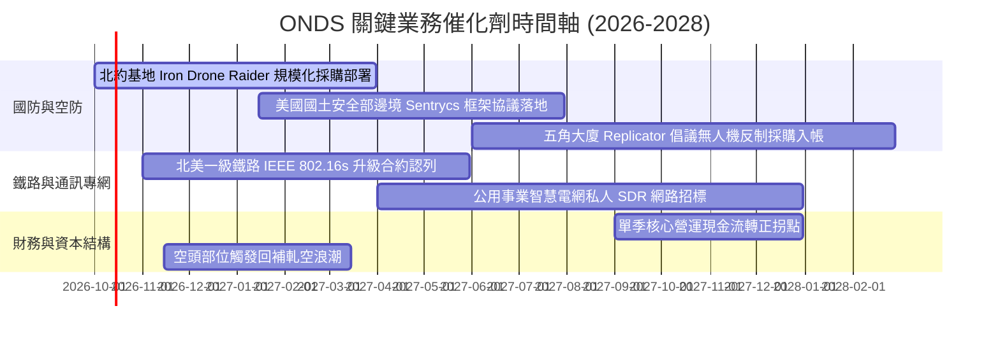

### 9.2 TAM 市場規模分析

```
╔══════════════════════════════════════════════════════════════════╗
║              ONDS 目標市場規模 (TAM) 與滲透展望                  ║
╠══════════════════════════════════════════════════════════════════╣
║                                                                  ║
║  1. 全球無人機反制系統 (C-UAS TAM):                              ║
║     2026 年規模: $4.2B ──> 2030 年預估: $12.8B (CAGR 32%)        ║
║     ONDS 當前滲透率: ~3.4% ｜ 目標滲透率 (2028): 8.5%            ║
║                                                                  ║
║  2. 關鍵基礎設施自主無人機 (Drone-in-a-Box TAM):                ║
║     2026 年規模: $2.1B ──> 2030 年預估: $7.5B (CAGR 37%)         ║
║     ONDS 當前滲透率: ~1.8% ｜ 目標滲透率 (2028): 5.0%            ║
║                                                                  ║
║  3. 私有工業無線專網 (Private LTE/SDR TAM):                      ║
║     2026 年規模: $3.8B ──> 2030 年預估: $8.9B (CAGR 24%)         ║
║     ONDS 當前滲透率: ~0.8% ｜ 目標滲透率 (2028): 2.5%            ║
║                                                                  ║
║  合計服務市場 TAM 超過 $10.1B，目前營收滲透率不足 2%，空間寬廣   ║
╚══════════════════════════════════════════════════════════════════╝
```

### 9.3 成長驅動力結構圖

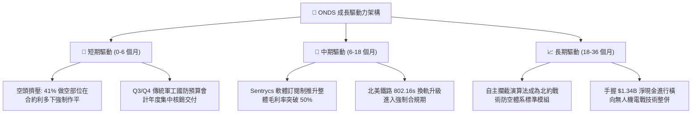

---

## 10. 風險矩陣

### 10.1 風險評分矩陣

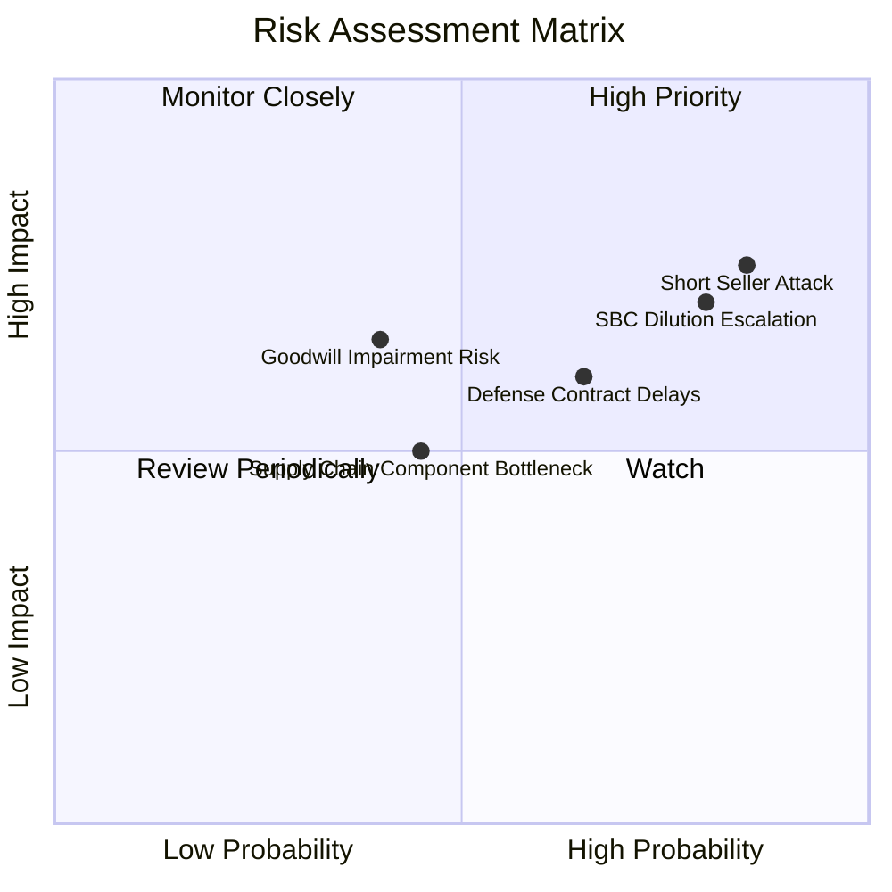

### 10.2 風險清單詳細分析

| # | 風險項目 | 發生機率 | 潛在財務衝擊 | 綜合風險評分 | 緩解措施與觀察指標 |
|---|----------|----------|--------------|--------------|--------------------|
| 1 | 🔴 **空頭狙擊與做空踩踏** | 高 (85%) | 高 (-30% 股價波動) | 🔴 **8.5/10** | 41.0% 空頭比例極高，空頭質疑營收真實性；公司需用連續兩季審計無保留現金流轉化進行反擊。 |
| 2 | 🔴 **SBC 與股權稀釋失控** | 高 (80%) | 高 (-25% 每股內在價值) | 🔴 **8.0/10** | Q2 SBC 達 $69.09M。若管理層不設定明確薪酬股份上限，股東權益將持續遭到稀釋侵蝕。 |
| 3 | 🟡 **國防專案驗收審查延遲** | 中 (65%) | 中 (-20% 單季營收) | 🟡 **6.5/10** | 國防採購具備跨年度審查風險；公司透過跨國分散（中東、北約、印太）降低單一政府風險。 |
| 4 | 🟡 **巨額商譽資產減損** | 中 (40%) | 高 (-$150M 帳面淨值) | 🟡 **6.0/10** | 帳上商譽達 $661.36M，多來自近期併購；若被收購主體協同效益低於預期，將面臨非現金減損。 |
| 5 | 🟢 **微波與射頻零組件短缺**| 低 (35%) | 中 (-10% 交付進度) | 🟢 **4.5/10** | FPGA 與射頻發射模組依賴專項供應商；已利用帳上現金提前進行長週期備料庫存。 |

---

## 11. 投資建議

### 11.1 最終綜合評級雷達圖

```
╔══════════════════════════════════════════════════════════════════╗
║                    ONDS 最終全維度評估評分                       ║
╠══════════════════════════════════════════════════════════════════╣
║  營收成長動能    9.5/10  ▓▓▓▓▓▓▓▓▓▓▓▓▓▓▓▓▓▓▓░  ★★★★★ 爆發頂級  ║
║  流動性與防禦性  9.0/10  ▓▓▓▓▓▓▓▓▓▓▓▓▓▓▓▓▓▓░░  ★★★★★ 淨現金強  ║
║  技術與市場地位  8.0/10  ▓▓▓▓▓▓▓▓▓▓▓▓▓▓▓▓░░░░  ★★★★☆ 利基專利  ║
║  同業估值吸引力  6.5/10  ▓▓▓▓▓▓▓▓▓▓▓▓▓░░░░░░░  ★★★☆☆ 溢價折讓  ║
║  基本面獲利品質  4.0/10  ▓▓▓▓▓▓▓▓░░░░░░░░░░░░  ★★☆☆☆ 核心虧損  ║
║  股權結構健康度  3.5/10  ▓▓▓▓▓▓▓░░░░░░░░░░░░░  ★☆☆☆☆ 做空稀釋  ║
╠══════════════════════════════════════════════════════════════╣
║  綜合投資評分    6.8/10  ▓▓▓▓▓▓▓▓▓▓▓▓▓░░░░░░░  🏆 投機型買入   ║
╚══════════════════════════════════════════════════════════════╝
```

### 11.2 目標價與隱含報酬率

| 投資情境 | 權重 | 12 個月目標價 | 隱含報酬率（相對現價 $6.73） | 核心觸發驅動條件 |
|----------|------|---------------|------------------------------|------------------|
| 🔴 **悲觀情境** | 25% | **$5.20** | **-22.7%** | 交付延遲，做空機構壓制，SBC 繼續惡意稀釋 |
| 🟡 **基準情境** | **55%** | **$13.50** | **+100.6%** | **單季營收突破 $100M，營業虧損收窄，軋空啟動** |
| 🟢 **樂觀情境** | 20% | **$21.00** | **+212.0%** | **北約全面列裝，Sentrycs 軟體授權大爆發** |
| **加權預期值** | 100% | **$12.93** | **+92.1%** | **期望值具備非對稱賠率特性** |

### 11.3 買入時機與觸發因素

```
╔══════════════════════════════════════════════════════════════════╗
║                  ✅ 買入與風控觸發 Checklist                     ║
╠══════════════════════════════════════════════════════════════════╣
║                                                                  ║
║  分批建倉觸發條件（當前符合 3 項，可啟動第一筆建倉）：           ║
║  ☑ 當前股價落入安全邊際區間（現價 $6.73，MOS 達 45.5%）           ║
║  ☑ 公司最新季度營收 YoY 成長率維持在 200% 以上（實際 1235%）      ║
║  ☑ 帳面淨現金高於總市值的 30%（實際為 34.3%）                    ║
║  ☐ 做空比例 (Short Float) 開始自 41% 出現第一波回補轉向下降      ║
║                                                                  ║
║  加碼觸發條件（滿足任一加碼 30%）：                              ║
║  ☐ 單季營運現金流 (OCF) 首度收窄至 -$10M 以內                    ║
║  ☐ 單季 SBC 佔營收比重下降至 25% 以下（終止過度稀釋）            ║
║  ☐ 贏得單筆超過 $50M 之美國國防部正式 Tier-1 CUAS 採購大單        ║
║                                                                  ║
║  停損/退場觸發條件（符合任一立即清倉觀望）：                     ║
║  ☐ 股價跌破 $4.80 關鍵支撐位（跌破淨現金防禦底線）               ║
║  ☐ SEC 介入調查會計營收認列或重大收購項目出現商譽一次性全額減損  ║
╚══════════════════════════════════════════════════════════════════╝
```

### 11.4 投資人適配度分析

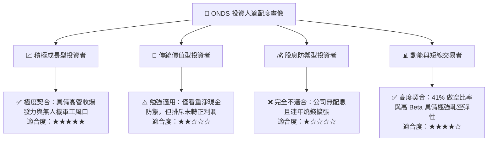

### 11.5 每季財報監控清單（Quarterly Watch List）

| 監控核心指標 | 最新數值 (2026Q2) | 加碼門檻 (Bullish) | 警戒/減碼門檻 (Bearish) | 核心意義解讀 |
|--------------|-------------------|--------------------|-------------------------|--------------|
| **單季營收 (Revenue)** | $83.77M | > $95.00M | < $60.00M | 驗證軍工訂單交付是否具延續性 |
| **毛利率 (Gross Margin)**| 43.1% | > 48.0% | < 38.0% | 檢視軟體授權佔比是否如期擴張 |
| **單季 SBC 金額** | $69.09M | < $25.00M | > $80.00M | 檢驗管理層抑制股東稀釋之誠信 |
| **營業現金流 (OCF)** | -$86.08M | > -$20.00M | < -$100.00M | 評估造血機能與真實燒錢速率 |
| **浮動股做空比例** | 41.0% | 跌破 25% (軋空實現)| 突破 50% (空頭重壓爆雷) | 追蹤市場情緒與借券流動性 |
| **現金及短期投資** | $1,384.5M | > $1,200.0M | < $800.0M | 確保 5 年以上生存跑道不變 |

### 11.6 反面論證：什麼會證明論點錯誤（What Would Change My Mind）

```
╔══════════════════════════════════════════════════════════════════╗
║              ⚠️ 論點失效條件（Disconfirming Evidence）           ║
╠══════════════════════════════════════════════════════════════════╣
║  本研究團隊的多頭論點在下列可量化條件出現時即刻判定失效，        ║
║  並將立即調降評級至「賣出/迴避」：                              ║
║                                                                  ║
║  1. 營收動能斷崖：FY2027 連續兩季營收 YoY 增速跌破 20.0%，證明當  ║
║     前暴增僅屬單次性試驗訂單，非結構性採購標準化。               ║
║  2. 獲利品質持續惡化：FY2027 全年 SBC 佔總營收比例仍高於 40.0%， ║
║     管理層將上市公司視為提款機，每股內在價值遭到不可逆稀釋。     ║
║  3. 現金燃燒失控：單季營運現金流淨流出擴大至 -$120M 以上，且無相 ║
║     對應的大型政府應收帳款支撐，燒錢速度遠超預期。               ║
║  4. 實質 ROIC 惡化：至 2028 年 ROIC 仍無法收斂至 -5% 以上，且未   ║
║     能展現任何由負轉正的營運槓桿軌跡。                           ║
║  5. 核心產品失寵：美軍或北約公開宣布採用 Anduril 或 Axon/Dedrone ║
║     作為唯一微型反無人機標準，Iron Drone 遭到邊緣化。             ║
╚══════════════════════════════════════════════════════════════════╝
```

---
> **免責聲明**：本報告依據市場公開數據撰寫，分析內容僅供學術研究與機構投資交流參考，不構成任何針對個人之具體投資買賣建議。市場有風險，投資需獨立審慎判斷。