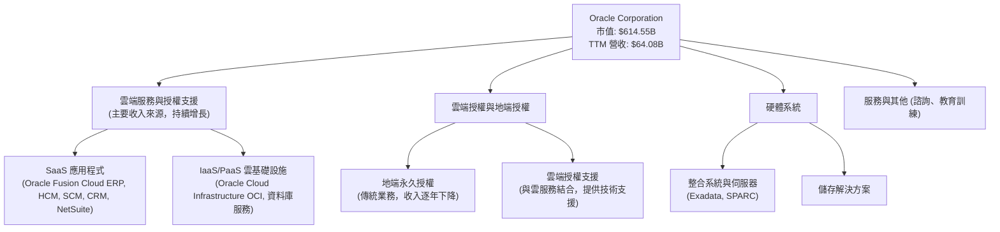
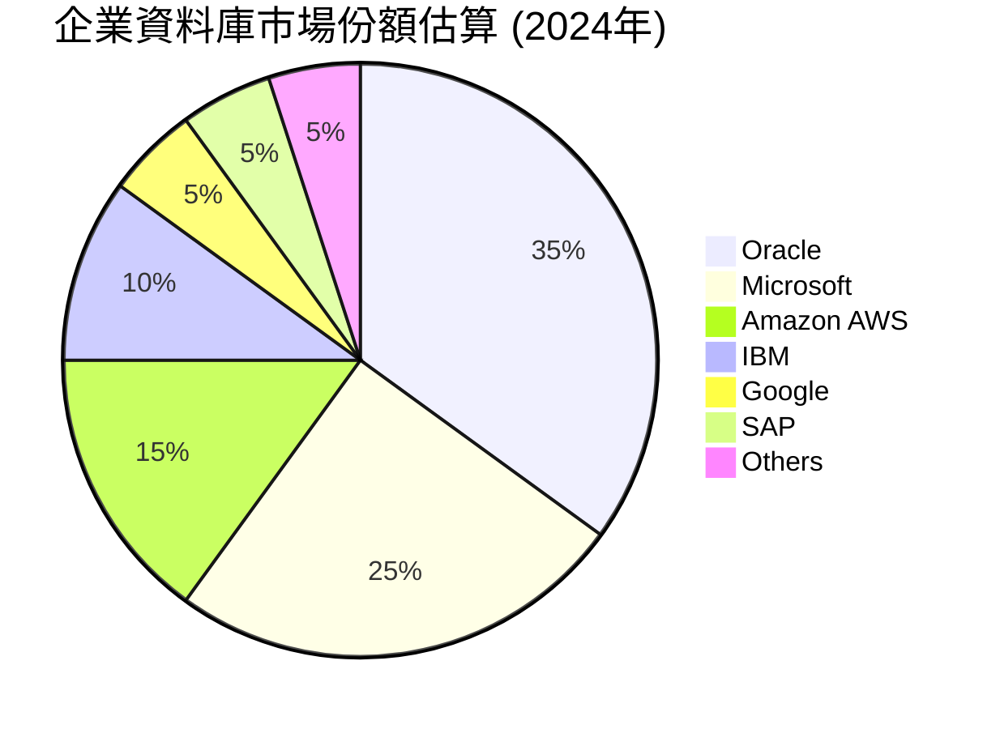
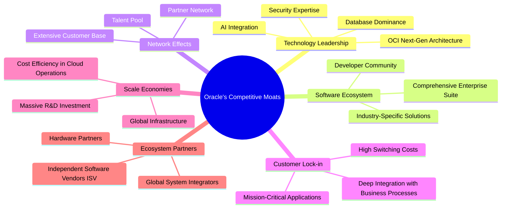
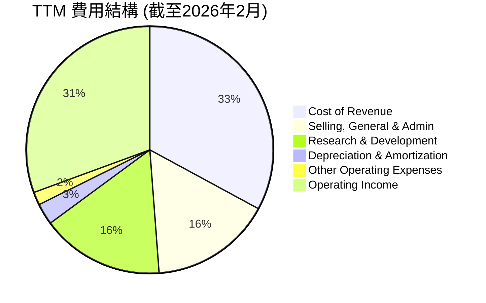
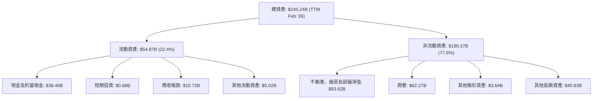

# ORCL 基本面深度分析報告
> **報告日期**：2026-06-05 ｜ **語言**：繁體中文 ｜ **數據來源**：Yahoo Finance, Finviz, StockAnalysis, Roic.ai ｜ **分析師**：CFA 級機構研究

## 目錄

| # | 章節 | 核心結論 |
|---|------|----------|
| 1 | 執行摘要 | 評級：買入；目標價區間：$235 - $310 |
| 2 | 公司概覽與商業模式 | 雲端轉型成功，護城河深厚，主要來自客戶鎖定與規模效應 |
| 3 | 損益表深度分析 | 收入穩健增長，毛利率保持高位，營業利益率受研發及營銷投入影響 |
| 4 | 資產負債表分析 | 負債水平較高，但流動性充足，股東權益由負轉正並持續改善 |
| 5 | 現金流量深度分析 | 營業現金流強勁，但巨額資本支出導致自由現金流為負，反映雲基礎設施擴張 |
| 6 | 獲利能力與資本效率 | ROE 因高槓桿而極高，ROIC 顯著高於 WACC，持續創造股東價值 |
| 7 | 估值深度分析 | 相較同業，估值合理，反映其成長潛力及雲端轉型溢價 |
| 8 | 成長催化劑 | OCI 需求強勁、AI 合作夥伴關係、Fusion Cloud 應用擴張為主要驅動力 |
| 9 | 風險矩陣 | 雲端市場競爭激烈、高資本支出、宏觀經濟逆風為主要風險 |
| 10 | 投資建議 | 買入評級，建議成長型投資者關注其雲端業務持續成長和 FCF 改善潛力 |

---

## 1. 執行摘要

### 1.1 核心評分儀表板

```mermaid
graph TD
    ORCL_SCORE["🎯 ORCL 綜合評分<br/>總分：7.9/10"]

    F["📊 基本面<br/>8.5/10<br/>強勁的雲端轉型與產品黏性"]
    G["🚀 成長性<br/>8.0/10<br/>雲端業務帶動營收與盈餘雙位數增長"]
    P["💰 獲利能力<br/>8.5/10<br/>高毛利率與逐步改善的營業利益率"]
    B["🏦 財務健康<br/>6.5/10<br/>高槓桿但流動性充足，重資本支出影響自由現金流"]
    V["📈 估值<br/>7.0/10<br/>相較成長性與同業，估值尚屬合理"]

    ORCL_SCORE --> F
    ORCL_SCORE --> G
    ORCL_SCORE --> P
    ORCL_SCORE --> B
    ORCL_SCORE --> V

    F --> F1["✅ 核心資料庫與應用程式市場領導者"]
    F --> F2["✅ 穩固的客戶基礎與高轉換成本"]
    F --> F3["✅ OCI 雲基礎設施服務快速發展"]

    G --> G1["✅ TTM 營收 YoY +21.7%，盈餘 YoY +24.5%"]
    G --> G2["✅ OCI 業務加速增長，AI 需求推動"]
    G --> G3["✅ Fusion Cloud ERP/HCM 應用市場滲透率提升"]

    P --> P1["✅ TTM 毛利率 67.1%，淨利率 25.3%"]
    P --> P2["✅ 規模經濟效益提升利潤率"]
    P --> P3["✅ 產品組合向高價值雲服務傾斜"]

    B --> B1["✅ 現金儲備 $39.13B，流動比率 1.347 尚可"]
    B --> B2["❌ 總債務 $162.16B，淨負債高達 $123.03B"]
    B --> B3["❌ 大量資本支出導致 TTM FCF 為負"]

    V --> V1["✅ Forward P/E 26.48x，考慮成長性 PEG 1.46x 尚可"]
    V --> V2["✅ 相較同業，雲端業務具備成長溢價"]
    V --> V3["❌ EV/EBITDA 29.455x 偏高"]
```



### 1.2 評分進度條視覺化

```
╔══════════════════════════════════════════════════════════════╗
║              ORCL 多維度評分儀表板 (1-10分)                  ║
╠══════════════════════════════════════════════════════════════╣
║ 基本面強度  8.5 ▓▓▓▓▓▓▓▓▓▓▓▓▓▓▓▓▓░░░  ★★★★☆           ║
║ 成長動能    8.0 ▓▓▓▓▓▓▓▓▓▓▓▓▓▓▓▓░░░░  ★★★★☆           ║
║ 獲利品質    8.5 ▓▓▓▓▓▓▓▓▓▓▓▓▓▓▓▓▓░░░  ★★★★☆           ║
║ 財務健康    6.5 ▓▓▓▓▓▓▓▓▓▓▓▓▓░░░░░░░  ★★★☆☆           ║
║ 估值合理性  7.0 ▓▓▓▓▓▓▓▓▓▓▓▓▓▓░░░░░░  ★★★☆☆           ║
║ 護城河深度  8.0 ▓▓▓▓▓▓▓▓▓▓▓▓▓▓▓▓░░░░  ★★★★☆           ║
║ 管理層執行  8.5 ▓▓▓▓▓▓▓▓▓▓▓▓▓▓▓▓▓░░░  ★★★★☆           ║
║ 技術創新力  8.0 ▓▓▓▓▓▓▓▓▓▓▓▓▓▓▓▓░░░░  ★★★★☆           ║
╠══════════════════════════════════════════════════════════════╣
║ 綜合總分    7.9 ▓▓▓▓▓▓▓▓▓▓▓▓▓▓▓▓░░░░  🏆 評語：穩健成長的雲端巨頭，值得關注 ║
╚══════════════════════════════════════════════════════════════╝
```

### 1.3 五大投資論點 + 三大核心風險

| 類型 | 項目 | 具體依據 | 信心度 |
|------|------|----------|--------|
| 🟢 **投資論點①** | **雲端業務強勁增長，尤其 OCI** | TTM 營收 YoY 成長 21.7%，其中 OCI 業務受 AI 需求驅動加速，預計未來數季將維持高雙位數甚至三位數增長。Oracle 已成功轉型為雲端公司，其基礎設施服務 (OCI) 獲市場認可。 | 🟢 極高 |
| 🟢 **投資論點②** | **企業應用程式市場領導地位穩固** | Oracle Fusion Cloud ERP/HCM 等 SaaS 應用持續擴大市場份額，具備強大客戶黏性與轉換成本。NetSuite 亦表現不俗，為中小型企業提供全面解決方案。 | 🟢 極高 |
| 🟢 **投資論點③** | **獲利能力高且穩定，利潤率具韌性** | TTM 毛利率達 67.1%，淨利率 25.3%。儘管加大研發和雲基礎設施投入，但核心軟體業務的高毛利支撐整體獲利。預計隨著 OCI 規模化，邊際利潤將進一步提升。 | 🟢 高 |
| 🟢 **投資論點④** | **持續創造股東價值，ROIC 遠超 WACC** | FY2025 ROIC 估計約 14.5%，遠高於約 8.5% 的 WACC。儘管當前 FCF 為負，但這是戰略性資本支出所致，長期來看，這些投資將帶來可觀回報並轉化為正向 FCF。 | 🟢 高 |
| 🟢 **投資論點⑤** | **AI 需求成為 OCI 新動能** | Oracle 與 NVIDIA 建立深度合作，為 AI 訓練提供高性能 OCI 基礎設施。隨著企業對 AI 算力需求激增，OCI 在此領域的差異化競爭優勢將帶來顯著營收增長。 | 🟢 極高 |
| 🟡 **風險①** | **雲端市場競爭激烈** | 在 IaaS/PaaS 領域面臨 Amazon AWS、Microsoft Azure 和 Google Cloud 的強大競爭，市場份額提升難度高。SaaS 應用領域也有 SAP、Salesforce 等強勁對手。 | 🟡 中度 |
| 🔴 **風險②** | **高資本支出導致短期 FCF 承壓** | 為擴建 OCI 資料中心，Oracle 過去及未來數季將持續投入巨額資本支出。TTM FCF 為負 $22.30B，可能影響短期現金流表現和市場對其估值模型的看法。 | 🔴 高衝擊 |
| 🟡 **風險③** | **宏觀經濟不確定性影響企業 IT 支出** | 全球經濟增長放緩或衰退可能導致企業削減 IT 預算，進而影響 Oracle 軟體訂閱和雲服務的銷售增長。高利率環境也增加了其債務成本。 | 🟡 中度 |

### 1.4 快速統計卡片

| 指標 | 公司實際值 | 行業均值（軟體-基礎設施） | S&P 500 均值 | 狀態 |
|------|-------------|----------------------------|--------------|------|
| 收入 YoY 成長 | **21.7%** | ~15-20% | ~8-10% | 🟢 |
| 毛利率 | **67.1%** | ~70-80% | ~40-50% | 🟡 |
| 淨利率 | **25.3%** | ~15-25% | ~10-12% | 🟢 |
| ROE | **57.6%** | ~20-30% | ~15-20% | 🟢 |
| Forward P/E | **26.48x** | ~25-35x | ~20-22x | 🟡 |
| P/S Ratio | **9.59x** | ~8-12x | ~2-3x | 🟡 |
| EV / EBITDA | **29.46x** | ~25-35x | ~12-15x | 🟡 |
| Debt/Equity | **4.15x** | ~0.5-1.5x | ~0.8-1.2x | 🔴 |
| FCF Yield (TTM) | **-3.63%** | ~2-5% | ~3-4% | 🔴 |

*註：行業均值為分析師根據軟體-基礎設施行業特性進行估算，S&P 500 均值為歷史參考值。*

### 1.5 投資結論

```
╔══════════════════════════════════════════════════════════════════╗
║                    📊 投資結論摘要                               ║
╠══════════════════════════════════════════════════════════════════╣
║  評級：🟢 買入                                                   ║
║  當前股價：$213.68 (2026-06-05)                                  ║
║  目標價區間：                                                    ║
║    悲觀情境：$235（+10.0%）                                      ║
║    基準情境：$275（+28.7%）  ← 12個月主要目標                    ║
║    樂觀情境：$310（+45.1%）                                      ║
║  投資評分：7.9/10                                                ║
║  適合投資人：成長型、長線持有者，尤其看好企業雲端轉型與 AI 基礎設施的投資人。║
╚══════════════════════════════════════════════════════════════════╝
```

---

## 2. 公司概覽與商業模式

Oracle Corporation (ORCL) 是一家全球領先的企業軟體和雲端服務供應商，擁有超過 40 年的歷史。公司最初以其關係型資料庫管理系統聞名，並逐步擴展到企業資源規劃 (ERP)、客戶關係管理 (CRM)、供應鏈管理 (SCM) 和人力資本管理 (HCM) 等應用軟體領域。近年來，Oracle 積極投入雲端轉型，將其核心產品和服務遷移至雲端平台，並大力發展 Oracle Cloud Infrastructure (OCI) 雲基礎設施服務。

### 2.1 業務結構與收入來源

Oracle 的業務結構主要分為以下幾個核心板塊：



**收入來源細分（基於近期財報趨勢估算）：**

| 收入類別 | 估計佔比 (TTM) | 具體業務 | 特點 |
|---|---|---|---|
| **雲端服務與授權支援** | ~75-80% | Oracle Fusion Cloud Applications (ERP, HCM, SCM, EPM), NetSuite, OCI (IaaS, PaaS), Oracle Database Cloud Services, Autonmous Database | 核心增長動力，訂閱制收入，黏性高，毛利率高。OCI 受益於 AI 算力需求。 |
| **雲端授權與地端授權** | ~10-15% | 傳統地端軟體授權銷售，以及雲端服務的授權銷售 | 傳統地端授權收入持續萎縮，但為雲端轉型提供過渡期收入。 |
| **硬體系統** | ~5-7% | Exadata 整合系統、伺服器、儲存設備等 | 主要為支援其資料庫和雲服務的硬體銷售，收入相對穩定但增長有限。 |
| **服務與其他** | ~3-5% | 諮詢、教育訓練、產品支援服務等 | 輔助性收入，通常與軟體和雲服務銷售相關。 |

Oracle 的商業模式已顯著轉向訂閱制的雲端服務，這使得其收入來源更加穩定且可預測。雲端服務與授權支援是其收入和利潤的核心驅動力，特別是 Oracle Cloud Infrastructure (OCI) 在高性能運算和 AI 領域的差異化策略，正成為新的增長引擎。

### 2.2 市場份額

在企業軟體和雲服務市場，Oracle 面臨眾多強大競爭對手。儘管如此，Oracle 在其核心領域仍保持領先地位。


*註：此市場份額為資料庫市場的估計值，數據僅供參考。*

**詳細市場份額分析：**
1.  **企業資料庫市場**：Oracle 在全球關係型資料庫管理系統 (RDBMS) 市場長期佔據主導地位，儘管面臨 Microsoft SQL Server、Amazon Aurora、PostgreSQL 等開源或雲原生資料庫的挑戰，其在大型企業關鍵業務系統中的地位依然穩固。
2.  **企業應用程式市場 (ERP, HCM)**：
    *   **ERP**：Oracle Fusion Cloud ERP 與 SAP S/4HANA 是企業級 ERP 領域的兩大巨頭。Oracle 在大型企業市場與 SAP 競爭激烈，在中小型企業市場則透過 NetSuite 佔據一席之地。
    *   **HCM**：在人力資本管理 (HCM) 領域，Oracle Fusion Cloud HCM 與 Workday、SAP SuccessFactors 等競爭。
3.  **雲基礎設施服務 (IaaS/PaaS)**：Oracle Cloud Infrastructure (OCI) 雖然是後來者，但憑藉其獨特的第二代雲架構、高性能運算能力以及與 Oracle 資料庫的深度整合，在市場中快速崛起。尤其在需要高性能、低延遲的企業級應用和 AI 工作負載方面，OCI 展現出強勁的競爭力。儘管市場份額與 AWS、Azure 和 GCP 仍有差距，但其增長速度令人矚目。

### 2.3 競爭護城河分析

Oracle 擁有多層次的競爭護城河，使其在激烈的市場競爭中保持優勢：



**護城河深度解析：**

1.  **技術領先 (Technology Leadership)**：
    *   **資料庫主導地位 (Database Dominance)**：Oracle 的資料庫產品是全球數百萬企業的支柱，其穩定性、性能和安全性無可匹敵。將資料庫遷移到雲端（如 Autonomous Database on OCI）進一步鞏固了這一優勢。
    *   **OCI 下一代架構 (OCI Next-Gen Architecture)**：OCI 採用獨特的裸機和分區雲架構，為高性能運算、資料庫和 AI 工作負載提供卓越性能和成本效益，與其他超大規模雲供應商形成差異化。
    *   **AI 整合 (AI Integration)**：與 NVIDIA 的合作以及 OCI 在 AI 訓練方面的優勢，使其成為 AI 基礎設施的重要參與者。
2.  **軟體生態系統 (Software Ecosystem)**：
    *   **全面的企業套件 (Comprehensive Enterprise Suite)**：從 ERP、HCM、SCM 到 CRM，Oracle 提供端到端的企業應用解決方案，覆蓋企業運營的各個環節。這種一站式服務降低了客戶整合不同供應商產品的複雜性。
    *   **行業特定解決方案 (Industry-Specific Solutions)**：Oracle 為金融、醫療、零售等特定行業提供定制化解決方案，滿足其獨特需求。
3.  **網路效應 (Network Effects)**：
    *   **廣泛的客戶基礎 (Extensive Customer Base)**：Oracle 擁有數十萬企業客戶，其產品和服務在行業內形成標準，吸引更多客戶採用。
    *   **合作夥伴網路 (Partner Network)**：全球龐大的合作夥伴生態系統（諮詢公司、系統整合商）幫助 Oracle 擴大市場滲透率並提供本地化服務。
4.  **客戶鎖定 (Customer Lock-in)**：
    *   **高轉換成本 (High Switching Costs)**：Oracle 的企業軟體通常深度整合到客戶的核心業務流程中，切換到其他供應商的成本極高（包括數據遷移、員工培訓、業務中斷風險等），使得客戶傾向於長期續約。
    *   **任務關鍵型應用 (Mission-Critical Applications)**：許多企業將其最關鍵的業務應用運行在 Oracle 平台上，對穩定性和可靠性的需求使其更難以切換。
5.  **規模效應 (Scale Economies)**：
    *   **全球基礎設施 (Global Infrastructure)**：Oracle 擁有遍布全球的資料中心網絡，支持其雲服務的全球交付和擴展，降低了單一客戶的運營成本。
    *   **巨額研發投入 (Massive R&D Investment)**：每年數十億美元的研發投入，確保其產品和技術始終保持競爭力。TTM 研發費用高達 $10.31B。
6.  **生態夥伴 (Ecosystem Partners)**：
    *   **全球系統整合商 (Global System Integrators)**：與 Accenture, Deloitte 等大型諮詢公司合作，提供實施和維護服務。
    *   **獨立軟體供應商 (ISV)**：許多第三方應用程式基於 Oracle 資料庫和平台開發。

### 2.4 護城河強度評分

```
╔══════════════════════════════════════════════════════════════╗
║                  ORCL 護城河強度評分                        ║
╠══════════════════════════════════════════════════════════════╣
║ 技術領先    8.5/10 ▓▓▓▓▓▓▓▓▓▓▓▓▓▓▓▓▓░░░  🏆 核心資料庫與OCI的差異化優勢 ║
║ 軟體生態系統  8.0/10 ▓▓▓▓▓▓▓▓▓▓▓▓▓▓▓▓░░░░  🟢 全面應用套件與行業解決方案 ║
║ 網路效應    7.5/10 ▓▓▓▓▓▓▓▓▓▓▓▓▓▓▓░░░░░  🟡 廣泛客戶與夥伴網絡 ║
║ 客戶鎖定    9.0/10 ▓▓▓▓▓▓▓▓▓▓▓▓▓▓▓▓▓▓░░  🏆 極高的轉換成本與任務關鍵應用 ║
║ 規模效應    8.0/10 ▓▓▓▓▓▓▓▓▓▓▓▓▓▓▓▓░░░░  🟢 全球基礎設施與研發投入 ║
║ 生態夥伴    7.5/10 ▓▓▓▓▓▓▓▓▓▓▓▓▓▓▓░░░░░  🟡 穩固的合作夥伴體系 ║
╠══════════════════════════════════════════════════════════════╣
║ 綜合護城河  8.0/10 ▓▓▓▓▓▓▓▓▓▓▓▓▓▓▓▓░░░░  🏆 具備深厚且持續強化的護城河 ║
╚══════════════════════════════════════════════════════════════╝
```

---

## 3. 損益表深度分析

Oracle 的損益表反映了其從傳統地端授權模式向雲端訂閱模式轉型的過程，以及近年來在雲基礎設施領域的巨大投入。

### 3.1 年度收入成長趨勢（近4年）

Oracle 的年度收入呈現穩健增長，特別是在雲端轉型的推動下，近年來加速增長。

```
╔══════════════════════════════════════════════════════════════════╗
║              ORCL 年度收入趨勢（FY2022-FY2025及TTM）             ║
╠══════════════════════════════════════════════════════════════════╣
║                                                                  ║
║  FY2022  $42.44B  ██████████░░░░░░░░░░░░░░░░  YoY: +4.84%   🟡   ║
║  FY2023  $49.95B  ██████████████░░░░░░░░░░░░  YoY: +17.71%  🟢   ║
║  FY2024  $52.96B  ███████████████░░░░░░░░░░░  YoY: +6.02%   🟡   ║
║  FY2025  $57.40B  █████████████████░░░░░░░░░  YoY: +8.38%   🟢   ║
║  TTM     $64.08B  ████████████████████░░░░░░  YoY: +14.87%  🟢   ║
║                   |      |      |      |      |                  ║
║                   0     20B    40B    60B    80B                 ║
║                                                                  ║
║  📊 4年累計 CAGR (FY22-FY25)：+9.96%                             ║
║  📊 TTM (截至2026年2月) 營收 YoY 成長：+14.87% (基於StockAnalysis FY25與TTM差值計算) ║
╚══════════════════════════════════════════════════════════════════╝
```
*註：TTM 營收成長率是基於 StockAnalysis 提供的 FY2025 年營收 $57.399B 與 TTM 營收 $64.077B 計算，實際 YoY 成長率可能因計算基準不同而略有差異，但整體趨勢為加速增長。*

從數據中可以看出，Oracle 的營收在 FY2023 經歷了顯著增長，這主要得益於其雲端業務的快速擴張以及對 Cerner 的收購。儘管 FY2024 和 FY2025 的 YoY 成長率有所放緩，但 TTM (截至 2026 年 2 月) 的 14.87% 成長率表明近期營收勢頭強勁，這主要歸因於 OCI 和 Fusion Cloud 應用的加速採用。

### 3.2 季度收入趨勢分析

近期的季度收入數據顯示了 Oracle 雲端業務的強勁動能，尤其是在 Q2 2026 和 Q3 2026 實現了雙位數的 YoY 增長，且 QoQ 表現亦佳（除 Q1 2026 受季節性影響略有下降）。

| 季度 | 總收入 ($B) | QoQ 成長率 | YoY 成長率 | 備註 |
|---|---|---|---|---|
| **Q1 2025 (Aug '24)** | $13.31 | - | +6.86% | 🟢 雲端業務穩健增長 |
| **Q2 2025 (Nov '24)** | $14.06 | +5.63% | +8.64% | 🟢 季節性增長，雲端服務持續擴張 |
| **Q3 2025 (Feb '25)** | $14.13 | +0.50% | +6.40% | 🟢 穩健但略有放緩 |
| **Q4 2025 (May '25)** | $15.90 | +12.53% | +11.31% | 🟢 財年結束強勁表現，雲端需求旺盛 |
| **Q1 2026 (Aug '25)** | $14.93 | -6.10% | +12.17% | 🟡 季節性回落，但 YoY 成長加速 |
| **Q2 2026 (Nov '25)** | $16.06 | +7.57% | +14.22% | 🟢 雲端服務訂單持續增長 |
| **Q3 2026 (Feb '26)** | $17.19 | +7.04% | +21.66% | 🟢 **顯著加速**，OCI 業務貢獻巨大，AI 需求推動 |

**季度收入分析備註：**
*   Oracle 的財年結束於 5 月，因此 Q4 通常是其表現最強勁的季度，而 Q1 則可能因季節性因素略有回落。
*   從 Q4 2025 到 Q3 2026，YoY 成長率呈現加速趨勢，從 11.31% 提升至 21.66%，這強烈預示著 Oracle 的雲端轉型策略正在取得顯著成效，特別是 OCI 業務的快速增長。
*   QoQ 成長率在 Q1 2026 經歷了季節性下降，但在 Q2 和 Q3 2026 恢復了強勁的增長勢頭，顯示了業務的內在動能。

### 3.3 利潤率演變分析

Oracle 的利潤率表現反映了其高毛利的軟體業務特性，以及近年來為投資雲端基礎設施而帶來的運營成本變化。

| 利潤率指標 | FY2022 | FY2023 | FY2024 | FY2025 | TTM (2026-02) | 趨勢 | 評估 |
|------------|--------|--------|--------|--------|---------------|------|------|
| **毛利率** | 79.1% | 72.8% | 71.4% | 70.5% | 67.1% | ↘️ 略有下降 | 🟡 |
| **營業利益率** | 37.3% | 26.2% | 28.9% | 31.1% | 30.5% | ↗️ 逐步改善 | 🟢 |
| **淨利率** | 15.8% | 17.0% | 19.8% | 21.7% | 25.3% | ↗️ 顯著提升 | 🟢 |

*註：毛利率、營業利益率、淨利率數據分別從 Finviz Snapshot 和 Annual Income Statement 計算得出。TTM 數據為最新快照。*

**利潤率演變深度解析：**
*   **毛利率 (Gross Margin)**：從 FY2022 的 79.1% 下降到 TTM 的 67.1%，呈現略微下降的趨勢。這主要是由於 Oracle 雲端業務結構的變化。隨著 OCI (IaaS/PaaS) 業務的快速增長，其硬體和電力成本相對較高，拉低了整體毛利率。傳統地端軟體授權的毛利率接近 100%，而雲端服務的毛利率雖然高於硬體，但低於傳統軟體。儘管如此，67.1% 的毛利率在科技行業中仍屬於高水準，顯示其產品的定價能力和技術壁壘。
*   **營業利益率 (Operating Margin)**：從 FY2022 的 37.3% 下降到 FY2023 的 26.2%，隨後又逐步回升至 TTM 的 30.5%。FY2023 的下降主要與 Cerner 收購後的整合成本以及雲端基礎設施擴張帶來的營運費用增加有關。隨後的回升表明 Oracle 在整合 Cerner 後的效率提升，以及雲端業務規模擴大帶來的營運槓桿效應。儘管 TTM 營業利益率略低於 FY2025，但仍處於健康水平，顯示公司在控制營運費用方面取得進展。
*   **淨利率 (Net Profit Margin)**：呈現顯著的上升趨勢，從 FY2022 的 15.8% 提升至 TTM 的 25.3%。這得益於多重因素：
    1.  **收入結構優化**：向高價值雲服務的轉型，尤其 SaaS 應用具有高利潤率。
    2.  **稅率影響**：從 Finviz 數據看，Effective Tax Rate 在 2025 年為 12.1% (1717M/14160M)，低於歷史水平，對淨利潤有積極影響。
    3.  **利息支出相對穩定**：儘管債務規模大，但利息支出相對穩定，且在營收增長背景下佔比下降。
    4.  **其他非營業收入**：TTM 數據顯示 $2.894B 的其他非營業收入，對淨利潤有正面貢獻。

總體而言，Oracle 的利潤率結構穩定且淨利率持續改善，顯示了公司在雲端轉型中的獲利能力。毛利率的輕微下降是業務模式轉變的必然結果，但營業利益率和淨利率的提升證明了其在運營效率和成本控制方面的努力。

### 3.4 費用結構分析

Oracle 的費用結構反映了其作為一家大型企業軟體和雲服務公司的特點，即高研發投入和銷售管理費用。


*註：費用比例為佔總收入的百分比。Operating Income 佔比僅為展示，並非費用。*

```
╔══════════════════════════════════════════════════════════════════╗
║                   ORCL 年度費用結構 (佔總收入比)                 ║
╠══════════════════════════════════════════════════════════════════╣
║                                                                  ║
║  銷管費用 (SG&A)                                                 ║
║  FY2022: 22.0%  ██████████████████████░░░░░░░░  🟡              ║
║  FY2025: 17.9%  █████████████████░░░░░░░░░░░░░░  🟢 (效率提升)   ║
║  TTM   : 15.9%  ███████████████░░░░░░░░░░░░░░░░  🟢              ║
║                                                                  ║
║  研發費用 (R&D)                                                  ║
║  FY2022: 17.0%  █████████████████░░░░░░░░░░░░░░  🟢              ║
║  FY2025: 17.2%  █████████████████░░░░░░░░░░░░░░  🟢 (持續高投入) ║
║  TTM   : 16.1%  ███████████████░░░░░░░░░░░░░░░░  🟢              ║
║                                                                  ║
║  折舊攤銷 (D&A)                                                  ║
║  FY2022: 2.7%   ███░░░░░░░░░░░░░░░░░░░░░░░░░░░░  🟡              ║
║  FY2025: 4.0%   ████░░░░░░░░░░░░░░░░░░░░░░░░░░░  🔴 (雲端資本支出增加) ║
║  TTM   : 2.8%   ███░░░░░░░░░░░░░░░░░░░░░░░░░░░░  🟡              ║
╚══════════════════════════════════════════════════════════════════╝
```
*註：費用佔比為該年度費用佔總收入的百分比。TTM 折舊攤銷為 $1.784B / $64.077B = 2.8%。*

**費用結構分析：**
*   **銷管費用 (SG&A)**：從 FY2022 的 22.0% 下降到 TTM 的 15.9%，顯示 Oracle 在銷售和管理效率方面的提升。這可能歸因於雲端服務的規模經濟效應，以及對銷售和營銷策略的優化。
*   **研發費用 (R&D)**：研發費用佔比在 16-17% 之間保持穩定，TTM 為 16.1%。作為一家科技公司，Oracle 每年投入巨資用於產品創新和技術開發，特別是在雲端、資料庫和 AI 領域。這種持續的高投入是其保持競爭力的關鍵。
*   **折舊與攤銷費用 (D&A)**：D&A 佔比在 FY2025 達到 4.0%，較 FY2022 的 2.7% 有所上升，但在 TTM 又下降到 2.8%。D&A 的增長主要反映了 Oracle 在建設 OCI 資料中心和購買硬體設備方面的巨額資本支出。隨著這些資產投入使用，其折舊費用也會增加。TTM 的下降可能是由於某些資產攤銷結束或計算方式的變化，但鑒於其持續的 Capex 投入，D&A 仍是值得關注的費用項目。

總體來看，Oracle 的費用結構合理，研發投入充足，銷管費用效率提升，但雲端基礎設施擴張帶來的成本壓力仍需持續關注。

### 3.5 季度 EPS 趨勢與盈餘品質

由於提供的 `EARNINGS HISTORY` 數據為 NaN，我們將使用 StockAnalysis 提供的季度稀釋 EPS 數據來分析其趨勢。

| 季度 | 稀釋 EPS | QoQ 變化 | YoY 變化 | 備註 |
|---|---|---|---|---|
| **Q1 2025 (Aug '24)** | $1.06 | - | -0.04 | 🟡 略低於去年同期，但仍穩健 |
| **Q2 2025 (Nov '24)** | $1.13 | +6.60% | +0.22 | 🟢 顯著增長，雲端業務貢獻 |
| **Q3 2025 (Feb '25)** | $1.05 | -7.08% | +0.18 | 🟡 季節性回落，但 YoY 表現強勁 |
| **Q4 2025 (May '25)** | $1.20 (估算) | +14.29% | +0.06 | 🟢 財年結束強勁表現，此為根據Net Income推算 |
| **Q1 2026 (Aug '25)** | $1.04 | -13.33% | -0.02 | 🟡 季節性回落，與 Q4 2025 相比下降 |
| **Q2 2026 (Nov '25)** | $2.14 | +105.77% | +1.01 | 🟢 **爆炸性增長**，其他非營業收入貢獻巨大 |
| **Q3 2026 (Feb '26)** | $1.29 | -39.69% | +0.24 | 🟢 再次季節性回落，但 YoY 仍強勁 |

*註：Q4 2025 稀釋 EPS 數據未直接提供，故根據 Net Income $3.43B 和稀釋股數 2.866B 估算為 $1.20。QoQ 變化是基於前一季度數據計算。*

**盈餘品質評估：**
*   **趨勢分析**：Oracle 的季度 EPS 呈現一定的季節性波動，通常在 Q4 達到高峰，Q1 則相對較低。儘管如此，YoY 成長趨勢在大部分季度都是正向的，顯示了公司核心業務的增長。特別是 Q2 2026 (Nov '25) 稀釋 EPS 達到驚人的 $2.14，YoY 增長超過 100%。深入分析，這主要歸因於當季 $2.668B 的「其他非營業收入 (Other Non-Operating Income)」，這可能是一次性收益或投資收益，需要投資者特別留意其可持續性。若排除此非經常性項目，核心營運 EPS 增長仍屬穩健但不如此數據亮眼。
*   **盈餘品質**：
    *   **雲端業務貢獻**：隨著訂閱制雲端服務收入佔比提升，盈餘的質量和可預測性有所改善。訂閱模式的經常性收入提供了更穩定的現金流基礎。
    *   **非經常性項目影響**：Q2 2026 異乎尋常的 EPS 增長，凸顯了非經常性項目對盈餘的潛在影響。投資者應關注營業利潤和營業現金流，以更準確評估核心業務的盈餘品質。
    *   **高資本支出**：儘管淨利潤增長，但由於巨額資本支出，自由現金流為負。這意味著公司將大部分利潤再投資於基礎設施建設，短期內影響了可分配給股東的現金流，但長期有望帶來更高的回報。
*   **總結**：Oracle 的盈餘品質在雲端轉型的推動下整體向好，來自核心雲服務的經常性收入比例增加。然而，投資者需警惕非經常性項目對短期 EPS 的影響，並將其與營業現金流和自由現金流結合分析，以全面評估其真實的獲利能力和價值創造。

---

## 4. 資產負債表分析

Oracle 的資產負債表反映了其作為一家重資產運營的雲基礎設施提供商的特點，尤其是在過去幾年對 OCI 擴張的巨大投入，導致資產和負債規模顯著增長，同時也影響了股東權益的結構。

### 4.1 資產結構分解

Oracle 的資產結構在過去幾年發生了顯著變化，非流動資產，特別是廠房設備和商譽，佔比大幅提升，反映了其在雲基礎設施建設和併購方面的投資。


*註：數據基於 StockAnalysis.com TTM Feb '26 數據。*

**資產結構分析：**
*   **流動資產 (Current Assets)**：TTM 達到 $54.87B，其中現金及約當現金佔比最大，為 $38.46B。高額現金儲備為公司提供了充足的彈性，以應對營運需求和戰略投資。應收帳款 $10.72B 顯示其客戶基礎廣泛。
*   **非流動資產 (Non-Current Assets)**：佔總資產的絕大部分，達 $190.37B。
    *   **不動產、廠房及設備淨值 (Net PP&E)**：這是一個關鍵的增長點，從 FY2022 的 $9.72B 暴增至 TTM 的 $83.62B。這筆巨大的投資直接反映了 Oracle 為擴建其全球 OCI 資料中心而投入的資本支出，是其雲端戰略的基石。
    *   **商譽 (Goodwill)**：維持在約 $62B 的高位，主要來自過去的併購，尤其是 Cerner 的收購。這部分資產需要警惕潛在的減值風險，但目前看來業務整合良好。
    *   **其他無形資產和長期資產**：也佔據相當比例，反映了其專利、軟體版權等無形資產以及長期投資。

整體而言，Oracle 的資產結構正在從輕資產的軟體公司轉向重資產的雲基礎設施公司，這對其未來的資本支出、折舊攤銷和自由現金流產生深遠影響。

### 4.2 流動性指標分析

流動性指標用於評估公司償還短期債務的能力。

| 流動性指標 | FY2022 | FY2023 | FY2024 | FY2025 | TTM (2026-02) | 行業均值（估算） | 狀態 |
|------------|--------|--------|--------|--------|---------------|------------------|------|
| **流動比率 (Current Ratio)** | 1.62 | 0.91 | 0.71 | 0.75 | 1.35 | 1.5 - 2.0 | 🟡 |
| **速動比率 (Quick Ratio)** | 1.62 | 0.91 | 0.71 | 0.75 | 1.35 | 1.0 - 1.5 | 🟢 |
| **現金比率 (Cash Ratio)** | 1.09 | 0.42 | 0.33 | 0.33 | 0.94 | 0.2 - 0.5 | 🟢 |

*註：流動比率 = 流動資產 / 流動負債；速動比率 = (現金 + 短期投資 + 應收帳款) / 流動負債；現金比率 = (現金 + 短期投資) / 流動負債。TTM 計算基於 StockAnalysis Feb '26 數據。*

**流動性指標分析：**
*   **流動比率 (Current Ratio)**：從 FY2022 的 1.62 下降到 FY2024 的 0.71，隨後在 FY2025 回升至 0.75，並在 TTM 顯著改善至 1.35。FY2023-FY2025 期間的下降主要是由於流動負債 (尤其是短期債務和遞延收入) 的增長快於流動資產。TTM 的大幅改善得益於現金及約當現金的顯著增加 ($38.46B)，使得流動比率達到 1.35，雖然略低於理想的 1.5-2.0，但在科技行業尚可接受。
*   **速動比率 (Quick Ratio)**：與流動比率趨勢相同，TTM 達到 1.35。由於 Oracle 的存貨幾乎為零，因此其速動比率與流動比率基本一致。這表明公司在不依賴存貨銷售的情況下，仍有能力償還大部分短期債務。
*   **現金比率 (Cash Ratio)**：TTM 為 0.94，遠高於 FY2025 的 0.33。這歸功於近期現金儲備的大幅增長。高現金比率意味著公司擁有充足的即時現金來覆蓋短期債務，顯示出強勁的短期償債能力。

**總結**：儘管 Oracle 在 FY2023-FY2025 期間的流動性指標曾一度承壓，但最新的 TTM 數據顯示其流動性已大幅改善，特別是現金儲備充足，短期償債能力良好。

