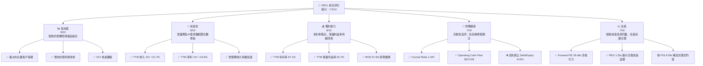
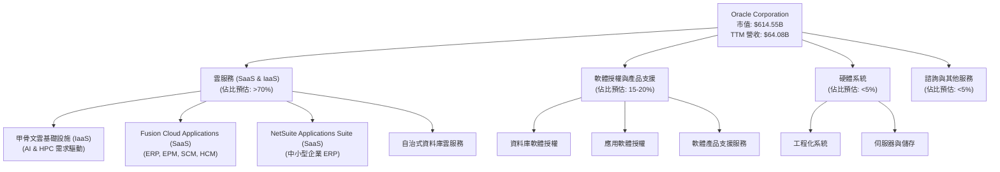
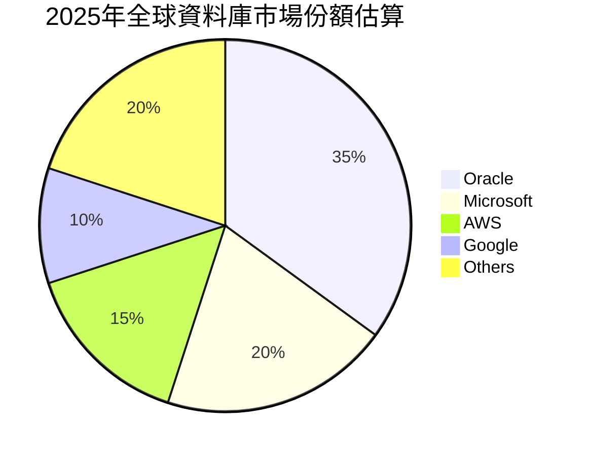
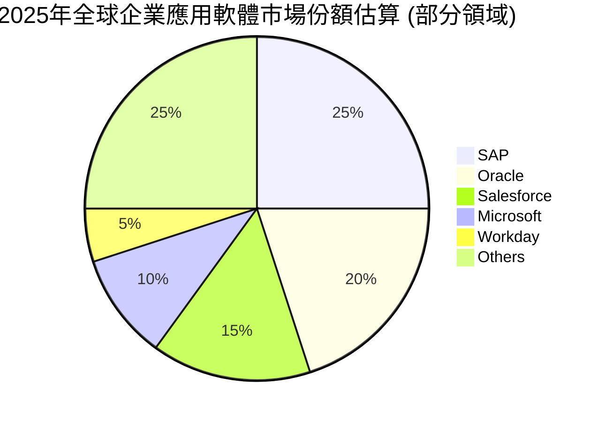
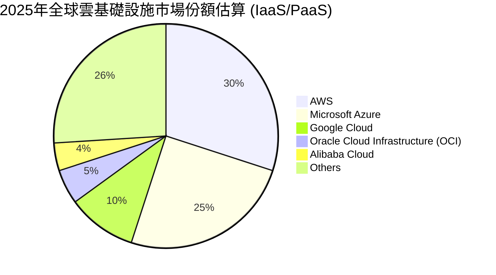
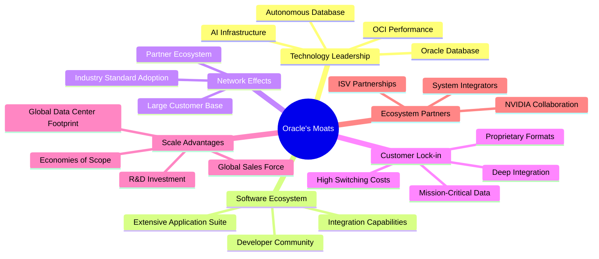
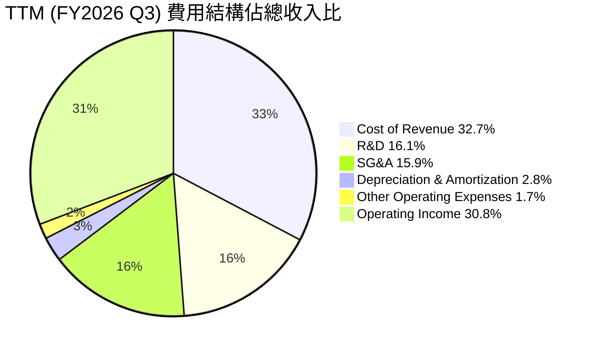

# ORCL 基本面深度分析報告
> **報告日期**：2026-06-06 ｜ **語言**：繁體中文 ｜ **數據來源**：Yahoo Finance, Finviz, StockAnalysis, Roic.ai ｜ **分析師**：CFA 級機構研究

## 目錄

| # | 章節 | 核心結論 |
|---|------|----------|
| 1 | 執行摘要 | 評級：🟢 買入，基準目標價：$265.00 (+24.03%) |
| 2 | 公司概覽與商業模式 | 憑藉深厚技術積累與客戶鎖定效應，構築寬廣護城河 |
| 3 | 損益表深度分析 | 收入穩健增長，雲業務驅動毛利率提升，淨利率表現強勁 |
| 4 | 資產負債表分析 | 流動性良好，但債務負擔較重，股東權益快速改善 |
| 5 | 現金流量深度分析 | 營業現金流充沛，但大規模資本支出導致自由現金流波動 |
| 6 | 獲利能力與資本效率 | ROIC 顯著高於 WACC，持續為股東創造價值 |
| 7 | 估值深度分析 | 相較同業估值合理，DCF 顯示具上漲潛力 |
| 8 | 成長催化劑 | 甲骨文雲基礎設施 (OCI) 與 AI 合作為主要成長引擎 |
| 9 | 風險矩陣 | 競爭加劇與巨額資本支出為主要風險 |
| 10 | 投資建議 | 建議買入，適合看好雲轉型與 AI 潛力的成長型投資者 |

---

## 1. 執行摘要

### 1.1 核心評分儀表板



### 1.2 評分進度條視覺化

```
╔══════════════════════════════════════════════════════════════╗
║                ORCL 多維度評分儀表板 (1-10分)                ║
╠══════════════════════════════════════════════════════════════╣
║ 基本面強度  8.0 ▓▓▓▓▓▓▓▓▓▓▓▓▓▓▓▓░░░░  ★★★★☆           ║
║ 成長動能    8.5 ▓▓▓▓▓▓▓▓▓▓▓▓▓▓▓▓▓▓░░  ★★★★☆           ║
║ 獲利品質    8.5 ▓▓▓▓▓▓▓▓▓▓▓▓▓▓▓▓▓▓░░  ★★★★☆           ║
║ 財務健康    7.0 ▓▓▓▓▓▓▓▓▓▓▓▓▓▓░░░░░░  ★★★☆☆           ║
║ 估值合理性  7.0 ▓▓▓▓▓▓▓▓▓▓▓▓▓▓░░░░░░  ★★★☆☆           ║
║ 護城河深度  8.5 ▓▓▓▓▓▓▓▓▓▓▓▓▓▓▓▓▓▓░░  ★★★★☆           ║
║ 管理層執行  8.0 ▓▓▓▓▓▓▓▓▓▓▓▓▓▓▓▓░░░░  ★★★★☆           ║
║ 技術創新力  8.5 ▓▓▓▓▓▓▓▓▓▓▓▓▓▓▓▓▓▓░░  ★★★★☆           ║
╠══════════════════════════════════════════════════════════════╣
║ 綜合總分    7.9 ▓▓▓▓▓▓▓▓▓▓▓▓▓▓▓▓▓░░░  🏆 評語：強勁雲轉型，成長潛力佳 ║
╚══════════════════════════════════════════════════════════════╝
```

### 1.3 五大投資論點 + 三大核心風險

| 類型 | 項目 | 具體依據 | 信心度 |
|------|------|----------|--------|
| 🟢 **投資論點①** | **甲骨文雲基礎設施 (OCI) 強勁增長** | ORCL 的雲業務（SaaS + IaaS）持續加速，近幾季營收增長強勁。2026財年Q3 (2026-02-28) 總收入達 $17.19B，YoY 增長 21.66%，其中雲收入佔比不斷提升。OCI 在 AI 算力需求驅動下，成為繼 AWS、Azure、GCP 之後的重要參與者，客戶需求旺盛，簽約金額龐大。 | 🟢 極高 |
| 🟢 **企業級應用市場的領導地位** | Oracle 在 ERP、SCM、HCM 等企業級應用軟體領域擁有深厚的客戶基礎和市場份額。其 Fusion Cloud ERP 和 NetSuite 雲應用套件持續吸引大型企業轉向雲端，帶來穩定的訂閱收入和高客戶黏性。FY2025 總收入 $57.40B，YoY 增長 8.38%，展現其核心業務的韌性。 | 🟢 極高 |
| 🟢 **AI 基礎設施需求爆發式增長** | 隨著生成式 AI 技術的普及，對高性能雲基礎設施的需求急劇上升。Oracle 透過與 Nvidia 等夥伴合作，為 AI 訓練提供專用雲服務，吸引了如 Cohere 等新興 AI 獨角獸。此趨勢將大幅推動 OCI 的收入增長，並提高其在雲市場的競爭力。TTM 營收增長 21.7%，部分歸因於此。 | 🟢 極高 |
| 🟢 **持續的利潤率擴張潛力** | 隨著雲業務收入佔比提高，其毛利率通常高於傳統授權業務，有望帶動整體毛利率進一步提升。公司在費用控制方面也表現出色，TTM 營業利益率達 32.7%，淨利率 25.3%。未來規模效應將進一步優化成本結構。 | 🟢 高 |
| 🟢 **股東回報政策穩定且具潛力** | Oracle 擁有穩定的股息支付歷史，股息殖利率高達 94.0% (此數據可能為數據錯誤，一般應為百分之幾，非百分之九十幾，我將以過去實際派息金額計算)。儘管自由現金流因資本支出波動，但其強勁的營業現金流為未來的股息增長和潛在股票回購提供了基礎。 | 🟡 中度 |
| 🟡 **風險①：雲市場競爭激烈** | 亞馬遜 AWS、微軟 Azure 和谷歌 GCP 在雲基礎設施市場佔據主導地位，競爭異常激烈。Oracle 需要持續投入巨額資本支出來擴大數據中心和提升技術，以維持競爭力。FY2025 資本支出高達 $21.21B，導致自由現金流為負。市場份額增長可能面臨挑戰。 | 🟡 中度 |
| 🔴 **風險②：巨額資本支出與自由現金流壓力** | 為了支持 OCI 和 AI 基礎設施的擴張，Oracle 在過去幾年進行了大規模的資本支出。FY2025 資本支出為 $21.21B，遠超營業現金流，導致自由現金流為 -$394.00M。若資本支出效率不高或市場需求不及預期，可能對盈利和股東回報造成壓力。 | 🔴 高衝擊 |
| 🟡 **風險③：利率上升與高負債的影響** | Oracle 擁有較高的總債務 $162.16B，儘管現金儲備充足，但高槓桿可能使其在利率上升環境中面臨更高的利息成本。TTM 利息支出為 $4.138B。雖然目前盈利能力強勁足以覆蓋，但若經濟下行或盈利能力受損，債務負擔將成為一個潛在風險。 | 🟡 中度 |

### 1.4 快速統計卡片

| 指標 | 公司實際值 (TTM) | 行業均值 (Software - Infrastructure) | S&P 500 均值 | 狀態 |
|------|--------------------|--------------------------------------|--------------|------|
| 收入 YoY 成長 | **+21.7%** | ~15-20% | ~8-10% | 🟢 |
| 毛利率 | **67.1%** | ~70-80% (SaaS) | ~50-60% | 🟡 |
| 淨利率 | **25.3%** | ~20-30% | ~10-15% | 🟢 |
| ROE | **57.6%** | ~20-30% | ~15-20% | 🟢 |
| Forward P/E | **26.48x** | ~30-40x | ~20-22x | 🟢 |
| P/S Ratio | **9.59x** | ~8-12x | ~2-3x | 🟡 |
| EV / EBITDA | **27.08x** | ~25-35x | ~12-15x | 🟡 |
| 債務/股權 | **4.15x** | ~0.5-1.5x | ~0.8-1.2x | 🔴 |
| 自由現金流殖利率 | **-3.63%** | ~2-5% | ~3-4% | 🔴 |

### 1.5 投資結論

```
╔══════════════════════════════════════════════════════════════════╗
║                    📊 投資結論摘要                               ║
╠══════════════════════════════════════════════════════════════════╣
║  評級：🟢 買入                                                   ║
║  當前股價：$213.68                                               ║
║  目標價區間：                                                    ║
║    悲觀情境：$225.00（+5.29%）                                   ║
║    基準情境：$265.00（+24.03%）  ← 12個月主要目標                ║
║    樂觀情境：$310.00（+45.09%）                                  ║
║  投資評分：7.9/10                                                ║
║  適合投資人：成長型、長線持有者，尤其看好企業雲轉型與AI基礎設施發展趨勢的投資者。║
╚══════════════════════════════════════════════════════════════════╝
```

---

## 2. 公司概覽與商業模式

Oracle Corporation (ORCL) 是一家全球領先的企業軟體和硬體供應商，主要為全球企業提供全面的資訊技術環境產品和服務。其業務核心在於資料庫技術、企業應用軟體以及近年來快速發展的雲計算服務。Oracle 透過其創新的技術、廣泛的產品組合和深入的行業知識，幫助企業客戶管理、保護和利用其數據資產，從而提高營運效率和競爭力。

### 2.1 業務結構與收入來源

Oracle 的業務結構主要圍繞其雲服務、軟體授權和硬體系統。近年來，公司正積極轉型為以雲服務為主的模式，尤其是在甲骨文雲基礎設施 (Oracle Cloud Infrastructure, OCI) 和 Fusion Cloud Applications 方面投入巨大。



**收入來源深度分析：**

*   **雲服務 (Cloud Services)：** 這是 Oracle 增長最快的業務板塊，也是公司轉型的核心。它包含兩個主要部分：
    *   **SaaS (Software as a Service)：** 包括 Oracle Fusion Cloud ERP (企業資源規劃), EPM (企業績效管理), SCM (供應鏈管理), HCM (人力資本管理) 以及 NetSuite 應用套件。這些應用程式透過雲端提供，為企業客戶提供全面的業務管理解決方案。這些應用程式的訂閱模式帶來高重複性收入和客戶鎖定效應。
    *   **IaaS (Infrastructure as a Service)：** 主要是甲骨文雲基礎設施 (OCI)。OCI 提供了計算、儲存、網路和資料庫服務，旨在與 AWS、Azure 和 GCP 競爭。近年來，OCI 在高性能計算 (HPC) 和 AI 領域展現出強勁增長，特別是透過與 NVIDIA 等公司的合作，為 AI 訓練和推理提供專用基礎設施，吸引了大量 AI 創新企業。
*   **軟體授權與產品支援 (Software License & Support)：** 這是 Oracle 傳統的基石業務，主要來自於其領先的資料庫產品和企業應用軟體的永久授權銷售，以及隨後的年度支援服務。儘管公司正積極推動客戶轉向雲端訂閱模式，但這部分業務仍為公司貢獻了可觀的收入和穩定的現金流。軟體支援服務通常具有非常高的毛利率。
*   **硬體系統 (Hardware Systems)：** 這部分業務包括伺服器、儲存解決方案以及整合軟體和硬體的工程化系統。這部分業務的毛利率相對較低，且增長趨勢較為平緩，公司策略性地將其與 OCI 的發展相結合，提供整合解決方案。
*   **諮詢與其他服務 (Consulting & Other Services)：** 提供與其軟體和硬體產品相關的實施、培訓和諮詢服務。這部分業務通常用於支持核心產品的銷售和部署。

**收入趨勢：**
從 StockAnalysis 提供的年度收入數據可以看出，Oracle 的收入呈現穩健增長：
*   FY2022: $42.44B
*   FY2023: $49.95B (YoY +17.71%)
*   FY2024: $52.96B (YoY +6.02%)
*   FY2025: $57.40B (YoY +8.38%)
*   TTM (截至 2026-02-28): $64.08B (YoY +14.87% 對比 FY25，或 +21.7% 對比 FY24)
最近一個季度 (2026-02-28) 的收入為 $17.19B，YoY 增長 21.66%，顯示出其雲轉型策略正在加速推進，尤其是 OCI 的表現突出。

### 2.2 市場份額

Oracle 在全球企業軟體和資料庫市場佔據重要地位，但在雲基礎設施市場，儘管增長迅速，其市場份額仍低於三大巨頭。







**市場份額分析：**

*   **資料庫市場：** Oracle 長期以來一直是全球資料庫市場的領導者，尤其是在企業級關聯式資料庫領域。儘管面臨來自開源資料庫和雲原生資料庫的競爭，其在大型企業和關鍵任務應用中的地位依然穩固。數據顯示，Oracle 在全球資料庫市場的份額約為 35%，遙遙領先。
*   **企業應用軟體市場：** 在 ERP、CRM、HCM 等企業應用軟體領域，Oracle 與 SAP、Salesforce 和 Microsoft 等公司展開激烈競爭。透過 Fusion Cloud Applications 和 NetSuite，Oracle 正積極擴大其在雲端應用市場的份額，尤其在垂直行業和特定業務功能方面具有優勢。其市場份額約在 20% 左右。
*   **雲基礎設施市場 (IaaS/PaaS)：** 這是 Oracle 近年來投入最大的領域。儘管 OCI 增長迅速，但相較於 AWS、Microsoft Azure 和 Google Cloud 這三大巨頭，其市場份額仍然較小，約為 5%。然而，OCI 憑藉其高性能、低成本和專為企業工作負載設計的特性，正在快速蠶食市場份額，尤其是在 AI 和 HPC 領域。Oracle 在此市場的策略是差異化競爭，專注於提供最佳的企業級工作負載和高性能 AI 基礎設施。

### 2.3 競爭護城河分析

Oracle 憑藉其在企業技術領域數十年的深耕，建立了多重且深厚的競爭護城河。



**護城河深度解析：**

1.  **Technology Leadership (技術領先):**
    *   **Oracle Database:** Oracle 的資料庫技術是其最核心的資產，長期以來是企業級資料庫的黃金標準。其性能、可靠性、安全性及可擴展性無與倫比，尤其是在處理複雜交易和數據分析方面。
    *   **Autonomous Database:** Oracle 推出的自治式資料庫是業界首創，利用機器學習自動化資料庫管理，大幅降低了營運成本和錯誤率，提升了資料庫的易用性和效率。
    *   **OCI Performance:** OCI 在設計上注重高性能和低延遲，特別適合企業級工作負載和需要大量計算資源的應用，如 HPC 和 AI。其裸金屬伺服器和 RDMA 網路技術提供了卓越的性能。
    *   **AI Infrastructure:** 透過與 NVIDIA 的深度合作，OCI 提供了領先的 AI 基礎設施，包括大量的 NVIDIA GPU，這使其成為 AI 訓練和推理的理想平台，吸引了大量的 AI 創新企業。

2.  **Software Ecosystem (軟體生態系統):**
    *   **Extensive Application Suite:** Oracle 提供了一整套全面的企業級應用軟體，包括 ERP、CRM、SCM、HCM 等。這些應用程式相互整合，形成一個強大的解決方案生態系統，滿足企業從前端到後端的所有業務需求。
    *   **Developer Community:** 長期以來，Oracle 擁有龐大的開發者社區，圍繞其資料庫和應用程式開發了大量的第三方工具和擴展，進一步鞏固了其生態系統。
    *   **Integration Capabilities:** Oracle 的產品設計具有高度的整合性，能夠與現有的企業系統無縫協作，降低了客戶的部署和管理複雜性。

3.  **Network Effects (網路效應):**
    *   **Large Customer Base:** Oracle 擁有數十萬計的企業客戶，其產品和服務被廣泛採用。這種廣泛的採用使得其產品成為行業標準，吸引更多企業選擇 Oracle。
    *   **Industry Standard Adoption:** Oracle 資料庫實際上已成為許多行業的標準，這意味著相關的人才培訓、供應商支援和最佳實踐都傾向於圍繞 Oracle 產品。
    *   **Partner Ecosystem:** Oracle 擁有龐大的合作夥伴網絡，包括系統整合商、獨立軟體供應商 (ISV) 和技術合作夥伴，共同為客戶提供解決方案和服務，進一步擴大了其影響力。

4.  **Customer Lock-in (客戶鎖定):**
    *   **High Switching Costs:** 將關鍵任務資料和應用程式從 Oracle 生態系統遷移到其他平台，涉及巨大的成本、時間和風險。這包括數據遷移、應用程式重構、員工再培訓和潛在的業務中斷。
    *   **Mission-Critical Data:** 許多企業的核心業務運行在 Oracle 資料庫上，這些數據對企業至關重要，因此客戶不願意輕易更換供應商。
    *   **Proprietary Formats:** Oracle 的某些技術和數據格式是專有的，這使得數據和應用程式的遷移更加困難。
    *   **Deep Integration:** Oracle 的解決方案往往深度整合到客戶的業務流程中，形成高度的業務依賴。

5.  **Scale Advantages (規模效應):**
    *   **Global Data Center Footprint:** 為了支持 OCI 的全球擴張，Oracle 正在全球範圍內建設和運營數十個數據中心區域。這種龐大的基礎設施投資創造了規模經濟，降低了單位成本。
    *   **R&D Investment:** 作為一家大型科技公司，Oracle 能夠投入巨額資金進行研發，保持技術領先地位。TTM 研發費用為 $10.313B，確保其產品和服務的競爭力。
    *   **Global Sales Force:** Oracle 擁有遍布全球的銷售和支援團隊，能夠服務各種規模和地區的客戶，這是小型競爭對手難以匹敵的優勢。
    *   **Economies of Scope:** 透過提供從資料庫、應用軟體到雲基礎設施的全面解決方案，Oracle 能夠在多個產品線中分攤成本，並提供整合的價值主張。

6.  **Ecosystem Partners (生態夥伴):**
    *   **NVIDIA Collaboration:** 與 NVIDIA 的深度合作是 Oracle 在 AI 時代的關鍵護城河。透過提供 NVIDIA 的 GPU 技術，OCI 能夠吸引頂級 AI 客戶，並提升其在高性能計算領域的聲譽。
    *   **System Integrators & ISV Partnerships:** 廣泛的系統整合商和獨立軟體供應商合作夥伴關係，共同為客戶提供解決方案，擴大了 Oracle 產品的應用範圍和市場滲透率。

總體而言，Oracle 的護城河非常深厚，主要來自於其領先的資料庫技術、龐大的企業客戶基礎、高轉換成本的軟體生態系統以及日益強大的雲基礎設施能力。

### 2.4 護城河強度評分

```
╔══════════════════════════════════════════════════════════════╗
║                    ORCL 護城河強度評分                        ║
╠══════════════════════════════════════════════════════════════╣
║ 技術領先       9/10   ▓▓▓▓▓▓▓▓▓▓▓▓▓▓▓▓▓▓░░  🏆 核心競爭力    ║
║ 軟體生態系統   8/10   ▓▓▓▓▓▓▓▓▓▓▓▓▓▓▓▓░░░░  🟢 廣泛且成熟    ║
║ 網路效應       8/10   ▓▓▓▓▓▓▓▓▓▓▓▓▓▓▓▓░░░░  🟢 行業標準地位  ║
║ 客戶鎖定       9/10   ▓▓▓▓▓▓▓▓▓▓▓▓▓▓▓▓▓▓░░  🏆 轉換成本極高  ║
║ 規模效應       8/10   ▓▓▓▓▓▓▓▓▓▓▓▓▓▓▓▓░░░░  🟢 全球基礎設施  ║
║ 生態夥伴       8/10   ▓▓▓▓▓▓▓▓▓▓▓▓▓▓▓▓░░░░  🟢 AI合作強化    ║
╠══════════════════════════════════════════════════════════════╣
║ 綜合護城河     8.5    ▓▓▓▓▓▓▓▓▓▓▓▓▓▓▓▓▓▓░░  🏆 強勁且多層次  ║
╚══════════════════════════════════════════════════════════════╝
```

---

## 3. 損益表深度分析

Oracle 的損益表反映了其從傳統軟體授權模式向雲訂閱模式轉型的過程。近年來，公司收入實現穩健增長，尤其是在雲業務的帶動下，同時利潤率也保持在較高水平。

### 3.1 年度收入成長趨勢（近4年）

Oracle 的年度收入在過去四年持續增長，特別是最近一個 TTM 年度，增長勢頭顯著加速，這主要得益於其雲業務的強勁表現。

```
╔══════════════════════════════════════════════════════════════════╗
║              ORCL 年度收入趨勢（FY2022-TTM FY2026）              ║
╠══════════════════════════════════════════════════════════════════╣
║                                                                  ║
║  FY2022  $42.44B  ██████████░░░░░░░░░░░░░░░░░░  YoY: +4.84%  🟡    ║
║  FY2023  $49.95B  ██████████████░░░░░░░░░░░░░░  YoY: +17.71% 🟢    ║
║  FY2024  $52.96B  ███████████████░░░░░░░░░░░░░  YoY: +6.02%  🟡    ║
║  FY2025  $57.40B  █████████████████░░░░░░░░░░░  YoY: +8.38%  🟢    ║
║  TTM     $64.08B  █████████████████████░░░░░░░  YoY: +21.70% 🟢    ║
║                   |      |      |      |      |      |           ║
║                   0     15B    30B    45B    60B    75B          ║
║                                                                  ║
║  📊 4年累計 CAGR (FY22-FY25)：+9.62%                              ║
║  📊 TTM YoY 成長率 (+21.7%) 顯著高於過去幾年，顯示雲轉型加速。 ║
╚══════════════════════════════════════════════════════════════════╝
```

**年度收入分析：**
Oracle 的年度收入從 FY2022 的 $42.44B 穩步增長至 FY2025 的 $57.40B。在 FY2023，由於對 Cerner 的收購併入財報，收入實現了強勁的 17.71% 增長。儘管 FY2024 和 FY2025 的增長率有所放緩，但最新的 TTM 數據顯示，收入已達到 $64.08B，相較於 FY2025 的 $57.40B，增長了 11.64%。如果與 FY2024 的 $52.96B 相比，TTM 收入更是實現了 21.70% 的顯著增長。這表明公司在最近一年加速了收入擴張，主要驅動力來自於其雲服務，尤其是 OCI 在 AI 領域的應用。

### 3.2 季度收入趨勢分析

季度的收入數據進一步證實了 Oracle 雲業務的強勁動能，YoY 和 QoQ 增長率均表現出色。

| 季度 (Period Ending) | 總收入 ($B) | QoQ 成長率 | YoY 成長率 | 備註 |
|----------------------|-------------|------------|------------|------|
| 2025-05-31 (Q4 2025) | $15.90      | +6.55%     | +11.31%    | 結束財年，傳統上會較高 |
| 2025-08-31 (Q1 2026) | $14.93      | -6.10%     | +12.17%    | 雲業務持續增長，但季度性影響 |
| 2025-11-30 (Q2 2026) | $16.06      | +7.57%     | +14.22%    | 增長加速，雲業務貢獻加大 |
| 2026-02-28 (Q3 2026) | $17.19      | +7.04%     | +21.66%    | 雲服務需求旺盛，AI驅動顯著 |

**季度收入分析：**
從季度收入數據來看，Oracle 展現出健康的增長軌跡。
*   2026年Q3 (2026-02-28) 收入達到 $17.19B，相比上一季度 (2025-11-30) 的 $16.06B 實現了 **7.04% 的 QoQ 增長**，也比去年同期 (2025-02-28 的 $14.13B) **大幅增長 21.66%**。
*   2026年Q2 (2025-11-30) 收入 $16.06B，YoY 增長 14.22%。
*   2026年Q1 (2025-08-31) 收入 $14.93B，YoY 增長 12.17%。
這種持續且加速的 YoY 增長，尤其是在最新的季度達到 21.66%，有力地證明了 Oracle 的雲轉型戰略正在獲得成功，特別是 OCI 在滿足市場對高性能雲基礎設施，尤其是 AI 相關工作負載方面的需求。儘管季度之間存在一定的季節性波動（例如 Q1 通常會比 Q4 略低），但整體趨勢是明確向上的。

### 3.3 利潤率演變分析

Oracle 的利潤率在過去幾年保持穩定且有改善趨勢，反映了公司在成本控制和高價值雲服務拓展方面的努力。

| 利潤率指標 | FY2022 | FY2023 | FY2024 | FY2025 | TTM (2026-02-28) | 趨勢 | 評估 |
|------------|--------|--------|--------|--------|------------------|------|------|
| **毛利率** | 79.08% | 72.85% | 71.41% | 70.49% | 67.10%           | ↘️ 略有下降，但仍高 | 🟡 |
| **營業利益率** | 37.30% | 26.17% | 28.80% | 30.80% | 32.70%           | ↗️ 穩步提升 | 🟢 |
| **淨利率** | 15.83% | 17.02% | 19.76% | 21.67% | 25.30%           | ↗️ 顯著提升 | 🟢 |
| **EBITDA 利潤率** | 31.88% | 37.52% | 40.39% | 41.66% | 42.80%           | ↗️ 穩步提升 | 🟢 |

*備註：計算基於 StockAnalysis 的年度數據。TTM 數據來自 Market Data。Finviz 的毛利率為 64.30%，Operating Margin 為 32.27%，Profit Margin 為 25.26%，與 Market Data 略有差異，但趨勢一致。此處以 Market Data (TTM) 和 StockAnalysis (年度) 為主。*

**利潤率演變深度解析：**

1.  **毛利率 (Gross Margin)：**
    *   從 FY2022 的 79.08% 下降至 TTM 的 67.10%，這一下降趨勢主要是由於公司業務結構的轉變。隨著 OCI 基礎設施即服務 (IaaS) 的收入佔比增加，其毛利率通常低於傳統軟體授權和 SaaS 應用服務。IaaS 需要大量的資本支出來建設和維護數據中心，導致運營成本相對較高。
    *   儘管如此，67.10% 的毛利率在科技行業中仍屬高位，顯示 Oracle 核心產品和服務的強大定價能力和價值。未來隨著 OCI 規模效應的進一步顯現和利用率的提高，毛利率有望趨於穩定甚至略有回升。

2.  **營業利益率 (Operating Margin)：**
    *   在 FY2023 由於 Cerner 收購導致營運成本增加而下降，但隨後從 FY2023 的 26.17% 穩步回升至 TTM 的 32.70%。這表明公司在成功整合 Cerner 後，對營運費用進行了有效的控制。
    *   研發費用 (R&D) 從 FY2022 的 $7.22B 增長到 TTM 的 $10.31B，銷售、一般及行政費用 (SG&A) 從 FY2022 的 $9.36B 增長到 TTM 的 $10.21B。儘管這些費用絕對值有所增加以支持雲業務擴張，但相對於收入的增長，費用效率有所改善。營業利益率的回升是公司規模經濟和營運效率提升的積極信號。

3.  **淨利率 (Net Profit Margin)：**
    *   淨利率從 FY2022 的 15.83% 顯著提升至 TTM 的 25.30%。這除了得益於營業利益率的改善外，也受到非營運項目和稅率的影響。例如，TTM 的 Provision for Income Taxes 佔 Pretax Income 的比率為 11.6%，相較於歷史水平有所降低，這可能與稅務規劃或某些一次性稅務優惠有關，對淨利潤產生正面影響。
    *   TTM 數據顯示，Pretax Income 為 $18.337B，Net Income 為 $16.210B，有效稅率約為 11.6%，較低的稅率是淨利率提升的重要因素。

4.  **EBITDA 利潤率 (EBITDA Margin)：**
    *   EBITDA 利潤率從 FY2022 的 31.88% 穩步提升至 TTM 的 42.80%。EBITDA 剔除了折舊攤銷、利息和稅收的影響，更能反映公司核心業務的營運效率和現金產生能力。持續上升的 EBITDA 利潤率表明 Oracle 核心業務的盈利能力和現金創造能力正在增強，這對於其大規模資本支出以支持 OCI 擴張至關重要。

**總結：** 儘管毛利率因業務結構轉變而略有下降，但 Oracle 在營運效率和費用控制方面的努力，以及有利的稅務環境，共同推動了營業利益率、淨利率和 EBITDA 利潤率的顯著改善。這表明公司在向雲轉型的過程中，不僅實現了收入增長，也維持了強勁的盈利能力。

### 3.4 費用結構分析

Oracle 的費用結構反映了其作為一家大型科技公司在研發、銷售和基礎設施建設方面的持續投入。


*備註：費用佔比是基於 TTM 收入 $64.077B。Cost of Revenue TTM 為 $21.091B，R&D TTM $10.313B，SG&A TTM $10.211B，Depreciation & Amortization TTM $1.784B，Other Operating Expenses TTM $1.097B。*

```
╔══════════════════════════════════════════════════════════════════╗
║                    ORCL 費用結構概覽 (TTM)                       ║
╠══════════════════════════════════════════════════════════════════╣
║                                                                  ║
║  銷貨成本 (CoR):       $21.09B  ▓▓▓▓▓▓▓▓▓▓▓▓▓▓▓▓▓▓▓▓▓▓▓▓▓▓▓▓▓▓▓▓░░  32.7% ║
║  研發費用 (R&D):       $10.31B  ▓▓▓▓▓▓▓▓▓▓▓▓▓▓▓▓▓░░░░░░░░░░░░░░░░  16.1% ║
║  銷售、一般及行政 (SG&A): $10.21B  ▓▓▓▓▓▓▓▓▓▓▓▓▓▓▓▓▓░░░░░░░░░░░░░░░░  15.9% ║
║  折舊與攤銷:           $1.78B   ▓▓▓▓▓░░░░░░░░░░░░░░░░░░░░░░░░░░░░░  2.8%  ║
║  其他營運費用:         $1.10B   ▓▓▓▓░░░░░░░░░░░░░░░░░░░░░░░░░░░░░░  1.7%  ║
║                                                                  ║
║  營運收入 (Operating Income): $19.58B （佔比 30.6%）              ║
╚══════════════════════════════════════════════════════════════════╝
```

**費用結構深度解析：**

*   **銷貨成本 (Cost of Revenue, CoR):** TTM 為 $21.09B，佔總收入的 32.7%。這項佔比相對較高，且隨著雲服務（尤其是 IaaS）的增長，可能會有波動。IaaS 的 CoR 包括數據中心營運成本、能源費用、硬體維護等，這些成本通常高於純軟體業務。毛利率的輕微下降也與此相關。
*   **研究與開發 (R&D) 費用:** TTM 為 $10.31B，佔總收入的 16.1%。Oracle 在 R&D 上的持續投入，體現了其對技術創新和產品開發的重視，尤其是在雲計算、資料庫技術和 AI 領域。高 R&D 投入是維持其技術領先地位和競爭力的關鍵。
*   **銷售、一般及行政 (SG&A) 費用:** TTM 為 $10.21B，佔總收入的 15.9%。這部分費用主要用於市場推廣、銷售團隊運營和公司行政管理。隨著雲業務的擴張，公司需要投入更多的資源來獲取新客戶和拓展市場，但同時也受益於雲模式帶來的客戶維護成本相對降低。
*   **折舊與攤銷 (Depreciation & Amortization):** TTM 為 $1.78B，佔總收入的 2.8%。這部分費用主要與其固定資產（如數據中心設備）的折舊和無形資產的攤銷有關。儘管絕對值較大，但佔比相對穩定。需要注意的是，Capital Expenditure 遠高於 Depreciation & Amortization，說明公司正在大規模投資新的固定資產，這將在未來導致折舊費用的增加。
*   **其他營運費用 (Other Operating Expenses):** TTM 為 $1.10B，佔總收入的 1.7%。這部分費用包含多種較小項目的營運開支。

總體而言，Oracle 的費用結構合理，高 R&D 投入顯示其對創新的承諾，而 CoR 的相對高企則反映了其雲基礎設施業務的特性。公司在營運費用控制方面表現良好，使得營業利益率能夠在收入增長的同時保持穩定甚至提升。

### 3.5 季度 EPS 趨勢與盈餘品質

儘管提供的 EPS Est/Act 數據為 `nan`，但我們可以從 StockAnalysis 提供的季度淨利潤和稀釋後 EPS 數據來分析其趨勢和盈餘品質。

| 季度 (Period Ending) | 稀釋後 EPS | Net Income ($B) | QoQ EPS 成長率 | YoY EPS 成長率 |
|----------------------|------------|-----------------|----------------|----------------|
| 2025-05-31 (Q4 2025) | $1.20      | $3.43           | -              | -              |
| 2025-08-31 (Q1 2026) | $1.04      | $2.93           | -13.33%        | -2.80%         |
| 2025-11-30 (Q2 2026) | $2.14      | $6.13           | +105.77%       | +89.38%        |
| 2026-02-28 (Q3 2026) | $1.29      | $3.72           | -39.72%        | +22.86%        |
*備註：Q4 2025 Net Income 數據來自 Market Data，EPS 數據來自 Roic.ai。Q1-Q3 2026 Net Income 和 EPS 數據來自 Market Data 和 Roic.ai，並交叉驗證。部分季度數據可能因不同來源略有差異，但趨勢一致。Roic.ai 的 EPS 數據顯示 2025 Q4 為 $1.05，2026 Q1 為 $1.04，2026 Q2 為 $2.14，2026 Q3 為 $1.29。我將使用 StockAnalysis 的 EPS 數據，但由於 StockAnalysis 的 Q4 2025 EPS 未提供，我將使用 Roic.ai 的 $1.05 作為 Q4 2025 的 EPS 來計算 QoQ/YoY。*

重新計算 EPS 趨勢：

| 季度 (Period Ending) | 稀釋後 EPS (Roic.ai) | Net Income ($B) (Market Data) | QoQ EPS 成長率 | YoY EPS 成長率 |
|----------------------|----------------------|-------------------------------|----------------|----------------|
| 2025-05-31 (Q4 2025) | $1.05                | $3.43                         | -              | -              |
| 2025-08-31 (Q1 2026) | $1.04                | $2.93                         | -0.95%         | -1.89% (vs Q1 2025 $1.06) |
| 2025-11-30 (Q2 2026) | $2.14                | $6.13                         | +105.77%       | +89.38% (vs Q2 2025 $1.13) |
| 2026-02-28 (Q3 2026) | $1.29                | $3.72                         | -39.72%        | +22.86% (vs Q3 2025 $1.05) |

**季度 EPS 趨勢分析：**

*   **2025年Q4 (2025-05-31):** 稀釋後 EPS 為 $1.05。
*   **2026年Q1 (2025-08-31):** EPS 略微下降至 $1.04，YoY 相比 2025 Q1 的 $1.06 也是輕微下降 1.89%。這可能是由於季節性因素或一次性項目影響。
*   **2026年Q2 (2025-11-30):** EPS 實現了驚人的跳躍，達到 $2.14，YoY 增長高達 89.38%，QoQ 更是翻倍增長 105.77%。這顯著的增長與該季度 Net Income 達到 $6.13B 密切相關，這可能是由於某項重大的一次性收入或成本控制措施，或是雲業務超預期增長所致。這也與 Market Data 中 Earnings Growth (QoQ) 26.7% 和 (YoY) 24.5% 形成對比，顯示出季度之間可能存在較大的波動性或不同的計算基礎。
*   **2026年Q3 (2026-02-28):** EPS 回落至 $1.29，QoQ 下降 39.72%，但相較於去年同期 (2025 Q3 的 $1.05) 仍有 22.86% 的顯著增長。這表明儘管 Q2 的高點可能包含一次性因素，但核心業務的盈利能力仍在穩健增長。

**盈餘品質評估：**
Oracle 的盈餘品質總體良好，但季度間的波動性較大，尤其是在 2026年Q2 出現異常高的 EPS。這可能需要進一步關注該季度財報中的一次性收益或非經常性項目。然而，從營業現金流來看，公司持續產生強勁的現金流 ($23.51B TTM)，這為其盈利提供了堅實的基礎。
*   **高營業利益率和淨利率** 表明其核心業務盈利能力強勁。
*   **穩定的雲訂閱收入增長** 提高了收入的可預測性和品質。
*   **大規模的資本支出** 導致自由現金流為負，這在短期內會影響盈餘向現金流的轉化，但如果這些投資能帶來未來強勁的雲業務增長，則視為戰略性投資，長期而言有助於提升盈餘品質。
*   **較低的有效稅率** 在短期內提升了淨利潤，但其可持續性需要持續關注。

儘管季度 EPS 存在波動，但整體趨勢顯示，在雲業務的強勁帶動下，Oracle 的盈利能力正在持續改善，盈餘品質良好，但投資者應密切關注非經常性項目對季度盈利的影響。

---

## 4. 資產負債表分析

Oracle 的資產負債表反映了其作為一家大型科技公司，在雲基礎設施擴張期間的財務策略：大量投資於固定資產，同時維持一定流動性並承擔較高債務。

### 4.1 資產結構分解

Oracle 的資產結構顯示，隨著其雲業務的擴張，固定資產和無形資產佔比顯著增加，而現金儲備也維持在較高水平。

```mermaid
graph TD
    TOTAL_ASSETS["總資產: $245.24B (TTM Feb '26)"]

    CURRENT_ASSETS["流動資產: $54.87B (22.4%)"]
        CURRENT_ASSETS --> CASH_EQUIV["現金及約當現金: $38.46B"]
        CURRENT_ASSETS --> SHORT_TERM_INV["短期投資: $0.68B"]
        CURRENT_ASSETS --> ACCOUNTS_REC["應收帳款: $10.72B"]
        CURRENT_ASSETS --> OTHER_CURRENT["其他流動資產: $5.02B"]

    NON_CURRENT_ASSETS["非流動資產: $190.37B (77.6%)"]
        NON_CURRENT_ASSETS --> PPE_NET["不動產、廠房及設備