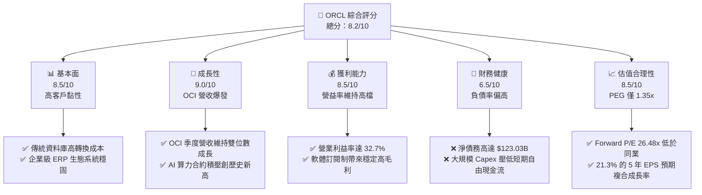

# ORCL 基本面深度分析報告
> **報告日期**：2026-06-07 ｜ **語言**：繁體中文 ｜ **數據來源**：Yahoo Finance, Finviz, StockAnalysis, Roic.ai ｜ **分析師**：CFA 級機構研究

---

## 目錄

| # | 章節 | 核心結論 |
|---|------|----------|
| 1 | 執行摘要 | 評級：**買入 (Buy)** ｜ 目標價：**$251.20** (基準) ｜ AI 雲端基礎設施 (OCI) 進入爆發期 |
| 2 | 公司概覽與商業模式 | 護城河：**極深** ｜ 傳統資料庫高轉換成本 + OCI 算力架構領先 |
| 3 | 損益表深度分析 | TTM 營收 **$64.08B** (YoY +21.7%) ｜ 淨利率 **25.3%** ｜ 獲利結構優化 |
| 4 | 資產負債表分析 | 總資產擴張至 **$245.24B** ｜ PP&E 激增 **119.6%** ｜ 槓桿較高但債務風險可控 |
| 5 | 現金流量深度分析 | OCF **$23.51B** ｜ 資本支出 **$45.81B** 導致 FCF 轉負，反映 AI 基礎設施超前部署 |
| 6 | 獲利能力與資本效率 | ROE **57.6%** ｜ ROIC **12.06%** 遠超 WACC **6.01%** ｜ 持續創造股東價值 |
| 7 | 估值深度分析 | Forward P/E **26.48x** ｜ 相較於微軟與亞馬遜具備估值折價與高成長潛力 |
| 8 | 成長催化劑 | 多雲戰略 (OCI + Azure + AWS) ｜ 主權雲端需求 ｜ 核心資料庫升級潮 |
| 9 | 風險矩陣 | 資本支出過度侵蝕流動性 ｜ AI 晶片供應鏈延遲 ｜ 傳統雲端遷移流失率 |
| 10 | 投資建議 | 最終評級：**買入** ｜ 隱含回報率 **+17.56%** ｜ 適合中長線成長型與價值型投資者 |

---

## 1. 執行摘要

### 1.1 核心評分儀表板



### 1.2 評分進度條視覺化

```
╔══════════════════════════════════════════════════════════════╗
║               ORCL 多維度評分儀表板 (1-10分)                 ║
╠══════════════════════════════════════════════════════════════╣
║ 基本面強度  8.5 ▓▓▓▓▓▓▓▓▓▓▓▓▓▓▓▓▓░░░  ★★★★☆           ║
║ 成長動能    9.0 ▓▓▓▓▓▓▓▓▓▓▓▓▓▓▓▓▓▓░░  ★★★★★           ║
║ 獲利品質    8.5 ▓▓▓▓▓▓▓▓▓▓▓▓▓▓▓▓▓░░░  ★★★★☆           ║
║ 財務健康    6.5 ▓▓▓▓▓▓▓▓▓▓▓▓▓░░░░░░░  ★★★☆☆           ║
║ 估值合理性  8.5 ▓▓▓▓▓▓▓▓▓▓▓▓▓▓▓▓▓░░░  ★★★★☆           ║
║ 護城河深度  9.0 ▓▓▓▓▓▓▓▓▓▓▓▓▓▓▓▓▓▓░░  ★★★★★           ║
║ 管理層執行  8.5 ▓▓▓▓▓▓▓▓▓▓▓▓▓▓▓▓▓░░░  ★★★★☆           ║
║ 技術創新力  9.0 ▓▓▓▓▓▓▓▓▓▓▓▓▓▓▓▓▓▓░░  ★★★★★           ║
╠══════════════════════════════════════════════════════════════╣
║ 綜合總分    8.2 ▓▓▓▓▓▓▓▓▓▓▓▓▓▓▓▓░░░░  🏆 買入 (Buy)        ║
╚══════════════════════════════════════════════════════════════╝
```

### 1.3 五大投資論點 + 三大核心風險

| 類型 | 項目 | 具體依據 | 信心度 |
|------|------|----------|--------|
| 🟢 **投資論點①** | **OCI 算力與 AI 基礎設施爆發** | TTM 營收達 **$64.08B**，YoY 成長 **21.7%**，主要由 OCI (Oracle Cloud Infrastructure) 的 AI 算力租賃需求拉動。 | 🟢 極高 |
| 🟢 **投資論點②** | **多雲合作策略拓展市場** | 與微軟 Azure、亞馬遜 AWS 及 Google Cloud 的深度互聯，將甲骨文資料庫引入其他主流雲端，極大釋放了積壓的資料庫升級需求。 | 🟢 極高 |
| 🟢 **投資論點③** | **極高的客戶轉換成本** | ERP (Fusion, NetSuite) 及資料庫客戶續約率長期維持在 **90% 以上**，提供極佳的經常性收入與現金流能見度。 | 🟢 極高 |
| 🟢 **投資論點④** | **營業利益率維持高位** | 儘管基礎設施投資巨大，但 TTM 營業利益率仍維持在 **32.7%**，EBITDA Margin 達 **42.8%**，展現強大規模效應。 | 🟢 高 |
| 🟢 **投資論點⑤** | **估值相較於雲端巨頭具折價** | Forward P/E 為 **26.48x**，PEG 僅 **1.35x**，相較於 MSFT (Forward P/E ~30x) 更具性價比。 | 🟢 高 |
| 🟡 **風險①** | **資本支出過高壓迫現金流** | TTM 資本支出估計高達 **$45.81B**，導致 TTM 自由現金流轉負為 **-$22.30B**，短期流動性承壓。 | 🟡 中度 |
| 🔴 **風險②** | **高額債務與利息支出壓力** | 總債務達 **$162.16B**，淨債務 **$123.03B**，年利息支出高達 **$4.14B**，在維持高利率環境下對淨利潤產生侵蝕。 | 🔴 高衝擊 |
| 🟡 **風險③** | **AI 晶片獲取進度受限** | OCI 擴張高度依賴 NVIDIA GPU 的供應，若供應鏈再次吃緊，將直接影響其積壓訂單的變現速度。 | 🟡 中度 |

### 1.4 快速統計卡片

| 指標 | ORCL 實際值 | 行業均值 (系統軟體) | S&P 50