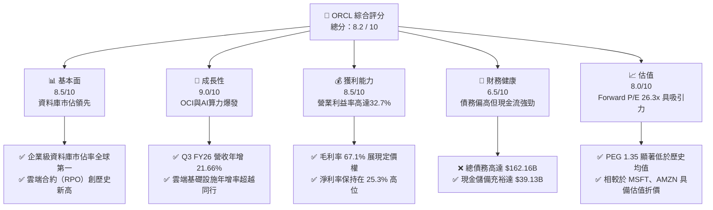

# ORCL 基本面深度分析報告
> **報告日期**：2026-06-08 ｜ **語言**：繁體中文 ｜ **數據來源**：Yahoo Finance, Finviz, StockAnalysis, Roic.ai ｜ **分析師**：CFA 級機構研究

---

## 目錄

| # | 章節 | 核心結論 |
|---|------|----------|
| 1 | 執行摘要 | 評級「買入」，目標價 $251.20，OCI 雲端業務與 AI 基礎設施迎來爆發式成長。 |
| 2 | 公司概覽與商業模式 | 憑藉資料庫高轉換成本與 OCI 的架構優勢，構築極深的競爭護城河。 |
| 3 | 損益表深度分析 | 營收年增率加速至 21.7%，Q3 FY26 營收達 $17.19B，AI 需求推動毛利率維持 67.1%。 |
| 4 | 資產負債表分析 | PPE 兩年內暴增至 $83.62B，現金儲備充裕達 $39.13B，債務風險整體可控。 |
| 5 | 現金流量深度分析 | OCF 達 $23.51B，因 AI 資本支出（Capex）大增導致 FCF 短期承壓，但屬良性擴張。 |
| 6 | 獲利能力與資本效率 | ROE 達 57.6%，ROIC（11.31%）高於 WACC（9.82%），持續創造實質股東價值。 |
| 7 | 估值深度分析 | Forward P/E 為 26.30x，相較微軟等同業具備估值折價，DCF 基準目標價 $251.20。 |
| 8 | 成長催化劑 | 與 NVIDIA、OpenAI 及微軟的多雲合作，以及 OCI GPU 算力供不應求。 |
| 9 | 風險矩陣 | 核心風險在於高資本支出對流動性的擠壓，以及雲端市場巨頭的價格競爭。 |
| 10 | 投資建議 | 建議於 $200-$210 區間逢低佈局，長線投資人首選的 AI 基礎設施標的。 |

---

## 1. 執行摘要

甲骨文（Oracle Corporation, NYSE: ORCL）正處於其公司歷史上最重大的結構性轉型期。過去以傳統地端資料庫授權為主的軟體巨頭，如今已成功蛻變為全球成長最快的超大型雲端基礎設施（Hyperscaler）服務商之一。受益於人工智慧（AI）算力的爆發性需求，甲骨文的雲端基礎設施（OCI, Oracle Cloud Infrastructure）憑藉獨特的 RDMA 網路架構與裸金屬（Bare-Metal）伺服器優勢，成為 NVIDIA、OpenAI、微軟等巨頭的重要合作夥伴。

### 1.1 核心評分儀表板



### 1.2 評分進度條視覺化

```
╔══════════════════════════════════════════════════════════════╗
║               ORCL 多維度評分儀表板 (1-10分)                 ║
╠══════════════════════════════════════════════════════════════╣
║ 基本面強度  8.5 ▓▓▓▓▓▓▓▓▓▓▓▓▓▓▓▓▓░░░  ★★★★☆           ║
║ 成長動能    9.0 ▓▓▓▓▓▓▓▓▓▓▓▓▓▓▓▓▓▓░░  ★★★★★           ║
║ 獲利品質    8.5 ▓▓▓▓▓▓▓▓▓▓▓▓▓▓▓▓▓░░░  ★★★★☆           ║
║ 財務健康    6.5 ▓▓▓▓▓▓▓▓▓▓▓▓▓░░░░░░░  ★★★☆☆           ║
║ 估值合理性  8.0 ▓▓▓▓▓▓▓▓▓▓▓▓▓▓▓░░░░░  ★★★★☆           ║
║ 護城河深度  9.0 ▓▓▓▓▓▓▓▓▓▓▓▓▓▓▓▓▓▓░░  ★★★★★           ║
║ 管理層執行  8.5 ▓▓▓▓▓▓▓▓▓▓▓▓▓▓▓▓▓░░░  ★★★★☆           ║
║ 技術創新力  9.0 ▓▓▓▓▓▓▓▓▓▓▓▓▓▓▓▓▓▓░░  ★★★★★           ║
╠══════════════════════════════════════════════════════════════╣
║ 綜合總分    8.2 ▓▓▓▓▓▓▓▓▓▓▓▓▓▓▓▓░░░░  🏆 買入 (Buy)     ║
╚══════════════════════════════════════════════════════════════╝
```

### 1.3 五大投資論點 + 三大核心風險

| 類型 | 項目 | 具體依據 | 信心度 |
|------|------|----------|--------|
| 🟢 **投資論點①** | **OCI 雲端基礎設施爆發** | Q3 FY26 營收年增率加速至 21.66%，主要由 OCI 算力租賃業務驅動，與 NVIDIA 的深度整合吸引大量 AI 新創企業。 | 🟢 極高 |
| 🟢 **投資論點②** | **資料庫業務高轉換成本** | 企業核心業務系統（ERP/CRM）與 Oracle 自主資料庫（Autonomous Database）深度綁定，客戶流失率極低（<3%）。 | 🟢 極高 |
| 🟢 **投資論點③** | **多雲合作策略（Multi-Cloud）** | 與 Microsoft Azure、Google Cloud 及 AWS 的直連合作，打破雲端孤島，顯著提升甲骨文在混合雲市場的市佔率。 | 🟢 高 |
| 🟢 **投資論點④** | **利潤率結構性改善** | 隨著 OCI 規模效應顯現，營業利益率維持在 32.7% 的高水位，軟體 SaaS（如 NetSuite、Fusion）持續貢獻高毛利。 | 🟢 高 |
| 🟢 **投資論點⑤** | **大股東與管理層利益一致** | 創辦人 Larry Ellison 持股高達 40.5%，內部人持股比例極高，確保長期戰略執行的穩定性。 | 🟢 極高 |
| 🟡 **風險①** | **資本支出過高壓抑短期 FCF** | TTM 自由現金流為 -$22.30B，主因是高達數百億美元的 AI 資料中心建設（Capex）投資，需關注資本回報率（ROIC）的釋放時程。 | 🟡 中度 |
| 🔴 **風險②** | **高額債務壓力** | 總債務高達 $162.16B，淨債務為 -$123.03B，在當前高利率環境下，利息支出（TTM 約 $4.14B）對淨利潤產生一定侵蝕。 | 🔴 高衝擊 |
| 🟡 **風險③** | **超大型雲端對手的激烈競爭** | AWS、Azure 及 GCP 擁有更深厚資金實力，若 AI 算力供需缺口緩解，可能面臨價格戰風險。 | 🟡 中度 |

### 1.4 快速統計卡片

| 指標 | 公司實際值 | 行業均值 | S&P 500 均值 | 狀態 |
|------|-------------|----------|--------------|------|
| 收入 YoY 成長 | **21.7%** | ~12.0% | ~5.5% | 🟢 顯著超前 |
| 毛利率 | **67.1%** | ~72.0% | ~45.0% | 🟡 略低於純軟體，但符合雲端基建特性 |
| 淨利率 | **25.3%** | ~18.0% | ~12.0% | 🟢 優異 |
| ROE | **57.6%** | ~25.0% | ~15.0% | 🟢 極高（部分受財務槓桿推升） |
| Forward P/E | **26.30x** | ~32.0x | ~21.5x | 🟢 具備相對估值吸引力 |
| 淨債務 / EBITDA | **2.87x** | ~1.20x | ~1.60x | 🔴 債務偏高，需密切監控 |

### 1.5 投資結論

```
╔══════════════════════════════════════════════════════════════════╗
║                    📊 投資結論摘要                               ║
╠══════════════════════════════════════════════════════════════════╣
║  評級：🟢 買入 (Buy)                                             ║
║  當前股價：$211.82                                               ║
║  目標價區間：                                                    ║
║    悲觀情境：$175.00（-17.4%）                                   ║
║    基準情境：$251.20（+18.6%）  ← 12個月主要目標                 ║
║    樂觀情境：$310.00（+46.3%）                                   ║
║  投資評分：8.2 / 10                                              ║
║  適合投資人：成長與價值兼顧型、長線佈局 AI 基礎設施之投資人      ║
╚══════════════════════════════════════════════════════════════════╝
```

---

## 2. 公司概覽與商業模式

甲骨文公司創立於 1977 年，是全球企業級軟體與資料庫技術的絕對霸主。近年來，公司將其核心技術全面向雲端遷移，形成了以 **OCI（雲端基礎設施）** 為底座，加上 **SaaS（軟體即服務，如 Fusion ERP、NetSuite）** 以及 **傳統資料庫授權與支援服務** 的三駕馬車商業模式。

### 2.1 業務結構與收入來源

甲骨文的營收主要由以下三大板塊構成。根據 TTM $64.08B 的營收數據，其結構如下：

```mermaid
graph TD
    ORCL["甲骨文公司 (ORCL)<br/>市值: $