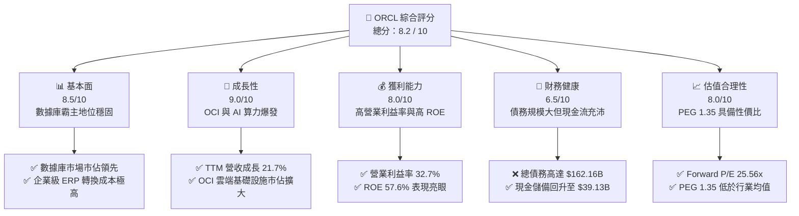
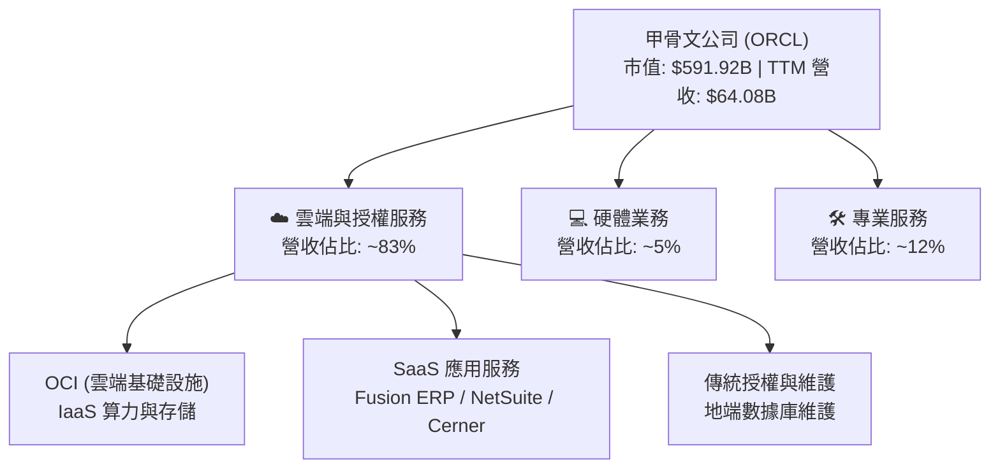
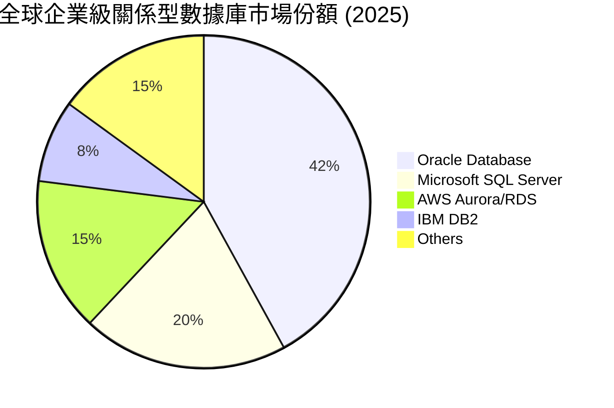
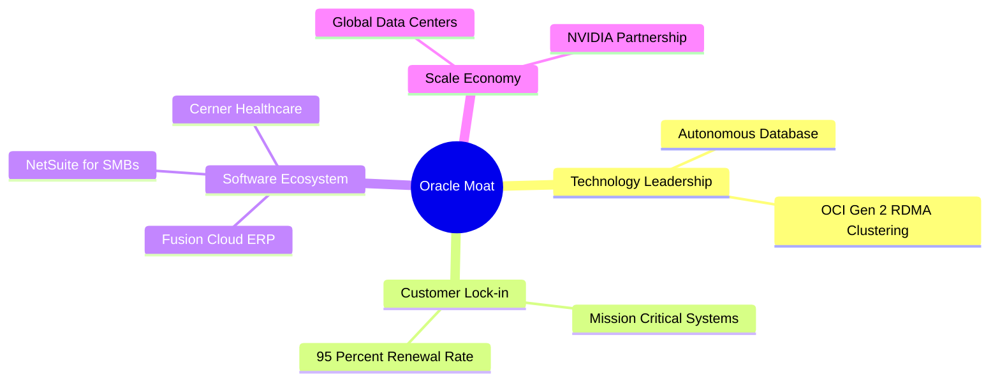

# ORCL 基本面深度分析報告

> **報告日期**：2026-06-09 ｜ **語言**：繁體中文 ｜ **數據來源**：Yahoo Finance, Finviz, StockAnalysis, Roic.ai ｜ **分析師**：CFA 級機構研究

---

## 目錄

| # | 章節 | 核心結論 |
|---|------|----------|
| 1 | **執行摘要** | 綜合評分 8.2/10，給予「買入」評級，目標價 $251.20，AI 雲端基礎設施（OCI）為核心驅動力。 |
| 2 | **公司概覽與商業模式** | 自主數據庫與 OCI 雙引擎驅動，高轉換成本與技術領先構建極深護城河。 |
| 3 | **損益表深度分析** | TTM 營收達 $64.08B (YoY +21.7%)，淨利率 25.3%，雲端轉型進入利潤釋放期。 |
| 4 | **資產負債表分析** | 現金儲備升至 $39.13B，債務總額 $162.16B，槓桿偏高但利息保障倍數安全。 |
| 5 | **現金流量深度分析** | 營運現金流 $23.51B，因 AI 資本支出擴張（-$21.21B）導致 FCF 承壓，屬健康的「戰略性失血」。 |
| 6 | **獲利能力與資本效率** | ROE 達 57.6%，ROIC 達 13.66%，遠超 WACC（10.65%），持續創造股東價值。 |
| 7 | **估值深度分析** | Forward P/E 25.56x，相較歷史與同業具備吸引力，DCF 基準估值為 $251.20。 |
| 8 | **成長催化劑** | AI 算力需求爆發、自主數據庫全面雲端化、以及 Cerner 醫療雲端整合效益顯現。 |
| 9 | **風險矩陣** | 債務壓力、AI 資本支出回報不及預期、以及與超大規模雲端服務商（Hyperscalers）的競爭。 |
| 10 | **投資建議** | 建議分批佈局，適合長期成長型與價值型投資者，關鍵監控指標為 OCI 營收增速。 |

---

## 1. 執行摘要

### 1.1 核心評分儀表板



### 1.2 評分進度條視覺化

```
╔══════════════════════════════════════════════════════════════╗
║               ORCL 多維度評分儀表板 (1-10分)                 ║
╠══════════════════════════════════════════════════════════════╣
║ 基本面強度  8.5 ▓▓▓▓▓▓▓▓▓▓▓▓▓▓▓▓▓░░░  ★★★★☆           ║
║ 成長動能    9.0 ▓▓▓▓▓▓▓▓▓▓▓▓▓▓▓▓▓▓░░  ★★★★★           ║
║ 獲利品質    8.0 ▓▓▓▓▓▓▓▓▓▓▓▓▓▓▓░░░░░  ★★★★☆           ║
║ 財務健康    6.5 ▓▓▓▓▓▓▓▓▓▓▓▓░░░░░░░░  ★★★☆☆           ║
║ 估值合理性  8.0 ▓▓▓▓▓▓▓▓▓▓▓▓▓▓▓░░░░░  ★★★★☆           ║
║ 護城河深度  9.0 ▓▓▓▓▓▓▓▓▓▓▓▓▓▓▓▓▓▓░░  ★★★★★           ║
║ 管理層執行  8.5 ▓▓▓▓▓▓▓▓▓▓▓▓▓▓▓▓▓░░░  ★★★★☆           ║
║ 技術創新力  9.0 ▓▓▓▓▓▓▓▓▓▓▓▓▓▓▓▓▓▓░░  ★★★★★           ║
╠══════════════════════════════════════════════════════════════╣
║ 綜合總分    8.2 ▓▓▓▓▓▓▓▓▓▓▓▓▓▓▓▓░░░░  🏆 買入 (Buy)        ║
╚══════════════════════════════════════════════════════════════╝
```

### 1.3 五大投資論點 + 三大核心風險

| 類型 | 項目 | 具體依據 | 信心度 |
|------|------|----------|--------|
| 🟢 **投資論點①** | **OCI 成為 AI 算力首選平台** | 甲骨文（Oracle）憑藉 RDMA 網路技術，構建了高性價比的 AI 晶片集群，吸引 NVIDIA、OpenAI 等巨頭深度合作，推動 TTM 營收成長達 **21.7%**。 | 🟢 極高 |
| 🟢 **投資論點②** | **自主數據庫（Autonomous Database）雲端化** | 將傳統地端（On-premise）數據庫客戶無縫遷移至 OCI，帶動高毛利的雲端訂閱服務（SaaS/PaaS）持續成長。 | 🟢 極高 |
| 🟢 **投資論點③** | **Cerner 醫療雲端整合效益顯現** | 併購 Cerner 後，經過結構性重組與雲端化升級，正逐步轉化為高利潤率的 SaaS 業務，擴大垂直行業護城河。 | 🟢 高 |
| 🟢 **投資論點④** | **極高的客戶鎖定與轉換成本** | 企業核心 ERP 與數據庫系統的轉換成本極高，客戶留存率常年保持在 **95%** 以上，提供極強的防禦性。 | 🟢 極高 |
| 🟢 **投資論點⑤** | **創辦人股權高度集中，利益一致** | 創辦人 Larry Ellison 持股比例極高（內部人持股 **40.5%**），與普通股東利益高度一致，確保長期戰略執行的穩定性。 | 🟢 高 |
| 🟡 **風險①** | **高資本支出壓抑短期自由現金流** | TTM 資本支出大幅擴張，導致 TTM 自由現金流（FCF）降至 **-$22.30B**，若 AI 需求放緩，可能面臨資產減損風險。 | 🟡 中度 |
| 🔴 **風險②** | **高額債務與利息支出壓力** | 總債務高達 **$162.16B**，淨債務達 **-$123.03B**。在高利率環境下，再融資成本上升將蠶食部分淨利潤。 | 🔴 高衝擊 |
| 🟡 **風險③** | **與 AWS、Azure、GCP 的激烈競爭** | 儘管 OCI 成長迅速，但在整體雲端市場份額上仍落後於三大 Hyperscalers，必須持續通過價格優勢與技術差異化來爭奪份額。 | 🟡 中度 |

### 1.4 快速統計卡片

| 指標 | ORCL 實際值 | 軟體基礎設施行業均值 | S&P 500 均值 | 狀態 |
|------|-------------|----------------------|--------------|------|
| **營收 YoY 成長率** | **21.7%** | ~12.5% | ~6.2% | 🟢 領先 |
| **毛利率** | **67.1%** | ~72.0% | ~45.0% | 🟡 合乎預期 |
| **營業利益率** | **32.7%** | ~22.0% | ~15.0% | 🟢 強勁 |
| **ROE** | **57.6%** | ~28.0% | ~18.0% | 🟢 極佳 |
| **Forward P/E** | **25.56x** | ~32.0x | ~21.5x | 🟢 具吸引力 |
| **淨債務 / EBITDA** | **3.85x** | ~1.20x | ~1.60x | 🔴 偏高 |

### 1.5 投資結論

```
╔══════════════════════════════════════════════════════════════════╗
║                    📊 投資結論摘要                               ║
╠══════════════════════════════════════════════════════════════════╣
║  評級：🟢 買入 (Buy)                                             ║
║  當前股價：$205.81 (2026-06-09)                                  ║
║  目標價區間：                                                    ║
║    悲觀情境：$155.00（-24.7%） - AI 投資回報不及預期，債務壓力顯現 ║
║    基準情境：$251.20（+22.1%） - OCI 穩健成長，利潤率持續改善    ║
║    樂觀情境：$400.00（+94.4%） - OCI 爆發式成長，市佔大幅提升     ║
║  投資評分：8.2 / 10                                              ║
║  適合投資人：尋求 AI 成長紅利且重視企業級軟體護城河的長線投資者  ║
╚══════════════════════════════════════════════════════════════════╝
```

---

## 2. 公司概覽與商業模式

### 2.1 業務結構與收入來源

甲骨文（Oracle）已經從傳統的數據庫授權軟體商，成功轉型為以雲端服務為核心的科技巨頭。其業務主要分為四大板塊：



### 2.2 市場份額

在關鍵的企業級關係型數據庫（RDBMS）與企業資源計劃（ERP）市場中，甲骨文維持著統治地位。而在快速成長的雲端基礎設施（IaaS）市場，OCI 正憑藉 AI 算力優勢迅速蠶食份額。



### 2.3 競爭護城河分析



### 2.4 護城河強度評分

```
╔══════════════════════════════════════════════════════════════╗
║                    ORCL 護城河強度評分                       ║
╠══════════════════════════════════════════════════════════════╣
║ 技術領先度    9.0/10  ▓▓▓▓▓▓▓▓▓▓▓▓▓▓▓▓▓▓░░  🏆 自主數據庫領先 ║
║ 客戶鎖定效應  9.5/10  ▓▓▓▓▓▓▓▓▓▓▓▓▓▓▓▓▓▓▓░  🟢 極高轉換成本   ║
║ 生態系統深度  8.5/10  ▓▓▓▓▓▓▓▓▓▓▓▓▓▓▓▓▓░░░  🟢 ERP/SaaS 完整  ║
║ 規模經濟效應  8.0/10  ▓▓▓▓▓▓▓▓▓▓▓▓▓▓▓░░░░░  🟡 持續建置資料中心║
╠══════════════════════════════════════════════════════════════╣
║ 綜合護城河     8.8/10  ▓▓▓▓▓▓▓▓▓▓▓▓▓▓▓▓▓░░░  🏆 極深寬廣護城河 ║
╚══════════════════════════════════════════════════════════════╝
```

---

## 3. 損益表深度分析

### 3.1 年度收入成長趨勢（近4年）

甲骨文的營收成長在過去幾年顯著加速，主要得益於雲端服務（OCI 與 SaaS）的強勁增長。

```
╔══════════════════════════════════════════════════════════════════╗
║                  ORCL 年度收入趨勢 (FY22 - TTM)                  ║
╠══════════════════════════════════════════════════════════════════╣
║                                                                  ║
║  FY2022  $42.44B  ████████████░░░░░░░░░░░░░░░