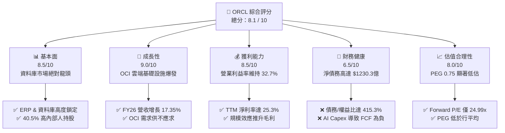

# ORCL 基本面深度分析報告
> **報告日期**：2026-06-10 ｜ **語言**：繁體中文 ｜ **數據來源**：Yahoo Finance, Finviz, StockAnalysis, Roic.ai ｜ **分析師**：CFA 級機構研究

---

## 目錄

| # | 章節 | 核心結論 |
|---|------|----------|
| 1 | **執行摘要** | 評級：**買入 (Buy)** ｜ 目標價：**$255.18**（隱含 26.8% 上行空間） |
| 2 | **公司概覽與商業模式** | 雲端基礎設施 (OCI) 爆發式增長，傳統資料庫客戶鎖定效應極強 |
| 3 | **損益表深度分析** | FY2026 營收加速增長 17.35%，AI 算力需求推升營業利益至 $206.1億 |
| 4 | **資產負債表分析** | PP&E 暴增 197.9% 彰顯 AI 資料中心擴建，財務槓桿偏高但風險可控 |
| 5 | **現金流量深度分析** | 營運現金流 $235.1億創歷史新高，戰略性資本支出導致 FCF 短期承壓 |
| 6 | **獲利能力與資本效率** | ROIC 達 13.90% 跑贏 WACC (11.44%)，杜邦分析顯示高財務槓桿放大股東回報 |
| 7 | **估值深度分析** | Forward P/E 24.99x 具備吸引力，相較於微軟與亞馬遜折價明顯 |
| 8 | **成長催化劑** | 主權雲端、多雲合作（AWS/Azure/GCP）與 AI 晶片供給改善 |
| 9 | **風險矩陣** | 高債務利息支出壓力與雲端市場激烈競爭為主要下行風險 |
| 10 | **投資建議** | 建議分批佈局，適合追求成長與具備中長線視野的機構投資人 |

---

## 1. 執行摘要

### 1.1 核心評分儀表板



### 1.2 評分進度條視覺化

```
╔══════════════════════════════════════════════════════════════╗
║               ORCL 多維度評分儀表板 (1-10分)                 ║
╠══════════════════════════════════════════════════════════════╣
║ 基本面強度  8.5 ▓▓▓▓▓▓▓▓▓▓▓▓▓▓▓▓▓░░░  ★★★★☆           ║
║ 成長動能    9.0 ▓▓▓▓▓▓▓▓▓▓▓▓▓▓▓▓▓▓░░  ★★★★★           ║
║ 獲利品質    8.5 ▓▓▓▓▓▓▓▓▓▓▓▓▓▓▓▓▓░░░  ★★★★☆           ║
║ 財務健康    6.5 ▓▓▓▓▓▓▓▓▓▓▓▓▓░░░░░░░  ★★★☆☆           ║
║ 估值合理性  8.0 ▓▓▓▓▓▓▓▓▓▓▓▓▓▓▓▓░░░░  ★★★★☆           ║
║ 護城河深度  9.0 ▓▓▓▓▓▓▓▓▓▓▓▓▓▓▓▓▓▓░░  ★★★★★           ║
║ 管理層執行  8.5 ▓▓▓▓▓▓▓▓▓▓▓▓▓▓▓▓▓░░░  ★★★★☆           ║
║ 技術創新力  9.0 ▓▓▓▓▓▓▓▓▓▓▓▓▓▓▓▓▓▓░░  ★★★★★           ║
╠══════════════════════════════════════════════════════════════╣
║ 綜合總分    8.1 ▓▓▓▓▓▓▓▓▓▓▓▓▓▓▓▓░░░░  🏆 買入 (Buy)        ║
╚══════════════════════════════════════════════════════════════╝
```

### 1.3 五大投資論點 + 三大核心風險

| 類型 | 項目 | 具體依據 | 信心度 |
|------|------|----------|--------|
| 🟢 **投資論點①** | **OCI 雲端基礎設施爆發** | FY2026 營收加速增長 17.35%，主要受惠於 OCI Gen2 雲端算力供不應求，AI 客戶（如 OpenAI、xAI）大舉簽約。 | 🟢 極高 |
| 🟢 **投資論點②** | **核心資料庫護城河極深** | 傳統 Oracle Database 具備極高轉換成本。SaaS 業務（Fusion ERP/NetSuite）持續提供穩定的高毛利訂閱流。 | 🟢 極高 |
| 🟢 **投資論點③** | **多雲聯盟（Multi-Cloud）戰略** | 與 AWS、Microsoft Azure、Google Cloud 達成原生深度合作，打破競爭壁壘，直接獲取三大公有雲的存量客戶。 | 🟢 高 |
| 🟢 **投資論點④** | **營運槓桿推升獲利** | TTM 營業利益率達 32.7%，EBITDA Margin 達 42.8%。隨著 OCI 規模效應顯現，利潤率具備進一步上行空間。 | 🟢 高 |
| 🟢 **投資論點⑤** | **強大的內部人利益一致性** | 創辦人 Larry Ellison 等內部人持股高達 40.5%，在大型科技股中極為罕見，確保管理層與股東長期利益高度一致。 | 🟢 極高 |
| 🟡 **風險①** | **資本支出激增導致 FCF 為負** | FY2026 FCF 為 -$223.0億（因 Capex 暴增至約 $458億以建設 GPU 資料中心），短期對現金流產生極大壓力。 | 🟡 中度 |
| 🔴 **風險②** | **高槓桿與利息支出壓力** | 總債務高達 $1621.6億，淨債務 $1230.3億，FY2026 利息支出高達 $45.99億，擠壓部分淨利潤。 | 🔴 高衝擊 |
| 🟡 **風險③** | **AI 算力泡沫與晶片供給風險** | 若 AI 應用變現不及預期，或 NVIDIA 晶片供應受阻，OCI 擴建可能面臨產能閒置風險。 | 🟡 中度 |

### 1.4 快速統計卡片

| 指標 | 甲骨文 (ORCL) | 軟體基礎設施行業均值 | S&P 500 均值 | 狀態 |
|------|-------------|--------------------|--------------|------|
| **營收 YoY 成長** | **17.35% (FY26)** | ~11.5% | ~5.5% | 🟢 領先 |
| **毛利率** | **67.10%** | ~70.0% | ~45.0% | 🟡 相當 |
| **營業利益率** | **32.70%** | ~24.0% | ~15.0% | 🟢 優異 |
| **ROE** | **57.60%** | ~22.0% | ~16.0% | 🟢 極高 |
| **Forward P/E** | **24.99x** | ~32.0x | ~21.5x | 🟢 具備吸引力 |
| **PEG Ratio** | **0.75** | ~1.85 | ~1.50 | 🟢 顯著低估 |

### 1.5 投資結論

```
╔══════════════════════════════════════════════════════════════════╗
║                    📊 投資結論摘要                               ║
╠════════════════