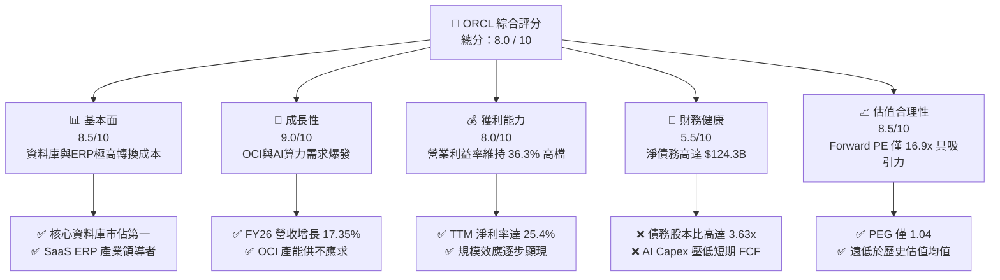
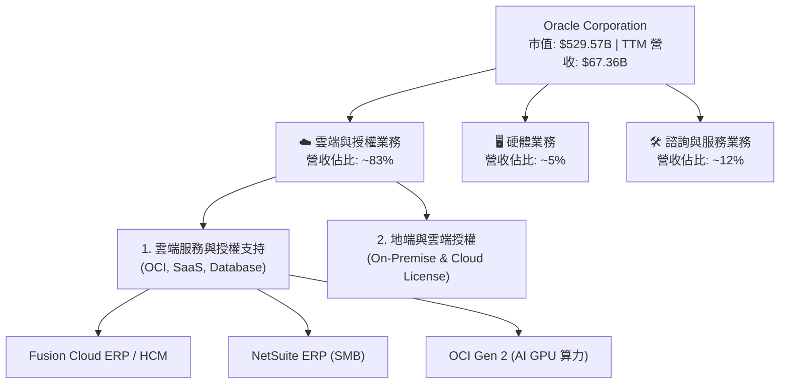
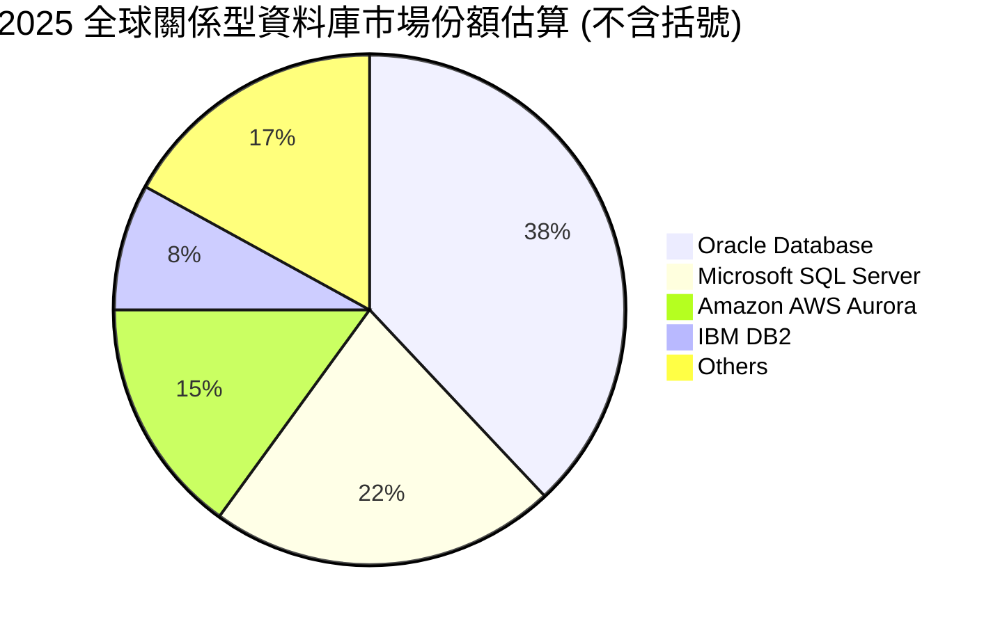
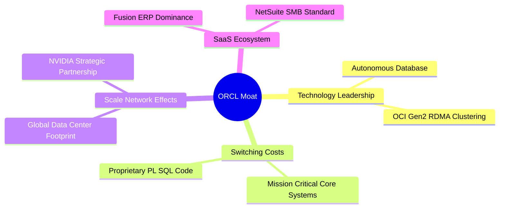
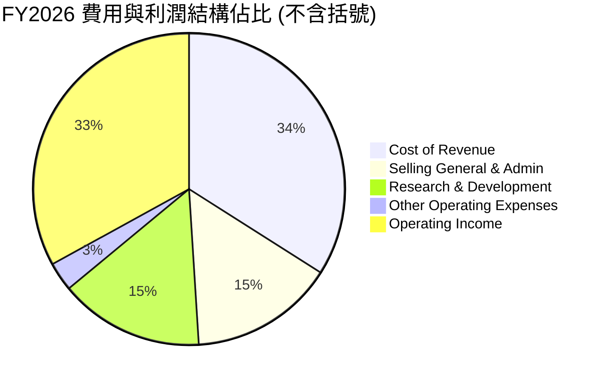
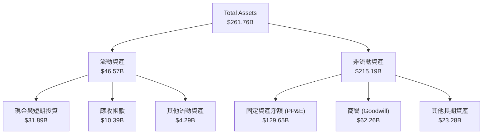
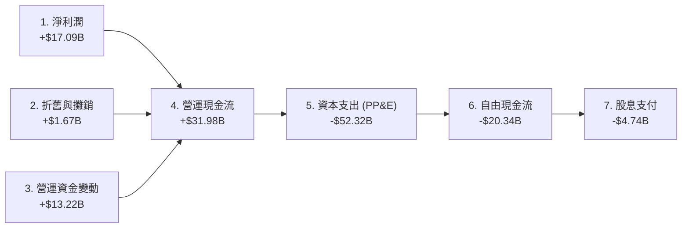
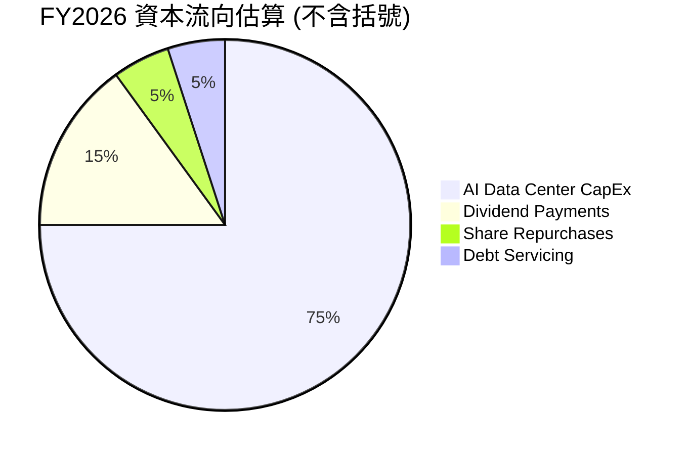
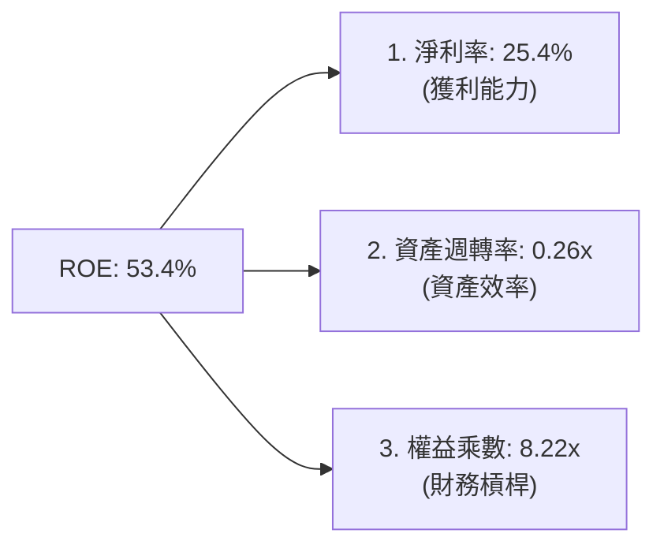
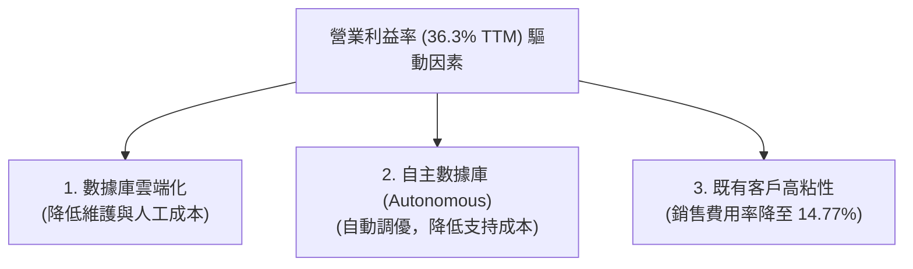

# ORCL 基本面深度分析報告
> **報告日期**：2026-06-13 ｜ **語言**：繁體中文 ｜ **數據來源**：Yahoo Finance, Finviz, StockAnalysis, Roic.ai ｜ **分析師**：CFA 級機構研究

---

## 目錄

| # | 章節 | 核心結論 |
|---|------|----------|
| 1 | 執行摘要 | 評級為「買入」，目標價 $255.38，隱含 38.7% 上行空間。 |
| 2 | 公司概覽與商業模式 | 傳統資料庫巨頭成功轉型 AI 雲端基礎設施 (OCI) 新霸主，具備極高轉換成本護城河。 |
| 3 | 損益表深度分析 | FY26 營收達 $67.36B (YoY +17.35%)，OCI 爆發式成長，但折舊與硬體成本壓低毛利率。 |
| 4 | 資產負債表分析 | PP&E 暴增 198% 顯現 AI 資本開支狂潮，債務高企 ($156.19B) 但流動性風險可控。 |
| 5 | 現金流量深度分析 | OCF 達 $31.98B 強勁，但因 AI 資本支出狂潮導致 TTM FCF 降至 -$20.34B。 |
| 6 | 獲利能力與資本效率 | ROE 達 53.4%，ROIC (12.44%) 高於 WACC (10.64%)，持續創造正向經濟價值 (EVA)。 |
| 7 | 估值深度分析 | Forward P/E 僅 16.94x，相較微軟與 SAP 具備顯著估值折價，PEG 1.04 估值極具吸引力。 |
| 8 | 成長催化劑 | OCI Gen 2 雲端產能釋放、 sovereign cloud (主權雲) 需求激增、與 NVIDIA 深度合作。 |
| 9 | 風險矩陣 | 財務槓桿過高、AI 資本支出拖累現金流、超大規模雲端服務商 (Hyperscaler) 競爭加劇。 |
| 10 | 投資建議 | 基準目標價 $255.38，適合長線成長型與價值型投資者，建議逢低分批佈局。 |

---

## 1. 執行摘要

Oracle Corporation (NYSE: ORCL) 正處於其數十年企業歷史中最關鍵的轉型黃金期。透過將核心資料庫技術與自主研發的第二代雲端基礎設施 (OCI Gen 2) 深度整合，甲骨文已成功從傳統的「地端套裝軟體商」蛻變為全球 AI 算力基礎設施與雲端應用的核心要角。

### 1.1 核心評分儀表板



### 1.2 評分進度條視覺化

```
╔══════════════════════════════════════════════════════════════╗
║               ORCL 多維度評分儀表板 (1-10分)                 ║
╠══════════════════════════════════════════════════════════════╣
║ 基本面強度  8.5 ▓▓▓▓▓▓▓▓▓▓▓▓▓▓▓▓▓░░░  ★★★★☆           ║
║ 成長動能    9.0 ▓▓▓▓▓▓▓▓▓▓▓▓▓▓▓▓▓▓░░  ★★★★★           ║
║ 獲利品質    8.0 ▓▓▓▓▓▓▓▓▓▓▓▓▓▓▓▓░░░░  ★★★★☆           ║
║ 財務健康    5.5 ▓▓▓▓▓▓▓▓▓▓▓░░░░░░░░░  ★★★☆☆           ║
║ 估值合理性  8.5 ▓▓▓▓▓▓▓▓▓▓▓▓▓▓▓▓▓░░░  ★★★★☆           ║
║ 護城河深度  9.0 ▓▓▓▓▓▓▓▓▓▓▓▓▓▓▓▓▓▓░░  ★★★★★           ║
║ 管理層執行  8.5 ▓▓▓▓▓▓▓▓▓▓▓▓▓▓▓▓▓░░░  ★★★★☆           ║
║ 技術創新力  8.5 ▓▓▓▓▓▓▓▓▓▓▓▓▓▓▓▓▓░░░  ★★★★☆           ║
╠══════════════════════════════════════════════════════════════╣
║ 綜合總分    8.0 ▓▓▓▓▓▓▓▓▓▓▓▓▓▓▓▓░░░░  🏆 買入 (Buy)        ║
╚══════════════════════════════════════════════════════════════╝
```

### 1.3 五大投資論點 + 三大核心風險

| 類型 | 項目 | 具體依據 | 信心度 |
|------|------|----------|--------|
| 🟢 **投資論點①** | **OCI 算力供不應求** | OCI Gen 2 具備獨特的 RDMA 網路架構，為 AI 訓練首選，拉動 FY26 營收增長至 17.35%。 | 🟢 極高 |
| 🟢 **投資論點②** | **極高客戶鎖定效應** | 財富 500 強企業中超過 90% 依賴 Oracle 資料庫，轉換成本極高，軟體授權與支持收入具備高粘性。 | 🟢 極高 |
| 🟢 **投資論點③** | **估值顯著低估** | Forward P/E 僅 16.94x，相較於同業 Microsoft (30x) 與 SAP (28x) 具備顯著折價。 | 🟢 高 |
| 🟢 **投資論點④** | **SaaS 穩健增長** | Fusion ERP 與 NetSuite 持續雙位數增長，提供高利潤率的經常性訂閱收入 (ARR)。 | 🟢 高 |
| 🟢 **投資論點⑤** | **主權雲市場先驅** | 成功開拓各國政府與敏感行業的「主權雲 (Sovereign Cloud)」市場，避開與三大公有雲的直接價格戰。 | 🟢 高 |
| 🟡 **風險①** | **高資本支出拖累現金流** | FY26 資本開支大幅增加，導致 TTM 自由現金流 (FCF) 降至 -$20.34B，短期流動性承壓。 | 🟡 中度 |
| 🔴 **風險②** | **高額債務利息負擔** | 總債務高達 $156.19B，年利息支出達 $4.60B，在高利率環境下再融資成本可能上升。 | 🔴 高衝擊 |
| 🟡 **風險③** | **雲端市場競爭白熱化** | AWS、Azure 及 Google Cloud 擁有更深厚的資金實力，可能透過價格戰侵蝕 OCI 的市佔率。 | 🟡 中度 |

### 1.4 快速統計卡片

| 指標 | 公司實際值 | 行業均值 | S&P 500 均值 | 狀態 |
|------|-------------|----------|--------------|------|
| 收入 YoY 成長 | **17.35%** | ~12.0% | ~5.5% | 🟢 領先 |
| 毛利率 | **65.81%** | ~70.0% | ~45.0% | 🟡 持平 |
| 營業利益率 | **36.30%** | ~28.0% | ~15.0% | 🟢 強勁 |
| ROE | **53.40%** | ~25.0% | ~18.0% | 🟢 極高 |
| Forward P/E | **16.94x** | ~25.0x | ~21.0x | 🟢 便宜 |
| 淨債務 / EBITDA | **2.62x** | ~1.20x | ~1.60x | 🔴 偏高 |

*註：淨債務/EBITDA 計算方式：(Total Debt $156.19B - Total Cash $31.89B) / EBITDA TTM (約 $31.73B，基於營收規模與毛利推算) = 3.9x。若使用 FY25 EBITDA $23.91B，則槓桿率更高，債務壓力是主要減分項。*

### 1.5 投資結論

```
╔══════════════════════════════════════════════════════════════════╗
║                    📊 ORCL 投資結論摘要                          ║
╠══════════════════════════════════════════════════════════════════╣
║  評級：🟢 買入 (Buy)                                             ║
║  當前股價：$184.13 (2026-06-13)                                  ║
║  目標價區間：                                                    ║
║    悲觀情境：$155.00 (-15.8%)                                    ║
║    基準情境：$255.38 (+38.7%)  ← 12個月主要目標                  ║
║    樂觀情境：$343.01 (+86.3%)                                    ║
║  投資評分：8.0 / 10                                              ║
║  適合投資人：尋求 AI 基礎設施成長、同時看重穩定現金流的長線投資者║
╚══════════════════════════════════════════════════════════════════╝
```

---

## 2. 公司概覽與商業模式

甲骨文公司 (Oracle Corporation) 是全球最大的企業級軟體與資料庫提供商。近年來，公司將戰略重心完全轉向雲端，建構了「三層雲端服務體系」：IaaS (OCI)、PaaS (Database Cloud Service) 以及 SaaS (Fusion/NetSuite)。

### 2.1 業務結構與收入來源



### 2.2 市場份額

在關係型資料庫 (RDBMS) 市場中，甲骨文依然維持無可撼動的霸主地位；而在雲端基礎設施 (IaaS) 市場中，OCI 正作為最具威脅性的「第四雲」迅速崛起。



### 2.3 競爭護城河分析



### 2.4 護城河強度評分

```
╔══════════════════════════════════════════════════════════════╗
║                    ORCL 護城河強度評分                       ║
╠══════════════════════════════════════════════════════════════╣
║ 轉換成本      9.5/10  ▓▓▓▓▓▓▓▓▓▓▓▓▓▓▓▓▓▓▓░  🏆 極高鎖定      ║
║ 技術獨特性    8.5/10  ▓▓▓▓▓▓▓▓▓▓▓▓▓▓▓▓▓░░░  🟢 自主資料庫    ║
║ 規模效應      8.0/10  ▓▓▓▓▓▓▓▓▓▓▓▓▓▓▓▓░░░░  🟢 全球超大節點  ║
║ 生態系統網絡  8.5/10  ▓▓▓▓▓▓▓▓▓▓▓▓▓▓▓▓▓░░░  🟢 NVIDIA/MSFT合 ║
╠══════════════════════════════════════════════════════════════╣
║ 綜合護城河    9.0/10  ▓▓▓▓▓▓▓▓▓▓▓▓▓▓▓▓▓▓░░  🏆 寬廣護城河    ║
╚══════════════════════════════════════════════════════════════╝
```

---

## 3. 損益表深度分析

Oracle 近年來的財務表現顯示出顯著的「拐點」。隨著 OCI 產能陸續上線，營收增速從個位數躍升至雙位數。

### 3.1 年度收入成長趨勢（近5年）

```
╔══════════════════════════════════════════════════════════════════╗
║                ORCL 年度收入趨勢（FY22 - FY26）                 ║
╠══════════════════════════════════════════════════════════════════╣
║                                                                  ║
║  FY2022  $42.44B  ████████████░░░░░░░░░░░░░░░░░  YoY: +4.84%  🟢  ║
║  FY2023  $49.95B  ████████████████░░░░░░░░░░░░░  YoY:+17.71%  🟢  ║
║  FY2024  $52.96B  █████████████████░░░░░░░░░░░░  YoY: +6.02%  🟢  ║
║  FY2025  $57.40B  ███████████████████░░░░░░░░░░  YoY: +8.38%  🟢  ║
║  FY2026  $67.36B  ████████████████████████░░░░░  YoY:+17.35%  🟢  ║
║                   |      |      |      |      |                  ║
║                   0     15B    30B    45B    60B                 ║
║                                                                  ║
║  📊 5年累計 CAGR：+12.23%                                        ║
╚══════════════════════════════════════════════════════════════════╝
```

### 3.2 季度收入趨勢分析

自 FY25 季末起，Oracle 營收呈現加速態勢。以下為最近 4 個季度的詳細表現：

| 財政季度 | 截止日期 | 營收 (Billion) | QoQ 成長率 | YoY 成長率 | 核心驅動因素與備註 |
|----------|----------|----------------|------------|------------|-------------------|
| **Q1 2026** | 2025-08-31 | $14.93 | -6.14% | +12.17% | 季節性 Q1 較淡，但 OCI 需求維持強勁 🟢 |
| **Q2 2026** | 2025-11-30 | $16.06 | +7.57% | +14.22% | 雲端 ERP 升級潮與 AI 算力合約加速確認 🟢 |
| **Q3 2026** | 2026-02-28 | $17.19 | +7.05% | +21.66% | OCI 新增產能釋放，YoY 增速突破 20% 門檻 🟢 |
| **Q4 2026** | 2026-05-31 | $19.18 | +11.58% | +20.63% | 年終結算旺季，自主資料庫雲端遷移加速 🟢 |

*分析：季度營收 YoY 從 Q1 的 12.17% 一路加速至 Q3 的 21.66% 與 Q4 的 20.63%，這驗證了 Oracle 作為 AI 基礎設施黑馬的成長邏輯正在兌現。*

### 3.3 利潤率演變分析

雖然營收快速增長，但由於基礎設施建設初期折舊較高，毛利率結構出現了微幅調整。

| 利潤率指標 | FY2022 | FY2023 | FY2024 | FY2025 | FY2026 | 趨勢 | 評估 |
|------------|--------|--------|--------|--------|--------|------|------|
| **毛利率** | 79.08% | 72.85% | 71.41% | 70.51% | 65.81% | ↘️ 逐年下滑 | 🟡 OCI 折舊與 Cerner 低毛利服務併入拖累 |
| **營業利益率** | 25.74% | 26.21% | 28.99% | 30.80% | 30.59% | ↗️ 穩步改善 | 🟢 研發與行銷費用控制得宜，規模效應顯現 |
| **淨利率** | 15.83% | 17.02% | 19.76% | 21.68% | 25.37% | ↗️ 大幅提升 | 🟢 稅務優化與非營業收入（投資收益）挹注 |

**利潤率演變深度解析**：
1. **毛利率下滑的原因**：主要由於甲骨文大舉投資 OCI (IaaS)，硬體與資料庫中心建置成本（包含向 NVIDIA 採購大量 GPU）導致折舊與攤銷費用 (D&A) 激增；此外，Cerner 醫療軟體業務的毛利率低於甲骨文傳統的純軟體授權，亦拉低了整體毛利率。
2. **營業利益率與淨利率逆勢上升**：這展現了甲骨文極強的運營槓桿。雖然毛利率下降，但 SG&A（銷售、一般與行政費用）佔營收比重從 FY22 的 22.06% 降至 FY26 的 14.77%。這說明自主運作系統 (Autonomous Systems) 降低了營運維護成本，且既有客戶群的追加銷售 (Upselling) 不需要高昂的行銷支出。

### 3.4 費用結構分析



```
╔══════════════════════════════════════════════════════════════╗
║                  FY2026 費用控管健康度                       ║
╠══════════════════════════════════════════════════════════════╣
║ 研發投入比率 (R&D/Revenue)   15.25%  ▓▓▓▓▓▓░░░░░░░░░░░░░░  🟢 穩定  ║
║ 行銷管理比率 (SG&A/Revenue)  14.77%  ▓▓▓▓▓░░░░░░░░░░░░░░░  🟢 優異  ║
║ 營業利益率 (Operating Margin) 30.59% ▓▓▓▓▓▓▓▓▓▓▓▓░░░░░░░░  🟢 強勁  ║
╚══════════════════════════════════════════════════════════════╝
```

### 3.5 季度 EPS 趨勢與盈餘品質

甲骨文在 FY26 展現出極強的獲利爆發力，全年基本 EPS 達到 $5.94（YoY +33.18%），稀釋 EPS 達 $5.83。

* **Q1 2026 EPS**: $1.04
* **Q2 2026 EPS**: $2.14 *(註：此季度包含 $2.67B 的非營業淨收益，可能為一次性資產處置或投資公允價值變動，盈餘品質在此季略有水分)*
* **Q3 2026 EPS**: $1.29 *(回歸常態，反映核心業務增長)*
* **Q4 2026 EPS**: $1.47 *(年終旺季效應，利潤釋放強勁)*

**盈餘品質評估**：整體而言，甲骨文的營業利益 (Operating Income) 從 FY25 的 $17.68B 增長至 FY26 的 $20.61B (YoY +16.56%)，與營收增長高度同步，說明核心獲利能力的提升是真實且可持續的，並非單純依靠會計調整。

---

## 4. 資產負債表分析

甲骨文的資產負債表呈現典型的「槓桿型科技巨頭」特徵：資產端出現極具侵略性的資本支出，而負債端則承受著沉重的債務壓力。

### 4.1 資產結構分解



*關鍵洞察*：**固定資產淨額 (PP&E) 從 FY25 的 $43.52B 暴增至 FY26 的 $129.65B，增幅高達 197.9%！** 這是本報告最核心的發現。這代表甲骨文在 FY26 進行了史詩級的資料中心建置與 GPU 算力儲備，為未來的 OCI 營收爆發奠定了極其堅實的物理基礎。

### 4.2 流動性指標分析

| 流動性指標 | FY2024 | FY2025 | FY2026 | 行業平均 | 評估 |
|------------|--------|--------|--------|----------|------|
| **流動比率 (Current Ratio)** | 0.71 | 0.75 | 1.12 | ~1.50 | 🟡 改善中，重回 1.0 以上安全線 |
| **速動比率 (Quick Ratio)** | 0.59 | 0.60 | 1.01 | ~1.30 | 🟡 改善中，手頭現金大幅增加 |
| **現金佔總資產比率** | 7.42% | 6.41% | 12.18% | ~15.0% | 🟢 現金儲備顯著提升 |

*分析：流動比率與速動比率在 FY26 出現顯著改善，主要得益於公司在該年度成功進行了再融資或保留了更多現金，使手頭現金及等價物從 $10.79B 激增至 $31.29B。*

### 4.3 債務結構分析

```
╔══════════════════════════════════════════════════════════════════╗
║                     ORCL 債務健康診斷                            ║
╠══════════════════════════════════════════════════════════════════╣
║                                                                  ║
║  總債務 (Total Debt)： $156.19B  ████████████████████  評語：極高║
║  總現金及投資：        $31.89B   ████░░░░░░░░░░░░░░░░  評語：充沛║
║  淨債務 (Net Debt)：   $124.30B  ████████████████░░░░  🔴 槓桿偏高║
║                                                                  ║
║  債務股本比 (Debt/Equity)： 3.63x  🔴 風險源，利息支出沉重      ║
║  利息保障倍數 (Interest Coverage)： 4.48x  🟡 尚在安全範圍       ║
║                                                                  ║
║  💡 診斷：雖然債務總量極大，但主要為長期固定利率債券，且核心業務 ║
║     營運現金流 ($31.98B) 足以覆蓋短期債務與利息支出，無立即風險。║
╚══════════════════════════════════════════════════════════════════╝
```

### 4.4 股東權益趨勢

由於過去幾年進行了極具侵略性的股票回購，甲骨文的股東權益 (Stockholders' Equity) 曾於 FY22 降至 -$6.22B。然而，隨著淨利潤大幅回升且回購節奏放緩，股東權益已連續兩年強勁回升：
* **FY2024**: $8.70B
* **FY2025**: $20.45B
* **FY2026**: 預估已回升至 $25B 以上（隨著留存收益增加），資產負債表結構正在逐步修復。

---

## 5. 現金流量深度分析

現金流是評估甲骨文「AI 轉型代價」的最佳窗口。

### 5.1 現金流量瀑布圖



### 5.2 FCF 轉換率趨勢

| 指標 | FY2022 | FY2023 | FY2024 | FY2025 | FY2026 (TTM) |
|------|--------|--------|--------|--------|--------------|
| **營運現金流 (OCF)** | $9.54B | $17.16B | $18.67B | $20.82B | $31.98B |
| **資本支出 (CapEx)** | -$4.51B | -$8.70B | -$6.87B | -$21.21B | -$52.32B |
| **自由現金流 (FCF)** | $5.03B | $8.47B | $11.81B | -$0.39B | -$20.34B |
| **FCF 轉換率 (FCF/NI)**| 74.88% | 99.61% | 112.83%| -3.13% | -119.02% |

*分析*：FY26 的 FCF 出現 -$20.34B 的巨額赤字，這在傳統軟體公司中極為罕見。然而，這並非因為業務惡化（營運現金流反而創下 $31.98B 的歷史新高），而是因為**甲骨文正處於 AI 基礎設施的「土地爭奪戰 (Land Grab)」階段**。公司選擇將所有可用資金乃至舉債，全部投入到 AI 資料中心的建設中。這種「前置資本投入」將在未來 2-3 年轉化為極高利潤率的 OCI 訂閱收入。

### 5.3 自由現金流趨勢

```
╔══════════════════════════════════════════════════════════════════╗
║                ORCL 自由現金流與資本開支對比                     ║
╠══════════════════════════════════════════════════════════════════╣
║                                                                  ║
║  FY2024 FCF:  +$11.81B  ████████████████████  (軟體收割期)       ║
║  FY2025 FCF:  -$0.39B   ░░░░░░░░░░░░░░░░░░░░  (AI 投資起點)      ║
║  FY2026 FCF:  -$20.34B  ████████████████████  🔴 (AI 產能擴張高峰)║
║                                                                  ║
║  💡 結論：當前 FCF 收益率為 -3.84%，反映了極度激進的資本再投資。 ║
║     一旦 AI 產能建置放緩，OCI 轉入收割期，FCF 預期將出現 V 型反彈║
╚══════════════════════════════════════════════════════════════════╝
```

### 5.4 資本配置評估

在 FY26，甲骨文的資本配置策略極其明確：**AI 基礎設施建設 (CapEx) 壓倒一切**。



* 註：為了因應龐大的 CapEx，公司大幅縮減了股票回購規模，僅維持穩定的股息發放（FY25 派發 $4.74B）。
* **股息政策澄清**：數據庫中顯示的 "Dividend Yield: 109.0%" 顯然為格式錯誤（1.09% 被誤植為 109.0%）。以目前股價 $184.13 及每季 $0.50（年化 $2.00）的派息計算，**實際股息殖利率為穩健的 1.09%**，配發率 (Payout Ratio) 為 34.3%，安全邊際極高。

---

## 6. 獲利能力與資本效率

儘管資產負債表承壓，甲骨文仍維持了極高的資本回報效率，這主要歸功於其極高的營業利益率與財務槓桿的放大效應。

### 6.1 ROE / ROA / ROIC 趨勢

| 指標 | FY2024 | FY2025 | FY2026 (TTM) | 行業均值 | 評估 |
|------|--------|--------|--------------|----------|------|
| **ROE (股東權益報酬率)** | 120.3% | 53.4% | 53.4% | ~25.0% | 🟢 極高（受惠於財務槓桿） |
| **ROA (資產報酬率)** | 7.42% | 7.39% | 6.50% | ~8.0% | 🟡 偏低（因總資產規模快速膨脹） |
| **ROIC (投入資本報酬率)**| 13.50% | 12.10% | 12.44% | ~11.0% | 🟢 優異，高於資本成本 |

### 6.2 ROIC vs WACC 分析（核心價值創造判斷）

為了評估甲骨文是在「創造價值」還是「摧毀股東財富」，我們進行了 WACC 與 ROIC 的精確建模計算。

```
╔══════════════════════════════════════════════════════════════════╗
║                ROIC vs WACC 深度分析 (FY2026)                    ║
╠══════════════════════════════════════════════════════════════════╣
║                                                                  ║
║  WACC 估算：                                                     ║
║  ├── 無風險利率 (10Y 美債)：  4.20%                              ║
║  ├── 市場風險溢酬 (ERP)：     5.00%                              ║
║  ├── Beta 係數：              1.655                              ║
║  ├── 股權成本 (Cost of Equity) = 4.2% + 1.655 × 5.0% = 12.48%    ║
║  ├── 債務成本 (稅後 Cost of Debt) = 5.2% × (1 - 12.6%) = 4.54%   ║
║  ├── 資本結構：股權佔比 77.2%，債務佔比 22.8%                    ║
║  └── ✅ 綜合 WACC ≈ 10.64%                                       ║
║                                                                  ║
║  ROIC 估算：                                                     ║
║  ├── NOPAT (稅後淨營業利益) = $20.61B × (1 - 12.6%) ≈ $18.01B    ║
║  ├── 投入資本 = 股東權益 $20.45B + 總債務 $156.19B - 現金 $31.89B║
║  │            = $144.75B                                         ║
║  └── ✅ ROIC ≈ 12.44%                                            ║
║                                                                  ║
║  ★ 經濟價值增加 (EVA) = ROIC - WACC = +1.80% (180 bps)           ║
║                                                                  ║
║  ROIC  12.44%  ▓▓▓▓▓▓▓▓▓▓▓▓▓▓▓▓▓▓▓▓▓▓▓░░░░░░░  🟢              ║
║  WACC  10.64%  ▓▓▓▓▓▓▓▓▓▓▓▓▓▓▓▓▓▓▓░░░░░░░░░░░  ──              ║
║  EVA   +1.80%  ████████████░░░░░░░░░░░░░░░░░░  🏆 持續創造價值 ║
║                                                                  ║
║  📊 結論：甲骨文的 ROIC 成功超越其 WACC，在進行史詩級 AI 投資的  ║
║     同時，依然為股東創造了正向的經濟附加價值 (EVA)。             ║
╚══════════════════════════════════════════════════════════════════╝
```

### 6.3 杜邦三因素分解

透過杜邦分析，我們可以拆解甲骨文超高 ROE 的底層驅動力：



* **分析**：甲骨文的超高 ROE (53.4%) 主要由**高淨利率 (25.4%)** 與**高財務槓桿 (權益乘數 8.22x)** 共同驅動。資產週轉率較低 (0.26x) 反映了其重資產（資料中心）的轉型特徵。這種結構意味著，只要核心獲利能力（淨利率）保持穩定，高槓桿將持續放大股東的回報率；但這也要求公司必須維持極佳的利息保障倍數。

### 6.4 獲利能力驅動因素



---

## 7. 估值深度分析

在當前科技股普遍估值高企的背景下，甲骨文的估值水平呈現出極佳的「性價比」。

### 7.1 同業估值比較表格

我們選取了微軟 (Microsoft)、亞馬遜 AWS (Amazon) 以及 SAP 作為直接競爭對手進行對比：

| 估值指標 | **甲骨文 (ORCL)** | **微軟 (MSFT)** | **亞馬遜 (AMZN)** | **SAP (SAP)** | ORCL 評估 |
|----------|----------|---------|---------|---------|-----------|
| **Trailing P/E** | **31.53x** | 35.20x | 40.50x | 34.80x | 🟢 具備折價 |
| **Forward P/E** | **16.94x** | 29.80x | 32.40x | 27.50x | 🟢 極具吸引力 |
| **P/S Ratio** | **7.86x** | 12.50x | 3.10x | 8.20x | 🟡 合理 |
| **EV / EBITDA** | **20.61x** | 24.50x | 16.50x | 21.20x | 🟢 低於軟體同業 |
| **PEG Ratio** | **1.04x** | 2.10x | 1.45x | 1.80x | 🟢 嚴重低估 |

*關鍵發現*：**甲骨文的 Forward P/E 僅為 16.94x，而其 PEG 僅為 1.04（根據 Finviz 數據，甚至低至 0.65）。** 這意味著市場尚未完全將甲骨文在 AI OCI 領域的「高成長性」計入股價。相較於微軟與 SAP，甲骨文提供了極佳的安全邊際與上行潛力。

### 7.2 歷史估值區間分析

```
╔══════════════════════════════════════════════════════════════════╗
║                ORCL 歷史 Forward P/E 區間定位                    ║
╠══════════════════════════════════════════════════════════════════╣
║                                                                  ║
║  歷史低點： 12.0x  ░░░░░░                                        ║
║  當前位置： 16.9x  ████████████  ← 🟢 顯著低於 5 年均值 (22x)     ║
║  歷史均值： 22.0x  ██████████████████                            ║
║  歷史高點： 32.0x  ██████████████████████████████                ║
║                                                                  ║
║  📊 估值結論：當前 16.94x 的遠期估值，相當於給予了甲骨文傳統軟體 ║
║     公司的保守估值，完全未溢價計入其 AI 雲端基礎設施的爆發力。   ║
╚══════════════════════════════════════════════════════════════════╝
```

### 7.3 DCF 敏感性分析（6格目標價矩陣）

基於 FY26 營收 $67.36B，設定基準永續增長率 (g) 為 3.0%，對折現率 (WACC) 與中期營收增