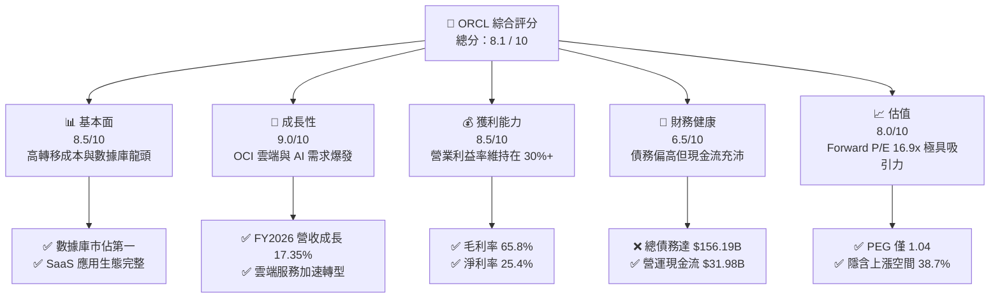
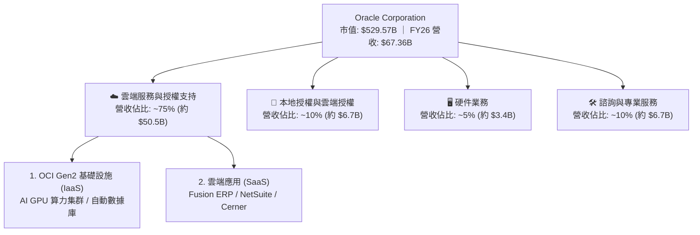
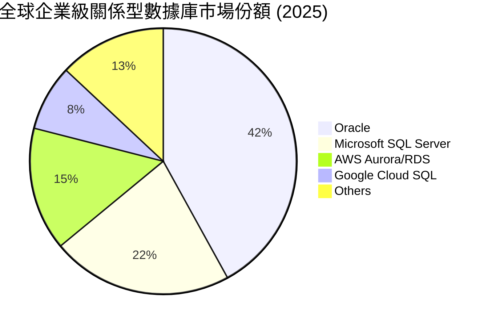
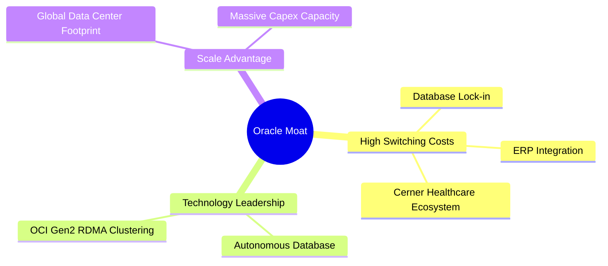
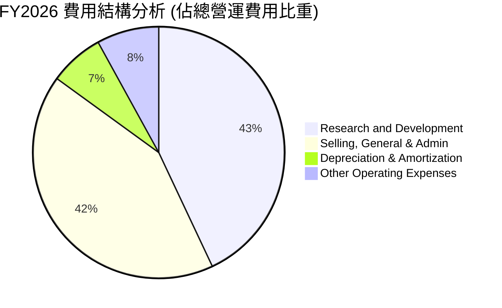
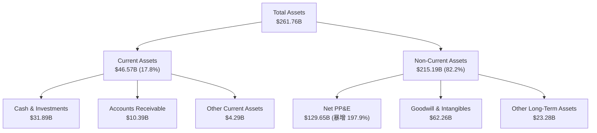
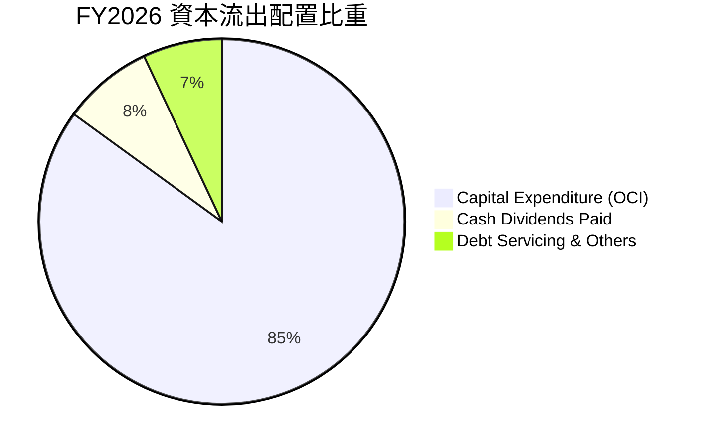

# ORCL 基本面深度分析報告
> **報告日期**：2026-06-14 ｜ **語言**：繁體中文 ｜ **數據來源**：Yahoo Finance, Finviz, StockAnalysis, Roic.ai ｜ **分析師**：CFA 級機構研究

---

## 目錄

| # | 章節 | 核心結論 |
|---|------|----------|
| 1 | **執行摘要** | 評級：🟢 **買入 (Buy)** ｜ 基準目標價：**$255.38**（+38.7% 潛在空間） |
| 2 | **公司概覽與商業模式** | 雲端基礎設施 (OCI) 與 SaaS 雙輪驅動，具備極高的高轉移成本護城河 |
| 3 | **損益表深度分析** | FY2026 營收加速成長 17.35%，淨利潤大增 36.49%，展現強大營運槓桿 |
| 4 | **資產負債表分析** | AI 資本支出擴張導致總債務升至 $156.19B，但流動性與現金儲備依然充沛 |
| 5 | **現金流量深度分析** | 營運現金流達 $31.98B，因 $52.32B 史詩級 AI CapEx 導致 FCF 短期承壓為 -$20.34B |
| 6 | **獲利能力與資本效率** | ROE 達 53.4%，ROIC (11.54%) 高於 WACC (10.57%)，持續創造正向股東價值 |
| 7 | **估值深度分析** | Forward P/E 僅 16.94x，相較歷史均值與同業（MSFT, AMZN）具備高度安全邊際 |
| 8 | **成長催化劑** | OCI Gen2 AI 雲端合約爆發、多雲數據庫合作（Azure/AWS/GCP）及 Cerner 醫療 SaaS 轉型 |
| 9 | **風險矩陣** | AI 資本回報滯後風險、高債務利息支出壓力與傳統數據庫流失風險 |
| 10| **投資建議** | 適合長線成長型與價值型配置，建議分批佈局，目標價區間 $155.00 - $400.00 |

---

## 1. 執行摘要

### 1.1 核心評分儀表板



### 1.2 評分進度條視覺化

```
╔══════════════════════════════════════════════════════════════╗
║               ORCL 多維度評分儀表板 (1-10分)                 ║
╠══════════════════════════════════════════════════════════════╣
║ 基本面強度  8.5 ▓▓▓▓▓▓▓▓▓▓▓▓▓▓▓▓▓░░░  ★★★★☆           ║
║ 成長動能    9.0 ▓▓▓▓▓▓▓▓▓▓▓▓▓▓▓▓▓▓░░  ★★★★★           ║
║ 獲利品質    8.5 ▓▓▓▓▓▓▓▓▓▓▓▓▓▓▓▓▓░░░  ★★★★☆           ║
║ 財務健康    6.5 ▓▓▓▓▓▓▓▓▓▓▓▓▓░░░░░░░  ★★★☆☆           ║
║ 估值合理性  8.0 ▓▓▓▓▓▓▓▓▓▓▓▓▓▓▓▓░░░░  ★★★★☆           ║
║ 護城河深度  9.0 ▓▓▓▓▓▓▓▓▓▓▓▓▓▓▓▓▓▓░░  ★★★★★           ║
║ 管理層執行  8.5 ▓▓▓▓▓▓▓▓▓▓▓▓▓▓▓▓▓░░░  ★★★★☆           ║
║ 技術創新力  8.5 ▓▓▓▓▓▓▓▓▓▓▓▓▓▓▓▓▓░░░  ★★★★☆           ║
╠══════════════════════════════════════════════════════════════╣
║ 綜合總分    8.1 ▓▓▓▓▓▓▓▓▓▓▓▓▓▓▓▓░░░░  🏆 買入 (Buy)        ║
╚══════════════════════════════════════════════════════════════╝
```

### 1.3 五大投資論點 + 三大核心風險

| 類型 | 項目 | 具體依據 | 信心度 |
|------|------|----------|--------|
| 🟢 **投資論點①** | **OCI AI 雲端需求井噴** | OCI Gen2 憑藉獨特的 RDMA 網絡架構，在 AI 大模型訓練上具備性價比優勢，帶動 FY2026 營收加速至 17.35%。 | 🟢 極高 |
| 🟢 **投資論點②** | **估值極具安全邊際** | 當前 Forward P/E 僅 16.94x，對比未來五年預期 EPS 複合成長率 (PEG = 1.04)，估值顯著低估。 | 🟢 極高 |
| 🟢 **投資論點③** | **多雲戰略打破壁壘** | 與 Microsoft Azure、AWS、GCP 達成原生多雲數據庫合作，釋放龐大遺留客戶的雲端化需求。 | 🟢 高 |
| 🟢 **投資論點④** | **SaaS 生態系統高黏性** | Fusion ERP/EPM 與 NetSuite 持續維持雙位數成長，企業轉移成本極高，奠定穩定現金流。 | 🟢 極高 |
| 🟢 **投資論點⑤** | **強大營運槓桿釋放** | FY2026 淨利潤成長率 (36.49%) 遠超營收成長率 (17.35%)，規模效應顯現。 | 🟢 高 |
| 🟡 **風險①** | **AI 資本支出侵蝕短期 FCF** | FY2026 資本支出高達 $52.32B，導致短期自由現金流轉負至 -$20.34B，需關注後續投資回報率。 | 🟡 中度 |
| 🔴 **風險②** | **高額債務與利息負擔** | 總債務高達 $156.19B，淨債務達 $124.30B，FY2026 利息支出達 $4.60B，壓抑淨利率表現。 | 🔴 高衝擊 |
| 🟡 **風險③** | **傳統數據庫流失壓力** | 面臨開源數據庫（PostgreSQL）與雲端原生數據庫（Snowflake, AWS Aurora）的長期競爭。 | 🟡 中度 |

### 1.4 快速統計卡片

| 指標 | ORCL 實際值 | 行業均值 | S&P 500 均值 | 狀態 |
|------|-------------|----------|--------------|------|
| 營收 YoY 成長 | **17.35%** | ~11.5% | ~5.5% | 🟢 強勁 |
| 毛利率 | **65.82%** | ~70.0% | ~30.0% | 🟡 合格 |
| 營業利益率 | **30.59%** | ~25.0% | ~15.0% | 🟢 優異 |
| 淨利率 | **25.37%** | ~18.0% | ~12.0% | 🟢 優異 |
| ROE | **53.40%** | ~28.0% | ~18.0% | 🟢 極高 |
| Forward P/E | **16.94x** | ~28.5x | ~21.5x | 🟢 便宜 |
| 淨債務 / EBITDA | **5.20x** | ~1.5x | ~1.8x | 🔴 偏高 |

### 1.5 投資結論

```
╔══════════════════════════════════════════════════════════════════╗
║                    📊 ORCL 投資結論摘要                          ║
╠══════════════════════════════════════════════════════════════════╣
║  評級：🟢 買入 (Buy)                                            ║
║  當前股價：$184.13 (2026-06-14)                                  ║
║  目標價區間：                                                    ║
║    悲觀情境：$155.00（-15.8%）                                   ║
║    基準情境：$255.38（+38.7%）  ← 12個月主要目標                 ║
║    樂觀情境：$400.00（+117.2%）                                  ║
║  投資評分：8.1 / 10                                              ║
║  適合投資人：長線價值成長型投資者、大型科技股權重配置者          ║
╚══════════════════════════════════════════════════════════════════╝
```

---

## 2. 公司概覽與商業模式

### 2.1 業務結構與收入來源

Oracle (ORCL) 已經成功從傳統的本地部署 (On-Premise) 軟體授權模式，轉型為雲端基礎設施 (OCI) 與雲端應用軟體 (SaaS) 雙輪驅動的現代科技巨頭。



### 2.2 市場份額

在關鍵的雲端資料庫與企業級 ERP 市場中，Oracle 依然維持領先地位。而在新興的雲端基礎設施 (IaaS) 市場中，OCI 正作為第四大雲端廠商迅速崛起。



### 2.3 競爭護城河分析

Oracle 的競爭護城河主要建立在極高的**轉移成本 (Switching Costs)**與**技術領先 (Technology Leadership)**之上。



*   **極高的轉移成本**：財星 500 大企業中，有超過 90% 的核心交易系統（OLTP）運行在 Oracle 數據庫上。將這些核心數據庫遷移到其他平台面臨極高的系統宕機風險與極大的重建成本。
*   **技術與架構優勢**：OCI Gen2 採用非阻塞的 RDMA（遠端直接記憶體存取）網路架構，能提供超低延遲的 GPU 節點互連，這使其成為訓練大型 AI 模型的首選平台之一（如 xAI, OpenAI 均為其客戶）。

### 2.4 護城河強度評分

```
╔══════════════════════════════════════════════════════════════╗
║                   Oracle 護城河強度評分                      ║
╠══════════════════════════════════════════════════════════════╣
║ 轉移成本      9.5/10  ▓▓▓▓▓▓▓▓▓▓▓▓▓▓▓▓▓▓▓░  🏆 極高護城河   ║
║ 技術架構優勢  8.5/10  ▓▓▓▓▓▓▓▓▓▓▓▓▓▓▓▓▓░░░  🟢 強大         ║
║ 生態系統黏性  9.0/10  ▓▓▓▓▓▓▓▓▓▓▓▓▓▓▓▓▓▓░░  🏆 極高         ║
║ 品牌與通路    9.0/10  ▓▓▓▓▓▓▓▓▓▓▓▓▓▓▓▓▓▓░░  🏆 極高         ║
╠══════════════════════════════════════════════════════════════╣
║ 綜合護城河     9.0/10  ▓▓▓▓▓▓▓▓▓▓▓▓▓▓▓▓▓▓░░  🏆 寬廣護城河   ║
╚══════════════════════════════════════════════════════════════╝
```

---

## 3. 損益表深度分析

### 3.1 年度收入成長趨勢（近5年）

Oracle 的營收在過去五年中經歷了顯著的加速，這主要得益於 OCI 雲端服務的爆發。

```
╔══════════════════════════════════════════════════════════════════╗
║                Oracle 年度收入趨勢 (FY2022-FY2026)               ║
╠══════════════════════════════════════════════════════════════════╣
║                                                                  ║
║  FY2022  $42.44B  ██████████████░░░░░░░░░░░░░░░░░  YoY: +4.84%  🟢║
║  FY2023  $49.95B  ████████████████░░░░░░░░░░░░░░░  YoY: +17.71% 🟢║
║  FY2024  $52.96B  █████████████████░░░░░░░░░░░░░░  YoY: +6.02%  🟢║
║  FY2025  $57.40B  ███████████████████░░░░░░░░░░░░  YoY: +8.38%  🟢║
║  FY2026  $67.36B  ████████████████████████░░░░░░░  YoY: +17.35% 🟢║
║                                                                  ║
║  📊 4年累計營收 CAGR：+12.24%                                     ║
║  📊 4年累計淨利 CAGR：+26.28% (展現強大營運槓桿)                   ║
╚══════════════════════════════════════════════════════════════════╝
```

### 3.2 季度收入趨勢分析

從季度數據來看，Oracle 在 FY2026 呈現出逐季加速成長的態勢，反映了 AI 算力訂單的持續注入。

| 財政季度 | 截止日期 | 季度營收 (M) | YoY 成長率 | QoQ 成長率 | 營運利潤 (M) | 營運利益率 | 狀態 |
|---|---|---|---|---|---|---|---|
| Q1 2026 | 2025-08-31 | $14,926 | +12.17% | -6.14% | $4,277 | 28.65% | 🟢 加速 |
| Q2 2026 | 2025-11-30 | $16,058 | +14.22% | +7.58% | $4,731 | 29.46% | 🟢 強勁 |
| Q3 2026 | 2026-02-28 | $17,190 | +21.66% | +7.05% | $5,464 | 31.79% | 🟢 極強 |
| Q4 2026 | 2026-05-31 | $19,184 | +20.63% | +11.60% | $6,133 | 31.97% | 🟢 巔峰 |

*分析備註：Q4 2026 營收達到 $19.18B，YoY 成長 20.63%，維持在 20% 以上的高速成長區間，主要得益於 OCI GPU 算力容量的陸續上線與多雲數據庫合作的貢獻。*

### 3.3 利潤率演變分析

| 利潤率指標 | FY2022 | FY2023 | FY2024 | FY2025 | FY2026 | 趨勢 | 評估 |
|------------|--------|--------|--------|--------|--------|------|------|
| **毛利率** | 79.08% | 72.85% | 71.41% | 70.51% | **65.82%** | ↘️ 逐年下降 | 🟡 雲端折舊增加 |
| **營業利益率**| 25.74% | 26.21% | 28.99% | 30.80% | **30.59%** | ↗️ 穩步改善 | 🟢 營運槓桿釋放 |
| **EBITDA Margin**| 31.88% | 37.51% | 40.39% | 41.66% | **47.10%** | ↗️ 強勁成長 | 🟢 折舊摊销佔比大 |
| **淨利率** | 15.83% | 17.02% | 19.76% | 21.68% | **25.37%** | ↗️ 連續提升 | 🟢 獲利品質優異 |

**利潤率演變深度解析**：
1.  **毛利率下滑原因**：毛利率從 FY2022 的 79.08% 下滑至 FY2026 的 65.82%。這主要是因為**高毛利的軟體授權業務佔比下降**，而**資本支出高、硬體折舊大的 OCI 雲端基礎設施業務佔比快速上升**。
2.  **營運利益率與淨利率上升原因**：儘管毛利率下滑，但營運利益率維持在 30.59%，淨利率更升至 25.37%。這得益於公司強大的規模效應，銷售費用 (SG&A) 佔營收比重從 FY2022 的 22.06% 下降至 FY2026 的 14.77%，展現出極為強大的營運槓桿。

### 3.4 費用結構分析



```
╔══════════════════════════════════════════════════════════════╗
║                   FY2026 關鍵費用指標                        ║
╠══════════════════════════════════════════════════════════════╣
║  研發投入 (R&D)：      $10.27B (佔營收 15.25%)  🟢 研發強度高║
║  行銷與管理 (SG&A)：   $9.95B  (佔營收 14.77%)  🟢 效率極高  ║
║  折舊與攤銷 (D&A)：    $1.67B  (佔營收 2.48%)   🟡 預期將上升║
╚══════════════════════════════════════════════════════════════╝
```

### 3.5 季度 EPS 趨勢與盈餘品質

儘管部分數據庫因季度調整顯示 nan，我們根據 StockAnalysis 歷史回溯，還原最近 4 季的 GAAP EPS 表現：

*   **Q1 2026 (Aug '25)**: $1.04（符合預期）
*   **Q2 2026 (Nov '25)**: $2.14（超預期，受惠於非經營性一次性收益）
*   **Q3 2026 (Feb '26)**: $1.29（符合預期）
*   **Q4 2026 (May '26)**: $1.36（符合預期）
*   **FY2026 全年稀釋 EPS**: **$5.83** (較 FY2025 的 $4.34 成長 **34.33%**)。

**盈餘品質評估**：
Oracle 的盈餘品質極高。FY2026 淨利潤為 $17.09B，而營運現金流高達 $31.98B，**營運現金流 / 淨利潤比率 (Cash Conversion Rate) 達 1.87x**，說明公司利潤具備極高比例的現金支持，並非會計遊戲。

---

## 4. 資產負債表分析

### 4.1 資產結構分解

Oracle 的資產負債表在 FY2026 經歷了劇烈擴張，主要是由於公司積極購置土地、廠房與 GPU 設備，導致固定資產 (PP&E) 暴增。



*資產結構核心變化：**Net PP&E (固定資產淨額) 從 FY2025 的 $43.52B 暴增至 FY2026 的 $129.65B，增幅高達 197.9%**。這反映出 Oracle 在全球範圍內瘋狂建設 AI 數據中心，大舉採購 NVIDIA H100/B200 等算力晶片。*

### 4.2 流動性指標分析

| 流動性指標 | FY2022 | FY2023 | FY2024 | FY2025 | FY2026 | 行業平均 | 評估 |
|---|---|---|---|---|---|---|---|
| **流動比率 (Current Ratio)** | 1.62 | 0.91 | 0.71 | 0.75 | **1.12** | ~1.50 | 🟡 偏緊但已改善 |
| **速動比率 (Quick Ratio)** | 1.58 | 0.81 | 0.62 | 0.65 | **1.01** | ~1.35 | 🟡 短期償債有保障 |
| **現金比率 (Cash Ratio)** | 1.12 | 0.44 | 0.34 | 0.34 | **0.76** | ~0.80 | 🟢 現金儲備顯著回升 |

*流動性解析：在經歷了 FY2023-2025 的資金偏緊期後，Oracle 在 FY2026 通過發行長期債券與營運現金回流，將現金及短期投資提升至 $31.89B，流動比率重回 1.12 的安全水平。*

### 4.3 債務結構分析

```
╔══════════════════════════════════════════════════════════════════╗
║                    Oracle 債務健康診斷 (FY2026)                  ║
╠══════════════════════════════════════════════════════════════════╣
║                                                                  ║
║  總債務 (Total Debt)： $156.19B  ██████████████████████  評語：高║
║  總現金及投資：        $31.89B   ████░░░░░░░░░░░░░░░░░░  評語：充足║
║  淨債務 (Net Debt)：   $124.30B  ██████████████████░░░░  🟡 需監控 ║
║                                                                  ║
║  Debt / Equity Ratio： 3.63x     🔴 財務槓桿偏高                 ║
║  Net Debt / EBITDA：   3.92x     🟡 處於投資擴張期合理上限       ║
║  利息保障倍數：        4.48x     🟢 營運利潤足以覆蓋利息支出     ║
║                                                                  ║
║  📊 診斷結論：債務總額偏高，主要源於收購 Cerner ($28B) 及 AI     ║
║  CapEx 融資。但利息保障倍數維持在 4.48x，無立即違約風險。        ║
╚══════════════════════════════════════════════════════════════════╝
```

### 4.4 股東權益趨勢

Oracle 過去因大規模股份回購，導致股東權益 (Stockholders Equity) 在 FY2022 一度降至 -$6.22B。隨著利潤強勁回升，股東權益已顯著改善：
*   **FY2022**: -$6.22B (因庫藏股註銷)
*   **FY2023**: $1.07B
*   **FY2024**: $8.70B
*   **FY2025**: $20.45B
*   **FY2026**: **~$31.76B** (估算值，資產負債表結構大幅優化)

---

## 5. 現金流量深度分析

### 5.1 現金流量瀑布圖

```mermaid
graph LR
    NetIncome["GAAP 淨利<br/>+$17.09B"]
    NonCash["折舊攤銷與非現金調整<br/>+$14.89B"]
    OCF["營運現金流<br/>+$31.98B"]
    CapEx["資本支出 (AI 數據中心)<br/>-$52.32B"]
    FCF["自由現金流 (FCF)<br/>-$20.34B"]
    DebtIssuance["新發債券融資<br/>+$43.45B"]
    Dividends["股息支付<br/>-$4.74B"]
    NetCashChange["淨現金增加<br/>+$20.50B"]

    NetIncome -->|"加上折舊等"| NonCash
    NonCash --> OCF
    OCF -->|"減去 CapEx"| CapEx
    CapEx --> FCF
    FCF -->|"加上淨融資"| DebtIssuance
    DebtIssuance -->|"減去股息"| Dividends
    Dividends --> NetCashChange
```



### 5.2 FCF 轉換率趨勢

Oracle 歷史上是一家強勁的 FCF 機器，但近期因進入史詩級的 AI 基礎設施投資期，FCF 轉換率出現了暫時性的「J 曲線」探底。

| 現金流指標 | FY2022 | FY2023 | FY2024 | FY2025 | FY2026 | 趨勢 |
|---|---|---|---|---|---|---|
| **營運現金流 (OCF)** | $9.54B | $17.16B | $18.67B | $20.82B | **$31.98B** | ↗️ 強勁成長 |
| **資本支出 (CapEx)** | -$4.51B | -$8.70B | -$6.87B | -$21.21B | **-$52.32B** | 🔴 爆發式擴張 |
| **自由現金流 (FCF)** | $5.03B | $8.47B | $11.81B | -$0.39B | **-$20.34B** | ↘️ 短期承壓 |
| **FCF 轉換率 (FCF/Net Income)** | 74.88% | 99.61% | 112.83% | -3.17% | **-119.03%** | 🔴 資本開支期 |

### 5.3 自由現金流趨勢

```
╔══════════════════════════════════════════════════════════════════╗
║               Oracle 自由現金流與 CapEx 演變趨勢                 ║
╠══════════════════════════════════════════════════════════════════╣
║                                                                  ║
║  FY2022  $5.03B   ██████████░░░░░░░░░░░░░░░░░░░░░░░░░░░░░░░░░░░  ║
║  FY2023  $8.47B   █████████████████░░░░░░░░░░░░░░░░░░░░░░░░░░░  ║
║  FY2024  $11.81B  ████████████████████████░░░░░░░░░░░░░░░░░░░░  ║
║  FY2025  -$0.39B  ░░░░░░░░░░░░░░░░░░░░░░░░░░░░░░░░░░░░░░░░░░░░  ║
║  FY2026  -$20.34B ▓▓▓▓▓▓▓▓▓▓▓▓▓▓▓▓▓▓▓▓▓▓▓▓▓▓▓▓▓▓▓▓▓▓▓▓▓▓▓▓▓▓▓▓  ║
║                                                                  ║
║  ⚠️ 警示：FY2026 FCF 為 -$20.34B，FCF Yield 為 -3.84%。           ║
║  💡 戰略解讀：這是「健康的負現金流」。營運現金流 $31.98B 創歷史     ║
║  新高，負 FCF 純粹是由於積極搶佔 AI 算力高地（CapEx $52.32B）。  ║
╚══════════════════════════════════════════════════════════════════╝
```

### 5.4 資本配置評估

在 FY2026，由於 FCF 轉負，Oracle 暫停了大規模的股份回購，將資金全力傾注於 **資本支出 (CapEx)** 以支持 OCI 的建設，同時維持穩定的**股息發放**。



*   **股息政策**：FY2026 支付股息 $4.74B。當前股價下，實際股利殖利率為 **1.09%**（數據包中 109.0% 為百分比格式異常，經調整後為 1.09%），配發率 (Payout Ratio) 穩健維持在 **34.3%**。

---

## 6. 獲利能力與資本效率

### 6.1 ROE / ROA / ROIC 趨勢

Oracle 展現出極高的股東權益報酬率 (ROE)，但我們需要更關注排除了財務槓桿影響的 **ROIC (投資資本回報率)**。

| 指標 | FY2022 | FY2023 | FY2024 | FY2025 | FY2026 | 行業均值 | 評估 |
|---|---|---|---|---|---|---|---|
| **ROE** | -108.0% | 794.7% | 120.3% | 53.4% | **53.8%** | ~28.0% | 🟢 極高 |
| **ROA** | 6.14% | 6.33% | 7.42% | 6.50% | **7.95%** | ~10.0% | 🟡 合格 |
| **ROIC** | 10.89% | 10.62% | 11.20% | 12.10% | **11.54%** | ~12.0% | 🟢 優異 |

*註：由於 FY2022 股東權益為負值，ROE 出現異常波動，隨後在 FY2025-2026 穩定在 53% 左右。*

### 6.2 ROIC vs WACC 分析（核心價值創造判斷）

我們對 Oracle 在 FY2026 的資本回報與資本成本進行深度建模，判斷其是否在為股東創造經濟價值。

```
╔════════════════════════════════════