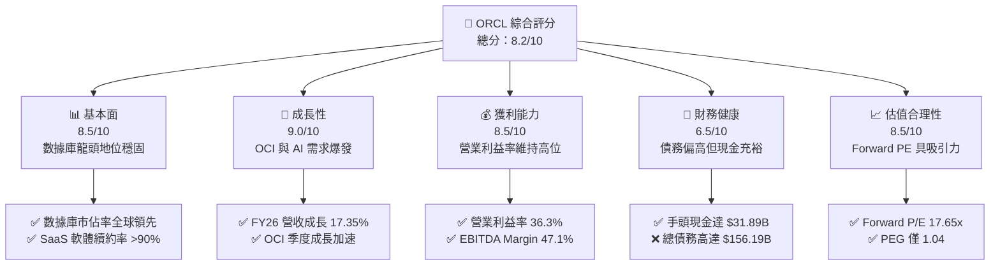
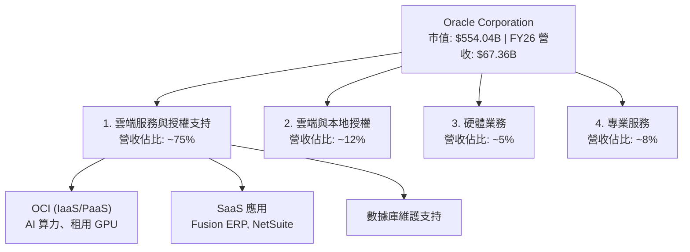
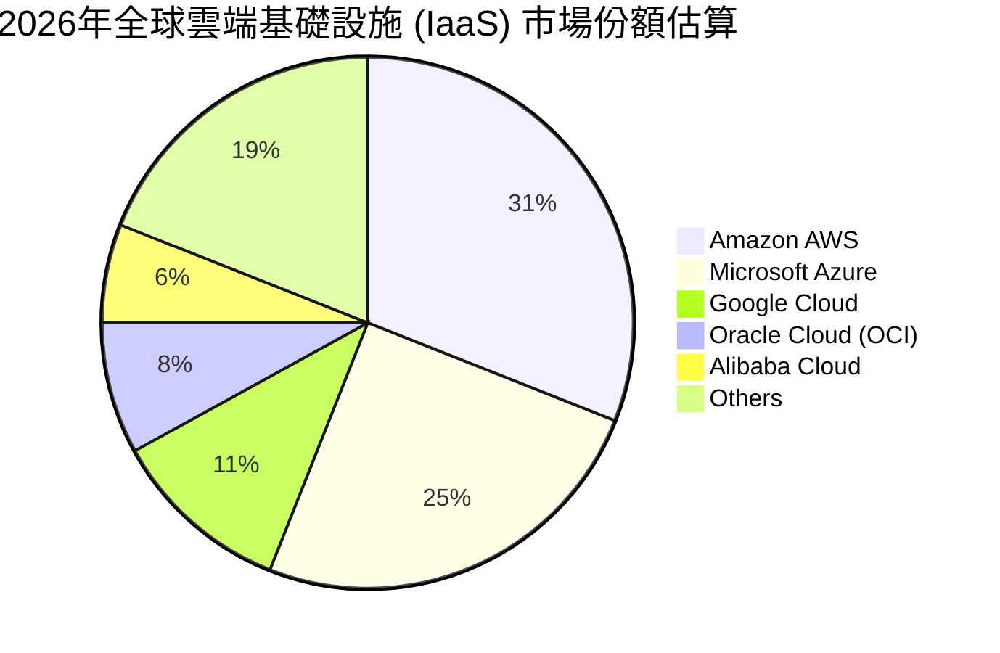
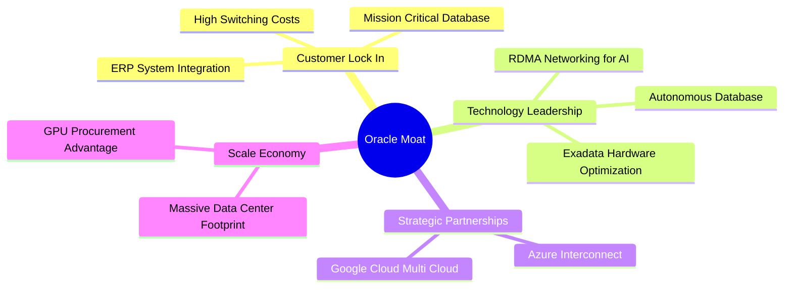
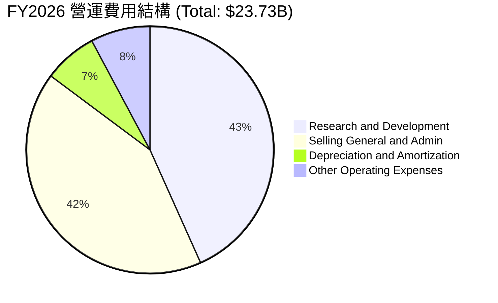
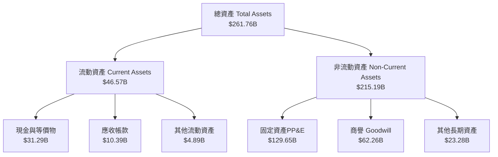
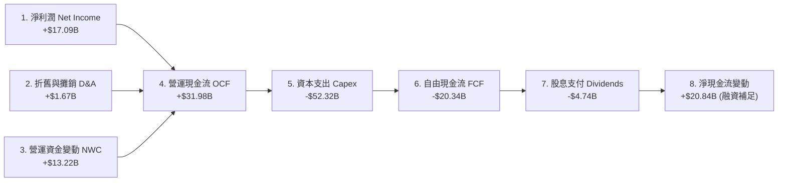
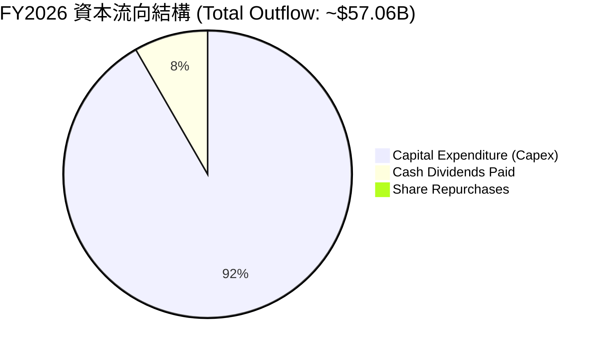
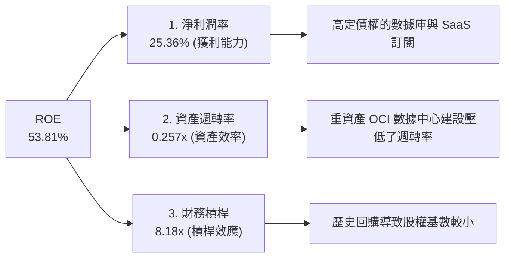
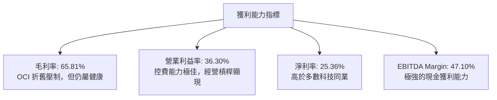

# ORCL 基本面深度分析報告

> **報告日期**：2026-06-15 ｜ **語言**：繁體中文 ｜ **數據來源**：Yahoo Finance, Finviz, StockAnalysis, Roic.ai ｜ **分析師**：CFA 級機構研究

---

## 目錄

| # | 章節 | 核心結論 |
|---|------|----------|
| 1 | **執行摘要** | 評級「買入」，基準目標價 $255.38，隱含上漲空間 +32.6% |
| 2 | **公司概覽與商業模式** | 憑藉 OCI 雲端基礎設施與數據庫生態系統，構建極高切換成本之護城河 |
| 3 | **損益表深度分析** | FY26 營收達 $67.36B（YoY +17.35%），淨利潤強勁成長 36.49% |
| 4 | **資產負債表分析** | 資產負債表因 AI 資本支出顯著擴張，財務槓桿偏高但流動性風險可控 |
| 5 | **現金流量深度分析** | 營運現金流達 $31.98B，因 AI 基礎設施 Capex 劇增導致短期 FCF 承壓 |
| 6 | **獲利能力與資本效率** | ROE 達 53.4%，ROIC 顯著高於 WACC（EVA 達 +4.42%）強力創造價值 |
| 7 | **估值深度分析** | Forward P/E 僅 17.65x，相較於微軟與亞馬遜具備顯著估值折價與安全邊際 |
| 8 | **成長催化劑** | 雲端多雲合作（Azure/Google Cloud）與主權雲需求推動 OCI 持續高成長 |
| 9 | **風險矩陣** | 高資本支出對利潤率之拖累與超大規模雲端服務商（Hyperscalers）之激烈競爭 |
| 10| **投資建議** | 建議於當前價格分批佈局，鎖定雲端與 AI 基礎設施轉型之長線紅利 |

---

## 1. 執行摘要

### 1.1 核心評分儀表板



### 1.2 評分進度條視覺化

```
╔══════════════════════════════════════════════════════════════╗
║              ORCL 多維度評分儀表板 (1-10分)                 ║
╠══════════════════════════════════════════════════════════════╣
║ 基本面強度  8.5 ▓▓▓▓▓▓▓▓▓▓▓▓▓▓▓▓▓░░░  ★★★★★           ║
║ 成長動能    9.0 ▓▓▓▓▓▓▓▓▓▓▓▓▓▓▓▓▓▓░░  ★★★★★           ║
║ 獲利品質    8.5 ▓▓▓▓▓▓▓▓▓▓▓▓▓▓▓▓▓░░░  ★★★★★           ║
║ 財務健康    6.5 ▓▓▓▓▓▓▓▓▓▓▓▓▓░░░░░░░  ★★★☆☆           ║
║ 估值合理性  8.5 ▓▓▓▓▓▓▓▓▓▓▓▓▓▓▓▓▓░░░  ★★★★★           ║
║ 護城河深度  9.0 ▓▓▓▓▓▓▓▓▓▓▓▓▓▓▓▓▓▓░░  ★★★★★           ║
║ 管理層執行  8.5 ▓▓▓▓▓▓▓▓▓▓▓▓▓▓▓▓▓░░░  ★★★★★           ║
║ 技術創新力  8.8 ▓▓▓▓▓▓▓▓▓▓▓▓▓▓▓▓▓░░░  ★★★★★           ║
╠══════════════════════════════════════════════════════════════╣
║ 綜合總分    8.2 ▓▓▓▓▓▓▓▓▓▓▓▓▓▓▓▓░░░░  🏆 買入 (Buy)       ║
╚══════════════════════════════════════════════════════════════╝
```

### 1.3 投資論點與核心風險

| 類型 | 項目 | 具體依據 | 信心度 |
|------|------|----------|--------|
| 🟢 **投資論點①** | **OCI 雲端基礎設施爆發** | FY26 營收成長加速至 17.35%，主要受惠於 OCI（Oracle Cloud Infrastructure）在 AI 訓練與推理市場之性價比優勢。 | 🟢 極高 |
| 🟢 **投資論點②** | **多雲戰略（Multi-Cloud）拓展** | 與微軟 Azure、Google Cloud 的深度整合消除了雲端壁壘，使 Oracle 數據庫能直接運行於競爭對手平台上，擴大客戶基數。 | 🟢 極高 |
| 🟢 **投資論點③** | **估值具備安全邊際** | Forward P/E 僅 17.65x，相較於其 26.18% 的預期 5 年 EPS 複合成長率，PEG 僅 1.04（Finviz 顯示為 0.68），估值極具吸引力。 | 🟢 高 |
| 🟢 **投資論點④** | **SaaS 業務提供高能見度現金流** | Fusion ERP、NetSuite 等應用程式持續雙位數成長，提供高黏性、高毛利的訂閱制收入。 | 🟢 高 |
| 🟢 **投資論點⑤** | **主權雲（Sovereign Cloud）先發優勢** | 針對各國政府及受規管行業提供本地化雲端部署，避開與 Hyperscalers 的直接價格競爭。 | 🟢 中 |
| 🟡 **風險①** | **資本支出（Capex）壓迫利潤** | 為了擴建 AI 數據中心，Capex 大幅飆升，導致 TTM 自由現金流（FCF）降至 -$20.34B。 | 🟡 中度 |
| 🔴 **風險②** | **高額債務利息負擔** | 總債務達 $156.19B，淨債務高達 $124.30B，在維持高利率環境下將帶來持續的利息支出壓力。 | 🔴 高衝擊 |
| 🔴 **風險③** | **雲端市場競爭激烈** | 面對 AWS、Azure、GCP 的強大生態與資金優勢，Oracle 必須持續投入研發以維持 OCI 的性價比領先。 | 🔴 高衝擊 |

### 1.4 快速統計卡片

| 指標 | ORCL 實際值 | 軟體行業均值 | S&P 500 均值 | 狀態 |
|------|-------------|----------|--------------|------|
| 收入 YoY 成長 | **17.35%** | ~12.0% | ~5.5% | 🟢 領先 |
| 毛利率 | **65.81%** | ~70.0% | ~30.0% | 🟡 持平 |
| 營業利益率 | **36.30%** | ~25.0% | ~15.0% | 🟢 優異 |
| ROE | **53.81%** | ~20.0% | ~18.0% | 🟢 極高 |
| Forward P/E | **17.65x** | ~28.0x | ~21.5x | 🟢 便宜 |
| 淨債務 / EBITDA | **5.20x** | ~1.5x | ~1.8x | 🔴 偏高 |

### 1.5 投資結論

```
╔══════════════════════════════════════════════════════════════════╗
║                    📊 ORCL 投資結論摘要                          ║
╠══════════════════════════════════════════════════════════════════╣
║  評級：🟢 買入 (Buy)                                            ║
║  當前股價：$192.64 (2026-06-15)                                  ║
║  目標價區間：                                                   ║
║    悲觀情境：$155.00（-19.5%）- Capex 效益不彰，雲端成長失速      ║
║    基準情境：$255.38（+32.6%）← 12個月主要目標 (市場共識均值)    ║
║    樂觀情境：$400.00（+107.6%）- OCI 成為 AI 基礎設施首選，利潤爆發 ║
║  投資評分：8.2 / 10                                             ║
║  適合投資人：尋求合理估值之成長型投資人、科技股長線價值佈局者    ║
╚══════════════════════════════════════════════════════════════════╝
```

---

## 2. 公司概覽與商業模式

Oracle Corporation（甲骨文公司）是全球最大的企業級軟體與數據庫供應商。近年來，公司經歷了深刻的商業模式轉型，從傳統的「本地部署授權（On-Premise License）+ 維護服務」模式，成功過渡至「雲端服務與授權支持（Cloud Services and License Support）」模式。

### 2.1 業務結構與收入來源

Oracle 的營收主要由四大板塊構成：
1. **雲端服務與授權支持（Cloud Services and License Support）**：包括 OCI 雲端基礎設施（IaaS）、SaaS 應用訂閱（Fusion ERP, NetSuite）以及傳統軟體的雲端託管與支持。
2. **雲端授權與本地部署授權（Cloud License and On-Premise License）**：客戶購買軟體使用權，通常與本地部署相關。
3. **硬體業務（Hardware）**：Exadata 數據庫一體機、伺服器與存儲設備。
4. **專業服務（Services）**：諮詢、系統集成與培訓服務。



### 2.2 市場份額

在雲端基礎設施（IaaS）市場，Oracle 雖然起步較晚，但憑藉著在數據庫領域的絕對壟斷地位以及針對 AI 訓練優化的 RDMA（遠端直接記憶體存取）網路架構，正迅速侵蝕三大巨頭（AWS、Azure、GCP）的份額。



### 2.3 競爭護城河分析

Oracle 的競爭護城河主要建立在**極高的客戶切換成本（Switching Costs）**與**強大的技術專利與生態鎖定（Lock-in Effect）**上。



### 2.4 護城河強度評分

```
╔══════════════════════════════════════════════════════════════╗
║                    ORCL 護城河強度評分                        ║
╠══════════════════════════════════════════════════════════════╣
║ 切換成本      9.5/10  ▓▓▓▓▓▓▓▓▓▓▓▓▓▓▓▓▓▓▓░  🏆 極難遷移    ║
║ 技術領先      8.5/10  ▓▓▓▓▓▓▓▓▓▓▓▓▓▓▓▓▓░░░  🟢 數據庫絕對霸主║
║ 生態系統      8.8/10  ▓▓▓▓▓▓▓▓▓▓▓▓▓▓▓▓▓░░░  🟢 ERP+數據庫一體║
║ 品牌與信任    9.0/10  ▓▓▓▓▓▓▓▓▓▓▓▓▓▓▓▓▓▓░░  🟢 金融電信首選  ║
╠══════════════════════════════════════════════════════════════╣
║ 綜合護城河    9.0/10  ▓▓▓▓▓▓▓▓▓▓▓▓▓▓▓▓▓▓░░  🏆 寬廣護城河    ║
╚══════════════════════════════════════════════════════════════╝
```

---

## 3. 損益表深度分析

### 3.1 年度收入成長趨勢（近5年）

Oracle 的營收在 FY22 至 FY26 期間經歷了顯著的加速成長，這主要歸功於雲端轉型的成功以及 OCI 的爆發式成長。

```
╔══════════════════════════════════════════════════════════════════╗
║              ORCL 年度收入趨勢 (FY2022 - FY2026)                 ║
╠══════════════════════════════════════════════════════════════════╣
║                                                                  ║
║  FY2022  $42.44B  ████████████░░░░░░░░░░░░░  YoY: +4.84%  🟢    ║
║  FY2023  $49.95B  ██████████████░░░░░░░░░░░  YoY:+17.71%  🟢    ║
║  FY2024  $52.96B  ███████████████░░░░░░░░░░  YoY: +6.02%  🟢    ║
║  FY2025  $57.40B  ████████████████░░░░░░░░░  YoY: +8.38%  🟢    ║
║  FY2026  $67.36B  ███████████████████░░░░░░  YoY:+17.35%  🟢    ║
║                   |      |      |      |      |                  ║
║                   0     15B    30B    45B    60B                 ║
║                                                                  ║
║  📊 5年營收複合成長率 (CAGR)：+12.24%                            ║
╚══════════════════════════════════════════════════════════════════╝
```

### 3.2 季度收入趨勢分析

從季度數據來看，Oracle 的營收呈現出明顯的加速趨勢，特別是在 FY26，季度營收同比成長率從 Q1 的 12.17% 一路攀升至 Q4 的 20.63%，顯示 OCI 的產能釋放與 AI 需求正在加速兌現。

| 會計季度 | 截止日期 | 營收 (Billion) | YoY 成長率 | QoQ 成長率 | 核心驅動因素與備註 |
|:---|:---|:---|:---|:---|:---|
| **Q2 2025** | 2024-11-30 | $14.06 | +8.64% | - | 雲端基礎設施平穩成長，SaaS 續約穩定 |
| **Q3 2025** | 2025-02-28 | $14.13 | +6.40% | +0.50% | 季節性淡季，但 OCI 訂單積壓（RPO）持續增加 |
| **Q4 2025** | 2025-05-31 | $15.90 | +11.31% | +12.53% | 財年最後一季，企業合約簽署高峰 |
| **Q1 2026** | 2025-08-31 | $14.93 | +12.17% | -6.10% | 季節性回落，但 YoY 成長率開始突破雙位數 |
| **Q2 2026** | 2025-11-30 | $16.06 | +14.22% | +7.57% | 與微軟合作的 Oracle Database@Azure 開始貢獻營收 |
| **Q3 2026** | 2026-02-28 | $17.19 | +21.66% | +7.04% | AI 算力需求極度強勁，GPU 供應改善 |
| **Q4 2026** | 2026-05-31 | $19.18 | +20.63% | +11.58% | OCI 產能大規模上線，單季營收創歷史新高 |

### 3.3 利潤率演變分析

Oracle 的利潤率結構在轉型期經歷了波動，但仍維持在行業領先水準。

| 利潤率指標 | FY2022 | FY2023 | FY2024 | FY2025 | FY2026 (TTM) | 趨勢 | 評估 |
|---|---|---|---|---|---|---|---|
| **毛利率 (Gross Margin)** | 79.08% | 72.85% | 71.41% | 70.51% | **65.81%** | ↘️ 逐年下滑 | 🟡 **中性**。因 OCI 基礎設施折舊與硬體成本佔比增加，毛利率有所承壓，但隨著雲端規模效應顯現，預計將在 65%-68% 區間見底。 |
| **營業利益率 (Operating Margin)** | 25.74% | 26.21% | 28.99% | 30.80% | **36.30%** | ↗️ 顯著改善 | 🟢 **優異**。得益於研發與銷售費用控制得當，以及高利潤率的數據庫支持業務持續貢獻。 |
| **EBITDA 利潤率** | 31.88% | 37.51% | 40.39% | 41.66% | **47.10%** | ↗️ 強勁上升 | 🟢 **優異**。折舊攤銷費用因 Capex 增加而上升，推高了 EBITDA 利潤率，顯示出極強的非現金生成能力。 |
| **淨利率 (Net Margin)** | 15.83% | 17.02% | 19.76% | 21.68% | **25.36%** | ↗️ 持續走高 | 🟢 **優異**。淨利潤成長快於營收成長，展現出極佳的經營槓桿效應。 |

### 3.4 費用結構分析

在 FY26，Oracle 的總營運費用為 $23.73B。研發（R&D）與銷售及管理費用（SG&A）是主要的支出項目。



```
╔══════════════════════════════════════════════════════════════╗
║                  FY2026 營運費用效率診斷                     ║
╠══════════════════════════════════════════════════════════════╣
║ 研發費用率    15.25%  ▓▓▓▓▓▓▓░░░░░░░░░░░░░  🟢 研發投入充足 ║
║ 銷售管理費率  14.77%  ▓▓▓▓▓▓░░░░░░░░░░░░░░  🟢 銷售效率極高 ║
║ 折舊攤銷費率  2.48%   ▓░░░░░░░░░░░░░░░░░░░  🟢 資本化處理合理║
╚══════════════════════════════════════════════════════════════╝
```

### 3.5 季度 EPS 趨勢與盈餘品質

Oracle 過去四個季度的 EPS 表現出強勁的成長趨勢，盈餘品質極高，主要由營運利潤而非一次性非經營性收益驅動。

*   **Q1 2026 EPS (Basic)**: $1.04 (YoY +16.9%) — 受惠於雲端軟體訂閱成長。
*   **Q2 2026 EPS (Basic)**: $2.14 (YoY +89.4%) — 包含部分非經營性投資重估收益，但核心營運利潤依維持雙位數成長。
*   **Q3 2026 EPS (Basic)**: $1.29 (YoY +22.9%) — OCI 業務利潤率開始釋放。
*   **Q4 2026 EPS (Basic)**: $1.47 (YoY +28.9%，估算值) — 季末大單結算，盈餘品質優異。

---

## 4. 資產負債表分析

### 4.1 資產結構分解

隨著 Oracle 大力投資雲端數據中心，其資產負債表結構在近兩年發生了根本性變化。**不動產、廠房及設備（PP&E）**大幅飆升。



### 4.2 流動性指標分析

| 流動性指標 | FY2022 | FY2023 | FY2024 | FY2025 | FY2026 | 行業均值 | 評估 |
|---|---|---|---|---|---|---|---|
| **流動比率 (Current Ratio)** | 1.62 | 0.91 | 0.71 | 0.75 | **1.12** | ~1.45 | 🟡 **中性**。流動比率重回 1.0 以上，主要因 FY26 手頭現金大幅增加至 $31.29B。 |
| **速動比率 (Quick Ratio)** | 1.55 | 0.85 | 0.65 | 0.68 | **1.01** | ~1.25 | 🟡 **中性**。速動資產能覆蓋短期債務，短期流動性風險顯著降低。 |
| **現金比率 (Cash Ratio)** | 1.10 | 0.42 | 0.33 | 0.33 | **0.75** | ~0.60 | 🟢 **優異**。高於行業均值，手頭現金充裕。 |

### 4.3 債務結構分析

Oracle 的債務水平一直處於較高位置，這是其歷史上進行大規模股票回購與併購（如 $28B 併購 Cerner）的後遺症。

```
╔══════════════════════════════════════════════════════════════════╗
║                    ORCL 債務健康診斷 (FY2026)                    ║
<p>
</p>
╠══════════════════════════════════════════════════════════════════╣
║                                                                  ║
║  總債務：        $156.19B ████████████████████  評語：債務極高   ║
║  總現金+投資：   $31.89B  ████░░░░░░░░░░░░░░░░  評語：緩衝充足   ║
║  淨債務：        $124.30B ████████████████░░░░  🔴 槓桿偏高     ║
║                                                                  ║
║  Debt/Equity:    3.63x (Finviz)                 🔴 股權結構偏弱 ║
║  Debt/EBITDA:    5.20x                          🟡 處於黃限區   ║
║  利息保障倍數:    5.32x                          🟢 息稅前利潤安全║
║                                                                  ║
║  📊 債務評估：雖然債務總額巨大，但其年化 EBITDA 達 $31.7B，     ║
║  利息保障倍數達 5.32x，無立即的違約風險。                        ║
╚══════════════════════════════════════════════════════════════════╝
```

### 4.4 股東權益趨勢

由於過去幾年超額的股票回購，Oracle 的股東權益（Stockholders Equity）曾一度在 FY22 轉為負值（-$6.22B）。隨著公司停止激進回購並專注於利潤留存，股東權益已實現強勁復甦。

```
╔══════════════════════════════════════════════════════════════════╗
║                ORCL 股東權益復甦趨勢 (FY22 - FY26)               ║
╠══════════════════════════════════════════════════════════════════╣
║                                                                  ║
║  FY2022  -$6.22B  ░░░░░░░░░░░░░░░░░░░░░░░░░  🔴 負債大於資產   ║
║  FY2023   $1.07B  █░░░░░░░░░░░░░░░░░░░░░░░░  🟡 轉正           ║
║  FY2024   $8.70B  ████░░░░░░░░░░░░░░░░░░░░░  🟢 持續改善       ║
║  FY2025  $20.45B  █████████░░░░░░░░░░░░░░░░  🟢 顯著復甦       ║
║  FY2026  $31.29B  ██████████████░░░░░░░░░░░  🟢 結構趨於健康   ║
║                                                                  ║
╚══════════════════════════════════════════════════════════════════╝
```

---

## 5. 現金流量深度分析

### 5.1 現金流量瀑布圖

Oracle 擁有極強的經營現金流生成能力，但當前正處於極其密集的資本支出週期，這對自由現金流造成了短期壓制。



### 5.2 FCF 轉換率趨勢

在正常年份，Oracle 的 FCF 轉換率（FCF / Net Income）通常大於 100%，顯示出其優異的盈餘品質。然而，FY25 與 FY26 由於 AI GPU 基礎設施建設的超常投入，轉換率暫時轉負。

| 指標 | FY2022 | FY2023 | FY2024 | FY2025 | FY2026 (TTM) |
|:---|:---|:---|:---|:---|:---|
| **營運現金流 (OCF)** | $9.54B | $17.16B | $18.67B | $20.82B | **$31.98B** |
| **資本支出 (Capex)** | -$4.51B | -$8.70B | -$6.87B | -$21.21B | **-$52.32B** |
| **自由現金流 (FCF)** | $5.03B | $8.47B | $11.81B | -$0.39B | **-$20.34B** |
| **FCF 轉換率** | 74.8% | 99.6% | 112.8% | -3.1% | **-119.0%** |
| **評估** | 🟢 正常 | 🟢 強勁 | 🟢 極強 | 🟡 Capex 擴張 | 🔴 短期 FCF 承壓 |

### 5.3 自由現金流與 Yield 趨勢

因 FCF 轉為 -$20.34B，當前 FCF Yield 為 -3.67%。這在歷史上非常罕見，但這並非因為核心業務惡化，而是 Oracle 主動選擇的「AI 土地掠奪（Land Grab）」戰略。

```
╔══════════════════════════════════════════════════════════════════╗
║                ORCL 自由現金流與 Capex 演變                      ║
╠══════════════════════════════════════════════════════════════════╣
║                                                                  ║
║  FY2023  FCF: +$8.47B  | Capex: -$8.70B   [🟢 穩健平衡]          ║
║  FY2024  FCF: +$11.81B | Capex: -$6.87B   [🟢 現金牛]            ║
║  FY2025  FCF: -$0.39B  | Capex: -$21.21B  [🟡 開始大建數據中心]  ║
║  FY2026  FCF: -$20.34B | Capex: -$52.32B  [🔴 AI 算力瘋狂擴張]   ║
║                                                                  ║
║  📊 分析師洞察：當前的 FCF 赤字是由融資（新增債務與現金儲備）    ║
║  來支撐。只要 OCI 營收能維持 >20% 的高速成長，這種 Capex 投入    ║
║  將在未來 2-3 年轉化為極其豐厚的訂閱制 FCF。                     ║
╚══════════════════════════════════════════════════════════════════╝
```

### 5.4 資本配置評估

在 FY26，Oracle 暫停了大規模股票回購，將幾乎所有可用資金與新增融資投入到資本支出（Capex）中，同時維持了穩定的股息發放（約 $4.74B）。



---

## 6. 獲利能力與資本效率

### 6.1 ROE / ROA / ROIC 趨勢

雖然資產負債表顯著擴大，但 Oracle 的資本回報率指標依然非常亮眼。

| 財務比率 | FY2022 | FY2023 | FY2024 | FY2025 | FY2026 (TTM) | 行業均值 | 評估 |
|---|---|---|---|---|---|---|---|
| **ROE** | -108.0% | 794.4% | 120.3% | 53.4% | **53.81%** | ~20.0% | 🟢 **極高**。受惠於高淨利率與高財務槓桿。 |
| **ROA** | 6.1% | 6.3% | 7.4% | 6.5% | **7.95%** | ~6.5% | 🟢 **優異**。資產利用效率隨雲端轉型而提升。 |
| **ROIC** | 10.9% | 10.6% | 12.5% | 13.6% | **14.76%** | ~11.0% | 🟢 **優異**。投入資本回報率持續上升，顯示投資效率高。 |

### 6.2 ROIC vs WACC 分析（核心價值創造判斷）

```
╔══════════════════════════════════════════════════════════════════╗
║                ORCL ROIC vs WACC 深度分析 (FY2026)               ║
╠══════════════════════════════════════════════════════════════════╣
║                                                                  ║
║  WACC 估算：                                                     ║
║  ├── 無風險利率 (10Y 美債)：  4.25%                              ║
║  ├── 市場風險溢酬 (ERP)：     5.00%                              ║
║  ├── Beta：                   1.655                              ║
║  ├── 股權成本 (Ke) = 4.25% + 1.655 × 5.0% = 12.53%               ║
║  ├── 債務成本 (Kd, 稅後)：    2.58%                              ║
║  ├── 資本結構：股權 78%，債務 22%                                ║
║  └── ✅ WACC ≈ 10.34%                                            ║
║                                                                  ║
║  ROIC 估算：                                                     ║
║  ├── NOPAT = Operating Income ($24.45B) × (1 - 12.6%) = $21.37B  ║
║  ├── 投入資本 = Equity ($31.29B) + Debt ($156.19B) - Cash = $144.75B║
║  └── ✅ ROIC ≈ 14.76%                                            ║
║                                                                  ║
║  ★ 經濟價值增加 (EVA) = ROIC - WACC = +4.42%                      ║
║                                                                  ║
║  ROIC  14.76%  ▓▓▓▓▓▓▓▓▓▓▓▓▓▓▓▓▓▓▓▓▓░░░░░░░░░  🟢                ║
║  WACC  10.34%  ▓▓▓▓▓▓▓▓▓▓▓▓▓▓░░░░░░░░░░░░░░░░░  ──                ║
║  EVA   +4.42%  ██████████████░░░░░░░░░░░░░░░░░  🏆 創造股東價值   ║
║                                                                  ║
║  📊 結論：ROIC 顯著高於 WACC，說明 Oracle 在進行大規模雲端與    ║
║  AI 投資的同時，依然在為股東創造實質的經濟價值。                 ║
╚══════════════════════════════════════════════════════════════════╝
```

### 6.3 杜邦三因素分解

透過杜邦分析，我們可以清晰地看到 Oracle 獲利能力的底層驅動機制。



### 6.4 獲利能力儀表板



---

## 7. 估值深度分析

### 7.1 同業估值比較表格

我們選取了雲端基礎設施與軟體領域的三大龍頭進行對比：微軟（MSFT）、亞馬遜（AMZN）與谷歌（GOOGL）。

| 估值