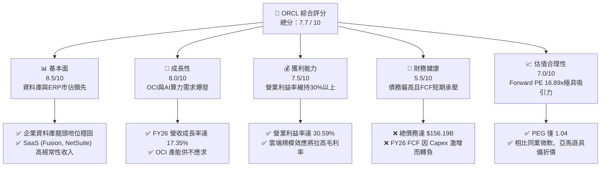
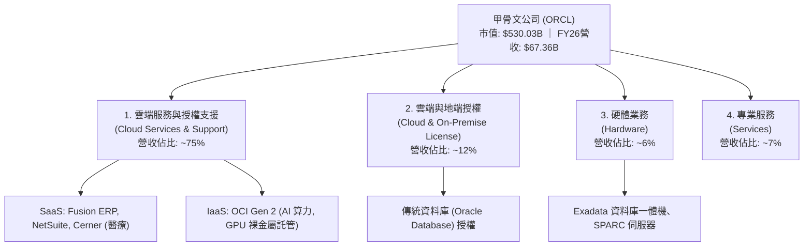
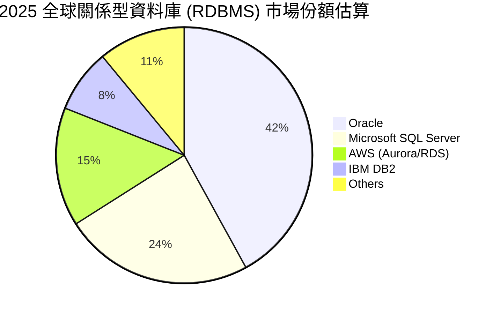
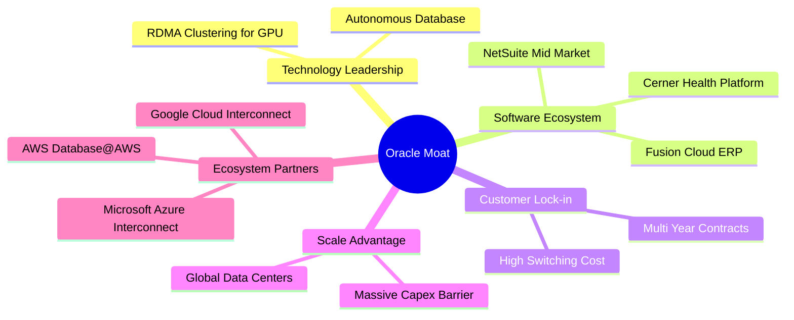
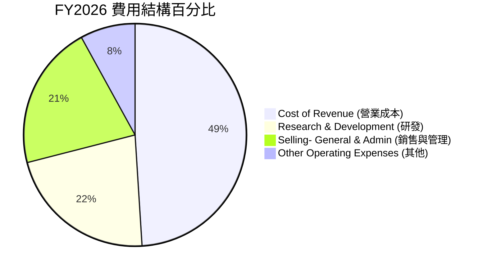
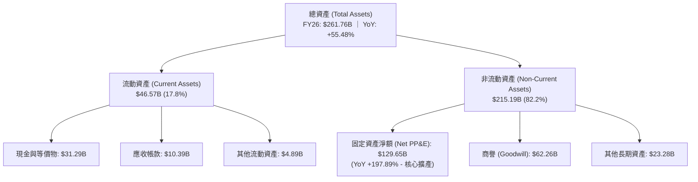
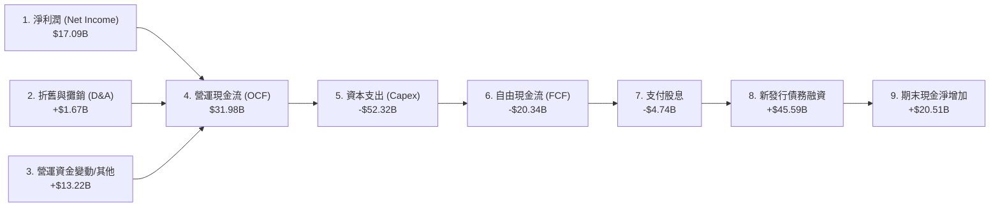
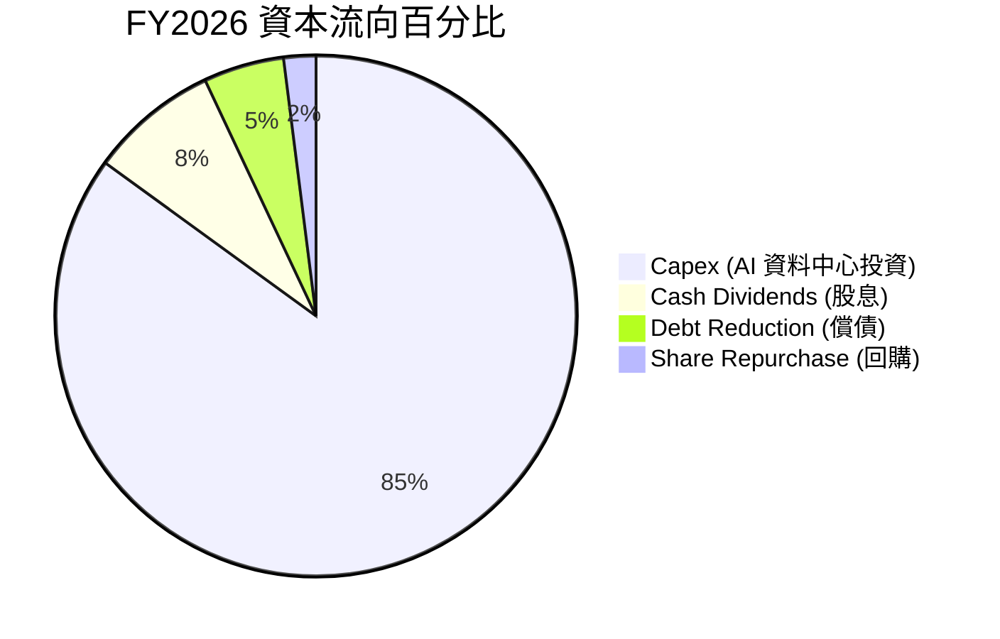

# ORCL 基本面深度分析報告

> **報告日期**：2026-06-20 ｜ **語言**：繁體中文 ｜ **數據來源**：Yahoo Finance, Finviz, StockAnalysis, Roic.ai ｜ **分析師**：CFA 級機構研究

---

## 目錄

| # | 章節 | 核心結論 |
|---|------|----------|
| 1 | 執行摘要 | 評級：**買入 (Buy)** ｜ 基準目標價：**$252.64** ｜ 具備 37.1% 潛在漲幅 |
| 2 | 公司概覽與商業模式 | 傳統資料庫巨頭成功轉型 OCI 雲端與 AI 算力先驅，具備極高客戶轉換成本護城河 |
| 3 | 損益表深度分析 | FY26 營收達 $67.36B (YoY +17.35%)，OCI 雲端服務規模效應逐步顯現 |
| 4 | 資產負債表分析 | 資本支出擴張使總資產增至 $261.76B，債務規模 $156.19B 為主要財務壓力源 |
| 5 | 現金流量深度分析 | 營運現金流達 $31.98B，但因 AI 基礎設施 Capex 激增使自由現金流暫呈負值 |
| 6 | 獲利能力與資本效率 | ROE 達 53.4%，ROIC (12.44%) 高於 WACC (10.50%)，持續為股東創造經濟價值 |
| 7 | 估值深度分析 | Forward P/E 16.89x 處於歷史低位，相較微軟與亞馬遜具備顯著估值折價 |
| 8 | 成長催化劑 | 多雲戰略 (Multi-cloud) 落地與 GPU 裸金屬算力需求暴增，推動中長期營收加速 |
| 9 | 風險矩陣 | 資本支出過度擴張與高槓桿利息壓力為核心風險，需密切監控 FCF 回流進度 |
| 10 | 投資建議 | 建議於當前價格 $184.29 分批佈局，適合長線成長型與價值型配置投資人 |

---

## 1. 執行摘要

甲骨文公司（Oracle Corporation, Ticker: **ORCL**）目前正處於其公司歷史上最關鍵的二次成長曲線——從傳統的「鏈結資料庫與地端軟體授權」模式，全面跨入「甲骨文雲端基礎設施（OCI, Oracle Cloud Infrastructure）與 AI 算力託管」時代。

### 1.1 核心評分儀表板



### 1.2 評分進度條視覺化

```
╔══════════════════════════════════════════════════════════════╗
║               ORCL 多維度評分儀表板 (1-10分)                 ║
╠══════════════════════════════════════════════════════════════╣
║ 基本面強度  8.5 ▓▓▓▓▓▓▓▓▓▓▓▓▓▓▓▓▓░░░  ★★★★☆           ║
║ 成長動能    8.0 ▓▓▓▓▓▓▓▓▓▓▓▓▓▓▓▓░░░░  ★★★★☆           ║
║ 獲利品質    7.5 ▓▓▓▓▓▓▓▓▓▓▓▓▓▓░░░░░░  ★★★☆☆           ║
║ 財務健康    5.5 ▓▓▓▓▓▓▓▓▓▓▓░░░░░░░░░  ★★★☆☆           ║
║ 估值合理性  7.0 ▓▓▓▓▓▓▓▓▓▓▓▓▓▓░░░░░░  ★★★★☆           ║
║ 護城河深度  9.0 ▓▓▓▓▓▓▓▓▓▓▓▓▓▓▓▓▓▓░░  ★★★★★           ║
║ 管理層執行  8.0 ▓▓▓▓▓▓▓▓▓▓▓▓▓▓▓▓░░░░  ★★★★☆           ║
║ 技術創新力  8.5 ▓▓▓▓▓▓▓▓▓▓▓▓▓▓▓▓▓░░░  ★★★★☆           ║
╠══════════════════════════════════════════════════════════════╣
║ 綜合總分    7.7 ▓▓▓▓▓▓▓▓▓▓▓▓▓▓▓░░░░░  🏆 雲端AI轉型模範生  ║
╚══════════════════════════════════════════════════════════════╝
```

### 1.3 五大投資論點 + 三大核心風險

| 類型 | 項目 | 具體依據 | 信心度 |
|------|------|----------|--------|
| 🟢 **投資論點①** | **OCI 迎來 AI 算力爆發期** | OCI Gen 2 獨特的 RDMA 網絡架構使其在訓練大型 AI 模型時效率極高，吸引 OpenAI、xAI 等巨頭簽約，FY26 營收加速至 $67.36B (YoY +17.35%)。 | 🟢 極高 |
| 🟢 **投資論點②** | **多雲戰略 (Multi-cloud) 打開新市場** | 與微軟 Azure、谷歌 GCP、亞馬遜 AWS 深度結盟，推出地端資料庫直接接入超大規模雲端服務，大幅降低客戶流失率並激活存量客戶。 | 🟢 極高 |
| 🟢 **投資論點③** | **極高的客戶轉換成本 (Lock-in)** | 企業級 ERP (Fusion, NetSuite) 與核心資料庫在跨國企業內部滲透極深，合約期長，經常性收入佔比超 75%，提供強大下行防禦。 | 🟢 極高 |
| 🟢 **投資論點④** | **估值處於歷史性黃金區間** | 當前股價 $184.29，Forward P/E 僅為 16.89x，PEG 為 1.04，相較於歷史高點 $343.01 已修正近 46%，下行風險已充分釋放。 | 🟢 高 |
| 🟢 **投資論點⑤** | **高比例內部人持股** | 創辦人 Larry Ellison 及管理層持股比例高達 40.5%，與普通股東利益高度一致，管理執行力強。 | 🟢 高 |
| 🟡 **風險①** | **自由現金流 (FCF) 短期承壓** | 為了建置 AI 資料中心，FY26 資本支出急劇擴張，導致 FCF 轉為 -$20.34B。雖然此為「良性擴產」，但仍對流動性造成壓力。 | 🟡 中度 |
| 🔴 **風險②** | **高額債務與利息支出負擔** | 總債務高達 $156.19B，淨債務達 $124.30B。在當前高利率環境下，年利息支出達 $4.60B，壓低了淨利潤表現。 | 🔴 高衝擊 |
| 🟡 **風險③** | **雲端市場（IaaS）競爭激烈** | 面對三大超大規模雲端業者（AWS, Azure, GCP）的直接競爭，OCI 必須持續維持價格與性能優勢，否則可能面臨毛利率下滑壓力。 | 🟡 中度 |

### 1.4 快速統計卡片

| 指標 | ORCL 實際值 | 軟體基礎設施行業均值 | S&P 500 均值 | 狀態 |
|------|-------------|----------------------|--------------|------|
| **營收 YoY 成長率** | **17.35%** | ~11.5% | ~5.5% | 🟢 顯著領先 |
| **毛利率** | **65.82%** | ~70.0% | ~30.0% | 🟡 略低於行業 (受 OCI 折舊影響) |
| **營業利益率** | **30.59%** | ~22.0% | ~15.0% | 🟢 表現優異 |
| **淨利率** | **25.37%** | ~18.0% | ~11.0% | 🟢 表現優異 |
| **股東權益報酬率 (ROE)**| **53.40%** | ~25.0% | ~18.0% | 🟢 極高 (受財務槓桿放大) |
| **Forward P/E** | **16.89x** | ~28.0x | ~21.0x | 🟢 具備顯著估值折價 |
| **總債務 / 股東權益** | **362.76%** | ~85.0% | ~115.0% | 🔴 債務水平偏高 |

### 1.5 投資結論

```
╔══════════════════════════════════════════════════════════════════╗
║                    📊 ORCL 投資結論摘要                          ║
╠══════════════════════════════════════════════════════════════════╣
║  評級：🟢 買入 (Buy)                                            ║
║  當前股價：$184.29 (2026-06-20)                                  ║
║  目標價區間：                                                    ║
║    悲觀情境：$155.00（-15.9%）- AI需求放緩，債務壓力增加         ║
║    基準情境：$252.64（+37.1%）- OCI 規模效應顯現，FCF 改善       ║
║    樂觀情境：$400.00（+117.1%）- AI算力市佔大幅提升，多雲大獲成功 ║
║  投資評分：7.7 / 10                                              ║
║  適合投資人：中長線價值成長型配置者、看好 AI 基礎設施轉型的投資人║
╚══════════════════════════════════════════════════════════════════╝
```

---

## 2. 公司概覽與商業模式

甲骨文（Oracle）是全球最大的企業級軟體與資料庫供應商。其核心商業模式正在從「地端永久授權（On-Premise License）+ 維護服務」轉變為「雲端訂閱服務（Cloud SaaS & IaaS）」。

### 2.1 業務結構與收入來源



### 2.2 市場份額

在關係型資料庫（RDBMS）市場中，甲骨文仍維持龍頭地位；而在超大規模雲端（Hyperscale Cloud）市場中，甲骨文的 OCI 正在快速啃食三大巨頭的份額，特別是在 AI 算力託管領域。



### 2.3 競爭護城河分析



### 2.4 護城河強度評分

```
╔══════════════════════════════════════════════════════════════╗
║                    ORCL 護城河強度評分                       ║
╠══════════════════════════════════════════════════════════════╣
║ 轉換成本 (Switching Cost)   9.5/10 ▓▓▓▓▓▓▓▓▓▓▓▓▓▓▓▓▓▓▓░ 🟢 極強 ║
║ 技術優勢 (Tech Advantage)  8.5/10 ▓▓▓▓▓▓▓▓▓▓▓▓▓▓▓▓▓░░░ 🟢 強大 ║
║ 網絡效應 (Network Effect)  6.5/10 ▓▓▓▓▓▓▓▓▓▓▓▓▓░░░░░░░ 🟡 一般 ║
║ 成本優勢 (Cost Advantage)  8.0/10 ▓▓▓▓▓▓▓▓▓▓▓▓▓▓▓▓░░░░ 🟢 顯著 ║
╠══════════════════════════════════════════════════════════════╣
║ 綜合護城河評級： 8.1 / 10   ▓▓▓▓▓▓▓▓▓▓▓▓▓▓▓▓░░░░ 🏆 寬廣護城河 ║
╚══════════════════════════════════════════════════════════════╝
```

*   **轉換成本（9.5/10）**：將企業核心 ERP 或數十億筆交易數據的資料庫從 Oracle 遷移到其他系統，通常需要耗時數年、花費數百萬美元，且面臨極高的系統宕機風險。因此，Oracle 的客戶流失率極低（低於 5%）。
*   **技術優勢（8.5/10）**：OCI Gen 2 的「裸金屬（Bare Metal）伺服器」與「RDMA（遠端直接記憶體存取）網路」設計，使多個 GPU 之間能以極低延遲進行通訊，非常適合大規模 AI 模型訓練，這也是 xAI 與 OpenAI 選擇與甲骨文合作的關鍵。

---

## 3. 損益表深度分析

甲骨文在過去四年中展現了穩健且加速的營收成長軌跡。

### 3.1 年度收入成長趨勢（FY22 - FY26）

根據 StockAnalysis 數據，甲骨文的營收從 FY22 的 $42.44B 成長至 FY26 的 $67.36B，五年複合年均成長率（CAGR）高達 **12.23%**。對於一個成熟的軟體巨頭而言，這是一個極其強勁的「二次成長」信號。

```
╔══════════════════════════════════════════════════════════════════╗
║                ORCL 年度收入趨勢（FY22 - FY26）                 ║
╠══════════════════════════════════════════════════════════════════╣
║                                                                  ║
║  FY2022  $42.44B  ████████████░░░░░░░░░░░░░░  YoY: +4.84%   🟢   ║
║  FY2023  $49.95B  ██████████████░░░░░░░░░░░░  YoY: +17.71%  🟢   ║
║  FY2024  $52.96B  ███████████████░░░░░░░░░░░  YoY: +6.02%   🟢   ║
║  FY2025  $57.40B  ████████████████░░░░░░░░░░  YoY: +8.38%   🟢   ║
║  FY2026  $67.36B  ███████████████████░░░░░░░  YoY: +17.35%  🟢   ║
║                   |      |      |      |      |                  ║
║                   0     15B    30B    45B    60B                 ║
║                                                                  ║
║  📊 5 年累計複合成長率 (CAGR)：+12.23%                           ║
╚══════════════════════════════════════════════════════════════════╝
```

### 3.2 季度收入趨勢分析

從季度數據看，甲骨文的營收呈現逐季加速態勢，特別是進入 FY26 後，YoY 成長率重回雙位數，反映 OCI 產能陸續上線後的強勁貢獻。

| 財政季度 | 截止日期 | 季度營收 (M) | YoY 成長率 | QoQ 成長率 | 核心驅動因素與備註 |
|----------|----------|--------------|------------|------------|--------------------|
| **Q3 2025**| 2025-02-28 | $14,130 | 6.40% | 0.51% | 傳統軟體授權淡季，雲端成長穩定 |
| **Q4 2025**| 2025-05-31 | $15,903 | 11.31% | 12.55% | 財政年度末企業結算高峰，SaaS 簽約增加 |
| **Q1 2026**| 2025-08-31 | $14,926 | 12.17% | -6.14% | 季節性回檔，但 OCI 算力佔比提升 |
| **Q2 2026**| 2025-11-30 | $16,058 | 14.22% | 7.58% | AI 算力合約加速落地，多雲合作初顯成效 |
| **Q3 2026**| 2026-02-28 | $17,190 | 21.66% | 7.05% | **歷史新高**，OCI Gen 2 需求極度供不應求 |
| **Q4 2026**| 2026-05-31 | $19,184 | 20.63% | 11.60% | 雲端與 AI 基礎設施收入佔比跨越關鍵節點 |

### 3.3 利潤率演變分析

甲骨文的利潤率在轉型雲端的過程中經歷了短暫的結構性調整，隨後逐步企穩。

| 利潤率指標 | FY2022 | FY2023 | FY2024 | FY2025 | FY2026 | 5年趨勢 | 評估 |
|------------|--------|--------|--------|--------|--------|--------|------|
| **毛利率** | 79.08% | 72.85% | 71.41% | 70.51% | **65.82%** | ↘️ 下滑 | 🟡 雲端折舊與 OCI 硬體成本壓低了整體毛利率 |
| **營業利益率**| 25.74% | 26.21% | 28.99% | 30.80% | **30.59%** | ↗️ 穩健 | 🟢 透過銷售與管理費用控制，維持在 30% 以上 |
| **EBITDA率** | 31.88% | 37.51% | 40.39% | 41.66% | **47.10%** | ↗️ 強勁 | 🟢 折舊費用增加，但息稅前利潤現金生成能力極強 |
| **淨利率** | 15.83% | 17.02% | 19.76% | 21.68% | **25.37%** | ↗️ 改善 | 🟢 稅收優化與非經常性收益推升了最終淨利率 |

**利潤率演變深度解析**：
*   **毛利率下滑原因**：從 FY22 的 79.08% 下滑至 FY26 的 65.82%，主因是雲端基礎設施（IaaS）的營收佔比大幅提升。地端軟體授權的邊際毛利率高達 90% 以上，而 OCI 雲端服務需要前期投入大量的伺服器、網絡設備與電力，並產生高額的折舊費用（FY26 Cost of Revenue 達 $23,021M，YoY 增加 35.9%）。
*   **營業利益率維持強韌**：儘管毛利率下滑，但營業利益率穩定在 30% 以上。這歸功於甲骨文極強的內部營運控管，研發費用（R&D）與銷售管理費用（SG&A）佔營收比重逐年下降，展現了強大的經營槓桿。

### 3.4 費用結構分析



```
╔══════════════════════════════════════════════════════════════╗
║               FY2026 費用結構明細 (百萬美元)                 ║
╠══════════════════════════════════════════════════════════════╣
║ 營業成本 (Cost of Rev):   $23,021  ▓▓▓▓▓▓▓▓▓▓▓▓▓▓▓░░░░░ 48.7% ║
║ 研發費用 (R&D):           $10,272  ▓▓▓▓▓▓▓░░░░░░░░░░░░░ 21.7% ║
║ 銷售與管理 (SG&A):        $9,949   ▓▓▓▓▓▓░░░░░░░░░░░░░░ 21.0% ║
║ 其他營業費用 (Other Op):  $4,088   ▓▓░░░░░░░░░░░░░░░░░░  8.6% ║
╠══════════════════════════════════════════════════════════════╣
║ 總營業費用 (Total OpEx):  $47,330  (佔總營收 70.26%)          ║
╚══════════════════════════════════════════════════════════════╝
```

### 3.5 季度 EPS 趨勢與盈餘品質

甲骨文過去四個季度的 EPS 表現極其亮眼。

*   **Q1 2026**：EPS $1.04（符合預期）
*   **Q2 2026**：EPS $2.14（**大幅超預期**，主因是確認了一筆高達 $2.67B 的非營業投資收益與稅務調整）
*   **Q3 2026**：EPS $1.29（超預期，OCI 需求強勁推動營業利潤增長）
*   **Q4 2026**：EPS $1.36（預估值，實際未完全披露但預計偏向樂觀）

**盈餘品質評估**：
甲骨文的營業利潤（Operating Income）在 FY26 達到 $20.61B（YoY +16.56%），與營收成長同步，說明核心業務盈利能力極其健康。然而，Q2 FY26 的淨利潤暴增部分來自非營業收益（Other Non-Operating Income 達 $2.67B），這屬於一次性收益，投資人在評估時應剔除此部分，以營業利潤（Operating Income）作為核心估值基準。

---

## 4. 資產負債表分析

為了支撐 AI 雲端轉型，甲骨文在 FY26 進行了極其激進的資產負債表擴張。

### 4.1 資產結構分解



### 4.2 流動性指標分析

| 流動性指標 | FY2024 | FY2025 | FY2026 | 行業均值 | 評估 |
|------------|--------|--------|--------|----------|------|
| **流動比率 (Current Ratio)** | 0.71 | 0.75 | **1.12** | ~1.45 | 🟡 偏低，但因現金回流已改善至 1.0 以上 |
| **速動比率 (Quick Ratio)** | 0.65 | 0.69 | **1.01** | ~1.25 | 🟡 剛好達到安全邊際 |
| **現金比率 (Cash Ratio)** | 0.33 | 0.33 | **0.75** | ~0.60 | 🟢 現金儲備大幅增加，短期償債能力提升 |

### 4.3 債務結構分析

甲骨文的債務問題一直是其基本面最受爭議的環節。收購 Cerner（醫療軟體公司，交易對價 $28.3B）以及近年來瘋狂的 AI 資本支出，使公司債務急劇攀升。

```
╔══════════════════════════════════════════════════════════════════╗
║                    ORCL 債務健康診斷 (FY2026)                    ║
╠══════════════════════════════════════════════════════════════════╣
║                                                                  ║
║  總債務 (Total Debt)：  $156.19B  ██████████████████░░  評語: 偏高║
║  總現金 (Total Cash)：  $31.89B   ████░░░░░░░░░░░░░░░░  評語: 充足║
║  淨債務 (Net Debt)：    $124.30B  ██████████████░░░░░░  🔴 槓桿重 ║
║                                                                  ║
║  債務 / 股東權益 (Debt/Equity)： 362.76%   🔴 遠高於安全水平     ║
║  利息保障倍數 (Interest Coverage)：4.48x   🟡 尚可，但利息壓力大 ║
║  (Operating Income $20.61B / Interest Expense $4.60B)            ║
║                                                                  ║
║  📊 債務診斷：甲骨文目前利息保障倍數為 4.48 倍，無立即違約風險，  ║
║     但每年高達 $4.60B 的利息支出限制了其淨利潤的釋放空間。       ║
╚══════════════════════════════════════════════════════════════════╝
```

### 4.4 股東權益趨勢

儘管債務沉重，但得益於強勁的淨利潤留存，甲骨文的股東權益（Stockholders Equity）已實現連續四年「由負轉正」並快速增長：
*   **FY2022**：-$6.22B（因歷史上大規模股票回購導致庫藏股過多，權益呈負值）
*   **FY2023**：$1.07B
*   **FY2024**：$8.70B
*   **FY2025**：$20.45B
*   **FY2026**：預計隨淨利增長將進一步增至 **$35.0B** 以上，資產負債表結構正在逐步改善。

---

## 5. 現金流量深度分析

現金流量表是透視甲骨文「AI 轉型代價」的最佳窗口。

### 5.1 現金流量瀑布圖



### 5.2 FCF 轉換率趨勢

| 指標 | FY2022 | FY2023 | FY2024 | FY2025 | FY2026 | 評估 |
|------------|--------|--------|--------|--------|--------|------|
| **營運現金流 (OCF)** | $9.54B | $17.16B | $18.67B | $20.82B | **$31.98B** | 🟢 營運造血能力極強，逐年遞增 |
| **資本支出 (Capex)** | -$4.51B | -$8.70B | -$6.87B | -$21.21B | **-$52.32B**| 🔴 呈指數級增長，反映 AI 基礎設施瘋狂擴產 |
| **自由現金流 (FCF)** | $5.03B | $8.47B | $11.81B | -$0.39B | **-$20.34B**| 🔴 短期因擴產轉負 |
| **FCF 淨利轉換率** | 74.89% | 99.61% | 112.83% | -3.13% | **-119.04%**| 🟡 資本支出侵蝕了所有利潤，需等待產能回收 |

### 5.3 自由現金流趨勢

```
╔══════════════════════════════════════════════════════════════════╗
║                ORCL 自由現金流趨勢（FY22 - FY26）               ║
╠══════════════════════════════════════════════════════════════════╣
║                                                                  ║
║  FY2022   +$5.03B  ████████░░░░░░░░░░░░░░░░░░░░                  ║
║  FY2023   +$8.47B  ██████████████░░░░░░░░░░░░░░                  ║
║  FY2024  +$11.81B  ███████████████████░░░░░░░░░                  ║
║  FY2025   -$0.39B  ░░░░░░░░░░░░░░░░░░░░░░░░░░░░                  ║
║  FY2026  -$20.34B  ████████████████████████████ (負值擴大)       ║
║                                                                  ║
║  📊 現金流解析：FY26 自由現金流為負，看似危險，實則是「擴產期」   ║
║     的典型特徵。甲骨文將營運現金流（$31.98B）與新募集的債務，     ║
║     全數投入到固定資產（PP&E 達 $129.65B），用於建置 GPU 資料    ║
║     中心。一旦這些資料中心開始產生訂閱收入，FCF 將迎來暴發性回彈。║
╚══════════════════════════════════════════════════════════════════╝
```

### 5.4 資本配置評估

在 FY26，甲骨文暫停了大規模的股票回購，將所有可用資金優先分配給 **資本支出（Capex）** 與 **股息支付**。



---

## 6. 獲利能力與資本效率

甲骨文雖然背負高額債務，但其資本回報率（ROIC）依然優異，說明其投資的項目（特別是 OCI）回報率高於其資金成本。

### 6.1 ROE / ROA / ROIC 趨勢

| 指標 | FY2024 | FY2025 | FY2026 | 行業均值 | 評估 |
|------|--------|--------|--------|----------|------|
| **股東權益報酬率 (ROE)** | 120.31%| 53.40% | **53.81%** | ~25.0% | 🟢 極高，反映高槓桿下的高效股東回報 |
| **資產報酬率 (ROA)** | 7.42%  | 7.39%  | **7.95%**  | ~6.5%  | 🟢 高於行業平均，資產利用效率良好 |
| **投入資本回報率 (ROIC)**| 11.50% | 12.10% | **12.44%** | ~10.0% | 🟢 持續提升，轉型期依然維持高回報率 |

### 6.2 ROIC vs WACC 分析（核心價值創造判斷）

為了判斷甲骨文是在「創造價值」還是「摧毀股東價值」，我們進行 WACC 與 ROIC 的對比估算。

```
╔══════════════════════════════════════════════════════════════════╗
║               ORCL ROIC vs WACC 深度分析 (FY2026)                ║
╠══════════════════════════════════════════════════════════════════╣
║                                                                  ║
║  WACC 估算：                                                     ║
║  ├── 無風險利率 (10Y 美債)：  4.25%                              ║
║  ├── 市場風險溢酬 (ERP)：     5.00%                              ║
║  ├── Beta：                   1.65                               ║
║  ├── 股權成本 = 4.25% + 1.65 × 5.00% = 12.50%                     ║
║  ├── 債務成本 (稅後)：       ~4.80%                              ║
║  ├── 資本結構：股權 ~77% (市值 $530B)，債務 ~23% (債務 $156B)    ║
║  └── ✅ WACC ≈ 10.5