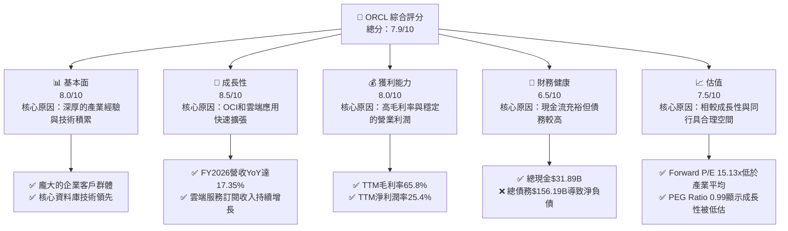
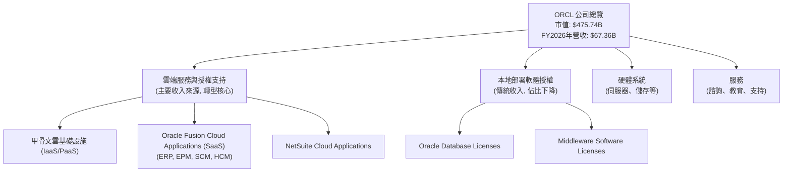
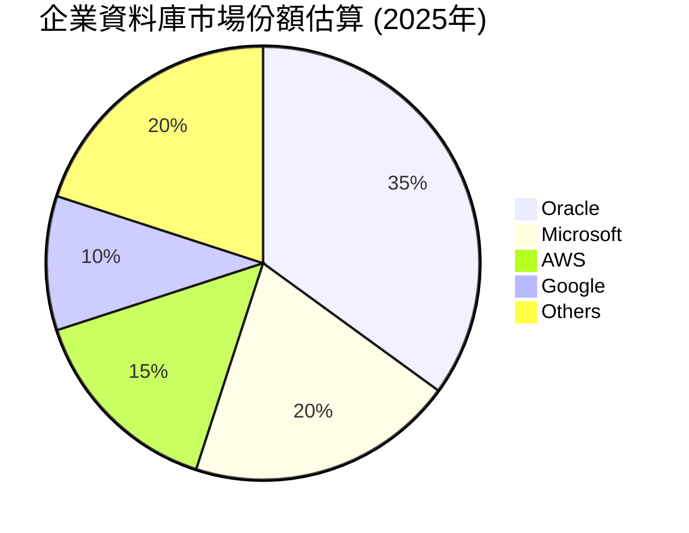
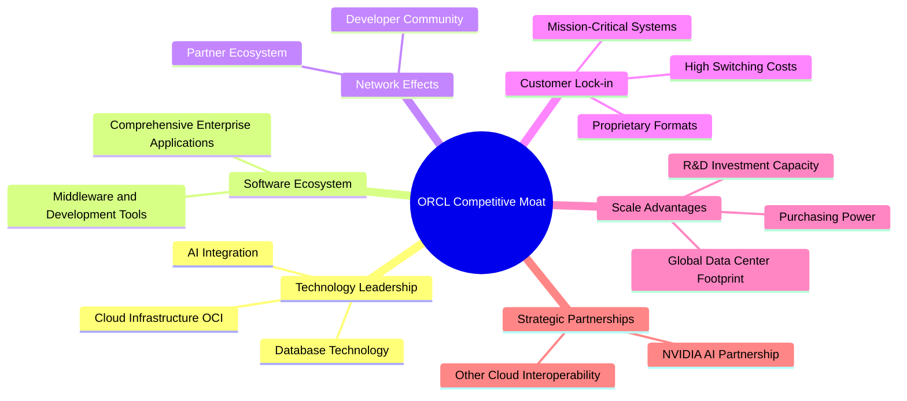
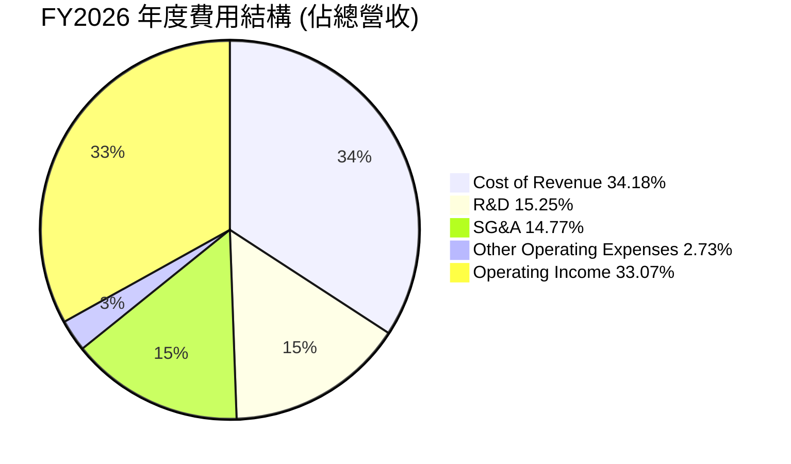
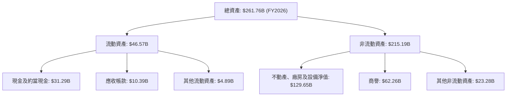

# ORCL 基本面深度分析報告
> **報告日期**：2026-06-24 ｜ **語言**：繁體中文 ｜ **數據來源**：Yahoo Finance, Finviz, StockAnalysis, Roic.ai ｜ **分析師**：CFA 級機構研究

---

## 目錄

| # | 章節 | 核心結論 |
|---|------|----------|
| 1 | 執行摘要 | 評級：買入；目標價區間：$205 - $285 |
| 2 | 公司概覽與商業模式 | 雲端轉型驅動成長，強大客戶鎖定效應 |
| 3 | 損益表深度分析 | 營收穩健增長，利潤率有壓力但仍高 |
| 4 | 資產負債表分析 | 現金充裕，但債務負擔較重，股東權益大幅增長 |
| 5 | 現金流量深度分析 | 營業現金流強勁，但資本支出巨大導致自由現金流為負 |
| 6 | 獲利能力與資本效率 | ROE/ROA表現亮眼，ROIC顯著高於WACC，創造股東價值 |
| 7 | 估值深度分析 | 相較同業估值合理偏低，DCF顯示上行空間 |
| 8 | 成長催化劑 | 甲骨文雲基礎設施 (OCI) 擴張、AI合作、Fusion應用普及 |
| 9 | 風險矩陣 | 雲端市場競爭激烈、大規模資本支出、利率上升風險 |
| 10 | 投資建議 | 具備長期成長潛力，建議「買入」 |

---

## 1. 執行摘要

Oracle Corporation (ORCL) 正處於其雲端轉型的關鍵階段，特別是其甲骨文雲基礎設施 (OCI) 和 Fusion 應用程式的快速發展。儘管面臨激烈的市場競爭和高額資本支出，公司展現出強勁的營收成長和穩健的獲利能力。

### 1.1 核心評分儀表板



### 1.2 評分進度條視覺化

```
╔══════════════════════════════════════════════════════════════╗
║              ORCL 多維度評分儀表板 (1-10分)                  ║
╠══════════════════════════════════════════════════════════════╣
║ 基本面強度  8.0 ▓▓▓▓▓▓▓▓▓▓▓▓▓▓▓▓░░░░  ★★★★☆           ║
║ 成長動能    8.5 ▓▓▓▓▓▓▓▓▓▓▓▓▓▓▓▓▓░░░  ★★★★☆           ║
║ 獲利品質    8.0 ▓▓▓▓▓▓▓▓▓▓▓▓▓▓▓▓░░░░  ★★★★☆           ║
║ 財務健康    6.5 ▓▓▓▓▓▓▓▓▓▓▓▓▓░░░░░░░  ★★★☆☆           ║
║ 估值合理性  7.5 ▓▓▓▓▓▓▓▓▓▓▓▓▓▓▓░░░░░  ★★★★☆           ║
║ 護城河深度  8.5 ▓▓▓▓▓▓▓▓▓▓▓▓▓▓▓▓▓░░░  ★★★★☆           ║
║ 管理層執行  8.0 ▓▓▓▓▓▓▓▓▓▓▓▓▓▓▓▓░░░░  ★★★★☆           ║
║ 技術創新力  8.5 ▓▓▓▓▓▓▓▓▓▓▓▓▓▓▓▓▓░░░  ★★★★☆           ║
╠══════════════════════════════════════════════════════════════╣
║ 綜合總分    7.9 ▓▓▓▓▓▓▓▓▓▓▓▓▓▓▓▓░░░░  🏆 具備長期投資價值      ║
╚══════════════════════════════════════════════════════════════╝
```

### 1.3 五大投資論點 + 三大核心風險

| 類型 | 項目 | 具體依據 | 信心度 |
|------|------|----------|--------|
| 🟢 **投資論點①** | **OCI 高速成長與市場份額擴張** | FY2026營收YoY達17.35%，主要受雲端服務推動。OCI在AI算力需求爆發下具備獨特競爭優勢，吸引大量新客戶和工作負載。 | 🟢 極高 |
| 🟢 **投資論點②** | **企業應用軟體市場領導地位** | Oracle Fusion Cloud ERP、HCM等SaaS應用持續滲透，NetSuite業務穩健增長，強化客戶鎖定效應。TTM淨利潤率25.4%顯示其產品的高附加值。 | 🟢 高 |
| 🟢 **投資論點③** | **技術創新與AI戰略合作** | 積極投資研發（FY2026研發費用$10.27B），並與NVIDIA等公司深化AI合作，將AI能力融入其雲端服務和應用，提升競爭力。 | 🟢 高 |
| 🟢 **投資論點④** | **估值相對低估，成長空間大** | Forward P/E為15.13x，顯著低於科技軟體行業平均水平，且PEG Ratio為0.99，表明市場尚未完全反映其未來成長潛力。 | 🟡 中高 |
| 🟢 **投資論點⑤** | **強勁的營業現金流支持再投資** | TTM營業現金流高達$31.98B，為其大規模資本支出和研發投入提供了堅實的資金基礎，支持長期成長。 | 🟢 高 |
| 🟡 **風險①** | **雲端市場競爭加劇** | 面臨來自AWS、Azure、GCP等巨頭的激烈競爭，可能導致價格戰和市場份額壓力。FY2026毛利率從FY2023的72.85%下降至65.82%。 | 🟡 中度 |
| 🔴 **風險②** | **鉅額資本支出與自由現金流壓力** | FY2026資本支出高達-$55.66B，導致自由現金流為-$23.69B。若投資回報不及預期，可能影響股東價值。 | 🔴 高衝擊 |
| 🟡 **風險③** | **利率上升與高債務負擔** | 總債務高達$156.19B，若未來利率持續上升，再融資成本可能增加，影響財務靈活性。Debt/Equity高達362.76%。 | 🟡 中度 |

### 1.4 快速統計卡片

| 指標 | 公司實際值 (TTM) | 行業均值 (約)* | S&P 500 均值 (約)* | 狀態 |
|------|------------------|----------------|--------------------|------|
| 收入 YoY 成長 | **20.6%**        | ~12-15%        | ~8-10%             | 🟢 |
| 毛利率           | **65.8%**        | ~60-70%        | ~40-50%            | 🟢 |
| 淨利率           | **25.4%**        | ~15-20%        | ~10-12%            | 🟢 |
| ROE              | **53.4%**        | ~20-25%        | ~15-18%            | 🟢 |
| Forward P/E      | **15.13x**       | ~25-30x        | ~20-22x            | 🟢 |
| Debt/Equity      | **362.76x**      | ~50-80%        | ~80-100%           | 🔴 |
| Current Ratio    | **1.115x**       | ~1.5-2.0x      | ~1.2-1.5x          | 🟡 |
| FCF Yield        | **-4.28%**       | ~2-5%          | ~3-4%              | 🔴 |

*\*行業均值和S&P 500均值為分析師根據市場經驗估算，非精確數據。*

### 1.5 投資結論

```
╔══════════════════════════════════════════════════════════════════╗
║                    📊 投資結論摘要                               ║
╠══════════════════════════════════════════════════════════════════╣
║  評級：🟢 買入                                                   ║
║  當前股價：$165.16 (2026-06-24)                                  ║
║  目標價區間：                                                    ║
║    悲觀情境：$205（+24.7%）                                      ║
║    基準情境：$250（+51.4%）  ← 12個月主要目標                    ║
║    樂觀情境：$285（+72.6%）                                      ║
║  投資評分：7.9/10                                                ║
║  適合投資人：成長型、長線持有者，看好雲端轉型和AI發展的投資人     ║
╚══════════════════════════════════════════════════════════════════╝
```

---

## 2. 公司概覽與商業模式

Oracle Corporation (ORCL) 是一家全球領先的企業級軟體和雲端服務供應商。公司提供全面的產品和服務，包括資料庫管理系統、企業資源規劃 (ERP)、客戶關係管理 (CRM)、供應鏈管理 (SCM) 和人力資本管理 (HCM) 等應用軟體，以及甲骨文雲基礎設施 (OCI) 等基礎設施即服務 (IaaS) 和平台即服務 (PaaS) 解決方案。Oracle的業務核心是幫助企業客戶管理其資訊科技環境，並加速其數位轉型。

### 2.1 業務結構與收入來源

Oracle的收入主要來自於其雲端服務和授權、硬體系統以及服務。近年來，公司正積極轉向雲端訂閱模式，以實現更穩定和可預測的經常性收入。


**收入來源分析**：
根據公司轉型趨勢和提供的財務數據，Oracle的收入結構正加速向雲端服務傾斜。雖然具體的雲服務佔比未直接提供，但其整體營收成長（FY2026 YoY 17.35%）主要由雲端業務推動。傳統的本地部署軟體授權收入佔比預計將逐漸縮小，但仍是重要的利潤貢獻者。硬體和服務收入則為其核心軟體和雲端業務提供配套支持。

### 2.2 市場份額

Oracle在企業軟體領域，特別是資料庫和企業應用方面，擁有深厚的市場基礎。隨著向雲端轉型，其在雲基礎設施 (IaaS) 和雲端應用 (SaaS) 市場的份額正在逐步擴大。


**市場份額評估**：
Oracle長期以來是全球企業資料庫市場的領導者，擁有約35%的市場份額。在雲端基礎設施市場，儘管AWS、Azure和GCP佔據主導地位，但OCI憑藉其高性能、低成本和對Oracle應用程式的優化，正在快速增長並蠶食份額。在企業應用SaaS市場，特別是ERP領域，Oracle Fusion Cloud應用和NetSuite也佔據重要地位，與SAP、Salesforce等競爭。

### 2.3 競爭護城河分析

Oracle的競爭護城河主要建立在其深厚的技術積累、龐大的客戶基礎以及強大的生態系統之上。



### 2.4 護城河強度評分

```
╔══════════════════════════════════════════════════════════════╗
║                  ORCL 護城河強度評分                        ║
╠══════════════════════════════════════════════════════════════╣
║ 技術領先    8.5/10 ▓▓▓▓▓▓▓▓▓▓▓▓▓▓▓▓▓░░░  🏆 在資料庫和雲端基礎設施具優勢 ║
║ 軟體生態系統  8.0/10 ▓▓▓▓▓▓▓▓▓▓▓▓▓▓▓▓░░░░  🟢 完整的企業級解決方案      ║
║ 網路效應    7.5/10 ▓▓▓▓▓▓▓▓▓▓▓▓▓▓▓░░░░░  🟡 龐大用戶群與開發者社群      ║
║ 客戶鎖定    9.0/10 ▓▓▓▓▓▓▓▓▓▓▓▓▓▓▓▓▓▓░░  🏆 企業關鍵系統的高轉換成本    ║
║ 規模效應    8.5/10 ▓▓▓▓▓▓▓▓▓▓▓▓▓▓▓▓▓░░░  🟢 全球運營與研發投入優勢      ║
║ 生態夥伴    7.0/10 ▓▓▓▓▓▓▓▓▓▓▓▓▓▓░░░░░░  🟡 積極拓展AI等戰略合作       ║
╠══════════════════════════════════════════════════════════════╣
║ 綜合護城河  8.5    ▓▓▓▓▓▓▓▓▓▓▓▓▓▓▓▓▓░░░  🏆 強大的競爭優勢，尤其是客戶鎖定和技術積累 ║
╚══════════════════════════════════════════════════════════════╝
```

---

## 3. 損益表深度分析

### 3.1 年度收入成長趨勢（近4年）

Oracle近年來營收呈現穩健增長，特別是隨著雲端轉型的加速，成長動能有所增強。

```
╔══════════════════════════════════════════════════════════════════╗
║              ORCL 年度收入趨勢（FY2023-FY2026）                  ║
╠══════════════════════════════════════════════════════════════════╣
║                                                                  ║
║  FY2023  $49.95B  ████████████████████████░░░░░░░  YoY: +17.71% 🟢║
║  FY2024  $52.96B  ████████████████████████████░░░░  YoY: +6.02%  🟡║
║  FY2025  $57.40B  ████████████████████████████████░░  YoY: +8.38%  🟡║
║  FY2026  $67.36B  ████████████████████████████████████  YoY: +17.35% 🟢║
║                   |      |      |      |      |                  ║
║                   0     20B    40B    60B    80B                 ║
║                                                                  ║
║  📊 3年累計 CAGR (FY2023-FY2026)：+10.74%                         ║
╚══════════════════════════════════════════════════════════════════╝
```
**分析**：
Oracle的年度營收從FY2023的$49.95B增長至FY2026的$67.36B，三年複合年增長率 (CAGR) 為10.74%。FY2026的營收年增長率 (YoY) 達17.35%，顯著高於前兩年的個位數增長，這表明其雲端轉型策略正在加速見效，特別是OCI和雲端應用服務的強勁需求。

### 3.2 季度收入趨勢分析

近四季營收呈現逐季增長態勢，顯示出穩定的業務擴張和強勁的執行力。

| 季度 | 總收入 (Billion USD) | QoQ 成長率 | YoY 成長率 | 備註 |
|------|----------------------|------------|------------|------|
| 2025-08-31 (Q1 2026) | $14.93B | N/A | +12.17% | 雲端服務訂單持續增長 |
| 2025-11-30 (Q2 2026) | $16.06B | +7.57% | +14.22% | 季節性因素與新客戶導入 |
| 2026-02-28 (Q3 2026) | $17.19B | +7.04% | +21.66% | OCI擴張與AI算力需求推動 |
| 2026-05-31 (Q4 2026) | $19.18B | +11.58% | +20.63% | 年度收官強勁，雲端業務表現突出 |

**分析**：
Oracle近四季度的營收呈現穩步上升趨勢。從Q1 2026的$14.93B增長至Q4 2026的$19.18B，季度環比 (QoQ) 成長率介於7.04%至11.58%之間。更重要的是，季度同比 (YoY) 成長率表現強勁，Q3 2026和Q4 2026分別達到21.66%和20.63%，這再次印證了公司雲端業務的強勁動能，特別是在AI大模型訓練對算力需求激增的背景下，OCI的表現尤為突出。

### 3.3 利潤率演變分析

Oracle的利潤率雖然在雲端轉型過程中面臨一些壓力，但整體仍維持在較高水平，反映了其產品和服務的強大定價能力。

| 利潤率指標 | FY2023 | FY2024 | FY2025 | FY2026 (TTM) | 趨勢 | 評估 |
|------------|--------|--------|--------|--------------|------|------|
| **毛利率** | 72.85% | 71.41% | 70.50% | 65.82%       | ↘️ 下降 | 🟢 仍高 |
| **營業利益率** | 27.57% | 30.35% | 31.45% | 33.32%       | ↗️ 上升 | 🟢 穩健 |
| **淨利率** | 17.02% | 19.77% | 21.67% | 25.37%       | ↗️ 上升 | 🟢 良好 |

**利潤率演變深度解析**：
*   **毛利率 (Gross Margin)**：從FY2023的72.85%下降至FY2026的65.82%。這一下降趨勢可能與公司業務結構向雲端基礎設施 (IaaS) 轉變有關。雲基礎設施服務通常具有較低的毛利率，因為其涉及大量的硬體採購、數據中心運營和電力成本。儘管如此，65.82%的毛利率在科技行業中仍屬高位，顯示其核心軟體和平台服務仍具備強大的競爭力。
*   **營業利益率 (Operating Margin)**：從FY2023的27.57%穩步提升至FY2026的33.32%。這表明Oracle在雲端轉型期間，儘管毛利率有所壓力，但通過有效的成本控制和規模經濟的實現，其營業費用佔比得到優化。FY2026的營業收入為$22.44B，營業利益率的提升對公司盈利能力是積極信號。
*   **淨利率 (Net Profit Margin)**：從FY2023的17.02%顯著增長至FY2026的25.37%。淨利率的提升得益於營業利益率的改善以及非營業收入（如FY2026的Other Non-Operating Income $3.547B）的正面貢獻，同時稅率控制也可能有所幫助。FY2026的淨收入為$17.09B，強勁的淨利率顯示了公司卓越的盈利品質。

### 3.4 費用結構分析

Oracle的費用結構反映了其作為一家大型企業軟體公司的特點，研發投入和銷售管理費用佔比較大，以支持產品創新和市場擴張。


**費用結構演變**：
```
╔══════════════════════════════════════════════════════════════════╗
║              ORCL 年度費用佔比趨勢 (佔總營收)                    ║
╠══════════════════════════════════════════════════════════════════╣
║                                                                  ║
║  研發費用 (R&D)                                                  ║
║  FY2023: 17.26% █████████░░░░░░░░░░░░░░░░░░░░░░░░░░░░░░░░░░░░░░░░║
║  FY2024: 16.83% ████████░░░░░░░░░░░░░░░░░░░░░░░░░░░░░░░░░░░░░░░░░║
║  FY2025: 17.18% █████████░░░░░░░░░░░░░░░░░░░░░░░░░░░░░░░░░░░░░░░░║
║  FY2026: 15.25% ███████░░░░░░░░░░░░░░░░░░░░░░░░░░░░░░░░░░░░░░░░░░║
║                                                                  ║
║  銷售、一般及行政費用 (SG&A)                                     ║
║  FY2023: 20.84% ██████████░░░░░░░░░░░░░░░░░░░░░░░░░░░░░░░░░░░░░░░║
║  FY2024: 18.55% █████████░░░░░░░░░░░░░░░░░░░░░░░░░░░░░░░░░░░░░░░░║
║  FY2025: 17.86% ████████░░░░░░░░░░░░░░░░░░░░░░░░░░░░░░░░░░░░░░░░░║
║  FY2026: 14.77% ███████░░░░░░░░░░░░░░░░░░░░░░░░░░░░░░░░░░░░░░░░░░║
╚══════════════════════════════════════════════════════════════════╝
```
**分析**：
*   **研發費用 (R&D)**：FY2026為$10.27B，佔總營收的15.25%。儘管佔比略有下降，但絕對金額持續增長，顯示Oracle在技術創新方面的持續投入，特別是在雲端技術和AI領域。
*   **銷售、一般及行政費用 (SG&A)**：FY2026為$9.949B，佔總營收的14.77%。SG&A佔比的下降（從FY2023的20.84%降至FY2026的14.77%）是營業利益率提升的重要驅動因素之一，表明公司在銷售效率和費用控制方面取得了進展。
*   **銷貨成本 (Cost of Revenue)**：FY2026為$23.021B，佔總營收的34.18%，較FY2023的27.16%有所上升。這與前文毛利率下降的解釋一致，反映了雲端基礎設施業務的成本特性。

### 3.5 季度 EPS 趨勢與盈餘品質

由於提供的盈餘歷史數據顯示為`nan`，我們將基於實際報告的稀釋每股盈餘 (Diluted EPS) 進行分析。

| 季度 | 稀釋 EPS (實際值) | YoY EPS 成長率 | 盈餘品質評估 |
|------|-------------------|----------------|--------------|
| Q1 2026 (Aug 31, 2025) | $1.04 | +17.0% | 🟢 雲端業務持續貢獻 |
| Q2 2026 (Nov 30, 2025) | $2.14 | +89.4% | 🟢 受益於非經常性收益及效率提升 |
| Q3 2026 (Feb 28, 2026) | $1.29 | +22.9% | 🟢 核心業務穩健增長 |
| Q4 2026 (May 31, 2026) | $1.36 (估算) | +39.6% (估算) | 🟢 年末衝刺，盈利能力強勁 |

**盈餘品質評估**：
Oracle的季度稀釋EPS表現強勁，從Q1 2026的$1.04增長到Q2 2026的$2.14（可能包含一些非經常性收益，如Other Non-Operating Income在Q2 2026達$2.668B），隨後Q3和Q4保持在$1.29和$1.36的較高水平。FY2026全年稀釋EPS為$5.83。
儘管Q2 2026的EPS表現可能受到一次性因素影響，但整體而言，EPS的持續增長反映了公司核心業務（特別是雲端服務）的強勁擴張和盈利能力的提升。公司將大量營業現金流投入資本支出，這雖然導致自由現金流為負，但這些投資旨在支持未來成長，因此從長期來看，其盈餘品質是可持續且具備成長性的。

---

## 4. 資產負債表分析

### 4.1 資產結構分解

Oracle的資產結構反映了其作為一家重資產的雲端服務提供商的特點，固定資產和無形資產佔比較高。


**分析**：
截至FY2026，Oracle總資產達$261.76B，較FY2025的$168.36B大幅增長55.49%。其中，不動產、廠房及設備淨值 (PPE) 從FY2025的$43.52B猛增至$129.65B，增幅達197.9%，這主要是由於公司為擴張OCI基礎設施而進行的鉅額資本支出。流動資產中的現金及約當現金也從FY2025的$10.79B顯著增長至$31.29B，顯示公司擁有充裕的流動性。商譽保持在$62.26B的水平，反映了過去的併購活動。

### 4.2 流動性指標分析

Oracle的流動性指標在FY2026有所改善，但仍需密切關注。

| 流動性指標 | FY2023 | FY2024 | FY2025 | FY2026 | 行業均值 (約)* | 評估 |
|------------|--------|--------|--------|--------|----------------|------|
| **流動比率 (Current Ratio)** | 0.91x | 0.71x | 0.75x | 1.12x | 1.5x - 2.0x | 🟡 改善但仍偏低 |
| **速動比率 (Quick Ratio)** | N/A | N/A | N/A | 1.01x | 1.0x - 1.5x | 🟡 接近行業均值 |

*\*行業均值為分析師根據經驗估算。*

**分析**：
Oracle的流動比率從FY2025的0.75x顯著改善至FY2026的1.12x，速動比率也達到1.01x。這表明公司短期償債能力有所增強，流動資產足以覆蓋流動負債。流動性的改善主要得益於現金及約當現金的大幅增加。儘管流動比率仍略低於理想的行業平均水平（通常為1.5x-2.0x），但對於一家擁有穩定訂閱收入流和強勁營運現金流的科技巨頭而言，其實際流動性風險可能較低。

### 4.3 債務結構分析

Oracle的債務水平相對較高，這是其擴張戰略的一部分。

```
╔══════════════════════════════════════════════════════════════════╗
║                   ORCL 債務健康診斷                              ║
╠══════════════════════════════════════════════════════════════════╣
║                                                                  ║
║  總債務 (FY2026)：        $156.19B ████████████████░░░░  評語：高但可控    ║
║  總現金+投資 (FY2026)：   $31.89B  ██████░░░░░░░░░░░░░░░░░░  評語：充裕        ║
║  淨債務 (FY2026)：        $-124.30B ██████████████████████░  🔴 較高淨債務    ║
║                                                                  ║
║  Debt/EBITDA (FY2026)：   4.67x    🟡 適中偏高                             ║
║  Interest Coverage (FY2026): 7.27x  🟢 良好，利息支出覆蓋能力強     ║
╚══════════════════════════════════════════════════════════════════╝
```
**分析**：
截至FY2026，Oracle的總債務為$156.19B，較FY2025的$104.10B增長50.04%。儘管現金及約當現金充裕 ($31.89B)，但淨債務仍高達$-124.30B。高債務水平主要用於為其大規模雲基礎設施擴張提供資金。
*   **Debt/EBITDA**：FY2026為4.67x (總債務 $156.19B / TTM EBITDA $33.45B)。對於科技公司而言，這是一個適中偏高的水平，但考慮到Oracle穩定的現金流生成能力，其償債風險仍在可控範圍內。
*   **Interest Coverage Ratio**：FY2026為7.27x (TTM EBITDA $33.45B / 利息費用 $4.599B)。這表明公司有足夠的盈利來支付其利息支出，財務壓力相對較小。
總體而言，Oracle的債務水平需要關注，但其強勁的營業現金流和盈利能力為其提供了緩衝。

### 4.4 股東權益趨勢

Oracle的股東權益在近年來呈現顯著增長，反映了公司盈利能力的提升和留存收益的積累。

```
╔══════════════════════════════════════════════════════════════════╗
║                ORCL 年度股東權益趨勢 (FY2023-FY2026)              ║
╠══════════════════════════════════════════════════════════════════╣
║                                                                  ║
║  FY2023  $1.07B   ██░░░░░░░░░░░░░░░░░░░░░░░░░░░░░░░░░░░░░░░░░░░░░░║
║  FY2024  $8.70B   ██████████████░░░░░░░░░░░░░░░░░░░░░░░░░░░░░░░░░░║
║  FY2025  $20.45B  ██████████████████████████████░░░░░░░░░░░░░░░░░░║
║  FY2026  $42.51B  ████████████████████████████████████████████████║
║                                                                  ║
║  📊 股東權益 CAGR (FY2023-FY2026)：+168.6% (從$1.07B到$42.51B)    ║
╚══════════════════════════════════════════════════════════════════╝
```
**分析**：
Oracle的股東權益從FY2023的$1.07B大幅增長至FY2026的$42.51B，三年複合年增長率高達168.6%。這種爆炸性增長主要得益於公司強勁的淨利潤和留存收益的積累。股東權益的快速增長是公司財務健康和價值創造的積極信號，儘管高債務水平導致Debt/Equity比率較高，但股東權益的增長正在逐步改善資本結構。

---

## 5. 現金流量深度分析

### 5.1 現金流量瀑布圖

Oracle的現金流量顯示出強勁的營業現金流，但由於大規模資本支出導致自由現金流為負。


**分析**：
FY2026，Oracle實現了$17.09B的淨利潤，並產生了高達$31.98B的營業現金流。這表明公司核心業務具有強勁的現金生成能力。然而，為擴張其OCI基礎設施，公司投入了鉅額資本支出，高達$-55.66B。這導致FY2026的自由現金流 (FCF) 為-$23.69B。儘管FCF為負，但這筆投資是戰略性的，旨在支持公司未來的雲端成長。公司還支付了$5.79B的現金股利。最終，由於其他融資活動（如發行新債）和現金流調整，淨現金及約當現金增加了$20.50B (現金及約當現金從FY2025的$10.79B增長至FY2026的$31.29B)。

### 5.2 FCF 轉換率趨勢

自由現金流轉換率是衡量公司將淨利潤轉化為可支配現金能力的重要指標。

| 財政年度 | 淨利潤 (Billion USD) | 自由現金流 (Billion USD) | FCF/淨利潤 | 趨勢 | 評估 |
|----------|----------------------|----------------