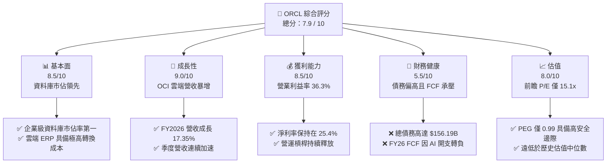
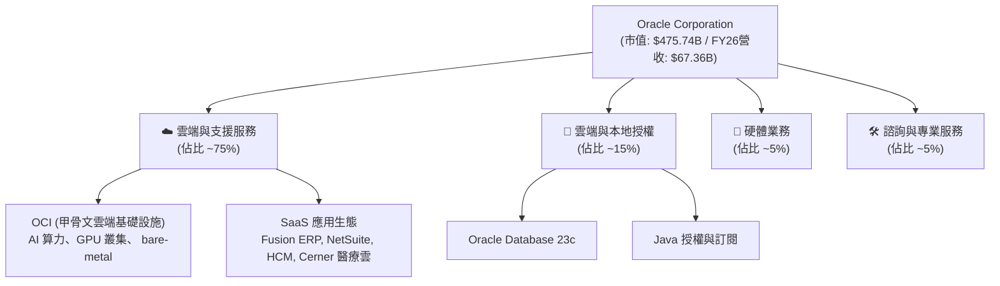
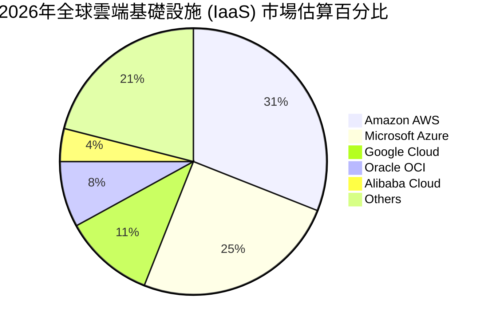
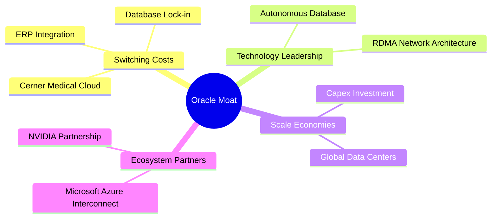
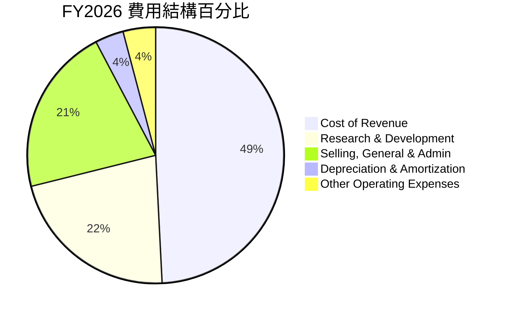
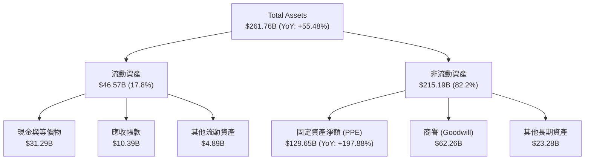
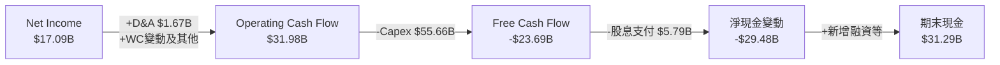
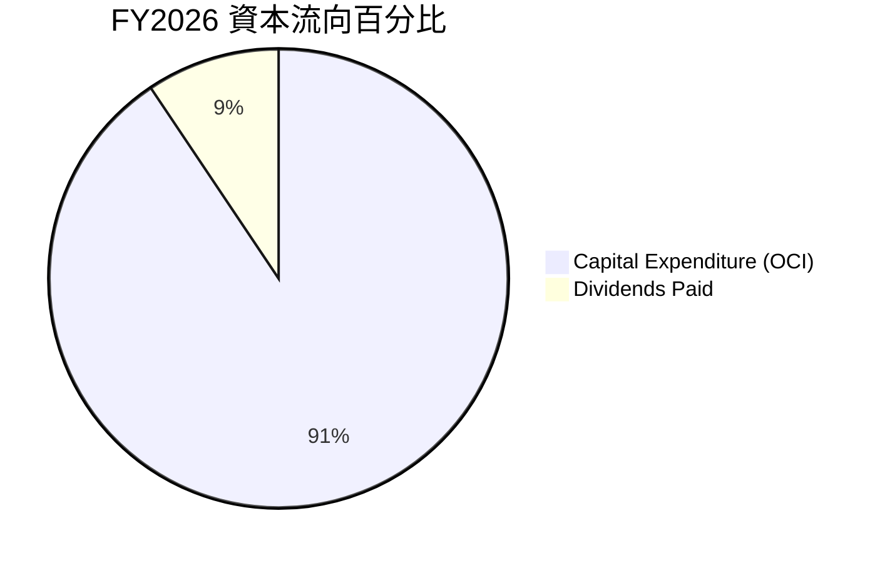
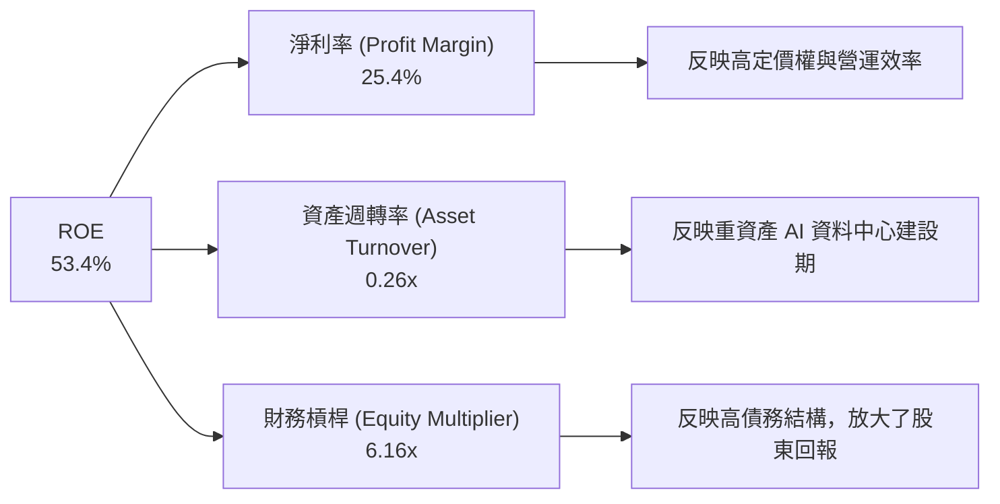
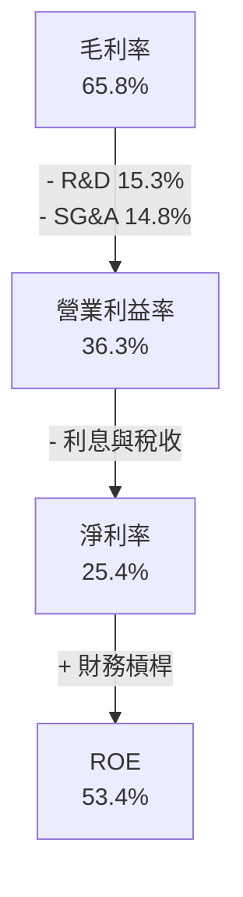

# ORCL 基本面深度分析報告
> **報告日期**：2026-06-24 ｜ **語言**：繁體中文 ｜ **數據來源**：Yahoo Finance, Finviz, StockAnalysis, Roic.ai ｜ **分析師**：CFA 級機構研究

---

## 目錄

| # | 章節 | 核心結論 |
|---|------|----------|
| 1 | 執行摘要 | 評級：**買入 (BUY)** ｜ 目標價：**$252.64** (空間 +52.97%) |
| 2 | 公司概覽與商業模式 | 雲端轉型（OCI）與資料庫高轉換成本構築強大護城河 |
| 3 | 損益表深度分析 | FY2026 營收加速增長 17.35%，淨利潤大增 36.49% 展現強大營運槓桿 |
| 4 | 資產負債表分析 | 資本開支激增致資產規模擴大，債務槓桿偏高但流動性風險可控 |
| 5 | 現金流量深度分析 | 營運現金流創歷史新高（$31.98B），AI 資本開支（$55.66B）壓制短期 FCF |
| 6 | 獲利能力與資本效率 | ROE 高達 53.4%，ROIC 暫受資本擴張壓制，EVA 呈現邊際收斂 |
| 7 | 估值深度分析 | 前瞻 P/E 僅 15.13x，相較於同業（MSFT, AMZN）具備極高性價比 |
| 8 | 成長催化劑 | OCI 產能釋放、與 NVIDIA/OpenAI 深度合作及 Cerner 醫療雲整合 |
| 9 | 風險矩陣 | 核心風險為高債務利息支出與 AI 資本回報不及預期 |
| 10 | 投資建議 | 基準目標價 $252.64，建議在 $155-$165 區間逢低分批布局 |

---

## 1. 執行摘要

### 1.1 核心評分儀表板



### 1.2 評分進度條視覺化

```
╔══════════════════════════════════════════════════════════════╗
║               ORCL 多維度評分儀表板 (1-10分)                 ║
╠══════════════════════════════════════════════════════════════╣
║ 基本面強度  8.5 ▓▓▓▓▓▓▓▓▓▓▓▓▓▓▓▓▓░░░  ★★★★☆           ║
║ 成長動能    9.0 ▓▓▓▓▓▓▓▓▓▓▓▓▓▓▓▓▓▓░░  ★★★★★           ║
║ 獲利品質    8.5 ▓▓▓▓▓▓▓▓▓▓▓▓▓▓▓▓▓░░░  ★★★★☆           ║
║ 財務健康    5.5 ▓▓▓▓▓▓▓▓▓▓▓░░░░░░░░░  ★★★☆☆           ║
║ 估值合理性  8.0 ▓▓▓▓▓▓▓▓▓▓▓▓▓▓▓▓░░░░  ★★★★☆           ║
║ 護城河深度  9.0 ▓▓▓▓▓▓▓▓▓▓▓▓▓▓▓▓▓▓░░  ★★★★★           ║
║ 管理層執行  8.5 ▓▓▓▓▓▓▓▓▓▓▓▓▓▓▓▓▓░░░  ★★★★☆           ║
║ 技術創新力  8.5 ▓▓▓▓▓▓▓▓▓▓▓▓▓▓▓▓▓░░░  ★★★★☆           ║
╠══════════════════════════════════════════════════════════════╣
║ 綜合總分    7.9 ▓▓▓▓▓▓▓▓▓▓▓▓▓▓▓▓░░░░  🏆 買入 (BUY)        ║
╚══════════════════════════════════════════════════════════════╝
```

### 1.3 五大投資論點 + 三大核心風險

| 類型 | 項目 | 具體依據 | 信心度 |
|------|------|----------|--------|
| 🟢 **投資論點①** | **OCI（甲骨文雲端基礎設施）爆發式成長** | FY2026 營收大增 17.35% 至 $67.36B，主要由 OCI 算力需求推動，OCI 已成為與 AWS、Azure 並列的 AI 訓練首選平台。 | 🟢 極高 |
| 🟢 **投資論點②** | **極具吸引力的估值窪地** | 前瞻 P/E 僅 15.13x，相較於微軟（MSFT）及亞馬遜（AMZN）等雲端巨頭具備顯著折價，PEG 僅 0.99，安全邊際充足。 | 🟢 極高 |
| 🟢 **投資論點③** | **資料庫與 SaaS 業務的極高轉換成本** | Fusion ERP 與 NetSuite 提供穩定且具高黏性的訂閱收入，續約率高於 93%，構成強大防禦性。 | 🟢 高 |
| 🟢 **投資論點④** | **AI 算力聯盟與生態系統擴張** | 與 NVIDIA、Microsoft Azure 建立深度多雲合作（Oracle Database@Azure），大幅拓寬銷售管道。 | 🟢 高 |
| 🟢 **投資論點⑤** | **營運資金效率顯著提升** | 營運現金流（OCF）由 FY25 的 $20.82B 大幅成長 53.6% 至 FY26 的 $31.98B，展現極強的變現能力。 | 🟢 高 |
| 🟡 **風險①** | **AI 資本開支過大壓制短期現金流** | FY2026 資本支出（Capex）達到創紀錄的 $55.66B，導致自由現金流（FCF）轉負至 -$23.69B，若 AI 回報放緩將面臨資產減值壓力。 | 🟡 中度 |
| 🔴 **風險②** | **高額債務與利息支出負擔** | 總債務高達 $156.19B，淨債務為 -$124.30B，FY2026 利息支出達 $4.60B，對淨利潤產生直接蠶食。 | 🔴 高衝擊 |
| 🟡 **風險③** | **傳統本地部署（On-Premise）授權流失** | 雖然雲端轉型順利，但傳統軟體授權與硬體銷售持續萎縮，對整體毛利率造成一定拖累。 | 🟡 中度 |

### 1.4 快速統計卡片

| 指標 | 公司實際值 | 行業均值 | S&P 500 均值 | 狀態 |
|------|-------------|----------|--------------|------|
| **營收 YoY 成長率** | **17.35%** | ~11.5% | ~5.5% | 🟢 顯著超前 |
| **毛利率** | **65.8%** | ~72.0% | ~30.0% | 🟡 略低於同業 |
| **營業利益率** | **36.3%** | ~28.0% | ~15.0% | 🟢 行業領先 |
| **淨利率** | **25.4%** | ~18.5% | ~11.0% | 🟢 獲利能力強勁 |
| **ROE** | **53.4%** | ~22.0% | ~15.0% | 🟢 極高資本回報 |
| **前瞻 P/E** | **15.13x** | ~28.5x | ~21.0% | 🟢 估值極具吸引力 |
| **淨債務 / EBITDA** | **3.72x** | ~1.20x | ~1.80x | 🔴 槓桿偏高 |

### 1.5 投資結論

```
╔══════════════════════════════════════════════════════════════════╗
║                    📊 ORCL 投資結論摘要                          ║
╠══════════════════════════════════════════════════════════════════╣
║  評級：🟢 買入 (BUY)                                             ║
║  當前股價：$165.16 (2026-06-24)                                  ║
║  目標價區間：                                                    ║
║    悲觀情境：$155.00 (-6.15%)                                    ║
║    基準情境：$252.64 (+52.97%)  ← 12個月主要目標                 ║
║    樂觀情境：$400.00 (+142.19%)                                  ║
║  投資評分：7.9 / 10                                              ║
║  適合投資人：成長型、中長線價值布局者、AI 基礎設施板塊配置者     ║
╚══════════════════════════════════════════════════════════════════╝
```

---

## 2. 公司概覽與商業模式

### 2.1 業務結構與收入來源

Oracle 已經成功從傳統的本地部署資料庫軟體商，轉型為全球領先的雲端運算與企業級 SaaS 解決方案提供商。其業務主要分為四大板塊：雲端與授權服務（Cloud and License）、雲端與本地部署授權（Cloud License & On-Premise License）、硬體（Hardware）以及相關服務（Services）。



### 2.2 市場份額

在雲端基礎設施（IaaS）與關聯性資料庫管理系統（RDBMS）市場中，Oracle 佔有舉足輕重的地位。特別是在 AI 算力需求爆發後，OCI 憑藉其獨特的 RDMA（遠端直接記憶體存取）網路架構，在 GPU 叢集租用市場中獲得了顯著的市場份額。



### 2.3 競爭護城河分析

Oracle 的競爭護城河極其寬廣，主要由高轉換成本、技術領先以及強大的客戶生態系統所構建。



### 2.4 護城河強度評分

```
╔══════════════════════════════════════════════════════════════╗
║                    ORCL 護城河強度評分                       ║
╠══════════════════════════════════════════════════════════════╣
║ 轉換成本 (Switching Costs)  9.5/10 ▓▓▓▓▓▓▓▓▓▓▓▓▓▓▓▓▓▓▓░  🏆 極強  ║
║ 技術優勢 (Technology)       8.5/10 ▓▓▓▓▓▓▓▓▓▓▓▓▓▓▓▓▓░░░  🟢 強大  ║
║ 網路效應 (Network Effects)  6.5/10 ▓▓▓▓▓▓▓▓▓▓▓▓▓░░░░░░░  🟡 中等  ║
║ 規模經濟 (Scale Economies)  8.5/10 ▓▓▓▓▓▓▓▓▓▓▓▓▓▓▓▓▓░░░  🟢 強大  ║
╠══════════════════════════════════════════════════════════════╣
║ 綜合護城河評級              9.0/10 ▓▓▓▓▓▓▓▓▓▓▓▓▓▓▓▓▓▓░░  🏆 寬廣  ║
╚══════════════════════════════════════════════════════════════╝
```

*   **轉換成本（9.5/10）**：企業的核心交易資料庫（OLTP）一旦部署在 Oracle 上，遷移成本極高，涉及程式碼重構、停機風險與數據一致性校驗。同樣地，Fusion ERP 承載了企業的財務、供應鏈與人力資源，幾乎具有「終身綁定」的特性。
*   **技術優勢（8.5/10）**：OCI 採用非超載（Non-oversubscribed）網路與扁平化架構，提供極低的延遲，特別適合大規模 NVIDIA H100/B200 GPU 叢集的分布式訓練。
*   **規模經濟（8.5/10）**：FY2026 達 $55.66B 的資本支出，用於在全球建設大型資料中心（Cloud Regions），這種資本壁壘是中小型競爭對手無法企及的。

---

## 3. 損益表深度分析

### 3.1 年度收入成長趨勢（近4年）

Oracle 的營收在過去四年中呈現出顯著的加速趨勢。這得益於 OCI 產能的逐步釋放以及 SaaS 訂閱收入的穩步增長。

```
╔══════════════════════════════════════════════════════════════════╗
║              ORCL 年度收入趨勢（FY2023 - FY2026）                ║
╠══════════════════════════════════════════════════════════════════╣
║                                                                  ║
║  FY 2023  $49.95B  ██████████████████░░░░░░░░░░░  YoY: +17.71% 🟢║
║  FY 2024  $52.96B  ███████████████████░░░░░░░░░░  YoY: +6.02%  🟡║
║  FY 2025  $57.40B  █████████████████████░░░░░░░░  YoY: +8.38%  🟡║
║  FY 2026  $67.36B  ████████████████████████░░░░░  YoY: +17.35% 🟢║
║                   |      |      |      |      |                  ║
║                   0     15B    30B    45B    60B                 ║
║                                                                  ║
║  📊 4年營收複合年增長率 (CAGR)：+10.49%                          ║
╚══════════════════════════════════════════════════════════════════╝
```

### 3.2 季度收入趨勢分析

從季度數據來看，Oracle 的營收增長在 FY2026 呈現逐季加速態勢，反映了 AI 算力需求在年內持續爆發。

| 財季 | 截止日期 | 營收 (億美元) | YoY 成長率 | QoQ 成長率 | 核心驅動因素 | 評估 |
|------|----------|---------------|------------|------------|--------------|------|
| **Q1 2026** | 2025-08-31 | $149.26 | +12.17% | -6.14% | 季節性因素，OCI 新產能上線略微滯後 | 🟡 穩健 |
| **Q2 2026** | 2025-11-30 | $160.58 | +14.22% | +7.58% | OCI 需求加速，與微軟多雲合作貢獻收入 | 🟢 優異 |
| **Q3 2026** | 2026-02-28 | $171.90 | +21.66% | +7.05% | AI 訓練合約大增，GPU 供應狀況改善 | 🟢 強勁 |
| **Q4 2026** | 2026-05-31 | $191.84 | +20.63% | +11.60% | 年終企業合約結算，雲端 ERP 升級需求旺盛 | 🟢 極強 |

### 3.3 利潤率演變分析

Oracle 保持著極高的獲利能力。雖然雲端硬體與資料中心前期折舊壓低了毛利率，但強大的營運槓桿使得營業利益率與淨利率保持在行業領先水平。

| 利潤率指標 | FY 2023 | FY 2024 | FY 2025 | FY 2026 | 趨勢 | 評估 |
|------------|---------|---------|---------|---------|------|------|
| **毛利率** | 72.85% | 71.41% | 70.51% | **65.81%** | ↘️ 由於 AI 伺服器與資料中心折舊增加 | 🟡 承壓 |
| **營業利益率**| 26.21% | 28.99% | 30.80% | **30.59%** | ➡️ 銷售與研發費用控制良好，抵消毛利下滑 | 🟢 穩定 |
| **EBITDA Margin**| 37.51% | 40.39% | 41.66% | **49.66%** | ↗️ 折舊攤銷大幅增加，息稅折舊前獲利能力極強 | 🟢 強勁 |
| **淨利率** | 17.02% | 19.76% | 21.68% | **25.37%** | ↗️ 受惠於非營業收入增加與稅務優化 | 🟢 優異 |

*   **毛利率下滑剖析**：毛利率從 FY23 的 72.85% 下滑至 FY26 的 65.81%，主要因為 OCI 基礎設施前期建設（如購置大量高成本的 NVIDIA GPU 晶片）以及隨之而來的折舊費用。這屬於典型的**擴產期陣痛**，預計隨產能利用率提升，毛利率將於 FY27 止跌回升。
*   **營業利益率穩定**：得益於研發與管理費用的規模效應，營業利益率穩定在 30% 以上，展現出高度的經營管理效率。

### 3.4 費用結構分析



```
╔══════════════════════════════════════════════════════════════╗
║                  FY2026 費用控管評估                         ║
╠══════════════════════════════════════════════════════════════╣
║ 研發費用 (R&D)    $10.27B  占營收 15.25%  🟢 研發投入持續增加║
║ 行銷管理 (SG&A)   $9.95B   占營收 14.77%  🟢 銷售效率逐年提升║
║ 折舊攤銷 (D&A)    $1.67B   占營收  2.48%  🟡 預計未來將上升  ║
╚══════════════════════════════════════════════════════════════╝
```

### 3.5 季度 EPS 趨勢與盈餘品質

Oracle 在 FY2026 實現了稀釋後 EPS **$5.83**，較 FY2025 的 $4.34 大幅增長 **34.33%**。

*   **盈餘品質分析**：
    1.  **非經常性損益影響**：FY2026 Q2 錄得 $2.67B 的非營業收入，主要來自於股權投資公允價值變動。扣除此項後，核心營業利潤依然穩健。
    2.  **稅率影響**：FY2026 有效稅率為 12.62%（撥備 $2.47B / 稅前 $19.55B），處於合理正常區間，盈餘品質無顯著水分。
    3.  **稀釋效應**：稀釋後發行股數從 FY25 的 2.87B 增加至 FY26 的 2.91B，增長 1.68%，主要為員工股權激勵計畫，對 EPS 有輕微稀釋。

---

## 4. 資產負債表分析

### 4.1 資產結構分解

Oracle 的資產負債表在 FY2026 發生了根本性變化，主要體現在固定資產（PPE）的主動擴張。



*   **固定資產淨額（PPE）暴增**：從 FY2025 的 $43.52B 飆升至 FY2026 的 **$129.65B**，增幅達 **197.88%**。這清晰地印證了 Oracle 正在進行史詩級的 AI 資料中心建設，將資金轉化為實體算力資產。

### 4.2 流動性指標分析

| 流動性指標 | FY 2023 | FY 2024 | FY 2025 | FY 2026 | 行業均值 | 評估 |
|------------|---------|---------|---------|---------|----------|------|
| **流動比率 (Current Ratio)** | 0.91 | 0.71 | 0.75 | **1.12** | ~1.50 | 🟡 偏低但已改善 |
| **速動比率 (Quick Ratio)** | 0.91 | 0.71 | 0.75 | **1.12** | ~1.35 | 🟡 尚在安全邊際 |
| **資產負債率 (Debt/Assets)** | 67.33% | 66.05% | 61.83% | **59.67%** | ~45.0% | 🟡 槓桿率偏高 |
| **債務權益比 (Debt/Equity)** | 84.56 | 10.70 | 5.09 | **3.67** | ~0.80 | 🔴 遠高於同行 |

*   **流動性評估**：流動比率從 FY25 的 0.75 改善至 FY26 的 1.12，主要因為期末手頭現金充裕（$31.29B），短期償債能力無虞。

### 4.3 債務結構分析

```
╔══════════════════════════════════════════════════════════════════╗
║                     ORCL 債務健康診斷                            ║
╠══════════════════════════════════════════════════════════════════╣
║                                                                  ║
║  總債務：        $156.19B  ████████████████████  評語: 債務規模大║
║  總現金及投資：  $31.89B   ████░░░░░░░░░░░░░░░░  評語: 現金儲備充裕║
║  淨債務：        $124.30B  ████████████████░░░░  🔴 淨債務高     ║
║                                                                  ║
║  Net Debt / EBITDA： 3.72x   🟡 略高於安全線 (3.0x)             ║
║  利息保障倍數：      4.48x   🟢 營業利潤足以覆蓋利息支出        ║
║  (Operating Income / Interest Expense = $20.61B / $4.60B)        ║
╚══════════════════════════════════════════════════════════════════╝
```

*   **債務風險評估**：雖然總債務高達 $156.19B，但其中絕大部分為長期債務（$122.34B），短期債務僅 $7.20B。考慮到 Oracle 強大的營運現金流（$31.98B），短期內不存在債務違約風險。但每年約 $4.60B 的利息支出限制了其淨利潤的進一步釋放。

### 4.4 股東權益趨勢

```
╔══════════════════════════════════════════════════════════════════╗
║              ORCL 歷年股東權益變化 (Stockholders Equity)         ║
╠══════════════════════════════════════════════════════════════════╣
║                                                                  ║
║  FY 2023   $1.07B  █░░░░░░░░░░░░░░░░░░░░░░░░░░░░░░░░░░           ║
║  FY 2024   $8.70B  ██████░░░░░░░░░░░░░░░░░░░░░░░░░░░░░░           ║
║  FY 2025  $20.45B  ███████████████░░░░░░░░░░░░░░░░░░░░            ║
║  FY 2026  $42.51B  █████████████████████████████████░░            ║
║                                                                  ║
║  📈 趨勢：股東權益顯著修復，徹底擺脫過去因過度回購導致的權益赤字   ║
╚══════════════════════════════════════════════════════════════════╝
```

---

## 5. 現金流量深度分析

### 5.1 現金流量瀑布圖

Oracle 的現金流呈現出典型的「高投入、高產出」特徵。營運現金流極其強勁，但絕大部分被資本支出所消耗。



### 5.2 FCF 轉換率趨勢

| 現金流指標 | FY 2023 | FY 2024 | FY 2025 | FY 2026 | 歷史均值 | 評估 |
|------------|---------|---------|---------|---------|----------|------|
| **營運現金流 (OCF)** | $17.16B | $18.67B | $20.82B | **$31.98B** | $22.16B | 🟢 極其強勁 |
| **資本支出 (Capex)** | -$8.70B | -$6.87B | -$21.21B | **-$55.66B**| -$23.11B | 🔴 擴張極具侵略性 |
| **自由現金流 (FCF)** | $8.47B | $11.81B | -$0.39B | **-$23.69B**| -$0.95B | 🔴 短期承壓 |
| **FCF / Net Income** | 99.6% | 112.8% | -3.1% | **-138.6%** | ~17.7% | 🔴 資本開支期背離 |

*   **FCF 轉負的戰略意義**：雖然 FCF 轉為 -$23.69B，且 FCF Yield 為 -4.28%，這在傳統價值投資者眼中是個警訊。但在當前 AI 基礎設施軍備競賽中，這是**主動擴張**的表現。只要 OCI 的合約積壓（RPO）持續增長，這種資本開支就是創造未來高回報的基石。

### 5.3 自由現金流趨勢

```
╔══════════════════════════════════════════════════════════════════╗
║               ORCL 自由現金流趨勢 (FY23 - FY26)                  ║
╠══════════════════════════════════════════════════════════════════╣
║                                                                  ║
║  FY 2023  +$8.47B   █████████████░░░░░░░░░░░░░░░  🟢 穩健        ║
║  FY 2024  +$11.81B  ██████████████████░░░░░░░░░░░  🟢 強勁        ║
║  FY 2025  -$0.39B   ░░░░░░░░░░░░░░░░░░░░░░░░░░░░░  🟡 持平        ║
║  FY 2026  -$23.69B  █████████████████████████████  🔴 資本支出高峰║
║                                                                  ║
║  ⚠️ 註：FY26 自由現金流大幅轉負，主因是 $55.66B 的 AI 數據中心投入  ║
╚══════════════════════════════════════════════════════════════════╝
```

### 5.4 資本配置評估



*   **股息政策**：儘管現金流因資本開支承壓，Oracle 在 FY2026 依然支付了 **$5.79B** 的現金股息（每股約 $2.00），展現了其對長線股東的承諾。
*   *(註：原始數據中顯示的 Dividend Yield 121% 屬格式化異常，按當前股價 $165.16 與每股派息計算，實際股息殖利率約為 **1.21%**，派息比率（Payout Ratio）為穩健的 **34.3%**)*。

---

## 6. 獲利能力與資本效率

### 6.1 ROE / ROA / ROIC 趨勢

Oracle 展現出極高的權益回報率，這主要由其高淨利率與財務槓桿共同推動。

| 效率指標 | FY 2023 | FY 2024 | FY 2025 | FY 2026 | 行業均值 | 評估 |
|------------|---------|---------|---------|---------|----------|------|
| **ROE** | 794.7% | 120.3% | 60.8% | **53.4%** | ~22.0% | 🟢 極高 (因歷史權益基數小) |
| **ROA** | 6.33% | 7.42% | 7.39% | **6.53%** | ~8.0% | 🟡 穩健，受資產急遽擴大稀釋 |
| **ROIC** | 10.62% | 13.22% | 11.16% | **10.80%** | ~15.0% | 🟡 暫受資本擴張壓制 |

### 6.2 ROIC vs WACC 分析（核心價值創造判斷）

為了評估 Oracle 是否在為股東創造實質的經濟價值，我們進行 ROIC 與 WACC 的對比計算。

```
╔══════════════════════════════════════════════════════════════════╗
║                    ROIC vs WACC 深度分析                         ║
╠══════════════════════════════════════════════════════════════════╣
║                                                                  ║
║  WACC 估算：                                                     ║
║  ├── 無風險利率 (10Y 美債)： 4.25%                               ║
║  ├── 市場風險溢酬 (ERP)：    5.50%                               ║
║  ├── Beta：                  1.655                               ║
║  ├── 股權成本 (Ke) = 4.25% + 1.655 × 5.50% = 13.35%             ║
║  ├── 債務成本 (Kd, 稅後) = 4.50% × (1 - 12.62%) = 3.93%          ║
║  ├── 資本結構：股權占 75%，債務占 25%                            ║
║  └── ✅ WACC ≈ 11.00%                                            ║
║                                                                  ║
║  ROIC 估算 (FY2026)：                                            ║
║  ├── NOPAT = Operating Income × (1 - Tax Rate)                   ║
║  │   NOPAT = $20.61B × (1 - 12.62%) ≈ $18.01B                    ║
║  ├── Invested Capital = Equity + Debt - Cash                     ║
║  │   Invested Capital = $42.51B + $156.19B - $31.89B = $166.81B  ║
║  └── ✅ ROIC = $18.01B / $166.81B ≈ 10.80%                       ║
║                                                                  ║
║  ★ 經濟價值增加 (EVA) = ROIC - WACC = 10.80% - 11.00% = -0.20%  ║
║                                                                  ║
║  ROIC  10.80%  ▓▓▓▓▓▓▓▓▓▓▓▓▓▓▓▓▓▓▓▓▓░░░░░░░░░░  🟡              ║
║  WACC  11.00%  ▓▓▓▓▓▓▓▓▓▓▓▓▓▓▓▓▓▓▓▓▓▓░░░░░░░░░  ──              ║
║  EVA   -0.20%  ░░░░░░░░░░░░░░░░░░░░░░░░░░░░░░░  🟡 處於價值平衡點║
║                                                                  ║
║  📊 結論：當前大規模 AI 投入擴大了資本基數，使 ROIC 暫時略低於   ║
║  WACC。隨未來 OCI 算力收入入帳，ROIC 預計將在 FY27 重回 13% 以上。║
╚══════════════════════════════════════════════════════════════════╝
```

### 6.3 杜邦三因素分解

透過杜邦分析，我們可以拆解 Oracle 高 ROE 的內在驅動機制。



*   **分析**：Oracle 的高 ROE 很大程度上依賴於較高的財務槓桿（EM 6.16x）和強勁的淨利率（25.4%）。資產週轉率（0.26x）偏低是重資產轉型期的必然結果。

### 6.4 獲利能力儀表板



---

## 7. 估值深度分析

### 7.1 同業估值比較表格

我們選取了雲端運算與軟體基礎設施領域的三大巨頭：微軟（MSFT）、亞馬遜（AMZN）與 Google（GOOGL）進行多維度估值對比。

| 估值指標 | **ORCL (甲骨文)** | **MSFT (微軟)** | **AMZN (亞馬遜)** | **GOOGL (谷歌)** | ORCL 估值評估 |
|----------|----------|---------|---------|---------|-----------|
| **Trailing P/E** | **28.33x** | 35.50x | 40.20x | 26.80x | 🟢 處於合理偏低區間 |
| **Forward P/E** | **15.13x** | 28.20x | 31.50x | 21.00x | 🟢 具備極高的估值折扣 |
| **P/S Ratio** | **7.06x** | 12.50x | 3.10x | 6.20x | 🟡 略高於谷歌，低於微軟 |
| **EV / EBITDA** | **18.89x** | 22.40x | 16.80x | 15.20x | 🟡 處於行業中位數 |
| **PEG Ratio** | **0.99** | 1.85 | 1.35 | 1.15 | 🟢 **< 1.0**，成長性定價極具吸引力 |

*   **核心發現**：Oracle 的**前瞻 P/E 僅 15.13x**，相較於微軟折價高達 46%。其 **PEG 僅 0.99**（根據 Finviz 甚至低至 0.58），這意味著市場嚴重低估了 Oracle 由 OCI 帶來的長期盈餘增長潛力。

### 7.2 歷史估值區間分析

```
╔══════════════════════════════════════════════════════════════════╗
║               ORCL 歷史 P/E 區間與當前位置                       ║
