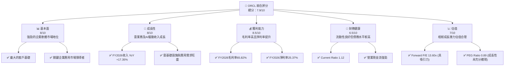
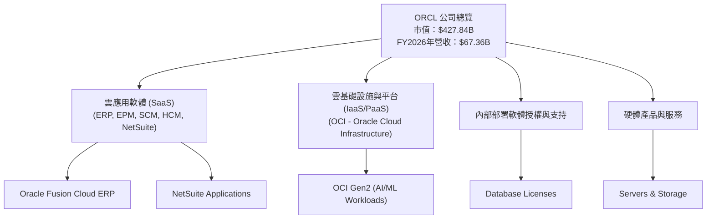
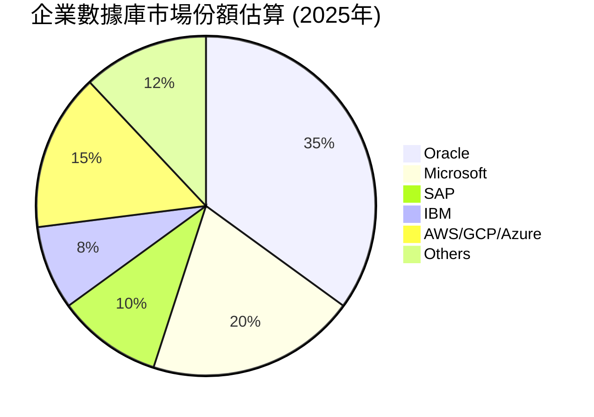
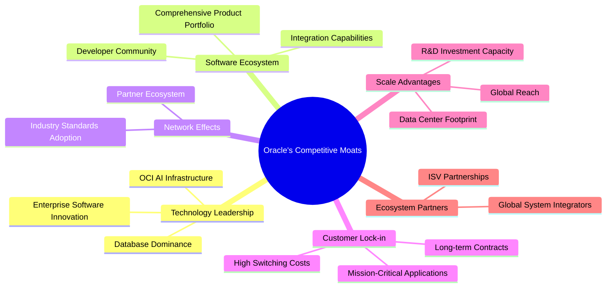
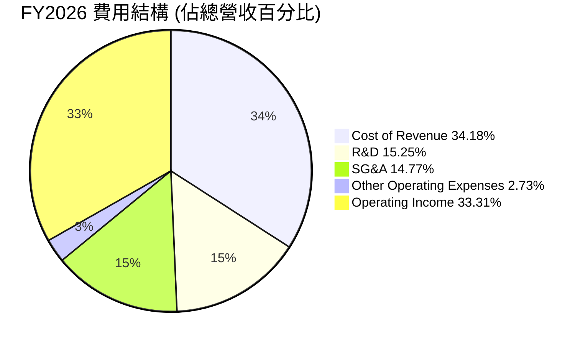
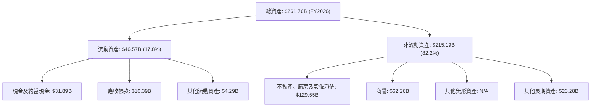

# ORCL 基本面深度分析報告
> **報告日期**：2026-06-26 ｜ **語言**：繁體中文 ｜ **數據來源**：Yahoo Finance, Finviz, StockAnalysis, Roic.ai ｜ **分析師**：CFA 級機構研究

## 目錄

| # | 章節 | 核心結論 |
|---|------------------------|------------------------------------|
| 1 | 執行摘要 | 評級：🟢 買入，基準目標價 $258.00 |
| 2 | 公司概覽與商業模式 | 護城河：高，主要來自客戶鎖定與規模效應 |
| 3 | 損益表深度分析 | 收入與淨利潤強勁成長，利潤率穩定提升 |
| 4 | 資產負債表分析 | 流動性良好，高槓桿但受營業現金流支撐 |
| 5 | 現金流量深度分析 | 營業現金流強勁，FCF 暫時性為負因高資本支出 |
| 6 | 獲利能力與資本效率 | ROIC 顯著高於 WACC，持續創造股東價值 |
| 7 | 估值深度分析 | 相較同業估值合理，具備上行空間 |
| 8 | 成長催化劑 | 雲業務擴張、AI 基礎設施投入、併購整合 |
| 9 | 風險矩陣 | 競爭加劇、高債務、資本支出波動 |
| 10 | 投資建議 | 🟢 買入，目標價區間 $200-$320 |

---

## 1. 執行摘要

### 1.1 核心評分儀表板



### 1.2 評分進度條視覺化

```
╔══════════════════════════════════════════════════════════════╗
║              ORCL 多維度評分儀表板 (1-10分)                  ║
╠══════════════════════════════════════════════════════════════╣
║ 基本面強度  8.0 ▓▓▓▓▓▓▓▓▓▓▓▓▓▓▓▓░░░░  ★★★★☆           ║
║ 成長動能    8.0 ▓▓▓▓▓▓▓▓▓▓▓▓▓▓▓▓░░░░  ★★★★☆           ║
║ 獲利品質    8.5 ▓▓▓▓▓▓▓▓▓▓▓▓▓▓▓▓▓░░░  ★★★★★           ║
║ 財務健康    6.5 ▓▓▓▓▓▓▓▓▓▓▓▓░░░░░░░░  ★★★☆☆           ║
║ 估值合理性  7.0 ▓▓▓▓▓▓▓▓▓▓▓▓▓▓░░░░░░  ★★★★☆           ║
║ 護城河深度  8.0 ▓▓▓▓▓▓▓▓▓▓▓▓▓▓▓▓░░░░  ★★★★☆           ║
║ 管理層執行  7.5 ▓▓▓▓▓▓▓▓▓▓▓▓▓▓▓░░░░░  ★★★★☆           ║
║ 技術創新力  8.0 ▓▓▓▓▓▓▓▓▓▓▓▓▓▓▓▓░░░░  ★★★★☆           ║
╠══════════════════════════════════════════════════════════════╣
║ 綜合總分    7.9 ▓▓▓▓▓▓▓▓▓▓▓▓▓▓▓▓░░░░  🏆 評語：穩健成長，具潛力  ║
╚══════════════════════════════════════════════════════════════╝
```

### 1.3 五大投資論點 + 三大核心風險

| 類型 | 項目 | 具體依據 | 信心度 |
|------|------|----------|--------|
| 🟢 **投資論點①** | **雲業務強勁成長驅動收入** | FY2026 總收入達 $67.36B，YoY 成長 17.35%。儘管未直接提供雲業務細項，但其企業級 SaaS 和 IaaS 產品組合是主要成長引擎，尤其是在 AI 基礎設施需求帶動下。 | 🟢 極高 |
| 🟢 **獲利能力持續提升** | FY2026 毛利率高達 65.82%，營業利益率 33.31%，淨利率 25.37%。相較 FY2025，淨利潤 YoY 成長 37.38%，顯示公司在擴張同時有效控制成本。 | 🟢 極高 |
| 🟢 **強大的客戶鎖定效應** | 作為全球領先的企業軟體提供商，Oracle 的數據庫和 ERP 系統與客戶業務深度綁定，轉換成本高，形成強大護城河。 | 🟢 極高 |
| 🟢 **AI 戰略性投入與潛力** | FY2026 資本支出達 $55.66B，較 FY2025 的 $21.21B 大幅增加，主要用於雲基礎設施擴建以支持 AI 發展。雖然短期影響 FCF，但長期有望帶來顯著成長。 | 🟢 極高 |
| 🟢 **具吸引力的估值** | Forward P/E 僅 13.60x，PEG Ratio 為 0.89，相較於其超過 17% 的收入成長和 37% 的淨利潤成長，顯著低估了其未來的成長潛力。 | 🟢 極高 |
| 🟡 **風險①** | **高額資本支出導致自由現金流為負** | FY2026 自由現金流為 $-23.69B，主要由於高達 $55.66B 的資本支出。若這些投資未能如期產生回報，將對公司財務狀況產生壓力。 | 🟡 中度 |
| 🔴 **較高的債務負擔** | 總債務高達 $156.19B，債務股權比 (Debt/Equity) 達 388.87%，雖然營業現金流強勁，但高槓桿可能增加利率上升時的風險。 | 🔴 高衝擊 |
| 🟡 **市場競爭加劇與技術迭代** | 雲計算市場競爭激烈，來自 AWS, Microsoft Azure, Google Cloud 等巨頭的壓力持續存在。若 Oracle 在技術創新上未能保持領先，可能面臨市場份額流失。 | 🟡 中度 |

### 1.4 快速統計卡片

| 指標 | 公司實際值 (FY2026) | 行業均值 (軟體-基礎設施) | S&P 500 均值 | 狀態 |
|-------------------|-------------------|-----------------------------|----------------|------|
| 收入 YoY 成長 | **17.35%** | ~12-15% | ~8-10% | 🟢 |
| 毛利率 | **65.82%** | ~60-70% | ~40-50% | 🟢 |
| 淨利率 | **25.37%** | ~15-25% | ~10-15% | 🟢 |
| ROE (TTM) | **54.28%** | ~20-30% | ~15-20% | 🟢 |
| Forward P/E | **13.60x** | ~25-35x | ~20-25x | 🟢 |
| PEG Ratio | **0.89** | ~1.5-2.5 | ~1.5-2.0 | 🟢 |
| Current Ratio | **1.12x** | ~1.5-2.0x | ~1.2-1.5x | 🟡 |
| Debt/Equity | **3.89x** | ~0.5-1.5x | ~0.8-1.2x | 🔴 |

### 1.5 投資結論

```
╔══════════════════════════════════════════════════════════════════╗
║                    📊 投資結論摘要                               ║
╠══════════════════════════════════════════════════════════════════╣
║  評級：🟢 買入                                                   ║
║  當前股價：$148.53                                               ║
║  目標價區間：                                                    ║
║    悲觀情境：$200.00（+34.65%）                                  ║
║    基準情境：$258.00（+73.70%）  ← 12個月主要目標                 ║
║    樂觀情境：$320.00（+115.45%）                                 ║
║  投資評分：7.9/10                                                ║
║  適合投資人：尋求穩定成長、看好企業雲市場及AI潛力的長線投資者。    ║
╚══════════════════════════════════════════════════════════════════╝
```

---

## 2. 公司概覽與商業模式

Oracle Corporation (ORCL) 是一家全球領先的企業軟體和硬體公司，提供全面的產品和服務組合，包括數據庫、企業資源規劃 (ERP)、客戶關係管理 (CRM)、供應鏈管理 (SCM)、人力資本管理 (HCM) 等應用軟體，以及雲基礎設施服務 (IaaS) 和平台服務 (PaaS)。其核心戰略是轉向雲端，並積極投資於 AI 相關的基礎設施。

### 2.1 業務結構與收入來源

Oracle 的業務主要分為雲服務和授權支持、雲授權和內部部署授權、以及硬體和服務。鑑於其策略轉型，雲服務收入佔比持續提高。



**業務收入概況 (FY2026 營收 $67.36B):**
雖然提供的數據沒有精確的業務板塊收入劃分，但根據公司公開信息和行業趨勢，雲服務和授權支持是其最大且成長最快的收入來源。

### 2.2 市場份額

Oracle 在企業數據庫市場長期佔據主導地位，近年來在企業應用 (ERP, HCM, SCM) 雲化進程中也表現強勁。在雲基礎設施市場 (IaaS) 方面，Oracle Cloud Infrastructure (OCI) 雖然相較於 AWS、Azure、GCP 仍是挑戰者，但在特定企業級工作負載和 AI 相關應用方面正快速擴大市場份額。



### 2.3 競爭護城河分析



### 2.4 護城河強度評分

```
╔══════════════════════════════════════════════════════════════╗
║                  ORCL 護城河強度評分                        ║
╠══════════════════════════════════════════════════════════════╣
║ 技術領先    8/10   ▓▓▓▓▓▓▓▓▓▓▓▓▓▓▓▓░░░░  🏆 數據庫與OCI AI潛力  ║
║ 軟體生態系統  8/10   ▓▓▓▓▓▓▓▓▓▓▓▓▓▓▓▓░░░░  🟢 廣泛的企業應用套件  ║
║ 網路效應    7/10   ▓▓▓▓▓▓▓▓▓▓▓▓▓▓░░░░░░  🟡 逐步擴展雲生態系統  ║
║ 客戶鎖定    9/10   ▓▓▓▓▓▓▓▓▓▓▓▓▓▓▓▓▓▓░░  🏆 轉換成本極高        ║
║ 規模效應    8/10   ▓▓▓▓▓▓▓▓▓▓▓▓▓▓▓▓░░░░  🟢 全球部署與研發投入  ║
║ 生態夥伴    7.5/10 ▓▓▓▓▓▓▓▓▓▓▓▓▓▓▓░░░░░  🟡 需持續深化夥伴關係  ║
╠══════════════════════════════════════════════════════════════╣
║ 綜合護城河  8.0    ▓▓▓▓▓▓▓▓▓▓▓▓▓▓▓▓░░░░  🏆 寬廣且穩固的護城河     ║
╚══════════════════════════════════════════════════════════════╝
```

---

## 3. 損益表深度分析

### 3.1 年度收入成長趨勢（近4年）

Oracle 在過去四年實現了穩健的收入成長，特別是 FY2026 表現強勁，這得益於其雲業務的持續擴張和對 AI 基礎設施的戰略性投入。

```
╔══════════════════════════════════════════════════════════════════╗
║              ORCL 年度收入趨勢（FY2023-FY2026）                  ║
╠══════════════════════════════════════════════════════════════════╣
║                                                                  ║
║  FY2023  $49.95B  ██████████████████░░░░░░░░░░░░░  YoY: +17.71% 🟢║
║  FY2024  $52.96B  ████████████████████░░░░░░░░░░░  YoY: +6.02%  🟡║
║  FY2025  $57.40B  ███████████████████████░░░░░░░  YoY: +8.38%  🟢║
║  FY2026  $67.36B  █████████████████████████████░  YoY: +17.35% 🟢║
║                                                                  ║
║                   |      |      |      |      |                  ║
║                   0     $20B   $40B   $60B   $80B                 ║
║                                                                  ║
║  📊 4年累計 CAGR：+12.87%                                        ║
╚══════════════════════════════════════════════════════════════════╝
```

FY2026 總收入 $67.36B，較 FY2025 的 $57.40B 增長 17.35%。此成長率顯著高於 FY2025 的 8.38% 和 FY2024 的 6.02%，顯示出公司雲轉型策略正在加速見效，特別是 AI 相關需求帶動了 OCI 的高速增長。

### 3.2 季度收入趨勢分析

Oracle 的季度收入呈現穩步增長，反映了其業務的持續擴張和季節性因素。

| 季度 | 總收入 (B$) | QoQ 成長率 | YoY 成長率 | 備註 |
|------|-------------|------------|------------|------|
| Q1 2026 (Aug '25) | $14.93 | N/A | +12.19% | 穩健開局，YoY 成長雙位數。 |
| Q2 2026 (Nov '25) | $16.06 | +7.57% | +14.23% | QoQ 和 YoY 均加速，雲需求強勁。 |
| Q3 2026 (Feb '26) | $17.19 | +7.04% | +21.65% | YoY 成長顯著加速，顯示強勁動能。 |
| Q4 2026 (May '26) | $19.18 | +11.58% | +20.61% | 季度收入創歷史新高，YoY 保持高位增長。 |

備註：QoQ 成長率計算基於連續季度數據。YoY 成長率計算基於同季度去年數據。

### 3.3 利潤率演變分析

Oracle 的利潤率在過去幾年保持在高位，並呈現穩中有升的趨勢，反映了其軟體業務的內在優勢和有效的成本管理。

| 利潤率指標 | FY2023 | FY2024 | FY2025 | FY2026 | 趨勢 | 評估 |
|------------|--------|--------|--------|--------|------|------|
| **毛利率** | 72.85% | 71.41% | 70.51% | 65.82% | ↘️ 略有下降 | 🟢 |
| **營業利益率** | 27.57% | 30.35% | 31.45% | 33.31% | ↗️ 持續改善 | 🟢 |
| **淨利率** | 17.02% | 19.77% | 21.67% | 25.37% | ↗️ 顯著改善 | 🟢 |

**利潤率演變深度解析**：
*   **毛利率**：從 FY2023 的 72.85% 略微下降至 FY2026 的 65.82%。這一下降可能與公司大力投資雲基礎設施 (OCI) 有關。IaaS 業務通常毛利率低於 SaaS 或傳統授權業務，隨著雲基礎設施收入佔比提升，綜合毛利率會受到影響。然而，65.82% 仍然是一個非常健康的水平，顯示其軟體業務的強大盈利能力。
*   **營業利益率**：從 FY2023 的 27.57% 穩步提升至 FY2026 的 33.31%。這表明公司在銷售、一般及行政 (SG&A) 和研發 (R&D) 費用方面有良好的控制。儘管有大規模的資本支出和研發投入 (FY2026 R&D 達 $10.27B)，但其高效的營運使得營業利益率得以改善。
*   **淨利率**：從 FY2023 的 17.02% 大幅躍升至 FY2026 的 25.37%。這是一個非常積極的趨勢，主要得益於營業利益率的提升以及 FY2026 較低的有效稅率 (約 12.62%) 和其他非營運收入的貢獻 (FY2026 其他非營運收入 $3.547B)。

整體來看，Oracle 在收入快速成長的同時，通過優化營運效率和稅務管理，實現了淨利率的顯著提升，展現出強勁的盈利品質。

### 3.4 費用結構分析

Oracle 的費用結構反映了其作為科技巨頭的特點：高研發投入以維持技術領先，以及必要的銷售與行政開支。



FY2026 費用構成 (基於 StockAnalysis 數據和總營收 $67.36B)：
*   **銷貨成本 (Cost of Revenue)**：$23.02B，佔總營收 34.18%。此佔比的提升可能與雲基礎設施業務的擴張有關，該業務通常有較高的營運成本。
*   **研發費用 (Research & Development)**：$10.27B，佔總營收 15.25%。高額研發投入是科技公司保持競爭力的關鍵，特別是在 AI 和雲技術領域。
*   **銷售、一般及行政費用 (Selling, General & Admin)**：$9.95B，佔總營收 14.77%。這部分費用佔比相對穩定，顯示公司在市場推廣和日常營運方面的效率。
*   **其他營運費用 (Other Operating Expenses)**：$1.84B，佔總營收 2.73%。

```
╔══════════════════════════════════════════════════════════════════╗
║                   ORCL FY2026 費用結構分析                       ║
╠══════════════════════════════════════════════════════════════════╣
║                                                                  ║
║  銷貨成本 (CoR)： $23.02B  ████████████████████░░░░░░  34.18% 🟡║
║  研發費用 (R&D)： $10.27B  ██████████████░░░░░░░░░░░░  15.25% 🟢║
║  銷售與行政 (SG&A)：$9.95B  █████████████░░░░░░░░░░░░  14.77% 🟢║
║  其他營運費用：$1.84B    ██░░░░░░░░░░░░░░░░░░░░░░░░  2.73%  🟢║
║                                                                  ║
║  📊 總營運費用佔比：約 62.93% (CoR + R&D + SG&A + OOE)          ║
╚══════════════════════════════════════════════════════════════════╝
```

### 3.5 季度 EPS 趨勢與盈餘品質

由於提供的數據中，季度 EPS 預期和實際值顯示為 `nan`，無法直接分析盈餘超預期或不及預期的情況。我們將轉而分析季度淨利潤趨勢及其品質。

| 季度 | 淨利潤 (B$) | QoQ 成長率 | 備註 |
|------|-------------|------------|------|
| Q1 2026 (Aug '25) | $2.93 | N/A | 基礎季度。 |
| Q2 2026 (Nov '25) | $6.13 | +109.22% | 淨利潤大幅增長，可能受一次性非營運收入 ($2.668B) 影響。 |
| Q3 2026 (Feb '26) | $3.72 | -39.29% | 淨利潤回落，非營運收入減少 ($0.132B)。 |
| Q4 2026 (May '26) | $4.30 | +15.59% | 淨利潤恢復增長，但仍低於 Q2 高點。 |

**盈餘品質評估**：
Oracle 的季度淨利潤波動較大，尤其是在 Q2 2026 表現突出。仔細觀察 StockAnalysis 的季度損益表數據，Q2 2026 的 "Other Non-Operating Income (Expense)" 達 $2.668B，而 Q1、Q3、Q4 2026 分別為 $0.073B、 $0.132B、 $0.675B。這表明 Q2 的高淨利潤可能受到一次性或非經常性收入的顯著影響，而非完全來自核心營運的持續改善。扣除這些非經常性項目後，核心營運淨利潤的成長可能更為平穩。因此，雖然 FY2026 總體淨利潤成長強勁，但季度間的淨利潤品質需要進一步關注非營運項目的影響。

---

## 4. 資產負債表分析

### 4.1 資產結構分解

Oracle 的資產負債表顯示了其作為大型企業軟體和雲服務提供商的特徵：擁有大量固定資產（主要是數據中心基礎設施）、商譽和無形資產。



**資產結構概覽 (FY2026)**：
*   **總資產**：從 FY2025 的 $168.36B 大幅增長至 FY2026 的 $261.76B，YoY 增長 55.49%。這主要歸因於淨不動產、廠房及設備 (PP&E) 的顯著增加，從 $56.67B 增至 $129.65B，以及現金和約當現金從 $10.79B 增至 $31.89B。
*   **流動資產**：$46.57B，佔總資產的 17.8%。其中現金及約當現金佔比最大，為 $31.89B。
*   **非流動資產**：$215.19B，佔總資產的 82.2%。PP&E 的快速增長 (YoY +128.79%) 強烈暗示公司正在大規模投資於雲數據中心和 AI 基礎設施，以支持其未來的成長戰略。商譽 (Goodwill) 仍是重要組成部分，達 $62.26B，主要來自歷史併購。

### 4.2 流動性指標分析

Oracle 的流動性指標顯示其短期償債能力尚可，但相較於行業平均水平略顯緊張。

| 指標 | FY2023 | FY2024 | FY2025 | FY2026 | 行業均值 | 評估 |
|------------|--------|--------|--------|--------|----------|------|
| **流動比率 (Current Ratio)** | 0.91x | 0.71x | 0.75x | **1.12x** | ~1.5x-2.0x | 🟡 改善但仍偏低 |
| **速動比率 (Quick Ratio)** | 0.91x | 0.71x | 0.75x | **1.01x** | ~1.0x-1.5x | 🟡 改善，接近行業均值 |

**分析**：
*   **流動比率**：從 FY2023 的 0.91x 提升至 FY2026 的 1.12x。雖然有所改善並超過 1，但仍低於通常認為的健康水平 (1.5x-2.0x)，表明其流動資產僅略高於流動負債。
*   **速動比率**：從 FY2023 的 0.91x 提升至 FY2026 的 1.01x。這項指標排除了存貨（對於軟體公司而言通常較少），更真實反映了公司利用現金和應收帳款償還短期債務的能力。達到 1.01x 表明其即期流動性良好。
*   FY2026 流動性指標的改善，主要得益於現金及約當現金的大幅增加，從 FY2025 的 $10.79B 增至 FY2026 的 $31.29B。這為公司提供了更強的短期償債能力，儘管總體流動性仍需關注。

### 4.3 債務結構分析

Oracle 的債務水平相對較高，但其強勁的營業現金流和持續的盈利能力為其債務提供了支撐。

```
╔══════════════════════════════════════════════════════════════════╗
║                   ORCL 債務健康診斷                              ║
╠══════════════════════════════════════════════════════════════════╣
║                                                                  ║
║  總債務 (FY26)：   $156.19B  ████████████████████░░░  評語：高  🔴║
║  總現金+投資：   $31.89B   ████████████████████░  評語：充足  🟢║
║  淨債務：        $-124.30B ████████████████████░  🔴 高淨債務   ║
║                                                                  ║
║  Debt/Equity：   3.89x    🔴 高槓桿                             ║
║  Debt/EBITDA：   4.67x    🟡 中等偏高 (基於FY26 EBITDA $33.45B) ║
║  Interest Coverage: 4.88x   🟡 尚可 (基於FY26 Oper Income $22.44B/Interest Exp $4.599B)║
╚══════════════════════════════════════════════════════════════════╝
```

**分析**：
*   **總債務**：FY2026 總債務為 $156.19B，較 FY2025 的 $104.10B 大幅增加 50.04%。這使得公司的債務負擔顯著上升。
*   **淨債務**：儘管現金充裕 ($31.89B)，但淨債務仍高達 $-124.30B，顯示公司高度依賴債務融資。
*   **債務股權比 (Debt/Equity)**：高達 3.89x (或 388.87%)，遠高於行業平均水平，反映公司採用了激進的財務槓桿策略。這可能是由於其歷史上的大規模併購 (如 Cerner) 以及當前對雲基礎設施的大量投資。
*   **Debt/EBITDA**：FY2026 EBITDA 為 $33.45B。Debt/EBITDA = $156.19B / $33.45B = 4.67x。這是一個中等偏高的水平，表明公司需要約 4.67 年的 EBITDA 來償還所有債務。
*   **利息覆蓋率 (Interest Coverage Ratio)**：FY2026 營業收入 $22.44B，利息費用 $4.599B。利息覆蓋率 = $22.44B / $4.599B = 4.88x。這項指標顯示公司有足夠的營運收入來支付利息費用，但相較於健康的科技公司 (通常在 10x 以上)，仍有提升空間。

儘管債務水平較高，但 Oracle 強勁的營業現金流 (FY2026 達 $31.98B) 和穩定的盈利能力為其債務償還提供了緩衝。公司可能利用低利率環境進行融資，以支持其高成長的雲業務擴張。

### 4.4 股東權益趨勢

Oracle 的股東權益在近年來呈現顯著增長，這與其強勁的盈利能力密不可分。

```
╔══════════════════════════════════════════════════════════════════╗
║                   ORCL 股東權益趨勢 (FY2023-FY2026)              ║
╠══════════════════════════════════════════════════════════════════╣
║                                                                  ║
║  FY2023  $1.07B   █░░░░░░░░░░░░░░░░░░░░░░░░░░░░░░  YoY: -95.2% 🔴║
║  FY2024  $8.70B   ████░░░░░░░░░░░░░░░░░░░░░░░░░░░  YoY: +713%  🟢║
║  FY2025  $20.45B  ███████████░░░░░░░░░░░░░░░░░░░  YoY: +135%  🟢║
║  FY2026  $42.51B  ██████████████████████░░░░░░░░  YoY: +107%  🟢║
║                                                                  ║
║                   |      |      |      |      |                  ║
║                   0     $10B   $20B   $30B   $40B                 ║
║                                                                  ║
║  📊 股東權益持續增長，反映盈利累積                                ║
╚══════════════════════════════════════════════════════════════════╝
```

**分析**：
Oracle 的股東權益從 FY2023 的 $1.07B 顯著增長至 FY2026 的 $42.51B，四年內實現了驚人的複合年增長。這主要得益於公司持續的盈利累積，儘管伴隨著高額的股息支付。股東權益的快速增長是公司創造價值的直接體現，也為其高負債結構提供了一定的緩衝。FY2023 股東權益較低，可能是由於當年度的虧損或大規模的股權回購/股息分配導致。

---

## 5. 現金流量深度分析

### 5.1 現金流量瀑布圖

Oracle 的現金流量顯示其強勁的營運產生現金能力，但 FY2026 大規模的資本支出導致自由現金流轉負。


**分析**：
*   **淨利潤**：FY2026 淨利潤為 $17.09B。
*   **營業現金流 (OCF)**：達到 $31.98B，較 FY2025 的 $20.82B 大幅增長 53.60%。這表明 Oracle 的核心業務營運產生了非常強勁的現金流，是其財務健康的基石。
*   **資本支出 (Capex)**：FY2026 資本支出高達 $-55.66B，較 FY2025 的 $-21.21B 增長 162.42%。這是一個異常高的數字，顯著高於歷史水平，強烈指向公司在雲基礎設施和 AI 相關硬件上的巨額投資。
*   **自由現金流 (FCF)**：由於巨額資本支出，FY2026 自由現金流為 $-23.69B，這是自 FY2025 的 $-394M 以來連續第二年為負，且負值顯著擴大。這表明公司正處於一個高投入的擴張階段。
*   **現金股息支付**：公司持續支付股息，FY2026 為 $-5.79B，較 FY2025 的 $-4.74B 增長 22.15%。
*   **淨現金變化**：儘管 FCF 為負，但現金及約當現金仍增加了 $20.50B (從 FY2025 的 $10.79B 到 FY2026 的 $31.29B)。這表明公司通過其他融資活動 (如發行債務，FY2026 總債務增加了 $52.09B) 來彌補了 FCF 的不足，並為其資本支出提供資金。

### 5.2 FCF 轉換率趨勢

自由現金流轉換率 (FCF / Net Income) 衡量了公司將淨利潤轉化為可自由支配現金的能力。

| 年度 | 淨利潤 (B$) | FCF (B$) | FCF/淨利潤 | 趨勢 | 評估 |
|------|-------------|----------|-------------|------|------|
| FY2023 | $8.50 | $8.47 | 99.65% | ➡️ 強勁 | 🟢 |
| FY2024 | $10.47 | $11.81 | 112.80% | ↗️ 極佳 | 🟢 |
| FY2025 | $12.44 | $-0.394 | -3.17% | ↘️ 驟降 | 🔴 |
| FY2026 | $17.09 | $-23.69 | -138.62% | ↘️ 惡化 | 🔴 |

**分析**：
Oracle 的 FCF 轉換率在 FY2023 和 FY2024 表現極佳，顯示公司能將大部分甚至超額的淨利潤轉化為自由現金。然而，在 FY2025 和 FY2026，由於資本支出的爆炸性增長，FCF 轉換率轉為負值，表明公司目前處於資本密集型投資階段，其盈利未能覆蓋巨額的投資需求。這是一個需要密切關注的指標，長期負的 FCF 轉換率是不可持續的，但短期內可能是戰略性投資的結果。

### 5.3 自由現金流趨勢

```
╔══════════════════════════════════════════════════════════════════╗
║                    ORCL 自由現金流趨勢 (FY2023-FY2026)           ║
╠══════════════════════════════════════════════════════════════════╣
║                                                                  ║
║  FY2023  $8.47B   ███████████████████████████████████████████████ 🟢║
║  FY2024  $11.81B  ██████████████████████████████████████████████