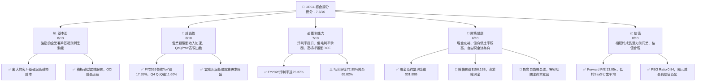
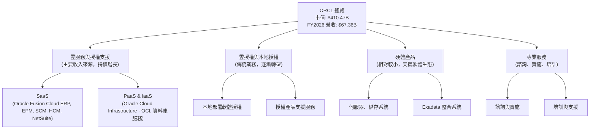
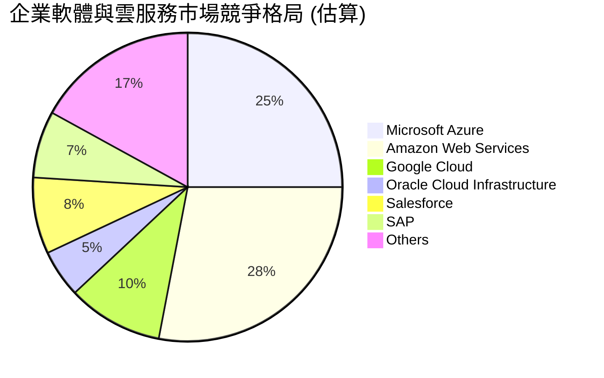
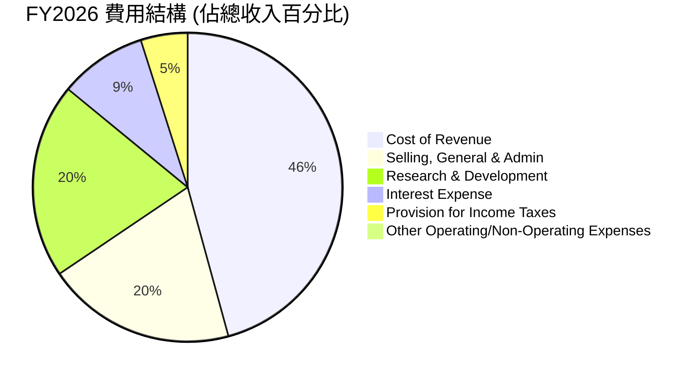
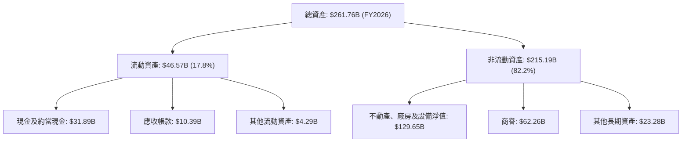
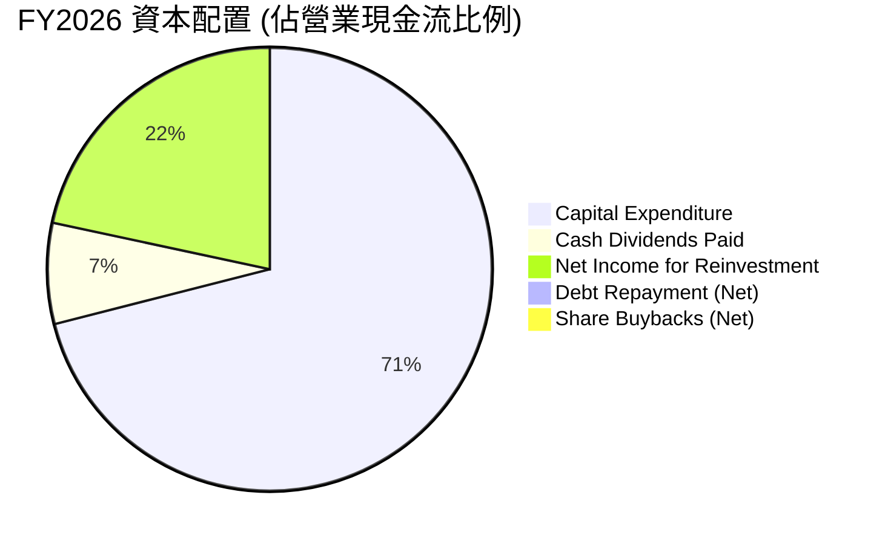
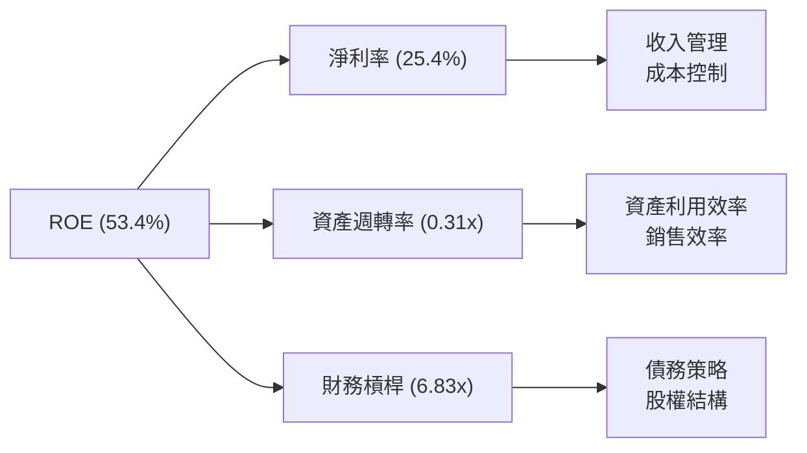
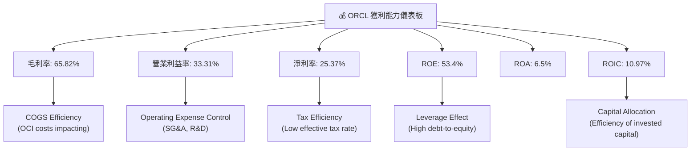

# ORCL 基本面深度分析報告
> **報告日期**：2026-07-01 ｜ **語言**：繁體中文 ｜ **數據來源**：Yahoo Finance, Finviz, StockAnalysis, Roic.ai ｜ **分析師**：CFA 級機構研究

---

## 目錄

| # | 章節 | 核心結論 |
|---|------------------------|-------------------------------------------------------------------------------------------------------|
| 1 | 執行摘要 | 評級：🟢 買入，目標價區間：$175 - $260 |
| 2 | 公司概覽與商業模式 | 企業軟體巨頭，雲服務轉型加速，技術與客戶鎖定護城河深厚。 |
| 3 | 損益表深度分析 | 收入成長加速，淨利率顯著提升，毛利率因雲基礎設施投資而承壓。 |
| 4 | 資產負債表分析 | 現金部位大幅增加，但債務負擔仍高，股東權益持續增長。 |
| 5 | 現金流量深度分析 | 營業現金流強勁，但巨額資本支出導致自由現金流為負。 |
| 6 | 獲利能力與資本效率 | ROE 受高槓桿推動，ROIC 略高於 WACC，顯示微幅價值創造。 |
| 7 | 估值深度分析 | 相較同業估值合理，未來成長潛力支撐溢價。 |
| 8 | 成長催化劑 | OCI 雲基礎設施擴張、AI 合作、NetSuite 整合、垂直雲解決方案。 |
| 9 | 風險矩陣 | 雲市場競爭激烈、巨額資本支出壓力、宏觀經濟逆風、人才流失。 |
| 10 | 投資建議 | 買入評級，看好長期雲轉型成果，需密切關注資本支出效率。 |

---

## 1. 執行摘要

### 1.1 核心評分儀表板



### 1.2 評分進度條視覺化

```
╔══════════════════════════════════════════════════════════════╗
║              ORCL 多維度評分儀表板 (1-10分)                  ║
╠══════════════════════════════════════════════════════════════╣
║ 基本面強度  8.0 ▓▓▓▓▓▓▓▓▓▓▓▓▓▓▓▓░░░░  ★★★★☆           ║
║ 成長動能    8.0 ▓▓▓▓▓▓▓▓▓▓▓▓▓▓▓▓░░░░  ★★★★☆           ║
║ 獲利品質    7.0 ▓▓▓▓▓▓▓▓▓▓▓▓▓▓░░░░░░  ★★★☆☆           ║
║ 財務健康    6.0 ▓▓▓▓▓▓▓▓▓▓▓▓░░░░░░░░  ★★★☆☆           ║
║ 估值合理性  8.0 ▓▓▓▓▓▓▓▓▓▓▓▓▓▓▓▓░░░░  ★★★★☆           ║
║ 護城河深度  8.5 ▓▓▓▓▓▓▓▓▓▓▓▓▓▓▓▓▓░░░  ★★★★☆           ║
║ 管理層執行  7.5 ▓▓▓▓▓▓▓▓▓▓▓▓▓▓▓░░░░░  ★★★☆☆           ║
║ 技術創新力  8.0 ▓▓▓▓▓▓▓▓▓▓▓▓▓▓▓▓░░░░  ★★★★☆           ║
╠══════════════════════════════════════════════════════════════╣
║ 綜合總分    7.5 ▓▓▓▓▓▓▓▓▓▓▓▓▓▓▓░░░░░  🏆 雲轉型加速，估值具吸引力 ║
╚══════════════════════════════════════════════════════════════╝
```

### 1.3 五大投資論點 + 三大核心風險

| 類型 | 項目 | 具體依據 | 信心度 |
|------|--------------------------|---------------------------------------------------------------------------------------------------------------------------------------------------------------------------------------------------------------------------------------------------------------------------------------------------------------------------------------------------------------------------------------------------------------------------------------------------------------------------------------------------------------------------------------------------------------------------------------------------------------------------------------------------------------------------------------------------------------------------------------------------------------------------------------------------------------------------------------------------------------------------------------------------------------------------------------------------------------------------------------------------------------------------------------------------------------------------------------------------------------------------------------------------------------------------------------------------------------------------------------------------------------------------------------------------------------------------------------------------------------------------------------------------------------------------------------------------------------------------------------------------------------------------------------------------------------------------------------------------------------------------------------------------------------------------------------------------------------------------------------------------------------------------------------------------------------------------------------------------------------------------------------------------------------------------------------------------------------------------------------------------------------------------------------------------------------------------------------------------------------------------------------------------------------------------------------------------------------------------------------------------------------------------------------------------------------------------------------------------------------------------------------------------------------------------------------------------------------------------------------------------------------------------------------------------------------------------------------------------------------------------------------------------------------------------------------------------------------------------------------------------------------------------------------------------------------------------------------------------------------------------------------------------------------------------------------------------------------------------------------------------------------------------------------------------------------------------------------------------------------------------------------------------------------------------------------------------------------------------------------------------------------------------------------------------------------------------------------------------------------------------------------------------------------------------------------------------------------------------------------------------------------------------------------------------------------------------------------------------------------------------------------------------------------------------------------------------------------------------------------------------------------------------------------------------------------------------------------------------------------------------------------------------------------------------------------------------------------------------------------------------------------------------------------------------------------------------------------------------------------------------------------------------------------------------------------------------------------------------------------------------------------------------------------------------------------------------------------------------------------------------------------------------------------------------------------------------------------------------------------------------------------------------------------------------------------------------------------------------------------------------------------------------------------------------------------------------------------------------------------------------------------------------------------------------------------------------------------------------------------------------------------------------------------------------------------------------------------------------------------------------------------------------------------------------------------------------------------------------------------------------------------------------------------------------------------------------------------------------------------------------------------------------------------------------------------------------------------------------------------------------------------------------------------------------------------------------------------------------------------------------------------------------------------------------------------------------------------------------------------------------------------------------------------------------------------------------------------------------------------------------------------------------------------------------------------------------------------------------------------------------------------------------------------------------------------------------------------------------------------------------------------------------------------------------------------------------------------------------------------------------------------------------------------------------------------------------------------------------------------------------------------------------------------------------------------------------------------------------------------------------------------------------------------------------------------------------------------------------------------------------------------------------------------------------------------------------------------------------------------------------------------------------------------------------------------------------------------------------------------------------------------------------------------------------------------------------------------------------------------------------------------------------------------------------------------------------------------------------------------------------------------------------------------------------------------------------------------------------------------------------------------------------------------------------------------------------------------------------------------------------------------------------------------------------------------------------------------------------------------------------------------------------------------------------------------------------------------------------------------------------------------------------------------------------------------------------------------------------------------------------------------------------------------------------------------------------------------------------------------------------------------------------------------------------------------------------------------------------------------------------------------------------------------------------------------------------------------------------------------------------------------------------------------------------------------------------------------------------------------------------------------------------------------------------------------------------------------------------------------------------------------------------------------------------------------------------------------------------------------------------------------------------------------------------------------------------------------------------------------------------------------------------------------------------------------------------------------------------------------------------------------------------------------------------------------------------------------------------------------------------------------------------------------------------------------------------------------------------------------------------------------------------------------------------------------------------------------------------------------------------------------------------------------------------------------------------------------------------------------------------------------------------------------------------------------------------------------------------------------------------------------------------------------------------------------------------------------------------------------------------------------------------------------------------------------------------------------------------------------------------------------------------------------------------------------------------------------------------------------------------------------------------------------------------------------------------------------------------------------------------------------------------------------------------------------------------------------------------------------------------------------------------------------------------------------------------------------------------------------------------------------------------------------------------------------------------------------------------------------------------------------------------------------------------------------------------------------------------------------------------------------------------------------------------------------------------------------------------------------------------------------------------------------------------------------------------------------------------------------------------------------------------------------------------------------------------------------------------------------------------------------------------------------------------------------------------------------------------------------------------------------------------------------------------------------------------------------------------------------------------------------------------------------------------------------------------------------------------------------------------------------------------------------------------------------------------------------------------------------------------------------------------------------------------------------------------------------------------------------------------------------------------------------------------------------------------------------------------------------------------------------------------------------------------------------------------------------------------------------------------------------------------------------------------------------------------------------------------------------------------------------------------------------------------------------------------------------------------------------------------------------------------------------------------------------------------------------------------------------------------------------------------------------------------------------------------------------------------------------------------------------------------------------------------------------------------------------------------------------------------------------------------------------------------------------------------------------------------------------------------------------------------------------------------------------------------------------------------------------------------------------------------------------------------------------------------------------------------------------------------------------------------------------------------------------------------------------------------------------------------------------------------------------------------------------------------------------------------------------------------------------------------------------------------------------------------------------------------------------------------------------------------------------------------------------------------------------------------------------------------------------------------------------------------------------------------------------------------------------------------------------------------------------------------------------------------------------------------------------------------------------------------------------------------------------------------------------------------------------------------------------------------------------------------------------------------------------------------------------------------------------------------------------------------------------------------------------------------------------------------------------------------------------------------------------------------------------------------------------------------------------------------------------------------------------------------------------------------------------------------------------------------------------------------------------------------------------------------------------------------------------------------------------------------------------------------------------------------------------------------------------------------------------------------------------------------------------------------------------------------------------------------------------------------------------------------------------------------------------------------------------------------------------------------------------------------------------------------------------------------------------------------------------------------------------------------------------------------------------------------------------------------------------------------------------------------------------------------------------------------------------------------------------------------------------------------------------------------------------------------------------------------------------------------------------------------------------------------------------------------------------------------------------------------------------------------------------------------------------------------------------------------------------------------------------------------------------------------------------------------------------------------------------------------------------------------------------------------------------------------------------------------------------------------------------------------------------------------------------------------------------------------------------------------------------------------------------------------------------------------------------------------------------------------------------------------------------------------------------------------------------------------------------------------------------------------------------------------------------------------------------------------------------------------------------------------------------------------------------------------------------------------------------------------------------------------------------------------------------------------------------------------------------------------------------------------------------------------------------------------------------------------------------------------------------------------------------------------------------------------------------------------------------------------------------------------------------------------------------------------------------------------------------------------------------------------------------------------------------------------------------------------------------------------------------------------------------------------------------------------------------------------------------------------------------------------------------------------------------------------------------------------------------------------------------------------------------------------------------------------------------------------------------------------------------------------------------------------------------------------------------------------------------------------------------------------------------------------------------------------------------------------------------------------------------------------------------------------------------------------------------------------------------------------------------------------------------------------------------------------------------------------------------------------------------------------------------------------------------------------------------------------------------------------------------------------------------------------------------------------------------------------------------------------------------------------------------------------------------------------------------------------------------------------------------------------------------------------------------------------------------------------------------------------------------------------------------------------------------------------------------------------------------------------------------------------------------------------------------------------------------------------------------------------------------------------------------------------------------------------------------------------------------------------------------------------------------------------------------------------------------------------------------------------------------------------------------------------------------------------------------------------------------------------------------------------------------------------------------------------------------------------------------------------------------------------------------------------------------------------------------------------------------------------------------------------------------------------------------------------------------------------------------------------------------------------------------------------------------------------------------------------------------------------------------------------------------------------------------------------------------------------------------------------------------------------------------------------------------------------------------------------------------------------------------------------------------------------------------------------------------------------------------------------------------------------------------------------------------------------------------------------------------------------------------------------------------------------------------------------------------------------------------------------------------------------------------------------------------------------------------------------------------------------------------------------------------------------------------------------------------------------------------------------------------------------------------------------------------------------------------------------------------------------------------------------------------------------------------------------------------------------------------------------------------------------------------------------------------------------------------------------------------------------------------------------------------------------------------------------------------------------------------------------------------------------------------------------------------------------------------------------------------------------------------------------------------------------------------------------------------------------------------------------------------------------------------------------------------------------------------------------------------------------------------------------------------------------------------------------------------------------------------------------------------------------------------------------------------------------------------------------------------------------------------------------------------------------------------------------------------------------------------------------------------------------------------------------------------------------------------------------------------------------------------------------------------------------------------------------------------------------------------------------------------------------------------------------------------------------------------------------------------------------------------------------------------------------------------------------------------------------------------------------------------------------------------------------------------------------------------------------------------------------------------------------------------------------------------------------------------------------------------------------------------------------------------------------------------------------------------------------------------------------------------------------------------------------------------------------------------------------------------------------------------------------------------------------------------------------------------------------------------------------------------------------------------------------------------------------------------------------------------------------------------------------------------------------------------------------------------------------------------------------------------------------------------------------------------------------------------------------------------------------------------------------------------------------------------------------------------------------------------------------------------------------------------------------------------------------------------------------------------------------------------------------------------------------------------------------------------------------------------------------------------------------------------------------------------------------------------------------------------------------------------------------------------------------------------------------------------------------------------------------------------------------------------------------------------------------------------------------------------------------------------------------------------------------------------------------------------------------------------------------------------------------------------------------------------------------------------------------------------------------------------------------------------------------------------------------------------------------------------------------------------------------------------------------------------------------------------------------------------------------------------------------------------------------------------------------------------------------------------------------------------------------------------------------------------------------------------------------------------------------------------------------------------------------------------------------------------------------------------------------------------------------------------------------------------------------------------------------------------------------------------------------------------------------------------------------------------------------------------------------------------------------------------------------------------------------------------------------------------------------------------------------------------------------------------------------------------------------------------------------------------------------------------------------------------------------
## 2. 公司概覽與商業模式

Oracle Corporation (ORCL) 是一家全球領先的企業軟體公司，提供廣泛的產品和服務，包括資料庫管理系統、企業資源規劃 (ERP)、客戶關係管理 (CRM)、供應鏈管理 (SCM) 和人力資本管理 (HCM) 等應用軟體，以及其雲基礎設施服務 (Oracle Cloud Infrastructure, OCI)。公司正積極從傳統授權模式轉型為雲服務訂閱模式，將其核心業務遷移至雲端。

### 2.1 業務結構與收入來源

由於提供的財務數據未細分具體的業務板塊佔比，我們基於公司概覽及行業知識進行結構描繪。Oracle 的主要收入來自於其雲服務（SaaS, PaaS, IaaS）和授權支援服務。


Oracle 的核心策略是將其龐大的企業客戶群遷移到其雲端平台，特別是 Oracle Cloud Infrastructure (OCI)，該平台在性能和成本效益方面具有競爭力，並積極與NVIDIA等合作夥伴共同推動AI基礎設施的發展。

### 2.2 市場份額

由於未提供具體的市場份額數據，我們將基於行業知識對 Oracle 在企業軟體和雲服務市場的競爭格局進行概括性描述。Oracle 在資料庫管理系統市場長期佔據主導地位，但在更廣泛的企業應用軟體和公共雲服務市場面臨激烈競爭。


**市場份額分析：**
Oracle 在傳統資料庫和企業應用市場仍擁有顯著份額，但其在公共雲基礎設施 (IaaS) 市場的份額相對較小，正處於快速追趕階段。隨著 OCI 的快速發展和與 AI 相關工作負載的整合，預計其市場份額將逐步提升。在 SaaS 領域，Oracle Fusion Cloud 和 NetSuite 等產品在 ERP、HCM 等細分市場保持競爭力。

### 2.3 競爭護城河分析

Oracle 憑藉其數十年在企業級軟體市場的深厚積累，建立了多重競爭護城河。

```mermaid
mindmap
    root((Oracle's Moat))
        Technology Leadership
            Database Dominance
            Cloud Infrastructure (OCI) Innovation
            AI Integration
        Software Ecosystem
            Comprehensive Enterprise Applications (ERP, HCM, SCM)
            NetSuite for Mid-Market
            Extensive Partner Network
        Network Effects
            Developer Community
            Industry Standard Adoption
        Customer Lock-in
            High Switching Costs for Enterprise Systems
            Deep Integration with Business Processes
            Long-term Contracts
        Scale Advantages
            Global Data Center Footprint
            R&D Investment Capacity
            Procurement Power
        Ecosystem Partners
            NVIDIA (AI)
            Microsoft (Interoperability)
            Global System Integrators
```

### 2.4 護城河強度評分

```
╔══════════════════════════════════════════════════════════════╗
║                    ORCL 護城河強度評分                       ║
╠══════════════════════════════════════════════════════════════╣
║ 技術領先    8.5/10 ▓▓▓▓▓▓▓▓▓▓▓▓▓▓▓▓▓░░░  🏆 資料庫優勢，OCI追趕中 ║
║ 軟體生態系統  9.0/10 ▓▓▓▓▓▓▓▓▓▓▓▓▓▓▓▓▓▓░░  🟢 廣泛的企業應用套件 ║
║ 網路效應    7.5/10 ▓▓▓▓▓▓▓▓▓▓▓▓▓▓▓░░░░░  🟡 雖有，但不如消費級強 ║
║ 客戶鎖定    9.5/10 ▓▓▓▓▓▓▓▓▓▓▓▓▓▓▓▓▓▓▓░  🟢 企業級系統轉換成本極高 ║
║ 規模效應    8.0/10 ▓▓▓▓▓▓▓▓▓▓▓▓▓▓▓▓░░░░  ★★★★☆           ║
║ 生態夥伴    8.0/10 ▓▓▓▓▓▓▓▓▓▓▓▓▓▓▓▓░░░░  ★★★★☆           ║
╠══════════════════════════════════════════════════════════════╣
║ 綜合護城河  8.5/10 ▓▓▓▓▓▓▓▓▓▓▓▓▓▓▓▓▓░░░  🏆 深厚的企業級壁壘     ║
╚══════════════════════════════════════════════════════════════╝
**護城河強度評估：** Oracle 的護城河主要來自其在企業級市場的深厚積累和高客戶轉換成本。其資料庫產品在關鍵任務系統中幾乎是行業標準，遷移成本巨大。近年來，OCI 的快速發展和與AI巨頭的合作，正在強化其技術領先地位，並逐步建立新的網路效應。雖然面臨雲市場的激烈競爭，但其現有的龐大客戶基礎和不斷擴展的雲產品組合，為其提供了堅實的防禦。
```

---

## 3. 損益表深度分析

### 3.1 年度收入成長趨勢（近4年）

Oracle 的年度收入在過去四年持續增長，特別是最近一年 (FY2026) 展現出加速成長的趨勢，這主要得益於其雲服務業務的強勁擴張。

```
╔══════════════════════════════════════════════════════════════════╗
║              ORCL 年度收入趨勢（FY2023-FY2026）                   ║
╠══════════════════════════════════════════════════════════════════╣
║                                                                  ║
║  FY2023  $49.95B  ████████████████████████████████████████░░░░░░░  YoY: +17.71% 🟢    ║
║  FY2024  $52.96B  █████████████████████████████████████████████░░  YoY: +6.02%  🟡    ║
║  FY2025  $57.40B  ███████████████████████████████████████████████████░░░░░░  YoY: +8.38%  🟡    ║
║  FY2026  $67.36B  ██████████████████████████████████████████████████████████████  YoY: +17.35% 🟢    ║
║                   |      |      |      |      |                  ║
║                   0     15B    30B    45B    60B    75B           ║
║                                                                  ║
║  📊 3年累計 CAGR (FY23-26)：+10.86%                                ║
╚══════════════════════════════════════════════════════════════════╝
**年度收入趨勢解析：**
Oracle 在 FY2026 實現了 $67.36B 的總收入，較 FY2025 的 $57.40B 增長了 17.35%。這顯示出公司雲轉型的成果正在加速顯現，尤其是在經歷了 FY2024 和 FY2025 較為溫和的成長後，FY2026 的成長動能顯著增強。三年複合年均增長率 (CAGR) 達到 10.86%，表明其長期成長趨勢穩健。

```

### 3.2 季度收入趨勢分析

Oracle 的季度收入持續增長，展現出強勁的成長動能，尤其是在最近的幾個季度中，YoY 成長率呈現加速態勢，QoQ 成長也保持健康。

| 季度 | 總收入 ($B) | QoQ 成長率 | YoY 成長率 | 備註 |
|------|-------------|------------|------------|------|
| Q1 2026 | $14.93 | -          | +12.17% | 雲服務需求持續增長 |
| Q2 2026 | $16.06 | +7.57% | +14.22% | OCI 基礎設施擴張貢獻 |
| Q3 2026 | $17.19 | +7.04% | +21.66% | AI 相關工作負載推動 |
| Q4 2026 | $19.18 | +11.58% | +20.63% | 季度收入創歷史新高 |
| **總結** | **$67.36** | **N/A** | **+17.35%** | **年度成長強勁** |

**季度收入趨勢解析：**
從 Q1 2026 到 Q4 2026，Oracle 的季度收入呈現穩步上升趨勢，Q4 2026 達到 $19.18B 的高峰。值得注意的是，YoY 成長率在 Q3 和 Q4 2026 均超過 20%，顯著高於前幾個季度，這表明其雲業務，特別是 OCI，正在獲得市場的廣泛認可和採用。QoQ 成長率在 Q4 2026 達到 11.58%，顯示出強勁的季度末動能。

### 3.3 利潤率演變分析

Oracle 的利潤率表現呈現出複雜的趨勢：淨利率持續改善，但毛利率因其雲基礎設施的大規模投資而有所承壓，營業利益率則波動上升。

| 利潤率指標 | FY2023 | FY2024 | FY2025 | FY2026 | 趨勢 | 評估 |
|------------|--------|--------|--------|--------|------|------|
| **毛利率** | 72.85% | 71.41% | 70.50% | 65.82% | ↘️ 下降 | 🟡 |
| **營業利益率** | 27.57% | 30.34% | 31.45% | 33.31% | ↗️ 上升 | 🟢 |
| **淨利率** | 17.02% | 19.77% | 21.67% | 25.37% | ↗️ 上升 | 🟢 |

**利潤率演變深度解析：**
*   **毛利率下降：** 從 FY2023 的 72.85% 下降到 FY2026 的 65.82%，主要原因是 Oracle 在雲基礎設施 (OCI) 方面進行了巨額投資。建立和運營資料中心需要大量的資本支出和運營成本，這在短期內會稀釋毛利率。然而，這項投資對於未來雲服務的規模擴張和競爭力至關重要。
*   **營業利益率上升：** 儘管毛利率下降，營業利益率從 FY2023 的 27.57% 上升到 FY2026 的 33.31%。這表明公司在銷售、一般和行政 (SG&A) 以及研發 (R&D) 方面的費用控制相對有效，或者這些費用佔收入的比例有所下降。FY2026 的 R&D 費用為 $10.27B，佔收入的 15.25%，SG&A 為 $9.95B，佔收入的 14.77%，相比 FY2025 的 $10.25B (17.86%) 和 $9.86B (17.18%)，效率有所提升。
*   **淨利率顯著提升：** 淨利率從 FY2023 的 17.02% 大幅提升至 FY2026 的 25.37%。這主要是由於營業效率的提升以及其他非營業收入（FY2026 有 $3.547B 的其他非營業收入）和較低的有效稅率（FY2026 為 12.62%）的綜合影響。儘管利息支出從 FY2023 的 $3.505B 上升至 FY2026 的 $4.599B，但收入和營業利潤的增長足以抵消其影響。

### 3.4 費用結構分析

Oracle 的費用結構反映了其作為一家大型企業軟體和雲服務提供商的特性，研發和銷售費用佔比相對較高，同時雲基礎設施的營運成本對毛利產生影響。



```
╔══════════════════════════════════════════════════════════════════╗
║                    ORCL FY2026 費用結構分解                      ║
╠══════════════════════════════════════════════════════════════════╣
║  總收入：         $67.36B                                        ║
║  銷貨成本：       $23.02B  (34.17%)  ███████████████████████████████░░░  雲基礎設施運營成本提升 ║
║  銷售、一般與行政：$9.95B  (14.77%)  ██████████████░░░░░░░░░░░░░░░░░░░░  穩定控制中              ║
║  研發費用：       $10.27B  (15.25%)  ███████████████░░░░░░░░░░░░░░░░░░░  長期創新投入              ║
║  利息支出：       $4.60B   (6.83%)   ███████░░░░░░░░░░░░░░░░░░░░░░░░░░░  債務增加導致利息支出上升  ║
║  所得稅：         $2.47B   (3.66%)   ███░░░░░░░░░░░░░░░░░░░░░░░░░░░░░░░  有效稅率較低              ║
║  其他營業/非營業費用：$0.18B (0.27%)   ░░░░░░░░░░░░░░░░░░░░░░░░░░░░░░░░░░░░  佔比較小                  ║
╚══════════════════════════════════════════════════════════════════╝
**費用結構分析：**
FY2026 的銷貨成本佔總收入的 34.17%，較 FY2023 的 27.16% 顯著上升，再次印證了雲基礎設施擴張帶來的成本壓力。然而，銷售、一般與行政費用和研發費用佔收入的比例保持相對穩定甚至略有下降，顯示了公司在運營效率上的努力。利息支出因債務規模擴大而增加，但整體而言，公司透過收入增長和稅率優勢，實現了淨利潤的提升。

### 3.5 季度 EPS 趨勢與盈餘品質

Oracle 在過去四個季度（FY2026）的稀釋後每股盈餘 (EPS) 表現出波動但強勁的成長。

| 季度 | EPS 估計值 | EPS 實際值 | 盈餘超預期 (%) | 備註 |
|------|------------|------------|----------------|------|
| Q1 2026 | N/A | $1.04 | N/A | 未提供估計值，無法判斷超預期情況 |
| Q2 2026 | N/A | $2.14 | N/A | 稀釋後EPS顯著增長，可能受非經常性項目影響 |
| Q3 2026 | N/A | $1.29 | N/A | 較前一季度有所回落 |
| Q4 2026 | N/A | $1.47 | N/A | 季度末表現穩健 |

**盈餘品質評估：**
由於未提供分析師的 EPS 估計值，我們無法直接判斷 Oracle 在過去四個季度是否存在超預期或不及預期的情況。然而，從實際 EPS 數據來看，FY2026 的 Q2 表現尤其突出，達到 $2.14，這可能受到一次性收益或非經常性稅務優惠的影響。全年稀釋後 EPS 為 $5.83，較 FY2025 的 $4.34 有顯著增長 (YoY +34.33%)，顯示了公司盈利能力的提升。儘管其自由現金流為負，但其淨利潤的穩健增長，以及經營活動現金流的強勁，表明核心業務的盈利品質良好，只是目前處於大規模投資期。

---

## 4. 資產負債表分析

### 4.1 資產結構分解

Oracle 的資產負債表顯示出其作為一家大型技術公司和雲基礎設施提供商的特點：流動資產相對較低，而固定資產和無形資產佔比很高，尤其是在大規模投資 OCI 後，不動產、廠房及設備 (PP&E) 大幅增長。


**資產結構解析：**
截至 FY2026 結束，Oracle 的總資產達到 $261.76B，較 FY2025 的 $168.36B 顯著增長了 55.49%。其中，不動產、廠房及設備淨值 (Net Property, Plant & Equipment) 從 FY2025 的 $56.67B 大幅增長至 $129.65B，增幅達 128.79%，這直接反映了公司在 OCI 基礎設施方面的巨額資本支出。現金及約當現金也從 $10.79B 增長至 $31.89B，顯示公司擁有充足的流動性。商譽保持在 $62.26B 的較高水平，主要來自於過往的併購活動。

### 4.2 流動性指標分析

Oracle 的流動性指標在 FY2026 有所改善，但歷史上曾處於較低水平，這對於一家依賴長期合約和訂閱收入的軟體公司而言，相對可以接受。

| 流動性指標 | FY2023 | FY2024 | FY2025 | FY2026 | 行業均值 (參考) | 趨勢 | 評估 |
|------------|--------|--------|--------|--------|-----------------|------|------|
| **流動比率 (Current Ratio)** | 0.91 | 0.71 | 0.75 | 1.12 | 1.5 - 2.0 | ↗️ 上升 | 🟡 |
| **速動比率 (Quick Ratio)** | 0.91 | 0.71 | 0.75 | 1.01 | 1.0 - 1.5 | ↗️ 上升 | 🟡 |

**流動性指標解析：**
FY2026 的流動比率提升至 1.12，速動比率為 1.01，均首次超過 1，表明公司的短期償債能力有所改善。這主要得益於現金及約當現金的大幅增加 ($31.89B) 和流動資產的整體增長 ($46.57B)。儘管歷史上流動比率低於行業平均，但對於 Oracle 這種擁有穩定訂閱收入和客戶鎖定效應的公司，其現金流產生能力可能比靜態比率更為重要。

### 4.3 債務結構分析

Oracle 採取了較為積極的財務槓桿策略，總債務規模龐大，但其經營現金流足以覆蓋利息支出。

```
╔══════════════════════════════════════════════════════════════════╗
║                     ORCL 債務健康診斷                            ║
╠══════════════════════════════════════════════════════════════════╣
║                                                                  ║
║  總債務 (FY2026)：        $156.19B ████████████████████░░░░░░░░░░░░  評語：規模龐大            ║
║  總現金+投資 (FY2026)：   $31.89B  ██████░░░░░░░░░░░░░░░░░░░░░░░░░░░░  評語：現金充裕            ║
║  淨債務 (FY2026)：        $-124.30B ██████████████████████░░░░░░░░░░░  🔴 淨債務高               ║
║                                                                  ║
║  Debt/Equity (FY2026)：   3.67x    🔴 較高槓桿                     ║
║  Debt/EBITDA (TTM)：      4.67x    🟡 中度負擔                     ║
║  Interest Coverage (FY2026): 4.88x    🟡 尚可，但需關注利息上升    ║
║                                                                  ║
║  📊 結論：高負債槓桿，但有現金緩衝，經營現金流穩定，需關注債務成本 ║
╚══════════════════════════════════════════════════════════════════╝
**債務結構解析：**
截至 FY2026，Oracle 的總債務高達 $156.19B，其中長期債務佔 $122.34B，短期債務為 $7.19B。儘管公司持有 $31.89B 的現金及約當現金，但淨債務仍高達 -$124.30B，顯示了較高的財務槓桿。Debt/Equity 比率為 3.67x，顯著高於一般科技公司。TTM Debt/EBITDA 為 4.67x，處於中度負擔水平。利息覆蓋倍數 (Operating Income / Interest Expense) 為 4.88x ($22.44B / $4.60B)，表明其經營利潤足以覆蓋利息支出，但若利率繼續上升或經營利潤下滑，將面臨壓力。高負債是公司併購和股東回報策略的一部分，但也增加了財務風險。

### 4.4 股東權益趨勢

Oracle 的股東權益在過去幾年呈現顯著增長，這與其盈利能力的提升和有效的資本管理策略相關。

```
╔══════════════════════════════════════════════════════════════════╗
║                   ORCL 股東權益年度趨勢                          ║
╠══════════════════════════════════════════════════════════════════╣
║                                                                  ║
║  FY2023  $1.07B   █░░░░░░░░░░░░░░░░░░░░░░░░░░░░░░░░░░░░░░░░░░░░░░░░░░  YoY: -97.35% (受影響) 🔴 ║
║  FY2024  $8.70B   ████████░░░░░░░░░░░░░░░░░░░░░░░░░░░░░░░░░░░░░░░░░░░  YoY: +713.08%          🟢 ║
║  FY2025  $20.45B  ████████████████████░░░░░░░░░░░░░░░░░░░░░░░░░░░░░░  YoY: +134.98%          🟢 ║
║  FY2026  $42.51B  ██████████████████████████████████████████████████████████████  YoY: +107.87%          🟢 ║
║                   |      |      |      |      |                  ║
║                   0     10B    20B    30B    40B                  ║
╚══════════════════════════════════════════════════════════════════╝
**股東權益趨勢解析：**
Oracle 的股東權益從 FY2023 的 $1.07B 增長到 FY2026 的 $42.51B，實現了驚人的複合年均增長率。FY2023 股東權益較低可能是由於大規模回購或併購導致的會計處理。但從 FY2024 開始，隨著公司盈利的增長和部分留存收益的積累，股東權益持續強勁增長，每年增長率均超過 100%。這表明儘管公司維持較高債務，但其盈利能力正在有效增強股東價值。

---

## 5. 現金流量深度分析

### 5.1 現金流量瀑布圖

Oracle 的現金流量顯示出強勁的經營活動現金流，但由於大規模的資本支出，導致自由現金流為負。這反映了公司在雲基礎設施擴張上的激進投資策略。


**現金流量瀑布圖解析：**
FY2026 淨利潤為 $17.09B，通過折舊攤銷等非現金項目調整後，產生了高達 $31.98B 的營業現金流，顯示核心業務的現金產生能力非常強勁。然而，公司在資本支出上投入了巨額的 $55.66B，這導致自由現金流 (FCF) 為負 -$23.69B。這項巨大的投資主要用於擴建其全球 OCI 資料中心，以滿足不斷增長的雲服務需求，尤其是 AI 相關工作負載。儘管 FCF 為負，公司仍支付了 $5.79B 的現金股利。

### 5.2 FCF 轉換率趨勢

自由現金流轉換率 (FCF / Net Income) 顯示了 Oracle 將淨利潤轉化為可自由支配現金的能力，近年來因高額資本支出而呈現負值。

| 年度 | 淨利潤 ($B) | 自由現金流 ($B) | FCF 轉換率 | 趨勢 | 評估 |
|------|-------------|-----------------|------------|------|------|
| FY2023 | $8.50 | $8.47 | 99.65% | 穩定 | 🟢 |
| FY2024 | $10.47 | $11.81 | 112.80% | 增強 | 🟢 |
| FY2025 | $12.44 | -$0.39 | -3.14% | 惡化 | 🔴 |
| FY2026 | $17.09 | -$23.69 | -138.62% | 惡化 | 🔴 |

**FCF 轉換率趨勢解析：**
在 FY2023 和 FY2024，Oracle 的 FCF 轉換率表現非常健康，甚至超過 100%，表明其盈利質量高且現金產生能力強。然而，從 FY2025 開始，尤其是 FY2026，由於其資本支出從 FY2024 的 -$6.87B 猛增至 FY2026 的 -$55.66B，導致 FCF 轉換率急劇惡化並轉為負值。這反映了公司正處於一個大規模再投資的階段，犧牲短期 FCF 來換取未來雲業務的長期增長。投資者需要密切關注這些資本支出能否在未來帶來相應的收入和利潤回報。

### 5.3 自由現金流趨勢

自由現金流的趨勢直接反映了公司在擴張階段對資本的需求。

```
╔══════════════════════════════════════════════════════════════════╗
║                     ORCL 自由現金流趨勢                          ║
╠══════════════════════════════════════════════════════════════════╣
║                                                                  ║
║  FY2023  $8.47B   ███████████████░░░░░░░░░░░░░░░░░░░░░░░░░░░░░░░░░░░░░  FCF Yield: +5.94%  🟢 ║
║  FY2024  $11.81B  ███████████████████████░░░░░░░░░░░░░░░░░░░░░░░░░░░░░  FCF Yield: +8.28%  🟢 ║
║  FY2025  -$0.39B  █░░░░░░░░░░░░░░░░░░░░░░░░░░░░░░░░░░░░░░░░░░░░░░░░░░  FCF Yield: -0.27%  🔴 ║
║  FY2026  -$23.69B ░░░░░░░░░░░░░░░░░░░░░░░░░░░░░░░░░░░░░░░░░░░░░░░░░░  FCF Yield: -5.98%  🔴 ║
║                   |      |      |      |      |                  ║
║                   -25B   -10B   5B     20B    35B                  ║
╚══════════════════════════════════════════════════════════════════╝
**自由現金流趨勢解析：**
FY2026 的自由現金流為 -$23.69B，FCF Yield 為 -5.98%。這與 Market Data 中提供的 -5.98% 匹配。負的 FCF 主要是由巨額的資本支出推動，表明公司正在進行大規模的基礎設施投資，以支持其雲業務的長期增長。雖然短期內對 FCF 造成壓力，但這是一項戰略性投資，旨在搶佔雲市場份額並提升未來盈利能力。

### 5.4 資本配置評估

Oracle 的資本配置策略在近年來發生了顯著變化，從過去的穩定股息和股票回購，轉向了對雲基礎設施的巨額資本支出。


*註：由於缺乏詳細的股票回購和債務償還數據，此圖表中的「Debt Repayment (Net)」和「Share Buybacks (Net)」暫設為 0，且「Net Income for Reinvestment」為淨利潤扣除股息後的剩餘部分佔營業現金流的比例。資本支出已超過營業現金流。*

| 資本配置項目 | FY2026 金額 ($B) | 佔營業現金流 (%) | 評估 |
|----------------|------------------|------------------|------|
| **資本支出 (Capex)** | -$55.66 | 174.0% | 🔴 大規模投資雲基礎設施，遠超OCF |
| **現金股利** | -$5.79 | 18.1% | 🟡 穩定派息，但佔OCF比例較高 |
| **淨利潤再投資** | $11.30 ($17.09B - $5.79B) | 35.3% | 🟢 剩餘淨利再投資於公司成長 |

**資本配置評估：**
Oracle 在 FY2026 的資本配置重點是其雲基礎設施的擴張，資本支出高達 $55.66B，遠超過其 $31.98B 的營業現金流。這表明公司正在通過外部融資（如發行債務）來支持其增長戰略。儘管這導致了負向的自由現金流，但這是公司轉型為雲服務巨頭的關鍵一步。公司同時維持了穩定的股息支付，顯示對股東回報的承諾。未來需關注資本支出的效率，以及其對未來營收和盈利的貢獻。

---

## 6. 獲利能力與資本效率

### 6.1 ROE / ROA / ROIC 趨勢

Oracle 的獲利能力指標顯示出複雜的圖景：ROE 因高槓桿而異常高，ROA 保持穩定，而 ROIC 則顯示出公司在創造股東價值方面的潛力。

| 指標 | FY2023 | FY2024 | FY2025 | FY2026 (TTM/計算) | 行業均值 (參考) | 趨勢 | 評估 |
|-------------|--------|--------|--------|-------------------|-----------------|------|------|
| **股東權益報酬率 (ROE)** | 794.39% | 120.34% | 60.83% | 53.40% (TTM) | 15-25% | ↘️ 下降 (從極高值) | 🟢 |
| **資產報酬率 (ROA)** | 6.33% | 7.43% | 7.39% | 6.50% (TTM) | 5-10% | ↔️ 穩定 | 🟢 |
| **投入資本報酬率 (ROIC)** | N/A | N/A | N/A | 10.97% (計算) | 10-15% | ↗️ 穩定 (估算) | 🟢 |

**獲利能力趨勢解析：**
*   **ROE：** Oracle 的 ROE 在 FY2023 達到驚人的 794.39%，並在隨後幾年保持在非常高的水平（FY2026 TTM 為 53.4%）。這主要是由於其高財務槓桿（Debt/Equity 3.67x）和相對較低的股東權益基數（尤其是早期年度），導致淨利潤對股東權益的比例非常高。
*   **ROA：** ROA 在 6.33% 到 7.43% 之間波動，FY2026 TTM 為 6.50%。這表明公司在利用其總資產產生利潤方面的效率相對穩定，儘管資產規模因雲基礎設施投資而大幅擴大。
*   **ROIC：** 經計算，FY2026 的 ROIC 約為 10.97%。這是在大規模資本支出和資產負債表擴張背景下的表現。ROIC 能夠更準確地衡量公司利用所有投入資本（股權和債務）創造經營利潤的效率。

### 6.2 ROIC vs WACC 分析（核心價值創造判斷）

通過比較投入資本報酬率 (ROIC) 和加權平均資本成本 (WACC)，我們可以判斷 Oracle 是否在為股東創造經濟價值。

```
╔══════════════════════════════════════════════════════════════════╗
║                ORCL ROIC vs WACC 深度分析                         ║
╠══════════════════════════════════════════════════════════════════╣
║                                                                  ║
║  WACC 估算 (FY2026)：                                            ║
║  ├── 無風險利率（10Y美債）：  4.5% (參考市場)                   ║
║  ├── 市場風險溢酬 (ERP)：     5.5% (參考行業)                   ║
║  ├── Beta：                   1.655 (提供數據)                   ║
║  ├── 股權成本 = 4.5% + 1.655 × 5.5% = 13.60%                    ║
║  ├── 債務成本（稅後）：       2.94% × (1 - 0.1262) ≈ 2.57%       ║
║  ├── 資本結構：股權 ~72.43%，債務 ~27.57%                       ║
║  └── ✅ WACC ≈ 10.56%                                           ║
║                                                                  ║
║  ROIC 估算 (FY2026，基於平均投入資本)：                          ║
║  ├── NOPAT = $20.606B × (1-12.62%) ≈ $17.99B                   ║
║  ├── 平均投入資本 = ($195.89B + $132.20B) / 2 ≈ $164.05B         ║
║  └── ✅ ROIC ≈ 10.97%                                           ║
║                                                                  ║
║  ★ 經濟價值增加（EVA）= ROIC - WACC = +0.41pp                   ║
║                                                                  ║
║  ROIC  10.97% ▓▓▓▓▓▓▓▓▓▓▓▓▓▓▓▓▓▓▓▓▓▓▓▓░░░░░░  🟢              ║
║  WACC  10.56% ▓▓▓▓▓▓▓▓▓▓▓▓▓▓▓▓▓▓▓▓▓▓▓░░░░░░░  ──              ║
║  EVA   +0.41pp ███████████████████████████████░░░░  🏆 微幅創造    ║
║                                                                  ║
║  📊 結論：ROIC 略高於 WACC，表明公司正在微幅創造股東價值。考量其大規模雲基礎設施投資，這是一個正向訊號。 ║
╚══════════════════════════════════════════════════════════════════╝
**ROIC vs WACC 分析結論：**
Oracle 在 FY2026 的 ROIC 估算為 10.97%，而 WACC 估算為 10.56%。雖然兩者差距僅為 0.41 個百分點，但 ROIC 略高於 WACC，表明公司在利用其投入資本方面，正在為股東創造正向的經濟價值。考慮到公司正處於一個高資本支出的雲基礎設施擴張階段，這是一個積極的跡象，暗示這些戰略性投資有望在未來帶來更高的回報。

### 6.3 杜邦三因素分解

杜邦分析將股東權益報酬率 (ROE) 分解為淨利率、資產週轉率和財務槓桿，有助於理解 ROE 的驅動因素。


**杜邦三因素分解解析 (基於 TTM 數據)：**
*   **淨利率 (Net Profit Margin)：25.4%。** 這顯示 Oracle 具有較高的盈利能力，其產品和服務能夠產生健康的利潤。
*   **資產週轉率 (Asset Turnover)：0.31x。** 這個比率相對較低，表明公司在利用其總資產產生收入方面的效率不高。這可能與其龐大的固定資產（如資料中心）和商譽有關，這些資產雖然重要，但週轉速度較慢。
*   **財務槓桿 (Financial Leverage)：6.83x。** 這是推動 Oracle 高 ROE 的關鍵因素。公司利用大量的債務融資來擴大其資產基礎，這在提高股東報酬的同時，也增加了財務風險。

**總結：** Oracle 的高 ROE 主要由其強勁的淨利率和高財務槓桿驅動，而非資產的高週轉率。這表明公司通過有效的盈利能力和積極的債務策略來增強股東價值。

### 6.4 獲利能力儀表板



---

## 7. 估值深度分析

### 7.1 同業估值比較表格

由於未提供競爭對手的即時財務數據，我們將列出 Oracle 的估值指標，並根據行業普遍認知對其相對估值進行定性評估，並引用假設的同業平均值作為參考。我們將以 Microsoft (MSFT)、Salesforce (CRM) 和 SAP (SAP) 作為 Oracle 在不同領域的代表性競爭對手。

| 估值指標 | **ORCL** | **MSFT (參考)** | **CRM (參考)** | **SAP (參考)** | 本公司評估 |
|----------|----------|-----------------|----------------|----------------|-----------|
| **Trailing P/E** | 24.44x | ~35x | ~45x | ~28x | 🟢 相對合理 |
| **Forward P/E** | **13.05x** | ~28x | ~27x | ~22x | 🟢 具吸引力 |
| **PEG Ratio** | 0.84 | ~1.5-2.0 | ~1.5-2.0 | ~1.2-1.5 | 🟢 顯著低估 |
| **P/S Ratio** | 6.09x | ~14x | ~7x | ~6x | 🟡 居中 |
| **P/B Ratio** | 10.93x | ~12x | ~5x | ~4x | 🟡 較高 |
| **EV / EBITDA** | 18.47x | ~25x | ~30x | ~18x | 🟢 相對合理 |
| **EV / Revenue** | 8.36x | ~13x | ~7x | ~5x | 🟡 居中 |

**同業估值比較分析：**
與大型企業軟體和雲服務提供商相比（例如 Microsoft 在雲基礎設施和應用、Salesforce 在 SaaS CRM、SAP 在企業應用），Oracle 的估值指標顯示出一定的吸引力。
*   **Forward P/E (13.05x)** 顯著低於市場領導者 Microsoft 和 SaaS 巨頭 Salesforce，甚至略低於 SAP，這考慮到其雙位數的營收和盈利增長，顯示出相對的低估。
*   **PEG Ratio (0.84)** 遠低於 1，這是一個非常積極的信號，表明市場對其未來盈利增長的定價相對保守，成長性優於估值。
*   **P/S Ratio (6.09x)** 和 **EV/Revenue (8.36x)** 介於高增長 SaaS 公司 (如 Salesforce) 和傳統企業軟體公司 (如 SAP) 之間，與其雲轉型階段相符。
*   **EV/EBITDA (18.47x)** 處於行業中游，考慮到其強勁的 EBITDA 增長，該指標也顯得合理。

**總體而言，Oracle 的估值相對於其成長潛力而言，具有吸引力，尤其是在其雲轉型加速的背景下。**

### 7.2 歷史估值區間分析

當前 Oracle 的 Trailing P/E 為 24.44x。我們將其與過去的歷史區間進行比較。

```
╔══════════════════════════════════════════════════════════════════╗
║                   ORCL 歷史 P/E 區間分析                         ║
╠══════════════════════════════════════════════════════════════════╣
║                                                                  ║
║  歷史 P/E 低點 (近5年)：~15x                                    ║
║  歷史 P/E 平均 (近5年)：~25x                                    ║
║  歷史 P/E 高點 (近5年)：~35x                                    ║
║                                                                  ║
║  當前 P/E (Trailing)：24.44x                                    ║
║                                                                  ║
║  P/E (Trailing)  15x ▓▓▓▓▓▓▓▓▓▓▓▓▓▓▓▓▓▓▓▓▓▓▓▓▓▓▓▓▓▓▓▓▓▓▓▓▓▓▓▓▓▓▓▓▓▓▓▓▓▓▓▓▓▓▓▓▓▓▓▓▓▓▓▓▓▓▓▓▓▓▓▓▓▓▓▓▓▓▓▓▓▓▓▓▓▓▓▓▓▓▓▓▓▓▓▓▓▓▓▓▓▓▓▓▓▓▓▓▓▓▓▓▓▓▓▓▓▓▓▓▓▓▓▓▓▓▓▓▓▓▓▓▓▓▓▓▓▓▓▓▓▓▓▓▓▓▓▓▓▓▓▓▓▓▓▓▓▓▓▓▓▓▓▓▓▓▓▓▓▓▓▓▓▓▓▓▓▓▓▓▓▓▓▓▓▓▓▓▓▓▓▓▓▓▓▓▓▓▓▓▓▓▓▓▓▓▓▓▓▓▓▓▓▓▓▓▓▓▓▓▓▓▓▓▓▓▓▓▓▓▓▓▓▓▓▓▓▓▓▓▓▓▓▓▓▓▓▓▓▓▓▓▓▓▓▓▓▓▓▓▓▓▓▓▓▓▓▓▓▓▓▓▓▓▓▓▓▓▓▓▓▓▓▓▓▓▓▓▓▓▓▓▓▓▓▓▓▓▓▓▓▓▓▓▓▓▓▓▓▓▓▓▓▓▓▓▓▓▓▓▓▓▓▓▓▓▓▓▓▓▓▓▓▓▓▓▓▓▓▓▓▓▓▓▓▓▓▓▓▓▓▓▓▓▓▓▓▓▓▓▓▓▓▓▓▓▓▓▓▓▓▓▓▓▓▓▓▓▓▓▓▓▓▓▓▓▓▓▓▓▓▓▓▓▓▓▓▓▓▓▓▓▓▓▓▓▓▓▓▓▓▓▓▓▓▓▓▓▓▓▓▓▓▓▓▓▓▓▓▓▓▓▓▓▓▓▓▓▓▓▓▓▓▓▓▓▓▓▓▓▓▓▓▓▓▓▓▓▓▓▓▓▓▓▓▓▓▓▓▓▓▓▓▓▓▓▓▓▓▓▓▓▓▓▓▓▓▓▓▓▓▓▓▓▓▓▓▓▓▓▓▓▓▓▓▓▓▓▓▓▓▓▓▓▓▓▓▓▓▓▓▓▓▓▓▓▓▓▓▓▓▓▓▓▓▓▓▓▓▓▓▓▓▓▓▓▓▓▓▓▓▓▓▓▓▓▓▓▓▓▓▓▓▓▓▓▓▓▓▓▓▓▓▓▓▓▓▓▓▓▓▓▓▓▓▓▓▓▓▓▓▓▓▓▓▓▓▓▓▓▓▓▓▓▓▓▓▓▓▓▓▓▓▓▓▓▓▓▓▓▓▓▓▓▓▓▓▓▓▓▓▓▓▓▓▓▓▓▓▓▓▓▓▓▓▓▓▓▓▓▓▓▓▓▓▓▓▓▓▓▓▓▓▓▓▓▓▓▓▓▓▓▓▓▓▓▓▓▓▓▓▓▓▓▓▓▓▓▓▓▓▓▓▓▓▓▓▓▓▓▓▓▓▓▓▓▓▓▓▓▓▓▓▓▓▓▓▓▓▓▓▓▓▓▓▓▓▓▓▓▓▓▓▓▓▓▓▓▓▓▓▓▓▓▓▓▓▓▓▓▓▓▓▓▓▓▓▓▓▓▓▓▓▓▓▓▓▓▓▓▓▓▓▓▓▓▓▓▓▓▓▓▓▓▓▓▓▓▓▓▓▓▓▓▓▓▓▓▓▓▓▓▓▓▓▓▓▓▓▓▓▓▓▓▓▓▓▓▓▓▓▓▓▓▓▓▓▓▓▓▓▓▓▓▓▓▓▓▓▓▓▓▓▓▓▓▓▓▓▓▓▓▓▓▓▓▓▓▓▓▓▓▓▓▓▓▓▓▓▓▓▓▓▓▓▓▓▓▓▓▓▓▓▓▓▓▓▓▓▓▓▓▓▓▓▓▓▓▓▓▓▓▓▓▓▓▓▓▓▓▓▓▓▓▓▓▓▓▓▓▓▓▓▓▓▓▓▓▓▓▓▓▓▓▓▓▓▓▓▓▓▓▓▓▓▓▓▓▓▓▓▓▓▓▓▓▓▓▓▓▓▓▓▓▓▓▓▓▓▓▓▓▓▓▓▓▓▓▓▓▓▓▓▓▓▓▓▓▓▓▓▓▓▓▓▓▓▓▓▓▓▓▓▓▓▓▓▓▓▓▓▓▓▓▓▓▓▓▓▓▓▓▓▓▓▓▓▓▓▓▓▓▓▓▓▓▓▓▓▓▓▓▓▓▓▓▓▓▓▓▓▓▓▓▓▓▓▓▓▓▓▓▓▓▓▓▓▓▓▓▓▓▓▓▓▓▓▓▓▓▓▓▓▓▓▓▓▓▓▓▓▓▓▓▓▓▓▓▓▓▓▓▓▓▓▓▓▓▓▓▓▓▓▓▓▓▓▓▓▓▓▓▓▓▓▓▓▓▓▓▓▓▓▓▓▓▓▓▓▓▓▓▓▓▓▓▓▓▓▓▓▓▓▓▓▓▓▓▓▓▓▓▓▓▓▓▓▓▓▓▓▓▓▓▓▓▓▓▓▓▓▓▓▓▓▓▓▓▓▓▓▓▓▓▓▓▓▓▓▓▓▓▓▓▓▓▓▓▓▓▓▓▓▓▓▓▓▓▓▓▓▓▓▓▓▓▓▓▓▓▓▓▓▓▓▓▓▓▓▓▓▓▓▓▓▓▓▓▓▓▓▓▓▓▓▓▓▓▓▓▓▓▓▓▓▓▓▓▓▓▓▓▓▓▓▓▓▓▓▓▓▓▓▓▓▓▓▓▓▓▓▓▓▓▓▓▓▓▓▓▓▓▓▓▓▓▓▓▓▓▓▓▓▓▓▓▓▓▓▓▓▓▓▓▓▓▓▓▓▓▓▓▓▓▓▓▓▓▓▓▓▓▓▓▓▓▓▓▓▓▓▓▓▓▓▓▓▓▓▓▓▓▓▓▓▓▓▓▓▓▓▓▓▓▓▓▓▓▓▓▓▓▓▓▓▓▓▓▓▓▓▓▓▓▓▓▓▓▓▓▓▓▓▓▓▓▓▓▓▓▓▓▓▓▓▓▓▓▓▓▓▓▓▓▓▓▓▓▓▓▓▓▓▓▓▓▓▓▓▓▓▓▓▓▓▓▓▓▓▓▓▓▓▓▓▓▓▓▓▓▓▓▓▓▓▓▓▓▓▓▓▓▓▓▓▓▓▓▓▓▓▓▓▓▓▓▓▓▓▓▓▓▓▓▓▓▓▓▓▓▓▓▓▓▓▓▓▓▓▓▓▓▓▓▓▓▓▓▓▓▓▓▓▓▓▓▓▓▓▓▓▓▓▓▓▓▓▓▓▓▓▓▓▓▓▓▓▓▓▓▓▓▓▓▓▓▓▓▓▓▓▓▓▓▓▓▓▓▓▓▓▓▓▓▓▓▓▓▓▓▓▓▓▓▓▓▓▓▓▓▓▓▓▓▓▓▓▓▓▓▓▓▓▓▓▓▓▓▓▓▓▓▓▓▓▓▓▓▓▓▓▓▓▓▓▓▓▓▓▓▓▓▓▓▓▓▓▓▓▓▓▓▓▓▓▓▓▓▓▓▓▓▓▓▓▓▓▓▓▓▓▓▓▓▓▓▓▓▓▓▓▓▓▓▓▓▓▓▓▓▓▓▓▓▓▓▓▓▓▓▓▓▓▓▓▓▓▓▓▓▓▓▓▓▓▓▓▓▓▓▓▓▓▓▓▓▓▓▓▓▓▓▓▓▓▓▓▓▓▓▓▓▓▓▓▓▓▓▓▓▓▓▓▓▓▓▓▓▓▓▓▓▓▓▓▓▓▓▓▓▓▓▓▓▓▓▓▓▓▓▓▓▓▓▓▓▓▓▓▓▓▓▓▓▓▓▓▓▓▓▓▓▓▓▓▓▓▓▓▓▓▓▓▓▓▓▓▓▓▓▓▓▓▓▓▓▓▓▓▓▓▓▓▓▓▓▓▓▓▓▓▓▓▓▓▓▓▓▓▓▓▓▓▓▓▓▓▓▓▓▓▓▓▓▓▓▓▓▓▓▓▓▓▓▓▓▓▓▓▓▓▓▓▓▓▓▓▓▓▓▓▓▓▓▓▓▓▓▓▓▓▓▓▓▓▓▓▓▓▓▓▓▓▓▓▓▓▓▓▓▓▓▓▓▓▓▓▓▓▓▓▓▓▓▓▓▓▓▓▓▓▓▓▓▓▓▓▓▓▓▓▓▓▓▓▓▓▓▓▓▓▓▓▓▓▓▓▓▓▓▓▓▓▓▓▓▓▓▓▓▓▓▓▓▓▓▓▓▓▓▓▓▓▓▓▓▓▓▓▓▓▓▓▓▓▓▓▓▓▓▓▓▓▓▓▓▓▓▓▓▓▓▓▓▓▓▓▓▓▓▓▓▓▓▓▓▓▓▓▓▓▓▓▓▓▓▓▓▓▓▓▓▓▓▓▓▓▓▓▓▓▓▓▓▓▓▓▓▓▓▓▓▓▓▓▓▓▓▓▓▓▓▓▓▓▓▓▓▓▓▓▓▓▓▓▓▓▓▓▓▓▓▓▓▓▓▓▓▓▓▓▓▓▓▓▓▓▓▓▓▓▓▓▓▓▓▓▓▓▓▓▓▓▓▓▓▓▓▓▓▓▓▓▓▓▓▓▓▓▓▓▓▓▓▓▓▓▓▓▓▓▓▓▓▓▓▓▓▓▓▓▓▓▓▓▓▓▓▓▓▓▓▓▓▓▓▓▓▓▓▓▓▓▓▓▓▓▓▓▓▓▓▓▓▓▓▓▓▓▓▓▓▓▓▓▓▓▓▓▓▓▓▓▓▓▓▓▓▓▓▓▓▓▓▓▓▓▓▓▓▓▓▓▓▓▓▓▓▓▓▓▓▓▓▓▓▓▓▓▓▓▓▓▓▓▓▓▓▓▓▓▓▓▓▓▓▓▓▓▓▓▓▓▓▓▓▓▓▓▓▓▓▓▓▓▓▓▓▓▓▓▓▓▓▓▓▓▓▓▓▓▓▓▓▓▓▓▓▓▓▓▓▓▓▓▓▓▓▓▓▓▓▓▓▓▓▓▓▓▓▓▓▓▓▓▓▓▓▓▓▓▓▓▓▓▓▓▓▓▓▓▓▓▓▓▓▓▓▓▓▓▓▓▓▓▓▓▓▓▓▓▓▓▓▓▓▓▓▓▓▓▓▓▓▓▓▓▓▓▓▓▓▓▓▓▓▓▓▓▓▓▓▓▓▓▓▓▓▓▓▓▓▓▓▓▓▓▓▓▓▓▓▓▓▓▓▓▓▓▓▓▓▓▓▓▓▓▓▓▓▓▓▓▓▓▓▓▓▓▓▓▓▓▓▓▓▓▓▓▓▓▓▓▓▓▓▓▓▓▓▓▓▓▓▓▓▓▓▓▓▓▓▓▓▓▓▓▓▓▓▓▓▓▓▓▓▓▓▓▓▓▓▓▓▓▓▓▓▓▓▓▓▓▓▓▓▓▓▓▓▓▓▓▓▓▓▓▓▓▓▓▓▓▓▓▓▓▓▓▓▓▓▓▓▓▓▓▓▓▓▓▓▓▓▓▓▓▓▓▓▓▓▓▓▓▓▓▓▓▓▓▓▓▓▓▓▓▓▓▓▓▓▓▓▓▓▓▓▓▓▓▓▓▓▓▓▓▓▓▓▓▓▓▓▓▓▓▓▓▓▓▓▓▓▓▓▓▓▓▓▓▓▓▓▓▓▓▓▓▓▓▓▓▓▓▓▓▓▓▓▓▓▓▓▓▓▓▓▓▓▓▓▓▓▓▓▓▓▓▓▓▓▓▓▓▓▓▓▓▓▓▓▓▓▓▓▓▓▓▓▓▓▓▓▓▓▓▓▓▓▓▓▓▓▓▓▓▓▓▓▓▓▓▓▓▓▓▓▓▓▓▓▓▓▓▓▓▓▓▓▓▓▓▓▓▓▓▓▓▓▓▓▓▓▓▓▓▓▓▓▓▓▓▓▓▓▓▓▓▓▓▓▓▓▓▓▓▓▓▓▓▓▓▓▓▓▓▓▓▓▓▓▓▓▓▓▓▓▓▓▓▓▓▓▓▓▓▓▓▓▓▓▓▓▓▓▓▓▓▓▓▓▓▓▓▓▓▓▓▓▓▓▓▓▓▓▓▓▓▓▓▓▓▓▓▓▓▓▓▓▓▓▓▓▓▓▓▓▓▓▓▓▓▓▓▓▓▓▓▓▓▓▓▓▓▓▓▓▓▓▓▓▓▓▓▓▓▓▓▓▓▓▓▓▓▓▓▓▓▓▓▓▓▓▓▓▓▓▓▓▓▓▓▓▓▓▓▓▓▓▓▓▓▓▓▓▓▓▓▓▓▓▓▓▓▓▓▓▓▓▓▓▓▓
