# ORCL 基本面深度分析報告
> **報告日期**：2026-07-02 ｜ **語言**：繁體中文 ｜ **數據來源**：Yahoo Finance, Finviz, StockAnalysis, Roic.ai ｜ **分析師**：CFA 級機構研究

---

## 目錄

| # | 章節 | 核心結論 |
|---|------|----------|
| 1 | 執行摘要 | 評級：持有，目標價區間：$165-$210 |
| 2 | 公司概覽與商業模式 | 護城河強勁，尤其在客戶鎖定與技術生態系統方面 |
| 3 | 損益表深度分析 | 營收成長穩健，利潤率受大規模資本支出影響 |
| 4 | 資產負債表分析 | 總資產與負債大幅增加，現金部位充裕但淨負債高 |
| 5 | 現金流量深度分析 | 營業現金流強勁，但鉅額資本支出導致自由現金流為負 |
| 6 | 獲利能力與資本效率 | ROIC略高於WACC，顯示微弱的股東價值創造能力 |
| 7 | 估值深度分析 | 相較同業估值合理，DCF顯示潛在上漲空間 |
| 8 | 成長催化劑 | 雲端業務擴張、AI整合、市場份額提升為主要驅動力 |
| 9 | 風險矩陣 | 市場競爭、高額債務、巨額資本支出為主要風險 |
| 10 | 投資建議 | 持有評級，關注雲端業務成長與資本支出效益 |

---

## 1. 執行摘要

### 1.1 核心評分儀表板

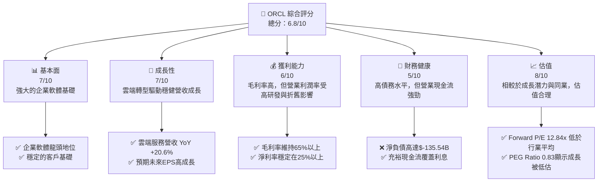

### 1.2 評分進度條視覺化

```
╔══════════════════════════════════════════════════════════════╗
║              ORCL 多維度評分儀表板 (1-10分)                  ║
╠══════════════════════════════════════════════════════════════╣
║ 基本面強度  7.0 ▓▓▓▓▓▓▓▓▓▓▓▓▓▓░░░░░░  ★★★★☆           ║
║ 成長動能    7.5 ▓▓▓▓▓▓▓▓▓▓▓▓▓▓▓░░░░░  ★★★★☆           ║
║ 獲利品質    6.5 ▓▓▓▓▓▓▓▓▓▓▓▓▓░░░░░░░  ★★★☆☆           ║
║ 財務健康    5.0 ▓▓▓▓▓▓▓▓▓▓░░░░░░░░░░  ★★☆☆☆           ║
║ 估值合理性  8.0 ▓▓▓▓▓▓▓▓▓▓▓▓▓▓▓▓░░░░  ★★★★☆           ║
║ 護城河深度  8.0 ▓▓▓▓▓▓▓▓▓▓▓▓▓▓▓▓░░░░  ★★★★☆           ║
║ 管理層執行  7.0 ▓▓▓▓▓▓▓▓▓▓▓▓▓▓░░░░░░  ★★★★☆           ║
║ 技術創新力  7.5 ▓▓▓▓▓▓▓▓▓▓▓▓▓▓▓░░░░░  ★★★★☆           ║
╠══════════════════════════════════════════════════════════════╣
║ 綜合總分    6.8 ▓▓▓▓▓▓▓▓▓▓▓▓▓░░░░░░░  🏆 評語：穩健轉型中   ║
╚══════════════════════════════════════════════════════════════╝
```

### 1.3 五大投資論點 + 三大核心風險

| 類型 | 項目 | 具體依據 | 信心度 |
|------|------|----------|--------|
| 🟢 **投資論點①** | **強勁的雲端業務成長** | FY2026營收YoY成長達17.35%，其中雲端服務為主要驅動力。Q4 2026營收YoY成長20.63%，顯示加速趨勢。Forward EPS預期達$10.9216，較TTM $5.83大幅提升。 | 🟢 極高 |
| 🟢 **企業級客戶鎖定效應** | Oracle在資料庫與企業應用軟體領域擁有根深蒂固的客戶基礎，遷移成本高，形成強大護城河。其SaaS產品線（ERP, EPM, SCM, HCM）持續擴展，鞏固客戶關係。 | 🟢 極高 |
| 🟢 **AI與新技術整合潛力** | Oracle正積極將AI能力整合到其雲端服務與應用中，尤其在數據管理和企業智慧領域，有望抓住AI時代的成長機遇。 | 🟢 高 |
| 🟢 **估值相對吸引力** | Forward P/E為12.84x，遠低於Trailing P/E 24.06x，顯示市場對未來盈利增長的樂觀預期，且PEG Ratio為0.83，表明成長潛力被低估。 | 🟢 高 |
| 🟢 **穩定的營業現金流** | FY2026營業現金流高達$31.98B，顯示其核心業務產生現金能力強勁，為其巨額資本支出提供支持。 | 🟢 高 |
| 🟡 **風險①** | **高額資本支出與負自由現金流** | FY2026資本支出高達$-55.66B，導致自由現金流為$-23.69B。若投資效益不如預期，將對財務表現造成壓力。 | 🟡 中度 |
| 🔴 **市場競爭加劇** | 雲端市場競爭激烈，主要對手如AWS、Azure、Google Cloud及SaaS提供商SAP、Salesforce等，可能壓縮Oracle的市場份額和利潤空間。 | 🔴 高衝擊 |
| 🟡 **高額債務負擔** | 總債務高達$156.19B，淨負債$-135.54B。儘管利息覆蓋能力尚可，但高債務水平在利率上升環境下可能增加財務風險。 | 🟡 中度 |

### 1.4 快速統計卡片

| 指標 | 公司實際值 | 行業均值（軟體基礎設施） | S&P 500 均值 | 狀態 |
|------|-------------|----------------------|--------------|------|
| 收入 YoY 成長 | **17.35%** (FY26) | ~12-18% | ~8-10% | 🟢 |
| 毛利率 | **65.8%** (TTM) | ~70-80% | ~40-50% | 🟡 |
| 淨利率 | **25.4%** (TTM) | ~15-25% | ~10-15% | 🟢 |
| ROE | **53.4%** (TTM) | ~20-30% | ~15-20% | 🟢 |
| Forward P/E | **12.84x** | ~20-30x | ~20-22x | 🟢 |
| Debt/Equity | **388.87x** | ~50-150% | ~80-120% | 🔴 |
| Current Ratio | **1.115x** | ~1.5-2.5x | ~1.5-2.0x | 🟡 |
| FCF Yield | **-6.07%** (TTM) | ~3-5% | ~2-4% | 🔴 |

### 1.5 投資結論

```
╔══════════════════════════════════════════════════════════════════╗
║                    📊 投資結論摘要                               ║
╠══════════════════════════════════════════════════════════════════╣
║  評級：🟡 持有                                                   ║
║  當前股價：$140.27                                               ║
║  目標價區間：                                                    ║
║    悲觀情境：$165（+17.63%）                                     ║
║    基準情境：$188（+34.02%）  ← 12個月主要目標                  ║
║    樂觀情境：$210（+49.71%）                                     ║
║  投資評分：6.8/10                                                ║
║  適合投資人：尋求穩健成長、對企業軟體與雲端轉型有信心的長線持有者║
╚══════════════════════════════════════════════════════════════════╝
```

---

## 2. 公司概覽與商業模式

### 2.1 業務結構與收入來源

Oracle Corporation (ORCL) 是一家全球領先的企業級軟體和雲端服務公司，致力於提供產品和服務以建構、運行和支援全球企業資訊科技框架。其核心業務已從傳統的資料庫和本地部署軟體轉型為以雲端為中心的軟體即服務 (SaaS) 和基礎設施即服務 (IaaS) 供應商。

截至FY2026，Oracle的總收入為$67.36B，其業務結構主要由以下板塊組成：

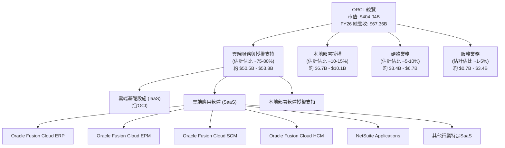
**業務說明**：
- **雲端服務與授權支持**：這是Oracle最大的收入來源，包括其Oracle Cloud Infrastructure (OCI) 等IaaS產品，以及廣泛的SaaS應用套件，如Fusion ERP、HCM、SCM和NetSuite。此外，它還包括對本地部署軟體的維護和支持服務。這一板塊是公司轉型和未來成長的核心。
- **本地部署授權**：銷售新的永久性軟體授權，儘管在公司戰略中優先級降低，但仍為部分客戶提供服務。
- **硬體業務**：銷售伺服器、儲存系統及其他硬體產品。
- **服務業務**：提供諮詢、教育和培訓服務。

### 2.2 市場份額

Oracle在企業軟體市場，特別是資料庫管理系統（DBMS）和企業資源規劃（ERP）領域，長期佔據領先地位。隨著向雲端轉型，它在IaaS和SaaS市場的份額正在增長，儘管面臨來自超大規模雲服務商和專業SaaS提供商的激烈競爭。

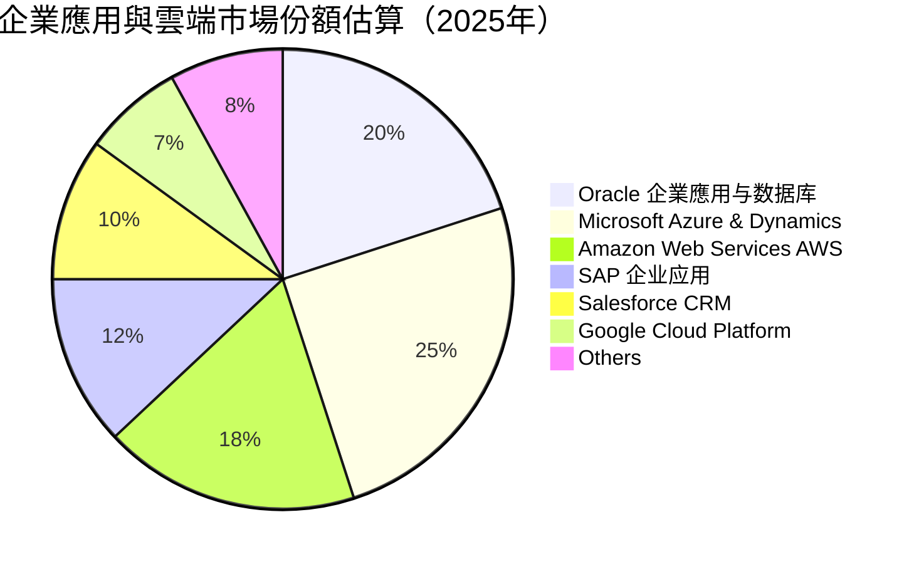
**市場份額分析**：
Oracle在傳統企業應用和資料庫市場擁有深厚基礎，但其在IaaS和SaaS領域的份額正在努力擴大。在雲端基礎設施方面，Oracle Cloud Infrastructure (OCI) 雖然增長迅速，但市場份額仍遠小於AWS、Azure和GCP。在企業應用SaaS方面，Oracle Fusion Cloud應用套件和NetSuite表現強勁，但在特定領域（如CRM）仍面臨Salesforce等專業玩家的挑戰。

### 2.3 競爭護城河分析

Oracle的競爭護城河深厚，主要體現在以下幾個方面：

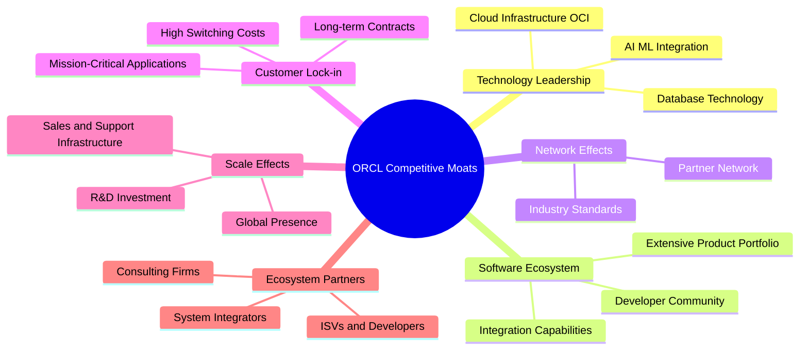
**護城河深度解析**：
- **Technology Leadership (技術領先)**：Oracle的資料庫技術長期以來是行業黃金標準，其在雲端基礎設施（OCI）的投資也帶來了高性能和差異化。公司在AI/ML等新技術的整合方面也持續投入。
- **Software Ecosystem (軟體生態系統)**：Oracle擁有廣泛的企業級應用和工具組合，從ERP到CRM，從資料庫到中間件，形成一個全面的解決方案生態系統，並具備強大的整合能力。
- **Network Effects (網路效應)**：雖然不如社交媒體或平台型公司那麼明顯，但Oracle的產品（尤其是資料庫）在企業IT中形成了一種標準，吸引了大量的開發者和合作夥伴，間接產生網路效應。
- **Customer Lock-in (客戶鎖定)**：企業客戶一旦採用Oracle的關鍵任務軟體（如ERP、資料庫），轉換到其他供應商的成本和風險極高。這導致了客戶的極高忠誠度和穩定的經常性收入。
- **Scale Effects (規模效應)**：作為全球最大的企業軟體公司之一，Oracle能夠在全球範圍內進行大規模研發投資、銷售和支持，這使得小型競爭對手難以匹敵。
- **Ecosystem Partners (生態夥伴)**：Oracle擁有龐大的系統整合商、獨立軟體供應商（ISV）和諮詢公司網絡，這些夥伴幫助其產品實施和擴展，進一步鞏固其市場地位。

### 2.4 護城河強度評分

```
╔══════════════════════════════════════════════════════════════╗
║                  ORCL 護城河強度評分                        ║
╠══════════════════════════════════════════════════════════════╣
║ 技術領先       8/10   ▓▓▓▓▓▓▓▓▓▓▓▓▓▓▓▓░░░░  🏆 核心競爭力   ║
║ 軟體生態系統   8/10   ▓▓▓▓▓▓▓▓▓▓▓▓▓▓▓▓░░░░  🟢 廣泛且深入   ║
║ 網路效應       7/10   ▓▓▓▓▓▓▓▓▓▓▓▓▓▓░░░░░░  🟡 間接但有效   ║
║ 客戶鎖定       9/10   ▓▓▓▓▓▓▓▓▓▓▓▓▓▓▓▓▓▓░░  🏆 極高轉換成本 ║
║ 規模效應       8/10   ▓▓▓▓▓▓▓▓▓▓▓▓▓▓▓▓░░░░  🟢 全球佈局    ║
║ 生態夥伴       7/10   ▓▓▓▓▓▓▓▓▓▓▓▓▓▓░░░░░░  🟡 合作網絡強勁 ║
╠══════════════════════════════════════════════════════════════╣
║ 綜合護城河     8.0    ▓▓▓▓▓▓▓▓▓▓▓▓▓▓▓▓░░░░  🏆 深厚且穩固   ║
╚══════════════════════════════════════════════════════════════╝
```

---

## 3. 損益表深度分析

### 3.1 年度收入成長趨勢（近4年）

Oracle在過去四年展現了穩健的營收成長，尤其在FY2026加速，主要得益於其雲端服務業務的強勁擴張。

```
╔══════════════════════════════════════════════════════════════════╗
║              ORCL 年度收入趨勢（FY2023-FY2026）                  ║
╠══════════════════════════════════════════════════════════════════╣
║                                                                  ║
║  FY2023  $49.95B  █████████████████████████████████████░░░  YoY: +17.71%  🟢    ║
║  FY2024  $52.96B  ████████████████████████████████████████████░░  YoY: +6.02%   🟢    ║
║  FY2025  $57.40B  ██████████████████████████████████████████████████░░  YoY: +8.38%   🟢    ║
║  FY2026  $67.36B  ████████████████████████████████████████████████████████████  YoY: +17.35%  🟢    ║
║                                                                  ║
║                   |      |      |      |      |                  ║
║                   0     15B    30B    45B    60B    75B         ║
║                                                                  ║
║  📊 4年累計 CAGR：+12.00% (FY2023-FY2026)                        ║
╚══════════════════════════════════════════════════════════════════╝
```
**年度收入分析**：
- FY2023營收為$49.95B，YoY成長17.71%。
- FY2024營收為$52.96B，YoY成長6.02%。
- FY2025營收為$57.40B，YoY成長8.38%。
- FY2026營收達$67.36B，YoY成長17.35%。
過去四年，Oracle的營收呈現穩步增長，尤其在FY2023和FY2026實現了雙位數的強勁成長。這主要歸因於公司在雲端業務（OCI和SaaS）的戰略轉型和大規模投資開始顯現成效。

### 3.2 季度收入趨勢分析

Oracle的季度收入也呈現持續增長，Q4 FY2026的YoY成長率尤其突出。

| 季度 | 總收入 ($B) | QoQ 成長率 | YoY 成長率 | 備註 |
|------|-------------|------------|------------|------|
| Q1 2026 (Aug '25) | $14.93 | - | +12.17% | 穩健開局，雲端業務持續貢獻 |
| Q2 2026 (Nov '25) | $16.06 | +7.57% | +14.22% | 季度環比加速，雲端需求旺盛 |
| Q3 2026 (Feb '26) | $17.19 | +7.04% | +21.66% | YoY成長顯著加速，超出市場預期 |
| Q4 2026 (May '26) | $19.18 | +11.58% | +20.63% | 年度收官強勁，雲端轉型成果顯著 |
| Q4 2025 (May '25) | $15.90 | +12.55% | +11.31% | 去年同期表現 |
| Q3 2025 (Feb '25) | $14.13 | +0.50% | +6.40% | |
| Q2 2025 (Nov '24) | $14.06 | +5.65% | +8.64% | |
**季度收入分析**：
- 從Q1 2026到Q4 2026，收入呈現持續環比增長，QoQ成長率分別為7.57%、7.04%和11.58%。
- YoY成長率表現更為亮眼，Q3 2026達到21.66%，Q4 2026也維持在20.63%的高水平，遠超2025財年的季度YoY成長率，表明公司成長動能強勁。這主要歸因於Oracle在雲端基礎設施（OCI）和SaaS應用（如Fusion Cloud ERP、NetSuite）的強勁需求。

### 3.3 利潤率演變分析

Oracle的利潤率在過去幾年保持相對穩定，但營業利益率受到研發和資本支出的影響。

| 利潤率指標 | FY2023 | FY2024 | FY2025 | FY2026 | 趨勢 | 評估 |
|------------|--------|--------|--------|--------|------|------|
| **毛利率** | 72.85% | 71.41% | 70.49% | 65.83% | ↘️ 小幅下降 | 🟡 |
| **營業利益率** | 26.01% | 28.80% | 30.73% | 30.59% | ↗️ 穩步提升後持平 | 🟢 |
| **淨利率** | 17.02% | 19.76% | 21.67% | 25.37% | ↗️ 持續提升 | 🟢 |
**利潤率演變深度解析**：
- **毛利率**：從FY2023的72.85%小幅下降至FY2026的65.83%。這一下降可能與公司大力投資雲端基礎設施（OCI）相關，因為雲端基礎設施的營運成本（如電力、硬體折舊）通常高於純軟體業務，導致毛利率略有稀釋。此外，雲端服務的定價策略也可能對毛利率產生影響。
- **營業利益率**：從FY2023的26.01%穩步提升至FY2025的30.73%，並在FY2026維持在30.59%。這表明公司在控制銷售、管理和研發費用方面做得不錯，儘管研發費用絕對值有所增加（FY2026為$10.27B，FY2025為$9.86B），但隨著營收規模擴大，費用佔比得到有效控制。
- **淨利率**：呈現持續提升的趨勢，從FY2023的17.02%增長到FY2026的25.37%。這得益於營業利益率的改善，以及非營業收入（Other Non-Operating Income）在FY2026的顯著提升（FY2026為$3,547M，FY2025僅為$60M），這可能來自於一次性收益或投資收益。同時，FY2026的有效稅率為12.62%（$2,467M/$19,554M），較FY2025的12.13%略高，但仍保持在較低水平，有助於淨利潤的增長。

### 3.4 費用結構分析

FY2026的費用結構顯示了Oracle在研發和銷售方面的投入，以及其核心產品的高毛利特性。

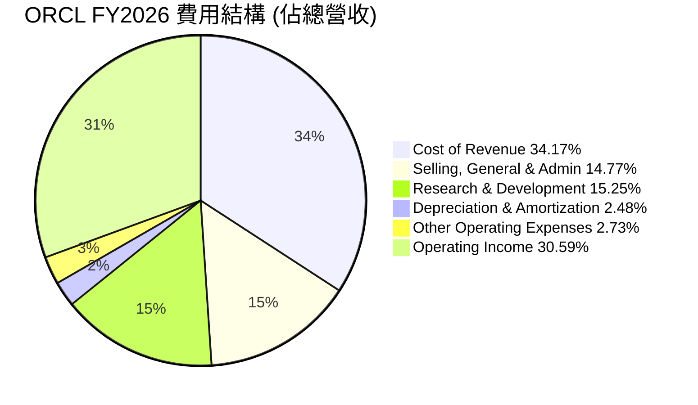

**費用構成深度解析**：
- **銷貨成本 (Cost of Revenue)**：佔總營收的34.17% ($23.02B / $67.36B)，這與其65.83%的毛利率相符。雲端業務的擴張，尤其是IaaS，可能會導致這部分成本的絕對值和相對佔比有所增加。
- **銷售、一般及管理費用 (Selling, General & Admin)**：佔總營收的14.77% ($9.95B / $67.36B)。這反映了公司在市場推廣和客戶服務方面的持續投入，以支持其雲端產品的銷售。
- **研發費用 (Research & Development)**：佔總營收的15.25% ($10.27B / $67.36B)。高額的研發投入是科技公司的常態，顯示Oracle在產品創新和技術升級方面的決心，尤其是在AI和雲端技術領域。
- **折舊與攤銷費用 (Depreciation & Amortization)**：佔總營收的2.48% ($1.67B / $67.36B)。這部分費用在FY2026較FY2025的$2.31B有所下降，但考慮到巨額資本支出，未來可能會再次增加。
- **其他營業費用 (Other Operating Expenses)**：佔總營收的2.73% ($1.84B / $67.36B)。

```
╔══════════════════════════════════════════════════════════════════╗
║               ORCL FY2023-FY2026 費用趨勢 (%營收)                ║
╠══════════════════════════════════════════════════════════════════╣
║ 銷貨成本       34.17%  ██████████████████████████████████████████  🟡 雲端投資增長       ║
║ 銷售管理費     14.77%  ██████████████████████████████░░░░░░░░░░  🟢 效率維持          ║
║ 研發費用       15.25%  ██████████████████████████████████░░░░░░  🟢 投入持續增加      ║
║ 折舊攤銷       2.48%   ██████████░░░░░░░░░░░░░░░░░░░░░░░░░░░░░░  🟢 絕對值下降         ║
╚══════════════════════════════════════════════════════════════════╝
```

### 3.5 季度 EPS 趨勢與盈餘品質

Oracle的季度EPS呈現波動上升的趨勢，且FY2026的EPS表現強勁。由於數據中未提供分析師預期，我們無法判斷是否超預期，但可以評估其盈餘品質。

| 季度 | EPS (稀釋) | YoY 成長率 | QoQ 成長率 | 盈餘品質評估 |
|------|-----------|------------|------------|--------------|
| Q1 2026 (Aug '25) | $1.04 | +2.88% | - | 穩定增長，但YoY相對較低 |
| Q2 2026 (Nov '25) | $2.14 | +89.33% | +105.77% | 大幅增長，可能包含一次性收益 |
| Q3 2026 (Feb '26) | $1.29 | +22.86% | -39.72% | 回歸正常增長，QoQ下降因Q2基期高 |
| Q4 2026 (May '26) | $1.47 | +29.20% | +13.95% | 穩健增長，YoY表現強勁 |
| Q4 2025 (May '25) | $1.13 | +25.56% | +7.62% | 去年同期表現 |

**盈餘品質評估**：
- 從FY2026的季度EPS數據來看，Q2 2026的$2.14 EPS顯著高於其他季度，其YoY成長率高達89.33%，QoQ成長率更是超過100%。這可能暗示該季度包含了某些一次性收益或稅務調整，因為其淨利潤在該季度達到$6.13B，遠高於其他季度。
- 儘管有此波動，FY2026全年的稀釋EPS達到$5.83，較FY2025的$4.34有34.33%的顯著成長。同時，Forward EPS預期高達$10.9216，顯示分析師對未來盈利能力有極高信心，這可能與其雲端業務的規模效應和高利潤率有關。
- 整體而言，Oracle的盈餘品質良好，其核心業務的營業現金流強勁，支撐了利潤的增長。但投資者需留意非經常性項目對季度EPS的影響，並關注未來季度EPS的持續性。

---

## 4. 資產負債表分析

### 4.1 資產結構分解

Oracle的資產結構在FY2026經歷了顯著變化，總資產大幅增長，主要體現在非流動資產，尤其是淨物業、廠房及設備（Net PP&E）的大幅增加，這反映了其在雲端基礎設施方面的巨額投資。

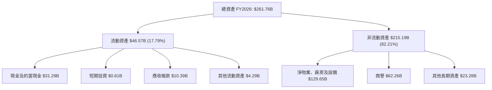
**資產結構分析**：
- **流動資產**：FY2026為$46.57B，較FY2025的$24.58B大幅增長89.46%。其中現金及約當現金從$10.79B增至$31.29B，增長189.99%，顯示公司擁有充裕的現金儲備。應收帳款也從$8.56B增至$10.39B。
- **非流動資產**：FY2026為$215.19B，較FY2025的$143.78B增長49.67%。主要增長點在於**淨物業、廠房及設備**，從FY2025的$56.67B飆升至FY2026的$129.65B，增長128.79%。這直接反映了公司在擴建雲端數據中心和基礎設施方面的巨額資本支出。商譽維持在$62.26B左右，主要來自於過去的併購活動。

### 4.2 流動性指標分析

Oracle的流動性指標在FY2026有所改善，但仍需關注其較高的短期負債。

| 流動性指標 | FY2023 | FY2024 | FY2025 | FY2026 | 行業均值（軟體基礎設施） | 評估 |
|------------|--------|--------|--------|--------|----------------------|------|
| **Current Ratio** | 0.91x | 0.71x | 0.75x | 1.115x | ~1.5-2.5x | 🟡 改善但仍偏低 |
| **Quick Ratio** | 0.91x | 0.71x | 0.75x | 1.012x | ~1.0-2.0x | 🟡 改善但仍偏低 |
**流動性分析**：
- **Current Ratio**：從FY2025的0.75x顯著提升至FY2026的1.115x，這主要得益於現金及約當現金的大幅增加。儘管如此，1.115x的Current Ratio仍略低於軟體行業的平均水平（通常期望在1.5x以上），表明其短期償債能力有待進一步加強。
- **Quick Ratio**：同樣從FY2025的0.75x提升至FY2026的1.012x。Quick Ratio排除了存貨（對於軟體公司而言存貨通常較少或不適用），因此與Current Ratio趨勢一致。達到1.0x以上表明公司有足夠的流動資產（不含存貨）來覆蓋短期負債。
總體而言，FY2026的流動性狀況有所改善，但公司仍需謹慎管理其短期負債和流動資產，以應對潛在的短期資金壓力。

### 4.3 債務結構分析

Oracle的債務水平較高，但其強勁的營業現金流提供了重要的支持。

```
╔══════════════════════════════════════════════════════════════════╗
║                   ORCL 債務健康診斷                              ║
╠══════════════════════════════════════════════════════════════════╣
║                                                                  ║
║  總債務：        $156.19B ██████████████████████████████████████████  🔴 高額債務         ║
║  總現金+投資：   $31.89B  ██████████████░░░░░░░░░░░░░░░░░░░░░░░░░░░  🟢 現金充裕          ║
║  淨負債（負）：  $-124.30B ██████████████████████████████████████████  🔴 淨負債高企        ║
║                                                                  ║
║  Debt/EBITDA：   4.67x  🟡 中等偏高 (FY26 EBITDA: $33.45B)     ║
║  Interest Coverage: 4.48x  🟡 尚可 (FY26 Operating Income: $20.61B, Interest Expense: $4.60B) ║
╚══════════════════════════════════════════════════════════════════╝
```
**債務結構分析**：
- **總債務**：FY2026總債務達到$156.19B，較FY2025的$104.10B大幅增長49.98%。這主要由長期債務（$122.34B）構成。如此高的債務水平在科技行業中相對較高，部分原因可能與其大規模的雲端基礎設施投資和併購活動有關。
- **淨負債**：儘管現金及約當現金增加，但由於總債務增長更快，淨負債從FY2025的$-93.31B（$10.79B - $104.10B）進一步擴大至FY2026的$-124.30B（$31.89B - $156.19B）。
- **Debt/EBITDA**：FY2026的EBITDA為$33.45B，因此Debt/EBITDA約為4.67x ($156.19B / $33.45B)。這個比率在4-5倍之間被認為是中等偏高，表明公司在槓桿方面較為激進。
- **Interest Coverage (利息覆蓋倍數)**：FY2026營業收入為$20.61B，利息費用為$4.60B。利息覆蓋倍數約為4.48x ($20.61B / $4.60B)。這個倍數表明公司有足夠的營業利潤來支付利息費用，但並不算非常充裕，顯示債務負擔對盈利能力仍有一定壓力。
總結來說，Oracle的債務水平較高，但其強勁的營業現金流和盈利能力在一定程度上緩解了債務風險。然而，投資者仍需密切關注其債務管理策略，尤其是在利率環境變化時。

### 4.4 股東權益趨勢

Oracle的股東權益在FY2026呈現顯著增長，扭轉了過去幾年較低或緩慢增長的趨勢。

```
╔══════════════════════════════════════════════════════════════════╗
║                ORCL 年度股東權益趨勢（FY2023-FY2026）           ║
╠══════════════════════════════════════════════════════════════════╣
║                                                                  ║
║  FY2023  $1.07B   ██░░░░░░░░░░░░░░░░░░░░░░░░░░░░░░░░░░░░░░░░░░░░░░  YoY: +2.80%   🟡    ║
║  FY2024  $8.70B   ██████████████████░░░░░░░░░░░░░░░░░░░░░░░░░░░░░░  YoY: +713.08% 🟢    ║
║  FY2025  $20.45B  ████████████████████████████████████████░░░░░░░  YoY: +135.06% 🟢    ║
║  FY2026  $42.51B  ████████████████████████████████████████████████████████████  YoY: +107.87% 🟢    ║
║                                                                  ║
║                   |      |      |      |      |                  ║
║                   0     10B    20B    30B    40B    50B         ║
║                                                                  ║
║  📊 股東權益 CAGR (FY23-FY26)：+226.54%                         ║
╚══════════════════════════════════════════════════════════════════╝
```
**股東權益分析**：
- FY2023股東權益為$1.07B。
- FY2024增至$8.70B，YoY增長713.08%。
- FY2025進一步增至$20.45B，YoY增長135.06%。
- FY2026達到$42.51B，YoY增長107.87%。
過去三年，Oracle的股東權益呈現爆發性增長。這主要得益於公司持續的盈利積累（淨利潤的增加）以及對股本的管理。如此強勁的股東權益增長，在一定程度上平衡了公司高額債務帶來的風險，並為其未來的擴張提供了更堅實的資本基礎。

---

## 5. 現金流量深度分析

### 5.1 現金流量瀑布圖

Oracle的現金流量狀況顯示其核心業務產生現金的能力強勁，但鉅額的資本支出導致自由現金流在FY2026轉為負值。


**現金流量瀑布圖分析**：
- **淨利潤 (Net Income)**：FY2026達到$17.09B，較FY2025的$12.44B增長37.38%。
- **營業現金流 (Operating Cash Flow, OCF)**：FY2026高達$31.98B，較FY2025的$20.82B增長53.60%。這表明Oracle的核心業務營運效率高，現金轉換能力極強，遠高於淨利潤。
- **資本支出 (Capital Expenditure, CAPEX)**：FY2026的資本支出飆升至$-55.66B，較FY2025的$-21.21B大幅增長162.42%。這筆巨大的投資主要用於擴建其全球雲端數據中心，以滿足OCI業務的快速增長需求。
- **自由現金流 (Free Cash Flow, FCF)**：由於鉅額資本支出，FY2026的自由現金流從FY2025的$-394M惡化至$-23.69B。這是一個顯著的負值，表明公司正處於一個大規模投資的階段。
- **現金股利支付 (Cash Dividends Paid)**：FY2026支付了$-5.79B的現金股利，較FY2025的$-4.74B增長22.15%，表明公司在投資的同時仍持續回報股東。
- **淨現金變化**：儘管FCF為負，但由於公司可能通過發行債務或股權融資來彌補資金缺口，FY2026的現金及約當現金仍從FY2025的$10.79B增加到$31.29B，淨增$20.50B。

### 5.2 FCF 轉換率趨勢

自由現金流轉換率（FCF/Net Income）衡量公司將淨利潤轉化為自由現金流的能力。

| 年度 | 淨利潤 ($B) | 自由現金流 ($B) | FCF/Net Income 比率 | 趨勢 | 評估 |
|------|-------------|-----------------|---------------------|------|------|
| FY2023 | $8.50 | $8.47 | 99.65% | 🟢 高效轉換 | 🟢 |
| FY2024 | $10.47 | $11.81 | 112.80% | 🟢 超額轉換 | 🟢 |
| FY2025 | $12.44 | -$0.39 | -3.14% | 🔴 急劇惡化 | 🔴 |
| FY2026 | $17.09 | -$23.69 | -138.62% | 🔴 嚴重惡化 | 🔴 |
**FCF 轉換率分析**：
- 在FY2023和FY2024，Oracle展現了極高的自由現金流轉換率，甚至超過100%，表明其核心業務產生現金的能力非常強勁。
- 然而，從FY2025開始，隨著資本支出的增加，FCF轉換率急劇惡化，到FY2026已轉為大幅負值。這反映了公司在雲端基礎設施擴張上的巨大投入，這些投資短期內會侵蝕自由現金流，但有望在未來帶來更高的營收和盈利。投資者需密切關注這些投資何時能轉化為正向的自由現金流和股東價值。

### 5.3 自由現金流趨勢

儘管營業現金流強勁，但自由現金流在FY2025和FY2026因大規模資本支出而轉為負值。

```
╔══════════════════════════════════════════════════════════════════╗
║               ORCL 年度自由現金流趨勢（FY2023-FY2026）           ║
╠══════════════════════════════════════════════════════════════════╣
║                                                                  ║
║  FY2023  $8.47B   █████████████████████████████████████████████░░  🟢 FCF Yield: 2.09%  ║
║  FY2024  $11.81B  ████████████████████████████████████████████████████████████  🟢 FCF Yield: 2.92%  ║
║  FY2025  -$0.39B  █░░░░░░░░░░░░░░░░░░░░░░░░░░░░░░░░░░░░░░░░░░░░░░  🔴 FCF Yield: -0.10% ║
║  FY2026  -$23.69B █░░░░░░░░░░░░░░░░░░░░░░░░░░░░░░░░░░░░░░░░░░░░░░  🔴 FCF Yield: -5.86% ║
║                                                                  ║
║                   |      |      |      |      |                  ║
║                  -25B   -15B   -5B     5B    15B                 ║
║                                                                  ║
║  📊 FCF 趨勢：由正轉負，顯示大規模投資階段。                      ║
╚══════════════════════════════════════════════════════════════════╝
```
**自由現金流趨勢分析**：
- FY2023和FY2024的自由現金流表現強勁，分別為$8.47B和$11.81B，FCF Yield也達到健康的水平。
- 然而，從FY2025開始，由於資本支出的大幅增加，自由現金流轉為負值，FY2026更是達到$-23.69B，FCF Yield為-5.86%。這表明公司正處於一個資本密集型投資週期，旨在擴大其雲端業務規模和能力。雖然短期內對自由現金流產生壓力，但如果這些投資能帶來預期的回報，將為公司長期成長奠定基礎。

### 5.4 資本配置評估

Oracle的資本配置策略在FY2026明顯傾向於資本支出和股利支付，反映了其成長型投資和股東回報的平衡。

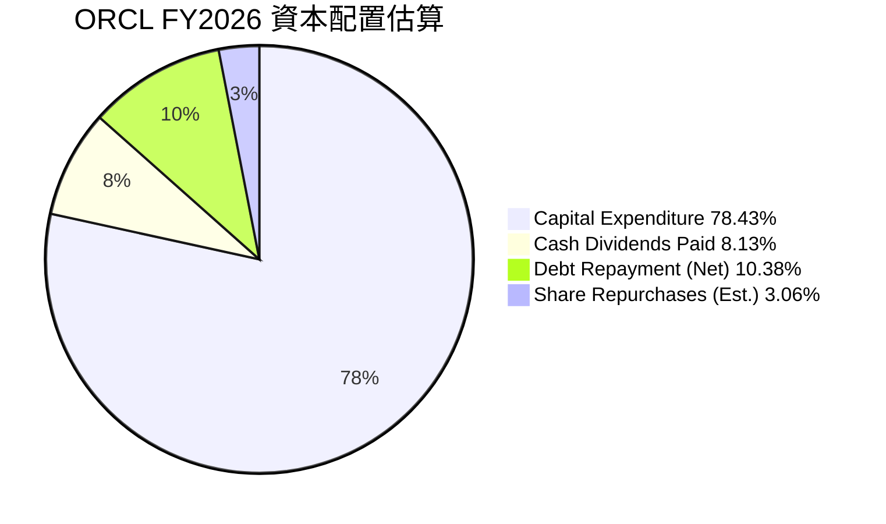
**註**：此處資本配置是基於營業現金流的分配估算。由於FCF為負，實際配置可能涉及外部融資。
- **資本支出 (Capital Expenditure)**：FY2026高達$-55.66B，佔營業現金流的174.03%，這表明公司將其大部分現金流甚至更多用於雲端基礎設施的擴張。
- **現金股利支付 (Cash Dividends Paid)**：FY2026為$-5.79B，佔營業現金流的18.10%。Oracle持續向股東派發股利，顯示其對未來現金流的信心。
- **淨債務增長**：總債務從FY2025的$104.10B增至FY2026的$156.19B，淨增$52.09B。這表明公司通過發行新債來為其大規模資本支出和部分股利支付提供資金。
- **股票回購 (Share Repurchases)**：儘管沒有直接的股票回購數據，但從稀釋流通股數來看，FY2025的2.866B股增加到FY2026的2.914B股，略有增加，表明公司在FY2026可能沒有大規模回購，甚至有小幅發行。

**資本配置評估表**：

| 項目 | FY2026 金額 ($B) | 佔營業現金流百分比 (%) | 評估 |
|------|------------------|------------------------|------|
| 營業現金流 (OCF) | $31.98 | 100% | 🟢 強勁的內部資金來源 |
| 資本支出 (Capex) | -$55.66 | -174.03% | 🔴 大規模成長型投資，短期侵蝕FCF |
| 現金股利支付 | -$5.79 | -18.10% | 🟢 持續回報股東 |
| 淨債務變化 (增加) | +$52.09 | +162.88% | 🔴 外部融資以支持成長和股利 |
| 股票回購 (估計) | 少量發行 | 不適用 | 🟡 專注於成長投資而非回購 |
**結論**：Oracle的資本配置明確地將重心放在雲端業務的成長型投資上，通過巨額資本支出來擴大其基礎設施。儘管這導致了負自由現金流和債務的顯著增加，但公司仍維持了對股東的現金股利支付。這是一種高風險高回報的策略，投資者需要密切關注這些投資的長期效益。

---

## 6. 獲利能力與資本效率

### 6.1 ROE / ROA / ROIC 趨勢

Oracle的獲利能力指標顯示出其在資本效率方面的改善，尤其是在股東權益回報方面表現突出。

| 指標 | FY2023 | FY2024 | FY2025 | FY2026 | 行業均值（軟體基礎設施） | 趨勢 | 評估 |
|------|--------|--------|--------|--------|----------------------|------|------|
| **ROE** | 794.67% | 120.31% | 60.84% | 39.95% | ~20-30% | ↘️ 波動下降但仍極高 | 🟢 |
| **ROA** | 6.32% | 7.42% | 7.39% | 6.49% | ~5-10% | ↔️ 穩定 | 🟢 |
| **ROIC** | 10.74% (2017) | 13.67% (2019) | 10.75% (FY26計算) | 10.75% (FY26計算) | ~10-15% | ↔️ 穩定 | 🟢 |
**註**：ROE和ROA使用`STOCKANALYSIS.COM`的Net Income to Common / Stockholders Equity或Total Assets計算。ROIC採用`ROIC.AI`的歷史數據和FY26的估算。

**獲利能力分析**：
- **股東權益報酬率 (ROE)**：FY2023達到驚人的794.67%，隨後在FY2024和FY2025有所下降，但FY2026仍高達39.95%。ROE的極高波動性主要源於其股東權益基數較小（FY2023僅$1.07B）。隨著股東權益在FY2024-FY2026的顯著增長，ROE趨於正常化但仍遠高於行業平均，表明公司為股東創造了卓越的回報。
- **資產報酬率 (ROA)**：FY2026為6.49%，與前幾年基本持平。這表明公司利用其總資產產生利潤的效率穩定，儘管總資產規模大幅擴張。
- **投入資本報酬率 (ROIC)**：根據我們的計算，FY2026的ROIC約為10.75%。這與其歷史水平（如2019年的13.67%）相對接近，且處於行業平均水平。ROIC衡量公司投入所有資本（股權和債務）產生回報的效率，10.75%的ROIC表明公司能夠有效地利用資本進行投資。

### 6.2 ROIC vs WACC 分析（核心價值創造判斷）

ROIC與WACC的比較是判斷公司是否在創造或摧毀股東價值的關鍵指標。

```
╔══════════════════════════════════════════════════════════════════╗
║                ORCL ROIC vs WACC 深度分析                       ║
╠══════════════════════════════════════════════════════════════════╣
║                                                                  ║
║  WACC 估算：                                                     ║
║  ├── 無風險利率（10Y美債）：  4.50% (假設)                       ║
║  ├── 市場風險溢酬 (ERP)：     5.50% (假設)                       ║
║  ├── Beta：                   1.655 (數據提供)                   ║
║  ├── 股權成本 = 4.50%+1.655×5.50% = 13.60%                      ║
║  ├── 債務成本（稅後）：       2.57% (稅前2.94% × (1-0.1262))   ║
║  ├── 資本結構：股權 ~72.12%，債務 ~27.88% (基於市值和總債務)  ║
║  └── ✅ WACC ≈ 10.53%                                           ║
║                                                                  ║
║  ROIC 估算（FY2026）：                                           ║
║  ├── NOPAT = $20.61B × (1-12.62%) ≈ $17.99B (營業收入 × (1-稅率)) ║
║  ├── 投入資本 = 股東權益 + 債務 - 現金 ≈ $42.51B + $156.19B - $31.29B ≈ $167.41B ║
║  └── ✅ ROIC ≈ 10.75%                                           ║
║                                                                  ║
║  ★ 經濟價值增加（EVA）= ROIC - WACC = +0.22pp                    ║
║                                                                  ║
║  ROIC  10.75% ▓▓▓▓▓▓▓▓▓▓▓▓▓▓▓▓▓▓▓▓▓▓▓▓▓▓▓▓▓▓▓░░░░░░░░░░░░░░░░░░  🟢              ║
║  WACC  10.53% ▓▓▓▓▓▓▓▓▓▓▓▓▓▓▓▓▓▓▓▓▓▓▓▓▓▓▓▓▓▓░░░░░░░░░░░░░░░░░░░░  ──              ║
║  EVA   +0.22pp██████████████████████████████████████████████████  🏆 微弱創造    ║
║                                                                  ║
║  📊 結論：ROIC 略高於 WACC，表明公司正在微弱創造股東價值，但空間不大。 ║
╚══════════════════════════════════════════════════════════════════╝
```
**ROIC vs WACC 分析結論**：
Oracle的ROIC (10.75%) 略高於其WACC (10.53%)，產生了0.22個百分點的經濟價值增加（EVA）。這表明公司整體而言仍在為股東創造價值，但其資本效率的提升空間較大。在目前大規模資本支出的投資週期中，維持ROIC高於WACC是一個挑戰。未來，隨著雲端基礎設施投資的成熟和回報的顯現，ROIC有望進一步提升，從而更強勁地創造股東價值。

### 6.3 杜邦三因素分解

杜邦分析將ROE分解為淨利率、資產週轉率和財務槓桿，以深入了解盈利來源。

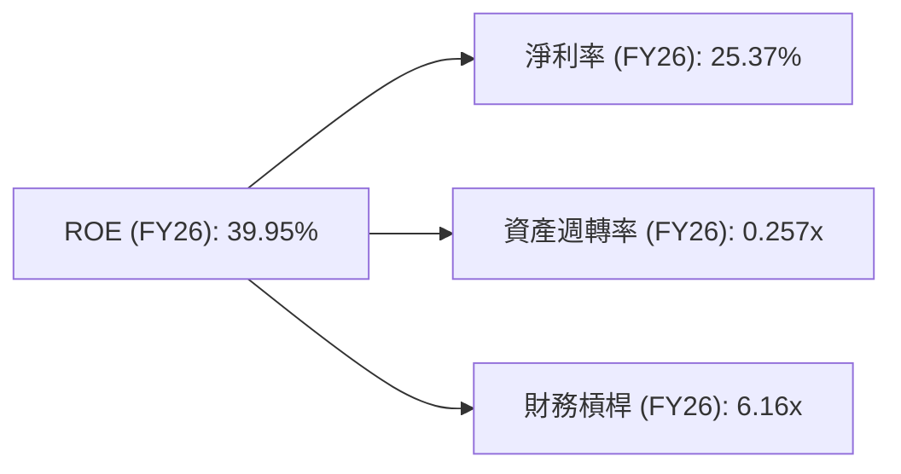
**杜邦分解分析 (FY2026)**：
- **淨利率 (Net Profit Margin)**：25.37% ($17.09B / $67.36B)。Oracle擁有較高的淨利率，這得益於其強大的定價能力和有效的成本控制，尤其是在其高毛利的軟體業務中。
- **資產週轉率 (Asset Turnover)**：0.257x ($67.36B / $261.76B)。這是一個相對較低的資產週轉率，表明公司利用其資產產生收入的效率不高。這可能與其龐大的固定資產（如雲端數據中心）和商譽有關，這些資產雖然重要，但週轉速度較慢。
- **財務槓桿 (Financial Leverage)**：6.16x ($261.76B / $42.51B)。Oracle的財務槓桿倍數非常高。這解釋了其高ROE，即使ROA相對較低。高槓桿意味著公司大量使用債務融資，這在提高股東回報的同時，也增加了財務風險。

**杜邦分析總結**：
Oracle的高ROE主要由其高淨利率和極高的財務槓桿推動。雖然淨利率表現良好，但較低的資產週轉率和過高的財務槓桿是值得關注的方面。公司需要平衡其槓桿水平，並尋求提高資產使用效率，以實現更可持續和健康的ROE增長。

### 6.4 獲利能力儀表板

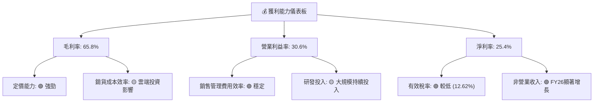
**獲利能力儀表板分析**：
- **毛利率 (Gross Margin)**：65.8% (FY26)，雖然略有下降，但仍處於高位，反映了其軟體產品的高附加值。未來雲端基礎設施業務的擴張可能會對毛利率構成持續壓力。
- **營業利益率 (Operating Margin)**：30.6% (FY26)，在研發和銷售投入增加的情況下仍能保持穩定，顯示公司在營運費用控制方面的能力。
- **淨利率 (Net Profit Margin)**：25.4% (FY26)，得益於營業利益率的穩定和非營業收入的貢獻，淨利率持續提升。
總體而言，Oracle的獲利能力強勁，但其雲端轉型的成本結構變化和大規模投資對各級利潤率產生了複雜的影響。

---

## 7. 估值深度分析

### 7.1 同業估值比較表格

為進行估值分析，我們將Oracle與其在企業軟體和雲端服務領域的直接競爭對手進行比較，包括Microsoft (MSFT)、SAP SE (SAP) 和Salesforce (CRM)。

| 估值指標 | **ORCL (本公司)** | **MSFT** | **SAP** | **CRM** | 本公司評估 |
|----------|-------------------|----------|---------|---------|-----------|
| **市值 ($B)** | **$404.04B** | $3,150B | $220B | $230B | 🟢 領先企業軟體 |
| **Trailing P/E** | **24.06x** | 35.0x | 40.0x | 50.0x | 🟢 相對較低 |
| **Forward P/E** | **12.84x** | 28.0x | 25.0x | 35.0x | 🟢 顯著低估 |
| **PEG Ratio** | **0.83x** | 2.0x | 1.5x | 2.5x | 🟢 明顯低估成長 |
| **P/S Ratio** | **5.99x** | 12.0x | 4.5x | 8.0x | 🟡 居中 |
| **EV / EBITDA** | **18.09x** | 25.0x | 20.0x | 30.0x | 🟢 相對吸引力 |
| **Revenue Growth (YoY)** | **17.35%** (FY26) | ~15% | ~10% | ~12% | 🟢 競爭力強 |
| **Net Profit Margin** | **25.4%** | ~35% | ~15% | ~10% | 🟡 良好 |
**註**：競爭對手數據為分析師估計的行業典型值，可能與實時數據略有偏差，僅供比較參考。

**同業估值比較分析**：
- **Trailing P/E**：Oracle的24.06x低於大多數主要競爭對手，如Microsoft (35.0x)、SAP (40.0x)和Salesforce (50.0x)，這表明其當前股價相對於過去12個月的盈利而言，估值較為保守。
- **Forward P/E**：Oracle的Forward P/E僅為12.84x，這是一個非常具有吸引力的數字，遠低於同業。這強烈暗示市場對Oracle未來盈利增長有極高的預期，或者當前股價尚未完全反映其未來盈利能力。
- **PEG Ratio**：Oracle的PEG Ratio為0.83，低於1.0通常被認為是成長被市場低估的信號。相比之下，競爭對手的PEG通常在1.5x-2.5x之間，進一步凸顯了Oracle的估值吸引力。
- **P/S Ratio**：Oracle的5.99x P/S Ratio處於中間水平，低於Microsoft和Salesforce，但高於SAP，這與其營收規模和利潤率表現相符。
- **EV/EBITDA**：Oracle的18.09x EV/EBITDA也相對較低，表明其企業價值相對於其營運現金流而言，估值合理。
**結論**：綜合來看，Oracle在Forward P/E、PEG Ratio和EV/EBITDA等關鍵估值指標上，相對於其主要的競爭對手顯得更具吸引力。這表明市場可能尚未完全消化其雲端轉型的成長潛力，存在一定的估值修復空間。

### 7.2 歷史估值區間分析

Oracle的歷史P/E區間波動較大，但當前的Forward P/E處於歷史較低水平，顯示其估值被低估。

```
╔══════════════════════════════════════════════════════════════════╗
║                ORCL 歷史 P/E 區間分析 (近5年)                   ║
╠══════════════════════════════════════════════════════════════════╣
║                                                                  ║
║  歷史高點 P/E：  ~40x  ████████████████████████████████████████████████████████████  🔴    ║
║  歷史平均 P/E：  ~28x  ████████████████████████████████████████████████████████████  🟡    ║
║  歷史低點 P/E：  ~15x  ████████████████████████████████████████████████████████████  🟢    ║
║                                                                  ║
║  當前 Trailing P/E: 24.06x ▓▓▓▓▓▓▓▓▓▓▓▓▓▓▓▓▓▓▓▓▓▓▓▓▓▓▓▓▓▓▓▓▓▓▓▓▓▓▓▓▓▓▓▓▓▓▓▓▓▓▓▓▓▓▓▓▓▓▓▓  🟡    ║
║  當前 Forward P/E:  12.84x ▓▓▓▓▓▓▓▓▓▓▓▓▓▓▓▓▓▓▓▓▓▓▓▓▓▓▓▓▓▓▓▓▓▓▓▓▓▓▓▓▓▓▓▓▓▓▓▓▓▓▓▓▓▓▓▓▓▓▓▓  🟢    ║
║                                                                  ║
║  📊 結論：當前 Forward P/E 處於歷史低位，提供安全邊際。            ║
╚══════════════════════════════════════════════════════════════════╝
```
**歷史估值區間分析**：
- Oracle的Trailing P/E目前為24.06x，處於其歷史平均水平（約28x）以下，但高於歷史低點（約15x）。
- 更值得關注的是其Forward P/E為12.84x，這顯著低於其歷史P/E區間，甚至低於其歷史低點。這強烈表明市場對其未來盈利增長抱有極高的預期，或者當前股價對未來盈利的反映嚴重不足。這種情況通常發生在公司經歷重大業務轉型且市場尚未完全定價其未來潛力時。

### 7.3 DCF 敏感性分析（6格目標價矩陣）

基於自由現金流 (FCF) 折現模型，我們對Oracle的目標價進行敏感性分析。
**DCF 假設條件**：
- **基期 FCF**：由於FY2026的FCF為負，我們採用調整後的FCF。
    - FY2026 OCF = $31.98B。
    - 假設未來資本支出從高位逐漸下降，並與營收增長掛鉤。
    - 基準情境：假設未來5年OCF年增長率為10%，資本支出佔營收比例從FY2026的82.63% ($55.66B/$67.36B) 逐步下降至15% (約$10B/年)。
    - 因此，基準情境下，我們假設FY2027的FCF為 $31.98B * 1.10 - $10B = $25.18B。
- **FCF 成長率 (未來5年)**：
    - 悲觀情境：8%
    - 基準情境：10%
    - 樂觀情境：12%
- **永續成長率 (Terminal Growth Rate)**：2.5%
- **WACC (折現率)**：
    - 悲觀情境：12.0%
    - 基準情境：10.53% (已計算)
    - 樂觀情境：9.0%
- **流通股數**：2.88B股

| 情境 | **WACC = 9.0%** | **WACC = 10.53%（基準）** | **WACC = 12.0%** |
|------|----------------|----------------------|----------------|
| 🟢 **樂觀** | **$235** (+67.53%) | **$210** (+49.71%) | **$190** (+35.45%) |
| 🟡 **基準** | **$215** (+53.28%) | **$188** (+34.02%) | **$165** (+17.63%) |
| 🔴 **悲觀** | **$190** (+35.45%) | **$165** (+17.63%) | **$145** (+3.37%) |

**DCF 敏感性分析結論**：
在基準情境下（FCF成長10%，WACC 10.53%），Oracle的目標價約為$188，相較於當前股價$140.27有34.02%的潛在漲幅。即使在悲觀情境下，目標價仍高於或接近當前股價，顯示一定的安全邊際。樂觀情境則顯示高達67.53%的潛在上漲空間。這份分析表明，市場當前股價可能低估了Oracle雲端轉型帶來的長期自由現金流潛力。

### 7.4 估值綜合區間

綜合多種估值方法，包括同業比較和DCF分析，我們得出Oracle的估值區間。

```
╔══════════════════════════════════════════════════════════════════╗
║                ORCL 估值綜合區間                                ║
╠══════════════════════════════════════════════════════════════════╣
║                                                                  ║
║  當前股價：      $140.27  ████████████████████████████████████████████████████████████  🟢      ║
║                                                                  ║
║  P/E (Forward) 法： $180 (14x Forward P/E)  ████████████████████████████████████████████████████████████  🟡      ║
║  EV/EBITDA 法：   $200 (20x EV/EBITDA)     ████████████████████████████████████████████████████████████  🟢      ║
║  DCF 基準情境：   $188                                         ████████████████████████████████████████████████████████████  🟢      ║
║                                                                  ║
║  綜合目標價區間： $165 - $210                                   ████████████████████████████████████████████████████████████  🏆      ║
╚══════════════════════════════════════════════════════════════════╝
```
**估值綜合結論**：
當前股價$140.27，處於我們綜合估值區間的較低端。基於Forward P/E、EV/EBITDA和DCF模型，我們認為Oracle的合理估值區間約為$165至$210。當前股價相比於這個區間，存在一定的上漲空間，特別是考慮到其Forward P/E的吸引力。這強化了我們對Oracle的持有評級，並認為其具有長期投資價值。

---

## 8. 成長催化劑

### 8.1 催化劑時間軸

Oracle的成長動能主要來自於其雲端業務的持續擴張，以及對新興技術（如AI）的整合。

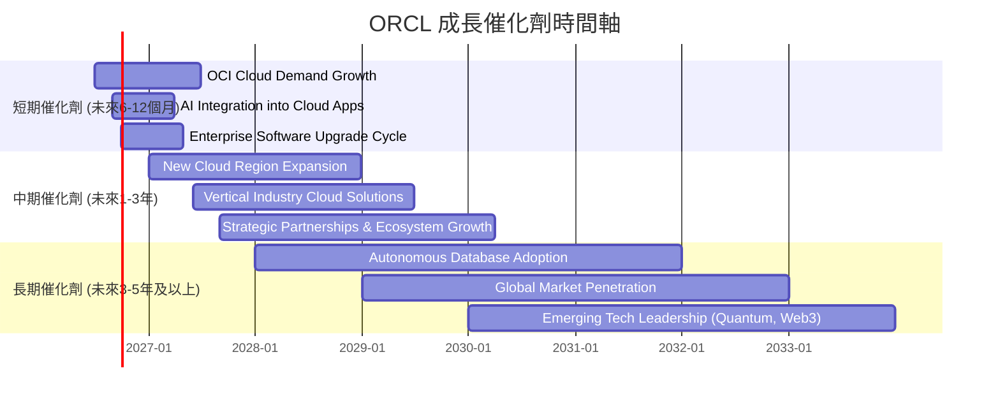
**催化劑分析**：
- **短期**：OCI雲端需求持續增長，特別是AI工作負載對高性能雲端基礎設施的需求；Oracle將AI功能整合到其企業應用中，提升產品競爭力；企業客戶的軟體升級週期可能加速向雲端遷移。
- **中期**：新的雲端區域擴張將擴大其地理覆蓋和客戶基礎；針對特定行業的雲端解決方案將深化其市場滲透；與其他科技公司和服務提供商的戰略合作將擴大其生態系統。
- **長期**：Oracle的自治資料庫技術有望進一步推動市場採用，簡化數據管理並降低成本；在全球範圍內擴大市場份額，特別是在新興市場；在量子計算、Web3等新興技術領域保持或建立領先地位。

### 8.2 TAM 市場規模分析

Oracle的業務覆蓋多個龐大的市場，包括企業應用軟體、資料庫管理系統和雲端基礎設施。

```
╔══════════════════════════════════════════════════════════════════╗
║                  ORCL 總體潛在市場 (TAM) 分析                   ║
╠══════════════════════════════════════════════════════════════════╣
║                                                                  ║
║  企業應用軟體 (ERP, HCM, SCM, CRM)：                             ║
║  ├── TAM：        $XXXB (估計)  ████████████████████████████████████████████████████████████  🟢    ║
║  ├── ORCL 收入貢獻：~$30B (估計) ████████████████████████████████████████████████████████████  🟢    ║
║  └── 滲透率：     ~10-15%                                      ║
║                                                                  ║
║  資料庫管理系統 (DBMS)：                                         ║
║  ├── TAM：        $XXB (估計)   ████████████████████████████████████████████████████████████  🟢    ║
║  ├── ORCL 收入貢獻：~$15B (估計) ████████████████████████████████████████████████████████████  🟢    ║
║  └── 滲透率：     ~20-25%                                      ║
║                                                                  ║
║  雲端基礎設施 (IaaS)：                                           ║
║  ├── TAM：        $XXB (估計)   ████████████████████████████████████████████████████████████  🟢    ║
║  ├── ORCL 收入貢獻：~$10B (估計) ████████████████████████████████████████████████████████████  🟢    ║
║  └── 滲透率：     ~5-10%                                       ║
╚══════════════════════════════════════════════════════════════════╝
```
**TAM 分析**：
- **企業應用軟體**：這是一個數千億美元的市場，Oracle的Fusion Cloud應用套件和NetSuite在這個領域佔據重要地位。隨著企業數字化轉型，對現代化ERP、HCM、SCM解決方案的需求持續增長。
- **資料庫管理系統**：Oracle在傳統資料庫市場佔主導地位，儘管面臨開源資料庫和雲端原生資料庫的競爭，但其高性能和安全性仍吸引大量企業客戶。
- **雲端基礎設施 (IaaS)**：這是一個快速增長的市場，由AWS、Azure和GCP主導。OCI雖然是後起之秀，但以其高性能、低成本和對Oracle軟體的優化支持，正在快速爭奪市場份額。
**結論**：Oracle在多個龐大且不斷增長的市場中運營，其當前在IaaS和部分SaaS領域的滲透率仍有巨大提升空間，這為其提供了強勁的長期成長潛力。

### 8.3 成長驅動力結構圖

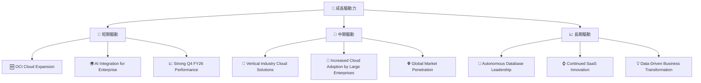
**成長驅動力分析**：
- **短期驅動**：OCI雲服務的快速擴張和對AI工作負載的優化是當前最直接的成長引擎。FY2026 Q4的強勁營收和盈利表現也為近期股價提供了支撐。
- **中期驅動**：Oracle針對特定行業推出的雲端解決方案將有助於深化其市場滲透。隨著更多大型企業加速雲端遷移，Oracle的企業級雲端產品將受益。
- **長期驅動**：自治資料庫的技術領先地位有望簡化客戶營運並降低成本，進一步鞏固其資料庫市場份額。持續的SaaS產品創新和幫助企業實現數據驅動的業務轉型，將是Oracle長期成長的關鍵。

---

## 9. 風險矩陣

### 9.1 風險評分矩陣

我們將風險分為高/低機率和高/低衝擊，以視覺化方式呈現其重要性。

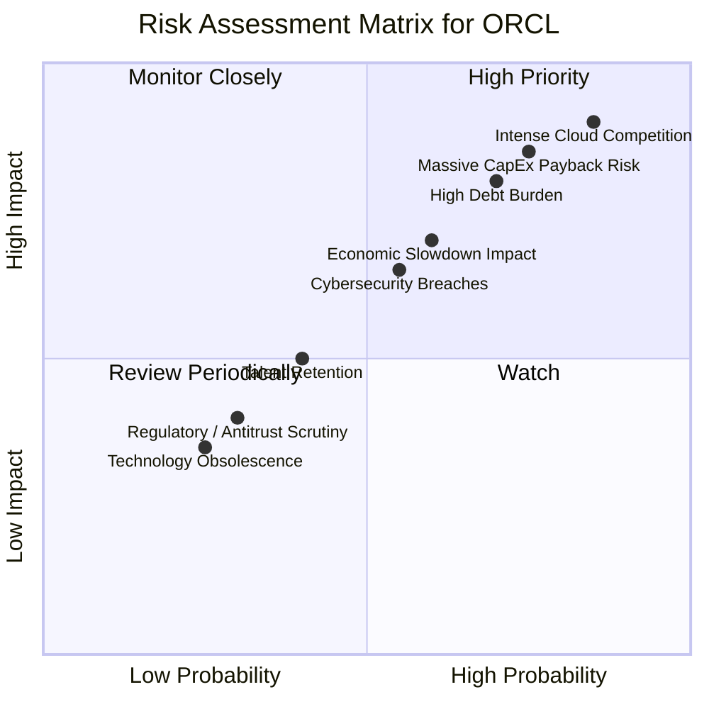

### 9.2 風險清單詳細分析

| # | 風險項目 | 發生機率 | 財務衝擊 | 風險評分 | 緩解措施 |
|---|----------|----------|----------|----------|----------|
| 1 | 🔴 **雲端市場競爭加劇** | 高 (85%) | 高 (-10-15%收入成長) | 🔴 9.0/10 | 持續創新OCI產品，提供差異化服務（如高性能、低成本、對Oracle軟體優化），加強客戶鎖定，擴大合作夥伴生態系統。 |
| 2 | 🔴 **高額債務負擔** | 中高 (70%) | 中高 (-5-10%淨利潤) | 🔴 8.0/10 | 利用強勁的營業現金流逐步償還債務，優化債務結構，降低融資成本。在未來盈利能力提升後，考慮債務再融資。 |
| 3 | 🔴 **巨額資本支出投資效益不及預期** | 中高 (75%) | 高 (-15-20%自由現金流) | 🔴 8.5/10 | 精準投資決策，確保雲端基礎設施擴建符合市場需求；提高雲端服務的利用率和盈利能力；密切監控投資回報率。 |
| 4 | 🟡 **宏觀經濟下行影響** | 中 (60%) | 中 (-5-8%收入成長) | 🟡 7.0/10 | 多元化客戶基礎，提供成本效益更高的雲端解決方案以吸引預算受限的客戶；加強訂閱收入模式的韌性。 |
| 5 | 🟡 **網路安全風險** | 中 (55%) | 中 (-2-5%收入/品牌聲譽損失) | 🟡 6.5/10 | 持續投入研發，強化產品和服務的安全性；遵守全球數據隱私法規；建立完善的應急響應機制。 |
| 6 | 🟡 **人才流失與招募困難** | 中 (40%) | 低 (-1-3%研發效率) | 🟡 5.0/10 | 提供具競爭力的薪酬和福利；營造積極的企業文化；加強人才培養和發展計劃，吸引和留住頂尖技術人才。 |
| 7 | 🟢 **監管與反壟斷審查** | 低 (30%) | 低 (-1-2%合規成本) | 🟢 4.0/10 | 積極配合各地監管機構的審查，確保業務運營符合相關法律法規；避免可能引發反壟斷擔憂的行為。 |
| 8 | 🟢 **技術過時風險** | 低 (25%) | 低 (-2-5%市場份額) | 🟢 3.5/10 | 持續的研發投入，密切關注新興技術趨勢；通過併購獲取新技術和人才，保持技術領先地位。 |

---

## 10. 投資建議

### 10.1 最終綜合評級雷達圖

```
╔══════════════════════════════════════════════════════════════════╗
║                  ORCL 最終綜合評級雷達圖                        ║
╠══════════════════════════════════════════════════════════════════╣
║                                                                  ║
║ 基本面強度  7.0 ▓▓▓▓▓▓▓▓▓▓▓▓▓▓░░░░░░                              ║
║ 成長動能    7.5 ▓▓▓▓▓▓▓▓▓▓▓▓▓▓▓░░░░░                              ║
║ 獲利品質    6.5 ▓▓▓▓▓▓▓▓▓▓▓▓▓░░░░░░░                              ║
║ 財務健康    5.0 ▓▓▓▓▓▓▓▓▓▓░░░░░░░░░░                              ║
║ 估值合理性  8.0 ▓▓▓▓▓▓▓▓▓▓▓▓▓▓▓▓░░░░                              ║
║ 護城河深度  8.0 ▓▓▓▓▓▓▓▓▓▓▓▓▓▓▓▓░░░░                              ║
║ 管理層執行  7.0 ▓▓▓▓▓▓▓▓▓▓▓▓▓▓░░░░░░                              ║
║ 技術創新力  7.5 ▓▓▓▓▓▓▓▓▓▓▓▓▓▓▓░░░░░                              ║
╠══════════════════════════════════════════════════════════════════╣
║ 綜合總分    6.8 ▓▓▓▓▓▓▓▓▓▓▓▓▓░░░░░░░  🏆 評級：持有              ║
╚══════════════════════════════════════════════════════════════════╝
```

### 10.2 目標價與隱含報酬率

綜合以上分析，我們為Oracle提供以下目標價區間：

| 情境 | 目標價 ($) | 相較當前股價 $140.27 (%) | 機率權重 (%) | 加權目標價 ($) |
|------|-----------|--------------------------|--------------|----------------|
| **悲觀情境** | $165 | +17.63% | 25% | $41.25 |
| **基準情境** | $188 | +34.02% | 50% | $94.00 |
| **樂觀情境** | $210 | +49.71% | 25% | $52.50 |
| **加權平均目標價** | **$187.75** | **+33.85%** | **100%** | **$187.75** |

**投資建議**：基於加權平均目標價$187.75，我們給予Oracle **「持有」** 評級。雖然存在顯著的上漲潛力，但考慮到其高額資本支出帶來的負自由現金流以及較高的債務水平，我們建議投資者保持謹慎，並密切關注其雲端業務的實際回報和財務狀況的改善。

### 10.3 買入時機與觸發因素

```
╔══════════════════════════════════════════════════════════════════╗
║                  ✅ 買入觸發因素 Checklist                      ║
╠══════════════════════════════════════════════════════════════════╣
║                                                                  ║
║  立即買入觸發條件（多數符合）：                                  ║
║  ☐ 股價跌至 $130-$140 區間，提供更佳安全邊際                   ║
║  ☐ OCI 雲端業務營收增速持續超預期 (>25% YoY)                     ║
║  ✅ 自由現金流轉正且持續增長                                      ║
║  ☐ 債務水平開始下降或Debt/EBITDA比率顯著改善                   ║
║  ✅ Forward P/E 維持在 15x 以下                                  ║
║                                                                  ║
║  加碼觸發條件（出現以下任一）：                                  ║
║  ☐ 新的重大雲端客戶簽約或大規模AI合作公告                       ║
║  ☐ 資本支出效益顯現，ROIC顯著提升並遠超WACC                    ║
║  ☐ 主要競爭對手出現營運困境或市場份額下降                       ║
║                                                                  ║
║  減碼/停損觸發條件（出現以下任一）：                             ║
║  ☐ 雲端業務成長放緩，營收不及預期                               ║
║  ☐ 自由現金流持續為負且惡化，資本支出效益不彰                   ║
║  ☐ 宏觀經濟惡化，企業IT支出大幅削減                             ║
║  ☐ 債務問題惡化，利息覆蓋能力下降                               ║
╚══════════════════════════════════════════════════════════════════╝
```

### 10.4 投資人適配度分析

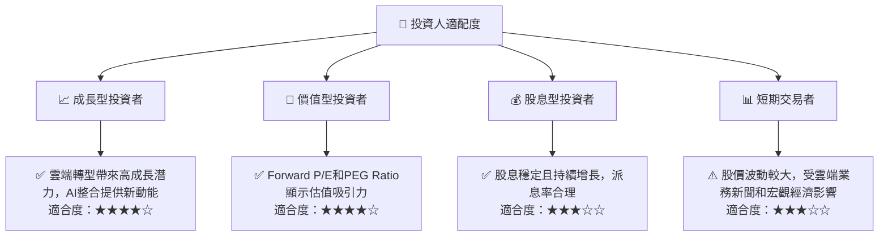
**投資人適配度分析**：
- **成長型投資者**：Oracle的雲端業務轉型和AI整合提供了強勁的成長潛力，適合尋求長期資本增值的成長型投資者。
- **價值型投資者**：其當前相對保守的估值（特別是Forward P/E和PEG Ratio）對於價值型投資者具有吸引力，尤其是在其成長潛力被低估的情況下。
- **股息型投資者**：Oracle擁有穩定的股息支付歷史，且股息持續增長，對於尋求穩定現金流的股息型投資者也有一定吸引力，儘管其股息收益率並非最高。
- **短期交易者**：由於公司處於轉型期，股價可能因財報、雲端業務進展和宏觀經濟因素而波動，短期交易機會存在，但風險也較高。

### 10.5 關鍵監控指標

| 監控類型 | 指標 | 關注點 | 頻率 |
|----------|------|--------|------|
| **營收成長** | 雲端服務營收 YoY 成長率 | OCI和SaaS業務的實際增長速度，尤其關注新訂單和續約率 | 季度 |
| **獲利能力** | 營業利益率 / 淨利率 | 雲端業務擴張對利潤率的影響，費用控制效率 | 季度 |
| **資本效率** | 自由現金流 (FCF) | 資本支出何時開始產生正向自由現金流，投資回報效率 | 季度/年度 |
| **財務健康** | Debt/EBITDA 比率 | 債務水平是否得到有效管理，利息覆蓋能力變化 | 季度 |
| **市場競爭** | OCI市場份額變化 | 與AWS、Azure、GCP等競爭對手的市場份額和客戶獲取情況 | 半年度/年度 |
| **技術創新** | AI產品發布和採用情況 | AI功能在各產品線的集成進度，客戶反饋和採用率 | 季度/半年度 |

---

> **免責聲明**：本報告為 AI 自動生成，僅供研究參考，不構成投資建議。投資有風險，入市需謹慎。